# 第二章。应用程序容器管理

在本课中，我们将扩展我们构建到多层设置中的一个容器。这将涉及到将应用程序分成不同的逻辑部分。例如，我们可以让一个应用程序在 Docker 容器上运行，并将应用程序的数据放在一个单独的数据库容器中；然而，两者应该作为一个单一的实体工作。为此，我们将使用 Docker 的工具来运行多容器应用程序。该工具的名称为`docker-compose`。总之，`docker-compose`是用于定义和运行多容器 Docker 应用程序的工具。

# 课程目标

本课结束时，您将能够:

*   获得多容器应用程序设置的概述
*   通过`docker-compose`文件和命令行界面工作
*   管理多个容器和分布式应用程序包
*   用`docker-compose`建立网络
*   处理和调试不同的应用层

# 码头工-堆肥工具

让我们先来看看什么是多容器设置，为什么它很重要，以及 Docker 如何使用工具`docker-compose`在这种情况下像魅力一样工作。

我们最近已经了解了应用程序是如何工作的，以及它们各自独立的元素:前端、后端和数据库。

要使用 Docker 运行这样的多层应用程序，需要运行以下命令来加速不同终端会话中的容器:

```
- docker run <front-end>
- docker run <back-end>
- docker run <database>
```

### 注

您可以使用(`-d`)作为分离运行`docker run`，以防止我们在单独的会话中运行这三个命令，例如:`docker run <front-end> -d`

也就是说，它甚至变得特别需要连接不同的容器(网络)。

`docker-compose`进来拯救这一天。我们可以从一个文件中定义和运行多个容器- `docker-compose.yml`。在以下主题中，我们将进一步讨论这一点。首先，让我们安装它。

## 安装坞站-化合物

如果您在*第 1 课*、*图像和容器中安装了 Docker，则* `docker-compose`很可能安装了 Docker。要确认这一点，请在您的终端中运行`docker-compose`。

如果该命令被识别，您应该有如下输出:

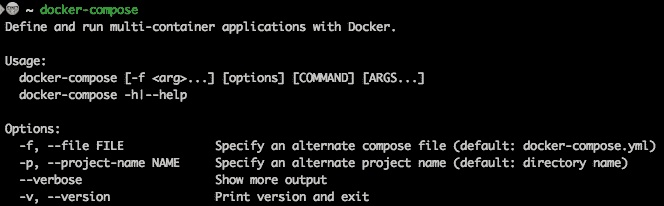

Windows 用户应该安装 Docker 社区版在旁边安装`docker-compose`。Docker 工具箱在其安装中包括`docker-compose`。

### 注

欲了解更多`docker-compose` 安装步骤，请查看位于:[https://docs.docker.com/compose/install/](https://docs.docker.com/compose/install/)的文档。

在这个问题上，请注意卸载它的各种方法。为了卸载该程序:

转到**程序和功能**。

查找 Docker，右键点击**卸载**。

# 多容器应用程序设置概述

在上一课中，我们介绍了码头工人和集装箱化。我们运行了示例 Python 和 JavaScript 脚本来演示如何将应用程序容器化以及如何构建图像。我们现在已经准备好运行一个超出这个范围的应用程序。

在 Dockerfile 中，每一行都描述一个层。Docker 中使用的联合文件系统允许不同的目录透明地重叠，形成一个单一的、一致的文件系统。基础层永远是你赖以建立的形象。每增加一行命令，比如 RUN、CMD 等等，就会增加一层。图层的好处是，只要图层没有被修改，就不会麻烦构建图像的那一部分。其次，当图像从 Docker 图像注册表中拉出时，它是分层拉出的，因此减轻了在图像拉出和推入过程中的连接中断等问题。

许多应用程序构建在一个共同的结构下:前端**，后端**，以及**数据库**。让我们进一步分解它，并了解如何设置它。

## 前端

当您打开一个 web 应用程序时，您看到的页面是前端的一部分。有时，前端有控制器(逻辑端)和视图层(哑端)。布局和内容(阅读、HTML 和 CSS)的样式是视图层。这里的内容由控制器管理。

控制器基于用户的动作和/或数据库的变化来影响视图层中呈现的内容。以推特这样的应用程序为例:如果有人跟踪你，你的数据就会发生变化。控制器将获得这一变化，并用新数量的追随者更新视图层。

## 后端

你可能听说过“模型-视图-控制器”这个术语。T3 模型位于应用程序中事物的后端。以推特为例，这个模型并不关心 HTML 或它的布局。它处理应用程序的状态:关注者和你关注的人的数量，推文，图像，视频，等等。

### 注

这是后端层包括的内容的总结。后端主要处理应用程序的逻辑。这包括操作数据库的代码；这意味着所有的查询都来自后端。然而，请求来自**前端**。例如，当用户单击按钮时，就会发生这种情况。

您可能还听说过“应用编程接口”这个术语。API 是代表**应用程序接口**的首字母缩写。这个也坐在后端。API 公开了应用程序的内部工作方式。

这意味着应用编程接口也可以是应用程序的后端或逻辑层。

让我们用推特的例子来说明这一点。诸如发布推文和搜索推文之类的操作可以很容易地作为方法存在于一个应用编程接口中，如果该应用编程接口被公开，则可以从任何前端应用程序调用这些方法。

### 注

Docker 和`docker-compose` CLIs 实际上是 API 调用，例如当与外部资源或内容交互时，比如 Docker Hub。

## 数据库

数据库包含易于访问、管理和更新的组织数据(信息)。我们有基于文件的数据库和基于服务器的数据库。

基于服务器的数据库包括运行的服务器进程，接受请求和读写数据库文件本身。例如，数据库可以在云中。

### 注

基于服务器的数据库托管在虚拟主机上，大多数托管在云平台上，如谷歌云平台和亚马逊网络服务。例如亚马逊 RDS 和谷歌云 SQL for PostgreSQL。

从以下链接获取基于服务器的数据库:

*   [https://aws.amazon.com/rds/postgresql/](https://aws.amazon.com/rds/postgresql/)
*   [https://cloud.google.com/sql/docs/postgres](https://cloud.google.com/sql/docs/postgres)

简而言之，开发总是涉及构建应用层，考虑到云平台的价格以及所涉及的开发和运营(简称 DevOps)，运输一直是一件麻烦事。

Docker 和`docker-compose`帮助我们将所有的应用程序组件作为一个捆绑包来管理，这样更便宜、更快、更容易管理。`docker-compose`帮助我们通过一个文件和非常简单的定义来协调所有的应用层。

在我们总结这个概述时，重要的是要知道，随着时间的推移，开发人员创造了不同的堆栈变体来总结他们应用程序的前端、后端和数据库结构。以下是它们的列表及其含义(在本课程中，我们不会深入探讨):

*   PREN -邮政总局，反应，快递，节点
*   平均值-蒙古数据库，快速，角度，节点
*   vpen-vuej、postgresdb、Express、Node.js
*   LAMP - Linux、Apache、MySQL、PHP

### 注

重要的是要知道应用程序是以这种方式构建的，以管理关注点的分离。

有了应用程序结构的知识，我们就可以进入`docker-compose` CLI，将这些知识运用到工作中。

## 使用坞站-化合物

使用`docker-compose`需要三个步骤:

1.  使用`Dockerfile`将应用程序的环境构建为图像。
2.  使用`docker-compose.yml`文件定义应用程序运行所需的服务。
3.  运行`docker-compose up`运行应用。

### 注

`docker-compose`是一个**命令行界面**就像 Docker CLI 一样。运行`docker-compose`给出了命令列表以及如何使用每个命令。

我们在上一课中浏览了图像，因此取消了步骤 1。

部分`docker-compose`版本与部分 Docker 版本不兼容。

我们将在步骤 2 上停留一段时间。

以下是`docker-compose`文件:

*   一个运行我们在上一课中创建的两个图像:

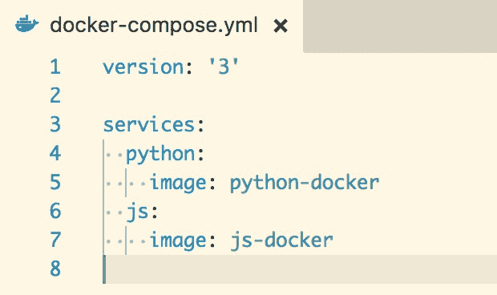

### 注

参考放置在`Code/Lesson-2/example-docker-compose.yml`的完整代码。

前往[https://goo.gl/11rwXV](https://goo.gl/11rwXV)进入密码。

### 对接器-组合第一次运行

1.  新建一个目录并命名`py-js`；如果您愿意，可以使用不同的目录名。
2.  在目录中创建新文件并命名为`docker-compose.yml`。复制上面图片的内容或者在示例- `docker-compose.yml`上分享的示例。
3.  从目录中运行命令`docker-compose up`。

注意运行`js-docker` 和`python-docker`的输出。这也是因为我们有上一课本地构建的两个图像。

如果您没有图像，运行`docker-compose up`将导致错误或试图从 Docker Hub 中提取它(如果它在线存在的话):

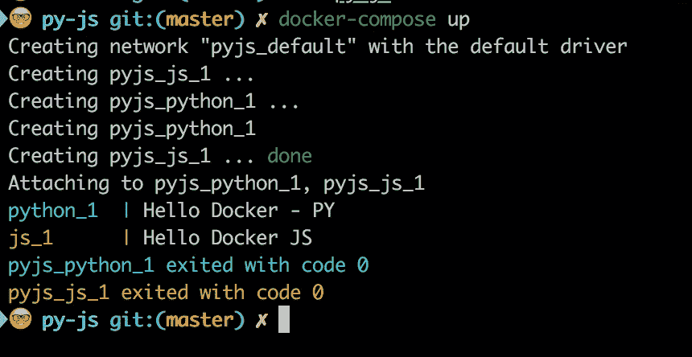

*   一个运行 **WordPress** 的`docker-compose.yml`。WordPress 是一个免费开放的源码**内容** **管理系统** **(CMS)** 基于 PHP 和 MySQL。

## 活动 1 —使用 docker-compose 运行 WordPress

让你熟悉运行`docker-compose`命令。

你被要求使用`docker-compose`建立一个 WordPress 网站。

1.  创建一个新目录并命名为`sandbox`。
2.  Create a new file and name it `docker-compose.yml.` Add the code in `wordpress-docker-compose.yml` or copy the following figure:

    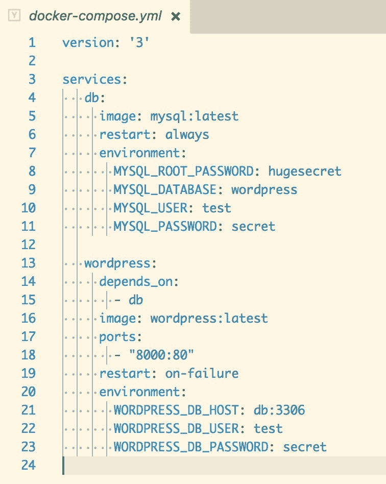

### 注

参考放置在`Code/Lesson-2/wordpress-docker-compose.yml`的完整代码。

前往[https://goo.gl/t7UGvy](https://goo.gl/t7UGvy)进入密码。

### 注

注意文件中的缩进。缩进行时，建议使用相等数量的制表符和空格。

在`sandbox` 目录下运行`docker-compose up`:

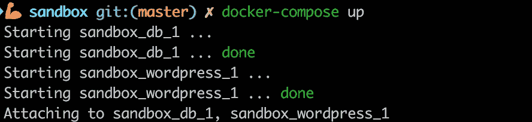

### 注

您会注意到，基于一个文件，我们有一个应用程序正在运行。这个例子是`docker-compose`力量的完美展示。

运行`docker ps`。您将看到容器正在运行:

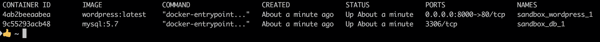

打开您的浏览器，进入地址:`http://0.0.0.0:8000/`。我们将准备好 WordPress 网站。

继续设置，一会儿，你就有了一个 WordPress 站点。

### 对接器-构成档案:对接器-构成. yml

`docker-compose.yml`是 YAML 文件。它定义了**服务、网络**和**卷**。

### 注

服务是应用程序容器定义，包括与应用程序相关的所有组件，例如**数据库、前端**或**后端**。定义服务时真正重要的是组件，即网络、卷和环境变量。

任意`docker-compose.yml`的第一行定义了`docker-compose` 文件格式的版本。

通过运行`docker -v`，您可以知道哪个 Docker 版本正在运行，从而知道将哪个版本放在文件的第一行。

对于`docker-compose`文件格式 1.0，第一行不是必须的。每个`docker-compose`文件都引入了一个新的配置或否决了一个更早的配置。

我们将使用 3.3 版本，程序应该与 3.0 及以上版本兼容。

确保每个人都在运行版本 3，并且至少有一个 1.13.0+的 Docker。

接下来是**服务**。让我们使用这个简化的骨架:

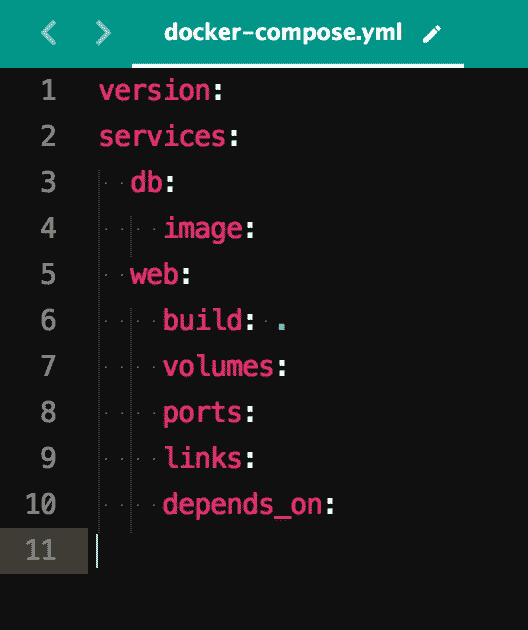

### 注

注意压痕。

在上面的例子中，我们有两个服务，即`db`和`web`。这两个只缩进一次。

定义服务后的下一行定义了映像或构建映像的 Dockerfile。

第 4 行将指定`db` 服务容器将从其运行的图像。我们前面提到了一些堆栈；`db`图像可以是任何基于服务器的数据库。

### 注

要确认您想要使用的堆栈是否存在，请运行以下命令:`docker search <image or name of your preferred stack` >(例如，`docker search mongo or docker search postgres`)。

第 6 行解释了web 服务映像将从相对于`docker-compose.yml`的位置(`.`)中的 Dockerfile 构建。

我们也可以在第 6 行定义 Dockerfile 的名称。`docker-compose`将搜索具有所列名称的文件，例如在`docker-compose.yml`中:

```
Line 5| web:build: Dockerfilevolumes:
```

第 7 行到第 10 行给出了 web 服务的更多定义。

正如我们用来构建和运行 WordPress 的`docker-compose.yml`所示，有两种服务:`db`和`wordpress`。在`docker ps,`的输出中，这些是容器名称:`sandbox_wordpress_1`和`sandbox_db_1`。

下划线前的第一个单词表示保存`docker-compose.yml`的目录的名称。容器名中的第二个词是服务名，如`docker-compose.yml`中所定义的。

我们将在下面的主题中进入更多的上下文。

### 坞站-复合 CLI

一安装`docker-compose`我就提到你运行`docker-compose`的时候会期待一个选项列表。奔跑`docker-compose –v`。

### 注

这两个命令，`docker-compose`和`docker-compose -v`是唯一可以从终端命令行或 Git bash 上打开的工作目录运行的命令。

否则，`docker-compose` 中的其他选项只在`docker-compose.yml` 文件存在的情况下运行。

让我们深入挖掘常见的命令:`docker-compose build`。

该命令在模板`docker-compose.ym`中构建`docker-compose line: (build: .)`中引用的图像。

建筑形象也可以通过`docker-compose up`命令实现。请注意，除非映像尚未构建，或者最近发生了影响要运行的容器的更改，否则这种情况不会发生。

### 注

该命令也适用于 WordPress 示例，即使两个服务都是从 Docker 注册表中的图像运行，而不是从目录中的 Docker 文件运行。这将是**拉**一个图像而**不构建**，因为我们是从 Dockerfile 构建的。

该命令列出了在`docker-compose.yml`中配置的服务:

*   `docker-compose config --services`

此命令列出创建的容器使用的图像:

*   `docker-compose images`

该命令列出了来自服务的日志:

*   `docker-compose logs`

`docker-compose logs <service>`列出特定服务的日志，例如`docker-compose logs db`。

该命令列出了基于`docker-compose`运行的容器:

*   `docker-compose ps`

注意，大多数情况下`docker-compose ps`和`docker ps`的结果是有区别的。没有在`docker-compose`上下文中运行的容器将不会被`docker-compose ps`命令显示。

此命令构建、创建、重新创建和运行服务:

*   `docker-compose up`

### 注

运行`docker-compose up`时，如果一个服务退出，整个命令退出。

运行`docker-compose up -d`是在分离模式下运行`docker-compose up`。也就是说，该命令将在后台运行。

## 活动 2 —分析摘要-撰写命令行界面

让你熟悉命令行界面。

您被要求演示运行两个容器所导致的变化的差异。

当还在 WordPress `docker-compose.yml`的目录中时——在我的例子中是沙盒——运行*活动 B-1* 的命令，然后是以下命令:

```
docker-compose up -d
docker-compose stop
docker-compose rm
docker-compose start
docker-compose up -d
docker-compose stop
docker-compose start
```

# 管理多个容器和分布式应用程序包

这是运行 Django 应用程序的`docker-compose.yml`。类似的应用可以在姜戈示例下的`docker-compose`文档中找到。

从以下网址下载 Django 示例:[ttps://docs . docker . com/compose/Django/](https://docs.docker.com/compose/django/):

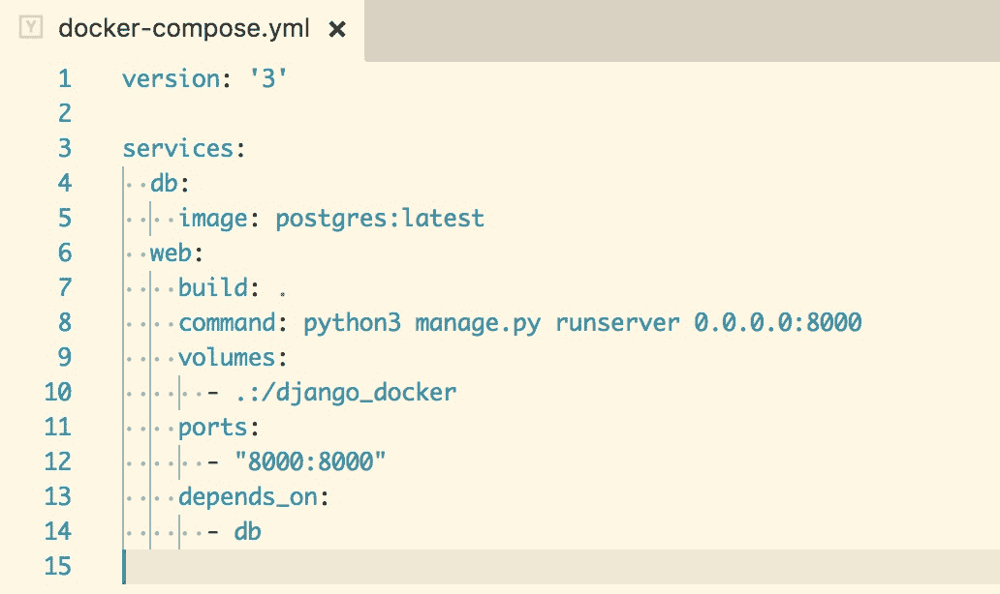

### 注

参考放置在`Code/Lesson-2/django-docker-compose.yml`的完整代码。

前往[https://goo.gl/H624J1](https://goo.gl/H624J1)进入密码。

## 改进码头工人工作流程

提供更多关于`docker-compose`如何参与以及它如何改进 Docker 工作流的上下文。

1.  创建一个新目录并命名为`django_docker`。
2.  在`django-docker`目录下，新建一个`docker-compose.yml`并添加上图或者提供的`django-docker-compose.yml`脚本中的信息。
3.  创建一个新的 Dockerfile，并在提供的 Dockerfile 脚本中添加内容。
4.  创建需求文件；只需复制提供的`django-requirements.txt`文件即可。
5.  向上运行`docker-compose`并观察日志。

请注意，我们可以用一个简单的命令 docker-compose 来旋转两个容器。

### 注

不需要以前与 Django 的经验；这是为了基本的演示目的。`Code/Lesson-2/django-requirements.txt`。

### **姜戈撰写文件分解**

首先，这个文件有多少服务？有，两个:`db`和`web`。服务`db`是基于波斯特格雷人的形象。服务网站是从包含此`docker-compose.yml`的同一目录中的 Dockerfile 构建的。

如果没有的`docker-compose`文件，`db`服务容器会以这样的方式运行:

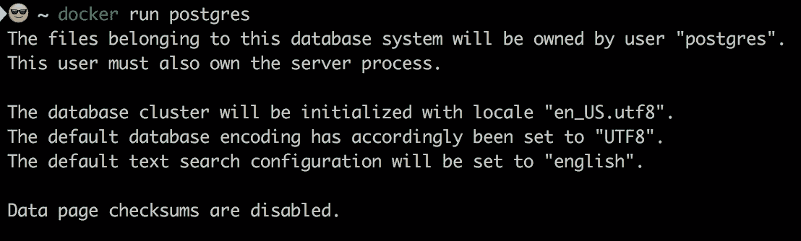

该命令被翻译为以下内容:


打开终端中的另一个标签或窗口并运行`docker ps`。你会看到集装箱在运转。

另一方面，根据示例的`web`服务容器将在以下步骤中运行:


第二个命令分解为以下格式:

```
docker run (the command)
          -p  shows the <workstation-port>:<container-port>   (8000:8000)
          -v: shows the <present-working-directory>  `pwd` <working-directory-in-container>  (:/django_docker)
          <docker image> (django-web)
          <command-to-run-when-the-container-starts> (python3 manage.py runserver 0.0.0.0.8000)
```

因此，上述命令被翻译为以下内容:

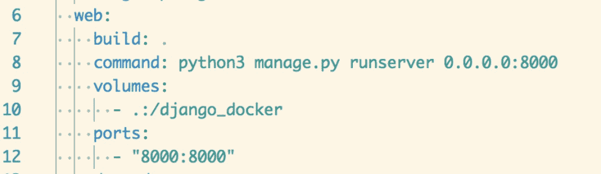

使用`docker-compose.yml`的一个优点是，您有一个命令来运行文件中包含的所有容器，而不是一次又一次地在终端中运行命令。

在上一课中，我们没有介绍卷和端口。我会花时间来帮助我们理解这一点。

### 使用卷忍受数据

卷是用来保存 Docker 容器生成和使用的数据。

### 注

卷将任何更新保存到本地文件或脚本中。这在容器侧产生了相等的变化。

在这种情况下，命令如下:


在主命令之后的 docker 运行选项中:

```
-v .:/django_docker
```

这在`docker-compose.yml` 文件中。


### 注

只要在`docker-compose`文件中定义了卷，当进行本地更改(如文件更新)时，更改将自动同步到容器中的文件。


### 港口

Django 和其他网络服务器一样，运行在特定的端口上。用于构建 Django 映像的 Dockerfile 有一个类似的命令:`EXPOSE 8000`。当容器运行时，该端口保持打开，并打开连接。

在 Django Dockerfile 中，我们将我们的端口定义为`8000`，并在号码前面加上一个地址`(0.0.0.0):`


数字`0.0.0.0` 定义运行容器的主机地址。

### 注

该地址告诉`docker-compose`在我们的机器上运行容器，或者，简而言之，在本地主机上运行容器。如果我们跳过地址，只公开端口，我们的设置会有意想不到的结果，就像一个空白页。

考虑`docker run`选项中的以下一行:

```
	-p 8000:8000
```


以及`do‑cker-compose.yml`中的以下几行:


`docker-compose`端口格式将本地工作站端口映射到集装箱端口。格式如下:

```
-p <workstation-port>:<container-port>
```

这允许我们从本地机器访问从容器端口映射的端口 8000。

最后还有一个选项`depends_on`，是专门针对`docker-compose.yml`的。`depends_on`规定了我们一运行`docker-compose`就旋转容器的顺序。

在我们的例子中，`depends_on`选项在 web 服务下。这意味着 web 服务容器依赖于`db`服务容器:


## 活动 3 —运行摘要器-编写文件

让你熟悉`docker-compose`语法和命令。

您已经被要求构建和运行一个简单的 Python 应用程序，该应用程序从图像`josephmuli/flask-app`中暴露端口 5000。定义一个`docker-compose`文件，并将 Postgres 映像扩展为数据库。确保数据库与应用程序相关。

1.  我已经预建了一个名为`josephmuli/flask-app`的图像。在您的`docker-compose.yml`文件中扩展此图像。
2.  确保编写版本 3 `docker-compose`并定义两个服务。
3.  在端口`5000`上运行应用程序。
4.  打开浏览器，检查监听端口。

# 与码头工人建立联系

默认情况下，`docker-compose`为您的应用程序设置单个网络，每个容器都可以到达该网络并发现其他容器。

网络根据其所在目录的名称来命名。因此，如果你的目录叫做`py_docker`，当你运行`docker-compose up`时，创建的网络叫做`py_docker_default`。

在创建 WordPress 容器时，我们在前面的主题中提到了端口。为了更好地解释网络，我们将使用用于启动 WordPress 应用程序的`docker-compose.yml`:


在这个文件中，我们有两个服务:`db`和`wordpress`。

在 WordPress 服务中，我们有`ports`选项将端口`80`映射到端口`8000`。难怪 WordPress 应用会在我们浏览器的`0.0.0.0:8000`上运行。

端口选项不在`db`服务中。然而，如果你去`docker hub page for mysql`你会注意到`3306`港暴露了。这是 MySQL 的标准端口。你可以从[https://hub.docker.com/r/library/mysql](https://hub.docker.com/r/library/mysql)获得更多关于 MySQL 的信息。

### 注

我们没有数据库的端口映射，因为我们不一定需要映射到我们计算机的端口；相反，我们希望 WordPress 应用程序映射到 DB 进行通信。

我们没有`db`的端口映射，因为我们不一定需要映射到本地工作站或计算机的端口。我们只需要将它暴露在容器环境中，这样它就可以从 web 服务连接起来，如第 23 行:`WORDPRESS_DB_HOST: db:3306`。

### 注

在`docker-compose`文件中，这是将一个容器连接到另一个容器的方式:

1.  请注意要连接的映像所暴露的端口。
2.  Reference the container under the service that is connecting to it; in our case, the `db` service is connected to by the WordPress service.

    由于我们将服务命名为`db`，因此我们将此连接称为`db:3306`。

    因此，格式是由`service>`暴露出来的`<service>:<port`。

## 运行 WordPress 容器

提供更多关于容器如何连接、同步和通信的上下文。

在合成文件中，您注意到重启选项了吗？此选项的可用值如下:

*   不
*   总是
*   接通故障
*   除非-停止

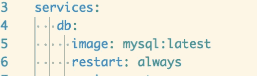

如果没有指定，默认为`no`。这意味着容器在任何情况下都不会重新启动。但是`db`服务在这里被指定为重启:总是，所以容器总是重启。

让我们看看姜戈的例子，看看网络是如何工作的。这就是`docker-c` `ompose.yml`:


很快，你可能在 WordPress 网站上看不到网络部分。这里有一个片段:

```
DATABASES = {
'default': {
'ENGINE': 'django.db.backends.postgresql',
'NAME': 'postgres',
'USER': 'postgres',
'HOST': 'db',
'PORT': 5432,
}
}
```

这里的问题是，我们怎么知道名字和用户是`postgres`，主机是`db`，端口是`5432`？

这些是我们运行的`postgres`图像和容器中设置的默认值。

为了更清楚，您可以在官方 Postgres Docker 库中查看这一行:

您可以从 GitHub 上的 https://github . com/docker-library/postgres/blob/master/10/docker-entry point . sh # l101 获取 postgres docker sample。

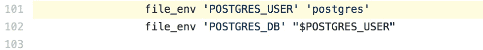

如前所述，主机是`DB`，因为服务名是通过运行`postgres`映像创建的`db`。

您可以从 GitHub 获取 Postgres Docker 示例，网址为:[https://GitHub . com/Docker-library/Postgres/blob/master/10/Docker file # L132:](https://github.com/docker-library/postgres/blob/master/10/Dockerfile#L132:)

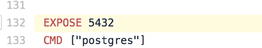

间接证明了为什么`settings.py`是这样配置的。

# 总结

在本课中，我们完成了以下工作:

*   讨论并展示了多容器设置
*   浏览`docker-compose`命令，以并行方式构建和运行多个容器
*   对网络容器以及如何从本地机器将数据保存在容器中有了深入的了解
*   通过 Docker Hub 构建和运行应用程序，甚至无需设置它们