# 三、编排和交付

创建 Docker 主机集群的主要动机是为高可用性进行设计。大多数(如果不是全部的话)集群和编排工具，如 Docker Swarm 和 Kubernetes，通过创建主从关系来利用集群。这确保了在环境中任何一个节点发生故障时，总有一个节点可以依靠。将集群部署到云提供商时，您可以利用多种技术来确保您的环境高度可用，例如 Consul，还可以通过在单独的可用性区域中部署主节点和节点来利用云的本机容错设计。

# 课程目标

本课结束时，您将能够:

*   获得DockerSwarm体模式的概述
*   使用 Docker 引擎创建一群 Docker 引擎
*   管理集群中的服务和应用
*   向上和向下扩展服务，以处理应用中的更多请求
*   负载平衡DockerSwarm部署
*   安全的 Docker 容器和部署

# 编排

在我们当地的环境中运行容器很容易，不需要我们付出很多努力；谈到云，我们需要一种不同的心态和工具来帮助我们实现这一目标。我们的环境应该是**高可用、容错**和**易扩展**。这种协调资源和/或容器的过程产生了一个整合的工作流，这就是流程编排。

首先，让我们熟悉一下在配器方面使用的一些术语:

*   `docker-engine`:这个指的是我们目前电脑上的 Docker 捆绑包或安装
*   `docker-machine`:帮助我们在虚拟主机上安装 Docker 的工具
*   `Virtual hosts`:这些是在物理主机下运行的虚拟服务器
*   `docker-swarm`:Docker 的聚类工具
*   `docker host`:设置或安装了 Docker 的主机或服务器
*   `Node`:连接到Swarm集群的 Docker 主机
*   `Cluster`:一组Docker 主机或节点
*   `Replica`:一个实例的一个副本或多个副本
*   `Task`:在节点上运行的定义的操作
*   `Service`:一组任务

### 注

以下是本课中最常见的术语:

*   `docker-engine`:在我们的电脑上运行 Docker
*   `docker-machine`:帮助我们安装 Docker 的工具或 CLI
*   `Virtual hosts`:运行在物理主机上的主机或服务器。
*   `docker-swarm:`一个用于Docker的聚类工具
*   `Docker host`:任何运行 Docker 的服务器或主机
*   `Node`:这个指的是绑定到Swarm集群的任何主机。
*   `Cluster`:一组被管理和被控制的主机。
*   `Replica`:各种任务的其他运行主机的副本
*   `Task`:安装、升级或移除等操作。
*   `Service`:多个任务定义一个服务。

现在我们至少熟悉了上面的术语，我们准备使用`docker-machine`实现一个 Docker Swarm 编排流。

# DockerSwarm体概述

DockerSwarm是Docker容器的一个聚类工具。它允许你建立和管理一个集群的Docker**节点**作为一个单一**虚拟系统**。这意味着我们可以在计算机的多个主机上运行 Docker。

我们通过主要处理和**控制**容器的管理器来控制集群。使用群管理器，您可以创建一个主管理器实例和多个**副本**实例，以防主管理器出现故障。这意味着群中可以有多个经理！

### 注

群是从一个管理器节点创建的，其他 Docker 机器作为工作者节点或管理器节点加入集群。

集群很重要，因为它创建了一组提供冗余的协作系统，创造了一个容错环境。例如，如果一个或多个节点发生故障，Docker Swarm 将故障转移到另一个工作节点。

**群管理器** 执行以下角色:

*   接受`docker`命令
*   对集群执行命令
*   支持高可用性；部署一个主实例和一个辅助实例，在主实例出现故障时可以接管

Docker Swarm 使用**调度**来优化资源并确保环境中的效率。它**将容器**分配给最合适的**节点**。这意味着 Docker Swarm 会将容器分配给最健康的节点。

### 注

请记住，节点是运行 Docker 的**主机，而不是**容器。****

可以将 Swarm 配置为使用以下任何一种调度策略:

*   **随机**:将新容器部署到随机节点。
*   **展开** : Swarm 将新容器部署到容器数量最少的节点。
*   **Binpack**:Binpack 策略包括将新容器部署到容器数量最多的节点。

你可以在[https://www.virtualbox.org/wiki/Downloads](https://www.virtualbox.org/wiki/Downloads)下载 VirtualBox:

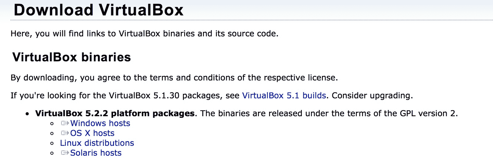

### 注

要模拟一个 Docker Swarm 集群，我们需要在本地安装一个虚拟机管理程序(虚拟机管理程序类型 2 是作为软件应用安装在现有操作系统上的虚拟机管理程序)，在本例中是 VirtualBox，这将允许我们通过`docker-machine`在本地创建多个运行 Docker 的主机，然后将它们添加到 Swarm 集群中。部署到云供应商时，这是使用他们的计算服务实现的，例如 AWS 上的 EC2。

对于 Windows 操作系统，选择您的操作系统发行版，您应该可以立即下载。运行可执行文件并安装 VirtualBox。

# 使用 Docker 引擎创建群

在我们创建我们的蜂群之前，让我们快速了解一下`docker-machine cli`。在你的终端上输入`docker-machine`应该会给你这个输出:

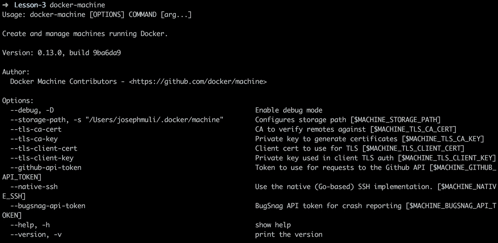

就在下面，我们有我们的命令列表:

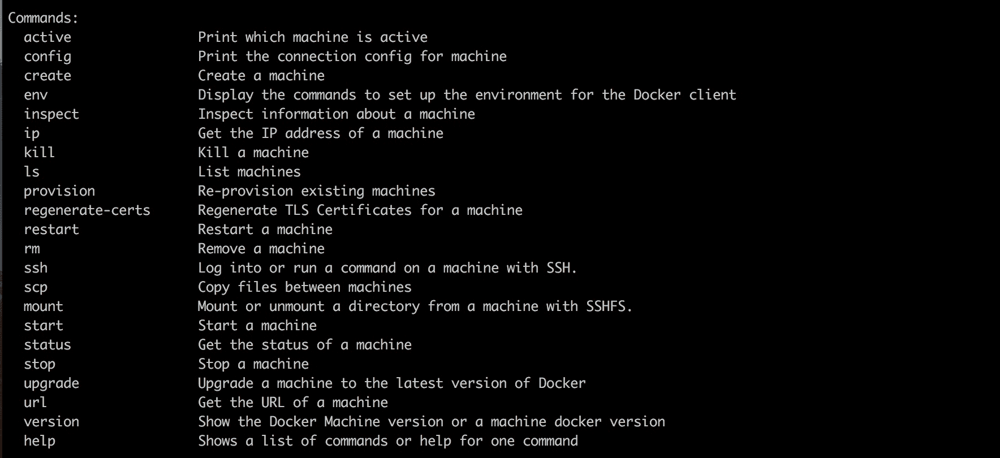

### 注

当你需要澄清一些事情的时候，记得一定要使用`help`选项，也就是`docker-machine stop --help`

为了创建我们的第一个 Docker Swarm 集群，我们将首先使用`docker-machine`来创建我们的经理和工人节点。

在创建第一台机器之前，快速浏览一下我们的目标，我们会得到以下信息:我们将有四台Docker机器、一名经理和三名工人；它们都运行在 VirtualBox 上，因此有四个**虚拟机**。

## 创建Docker机器

该命令是用来创建一个新的虚拟 Docker 主机:

```
docker-machine create --driver <driver> <machine_name>

```

这意味着我们的 Docker 主机将在 **VirtualBox** 上运行，但由`docker-machine`管理和控制。`--driver`选项指定创建机器的驱动程序。在这种情况下，我们的驱动程序是 **VirtualBox** 。

我们的命令是`docker-machine create --driver virtualbox manager1`。

### 注

我们在命令中需要驱动程序，因为这是我们主机的基础，这意味着我们的`manager1`机器将作为虚拟主机在 VirtualBox 上运行。不同的供应商提供了多种驱动程序，但这是用于演示目的的最佳驱动程序。

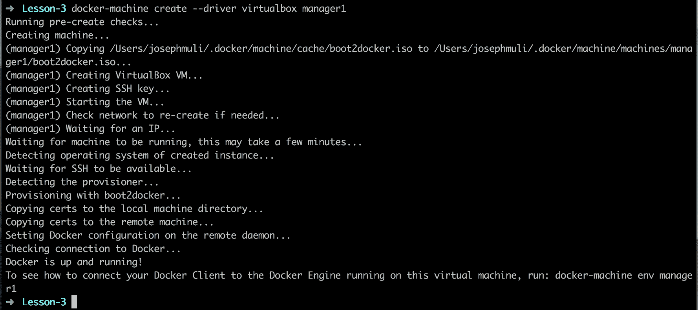

## 列出创建的机器

该命令将提供当前在您的主机上的所有 Docker 机器的列表和更多信息，例如机器的状态、驱动程序等:`docker-machine ls`

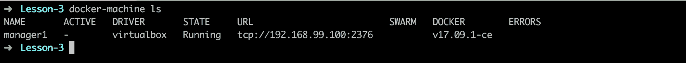

### 注

列出我们的机器非常重要，因为它为我们提供了机器状态的更新。我们并没有真正得到错误的通知，这有时会导致一个致命的事件。在机器上做一些工作之前，这将给出一个简短的概述。通过`docker-machine status`命令可以进行更详细的检查。

## 工人机器创建

我们将遵循相同的过程为我们的Swarm集群创建三个工人机器，换句话说，运行`docker-machine create --driver virtualbox <machine_name>`三次，在每次后续运行中将`worker1, worker2,`和 `worker3` 作为 `<machine_name>` 的值传递:


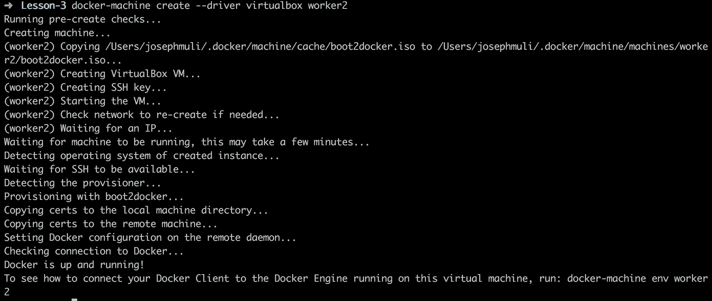

最后最后一个工作节点将显示如下:

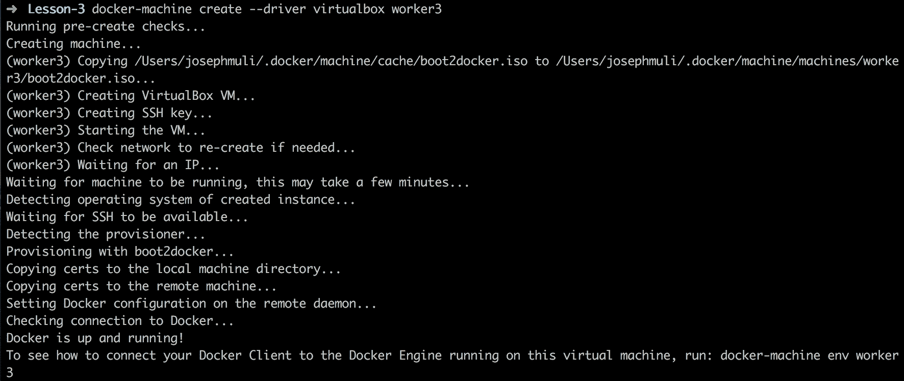

这样做之后，运行`docker-machine ls`，如果创建成功，您将看到类似如下的输出:

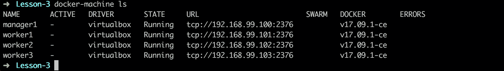

### 注

根据目的命名机器有助于我们避免对错误主机的意外调用。

## 初始化我们的蜂群

现在我们的机器已经开始运转，是时候创造我们的蜂群了。这将通过管理器节点`manager1`完成。以下是我们将采取的步骤，以实现一个成熟的群体:

1.  连接到管理器节点。
2.  将`manager1`节点声明为管理器，并公布其地址。
3.  获取节点加入群的邀请地址。

我们将使用`ssh` 进行连接。`ssh` 是用于访问或连接主机或服务器的安全网络协议。

### 注

Docker机器通过`docker-machine cli.` DockerSwarm作为服务运行来控制，该服务将所有Docker机器绑定在一起，并将它们统一在一个管理机器或节点下。这并不意味着集群中的机器在任何方面都是相同或相似的，它们都可能运行不同的服务或操作，例如，数据库主机和网络服务器。Docker Swarm 进来帮助编排主持人。

该命令用于获取一台或多台 Docker 机器的 IP 地址:

```
docker-machine ip <machine_names>

```

该命令用于获取一台或多台 Docker 机器的 IP 地址。`<machine_name>`是我们需要其 IP 地址的机器的名称。在我们的例子中，我们将使用它来获取`manager1`节点的 IP 地址，因为我们在初始化集群模式时需要它:


## 连接到机器

该命令用于使用`SSH:`登录机器

```
docker-machine ssh <machine_name>

```

成功连接到我们的`manager1`后，我们应该会得到如下输出:

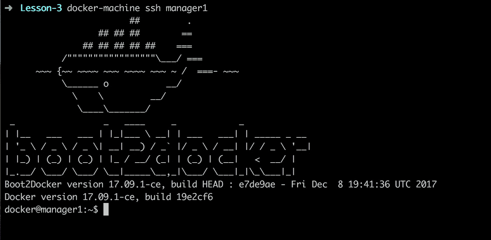

### 注

在云供应商上使用`ssh protocol`将需要通过用户名和密码或`ssh keys`进行认证和/或授权。我们不会深入讨论这个问题，因为这是一个演示。

## 初始化群体模式

以下是初始化集群模式的命令:

```
docker swarm init --advertise-addr <MANAGER_IP>

```

让我们在管理器节点中运行这个命令来初始化一个群。`advertise-addr` 选项用于指定将向群的其他成员通告的地址，以便进行应用编程接口访问和联网。

在这种情况下，它的值是`manager IP address`，它的值是我们之前运行`docker-machine ip manager1`得到的:

### 注

我们之前提到 Docker Swarm 是一个通过管理器节点绑定和编排所有机器的服务。为了实现这一点，Docker Swarm 让我们通过在`docker swarm init`命令中包含`advertise-addr`来通过管理器的地址通告集群。

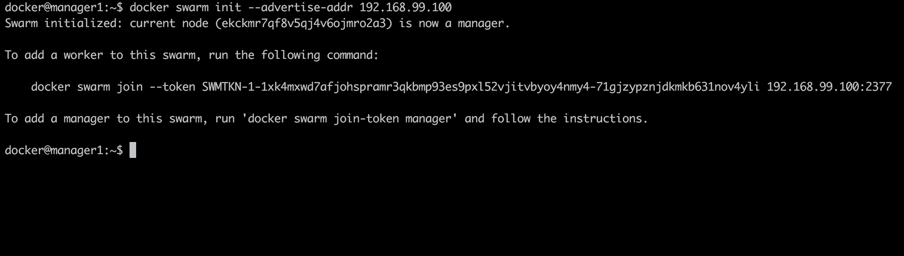

运行命令的输出显示我们的节点现在是一个管理器！

请注意，我们还有两个命令:一个应该允许我们邀请其他节点加入集群，另一个应该允许我们向集群添加另一个管理器。

### 注

在设计高可用性时，建议有多个管理器节点在主管理器节点出现故障时接管。

### 注

确保您保存输出中列出的两个命令，因为它们将有助于在群中添加其他主机。

## 向我们的群中添加工人

该命令是用来添加群工`:`

```
docker swarm join --token <provided_token> <manager_ip>:<port>

```

在我们可以将我们的工人添加到群中之前，我们需要通过`ssh.`连接到他们

我们通过运行`docker-machine ssh <node_name>`然后运行我们从`manager1 node.`获得的邀请命令来实现这一点

### 注

`docker-machine`命令可以从任何目录运行，并将始终与创建的机器一起工作。

首先，我们将使用`exit`命令退出管理器节点:

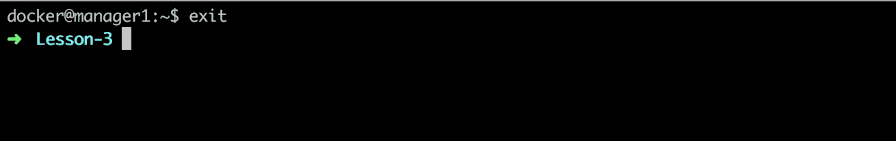

然后，我们通过`ssh`连接到一个工作节点:

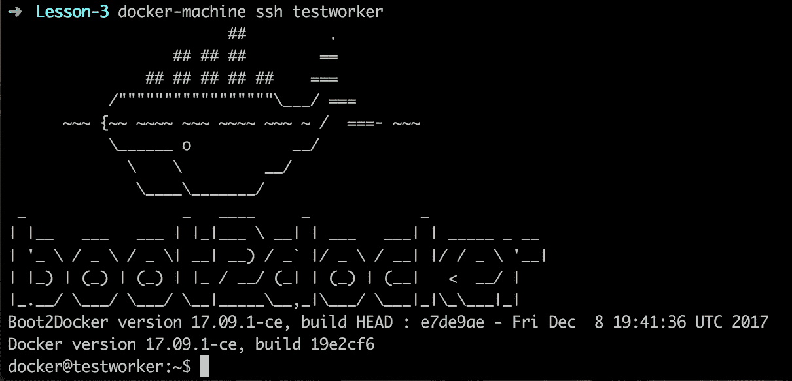

最后，我们将节点添加到集群中:

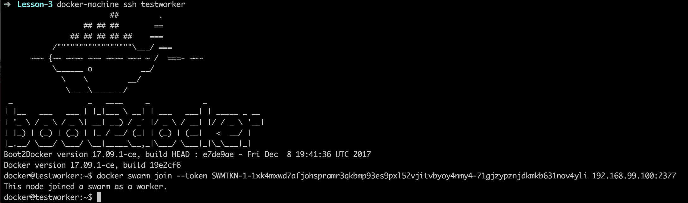

## 查看集群的状态

我们使用这个命令来查看集群的状态:

```
docker node ls
```

我们使用这个命令来查看集群的状态。该命令在管理器节点上运行，显示我们集群中的所有节点及其状态和可用性。在我们的管理器节点上运行它会显示类似于以下内容的输出:

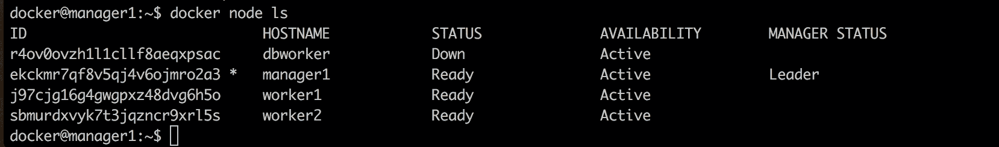

## 活动 1 —向集群添加节点

确保您有一个管理器节点和节点邀请命令。

让你熟悉`ssh`和集群管理。

您被要求连接到至少两个节点，并将它们添加到群集。

1.  `Ssh` into your first node:

    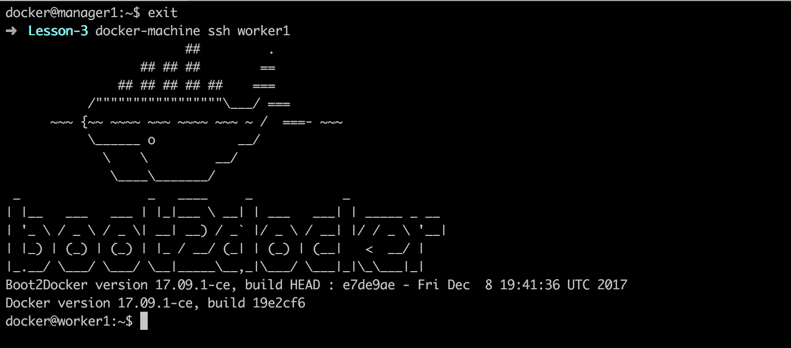

2.  Run the invite command on the node to join the cluster. Remember, we got this command when we first initialized our manager node:

    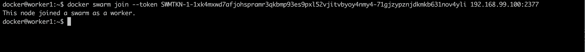

3.  Exit the node, `ssh` into another, and run the command:

    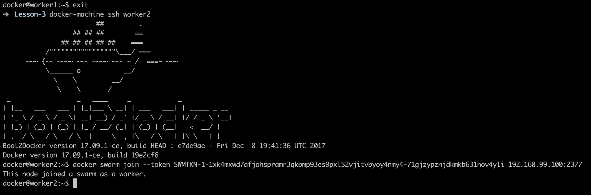

4.  `Ssh` into the manager node to check the cluster status through `docker node ls:`

    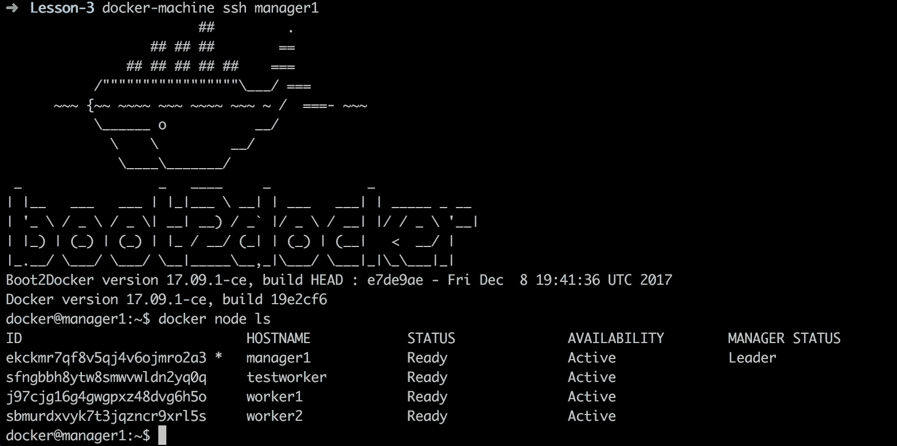

# 管理集群中的服务和应用

现在我们的集群已经准备好了，是时候在我们的集群上安排一些服务了。如前所述，管理器节点的作用是接受 Docker 命令并对集群应用它们。因此，我们将在管理器节点上创建服务。

### 注

在这一点上，人们在工作节点上真的无能为力，因为它们完全在管理器的控制之下。

## 创建服务

该命令用于创建服务:

```
docker service create --replicas <count> -p <host_port>:<container_port> --name <service_name> <image_name>

```

如前所述，我们对经理进行了调查。我们将使用上一课中构建的 WordPress 示例。由于我们已经在本地拥有了这个映像，因此从集线器中拉出它不会有任何麻烦。

我们的副本数量将为三个，因为我们当前有三个工作节点；通过运行`docker node ls`确认您的节点号。

### 注

我们不创建副本计数；这介绍了以下主题。`-p <host_port>:<container_port>`将在我们计算机定义的港口上建造的容器映射到容器港口。我们不需要有与我们的节点号相同数量的副本。其他节点可以处理不同的应用层，例如数据库:

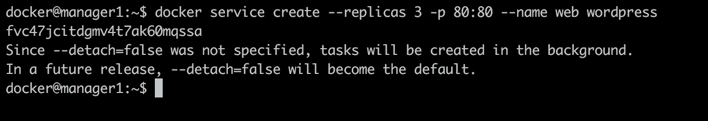

我们基于 WordPress 映像创建了一个网站，并将主机端口`80`映射到容器端口`80`。

## 挂牌服务

该命令用于查看当前运行的服务:

```
docker service ls
```

此命令用于查看当前运行的服务和更多信息，如副本、映像、端口等。

从下面的输出中，我们可以看到刚刚启动的服务和相关信息:

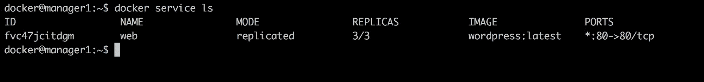

## 服务状态

此命令用于了解我们的服务是否正常运行:

```
docker service ps <service_name>
```

查看服务列表不会为我们提供所有需要的信息，例如我们的服务部署在哪些节点上。但是，我们可以了解我们的服务是否可以运行，以及遇到的错误(如果有的话)。当我们在我们的管理器上运行该程序时，我们会得到以下输出:

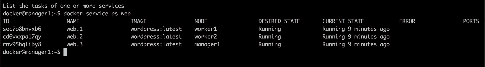

### 注

查看状态非常重要。当我们在节点上运行升级或更新时，运行`docker ps`会通知我们节点的状态。在理想的 Docker Swarm 设置中，当一个节点发生故障时，管理器会将流量重新分配给可用的节点，因此，除非监控可用，否则很难注意到停机时间。在使用节点之前，请始终运行该命令来检查节点的状态。

## 我们如何知道我们的站点正在运行？

我们可以通过在浏览器上打开任何工人的 IP 地址来验证 WordPress 是否正在运行:


以下是 WordPress 在我们浏览器上的显示截图:

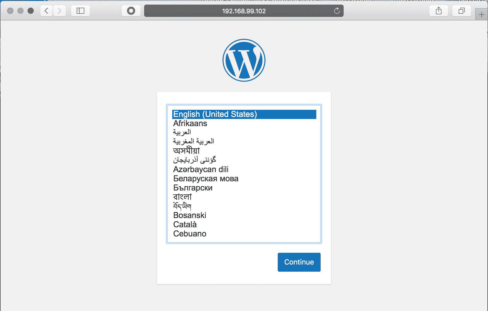

### 注

打开运行 WordPress web 服务的任何 IP 地址，包括管理器节点，都会打开相同的地址。

## 活动 2 —在群集上运行服务

确保有一个管理器节点正在运行。

让你熟悉群体中的服务管理。

您被要求向群中添加新的`postgres` 服务。

1.  Create a new node and name it `dbworker`:

    ```
    docker-machine create --driver virtualbox dbworker
    ```

    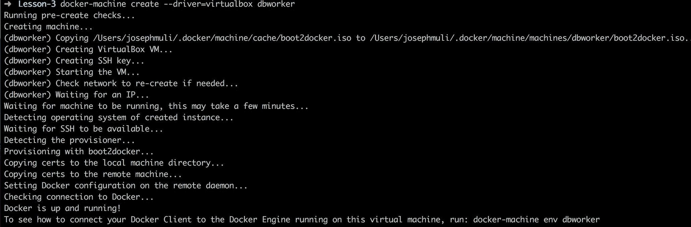

2.  Add the new worker to the swarm:

    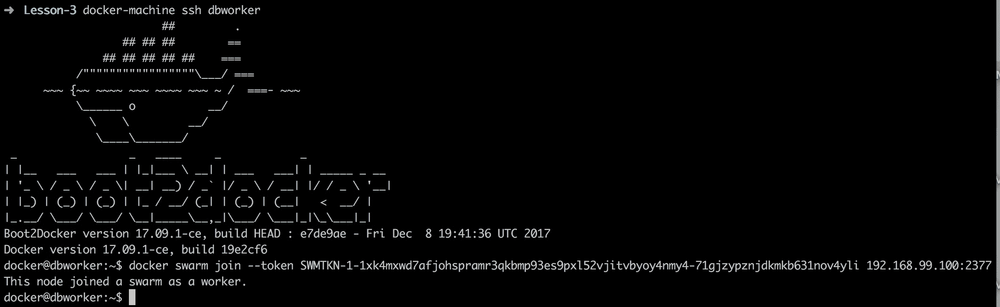

3.  Create a new database service and name it `db`, using the postgres image as the base:

    ```
    docker service create --replicas 1 --name db postgres
    ```

    下面是输出的截图:

    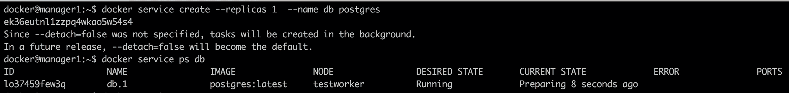

4.  通过以下步骤验证`postgres`正在运行:
    1.  Map the `postgres` container running in `dbworker node` to your computer:

        ```
        docker run --name db -e POSTGRES_PASSWORD=postgres -d -p 5432:5432 postgres

        ```

        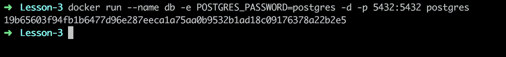

    2.  Run `docker ps` to list running containers; this should have our `postgres` container and the status should be `UP`:

        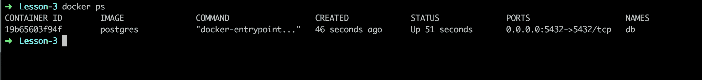

    3.  Exit and stop the container through the following:

        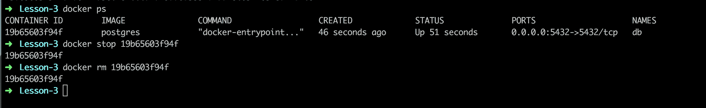

# 向上和向下扩展服务

随着进入应用的请求数量的增加或减少，将需要扩展基础架构。我们最近使用了运行我们制作的相同 WordPress 安装的节点副本。

### 注

这是生产级设置的一个非常基本的例子。理想情况下，我们需要更多的管理器节点和副本，但是由于我们正在运行一个演示，这就足够了。

扩展包括根据应用的流量增加和减少资源。

## 扩展我们的数据库服务

我们将扩展我们的数据库服务，作为如何扩展服务的一个例子。在现实场景中，诸如谷歌云平台和亚马逊网络服务之类的云服务可能定义了自动扩展服务，其中创建了多个副本，并通过被称为负载平衡的服务在副本之间分配流量。我们将在下一个活动中深入探讨这一点。首先，我们从基础了解缩放是如何工作的。缩放数据库的命令采用以下格式:

```
docker service scale <service_name>=<count>
```

要扩展服务，请输入我们在创建服务时提供的服务名称以及您想要增加的副本数量。

### 注

`--detach=false`允许我们查看复制进度。命令是`docker service scale <service_name>=<count>:`

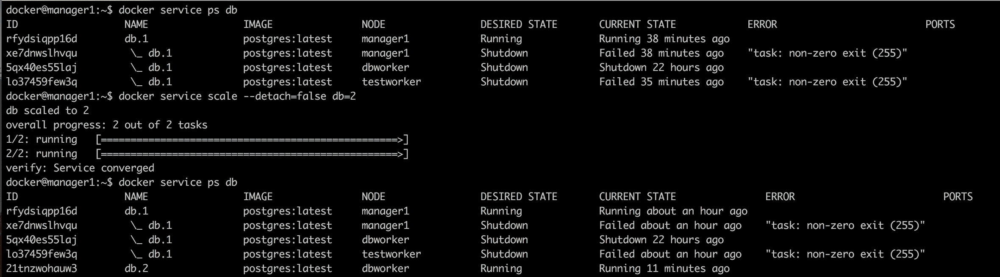

从上面的输出中，我们可以看到我们的`db`服务已经被复制了。我们现在有两个数据库服务在`dbworker`节点上运行。

## 【Swarm 如何知道在哪里安排服务？

我们之前介绍了调度模式；它们包括以下内容:

*   随意
*   传播
*   大包

Docker Swarm 的默认调度策略是`spread`，它为资源最少**的节点分配新的服务。**

 **### 注

如果群集中没有额外未分配的节点，您想要扩展的服务将在当前运行的节点上复制。

群管理器将使用传播策略并根据资源进行分配。

然后，我们可以使用`docker service ls`命令验证该操作是否确实成功，我们可以看到副本的数量是两个:

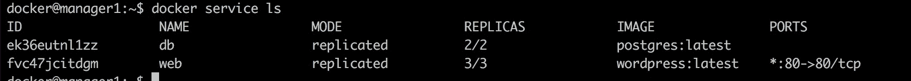

缩小与放大非常相似，只是我们传递的副本数量比以前少。从以下输出中，我们缩小到一个复制副本，并验证复制副本数量为 1:

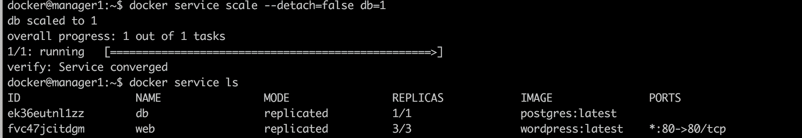

## 【Swarm 如何平衡副本之间的负载请求？

负载平衡器有助于处理和管理应用中的请求。在应用处理大量请求的情况下，可能在不到 5 分钟的时间内处理 1000 个请求，我们需要在应用上有多个副本和一个负载平衡器，特别是逻辑(后端)部分。负载平衡器有助于分发请求，防止实例过载，最终导致停机。

当在云平台上部署进行生产时，如**谷歌云平台**或**亚马逊网络服务**，您可以利用外部负载平衡器将请求路由到集群主机。

Docker Swarm 包括一个内置的路由服务，即使节点上没有运行任何服务，该服务也能使群中的每个节点接受到已发布端口的传入连接。`postgres` 服务默认使用端口`5432`。

## 活动 3 —在群集上扩展服务

确保你有一个至少有一个管理器、两个服务和三个工作者节点的群。

让您熟悉扩展服务和复制节点。

您被要求将 web 服务扩展到四个副本，将数据库服务扩展到两个副本。

1.  创建三个新的工作节点，两个用于 web 服务，一个用于数据库服务。
2.  连接到管理器节点并扩展 web 和数据库服务。
3.  使用 docker 服务确认服务副本计数；最终结果应该如下:
    *   WordPress 网络服务应该有两个副本计数
    *   Postgres 数据库服务应该有四个副本计数

# 总结

在本课中，我们完成了以下工作:

*   谈到了编排，并提到了几个示例工具
*   讨论了集群及其重要性，尤其是在生产级设置中
*   通过在 VirtualBox 上运行 Docker Machines 了解虚拟主机
*   浏览 Docker Swarm 以及如何创建和管理节点集群
*   引入了示例服务，包括运行在我们的群上的 Wordpress
*   获得了与`docker-machine cli`一起工作的高级理解
*   谈到了负载平衡以及 docker swarm manager 如何做到这一点

祝贺你到达终点线！这是我们从课程中学到的知识的摘要。

在本书中，我们讲述了以下内容:

*   谈及 DevOps 以及 Docker 如何为工作流程做出贡献
*   了解如何在 Dockerfiles 上创建应用模板
*   构建映像和容器，并将其推送到 Docker Hub
*   通过`docker-compose`管理的容器
*   了解了如何通过 Docker Swarm 编排我们的应用**