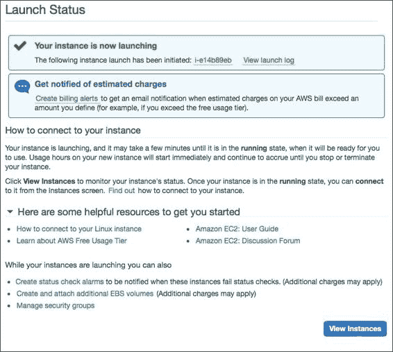
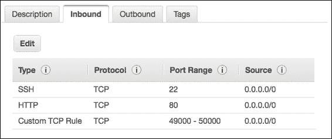
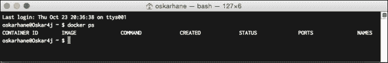
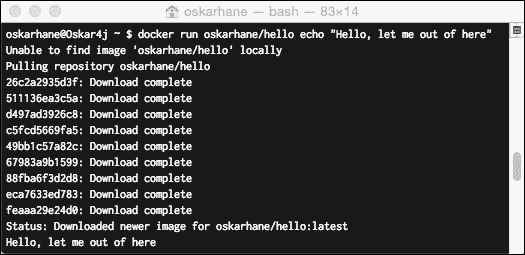

# 一、安装 Docker

在本章中，我们将了解在哪里下载以及如何在各种操作系统上安装 Docker。将使用一些基本的 Docker 命令，以便我们可以验证安装是否成功，并首次与 Docker 进行交互。

本章涵盖以下主题:

*   什么是 Docker？
*   Ubuntu trust 14.04 lt 上的 Docker
*   Mac OS X 上的 Docker
*   Windows 上的 Docker
*   亚马逊 EC2 上的 Docker

这本书将带您完成所有步骤，从安装 Docker 到运行您自己的**平台即服务** ( **PaaS** )这样您就可以推送您的代码，而不必考虑基础架构或服务器供应。

这本书的主题是使用一个独立的网络服务器和一个数据库创建一个模块化的网络应用。

# 什么是 Docker？

在 Docker 的网站上，[http://www.docker.com](http://www.docker.com)，为 Docker 提供了以下定义:

> *“Docker 是开发人员和系统管理员构建、发布和运行分布式应用的开放平台。”*

从更实际的意义上来说，这意味着 Docker 是一种将服务封装在隔离环境中的方式，称为**容器，这样就可以根据库和依赖关系将它们打包成所有它们需要的东西，并且开发人员可以确定无论 Docker 运行在哪里，服务都会运行。**

 **# Ubuntu trust 14.04 lt 上的 Docker

最容易安装 Docker 的操作系统、风格和版本在 Ubuntu Trusty 14.04 LTS。这个是一个相当快的任务，因为我们可以使用内置的包管理器`apt-get`。

### 注

请注意，Docker 在这里被称为`docker.io`，而在其他平台上只是`docker`，因为 Ubuntu(和 Debian)已经有了一个名为`docker`的包。

首先，我们打开一个终端，逐一执行这些命令:

```
sudo apt-get update
sudo apt-get install docker.io
source /etc/bash_completion.d/docker.io

```

在这里，我们首先更新包管理器`apt-get`的列表，以便获得关于所有可用包、版本和依赖关系的信息。下一行实际上安装了 Docker，之后，我们使 Ubuntu 能够 tab-complete 我们的 Docker 命令。

当你没有错误地完成这个操作时，运行`sudo docker.io version`来验证它是否如预期的那样工作。

### 注

请注意，这将安装最新发布的 Ubuntu 包版本，它可能不一定是最新发布的 Docker 版本。

为了从备用 Docker 维护的存储库中获得最新版本，我们可以执行以下命令:

```
curl -sSL https://get.docker.com/ubuntu/ | sudo sh

```

这添加了一个由 Docker 团队维护的替代存储库，并为您安装了 Docker，作为比通过 Ubuntu 存储库提供的版本更新得多的版本。请注意，以这种方式安装时，Docker 包被命名为`lxc-docker`。用于运行 Docker 命令的命令仍然是`docker`。

## 升级 Ubuntu Trusty 14.04 LTS 上的 Docker

要检查和下载升级，你所要做的就是在终端执行这个命令:

```
sudo apt-get update && sudo apt-get upgrade

```

## 用户权限

为了方便起见，最好将我们的用户添加到系统的 Docker 用户组中，这样我们就可以在不使用`sudo`的情况下控制 Docker。这给予我们的用户执行 Docker 命令的权限。

运行代码前，用您的用户名替换`USER`:

```
sudo gpasswd -a USER docker

```

您可能需要注销并再次登录才能正常工作。重新登录后，运行`docker ps`确认没有权限问题。

### 注

更多详细信息可在[https://docs.docker.com/installation/ubuntulinux/](https://docs.docker.com/installation/ubuntulinux/)官方安装指南中找到。

# MAC OS x 上的 Docker

为了能够在 Mac OS X 上使用 Docker，我们必须在虚拟机(VM)中运行 Docker 服务，因为 Docker 使用特定于 Linux 的特性来运行。我们不必害怕这一点，因为安装过程非常简单明了。

## 安装

有一个 OS X 安装程序可以安装我们需要的一切，那就是 VirtualBox、boot2docker 和 docker。

VirtualBox 是一个虚拟器，我们可以在其中运行轻量级 Linux 发行版，boot2docker 是一个完全在 RAM 中运行的虚拟机，占用的空间只有 27 MB 左右。

### 注

最新发布的版本的 OS X 安装程序可以在[https://github . com/boot 2 docker/OSX-installer/releases/latest](https://github.com/boot2docker/osx-installer/releases/latest)上找到。

现在，让我们看看如何通过以下步骤完成安装:

1.  Download the installer by clicking on the button named **Boot2Docker-1.3.0.pkg** to get the `.pkg` file, as shown in the following screenshot:

    

2.  双击下载的`.pkg`文件上的，进行安装过程。
3.  Open the **Finder** window and navigate to your `Applications` folder; locate **boot2docker** and double-click on it. A terminal window will open and issue a few commands, as shown here:

    

    这运行一个名为`boot2docker-vm`的 Linux 虚拟机，该虚拟机在 VirtualBox 中预装了 Docker。虚拟机中的 Docker 服务以守护程序(后台)模式运行，并且在 OS X 安装了 Docker 客户端，该客户端通过 Docker 远程 API 与虚拟机内部的 Docker 守护程序直接通信。

4.  You will see a screen similar to the following screenshot, which tells you to set some environment variables:

    

    我们打开`~/.bash_profile`文件，从我们的输出中粘贴三行，如下所示，在这个文件的末尾:

    ```
    export DOCKER_HOST=tcp://192.168.59.103:2376
    export.DOCKER_CERT_PATH=/Users/xxx/.boot2docker/certs/boot2docker-vm
    export DOCKER_TLS_VERIFY=1

    ```

    我们这样做的原因是为了让我们的 Docker 客户端知道在哪里可以找到 Docker 守护程序。如果以后想找 IP，可以通过执行`boot2docker ip`命令来实现。每次新的终端会话开始时，添加前面的行将设置这些变量。完成后，关闭终端窗口。然后，打开一个新窗口，键入`echo $DOCKER_HOST`以验证环境变量是否设置正确。您应该会看到您的引导 2 时钟虚拟机的 IP 和端口被打印出来。

5.  键入`docker version`以验证您可以使用 Docker 命令。类似于前面截图最后几行的输出将意味着我们成功了。

## 升级 Mac OS X 上的 Docker

由于 Docker 相对较新，每次更新都可能发生很多事情，因此请确保定期检查更新。不时去 Mac OS X 安装程序下载页面查看是否有升级可用。如果有，请执行以下命令进行更新:

```
boot2docker stop
boot2docker download
boot2docker start

```

# 窗口上的 Docker

就像我们在 OS X 安装 Docker 时必须安装一个 Linux 虚拟机一样，由于 Docker 构建的 Linux 内核特性，我们必须在 Windows 中做同样的事情才能运行 Docker。OS X 有一个本地的 Docker 客户端，它直接与虚拟机中的 Docker 守护程序通信，但是还没有一个适用于 Windows 的客户端。Docker 客户端的本机 Windows 版本即将推出，但在本书出版时，它还不可用。

## 安装

有一个 Windows 安装程序，安装我们运行 Docker 所需的一切。为此，请访问[。](https://github.com/boot2docker/windows-installer/releases/latest)

现在，让我们看看如何通过以下步骤来完成安装:

1.  Click on the **docker-install.exe** button to download the `.exe` file, as shown in the following screenshot:

    

2.  当下载完成后，运行下载的安装程序。完成安装过程，您将安装 VirtualBox、msysGit 和 boot2docker。
3.  转到您的`Program Files`文件夹，点击新安装的 boot2docker 开始使用 docker。如果系统提示您输入密码，只需按*进入*。
4.  键入`docker version`以验证您可以使用 Docker 命令。

## 升级 Windows 上的 Docker

一个新的软件经常变化，为了保持`boot2docker`更新，调用这些命令:

```
boot2docker stop
boot2docker download
boot2docker start

```

# 亚马逊 EC2 上的 Docker

在本书中，我将使用亚马逊 EC2 实例，由于它是托管您的 PAA 的绝佳场所，我将建议您也这样做。

**EC2** 代表 **E** 弹性 **C** 电脑 **C** 响亮，是基础设施类型的服务。亚马逊 EC2 提供虚拟服务器，订购后一分钟内即可创建并使用。

### 注

亚马逊有名为`t[x].micro`的实例，你可以每月免费使用 750 小时。你可以在[http://aws.amazon.com/free](http://aws.amazon.com/free)阅读更多关于他们的信息。

亚马逊有自己的名为 Amazon Linux AMI 的 Linux，可以用来运行 Docker。

## 安装

让我们看看如何通过以下步骤完成安装:

1.  Create an account at [http://aws.amazon.com](http://aws.amazon.com) and go to Amazon's **Create EC2 Instance Wizard** at [https://console.aws.amazon.com/ec2/v2/home?#LaunchInstanceWizard](https://console.aws.amazon.com/ec2/v2/home?#LaunchInstanceWizard).

    屏幕截图中显示了以下步骤:

    

2.  Click on **Community AMIs** in the menu on the left-hand side and select the latest `amzn-ami-pv`. Make sure that you select the `pv` version and not the `hvm` version so that you have a virtualization that is more stable and has less overhead, as shown here:

    

3.  When it's time to choose an instance type, you can choose **t1.micro** or **t2.micro** for now if they are available. The micro instances are very limited in their performance, but since they are available in the free usage tier in some regions and this is not for a live site at the moment, we can use them. Click on **Next: Configure Instance Details** and then click on the **Review and Launch** button, as shown in the following screenshot:

    

4.  在**汇总**页面验证所有细节，点击**启动实例**按钮。
5.  系统会提示您是使用现有的密钥对还是创建新的密钥对。如果这是您第一次创建亚马逊 EC2 实例，您将需要创建一个新的密钥对。这使得安全地连接到实例变得很容易。
6.  下载新的密钥对，将其移动到您的`~/.ssh/`文件夹，并移除。`txt`分机。
7.  It's also important to set the correct user permissions on the file or SSH will refuse to use it.

    在 Linux 或 Mac 上，终端命令是这样的:

    ```
    mv ~/Downloads/amz.pem.txt ~/.ssh/amz.pem
    chmod 600 ~/.ssh/amz.pem

    ```

    在 Windows 上，将密钥保存在任何地方，使用 PuTTYgen 等工具将其转换为`.ppk`文件，这样在使用 PuTTY 连接时就可以使用了。

8.  系统将提示您为实例选择一个安全组。选择作为默认服务器，因为它不是生产服务器。到了使用生产服务器的时候，我们可能希望给实例增加更多的安全性。
9.  Now we're up and running! Let's connect to it. Click on the **View Instances** button and select your newly created instance in the list, as shown here:

    

10.  在屏幕底部的中，您可以看到关于实例的一些信息。您应该在寻找公共域名系统信息。应该是这样的:

    ```
    ec2-54-187-234-27.us-west-2.compute.amazonaws.com

    ```

11.  On a Linux or Mac, open a terminal and connect to it:

    ```
    ssh ec2-user@ec2-54-187-234-27.us-west-2.compute.amazonaws.com -i ~/.ssh/amz.pem

    ```

    屏幕截图显示如下:

    

    我们使用`ec2-user`用户，这是亚马逊的 Linux 实例的默认用户，而`amz.pem`是我们之前下载的密钥。用上一步中的公共域名系统信息替换该网址。

    当因未知主机而询问是否继续时，键入`yes`。

    在 Windows 上，使用 PuTTY 并确保您已经在 PuTTY 身份验证选项卡中指定了步骤 4 中转换的私钥。

12.  连接到实例后，安装 Docker:

    ```
    sudo yum update
    sudo yum install -y docker
    sudo service docker start

    ```

13.  要测试它是否按预期工作，请键入`docker version`并确保没有错误。你应该看到一个几行的客户端版本，API 版本，等等。

## 开放港口

亚马逊的默认安全策略是阻止用于公开 Docker 服务的默认端口，所以我们必须改变这一点。

*   我们回到 EC2 仪表板，点击菜单中的**安全组**选项
*   选择您的 EC2 实例使用的安全组，并选择**入站**选项卡
*   Docker uses ports in a range from **49000 - 50000**, so we add a rule for this, as shown in the following screenshot:

    

## 升级亚马逊 EC2 上的 Docker

升级一个亚马逊 Linux AMI 实例就像升级 Ubuntu 一样简单。键入`sudo yum update`并确认是否有更新等待。此命令将列出所有可用的更新，并在您确认后安装它们。

## 用户权限

Docker 要求命令由`docker`用户组中的用户运行。为了方便起见，我们将用户添加到 Docker 组，这样我们就可以在不使用`sudo`的情况下控制 Docker:

```
sudo gpasswd -a ec2-user docker

```

您可能需要注销并再次登录才能正常工作。重新登录后，运行`docker ps`确认没有权限问题。您应该会看到一行大写的单词，例如**容器标识映像命令创建状态端口名称**。

## 显示你好世界

现在，我们让 Docker 在自己选择的机器上运行，是时候让 Docker 为我们工作了。这里有几个非常基本的命令，我们可以用来与 Docker 守护进程进行一些基本的交互。

在下一章中，将解释 Docker 中使用的所有概念和短语:

*   `docker ps`:此列出正在运行的容器
*   `docker ps -a`:这个列出了所有的容器，包括运行和退出的
*   `docker images`:这个列出了本地(下载的和本地创建的)映像
*   `docker run`:这个将从一个映像中启动一个新的实例容器
*   `docker stop`:这个是用来停容器的

我们来试试下面截图中的第一个:



不出所料，我们还没有运行任何东西。

发射一个容器就像`docker run [image] [command]`一样简单。如果映像在本地不存在，Docker 将从 Docker 注册表中心下载它，并在下载时启动您的容器。

以下步骤显示如下:



在终端输入以下命令，启动打印字符串的容器**你好，让我离开这里**然后退出:

```
docker run oskarhane/hello echo "Hello, let me out of here"

```

这不是很有用，但是我们只是在容器内部的 Ubuntu 中运行了一个命令。

如果我们再次输入`docker ps`，我们可以看到，自从我们退出刚刚开始的后，我们仍然没有运行的容器。试试用`docker ps -a`代替，试试`docker images`。

# 总结

在本章中，我们了解到 Docker 可以在大多数操作系统上使用，安装过程因操作系统而异。我们与 Docker 守护程序进行了第一次交互，并在 Docker 中启动了第一个容器。尽管容器所做的只是编写一个命令，但在客户操作系统中启动和运行某些东西是多么容易。

我们还介绍了展示这本书的主题，运行一个由 web 服务器容器和 MySQL 容器组成的多容器 web 应用:您自己的 PaaS。

在下一章中，我们将进一步探讨 Docker、它的术语以及它周围的社区。**