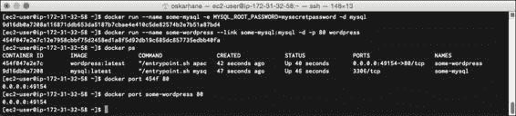
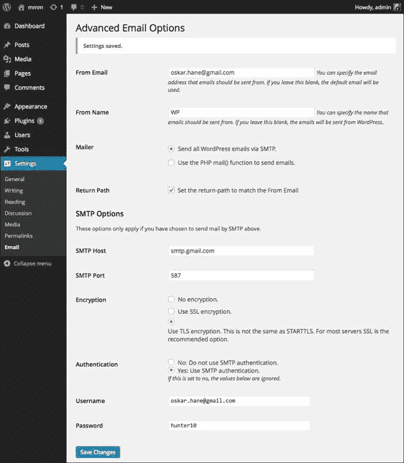
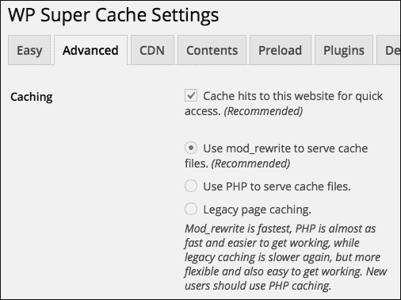
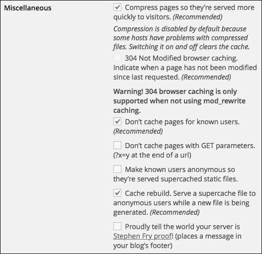
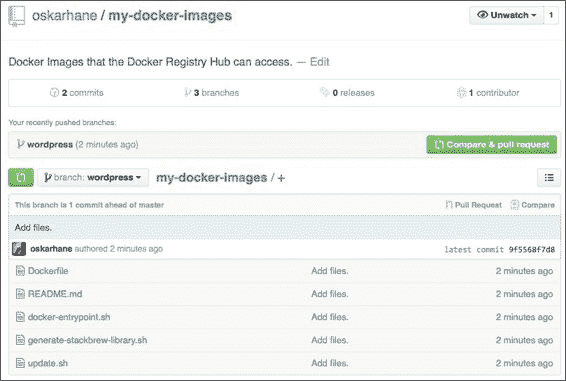

# 三、创建我们的第一个平台即服务映像

现在，您可以编写自己的 Docker 文件，将它们发布到 Docker 注册表中心，并为它们创建容器。在本章中，您将:

*   在别人的基础上建立自己的形象
*   在你的 GitHub 帐户中托管你的 Dockerfiles
*   在 Docker 注册表中心发布映像

# WordPress 映像

对于这个项目，我们将使用官方的 WordPress Docker 映像作为基础，它的 web 服务器是 Apache2。

### 注

如果您计划托管流量很大的网站，我建议使用基于 Nginx 的映像，而不是 Apache2 作为 web 服务器。我已经非常成功地用 Nginx 和 memcached 插件 WP-FFPC 运行了 WordPress 网站。设置起来可能有点棘手，这就是为什么它不在本书的讨论范围之内。

首先，让我们运行一个 MySQL 容器和一个 WordPress 容器，并链接到它们，看看会发生什么:

```
docker run --name some-mysql -e MYSQL_ROOT_PASSWORD=mysecretpassword -d mysql
docker run --name some-wordpress --link some-mysql:mysql -d -p 80 wordpress

```

`–p 80`选项告诉 Docker 将私有端口`80`暴露给外部世界。要找出哪个公共端口绑定到私有端口`80`，运行`docker ps`命令并查看端口列或调用`docker port <container-ID|name>` `80`命令。

截图如下所示:



在我的案例中，公共港口是 **49154** 。在你的网页浏览器中以`http://public_ip:public_port`的形式输入完整的网址。我在亚马逊 EC2 实例上做这个。我得到了一个公共领域，在我的例子中是`http://ec2-54-187-234-27.us-west-2.compute.amazonaws.com:49154`。

屏幕截图显示如下:


WordPress 安装页面欢迎我们，这意味着 WordPress 和 MySQL 容器工作正常。

# 从默认值转移

现在，我们在 Apache2 上运行了默认安装的 WordPress。一些 WordPress 插件要求你对网络服务器的配置进行修改。我们如何做到这一点？如果我们想编辑 WordPress 目录中的一些文件，该怎么办？

我们需要做的第一件事是获得我们自己的官方 WordPress 存储库的副本，这样我们就可以探索 Dockerfile 了。用于获取存储库的当前网址是[https://github.com/docker-library/wordpress](https://github.com/docker-library/wordpress)。从 Docker 注册表中心的 WordPress repo 页面点击此链接。

您可以克隆、分叉或下载 Docker 映像的源代码。你怎么得到它并不重要，因为我们以后不会用它了。此图片用于测试和探索目的。我用我的 EC2 实例来做这件事。


在任何文本编辑器中打开文件以查看其内容。如果你——和我一样——正在使用终端，可以使用`vi apache/Dockerfile`在`vi`文件编辑器中打开。官方 WordPress 映像的当前 Dockerfile 如下所示:

```
FROM php:5.6-apache

RUN a2enmod rewrite

# install the PHP extensions we need
RUN apt-get update && apt-get install -y libpng12-dev libjpeg-dev && rm -rf /var/lib/apt/lists/* \
 && docker-php-ext-configure gd --with-png-dir=/usr --with-jpeg-dir=/usr \
 && docker-php-ext-install gd
RUN docker-php-ext-install mysqli

VOLUME /var/www/html

ENV WORDPRESS_VERSION 4.1.1
ENV WORDPRESS_UPSTREAM_VERSION 4.1.1
ENV WORDPRESS_SHA1 15d38fe6c73121a20e63ccd8070153b89b2de6a9

# upstream tarballs include ./wordpress/ so this gives us /usr/src/wordpress
RUN curl -o wordpress.tar.gz -SL https://wordpress.org/wordpress-${WORDPRESS_UPSTREAM_VERSION}.tar.gz \
 && echo "$WORDPRESS_SHA1 *wordpress.tar.gz" | sha1sum -c - \
 && tar -xzf wordpress.tar.gz -C /usr/src/ \
 && rm wordpress.tar.gz

COPY docker-entrypoint.sh /entrypoint.sh

# grr, ENTRYPOINT resets CMD now
ENTRYPOINT ["/entrypoint.sh"]
CMD ["apache2-foreground"]

```

此图片以`php:5.6-apache`图片为基础，下载提取 WordPress 4.1 到`/usr/src/wordpress`。然后添加一个`ENTRYPOINT`并在前台启动 Apache2。

# 我们的目标

为了使这个 WordPress 映像不仅仅用于演示目的，我们需要以三种方式修改 Dockerfile。我们的目标如下:

*   准备 Apache 进行缓存(通过 WP 超级缓存插件)
*   提高 PHP 和 Apache2 中的上传限制
*   安装两个插件:WP 超级缓存和 WP 邮件 SMTP

## 准备缓存

通过 WP 超级缓存获取网站缓存需要执行两个小步骤——我们需要启用 Apache2 中的`mod_headers`和`mod_expires`模块。

在 Dockerfile 的第 5 行，可以看到`RUN a2enmod rewrite`。`a2enmod`命令启用 Apache2 中的模块，通过`a2dismod`命令禁用模块。启用我们想要的模块就像将它们附加到那一行一样简单:

```
RUN a2enmod rewrite expires headers

```

我们进行这些编辑，建立一个新的映像，看看会发生什么。构建这些映像需要很长时间，因为 PHP 是从源代码构建的。我们要找的是表明我们的模块已启用的行。在构建过程中，它们只会出现几秒钟。

您可以通过执行以下操作从 Dockerfile 启动构建:

```
docker build –t mod-wp .

```

`–t mod-wp`命令将我们新映像的名称设置为`mod-wp`。

截图如下图:


构建应该在没有任何错误的情况下贯穿整个过程，然后缓存插件的准备工作就完成了。

## 提高上传限制

默认上传大小被 PHP 限制为 2 MB。这个限制太低了，尤其是因为用手机写博客很受欢迎，手机照片或视频的大小通常比这个大。我想有直接在我的博客上传视频的选项，它们可以高达 32 MB。

要提高这个限制，我们需要改变 PHP 配置文件中两个参数的限制:`upload_max_filesize`和`post_max_size`。

查看 php:5.6-Apache 镜像，这是 WordPress 镜像的基础镜像，Dockerfile 我们看到它运行 Debian，PHP 配置文件应该在`/usr/local/etc/php/conf.d/`目录下。这意味着，如果我们向该目录添加一个文件，它应该被读入并解析。

### 注

PHP 5.6 的 Dockerfile 可以在[https://github . com/docker-library/PHP/blob/master/5.6/docker file](https://github.com/docker-library/php/blob/master/5.6/Dockerfile)找到。

为了验证上传限制是否像之前说的那么低，我启动并安装了一个未修改的 WordPress 容器。然后我点击了**添加新媒体**按钮。


上面说上传限制是 2 MB。

让我们在配置目录中添加一个名为`upload-limit.ini`的配置文件，并将这两个参数添加到文件中。

这些命令应该都在一行中，它们被添加到我们的 Dockerfile 中，就在我们在准备 Apache 进行缓存时修改的行的正上方:

```
RUN touch /usr/local/etc/php/conf.d/upload-limit.ini \
 && echo "upload_max_filesize = 32M" >> /usr/local/etc/php/conf.d/upload-limit.ini \
 && echo "post_max_size = 32M" >> /usr/local/etc/php/conf.d/upload-limit.ini
#Paste above this line.
RUN a2enmod rewrite expires headers

```

再次，构建映像以确保不产生错误。如果出现映像名称已经存在的错误，您可以使用`docker rmi mod-wp`命令删除旧映像或将名称更改为`mod-wp:latest`，这会将映像的标签更新为`latest`。

当构建完成时，我们从新的映像中运行一个新的容器来检查 WordPress 管理界面所说的内容。我们可以用我们的新映像运行一个容器，如下所示:

```
docker run --name some-mysql -e MYSQL_ROOT_PASSWORD=mysecretpassword -d mysql
docker run --name some-wordpress --link some-mysql:mysql -d -p 80 mod-wp:latest

```


我们现在可以看到我们可以上传更大的文件。只是为了验证一下，如果上传大于 2 MB 的文件，就证明限制提高了。

## 插件安装

在这里，我们将下载并安装两个插件，我们希望在我们所有未来的 WordPress 网站。这些插件的所有任务将在入口点文件中完成，因为我们必须在 WordPress 安装中编辑一些文件。

第一个插件是 WP 超级缓存。我们之前为此准备了 Apache2，现在是时候使用它了。有了这个插件，我们的网站将运行得更快，对主机的资源需求也更少。

第二个插件是 WP Mail SMTP，在它的帮助下 WordPress 可以发送外发的电子邮件。该容器不包括(也不应该包括)邮件服务器。有了这个插件，我们可以让 WordPress 通过外部 SMTP (Gmail、你的互联网服务提供商或其他任何东西)发送电子邮件。

### 注

尽管我已经托管和管理我自己的邮件服务器几年了，但保持它的最新状态以及管理垃圾邮件过滤器和冗余是一件麻烦的事情。我们最好把它留给专家。

所有插件将通过 CURL 下载，通过解压打开。CURL 已经安装好了，但是解压不是，所以我们必须把它添加到我们的 Dockerfile 中，靠近运行`apt-get install`命令的顶部:

```
RUN apt-get update && apt-get install -y unzip rsync && rm -r /var/lib/apt/lists/*
```

如果我们不这样做，我们将在构建过程中收到错误消息。

由于有两个插件我们必须下载、提取和激活，我们将在`docker-entrypoint.sh`文件中创建一个函数。

这个功能将进入 Wordpress 的插件网站，寻找最新版本插件的下载网址。它将下载并解压到我们 Wordpress 安装的插件文件夹中:

```
dl_and_move_plugin() {
  name="$1"
  curl -O $(curl -i -s "https://wordpress.org/plugins/$name/" | egrep -o "https://downloads.wordpress.org/plugin/[^']+")
  unzip -o "$name".*.zip -d $(pwd)/wp-content/plugins
}
```

现在我们已经有了这个函数，我们可以在文件末尾附近添加这些行，就在上面写着`chown –R www-data:www-data ..`的行:

```
dl_and_move_plugin "wp-super-cache"
dl_and_move_plugin "wp-mail-smtp"

```

将函数和函数调用放在底部——在`docker-entrypoint.sh`文件中，就在`exec`命令的上方。

我们将再次构建映像并启动一个容器，这样我们就可以验证一切是否如我们所愿:

```
docker build –t mod-wp:latest

```

这需要一段时间，当它准备好的时候，你可以启动一个 MySQL 容器和一个`mod-wp`容器:

```
docker run --name some-mysql -e MYSQL_ROOT_PASSWORD=mysecretpassword -d mysql
docker run --name some-wordpress --link some-mysql:mysql -d -p 80 mod-wp:latest

```

如果您收到一条错误消息，告诉您已经有一个同名的容器，要么移除带有`docker rm some-wordpress`的旧容器，要么为新容器使用另一个名称。

通过调用`docker ps`获取端口，在 WordPress 容器上查找绑定到端口`80`的端口。然后将网址加载到你的浏览器中。这次安装 WordPress，登录，进入插件页面，如下图截图所示:


这看起来就像我们希望的那样！太好了。

让我们继续并激活并设置这些插件，只是为了验证它们是否工作。从 WP 邮件 SMTP 插件开始。我将使用我的 Gmail 帐户作为发件人，但您可以选择您想要的 SMTP。下面是 Gmail 的设置截图:



从本页底部，您可以发送一封测试电子邮件。我强烈建议这样做，因为 Gmail 有时会阻止新的 SMTP 客户端。如果你收到一条错误消息说**请通过你的网络浏览器登录，然后再次尝试**，你已经触发了。在这种情况下，你很快就会收到一封来自谷歌的电子邮件，解释可疑的活动，并要求你通过几个步骤来使其工作。这很烦人，但这是件好事。

现在让我们进入 WP 超级缓存插件。从插件页面激活插件。在启用之前，我们必须转到**设置** | **永久链接**，检查**帖子名称**按钮，然后保存。

然后转到**设置** | **WP 超级缓存**。

点击上的**缓存，然后点击**更新状态**。现在点击**高级**选项卡，启用**mod _ 重写缓存**，如图所示:**



向下滚动至**杂项**部分，勾选如下截图所示的框。如果你想知道所有这些复选框的确切作用，你可以参考插件的文档。



保存后，您会在顶部看到一条通知，说您需要更新重写规则，如图所示:


向下滚动页面，点击**更新 Mod _ 重写规则**按钮更新重写规则，如图所示:


缓存插件的状态现在应该是绿色的，所有的设置都应该完成了。由于我们已经登录到这个网络浏览器，我们将不会收到缓存页面。知道这一点很重要，它的好处是你不必仅仅为了查看你网站的未缓存版本而禁用整个缓存插件。打开另一个网络浏览器(不仅仅是当前浏览器中的另一个窗口或选项卡，除非您使用的是匿名或私人模式)并转到您的 WordPress 实例。点击帖子上的**你好世界**标题。回到起始页。再次点击标题。感觉挺快的对吧？

要验证它是否有效，您可以在浏览器中打开开发工具。确保当开发工具打开时，浏览器中没有禁用缓存。点击**网络**选项卡上的，然后再次点击帖子的标题，然后检查该呼叫，如下图截图所示:


这正是我们想要看到的。太好了。

# 让我们的改变持续下去

现在我们已经做出了我们的改变，我们想要创建我们自己的 Dockerfile 来构建在官方 WordPress 映像之上。

Dockerfile 应该是这样的:

```
FROM wordpress:latest
RUN apt-get update && apt-get install -y unzip && rm -r /var/lib/apt/lists/*
RUN touch /usr/local/etc/php/conf.d/upload-limit.ini \
 && echo "upload_max_filesize = 32M" >> /usr/local/etc/php/conf.d/upload-limit.ini \
 && echo "post_max_size = 32M" >> /usr/local/etc/php/conf.d/upload-limit.ini
RUN a2enmod expires headers
VOLUME /var/www/html
COPY docker-entrypoint.sh /entrypoint.sh
ENTRYPOINT ["/entrypoint.sh"]
CMD ["apache2", "-DFOREGROUND"]

```

# 在 GitHub 上托管映像源

Docker 注册表中心非常支持从位桶和 GitHub 自动获取映像更新。你可以随便挑但是对于这本书，我会用 GitHub。这两项服务我都有账户，而且都很好。


在 GitHub，创建一个名为`my-docker-images`的新的空存储库，如果你愿意的话，添加一个合适的许可证。

### 注

这本书不会讨论如何将 SSH 密钥添加到 GitHub 等等。这个网上有优秀指南。GitHub 在[https://help.github.com/articles/generating-ssh-keys/](https://help.github.com/articles/generating-ssh-keys/)有一个很棒的向导。

让我们创建一个分支，并将修改后的 Docker 映像的文件复制到其中。

在本地克隆存储库，以便您可以向其中添加文件。确保你不在你的`wordpress-master`目录内，但是在同一个层次上:

```
git clone git@github.com:yourusername/my-docker-images.git

```

该命令的输出如下:


我们将逐一执行这些命令:

```
cd my-docker-images
git checkout -b wordpress
git add .
git commit –m "Adding new files."
git push origin wordpress

```

转到你的 GitHub 页面，试着找到 WordPress 分支。

对于我们想要在 Docker 注册表中心创建和发布的每个新 Docker 映像，我们需要在这个 GitHub 存储库中创建一个新的分支。如果你有很多 Docker 映像，并且映像有很多版本，你可能想考虑一个不同的结构，但是对于这本书来说，这种方法会很棒！



所有文件都已就位，您可以点击它们来验证内容是否符合我们的预期。

# 在 Docker 注册中心发布映像

如果您不是 Docker 注册表中心([https://hub.docker.com](https://hub.docker.com)的成员，现在是注册的时候了，这样您就可以在公共 Docker 存储库中发布您的映像，该存储库可以从任何地方访问。

## 自动化构建

当添加存储库时，您应该选择**自动构建**选项，以便您可以从 GitHub(或 Bitbucket)获取代码，如下图所示:


我们将连接我们的 GitHub 帐户，并选择我们刚刚创建并推送到`my-docker-images`的存储库。

我们将开始添加我们的 WordPress 映像，所以让我们在下一个屏幕上将存储库名称设置为`wordpress`。请务必正确输入此名称，因为它以后无法更改。

此时，我们将只为我们的映像使用一个标签——最新的**标签。确保来源:**类型**设置为**分支**，并输入`wordpress` 作为其名称。**

 **选择将此添加为公共存储库，并选中**激活的**复选框。这意味着，如果您在 GitHub 上对此推送任何更新，注册表 Hub 将自动将其拉出并发布其更改，如下图所示:


注册中心现在将拉你的分支，并试图建立你的 Docker 映像，以验证它的工作。您可以前往**构建细节**选项卡查看进度。由于这是官方的 WordPress 映像库，如果他们在构建服务器上缓存映像，速度应该会很快。如果没有，可能需要几分钟，因为 PHP 是从源代码编译的。

这显示在下面的截图中:


哇哦！我们刚刚在 Docker 注册表中心发布了一个映像，这意味着任何人都可以在其上获取和运行容器。图片发布后，状态将从**建筑**变为**完成**。

下一步将是我们自己实际拉动它，以验证它是否如预期那样工作:

```
docker pull oskarhane/wordpress
docker images
docker run --name mysql -e MYSQL_ROOT_PASSWORD=mysecretpassword -d mysql
docker run --name my-wordpress --link mysql:mysql -d -p 80 oskarhane/wordpress
docker ps
```

打开你的网络浏览器，前往你的新容器。您应该会看到 WordPress 设置页面。

# 总结

在这一章里，你学到了很多。大部分是关于修改 Dockerfile 和`ENTRYPOINT`文件，以便获得我们想要的 Docker 映像。Bash 知识和编程技巧非常方便，但由于所有这些大多是关于安装、移动文件和编辑设置文件，非常基础的知识就足够了。

GitHub 是托管 Docker 存储库的绝佳场所，并且很容易建立一个新的存储库来开始。Docker 注册中心接收你的 GitHub 库，让你选择一个分支。该分支将成为任何人都可以获取和使用的公共 Docker 映像的来源。

然而，一个问题出现了；我们的数据呢？它被困在这些 MySQL 和 WordPress 容器中。下一章将向您展示如何处理您的数据。**