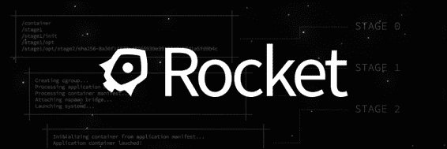

# 八、下一步是什么？

到目前为止，我们已经在单个主机上运行了我们的 PaaS，如果我们需要横向扩展，这可能是一个问题。这个空间发生了很多事情，我选择了几个项目，我将在本章中介绍。这些项目在成熟程度上有很大不同，一个已经准备好用于生产，而另一个处于原型状态。在本章中，我们将涵盖以下主题:

*   什么是十二因素应用？
*   弗林
*   Deis
*   火箭
*   编排工具

# 什么是十二因素应用？

事实上，今天的许多应用都是你在网络浏览器中运行的网络应用。Gmail、Slack、Wunderlist、Trello 等等都是网络应用或者软件即服务。

正是这类应用适合在平台即服务上运行。

十二因素应用是一种构建软件即服务应用的方法，满足以下标准:

*   使用声明性格式来设置自动化，并最小化加入项目的新开发人员的时间和成本
*   与底层操作系统有一个清晰的契约，在执行环境之间提供最大的可移植性
*   适合在现代云平台上部署，无需服务器和系统管理
*   最大限度地减少开发和生产之间的差异，支持持续部署以获得最大的敏捷性
*   在不显著改变工具、架构或开发实践的情况下进行扩展

十二因素定义如下:

*   **代码库**(一个代码库在修订控制中被跟踪，许多被部署):这将你的代码放在一个版本控制系统中，比如 Git。
*   **依赖关系**(明确声明并隔离依赖关系):这将在一个地方列出你的应用依赖的所有库的所有版本。
*   **配置**(将配置存储在环境中):由于配置会因环境而异，例如用户名或传递给数据库，所以它不应该是代码的一部分。您可以在环境变量中设置配置文件，并让您的应用在运行时读入它们。
*   **支持服务**(将支持服务视为附加资源):这些服务拥有所有支持服务，如邮件服务器、数据库和缓存系统等。这些将被一个网址端点引用。这样，您的代码就不必关心支持服务是在同一台机器上运行还是在世界各地运行。
*   **构建、发布、运行**(严格分开构建和运行阶段):构建阶段创建捆绑包、资产和二进制文件。这是开发者的工作。当您将一个包放在服务器上时，您可以通过启动应用并使其在服务器上可用来进入运行阶段。这个阶段应该尽可能简单，这样任何人都可以做到。
*   **进程**(将应用作为一个或多个无状态进程执行):如本书前面所述，你应该将你的应用数据与你的应用服务分开，也就是说，它使服务无状态。所有状态都应该在共享存储和数据库中。
*   **端口绑定**(通过端口绑定导出服务):一个例子是后备服务；您的服务应该可以通过网址端点访问。
*   **并发**(通过流程模型横向扩展):这将每个流程保持为独立的服务。这样，您可以只缩放应用中真正需要缩放的部分。
*   **可处理性**(通过快速启动和优雅关闭来最大化健壮性):这个是针对应用启动的，应该很快，你的应用应该能够自己从崩溃中恢复。
*   **开发/生产奇偶校验**(保持开发、试运行和生产尽可能相似):这使您的开发环境和设置尽可能与您的生产环境和设置相同。Docker 在这方面确实很出色。
*   **日志**(将日志视为事件流):将应用的错误日志放在一个中心位置，当出现新错误时，您会收到通知。
*   **管理流程**(一次性运行管理/管理任务):如果您是在执行管理任务，请在生产环境中具有最新代码库的机器上运行它们。您应该直接对数据库运行查询。

我鼓励你去 http://12factor.net 阅读更多关于 T2 十二因素的内容。这是一本好书；您将了解为什么在以下项目中做出了一些设计决策。

# 弗林

创造多库的杰夫·林赛也是弗林的合作者。Flynn 就像一个超级 Dokku，它让你在多台主机上运行你的 PaaS。

> *“弗林是两件事:*
> 
> *开箱即用的组件分布为公司提供了一个合理的起点，用于运行其应用和服务的内部平台。*
> 
> *独立项目集合的旗帜，这些项目共同组成了构建分布式系统的工具包或松散框架。*
> 
> *弗林既是一个整体，也是很多部分，看什么对你最有用。共同的目标是使构建分布式系统的多年经验和最佳实践民主化。运营商和开发者之间的软件层让他们的生活变得更加轻松。”*

我尝试过几次使用 Flynn，但我总是再次回到使用 Dokku，因为我发现 Dokku 更容易使用，并且我的客户端不需要多主机 PaaS 等额外功能。

URL: [http://flynn.io](http://flynn.io)

状态:这不适合在生产环境中使用，因为它处于测试阶段。

# des

Deis 建立在轻量级 Linux 发行版上，该发行版被构建为运行名为 CoreOS 的容器，并建立在 Docker 上，以利用那里可用的分布式服务，如 etcd。

> *“Deis 是一个轻量级应用平台，它将十二因素应用作为 Docker 容器部署和扩展到 CoreOS 机器集群中。”*

我发现 Deis 是一个非常有前途的项目，并希望与它合作更多。我几乎没碰过它，但我目前看到的看起来不错。

Deis 可以使用 Docker 部署在 Linux 上运行的任何语言或框架，它还包括针对 Ruby、Python、Node.js、Java、Clojure、Scala、Play、PHP、Perl、Dart 和 Go 的 Heroku 构建包。

工作流类似于 Heroku，您只需要部署十二因素应用，也就是说，将应用状态保存在后备服务中。

**趣事** : Deis 在经济上支持/支持 Dokku。

**URL**:[http://deis . io](http://deis.io)

**状态** : Deis 是准备从 1.0 版本开始生产。

# 火箭

CoreOS 一直是运行多主机 Docker PaaS 最流行的方式之一。他们已经完成了出色的工作，并且已经构建了一些多宿主 PaaS 工具，比如 Deis，它们使用 CoreOS 工具和服务来交付他们版本的 PaaS。

2014 年 12 月，CoreOS 团队决定宣布自己的容器运行时:Rocket。火箭是最初 Docker 的直接竞争对手。他们发射火箭的原因是因为他们认为 Docker 已经失去了最初的想法:运行可重用的标准容器。CoreOS 团队认为，Docker 正在远离最初的想法，围绕 Docker 环境添加越来越多的特性和服务。

> *“Rocket 是一个新的容器运行时，为可组合性、安全性和速度而设计。今天，我们将在 GitHub 上发布一个原型版本，开始从我们的社区收集反馈，并解释我们为什么要构建 Rocket。”*

根据 CoreOS 团队的说法，他们将继续让 CoreOS 成为运行 Docker 的完美工具。我想我们会看到未来会发生什么，但我希望他们会遵守诺言。

**URL**:[https://github . com/coreos/rocket](https://github.com/coreos/rocket)

**状态**:火箭处于非常早期的状态，还没有准备好生产。

# 编排工具

我现在介绍的工具将帮助您专注于代码，并为您提供一种将应用部署到生产中的简单方法。如果您对编排工具(一种帮助您管理容器集群的工具)更感兴趣，也有一些这样的工具。目前想到的工具有谷歌的 Kubernetes、Apache Mesos/Marathon、CoreOS Fleet 以及即将从 Docker 发布的 Swarm。

# 总结

当您觉得是时候将您的 PaaS 从单个主机转移到跨多个主机扩展时，这些工具就是您应该寻找的。我相信未来会出现一些有价值的竞争对手，因为这是一个热门领域。