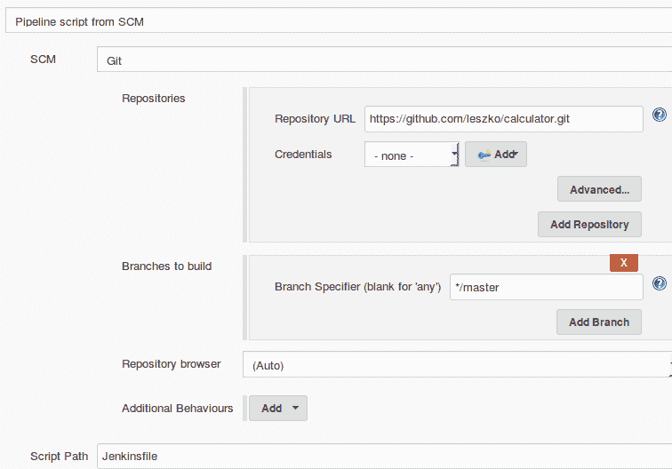
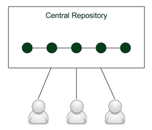
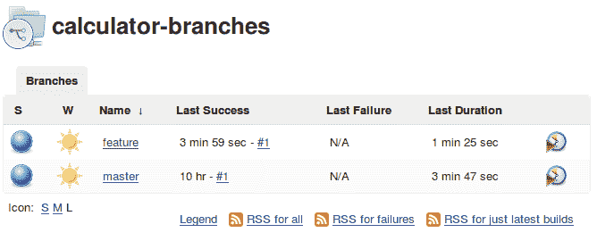

# 四、持续集成管道

我们已经知道如何配置 Jenkins。在这一章中，您将看到如何有效地使用它，重点是 Jenkins 的核心功能，管道。通过从头开始构建一个完整的持续集成过程，我们将描述现代面向团队的代码开发的所有方面。

本章包括以下几点:

*   解释流水线的概念
*   介绍 Jenkins 管道语法
*   创建持续集成管道
*   解释 Jenkins 文件的想法
*   创建代码质量检查
*   添加管道触发器和通知
*   解释开发工作流程和分支策略
*   介绍 Jenkins 多牧场

# 引入管道

管道是一系列自动化操作，通常代表软件交付和质量保证过程的一部分。它可以简单地看作是一系列脚本，提供了以下额外的好处:

*   **操作分组**:操作被分组到阶段(也称为**门**或**质量门**)中，将结构引入到流程中，并明确定义规则:如果一个阶段失败，则不再执行下一个阶段
*   **可见性**:流程的各个方面都是可视化的，有助于快速进行故障分析，促进团队协作
*   **反馈**:团队成员一有问题就了解，反应快

The concept of pipelining is similar for most Continuous Integration tools, however, the naming can differ. In this book, we stick to the Jenkins terminology.

# 管道结构

Jenkins 管道由两种元素组成:阶段和步骤。下图显示了它们的使用方法:


以下是基本的管道元素:

*   **步骤**:单个操作(告诉 Jenkins 做什么，例如，从存储库中签出代码，执行脚本)
*   **阶段**:步骤的逻辑分离(对概念上不同的步骤序列进行分组，例如，**构建、测试、**和**部署**)，用于可视化 Jenkins 管道进度

Technically, it's possible to create parallel steps; however, it's better to treat it as an exception when really needed for optimization purposes.

# 多阶段 Hello World

例如，让我们扩展`Hello World`管道以包含两个阶段:

```
pipeline {
     agent any
     stages {
          stage('First Stage') {
               steps {
                    echo 'Step 1\. Hello World'
               }
          }
          stage('Second Stage') {
               steps {
                    echo 'Step 2\. Second time Hello'
                    echo 'Step 3\. Third time Hello'
               }
          }
     }
}
```

管道在环境方面没有特殊要求(任何从代理)，它在两个阶段内执行三个步骤。当我们单击立即构建时，我们应该会看到可视化表示:


管道成功了，我们可以通过点击控制台查看步骤执行细节。如果任何步骤失败，处理将停止，并且不会运行进一步的步骤。实际上，管道的全部原因是防止所有进一步的步骤被执行，并可视化故障点。

# 管道语法

我们已经讨论了管道元素，并且已经使用了一些管道步骤，例如`echo`。我们还可以在管道定义中使用哪些操作？

In this book, we use the declarative syntax that is recommended for all new projects. The different options are Groovy-based DSL and (prior to Jenkins 2) XML (created via the web interface).

声明性语法旨在使理解管道变得尽可能简单，即使不是每天编写代码的人也是如此。这就是为什么语法只限于最重要的关键词。

让我们准备一个实验，在描述所有细节之前，阅读下面的管道定义，并尝试猜测它的功能:

```
pipeline {
     agent any
     triggers { cron('* * * * *') }
     options { timeout(time: 5) }
     parameters { 
          booleanParam(name: 'DEBUG_BUILD', defaultValue: true, 
          description: 'Is it the debug build?') 
     }
     stages {
          stage('Example') {
               environment { NAME = 'Rafal' }
               when { expression { return params.DEBUG_BUILD } } 
               steps {
                    echo "Hello from $NAME"
                    script {
                         def browsers = ['chrome', 'firefox']
                         for (int i = 0; i < browsers.size(); ++i) {
                              echo "Testing the ${browsers[i]} browser."
                         }
                    }
               }
          }
     }
     post { always { echo 'I will always say Hello again!' } }
}
```

希望管道没有吓到你。相当复杂。实际上，它非常复杂，包含了所有可能的 Jenkins 指令。为了解答这个实验难题，让我们看看流水线是如何一条条指令地进行操作的:

1.  使用任何可用的代理。
2.  每分钟自动执行。
3.  如果执行时间超过 5 分钟，则停止。
4.  开始前要求布尔输入参数。
5.  将`Rafal`设置为环境变量名称。
6.  仅在`true`输入参数的情况下:
    *   打印`Hello from Rafal`
    *   打印`Testing the chrome browser`
    *   打印`Testing the firefox browser`
7.  执行过程中如有错误，打印`I will always say Hello again!`。

让我们描述最重要的 Jenkins 关键词。声明性管道总是在`pipeline`块中指定，并包含部分、指令和步骤。我们将逐一介绍。

The complete pipeline syntax description can be found on the official Jenkins page at [https://jenkins.io/doc/book/pipeline/syntax/](https://jenkins.io/doc/book/pipeline/syntax/).

# 部分

部分定义了管道结构，通常包含一个或多个指令或步骤。它们由以下关键词定义:

*   **阶段**:这定义了一系列一个或多个阶段指令
*   **步骤**:这定义了一系列一个或多个步骤指令
*   **Post** :这定义了在管道构建结束时运行的一系列一个或多个步骤指令；标有条件(例如，始终、成功或失败)，通常用于在管道构建后发送通知(我们将在*触发器和通知*部分对此进行详细介绍。)

# 指令

指令表示管道或其部件的配置:

*   **代理**:指定执行发生的位置，并且可以定义`label`来匹配同等标记的代理，或者`docker`来指定一个容器，该容器被动态地提供来为管道执行提供环境
*   **触发器**:这定义了触发管道的自动化方式，并且可以使用`cron`设置基于时间的调度或`pollScm`检查存储库的更改(我们将在*触发器和通知*部分对此进行详细介绍)
*   **选项**:指定管道特定选项，如`timeout`(管道运行最长时间)或`retry`(管道故障后应重新运行的次数)
*   **环境**:这定义了一组在构建过程中用作环境变量的键值
*   **参数**:定义用户输入参数列表
*   **阶段**:这允许步骤的逻辑分组
*   **当**时:根据给定的条件决定是否执行该阶段

# 步伐

步骤是管道最基本的部分。他们定义要执行的操作，所以他们实际上告诉 Jenkins**该做什么**。

*   **sh** :执行 shell 命令；实际上，使用`sh`几乎可以定义任何操作
*   **自定义** : Jenkins 提供了很多可以作为步骤的操作(例如`echo`)；其中很多只是为了方便而使用的`sh`命令的包装器；插件也可以定义自己的操作
*   **脚本**:这执行了一段基于 Groovy 的代码，可以用于一些需要流量控制的非平凡场景

The complete specification of the available steps can be found at: [https://jenkins.io/doc/pipeline/steps/](https://jenkins.io/doc/pipeline/steps/).

请注意，管道语法在技术上非常通用，几乎可以用于任何自动化过程。这就是为什么管道应该被视为结构化和可视化的方法。然而，最常见的用例是实现连续集成服务器，我们将在下一节中讨论。

# 提交管道

最基本的连续集成过程称为提交管道。顾名思义，这个经典阶段从提交(或以 Git 形式推送)到主存储库开始，并产生一个关于构建成功或失败的报告。因为它在代码的每次更改之后运行，所以构建应该不超过 5 分钟，并且应该消耗合理数量的资源。提交阶段始终是持续交付过程的起点，它提供了开发过程中最重要的反馈周期，如果代码处于健康状态，它会提供持续的信息。

提交阶段的工作方式如下。开发人员将代码签入存储库，持续集成服务器检测到更改，构建开始。最基本的提交管道包含三个阶段:

*   **签出**:这个阶段从存储库中下载源代码
*   **编译**:这个阶段编译源代码
*   **单元测试**:这个阶段运行一套单元测试

让我们创建一个示例项目，看看如何实现提交管道。

This is an example of a pipeline for the project that uses technologies such as Git, Java, Gradle, and Spring Boot. Nevertheless, the same principles apply to any other technology.

# 检验

从存储库中签出代码始终是任何管道中的第一个操作。为了看到这一点，我们需要一个存储库。然后，我们将能够创建一个管道。

# 创建 GitHub 存储库

在 GitHub 服务器上创建存储库只需几个步骤:

1.  转到[https://github.com/](https://github.com/)页面。
2.  如果您还没有帐户，请创建一个帐户。
3.  单击新建存储库。
4.  给它起个名字，`calculator`。
5.  勾选使用自述文件初始化此存储库。
6.  单击创建存储库。

现在，您应该看到存储库的地址，例如，`https://github.com/leszko/calculator.git`。

# 创建结帐阶段

我们可以创建一个名为`calculator`的新管道，并且作为**管道脚本**，将代码放入一个名为 Checkout 的阶段:

```
pipeline {
     agent any
     stages {
          stage("Checkout") {
               steps {
                    git url: 'https://github.com/leszko/calculator.git'
               }
          }
     }
}
```

管道可以在任何代理上执行，它唯一的步骤就是从存储库中下载代码。我们可以点击立即构建，看看它是否成功执行。

Note that the Git toolkit needs to be installed on the node where the build is executed.

当我们结账的时候，我们已经准备好第二阶段了。

# 编制

为了编译项目，我们需要:

1.  用源代码创建一个项目。
2.  将其推送到存储库。
3.  将编译阶段添加到管道中。

# 创建一个 Java Spring Boot 项目

让我们使用 Gradle 构建的 Spring Boot 框架创建一个非常简单的 Java 项目。

Spring Boot is a Java framework that simplifies building enterprise applications. Gradle is a build automation system that is based on the concepts of Apache Maven.

创建 Spring Boot 项目的最简单方法是执行以下步骤:

1.  转到[http://start.spring.io/](http://start.spring.io/)页面。
2.  选择 Gradle 项目而不是 Maven 项目(如果您喜欢 Maven 而不是 Gradle，也可以离开 Maven)。
3.  填充组和工件(例如`com.leszko`和`calculator`)。
4.  将网站添加到依赖项。
5.  单击生成项目。
6.  生成的骨架项目要下载(即`calculator.zip`文件)。

以下截图显示了[http://start.spring.io/](http://start.spring.io/)页面:


# 将代码推送到 GitHub

我们将使用 Git 工具执行`commit`和`push`操作:

In order to run the `git` command, you need to have the Git toolkit installed (it can be downloaded from [https://git-scm.com/downloads](https://git-scm.com/downloads)).

让我们首先将存储库克隆到文件系统:

```
$ git clone https://github.com/leszko/calculator.git
```

将从[http://start.spring.io/](http://start.spring.io/)下载的项目解压到 Git 创建的目录中。

If you prefer, you can import the project into IntelliJ, Eclipse, or your favorite IDE tool.

因此，`calculator`目录应该有以下文件:

```
$ ls -a
. .. build.gradle .git .gitignore gradle gradlew gradlew.bat README.md src
```

In order to perform the Gradle operations locally, you need to have Java JDK installed (in Ubuntu, you can do it by executing `sudo apt-get install -y default-jdk`).

我们可以使用以下代码在本地编译项目:

```
$ ./gradlew compileJava
```

在 Maven 的情况下，可以运行`./mvnw compile`。Gradle 和 Maven 都编译位于`src`目录中的 Java 类。

You can find all possible Gradle instructions (for the Java project) at [https://docs.gradle.org/current/userguide/java_plugin.html](https://docs.gradle.org/current/userguide/java_plugin.html).

现在，我们可以将`commit`和`push`添加到 GitHub 存储库中:

```
$ git add .
$ git commit -m "Add Spring Boot skeleton"
$ git push -u origin master
```

After running the `git push` command, you will be prompted to enter the GitHub credentials (username and password).

代码已经在 GitHub 存储库中。如果你想查看，可以去 GitHub 页面查看文件。

# 创建编译阶段

我们可以使用以下代码向管道添加一个`Compile`阶段:

```
stage("Compile") {
     steps {
          sh "./gradlew compileJava"
     }
}
```

请注意，我们在本地和 Jenkins 管道中使用了完全相同的命令，这是一个非常好的迹象，因为本地开发过程与 Continuous Integration 环境一致。运行构建后，您应该会看到两个绿色的框。您还可以在控制台日志中检查项目是否被正确编译。

# 单元测试

现在是时候添加最后一个阶段，即单元测试，它检查我们的代码是否完成了我们期望它做的事情。我们必须:

*   添加计算器逻辑的源代码
*   为代码编写单元测试
*   添加一个阶段来执行单元测试

# 创建业务逻辑

第一个版本的计算器将能够添加两个数字。让我们将业务逻辑作为类添加到`src/main/java/com/leszko/calculator/Calculator.java`文件中:

```
package com.leszko.calculator;
import org.springframework.stereotype.Service;

@Service
public class Calculator {
     int sum(int a, int b) {
          return a + b;
     }
}
```

为了执行业务逻辑，我们还需要在单独的文件`src/main/java/com/leszko/calculator/CalculatorController.java`中添加 web 服务控制器:

```
package com.leszko.calculator;
import org.springframework.beans.factory.annotation.Autowired;
import org.springframework.web.bind.annotation.RequestMapping;
import org.springframework.web.bind.annotation.RequestParam;
import org.springframework.web.bind.annotation.RestController;

@RestController
class CalculatorController {
     @Autowired
     private Calculator calculator;

     @RequestMapping("/sum")
     String sum(@RequestParam("a") Integer a, 
                @RequestParam("b") Integer b) {
          return String.valueOf(calculator.sum(a, b));
     }
}
```

这个类将业务逻辑公开为 web 服务。我们可以运行应用，看看它是如何工作的:

```
$ ./gradlew bootRun
```

它应该启动我们的网络服务，我们可以通过导航到浏览器并打开页面`http://localhost:8080/sum?a=1&b=2`来检查它是否工作。这应该将两个数字(`1`和`2`)相加，并在浏览器中显示`3`。

# 编写单元测试

我们已经有了工作申请。我们如何确保逻辑按预期工作？我们尝试过一次，但是为了不断了解，我们需要一个单元测试。在我们的情况下，这将是微不足道的，甚至可能是不必要的；然而，在实际项目中，单元测试可以避免错误和系统故障。

让我们在文件`src/test/java/com/leszko/calculator/CalculatorTest.java`中创建一个单元测试:

```
package com.leszko.calculator;
import org.junit.Test;
import static org.junit.Assert.assertEquals;

public class CalculatorTest {
     private Calculator calculator = new Calculator();

     @Test
     public void testSum() {
          assertEquals(5, calculator.sum(2, 3));
     }
}
```

我们可以使用`./gradlew test`命令在本地运行测试。然后，让我们将代码`commit`和`push`放到存储库中:

```
$ git add .
$ git commit -m "Add sum logic, controller and unit test"
$ git push
```

# 创建单元测试阶段

现在，我们可以在管道中添加一个`Unit test`阶段:

```
stage("Unit test") {
     steps {
          sh "./gradlew test"
     }
}
```

在 Maven 的情况下，我们将不得不使用`./mvnw test`。

当我们再次构建管道时，我们应该会看到三个框，这意味着我们已经完成了连续集成管道:


# Jenkins 文件

一直以来，到目前为止，我们都是直接在 Jenkins 中创建管道代码。然而，这不是唯一的选择。我们还可以将管道定义放在一个名为`Jenkinsfile`和`commit`的文件中，并将其与源代码一起放入存储库。这种方法更加一致，因为管道的外观与项目本身密切相关。

例如，如果您不需要代码编译，因为您的编程语言是解释的(而不是编译的)，那么您就不会有`Compile`阶段。您使用的工具也因环境而异。我们使用了 Gradle/Maven，因为我们已经构建了 Java 项目；但是，对于用 Python 编写的项目，可以使用 PyBuilder。这导致了这样一种想法，即管道应该由编写代码的同一个人——开发人员——来创建。此外，管道定义应该与代码一起放在存储库中。

这种方法带来了以下直接好处:

*   在 Jenkins 失败的情况下，管道定义不会丢失(因为它存储在代码库中，而不是 Jenkins 中)
*   存储管道变化的历史
*   管道变更要经过标准的代码开发过程(例如，它们要接受代码审查)
*   对管道更改的访问与对源代码的访问受到完全相同的限制

# 创建 Jenkins 文件

我们可以创建`Jenkinsfile`并将其推送到我们的 GitHub 存储库中。它的内容几乎与我们编写的提交管道相同。唯一不同的是，签出阶段变得多余，因为 Jenkins 必须先签出代码(与`Jenkinsfile`一起)，然后读取管道结构(来自`Jenkinsfile`)。这就是为什么 Jenkins 需要在读取`Jenkinsfile`之前知道存储库地址。

让我们在项目的根目录下创建一个名为`Jenkinsfile`的文件:

```
pipeline {
     agent any
     stages {
          stage("Compile") {
               steps {
                    sh "./gradlew compileJava"
               }
          }
          stage("Unit test") {
               steps {
                    sh "./gradlew test"
               }
          }
     }
}
```

我们现在可以将添加的文件和 T1 添加到 GitHub 存储库中:

```
$ git add .
$ git commit -m "Add sum Jenkinsfile"
$ git push
```

# 从 Jenkins 文件运行管道

当`Jenkinsfile`在存储库中时，我们所要做的就是打开管道配置并在`Pipeline`部分:

*   将定义从`Pipeline script`更改为`Pipeline script from SCM`
*   在配置管理中选择 Git
*   将`https://github.com/leszko/calculator.git`放入存储库网址



保存后，构建将始终从 Jenkinsfile 的当前版本运行到存储库中。

我们已经成功创建了第一个完整的提交管道。它可以被视为最小可行产品，实际上，在许多情况下，作为持续集成过程，它就足够了。在接下来的部分中，我们将看到可以做哪些改进来使提交管道变得更好。

# 代码质量阶段

我们可以用额外的步骤扩展连续集成的三个经典步骤。最广泛使用的是代码覆盖和静态分析。让我们看看他们每个人。

# 代码覆盖率

考虑以下场景:您有一个配置良好的持续集成流程；但是，项目中没有人编写单元测试。它通过了所有的构建，但这并不意味着代码工作正常。那怎么办？如何确保代码经过测试？

解决方案是添加代码覆盖工具，该工具运行所有测试并验证代码的哪些部分已经被执行。然后，它创建一个显示未测试部分的报告。此外，当有太多未经测试的代码时，我们会使构建失败。

有很多工具可以用来执行测试覆盖率分析；对于 Java 来说，最受欢迎的是 JaCoCo、Clover 和 Cobertura。

让我们使用 JaCoCo 并展示覆盖率检查在实践中是如何工作的。为此，我们需要执行以下步骤:

1.  将 JaCoCo 添加到 Gradle 配置中。
2.  将代码覆盖阶段添加到管道中。
3.  或者，在 Jenkins 发布 JaCoCo 报告。

# 将 JaCoCo 添加到 Gradle

为了从 Gradle 运行 JaCoCo，我们需要通过在插件部分添加以下一行来将`jacoco`插件添加到`build.gradle`文件中:

```
apply plugin: "jacoco"
```

接下来，如果我们想在代码覆盖率太低的情况下使 Gradle 失败，我们也可以将以下配置添加到`build.gradle`文件中:

```
jacocoTestCoverageVerification {
     violationRules {
          rule {
               limit {
                    minimum = 0.2
               }
          }
     }
}
```

该配置将最小代码覆盖率设置为 20%。我们可以使用以下命令运行它:

```
$ ./gradlew test jacocoTestCoverageVerification
```

该命令检查代码覆盖率是否至少为 20%。您可以使用最小值来查看构建失败的级别。我们还可以使用以下命令生成测试覆盖率报告:

```
$ ./gradlew test jacocoTestReport
```

你也可以看看`build/reports/jacoco/test/html/index.html`文件中的全覆盖报告:


# 添加代码覆盖阶段

向管道添加代码覆盖阶段与前面的阶段一样简单:

```
stage("Code coverage") {
     steps {
          sh "./gradlew jacocoTestReport"
          sh "./gradlew jacocoTestCoverageVerification"
     }
}
```

添加这个阶段后，如果任何人提交的代码没有被测试很好地覆盖，构建将会失败。

# 发布代码覆盖率报告

当覆盖率低并且管道失败时，查看代码覆盖率报告并找出哪些部分还没有被测试覆盖是很有用的。我们可以在本地运行 Gradle 并生成覆盖率报告；不过，如果 Jenkins 给我们看报告就更方便了。

为了在 Jenkins 中发布代码覆盖率报告，我们需要以下阶段定义:

```
stage("Code coverage") {
     steps {
          sh "./gradlew jacocoTestReport"
          publishHTML (target: [
               reportDir: 'build/reports/jacoco/test/html',
               reportFiles: 'index.html',
               reportName: "JaCoCo Report"
          ])
          sh "./gradlew jacocoTestCoverageVerification"
     }
}
```

这个阶段将生成的 JaCoCo 报告复制到 Jenkins 输出。当我们再次运行构建时，我们应该会看到一个指向代码覆盖率报告的链接(在左侧的菜单中，在“立即构建”下面)。

To perform the `publishHTML` step, you need to have the **HTML Publisher** plugin installed in Jenkins. You can read more about the plugin at [https://jenkins.io/doc/pipeline/steps/htmlpublisher/#publishhtml-publish-html-reports](https://jenkins.io/doc/pipeline/steps/htmlpublisher/#publishhtml-publish-html-reports).

我们已经创建了代码覆盖阶段，它显示了未经测试的代码，因此容易受到 bug 的影响。让我们看看还能做些什么来提高代码质量。

If you need code coverage that is more strict, you can check the concept of mutation testing and add the PIT framework stage to the pipeline. Read more at [http://pitest.org/](http://pitest.org/).

# 静态代码分析

您的代码可能工作得非常好，但是，代码本身的质量呢？我们如何确保它是可维护的，并以良好的风格编写？

静态代码分析是检查代码而不实际执行代码的自动过程。在大多数情况下，这意味着要检查源代码中的一些规则。这些规则可能适用于广泛的方面；例如，所有公共类都需要有一个 Javadoc 注释；一行的最大长度是 120 个字符，或者如果一个类定义了`equals()`方法，那么它也必须定义`hashCode()`方法。

对 Java 代码执行静态分析最流行的工具是 Checkstyle、FindBugs 和 PMD。让我们看一个例子，并使用 Checkstyle 添加静态代码分析阶段。我们将分三步进行:

1.  添加检查样式配置。
2.  添加 Checkstyle 阶段。
3.  或者，在 Jenkins 发布检查样式报告。

# 添加检查样式配置

为了添加 Checkstyle 配置，我们需要定义用于检查代码的规则。我们可以通过指定`config/checkstyle/checkstyle.xml`文件来做到这一点:

```
<?xml version="1.0"?>
<!DOCTYPE module PUBLIC
     "-//Puppy Crawl//DTD Check Configuration 1.2//EN"
     "http://www.puppycrawl.com/dtds/configuration_1_2.dtd">

<module name="Checker">
     <module name="TreeWalker">
          <module name="JavadocType">
               <property name="scope" value="public"/>
          </module>
     </module>
</module>
```

配置只包含一个规则:检查公共类、接口和枚举是否用 Javadoc 记录。如果不是，构建将失败。

The complete Checkstyle description can be found at [http://checkstyle.sourceforge.net/config.html](http://checkstyle.sourceforge.net/config.html).

我们还需要将`checkstyle`插件添加到`build.gradle`文件中:

```
apply plugin: 'checkstyle'
```

然后，我们可以用下面的代码运行`checkstyle`:

```
$ ./gradlew checkstyleMain
```

就我们的项目而言，它应该会导致失败，因为我们的公共类(`Calculator.java`、`CalculatorApplication.java`、`CalculatorTest.java`、`CalculatorApplicationTests.java`)都没有 Javadoc 注释。我们需要通过添加文档来修复它，例如，在`src/main/java/com/leszko/calculator/CalculatorApplication.java`文件的情况下:

```
/**
 * Main Spring Application.
 */
@SpringBootApplication
public class CalculatorApplication {
     public static void main(String[] args) {
          SpringApplication.run(CalculatorApplication.class, args);
     }
}
```

现在，构建应该会成功。

# 添加静态代码分析阶段

我们可以在管道中添加一个`Static code analysis`阶段:

```
stage("Static code analysis") {
     steps {
          sh "./gradlew checkstyleMain"
     }
}
```

现在，如果任何人提交了一个没有 Javadoc 的公共类的文件，构建将会失败。

# 发布静态代码分析报告

非常类似于 JaCoCo，我们可以向 Jenkins 添加 Checkstyle 报告:

```
publishHTML (target: [
     reportDir: 'build/reports/checkstyle/',
     reportFiles: 'main.html',
     reportName: "Checkstyle Report"
])
```

它生成一个指向 Checkstyle 报告的链接。

我们增加了静态代码分析阶段，这有助于在团队或组织内部发现错误和标准化代码风格。

# 声纳员

SonarQube 是最广泛的源代码质量管理工具。它支持多种编程语言，可以被视为我们所看到的代码覆盖率和静态代码分析步骤的替代方案。实际上，它是一个独立的服务器，聚合了不同的代码分析框架，比如 Checkstyle、FindBugs 和 JaCoCo。它有自己的仪表板，并与 Jenkins 集成良好。

我们可以安装 SonarQube，在那里添加插件，并在管道中添加一个“声纳”阶段，而不是在管道中添加代码质量步骤。这个解决方案的优势在于，SonarQube 提供了一个用户友好的 web 界面来配置规则和显示代码漏洞。

You can read more about SonarQube on its official page [https://www.sonarqube.org/](https://www.sonarqube.org/).

# 触发器和通知

到目前为止，我们总是通过点击“立即构建”按钮来手动构建管道。它有效，但不太方便。所有团队成员都必须记住，在提交到存储库之后，他们需要打开 Jenkins 并开始构建。管道监控也是如此；到目前为止，我们手动打开了 Jenkins 并检查了构建状态。在本节中，我们将看到如何改进流程，以便管道自动启动，并在完成后通知团队成员其状态。

# 扳机

启动生成的自动操作称为管道触发器。在 Jenkins，有很多选择；然而，它们都归结为三种类型:

*   外部的
*   轮询配置管理(源代码管理)
*   计划的构建

让我们看看他们每个人。

# 外部的

外部触发因素很容易理解。它们意味着 Jenkins 在被通知程序调用后开始构建，通知程序可以是另一个管道构建、SCM 系统(例如 GitHub)或任何远程脚本。

下图显示了通信:


GitHub 在推送至存储库并开始构建后触发 Jenkins。

要以这种方式配置系统，我们需要以下设置步骤:

1.  在 Jenkins 安装 GitHub 插件。
2.  为 Jenkins 生成一个密钥。
3.  设置 GitHub 网络钩子并指定 Jenkins 地址和密钥。

在最受欢迎的配置管理提供商的情况下，总是提供专用的 Jenkins 插件。

还有一种更通用的方式，通过对端点`<jenkins_url>/job/<job_name>/build?token=<token>`的 REST 调用来触发 Jenkins。出于安全考虑，需要在 Jenkins 中设置`token`，然后在远程脚本中使用。

Jenkins must be accessible from the SCM server. In other words, if we use the public GitHub to trigger Jenkins, then our Jenkins server must be public as well. This also applies to the generic solution; the `<jenkins_url>` address must be accessible.

# 轮询单片机

轮询 SCM 触发器有点不太直观。下图显示了通信:


Jenkins 定期调用 GitHub 并检查是否有任何推送到存储库。然后，它开始构建。这听起来可能与直觉相反，但是，使用这种方法至少有两种好的情况:

*   Jenkins 在防火墙网络中(GitHub 无法访问)
*   提交很频繁，构建需要很长时间，因此在每次提交后执行构建会导致过载

**轮询 SCM** 的配置也比较简单，因为从 Jenkins 到 GitHub 的连接方式已经设置好了(Jenkins 从 GitHub 检查代码，所以它需要有访问权限)。在我们的计算器项目中，我们可以通过在管道中添加`triggers`声明(就在`agent`之后)来设置自动触发器:

```
triggers {
     pollSCM('* * * * *')
}
```

首次手动运行管道后，设置自动触发器。然后，它每分钟检查一次 GitHub，对于新的提交，它开始构建。为了测试它是否如预期的那样工作，您可以将任何东西提交并推送到 GitHub 存储库中，并看到构建开始。

我们用神秘的`* * * * *`作为`pollSCM`的论据。它指定了 Jenkins 应该多久检查一次新的源代码更改，并以 cron 样式的字符串格式表示。

The cron string format is described (together with the cron tool) at [https://en.wikipedia.org/wiki/Cron](https://en.wikipedia.org/wiki/Cron).

# 计划的构建

调度触发器意味着 Jenkins 定期运行构建，不管是否有提交到存储库。

如下图所示，不需要与任何系统通信:


计划构建的实现与轮询配置管理完全相同。唯一的区别就是用了关键字`cron`而不是`pollSCM`。这种触发方法很少用于提交管道，但很好地适用于夜间构建(例如，夜间执行的复杂集成测试)。

# 通知

Jenkins 提供了许多方法来宣布其构建状态。此外，与 Jenkins 中的所有内容一样，可以使用插件添加新的通知类型。

让我们浏览一下最受欢迎的类型，以便您可以选择适合您需求的类型。

# 电子邮件

通知 Jenkins 构建状态的最经典方式是发送电子邮件。这种解决方案的优点是每个人都有一个邮箱；每个人都知道如何使用邮箱；每个人都习惯于通过邮箱接收信息。缺点是通常电子邮件太多，Jenkins 发来的邮件很快就被过滤掉了，再也不会被阅读。

电子邮件通知的配置非常简单；这足以:

*   配置 SMTP 服务器
*   在 Jenkins 中设置其详细信息(在管理 Jenkins|配置系统中)
*   在管道中使用`mail to`指令

管道配置如下:

```
post {
     always {
          mail to: 'team@company.com',
          subject: "Completed Pipeline: ${currentBuild.fullDisplayName}",
          body: "Your build completed, please check: ${env.BUILD_URL}"
     }
}
```

请注意，所有通知通常在管道的`post`部分调用，该部分在所有步骤之后执行，无论构建成功还是失败。我们使用了`always`关键字；但是，有不同的选项:

*   **始终:**执行，无论完成状态如何
*   **已更改:**仅当管道更改其状态时执行
*   **故障:**仅当管道处于**故障**状态时执行
*   **成功:**仅当管道具有**成功**状态时执行
*   **不稳定:**仅当管道处于**不稳定**状态时执行(通常由测试失败或代码违规引起)

# 群聊

如果群组聊天(例如，Slack 或 HipChat)是您团队中的第一种沟通方式，那么值得考虑在那里添加自动构建通知。无论您使用哪种工具，配置它的过程总是相同的:

1.  为你的群聊工具找到并安装插件(例如**松弛通知**插件)。
2.  配置插件(服务器网址、通道、授权令牌等)。
3.  将发送指令添加到管道中。

让我们看一个示例管道配置，让 Slack 在构建失败后发送通知:

```
post {
     failure {
          slackSend channel: '#dragons-team',
          color: 'danger',
          message: "The pipeline ${currentBuild.fullDisplayName} failed."
     }
}
```

# 团队空间

伴随敏捷文化而来的是这样一种想法，即最好让一切都发生在团队空间中。与其写邮件，不如一起见面；与其在网上发消息，不如过来聊聊；用白板代替任务跟踪工具。持续交付和 Jenkins 也有同样的想法。目前在团队空间安装大屏幕(也叫**搭建散热器**)非常普遍。然后，当你来到办公室，你首先看到的是管道的当前状态。建造辐射器被认为是最有效的通知策略之一。它们确保每个人都意识到失败的构建，并且作为副作用，它们增强了团队精神并有利于面对面的交流。

由于开发人员是有创造力的人，他们发明了许多其他的想法，这些想法起到了与散热器相同的作用。一些团队悬挂大型扬声器，当管道出现故障时会发出嘟嘟声。还有一些玩具在建造完成后会闪烁。我最喜欢的是管道状态不明飞行物，它是作为 GitHub 上的开源项目提供的。在它的页面上，你可以找到如何打印和配置悬挂在天花板下并发出管道状态信号的不明飞行物的描述。你可以在[https://github.com/Dynatrace/ufo](https://github.com/Dynatrace/ufo)找到更多。

Since Jenkins is extensible by plugins, its community wrote a lot of different ways to inform about the build statuses. Among them, you can find RSS feeds, SMS notifications, mobile applications, desktop notifiers, and much more.

# 团队发展战略

我们已经描述了关于持续集成管道应该是什么样子的一切。然而，它到底应该在什么时候运行？当然，它是在提交到存储库之后触发的，但是在提交到哪个分支之后呢？只对树干还是对每一根树枝？或者它应该在提交之前运行，而不是提交之后运行，这样存储库才会一直健康？或者，完全没有分支的疯狂想法怎么样？

这些问题没有单一的最佳答案。实际上，您使用持续集成过程的方式取决于您的团队开发工作流。因此，在我们继续之前，让我们描述一下可能的工作流。

# 开发工作流程

开发工作流是您的团队将代码放入存储库的方式。当然，这取决于许多因素，如源代码管理工具、项目细节或团队规模。

因此，每个团队开发代码的方式略有不同。但是，我们可以将它们分为三种类型:基于主干的工作流、分支工作流和分叉工作流。

All workflows are described in detail with examples at [https://www.atlassian.com/git/tutorials/comparing-workflows](https://www.atlassian.com/git/tutorials/comparing-workflows).

# 基于主干的工作流

基于主干的工作流是最简单的策略。其概述如下图所示:



有一个中央存储库，其中包含对项目的所有更改的单个条目，称为主干或主条目。团队的每个成员都克隆中央存储库，以拥有自己的本地副本。更改直接提交到中央存储库。

# 分支工作流

分支工作流，顾名思义，意味着代码被保存在许多不同的分支中。这个想法如下图所示:


当开发人员开始开发一个新特性时，他们会从主干中创建一个专用分支，并在那里提交所有与特性相关的更改。这使得多个开发人员可以在不破坏主代码库的情况下轻松地开发一个特性。这就是为什么在分支工作流的情况下，保持主节点健康没有问题。当功能完成时，开发人员重新调整主功能分支的基础，并创建包含所有与功能相关的代码更改的拉取请求。它会打开代码审查讨论，并留出空间来检查更改是否不会打扰到主服务器。当代码被其他开发人员接受并进行自动系统检查时，它就会被合并到主代码库中。然后，构建在 master 上再次运行，但应该永远不会失败，因为它在分支上没有失败。

# 工作流程

分叉工作流在开源社区中非常流行。其理念如下图所示:


每个开发人员都有自己的服务器端存储库。它们可能是也可能不是正式的存储库，但是从技术上讲，每个存储库都是完全相同的。

分叉意味着从另一个存储库中创建一个新的存储库。开发人员推送到他们自己的存储库，当他们想要集成代码时，他们创建一个到另一个存储库的拉请求。

分叉工作流的主要优点是集成不一定通过中央存储库。它也有助于所有权，因为它允许接受来自其他人的拉请求，而不给予他们写访问权限。

在面向需求的商业项目中，团队通常在一个产品上工作，因此有一个中央存储库，所以这个模型可以归结为具有良好所有权分配的分支工作流，例如，只有项目负责人可以将拉取请求合并到中央存储库中。

# 采用持续集成

我们描述了不同的开发工作流，但是它们如何影响持续集成配置？

# 分支策略

每个开发工作流都意味着不同的持续集成方法:

*   **基于主干的工作流程**:意味着不断与断裂的管道作斗争。如果每个人都提交到主代码库，那么管道经常会失败。在这种情况下，旧的持续集成规则说，“*如果构建被破坏，那么开发团队停止他们正在做的任何事情，并立即修复问题*”
*   **分支工作流**:解决了断干问题但引入了另一个问题:如果每个人都在自己的分支发展，那么集成在哪里？一个特性的开发通常需要几周或几个月的时间，而在这段时间里，分支并没有集成到主代码中，因此不能真正称之为“持续”集成；更不用说不断需要合并和解决冲突。
*   **分叉工作流**:意味着由每个存储库所有者管理持续集成流程，这通常不是问题。然而，它与分支工作流有着相同的问题。

没有灵丹妙药，不同的组织选择不同的策略。最接近完美的解决方案是使用分支工作流技术和基于主干的工作流原理。换句话说，我们可以创建非常小的分支，并经常将它们集成到 master 中。这似乎是两者的最佳结合，然而，需要要么拥有微小的特征，要么使用特征切换。由于特性切换的概念非常适合持续集成和持续交付，让我们花点时间来探索一下。

# 功能切换

功能切换是一种替代维护多个源代码分支的技术，这样可以在功能完成并准备发布之前对其进行测试。它用于为用户禁用该功能，但在测试时为开发人员启用它。特征切换本质上是条件语句中使用的变量。

特征切换最简单的实现是标志和`if`语句。与功能分支开发相反，使用功能切换的开发如下所示:

1.  必须实施一项新功能。
2.  创建新标志或配置属性`feature_toggle`(而不是`feature`分支)。
3.  每个与特性相关的代码都被添加到`if`语句中(而不是提交到`feature`分支)，例如:

```
        if (feature_toggle) {
             // do something
        }
```

4.  在功能开发过程中:
    *   用`feature_toggle = true`在 master 中编码(而不是在特征分支中编码)
    *   通过`feature_toggle = false`从主机上释放

5.  当特征开发完成后，所有`if`语句被移除，并且`feature_toggle`从配置中移除(而不是合并`feature`来掌握和移除`feature`分支)。

功能切换的好处是所有的开发都在`trunk`中完成，这使得真正的持续集成成为可能，并减轻了合并代码的问题。

# Jenkins 多牧场

如果您决定使用任何形式的分支，长功能分支或推荐的短生命分支，那么在将代码合并到 master 之前了解代码是否健康是很方便的。这种方法导致主代码库始终保持绿色，幸运的是，有一种简单的方法可以让 Jenkins 做到这一点。

为了在我们的计算器项目中使用多分支，让我们继续以下步骤:

1.  打开 Jenkins 主页。
2.  点击新项目。
3.  输入`calculator-branches`作为项目名称，选择多分支管道，点击确定。
4.  在分支源部分，单击添加源，并选择 Git。
5.  在项目存储库中输入存储库地址。


6.  如果不运行，请定期打勾，并将 1 分钟设置为间隔。
7.  点击保存。

每分钟，该配置都会检查是否有任何分支被添加(或删除)，并创建(或删除)由 Jenkinsfile 定义的专用管道。

我们可以创建一个新的分支，看看它是如何工作的。让我们创建一个名为`feature``push`的新分支，并将其放入存储库中:

```
$ git checkout -b feature
$ git push origin feature
```

过了一会儿，您应该会看到一个新的分支管道自动创建并运行:



现在，在将特征分支合并到 master 之前，我们可以检查它是否是绿色的。这种方法永远不应该破坏主构建。

In the case of GitHub, there is an even better approach, using the `GitHub Organization Folder` plugin. It automatically creates pipelines with branches and pull requests for all projects.

一个非常相似的方法是为每个拉请求构建一个管道，而不是为每个分支构建一个管道，这给出了相同的结果；主代码库总是健康的。

# 非技术要求

最后但并非最不重要的一点是，持续集成并不完全与技术有关。相反，技术排在第二位。詹姆斯·肖尔在他的文章*每天一美元的持续集成*中描述了如何在没有任何额外软件的情况下设置持续集成流程。他只用了一只橡皮鸡和一个铃铛。这个想法是让团队在一个房间里工作，并建立一个单独的电脑和一张空椅子。把橡皮鸡和铃铛放在电脑前面。现在，当你计划签入代码时，拿着橡胶鸡，签入代码，去空的计算机，签出新的代码，在那里运行所有测试，如果一切都通过了，放回橡胶鸡并按门铃，这样每个人都知道有东西被添加到存储库中。

*Continuous Integration on a Dollar a Day* by *James Shore* can be found at: [http://www.jamesshore.com/Blog/Continuous-Integration-on-a-Dollar-a-Day.html](http://www.jamesshore.com/Blog/Continuous-Integration-on-a-Dollar-a-Day.html).

这个想法有点过于简单，自动化工具很有用；然而，主要的信息是，没有每个团队成员的参与，即使是最好的工具也于事无补。Jez Humble 在他的巨著*持续交付*中提到了持续集成的先决条件，可以用以下几点来重新表述:

*   **定期签到**:引用*迈克·罗伯茨、*T4【持续比你想象的要多】，最低一天一次。
*   **创建全面的单元测试**:不仅仅是测试覆盖率高，有可能没有断言，仍然保持 100%的覆盖率。
*   **保持流程快速**:持续整合必须要短时间，最好在 5 分钟以下。10 分钟已经很多了。
*   **监控构建**:可以是共同负责，也可以是适应每周轮换的**构建大师**角色。

# 练习

您已经学习了很多关于如何配置持续集成流程的知识。既然*熟能生巧*，我们建议做以下练习:

1.  创建一个 Python 程序，将作为命令行参数传递的两个数字相乘。添加单元测试并在 GitHub 上发布项目:
    *   创建两个文件`calculator.py`和`test_calculator.py`
    *   你可以在 https://docs.python.org/library/unittest.html 使用`unittest`图书馆
    *   运行程序和单元测试

2.  为 Python 计算器项目构建连续集成管道:
    *   使用 Jenkins 文件指定管道
    *   配置触发器，以便管道在提交到存储库时自动运行
    *   管道不需要`Compile`步骤，因为 Python 是一种可解释的语言
    *   运行管道并观察结果
    *   尝试提交破坏管道每个阶段的代码，并观察它在 Jenkins 中是如何可视化的

# 摘要

在本章中，我们介绍了持续集成管道的所有方面，这始终是持续交付的第一步。这一章的重点是:

*   管道为组织任何自动化过程提供了通用机制；然而，最常见的用例是持续集成和持续交付
*   Jenkins 接受定义管道的不同方法，但推荐的方法是声明性语法
*   提交管道是最基本的持续集成过程，顾名思义，它应该在每次提交到存储库之后运行
*   管道定义应该作为 Jenkins 文件存储在存储库中
*   提交管道可以随着代码质量阶段而扩展
*   无论项目构建工具如何，Jenkins 命令都应该始终与本地开发命令保持一致
*   Jenkins 提供了广泛的触发器和通知
*   开发工作流应该在团队或组织内部仔细选择，因为它会影响持续集成过程，并定义开发代码的方式

在下一章中，我们将重点关注持续交付流程的下一阶段，自动化验收测试。可以认为这是最重要的一步，在许多情况下，也是最难实施的一步。我们将探索验收测试的想法和使用 Docker 的示例实现。