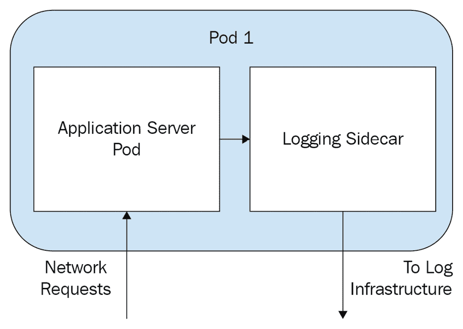

# 三、在 Kubernetes 上运行应用容器

本章全面概述了 Kubernetes 提供的最小乐高积木 Pod。包括对 podbspec YAML 格式和可能的配置的解释，以及对 Kubernetes 如何处理和调度 Pods 的快速讨论。Pod 是在 Kubernetes 上运行应用的最基本方式，用于所有高阶应用控制器。

在本章中，我们将涵盖以下主题:

*   什么是 PODS？
*   命名空间
*   PODS 的生命周期
*   Pod 资源规格
*   Pod 调度

# 技术要求

为了运行本章中详细介绍的命令，您将需要一台支持`kubectl`命令行工具的计算机，以及一个工作正常的 Kubernetes 集群。参见 [*第一章*](01.html#_idTextAnchor016)*与 Kubernetes*通讯，了解几种快速与 Kubernetes 一起起床跑步的方法，以及如何安装`kubectl`工具的说明。

本章中使用的代码可以在本书的 GitHub 存储库中找到，链接如下:

[https://github . com/PacktPublishing/Cloud-Native-with-Kubernetes/tree/master/chapter 3](https://github.com/PacktPublishing/Cloud-Native-with-Kubernetes/tree/master/Chapter3)

# 什么是 PODS？

Pod 是 Kubernetes 中最简单的计算资源。它指定一个或多个容器由一个节点上的 Kubernetes 调度程序启动和运行。Pods 有许多潜在的配置和扩展，但仍然是在 Kubernetes 上运行应用的最基本方式。

重要说明

Pod 本身并不是在 Kubernetes 上运行应用的好方法。为了利用像 Kubernetes 这样的容器编排者的真正能力，Pods 应该像 fdisposable 一样对待。这意味着要像对待牛一样对待容器(也就是 PODS)，而不是宠物。为了真正利用容器和 Kubernetes，应用应该在自我修复、可扩展的组中运行。Pod 是这些组的构建模块，我们将在后面的章节中讨论如何以这种方式配置应用。

# 实现 Pods

Pods 是使用 Linux 隔离原则(如组和名称空间)实现的，通常可以将视为逻辑主机。Pods 运行一个或多个容器(可以基于 Docker、CRI-O 或其他运行时)，这些容器可以以虚拟机上不同进程可以通信的相同方式相互通信。

为了让两个不同的 Pod 中的容器进行通信，它们需要通过另一个 Pod 的 IP 访问另一个 Pod(和容器)。默认情况下，只有在同一个 Pod 上运行的容器才能使用较低级别的通信方法，尽管可以将不同的 Pod 配置为通过主机 IPC 相互通信。

## Pod 范例

在最基本的层面，有两种类型的 Pods:

*   单容器 PODS
*   多容器 Pod 

通常，最佳做法是每个 Pod 包含一个容器。这种方法允许您分别扩展应用的不同部分，并且在创建一个启动和运行都没有问题的 Pod 时，通常会使事情变得简单。

另一方面，多容器 Pods 更复杂，但在各种情况下都很有用:

*   如果应用的多个部分运行在不同的容器中，但又紧密耦合，您可以在同一个 Pod 中运行它们，以实现无缝通信和文件系统访问。
*   当实现 *sidecar* 模式时，在主应用旁边注入实用程序容器来处理日志记录、度量、网络或高级功能，如服务网格(更多信息请参见 [*第 14 章*](14.html#_idTextAnchor307)*服务网格和无服务器*)。

下图显示了一个常见的边车实现:



图 3.1–常见侧边栏实现

在这个例子中，我们有一个带有两个容器的 Pod:运行 web 服务器的应用容器，以及从我们的服务器 Pod 提取日志并将它们转发到我们的日志记录基础设施的日志记录应用。这是 sidecar 模式的一个非常适用的用法，尽管许多日志收集器是在节点级别工作的，而不是在 Pod 级别，所以这不是一种在 Kubernetes 中从我们的应用容器收集日志的通用方式。

## Pod 网络

正如我们刚刚提到的，pod 有自己的 IP 地址，可以用于 pod 间的通信。每个容器都有一个 IP 地址和端口，如果有多个容器，则在一个容器中运行的容器之间共享。

正如我们之前提到的，在 Pod 中，容器可以在不调用包装 Pod 的 IP 的情况下进行通信——相反，它们可以简单地使用 localhost。这是因为 Pod 中的容器共享一个网络名称空间——本质上，它们通过相同的*桥*进行通信，该桥使用虚拟网络接口实现。

## 荚果贮藏

Kubernetes 中的存储本身就是一个很大的话题，我们将在 [*第 7 章*](07.html#_idTextAnchor166)*Kubernetes 上的存储*中对其进行深入的回顾–但目前，您可以将 Pod 存储视为连接到 Pod 的持久或非持久卷。非持久卷可以由 Pod 用来存储数据或文件，具体取决于类型，但是当 Pod 关闭时，它们会被删除。持久类型的卷在 Pod 关闭后仍将保留，甚至可以用于在多个 Pod 或应用之间共享数据。

在我们继续讨论 Pods 之前，我们将花一点时间来讨论名称空间。由于我们将在使用 Pods 的过程中使用`kubectl`命令，所以了解名称空间如何与 Kubernetes 和`kubectl`联系在一起非常重要，因为这可能是一个很大的“陷阱”

## 命名空间

我们在*第 1 章*、*与 Kubernetes* 交流中关于授权的章节中简要讨论了名称空间，但是我们将在这里重申并扩展它们的目的。名称空间是在集群中逻辑上分隔不同区域的一种方式。一个常见的用例是每个环境有一个命名空间——一个用于开发，一个用于暂存，一个用于生产——所有这些都位于同一个集群中。

正如我们在*授权*一节中提到的，可以按名称空间指定用户权限，例如，允许用户将新的应用和资源部署到`dev`名称空间，但不部署到生产中。

在您正在运行的集群中，您可以通过运行`kubectl get namespaces`或`kubectl get ns`来查看存在哪些名称空间，这将导致以下输出:

```
NAME          STATUS    AGE
default       Active    1d
kube-system   Active    1d
kube-public   Active    1d
```

要强制创建名称空间，您可以简单地运行`kubectl create namespace staging`，或者使用以下 YAML 资源规范运行`kubectl apply -f /path/to/file.yaml`:

Staging-ns.yaml

```
apiVersion: v1
kind: Namespace
metadata:
  name: staging
```

正如你所看到的，一个`Namespace`规格非常简单。让我们继续讨论一些更复杂的东西 PodSpec 本身。

## PODS 的生命周期

要快速查看集群中正在运行哪些 Pods，您可以运行`kubectl get pods`或`kubectl get pods --all-namespaces`分别获取当前命名空间(由您的`kubectl`上下文定义，或者默认命名空间(如果未指定)或所有命名空间中的 Pods。

`kubectl get pods`的输出是这样的:

```
NAME     READY   STATUS    RESTARTS   AGE
my-pod   1/1     Running   0          9s
```

如您所见，Pod 有一个`STATUS`值，它告诉我们 Pod 当前处于哪种状态。

Pod 状态的值如下:

*   **运行**:在`Running`状态下，一个 Pod 已经成功地旋转了它的容器，没有出现任何问题。如果 Pod 只有一个容器，并且处于`Running`状态，则该容器尚未完成或退出其流程。它也可能正在重新启动，你可以通过查看`READY`栏来了解。例如，如果`READY`值为`0/1`，这意味着 Pod 中的容器当前没有通过健康检查。这可能有多种原因:容器可能仍在旋转，数据库连接可能不起作用，或者一些重要的配置可能会阻止应用进程启动。
*   **成功**:如果你的 Pod 容器被设置为运行一个可以完成或退出的命令(不是一个长时间运行的命令，比如启动一个网络服务器)，如果那些容器已经完成了它们的进程命令，Pod 将显示`Succeeded`状态。
*   **待定** : `Pending`状态表示 Pod 中至少有一个容器正在等待的映像。这可能是因为容器映像仍在从外部存储库中获取，或者因为 Pod 本身正在等待`kube-scheduler`的调度。
*   **未知**:状态`Unknown`意味着 Kubernetes 无法判断 Pod 实际处于什么状态。这通常意味着 Pod 所在的节点正在经历某种形式的错误。它可能磁盘空间不足，与群集的其他部分断开连接，或者遇到问题。
*   **故障**:在`Failed`状态下，Pod 中的一个或多个容器以故障状态终止。此外，Pod 中的其他容器必须在成功或失败时终止。由于集群移除 Pods 或容器应用内部的某些东西破坏了进程，这可能会由于各种原因而发生。

## 了解 Pod 资源规格

由于 Pod 资源规范是我们真正挖掘的第一个规范，我们将花时间详细描述 YAML 文件的各个部分以及它们是如何结合在一起的。

让我们从一个完全符合规格的 Pod 文件开始，然后我们可以挑选出来并查看:

单引擎舱 yaml

```
apiVersion: v1
kind: Pod
metadata:
  name: myApp
  namespace: dev
  labels:
    environment: dev
  annotations:
    customid1: 998123hjhsad 
spec:
  containers:
  - name: my-app-container
    image: busybox
```

这个 Pod YAML 文件比我们在第一章中看到的文件稍微复杂一些。它展示了一些新的 Pod 功能，我们将很快回顾。

### API 版本

让我们从第 1 行开始:`apiVersion`。正如我们在 [*第 1 章*](01.html#_idTextAnchor016)*中提到的，与 Kubernetes* 通信，`apiVersion`告诉 Kubernetes 在创建和配置您的资源时应该查看哪个版本的 API。Pods 在 Kubernetes 已经存在很长时间了，所以 PodSpec 被固化为 API 版本`v1`。除了版本名之外，其他资源类型可能还包含组名，例如，Kubernetes 中的 CronJob 资源使用`batch/v1beta1` `apiVersion`，而 Job 资源使用`batch/v1` `apiVersion`。在这两种情况下，`batch`对应于 API 组名。

### 种类

`kind`值对应于 Kubernetes 中资源类型的实际名称。在这种情况下，我们是试图规范出一个 PODS，所以这就是我们所放的。`kind`值总是在骆驼的情况下，比如`Pod`、`ConfigMap`、`CronJob`等等。

重要说明

关于`kind`值的完整列表，请查看位于[https://kubernetes.io/docs/home/](https://kubernetes.io/docs/home/)的官方 Kubernetes 文档。新版本中增加了新的 Kubernetes `kind`值，因此本书中回顾的可能不是一个详尽的列表。

### [计]元数据

元数据是一个顶级键，其下面可以有几个不同的值。首先，`name`是资源名称，这是资源将通过`kubectl`显示的内容，以及它在`etcd`中存储的内容。`namespace`对应于应该在其中创建资源的命名空间。如果在 YAML 规范中没有指定名称空间，资源将在`default`名称空间中创建，除非在`apply`或`create`命令中指定了名称空间。

接下来，`labels`是用于向资源添加元数据的键值对。`labels`与其他元数据相比很特殊，因为默认情况下，它们在 Kubernetes 原生`selectors`中用于过滤和选择资源，但它们也可以用于自定义功能。

最后，`metadata`模块可以作为多个`annotations`的主机，像`labels`一样，控制器和定制的 Kubernetes 功能可以使用这些模块来提供额外的配置和特定于功能的数据。在这个 PodSpec 中，我们在元数据中指定了几个注释:

带有注释的 pod . YAML

```
apiVersion: v1
kind: Pod
metadata:
  name: myApp
  namespace: dev
  labels:
    environment: dev
  annotations:
    customid1: 998123hjhsad
    customid2: 1239808908sd 
spec:
  containers:
  - name: my-app-container
    image: busybox
```

一般来说，使用`annotations`添加数据或扩展功能时，最好使用`labels`来添加 Kubernetes 特有的功能和选择器——这只是一个约定。

### 投机

`spec`是包含资源特定配置的顶级键。在这种情况下，由于我们的`kind`值是`Pod`，我们将添加一些特定于我们的 Pod 的配置。所有进一步的键将缩进在这个`spec`键下，并将代表我们的 Pod 配置。

### 容器

`containers`键需要一个将在 Pod 中运行的一个或多个容器的列表。每个容器规范将公开它自己的配置值，这些值缩进到您的资源 YAML 中的容器列表项下。我们将在这里回顾其中的一些配置，但是要获得完整的列表，请查看 Kubernetes 文档([https://kubernetes.io/docs/home/](https://kubernetes.io/docs/home/))。

### 名字

在容器规范中，`name`与容器在 Pod 中的名称相关。容器名称可以用来使用`kubectl logs`命令专门访问特定容器的日志，但我们稍后会谈到这一点。现在，确保您为 Pod 中的每个容器选择一个明确的名称，以便调试时更容易。

### 映像

对于每个容器，`image`用于指定应在 Pod 中启动的 Docker(或其他运行时)映像的名称。映像将从已配置的存储库中提取，默认情况下，该存储库是公共的 Docker Hub，但也可以是私有存储库。

就这样——这就是你需要指定一个 Pod 并在 Kubernetes 中运行它的全部内容。从这一点开始，`Pod`部分的所有内容都属于*附加配置*的保护伞。

### Pod 资源规格

Pods 可以配置为分配特定数量的内存和计算。这可以防止特别饥饿的应用影响集群性能，也有助于防止内存泄漏。可以指定两种可能的资源–`cpu`和`memory`。对于其中的每一个，都有两种不同类型的规范，`Requests`和`Limits`，总共有四个可能的资源规范键。

内存请求和限制可以用任何典型的内存号后缀或其二的幂来配置，例如 50 兆字节、50 兆字节或 1 吉字节。

中央处理器请求和限制可以通过使用对应于 1 毫中央处理器的`m`来配置，也可以仅使用十进制数来配置。所以`200m`相当于`0.2`，相当于一个逻辑 CPU 的 20%或者五分之一。无论内核数量多少，该数量都将是相同的计算能力。1 个 CPU 相当于 AWS 中的一个虚拟内核或 GCP 的一个内核。让我们看看这些资源请求和限制在我们的 YAML 文件中是什么样子的:

资源受限的 pod . YAML

```
apiVersion: v1
kind: Pod
metadata:
  name: myApp
spec:
  containers:
  - name: my-app-container
    image: mydockername
    resources:
      requests:
        memory: "50Mi"
        cpu: "100m"
      limits:
        memory: "200Mi"
        cpu: "500m"
```

在这个`Pod`中，我们有一个运行 Docker 映像的容器，它在`cpu`和`memory`上指定了请求和限制。在本例中，我们的容器映像名称`mydockername`是一个占位符，但是如果您想测试本例中的 Pod 资源限制，您可以使用 busybox 映像。

### 容器启动命令

当容器在 Kubernetes Pod 中启动时，它会运行该容器的默认启动脚本，例如 Docker 容器规范中指定的脚本。为了用不同的命令或附加参数覆盖该功能，可以提供`command`和`args`键。让我们看看一个配置有`start`命令和一些参数的容器:

带启动命令的 pod . YAML

```
apiVersion: v1
kind: Pod
metadata:
  name: myApp
spec:
  containers:
  - name: my-app-container
    image: mydockername
    command: ["run"]
    args: ["--flag", "T", "--run-type", "static"]
```

如您所见，我们指定了一个命令和一个参数列表作为字符串数组，在空格处用逗号分隔。

### 初始化容器

`init`容器是 Pod 内的特殊容器，在正常 Pod 容器启动前启动、运行和关闭。

`init`容器可以用于许多不同的用例，例如在应用启动之前初始化文件，或者在启动 Pod 之前确保其他应用或服务正在运行。

如果指定了多个`init`容器，它们将按顺序运行，直到所有`init`容器都关闭。出于这个原因，`init`容器必须运行一个完成的脚本，并且有一个端点。如果您的`init`容器脚本或应用继续运行，您的 Pod 中的正常容器将不会启动。

在下面的 Pod 中，`init`容器正在运行一个循环，通过`nslookup`检查我们的`config-service`是否存在。一旦看到`config-service`启动，脚本结束，这将触发我们的`my-app`应用容器启动:

带有初始化容器的 pod . YAML

```
apiVersion: v1
kind: Pod
metadata:
  name: myApp
spec:
  containers:
  - name: my-app
    image: mydockername
    command: ["run"]
  initContainers:
  - name: init-before
    image: busybox
    command: ['sh', '-c', 'until nslookup config-service; do echo config-service not up; sleep 2; done;']
```

重要说明

当一个`init`容器出现故障时，Kubernetes 将自动重启 Pod，类似于通常的 Pod 启动功能。可以通过在 Pod 级别更改`restartPolicy`来更改该功能。

下图显示了 Kubernetes 中典型的 Pod 启动流程:


图 3.2–初始化容器流程图

如果一个 Pod 有多个`initContainer`，它们将被依次调用。这对于使用必须按顺序执行的模块化步骤设置`initContainers`的时候很有价值。下面的 YAML 展示了这一点:

带有多个初始化容器的 pod . YAML

```
apiVersion: v1
kind: Pod
metadata:
  name: myApp
spec:
  containers:
  - name: my-app
    image: mydockername
    command: ["run"]
  initContainers:
  - name: init-step-1
    image: step1-image
    command: ['start-command']
  - name: init-step-2
    image: step2-image
    command: ['start-command']
```

以为例，在这个`Pod` YAML 文件中，`step-1 init`容器需要在`init-step-2`被调用之前成功，并且两者都需要在`my-app`容器被启动之前显示成功。

### 在 Kubernetes 中引入不同类型的探针

为了知道一个容器(因此一个 PODS)何时出现故障，Kubernetes 需要知道如何测试容器是否正常工作。我们通过定义`probes`来做到这一点，其中 Kubernetes 可以以指定的时间间隔运行，以确定容器是否在工作。

Kubernetes 让我们配置了三种类型的探测器——就绪、活跃和启动。

### 就绪探测器

首先，就绪探测器可以用来确定容器是否准备好执行功能，例如通过 HTTP 接受流量。这些探测在一个运行的应用的开始阶段是有帮助的，例如，它可能还在获取配置，还没有准备好接受连接。

让我们看看配置了就绪探测器的 Pod 是什么样子的。接下来是附有就绪探测器的 PodSpec:

准备就绪探测舱

```
apiVersion: v1
kind: Pod
metadata:
  name: myApp
spec:
  containers:
  - name: my-app
    image: mydockername
    command: ["run"]
    ports:
    - containerPort: 8080
    readinessProbe:
      exec:
        command:
        - cat
        - /tmp/thisfileshouldexist.txt
      initialDelaySeconds: 5
      periodSeconds: 5
```

首先，正如你看到的，探针是按容器定义的，而不是按 Pod 定义的。Kubernetes 将运行每个容器的所有探测器，并使用这些探测器来确定 Pod 的总体运行状况。

### 活性探针

活跃度探测器可用于确定应用是否由于某种原因(例如，由于内存错误)而失败。对于运行时间较长的应用容器，活跃度探测器可以作为一种方法派上用场，帮助 Kubernetes 回收旧的和损坏的 Pods 以获得新的。虽然探测器本身不会导致容器重启，但是其他 Kubernetes 资源和控制器会检查探测器状态，并在必要时使用它来重启 Pods。这是一个附有活性探针定义的 PodSpec:

带活性探针的 probe.yaml

```
apiVersion: v1
kind: Pod
metadata:
  name: myApp
spec:
  containers:
  - name: my-app
    image: mydockername
    command: ["run"]
    ports:
    - containerPort: 8080
    livenessProbe:
      exec:
        command:
        - cat
        - /tmp/thisfileshouldexist.txt
      initialDelaySeconds: 5
      failureThreshold: 3
      periodSeconds: 5
```

正如您所看到的，我们的活跃度探测器的指定方式与我们的就绪探测器相同，只是增加了一个–`failureThreshold`。

`failureThreshold`值将决定 Kubernetes 在采取行动之前尝试探测的次数。对于活性探测器，一旦越过`failureThreshold`，Kubernetes 将重启 Pod 。对于准备状态探测器，Kubernetes 将简单地将 Pod 标记为`Not Ready`。该阈值的默认值为`3`，但可以更改为大于或等于`1`的任何值。

在这种情况下，我们用探针使用`exec`机制。我们将很快回顾各种可用的探测机制。

### 启动探测器

最后，启动探测器是一种特殊类型的探测器，在容器启动时只会运行一次。一些(通常较旧的)应用在容器中启动需要很长时间，因此通过在容器第一次启动时提供一些额外的余地，您可以防止活动或就绪探测器失败并导致重启。这是用我们的 Pod 配置的启动探测器:

带有启动探针的 probe.yaml

```
apiVersion: v1
kind: Pod
metadata:
  name: myApp
spec:
  containers:
  - name: my-app
    image: mydockername
    command: ["run"]
    ports:
    - containerPort: 8080
    startupProbe:
      exec:
        command:
        - cat
        - /tmp/thisfileshouldexist.txt
      initialDelaySeconds: 5
      successThreshold: 2
      periodSeconds: 5
```

启动探测比简单地延长活动或就绪探测之间的时间提供了更大的好处——它们允许 Kubernetes 在解决启动后发生的问题时保持快速的反应时间，并且(更重要的是)防止缓慢启动的应用不断重启。如果您的应用需要几秒钟甚至一两分钟的时间来启动，那么您将更容易实现启动探测。

`successThreshold`正是它看起来的样子，硬币的反面为`failureThreshold`。它规定了在一个容器被标记为`Ready`之前需要连续多少次成功。对于在稳定之前启动时可以上升和下降的应用(像一些自聚类应用)，更改该值可能是有用的。默认值为`1`，对于活性探测器，唯一可能的值是`1`，但是我们可以更改就绪和启动探测器的值。

### 探针机构配置

有多个机制来指定三个探头中的任何一个:`exec`、`httpGet`和`tcpSocket`。

`exec`方法允许您指定将在容器内部运行的命令。成功执行的命令将导致探测通过，而失败的命令将导致探测失败。到目前为止，我们配置的所有探头都使用了`exec`方法，因此配置应该是不言而喻的。如果选择的命令(带有以逗号分隔的列表形式指定的任何参数)失败，探测将失败。

探测的`httpGet`方法允许您在容器上指定一个将被 HTTP `GET`请求命中的网址。如果 HTTP 请求返回一个介于`200`到`400`之间的代码，它将导致探测成功。任何其他 HTTP 代码都将导致失败。

`httpGet`的配置如下:

带探头的 Pod 

```
apiVersion: v1
kind: Pod
metadata:
  name: myApp
spec:
  containers:
  - name: my-app
    image: mydockername
    command: ["run"]
    ports:
    - containerPort: 8080
    livenessProbe:
      httpGet:
        path: /healthcheck
        port: 8001
        httpHeaders:
        - name: My-Header
          value: My-Header-Value
        initialDelaySeconds: 3
        periodSeconds: 3
```

最后，`tcpSocket`方法将尝试打开容器上的指定插座，并将使用结果来指示成功或失败。`tcpSocket`配置如下:

带有 tcp 探针的 probe.yaml

```
apiVersion: v1
kind: Pod
metadata:
  name: myApp
spec:
  containers:
  - name: my-app
    image: mydockername
    command: ["run"]
    ports:
    - containerPort: 8080
    readinessProbe:
      tcpSocket:
        port: 8080
      initialDelaySeconds: 5
      periodSeconds: 10
```

正如你看到的，这种类型的探头接收一个端口，每次检查都会被 ping 通。

### 公共 Pod 转换

Kubernetes 中的失败 PODS 倾向于在状态之间转换。对于第一次使用的用户来说，这可能会令人望而生畏，因此有必要详细说明我们前面列出的 Pod 状态如何与探测功能交互。重申一下，这里是我们的状态:

*   `Running`
*   `Succeeded`
*   `Pending`
*   `Unknown`
*   `Failed`

一个常见的流程是运行`kubectl get pods -w`(在命令中添加了`-w`标志)并看到违规的 Pods 在`Pending`和`Failed`之间转换。典型的情况是，Pod (及其容器)正在旋转并拉出映像——这是`Pending`状态，因为健康检查尚未开始。

一旦初始探测超时(正如我们在上一节中看到的，这是可配置的)过去，第一次探测就会失败。这可以持续几秒钟甚至几分钟，取决于故障阈值有多高，状态仍然固定在`Pending`。

最后，我们的故障阈值达到，我们的 Pod 状态转换到`Failed`。在这一点上，可能会发生两件事中的一件，这个决定纯粹是基于 PodSpec 上的`RestartPolicy`，它可以是`Always`、`Never`或者`OnFailure`。如果 Pod 出现故障，并且`restartPolicy`为`Never`，Pod 将保持故障状态。如果是另外两个选项之一，Pod 会自动重启，回到`Pending`，这就是我们永无止境过渡周期的根本原因。

举个不同的例子，你可能会看到 Pods 永远停留在`Pending`状态。这可能是由于无法在任何节点上调度 Pod。这可能是由于资源请求限制(我们将在本书后面的第 8 章[](08.html#_idTextAnchor186)**Pod Placement Controls*)或其他问题(如节点不可达)造成的。*

 *最后，对于`Unknown`，通常 Pod 被调度的节点由于某种原因而不可达，例如，该节点可能已经关闭，或者通过网络不可达。

### Pod 调度

Pod 调度的复杂性和 Kubernetes 让你影响和控制的方式它将被保存到我们的 [*第 8 章*](08.html#_idTextAnchor186)*Pod 放置控制*——但现在我们将回顾基础知识。

在决定在哪里安排 Pod 时，Kubernetes 会考虑许多因素，但最需要考虑的是 Pod 优先级、节点可用性和资源可用性(如果不深入研究 Kubernetes 让我们使用的更复杂的控制)。

Kubernetes 调度程序运行一个持续的控制循环，监视集群中未绑定(未调度)的 Pods。如果找到一个或多个未绑定的 Pod，调度程序将使用 Pod 优先级来决定首先调度哪个。

一旦调度器决定了要调度的 Pod，它将执行多轮和多种类型的检查，以便找到节点的本地最优点，以便在哪里调度 Pod。后几轮检查由粒度调度控制决定，我们将在 [*第 8 章*](08.html#_idTextAnchor186)*Pod 放置控制*中讨论。我们现在要担心第一批支票。

首先，Kubernetes 检查哪些节点在当前时刻甚至是可调度的。节点可能无法正常工作，或者遇到会妨碍计划新 Pods 的问题。

其次，Kubernetes 通过检查哪些节点符合 PodSpec 中规定的最低资源要求来过滤可调度节点。

此时，在没有任何其他放置控制的情况下，调度器将做出决定，并将我们的新 Pod 分配给一个节点。当该节点上的`kubelet`看到分配了一个新的 Pod 时，Pod 将旋转起来。

# 总结

在本章中，我们了解到 Pods 是我们在 Kubernetes 中必须使用的最基本的构建模块。对 Pods 及其所有微妙之处有深刻的理解是很重要的，因为 Kubernetes 上的所有计算都使用 Pods 作为构建块。这可能现在已经非常明显了，但是 PODS 是非常小的，个体的东西，不是很结实。在没有控制器的 Kubernetes 上作为单个 Pod 运行应用是一个糟糕的决定，Pod 的任何问题都会导致停机。

在下一章中，我们将看到如何通过使用 Pod 控制器一次运行一个应用的多个副本来防止这种情况。

# 问题

1.  如何使用名称空间来分隔应用环境？
2.  Pod 状态被列为`Unknown`的可能原因是什么？
3.  限制 Pod 内存资源的原因是什么？
4.  如果在 Kubernetes 上运行的应用经常在失败的探测重新启动 Pod 之前没有及时启动，您应该调整哪种探测类型？准备、活跃还是启动？

# 进一步阅读

*   Kubernetes 官方文件:[https://kubernetes.io/docs/home/](https://kubernetes.io/docs/home/)
*   *硬道*:[https://github . com/keleyhightower/kubrites—硬道](https://github.com/kelseyhightower/kubernetes-the-hard-way)*