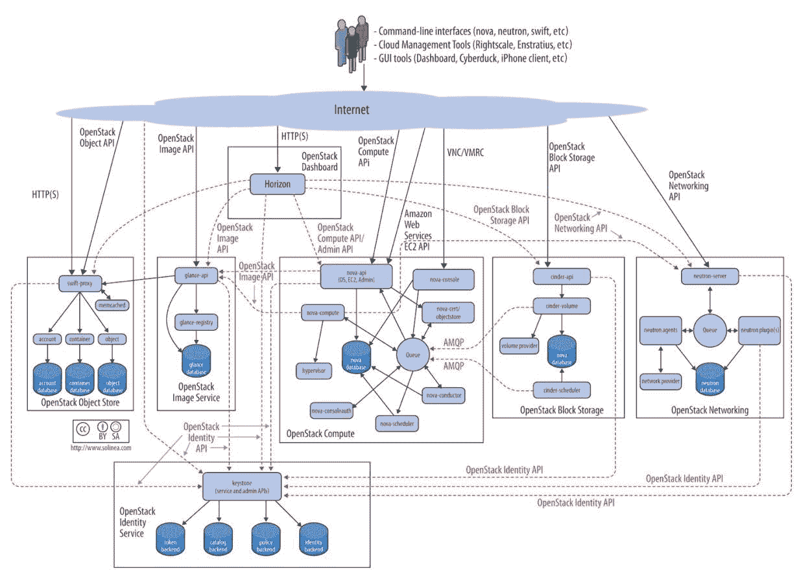
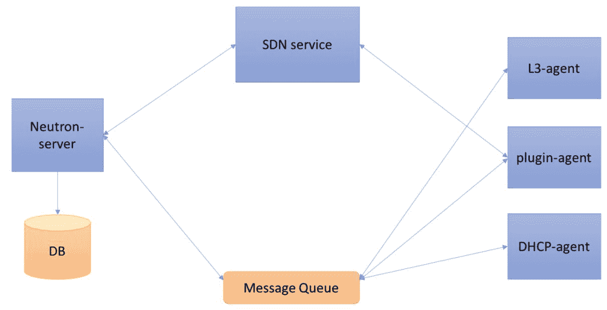

# 三、OpenStack 架构

本章将从介绍 OpenStack 开始。然后本章将解释 OpenStack 的体系结构，并进一步解释 OpenStack 中的每个核心项目。最后，本章将演示 DevStack 的安装，并使用它来执行一些 OpenStack 操作。本章将包括以下内容:

*   OpenStack 简介
*   OpenStack 架构
*   OpenStack 身份服务 KeyStone 简介
*   Nova 介绍，OpenStack 计算服务
*   OpenStack 网络服务中子介绍
*   OpenStack 块存储服务煤渣介绍
*   OpenStack 映像服务“扫视”简介
*   Swift 介绍，OpenStack 对象服务
*   DevStack 安装

# OpenStack 简介

OpenStack 是一款用于创建私有云和公共云的免费开源软件。它提供相互关联的组件集来管理和访问跨数据中心的大型计算、网络和存储资源池。用户可以使用基于网络的用户界面和命令行或者 REST APIs 来管理它。OpenStack 是由 Rackspace 和 NASA 在 2010 年开源的。目前，它由一个非盈利实体——OpenStack 基金会管理。

# OpenStack 架构

下图(来自:[https://docs.openstack.org/arch-design/design.html](https://docs.openstack.org/arch-design/design.html))代表了 OpenStack 的逻辑架构，以及用户如何连接各种服务。OpenStack 有多个用于不同目的的组件，例如用于管理计算资源的 Nova、用于管理操作系统映像的 glass 等等。我们将在接下来的章节中详细了解每个组件。

简单来说，如果用户请求使用命令行界面或应用编程接口来配置虚拟机，该请求将由 Nova 处理。Nova 随后与 KeyStone 进行对话，以验证请求，扫视操作系统映像，并使用中子来设置网络资源。然后，在收到来自每个组件的响应后，它启动虚拟机并向用户返回响应:



# OpenStack 身份服务 KeyStone 简介

KeyStone 是一个 OpenStack 身份服务，提供以下功能:

*   **身份提供者**:在 OpenStack 中，身份以名称和密码的形式表示为用户。在简单的设置中，KeyStone 将用户的身份存储在其数据库中。但是建议您在生产中使用第三方身份提供者，如 LDAP。
*   **API 客户端认证**:认证就是验证用户的身份。KeyStone 可以通过使用许多第三方后端(如 LDAP 和 AD)来做到这一点。一旦通过身份验证，用户将获得一个令牌，他/她可以使用该令牌来访问其他 OpenStack 服务 API。
*   **多租户授权** : KeyStone 通过为每个租户中的每个用户添加一个角色来提供访问特定资源的授权。当用户访问任何 OpenStack 服务时，服务会验证用户的角色以及他/她是否可以访问资源。
*   **服务发现** : KeyStone 管理一个服务目录，其他服务可以在其中注册自己的端点。每当任何其他服务想要与任何特定服务进行交互时，它都可以参考服务目录并获取该服务的地址。

KeyStone 包含以下组件:

*   **KeyStone****API**:KeyStone API 是一个 WSGI 应用，处理所有传入的请求
*   **服务** : KeyStone 由通过一个 API 端点公开的许多内部服务组成。这些服务由前端应用编程接口以组合方式使用
*   **身份**:身份服务处理与用户凭证验证相关的请求，以及与用户和组数据相关的 CRUD 操作。在生产环境中，第三方实体(如 LDAP)可以用作身份服务后端
*   **资源**:资源服务负责管理与项目和领域相关的数据
*   **分配**:分配服务负责角色，为用户分配角色
*   **令牌**:令牌服务负责管理和验证令牌
*   **目录**:目录服务负责管理服务端点和提供发现服务
*   **策略**:策略服务负责提供基于规则的授权

下图显示了 KeyStone 的架构:


# Nova 介绍，OpenStack 计算服务

Nova 是 OpenStack 的一项计算服务，它提供了一种调配计算实例(也称为虚拟机)的方法。Nova 具有创建和管理以下内容的能力:

*   虚拟计算机
*   裸机服务器
*   系统容器

Nova 包含多个服务，每个服务执行不同的功能。它们通过 RPC 消息传递机制进行内部通信。

Nova 由以下组件组成:

*   **Nova API**:Nova API 服务处理传入的 REST 请求，以创建和管理虚拟服务器。应用编程接口服务主要处理数据库读写，并通过 RPC 与其他服务通信，以生成对 REST 请求的响应。
*   **放置 API** : Nova 放置 API 服务在 14.0.0 牛顿版本中引入。该服务跟踪资源提供者清单和每个提供者的使用情况。资源提供者可以是共享存储池、计算节点等。
*   **调度器**:调度器服务决定哪个计算主机获得实例。
*   **计算**:计算服务负责与虚拟机管理程序和虚拟机进行通信。它在每个计算节点上运行。
*   **指挥**:指挥服务充当数据库代理，处理对象转换并帮助请求协调。
*   **数据库**:数据库是用于数据存储的 SQL 数据库。
*   **消息队列**:该路由的信息在不同的 Nova 服务之间移动。
*   **网络**:网络服务管理 IP 转发、网桥、VLANs 等。

下图代表 Nova 的架构:


# OpenStack 网络服务中子介绍

中子是 OpenStack 的网络服务，它在 OpenStack 云中提供各种网络选项。它的旧名字是量子，后来改名为中子。中子使用大量插件来提供不同的网络配置。

中子包含以下成分:

*   **中子服务器** ( `neutron-server`和`neutron-*-plugin`):中子服务器处理传入的 REST API 请求。它使用插件与数据库通信
*   **插件代理** ( `neutron-*-agent`):插件代理在每个计算节点上运行，以管理本地虚拟交换机(vswitch)配置
*   **DHCP 代理**(`neutron-dhcp-agent`):DHCP 代理为租户网络提供 DHCP 服务。该代理负责维护所有 DHCP 配置
*   **L3 代理**(`neutron-l3-agent`):L3 代理为租户网络上虚拟机的外部网络访问提供 L3/NAT 转发
*   **网络提供商服务(SDN 服务器/服务)**:该服务为租户网络提供额外的网络服务
*   **消息队列**:在中子进程之间路由信息
*   **数据库**:数据库是用于数据存储的 SQL 数据库

下图显示了中子的架构:



# OpenStack 块存储服务煤渣介绍

which 是 OpenStack 的块存储服务，为 Nova 中的虚拟机提供持久的块存储资源。煤渣使用 LVM 或其他插件驱动程序来提供存储。用户可以使用煤渣来创建、删除和附加卷。此外，克隆、扩展卷、快照和写入映像等更高级的功能可用作虚拟机和裸机的可启动持久实例。煤渣也可以独立于其他 OpenStack 服务使用。

数据块存储服务由以下组件组成，为管理卷提供了高度可用、容错和可恢复的解决方案:

*   **煤渣应用编程接口**:一个 WSGI 应用，用于验证请求并将请求路由到煤渣卷服务
*   **煤渣调度器**:调度对最佳存储提供商节点的请求，以便在其上创建卷
*   **煤渣卷**:与各种存储提供者交互，还处理读写请求以保持状态。它还与煤渣调度程序交互
*   **煤渣备份**:将卷备份到 OpenStack 对象存储(Swift)。它还与各种存储提供商进行交互

消息队列在块存储进程之间路由信息。下图是煤渣的架构图:


# OpenStack 映像服务“扫视”简介

“扫视”是 OpenStack 的映像服务项目，它为磁盘和服务器映像提供发现、注册和检索功能。用户可以上传和发现用于其他服务的数据映像和元数据定义。简而言之，扫视是管理虚拟机、容器和裸机映像的中央存储库。sketch 有一个 RESTful API，允许查询映像元数据以及检索实际映像。

OpenStack 映像服务“扫视”包括以下组件:

*   **扫视-api** :接受映像 api 调用进行映像发现、检索和存储的 WSGI 应用。它用 Keystone 对其进行身份验证，并将请求转发给简略注册表。
*   **简略注册表**:一个存储、处理和检索映像元数据的私有内部服务。元数据包括大小和类型等项目。
*   **数据库**:存储映像元数据。可以根据自己的喜好选择 MySQL 或者 SQLite。
*   **映像文件存储库**:支持多种存储库类型存储映像。
*   **元数据定义服务**:供应商、管理员、服务和用户有意义地定义自己的自定义元数据的通用 API。这些元数据可以用于不同类型的资源，如映像、工件、体积、风格和聚合。定义包括新属性的键、描述、约束以及可以与之关联的资源类型。

下图是扫视的架构图。which 还有一个客户端-服务器架构，为用户提供了一个 REST API，通过这个 API 可以执行对服务器的请求:


# Swift 介绍，OpenStack 对象存储

Swift 是 OpenStack 的对象存储服务，可用于在能够存储千兆字节数据的服务器集群上存储冗余、可扩展的数据。它提供了一个完全分布式、API 可访问的存储平台，可以直接集成到应用中，也可以用于备份、归档和数据保留。Swift 采用没有中央控制点的分布式架构，这使得它高度可用、分布式，并最终成为一致的对象存储解决方案。它是存储非结构化数据的理想选择，这些数据可以无限制地增长，并且可以检索和更新。

数据被写入延伸到不同区域的多个节点，以确保整个群集的数据复制和完整性。集群可以通过添加新节点进行水平扩展。如果节点出现故障，数据会复制到其他活动节点。

Swift 以层次结构组织数据。它说明了存储的容器列表、用于存储对象列表的容器以及用于存储带有元数据的实际数据的对象。

为了提供高可用性、高耐用性和高并发性，Swift 有以下主要组件。Swift 还有许多其他服务，如更新程序、审计程序和复制器，它们处理内务处理任务，以提供一致的对象存储解决方案:

*   **代理服务器**:公共 API 通过代理服务器公开。它处理所有传入的应用编程接口请求，并将请求路由到适当的服务。
*   **Ring**:Ring 将数据的逻辑名称映射到特定磁盘上的位置。Swift 中有不同资源的独立环。
*   **分区**:一个分区将数据与其他分区隔离。如果一个区域发生故障，群集不会受到影响，因为数据会跨区域复制。
*   **账户**:账户是在账户中存储容器列表的数据库。它分布在整个集群中。
*   **容器**:容器是将对象列表存储在容器中的数据库。它分布在整个集群中。
*   **对象**:数据本身。
*   **分区**:存储对象、账户数据库、容器数据库，帮助管理数据在集群中所处的位置。

下图显示了 Swift 的架构图:


# DevStack 安装

DevStack 是一组可扩展的脚本，用于快速调出完整的开发 OpenStack 环境。DevStack 只用于开发和测试目的。请注意，它不应在生产环境中使用。默认情况下，DevStack 安装所有核心组件，包括新星、中子、煤渣、扫视、梯形和地平线。

Devstack 能够在 Ubuntu 16.04/17.04、Fedora 24/25、CentOS/RHEL 7 以及 Debian 和 OpenSUSE 上运行。

在本节中，我们将在 Ubuntu 16.04 上建立一个基本的 OpenStack 环境，并尝试一些命令来测试 OpenStack 中的各种组件。

1.  使用以下方法添加栈用户。您应该以启用`sudo`的非根用户身份运行 DevStack:

```
        $ sudo useradd -s /bin/bash -d /opt/stack -m stack   
```

2.  现在给用户添加`sudo`权限。

```
        $ echo "stack ALL=(ALL) NOPASSWD: ALL" | sudo tee 
        /etc/sudoers.d/stack
        $ sudo su - stack    
```

3.  下载 DevStack。默认情况下，DevStack 从 Git 安装项目的主版本。您还可以指定稳定分支的使用:

```
        $ git clone https://git.openstack.org/openstack-dev/devstack 
        /opt/stack/devstack
        $ cd /opt/stack/devstack  
```

4.  创建`local.conf`文件。这是一个由 DevStack 用来安装的`config`文件。以下是 DevStack 入门所需的最低配置(更多配置请参考[https://docs.openstack.org/devstack/latest/](https://docs.openstack.org/devstack/latest/)):

```
        $ cat > local.conf << END
        [[local|localrc]]
        DATABASE_PASSWORD=password
        RABBIT_PASSWORD=password
        SERVICE_TOKEN=password
        SERVICE_PASSWORD=password
        ADMIN_PASSWORD=password 
 enable_service s-proxy
 enable_service s-object
 enable_service s-container
 enable_service s-account 
 END 
```

5.  开始安装。这可能需要大约 15 到 20 分钟，具体取决于您的互联网连接和主机容量:

```
          $ ./stack.sh  
```

您将看到类似如下的输出:

```
=========================
DevStack Component Timing
=========================
Total runtime    3033

run_process       24
test_with_retry    3
apt-get-update    19
pip_install      709
osc              269
wait_for_service  25
git_timed        730
dbsync            20
apt-get          625
=========================

This is your host IP address: 10.0.2.15
This is your host IPv6 address: ::1
Horizon is now available at http://10.0.2.15/dashboard
Keystone is serving at http://10.0.2.15/identity/
The default users are: admin and demo
The password: password

WARNING:
Using lib/neutron-legacy is deprecated, and it will be removed in the future
With the removal of screen support, tail_log is deprecated and will be removed after Queens

Services are running under systemd unit files.
For more information see:
https://docs.openstack.org/devstack/latest/systemd.html

DevStack Version: pike
Change: 0f75c57ad6b0011561777ae95b53612051149518 Merge "doc: How to remote-pdb under systemd" 2017-09-08 02:24:21 +0000
OS Version: Ubuntu 16.04 xenial

2017-09-09 08:00:09.397 | stack.sh completed in 3033 seconds.  
```

您可以访问 Horizon 使用 OpenStack 体验 web 界面，也可以在 shell 中获取`openrc`，然后使用 OpenStack 命令行工具从那里管理虚拟机、网络、卷和映像。你是这样做的:

```
$ source openrc admin admin  
```

# 创建 KeyStone 用户

现在让我们创建一个用户，然后给它分配一个管理员角色。这些操作将由 KeyStone 处理:

```
$ openstack domain list 
+---------+---------+---------+--------------------+ 
| ID      | Name    | Enabled | Description        | 
+---------+---------+---------+--------------------+ 
| default | Default | True    | The default domain | 
+---------+---------+---------+--------------------+ 

$ openstack user create --domain default --password-prompt my-new-user 
User Password: 
Repeat User Password: 
+---------------------+----------------------------------+ 
| Field               | Value                            | 
+---------------------+----------------------------------+ 
| domain_id           | default                          | 
| enabled             | True                             | 
| id                  | 755bebd276f3451fa49f1194aee4dc20 | 
| name                | my-new-user                      | 
| options             | {}                               | 
| password_expires_at | None                             | 
+---------------------+----------------------------------+ 
```

# 为用户分配角色

我们将为用户分配一个管理员角色`my-new-user`:

```
$ openstack role add --domain default --user my-new-user admin 

$ openstack user show my-new-user 
+---------------------+----------------------------------+ 
| Field               | Value                            | 
+---------------------+----------------------------------+ 
| domain_id           | default                          | 
| enabled             | True                             | 
| id                  | 755bebd276f3451fa49f1194aee4dc20 | 
| name                | my-new-user                      | 
| options             | {}                               | 
| password_expires_at | None                             | 
+---------------------+----------------------------------+ 
```

# 使用 Nova 创建虚拟机

让我们使用 Nova 创建一个虚拟机。我们将使用来自“一瞥”的 cirros 映像和来自“中子”的网络。

“一览”中可用的映像列表是由 DevStack 创建的:

```
$ openstack image list 
+--------------------------------------+--------------------------+--------+ 
| ID                                   | Name                     | Status | 
+--------------------------------------+--------------------------+--------+ 
| f396a79e-7ccf-4354-8201-623e4a6ec115 | cirros-0.3.5-x86_64-disk | active | 
| 0bc135f6-ebb5-4e8c-a44a-8b96954dfd93 | kubernetes/pause         | active | 
+--------------------------------------+--------------------------+--------+  
```

还要检查由开发栈安装创建的中子中的网络列表:

```
$ openstack network list
+--------------------------------------+---------+----------------------------------------------------------------------------+
| ID                                   | Name    | Subnets                                                                    |
+--------------------------------------+---------+----------------------------------------------------------------------------+
| 765cab64-cfaf-49f7-8e51-194cb9f40b9e | public  | af1dc81e-30f6-48b1-8e4f-6c978fe863e8, f430926e-5648-4f88-a4bd-d009bf316dda |
| a021cfcd-cf4b-41f2-b30a-033c12c542e4 | private | 254b646c-e518-4418-bcef-08ea0a44f4bc, 93651473-3533-46a3-b77e-a2056d6f6ec5 |
+--------------------------------------+---------+----------------------------------------------------------------------------+  
```

Nova 提供了一种指定虚拟机资源的风格。以下是 Nova 中 DevStack 创建的口味列表:

```
$ openstack flavor list                                                                                        +----+-----------+-------+------+-----------+-------+-----------+
| ID | Name      |   RAM | Disk | Ephemeral | VCPUs | Is Public |
+----+-----------+-------+------+-----------+-------+-----------+
| 1  | m1.tiny   |   512 |    1 |         0 |     1 | True      |
| 2  | m1.small  |  2048 |   20 |         0 |     1 | True      |
| 3  | m1.medium |  4096 |   40 |         0 |     2 | True      |
| 4  | m1.large  |  8192 |   80 |         0 |     4 | True      |
| 42 | m1.nano   |    64 |    0 |         0 |     1 | True      |
| 5  | m1.xlarge | 16384 |  160 |         0 |     8 | True      |
| 84 | m1.micro  |   128 |    0 |         0 |     1 | True      |
| c1 | cirros256 |   256 |    0 |         0 |     1 | True      |
| d1 | ds512M    |   512 |    5 |         0 |     1 | True      |
| d2 | ds1G      |  1024 |   10 |         0 |     1 | True      |
| d3 | ds2G      |  2048 |   10 |         0 |     2 | True      |
| d4 | ds4G      |  4096 |   20 |         0 |     4 | True      |
+----+-----------+-------+------+-----------+-------+-----------+  
```

我们将创建一个密钥对，用于 SSH 到在 Nova 中创建的虚拟机:

```
$ openstack keypair create --public-key ~/.ssh/id_rsa.pub mykey
+-------------+-------------------------------------------------+
| Field       | Value                                           |
+-------------+-------------------------------------------------+
| fingerprint | 98:0a:d5:70:30:34:16:06:79:3e:fc:33:14:b1:d9:b7 |
| name        | mykey                                           |
| user_id     | bbcd13444b1e4e4886eb8f36f4e80600                |
+-------------+-------------------------------------------------+  
```

让我们使用前面列出的所有资源创建一个虚拟机:

```
$ openstack server create --flavor m1.tiny --image f396a79e-7ccf-4354-8201-623e4a6ec115   --nic net-id=a021cfcd-cf4b-41f2-b30a-033c12c542e4  --key-name mykey test-vm
+-------------------------------------+-----------------------------------------------------------------+
| Field                               | Value                                                           |
+-------------------------------------+-----------------------------------------------------------------+
| OS-DCF:diskConfig                   | MANUAL                                                          |
| OS-EXT-AZ:availability_zone         |                                                                 |
| OS-EXT-SRV-ATTR:host                | None                                                            |
| OS-EXT-SRV-ATTR:hypervisor_hostname | None                                                            |
| OS-EXT-SRV-ATTR:instance_name       |                                                                 |
| OS-EXT-STS:power_state              | NOSTATE                                                         |
| OS-EXT-STS:task_state               | scheduling                                                      |
| OS-EXT-STS:vm_state                 | building                                                        |
| OS-SRV-USG:launched_at              | None                                                            |
| OS-SRV-USG:terminated_at            | None                                                            |
| accessIPv4                          |                                                                 |
| accessIPv6                          |                                                                 |
| addresses                           |                                                                 |
| adminPass                           | dTTHcP3dByXR                                                    |
| config_drive                        |                                                                 |
| created                             | 2017-09-09T08:36:55Z                                            |
| flavor                              | m1.tiny (1)                                                     |
| hostId                              |                                                                 |
| id                                  | 6dc0c74c-7259-4730-929e-b0f3d39a2c45                            |
| image                               | cirros-0.3.5-x86_64-disk (f396a79e-7ccf-4354-8201-623e4a6ec115) |
| key_name                            | mykey                                                           |
| name                                | test-vm                                                         |
| progress                            | 0                                                               |
| project_id                          | 7994b2ef08de4a05a5db61fcbee29506                                |
| properties                          |                                                                 |
| security_groups                     | name='default'                                                  |
| status                              | BUILD                                                           |
| updated                             | 2017-09-09T08:36:55Z                                            |
| user_id                             | bbcd13444b1e4e4886eb8f36f4e80600                                |
| volumes_attached                    |                                                                 |
+-------------------------------------+-----------------------------------------------------------------+    

```

检查服务器列表，验证虚拟机是否已成功启动:

```
$ openstack server list
+--------------------------------------+---------+--------+--------------------------------------------------------+--------------------------+---------+
| ID                                   | Name    | Status | Networks                                               | Image                    | Flavor  |
+--------------------------------------+---------+--------+--------------------------------------------------------+--------------------------+---------+
| 6dc0c74c-7259-4730-929e-b0f3d39a2c45 | test-vm | ACTIVE | private=10.0.0.8, fd26:4d99:7734:0:f816:3eff:feaf:e37b | cirros-0.3.5-x86_64-disk | m1.tiny |
+--------------------------------------+---------+--------+-------------------------------------------------------+--------------------------+---------+  
```

# 将卷连接到虚拟机

现在我们的虚拟机正在运行，让我们尝试做一些更有雄心的事情。我们现在将在煤渣中创建一个卷，并将其附加到我们正在运行的虚拟机上:

```
$ openstack availability zone list
+-----------+-------------+
| Zone Name | Zone Status |
+-----------+-------------+
| internal  | available   |
| nova      | available   |
| nova      | available   |
| nova      | available   |
| nova      | available   |
+-----------+-------------+

$ openstack volume create --size 1 --availability-zone nova my-new-volume
+---------------------+--------------------------------------+
| Field               | Value                                |
+---------------------+--------------------------------------+
| attachments         | []                                   |
| availability_zone   | nova                                 |
| bootable            | false                                |
| consistencygroup_id | None                                 |
| created_at          | 2017-09-09T08:41:33.020340           |
| description         | None                                 |
| encrypted           | False                                |
| id                  | 889c1f21-7ca5-4913-aa80-44182cea824e |
| migration_status    | None                                 |
| multiattach         | False                                |
| name                | my-new-volume                        |
| properties          |                                      |
| replication_status  | None                                 |
| size                | 1                                    |
| snapshot_id         | None                                 |
| source_volid        | None                                 |
| status              | creating                             |
| type                | lvmdriver-1                          |
| updated_at          | None                                 |
| user_id             | bbcd13444b1e4e4886eb8f36f4e80600     |
+---------------------+--------------------------------------+  
```

让我们检查煤渣中的卷列表。我们将看到我们的卷已创建并处于可用状态:

```
$ openstack volume list
+--------------------------------------+---------------+-----------+------+-------------+
| ID                                   | Name          | Status    | Size | Attached to |
+--------------------------------------+---------------+-----------+------+-------------+
| 889c1f21-7ca5-4913-aa80-44182cea824e | my-new-volume | available |    1 |             |
+--------------------------------------+---------------+-----------+------+-------------+  
```

让我们将此卷附加到我们的虚拟机:

```
$ openstack server add volume test-vm 889c1f21-7ca5-4913-aa80-44182cea824e

```

验证卷是否已连接:

```
$ openstack volume list
+--------------------------------------+---------------+--------+------+----------------------------------+
| ID                                   | Name          | Status | Size | Attached to                      |
+--------------------------------------+---------------+--------+------+----------------------------------+
| 889c1f21-7ca5-4913-aa80-44182cea824e | my-new-volume | in-use |    1 | Attached to test-vm on /dev/vdb  |
+--------------------------------------+---------------+--------+------+----------------------------------+  
```

您可以在这里看到该卷连接到我们的`test-vm` vm。

# 将映像上传到 Swift

我们会尝试上传一张图片到 Swift。首先，检查账户详情:

```
$ openstack object store account show
+------------+---------------------------------------+
| Field      | Value                                 |
+------------+---------------------------------------+
| Account    | AUTH_8ef89519b0454b57a038b6f044fa0101 |
| Bytes      | 0                                     |
| Containers | 0                                     |
| Objects    | 0                                     |
+------------+---------------------------------------+  
```

我们将创建一个映像容器来存储我们所有的映像。同样，我们可以在一个帐户中创建多个具有任意逻辑名称的容器来存储不同类型的数据:

```
$ openstack container create images
+---------------------------------------+-----------+------------------------------------+
| account                               | container | x-trans-id                         |
+---------------------------------------+-----------+------------------------------------+
| AUTH_8ef89519b0454b57a038b6f044fa0101 | images    | tx3f28728ccbbe4fcabfe1b-0059b3af9b |
+---------------------------------------+-----------+------------------------------------+

$ openstack container list
+--------+
| Name   |
+--------+
| images |
+--------+  
```

现在我们有了一个容器，让我们上传一个映像到容器:

```
$ openstack object create images sunrise.jpeg
+--------------+-----------+----------------------------------+
| object       | container | etag                             |
+--------------+-----------+----------------------------------+
| sunrise.jpeg | images    | 243f98a9d31d140bb123e56624703106 |
+--------------+-----------+----------------------------------+

$ openstack object list images
+--------------+
| Name         |
+--------------+
| sunrise.jpeg |
+--------------+

$ openstack container show images
+--------------+---------------------------------------+
| Field        | Value                                 |
+--------------+---------------------------------------+
| account      | AUTH_8ef89519b0454b57a038b6f044fa0101 |
| bytes_used   | 2337288                               |
| container    | images                                |
| object_count | 1                                     |
+--------------+---------------------------------------+  
```

您可以看到映像已成功上传到 Swift 对象存储。

OpenStack 中还有很多可用的特性，您可以在每个项目的用户指南中阅读这些特性。

# 摘要

在本章中，我们向您介绍了 OpenStack 以及 OpenStack 中可用的组件。我们讨论了单个项目的组件和架构。然后我们完成了一个 DevStack 安装，为运行 OpenStack 设置了一个开发环境。然后，我们使用 Nova 对虚拟机进行了一些实际配置。这包括添加一个 KeyStone 用户，为他们分配一个角色，并在虚拟机配置完成后为其附加一个卷。此外，我们还研究了如何使用 Swift 上传和下载文件。在下一章中，我们将研究 OpenStack 中的容器化状态。