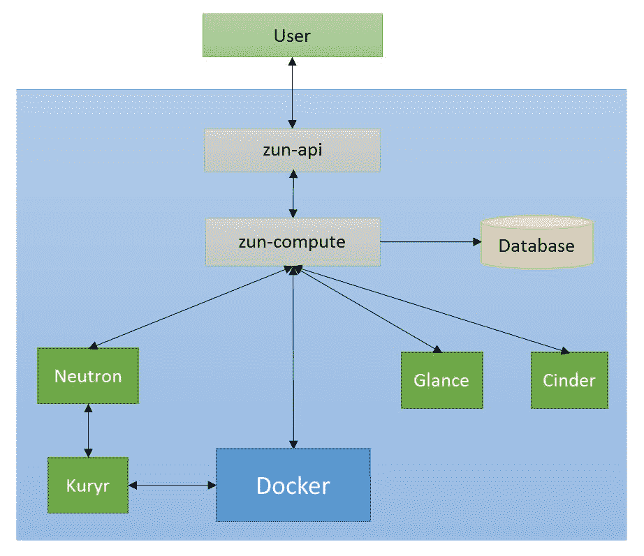

# 六、Zun——OpenStack 中的容器管理

在这一章中，我们将学习用于管理容器的 OpenStack 项目 Zun。Zun 是 OpenStack 中唯一允许其用户管理其应用容器的解决方案，支持不同的技术，以及其他 OpenStack 组件的优点，如煤渣、扫视和中子。Zun 为在 OpenStack IaaS 之上运行容器化应用提供了一个强大的平台。

本章将涵盖以下主题:

*   Zun 介绍
*   概念
*   主要特征
*   成分
*   走过
*   Zun DevStack 安装
*   管理容器

# Zun 介绍

Zun 是一个 OpenStack 服务，开始于 Magnum 团队成员开发的 Mitaka 周期。在 2016 年的 OpenStack Austin 峰会上做出了一项决定，即创建一个新项目，允许管理容器，并让 Magnum 容器基础设施管理服务只管理运行容器的基础设施。结果是 Zun 项目。

Zun 是 OpenStack 的一个容器管理服务，提供 API 来管理后端不同技术抽象的容器。Zun 支持 Docker 作为容器运行时工具。如今，Zun 与许多 OpenStack 服务集成在一起，例如用于联网的中子、用于管理容器映像的扫视以及用于向容器提供容量的煤渣。

Zun 在 Docker 上有各种插件，这使得它成为容器管理的强大解决方案。以下是 Zun 的一些显著特征:

*   为容器的完整生命周期管理提供标准的应用编程接口
*   提供基于 KeyStone 的多租户安全和授权管理
*   支持带有 runc 和 clear 容器的 Docker 来管理容器
*   透明容器的支持通过将单个容器封装在占用空间小的虚拟机中提供了更高的安全性
*   支撑煤渣为容器提供容积
*   基于 Kuryr 的容器级隔离网络
*   通过加热支持容器编排
*   称为胶囊的容器组合允许用户将多个具有相关资源的容器作为一个单元运行
*   支持 SR-IOV 功能，支持在虚拟机和容器之间共享物理 PCIe 设备
*   支持与容器的交互式会话
*   Zun 允许用户通过公开 CPU 集来使用专用资源运行繁重的工作负载

# 概念

在接下来的几节中，我们将看看 Zun 系统中可用的各种对象。

# 容器

容器是 Zun 中最重要的资源。Zun 中的容器代表用户运行的任何应用容器。容器对象存储诸如映像、命令、工作目录、主机等信息。Zun 是一个可扩展的解决方案；它还可以支持其他容器运行时工具。每个工具都有一个基于驱动的实现。Zun 中的 Docker 驱动程序通过 Docker 管理容器。Zun 中的容器支持许多高级操作，包括 CRUD 操作，如创建、启动、停止、暂停、删除、更新、终止等。

# 形象

Zun 中的映像是容器映像。这些映像由 Docker Hub 或 Glance 管理。为了节省时间，用户可以在创建容器之前下载映像并保存到“浏览”中。映像对象存储映像名称、标签、大小等信息。映像支持的操作包括上传、下载、更新和搜索映像。

# 服务

Zun 中的一个服务代表`zun-compute`服务。Zun 可以运行多个`zun-compute`服务实例，以支持可扩展性。该对象用于建立在 Zun 集群中运行的计算服务的状态。服务存储诸如状态、启用或禁用、最后已知时间等信息。

# 主机

Zun 中的主机代表计算节点的资源。计算节点是容器运行的物理机器。这用于建立 Zun 中可用的、已使用的资源列表。Zun 中的主机对象存储关于计算节点的有用信息，如总内存、可用内存、运行、停止或暂停的容器总数、总 CPU、可用 CPU 等。

# 胶囊

Zun 中的胶囊代表一个包含多个容器和其他相关资源的合成单元。胶囊中的容器相互之间共享资源，并紧密耦合在一起作为一个单元工作。胶囊对象存储容器列表、中央处理器、内存等信息。

# 容器司机

Zun 被设计成一个在 OpenStack 之上管理容器的可扩展解决方案。Zun 支持 Docker 来管理容器。它的目标是在未来支持多种其他工具，如火箭。为了支持这一点，Zun 有一个容器驱动程序的集合，它可以用许多其他运行时工具来实现，并作为 Zun 的解决方案提供。用户可以选择使用他们选择的工具来管理他们的容器。

# 映像驱动程序

我们了解到 Zun 可以支持多个容器运行时工具来管理容器。类似地，它支持多个用于管理容器映像的映像驱动程序，如扫视驱动程序和 Docker 驱动程序。映像驱动程序也是可配置的；用户可以为他们的用例选择任何可用的解决方案。

# 网络驱动程序

Zun 中的网络驱动程序提供了在两个容器之间以及容器和虚拟机之间进行通信的能力。Zun 有一个 Kuryr 驱动程序，用于管理容器的所有网络资源。它支持创建和删除网络、连接容器和断开容器与网络的连接等操作。

# 主要特征

除了容器的基本管理之外，Zun 还有许多高级功能。在本节中，我们将讨论 Zun 中的一些高级特性。还有许多其他正在开发的功能，如 SRIOV 网络、PCIe 设备等，这些都在 Zun 文档中提到。

# 煤渣集成

Zun 支持将持久存储附加到甚至在容器退出后仍然存在的容器上。这种存储可用于在主机外部存储大量数据，如果主机停机，这种存储会更加可靠。这种支持是通过煤渣在 Zun 启用的。用户可以将煤渣卷装入和卸载到他们的容器中。用户首先需要在煤渣中创建卷，然后在创建容器时提供卷。

# 容器成分

Zun 支持将多个容器创建为一个单元。这个单位在 Zun 被称为胶囊。这个概念非常类似于 Kubernetes 中的 PODS。一个胶囊包含多个容器和所有相关资源，如网络和存储，紧密耦合。胶囊中的所有容器都安排在同一台主机上，并共享资源，如 Linux 命名空间、CGroups 等。

# Kuryr 网络

由 Zun 创建的容器可以与 Nova 创建的虚拟机进行交互。该功能由`Kuryr-libnetwork`提供。它与中子交互，为容器创建必要的网络资源，并为其他 OpenStack 资源提供通信路径。

# 容器沙箱

Zun 有一个沙盒容器的集合。沙箱是一个容器，其中包含所有与之相关联的 IaaS 资源，如端口、IP 地址、卷等。沙箱的目的是将管理这些 IaaS 资源的开销从应用容器中分离出来。沙箱可以管理单个或多个容器，并提供所有需要的资源。

# 中央处理器组

Zun 允许其用户使用专用资源运行高性能容器。Zun 向用户公开其主机能力，用户可以在创建容器时指定所需的 CPU。

调度程序使用可用资源过滤节点，并在该节点上提供容器。主机信息在数据库中更新，以反映更新的资源。

# 成分

*Zun 网络套接字代理*部分的图表显示了 Zun 的架构。Zun 有两个二进制:`zun-api`和`zun-compute`。这两种服务共同承载了容器的容器管理的整个生命周期。这些服务与其他 OpenStack 服务进行交互，例如容器映像的扫视服务、为容器提供容量的煤渣服务以及容器和外部世界之间连接的中子服务。对容器的请求最终被传递给在计算节点上运行的 Docker 服务。Docker 然后为用户创建容器。

# Zun API

`zun-api`是一个 WSGI 服务器，服务于用户的 API 请求。对于 Zun 中的每个资源，都有单独的处理程序:

*   容器
*   主持
*   形象
*   Zun 服务

每个控制器处理对特定资源的请求。他们验证权限请求，验证 OpenStack 资源，包括验证映像是否存在于 Docker Hub 或 glass 中，并使用输入数据为资源创建一个数据库对象。该请求被转发给计算管理器。一旦从`zun-compute`服务接收到响应，`zun-api`服务将响应返回给用户。

# Zun 调度程序

Zun 中的调度程序不是一个 RPC 服务。这是一个简单的 Python 类，它在计算节点上应用一个过滤器，并选择合适的节点来处理请求。然后，计算管理器通过 RPC 调用将请求传递给选定的`zun-compute`。对`zun-compute`的调用可以是同步的，也可以是异步的，这取决于每个操作的处理时间。例如，列表调用可以是同步的，因为它们不耗时，而创建请求可以是异步的。

# zun 计算机

`zun-compute`服务是 Zun 系统的主要组成部分。它执行大部分后端操作，隐藏了所有的复杂性。`zun-compute`为每个请求选择合适的驱动程序，并为容器创建相关资源，如网络资源。然后，它将请求连同所有需要的信息一起传递给驱动程序。`zun-compute`与多个项目洽谈各种资源，如容器映像的扫视和网络资源的中子。

# Zun WebSocket 代理服务器

Zun 有一个 WebSocket 代理服务，用于在交互模式下运行容器。该服务与容器建立安全连接，以运行其中的任何命令:



# 走过

在本节中，我们将向您介绍如何在 Zun 中创建容器，以及请求如何从用户流向创建容器的 Docker。Zun 与其他多个 OpenStack 服务交互，获取容器所需的资源。

在 Zun 中创建容器的请求流程如下:

1.  用户通过命令行界面或地平线向`zun-api`服务发送一个 REST 应用编程接口调用，以创建一个集群，身份验证令牌从 KeyStone 接收。
2.  `zun-api`接收请求，并将令牌和访问权限的验证请求发送给 KeyStone。
3.  KeyStone 验证令牌，并发送带有角色和权限的更新的身份验证头。
4.  `zun-api`然后解析请求中的一些参数，如安全组、内存和运行时，并验证它们。
5.  请求的网络由`zun-api`创建。`zun-api`向中子发送请求，以确保请求的网络或端口可用。如果没有，则`zun-api`向中子发送另一个请求来搜索可用网络，并为容器创建一个新的 Docker 网络。
6.  `zun-api`然后检查请求的映像是否可用。如果找不到映像，请求失败，状态为`400` HTTP。
7.  `zun-api`如果请求中没有提供，则为容器生成一个名称。
8.  `zun-api`然后为容器创建一个数据库对象。
9.  `zun-api`向计算 API 管理器发送请求。计算管理器从调度程序中查找目标计算节点。
10.  `zun-api`然后将 RPC 异步调用请求发送到上一步选择的`zun-compute`，进一步处理请求。
11.  `zun-compute`从消息队列中挑选请求。
12.  `zun-compute`将容器的`task_state`设置为`IMAGE_PULLING`，并将条目存储在数据库中。
13.  `zun-compute`调用镜像驱动程序下载镜像。
14.  映像下载成功后，数据库中的`task_state`现在设置为`CONTAINER_CREATING`。
15.  现在，`zun-compute`声明容器所需的资源，并用所需的信息更新计算节点资源表。
16.  最后，向 Docker 发送请求，用所有需要的参数创建容器。
17.  Docker 驱动程序创建容器，将状态设置为`CREATED`、`status_reason`设置为`None`，并将容器对象保存在数据库中。
18.  容器成功完成后，`task_state`设置为`None`。

There are periodic tasks in Zun which sync the container status in the Zun database at a specific time interval.

# Zun DevStack 安装

我们现在来看看如何使用 DevStack 安装 Zun 的开发设置:

如果需要，为开发栈创建根目录:

```
$ sudo mkdir -p /opt/stack
$ sudo chown $USER /opt/stack  
```

要克隆开发栈存储库，请执行以下操作:

```
$ git clone https://git.openstack.org/openstack-dev/devstack 
/opt/stack/devstack  
```

现在，创建一个最小的`local.conf`来运行开发栈设置。我们将启用以下插件来创建 Zun 设置:

*   `devstack-plugin-container`本插件安装 Docker
*   `kuryr-libnetwork`:这是 Docker libnetwork 驱动，使用 Neutron 提供联网服务

```
$ cat > /opt/stack/devstack/local.conf << END
[[local|localrc]]
HOST_IP=$(ip addr | grep 'state UP' -A2 | tail -n1 | awk '{print $2}' | cut -f1  -d'/')
DATABASE_PASSWORD=password
RABBIT_PASSWORD=password
SERVICE_TOKEN=password
SERVICE_PASSWORD=password
ADMIN_PASSWORD=password
enable_plugin devstack-plugin-container https://git.openstack.org/openstack/devstack-plugin-container
enable_plugin zun https://git.openstack.org/openstack/zun
enable_plugin kuryr-libnetwork https://git.openstack.org/openstack/kuryr-libnetwork

# Optional:  uncomment to enable the Zun UI plugin in Horizon
# enable_plugin zun-ui https://git.openstack.org/openstack/zun-ui
END
```

现在，运行 DevStack:

```
$ cd /opt/stack/devstack
$ ./stack.sh  
```

创建一个新的外壳，并获取开发栈`openrc`脚本来使用 Zun 命令行界面:

```
$ source /opt/stack/devstack/openrc admin admin

```

现在，让我们通过查看服务列表来验证 Zun 安装:

```
$ zun service-list
+----+--------+-------------+-------+----------+-----------------+---------------------------+--------------------------+
| Id | Host   | Binary      | State | Disabled | Disabled Reason | Created At                | Updated At                |
+----+--------+-------------+-------+----------+-----------------+---------------------------+---------------------------+
| 1  | galvin | zun-compute | up    | False    | None            | 2017-10-10 11:22:50+00:00 | 2017-10-10 11:37:03+00:00 |
+----+--------+-------------+-------+----------+-----------------+---------------------------+---------------------------+  
```

让我们看看主机列表，它还显示了在 Zun 中注册使用的计算节点:

```
$ zun host-list
+--------------------------------------+----------+-----------+------+--------------------+--------+
| uuid                                 | hostname | mem_total | cpus | os                 | labels |
+--------------------------------------+----------+-----------+------+--------------------+--------+
| 08fb3f81-d88e-46a1-93b9-4a2c18ed1f83 | galvin   | 3949      | 1    | Ubuntu 16.04.3 LTS | {}     |
+--------------------------------------+----------+-----------+------+--------------------+--------+  
```

我们可以看到，我们有一个计算节点，这就是主机本身。现在，我们还来看看主机中的可用资源:

```
$ zun host-show galvin
+------------------+-----------------------------------------------------------------------------------------------------------------------------------------------------------------------------------------------------+
| Property         | Value                                                                                                                                                                                               |
+------------------+----------------------------------------------------------------------------------------------------------------------------------------------------------------------------------------------------+
| hostname         | galvin                                                                                                                                                                                              |
| uuid             | 08fb3f81-d88e-46a1-93b9-4a2c18ed1f83                                                                                                                                                                |
| links            | ["{u'href': u'http://10.0.2.15/v1/hosts/08fb3f81-d88e-46a1-93b9-4a2c18ed1f83', u'rel': u'self'}", "{u'href': u'http://10.0.2.15/hosts/08fb3f81-d88e-46a1-93b9-4a2c18ed1f83', u'rel': u'bookmark'}"] |
| kernel_version   | 4.10.0-28-generic                                                                                                                                                                                   |
| labels           | {}                                                                                                                                                                                                  |
| cpus             | 1                                                                                                                                                                                                   |
| mem_total        | 3949                                                                                                                                                                                                |
| total_containers | 0                                                                                                                                                                                                  |
| os_type          | linux                                                                                                                                                                                               |
| os               | Ubuntu 16.04.3 LTS                                                                                                                                                                                  |
| architecture     | x86_64                                                                                                                                                                                              |
+------------ ------+-----------------------------------------------------------------------------------------------------------------------------------------------------------------------------------------------------+  
```

我们可以看到`zun-compute`服务正在运行。当前安装程序只安装一个计算服务；您也可以安装多节点 Zun 安装程序。详情请参考[https://github . com/open stack/Zun/blob/master/doc/source/contributor/quick start . rst](https://github.com/openstack/zun/blob/master/doc/source/contributor/quickstart.rst)。

# 管理容器

现在我们已经运行了一个 Zun 安装程序，我们将在这一部分尝试对容器进行一些操作。

我们现在将在 Zun 中创建一个容器。但在此之前，让我们检查一下 Docker 状态:

```
$ sudo docker ps -a
CONTAINER ID        IMAGE                                                 COMMAND                  CREATED              STATUS                          PORTS               NAMES  
```

我们可以看到现在没有容器存在。现在，让我们创建容器:

```
$ zun create --name test cirros ping -c 4 8.8.8.8
+-------------------+---------------------------------------------------------------------------------------------------------------------------------------------------------------------------------------------------------------+
| Property          | Value                                                                                                                                                                                                         |
+-------------------+---------------------------------------------------------------------------------------------------------------------------------------------------------------------------------------------------------------+
| addresses         |                                                                                                                                                                                                               |
| links             | ["{u'href': u'http://10.0.2.15/v1/containers/f78e778a-ecbd-42d3-bc77-ac50334c8e57', u'rel': u'self'}", "{u'href': u'http://10.0.2.15/containers/f78e778a-ecbd-42d3-bc77-ac50334c8e57', u'rel': u'bookmark'}"] |
| image             | cirros                                                                                                                                                                                                        |
| labels            | {}                                                                                                                                                                                                            |
| networks          |                                                                                                                                                                                                               |
| security_groups   | None                                                                                                                                                                                                          |
| image_pull_policy | None                                                                                                                                                                                                          |
| uuid              | f78e778a-ecbd-42d3-bc77-ac50334c8e57                                                                                                                                                                          |
| hostname          | None                                                                                                                                                                                                          |
| environment       | {}                                                                                                                                                                                                            |
| memory            | None                                                                                                                                                                                                          |
| status            | Creating                                                                                                                                                                                                      |
| workdir           | None                                                                                                                                                                                                          |
| auto_remove       | False                                                                                                                                                                                                         |
| status_detail     | None                                                                                                                                                                                                          |
| host              | None                                                                                                                                                                                                          |
| image_driver      | None                                                                                                                                                                                                          |
| task_state        | None                                                                                                                                                                                                          |
| status_reason     | None                                                                                                                                                                                                          |
| name              | test                                                                                                                                                                                                          |
| restart_policy    | None                                                                                                                                                                                                          |
| ports             | None                                                                                                                                                                                                          |
| command           | "ping" "-c" "4" "8.8.8.8"                                                                                                                                                                                     |
| runtime           | None                                                                                                                                                                                                          |
| cpu               | None                                                                                                                                                                                                          |
| interactive       | False                                                                                                                                                                                                         |
+-------------------+---------------------------------------------------------------------------------------------------------------------------------------------------------------------------------------------------------------+  
```

现在，让我们看一下 Zun 列表来检查容器状态:

```
stack@galvin:~/devstack$ zun list
+--------------------------------------+------+--------+----------+---------------+-----------+-------+
| uuid                                 | name | image  | status   | task_state    | addresses | ports |
+--------------------------------------+------+--------+----------+---------------+-----------+-------+
| f78e778a-ecbd-42d3-bc77-ac50334c8e57 | test | cirros | Creating | image_pulling |           | []    |
+--------------------------------------+------+--------+----------+---------------+-----------+-------+
```

我们可以看到容器处于创建状态。让我们也检查 Docker 中的容器:

```
$ sudo docker ps -a
CONTAINER ID        IMAGE                                                    COMMAND                  CREATED             STATUS                       PORTS               NAMES
cbd2c94d6273        cirros:latest                                            "ping -c 4 8.8.8.8"      38 seconds ago      Created                                          zun-f78e778a-ecbd-42d3-bc77-ac50334c8e57  
```

现在，让我们启动容器并查看日志:

```
$ zun start test
Request to start container test has been accepted.

$ zun logs test
PING 8.8.8.8 (8.8.8.8): 56 data bytes
64 bytes from 8.8.8.8: seq=0 ttl=40 time=25.513 ms
64 bytes from 8.8.8.8: seq=1 ttl=40 time=25.348 ms
64 bytes from 8.8.8.8: seq=2 ttl=40 time=25.226 ms
64 bytes from 8.8.8.8: seq=3 ttl=40 time=25.275 ms

--- 8.8.8.8 ping statistics ---
4 packets transmitted, 4 packets received, 0% packet loss
round-trip min/avg/max = 25.226/25.340/25.513 ms  
```

让我们对容器进行一些高级操作。我们现在将使用 Zun 创建一个交互式容器:

```
$ zun run -i --name new ubuntu /bin/bash
+-------------------+---------------------------------------------------------------------------------------------------------------------------------------------------------------------------------------------------------------+
| Property          | Value                                                                                                                                                                                                         |
+-------------------+---------------------------------------------------------------------------------------------------------------------------------------------------------------------------------------------------------------+
| addresses         |                                                                                                                                                                                                               |
| links             | ["{u'href': u'http://10.0.2.15/v1/containers/dd6764ee-7e86-4cf8-bae8-b27d6d1b3225', u'rel': u'self'}", "{u'href': u'http://10.0.2.15/containers/dd6764ee-7e86-4cf8-bae8-b27d6d1b3225', u'rel': u'bookmark'}"] |
| image             | ubuntu                                                                                                                                                                                                        |
| labels            | {}                                                                                                                                                                                                            |
| networks          |                                                                                                                                                                                                               |
| security_groups   | None                                                                                                                                                                                                          |
| image_pull_policy | None                                                                                                                                                                                                          |
| uuid              | dd6764ee-7e86-4cf8-bae8-b27d6d1b3225                                                                                                                                                                          |
| hostname          | None                                                                                                                                                                                                          |
| environment       | {}                                                                                                                                                                                                            |
| memory            | None                                                                                                                                                                                                          |
| status            | Creating                                                                                                                                                                                                      |
| workdir           | None                                                                                                                                                                                                          |
| auto_remove       | False                                                                                                                                                                                                         |
| status_detail     | None                                                                                                                                                                                                          |
| host              | None                                                                                                                                                                                                          |
| image_driver      | None                                                                                                                                                                                                          |
| task_state        | None                                                                                                                                                                                                          |
| status_reason     | None                                                                                                                                                                                                          |
| name              | new                                                                                                                                                                                                           |
| restart_policy    | None                                                                                                                                                                                                          |
| ports             | None                                                                                                                                                                                                          |
| command           | "/bin/bash"                                                                                                                                                                                                   |
| runtime           | None                                                                                                                                                                                                          |
| cpu               | None                                                                                                                                                                                                          |
| interactive       | True                                                                                                                                                                                                          |
+-------------------+---------------------------------------------------------------------------------------------------------------------------------------------------------------------------------------------------------------+
Waiting for container start
Waiting for container start
Waiting for container start
Waiting for container start
Waiting for container start
Waiting for container start
Waiting for container start
Waiting for container start
Waiting for container start
Waiting for container start
connected to dd6764ee-7e86-4cf8-bae8-b27d6d1b3225, press Enter to continue
type ~. to disconnect
root@81142e581b10:/# 
root@81142e581b10:/# ls
bin  boot  dev  etc  home  lib  lib64  media  mnt  opt  proc  root  run  sbin  srv  sys  tmp  usr  var
root@81142e581b10:/# exit
exit  
```

现在，让我们删除容器:

```
$ zun delete test
Request to delete container test has been accepted.

$ zun list
+--------------------------------------+------+--------+---------+------------+--------------------------+-------+
| uuid                                 | name | image  | status  | task_state | addresses                | ports |
+--------------------------------------+------+--------+---------+------------+--------------------------+-------+
| dd6764ee-7e86-4cf8-bae8-b27d6d1b3225 | new  | ubuntu | Stopped | None       | 172.24.4.11, 2001:db8::d | []    |
+--------------------------------------+------+--------+---------+------------+--------------------------+-------+  
```

我们现在来看看一些命令，看看映像是如何在 Zun 中管理的。下载 Ubuntu 映像:

```
$ zun pull ubuntu
+----------+-------------------------------------------------------------------------------------------------------------------------------------------------------------------------------------------------------+
| Property | Value                                                                                                                                                                                                 |
+----------+-------------------------------------------------------------------------------------------------------------------------------------------------------------------------------------------------------+
| uuid     | 9b34875a-50e1-400c-a74b-028b253b35a4                                                                                                                                                                  |
| links    | ["{u'href': u'http://10.0.2.15/img/9b34875a-50e1-400c-a74b-028b253b35a4', u'rel': u'self'}", "{u'href': u'http://10.0.2.img/9b34875a-50e1-400c-a74b-028b253b35a4', u'rel': u'bookmark'}"] |
| repo     | ubuntu                                                                                                                                                                                                |
| image_id | None                                                                                                                                                                                                  |
| tag      | latest                                                                                                                                                                                                |
| size     | None                                                                                                                                                                                                  |
+----------+-------------------------------------------------------------------------------------------------------------------------------------------------------------------------------------------------------+  
```

现在让我们看看 Zun 中的映像列表:

```
stack@galvin:~/devstack$ zun image-list
+--------------------------------------+----------+--------+--------+------+
| uuid                                 | image_id | repo   | tag    | size |
+--------------------------------------+----------+--------+--------+------+
| 9b34875a-50e1-400c-a74b-028b253b35a4 | None     | ubuntu | latest | None |
+--------------------------------------+----------+--------+--------+------+  
```

# 摘要

在这一章中，我们学习了 OpenStack 容器管理服务 Zun。我们研究了 Zun 中的不同物体。然后，我们还了解了 Zun 的组件和架构。本章还详细概述了用户请求管理 Zun 中容器的工作流程。然后，我们看了如何使用 DevStack 在 Zun 中安装开发设置，并使用 Zun CLI 做了一个动手练习，创建一个容器，并启动和停止容器上的各种其他操作。在下一章中，我们将了解 Kuryr，它使用中子为容器提供网络资源。