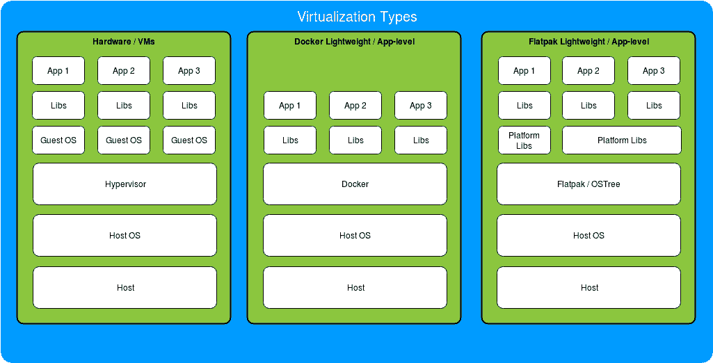

# 一、容器——不仅仅是另一个流行语

在技术方面，有时进步很小，但正如容器化一样，进步是巨大的，将长期以来的实践和教导完全颠倒过来。有了这本书，我们将带您从运行一个微小的服务，到使用 Docker 的容器化构建弹性可扩展的系统，这是这场革命的基石。我们将通过基本模块进行稳定但一致的升级，重点是 Docker 的内部工作，并且在继续的过程中，我们将尝试将大部分时间花在复杂的部署及其考虑事项上。

让我们看看本章将讲述的内容:

*   什么是容器，为什么我们需要它们？

*   Docker 在容器界的地位

*   用容器思维思考

# 容器的什么和为什么

我们不能一开始就谈论 Docker，而不实际涵盖使它成为如此强大的工具的想法。在最基本的层面上，容器是一个独立的用户空间环境，用于给定的离散功能集。换句话说，这是一种将系统(或一个系统的一部分)模块化成更容易管理和维护的部分的方法，同时通常对故障也非常有弹性。

在实践中，这种净收益从来都不是免费的，需要在新工具(如 Docker)的采用和实现上进行一些投资，但是这种变化给采用者带来了巨大的好处，在开发、维护和扩展成本上大幅降低。

在这一点上，你可能会问:容器到底是如何提供如此巨大的好处的？为了理解这一点，我们首先需要在这样的工具可用之前了解一下部署。

在部署的早期，部署服务的过程是这样的:

1.  开发人员会编写一些代码。
2.  运营部将部署该代码。
3.  如果在部署中有任何问题，运营团队会告诉开发人员解决一些问题，然后我们会回到第 1 步。

这个过程的简化如下所示:

```
dev machine => code => ops => bare-metal hosts
```

开发人员将不得不等待整个过程反弹回来，以便在出现问题时尝试编写修复程序。更糟糕的是，运营团队通常不得不使用各种神秘的魔法形式来确保开发人员提供给他们的代码能够在部署机器上实际运行，因为库版本、操作系统补丁和语言编译器/解释器的差异都有很高的失败风险，并且可能会在这漫长的中断-补丁-部署尝试周期中花费大量时间。

部署发展的下一步是通过裸机主机的虚拟化来改进这一工作流程，因为手动维护机器和环境的异构组合是一场彻头彻尾的噩梦，即使它们的数量只有个位数。`chroot`等早期工具在 70 年代末问世，但后来被 Xen、KVM、Hyper-V 等虚拟机管理程序以及其他一些虚拟机管理程序所取代(尽管不是完全取代)，这不仅降低了较大系统的管理复杂性，还为 Ops 和开发人员提供了更一致且计算密度更高的部署环境:

```
dev machine => code => ops => n hosts * VM deployments per host
```

这有助于减少管道末端的故障，但从开发人员到部署的路径仍然存在风险，因为虚拟机环境很容易与开发人员不同步。

从这里，如果我们真的试图弄清楚如何让这个系统变得更好，我们已经可以看到 Docker 和其他容器技术是如何有机地进行下一步的。通过使开发人员的沙箱环境尽可能接近生产环境，具有足够功能的容器系统的开发人员可以绕过 ops 步骤，确保代码可以在部署环境中工作，并防止由于多个组交互的开销而导致的任何冗长的重写周期:

```
dev machine => container => n hosts * VM deployments per host
```

由于 Ops 主要在系统设置的早期阶段被需要，开发人员现在可以将他们的代码从想法中直接带到用户面前，并且相信他们会发现的大多数问题都是他们能够解决的。

如果你认为这是部署服务的新模式，那么很有理由理解为什么我们现在有 DevOps 角色，为什么在**平台即服务** ( **PaaS** )设置中有如此多的嗡嗡声，以及为什么如此多的科技巨头可以在 15 分钟内用开发者的简单操作`git push origin`在不与系统进行任何其他交互的情况下，一次对数百万人使用的服务进行更改。

但好处也不止于此！如果您在任何地方都有许多小容器，并且如果您增加或减少了对服务的需求，您可以添加或删除一部分主机，并且如果容器编排正确，将不会有停机时间，也不会有用户注意到的伸缩变化。对于需要在不同时间处理可变负载的服务提供商来说，这非常方便——以网飞和他们的峰值收视时间为例。在大多数情况下，这些也可以在几乎所有的云平台上实现自动化(即 AWS 自动扩展组、Google Cluster Autoscaler 和 Azure Autoscale)，这样，如果发生某些触发或资源消耗发生变化，服务将自动上下扩展主机数量来处理负载。通过自动化所有这些过程，您的 PaaS 几乎可以成为一个“一劳永逸”的灵活层，在此之上，开发人员可以担心真正重要的事情，而不会浪费时间去尝试弄清楚一些系统库是否安装在部署主机上。

现在不要误会我；无论怎么想象，做出这些令人惊叹的 PaaS 服务之一都不是一件容易的事情，道路上布满了无数隐藏的陷阱，但是如果你想在整个晚上都能睡得很香，而没有愤怒的客户、老板或同事的电话，无论你是否是开发人员，你都必须努力尽可能接近这些理想的设置。

# Docker 的地方

到目前为止，我们已经谈了很多关于容器的问题，但是还没有提到 Docker。虽然 Docker 已经成为容器化的事实标准，但它目前是该领域许多竞争技术之一，今天相关的可能不是明天。出于这个原因，我们将介绍一点容器生态系统，这样，如果您看到这个领域发生了变化，请不要犹豫，尝试另一种解决方案，因为为工作选择合适的工具几乎总是胜过尝试，俗话说，在圆孔中安装方形钉子。

虽然大多数人都知道 Docker 是**命令行界面** ( **CLI** )工具，但 Docker 平台不止于此，还包括创建和管理集群、处理持久存储、构建和共享 Docker 容器等工具，但目前，我们将重点关注生态系统中最重要的部分:Docker 容器。

# Docker 容器简介

Docker 容器本质上是一组文件系统层，这些文件系统层按顺序堆叠在彼此之上，以创建最终布局，然后由主机内核在隔离的环境中运行。每一层描述相对于其先前的父层，哪些文件已经被添加、修改和/或删除。例如，你有一个带有文件`/foo/bar`的基础图层，下一个图层添加一个文件`/foo/baz`。当容器启动时，它将按顺序组合各层，得到的容器将同时具有`/foo/bar`和`/foo/baz`。对任何新的层重复这个过程，最终得到一个完整的文件系统来运行指定的一个或多个服务。

把映像中文件系统层的排列想象成交响乐中复杂的声音层次:你在后面有打击乐器来为声音提供基础，管乐器靠近一点来驱动动作，在前面有弦乐器来引导旋律。一起，它创造了一个令人愉快的最终结果。在 Docker 的情况下，您通常让基础层设置主要的操作系统层和配置，服务基础结构层在基础层之上(解释器安装、助手编译等)，您运行的最终映像最终以实际的服务代码结束。目前，这是您需要知道的全部内容，但是我们将在下一章中更详细地讨论这个主题。

本质上，当前形式的 Docker 是一个平台，允许在可扩展、易于互换和易于分发的容器中轻松快速地开发隔离的(或不依赖于服务如何配置的)Linux 和 Windows 服务。

# 竞争

在我们深入了解 Docker 本身之前，让我们也大致介绍一下当前的一些竞争对手，看看它们与 Docker 本身有何不同。几乎所有这些都很奇怪，它们通常是围绕 Linux 控制组(`cgroups`)和名称空间的一种抽象形式，分别限制了 Linux 主机物理资源的使用，并将进程组相互隔离。虽然这里提到的几乎每一个工具都提供了某种形式的资源容器化，但是它在隔离深度、实现安全性和/或容器分布方面有很大的不同。

# rkt

`rkt`，常被写成 **Rocket** ，是 CoreOS 最接近的竞争应用容器化平台，最初是作为更安全的应用容器运行时启动的。随着时间的推移，Docker 已经解决了许多安全问题，但与作为用户服务以有限权限运行的`rkt`不同，Docker 的主服务以 root 身份运行。这意味着，如果有人设法突破 Docker 容器，他们将自动拥有对主机根目录的完全访问权限，从操作角度来看，这显然是一件非常糟糕的事情，而对于`rkt`来说，黑客还需要将他们的权限从受限用户升级。虽然从安全角度来看，这种比较并没有给 Docker 带来太大的好处，但如果要推断它的发展轨迹，这个问题有可能在未来得到很大程度的缓解和/或解决。

另一个有趣的区别是，与 Docker 不同，Docker 被设计为在容器内运行单个进程，`rkt`可以在一个容器内运行多个进程。这使得在一个容器中部署多个服务变得更加容易。现在，说了这么多，你实际上*可以*在一个 Docker 容器中运行多个进程(我们将在本书的稍后部分讨论这个问题)，但是正确地设置它是一件非常痛苦的事情，但是我确实在实践中发现，保持服务和容器基于单个进程的压力确实会促使开发人员将容器创建为真正的微服务，而不是将其视为迷你虚拟机，所以不要认为这一定是一个问题。

虽然选择 Docker 而不是`rkt`还有许多其他更小的理由，反之亦然，但有一件重要的事情不可忽视:采用率。虽然`rkt`有点年轻，但 Docker 已经被几乎所有大型科技巨头采用，似乎没有任何停止趋势的迹象。考虑到这一点，如果你今天需要在微服务上工作，选择可能非常明确，但就像任何技术领域一样，生态系统在一年甚至几个月内可能会有很大不同。

# 系统级虚拟化

另一方面，我们有使用完整系统映像的平台，而不是像 LXD、OpenVZ、KVM 和其他一些应用。与 Docker 和`rkt`不同，它们旨在为您提供对所有虚拟化系统服务的全面支持，但根据其定义，其代价是更高的资源使用率。虽然在主机上有单独的系统容器对于更好的安全性、隔离性以及可能的兼容性是必要的，但是这些容器的几乎所有使用都可以从个人体验转移到应用级虚拟化系统，只需做一些工作就可以提供更好的资源使用配置和更高的模块化，而创建初始基础架构的成本会略有增加。这里要遵循的一个明智的规则是，如果您正在编写应用和服务，您可能应该使用应用级虚拟化，但是如果您正在向最终用户提供虚拟机，或者希望服务之间有更多的隔离，您应该使用系统级虚拟化。

# 桌面应用级虚拟化

Flatpak、AppImage、Snaps 和其他类似技术也为单应用级容器提供隔离和打包，但与 Docker 不同，它们都以桌面应用的部署为目标，对容器生命周期(即启动、停止、强制终止等)没有同样精确的控制，通常也不提供分层映像。相反，这些工具中的大多数都有很好的包装器**图形用户界面** ( **图形用户界面**)并为安装、运行和更新桌面应用提供了更好的工作流程。虽然由于对上述`cgroups`和名称空间的相同底层依赖，大多数平台与 Docker 有很大的重叠，但这些应用级虚拟化平台传统上不处理服务器应用(运行时没有用户界面组件的应用)，反之亦然。由于这一领域还很年轻，而且它们所覆盖的空间相对较小，您可能会期望合并和交叉，因此在这种情况下，Docker 可能会进入桌面应用交付领域和/或这些竞争技术中的一种或多种尝试支持服务器应用。



# 什么时候应该考虑容器化？

到目前为止，我们已经涵盖了很多方面，但是有一个重要的方面我们还没有涵盖，但是这是一个非常重要的事情来评估，因为容器在作为最终部署目标的大量情况下没有意义，不管围绕这个概念有多少争议，所以我们将涵盖一些应该真正考虑(或不考虑)这种类型的平台的一般用例。虽然从运营的角度来看，容器化在大多数情况下应该是最终目标，并且在注入到开发过程中时，以最小的努力提供巨大的红利，但是将部署机器转变为容器化的平台是一个非常棘手的过程，如果您不能从中获得切实的好处，那么您不妨将这段时间用于能够为您的服务带来真正的、切实的价值的事情。

让我们先从缩放阈值开始。如果您的服务作为一个整体可以完全适应并在相对较小或中等的虚拟机或裸机主机上运行良好，并且您没有预料到突然的扩展需求，那么部署机器上的虚拟化会让您走上痛苦的道路，而这在大多数情况下是不值得的。即使是建立良性但稳健的虚拟化设置，高昂的前期成本通常也会更好地用于开发该级别的服务功能。

如果您看到用虚拟机或裸机主机支持的服务的需求增加，您总是可以扩展到更大的主机(垂直扩展)并重新关注您的团队，但如果不是这样，您可能不应该走这条路。很多情况下，企业花了几个月的时间来实现容器技术，因为它非常受欢迎，但却因为缺乏开发资源而失去了客户，不得不关门大吉。

现在，您的系统已经突破了垂直可伸缩性的限制，是时候将 Docker 集群之类的东西添加到这个组合中了吗？真正的答案是“可能”。如果您的服务跨主机是同构的和一致的，例如分片的或集群的数据库或简单的 API，在大多数情况下，这也不是合适的时机，因为您可以使用主机映像和某种负载平衡器轻松扩展该系统。如果您选择更高级的功能，您可以使用基于云的**数据库即服务** ( **数据库即服务**)如亚马逊 RDS、微软 DocumentDB 或谷歌 BigQuery，并根据所需的性能水平通过同一提供商(甚至不同的提供商)上下自动扩展服务主机。

如果除此之外还有大量的服务种类的预示，从开发人员到部署的更短管道的需求，复杂性的增加，或者指数级的增长，那么您应该考虑将这些作为触发器来重新评估您的优点/缺点，但是没有明确的界限。不过，这里的一个好的经验法则是，如果你的团队有一个缓慢的时期，探索容器化选项或提升你在这个领域的技能并没有什么坏处，但是要非常小心，不要低估正确建立这样一个平台所需的时间，不管这些工具的入门说明看起来有多简单。

有了这些，有什么明显的迹象表明您需要尽快将容器加入到您的工作流中？这里可能有许多微妙的提示，但下面的列表涵盖了那些如果答案是肯定的，应该立即将容器主题提出来讨论的提示，因为好处远远超过了对您的服务平台的时间投资:

*   您的部署中是否有超过 10 种独特的、离散的和互连的服务？
*   您是否需要在主机上支持三种或三种以上的编程语言？
*   您的运营资源是否不断部署和升级服务？
*   您的服务是否需要“四个 9”(99.99%)或更高的可用性？
*   您是否有重复出现的服务中断部署的模式，因为开发人员没有考虑到服务运行的环境？
*   你是否有一个才华横溢的开发或运营团队无所事事？
*   你的项目在钱包里有一个燃烧的洞吗？

好吧，也许最后一个有点开玩笑，但它在列表中以某种讽刺的语气说明，在撰写本文时，无论您的货币是时间还是金钱，让 PaaS 平台运行、稳定和安全既不容易也不便宜。许多人会试图欺骗你，让你认为你应该总是使用容器，让一切都记录在案，但保持怀疑的心态，并确保你仔细评估你的选择。

# 理想的 Docker 部署

现在我们已经完成了真正的对话部分，让我们说我们已经真正准备好为一个想象的服务处理容器和 Docker。我们在本章的前面已经介绍了其中的一些细节，但是我们将在这里具体定义如果我们有足够的时间来处理它们，我们的理想需求会是什么样子:

*   开发人员应该能够部署新的服务，而不需要任何运营资源
*   系统可以自动发现正在运行的服务的新实例
*   该系统可以灵活地上下扩展
*   在期望的代码提交时，新代码将自动部署，无需开发人员或操作人员的干预
*   您可以无中断地无缝处理降级的节点和服务
*   您能够充分利用主机上可用的资源(内存、中央处理器等)
*   开发人员几乎不需要单独访问节点

如果这些是要求，你会很高兴知道几乎所有的要求在很大程度上都是可行的，我们会在本书中详细介绍几乎所有的要求。对他们中的许多人来说，我们需要更深入地了解 Docker*，超越你在其他地方找到的大部分材料，但是没有必要教你那些你不能带到只打印出“Hello World”的领域的部署*

 *当我们在接下来的章节中探索每一个主题时，我们将确保覆盖任何陷阱，因为有许多这样复杂的系统交互。有些对你来说是显而易见的，但许多可能不会(例如，PID1 问题)，因为这个领域的工具相对年轻，并且许多对 Docker 生态系统至关重要的工具甚至不是 1.0 版本，或者直到最近才达到 1.0 版本。

因此，你应该考虑这个技术空间仍然处于发展的早期阶段，所以现实一点，不要期待奇迹，期待健康的小“陷阱”。还要记住，一些最大的科技巨头现在已经使用 Docker 很长时间了(红帽、微软、谷歌、IBM 等等)，所以也不要害怕。

要开始并真正开始我们的旅程，我们需要首先重新考虑我们对服务的看法。

# 容器思维

今天，正如我们在本章前面已经介绍过的那样，今天部署的绝大多数服务都是由临时的或手动连接和配置的部分组成的一个大杂烩，一旦单个部分被更改或移动，这些部分就很容易分离。很容易把它想象成一个纸牌搭成的塔，需要改变的部分经常在它的中间，有把整个结构推倒的风险。中小型项目和有才华的开发和运营团队大多可以管理这种复杂程度，但它确实不是一种可扩展的方法。

# 开发人员工作流程

即使您没有在 PaaS 系统上工作，也最好将服务的每一部分都视为在开发人员和最终部署主机之间应该具有一致环境的东西，能够在任何地方运行，只需很少的更改，并且足够模块化，以便在需要时可以用兼容 API 的模拟来替换。对于其中的许多情况，即使是本地 Docker 的使用也可以大大简化部署，因为您可以将每个组件隔离成小块，这些小块不会随着开发环境的变化而变化。

为了说明这一点，想象一个实际的案例，我们正在编写一个简单的 web 服务，该服务与基于最新 Ubuntu 的系统上的数据库进行对话，但是我们的部署环境是 CentOS 的某种迭代。在这种情况下，由于它们的支持周期长度差异很大，在版本和库之间进行协调将非常困难，因此作为开发人员，您可以使用 Docker 为您提供与 CentOS 相同的数据库版本，并且您可以在基于 CentOS 的容器中测试您的服务，以确保所有库和依赖项在部署时都可以工作。这个过程将改进开发工作流，即使真正的部署主机没有容器化。

现在，我们将从一个稍微现实的方向来看这个例子:如果您需要在当前支持的所有版本的 CentOS 上运行您的服务而不修改代码，该怎么办？

有了 Docker，您可以为每个版本的操作系统准备一个容器，用来测试服务，以确保您不会得到任何意外。另外，您可以自动运行一个测试套件运行程序，一个接一个地启动每个操作系统版本容器(或者更好的是，并行地)，以便在任何代码更改时自动针对它们运行整个测试套件。仅通过这几个小的调整，我们就将一个不断中断生产的临时服务变成了您几乎永远不用担心的东西，因为您可以确信它在部署时会工作，这是非常强大的工具。

如果您扩展这个过程，您可以在本地创建 Docker 菜谱(Dockerfiles)，我们将在下一章中详细介绍，其中包含一组使您的服务从普通的 CentOS 安装运行到完全能够运行该服务所需的确切步骤。这些步骤可以由运营团队作为其自动化配置管理(CM)系统(如 Ansible、Salt、Puppet 或 Chef)的输入进行最小化的更改，以确保主机拥有正确运行所需的准确基线。这种由服务开发人员编写的最终目标所需的精确步骤的编码传输正是 Docker 成为如此强大的工具的原因。

正如希望变得显而易见的那样，Docker 作为一种工具不仅可以改进部署机器上的开发过程，还可以在整个过程中使用它来标准化您的环境，从而提高部署管道几乎每个部分的效率。有了 Docker，你很可能会忘记给每个 Ops 人员灌输恐惧的臭名昭著的短语:“它在我的机器上运行良好！”。这本身应该足以让您考虑在基于容器的工作流中进行拼接，即使您的部署基础架构不支持容器。

The bottom line here that we've been dancing around and which you should always consider is that with the current tooling available, turning your whole deployment infrastructure into a container-based one is slightly difficult, but the addition of containers in any other part of your development process is generally not too difficult and can provide exponential workflow improvements to your team.

# 摘要

在这一章中，我们跟踪了部署的历史，并研究了带有 Docker 的容器如何让我们更接近这个新的微服务世界。Docker 接受了关于我们最感兴趣的部分的高级概述。我们通过一些用例介绍了竞争以及 Docker 在生态系统中的位置。最后，我们还讨论了什么时候应该——更重要的是，什么时候不应该——在您的基础设施和开发工作流中考虑容器。

在下一章中，我们将最终弄脏我们的手，并研究如何安装和运行 Docker 映像以及创建我们的第一个 Docker 映像，所以一定要留下来。*