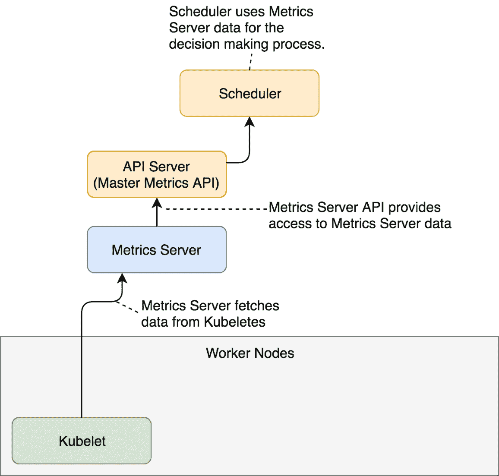
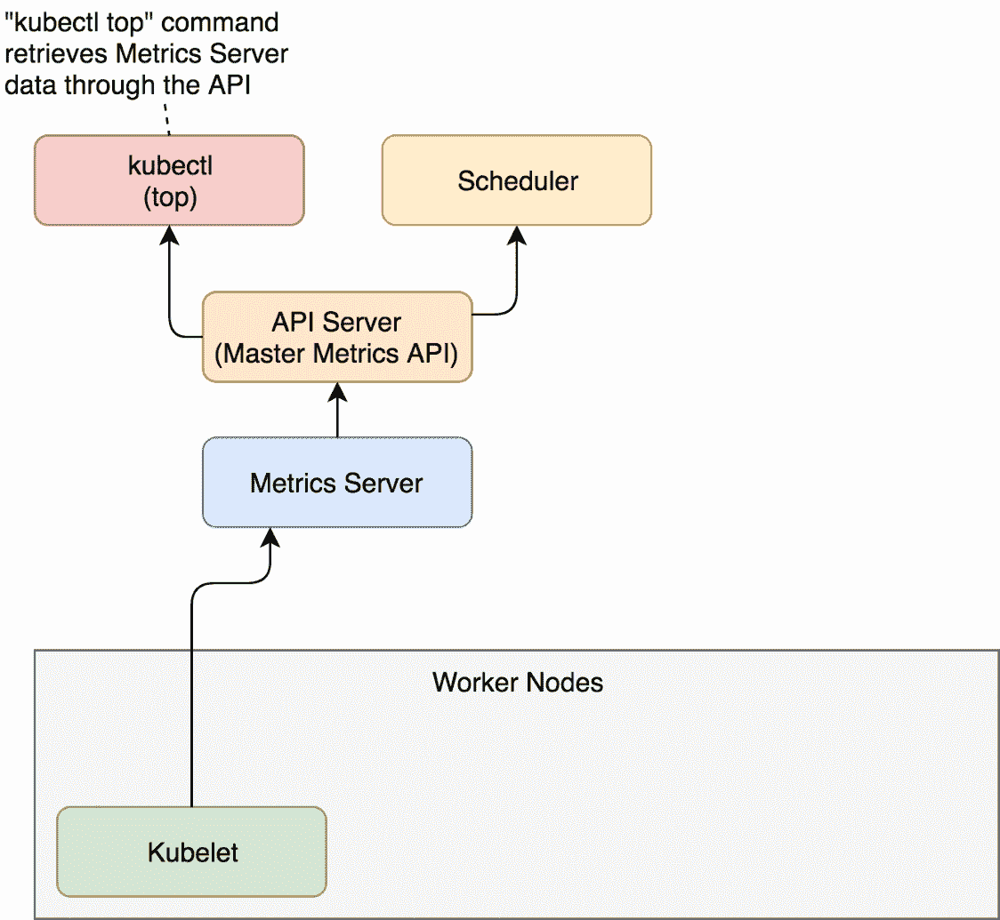
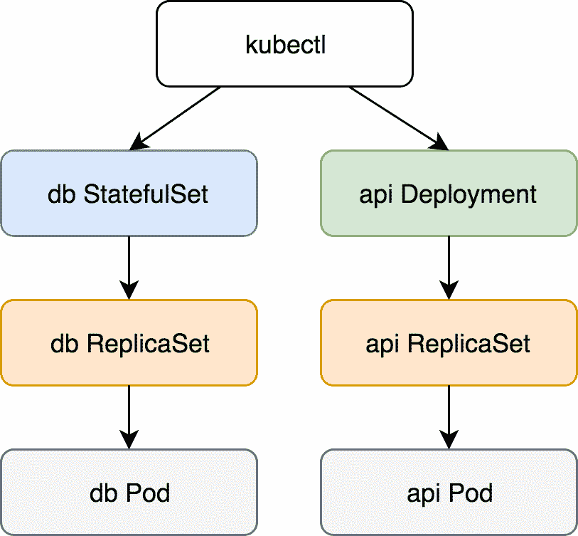
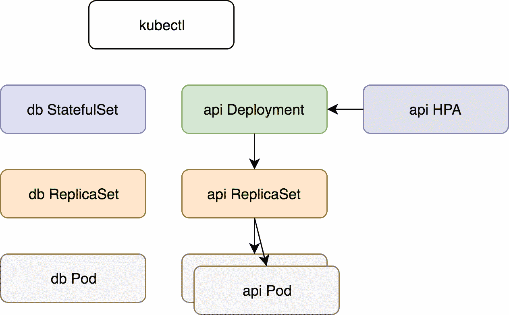
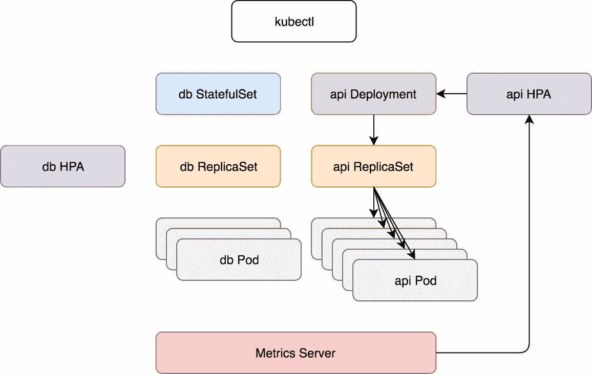

# 根据资源使用情况自动调整部署和状态集

Change is the essential process of all existence.

- *史巴克*

到目前为止，您可能已经理解了基于 Kubernetes 的系统的一个关键方面是高水平的动态性。几乎没有什么是静止的。我们定义部署或状态集，Kubernetes 将 Pods 分布在集群中。在大多数情况下，这些豆荚很少长时间坐在一个地方。滚动更新会导致重新创建 Pods，并可能将其移动到其他节点。任何类型的失败都会引发对受影响资源的重新安排。许多其他事件导致豆荚四处移动。库本内特星团就像一个蜂巢。它充满了生命，而且总是在运动。

Kubernetes 集群的动态特性不仅仅是由于我们(人类)的行为或者由失败引起的重新调度。自动缩放也应该受到指责。我们应该完全接受 Kubernetes 的动态特性，并朝着能够在没有(太多)人工参与的情况下满足应用需求的自治和自给自足的集群发展。为此，我们需要提供足够的信息，让 Kubernetes 能够扩展应用以及构成集群的节点。在本章中，我们将重点讨论前一种情况。我们将探索基于内存和 CPU 消耗自动扩展 Pods 的常用和基本方法。我们将使用 HorizontalPodAutoscaler 来实现这一点。

HorizontalPodAutoscaler's only function is to automatically scale the number of Pods in a Deployment, a StatefulSet, or a few other types of resources. It accomplishes that by observing CPU and memory consumption of the Pods and acting when they reach pre-defined thresholds.

HorizontalPodAutoscaler 实现为 Kubernetes API 资源和控制器。资源决定控制器的行为。控制器定期调整状态集或部署中的副本数量，以使观察到的平均 CPU 利用率与用户指定的目标相匹配。

我们将很快看到 HorizontalPodAutoscaler 投入使用，并通过实际例子来评论它的具体特性。但是，在我们到达那里之前，我们需要一个 Kubernetes 集群以及一个度量源。

# 创建集群

在我们创建一个集群(或者开始使用一个你已经有的集群)之前，我们将克隆`vfarcic/k8s-specs`([https://github.com/vfarcic/k8s-specs](https://github.com/vfarcic/k8s-specs))存储库，它包含了我们将在本书中使用的大多数定义。

A note to Windows users
Please execute all the commands from this book from Git Bash. That way, you'll be able to run them as they are instead of modifying their syntax to adapt them to Windows terminal or PowerShell. All the commands from this chapter are available in the `01-hpa.sh` ([https://gist.github.com/vfarcic/b46ca2eababb98d967e3e25748740d0d](https://gist.github.com/vfarcic/b46ca2eababb98d967e3e25748740d0d)) Gist.

```
 1  git clone https://github.com/vfarcic/k8s-specs.git
 2
 3  cd k8s-specs
```

如果您之前克隆了存储库，请通过执行`git pull`确保您拥有最新版本。

下面的 gists 和规范用于测试本章中的命令。请在创建您自己的测试集群时使用它们作为灵感，或者验证您计划用于练习的集群是否满足最低要求。

*   `docker-scale.sh` : **Docker for Desktop** 带 2 个 CPU，2 GB RAM，带**tiller**([https://gist . github . com/vfarcic/ca 52 ff 97 fc 80565 af 0c 46 c 37449 babac](https://gist.github.com/vfarcic/ca52ff97fc80565af0c46c37449babac))。
*   `minikube-scale.sh` : **minikube** 带 2 个 CPU，2 GB RAM，带**tiller**([https://gist . github . com/vfarcic/5bc 07d 822 f 8825263245829715261 a68](https://gist.github.com/vfarcic/5bc07d822f8825263245829715261a68))。
*   `gke-scale.sh` : **带 3 个 n1-standard-1 工作节点的 GKE** 和带**分蘖**([https://gist . github . com/vfarcic/9c 777487 F7 ebee 6c 09027 d3a 1 df 8663 c](https://gist.github.com/vfarcic/9c777487f7ebee6c09027d3a1df8663c))。
*   `eks-scale.sh` : **EKS** 带 3 个 T2 .小工人节点和**分蘖**([https://gist . github . com/vfarcic/a94 dffef 7 d6dc 60 f 79570d 351 c 92408d](https://gist.github.com/vfarcic/a94dffef7d6dc60f79570d351c92408d))。
*   `aks-scale.sh` : **带有 3 个 Standard_B2s 工作节点的 AKS** 和带有**分蘖**([https://gist . github . com/vfarcic/f1b 05d 33 cc 8 a 98 e 4c eab 3d 3770 C2 feb](https://gist.github.com/vfarcic/f1b05d33cc8a98e4ceab3d3770c2fe0b))。

请注意，我们将使用 Helm 来安装必要的应用，但是我们将切换到“纯”Kubernetes YAML 来尝试本章中使用的(可能是新的)资源和部署演示应用。换句话说，我们将使用 Helm 进行一次性安装(例如，Metrics Server)，使用 YAML 进行我们将更详细探讨的事情(例如，HorizontalPodAutoscaler)。

现在，让我们谈谈度量服务器。

# 观察指标服务器数据

扩展 Pods 的关键元素是 Kubernetes 度量服务器。你可能认为自己是一个 Kubernetes 忍者，但从未听说过度量服务器。如果是这样，不要感到羞耻。你不是唯一一个。

如果您开始观察 Kubernetes 指标，您可能会使用 Heapster。它已经存在很长时间了，即使您不知道它是什么，您也可能会让它在您的集群中运行。两者都有相同的目的，其中一个暂时被否决了，所以让我们澄清一下。

早些时候，Kubernetes 引入了 Heapster 作为工具，为 Kubernetes 启用容器集群监控和性能分析。从 Kubernetes 1 . 0 . 6 版本开始就有了。你可以说 Heapster 从蹒跚学步的时候就已经是 Kubernetes 生活的一部分了。它收集并解释各种指标，如资源使用情况、事件等。Heapster 已经成为 Kubernetes 不可或缺的一部分，并使其能够适当地安排 Pods。没有它，库本内特斯就会失明。它不知道哪个节点有可用内存，哪个 Pod 使用了过多的 CPU，等等。但是，就像大多数其他早期可用的工具一样，它的设计是一个“失败的实验”。

随着 Kubernetes 的不断发展，我们(Kubernetes 周围的社区)开始意识到需要一个新的、更好的，更重要的是，一个更可扩展的设计。因此，度量服务器诞生了。现在，即使 Heapster 仍在使用，它也被认为是不推荐使用的，即使今天(2018 年 9 月)度量服务器仍处于测试状态。

那么，什么是度量服务器？一个简单的解释是，它收集关于节点和 Pods 的已用资源(内存和 CPU)的信息。它不存储指标，所以不要认为你可以用它来检索历史值和预测趋势。还有其他工具可以实现这一点，我们将在后面探讨。相反，度量服务器的目标是提供一个可用于检索当前资源使用情况的应用编程接口。我们可以通过`kubectl`或者通过发送直接请求来使用该应用编程接口，比如说`curl`。换句话说，度量服务器收集集群范围的度量，并允许我们通过其应用编程接口检索它们。这本身非常有力，但只是故事的一部分。

我已经提到了扩展性。我们可以扩展度量服务器，从其他来源收集度量。我们会在适当的时候到达那里。目前，我们将探索它开箱即用地提供了什么，以及它如何与其他一些 Kubernetes 资源交互，这些资源将帮助我们使我们的 Pods 更具可扩展性和弹性。

如果你读了我的其他书，你会知道我不太喜欢理论，相反，我更喜欢通过实际例子来展示特征和原理。这本书也不例外，我们将直接进入度量服务器实践练习。第一步是安装它。

如果有图表的话，Helm 可以让几乎所有公开软件的安装变得非常容易。如果没有，您可能需要考虑一个替代方案，因为这清楚地表明供应商或其背后的社区不相信 Kubernetes。或者，也许他们没有开发图表所需的技能。无论哪种方式，最好的行动方案都是逃避它，采用替代方案。如果这不是一个选择，自己开发一个掌舵图。在我们的情况下，没有必要采取这样的措施。度量服务器确实有一个掌舵图，我们需要做的就是安装它。

A note to GKE and AKS users
Google and Microsoft already ship Metrics Server as part of their managed Kubernetes clusters (GKE and AKS). There is no need to install it, so please skip the commands that follow. A note to minikube users
Metrics Server is available as one of the plugins. Please execute   commands instead of those following. A note to Docker for Desktop users
Recent updates to the Metrics Server do not work with self-signed certificates by default. Since Docker for Desktop uses such certificates, you'll need to allow insecure TLS. Please add `--set args={"--kubelet-insecure-tls=true"}` argument to the `helm install` command that follows.

```
 1  helm install stable/metrics-server \
 2      --name metrics-server \
 3      --version 2.0.2 \
 4      --namespace metrics
 5
 6  kubectl -n metrics \
 7      rollout status \
 8      deployment metrics-server
```

我们用 Helm 安装了 Metrics Server，我们一直等到它推出。

度量服务器将定期从运行在节点上的库布雷获取度量。目前，这些指标包含 Pods 和节点的内存和 CPU 利用率。其他实体可以通过具有主度量应用编程接口的应用编程接口服务器向度量服务器请求数据。这些实体的一个例子是调度程序，一旦安装了度量服务器，它就使用其数据来做出决策。

正如您将很快看到的，度量服务器的使用超出了调度器的范围，但是目前，解释应该提供基本数据流的映像。



Figure 1-1: The basic flow of the data to and from the Metrics Server (arrows show directions of data flow)

现在我们可以探索一种检索指标的方法。我们将从那些与节点相关的开始。

```
 1  kubectl top nodes
```

如果你很快，输出应该是`metrics are not available yet`。这很正常。执行度量检索的第一次迭代需要几分钟。唯一的例外是 GKE 和 AKS，它们已经加入了度量服务器。

在我们重复命令之前去拿些咖啡来。

```
 1  kubectl top nodes
```

这一次，输出不同。

In this chapter, I'll show the outputs from Docker for Desktop. Depending on the Kubernetes flavor you're using, your outputs will be different. Still, the logic is the same and you should not have a problem to follow along.

我的输出如下。

```
NAME               CPU(cores) CPU% MEMORY(bytes) MEMORY%
docker-for-desktop 248m       12%  1208Mi        63%
```

我们可以看到我有一个节点叫做`docker-for-desktop`。它使用 248 毫秒的中央处理器。由于节点有两个内核，这是总可用 CPU 的 12%。同样，使用 1.2 GB 的 RAM，这是 2 GB 总可用内存的 63%。

节点的资源使用是有用的，但不是我们要找的。在本章中，我们将重点介绍自动缩放 Pods。但是，在我们到达那里之前，我们应该观察我们的每个 Pods 使用了多少内存。我们将从那些在`kube-system`命名空间中运行的程序开始。

```
 1  kubectl -n kube-system top pod
```

输出(在桌面的 Docker 上)如下。

```
NAME                                       CPU(cores) MEMORY(bytes)
etcd-docker-for-desktop                    16m        74Mi
kube-apiserver-docker-for-desktop          33m        427Mi
kube-controller-manager-docker-for-desktop 44m        63Mi
kube-dns-86f4d74b45-c47nh                  1m         39Mi
kube-proxy-r56kd                           2m         22Mi
kube-scheduler-docker-for-desktop          13m        23Mi
tiller-deploy-5c688d5f9b-2pspz             0m         21Mi

```

我们可以看到当前在`kube-system`中运行的每个 Pods 的资源使用情况(CPU 和内存)。如果我们找不到更好的工具，我们可以利用这些信息来调整那些 Pods 的`requests`使其更加准确。然而，有更好的方法来获得这些信息，所以我们现在将跳过调整。相反，让我们尝试获取所有 Pods 的当前资源使用情况，无论名称空间如何。

```
 1  kubectl top pods --all-namespaces
```

输出(在桌面的 Docker 上)如下。

```
NAMESPACE   NAME                                       CPU(cores) MEMORY(bytes) 
docker      compose-7447646cf5-wqbwz                   0m         11Mi 
docker      compose-api-6fbc44c575-gwhxt               0m         14Mi 
kube-system etcd-docker-for-desktop                    16m        74Mi 
kube-system kube-apiserver-docker-for-desktop          33m        427Mi 
kube-system kube-controller-manager-docker-for-desktop 46m        63Mi 
kube-system kube-dns-86f4d74b45-c47nh                  1m         38Mi 
kube-system kube-proxy-r56kd                           3m         22Mi 
kube-system kube-scheduler-docker-for-desktop          14m        23Mi 
kube-system tiller-deploy-5c688d5f9b-2pspz             0m         21Mi 
metrics     metrics-server-5d78586d76-pbqj8            0m         10Mi 
```

该输出显示了与前一个相同的信息，只是扩展到了所有名称空间。应该没必要评论。

通常，Pod 的度量标准不够精细，我们需要观察构成 Pod 的每个容器的资源。我们需要做的就是添加`--containers`参数来获得容器度量。

```
 1  kubectl top pods \
 2    --all-namespaces \
 3    --containers
```

输出(在桌面的 Docker 上)如下。

```
NAMESPACE   POD                                        NAME                 CPU(cores) MEMORY(bytes) 
docker      compose-7447646cf5-wqbwz                   compose                 0m         11Mi 
docker      compose-api-6fbc44c575-gwhxt               compose                 0m         14Mi 
kube-system etcd-docker-for-desktop                    etcd                    16m        74Mi 
kube-system kube-apiserver-docker-for-desktop          kube-apiserver          33m        427Mi 
kube-system kube-controller-manager-docker-for-desktop kube-controller-manager 46m        63Mi 
kube-system kube-dns-86f4d74b45-c47nh                  kubedns                 0m         13Mi 
kube-system kube-dns-86f4d74b45-c47nh                  dnsmasq                 0m         10Mi 
kube-system kube-dns-86f4d74b45-c47nh                  sidecar                 1m         14Mi 
kube-system kube-proxy-r56kd                           kube-proxy              3m         22Mi 
kube-system kube-scheduler-docker-for-desktop          kube-scheduler          14m        23Mi 
kube-system tiller-deploy-5c688d5f9b-2pspz             tiller                  0m         21Mi 
metrics     metrics-server-5d78586d76-pbqj8            metrics-server          0m         10Mi 
```

我们可以看到，这一次，输出分别显示了每个容器。例如，我们可以观察分成三个容器(`kubedns`、`dnsmasq`、`sidecar`)的`kube-dns-*`吊舱的度量。

当我们通过`kubectl top`请求度量时，数据流几乎和调度器发出请求时一样。请求被发送到应用编程接口服务器(主度量应用编程接口)，它从度量服务器获取数据，而度量服务器又从运行在集群节点上的库布雷收集信息。



Figure 1-2: The flow of the data to and from the Metrics Server (arrows show directions of data flow)

虽然`kubectl top`命令对于观察当前的指标很有用，但是如果我们想从其他工具访问它们，它就非常无用了。毕竟目标不是让我们坐在一个有`watch "kubectl top pods"`命令的终端前。那将是对我们(人类)天赋的浪费。相反，我们的目标应该是从其他工具中获取这些指标，并基于实时和历史数据创建警报和(也许)仪表板。为此，我们需要 JSON 或其他机器可解析格式的输出。幸运的是，`kubectl`允许我们以原始格式直接调用它的 API，并检索相同的结果，就像工具会查询它一样。

```
 1  kubectl get \
 2      --raw "/apis/metrics.k8s.io/v1beta1" \
 3      | jq '.'
```

输出如下。

```
{
  "kind": "APIResourceList",
  "apiVersion": "v1",
  "groupVersion": "metrics.k8s.io/v1beta1",
  "resources": [
    {
      "name": "nodes",
      "singularName": "",
      "namespaced": false,
      "kind": "NodeMetrics",
      "verbs": [
        "get",
        "list"
      ]
    },
    {
      "name": "pods",
      "singularName": "",
      "namespaced": true,
      "kind": "PodMetrics",
      "verbs": [
        "get",
        "list"
      ]
    }
  ]
}
```

我们可以看到`/apis/metrics.k8s.io/v1beta1`端点是一个索引 API，有两个资源(`nodes`和`pods`)。

让我们仔细看看度量 API 的`pods`资源。

```
 1  kubectl get \
 2      --raw "/apis/metrics.k8s.io/v1beta1/pods" \
 3      | jq '.'
```

输出太大，无法在书中呈现，所以我将让您自行探索。您会注意到，输出相当于我们通过`kubectl top pods --all-namespaces --containers`命令观察到的 JSON。

这是对度量服务器的快速概述。有两件重要的事情需要注意。首先，它提供集群内运行的容器的当前(或短期)内存和 CPU 利用率。第二点也是更重要的一点是，我们不会直接使用它。度量服务器不是为人类设计的，而是为机器设计的。我们稍后会到达那里。现在，请记住有一个叫做度量服务器的东西，您不应该直接使用它(一旦您采用了一个工具，将刮擦它的度量)。

现在我们已经探索了度量服务器，我们将尝试很好地使用它，并学习如何根据资源利用率自动扩展我们的 Pods。

# 基于资源利用率的自动扩展 Pods

我们的目标是部署一个应用，该应用将根据其资源使用情况自动缩放(或缩小)。我们将首先部署一个应用，然后讨论如何实现自动扩展。

I already warned you that I assume that you are familiar with Kubernetes and that in this book we'll explore a particular topic of monitoring, alerting, scaling, and a few other things. We will not discuss Pods, StatefulSets, Deployments, Services, Ingress, and other "basic" Kubernetes resources. This is your last chance to admit that you do NOT understand Kubernetes' fundamentals, to take a step back, and to read *The DevOps 2.3 Toolkit: Kubernetes* ([https://www.devopstoolkitseries.com/posts/devops-23/](https://www.devopstoolkitseries.com/posts/devops-23/)) and *The DevOps 2.4 Toolkit: Continuous Deployment To Kubernetes* ([https://www.devopstoolkitseries.com/posts/devops-24/](https://www.devopstoolkitseries.com/posts/devops-24/)*)*.

让我们看一下我们将在示例中使用的应用的定义。

```
 1  cat scaling/go-demo-5-no-sidecar-mem.yml
```

如果你熟悉库本内斯，YAML 的定义应该是不言自明的。我们将只评论与自动缩放相关的部分。

输出限于相关部分，如下所示。

```
...
apiVersion: apps/v1
kind: StatefulSet
metadata:
  name: db
  namespace: go-demo-5
spec:
  ...
  template:
    ...
    spec:
      ...
      containers:
      - name: db
        ...
        resources:
          limits:
            memory: "150Mi"
            cpu: 0.2
          requests:
            memory: "100Mi"
            cpu: 0.1
        ...
      - name: db-sidecar
    ... 
apiVersion: apps/v1
kind: Deployment
metadata:
  name: api
  namespace: go-demo-5
spec:
  ...
  template:
    ...
    spec:
      containers:
      - name: api
        ...
        resources:
          limits:
            memory: 15Mi
            cpu: 0.1
          requests:
            memory: 10Mi
            cpu: 0.01
...
```

我们有两个形成应用的 Pods。`api`部署是一个后端应用编程接口，使用`db`状态集作为其状态。

定义的基本部分是`resources`。`api`和`db`都为内存和中央处理器定义了`requests`和`limits`。该数据库使用一个 sidecar 容器，该容器将把 MongoDB 副本连接到一个副本集中。请注意，与其他容器不同，边车没有`resources`。这背后的重要性将在后面揭示。现在，只要记住两个容器定义了`requests`和`limits`，而那个没有。

现在，让我们创建这些资源。

```
 1  kubectl apply \
 2      -f scaling/go-demo-5-no-sidecar-mem.yml \
 3      --record
```

输出应该显示已经创建了相当多的资源，我们的下一步行动是等待`api`部署的展开，从而确认应用已经启动并运行。

```
 1  kubectl -n go-demo-5 \
 2      rollout status \
 3      deployment api
```

过一会儿，你应该会看到消息说`deployment "api" was successfully rolled out`。

为了安全起见，我们将在`go-demo-5`命名空间中列出 Pods，并确认每个 Pods 的一个副本正在运行。

```
 1  kubectl -n go-demo-5 get pods
```

输出如下。

```
NAME    READY STATUS  RESTARTS AGE
api-... 1/1   Running 0        1m
db-0    2/2   Running 0        1m
```

到目前为止，除了常规的创建状态集和部署之外，我们还没有做任何事情。

反过来，他们创造了复制集，从而创造了豆荚。



Figure 1-3: Creation of the StatefulSet and the Deployment

希望大家知道，我们的目标应该是每个 Pod 至少有两个副本，只要它们是可扩展的。不过，两者都没有给出“to”的定义。这是故意的。我们可以指定 Deployment 或 StatefulSet 的复制副本数量，但这并不意味着我们应该这样做。至少，并非总是如此。

If the number of replicas is static and you have no intention to scale (or de-scale) your application over time, set `replicas` as part of your Deployment or StatefulSet definition. If, on the other hand, you plan to change the number of replicas based on memory, CPU, or other metrics, use HorizontalPodAutoscaler resource instead.

让我们看一个简单的水平缩放器的例子。

```
 1  cat scaling/go-demo-5-api-hpa.yml
```

输出如下。

```
apiVersion: autoscaling/v2beta1
kind: HorizontalPodAutoscaler
metadata:
  name: api
  namespace: go-demo-5
spec:
  scaleTargetRef:
    apiVersion: apps/v1
    kind: Deployment
    name: api
  minReplicas: 2
  maxReplicas: 5
  metrics:
  - type: Resource
    resource:
      name: cpu
      targetAverageUtilization: 80
  - type: Resource
    resource:
      name: memory
      targetAverageUtilization: 80
```

该定义使用`HorizontalPodAutoscaler`瞄准`api`部署。它的边界是最少两个，最多五个副本。这些限制是根本性的。没有它们，我们将面临扩大到无限或缩小到零副本的风险。`minReplicas`和`maxReplicas`油田是一张安全网。

定义的关键部分是`metrics`。它提供了 Kubernetes 应该用来决定是否应该缩放(或缩小)资源的公式。在我们的例子中，我们使用`Resource`类型条目。他们的目标是内存和中央处理器的平均利用率达到 80%。如果两者中任何一个的实际使用量有所偏离，Kubernetes 将缩放(或缩小)资源。

请注意，我们使用了`v2beta1`版本的应用编程接口，您可能会想知道为什么我们选择了那个版本，而不是稳定且生产就绪的`v1`。毕竟，`beta1`版本还远远没有达到通用的程度。原因很简单。horizontalpodocautoscaler`v1`太基础了。它只允许基于 CPU 进行缩放。甚至我们的简单例子也通过增加内存来超越这一点。稍后，我们将进一步扩展它。因此，虽然`v1`被认为是稳定的，但它并没有提供太多的价值，我们可以等到`v2`发布，或者马上开始实验`v2beta`的发布。我们选择后者。当您阅读本文时，更稳定的版本可能已经存在，并在您的 Kubernetes 集群中得到支持。如果是这种情况，在应用定义之前，请随意更改`apiVersion`。

现在让我们应用它。

```
 1  kubectl apply \
 2      -f scaling/go-demo-5-api-hpa.yml \
 3      --record
```

我们应用了创建**水平水平标尺** ( **HPA** )的定义。接下来，我们将看看通过检索 HPA 资源获得的信息。

```
 1  kubectl -n go-demo-5 get hpa
```

如果你很快，输出应该与下面的类似。

```
NAME REFERENCE      TARGETS                      MINPODS MAXPODS REPLICAS AGE
api  Deployment/api <unknown>/80%, <unknown>/80% 2       5       0        20s

```

我们可以看到 Kubernetes 还没有实际的 CPU 和内存利用率，而是输出`<unknown>`。我们需要给它多一点时间，直到从度量服务器收集数据的下一次迭代。在我们重复同样的问题之前，给自己弄点咖啡。

```
 1  kubectl -n go-demo-5 get hpa
```

这一次，输出没有未知数。

```
NAME REFERENCE      TARGETS          MINPODS MAXPODS REPLICAS AGE
api  Deployment/api 38%/80%, 10%/80% 2       5       2        1m

```

我们可以看到 CPU 和内存利用率都远低于`80%`的预期利用率。尽管如此，Kubernetes 还是将副本数量从一个增加到了两个，因为这是我们定义的最小值。我们签订了合同，规定`api`部署不得少于两个副本，而 Kubernetes 遵守了这一点，即使资源利用率远低于预期的平均利用率。我们可以通过 HorizontalPodAutoscaler 的事件来确认这种行为。

```
 1  kubectl -n go-demo-5 describe hpa api
```

输出仅限于事件消息，如下所示。

```
...
Events:
... Message
... -------
... New size: 2; reason: Current number of replicas below Spec.MinReplicas
```

事件的信息应该是不言自明的。由于当前数量(1)低于`MinReplicas`值，水平缩放器将副本数量更改为`2`。

最后，我们将列出 Pods，以确认所需数量的副本确实正在运行。

```
 1  kubectl -n go-demo-5 get pods
```

输出如下。

```
NAME    READY STATUS  RESTARTS AGE
api-... 1/1   Running 0        2m
api-... 1/1   Running 0        6m
db-0    2/2   Running 0        6m
```

到目前为止，HPA 还没有根据资源使用情况执行自动扩展。相反，它只增加了 Pod 的数量，以满足指定的最小值。它通过操纵部署来实现这一点。



Figure 1-4: Scaling of the Deployment based on minimum number of replicas specified in the HPA

接下来，我们将尝试创建另一个 HorizontalPodAutoscaler，但是这一次，我们将针对运行我们的 MongoDB 的 StatefulSet。那么，让我们看看另一个 YAML 定义。

```
 1  cat scaling/go-demo-5-db-hpa.yml
```

输出如下。

```
apiVersion: autoscaling/v2beta1
kind: HorizontalPodAutoscaler
metadata:
  name: db
  namespace: go-demo-5
spec:
  scaleTargetRef:
    apiVersion: apps/v1
    kind: StatefulSet
    name: db
  minReplicas: 3
  maxReplicas: 5
  metrics:
  - type: Resource
    resource:
      name: cpu
      targetAverageUtilization: 80
  - type: Resource
    resource:
      name: memory
      targetAverageUtilization: 80
```

这个定义和我们以前用的几乎一样。唯一不同的是，这次我们的目标是名为`db`的`StatefulSet`，副本的最小数量应该是`3`。

让我们应用它。

```
 1  kubectl apply \
 2      -f scaling/go-demo-5-db-hpa.yml \
 3      --record
```

让我们再来看看 HorizontalPodAutoscaler 资源。

```
 1  kubectl -n go-demo-5 get hpa
```

输出如下。

```
NAME REFERENCE      TARGETS                      MINPODS MAXPODS REPLICAS AGE
api  Deployment/api 41%/80%, 0%/80%              2       5       2        5m
db   StatefulSet/db <unknown>/80%, <unknown>/80% 3       5       0        20s
```

我们可以看到创建了第二个 HPA，当前利用率为`unknown`。那一定是和以前类似的情况。我们应该给它一些时间让数据开始流入吗？稍等片刻，然后再次检索 HPA。目标还是`unknown`吗？

可能有问题，因为资源利用率仍然未知。让我们描述一下新创建的 HPA，看看我们是否能够找到问题背后的原因。

```
 1  kubectl -n go-demo-5 describe hpa db
```

输出仅限于事件消息，如下所示。

```
...
Events:
... Message
... -------
... New size: 3; reason: Current number of replicas below Spec.MinReplicas
... missing request for memory on container db-sidecar in pod go-demo-5/db-0
... failed to get memory utilization: missing request for memory on container db-sidecar in pod go-demo-5/db-0

```

Please note that your output could have only one event, or even none of those. If that's the case, please wait for a few minutes and repeat the previous command.

如果我们专注于第一条信息，我们可以看到它开始得很好。HPA 检测到当前副本数量低于限制，并将它们增加到三个。这是预期的行为，所以让我们转到另外两条消息。

HPA 无法计算百分比，因为我们没有指定我们为`db-sidecar`容器请求了多少内存。没有`requests`，HPA 无法计算实际内存使用的百分比。换句话说，我们错过了为`db-sidecar`集装箱指定资源，HPA 无法完成其工作。我们将通过应用`go-demo-5-no-hpa.yml`来解决这个问题。

让我们快速了解一下新的定义。

```
 1  cat scaling/go-demo-5-no-hpa.yml
```

输出限于相关部分，如下所示。

```
...
apiVersion: apps/v1
kind: StatefulSet
metadata:
  name: db
  namespace: go-demo-5
spec:
  ...
  template:
    ...
    spec:
      ...
      - name: db-sidecar
        ...
        resources:
          limits:
            memory: "100Mi"
            cpu: 0.2
          requests:
            memory: "50Mi"
            cpu: 0.1
...
```

与最初的定义相比，唯一值得注意的区别是，这次我们为`db-sidecar`容器定义了资源。让我们应用它。

```
 1  kubectl apply \
 2      -f scaling/go-demo-5-no-hpa.yml \
 3      --record
```

接下来，我们将等待一段时间，等待更改生效，然后再重新检索 HPA。

```
 1  kubectl -n go-demo-5 get hpa
```

这一次，产量更有希望。

```
NAME REFERENCE      TARGETS          MINPODS MAXPODS REPLICAS AGE
api  Deployment/api 66%/80%, 10%/80% 2       5       2        16m
db   StatefulSet/db 60%/80%, 4%/80%  3       5       3        10m
```

两个 HPA 都显示当前和目标资源使用情况。两者都没有达到目标值，因此 HPA 保持了最小数量的副本。我们可以通过列出`go-demo-5`命名空间中的所有 Pods 来确认这一点。

```
 1  kubectl -n go-demo-5 get pods
```

输出如下。

```
NAME    READY STATUS  RESTARTS AGE
api-... 1/1   Running 0        42m
api-... 1/1   Running 0        46m
db-0    2/2   Running 0        33m
db-1    2/2   Running 0        33m
db-2    2/2   Running 0        33m
```

我们可以看到`api`部署有两个 Pods，而`db`状态集有三个副本。这些数字相当于住房津贴定义中的`spec.minReplicas`条目。

让我们看看当实际内存使用量高于目标值时会发生什么。

我们将修改其中一个 HPA 的定义，降低其中一个目标，以此来重现 Pods 消耗的资源超出预期的情况。

让我们看一下修改后的 HPA 定义。

```
 1  cat scaling/go-demo-5-api-hpa-low-mem.yml
```

输出限于相关部分，如下所示。

```
apiVersion: autoscaling/v2beta1
kind: HorizontalPodAutoscaler
metadata:
  name: api
  namespace: go-demo-5
spec:
  ...
  metrics:
  ...
  - type: Resource
    resource:
      name: memory
      targetAverageUtilization: 10
```

我们将`targetAverageUtilization`降低到`10`。这肯定会低于当前的内存利用率，我们将能够见证 HPA 的运行。让我们应用新的定义。

```
 1  kubectl apply \
 2      -f scaling/go-demo-5-api-hpa-low-mem.yml \
 3      --record
```

请稍等片刻，以进行下一轮数据收集，并检索 HPA。

```
 1  kubectl -n go-demo-5 get hpa
```

输出如下。

```
NAME REFERENCE      TARGETS          MINPODS MAXPODS REPLICAS AGE
api  Deployment/api 49%/10%, 10%/80% 2       5       2        44m
db   StatefulSet/db 64%/80%, 5%/80%  3       5       3        39m
```

我们可以看到`api` HPA ( `49%`)的实际记忆远远高于阈值(`10%`)。然而，副本的数量仍然相同(`2`)。我们必须再等几分钟才能再次取回 HPA。

```
 1  kubectl -n go-demo-5 get hpa
```

这一次，输出略有不同。

```
NAME REFERENCE      TARGETS          MINPODS MAXPODS REPLICAS AGE
api  Deployment/api 49%/10%, 10%/80% 2       5       4        44m
db   StatefulSet/db 64%/80%, 5%/80%  3       5       3        39m
```

我们可以看到副本数量增加到`4`。HPA 改变了部署，产生了级联效应，导致吊舱数量增加。

我们来描述一下`api` HPA。

```
 1  kubectl -n go-demo-5 describe hpa api
```

输出仅限于事件消息，如下所示。

```
...
Events:
... Message
... -------
... New size: 2; reason: Current number of replicas below Spec.MinReplicas
... New size: 4; reason: memory resource utilization (percentage of request) above target
```

我们可以看到 HPA 把尺寸改成了`4`，因为`memory resource utilization (percentage of request)`是`above target`。

因为在这种情况下，增加副本数量并没有将内存消耗降低到 HPA 目标以下，所以我们应该预计 HPA 将继续扩大部署，直到达到`5`的限制。我们将等待几分钟，再次描述 HPA，以此来证实这一假设。

```
 1  kubectl -n go-demo-5 describe hpa api
```

输出仅限于事件消息，如下所示。

```
...
Events:
... Message
... -------
... New size: 2; reason: Current number of replicas below Spec.MinReplicas
... New size: 4; reason: memory resource utilization (percentage of request) above target
... New size: 5; reason: memory resource utilization (percentage of request) above target
```

我们收到消息称新的大小现在是`5`，从而证明 HPA 将继续扩展，直到资源低于目标，或者像我们的情况一样，达到最大副本数量。

我们可以通过列出`go-demo-5`命名空间中的所有 Pods 来确认缩放确实有效。

```
 1  kubectl -n go-demo-5 get pods
```

输出如下。

```
NAME    READY STATUS  RESTARTS AGE
api-... 1/1   Running 0        47m
api-... 1/1   Running 0        51m
api-... 1/1   Running 0        4m
api-... 1/1   Running 0        4m
api-... 1/1   Running 0        24s
db-0    2/2   Running 0        38m
db-1    2/2   Running 0        38m
db-2    2/2   Running 0        38m
```

我们可以看到，`api`部署确实有五个副本。

HPA 从度量服务器检索数据，得出实际资源使用高于阈值的结论，并使用新数量的副本操作部署。



Figure 1-5: HPA scaling through manipulation of the Deployment

接下来，我们将验证缩减是否也有效。我们将通过重新应用初始定义来做到这一点，该定义将内存和 CPU 都设置为 80%。由于实际内存使用低于该值，HPA 应该开始缩减，直到达到最小副本数。

```
 1  kubectl apply \
 2      -f scaling/go-demo-5-api-hpa.yml \
 3      --record
```

和以前一样，我们会等几分钟再描述 HPA。

```
 1  kubectl -n go-demo-5 describe hpa api
```

输出仅限于事件消息，如下所示。

```
...
Events:
... Message
... -------
... New size: 2; reason: Current number of replicas below Spec.MinReplicas
... New size: 4; reason: memory resource utilization (percentage of request) above target
... New size: 5; reason: memory resource utilization (percentage of request) above target
... New size: 3; reason: All metrics below target
```

如我们所见，由于所有的`metrics`都是`below target`，所以它将尺寸改为`3`。

一段时间后，它将再次缩小到两个副本并停止，因为这是我们在 HPA 定义中设置的限制。

# 在部署和状态集中是复制副本还是不复制副本？

知道 horizontalpodocautoscaler(HPA)管理我们的应用的自动扩展后，可能会出现关于副本的问题。我们是应该在我们的部署和状态集中定义它们，还是应该仅依靠 HPA 来管理它们？我们将探索不同的组合，并根据结果定义策略，而不是直接回答这个问题。

首先，让我们看看我们的集群中现在有多少 Pods。

```
 1  kubectl -n go-demo-5 get pods
```

输出如下。

```
NAME    READY STATUS  RESTARTS AGE
api-... 1/1   Running 0        27m
api-... 1/1   Running 2        31m
db-0    2/2   Running 0        20m
db-1    2/2   Running 0        20m
db-2    2/2   Running 0        21m
```

我们可以看到`api`部署有两个副本，而`db`状态集有三个副本。

假设我们想要推出我们的`go-demo-5`应用的新版本。我们将使用的定义如下。

```
 1  cat scaling/go-demo-5-replicas-10.yml
```

输出限于相关部分，如下所示。

```
...
apiVersion: apps/v1
kind: Deployment
metadata:
  name: api
  namespace: go-demo-5
spec:
  replicas: 10
... 
apiVersion: autoscaling/v2beta1
kind: HorizontalPodAutoscaler
metadata:
  name: api
  namespace: go-demo-5
spec:
  scaleTargetRef:
    apiVersion: apps/v1
    kind: Deployment
    name: api
  minReplicas: 2
  maxReplicas: 5
  metrics:
  - type: Resource
    resource:
      name: cpu
      targetAverageUtilization: 80
  - type: Resource
    resource:
      name: memory
      targetAverageUtilization: 80
```

需要注意的重要一点是，我们的`api`部署有`10`副本，并且我们有 HPA。其他一切都和以前一样。

如果我们应用这个定义会发生什么？

```
 1  kubectl apply \
 2    -f scaling/go-demo-5-replicas-10.yml
 3
 4  kubectl -n go-demo-5 get pods
```

我们应用了新的定义，并从`go-demo-5`命名空间中检索了所有的 Pods。后一个命令的输出如下。

```
NAME    READY STATUS            RESTARTS AGE
api-... 1/1   Running           0        9s
api-... 0/1   ContainerCreating 0        9s
api-... 0/1   ContainerCreating 0        9s
api-... 1/1   Running           2        41m
api-... 1/1   Running           0        22s
api-... 0/1   ContainerCreating 0        9s
api-... 0/1   ContainerCreating 0        9s
api-... 1/1   Running           0        9s
api-... 1/1   Running           0        9s
api-... 1/1   Running           0        9s
db-0    2/2   Running           0        31m
db-1    2/2   Running           0        31m
db-2    2/2   Running           0        31m
```

库本内斯满足了我们拥有 10 个`api`复制品的愿望，创造了 8 个豆荚(我们之前有过两个)。乍一看，好像 HPA 没有任何作用。让我们再次取回吊舱。

```
 1  kubectl -n go-demo-5 get pods
```

输出如下。

```
NAME    READY STATUS  RESTARTS AGE
api-... 1/1   Running 0        30s
api-... 1/1   Running 2        42m
api-... 1/1   Running 0        43s
api-... 1/1   Running 0        30s
api-... 1/1   Running 0        30s
db-0    2/2   Running 0        31m
db-1    2/2   Running 0        32m
db-2    2/2   Running 0        32m
```

我们的部署从十个副本缩减到五个副本。HPA 检测到比最大阈值更多的副本，并相应地采取行动。但是它做了什么？它只是删除了五个副本吗？情况不可能如此，因为这只会产生暂时的影响。如果 HPA 移除或添加 Pods，部署也会移除或添加 Pods，两者将会互相争斗。豆荚的数量会无限波动。相反，HPA 修改了部署。

我们来描述一下`api`。

```
 1  kubectl -n go-demo-5 \
 2    describe deployment api
```

输出限于相关部分，如下所示。

```
...
Replicas: 5 desired | 5 updated | 5 total | 5 available | 0 unavailable
...
Events:
... Message
... -------
...
... Scaled up replica set api-5bbfd85577 to 10
... Scaled down replica set api-5bbfd85577 to 5
```

副本数量设置为`5 desired`。HPA 修改了我们的部署。我们可以通过事件消息更好地观察到这一点。倒数第二条消息表示副本数量已按比例增加到`10`，而最后一条消息表示副本数量已按比例减少到`5`。前者是我们通过应用新部署来执行滚动更新的结果，而后者是由 HPA 通过更改其副本数量来修改部署而产生的。

到目前为止，我们观察到 HPA 修改了我们的部署。无论我们在一个部署(或一个状态集)中定义了多少个副本，HPA 都会对其进行更改，以适应自己的阈值和计算。换句话说，当我们更新部署时，复制副本的数量将临时更改为我们定义的数量，只是在几分钟后被 HPA 再次修改。这种行为是不可接受的。

如果 HPA 改变了副本的数量，通常有一个很好的理由。将该数字重置为部署(或状态集)中设置的任何值都会产生严重的副作用。

假设我们在一个部署中定义了三个副本，并且 HPA 将其扩展到三十个，因为该应用的负载增加了。如果我们`apply`部署是因为我们想推出一个新版本，在一个短暂的时期内，将有三个副本，而不是三十个。

因此，我们的用户会体验到我们的应用响应速度慢，或者由于副本太少而导致流量过大。我们必须设法避免这种情况。副本的数量应始终由 HPA 控制。这意味着我们需要改变策略。

如果在部署中指定副本的数量不能产生我们想要的效果，我们不妨将它们全部删除。让我们看看在那种情况下会发生什么。

我们将使用`go-demo-5.yml`定义，所以让我们看看它与我们之前使用的`go-demo-5-replicas-10.yml`有何不同。

```
 1  diff \
 2    scaling/go-demo-5-replicas-10.yml \
 3    scaling/go-demo-5.yml
```

输出显示，唯一的区别是，这次我们没有指定副本的数量。

让我们应用变化，看看会发生什么。

```
 1  kubectl apply \
 2    -f scaling/go-demo-5.yml
 3
 4  kubectl -n go-demo-5 \
 5    describe deployment api
```

后一个命令的输出限于相关部分，如下所示。

```
...
Replicas: 1 desired | 5 updated | 5 total | 5 available | 0 unavailable
...
Events:
... Message
... -------
...
... Scaled down replica set api-5bbfd85577 to 5
... Scaled down replica set api-5bbfd85577 to 1
```

在没有`replicas`的情况下应用部署导致了`1 desired`。当然，HPA 将很快将其扩大到`2`(其最小值)，但我们仍然未能始终保持 HPA 定义的副本数量。

我们还能做什么？无论我们定义我们的部署是否有`replicas`，结果都是一样的。应用部署总是会取消 HPA 的效果，即使我们没有指定`replicas`。

事实上，那种说法是不正确的。如果我们知道整个过程是如何工作的，我们就可以在没有`replicas`的情况下完成期望的行为。

If `replicas` is defined for a Deployment, it will be used every time we `apply` a definition. If we change the definition by removing `replicas`, the Deployment will think that we want to have one, instead of the number of replicas we had before. But, if we never specify the number of `replicas`, they will be entirely controlled by HPA.

我们来测试一下。

```
 1  kubectl delete -f scaling/go-demo-5.yml
```

我们删除了与`go-demo-5`应用相关的所有内容。现在，让我们测试一下如果从一开始就没有定义`replicas`的话，部署是如何进行的。

```
 1  kubectl apply \
 2    -f scaling/go-demo-5.yml
 3
 4  kubectl -n go-demo-5 \
 5    describe deployment api
```

后一个命令的输出限于相关部分，如下所示。

```
...
Replicas: 1 desired | 1 updated | 1 total | 0 available | 1 unavailable
...
```

看来我们失败了。部署确实将副本数量设置为`1`。但是，您看不到的是，副本没有在内部定义。

然而，几分钟后，我们的部署将由 HPA 扩展到两个副本。这是预期的行为，但我们还是会确认。

```
 1  kubectl -n go-demo-5 \
 2    describe deployment api
```

您应该从输出中看到副本的数量(由 HPA)更改为`2`。

现在是最后的考验。如果我们做一个新版本的部署，它会缩小到`1`副本，还是会留在`2`上？

我们将应用新的定义。与当前运行的版本相比，唯一的区别在于映像的标签。这样，我们将保证部署确实会更新。

```
 1  kubectl apply \
 2    -f scaling/go-demo-5-2-5.yml
 3
 4  kubectl -n go-demo-5 \
 5    describe deployment api
```

后一个命令的输出限于相关部分，如下所示。

```
...
Replicas: 2 desired | 1 updated | 3 total | 2 available | 1 unavailable
...
Events:
... Message
... -------
... Scaled up replica set api-5bbfd85577 to 1
... Scaled up replica set api-5bbfd85577 to 2
... Scaled up replica set api-745bc9fc6d to 1
```

我们可以看到，由 HPA 设置的副本数量得到了保留。

如果您在`events`中看到副本的数量已缩放至`1`，请不要惊慌。这是部署的第二个副本集。你可以通过观察复制集的名字看到这一点。部署正在进行滚动更新，尝试在不停机的情况下推出新版本。这与自动缩放无关，我假设您已经知道滚动更新是如何工作的。如果你没有，你知道在哪里学。

现在关键问题来了。我们应该如何在部署和状态集中定义副本？

If you plan to use HPA with a Deployment or a StatefulSet, do NOT declare replicas. If you do, each rolling update will cancel the effect of the HPA for a while. Define replicas only for the resources that are NOT used in conjunction with HPA.

# 现在怎么办？

我们探索了扩展部署和状态集的最简单方法。很简单，因为机制被烤成了 Kubernetes。我们所要做的就是定义一个带有目标内存和中央处理器的水平缩放器。虽然通常使用这种自动缩放方法，但这通常是不够的。并非所有应用在压力下都会增加内存或 CPU 的使用。即使他们这样做了，这两个指标也可能不够。

在接下来的一章中，我们将探讨如何扩展 HorizontalPodAutoscaler 来使用一个定制的度量源。现在，我们将摧毁我们创造的东西，我们将重新开始下一章。

如果您计划保持集群运行，请执行以下命令删除我们创建的资源。

```
 1  # If NOT GKE or AKS
 2  helm delete metrics-server --purge
 3
 4  kubectl delete ns go-demo-5
```

否则，如果您只是为了本书的目的而创建了整个集群，并且不打算立即进入下一章，请将其删除。

在你离开之前，你可能要复习一下本章的要点。

*   HorizontalPodAutoscaler 的唯一功能是自动缩放部署、状态集或其他几种类型资源中的 Pods 数量。它通过观察 Pods 的 CPU 和内存消耗并在它们达到预定义阈值时采取行动来实现这一点。
*   度量服务器收集关于节点和 Pods 的已用资源(内存和中央处理器)的信息。
*   度量服务器定期从运行在节点上的 Kubeletes 获取度量。
*   如果副本的数量是静态的，并且您无意随时间扩展(或缩减)您的应用，请将`replicas`设置为您的部署或状态集定义的一部分。另一方面，如果您计划根据内存、CPU 或其他指标来更改副本的数量，请改用 HorizontalPodAutoscaler 资源。
*   如果`replicas`是为部署定义的，那么每次我们`apply`定义时都会用到它。如果我们通过删除`replicas`来更改定义，部署将认为我们想要一个，而不是我们之前拥有的副本数量。但是，如果我们从来不指定`replicas`的数量，它们将完全由 HPA 控制。
*   如果您计划将 HPA 用于部署或状态集，请不要声明`replicas`。如果您这样做，每次滚动更新将取消一段时间的住房公积金的影响。仅针对不与 HPA 结合使用的资源定义`replicas`。