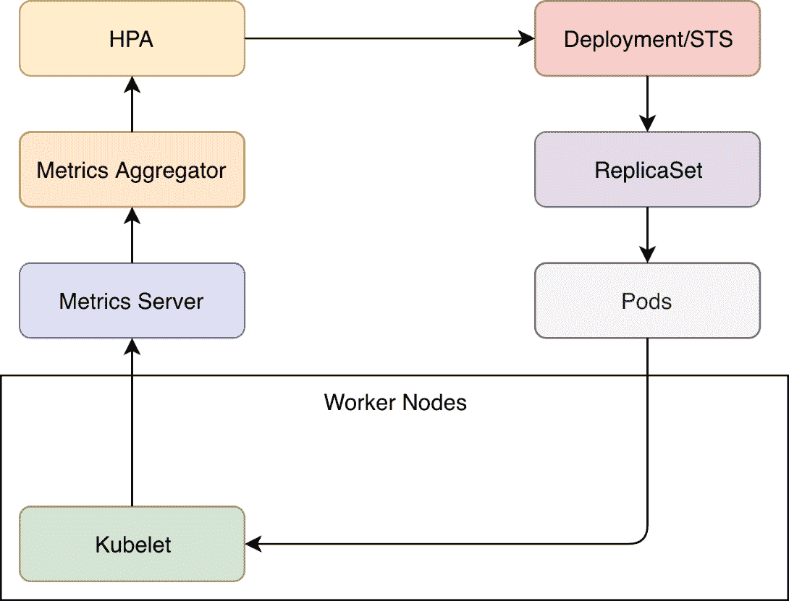
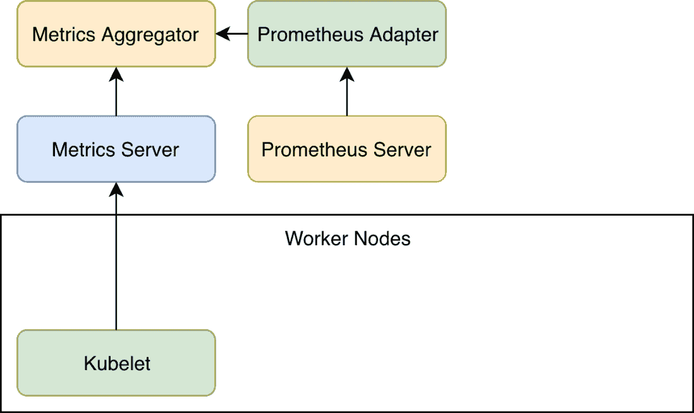
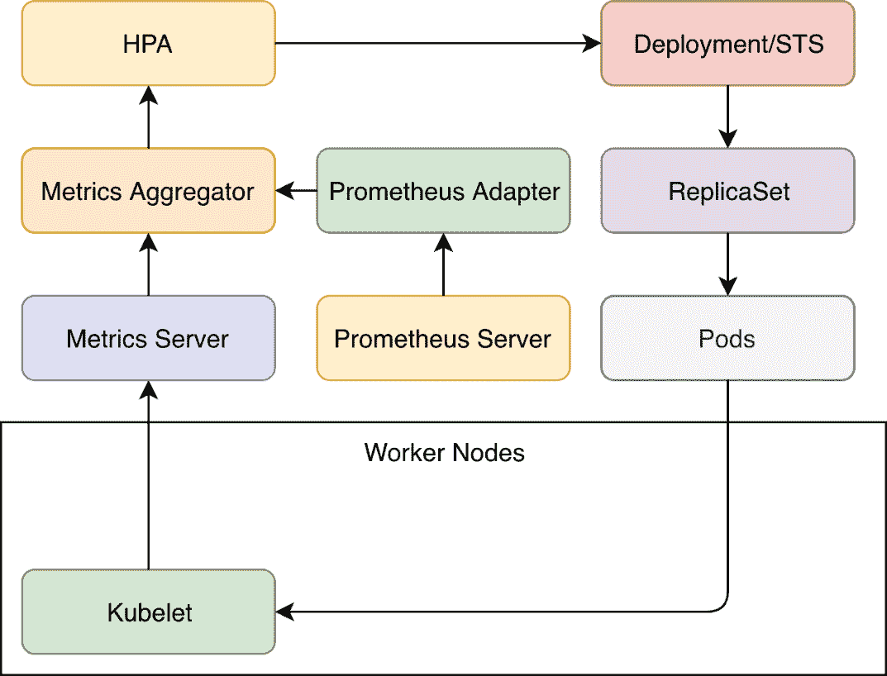

# 五、使用自定义指标扩展`HorizontalPodAutoscaler`

Computers make excellent and efficient servants, but I have no wish to serve under them.

- *史巴克*

采用**水平自动标尺** ( **HPA** )通常经历三个阶段。

第一阶段是*发现*。当我们第一次发现它的作用时，我们通常会大吃一惊。“看看这个。它可以自动扩展我们的应用。我再也不需要担心复制品的数量了。”

第二阶段是*用法*。一旦我们开始使用 HPA，我们很快就会意识到基于内存和 CPU 扩展应用是不够的。一些应用确实会随着负载的增加而增加内存和 CPU 的使用，而其他许多应用则不会。或者更准确地说，不是成比例的。对于某些应用，HPA 运行良好。对许多其他人来说，它根本不起作用，或者是不够的。迟早，我们需要将 HPA 阈值扩展到基于内存和 CPU 的阈值之外。这个阶段的特点是*失望*。“这似乎是一个好主意，但我们无法在大多数应用中使用它。我们需要回到基于指标和手动更改副本数量的警报。”

第三阶段是*重新发现*。一旦我们浏览了 HPA v2 文档(在撰写本文时仍处于测试阶段)，我们可以看到它允许我们将其扩展到几乎任何类型的度量和表达式。通过适配器，我们可以将 HPA 与普罗米修斯或几乎任何其他工具挂钩。一旦我们掌握了这一点，我们可以设置的触发应用自动扩展的条件就几乎没有限制了。唯一的限制是我们能够将数据转换成 Kubernetes 的自定义指标。

我们的下一个目标是扩展 HorizontalPodAutoscaler 定义，以包括基于普罗米修斯中存储的数据的条件。

# 创建集群

`vfarcic/k8s-specs`([https://github.com/vfarcic/k8s-specs](https://github.com/vfarcic/k8s-specs))存储库将继续作为 Kubernetes 定义的来源。我们将通过获取最新版本来确保它是最新的。

All the commands from this chapter are available in the `05-hpa-custom-metrics.sh` ([https://gist.github.com/vfarcic/cc546f81e060e4f5fc5661e4fa003af7](https://gist.github.com/vfarcic/cc546f81e060e4f5fc5661e4fa003af7)) Gist.

```
 1  cd k8s-specs
 2
 3  git pull
```

这些要求与我们在上一章中的要求相同。唯一的例外是 **EKS** 。我们将继续对所有其他 Kuberentes 口味使用与之前相同的 Gists。

A note to EKS users
Even though three t2.small nodes we used so far have more than enough memory and CPU, they might not be able to host all the Pods we'll create. EKS (by default) uses AWS networking. A t2.small instance can have a maximum of three network interfaces, with four IPv4 address per each. That means that we can have up to twelve IPv4 addresses on each t2.small node. Given that each Pod needs to have its own address, that means that we can have a maximum of twelve Pods per node. In this chapter, we might need more than thirty-six Pods across the cluster. Instead of creating a cluster with more than three nodes, we'll add Cluster Autoscaler (CA) to the mix, and let the cluster expand if needed. We already explored CA in one of the previous chapters and the setup instructions are now added to the Gist `eks-hpa-custom.sh` ([https://gist.github.com/vfarcic/868bf70ac2946458f5485edea1f6fc4c)](https://gist.github.com/vfarcic/868bf70ac2946458f5485edea1f6fc4c)).

请使用以下 Gists 之一来创建新集群。如果您已经有了一个想要用于练习的集群，请使用 Gists 来验证它是否满足所有要求。

*   `gke-instrument.sh` : **具有 3 个 n1-standard-1 工作节点的 GKE** 、 **nginx Ingress** 、 **tiller** 、 **Prometheus** Chart 和环境变量 **LB_IP** 、 **PROM_ADDR** 和 **AM_ADDR** ( [)](https://gist.github.com/vfarcic/675f4b3ee2c55ee718cf132e71e04c6e)
*   `eks-hpa-custom.sh` : **具有 3 个 T2 .小型工作节点的 EKS** 、 **nginx Ingress** 、 **tiller** 、 **Metrics Server** 、 **Prometheus** 图表、环境变量 **LB_IP** 、 **PROM_ADDR** 和 **AM_ADDR** ，以及**集群自动缩放器**([https://gist . github . com](https://gist.github.com/vfarcic/868bf70ac2946458f5485edea1f6fc4c)
*   `aks-instrument.sh` : **带有 3 个 Standard_B2s 工作节点的 AKS** 、 **nginx Ingress** 和 **tiller** 、 **Prometheus** 图表，以及环境变量 **LB_IP** 、 **PROM_ADDR** 和**AM _ ADDR**([https://gist . github . com/vfarcic/65a 0d 5834 c 9 e 20 ebf1 b 924](https://gist.github.com/vfarcic/65a0d5834c9e20ebf1b99225fba0d339)
*   `docker-instrument.sh` : **带有 **2 个 CPU**、 **3 GB RAM** 、 **nginx Ingress** 、 **tiller** 、**度量服务器**、**普罗米修斯**图表，以及环境变量 **LB_IP** 、 **PROM_ADDR** 和**AM _ ADDR**([https://](https://gist.github.com/vfarcic/1dddcae847e97219ab75f936d93451c2)**
*   `minikube-instrument.sh` : **Minikube** 带 **2 个 CPU**、 **3 GB RAM** 、**入口**、**存储提供程序**、**默认存储类**和**指标-服务器**插件已启用、**分蘖**、**普罗米修斯**图表和环境变量 **LB_IP** 、【T21

现在我们已经准备好扩展我们对 HPA 的使用。但是，在我们这样做之前，让我们(再次)简单探讨一下 HPA 是如何开箱即用的。

# 在没有度量适配器的情况下使用 HorizontalPodAutoscaler

如果我们不创建度量适配器，度量聚合器只知道与容器和节点相关的 CPU 和内存使用情况。让事情变得更复杂的是，这些信息只限于最后几分钟。由于 HPA 只关心 Pods 和其中的容器，我们只限于两个指标。当我们创建 HPA 时，如果构成 Pods 的容器的内存或 CPU 消耗高于或低于预定义的阈值，它将扩展或缩减 Pods。

度量服务器定期从工作节点内部运行的库元素中获取信息(中央处理器和内存)。

这些指标被传递给指标聚合器，在这种情况下，它不会增加任何额外的价值。从那时起，高性能计算部门定期(通过其应用编程接口端点)查阅指标聚合器中的数据。当 HPA 中定义的目标值与实际值之间存在差异时，HPA 将操纵部署或状态集的副本数量。正如我们已经知道的那样，对这些控制器的任何更改都会导致通过创建和操作复制集来执行滚动更新，复制集会创建和删除 Pod，这些 Pod 由运行在调度 Pod 的节点上的 Kubelet 转换为容器。



Figure 5-1: HPA with out of the box setup (arrows show the flow of data)

在功能上，我们刚才描述的流程运行良好。唯一的问题是指标聚合器中的可用数据。仅限于内存和 CPU。很多时候，这还不够。因此，我们没有必要改变流程，而是将可用数据扩展到 HPA。我们可以通过度量适配器来做到这一点。

# 探索普罗米修斯适配器

考虑到我们希望通过 Metrics API 扩展可用的指标，并且 Kubernetes 允许我们通过它的*Custom Metrics API*([https://github . com/Kubernetes/Metrics/tree/master/pkg/API/Custom _ Metrics](https://github.com/kubernetes/metrics/tree/master/pkg/apis/custom_metrics))来实现我们的目标，一个选项可能是创建我们自己的适配器。

根据我们存储指标的应用(数据库)，这可能是一个不错的选择。但是，鉴于重新发明轮子毫无意义，我们的第一步应该是寻找解决方案。如果有人已经创建了一个适合我们需求的适配器，那么采用它将是有意义的，而不是我们自己创建一个新的。即使我们确实选择了只提供我们正在寻找的部分特性的东西，在此基础上构建(并为项目做出贡献)也比从头开始更容易。

鉴于我们的指标存储在普罗米修斯中，我们需要一个能够从中获取数据的指标适配器。既然普罗米修斯很受欢迎，被社区采纳，那就已经有一个项目等着我们去使用了。名为*Kubernetes 普罗米修斯定制度量适配器*。它是 Kubernetes 自定义度量 API 的一个实现，使用 Prometheus 作为数据源。

由于我们所有的安装都采用了 Helm，我们将使用它来安装适配器。

```
 1  helm install \
 2      stable/prometheus-adapter \
 3      --name prometheus-adapter \
 4      --version v0.5.0 \
 5      --namespace metrics \
 6      --set image.tag=v0.5.0 \
 7      --set metricsRelistInterval=90s \
 8      --set prometheus.url=http://prometheus-server.metrics.svc \
 9      --set prometheus.port=80
10
11  kubectl -n metrics \
12      rollout status \
13      deployment prometheus-adapter
```

我们从`stable`存储库中安装了`prometheus-adapter`舵图。资源是在`metrics`命名空间中创建的，`image.tag`设置为`v0.3.0`。

我们将`metricsRelistInterval`从`30s`的默认值更改为`90s`。这是适配器将用于从普罗米修斯获取指标的时间间隔。由于我们的 Prometheus 设置是每 60 秒从其目标获取一次指标，我们不得不将适配器的时间间隔设置为一个更高的值。否则，适配器的频率会高于普罗米修斯的拉取频率，我们会有没有新数据的迭代。

最后两个参数指定了适配器访问普罗米修斯应用编程接口的网址和端口。在我们的例子中，网址被设置为通过普罗米修斯的服务。

Please visit *Prometheus Adapter Chart README* ([https://github.com/helm/charts/tree/master/stable/prometheus-adapter](https://github.com/helm/charts/tree/master/stable/prometheus-adapter)) for more information about all the values you can set to customize the installation.

最后，我们等到`prometheus-adapter`推出。

如果一切都按预期运行，我们应该能够查询 Kubernetes 的定制度量 API，并检索通过适配器提供的一些 Prometheus 数据。

```
 1  kubectl get --raw \
 2      "/apis/custom.metrics.k8s.io/v1beta1" \
 3      | jq "."
```

Given the promise that each chapter will feature a different Kubernetes' flavor, and that AWS did not have its turn yet, all the outputs are taken from EKS. Depending on the platform you're using, your outputs might be slightly different.

查询自定义指标输出的第一个条目如下。

```
{
  "kind": "APIResourceList",
  "apiVersion": "v1",
  "groupVersion": "custom.metrics.k8s.io/v1beta1",
  "resources": [
    {
      "name": "namespaces/memory_max_usage_bytes",
      "singularName": "",
      "namespaced": false,
      "kind": "MetricValueList",
      "verbs": [
        "get"
      ]
    },
    {
      "name": "jobs.batch/kube_deployment_spec_strategy_rollingupdate_max_unavailable",
      "singularName": "",
      "namespaced": true,
      "kind": "MetricValueList",
      "verbs": [
        "get"
      ]
    },
    ...
```

通过适配器可用的自定义指标列表很大，我们可能不得不认为它包含了所有存储在普罗米修斯中的指标。我们以后会知道这是否是真的。目前，我们将重点关注我们可能需要的与`go-demo-5`部署相关的 HPA 指标。毕竟，为自动缩放提供指标是适配器的主要功能，如果不是唯一的功能的话。

从现在开始，度量聚合器不仅包含来自度量服务器的数据，还包含来自普罗米修斯适配器的数据，该适配器反过来从普罗米修斯服务器获取度量。我们尚未确认我们通过适配器获得的数据是否足够，以及 HPA 是否适用于自定义指标。



Figure 5-2: Custom metrics with Prometheus Adapter (arrows show the flow of data)

在深入探讨适配器之前，我们将定义`go-demo-5`应用的目标。

我们应该不仅能够根据内存和 CPU 使用情况来扩展 Pods，还能够根据通过入口进入的请求数量或通过仪表化指标观察到的请求数量来扩展 Pods。我们可以添加许多其他标准，但作为一种学习体验，这些应该就足够了。我们已经知道如何配置 HPA 来基于 CPU 和内存进行扩展，所以我们的任务是用请求计数器来扩展它。这样，当应用接收到太多请求时，我们将能够设置增加副本数量的规则，并在流量减少时对其进行清理。

既然我们想扩展连接到`go-demo-5`的 HPA，我们下一步就是安装应用。

```
 1  GD5_ADDR=go-demo-5.$LB_IP.nip.io
 2
 3  helm install \
 4    https://github.com/vfarcic/go-demo-5/releases/download/
    0.0.1/go-demo-5-0.0.1.tgz \
 5      --name go-demo-5 \
 6      --namespace go-demo-5 \
 7      --set ingress.host=$GD5_ADDR
 8
 9  kubectl -n go-demo-5 \
10      rollout status \
11      deployment go-demo-5
```

我们定义了应用的地址，安装了图表，并一直等到部署推出。

A note to EKS users
If you received `error: deployment "go-demo-5" exceeded its progress deadline` message, the cluster is likely auto-scaling to accommodate all the Pods and zones of the PersistentVolumes. That might take more time than the `progress deadline`. In that case, wait for a few moments and repeat the `rollout` command.

接下来，我们将通过入口资源向应用发送 100 个请求来生成一点流量。

```
 1  for i in {1..100}; do
 2      curl "http://$GD5_ADDR/demo/hello"
 3  done
```

现在我们生成了一些流量，我们可以尝试找到一个指标来帮助我们计算有多少请求通过了入口。由于我们已经知道`nginx_ingress_controller_requests`提供了通过入口进入的请求数量，我们应该检查它现在是否作为自定义指标可用。

```
 1  kubectl get --raw \
 2      "/apis/custom.metrics.k8s.io/v1beta1" \
 3      | jq '.resources[]
 4      | select(.name
 5      | contains("nginx_ingress_controller_requests"))'
```

我们向`/apis/custom.metrics.k8s.io/v1beta1`发出了请求。但是，正如您已经看到的，仅这一项就可以返回所有指标，我们只对一项感兴趣。这就是为什么我们将输出传输到`jq`并使用它的过滤器只检索包含`nginx_ingress_controller_requests`作为`name`的条目。

如果您收到一个空的输出，请等待一会儿，直到适配器从普罗米修斯提取指标(它每 90 秒提取一次)并重新执行命令。

输出如下。

```
{
  "name": "ingresses.extensions/nginx_ingress_controller_requests",
  "singularName": "",
  "namespaced": true,
  "kind": "MetricValueList",
  "verbs": [
    "get"
  ]
}
{
  "name": "jobs.batch/nginx_ingress_controller_requests",
  "singularName": "",
  "namespaced": true,
  "kind": "MetricValueList",
  "verbs": [
    "get"
  ]
}
{
  "name": "namespaces/nginx_ingress_controller_requests",
  "singularName": "",
  "namespaced": false,
  "kind": "MetricValueList",
  "verbs": [
    "get"
  ]
}
```

我们得到了三个结果。每个的名称由资源类型和度量的名称组成。我们将丢弃那些与`jobs.batch`和`namespaces`相关的度量，而专注于与`ingresses.extensions`相关的度量，因为它提供了我们需要的信息。我们可以看到它是`namespaced`，这意味着这些度量，除了别的以外，被它们起源的名称空间分开。`kind`和`verbs`几乎总是一样的，没有太大的价值。

`ingresses.extensions/nginx_ingress_controller_requests`的主要问题是它提供了入口资源的请求数量。我们不能用它目前的形式作为自置居所津贴的标准。相反，我们应该用副本的数量来划分请求的数量。这将为我们提供每个副本的平均请求数，这应该是一个更好的 HPA 阈值。稍后我们将探讨如何使用表达式而不是简单的度量。了解通过入口进入的请求数量是有用的，但这可能还不够。

由于`go-demo-5`已经提供了仪表化的度量，所以看看我们是否能够检索`http_server_resp_time_count`会有所帮助。提醒一下，这与我们在[第 4 章](4.html)、*调试通过指标和警报发现的问题*中使用的指标相同。

```
 1  kubectl get --raw \
 2      "/apis/custom.metrics.k8s.io/v1beta1" \
 3      | jq '.resources[]
 4      | select(.name
 5      | contains("http_server_resp_time_count"))'
```

我们使用`jq`过滤结果，以便只检索`http_server_resp_time_count`。不要对空输出感到惊讶。这很正常，因为普罗米修斯适配器没有被配置为处理来自普罗米修斯的所有指标，而只是处理那些符合其内部规则的指标。因此，这可能是查看包含其配置的`prometheus-adapter`配置图的好时机。

```
 1  kubectl -n metrics \
 2      describe cm prometheus-adapter
```

输出太大，无法在书中呈现，所以我们将只讨论第一条规则。具体如下。

```
...
rules:
- seriesQuery: '{__name__=~"^container_.*",container_name!="POD",namespace!="",pod_name!=""}'
  seriesFilters: []
  resources:
    overrides:
      namespace:
        resource: namespace
      pod_name:
        resource: pod
  name:
    matches: ^container_(.*)_seconds_total$
    as: ""
  metricsQuery: sum(rate(<<.Series>>{<<.LabelMatchers>>,container_name!="POD"}[5m]))
    by (<<.GroupBy>>)
...
```

第一个规则只检索名称以`container` ( `__name__=~"^container_.*"`)开头的指标，标签`container_name`不是`POD`，并且`namespace`和`pod_name`不为空。

每个规则都必须指定一些资源覆盖。在这种情况下，`namespace`标签包含`namespace`资源。类似地，`pod`资源从标签`pod_name`中检索。进一步，我们可以看到`name`部分使用正则表达式来命名新的度量。最后，`metricsQuery`告诉适配器在检索数据时应该执行哪个普罗米修斯查询。

如果这种设置看起来令人困惑，你应该知道你不是唯一一个第一眼就感到困惑的人。普罗米修斯适配器，正如普罗米修斯服务器配置一开始很难掌握一样。然而，它们非常强大，允许我们定义服务发现规则，而不是指定单个指标(在适配器的情况下)或目标(在普罗米修斯服务器的情况下)。很快，我们将详细介绍适配器规则的设置。现在，重要的注意事项是，默认配置告诉适配器获取与一些规则匹配的所有度量。

到目前为止，我们看到`nginx_ingress_controller_requests`度量通过适配器是可用的，但是它是没有用的，因为我们需要将请求的数量除以副本的数量。我们还发现源自`go-demo-5` Pods 的`http_server_resp_time_count`公制不可用。总而言之，我们没有所有需要的度量，而适配器当前获取的大多数度量都没有用。毫无意义的查询会浪费时间和资源。

我们的下一个任务是重新配置适配器，以便只从普罗米修斯那里检索我们需要的指标。我们将尝试编写自己的表达式，只获取我们需要的数据。如果我们能够做到这一点，我们也应该能够创造自置居所津贴。

# 使用自定义指标创建水平项目自动缩放器

正如您已经看到的，普罗米修斯适配器附带了一组默认规则，这些规则提供了许多我们不需要的指标，而不是我们需要的所有指标。做得太多反而不够，是在浪费 CPU 和内存。我们将探索如何使用自己的规则定制适配器。我们的下一个目标是让适配器只检索`nginx_ingress_controller_requests`度量，因为这是我们唯一需要的度量。除此之外，它应该以两种形式提供该度量。首先，它应该检索按资源分组的费率。

第二种形式应该与第一种形式相同，但除以承载入口转发资源的 Pods 的部署的副本数量。

这个应该会给出每个副本的平均请求数，并且是我们第一个基于自定义指标的 HPA 定义的良好候选。

我已经准备了一个带有图表值的文件，它可能会实现我们当前的目标，所以让我们来看看它。

```
 1  cat mon/prom-adapter-values-ing.yml
```

输出如下。

```
image:
  tag: v0.5.0
metricsRelistInterval: 90s
prometheus:
  url: http://prometheus-server.metrics.svc
  port: 80
rules:
  default: false
  custom:
  - seriesQuery: 'nginx_ingress_controller_requests'
    resources:
      overrides:
        namespace: {resource: "namespace"}
        ingress: {resource: "ingress"}
    name:
      as: "http_req_per_second"
    metricsQuery: 'sum(rate(<<.Series>>{<<.LabelMatchers>>}[5m])) by (<<.GroupBy>>)'
  - seriesQuery: 'nginx_ingress_controller_requests'
    resources:
      overrides:
        namespace: {resource: "namespace"}
        ingress: {resource: "ingress"}
    name:
      as: "http_req_per_second_per_replica"
    metricsQuery: 'sum(rate(<<.Series>>{<<.LabelMatchers>>}[5m])) by (<<.GroupBy>>) / sum(label_join(kube_deployment_status_replicas, "ingress", ",", "deployment")) by (<<.GroupBy>>)'
```

该定义中的前几个条目与我们之前通过`--set`参数使用的值相同。我们将跳过这些，跳到`rules`部分。

在`rules`部分，我们将`default`条目设置为`false`。这将摆脱我们之前探索过的默认规则，让我们重新开始。进一步来说，有两个`custom`规则。

第一个规则是基于以`nginx_ingress_controller_requests`为值的`seriesQuery`。`resources`部分中的`overrides`条目帮助适配器找出哪些 Kubernetes 资源与度量相关联。我们正在为`namespace`资源设置`namespace`标签的值。`ingress`也有类似的条目。换句话说，我们将普罗米修斯标签与 Kubernetes 资源`namespace`和`ingress`关联起来。

正如您将很快看到的，度量本身将是完整查询的一部分，HPA 将把它视为单个度量。既然我们在创造新的东西，我们就需要一个名字。因此，我们使用设置为`http_req_per_second`的单个`as`条目来指定`name`部分。这将是我们住房津贴定义中的参考。

你已经知道`nginx_ingress_controller_requests`本身并不是很有用。当我们在普罗米修斯中使用它时，我们必须把它放在一个`rate`函数中，我们必须`sum`所有的东西，我们必须按资源对结果进行分组。我们正在通过`metricsQuery`条目做类似的事情。把它想象成我们在普罗米修斯中写的表达。唯一不同的是，我们使用的是像`<<.Series>>`这样的“特殊”语法。这是适配器的模板机制。我们有`<<.Series>>`、`<<.LabelMatchers>>`和`<<.GroupBy>>`子句，这些子句将根据我们在 API 调用中放入的内容填充正确的值，而不是通过语句对度量、标签和组的名称进行硬编码。

第二条规则和第一条几乎一样。区别在于名字(现在是`http_req_per_second_per_replica`)和`metricsQuery`。后者现在用相关部署的副本数量来划分结果，就像我们在[第 3 章](3.html)、*中练习收集和查询指标以及发送警报*一样。

接下来，我们将使用新值更新图表。

```
 1  helm upgrade prometheus-adapter \
 2      stable/prometheus-adapter \
 3      --version v0.5.0 \
 4      --namespace metrics \
 5      --values mon/prom-adapter-values-ing.yml
 6
 7  kubectl -n metrics \
 8      rollout status \
 9      deployment prometheus-adapter
```

现在部署已经成功展开，我们可以再次检查存储在配置映射中的配置是否正确。

```
 1  kubectl -n metrics \
 2      describe cm prometheus-adapter
```

输出限于`Data`部分，如下所示。

```
...
Data
====
config.yaml:
----
rules:
- metricsQuery: sum(rate(<<.Series>>{<<.LabelMatchers>>}[5m])) by (<<.GroupBy>>)
  name:
    as: http_req_per_second
  resources:
    overrides:
      ingress:
        resource: ingress
      namespace:
        resource: namespace
  seriesQuery: nginx_ingress_controller_requests
- metricsQuery: sum(rate(<<.Series>>{<<.LabelMatchers>>}[5m])) by (<<.GroupBy>>) /
    sum(label_join(kube_deployment_status_replicas, "ingress", ",", "deployment"))
    by (<<.GroupBy>>)
  name:
    as: http_req_per_second_per_replica
  resources:
    overrides:
      ingress:
        resource: ingress
      namespace:
        resource: namespace
  seriesQuery: nginx_ingress_controller_requests
...
```

我们可以看到，我们之前探讨的默认`rules`现在被我们在图表值文件的`rules.custom`部分定义的两个规则所取代。

配置看起来正确的事实并不一定意味着适配器现在提供了作为 Kubernetes 定制度量的数据。让我们也检查一下。

```
 1  kubectl get --raw \
 2      "/apis/custom.metrics.k8s.io/v1beta1" \
 3      | jq "."
```

输出如下。

```
{
  "kind": "APIResourceList",
  "apiVersion": "v1",
  "groupVersion": "custom.metrics.k8s.io/v1beta1",
  "resources": [
    {
      "name": "namespaces/http_req_per_second_per_replica",
      "singularName": "",
      "namespaced": false,
      "kind": "MetricValueList",
      "verbs": [
        "get"
      ]
    },
    {
      "name": "ingresses.extensions/http_req_per_second_per_replica",
      "singularName": "",
      "namespaced": true,
      "kind": "MetricValueList",
      "verbs": [
        "get"
      ]
    },
    {
      "name": "ingresses.extensions/http_req_per_second",
      "singularName": "",
      "namespaced": true,
      "kind": "MetricValueList",
      "verbs": [
        "get"
      ]
    },
    {
      "name": "namespaces/http_req_per_second",
      "singularName": "",
      "namespaced": false,
      "kind": "MetricValueList",
      "verbs": [
        "get"
      ]
    }
  ]
}
```

我们可以看到有四个指标可用，两个`http_req_per_second`和两个`http_req_per_second_per_replica`。我们定义的两个指标中的每一个都可以用作`namespaces`和`ingresses`。现在，我们不关心`namespaces`，我们将专注于`ingresses`。

我假设自从我们发送了一百个请求以来，至少过了五分钟(或更长时间)。如果没有，你是一个快速的读者，你将不得不等待一段时间，然后我们再发送一百个请求。我们即将根据自定义指标创建我们的第一个 HPA，我想确保您看到它在激活前后的表现。

现在，让我们来看看 HPA 的定义。

```
 1  cat mon/go-demo-5-hpa-ing.yml
```

输出如下。

```
apiVersion: autoscaling/v2beta1
kind: HorizontalPodAutoscaler
metadata:
  name: go-demo-5
spec:
  scaleTargetRef:
    apiVersion: apps/v1
    kind: Deployment
    name: go-demo-5
  minReplicas: 3
  maxReplicas: 10
  metrics:
  - type: Object
    object:
      metricName: http_req_per_second_per_replica
      target:
        kind: Namespace
        name: go-demo-5
      targetValue: 50m
```

定义的前半部分应该很熟悉，因为它与我们以前使用的没有什么不同。它将在`3`和`10`之间维护`go-demo-5`部署的副本。新东西在`metrics`区。

过去我们用`spec.metrics.type`设置为`Resource`。通过这种类型，我们定义了 CPU 和内存目标。然而这一次，我们的类型是`Object`。它指的是描述单个 Kubernetes 对象的度量，在我们的例子中，它恰好是来自 Prometheus 适配器的自定义度量。

如果我们浏览一下 *ObjectMetricSource v2beta1 自动缩放*([https://kubernetes . io/docs/reference/generated/kubernetes-API/v 1.12/# ObjectMetricSource-v2 beta 1-自动缩放](https://kubernetes.io/docs/reference/generated/kubernetes-api/v1.12/#objectmetricsource-v2beta1-autoscaling))文档，我们可以看到`Object`类型的字段与我们之前使用`Resources`类型时的字段不同。我们将`metricName`设置为我们在普罗米修斯适配器(`http_req_per_second_per_replica`)中定义的度量。

请记住，它不是一个度量，而是我们定义了一个表达式，适配器使用该表达式从普罗米修斯获取数据，并将其转换为自定义度量。在本例中，我们得到了进入入口资源的请求数，并除以部署的副本数。

最后将`targetValue`设置为`50m`或每秒 0.05 个请求。我有意将其设置为一个非常低的值，以便我们可以轻松到达目标并观察发生了什么。

我们来`apply`一下定义。

```
 1  kubectl -n go-demo-5 \
 2      apply -f mon/go-demo-5-hpa-ing.yml
```

接下来，我们将描述新创建的 HPA，看看我们是否可以观察到任何有趣的东西。

```
 1  kubectl -n go-demo-5 \
 2      describe hpa go-demo-5
```

输出限于相关部分，如下所示。

```
...
Metrics:         ( current / target )
  "http_req_per_second_per_replica" on Namespace/go-demo-5: 0 / 50m
Min replicas:    3
Max replicas:    10
Deployment pods: 3 current / 3 desired
...
```

我们可以看到`Metrics`部分只有一个条目。HPA 正在使用基于`Namespace/go-demo-5`的自定义指标`http_req_per_second_per_replica`。此时，当前值为`0`，`target`设置为`50m`(每秒 0.05 个请求)。如果`current`值是`unknown`，请稍等片刻，然后重新运行命令。

再往下，我们可以看到部署吊舱的`current`和`desired`数量都设置为`3`。

总之，没有达到目标(有`0`的请求)，所以 HPA 没有必要做任何事情。它保持最小数量的副本。

让我们通过产生一些流量来增加一点趣味。

```
 1  for i in {1..100}; do
 2      curl "http://$GD5_ADDR/demo/hello"
 3  done
```

我们向入口发送了一百个请求。

我们再`describe`一下 HPA，看看有没有变化。

```
 1  kubectl -n go-demo-5 \
 2      describe hpa go-demo-5
```

输出限于相关部分，如下所示。

```
...
Metrics:                                                   ( current / target )
  "http_req_per_second_per_replica" on Ingress/go-demo-5:  138m / 50m
Min replicas:                                              3
Max replicas:                                              10
Deployment pods:                                           3 current / 6 desired
...
Events:
  ... Message
  ... -------
  ... New size: 6; reason: Ingress metric http_req_per_second_per_replica above target
```

我们可以看到度量的`current`值增加了。我的情况是`138m`(每秒 0.138 个请求)。如果您的输出仍然显示`0`，您将不得不等待直到普罗米修斯提取度量，直到适配器获取它们，直到 HPA 刷新它的状态。换句话说，等待几分钟，然后重新运行前面的命令。

考虑到`current`值高于`target`，在我的情况下，HPA 将`Deployment pods`的`desired`号更改为`6`(您的号码可能会因公制值而异)。因此，HPA 通过更改其副本数量来修改部署，我们应该会看到更多 Pods 正在运行。通过`Events`部分，这一点变得更加明显。应该会有一条新消息说明`New size: 6; reason: Ingress metric http_req_per_second_per_replica above target`。

为了安全起见，我们将在`go-demo-5`名称空间中列出 Pods，并确认新的 Pods 确实正在运行。

```
 1  kubectl -n go-demo-5 get pods
```

输出如下。

```
NAME           READY STATUS  RESTARTS AGE
go-demo-5-db-0 2/2   Running 0        19m
go-demo-5-db-1 2/2   Running 0        19m
go-demo-5-db-2 2/2   Running 0        10m
go-demo-5-...  1/1   Running 2        19m
go-demo-5-...  1/1   Running 0        16s
go-demo-5-...  1/1   Running 2        19m
go-demo-5-...  1/1   Running 0        16s
go-demo-5-...  1/1   Running 2        19m
go-demo-5-...  1/1   Running 0        16s
```

我们可以看到现在有六个`go-demo-5-*`吊舱，其中三个比其余的要年轻得多。

接下来，我们将探索当流量下降到百帕以下时会发生什么。我们暂时什么都不做就能做到。因为只有我们向应用发送请求，所以我们所要做的就是静止五分钟，或者更好的是，利用这段时间去取咖啡。

我们需要等待至少五分钟的原因在于 HPA 用于放大和缩小的频率。默认情况下，只要`current`值高于`target`，HPA 将每三分钟放大一次。缩小规模需要五分钟。只有当`current`值自上次放大后低于目标至少三分钟时，HPA 才会缩小。

总之，我们需要等待五分钟或更长时间，才能看到相反方向的缩放效果。

```
 1  kubectl -n go-demo-5 \
 2      describe hpa go-demo-5
```

输出限于相关部分，如下所示。

```
...
Metrics:         ( current / target )
  "http_req_per_second_per_replica" on Ingress/go-demo-5:  0 / 50m
Min replicas:    3
Max replicas:    10
Deployment pods: 3 current / 3 desired
...
Events:
... Age   ... Message
... ----  ... -------
... 10m   ... New size: 6; reason: Ingress metric http_req_per_second_per_replica above target
... 7m10s ... New size: 9; reason: Ingress metric http_req_per_second_per_replica above target
... 2m9s  ... New size: 3; reason: All metrics below target
```

输出中最有趣的部分是事件部分。我们将关注`Age`和`Message`字段。请记住，如果当前值高于目标值，则每三分钟执行一次放大事件，而每五分钟执行一次缩小迭代。

就我而言，三分钟后，住房管理局再次调整了部署规模。复制品的数量从六个激增到九个。由于适配器使用的表达式使用五分钟速率，因此一些请求进入了第二次 HPA 迭代。即使在我们停止发送请求后，扩大规模似乎也不是一个好主意(事实并非如此)，但在“现实世界”中，这种情况不应该发生，因为流量比我们生成的要多得多，我们不会将`50m`(每秒 0.2 个请求)作为目标。

上次扩展事件后五分钟，`current`值为`0`，HPA 将部署缩减至最小副本数量(`3`)。不再有交通堵塞，我们又回到了起点。

我们确认普罗米修斯的指标，由普罗米修斯适配器获取，并转换成库贝伦特斯的自定义指标，可以在高性能计算中使用。到目前为止，我们使用了普罗米修斯通过出口商提取的指标(`nginx_ingress_controller_requests`)。考虑到适配器从普罗米修斯那里获取度量，它们是如何到达那里的并不重要。尽管如此，我们将确认也可以使用仪表化度量。这将给我们一个机会巩固到目前为止所学的知识，同时，也许还会学到一些新的技巧。

```
 1  cat mon/prom-adapter-values-svc.yml
```

输出是另一组普罗米修斯适配器图表值。

```
image:
  tag: v0.5.0
metricsRelistInterval: 90s
prometheus:
  url: http://prometheus-server.metrics.svc
  port: 80
rules:
  default: false
  custom:
  - seriesQuery: 'http_server_resp_time_count{kubernetes_namespace!="",kubernetes_name!=""}'
    resources:
      overrides:
        kubernetes_namespace: {resource: "namespace"}
        kubernetes_name: {resource: "service"}
    name:
      matches: "^(.*)server_resp_time_count"
      as: "${1}req_per_second_per_replica"
    metricsQuery: 'sum(rate(<<.Series>>{<<.LabelMatchers>>}[5m])) by (<<.GroupBy>>) / count(<<.Series>>{<<.LabelMatchers>>}) by (<<.GroupBy>>)'
  - seriesQuery: 'nginx_ingress_controller_requests'
    resources:
      overrides:
        namespace: {resource: "namespace"}
        ingress: {resource: "ingress"}
    name:
      as: "http_req_per_second_per_replica"
    metricsQuery: 'sum(rate(<<.Series>>{<<.LabelMatchers>>}[5m])) by (<<.GroupBy>>) / sum(label_join(kube_deployment_status_replicas, "ingress", ",", "deployment")) by (<<.GroupBy>>)'
```

这一次，我们结合了包含不同度量系列的规则。第一个规则基于起源于`go-demo-5`的`http_server_resp_time_count`仪表化度量。我们在[第 4 章](4.html)、*调试通过指标和警报发现的问题*中使用了它，它的定义没有什么特别之处。它遵循与我们之前使用的规则相同的逻辑。第二个规则是我们以前使用的一个规则的副本。

这些规则的有趣之处在于，有两个完全不同的查询会产生不同的结果。但是，这两种情况下的名称是相同的(`http_req_per_second_per_replica`)。

“等一下”，你可能会说。名字不一样。一个叫`${1}req_per_second_per_replica`，一个叫`http_req_per_second_per_replica`。虽然这是真的，但最终名称(不包括资源类型)确实是一样的。我想让你知道你可以用正则表达式来命名。在第一个规则中，名称由`matches`和`as`条目组成。`matches`条目的`(.*)`部分成为第一个变量(可以有其他变量)，随后用作`as`值(`${1}`)的一部分。由于度量是`http_server_resp_time_count`，它将从`^(.*)server_resp_time_count`中提取`http_`，在下一行中，将使用`http_`代替`${1}`。最后的结果是`http_req_per_second_per_replica`，和第二条规则的名字一样。

既然我们已经确定这两个规则将提供同名的自定义指标，我们可能会认为这会导致冲突。如果两者被称为相同的，HPA 如何知道使用哪个指标？适配器是否必须丢弃一个而保留另一个？答案在`resources`部分。

度量的真正标识符是它的名称和与之相关的资源的组合。第一个规则生成两个自定义指标，一个用于服务，另一个用于名称空间。第二个还为名称空间生成自定义指标，但也为 Ingresses 生成自定义指标。

总共有多少个指标？在我们检查结果之前，我会让你考虑一下答案。要做到这一点，我们必须`upgrade`图表中的新值生效。

```
 1  helm upgrade -i prometheus-adapter \
 2      stable/prometheus-adapter \
 3      --version v0.5.0 \
 4      --namespace metrics \
 5      --values mon/prom-adapter-values-svc.yml
 6
 7  kubectl -n metrics \
 8      rollout status \
 9      deployment prometheus-adapter
```

我们用新的值升级了图表，并一直等到部署推出。

现在我们可以回到悬而未决的问题“我们有多少定制指标？”让我看看...

```
 1  kubectl get --raw \
 2      "/apis/custom.metrics.k8s.io/v1beta1" \
 3      | jq "."
```

输出限于相关部分，如下所示。

```
{
  ...
    {
      "name": "services/http_req_per_second_per_replica",
      ...
    },
    {
      "name": "namespaces/http_req_per_second_per_replica",
      ...
    },
    {
      "name": "ingresses.extensions/http_req_per_second_per_replica",
      ...
```

现在我们有三个自定义指标，而不是四个。我已经解释过，唯一标识符是与它相关的 Kubernetes 资源相结合的度量的名称。所有的指标都被称为`http_req_per_second_per_replica`。但是，由于两个规则都覆盖了两个资源，并且`namespace`设置在两个中，因此必须丢弃一个。我们不知道哪个被移走了，哪个留了下来。或者，也许，他们被合并了。这并不重要，因为我们不应该用相同名称的度量来覆盖相同的资源。我没有实际的理由将`namespace`包含在适配器的规则中，除了向您展示可以有多个覆盖，以及当它们相同时会发生什么。

除了那个愚蠢的理由，你可以在精神上忽略`namespaces/http_req_per_second_per_replica`指标。

我们使用了两个不同的普罗米修斯表达式来创建两个不同的自定义度量，它们具有相同的名称，但与其他资源相关。一个(基于`nginx_ingress_controller_requests`表达式)来自入口资源，另一个(基于`http_server_resp_time_count`)来自服务。尽管后者起源于`go-demo-5`豆荚，普罗米修斯通过服务发现了它(如前一章所述)。

我们可以使用`/apis/custom.metrics.k8s.io`端点不仅发现我们有哪些自定义指标，还可以检查细节，包括值。例如，我们可以通过下面的命令检索`services/http_req_per_second_per_replica`度量。

```
 1  kubectl get --raw \
 2      "/apis/custom.metrics.k8s.io/v1beta1/namespaces/go-demo5
    /services/*/http_req_per_second_per_replica" \
 3       | jq .
```

输出如下。

```
{
  "kind": "MetricValueList",
  "apiVersion": "custom.metrics.k8s.io/v1beta1",
  "metadata": {
    "selfLink": "/apis/custom.metrics.k8s.io/v1beta1/namespaces/go-demo-5/services/%2A/http_req_per_second_per_replica"
  },
  "items": [
    {
      "describedObject": {
        "kind": "Service",
        "namespace": "go-demo-5",
        "name": "go-demo-5",
        "apiVersion": "/v1"
      },
      "metricName": "http_req_per_second_per_replica",
      "timestamp": "2018-10-27T23:49:58Z",
      "value": "1130m"
    }
  ]
}
```

`describedObject`部分向我们展示了项目的细节。目前，我们只有一个具有该指标的服务。

我们可以看到该服务驻留在`go-demo-5`名称空间中，它的名称是`go-demo-5`，并且它使用的是`v1`应用编程接口版本。

再往下，我们可以看到指标的当前值。在我的例子中，它是`1130m`，或者略高于每秒一个请求。由于没有人向`go-demo-5`服务发送请求，考虑到每秒执行一次运行状况检查，该值是预期的。

接下来，我们将探索使用基于服务的指标的更新的 HPA 定义。

```
 1  cat mon/go-demo-5-hpa-svc.yml
```

输出如下。

```
apiVersion: autoscaling/v2beta1
kind: HorizontalPodAutoscaler
metadata:
  name: go-demo-5
spec:
  scaleTargetRef:
    apiVersion: apps/v1
    kind: Deployment
    name: go-demo-5
  minReplicas: 3
  maxReplicas: 10
  metrics:
  - type: Object
    object:
      metricName: http_req_per_second_per_replica
      target:
        kind: Service
        name: go-demo-5
       targetValue: 1500m
```

与之前的定义相比，唯一的变化是在`target`和`targetValue`字段。请记住，完整的标识符是`metricName`和`target`的组合。所以这次我们把`kind`改成了`Service`。我们还必须更改`targetValue`，因为我们的应用不仅通过入口接收外部请求，还接收内部请求。它们可能源自其他可能与`go-demo-5`通信的应用，或者像我们的例子一样，源自 Kubernetes 的健康检查。由于它们的频率是一秒，我们将`targetValue`设置为`1500m`，即每秒 1.5 个请求。这样，如果我们不向应用发送任何请求，就不会触发扩展。通常，你会设定一个更大的值。但是，目前，我们只是试图观察它在缩放前后的行为。

接下来，我们将对 HPA 进行更改，并对其进行描述。

```
 1  kubectl -n go-demo-5 \
 2      apply -f mon/go-demo-5-hpa-svc.yml
 3
 4  kubectl -n go-demo-5 \
 5      describe hpa go-demo-5
```

后一个命令的输出限于相关部分，如下所示。

```
...
Metrics:                                                  ( current / target )
  "http_req_per_second_per_replica" on Service/go-demo-5: 1100m / 1500m
...
Deployment pods:                                           3 current / 3 desired
...
Events:
  Type    Reason             Age    From                       Message
  ----    ------             ----   ----                       -------
  Normal  SuccessfulRescale  12m    horizontal-pod-autoscaler  New size: 6; reason: Ingress metric http_req_per_second_per_replica above target
  Normal  SuccessfulRescale  9m20s  horizontal-pod-autoscaler  New size: 9; reason: Ingress metric http_req_per_second_per_replica above target
  Normal  SuccessfulRescale  4m20s  horizontal-pod-autoscaler  New size: 3; reason: All metrics below target
```

目前，住房管理局没有理由扩大部署规模。当前值低于阈值。就我而言，是`1100m`。

现在，我们可以测试基于源自工具的定制度量的自动缩放是否如预期的那样工作。通过入口发送请求可能会很慢，尤其是当我们的集群运行在云中时。从笔记本电脑到服务的往返可能太慢。因此，我们将从集群内部发送请求，方法是旋转一个 Pod 并从它内部执行一个请求循环。

```
 1  kubectl -n go-demo-5 \
 2      run -it test \
 3      --image=debian \
 4      --restart=Never \
 5      --rm \
 6      -- bash
```

通常，我更喜欢`alpine`映像，因为它们小得多，效率高得多。但是`for`循环在`alpine`不工作(或者我不知道怎么写)，所以我们改用`debian`。但是它没有`curl`，所以我们必须安装它。

```
 1  apt update
 2
 3  apt install -y curl
```

现在，我们可以发送请求，为 HPA 生成足够的流量来触发扩展过程。

```
 1  for i in {1..500}; do
 2      curl "http://go-demo-5:8080/demo/hello"
 3  done
 4  
 5  exit
```

我们向`/demo/hello`端点发送了五百个请求，然后我们退出了容器。由于我们在创建 Pod 时使用了`--rm`参数，它将自动从系统中移除，因此我们不需要执行任何清理操作。

让我们来看看发生了什么。

```
 1  kubectl -n go-demo-5 \
 2      describe hpa go-demo-5
```

输出限于相关部分，如下所示。

```
...
Reference:                                                Deployment/go-demo-5
Metrics:                                                  ( current / target )
  "http_req_per_second_per_replica" on Service/go-demo-5: 1794m / 1500m
Min replicas:                                             3
Max replicas:                                             10
Deployment pods:                                          3 current / 4 desired
...
Events:
... Message
... -------
... New size: 6; reason: Ingress metric http_req_per_second_per_replica above target
... New size: 9; reason: Ingress metric http_req_per_second_per_replica above target
... New size: 3; reason: All metrics below target
... New size: 4; reason: Service metric http_req_per_second_per_replica above target
```

HPA 检测到`current`值高于目标值(在我的例子中是`1794m`)，并将所需的副本数量从`3`更改为`4`。我们也可以从上次事件中观察到这一点。如果在您的情况下，副本的`desired`数量仍然是`3`，请等待一会儿进行下一次 HPA 评估，并重复`describe`命令。

如果我们需要额外的确认来证明缩放确实如预期的那样工作，我们可以检索`go-demo-5`命名空间中的 Pods。

```
 1  kubectl -n go-demo-5 get pods
```

输出如下。

```
NAME           READY STATUS  RESTARTS AGE
go-demo-5-db-0 2/2   Running 0        33m
go-demo-5-db-1 2/2   Running 0        32m
go-demo-5-db-2 2/2   Running 0        32m
go-demo-5-...  1/1   Running 2        33m
go-demo-5-...  1/1   Running 0        53s
go-demo-5-...  1/1   Running 2        33m
go-demo-5-...  1/1   Running 2        33m
```

在我们停止发送请求后，可能不需要确认 HPA 将很快缩减`go-demo-5`部署。相反，我们将跳到下一个话题。

# 将指标服务器数据与自定义指标相结合

到目前为止，少数 HPA 示例使用单个自定义指标来决定是否扩展部署。您已经从[第 1 章](1.html)、*根据资源使用情况自动调整部署和状态集*中了解到，我们可以在一个 HPA 中组合多个指标。但是，该章中的所有示例都使用了来自度量服务器的数据。我们了解到，在许多情况下，来自度量服务器的内存和 CPU 度量是不够的，因此我们引入了 Prometheus Adapter，它向度量聚合器提供自定义度量。我们成功地配置了一个 HPA 来使用这些自定义指标。尽管如此，在我们的 HPA 定义中，我们经常需要这两种度量的组合。虽然内存和 CPU 指标本身还不够，但它们仍然是必不可少的。我们能两者结合吗？

让我们再来看看另一个 HPA 定义。

```
 1  cat mon/go-demo-5-hpa.yml
```

输出限于相关部分，如下所示。

```
...
  metrics:
  - type: Resource
    resource:
      name: cpu
      targetAverageUtilization: 80
  - type: Resource
    resource:
      name: memory
      targetAverageUtilization: 80
  - type: Object
    object:
      metricName: http_req_per_second_per_replica
      target:
        kind: Service
        name: go-demo-5
      targetValue: 1500m
```

这一次，HPA 在`metrics`部分有三个条目。前两个是基于`Resource`类型的“标准”`cpu`和`memory`条目。最后一个条目是我们之前使用的`Object`类型之一。结合这些因素，我们告诉 HPA，如果满足三个标准中的任何一个，就要扩大规模。同样，它也会缩小规模，但要做到这一点，所有三个标准都必须低于目标。

我们来`apply`一下定义。

```
 1  kubectl -n go-demo-5 \
 2      apply -f mon/go-demo-5-hpa.yml
```

接下来，我们将描述 HPA。但是，在我们这样做之前，我们必须等待一段时间，直到更新后的 HPA 完成下一次迭代。

```
 1  kubectl -n go-demo-5 \
 2      describe hpa go-demo-5
```

输出限于相关部分，如下所示。

```
...
Metrics:                                                  ( current / target )
  resource memory on pods  (as a percentage of request):  110% (5768533333m) / 80%
  "http_req_per_second_per_replica" on Service/go-demo-5: 825m / 1500m
  resource cpu on pods  (as a percentage of request):     20% (1m) / 80%
...
Deployment pods:                                          5 current / 5 desired
...
Events:
... Message
... -------
... New size: 6; reason: Ingress metric http_req_per_second_per_replica above target
... New size: 9; reason: Ingress metric http_req_per_second_per_replica above target
... New size: 4; reason: Service metric http_req_per_second_per_replica above target
... New size: 3; reason: All metrics below target
... New size: 5; reason: memory resource utilization (percentage of request) above target
```

我们可以看到，基于内存的度量从一开始就高于阈值。我的情况是`110%`，而目标是`80%`。因此，HPA 扩大了部署规模。在我的例子中，它设置新的尺寸为`5`复制品。

没有必要确认新的 Pods 正在运行。到现在，我们应该相信 HPA 会做正确的事情。相反，我们将简要评论整个流程。

# 事件的完整横向流程

度量服务器正在从工作节点上运行的 Kubelets 获取内存和 CPU 数据。与此同时，普罗米修斯适配器正在从普罗米修斯服务器获取数据，正如您已经知道的，该服务器从不同的来源获取数据。来自度量服务器和普罗米修斯适配器的数据在度量聚合器中合并。

HPA is periodically evaluating metrics defined as scaling criteria. It's fetching data from Metrics Aggregator, and it does not really care whether they're coming from Metrics Server, Prometheus Adapter, or any other tool we could have used.

一旦达到扩展标准，HPA 就会通过更改副本数量来操纵部署和状态集。

因此，滚动更新是通过创建和更新复制集来执行的，而复制集又会创建或删除 Pods。



Figure 5-3: HPA using a combination of metrics from Metrics Server and those provided by Prometheus Adapter (arrows show the flow of data)

# 达到涅槃

现在，我们知道了如何将几乎任何指标添加到高性能计算中，它们比在[第 1 章](1.html)、*根据资源使用情况自动调整部署和状态集*中看起来要有用得多。最初，高性能计算不是很实用，因为在许多情况下，内存和中央处理器不足以决定是否扩展我们的 Pods。我们必须学习如何收集指标(我们使用普罗米修斯服务器)，以及如何测试我们的应用以获得更详细的可见性。自定义指标是拼图中缺失的一块。如果我们将“标准”指标(中央处理器和内存)扩展到我们需要的额外指标(例如，普罗米修斯适配器)，我们将获得一个强大的过程，使我们应用的副本数量与内部和外部需求保持同步。假设我们的应用是可扩展的，我们可以保证它们将(几乎)总是根据需要表现良好。不再需要人工干预，至少在缩放有问题的时候。具有“标准”和自定义指标的 HPA 将保证 Pods 的数量满足需求，集群自动缩放器(如果适用)将确保我们有足够的容量来运行这些 Pods。

我们的系统离自给自足又近了一步。它会自我适应变化的条件，我们(人类)可以将注意力转向比那些将系统保持在满足需求的状态所需的更具创造性和更少重复的任务。我们离涅槃又近了一步。

# 现在怎么办？

请注意，我们使用的是`autoscaling/v2beta1`版本的 HorizontalPodAutoscaler。在撰写本文时(2018 年 11 月)，只有`v1`是稳定的，可以生产的。然而，`v1`是如此有限(它只能使用 CPU 指标)以至于它几乎没有用。Kubernetes 社区在新的(`v2` ) HPA 上工作了一段时间，根据我的经验，它工作得相当好。主要问题不是稳定性，而是应用编程接口中可能不向后兼容的潜在变化。不久前，`autoscaling/v2beta2`发布，使用了不同的 API。我没有将它包括在书中，因为(在撰写本文时)大多数 Kubernetes 集群还不支持它。如果你正在运行 Kubernetes 1.11+，你可能想切换到`v2beta2`。如果您这样做了，请记住，您需要对我们探讨的 HPA 定义进行一些更改。逻辑还是一样的，行为也是一样的。唯一可见的区别在于 API。

Please consult *HorizontalPodAutoscaler v2beta2 autoscaling* ([https://kubernetes.io/docs/reference/generated/kubernetes-api/v1.12/#horizontalpodautoscaler-v2beta2-autoscaling](https://kubernetes.io/docs/reference/generated/kubernetes-api/v1.12/#horizontalpodautoscaler-v2beta2-autoscaling)) for the changes from `v2beta1` we used to `v2beta2` available in Kubernetes 1.11+.

就这样。如果这本书是专用的，就销毁它，如果不是，或者你打算马上跳到下一章，就保留它。如果您保留它，请通过执行以下命令删除`go-demo-5`资源。

```
 1  helm delete go-demo-5 --purge
 2
 3  kubectl delete ns go-demo-5
```

在你离开之前，你可能要复习一下本章的要点。

*   HPA 定期评估定义为扩展标准的指标。
*   HPA 从度量聚合器获取数据，它并不关心这些数据是来自度量服务器、普罗米修斯适配器还是我们可以使用的任何其他工具。