# 六、可视化指标和警报

It is curious how often you humans manage to obtain that which you do not want.

- *史巴克*

**仪表盘没用！他们是在浪费时间。如果你想看什么就去找网飞。它比任何其他选择都便宜。**

我在许多公开场合重复了这些话。我认为公司夸大了对仪表板的需求。他们花了很大的力气创建一堆图表，让很多人负责盯着它们。好像这对谁都有帮助。仪表板的主要优点是色彩丰富，充满线条、方框和标签。对于像首席技术官和部门主管这样的决策者来说，这些资产总是很容易出售。当一个软件供应商与有权开支票的决策者开会时，他知道没有“漂亮的颜色”就没有销售。那个软件做什么并不重要，重要的是它看起来怎么样。这就是为什么每个软件公司都关注仪表板。

好好想想。仪表板有什么用？我们是不是要一直看着图表，直到一个条形图到达一条红线，表明达到了一个临界阈值？如果是这样，为什么不创建一个警报，在相同的条件下触发，停止浪费时间盯着屏幕，等待事情发生。相反，我们可以做一些更有用的事情(比如盯着网飞看)。

我们的“恐慌标准”是否比警报所能表达的更复杂？我确实认为它更复杂。然而，这种复杂性不能通过预先定义的图表来反映。当然，意想不到的事情会发生，我们需要挖掘数据。然而，“意想不到”这个词与仪表盘提供的东西背道而驰。它们都是关于预期的结果。否则，我们如何在不知道预期的情况下定义一个图？“它可以是任何东西”不能翻译成图表。带图表的仪表盘是我们假设可能出错的地方，并将这些假设显示在屏幕上，或者更多时候显示在很多屏幕上。

然而，意外只能通过查询度量来探索，并且越来越深入，直到我们找到问题的原因。这是调查工作，不能很好地转化为仪表板。我们使用普罗米修斯查询。

然而，我在这里专门用了一章来介绍仪表板。

我承认仪表盘并非(完全)无用。它们有时很有用。我真正想传达的是，它们的有用性被夸大了，我们可能需要以不同于许多人习惯的方式构建和使用仪表板。

但是，我跳在自己前面。稍后我们将讨论仪表板的细节。目前，我们需要创建一个集群，允许我们进行实验，并将这种对话提升到一个更实际的水平。

# 创建集群

`vfarcic/k8s-specs`([https://github.com/vfarcic/k8s-specs](https://github.com/vfarcic/k8s-specs))存储库将继续作为 Kubernetes 定义的来源。我们将通过获取最新版本来确保它是最新的。

All the commands from this chapter are available in the `06-grafana.sh` ([https://gist.github.com/vfarcic/b94b3b220aab815946d34af1655733cb](https://gist.github.com/vfarcic/b94b3b220aab815946d34af1655733cb)) Gist.

```
 1  cd k8s-specs
 2
 3  git pull
```

这些要求与我们在上一章中的要求相同。为了您的方便，这里也有 Gists。请随意使用它们来创建新的集群，或者验证您计划使用的集群是否满足要求。

*   `gke-instrument.sh` : **具有 3 个 n1-standard-1 工作节点的 GKE** 、 **nginx** **Ingress** 、 **tiller** 、 **Prometheus** Chart，以及环境变量 **LB_IP** 、 **PROM_ADDR** 和**AM _ ADDR**([https://gist . github . com/vfarcic/675 F4 B3 ee2c 555](https://gist.github.com/vfarcic/675f4b3ee2c55ee718cf132e71e04c6e)
*   `eks-hpa-custom.sh` : **具有 3 个 T2 .小型工作节点的 EKS** 、 **nginx Ingress** 、 **tiller** 、 **Metrics Server** 、 **Prometheus** 图表、环境变量 **LB_IP** 、 **PROM_ADDR** 和 **AM_ADDR** ，以及**集群自动缩放器**([https://gist . github . com](https://gist.github.com/vfarcic/868bf70ac2946458f5485edea1f6fc4c)
*   `aks-instrument.sh` : **带有 3 个 Standard_B2s 工作节点的 AKS** 、 **nginx Ingress** 和 **tiller** 、 **Prometheus** 图表，以及环境变量 **LB_IP** 、 **PROM_ADDR** 和**AM _ ADDR**([https://gist . github . com/vfarcic/65a 0d 5834 c 9 e 20 ebf1 b 924](https://gist.github.com/vfarcic/65a0d5834c9e20ebf1b99225fba0d339)
*   `docker-instrument.sh` : **带有 **2 个 CPU**、 **3 GB RAM** 、 **nginx Ingress** 、 **tiller** 、**度量服务器**、**普罗米修斯**图表，以及环境变量 **LB_IP** 、 **PROM_ADDR** 和**AM _ ADDR**([https://](https://gist.github.com/vfarcic/1dddcae847e97219ab75f936d93451c2)**
*   `minikube-instrument.sh` : **带 **2 个 CPU**、 **3 GB RAM** 、**入口**、**存储提供程序**、**默认存储类**和**指标-服务器**插件已启用、**分蘖**、**普罗米修斯**图表和环境变量 **LB_IP** 、【T21**

# 仪表板应该使用哪些工具？

用不了几分钟，普罗米修斯就发现它不是用来做仪表板的。当然，你可以在普罗米修斯中创建图表，但它们不是永久的，在呈现数据方面也没有提供太多。普罗米修斯的图表被设计用来作为一种可视化特别查询的方式。这是我们大多数时候需要的。当我们收到警报通知有问题时，我们通常通过执行警报查询来开始搜索罪魁祸首，然后根据结果深入研究数据。也就是说，如果警报没有立即揭示问题，在这种情况下，没有必要接收通知，因为这些类型的明显问题通常可以自动修复。

但是，正如我已经提到的，普罗米修斯没有缓冲器功能，所以我们将不得不寻找一个不同的工具。

如今，选择仪表板很容易。*格拉夫纳*([https://grafana.com/](https://grafana.com/))是该地区无可争议的统治者。其他解决方案太老了，不值得费心，或者它们不支持普罗米修斯。这并不是说 Grafana 是市场上最好的工具。但是价格是合适的(免费的)，并且它适用于许多不同的数据源。例如，我们可以说*基巴纳*([https://www.elastic.co/products/kibana](https://www.elastic.co/products/kibana))和格拉夫纳一样好，甚至更好。但是，它仅限于来自弹性搜索的数据。虽然 Grafana 也可以使用 ElasticSearch 的数据，但它支持许多其他数据。有人可能会说*DataDog*([https://www.datadoghq.com/](https://www.datadoghq.com/))是更好的选择。尽管如此，它仍面临着与基巴纳相同的问题。它与特定的度量来源相关联。

没有灵活性，也没有组合来自其他数据源的数据的选项。更重要的是，两者都不支持普罗米修斯。

我将避免您与其他工具进一步比较。你可以自己试试。现在，你需要相信我，即使不是最好的选择，Grafana 也是好的。如果我们在这一点上意见不一致，你阅读本章的其余部分将毫无意义。

现在我强制 Grafana 作为选择，我们将继续并安装它。

# 安装和设置 Grafana

你可能知道接下来会发生什么。我们用谷歌搜索“Grafana Helm”，希望社区已经创建了一个我们可以使用的图表。我会通过透露赫尔姆*稳定*频道有格拉芙娜来让你免于搜索。我们所要做的就是检查这些值，并选择我们将使用的值。

```
 1  helm inspect values stable/grafana
```

我不会一一列举我们可以使用的所有价值观。我假设，到目前为止，你是一个赫尔姆忍者，你可以自己探索他们。相反，我们将使用我已经定义的值。

```
 1  cat mon/grafana-values-bare.yml
```

输出如下。

```
ingress:
  enabled: true
persistence:
  enabled: true
  accessModes:
  - ReadWriteOnce
  size: 1Gi
resources:
  limits:
    cpu: 20m
    memory: 50Mi
  requests:
    cpu: 5m
    memory: 25Mi
```

这些价值观没有什么特别的。我们启用了入口，设置了`persistence`，定义了`resources`。正如文件名所示，这是一个非常简单的设置，没有任何蓬松的东西。

剩下的就是安装图表了。

```
 1  GRAFANA_ADDR="grafana.$LB_IP.nip.io"
 2    
 3  helm install stable/grafana \
 4      --name grafana \
 5      --namespace metrics \
 6      --version 1.17.5 \
 7      --set ingress.hosts="{$GRAFANA_ADDR}" \
 8      --values mon/grafana-values-bare.yml
 9
10  kubectl -n metrics \
11      rollout status deployment grafana
```

现在我们可以在你喜欢的浏览器中打开 Grafana 了。

```
 1  open "http://$GRAFANA_ADDR"
```

您将看到登录屏幕。就像许多其他的赫尔姆图表一样，该安装带有`admin`用户和作为机密存储的密码。

```
 1  kubectl -n metrics \
 2      get secret grafana \
 3      -o jsonpath="{.data.admin-password}" \
 4      | base64 --decode; echo
```

请回到 Grafana 登录界面，输入`admin`作为用户名，粘贴上一条命令的输出作为密码。

Grafana 不收集指标。相反，它使用其他数据源，因此我们的第一个操作是将普罗米修斯设置为数据源。

请单击添加数据源图标。

键入`Prometheus`作为名称，并选择它作为类型。我们将让格拉夫娜通过 Kubernetes 服务`prometheus-server`连接到它。由于两者都在同一个名称空间中，网址应该设置为`http://prometheus-server`。剩下的就是保存&测试。

The outputs and screenshots in this chapter are taken from Docker for Desktop. There might be slight differences between what you see here and what you can observe on your screen.

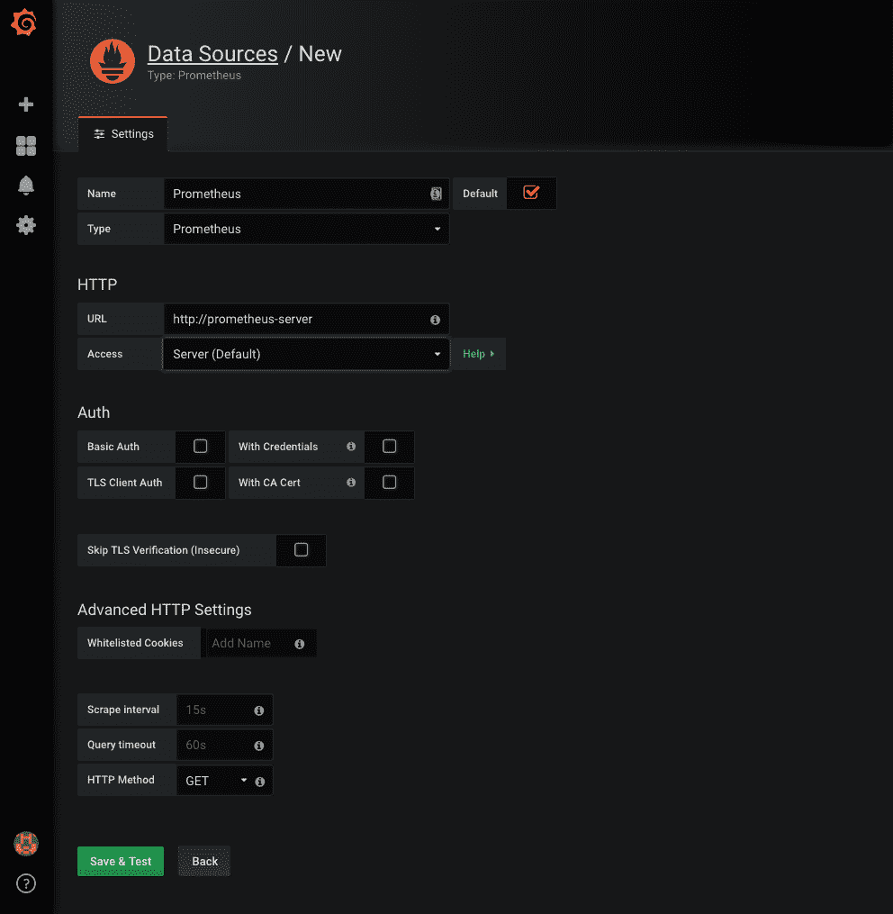

Figure 6-1: Grafana's new data source screen We'll have more screenshots in this chapter than usual. I believe that they will help you replicate the steps we'll discuss.

# 导入和自定义预制仪表板

数据源本身是无用的。我们需要以某种方式想象它们。我们可以通过创建自己的仪表板来做到这一点，但这可能不是对 Grafana 最好(也是最简单)的介绍。相反，我们将导入一个现有的社区维护的仪表板。我们只需要选择一个适合自己需求的。

```
 1  open "https://grafana.com/dashboards"
```

请随意花一点时间探索可用的仪表板。

我认为 *Kubernetes 集群监控*([https://grafana.com/dashboards/3119](https://grafana.com/dashboards/3119))仪表盘是一个很好的起点。让我们导入它。

请单击左侧菜单中的+图标，然后单击导入链接，您将看到一个屏幕，允许我们导入其中一个 Grafana.com 仪表板，或者粘贴定义它的 JSON。

我们会选择前者。

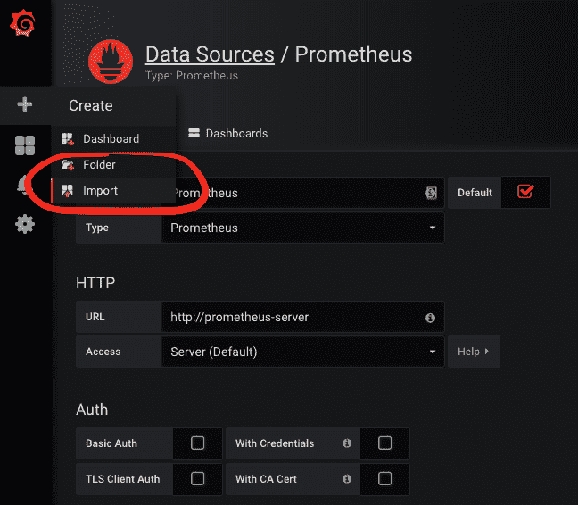

Figure 6-2: Grafana's import dashboard option

请在*Grafana.com 仪表盘*栏中输入`3119`，点击加载按钮。您将看到几个字段。在这种情况下，唯一重要的是*普罗米修斯*下拉列表。我们必须用它来设置数据源。选择很容易，因为我们只定义了一个。选择普罗米修斯，然后单击导入按钮。

您眼前看到的是一个仪表板，其中包含一些基本的 Kubernetes 指标。

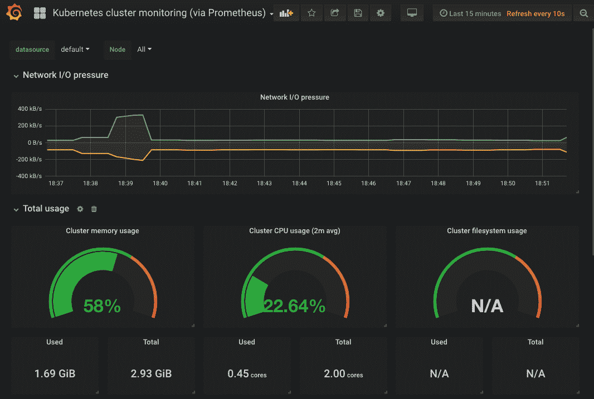

Figure 6-3: Kubernetes cluster monitoring dashboard

然而，有些图表可能不起作用。这是否意味着我们导入了错误的仪表板？简单的回答恰恰相反。在所有可用的仪表板中，这一个可能拥有最多可用的图表。至少，如果我们只计算那些或多或少有用的东西。这样的结果是常见的。这些仪表板由社区维护，但大多数是为个人使用而制作的。它们被配置为在特定的集群中工作，并使用特定的指标。您将无法找到许多不做任何更改就能工作的仪表板，同时显示您真正需要的东西。相反，我认为这些仪表板是一个很好的起点。

我导入它们只是为了获得一个可以修改以满足我的特定需求的基础。这就是我们接下来要做的，至少是部分要做的。

目前，我们将只关注旨在使其全面运行的变化。我们将制作一些目前没有数据的图表，并删除那些对我们没有用处的图表。

如果我们仔细查看*总使用量*行，我们会看到*集群文件系统使用量*为*不适用*。它使用的指标可能有问题。让我们仔细看看。

In some clusters (for example, EKS) the hard-coded file system in this dashboard is the correct one. If that's the case (if *Cluster filesystem usage* is not *N/A*) you do not have to make any changes. However, I suggest you still go through the exercise while imagining that your cluster uses a different file system. That way you'll learn a few tips that you could apply to other dashboards.

请按下*集群文件系统使用*标题旁边的箭头，然后单击编辑链接。

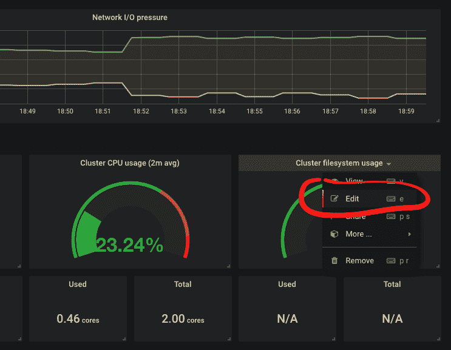

Figure 6-4: Grafana's option to edit a panel

该图使用的查询(为可读性而格式化)如下。

```
 1  sum (
 2      container_fs_usage_bytes{
 3          device=~"^/dev/xvda.$",
 4          id="/",
 5          kubernetes_io_hostname=~"^$Node$"
 6      }
 7  ) / 
 8  sum (
 9      container_fs_limit_bytes{
10          device=~"^/dev/xvda.$",
11          id="/",
12          kubernetes_io_hostname=~"^$Node$"
13      }
14  ) * 100
```

我们不会详细讨论那个查询。你现在应该熟悉普罗米修斯的表情了。相反，我们将关注问题的可能原因。我们可能没有名为`/dev/xvda`的文件系统设备(除非您使用的是 EKS，或者在某些情况下是 GKE)。如果这是问题所在，我们可以通过简单地将值更改为我们的设备来修复图形。但是，在我们走这条路之前，我们可能会探索格拉夫纳变量。毕竟，如果我们甚至不知道我们的设备是什么，用另一个硬编码值来改变一个硬编码值对我们没有任何好处。

我们可以去普罗米修斯那里取回所有设备的清单，或者让格拉夫娜帮我们做。我们会选择后者。

仔细看看`kubernetes_io_hostname`。设置为`^$Node$`。这是一个使用 Grafana 变量的例子。我们接下来将探索它们，试图取代硬编码设备。

请单击位于屏幕右上角的返回仪表板按钮。

点击位于屏幕顶部的*设置*图标。您将看到我们可以更改的所有仪表板范围的配置。请随意探索左侧菜单中的选项。

由于我们有兴趣创建一个动态填充查询的`device`标签的新变量，我们的下一步操作是单击*设置*部分的变量链接，然后单击+ New 按钮。

请输入`device`作为变量名，`IO Device`作为标签。我们将从普罗米修斯(数据源)中检索值，因此我们将把类型留给查询。

接下来，我们需要指定数据源。选择$datasource。这告诉 Grafana，我们希望从导入仪表板时选择的任何数据源中查询数据。

到目前为止，一切可能都不言自明。接下来的不是。我们需要查阅文档并学习如何编写用作变量值的 Grafana 查询。

```
 1  open
    "http://docs.grafana.org/features/datasources/prometheus/#query-variable"
```

让这成为一个练习。通过文档，了解如何编写一个查询来检索`container_fs_usage_bytes`度量中可用的标签`device`的所有不同值。

Grafana 只支持四种类型的变量查询，所以我认为您不难发现我们应该添加到查询字段中的表达式是`label_values(container_fs_usage_bytes, device)`。

查询完成后，剩下的就是点击添加按钮。

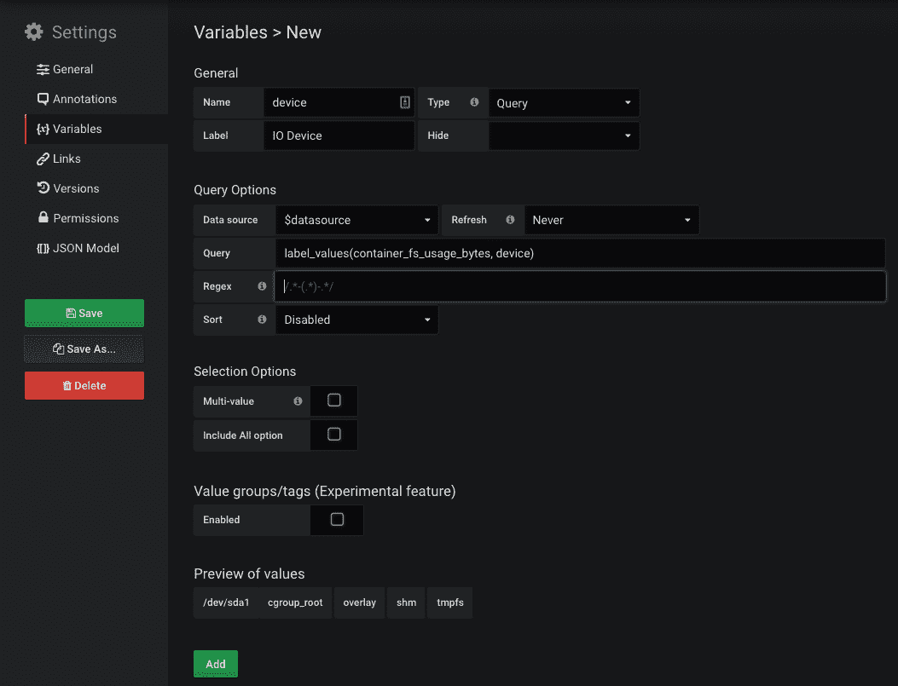

Figure 6-5: Grafana's screen for creating new dashboard variables

现在我们应该回到仪表板并确认新变量可用。

您应该会在屏幕左上角看到一个新的下拉列表，标签为*输入输出设备*。如果您扩展它，您将看到我们集群中使用的所有设备。确保选择了正确的设备。那很可能是`/dev/sda1`或`/dev/xvda1`。

接下来，我们需要更改图表以使用我们刚刚创建的变量。

请单击*集群文件系统使用情况*图表旁边的箭头，并选择编辑。度量(查询)包含两个硬编码的`^/dev/xvda.$`值。将其更改为`$device`，并单击位于屏幕右上角的返回仪表板按钮。

就这样。该图现在通过向我们显示集群文件系统使用率的百分比(`/dev/sda1`)来正确工作。

但是下面的*使用的*和*合计*号仍然是*不适用*。我相信你知道怎么修复它们。编辑那些图表并用`$device`替换`^/dev/xvda.$`。

该仪表板仍有两个问题需要解决。或者更准确地说，两张图对我们来说毫无用处。*系统服务 CPU 使用情况*和*系统服务内存使用情况*图表的目的应该可以从它们的标题中推断出来。然而，大多数 Kubernetes 集群不提供对系统级服务的访问(例如 GKE)。即使他们这样做了，我们的普罗米修斯也没有被配置为获取数据。如果你不相信我，复制其中一个图形的查询并在普罗米修斯中执行。现在，这些图表只是在浪费空间，所以我们将删除它们。

请点击*系统服务 CPU 使用率*行标题旁边的*垃圾桶*图标。单击是删除行和面板。对*系统服务内存使用*行重复相同的操作。

现在我们已经完成了对仪表板的更改。它是完全可操作的，我们应该通过点击屏幕右上角的*保存仪表盘*图标，或者按 **CTRL+S** 来保存更改。

我们不会讨论格拉夫纳的所有选择和我们能做的行动。我相信你能自己弄清楚。这是一个非常直观的应用。相反，我们将尝试创建自己的仪表板。或者，至少，探索一些能让你继续自己生活的事情。

# 创建自定义仪表板

如果我们所有的需求都能被现有的仪表板覆盖，那就太好了。但是，事实可能并非如此。每个组织都是“特殊的”，我们的需求必须反映在我们的仪表板上。有时我们可以侥幸逃脱别人做的仪表板，有时我们需要改变它们。在其他情况下，我们需要创建自己的仪表板。这就是我们接下来要探索的。

请点击左侧菜单中的+图标，选择`Create Dashboard`。您可以选择几种面板。选择`Graph`。

在定义第一个图形之前，我们将更改一些仪表板设置。请点击屏幕右上角的*设置*图标。

在*常规*部分，键入仪表板的名称。如果你今天没有灵感，可以称之为`My Dashboard`。将标签设置为`Prometheus`和`Kubernetes`。键入每个标签后，您必须按回车键。最后，将时区更改为本地浏览器时间。

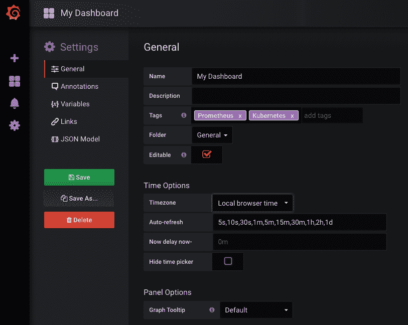

Figure 6-6: Grafana's dashboard general settings screen

那是无聊的部分。现在让我们换个更有趣的话题。我们即将把我们在普罗米修斯中创建的一个警报转换成图形。我们将使用告诉我们实际 CPU 与保留 CPU 的百分比的那个。为此，我们需要一些变量。更准确地说，我们并不真正需要它们，因为我们可以对这些值进行硬编码。但是，如果我们决定改变它们，这将在以后引起问题。修改变量比更改查询容易得多。

具体来说，我们需要一些变量来告诉我们最小 CPU 是多少，这样我们就可以忽略被设置为使用非常低的保留的应用的阈值。此外，我们将定义作为上下边界的变量。我们的目标是在与实际使用情况相比时，如果保留的 CPU 太低或太高时得到通知，就像我们在普罗米修斯警报中所做的那样。

请从左侧菜单中选择变量部分，然后单击添加变量按钮。

当我们为导入的仪表板创建一个新的变量时，您已经看到了带有 Grafana 变量的屏幕。然而，这次我们将使用稍微不同的设置。

输入`minCpu`作为名称，选择常量作为类型。与我们之前创建的`device`变量不同，这次我们不需要 Grafana 来查询这些值。通过使用该类型，我们将定义一个常数值。请将*值设置为* `0.005`(五个 CPU 毫秒)。最后，我们不需要在仪表板中看到该变量，因为该值不太可能经常变化。如果我们将来确实需要改变它，我们总是可以回到这个屏幕并更新它。因此，请将“隐藏”值更改为“可变”。

剩下的就是点击添加按钮两次。

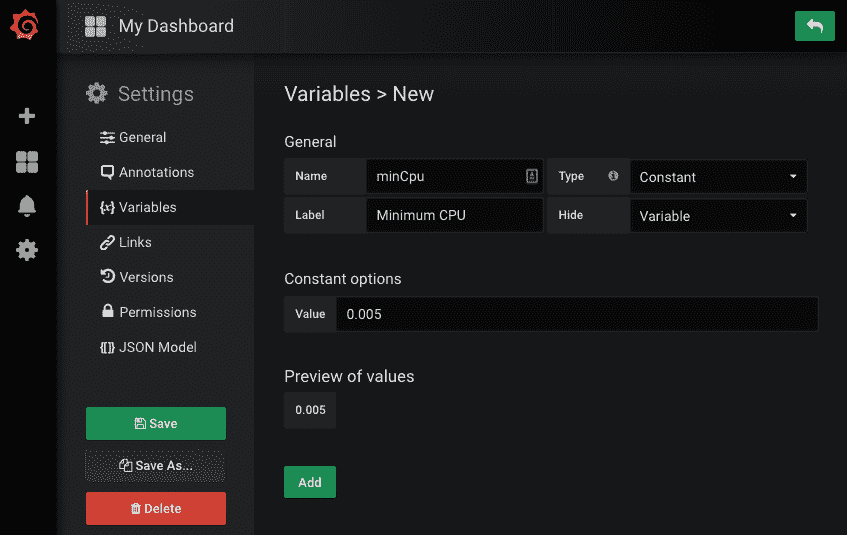

Figure 6-7: Grafana's dashboard new variable screen

我们还需要两个变量。可能不需要重复相同的说明，因此请使用以下信息来创建它们。

```
 1  Name:  cpuReqPercentMin
 2  Type:  Constant
 3  Label: Min % of requested CPU
 4  Hide:  Variable
 5  Value: 50
 6
 7  Name:  cpuReqPercentMax
 8  Type:  Constant
 9  Label: Max % of requested CPU
10  Hide:  Variable
11  Value: 150
```

现在我们可以回去定义我们的图表。请点击屏幕右上角的*返回仪表盘*图标。

您已经知道如何编辑面板。点击*面板标题*旁边的箭头，选择编辑。

我们将从*常规*部分开始。请选择它。

接下来，写`% of actual vs reserved CPU`作为标题，下面的文字作为描述。

```
 1  The percentage of actual CPU usage compared to reserved. The
    calculation excludes Pods with reserved CPU equal to or smaller than
    $minCpu. Those with less than $minCpu of requested CPU are ignored.
```

请注意描述中`$minCpu`变量的用法。当我们回到仪表板时，它将扩展到它的价值。

接下来，请切换到*指标*选项卡。那才是真正的行动发生的地方。

我们可以定义多个查询，但是对于我们的用例，一个就足够了。请在 *A* 右侧的字段中键入以下查询。

For your convenience, the query is available in the `grafana-actual-vs-reserved-cpu` ([https://gist.github.com/vfarcic/1b027a1e2b2415e1d156687c1cf14012](https://gist.github.com/vfarcic/1b027a1e2b2415e1d156687c1cf14012)) Gist.

```
 1  sum(label_join(
 2      rate(
 3          container_cpu_usage_seconds_total{
 4              namespace!="kube-system",
 5              pod_name!=""
 6          }[5m]
 7      ),
 8      "pod",
 9      ",",
10      "pod_name"
11  )) by (pod) /
12  sum(
13      kube_pod_container_resource_requests_cpu_cores{
14          namespace!="kube-system",
15          namespace!="ingress-nginx"
16      }
17  ) by (pod) and 
18  sum(
19      kube_pod_container_resource_requests_cpu_cores{
20          namespace!="kube-system",
21          namespace!="ingress-nginx"
22      }
23  ) by (pod) > $minCpu
```

该查询与我们在[第 3 章](3.html)、*收集和查询指标并发送警报*中使用的查询几乎相同。唯一不同的是`$minCpu`变量的用法。

在输入查询后的几分钟内，我们应该会看到图表变得活跃起来。可能只有一个 Pod 包含在内，因为我们的许多应用被定义为使用 5 个 CPU 毫秒(即`$minCpu`的值)，或者更少。

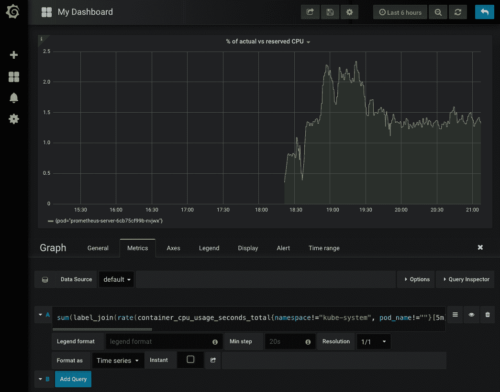

Figure 6-8: Grafana's panel based on a graph

接下来，我们将调整图表左侧的单位。请单击轴选项卡。

展开*左侧 Y 单位*，选择无，然后是百分比(0.0-1.0)。由于我们没有使用*右 Y* 轴，请取消勾选*显示*复选框。

下一节是*图例*。请选择它。

勾选*选项为表格*、*选项右侧*和*值>当前*复选框。更改会立即应用到图表中，您应该不难推断出每一个更改的作用。

只少了一件事。我们应该定义上限和下限，以提供结果超出预期范围的明确指示。

请单击警报选项卡。

单击“创建警报”按钮，将“高于”条件更改为“超出范围”。将接下来两个字段的值设置为`0,5`和`1,5`。应该通知的是，与保留值相比，实际 CPU 使用率是低于 50%还是高于 150%。

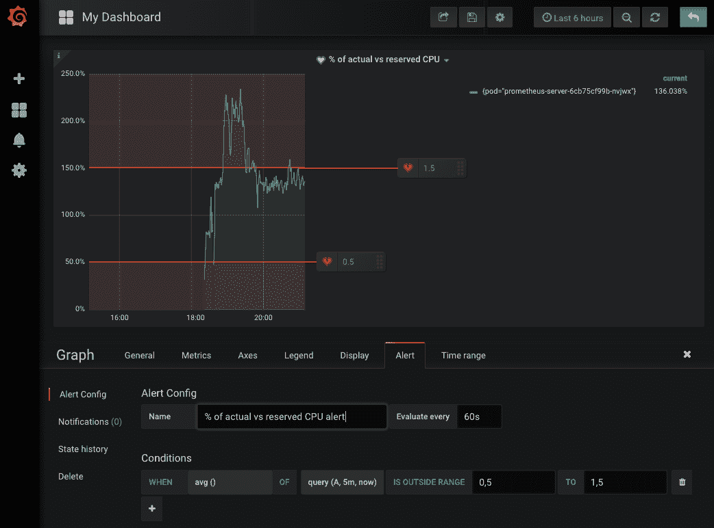

Figure 6-9: Grafana's graph with alerts

我们已经完成了图表，所以请回到仪表板享受“漂亮的颜色”。您可能需要拖动图形的右下角来调整其大小。

我们可以看到请求的 CPU 使用率和实际 CPU 使用率之间的差异。我们还有阈值(用红色标记)，它会告诉我们使用是否超出了既定的界限。

现在来了一个大问题。这样的图有用吗？答案取决于我们要用它来做什么。

如果目标是盯着它，等待其中一个 Pods 开始使用过多或过少的 CPU，我只能说你在浪费你的才能，而这些才能可以用于更有效率的任务。毕竟，我们在普罗米修斯中已经有了一个类似的警报，当满足条件时，它会向我们发送一个 Slack 通知。它比我们在该图中看到的更高级，因为只有在给定时间段内 CPU 使用率达到峰值时，它才会通知我们，从而避免可能在几秒钟或几分钟后解决的临时问题。我们应该把那些案例当作假警报丢掉。

该图的另一种用法可能更被动。我们可以忽略它(关闭格拉夫纳)，只有当上面提到的普罗米修斯警报被触发时，我们才能回到它。这可能更有意义。即使我们可以在普罗米修斯中运行一个类似的查询并得到相同的结果，拥有一个预定义的图形也可以避免我们编写这样的查询。您可以将它看作是一种拥有带有相应图形表示的查询注册表的方法。这确实更有意义。我们可以在需要的时候回到仪表板上，而不是盯着仪表板(选择网飞)。虽然在某些情况下，这可能是一个合理的策略，但它只会在非常简单的情况下起作用。当出现问题时，单个预定义的图形可以解决问题，或者更准确地说，可以清楚地指出问题的原因，图形确实具有重要价值。然而，通常情况下，找到问题的原因并没有那么简单，我们将不得不求助于普罗米修斯来开始更深入地挖掘度量标准。

Looking at dashboards with graphs is a waste of time. Visiting dashboards after receiving a notification about an issue makes a bit more sense. Still, all but trivial problems require deeper digging through Prometheus metrics.

尽管如此，我们刚刚制作的图表可能会证明自己是有用的，所以我们会保留它。在这种情况下，我们可能想做的是更改普罗米修斯警报的链接(我们目前在 Slack 中收到的链接)，以便它直接将我们带到 Graph(而不是仪表板)。我们可以通过单击面板名称旁边的箭头并选择查看选项来获得该链接。

我相信，如果我们将面板的类型从图形改为色彩不那么丰富的东西，线条更少，轴更少，并且没有其他漂亮的东西，我们可以使我们的仪表板更加有用。

# 创建信号量仪表板

如果我声称仪表板给表带来的价值比我们想象的要低，那么从本章开始，您可能会问自己同样的问题。为什么我们要讨论仪表板？嗯，我已经把我的说法从“仪表盘没用”改成了“仪表盘有些价值”。它们可以作为查询的注册表。通过仪表板，我们不需要记住我们在普罗米修斯中需要写的表达式。在我们深入挖掘度量标准之前，它们可能是我们寻找问题原因的一个很好的起点。但是，我将仪表板纳入解决方案还有另一个原因。

我喜欢大型展览。进入一个大屏幕显示重要内容的房间是非常令人满意的。通常有一个房间，操作员坐在里面，四面墙上都有监视器。那通常是令人印象深刻的景象。然而，许多这样的情况都有一个问题。一堆显示大量图表的显示器可能只不过是一幅美丽的景象。在最初的几天后，没有人会盯着图表看。如果这不是真的，你也可以解雇那个人，因为你知道他在伪造他的作品。

让我再重复一遍。

Dashboards are not designed for us to stare at them, especially not when they are on big screens where everyone can see them.

所以，如果拥有大屏幕是一个好主意，但是图形不是装饰它们的好选择，我们应该怎么做呢？答案在于信号量。它们类似于警报，应该提供系统状态的清晰指示。如果屏幕上的一切都是绿色的，我们就没有理由做任何事情。其中一个变红是我们应该做点什么来纠正这个问题的信号。因此，我们必须努力避免假阳性。如果某样东西变红了，而这不需要任何行动，我们很可能在未来开始忽略它。当这种情况发生时，我们正在冒着这样的风险:当我们忽略一个真正的问题时，认为它只是另一个假阳性。因此，每次出现警报后都应该采取行动。

这可以是纠正系统的修复，也可以是使其中一个信号灯变红的条件变化。无论是哪种情况，我们都不应该忽视它。

信号量的主要问题是它们对首席技术官和其他决策者没有吸引力。它们不是彩色的，也没有显示很多框、线和数字。人们经常把有用性和看起来有多讨人喜欢混为一谈。然而，我们并不是在建造一些应该卖给首席技术官的东西，而是一些对我们的日常工作有帮助的东西。

Semaphores are much more useful than graphs as a way to see the status of the system, even though they do not look as colorful and eye-pleasing as graphs.

让我们创建第一个信号量。

请点击屏幕右上角的*添加面板*图标，选择 Singlestat。点击*面板标题*旁边的箭头图标，选择编辑。

在大多数情况下，创建一个单一的 stat(一个信号量)与创建一个图没有太大区别。最大的区别在于应该产生单个值的度量(查询)。我们很快就会到达那里。现在，我们将更改面板的一些一般信息。

请选择常规选项卡。

键入`Pods with <$cpuReqPercentMin%||>$cpuReqPercentMax% actual compared to reserved CPU`作为标题，键入以下文本作为描述。

```
 1  The number of Pods with less than $cpuReqPercentMin% or more than
    $cpuReqPercentMax% actual compared to reserved CPU
```

这个单一的统计将使用一个类似于我们之前制作的图表的查询。但是，虽然图表显示的是与保留的 CPU 相比的当前使用情况，但该面板应该显示有多少 Pods 的实际 CPU 使用量超出了基于保留的 CPU 的界限。这反映在我们刚刚输入的标题和描述中。正如你所看到的，这一次我们依靠更多的变量来表达我们的意图。

现在，让我们将注意力转向查询。请单击度量选项卡，并在 *A* 旁边的字段中键入以下表达式。

For your convenience, the query is available in the `grafana-single-stat-actual-vs-reserved-cpu` ([https://gist.github.com/vfarcic/078674efd3b379c211c4da2c9844f5bd](https://gist.github.com/vfarcic/078674efd3b379c211c4da2c9844f5bd)) Gist.

```
 1  sum(
 2      (
 3          sum(
 4              label_join(
 5                  rate(container_cpu_usage_seconds_total{
 6                      namespace!="kube-system",
 7                      pod_name!=""}[5m]),
 8                      "pod",
 9                      ",",
10                      "pod_name"
11              )
12          ) by (pod) /
13          sum(
14              kube_pod_container_resource_requests_cpu_cores{
15                  namespace!="kube-system",
16                  namespace!="ingress-nginx"
17              }
18          ) by (pod) and
19          sum(
20              kube_pod_container_resource_requests_cpu_cores{
21                  namespace!="kube-system",
22                  namespace!="ingress-nginx"
23              }
24          ) by (pod) > $minCpu
25      ) < bool ($cpuReqPercentMin / 100)
26  ) +
27  sum(
28      (
29          sum(
30              label_join(
31                  rate(
32                      container_cpu_usage_seconds_total{
33                          namespace!="kube-system",
34                          pod_name!=""
35                      }[5m]
36                  ),
37                  "pod",
38                  ",",
39                  "pod_name"
40              )
41          ) by (pod) /
42          sum(
43              kube_pod_container_resource_requests_cpu_cores{
44                  namespace!="kube-system",
45                  namespace!="ingress-nginx"
46              }
47          ) by (pod) and
48          sum(
49              kube_pod_container_resource_requests_cpu_cores{
50                  namespace!="kube-system",
51                  namespace!="ingress-nginx"
52              }
53          ) by (pod) > $minCpu
54      ) > bool ($cpuReqPercentMax / 100)
55  )
```

该查询类似于我们在普罗米修斯警报中使用的查询。更准确地说，它是两个普罗米修斯警报的组合。前半部分返回预留 CPU 超过`$minCpu` (5 CPU 毫秒)且实际 CPU 使用率低于`$cpuReqPercentMin` (50%)的 Pods 数量。后半部分与第一部分几乎相同，只是它返回的 Pods 的 CPU 使用率高于`$cpuReqPercentMax` (150%)。

因为我们的目标是返回一个单一的统计，在这种情况下，是豆荚的数量，你可能会惊讶，我们使用了`sum`而不是`count`。计数豆荚确实更有意义，除了如果没有结果会返回`N/A`。为了避免这种情况，我们对`bool`使用了一个技巧。通过将它放在表达式前面，如果有匹配项，它将返回`1`，如果没有匹配项，它将返回`0`。这样，如果没有一个 Pods 符合条件，我们就不会得到一个空的结果，而是`0`，这是有问题的 Pods 数量的更好的表示。

总之，我们正在检索实际 CPU 低于预留 CPU 的`$cpuReqPercentMin` (50%)的所有 Pods 的总和，加上实际 CPU 高于预留 CPU 的`$cpuReqPercentMax` (150%)的所有 Pods 的总和。在这两种情况下，只有超过`$minCpu`(五个中央处理器毫秒)的吊舱被包括在内。查询本身并不是我们能写的最简单的查询，但是考虑到我们已经花了很多时间在普罗米修斯查询上，我认为我不应该用一些琐碎的事情来“侮辱”你。

接下来，请单击选项选项卡。我们将在这里定义触发颜色变化的条件。

我们不需要指定期间的平均值，而是当前有问题的 Pods 的数量。我们将通过将 Stat 下拉列表的值更改为 Current 来实现这一点。

我们希望这个面板非常明显，所以我们将 Stat 字体大小更改为`200%`。我更喜欢更大的字体，但格拉夫纳不允许我们比这更高。

接下来，我们想要更改面板的背景颜色，因此请选中“给背景着色”复选框。

我们最多可以使用三种颜色，但我相信我们只需要两种。一个或多个吊舱满足条件，或者没有一个满足条件。

查询一返回`1`，或者更高的数字，就应该通知我们。请输入`1`作为着色阈值。如果我们有更多，我们会用逗号把它们分开。

最后，由于我们只有两个条件，绿色和红色，我们需要将第二种颜色从橙色更改为红色。请点击着色颜色中的*红色*图标，并用*红色*替换该值。第三种颜色不用，我们就原封不动。

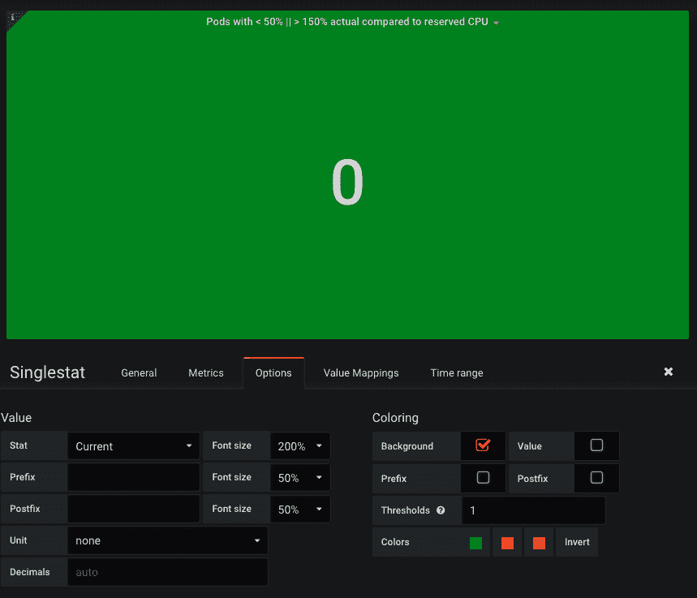

Figure 6-10: Grafana's single stat panel

我们已经完成了面板，所以回到仪表盘。

继续之前，请点击*保存仪表盘*图标，然后点击保存按钮。

到目前为止，我们创建了一个带有一个图形和一个 stat(信号量)的仪表板。前者显示了随着时间的推移，与保留的 CPU 相比，CPU 使用率的偏差。它有警报(红色区域)，告诉我们其中一个向量是否在预定义的边界之外。单个 stat(信号量)显示带有绿色或红色背景的单个数字，这取决于该数字是否达到阈值，在我们的例子中，阈值被设置为`1`。

我们刚刚开始，在这个仪表板变得有用之前，我们需要许多其他面板。我将使您免于重复定义其他指令。我觉得你已经掌握了格拉芙娜的工作原理。你至少应该有自己可以扩展的基础知识。

我们快进。我们将导入我准备的仪表板，并讨论设计选择。

# 更好的大屏幕仪表板

我们探索了如何创建一个带有图形和单个 stat(信号量)的仪表板。两者都基于相似的查询，显著的区别在于它们显示结果的方式。我们将假设我们开始构建的仪表板的主要目的是在一个大屏幕上可用，对许多人来说是可见的，而不是作为我们在笔记本电脑上保持打开的东西。至少，不是连续的。

这样一个仪表板的主要目的应该是什么？在回答这个问题之前，我们将导入我为本章创建的仪表板。

请单击左侧菜单中的+按钮，然后选择导入。输入`9132`作为*Grafana.com 仪表盘*，按下加载按钮。选择一个*普罗米修斯数据源*。请随意更改任何值以满足您的需求。尽管如此，你可能还是想推迟，直到你更熟悉仪表板。

无论如何，完成后请点按“导入”按钮。

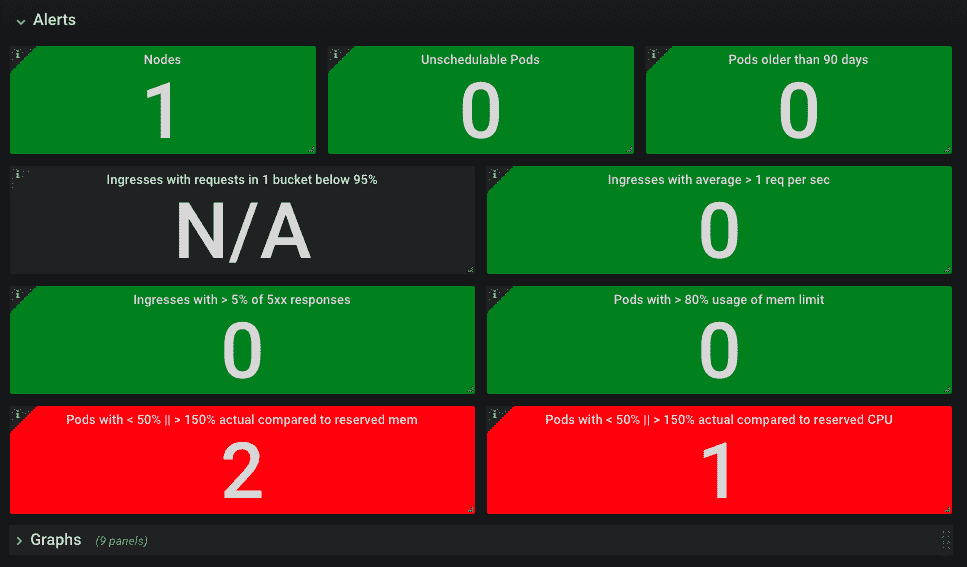

Figure 6-11: Grafana dashboard based on semaphores

你可能会看到一个或多个红色信号灯。这很正常，因为我们集群中的一些资源配置不正确。例如，普罗米修斯请求的内存可能比它需要的少。没关系，因为它可以让我们看到仪表板在运行。Gists 中使用的定义不应该是生产就绪的，您已经知道您必须调整它们的资源，可能还有一些其他的东西。

您会注意到，我们导入的仪表板仅由信号量组成。至少第一眼看上去是这样。尽管它们可能不如图表和其他类型的面板有吸引力，但它们作为我们系统健康状况的指标要有效得多。我们不需要看仪表盘。如果它显示在大屏幕上就足够了，而我们在做其他事情。如果其中一个盒子变成红色，我们会注意到的。这将是一个行动的号召。或者，更准确地说，如果一个红盒子持续变红的时间更长，我们需要做一些事情，从而排除它是假阳性的可能性，假阳性将在几分钟后自行解决。

您可以将此仪表板视为普罗米修斯警报的补充。它不能取代它们，因为有一些微妙的，但重要的差异，我们将在后面讨论。

我不会描述每个面板，因为它们反映了我们之前创建的普罗米修斯警报。你现在应该熟悉他们了。如有疑问，请点击面板左上角的 I 图标。如果描述不够，请进入面板的编辑模式，并检查查询和颜色选项。

请注意，仪表盘可能并不完美。您可能需要更改一些变量值或颜色阈值。例如，*节点*面板的阈值设置为`4,5`。从颜色来看，如果节点数跳到 4，就会变成橙色(警告)，如果跳到 5，就会变成红色(恐慌)。你的价值观可能会有所不同。理想情况下，我们应该使用变量而不是硬编码的阈值，但这在 Grafana 中目前是不可能的。不是所有地方都支持变量。你作为开源项目的支持者，应该做一个公关。如果你有，请让我知道。

这是否意味着我们所有的仪表板都应该是绿色和红色的盒子，里面只有一个数字？我确实认为信号量应该是“默认”显示。当它们是绿色时，就不需要其他任何东西了。如果情况不是这样，我们应该扩展信号量的数量，而不是用随机的图形来混淆我们的监视器。然而，这回避了一个问题。当一些盒子变成红色甚至橙色时，我们该怎么办？

在方框下方，您会发现带有附加面板的*图形*行。它们在默认情况下不可见是有原因的。

在正常情况下没有理由看到它们。但是，如果其中一个信号量确实发出了警报，我们可以展开*图形*并查看有关该问题的更多详细信息。

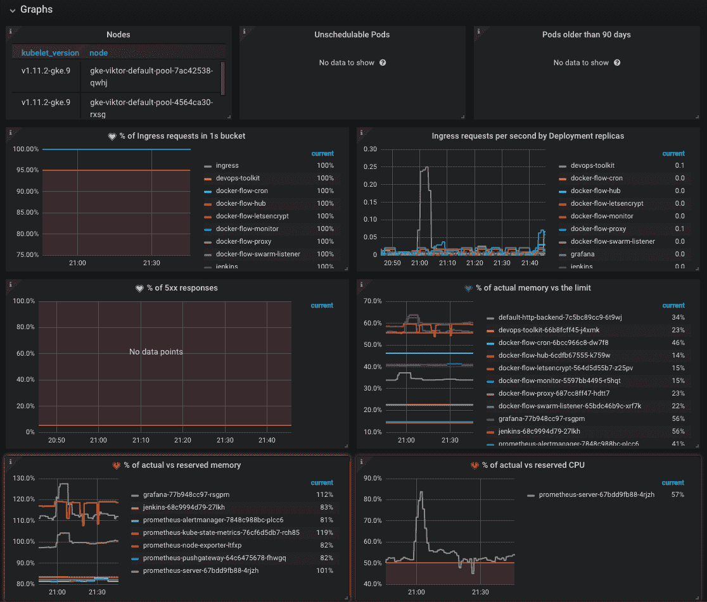

Figure 6-12: Grafana dashboard based on tables and graphs

*图形*行中的面板是*警报*行中面板(信号量)的反映。每个图表显示了来自相同位置(但不同行)的与单个 stat 相关的更详细的数据。这样，我们就不需要浪费时间试图找出哪个图形对应于“红框”。

相反，我们可以直接跳到相应的图中。如果右边第二行的信号灯变红，看看右边第二行的图表。如果多个框变成红色，我们可以快速查看相关图形，并尝试找到关系(如果有)。通常情况下，我们将不得不从格拉夫纳转向普罗米修斯，并更深入地研究度量标准。

像您前面的仪表板应该能让我们快速开始解决问题。顶部的信号量提供了警报机制，该机制将导致下面的图表，该图表将快速指示问题的可能原因。从那里开始，如果原因很明显，我们可以转移到普罗米修斯并开始调试(如果这是正确的话)。

Dashboards with semaphores should be displayed on big screens around the office. They should provide an indication of a problem. Corresponding graphs (and other panels) provide a first look at the issue. Prometheus serves as the debugging tool we use to dig into metrics until we find the culprit.

我们探索了一些提供类似功能的东西。尽管如此，普罗米修斯警报、信号量、图形警报和格拉夫纳通知之间的区别可能还不清楚。为什么我们没有创建任何 Grafana 通知？接下来我们将探讨这些问题和其他一些问题。

# 普罗米修斯警报与格拉夫纳通知、信号量与图形警报

标题本身可能会令人困惑，所以让我们简要描述一下其中提到的每个元素。

普罗米修斯警报和格拉夫纳通知服务于相同的目的，尽管我们没有探索后者。我将让您了解 Grafana 通知如何独立工作。谁知道呢？在接下来的讨论之后，你可能甚至不想花时间和他们在一起。

格拉夫纳的通知可以转发给不同的收件人，方式类似于普罗米修斯的警报通过警报器管理器转发的方式。然而，有几件事让格拉夫纳的通知不那么吸引人。

如果我们能用普罗米修斯警报和格拉夫纳警报达到同样的结果，那么前者就有明显的优势。如果从普罗米修斯处触发警报，这意味着导致警报触发的规则也在普罗米修斯中定义。

因此，评估是在数据源进行的，我们避免了 Grafana 和 Prometheus 之间不必要的延迟。我们离数据源越近越好。在警报/通知的情况下，更近意味着普罗米修斯内部。

在普罗米修斯中定义警报的另一个优点是，它允许我们做更多的事情。例如，在格拉夫纳没有相当于普罗米修斯的`for`语句。我们无法定义只有在条件持续一段时间后才会触发的通知。我们需要对查询进行非平凡的添加来实现同样的目的。另一方面，Alertmanager 提供了更复杂的方法来过滤警报，对警报进行分组，并仅转发符合特定标准的警报。在普罗米修斯和警报管理器中定义警报比在格拉夫纳定义通知有许多其他优势。但是，我们不会一一讨论。除非你已经确信放弃格拉夫纳通知，转而使用普罗米修斯警报和警报管理器，否则我会让你去找出所有的不同之处。

有一个重要的原因是你不应该完全拒绝格拉夫纳的通知。您正在使用的数据源可能没有警报/通知机制，或者它可能是您不拥有的企业许可证的一部分。由于格拉夫纳支持许多不同的数据源，普罗米修斯只是其中之一，格拉夫纳通知允许我们使用这些数据源中的任何一个，甚至可以组合它们。

Stick with Prometheus for alerts/notifications based on metrics stored there. For other data sources, Grafana alerts might be a better or even the only option.

现在，我们简要探讨了普罗米修斯警报和格拉夫纳通知之间的区别，我们将进入信号量。

信号量(基于单个 stat 面板的 Grafana 仪表板)不能取代 Prometheus 警报。首先，很难，甚至不可能创建仅当某个值达到某个阈值一段时间后才会变红的信号量(例如，像普罗米修斯警报中的`for`语句)。这意味着信号量可能会变成红色，但过了一会儿又变回绿色。这不是采取行动的原因，因为问题很快就自动解决了。如果我们每次在格拉夫纳有东西变红的时候都跳，我们会有很好的身体状态，但是我们不会做很多有用的工作。

信号量是可能不需要任何干预的问题的指示。虽然这种假阳性应该避免，但几乎不可能完全消除它们。这意味着我们应该盯着屏幕，看看在我们采取行动之前，一个红色的盒子是否会持续红色至少几分钟。信号量的主要目的不是向应该解决问题的个人或团队提供通知。对 Slack、电子邮件和其他目的地的通知可以做到这一点。信号量提供对系统状态的感知。

最后，我们探讨了在图上定义的警报。这些是图表中的红线和区域。它们不是有问题的好指标。它们不是那么容易发现，所以它们不能提高意识，而且它们肯定不能取代通知。相反，他们在我们发现有问题后帮助我们。如果一个通知或一个信号量提醒我们有一个可能需要修复的问题，图形提醒可以帮助我们识别罪魁祸首。哪个吊舱在红色区域？哪个入口收到的请求比预期的多？这些只是我们可以通过图表提示回答的几个问题。

# 现在怎么办？

Grafana 使用起来相对简单直观。如果您知道如何为连接到 Grafana 的数据源(例如普罗米修斯)编写查询，那么您已经了解了最具挑战性的部分。剩下的大部分是关于复选框、选择面板类型和在屏幕上排列东西。主要的困难是避免被一堆华而不实的仪表板冲昏头脑，这些仪表板没有提供多少价值。一个常见的错误是为我们能想象的一切创建一个图表。这只会降低真正重要的东西的价值。少往往就是多。

就这样。如果这本书是专用的，就销毁它，如果不是，或者你打算马上跳到下一章，就保留它。如果您保留它，请通过执行以下命令删除`grafana`图表。如果我们在下一章中需要它，我会确保它包含在 Gists 中。

```
 1  helm delete grafana --purge
```

在你离开之前，你可能要复习一下本章的要点。

*   用图表查看仪表板是浪费时间。在收到问题通知后访问仪表板更有意义。尽管如此，除了琐碎的问题，所有问题都需要通过普罗米修斯度量标准进行更深入的挖掘。
*   仪表板不是为我们盯着看而设计的，尤其是当它们出现在每个人都能看到的大屏幕上时。
*   作为一种查看系统状态的方式，信号量比图形有用得多，尽管它们看起来不像图形那样丰富多彩和赏心悦目。
*   带有信号灯的仪表板应该显示在办公室周围的大屏幕上。他们应该提供一个问题的迹象。相应的图表(和其他面板)提供了对问题的初步了解。普罗米修斯作为调试工具，我们用它来挖掘度量，直到找到罪魁祸首。
*   坚持使用 Prometheus，根据存储在那里的指标获取警报/通知。对于其他数据源，Grafana 警报可能是更好的选择，甚至是唯一的选择。