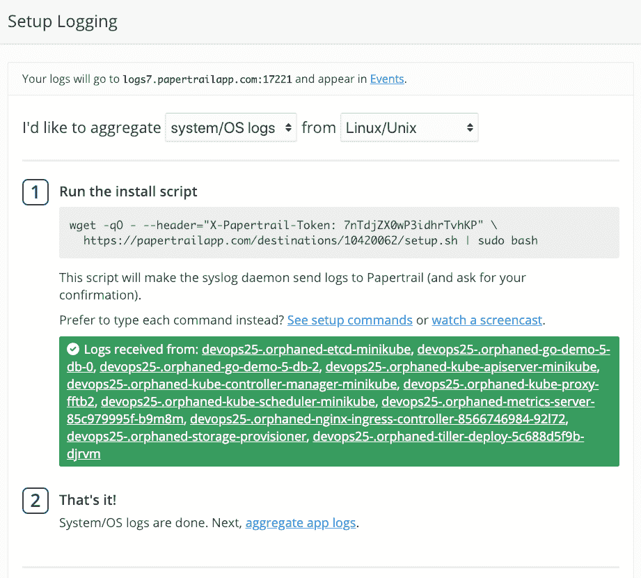
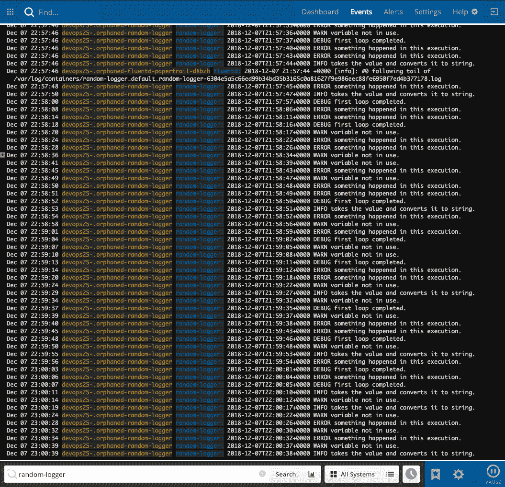
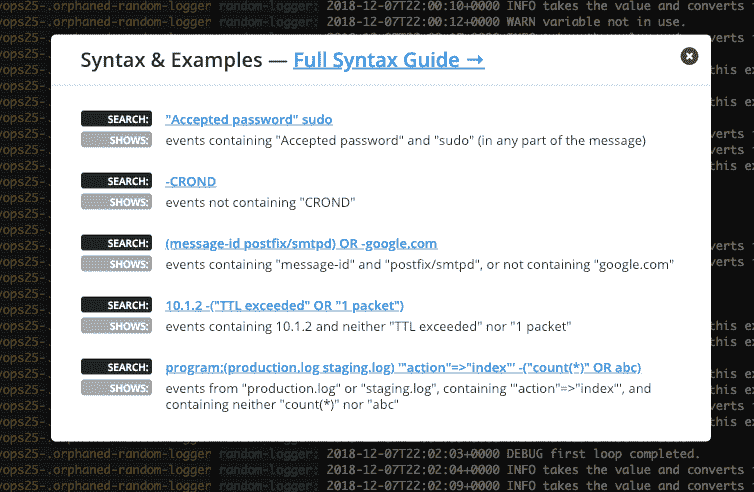
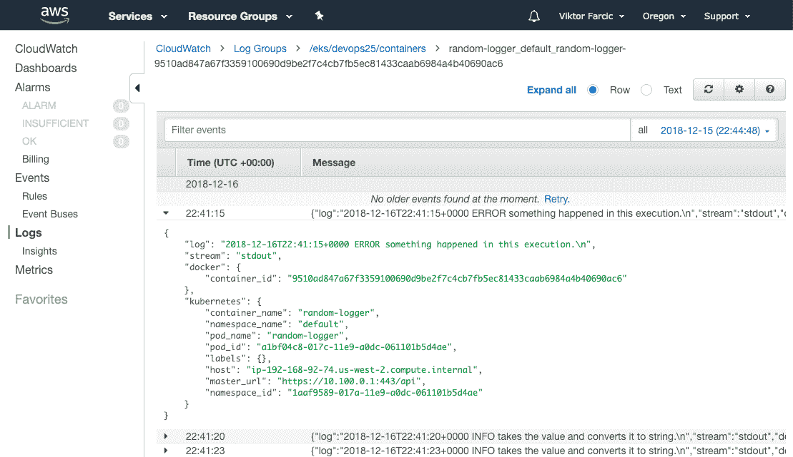
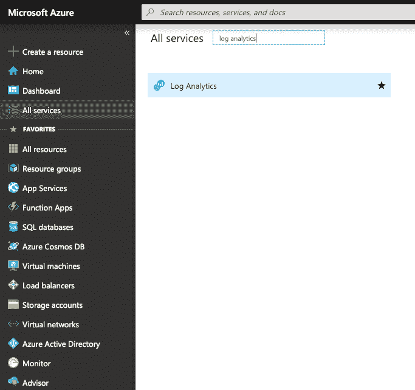
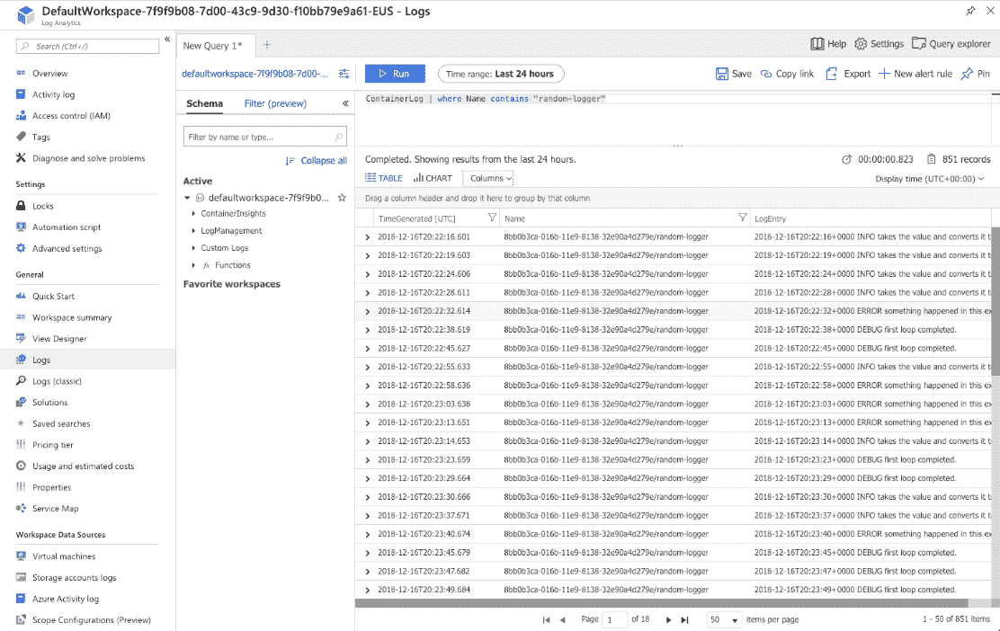
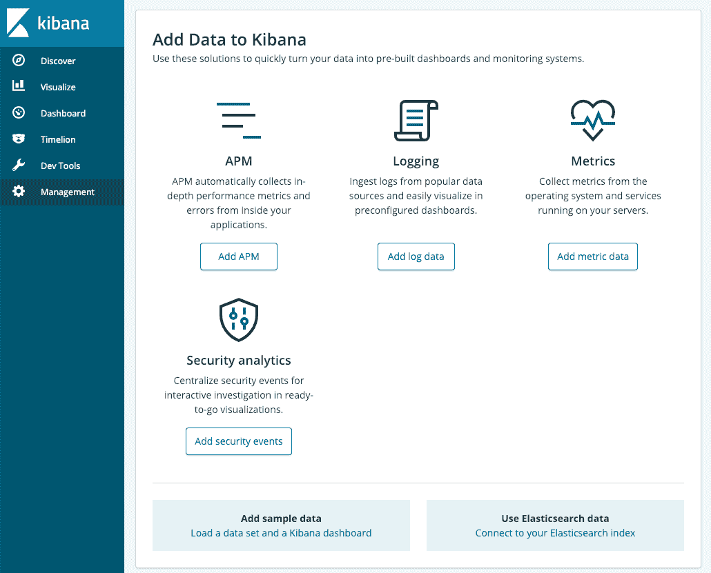
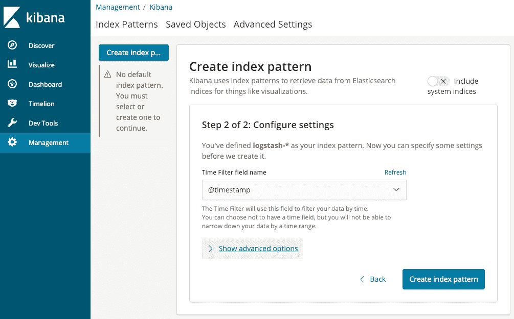
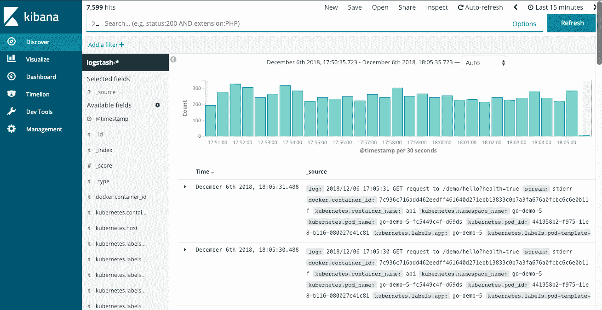

# 收集和查询日志

In critical moments, men sometimes see exactly what they wish to see.

- *史巴克*

到目前为止，我们主要关注的是指标。我们以不同的形式和不同的目的使用它们。在某些情况下，我们使用指标来扩展 Pods 和节点。在其他情况下，指标用于创建警报，当出现无法自动修复的问题时，这些警报会通知我们。我们还创建了一些仪表板。

然而，度量标准通常是不够的。在处理需要人工干预的问题时尤其如此。当仅有度量标准还不够时，我们通常需要查阅日志，希望它们能揭示问题的原因。

日志记录经常被误解，或者更准确地说，与度量混合在一起。对许多人来说，日志和指标之间的界限是模糊的。一些人正在从日志中提取指标。其他人将指标和日志视为相同的信息来源。这两种方法都是错误的。度量和日志是独立的实体，它们服务于不同的目的，并且它们之间有明显的区别。我们分别存储它们，并使用它们来解决不同类型的问题。我们会把它和其他一些讨论放在一起。我们将通过实际例子来探索细节，而不是基于理论。为此，我们需要一个集群。

# 创建集群

你知道规矩。我们将进入带有`vfarcic/k8s-specs`([https://github.com/vfarcic/k8s-specs](https://github.com/vfarcic/k8s-specs))存储库的目录，我们将获取最新版本的代码，以防我最近推送了一些东西，我们将创建一个新的集群，除非您手头已经有了一个。

All the commands from this chapter are available in the `07-logging.sh` ([https://gist.github.com/vfarcic/74774240545e638b6cf0e01460894f34](https://gist.github.com/vfarcic/74774240545e638b6cf0e01460894f34)) Gist.

```
 1  cd k8s-specs
 2
 3  git pull
```

这一次，对集群的要求发生了变化。我们需要比以前多得多的记忆。罪魁祸首是弹性搜索，它非常需要资源。

如果您使用桌面 Docker(T0)或 T2 minikube(T3)，您需要将群集专用内存增加到 10gb(T5)。如果这对于您的笔记本电脑来说太多了，您可以选择阅读*通过弹性搜索、Fluentd 和 Kibana* 探索集中日志记录，而不运行这些示例，或者您可能不得不切换到云提供商之一(AWS、GCP 或 Azure)。

在 **EKS** 和 **AKS** 的情况下，我们需要更大的节点。对于 EKS，我们将使用 **t2.large** ，对于 AKS **Standard_B2ms** 。两者均基于**2 CPU**和 **8 GB RAM** 。

**GKE** 要求同上。

在新的需求之上，应该注意的是我们在这一章中不需要普罗米修斯，所以我把它从 Gists 中移除了。

请随意使用下面的 Gists 之一来创建一个新的集群，或者验证您计划使用的集群是否满足要求。

*   `gke-monitor.sh` : **具有 3 个 n1-standard-1 工作节点的 GKE** 、 **nginx Ingress** 、 **tiller** 和存储在环境变量**LB _ IP**(https://gist . github . com/vfarcic/10e 14 bfbec 466347 D70 d 11 a 78 Fe 7 ee C4)中的集群 IP。
*   `eks-logging.sh` : **具有 3 个 T2 .大型工作节点的 EKS** 、 **nginx Ingress** 、 **tiller** 、 **Metrics Server** 、 **Cluster Autoscaler** ，以及存储在环境变量**LB _ IP**([https://gist . github . com/vfarcic/a 783351 fc9a 3637 a 291346 DD 4 BC 346 E7](https://gist.github.com/vfarcic/a783351fc9a3637a291346dd4bc346e7)
*   `aks-logging.sh` : **带有 3 个 Standard_B2ms 工作节点的 AKS** 、 **nginx Ingress** 和 **tiller** ，以及存储在环境变量 **LB_IP** 中的集群 IP。
*   `docker-logging.sh` : **Docker for Desktop** 带有 **2 个 CPU**和 **10 GB RAM** 、 **nginx Ingress** 、 **tiller** 、 **Metrics Server** ，以及存储在环境变量**LB _ IP**([https://gist . github . com/vfarcic/17 d4f 11ec 53 eed 74 e4b 5e 73 ebb4 a 59](https://gist.github.com/vfarcic/17d4f11ec53eed74e4b5e73debb4a590)
*   `minikube-logging.sh` : **带 **2 个 CPU**和 **10 GB RAM** 、**入口**、**存储提供程序**、**默认存储类**和**指标-服务器**插件已启用、**分蘖**和存储在环境变量 **LB_IP** 中的集群 IP([https://gist](https://gist.github.com/vfarcic/9f72c8451e1cca71758c70195c1c9f07)**

现在我们有了一个工作集群，我们将通过`kubectl`来探索如何使用日志。这将为接下来更全面的解决方案提供基础。

# 通过 kubectl 浏览日志

大多数人在 Kubernetes 中与日志的第一次接触是通过`kubectl`。不使用它几乎是不可避免的。

当我们在学习如何驯服库本内特兽时，当我们陷入困境时，我们一定会查看日志。在 Kubernetes 中，术语“日志”是为运行在集群中的我们和第三方应用程序产生的输出保留的。但是，这些不包括由不同的 Kubernetes 资源生成的事件。尽管许多人也称它们为日志，但 Kubernetes 将它们与日志分开，称它们为事件。我相信您已经知道如何从应用程序中检索日志，以及如何查看 Kubernetes 事件。尽管如此，我们也将在这里简单地探讨它们，因为这将增加我们稍后讨论的相关性。我保证保持简短，如果对 Kubernetes 中的日志记录和事件的简单概述对您来说过于基础，您可以跳过这一部分。

我们将安装已经熟悉的`go-demo-5`应用程序。它应该生成足够的日志供我们探索。由于它由一些资源组成，我们也必然会创建一些 Kubernetes 事件。

我们走吧。

```
 1  GD5_ADDR=go-demo-5.$LB_IP.nip.io
 2
 3  echo $GD5_ADDR
 4
 5  helm upgrade -i go-demo-5 \
 6      https://github.com/vfarcic/go-demo-5/releases/download/
    0.0.1/go-demo-5-0.0.1.tgz \
 7      --namespace go-demo-5 \
 8      --set ingress.host=$GD5_ADDR
 9
10  kubectl -n go-demo-5 \
11    rollout status deployment go-demo-5
12
13  curl "http://$GD5_ADDR/demo/hello"
```

我们推出了`go-demo-5`并发送了`curl`请求以确认它确实在工作。

The outputs and screenshots in this chapter are taken from minikube, except inside the sections dedicated to exclusively GKE, EKS, and AKS. There might be slight differences between what you see here and what you can observe on your screen.

要查看由 Kubernetes 生成并限于特定资源的“日志”，我们需要检索事件。

```
 1  kubectl -n go-demo-5 \
 2    describe sts go-demo-5-db
```

输出仅限于`Events`部分的消息，如下所示。

```
...
Events:
... Message
... -------
... create Claim go-demo-5-db-go-demo-5-db-0 Pod go-demo-5-db-0 in StatefulSet go-demo-5-db success
... create Pod go-demo-5-db-0 in StatefulSet go-demo-5-db successful
... create Claim go-demo-5-db-go-demo-5-db-1 Pod go-demo-5-db-1 in StatefulSet go-demo-5-db success
... create Pod go-demo-5-db-1 in StatefulSet go-demo-5-db successful
... create Claim go-demo-5-db-go-demo-5-db-2 Pod go-demo-5-db-2 in StatefulSet go-demo-5-db success
... create Pod go-demo-5-db-2 in StatefulSet go-demo-5-db successful
```

在某种程度上，你前面看到的事件是由`go-demo-5-db`状态集生成的库本内斯日志。

虽然这些事件是有用的，但它们往往是不够的。很多时候，我们事先不知道问题在哪里。如果我们的一个 Pod 行为不当，原因可能在该 Pod 中，但也可能在创建它的复制集内，或者可能在创建复制集的部署中，或者可能节点从集群中分离，或者它可能是完全不同的东西。

For any but the smallest systems, going from one resource to another and from one node to another to find the cause of an issue is anything but practical, reliable, and fast.

简而言之，通过描述资源来看待事件不是办法，我们需要找到一个替代方案。

但是，在此之前，让我们看看应用程序的日志会发生什么。

我们部署了几个`go-demo-5`应用编程接口的副本和几个 MongoDB 的副本。如果我们怀疑其中一个日志有问题，我们如何查看它们的日志？我们可以像下面这样执行`kubectl logs`命令。

```
 1  kubectl -n go-demo-5 \
 2      logs go-demo-5-db-0 -c db
```

输出显示了`go-demo-5-db-0`舱中`db`容器的日志。

虽然前面的输出仅限于单个容器和单个 Pod，但我们可以使用标签从多个 Pod 中检索日志。

```
 1  kubectl -n go-demo-5 \
 2      logs -l app=go-demo-5
```

这一次，输出来自标签`app`设置为`go-demo-5`的所有 Pods。我们扩大了我们的成果，这往往是我们所需要的。如果我们知道有问题，比如说，`go-demo-5` Pods，我们需要弄清楚问题是出现在多个 Pods 中，还是仅限于单个 Pods。虽然之前的命令允许我们扩大搜索范围，但如果日志中有可疑的东西，我们就不知道它来自哪里。从多个 Pods 中检索日志并不能让我们更加了解哪些 Pods 行为不检点。

使用标签仍然是非常有限的。它们绝不是更复杂查询的替代品。我们可能需要根据时间戳、节点、关键字等过滤结果。虽然我们可以通过额外的`kubectl logs`参数以及`grep`、`sed`和其他 Linux 命令的创造性使用来完成这些事情，但是这种检索、过滤和输出日志的方法远非最佳。

More often than not, `kubectl logs` command does not provide us with enough options to perform anything but simplest retrieval of logs.

我们需要一些东西来提高我们的调试能力。我们需要一种强大的查询语言来过滤日志条目，我们需要关于这些日志来源的足够信息，我们需要快速查询，我们需要访问在集群的任何部分创建的日志。我们将尝试通过建立一个集中的日志解决方案来实现这一点以及其他一些事情。

# 选择集中式日志解决方案

我们需要做的第一件事是找到一个存放日志的地方。考虑到我们希望能够过滤日志条目，从一开始就应该放弃将它们存储在文件中。我们需要的是一个数据库。它比事务性更快，这一点很重要，因此我们很可能会考虑内存数据库解决方案。但是，在我们看选择之前，我们应该讨论我们的数据库的位置。我们应该在集群内部运行它，还是应该使用服务？在做出选择之前，我们将探讨两种选择，而不是立即做出决定。

有两种主要的日志记录即服务类型。如果我们使用云提供商之一运行集群，一个明显的选择可能是使用他们提供的日志解决方案。EKS 有 AWS CloudWatch，GKE 有 GCP Stackdriver，AKS 有 Azure 日志分析。如果您选择使用云供应商之一，这可能很有意义。如果一切都已经准备好了，还等着你，为什么还要费心去建立自己的寻找第三方服务的解决方案呢？我们很快就会探索它们。

由于我的任务是提供适用于(几乎)任何人的指令，我们还将探索托管供应商之外的日志即服务解决方案。但是，我们应该选择哪一个呢？市场上的解决方案太多了。例如，我们可以选择*Splunk*([https://www.splunk.com/](https://www.splunk.com/))或*DataDog*([https://www.datadoghq.com/](https://www.datadoghq.com/))。两者都是很好的选择，而且都不仅仅是日志解决方案。我们可以用它们来收集指标(就像普罗米修斯一样)。他们提供仪表盘(像 Grafana)，和一些其他的东西。稍后，我们将讨论是否应该在一个工具中组合日志和度量。目前，我们只关注日志记录，这是我们将跳过 Splunk、DataDog 和类似的综合工具的主要原因，这些工具提供的功能远远超过我们的需求。这并不意味着您应该放弃它们，而是本章试图保持对日志记录的关注。

可用的测井服务有很多，其中*Scalyr*([https://www.scalyr.com/pricing](https://www.scalyr.com/pricing))、[T5】logdna](https://logdna.com/)([https://logdna.com/](https://logdna.com/))、*相扑逻辑*([https://www.sumologic.com/](https://www.sumologic.com/))只是少数。我们不会一一列举，因为这需要的时间和空间比我认为有用的多得多。考虑到大部分服务在涉及到日志的时候非常相似，我就跳过详细的比较，直接跳到我最喜欢的日志服务*paper trail*([https://papertrailapp.com/](https://papertrailapp.com/))。请记住，我们将只把它作为一个例子。我会假设你会检查至少几个其他的，并根据你的需求做出自己的选择。

日志即服务可能并不适合所有人。有些人可能更喜欢自托管解决方案，而有些人甚至不被允许向集群外发送数据。在这些情况下，自托管日志解决方案可能是唯一的选择。

即使您不局限于自己的集群，也可能有其他原因将它保留在内部，延迟只是众多原因之一。我们还将探索一个自托管解决方案，所以让我们选择一个。会是哪一个？

鉴于我们需要一个地方来存储我们的日志，我们可能会考虑传统的数据库。然而，大多数都不符合我们的需要。像 MySQL 这样的事务数据库需要固定的模式，所以我们可以立即丢弃它们。NoSQL 更适合，所以我们可能会选择像 MongoDB 这样的东西。但是，这将是一个糟糕的选择，因为我们需要执行非常快速的自由文本搜索的能力。为此，我们可能需要一个内存数据库。MongoDB 不是其中之一。我们可以使用 Splunk Enterprise，但这本书专门介绍免费(大部分是开源)解决方案。到目前为止，我们唯一的例外是云提供商，我打算保持这种情况。

我们提到的几个要求(快速、自由文本、内存和免费解决方案)将我们的潜在候选人限制在少数几个。*Solr*([http://lucene.apache.org/solr/](http://lucene.apache.org/solr/))就是其中之一，但是它的使用量一直在下降，今天也很少使用了(理由很充分)。来自一小群人的解决方案是*弹性搜索*([https://www.elastic.co/products/elasticsearch](https://www.elastic.co/products/elasticsearch))。如果您更喜欢不同的内部解决方案，请考虑我们将要介绍的示例，这些示例是您应该能够应用于其他集中式日志记录解决方案的一组实践。

总之，我们将探索独立日志即服务产品(Papertrail)的示例，我们将探索云托管供应商(AWS CloudWatch、GCP Stackdriver 和 Azure Log Analytics)提供的解决方案，我们将尝试与几个朋友一起建立 ElasticSearch。这些应该为您提供足够的示例，让您选择最适合您的用例的解决方案类型。

但是，在我们探索存储日志的工具之前，我们需要弄清楚如何收集日志并将其运送到最终目的地。

# 探索日志收集和运输

一直以来，有两大选手争夺“原木收集和运输”的宝座。分别是*Logstash*([https://www.elastic.co/products/logstash](https://www.elastic.co/products/logstash))和*fluent*([https://www.fluentd.org/](https://www.fluentd.org/))。两者都是开源的，都被广泛接受和积极维护。虽然两者各有利弊，但 Fluentd 最终比云原生分布式系统更具优势。它消耗的资源更少，更重要的是，它不依赖于单个目的地(弹性搜索)。虽然 Logstash 可以将日志推送到许多不同的目标，但它主要是为弹性搜索而设计的。因此，其他测井解决方案采用了 Fluentd。

从今天开始，无论您采用哪种日志产品，它都有可能支持 Fluentd。通过 Fluentd 进入*云原生计算基金会*([https://www.cncf.io/](https://www.cncf.io/))项目列表可以看出这种采用的高潮。甚至弹性搜索用户也开始采用 Fluentd 而不是 Logstash。以前通常被称为**ELK**(**elastic search**、 **Logstash** 、 **Kibana** )堆栈，现在被称为**EFK**(**elastic search**、**fluent**、 **Kibana** )。

我们将顺应潮流，采用 Fluentd 作为收集和运输日志的解决方案，无论目的地是 Papertrail、Elasticsearch 还是其他地方。

我们将很快安装 Fluentd。但是，由于 Papertrail 是我们的第一个目标，我们需要创建和设置一个帐户。现在，请记住，我们需要从集群的所有节点收集日志，正如您已经知道的，Kubernetes 的 DaemonSet 将确保 Fluentd Pod 将在我们的每台服务器上运行。

# 通过 Papertrail 探索集中式日志记录

我们将探索的第一个集中式日志解决方案是*paper trail*([https://papertrailapp.com/](https://papertrailapp.com/))。我们将把它作为日志即服务解决方案的一个代表，它可以省去我们安装，更重要的是，维护一个自我托管的替代方案。

Papertrail 的特点是实时跟踪、按时间戳过滤、强大的搜索查询、漂亮的颜色，以及其他一些在浏览我们集群中生成的日志时可能(或可能不)必不可少的东西。

我们需要做的第一件事是注册，或者，如果这不是您第一次尝试 Papertrail，请登录。

```
 1  open "https://papertrailapp.com/"
```

如果您的系统中已经有用户，请按照说明注册或登录。

你会很高兴地发现 Papertrail 提供了一个免费的计划，允许存储一天 50 MB 的可搜索日志，以及一整年的可下载档案。这应该足以运行我们将要探索的示例。如果你有一个相对较小的集群，这应该会让你无限期地继续下去。它们的价格是合理的，即使你的集群更大，每月日志超过 50 MB。

可以说，它们是如此便宜，以至于我们可以说，与在自己的集群中运行替代解决方案相比，它提供了更好的投资回报。毕竟，没有什么是免费的。即使是基于开源的自托管解决方案也会在维护时间和计算能力方面产生成本。

目前，重要的是，我们将使用 Papertrail 运行的示例将完全在他们的免费计划内。

如果你有一个小手术，Papertrail 会很好地工作。但是，如果您有许多应用程序和一个更大的集群，您可能会想知道 Papertrail 是否可以扩展以满足您的需求。别担心。他们的客户之一是 GitHub，他们可能比你大。Papertrail 可以处理(几乎)任何负载。它对你来说是否是一个好的解决方案还有待发现。继续读。

让我们去开始屏幕，除非你已经在那里。

```
 1  open "https://papertrailapp.com/start"
```

如果您被重定向到欢迎屏幕，则您没有通过身份验证(您的会话可能已过期)。登录并重复前面的命令，进入开始屏幕。

单击添加系统按钮。

如果您阅读说明，您可能会认为设置相对容易。确实如此。但是，Kubernetes 不作为选项之一提供。如果您将*的值从*下拉列表更改为*其他值...*，你会看到一个相当大的日志源列表，可以插入到 Papertrail 中。尽管如此，仍然没有库本内斯的迹象。名单上最接近的是*码头工人*。即使是那个也不行。别担心。我为你准备了一些说明，或者更准确地说，我从 Papertrail 网站的文档中提取了这些说明。

请注意屏幕顶部的`Your logs will go to logsN.papertrailapp.com:NNNNN and appear in Events`信息。我们很快就需要这个地址，所以我们最好将这些值存储在环境变量中。

```
 1  PT_HOST=[...]
 2
 3  PT_PORT=[...]
```

请用主机替换第一个`[...]`。它应该类似于`logsN.papertrailapp.com`，其中`N`是 Papertrail 分配给您的号码。第二个`[...]`应替换为前面提到的消息中的端口。

现在我们已经将主机和端口存储在环境变量中，我们可以探索收集日志并将其发送到 Papertrail 的机制。

因为我已经声称大多数供应商都采用 Fluentd 来收集日志并将其发送到他们的解决方案中，所以 Papertrail 也推荐它也就不足为奇了。来自网络安全管理软件产品(Papertrail 的母公司)的人们用定制的 Fluentd 创建了一个我们可以使用的图像。反过来，我创建了一个 YAML 文件，其中包含了运行它们的映像所需的所有资源。

```
 1  cat logging/fluentd-papertrail.yml
```

如您所见，YAML 定义了一个带有 ServiceAccount、SolarWind 的 Fluentd 的 DaemonSet，以及一个使用一些环境变量来指定主机和日志应该发送到的端口的配置图。

在应用之前，我们必须更改 YAML 中的`logsN.papertrailapp.com`和`NNNNN`条目。此外，我更喜欢在`logging`名称空间中运行所有与日志相关的资源，所以我们也需要改变这一点。

```
 1  cat logging/fluentd-papertrail.yml \
 2      | sed -e \
 3      "s@logsN.papertrailapp.com@$PT_HOST@g" \
 4      | sed -e \
 5      "s@NNNNN@$PT_PORT@g" \
 6      | kubectl apply -f - --record
 7
 8  kubectl -n logging \
 9    rollout status ds fluentd-papertrail
```

现在我们在集群中运行 Fluentd，并且它被配置为将日志转发到我们的 Papertrail 帐户，我们应该返回到它的用户界面。

请在浏览器中切换回 Papertrail 控制台。您应该会看到一个绿色框，说明日志已收到。单击事件链接。



Figure 7-1: Papertrail's Setup Logging screen

接下来，我们将生成一些日志，并探索它们如何出现在 Papertrail 中。

```
 1  cat logging/logger.yml
 2  apiVersion: v1
 3  kind: Pod
 4  metadata:
 5    name: random-logger
 6  spec:
 7    containers:
 8    - name: random-logger
 9      image: chentex/random-logger
```

那个豆荚使用的`chentex/random-logger`图像只有一个目的。它定期输出随机日志条目。

让我们创造`random-logger`。

```
 1  kubectl create -f logging/logger.yml
```

请等待一两分钟，积累一些日志条目。

```
 1  kubectl logs random-logger
```

输出应该类似于下面的输出。

```
...
2018-12-06T17:21:15+0000 ERROR something happened in this execution.
2018-12-06T17:21:20+0000 DEBUG first loop completed.
2018-12-06T17:21:24+0000 ERROR something happened in this execution.
2018-12-06T17:21:27+0000 ERROR something happened in this execution.
2018-12-06T17:21:29+0000 WARN variable not in use.
2018-12-06T17:21:31+0000 ERROR something happened in this execution.
2018-12-06T17:21:33+0000 DEBUG first loop completed.
2018-12-06T17:21:35+0000 WARN variable not in use.
2018-12-06T17:21:40+0000 WARN variable not in use.
2018-12-06T17:21:43+0000 INFO takes the value and converts it to string.
2018-12-06T17:21:44+0000 INFO takes the value and converts it to string.
2018-12-06T17:21:47+0000 DEBUG first loop completed.
```

如您所见，容器正在输出随机条目，其中一些为`ERROR`，另一些为`DEBUG`、`WARN`和`INFO`。消息也是随机的。毕竟，这不是一个真正的应用程序，而是一个生成日志条目的简单图像，我们可以用它来探索我们的日志解决方案。

请返回 Papertrail 用户界面。您应该注意到我们系统中的所有日志都是可用的。一些来自 Kubernetes，而另一些来自系统级服务。

来自`go-demo-5`的也在，还有我们刚装的`random-logger`。我们将关注后者。

让我们假设我们通过警报发现有问题，并且我们将范围限制在`random-logger`应用程序。警报帮助我们检测到问题，我们通过挖掘指标将其缩小到单个应用程序。我们仍然需要查阅日志来找到原因。根据我们所知道的(或发明的)，合乎逻辑的下一步是只检索与`random-logger`相关的日志条目。

请在屏幕下方的搜索栏中输入`random-logger`，并按回车键。



Figure 7-2: Papertrail's Events screen

从现在开始，我们将只看到包含单词`random-logger`的日志条目。这并不一定意味着只显示该应用程序的日志条目。相反，任何提到这个词的地方都会显示在屏幕上。我们所做的是指示 Papertrail 在所有日志条目中执行自由文本搜索，并且只检索那些包含前面提到的单词的条目。

虽然跨所有记录的自由文本搜索可能是最常用的查询，但是我们还可以使用其他一些方法来过滤日志。我们不会把它们都检查一遍。相反，请点按“搜索”栏右侧的“搜索提示”按钮，并自己探索语法。如果这几个例子还不够，请单击完整的语法指南链接。



Figure 7-3: Papertrail's Syntax & Examples screen

可能没有必要更详细地探索 Papertrail。这是一种直观、易于使用且记录良好的服务。如果你选择使用它，我相信你会弄清楚细节的。目前，在我们开始探索替代方案之前，我们将删除 DaemonSet 和 ConfigMap。

```
 1  kubectl delete \
 2    -f logging/fluentd-papertrail.yml
```

接下来，我们将探讨云提供商提供的日志解决方案。请直接跳到 *GCP Stackdriver* 、 *AWS CloudWatch* 或 *Azure 日志分析*。如果您不使用这三个提供程序中的任何一个，您可以完全跳过它们，直接进入*通过弹性搜索、Fluentd 和 Kibana* 子章节探索集中日志记录。

# 将 GCP·斯塔克德里弗与 GKE 星团结合

如果您正在使用 GKE 集群，日志记录已经设置好了，尽管您可能不知道。默认情况下，每个 GKE 群集都默认带有一个 Fluentd DaemonSet，该 DaemonSet 配置为将日志转发到 GCP stack drive。它在`kube-system`命名空间中运行。

让我们描述一下 GKE 的 Fluentd DaemonSet，看看是否有我们可能找到的有用信息。

```
 1  kubectl -n kube-system \
 2    describe ds -l k8s-app=fluentd-gcp
```

输出限于相关部分，如下所示。

```
...
Pod Template:
  Labels:     k8s-app=fluentd-gcp
              kubernetes.io/cluster-service=true
              version=v3.1.0
...
  Containers:
   fluentd-gcp:
    Image: gcr.io/stackdriver-agents/stackdriver-logging-agent:0.3-1.5.34-1-k8s-1
    ...
```

我们可以看到，在其他产品中，DaemonSet 的 Pod 模板有标签`k8s-app=fluentd-gcp`。我们很快就需要它。另外，我们可以看到其中一个容器是基于`stackdriver-logging-agent`图像的。正如 Papertrail 扩展 Fluentd 一样，谷歌也做了同样的事情。

既然我们知道 Stackdriver 特定的 Fluentd 作为 DaemonSet 在我们的集群中运行，那么合乎逻辑的结论是，已经有一个用户界面可以用来浏览日志。

用户界面确实是可用的，但是在我们看到它运行之前，我们将输出 Fluentd 容器的日志，并验证一切都如预期的那样工作。

```
 1  kubectl -n kube-system \
 2    logs -l k8s-app=fluentd-gcp \
 3    -c fluentd-gcp
```

除非您已经启用了 Stackdriver 日志 API，否则输出应该至少包含一条类似于下面的消息。

```
...
18-12-12 21:36:41 +0000 [warn]: Dropping 1 log message(s) error="7:Stackdriver Logging API has not been used in project 152824630010 before or it is disabled. Enable it by visiting https://console.developers.google.com/apis/api/logging.googleapis.com/overview?project=152824630010 then retry. If you enabled this API recently, wait a few minutes for the action to propagate to our systems and retry." error_code="7"
```

幸运的是，这个警告不仅告诉了我们问题是什么，还告诉了我们该怎么做。在您最喜欢的浏览器中打开日志条目中的链接，然后单击“启用”按钮。

现在我们启用了 Stackdriver 日志 API，Fluentd 将能够在那里发送日志条目。我们所要做的就是等待一两分钟，直到行动传播开来。

让我们看看 Stackdriver 用户界面。

```
 1  open "https://console.cloud.google.com/logs/viewer"
```

请在按标签或文本搜索栏中键入`random-logger`，并从下拉列表中选择 GKE 集装箱。

输出应该显示所有包含`random-logger`文本的日志。


Figure 7-4: GCP Stackdriver logs screen

我们不会详细讨论如何使用 Stackdriver。这很简单，希望也很直观。所以，我会留给你更详细地探索它。重要的是，这与我们在 Papertrail 上所经历的非常相似。大多数差异都是表面的。

如果你用的是 GCP，斯塔克德里弗已经准备好等你了。因此，将其用于任何其他第三方解决方案可能是有意义的。Stackdriver 不仅包含来自集群的日志，还包含所有 GCP 服务(例如负载平衡器)的日志。这可能是两种解决方案的显著区别。这对斯塔克德里弗来说是一笔巨大的奖金。尽管如此，在做决定之前还是要检查一下价格。

# 将 AWS 云观察与 EKS 集群相结合

与 GKE 将伐木解决方案整合成一个集群不同，EKS 要求我们建立一个解决方案。它确实提供了 CloudWatch 服务，但是我们需要确保日志是从我们的集群运送到那里的。

就像以前一样，我们将使用 Fluentd 收集日志并将其发送到 CloudWatch。或者，更准确地说，我们将使用专门为 CloudWatch 构建的 Fluentd 标记。您可能已经知道，我们还需要一个允许 Fluentd 与 CloudWatch 通信的 IAM 策略。

总之，我们将要进行的设置将非常类似于我们使用 Papertrail 所做的设置，只是我们将在 CloudWatch 中存储日志，并且我们将不得不在创建 AWS 权限方面付出一些努力。

在我们继续之前，我将假设您还有在`eks-logging.sh`([https://Gist . github . com/vfarcic/a 783351 fc 9a 3637 a 291346 DD 4 BC 346 E7](https://gist.github.com/vfarcic/a783351fc9a3637a291346dd4bc346e7))Gist 中使用的环境变量`AWS_ACCESS_KEY_ID`、`AWS_SECRET_ACCESS_KEY`和`AWS_DEFAULT_REGION`。如果没有，请创建它们。

我们走吧。

我们需要创建一个新的 AWS **身份和访问管理**(**IAM**)([https://aws.amazon.com/iam/](https://aws.amazon.com/iam/))策略。为此，我们需要找到 IAM 的角色，为此，我们需要 IAM 概要文件。如果你对此感到困惑，知道你不是唯一一个可能会有所帮助。AWS 权限一点也不简单。然而，这不是本章的主题(也不是本书的主题)，所以我将假设至少对 IAM 的工作原理有一个基本的了解。

如果我们对创建 IAM 策略的路线进行逆向工程，我们首先需要的是概要文件。

```
 1  PROFILE=$(aws iam \
 2    list-instance-profiles \
 3    | jq -r \
 4    ".InstanceProfiles[]\
 5    .InstanceProfileName" \
 6    | grep eksctl-$NAME-nodegroup-0)
 7
 8  echo $PROFILE
```

输出应该类似于下面的输出。

```
eksctl-devops25-nodegroup-0-NodeInstanceProfile-SBTFOBLRAKJF
```

既然我们知道了概要文件，我们就可以用它来检索角色了。

```
 1  ROLE=$(aws iam get-instance-profile \
 2    --instance-profile-name $PROFILE \
 3    | jq -r ".InstanceProfile.Roles[] \
 4    | .RoleName")
 5
 6  echo $ROLE
```

有了这个角色，我们终于可以创建策略了。我已经创建了一个我们可以使用的，所以让我们快速看看它。

```
 1  cat logging/eks-logs-policy.json
```

输出如下。

```
{
  "Version": "2012-10-17",
  "Statement": [
    {
      "Action": [
        "logs:DescribeLogGroups",
        "logs:DescribeLogStreams",
        "logs:CreateLogGroup",
        "logs:CreateLogStream",
        "logs:PutLogEvents"
      ],
      "Resource": "*",
      "Effect": "Allow"
    }
  ]
}
```

如你所见，这项政策没有什么特别之处。它定义了从我们的集群内部与`logs` (CloudWatch)交互所需的权限。

所以，让我们继续前进，创造它。

```
 1  aws iam put-role-policy \
 2    --role-name $ROLE \
 3    --policy-name eks-logs \
 4    --policy-document file://logging/eks-logs-policy.json
```

最后，为了安全起见，我们将检索`eks-logs`策略，并确认它确实是正确创建的。

```
 1  aws iam get-role-policy \
 2    --role-name $ROLE \
 3    --policy-name eks-logs
```

输出的`PolicyDocument`部分应该与我们用来创建策略的 JSON 文件相同。

既然我们已经制定了政策，我们可以把注意力转向 Fluentd。

不幸的是，此时此刻(2018 年 12 月)，没有对 CloudWatch 友好的 Fluentd Helm Chart。所以，我们会回到美好的老 YAML。我准备了一个，让我们快速看一下。

```
 1  cat logging/fluentd-eks.yml
```

我不会详细介绍 YAML。你应该能够通过自己探索来理解它的作用。关键资源是包含配置的`fluentd-cloudwatch`配置图和同名的 DaemonSet，它们将在集群的每个节点上运行 Fluentd Pod。YAML 唯一的困难是理解 Fluentd 配置，特别是如果这是你第一次使用它。尽管如此，我们不会深入细节，我会让你自己探索 Fluentd 的文档。相反，我们将`apply`认为 YAML 希望一切都按预期进行。

```
 1  kubectl apply \
 2    -f logging/fluentd-eks.yml
```

在我们进入 Cloudwatch UI 之前，我们将检索 Fluentd Pods，并确认集群的每个节点中都有一个。

```
 1  kubectl -n logging get pods
```

在我的例子中，输出显示了与我的 EKS 集群中的节点数量相匹配的三个`fluentd-cloudwatch` Pods。

```
NAME                       READY   STATUS    RESTARTS   AGE
fluentd-cloudwatch-7dp5b   1/1     Running   0          19s
fluentd-cloudwatch-zq98z   1/1     Running   0          19s
fluentd-cloudwatch-zrrk7   1/1     Running   0          19s
```

现在，一切似乎都在我们的集群中运行，是时候进入云观察用户界面了。

```
 1  open "https://$AWS_DEFAULT_REGION.console.aws.amazon.com/
    cloudwatch/home?#logStream:group=/eks/$NAME/containers"
```

请在日志流名称前缀字段中键入`random-logger`，然后按回车键。因此，应该只有一个流可用。点击它。

一旦进入`random-logger`屏幕，您应该会看到该 Pod 生成的所有日志。我将留给您来探索可用的选项(没有太多)。



Figure 7-5: AWS CloudWatch events screen

一旦您完成了对 CloudWatch 的探索，我们将继续删除 Fluentd 资源以及策略和日志组。我们还有更多日志解决方案需要探索。如果您选择将 CloudWatch 与 Fluentd 一起使用，您应该能够在您的“真实”集群中复制相同的安装步骤。

```
 1  kubectl delete \
 2    -f logging/fluentd-eks.yml
 3
 4  aws iam delete-role-policy \
 5      --role-name $ROLE \
 6      --policy-name eks-logs
 7
 8  aws logs delete-log-group \
 9    --log-group-name \
10    "/eks/devops25/containers"
```

# 将 Azure 日志分析与 AKS 集群相结合

就像 GKE 一样(不像 EKS)，AKS 提供了一个集成的日志解决方案。我们要做的就是启用其中一个 AKS 插件。更准确地说，我们将启用`monitoring`插件。顾名思义，插件不仅满足收集日志的需求，还处理度量。然而，我们只对日志感兴趣。我相信没有什么能在度量上胜过普罗米修斯，尤其是因为它与 HorizontalPodAutoscaler 集成在一起。尽管如此，你也应该探索 AKS 指标，并得出自己的结论。现在，我们将只探索插件的日志部分。

```
 1  az aks enable-addons \
 2    -a monitoring \
 3    -n devops25-cluster \
 4    -g devops25-group
```

输出是一个相当大的 JSON，包含了新启用的`monitoring`插件的所有信息。没有什么令人兴奋的。

需要注意的是，当我们通过向`az aks create`命令添加`-a monitoring`参数来创建集群时，我们可以启用插件。

如果你想知道我们得到了什么，我们可以在`kube-system`名称空间中列出部署。

```
 1  kubectl -n kube-system get deployments
```

输出如下。

```
NAME                 DESIRED CURRENT UP-TO-DATE AVAILABLE AGE
heapster             1       1       1          1         1m
kube-dns-v20         2       2       2          2         1h
kubernetes-dashboard 1       1       1          1         1h
metrics-server       1       1       1          1         1h
omsagent-rs          1       1       1          1         1m
tiller-deploy        1       1       1          1         59m
tunnelfront          1       1       1          1         1h
```

新增加的是`omsagent-rs`部署，它将把日志(和指标)发送到 Azure 日志分析。如果你`describe`它，你会看到它是基于`microsoft/oms`的形象。这是我们第一次也是唯一一次从 Fluentd 转向不同的日志传送解决方案。我们使用它只是因为 Azure 推荐它。

接下来，我们需要等待几分钟，直到日志传播到日志分析。这是你短暂休息的最佳时刻。去拿杯咖啡。

让我们打开 Azure 门户，看看日志分析在行动。

```
 1  open "https://portal.azure.com"
```

请单击左侧菜单中的所有服务项目，在过滤器字段中键入`log analytics`，然后单击日志分析项目。



Figure 7-6: Azure portal All services screen with log analytics filter

除非您已经在使用日志分析，否则应该只有一个活动工作区。如果是这样，请单击它。否则，如果有多个工作区，选择与`az aks enable-addons`输出的 *id* 条目匹配的工作区。

单击*常规*部分的菜单项日志。

接下来，我们将尝试将输出条目限制为仅包含`random-logger`的条目。请在“在此键入您的查询”中键入以下查询...字段。

```
 1  ContainerLog | where Name contains "random-logger"
```

点击运行按钮，您将看到所有`random-logger`条目。

默认情况下，所有字段都显示在表中，其中许多字段要么没有使用，要么不太有用。额外的列可能会分散我们对日志的注意力，因此我们将更改输出。

指定我们需要哪些列比指定我们不需要哪些列更容易。请展开“列”列表，然后单击“选择无”按钮。接下来，选择**日志条目**、**名称**和**时间生成的**字段，完成后，收缩**列**列表。

你眼前看到的是限于`random-logger`的日志，只通过我们选择的三列呈现。



Figure 7-7: Azure Log Analytics screen with filtered entries

我将让您自行探索日志分析功能。尽管 Azure 门户的用户界面没有想象的那么直观，但我相信你会成功的。如果您选择采用与日志分析的 AKS 集成，您可能应该探索*日志分析查询语言*([https://docs . Microsoft . com/en-us/azure/azure-monitor/Log-query/query-language](https://docs.microsoft.com/en-us/azure/azure-monitor/log-query/query-language))文档，它将帮助您编写比我们使用的查询更复杂的查询。

考虑到在我们选择最适合您需求的解决方案之前，至少还有一个我们应该探索的解决方案，我们将禁用插件。稍后，如果您确实更喜欢日志分析，那么您所要做的就是再次启用它。

```
 1  az aks disable-addons \
 2    -a monitoring \
 3    -n devops25-cluster \
 4    -g devops25-group
```

# 通过 Elasticsearch、Fluentd 和 Kibana 探索集中式日志记录

Elasticsearch 可能是最常用的内存数据库。至少，如果我们将范围缩小到自托管数据库。它是为许多其他场景设计的，它可以用来存储(几乎)任何类型的数据。因此，它几乎非常适合存储可能有多种不同格式的日志。鉴于其灵活性，一些人也将其用于衡量指标，因此，弹性搜索与普罗米修斯竞争。我们暂时将指标放在一边，只关注日志。

**EFK** ( **弹性搜索**、**fluent**、 **Kibana** )堆栈由三个组件组成。数据存储在 Elasticsearch 中，日志由 Fluentd 收集、转换并推送到 DB，Kibana 用作 UI，通过它我们可以探索存储在 Elasticsearch 中的数据。如果你习惯了 ELK(Logsstash 而不是 Fluentd)，接下来的设置应该很熟悉。

我们将安装的第一个组件是 Elasticsearch。没有它，Fluentd 就没有目的地来运送日志，Kibana 也就没有数据来源。

正如你可能已经猜到的，我们将继续使用 Helm，幸运的是，*elastic search Chart*([https://github . com/Helm/charts/tree/master/stable/elastic search](https://github.com/helm/charts/tree/master/stable/elasticsearch))已经在稳定频道提供。我相信你知道如何找到图表，并探索你可以使用的所有价值。所以，我们直接跳到我准备的价值观。它们是最小的，只包含`resources`。

```
 1  cat logging/es-values.yml
```

输出如下。

```
client:
  resources:
    limits:
      cpu: 1
      memory: 1500Mi
    requests:
      cpu: 25m
      memory: 750Mi
master:
  resources:
    limits:
      cpu: 1
      memory: 1500Mi
    requests:
      cpu: 25m
      memory: 750Mi
data:
  resources:
    limits:
      cpu: 1
      memory: 3Gi
    requests:
      cpu: 100m
      memory: 1500Mi
```

如您所见，有三个部分(`client`、`master`和`data`)与将要安装的弹性搜索组件相对应。我们所做的就是设置资源请求和限制，剩下的就交给图表的默认值了。

在我们继续之前，请注意，您不应该在生产中使用这些值。现在，您应该知道它们因情况而异，您应该根据您可以从`kubectl top`、普罗米修斯和其他工具中检索的实际使用情况来调整资源。

让我们安装弹性搜索。

```
 1  helm upgrade -i elasticsearch \
 2      stable/elasticsearch \
 3      --version 1.14.1 \
 4      --namespace logging \
 5      --values logging/es-values.yml
 6 
 7  kubectl -n logging \
 8    rollout status \
 9    deployment elasticsearch-client
```

可能需要一段时间才能创建所有资源。除此之外，如果您使用 GKE，可能需要创建新节点来容纳请求的资源。耐心点。

现在弹性搜索已经推出，我们可以将注意力转向 EFK 堆栈中的第二个组件。我们将安装 Fluentd。就像 Elasticsearch 一样，Fluentd 也可以在 Helm 的稳定频道中使用。

```
 1  helm upgrade -i fluentd \
 2      stable/fluentd-elasticsearch \
 3      --version 1.4.0 \
 4      --namespace logging \
 5      --values logging/fluentd-values.yml
 6
 7  kubectl -n logging \
 8      rollout status \
 9     ds fluentd-fluentd-elasticsearch
```

关于 Fluentd 没什么好说的。它以 DaemonSet 的形式运行，正如图表名称所示，它已经被预配置为与 Elasticsearch 一起工作。我甚至没有给你看值文件`logging/fluentd-values.yml`的内容，因为它只包含资源。

为了安全起见，我们将检查 Fluentd 的日志，以确认它已成功连接到 Elasticsearch。

```
 1  kubectl -n logging logs \
 2      -l app=fluentd-fluentd-elasticsearch
```

输出仅限于消息，如下所示。

```
... Connection opened to Elasticsearch cluster => {:host=>"elasticsearch-client", :port=>9200, :scheme=>"http"}
... Detected ES 6.x: ES 7.x will only accept `_doc` in type_name.
```

A note to Docker for Desktop users
You will likely see much more than the few log entries presented above. There will be a lot of warnings due to the differences in Docker for Desktop API when compared to other Kubernetes flavors. Feel free to ignore those warnings since they do not affect the examples we are about to explore and you are not going to use Docker for Desktop in production but only for practice and local development.

简单而美丽。唯一剩下的就是安装来自 EFK 的 K。

让我们看看我们将用于基巴纳图表的值文件。

```
 1  cat logging/kibana-values.yml
```

输出如下。

```
ingress:
  enabled: true
  hosts:
  - acme.com
env:
  ELASTICSEARCH_URL: http://elasticsearch-client:9200
resources:
  limits:
    cpu: 50m
    memory: 300Mi
  requests:
    cpu: 5m
    memory: 150Mi
```

同样，这是一组相对简单的值。这一次，我们不仅指定了资源，还指定了入口主机，以及环境变量`ELASTICSEARCH_URL`，它将告诉基巴纳在哪里可以找到弹性搜索。你可能已经猜到了，我事先不知道你的主机是什么，所以我们需要在运行时覆盖`hosts`。但是，在我们这样做之前，我们需要定义它。

```
 1  KIBANA_ADDR=kibana.$LB_IP.nip.io
```

我们继续安装 EFK 堆栈中的最后一个组件。

```
 1  helm upgrade -i kibana \
 2      stable/kibana \
 3      --version 0.20.0 \
 4      --namespace logging \
 5      --set ingress.hosts="{$KIBANA_ADDR}" \
 6     --values logging/kibana-values.yml
 7
 8  kubectl -n logging \
 9      rollout status \
10      deployment kibana
```

现在，我们终于可以打开基巴纳，确认所有三个 EFK 组件确实一起工作，并且它们正在实现我们的集中伐木目标。

```
 1  open "http://$KIBANA_ADDR"
```

如果您还没有看到基巴纳，请稍等片刻并刷新屏幕。

你应该会看到*欢迎*画面。点击“我自己探索”链接，忽略尝试他们的样本数据的提议。您将看到允许您添加数据的屏幕。



Figure 7-8: Kibana's home screen

我们需要做的第一件事是创建一个新的弹性搜索索引，该索引将与 Fluentd 创建的索引相匹配。我们正在运行的版本已经在将数据推送到 Elasticsearch，它通过使用 LogStash 索引模式来简化事情，因为这是 Kibana 期望看到的。

单击左侧菜单中的管理项目，然后单击索引模式链接。

Fluentd 发送到 Elasticsearch 的所有日志都是带有日期前缀的*日志存储*的索引。由于我们希望基巴纳检索所有日志，因此在索引模式字段中键入`logstash-*`，然后单击>下一步按钮。

接下来，我们需要指定哪个字段包含时间戳。这是一个简单的选择。从时间过滤器字段名称中选择@timestamp，然后单击创建索引模式按钮。



Figure 7-9: Kibana's Create index pattern screen

就这样。我们现在要做的就是等待一会儿，直到创建了索引，并浏览从整个集群中收集的日志。

请单击左侧菜单中的“发现”项目。

您眼前看到的是过去十五分钟内生成的所有日志(可以扩展到任何时间段)。左侧提供了字段列表。

顶部有一个愚蠢的(也是无用的)图表，日志本身在屏幕的主体部分。



Figure 7-10: Kibana's Discover screen

就像 Papertrail 一样，我们不会讨论基巴纳的所有可用选项。我相信你能自己解决。我们将进行一些基本操作，以防这是你第一次接触基巴纳。

我们的场景和以前一样。我们将尝试查找从`random-logger`应用程序生成的所有日志条目。

请在搜索栏中输入`kubernetes.pod_name: "random-logger"`并点击右侧的刷新(或更新)按钮。

通常，我们希望自定义默认显示的字段。例如，只查看日志条目比查看完整的源更有用。

点击日志字段旁边的添加按钮，将替换默认的 *_source* 列。

如果您想查看包含所有字段的条目，请单击该行左侧的箭头展开一个字段。


Figure 7-11: Kibana's Discover screen with filtered entries

我会让你独自探索基巴纳的其他地方。但是，在你这么做之前，有一个警告。不要被所有华而不实的选择所迷惑。如果我们所拥有的只是日志，那么创建可视化、仪表板、时间表和其他好看但无用的日志就没有意义了。这些可能对度量有用，但是我们没有。目前，他们在普罗米修斯。稍后，我们将讨论将指标推送到弹性搜索而不是从普罗米修斯那里提取指标的选项。

现在，慢慢来，看看你还能在基巴纳做什么，至少在*发现*屏幕内。

我们已经完成了 EFK 堆栈，鉴于我们还没有决定使用哪个解决方案，我们将从系统中清除它。稍后，如果你选择了 EFK，在你的“真实”集群中创建它应该不会有任何问题。

```
 1  helm delete kibana --purge
 2
 3  helm delete fluentd --purge
 4
 5  helm delete elasticsearch --purge
 6
 7  kubectl -n logging \
 8      delete pvc \
 9      -l release=elasticsearch,component=data
10
11  kubectl -n logging \
12      delete pvc \
13      -l release=elasticsearch,component=master
```

# 切换到弹性搜索来存储指标

既然我们的集群中运行了 Elasticsearch，并且知道它可以处理几乎任何数据类型，那么一个合乎逻辑的问题是，除了日志之外，我们是否可以使用它来存储我们的度量。如果你探索 elastic.co(T2)https://www.elastic.co/(T3)，你会发现指标确实是他们宣传的东西。如果它能取代普罗米修斯，那么拥有一个不仅能处理日志，还能处理度量的单一工具无疑是有益的。除此之外，我们可以抛弃 Grafana，保留 Kibana 作为两种数据类型的单一用户界面。

然而，我强烈建议不要使用弹性搜索来度量。这是一个通用的自由文本无 SQL 数据库。这意味着它可以处理几乎任何数据，但同时，它在任何特定的格式上并不出色。另一方面，普罗米修斯被设计成存储时间序列数据，这是暴露度量的首选方式。因此，它的作用更加有限。但是，它比弹性搜索更好地处理指标。我相信，使用合适的工具来完成工作比拥有一个做太多事情的工具要好，如果你也这么认为，普罗米修斯是一个更好的度量选择。

与弹性搜索(Elasticsearch)相比，普罗米修斯只专注于度量，它需要的资源要少得多(正如您已经注意到的)，速度更快，查询语言也更好。考虑到这两个工具都很棒，这并不奇怪，但只有普罗米修斯被设计成专门处理度量。维护一个额外工具的增加的成本通过拥有一个更好的(和更集中的)解决方案得到了很好的回报。

我有没有提到通过普罗米修斯和警报管理器生成的通知比通过弹性搜索生成的通知更好？

还有一件事需要注意。普罗米修斯与 Kubernetes 的集成比 Elasticsearch 提供的要好得多。这并不奇怪，因为普罗米修斯基于与库本内斯相同的云原生原则，并且都属于*云原生计算基金会*([https://www.cncf.io/](https://www.cncf.io/))。另一方面，Elasticsearch 来自更传统的背景。

Elasticsearch is excellent, but it does too much. Its lack of focus makes it inferior to Prometheus for storing and querying metrics, as well as sending alerts based on such data.

如果用 Elasticsearch 替换 Prometheus 不是一个好主意，我们能把问题反过来吗？我们能用普罗米修斯做原木吗？答案肯定是否定的。如前所述，普罗米修斯只关注度量。如果您采用了它，您需要一个不同的工具来存储日志。这可以是弹性搜索、Papertrail 或任何其他适合您需求的解决方案。

基巴纳怎么样？我们能为了格拉夫娜放弃它吗？答案是肯定的，但不要这样做。虽然我们可以在 Grafana 中创建一个表，并将其作为数据源附加到 Elasticsearch，但它显示和过滤日志的能力较差。另一方面，在显示基于指标的图表方面，Grafana 比 Kibana 灵活得多。因此，答案类似于弹性搜索对普罗米修斯的困境。如果您选择将 Grafana 存储在 Elasticsearch 中，请保留 Grafana 作为度量标准，并使用 Kibana 作为日志。

您应该在 Grafana 中添加 Elasticsearch 作为另一个数据源吗？如果您采纳了之前的建议，答案很可能是否定的。将日志显示为图表没有太大价值。在我看来，即使是基巴纳的*探索*部分提供的预定义图形也是浪费空间。没有必要显示我们总共有多少日志条目，甚至有多少是错误条目。我们用标准来衡量。

Logs themselves are too expensive to parse, and most of the time they do not provide enough data to act as metrics.

我们看到了几个正在运行的工具，但是我们还没有讨论我们真正需要的集中式日志解决方案。接下来我们将更详细地探讨这一点。

# 我们应该从集中日志中期待什么？

我们探索了几种可用于集中日志记录的产品。如您所见，所有解决方案都非常相似，我们可以假设大多数其他解决方案遵循相同的原则。我们需要跨集群收集日志。我们为此使用了 Fluentd，这是最广泛接受的解决方案，无论哪个数据库接收到这些日志，您都可能使用它(Azure 是一个例外)。

用 Fluentd 收集的日志条目被发送到一个数据库中，在我们的例子中，该数据库是 Papertrail、Elasticsearch 或托管供应商提供的解决方案之一。最后，所有解决方案都提供了一个用户界面，允许我们浏览日志。

我通常为一个问题提供一个单一的解决方案，但是，在这种情况下，有相当多的候选方案可以满足您对集中式日志记录的需求。你应该选择哪一个？会是 Papertrail、elastic search-fluent-Kibana 堆栈(EFK)、AWS CloudWatch、GCP Stackdriver、Azure 日志分析还是其他什么？

如果可能且可行，我更喜欢作为服务提供的集中式日志解决方案，而不是在我的集群中运行它。当别人确保一切正常时，很多事情就变得容易了。如果我们使用赫尔姆安装 EFK，这可能看起来是一个简单的设置。然而，维护绝非小事。弹性搜索需要大量资源。对于较小的集群，单独运行 Elasticsearch 所需的计算可能高于 Papertrail 或类似解决方案的价格。如果我能以与在自己的集群中运行替代服务相同的价格获得由他人管理的服务，那么服务在大多数情况下都会胜出。但是，也有一些例外。

我不想将我的业务锁定在服务提供商身上。或者，更准确地说，我认为核心组件由我控制是至关重要的，而其余的大部分都给了别人。虚拟机就是一个很好的例子。只要价格有竞争力，服务可靠，我不在乎是谁创造的。我可以轻松地将我的虚拟机从内部移动到 AWS，再从 AWS 移动到 Azure。我甚至可以回到现场。虚拟机的创建和维护没有太多逻辑。或者，至少，不应该有。

我真正关心的是我的申请。只要它们在运行，它们就是容错的，它们是高度可用的，并且它们的维护并不昂贵，它们运行在哪里并不重要。但是，我需要确保系统以一种允许我从一个提供者切换到另一个提供者的方式完成，而不需要花费几个月的时间进行重构。这是 Kubernetes 被如此广泛采用的重要原因之一。它抽象了它下面的所有东西，因此允许我们在(几乎)任何 Kubernetes 集群中运行我们的应用程序。我相信同样的道理也适用于原木。我们需要明确我们的期望，任何满足我们要求的解决方案都和其他解决方案一样好。那么，我们需要从日志解决方案中得到什么呢？

We need logs centralized in a single location so that we can explore logs from any part of the system. We need a query language that will allow us to filter the results. We need the solution to be fast.

我们探索的所有解决方案都符合这些要求。Papertrail、EFK、AWS CloudWatch、GCP Stackdriver 和 Azure 日志分析都满足了这些要求。Kibana 可能更漂亮一点，Elasticsearch 的查询语言可能比其他解决方案提供的查询语言更丰富一点。漂亮的重要性由你来确定。至于弹性搜索的查询语言更强大...这并不重要。大多数时候，我们需要对日志进行简单的操作。给我找到所有有特定关键词的条目。返回该应用程序的所有日志。将结果限制在最后三十分钟。

When possible and practical, logging-as-a-service provided by a third party like Papertrail, AWS, GCP, or Azure is a better option than to host it inside our clusters.

有了服务，我们实现了相同的目标，同时摆脱了我们需要担心的事情之一。这种说法背后的推理与让我相信托管 Kubernetes 服务(例如，EKS、AKS、GKE)是比我们维护的 Kubernetes 更好的选择的逻辑类似。然而，使用第三方“某物即服务”解决方案是不可能的，原因可能有很多。法规可能不允许我们走出内部网络。延迟可能太大。决策者很固执。不管什么原因，当我们不能使用某样东西作为服务时，我们必须自己托管那种东西。在这种情况下，EFK 可能是最好的解决方案，不包括本书范围之外的企业产品。

如果 EFK 可能是自托管集中式日志记录的最佳解决方案之一，那么当我们可以使用日志记录即服务时，我们应该选择哪一种？Papertrail 是个好选择吗？

如果我们的集群在其中一个云提供商内部运行，它可能已经提供了一个很好的解决方案。例如，EKS 有 AWS CloudWatch，GKE 有 GCP Stackdriver，AKS 有 Azure 日志分析。使用其中一个非常有意义。它已经在那里了，很可能已经与您正在运行的集群集成在一起了，您所要做的就是说是。当集群与云提供商之一一起运行时，选择其他解决方案的唯一原因可能是价格。

Use a service provided by your Cloud provider, unless it is more expensive than alternatives. If your cluster is on-prem, use a third-party service like Papertrail, unless there are rules that prevent you from sending logs outside your internal network. If everything else fails, use EFK.

此时，您可能会想，为什么我建议使用日志服务，而我建议我们的指标应该托管在我们的集群中。这不矛盾吗？按照这个逻辑，我们难道不应该也使用度量即服务吗？

我们的系统不需要与我们的日志存储交互。系统需要发送日志，但不需要检索日志。例如，HorizontalPodAutoscaler 不需要挂钩到 Elasticsearch 并使用日志来决定是否扩展 Pods 的数量。如果系统不需要日志来做决策，我们能对人类说同样的话吗？我们需要日志做什么？我们需要日志进行调试。我们需要他们找到问题的原因。我们不需要基于日志的警报。日志不能帮助我们发现问题，但可以通过基于指标的警报找到问题的原因。

等一下！当带有单词 *ERROR* 的日志条目数量超过某个阈值时，我们不应该创建一个警报吗？答案是否定的。我们可以(也应该)通过指标来实现同样的目标。我们已经探索了如何从出口商以及通过仪器获取错误。

当我们通过基于指标的通知检测到有问题时会发生什么？是不是该开始探索原木了？大多数情况下，找到问题原因的第一步不在于探索日志，而在于查询度量。应用程序关闭了吗？它有内存泄漏吗？网络有问题吗？是否有大量的错误响应？这些问题和无数其他问题都是通过指标来回答的。有时，度量揭示了问题的原因，在其他情况下，它们帮助我们将其缩小到系统的特定部分。只有在后一种情况下，日志才变得有用。

We should start exploring logs only when metrics reveal the culprit, but not the cause of the issue.

如果我们确实有全面的指标，并且它们确实揭示了我们解决问题所需的大部分(如果不是全部的话)信息，那么我们就不需要日志解决方案提供太多信息。我们需要将日志集中起来，这样我们就可以在一个地方找到它们，我们需要能够按应用程序或特定的副本过滤它们，我们需要能够将范围缩小到特定的时间范围，我们还需要能够搜索特定的关键字。

这就是我们所需要的。碰巧的是，几乎所有的解决方案都提供了这些功能。因此，选择应该基于简单性和拥有成本。

无论你选择什么，都不要陷入对你不会使用的闪亮功能印象深刻的陷阱。我更喜欢易于使用和管理的解决方案。Papertrail 满足所有要求，而且价格便宜。它是内部集群和云集群的完美选择。云观察(AWS)、Stackdriver (GCP)和日志分析(Azure)也是如此。尽管我对 Papertrail 有一点偏好，但这三个人或多或少做着同样的工作，而且他们已经是报价的一部分。

如果不允许您将数据存储在集群之外，或者您对其中一种解决方案有其他障碍，EFK 是一个不错的选择。只是要意识到它早餐会吃掉你的资源，还在抱怨它饿了。仅弹性搜索就至少需要几 GB 的内存，您可能需要更多。当然，如果您已经将弹性搜索用于其他目的，这并不重要。如果是这样的话，EFK 是个没脑子的人。它已经在那里了，所以使用它。

# 现在怎么办？

你知道该怎么做。如果您专门为本章创建了群集，请将其销毁。

在你离开之前，你可能要复习一下本章的要点。

*   对于除了最小的系统之外的任何系统，从一个资源到另一个资源，从一个节点到另一个节点去寻找问题的原因是不实际的、不可靠的和不快速的。
*   `kubectl logs`命令通常没有为我们提供足够的选项来执行除最简单的日志检索之外的任何操作。
*   Elasticsearch 很优秀，但做得太多了。在存储和查询指标以及根据这些数据发送警报方面，它缺乏专注度，因此不如普罗米修斯。
*   日志本身解析起来太昂贵，而且大多数时候它们没有提供足够的数据来充当度量标准。
*   我们需要将日志集中在一个位置，这样我们就可以从系统的任何部分浏览日志。
*   我们需要一种能够过滤结果的查询语言。
*   我们需要快速解决方案。
*   使用云提供商提供的服务，除非比其他服务更贵。如果您的群集在本地，请使用第三方服务，如 Papertrail，除非有规则阻止您将日志发送到内部网络之外。如果其他都失败了，就用 EFK。
*   只有当度量揭示了罪魁祸首，而不是问题的原因时，我们才应该开始探索日志。