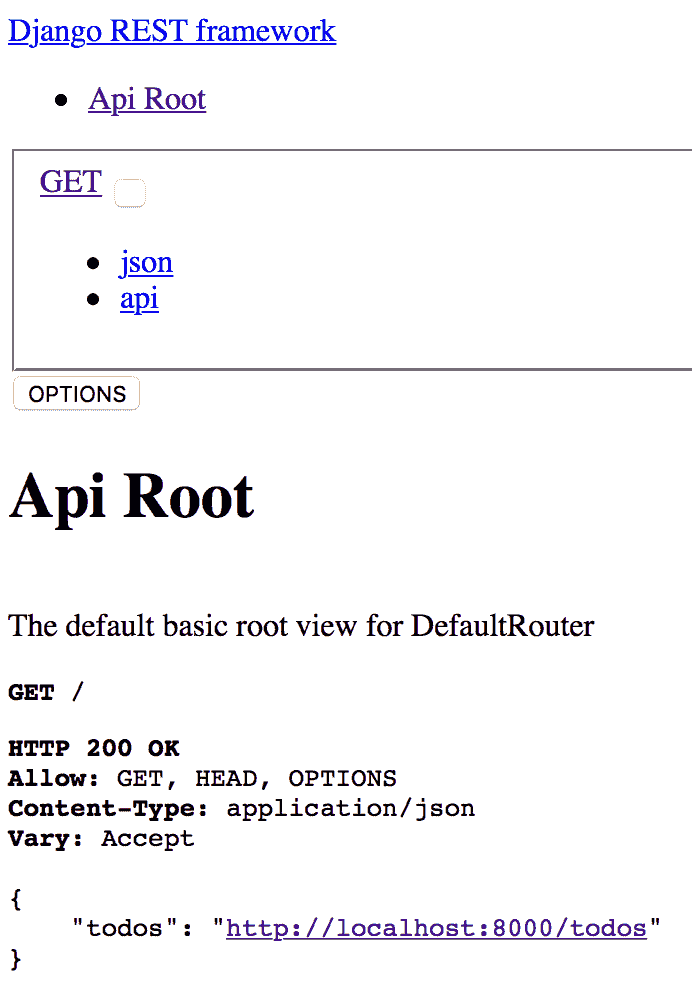
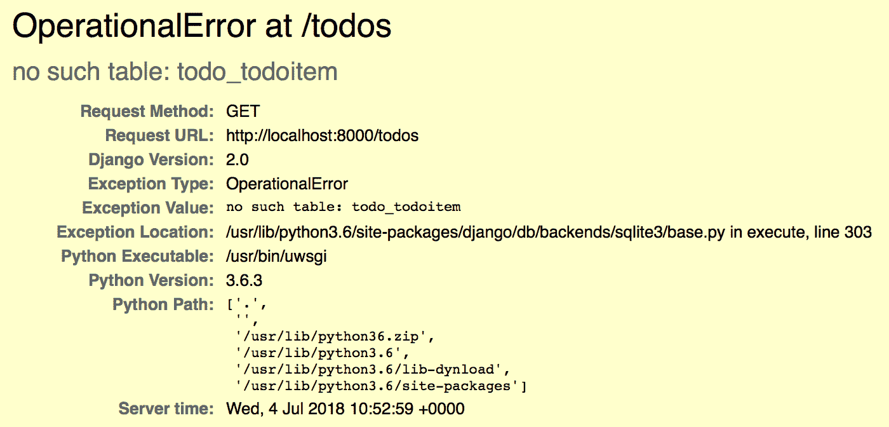

# 二、使用 Docker 构建应用

在前一章中，您已经了解了示例应用，并且能够在本地下载和运行该应用。目前，您的开发环境是为本地开发而设置的；但是，在将应用投入生产之前，您需要能够打包您的应用及其所有依赖项，确保目标生产环境具有正确的支持操作系统库和配置，选择适当的 web 服务器来托管您的应用，并有一种机制能够将所有这些打包在一起，最好是在一个需要最少外部配置的独立工件中。传统上，所有这些都很难可靠且一致地实现，但这正是 Docker 显著改变现状的地方。有了 Docker 和支持工具，您现在有能力以比以往任何时候都更快、更可靠、更一致和更便携的方式实现所有这些和更多。

在本章中，您将学习如何创建一个全面的工作流，允许您使用 Docker 以可移植、可重复和一致的方式测试、构建和发布应用。您将了解到的方法有许多好处，例如，您将能够通过运行一些简单、易于记忆的命令来执行所有任务，并且无需在本地开发或构建环境中安装任何特定于应用或特定于操作系统的依赖项。这使得移动到另一台机器或配置连续交付服务来执行相同的工作流变得非常容易——只要您拥有上一章中设置的基于 Docker 的核心环境，您就能够在任何机器上运行工作流，而不管您的应用或编程语言的具体情况如何。

您将学习如何使用 Dockerfile 为您的应用定义测试和运行时环境，配置对多阶段构建的支持，允许您在具有所有可用开发工具和库的映像中构建应用工件，然后将这些工件复制到 Dockerfile 的其他阶段。您将利用 Docker Compose 作为一种工具来协调具有多个容器的复杂 Docker 环境，这允许您测试集成场景，例如您的应用与数据库的交互，并模拟您将如何在生产环境中运行您的应用。将介绍的一个重要概念是构建发布映像的概念，这是一个可以交付生产的生产就绪映像，假设任何新的应用特性和功能都按预期工作。您将在本地 Docker 环境中构建和运行此发布映像，将应用连接到数据库，然后创建验收测试，从连接到应用的外部客户端的角度验证应用是否按预期工作。

最后，您将使用 GNU Make 将您所学的全部知识整合在一起，以自动化您的工作流程。一旦完成，您将能够通过简单地运行`make test`来运行单元测试和构建应用工件，然后构建您的发布映像，启动一个类似于生产的环境，并通过运行`make release`来运行验收测试。这将使测试和发布新的应用变更变得非常简单，因为它们是使用可移植和一致的工作流开发的，该工作流可以在本地开发环境和支持 Docker 和 Docker Compose 的任何连续交付环境中轻松运行。

将涵盖以下主题:

*   使用 Docker 测试和构建应用
*   创建多阶段构建
*   创建一个测试阶段来构建和测试应用工件
*   创建发布阶段来构建和测试发布映像
*   使用 Docker 编写测试和构建应用
*   创建验收测试
*   自动化工作流程

# 技术要求

下面列出了完成本章的技术要求:

*   按照第 1 章中的说明安装必备软件
*   根据第 1 章中的说明创建的 GitHub 帐户

以下 GitHub URL 包含本章使用的代码示例:[https://GitHub . com/docker-in-AWS/docker-in-AWS/tree/master/CH2](https://github.com/docker-in-aws/docker-in-aws/tree/master/ch2)[。](https://github.com/docker-in-aws/docker-in-aws/tree/master/ch3)

查看以下视频，了解《行动守则》:
[http://bit.ly/2PJG2Zm](http://bit.ly/2PJG2Zm)

# 使用 Docker 测试和构建应用

在前一章中，您已经很好地理解了示例应用是什么，以及如何在本地开发环境中测试和运行该应用。现在，您已经准备好开始创建 Docker 工作流，该工作流将测试、构建应用并将应用打包到 Docker 映像中。

重要的是要理解，无论何时将应用打包到 Docker 映像中，最佳实践方法都是减少或消除最终打包的应用的所有开发和测试依赖关系。按照我自己的惯例，我将这个打包的应用——没有测试和开发依赖——称为*发布映像，*支持连续交付的范例，其中每个成功的构建都应该是一个发布候选，如果需要，可以发布到生产中。

为了实现创建发布映像的目标，一种行之有效的方法是将 Docker 构建过程分为两个阶段:

*   **测试阶段**:这个阶段拥有所有可用的测试和开发依赖项，可以将您的应用源编译和构建成应用工件，并运行单元和集成测试。
*   **发布阶段**:该阶段将测试阶段的测试和构建的应用工件复制到一个最小化的运行时环境中，该环境被适当地配置为在生产中运行应用。

Docker 使用一个称为多阶段构建的特性来支持这种方法，这是我们将在本书中采用的方法。现在，我们将把重点放在测试阶段，并在下一节进入发布阶段。

# 创建测试阶段

我们将从在`todobackend`存储库的根处创建`Dockerfile`开始，这意味着您的存储库结构应该如下所示:

```
todobackend> tree -L 2
.
├── Dockerfile
├── README.md
└── src
    ├── coverage.xml
    ├── db.sqlite3
    ├── manage.py
    ├── requirements.txt
    ├── requirements_test.txt
    ├── todo
    ├── todobackend
    └── unittests.xml

3 directories, 8 files
```

现在让我们在新创建的 Dockerfile 中定义几个指令:

```
# Test stage
FROM alpine AS test
LABEL application=todobackend
```

`FROM`指令是您在 Dockerfile 中定义的第一个指令，请注意，我们使用的是 Alpine Linux 发行版作为基础映像。Alpine Linux 是一个极简的发行版，它比更传统的 Linux 发行版(如 Ubuntu 和 CentOS)占用空间小得多，自从 Docker 采用 Alpine 作为 Docker 官方映像的首选发行版以来，它在容器领域变得非常受欢迎。

您可能没有遇到的一个关键字是`AS`关键字，它被附加到`FROM`指令中，该指令将 Dockerfile 配置为[多阶段构建](https://docs.docker.com/develop/develop-img/multistage-build/)，并将当前阶段命名为`test`。当您有一个多阶段构建时，您可以包括多个`FROM`指令，每个阶段定义为包括当前的`FROM`指令和后续指令，直到下一个`FROM`指令。

接下来，我们使用`LABEL`指令来附加一个名为`application`的标签，其值为`todobackend`，这对于能够识别支持 todobackend 应用的 Docker 映像非常有用。

# 安装系统和构建依赖项

我们现在需要安装各种系统并构建支持测试和构建应用的操作系统依赖项:

```
# Test stage
FROM alpine AS test
LABEL application=todobackend

# Install basic utilities
RUN apk add --no-cache bash git
# Install build dependencies RUN apk add --no-cache gcc python3-dev libffi-dev musl-dev linux-headers mariadb-dev
RUN pip3 install wheel
```

在前面的示例中，我们安装了以下依赖项:

*   **基本实用工具**:在 Alpine Linux 中，包管理器叫做`apk`，Docker 镜像中常用的模式是`apk add --no-cache`，安装引用的包，保证下载的包不被缓存。我们安装了`bash`，这对于故障排除很有用，以及`git`，这是必需的，因为我们稍后将使用 Git 元数据为 Docker 发行版映像生成应用版本标签。
*   **构建依赖关系**:这里我们安装构建应用所需的各种开发库。这包括用于编译任何 Python C 扩展及其支持的标准库的`gcc`、`python3-dev`、`libffi-dev`、`musl-dev`和`linux-headers`，以及在 todobackend 应用中构建 MySQL 客户端所需的`mariadb-dev`包。您还安装了一个名为`wheel`的 Python 包，它允许您构建 Python *轮子*，这是一种预编译和预构建的打包格式，我们将在稍后使用。

# 安装应用依赖项

下一步是安装应用依赖项，正如您在上一章中所学习的，这意味着安装在`src/requirements.txt`和`src/requirements_test.txt`文件中定义的包:

```
# Test stage
FROM alpine AS test
LABEL application=todobackend

# Install basic utilities
RUN apk add --no-cache bash git

# Install build dependencies
RUN apk add --no-cache gcc python3-dev libffi-dev musl-dev linux-headers mariadb-dev
RUN pip3 install wheel

# Copy requirements
COPY /src/requirements* /build/
WORKDIR /build

# Build and install requirements
RUN pip3 wheel -r requirements_test.txt --no-cache-dir --no-input
RUN pip3 install -r requirements_test.txt -f /build --no-index --no-cache-dir
```

首先使用`COPY`指令将`src/requirements.txt`和`src/requirements_test.txt`文件复制到`/build`容器中的一个文件夹中，然后通过`WORKDIR`指令将其指定为工作目录。请注意，`/src/requirements.txt`不是 Docker 客户端上的物理路径，而是 Docker *构建上下文中的路径，*是 Docker 客户端文件系统上的一个可配置位置，您可以在执行构建时指定该位置。为了确保 Docker 构建过程中所有相关的应用源代码文件都可用，通常的做法是将应用存储库的根设置为构建上下文，因此在上面的示例中`/src/requirements.txt`指的是 Docker 客户端上的`<path-to-repository>/src/requirements.txt`。

接下来，使用`pip3` wheel 命令将 Python wheels 构建到所有基础应用和测试依赖项的`/build`工作目录中，使用`--no-cache-dir`标志来避免映像膨胀，使用`--no-input`标志来禁用用户确认提示。最后，您使用`pip3 install`命令将先前构建的轮子安装到容器中，使用`--no-index`标志指示 pip 不要尝试从互联网下载任何包，而是按照`-f`标志的指定从`/build`文件夹安装所有包。

这种方法可能看起来有点奇怪，但是，它基于这样一个原则，即您应该只将应用依赖项作为可安装的包构建一次，然后根据需要安装构建的依赖项。稍后，我们将在发布映像中安装相同的依赖项，确保您的发布映像准确地反映应用测试和构建所依据的依赖项的确切集合。

# 复制应用源并运行测试

测试阶段的最后步骤是将应用源复制到容器中，并添加对运行测试的支持:

```
# Test stage
FROM alpine AS test
LABEL application=todobackend

# Install basic utilities
RUN apk add --no-cache bash git

# Install build dependencies
RUN apk add --no-cache gcc python3-dev libffi-dev musl-dev linux-headers mariadb-dev
RUN pip3 install wheel

# Copy requirements
COPY /src/requirements* /build/
WORKDIR /build

# Build and install requirements
RUN pip3 wheel -r requirements_test.txt --no-cache-dir --no-input
RUN pip3 install -r requirements_test.txt -f /build --no-index --no-cache-dir

# Copy source code COPY /src /app
WORKDIR /app # Test entrypoint CMD ["python3", "manage.py", "test", "--noinput", "--settings=todobackend.settings_test"]
```

在上例中，首先将整个`/src`文件夹复制到名为`/app`的文件夹中，然后将工作目录更改为`/app`。您可能想知道为什么我们在复制需求文件时没有复制所有的应用源。这里的答案是，我们正在实现缓存优化，因为您的需求文件需要构建应用依赖关系，通过在单独的早期层中构建它们，如果需求文件保持不变(它们往往会这样做)，Docker 可以利用最近构建的层的缓存版本，而不必在每次构建映像时都构建和安装应用依赖关系。

最后，我们添加`CMD`指令，该指令定义了在创建和执行基于该映像的容器时将执行的默认命令。请注意，我们指定了与上一章中相同的`python3 manage.py test`命令来本地运行我们的应用测试。

You might wonder why we didn't just run our tests in the image using the `RUN` directive. The answer here is that you may want to collect artifacts as part of the build process, such as test reports, which are much easier to copy from a container that you spawn from a Docker image, than during the actual image-build process.

在这一点上，我们已经定义了 Docker 构建过程的第一阶段，它将创建一个准备测试的独立环境，包括所需的操作系统依赖项、应用依赖项和应用源代码。要构建映像，您可以运行`docker build`命令，用名称`todobackend-test`标记映像:

```
> docker build --target test -t todobackend-test . Sending build context to Docker daemon 311.8kB
Step 1/12 : FROM alpine AS test
 ---> 3fd9065eaf02
Step 2/12 : LABEL application=todobackend
 ---> Using cache
 ---> afdd1dee07d7
Step 3/12 : RUN apk add --no-cache bash git
 ---> Using cache
 ---> d9cd912ffa68
Step 4/12 : RUN apk add --no-cache gcc python3-dev libffi-dev musl-dev linux-headers mariadb-dev
 ---> Using cache
 ---> 89113207b0b8
Step 5/12 : RUN pip3 install wheel
 ---> Using cache
 ---> a866d3b1f3e0
Step 6/12 : COPY /src/requirements* /build/
 ---> Using cache
 ---> efc869447227
Step 7/12 : WORKDIR /build
 ---> Using cache
 ---> 53ced29de259
Step 8/12 : RUN pip3 wheel -r requirements_test.txt --no-cache-dir --no-input
 ---> Using cache
 ---> ba6d114360b9
Step 9/12 : RUN pip3 install -r requirements_test.txt -f /build --no-index --no-cache-dir
 ---> Using cache
 ---> ba0ebdace940
Step 10/12 : COPY /src /app
 ---> Using cache
 ---> 9ae5c85bc7cb
Step 11/12 : WORKDIR /app
 ---> Using cache
 ---> aedd8073c9e6
Step 12/12 : CMD ["python3", "manage.py", "test", "--noinput", "--settings=todobackend.settings_test"]
 ---> Using cache
 ---> 3ed637e47056
Successfully built 3ed637e47056
Successfully tagged todobackend-test:latest
```

在前面的示例中，`--target`标志允许您在多阶段 Dockerfile 中定位特定阶段。虽然我们目前只有一个阶段，但是这个标志允许我们在 Dockerfile 中有多个阶段的情况下只构建测试阶段。按照惯例，`docker build`命令会在运行该命令的目录中查找一个`Dockerfile`文件，命令末尾的句点将当前目录(即本例中的应用存储库根目录)指定为构建映像时应该复制到 Docker Engine 的构建上下文。

在本地 Docker 引擎中构建映像并用映像名称`todobackend`标记后，您现在可以从该映像启动一个容器，默认情况下，该容器将运行`CMD`指令指定的`python3 manage.py test`命令:

```
todobackend>  docker run -it --rm todobackend-test
Creating test database for alias 'default'...

Ensure we can create a new todo item
- item has correct title
- item was created
- received 201 created status code
- received location header hyperlink

Ensure we can delete all todo items
- all items were deleted
- received 204 no content status code

Ensure we can delete a todo item
- received 204 no content status code
- the item was deleted

Ensure we can update an existing todo item using PATCH
- item was updated
- received 200 ok status code

Ensure we can update an existing todo item using PUT
- item was updated
- received 200 created status code
----------------------------------------------------------------------
XML: /app/unittests.xml
Name                              Stmts   Miss  Cover
-----------------------------------------------------
todo/__init__.py                      0      0   100%
todo/admin.py                         1      1     0%
todo/migrations/0001_initial.py       5      0   100%
todo/migrations/__init__.py           0      0   100%
todo/models.py                        6      6     0%
todo/serializers.py                   7      0   100%
todo/urls.py                          6      0   100%
todo/views.py                        17      0   100%
-----------------------------------------------------
TOTAL                                42      7    83%
----------------------------------------------------------------------
Ran 12 tests in 0.433s

OK

Destroying test database for alias 'default'...
```

`-it`标志指定用交互终端运行容器，`--rm`标志一旦退出将自动删除容器。请注意，所有测试都成功通过，因此我们知道映像中构建的应用处于良好状态，至少就已经为应用定义的当前测试而言是如此。

# 配置发布阶段

有了测试阶段，我们现在有了一个包含所有应用依赖项的映像，这些应用依赖项以一种无需编译或开发依赖项即可安装的格式打包，同时还有我们的应用源代码，我们可以轻松地验证它是否通过了所有测试。

我们需要配置的下一个阶段是发布阶段，它将测试阶段构建的应用源代码和各种应用依赖项复制到一个新的生产就绪的发布映像中。因为应用依赖项现在以预编译格式提供，所以发布映像不需要开发依赖项或源代码编译工具，从而允许我们创建一个更小、更精简、攻击面更小的发布映像。

# 安装系统依赖项

为了开始创建发布阶段，我们可以在 Dockerfile 的底部添加一个新的`FROM`指令，Docker 会将其视为新阶段的开始:

```
# Test stage
FROM alpine AS test
LABEL application=todobackend
.........
...# Test entrypointCMD ["python3", "manage.py", "test", "--noinput", "--settings=todobackend.settings_test"]

# Release stage
FROM alpine
LABEL application=todobackend

# Install operating system dependencies
RUN apk add --no-cache python3 mariadb-client bash
```

在前面的示例中，您可以看到发行版映像再次基于 Alpine Linux 映像，考虑到其占用空间非常小，这是发行版映像的绝佳选择。您可以看到，我们安装了较少的操作系统依赖项，包括:

*   `python3`:由于示例应用是 Python 应用，因此需要 Python 3 解释器和运行时
*   `mariadb-client`:包括与 MySQL 应用数据库通信所需的系统库
*   `bash`:对于故障排除和执行入口点脚本非常有用，我们将在后面的章节中讨论。

注意，不是安装`python3-dev`和`mariadb-dev`包，我们只需要安装这些包的非开发版本，因为我们在测试阶段编译并构建了所有应用依赖作为预编译轮。

# 创建应用用户

下一步是创建一个应用用户，我们的应用将作为该用户运行。默认情况下，Docker 容器以 root 用户身份运行，这对于测试和开发目的来说是很好的，但是在生产中，即使使用容器提供的隔离机制，以非 root 用户身份运行容器仍然被认为是最佳实践:

```
# Test stage
...
...
# Release stage
FROM alpine
LABEL application=todobackend

# Install operating system dependencies
RUN apk add --no-cache python3 mariadb-client bash

# Create app user
RUN addgroup -g 1000 app && \
 adduser -u 1000 -G app -D app
```

在上例中，我们首先创建一个名为`app`的组，组标识为`1000`，然后创建一个名为`app`的用户，用户标识为`1000`，属于`app`组。

# 复制和安装应用源代码和依赖项

最后一步是复制之前在测试阶段构建的应用源代码和依赖项，将依赖项安装到发布映像中，然后删除在此过程中使用的任何临时文件。我们还需要将工作目录设置为`/app`，并将容器配置为作为我们在上一节中创建的`app`用户运行:

```
# Test stage
...
...
# Release stage
FROM alpine
LABEL application=todobackend

# Install operating system dependencies
RUN apk add --no-cache python3 mariadb-client bash

# Create app user
RUN addgroup -g 1000 app && \
    adduser -u 1000 -G app -D app

# Copy and install application source and pre-built dependencies
COPY --from=test --chown=app:app /build /build
COPY --from=test --chown=app:app /app /app
RUN pip3 install -r /build/requirements.txt -f /build --no-index --no-cache-dir
RUN rm -rf /build

# Set working directory and application user
WORKDIR /app
USER app
```

您首先使用带有`--from`标志的`COPY`指令，它告诉 Docker 在`--from`标志中指定的阶段中查找要复制的文件。在这里，我们将测试阶段映像中的`/build`和`/app`文件夹复制到发布阶段中具有相同名称的文件夹中，并且还配置`--chown`标志以将这些复制的文件夹的所有权更改给应用用户。然后我们使用`pip3`命令只安装`requirements.txt`文件中指定的核心需求(运行应用不需要`requirements_test.txt`中指定的依赖项)，使用`--no-index`标志禁用 PIP 连接互联网下载包，而是使用`/build`文件夹，如`-f`标志所引用的，查找之前在测试阶段构建并复制到该文件夹的依赖项。我们还指定了`--no-cache-dir`标志，以避免在本地文件系统中不必要地缓存包，并在一切安装完成后删除`/build`文件夹。

最后，将工作目录设置为`/app`，并通过指定`USER`指令将容器配置为作为`app`用户运行。

# 构建和运行发布映像

现在我们已经完成了 Dockerfile 的发布阶段的配置，是时候构建我们新发布的映像并验证我们实际上可以成功运行我们的应用了。

为了构建映像，我们可以使用`docker build`命令，并且因为发布阶段是 Dockerfile 的最后一个阶段，所以您不需要像我们之前针对测试阶段所做的那样针对特定的阶段:

```
> docker build -t todobackend-release . Sending build context to Docker daemon 312.8kB
Step 1/22 : FROM alpine AS test
 ---> 3fd9065eaf02
...
...
Step 13/22 : FROM alpine
 ---> 3fd9065eaf02
Step 14/22 : LABEL application=todobackend
 ---> Using cache
 ---> afdd1dee07d7
Step 15/22 : RUN apk add --no-cache python3 mariadb-client bash
 ---> Using cache
 ---> dfe0b6487459
Step 16/22 : RUN addgroup -g 1000 app && adduser -u 1000 -G app -D app
 ---> Running in d75df9cadb1c
Removing intermediate container d75df9cadb1c
 ---> ac26efcbfea0
Step 17/22 : COPY --from=test --chown=app:app /build /build
 ---> 1f177a92e2c9
Step 18/22 : COPY --from=test --chown=app:app /app /app
 ---> ba8998a31f1d
Step 19/22 : RUN pip3 install -r /build/requirements.txt -f /build --no-index --no-cache-dir
 ---> Running in afc44357fae2
Looking in links: /build
Collecting Django==2.0 (from -r /build/requirements.txt (line 1))
Collecting django-cors-headers==2.1.0 (from -r /build/requirements.txt (line 2))
Collecting djangorestframework==3.7.3 (from -r /build/requirements.txt (line 3))
Collecting mysql-connector-python==8.0.11 (from -r /build/requirements.txt (line 4))
Collecting pytz==2017.3 (from -r /build/requirements.txt (line 5))
Collecting uwsgi (from -r /build/requirements.txt (line 6))
Collecting protobuf>=3.0.0 (from mysql-connector-python==8.0.11->-r /build/requirements.txt (line 4))
Requirement already satisfied: setuptools in /usr/lib/python3.6/site-packages (from protobuf>=3.0.0->mysql-connector-python==8.0.11->-r /build/requirements.txt (line 4)) (28.8.0)
Collecting six>=1.9 (from protobuf>=3.0.0->mysql-connector-python==8.0.11->-r /build/requirements.txt (line 4))
Installing collected packages: pytz, Django, django-cors-headers, djangorestframework, six, protobuf, mysql-connector-python, uwsgi
Successfully installed Django-2.0 django-cors-headers-2.1.0 djangorestframework-3.7.3 mysql-connector-python-8.0.11 protobuf-3.6.0 pytz-2017.3 six-1.11.0 uwsgi-2.0.17
Removing intermediate container afc44357fae2
 ---> ab2bcf89fe13
Step 20/22 : RUN rm -rf /build
 ---> Running in 8b8006ea8636
Removing intermediate container 8b8006ea8636
 ---> ae7f157d29d1
Step 21/22 : WORKDIR /app
Removing intermediate container fbd49835ca49
 ---> 55856af393f0
Step 22/22 : USER app
 ---> Running in d57b2cb9bb69
Removing intermediate container d57b2cb9bb69
 ---> 8170e923b09a
Successfully built 8170e923b09a
Successfully tagged todobackend-release:latest
```

此时，我们可以运行发布映像中的 Django 应用，但是您可能想知道它是如何工作的。当我们之前运行`python3 manage.py runserver`命令时，它启动了一个本地开发 web 服务器，这对于生产用户的情况是不推荐的，所以我们需要一个替代 web 服务器来运行我们的应用。

您可能已经在`requirements.txt`文件中注意到了一个名为`uwsgi`的包——这是一个非常流行的网络服务器，可以在生产中使用，并且，对于我们的用例来说，可以通过画中画方便地安装。这意味着`uwsgi`已经作为 web 服务器出现在我们的发布容器中，并且可以用来为示例应用提供服务:

```
> docker run -it --rm -p 8000:8000 todobackend-release uwsgi \
    --http=0.0.0.0:8000 --module=todobackend.wsgi --master *** Starting uWSGI 2.0.17 (64bit) on [Tue Jul 3 11:44:44 2018] ***
compiled with version: 6.4.0 on 02 July 2018 14:34:31
os: Linux-4.9.93-linuxkit-aufs #1 SMP Wed Jun 6 16:55:56 UTC 2018
nodename: 5be4dd1ddab0
machine: x86_64
clock source: unix
detected number of CPU cores: 1
current working directory: /app
detected binary path: /usr/bin/uwsgi
!!! no internal routing support, rebuild with pcre support !!!
your memory page size is 4096 bytes
detected max file descriptor number: 1048576
lock engine: pthread robust mutexes
thunder lock: disabled (you can enable it with --thunder-lock)
uWSGI http bound on 0.0.0.0:8000 fd 4
uwsgi socket 0 bound to TCP address 127.0.0.1:35765 (port auto-assigned) fd 3
Python version: 3.6.3 (default, Nov 21 2017, 14:55:19) [GCC 6.4.0]
*** Python threads support is disabled. You can enable it with --enable-threads ***
Python main interpreter initialized at 0x55e9f66ebc80
your server socket listen backlog is limited to 100 connections
your mercy for graceful operations on workers is 60 seconds
mapped 145840 bytes (142 KB) for 1 cores
*** Operational MODE: single process ***
WSGI app 0 (mountpoint='') ready in 0 seconds on interpreter 0x55e9f66ebc80 pid: 1 (default app)
*** uWSGI is running in multiple interpreter mode ***
spawned uWSGI master process (pid: 1)
spawned uWSGI worker 1 (pid: 7, cores: 1)
spawned uWSGI http 1 (pid: 8)
```

我们使用`-p`标志将容器上的端口`8000`映射到您主机上的端口`8000`，并执行`uwsgi`命令，传入在端口`8000`上运行应用的各种配置标志，并将`todobackend.wsgi`模块指定为`uwsgi`所服务的应用。

The Web Server Gateway Interface (WSGI) is a standard interface used by Python applications to interact with web servers. Every Django application includes a WSGI module for communicating with a web server, which can be accessed via `<application-name>.wsgi`.

此时，您可以浏览到`http://localhost:8000`，虽然应用确实返回了响应，但您会发现 web 服务器和应用缺少一堆静态内容:



这里的问题是，当您运行 Django 开发 web 服务器时，Django 会自动生成静态内容，但是，当您在生产环境中与外部 web 服务器一起运行应用时，您自己负责生成静态内容。我们将在本章后面学习如何做到这一点，但是现在，您可以通过使用`curl`来验证 API 的工作原理:

```
> curl -s localhost:8000/todos | jq
[
 {
 "url": "http://localhost:8000/todos/1",
 "title": "Walk the dog",
 "completed": false,
 "order": 1
 },
 {
 "url": "http://localhost:8000/todos/2",
 "title": "Wash the car",
 "completed": true,
 "order": 2
 }
]
```

这里需要注意的一点是，todobackend 数据与我们在第 1 章中加载回的数据相同，尽管我们从头开始构建了 Docker 映像。这里的问题是，在第 1 章中创建的 SQLite 数据库位于`src`文件夹中，在一个名为`db.sqlite3`的文件中。显然，我们不想在构建过程中将这个文件复制到我们的 Docker 映像中，实现这一点的一种方法是在存储库的根目录下创建一个`.dockerignore`文件:

```
# Ignore SQLite database files
**/***.sqlite3

# Ignore test output and private code coverage files
**/*.xml
**/.coverage

# Ignore compiled Python source files
**/*.pyc
**/pycache# Ignore macOS directory metadata files
**/.DS_Store

```

`.dockerignore`文件的工作方式与 Git 存储库中的`.gitignore`相似，用于从 Docker 构建上下文中排除文件。因为`db.sqlite3`文件位于子文件夹中，所以我们使用了`**`的通配符匹配模式(注意这与`.gitignore`行为不同，后者默认匹配)，这意味着我们递归地排除任何匹配通配符模式的文件。我们还排除了任何扩展名为`.xml`的测试输出文件、代码覆盖文件、`__pycache__`文件夹以及任何编译后的扩展名为`.pyc`的 Python 文件，这些文件旨在运行时动态生成。

如果您现在重建 Docker 映像并在端口`8000`上本地启动`uwsgi`网络服务器，当您浏览到应用(`http://localhost:8000`)时，您将获得不同的错误:



现在的问题是 todobackend 应用不存在数据库，因此应用失败，因为它找不到存储 Todo 项的表。为了解决这个问题，我们现在需要与外部数据库引擎集成，这意味着我们需要一个解决方案来本地处理多个容器。

# 使用 Docker Compose 测试和构建应用

在上一节中，您使用了 Docker 命令来执行以下任务:

*   构建测试映像
*   运行测试
*   构建发布映像
*   运行应用

每次我们运行 Docker 命令时，我们都必须提供相当多的配置，试图记住您需要运行的各种命令已经开始变得困难了。除此之外，我们还发现，要启动应用的发布映像，我们需要一个可操作的外部数据库。对于本地测试用例，在另一个容器中运行外部数据库是一个很好的方法，但是必须通过运行一系列具有大量不同输入参数的 Docker 命令来协调这一点，这变得很难管理。

**Docker Compose** 是一个工具，它允许您使用声明性方法来编排多容器环境，使得编排可能需要多个容器的复杂工作流变得更加容易。按照惯例，Docker Compose 会在当前目录中查找一个名为`docker-compose.yml`的文件，所以让我们在`todobackend`存储库的根目录下，在我们的`Dockerfile`旁边创建这个文件:

```
version: '2.4'

services:
  test:
    build:
      context: .
      dockerfile: Dockerfile
      target: test
  release:
    build:
      context: .
      dockerfile: Dockerfile
```

Docker Compose files are defined in a YAML format, which requires proper indentation to infer the correct relationships between parent, siblings and child objects or properties.  If you have not worked with YAML before, you can check out the [Ansible YAML Syntax guide](https://docs.ansible.com/ansible/latest/reference_appendices/YAMLSyntax.html), which provides a brief introduction to YAML formatting.  You can also use an online YAML linting tool  such as http://www.yamllint.com/ to check your YAML, or install YAML support in your favourite text editor.

我们首先指定`version`属性，它是强制的，并且引用了我们正在使用的撰写文件格式语法的版本。如果您将 Docker 用于本地开发和构建任务，我建议使用 Compose 文件格式的 2.x 版本，因为它包含一些有用的功能，例如依赖服务的健康检查，我们将很快了解如何使用。如果您使用 Docker Swarm 来运行您的容器，那么您应该使用 Compose 文件格式的 3.x 版本，因为该版本支持许多与管理和编排 Docker Swarm 相关的功能。

If you choose to use version 3.x, your applications will need to be more robust in terms of dealing with scenarios such as your database not being available at application startup (see [https://docs.docker.com/compose/startup-order/](https://docs.docker.com/compose/startup-order/)), which is a problem we will encounter later on in this chapter.  

我们接下来指定`services`属性，它定义了在我们的 Docker Compose 环境中运行的一个或多个服务。在前面的例子中，我们创建了两个对应于我们工作流的测试和发布阶段的服务，然后为每个服务添加一个单独的`build`属性，它定义了我们想要如何为每个服务构建 Docker 映像。请注意，`build`属性基于我们传递给`docker build`命令的各种标志，例如，当我们构建测试阶段映像时，我们将构建上下文设置为本地文件夹，使用本地 Dockerfile 作为映像的构建规范，并且仅针对构建映像的测试阶段。我们不是在每次运行 Docker 命令时都强制指定这些设置，而是声明性地定义构建过程所需的配置，这是一个重要的区别。

当然，我们需要运行一个命令来实际构建这些服务，您可以通过在`todobackend`存储库的根目录下运行`docker-compose build`命令来实现:

```
> docker-compose build test
Building test
Step 1/12 : FROM alpine AS test
 ---> 3fd9065eaf02
Step 2/12 : LABEL application=todobackend
 ---> Using cache
 ---> 23e0c2657711
...
...
Step 12/12 : CMD ["python3", "manage.py", "test", "--noinput", "--settings=todobackend.settings_test"]
 ---> Running in 1ac9bded79bf
Removing intermediate container 1ac9bded79bf
 ---> f42d0d774c23

Successfully built f42d0d774c23
Successfully tagged todobackend_test:latest
```

您可以看到运行`docker-compose build test`命令相当于我们运行的较早的`docker build`命令，但是，我们不需要将任何构建选项或配置传递给`docker-compose`命令，因为我们的所有特定设置都捕获在`docker-compose.yml`文件中。

如果您现在想要从新构建的映像运行测试，您可以执行`docker-compose run`命令:

```
> docker-compose run test
Creating network "todobackend_default" with the default driver
nosetests --verbosity=2 --nologcapture --with-coverage --cover-package=todo --with-spec --spec-color --with-xunit --xunit-file=./unittests.xml --cover-xml --cover-xml-file=./coverage.xml
Creating test database for alias 'default'...

Ensure we can create a new todo item
- item has correct title
- item was created
- received 201 created status code
- received location header hyperlink
...
...
...
...
Ran 12 tests in 0.316s

OK

Destroying test database for alias 'default'...
```

您还可以扩展 Docker Compose 文件，将端口映射和命令配置添加到服务中，如下例所示:

```
version: '2.4'

services:
  test:
    build:
      context: .
      dockerfile: Dockerfile
      target: test
  release:
    build:
      context: .
      dockerfile: Dockerfile
    ports:
 - 8000:8000
 command:
 - uwsgi
 - --http=0.0.0.0:8000
 - --module=todobackend.wsgi
 - --master
```

这里我们指定当发布服务运行时，它应该创建一个从主机上的端口`8000`到容器上的端口`8000`的静态端口映射，并将我们之前使用的`uwsgi`命令传递给发布容器。如果您现在使用`docker-compose up`命令运行发布阶段，请注意 Docker Compose 将自动为尚不存在的服务构建映像，然后启动服务:

```
> docker-compose up release
Building release
Step 1/22 : FROM alpine AS test
 ---> 3fd9065eaf02
Step 2/22 : LABEL application=todobackend
 ---> Using cache
 ---> 23e0c2657711
...
...

Successfully built 5b20207e3e9c
Successfully tagged todobackend_release:latest
WARNING: Image for service release was built because it did not already exist. To rebuild this image you must use `docker-compose build` or `docker-compose up --build`.
Creating todobackend_release_1 ... done
Attaching to todobackend_release_1
...
...
release_1 | *** uWSGI is running in multiple interpreter mode ***
release_1 | spawned uWSGI master process (pid: 1)
release_1 | spawned uWSGI worker 1 (pid: 6, cores: 1)
release_1 | spawned uWSGI http 1 (pid: 7)
```

You typically use the `docker-compose up` command for long-running services, and the `docker-compose run` command to run short-lived tasks. You also cannot override the command arguments passed to `docker-compose up`, whereas you can pass command overrides to the `docker-compose run` command.

# 使用 Docker 编写添加数据库服务

为了解决当前运行发布映像时出现的应用错误，我们需要运行应用可以连接到的数据库，并确保应用配置为使用该数据库。

我们可以使用 Docker Compose 通过添加一个名为`db`的新服务来实现这一点，该服务基于官方的 MySQL 服务器容器:

```
version: '2.4'

services:
  test:
    build:
      context: .
      dockerfile: Dockerfile
      target: test
  release:
    build:
      context: .
      dockerfile: Dockerfile
    ports:
      - 8000:8000
    command:
      - uwsgi
      - --http=0.0.0.0:8000
      - --module=todobackend.wsgi
      - --master
  db:
 image: mysql:5.7
 environment:
 MYSQL_DATABASE: todobackend
 MYSQL_USER: todo
 MYSQL_PASSWORD: password
 MYSQL_ROOT_PASSWORD: password
```

请注意，您可以使用`image`属性指定外部映像，环境设置使用名为 todobackend 的数据库、用户名、密码和根密码来配置 MySQL 容器。

现在，您可能想知道我们如何配置我们的应用来使用 MySQL 和新的`db`服务。todobackend 应用包括一个名为`src/todobackend/settings_release.py`的设置文件，该文件配置了对 MySQL 作为数据库后端的支持:

```
# Import base settings
from .settings import *
import os

# Disable debug
DEBUG = True

# Set secret key
SECRET_KEY = os.environ.get('SECRET_KEY', SECRET_KEY)

# Must be explicitly specified when Debug is disabled
ALLOWED_HOSTS = os.environ.get('ALLOWED_HOSTS', '*').split(',')

# Database settings
DATABASES = {
    'default': {
        'ENGINE': 'mysql.connector.django',
        'NAME': os.environ.get('MYSQL_DATABASE','todobackend'),
        'USER': os.environ.get('MYSQL_USER','todo'),
        'PASSWORD': os.environ.get('MYSQL_PASSWORD','password'),
        'HOST': os.environ.get('MYSQL_HOST','localhost'),
        'PORT': os.environ.get('MYSQL_PORT','3306'),
    },
    'OPTIONS': {
      'init_command': "SET sql_mode='STRICT_TRANS_TABLES'"
    }
}

STATIC_ROOT = os.environ.get('STATIC_ROOT', '/public/static')
MEDIA_ROOT = os.environ.get('MEDIA_ROOT', '/public/media')
```

`DATABASES`设置包括一个指定`mysql.connector.django`引擎的配置，该引擎支持 MySQL 覆盖默认的 SQLite 驱动程序，您可以看到数据库名称、用户名和密码可以通过`os.environ.get`调用从环境中获得。还要注意`STATIC_ROOT`设置——这是 Django 查找静态内容的地方，例如 HTML、CSS、JavaScript 和映像——默认情况下，如果没有定义这个环境变量，Django 将在`/public/static`中查找。正如我们之前看到的，目前我们的 web 应用缺少这些内容，所以请记住这个设置，以便我们稍后修复缺少内容的问题。

现在，您已经了解了如何配置 todobackend 应用来支持 MySQL 数据库，让我们修改 Docker Compose 文件以使用`db`服务:

```
version: '2.4'

services:
  test:
    build:
      context: .
      dockerfile: Dockerfile
      target: test
  release:
    build:
      context: .
      dockerfile: Dockerfile
    ports:
      - 8000:8000
 depends_on:
 db:
 condition: service_healthy
    environment:
 DJANGO_SETTINGS_MODULE: todobackend.settings_release
 MYSQL_HOST: db
 MYSQL_USER: todo
 MYSQL_PASSWORD: password
    command:
      - uwsgi
      - --http=0.0.0.0:8000
      - --module=todobackend.wsgi
      - --master
  db:
    image: mysql:5.7
 healthcheck:
 test: mysqlshow -u $$MYSQL_USER -p$$MYSQL_PASSWORD
      interval: 3s
      retries: 10
    environment:
      MYSQL_DATABASE: todobackend
      MYSQL_USER: todo
      MYSQL_PASSWORD: password
      MYSQL_ROOT_PASSWORD: password
```

我们首先在`release`服务上配置`environment`属性，该属性配置将被传递给容器的环境变量。请注意，对于 Django 应用，您可以配置`DJANGO_SETTINGS_MODULE`环境变量来指定应该使用哪些设置，这允许您使用添加了 MySQL 支持的`settings_release`配置。该配置还允许您使用环境变量来指定 MySQL 数据库设置，该设置必须与`db`服务的配置相匹配。

我们接下来为`release`服务配置`depends_on`属性，它描述了服务可能具有的任何依赖关系。因为应用在启动之前必须与数据库有工作连接，所以我们指定了一个条件`service_healthy`，这意味着在 Docker Compose 尝试启动`release`服务之前，`db`服务必须已经通过 Docker 运行状况检查。要在`db`服务上配置 Docker 运行状况检查，我们配置`healthcheck`属性，该属性将配置 Docker 运行由`db`服务容器内的`test`参数指定的命令来验证服务运行状况，并每 3 秒重试该命令 10 次，直到`db`服务运行状况良好。对于这个场景，我们使用`mysqlshow`命令，一旦 MySQL 进程接受连接，该命令将只返回一个成功的零退出代码。因为 Docker Compose 会将单个美元符号解释为它应该在 Docker Compose 文件中评估和替换的环境变量，所以我们用双美元符号来转义`test`命令中引用的环境变量，以确保该命令会真正执行`mysqlshow -u $MYSQL_USER -p$MYSQL_PASSWORD`。

此时，我们可以通过在运行`release`服务的终端中按下 *Ctrl* + *C* 并键入`docker-compose down -v`命令(该`-v`标志也将删除 Docker Compose 创建的任何卷)，然后执行`docker-compose up release`命令来测试当前环境的变化:

```
> docker-compose down -v
Removing todobackend_release_1 ... done
Removing todobackend_test_run_1 ... done
Removing network todobackend_default
> docker-compose up release Creating network "todobackend_default" with the default driver
Pulling db (mysql:5.7)...
5.7: Pulling from library/mysql
683abbb4ea60: Pull complete
0550d17aeefa: Pull complete
7e26605ddd77: Pull complete
9882737bd15f: Pull complete
999c06ab75f6: Pull complete
c71d695f9937: Pull complete
c38f847c1491: Pull complete
74f9c61f40bf: Pull complete
30b252a90a12: Pull complete
9f92ebb7da55: Pull complete
90303981d276: Pull complete
Digest: sha256:1203dfba2600f140b74e375a354b1b801fa1b32d6f80fdee5f155d1e9f38c841
Status: Downloaded newer image for mysql:5.7
Creating todobackend_db_1 ... done
Creating todobackend_release_1 ... done
Attaching to todobackend_release_1
release_1 | *** Starting uWSGI 2.0.17 (64bit) on [Thu Jul 5 07:45:38 2018] ***
release_1 | compiled with version: 6.4.0 on 04 July 2018 11:33:09
release_1 | os: Linux-4.9.93-linuxkit-aufs #1 SMP Wed Jun 6 16:55:56 UTC 2018
...
... *** uWSGI is running in multiple interpreter mode ***
release_1 | spawned uWSGI master process (pid: 1)
release_1 | spawned uWSGI worker 1 (pid: 7, cores: 1)
release_1 | spawned uWSGI http 1 (pid: 8)
```

在前面的示例中，请注意 Docker Compose 会自动提取通过`image`属性配置的 MySQL 5.7 映像，然后启动`db`服务。这将需要 15-30 秒，在此期间，Docker Compose 正在等待 Docker 返回`db`服务健康的报告。每 3 秒钟，Docker 运行健康检查中配置的`mysqlshow`命令，持续重复该操作，直到该命令返回一个成功的退出代码(即`0`的退出代码)，此时 Docker 会将容器标记为健康。只有在这一点上，Docker Compose 才会启动`release`服务，如果`db`服务完全运行，该服务应该会成功启动。

如果你再次浏览`http://localhost:8000/todos`，你会发现即使我们添加了一个`db`服务，并且配置了发布服务来使用这个数据库，你仍然会收到你在之前的截图中看到的`no such table`错误。

# 运行数据库迁移

我们仍然收到关于缺少表的错误，原因是我们没有运行数据库迁移来建立应用期望的数据库模式。回想一下，我们在本地使用`python3 manage.py migrate`命令来运行这些迁移，因此我们需要在 Docker 环境中执行同样的操作。

如果通过按下 *Ctrl* + *C* 并运行`docker-compose down -v`来再次破坏环境，一种方法是使用`docker-compose run`命令:

```
> docker-compose down -v ...
...
> docker-compose run release python3 manage.py migrate
Creating network "todobackend_default" with the default driver
Creating todobackend_db_1 ... done
Traceback (most recent call last):
  File "/usr/lib/python3.6/site-packages/mysql/connector/network.py", line 515, in open_connection
    self.sock.connect(sockaddr)
ConnectionRefusedError: [Errno 111] Connection refused
...
...
```

在前面的示例中，请注意，当您使用`docker-compose run`命令时，Docker Compose 不支持我们之前在运行`docker-compose up`时观察到的运行状况检查行为。这意味着您可以采取两种方法之一:

*   确保您先运行`docker-compose up release`，然后运行`docker-compose run python3 manage.py migrate` -这将使您的应用处于一种状态，在迁移完成之前，它会引发错误。
*   将迁移定义为独立的服务，称为`migrate`，依赖于`db`服务，调出`migrate`服务，该服务将执行迁移并退出，然后调出应用。

虽然您很快就会看到，选项 1 更简单，但选项 2 更健壮，因为它确保数据库在启动应用之前处于正确的状态。当我们必须在 AWS 中协调运行数据库迁移时，选项 2 也与我们将在本书后面采用的方法一致，因此我们现在将实现选项 2。

以下示例演示了我们需要进行的更改，以便将迁移作为单独的服务运行:

```
version: '2.4'

services:
  test:
    build:
      context: .
      dockerfile: Dockerfile
      target: test
  release:
    build:
      context: .
      dockerfile: Dockerfile
    environment:
      DJANGO_SETTINGS_MODULE: todobackend.settings_release
      MYSQL_HOST: db
      MYSQL_USER: todo
      MYSQL_PASSWORD: password
  app:
 extends:
 service: release
 depends_on:
 db:
 condition: service_healthy
 ports:
 - 8000:8000
 command:
 - uwsgi
 - --http=0.0.0.0:8000
 - --module=todobackend.wsgi
 - --master
  migrate:
 extends:
 service: release
 depends_on:
 db:
 condition: service_healthy
 command:
 - python3
 - manage.py
 - migrate
 - --no-input
  db:
    image: mysql:5.7
    healthcheck:
      test: mysqlshow -u $$MYSQL_USER -p$$MYSQL_PASSWORD
      interval: 3s
      retries: 10
    environment:
      MYSQL_DATABASE: todobackend
      MYSQL_USER: todo
      MYSQL_PASSWORD: password
      MYSQL_ROOT_PASSWORD: password
```

在前面的例子中，注意除了`migrate`服务，我们还增加了一个新的服务，叫做`app`。原因是我们希望从`release`服务(由`extends`参数定义)扩展迁移，这样它将继承发布映像和发布服务设置，但是，扩展另一个服务的一个限制是您不能扩展具有`depends_on`语句的服务。这要求我们将`release`服务更多地用作其他服务继承的基础配置，并将`depends_on`、`ports`和`command`参数从发布服务转移到新的`app`服务。

有了这种配置，我们可以拆除环境并建立新的环境，如下例所示:

```
> docker-compose down -v ...
...
> docker-compose up migrate
Creating network "todobackend_default" with the default driver
Building migrate
Step 1/24 : FROM alpine AS test
 ---> 3fd9065eaf02
...
...
Successfully built 5b20207e3e9c
Successfully tagged todobackend_migrate:latest
WARNING: Image for service migrate was built because it did not already exist. To rebuild this image you must use `docker-compose build` or `docker-compose up --build`.
Creating todobackend_db_1 ... done
Creating todobackend_migrate_1 ... done
Attaching to todobackend_migrate_1
migrate_1 | Operations to perform:
migrate_1 | Apply all migrations: admin, auth, contenttypes, sessions, todo
migrate_1 | Running migrations:
migrate_1 | Applying contenttypes.0001_initial... OK
migrate_1 | Applying auth.0001_initial... OK
migrate_1 | Applying admin.0001_initial... OK
migrate_1 | Applying admin.0002_logentry_remove_auto_add... OK
migrate_1 | Applying contenttypes.0002_remove_content_type_name... OK
migrate_1 | Applying auth.0002_alter_permission_name_max_length... OK
migrate_1 | Applying auth.0003_alter_user_email_max_length... OK
migrate_1 | Applying auth.0004_alter_user_username_opts... OK
migrate_1 | Applying auth.0005_alter_user_last_login_null... OK
migrate_1 | Applying auth.0006_require_contenttypes_0002... OK
migrate_1 | Applying auth.0007_alter_validators_add_error_messages... OK
migrate_1 | Applying auth.0008_alter_user_username_max_length... OK
migrate_1 | Applying auth.0009_alter_user_last_name_max_length... OK
migrate_1 | Applying sessions.0001_initial... OK
migrate_1 | Applying todo.0001_initial... OK
todobackend_migrate_1 exited with code 0
> docker-compose up app
Building app
Step 1/24 : FROM alpine AS test
 ---> 3fd9065eaf02
...
...
Successfully built 5b20207e3e9c
Successfully tagged todobackend_app:latest
WARNING: Image for service app was built because it did not already exist. To rebuild this image you must use `docker-compose build` or `docker-compose up --build`.
todobackend_db_1 is up-to-date
Creating todobackend_app_1 ... done
Attaching to todobackend_app_1
app_1 | *** Starting uWSGI 2.0.17 (64bit) on [Thu Jul 5 11:21:00 2018] ***
app_1 | compiled with version: 6.4.0 on 04 July 2018 11:33:09
app_1 | os: Linux-4.9.93-linuxkit-aufs #1 SMP Wed Jun 6 16:55:56 UTC 2018
...
...
```

在前面的示例中，请注意 Docker Compose 为每个服务构建新的映像，但是这些构建完成得非常快，因为它们与发布映像相同，因为每个服务都扩展了`release`服务。当您启动`migrate`服务等待`db`服务运行状况检查通过时，您将观察到 15-30 秒的延迟，然后运行迁移，创建 todobackend 应用期望的适当模式和表。启动`app`服务后，您应该能够与 todobackend API 交互，而不会收到任何错误:

```
> curl -s localhost:8000/todos | jq
[]
```

# 生成静态网页内容

如果浏览到`http://localhost:8000/todos`，虽然应用不再返回错误，但是网页的格式还是被破坏了。这里的问题是，Django 要求您运行一个名为`collectstatic`的单独的`manage.py`管理任务，该任务生成静态内容并将其放置在`STATIC_ROOT`设置定义的位置。我们应用的发布设置将文件位置定义为`/public/static`，因此我们需要在应用启动之前运行`collectstatic`任务。请注意，Django 提供来自`/static`网址路径的所有静态内容，例如`http://localhost:8000/static`。

有几种方法可以用来解决这个问题:

*   创建一个在启动时运行的入口点脚本，并在启动应用之前执行`collectstatic`任务。
*   创建一个外部卷并运行一个执行`collectstatic`任务的容器，在该卷中生成静态文件。然后，在装载外部卷的情况下启动应用，确保它可以访问静态内容。

这两种方法都是有效的，但是，为了介绍 Docker 卷的概念以及如何在 Docker Compose 中使用它们，我们将采用第二种方法。

要在 Docker Compose 中定义卷，可以使用顶层`volumes`参数，该参数允许您定义一个或多个命名卷:

```
version: '2.4'

volumes:
 public:
 driver: local

services:
  test:
    ...
    ...
  release:
    ...
    ...
  app:
    extends:
      service: release
    depends_on:
      db:
        condition: service_healthy
    volumes:
 - public:/public
    ports:
      - 8000:8000
    command:
      - uwsgi
      - --http=0.0.0.0:8000
      - --module=todobackend.wsgi
      - --master
 - --check-static=/public
  migrate:
    ...
    ...
  db:
    ...
    ...
```

在前面的示例中，您添加了一个名为`public`的卷，并将驱动程序指定为本地，这意味着它是一个标准的 Docker 卷。然后使用应用服务中的`volumes`参数将公共卷装载到容器中的`/public`路径，最后配置`uwsgi`来服务来自`/public`路径的静态内容请求，这避免了为服务静态内容而对 Python 解释器进行昂贵的应用调用。

在拆除您当前的 Docker Compose 环境后，生成静态内容所需的只是`docker-compose run`命令:

```
> docker-compose down -v ...
...
> docker-compose up migrate
...
...
> docker-compose run app python3 manage.py collectstatic --no-input
Starting todobackend_db_1 ... done
Copying '/usr/lib/python3.6/site-packages/django/contrib/admin/static/admin/js/prepopulate.js'
Traceback (most recent call last):
  File "manage.py", line 15, in <module>
    execute_from_command_line(sys.argv)
  File "/usr/lib/python3.6/site-packages/django/core/management/__init__.py", line 371, in execute_from_command_line
    utility.execute()
...
...
PermissionError: [Errno 13] Permission denied: '/public/static'
```

在前面的示例中，`collectstatic`任务失败，因为默认情况下，卷是作为根创建的，容器作为应用用户运行。为了解决这个问题，我们需要在`Dockerfile`预先创建`/public`文件夹，并使应用用户成为该文件夹的所有者:

```
# Test stage
...
...
# Release stage
FROM alpine
LABEL application=todobackend
...
...
# Copy and install application source and pre-built dependencies
COPY --from=test --chown=app:app /build /build
COPY --from=test --chown=app:app /app /app
RUN pip3 install -r /build/requirements.txt -f /build --no-index --no-cache-dir
RUN rm -rf /build

# Create public volume
RUN mkdir /public
RUN chown app:app /public
VOLUME /public

# Set working directory and application user
WORKDIR /app
USER app
```

请注意，上面显示的方法仅适用于使用 Docker 卷装载创建的卷，如果您没有在 Docker 引擎上指定主机路径，Docker Compose 将使用这种方法。如果指定主机路径，卷将被绑定装载，这将导致默认情况下卷具有根所有权，除非您在主机上预先创建了具有正确权限的路径。我们将在以后使用弹性容器服务时遇到这个问题，所以请记住这一点。

因为您修改了 Dockerfile，所以您需要告诉 Docker Compose 重建所有映像，这可以通过使用`docker-compose build`命令来完成:

```
> docker-compose down -v
...
...
> docker-compose build Building test
Step 1/13 : FROM alpine AS test
...
...
Building release
...
...
Building app
...
...
Building migrate
...
...
> docker-compose up migrate
...
...
> docker-compose run app python3 manage.py collectstatic --no-input
Copying '/usr/lib/python3.6/site-packages/django/contrib/admin/static/admin/js/prepopulate.js'
Copying '/usr/lib/python3.6/site-packages/django/contrib/admin/static/admin/js/SelectFilter2.js'
Copying '/usr/lib/python3.6/site-packages/django/contrib/admin/static/admin/js/change_form.js'
Copying '/usr/lib/python3.6/site-packages/django/contrib/admin/static/admin/js/inlines.min.js'
...
...
> docker-compose up app
```

如果现在浏览到`http://localhost:8000`，应该会显示正确的静态内容。

When you define a local volume in Docker Compose, the volume will be automatically be destroyed when you run the `docker-compose down -v` command. If you wish to persist storage independently of Docker Compose, you can define an external volume, which you are then responsible for creating and destroying.  See [https://docs.docker.com/compose/compose-file/compose-file-v2/#external](https://docs.docker.com/compose/compose-file/compose-file-v2/#external) for more details.

# 创建验收测试

既然应用已经正确配置，那么为发布阶段配置的最后一项任务就是定义验收测试，验证应用是否按预期工作。验收测试是为了确保您构建的发布映像在尽可能接近生产的环境中运行，并且在本地 Docker 环境的约束下运行。至少，如果您的应用是一个 web 应用或 API 服务，例如 todobackend 应用，您可能只是验证应用返回了一个有效的 HTTP 响应，或者您可能会运行一些关键功能，例如创建一个项目、更新一个项目和删除一个项目。

对于 todobackend 应用，我们将使用一个名为 BATS (Bash 自动化测试系统)的工具创建一些基本测试来演示这种方法。BATS 非常适合使用 bash 的系统管理员，它利用现成的工具来执行测试。

要开始使用 BATS，我们需要使用 BATS 语法在**到**存储库的`src`文件夹中创建一个名为`acceptance.bats`的测试脚本，您可以在[https://github.com/sstephenson/bats](https://github.com/sstephenson/bats)了解更多信息:

```
setup() {
  url=${APP_URL:-localhost:8000}
  item='{"title": "Wash the car", "order": 1}'
  location='Location: ([^[:space:]]*)'
  curl -X DELETE $url/todos
}

@test "todobackend root" {
  run curl -oI -s -w "%{http_code}" $APP_URL
  [ $status = 0 ]
  [ $output = 200 ]
}

@test "todo items returns empty list" {
  run jq '. | length' <(curl -s $url/todos)
  [ $output = 0 ]
}

@test "create todo item" {
  run curl -i -X POST -H "Content-Type: application/json" $url/todos -d "$item"
  [ $status = 0 ]
  [[ $output =~ "201 Created" ]] || false
  [[ $output =~ $location ]] || false
  [ $(curl ${BASH_REMATCH[1]} | jq '.title') = $(echo "$item" | jq '.title') ]
}

@test "delete todo item" {
  run curl -i -X POST -H "Content-Type: application/json" $url/todos -d "$item"
  [ $status = 0 ]
  [[ $output =~ $location ]] || false
  run curl -i -X DELETE ${BASH_REMATCH[1]}
  [ $status = 0 ]
  [[ $output =~ "204 No Content" ]] || false
  run jq '. | length' <(curl -s $APP_URL/todos)
  [ $output = 0 ]
}
```

BATS 文件包括一个`setup()`函数和多个测试用例，每个测试用例前面都有`@test`标记。`setup()`函数是一个特殊的函数，将在每个测试用例之前运行，对于定义公共变量和确保应用状态在每个测试之前是一致的非常有用。您可以看到，我们设置了一些变量，用于各种测试用例:

*   `url`:定义被测应用的 URL。这是由`APP_URL`环境变量定义的，如果没有定义`APP_URL`，则默认为`localhost:8000`。
*   `item`:定义一个 JSON 格式的测试待办事项，在测试过程中通过 Todos API 创建。
*   `location`:定义一个正则表达式，用于定位和捕获位置头的值，每当您创建 Todo 项时，都会在 HTTP 响应中返回该值。正则表达式的`([^[:space:]]*)`部分捕获零个或多个字符，直到遇到空白(由`[:space:]`指示符指定)。例如，如果位置头是`Location: http://localhost:8000/todos/53`，正则表达式将捕获`http://localhost:8000/todos/53`。
*   `curl`命令:最后的设置任务是删除数据库中的所有待办事项，可以通过向`/todos` URL 发送 delete 请求来完成。这确保了 todobackend 数据库在每次测试运行时都是干净的，从而降低了不同测试引入破坏其他测试的副作用的可能性。

BATS 文件接下来定义了几个测试用例:

*   `todobackend root`:这包括`run`功能，运行指定的命令，在一个名为 status 的变量中捕获命令的退出代码，在一个名为`output`的变量中输出命令。对于这个场景，测试运行`curl`命令的特殊配置，只捕获返回的 HTTP 状态码，然后通过调用`[ $status = 0 ]`验证`curl`命令成功完成，通过调用`[ $output = 200 ]`验证返回的 HTTP 状态码是 200 码。这些测试是常规 shell *测试表达式*，相当于许多编程语言中的规范`assert`语句。
*   `todo items returns empty list`:这个测试用例使用`jq`命令传递调用`/todos`路径的输出。请注意，因为您不能将管道与特殊的`run`函数结合使用，所以我使用了 bash 进程替换语法`<(...)`，以使`curl`命令的输出显示为由`jq`命令读取的文件。
*   `create todo item`:首先创建一个 todo 项，检查返回的退出代码是否为零，然后使用 *bash 条件表达式*(如`[[...]]`语法所示)来验证`curl`命令的输出在 HTTP 响应中包含`201 Created`，这是创建项时的标准响应。当使用 bash 条件表达式时，需要注意的是，如果条件表达式失败，BATS 将不会检测到错误，因此我们使用`|| false`特殊语法，该语法仅在条件表达式失败并返回非零响应`false`的情况下进行评估，如果测试表达式失败，将导致测试用例失败。条件表达式使用`=~`正则表达式运算符(该运算符在条件表达式中不可用，因此我们使用 bash 测试表达式)，第二个条件表达式计算设置函数中定义的`location`正则表达式。最后一个命令使用特殊的`BASH_REMATCH`变量，该变量包含最近一次条件表达式求值的结果，在这种情况下，它是位置头中匹配的网址。这允许我们在创建 Todo 项目时捕获返回的位置，并验证创建的项目是否与我们发布的项目匹配。
*   `delete todo item`:这将创建一个 Todo 项目，捕获为该项目返回的位置，删除该项目，然后通过验证删除后数据库中 Todo 项目的数量为零来验证该项目实际上已被删除。回想一下，setup 函数在每个测试用例之前运行，它会清除所有的 Todo 项，因此在这个测试用例的开始，Todo 项的计数总是为零，并且创建然后删除一个项的动作应该总是将计数返回到零。这个测试用例中使用的各种命令是基于`create todo item`测试用例中引入的概念，因此我不会详细描述每个命令。

现在我们已经定义了一套验收测试，现在是时候修改 Docker 环境，以便在应用成功启动后支持这些测试的执行。

我们首先需要将`curl`、`bats`和`jq`包添加到 todobackend 存储库根的`Dockerfile`中:

```
# Test stage
FROM alpine AS test
LABEL application=todobackend
...
...
# Release stage
FROM alpine
LABEL application=todobackend

# Install dependencies
RUN apk add --no-cache python3 mariadb-client bash curl bats jq
...
...
```

接下来，我们需要向`docker-compose.yml`文件中添加一个名为`acceptance`的新服务，它将等待`app`服务运行正常，然后运行验收测试:

```
version: '2.4'

volumes:
  public:
    driver: local

services:
  test:
    ...
    ...
  release:
    ...
    ...
  app:
    extends:
      service: release
    depends_on:
      db:
        condition: service_healthy
    volumes:
      - public:/public
 healthcheck:
 test: curl -fs localhost:8000
      interval: 3s
 retries: 10
    ports:
      - 8000:8000
    command:
      - uwsgi
      - --http=0.0.0.0:8000
      - --module=todobackend.wsgi
      - --master
      - --check-static=/public
  acceptance:
 extends:
 service: release
 depends_on:
 app:
 condition: service_healthy
 environment:
 APP_URL: http://app:8000
 command:
 - bats 
 - acceptance.bats
  migrate:
    ...
    ...
  db:
    ...
    ...
```

我们首先给`app`服务添加一个`healthcheck`属性，它使用`curl`实用程序来检查与本地网络服务器端点的连接。然后，我们定义验收服务，它是从`release`映像扩展而来的，并使用`APP_URL`环境变量进行配置，该变量配置了验收测试应该针对的正确网址，而`command`和`depends_on`属性用于在`app`服务正常运行时运行验收测试。

有了这个配置，您现在需要拆除当前环境，重建所有映像，并执行各种步骤来启动和运行应用，除了当您即将运行`docker-compose up app`命令时，您现在应该运行`docker-compose up acceptance`命令，因为这将在后台自动启动`app`服务:

```
> docker-compose down -v
...
...
> docker-compose build
...
...
> docker-compose up migrate
...
...
> docker-compose run app python3 manage.py collectstatic --no-input
...
...
> docker-compose up acceptance todobackend_db_1 is up-to-date
Creating todobackend_app_1 ... done
Creating todobackend_acceptance_1 ... done
Attaching to todobackend_acceptance_1
acceptance_1 | Processing secrets []...
acceptance_1 | 1..4
acceptance_1 | ok 1 todobackend root
acceptance_1 | ok 2 todo items returns empty list
acceptance_1 | ok 3 create todo item
acceptance_1 | ok 4 delete todo item
todobackend_acceptance_1 exited with code 0
```

如您所见，所有测试都成功通过，如每个测试的`ok`状态所示。

# 自动化工作流程

至此，您已经成功地配置了 Docker Compose 来构建、测试和创建示例应用的本地工作环境，并完成了 MySQL 数据库集成和验收测试。您现在可以用一些命令来支持这个环境，但是即使使用 Docker Compose 大大简化了您需要运行的命令，仍然很难记住使用哪些命令以及使用的顺序。理想情况下，我们想要一个命令来运行整个工作流，这就是像 GNU Make 这样的工具非常有用的地方。

Make 已经存在很长时间了，并且仍然被认为是许多 C 和 C++应用的首选构建工具。任务自动化是 Make 的一个关键特性，以简单的格式定义任务或目标的能力使得 Make 成为一个流行的自动化工具，尤其是在处理 Docker 容器时。

按照惯例，make 会在当前工作目录中查找一个名为 Makefile 的文件，您可以创建一个非常简单的 Makefile，如下所示:

```
hello:
    @ echo "Hello World"
    echo "How are you?"
```

在上例中，您使用两个 shell 命令创建了一个名为`hello`的*目标*，在本例中，您可以通过运行`make <target>`或`make hello`来执行这些命令。每个目标可以包括一个或多个命令，这些命令按照提供的顺序执行。

需要注意的一点是，make 希望在为给定目标定义各种命令时使用制表符(而不是空格)，因此如果您收到一个缺少分隔符的错误，如`Makefile:2: *** missing separator. Stop.`，请检查您是否使用了制表符来缩进每个命令。

```
> make hello
Hello World
echo "How are you?"
How are you?
```

在前面的示例中，您可以看到每个命令的输出都显示在屏幕上。请注意，第一个命令上的特殊`@`字符禁止在每个命令运行时回显。

Any decent modern text editor, such as Sublime Text or Visual Studio Code, should automatically take care of tabs for you in Makefiles.

将 Makefiles 用于任务自动化时，您应该在 Makefiles 中执行的一项重要内务操作是配置一个有点有趣的名为`.PHONY`的特殊目标，以及您将要执行的每个目标的名称:

```
.PHONY: hello

hello:
    @ echo "Hello World"
    echo "How are you?"
```

因为`make`实际上是一个编译源代码文件的构建工具，`.PHONY`目标告诉 make，如果它看到一个名为`hello`的文件，它仍然应该运行该目标。如果您没有指定`.PHONY`并且在本地目录中有一个名为`hello`的文件，make 将退出并声明`hello`文件已经建立。当您使用 make 来自动执行任务时，这显然没有多大意义，因此您应该始终使用`.PHONY`目标来避免任何奇怪的惊喜。

# 自动化测试阶段

现在已经介绍了 make，让我们修改 Makefile 来做一些实际有用的事情，并执行测试阶段执行的各种操作。回想一下，测试阶段包括将 Dockerfile 的第一阶段构建为一个服务，称为`test`，然后运行`test`服务，默认情况下，该服务将运行`python3 manage.py test`命令，执行应用单元测试:

```
.PHONY: test

test:
    docker-compose build --pull release
    docker-compose build
    docker-compose run test
```

请注意，我们不是在 Docker Compose 文件中构建`test`服务，而是实际构建发布服务并指定`--pull`标志，这确保 Docker 将始终检查在`FROM`指令中引用的 Docker 映像是否有任何更新的版本。我们以这种方式构建`release`服务，因为我们只想构建整个`Dockerfile`一次，而不是在每个执行阶段重建`Dockerfile`。

这防止了一种不太可能但仍然可能的情况，即如果在发布阶段重建，您可能会获取一个更新的基础映像，这可能会导致与您在测试阶段测试的环境不同的运行时环境。我们还在之后立即运行 docker-compose build 命令，这确保了在我们运行测试之前所有的服务都已经构建好了。因为我们在前面的命令中构建了整个`Dockerfile`，这将确保其他服务的任何缓存映像都被更新为最新的映像构建。

# 自动化发布阶段

完成测试阶段后，我们接下来运行发布阶段，这需要我们执行以下操作:

*   运行数据库迁移
*   收集静态文件
*   启动应用
*   运行验收测试

下面演示如何在 Makefile 中创建一个名为`release`的目标:

```
.PHONY: test release

test:
    docker-compose build --pull release
    docker-compose build
    docker-compose run test

release:
 docker-compose up --abort-on-container-exit migrate
 docker-compose run app python3 manage.py collectstatic --no-input
 docker-compose up --abort-on-container-exit acceptance
```

请注意，我们执行每个所需的命令时都有一个微小的变化，即在每个`docker-compose up`命令中添加`--abort-on-container-exit`命令。默认情况下，`docker-compose up`命令不会返回非零退出代码，如果该命令启动的任何容器失败。此标志允许您覆盖此标志，并指定如果由`docker-compose up`命令启动的任何服务失败，则 Docker Compose 应退出并出现错误。如果希望 make 命令在出现错误时失败，设置此标志非常重要。

# 优化工作流程

我们还可以对工作流进行一些小的改进，以确保我们有一个健壮、一致和可移植的机制来测试和构建我们的应用。

# 清理 Docker 环境

在本章中，我们一直在通过运行`docker-compose down`命令来清理我们的环境，该命令会停止并销毁与 todobackend 和 Docker Compose 环境相关联的任何容器。

构建 Docker 映像时，您需要注意的另一个内务处理方面是孤立或悬空映像的概念，这些映像已经被更新的构建所取代。您可以通过运行`docker images`命令来了解这一点，我已经用粗体显示了哪些映像:

```
> docker images REPOSITORY            TAG        IMAGE ID        CREATED            SIZEtodobackend_app       latest     ca3e62e168f2    13 minutes ago     137MBtodobackend_migrate   latest     ca3e62e168f2    13 minutes ago     137MB
todobackend_release   latest     ca3e62e168f2    13 minutes ago     137MB
<none>                <none>     03cc5d44bd7d    14 minutes ago     253MB
<none>                <none>     e88666a35577    22 minutes ago     137MB
<none>                <none>     8909f9001297    23 minutes ago     253MB
<none>                <none>     3d6f9a5c9322    2 hours ago        137MB todobackend_test      latest     60b3a71946cc    2 hours ago        253MB
<none>                <none>     53d19a2de60d    9 hours ago        136MB
<none>                <none>     54f0fb70b9d0    15 hours ago       135MB alpine                latest     11cd0b38bc3c    23 hours ago       4.41MB
```

请注意，每个突出显示的映像都没有存储库和标签，因此它们被称为孤立或悬空。这些悬空的映像没有任何用处，并且会占用资源和存储空间，因此您最好定期清理这些映像，以确保 Docker 环境的性能。回到我们的 Dockerfile 中，我们在每个阶段都添加了`LABEL`指令，这允许容易地识别与我们的 todobackend 应用相关的映像。

我们可以利用这些标签来定位为 todobackend 应用构建的悬空映像，因此让我们在 Makefile 中添加一个名为`clean`的新目标，这将关闭 Docker Compose 环境并移除悬空映像:

```
.PHONY: test release clean

test:
    docker-compose build --pull release
    docker-compose build
    docker-compose run test

release:
    docker-compose up --abort-on-container-exit migrate
    docker-compose run app python3 manage.py collectstatic --no-input
    docker-compose up --abort-on-container-exit acceptance

clean:
 docker-compose down -v
 docker images -q -f dangling=true -f label=application=todobackend | xargs -I ARGS docker rmi -f --no-prune ARGS
```

我们使用`-q`标志仅打印出映像标识，然后使用`-f`标志添加过滤器，指定仅显示带有`application=todobackend`标签的悬空映像。然后，我们将该命令的输出传输到`xargs`命令，该命令捕获`ARGS`参数中的过滤映像列表，并将`ARGS`传递到`docker rmi -f --no-prune`命令，按照带有`--no-prune`标志的`-f`标志的规定强制移除映像，以确保包括当前标记映像中的图层的任何未标记映像不会被移除。我们在这里使用`xargs`是因为它智能地处理映像列表——例如，如果没有要删除的映像，那么`xargs`会无声地退出而不会出错。

以下演示了运行`make clean`命令的输出:

```
> make test
...
...
> make release
...
...
> make clean
docker-compose down -v
Stopping todobackend_app_1 ... done
Stopping todobackend_db_1 ... done
Removing todobackend_app_run_2 ... done
Removing todobackend_app_1 ... done
Removing todobackend_app_run_1 ... done
Removing todobackend_migrate_1 ... done
Removing todobackend_db_1 ... done
Removing todobackend_test_run_1 ... done
Removing network todobackend_default
Removing volume todobackend_public
docker images -q -f dangling=true -f label=application=todobackend | xargs -I ARGS docker rmi -f --no-prune ARGS
Deleted: sha256:03cc5d44bd7dec8d535c083dd5a8e4c177f113bc49f6a97d09f7a1deb64b7728
Deleted: sha256:6448ea330f415f773fc4cd5fe35862678ac0e35a1bf24f3780393eb73637f765
Deleted: sha256:baefcaca3929d6fc419eab06237abfb6d9ba9a1ba8d5623040ea4f49b2cc22d4
Deleted: sha256:b1dca5a87173bfa6a2c0c339cdeea6287e4207f34869a2da080dcef28cabcf6f
...
...
```

运行`make clean`命令时，您可能会注意到一点，停止 todobackend 应用服务需要一些时间，实际上，停止大约需要 10 秒钟。这是因为 Docker 在停止容器时首先向容器发送一个 SIGTERM 信号，该信号向容器发出它即将被终止的信号。默认情况下，如果容器在 10 秒内没有退出，Docker 会发送一个 SIGKILL 信号，强制终止容器。

这里的问题是，在我们的应用容器中运行的`uwsgi`进程默认情况下会忽略 SIGTERM 信号，因此我们需要在 Docker Compose 文件中添加`--die-on-term`标志，该标志配置`uwsgi`在收到 SIGTERM 信号时关闭，确保它能够优雅而及时地关闭:

```
version: '2.4'

volumes:
  public:
    driver: local

services:
  test:
    ...
    ...
  release:
    ...
    ...
  app:
    extends:
      service: release
    depends_on:
      db:
        condition: service_healthy
    volumes:
      - public:/public
    healthcheck:
      test: curl -fs localhost:8000
      interval: 3s
      retries: 10
    ports:
      - 8000:8000
    command:
      - uwsgi
      - --http=0.0.0.0:8000
      - --module=todobackend.wsgi
      - --master
      - --check-static=/public
 - --die-on-term
 - --processes=4
 - --threads=2
  acceptance:
    ...
    ...
  migrate:
    ...
    ...
  db:
    ...
    ...
```

在前面的例子中，我还添加了`--processes`和`--threads`标志，它们支持并发处理。您可以在[上阅读这些和更多配置选项。](https://uwsgi-docs.readthedocs.io/en/latest/WSGIquickstart.html#adding-concurrency-and-monitoring)

# 使用动态端口映射

目前，发布阶段工作流使用静态端口映射运行应用，其中应用服务容器上的端口 8000 映射到 Docker Engine 上的端口`8000`。虽然这在本地运行时通常可以正常工作(除非您有其他一些使用端口 8000 的应用)，但在远程连续交付构建服务上运行发布阶段工作流时，这可能会导致问题，因为该服务可能为许多不同的应用运行多个构建。

更好的方法是使用动态端口映射，将`app`服务容器端口映射到 Docker Engine 上当前未使用的动态端口。该端口是从所谓的*短暂端口范围*中选取的，这是一个为应用动态使用而保留的端口范围。

要配置动态端口映射，您需要更改`app`服务的`docker-compose.yml`文件中的端口映射:

```
version: '2.4'

volumes:
  public:
    driver: local

services:
  test:
    ...
    ...
  release:
    ...
    ...
  app:
    extends:
      service: release
    depends_on:
      db:
        condition: service_healthy
    volumes:
      - public:/public
    healthcheck:
      test: curl -fs localhost:8000
      interval: 3s
      retries: 10
    ports:
 - 8000
    command:
      - uwsgi
      - --http=0.0.0.0:8000
      - --module=todobackend.wsgi
      - --master
      - --check-static=/public
      - --die-on-term
      - --processes=4
      - --threads=2
  acceptance:
    ...
    ...
  migrate:
    ...
    ...
  db:
    ...
    ...
```

在前面的示例中，我们简单地将端口映射从`8000:8000`的静态映射更改为`8000`，从而实现了动态端口映射。有了这种配置，一个问题是您事先不知道要分配什么端口，但是，您可以使用`docker-compose port <service> <container-port>`命令来确定给定容器端口上给定服务的当前动态端口映射:

```
> docker-compose port app 8000
0.0.0.0:32768
```

当然，我们可以将它合并到我们的自动化工作流中，而不是每次都手动键入这个命令:

```
.PHONY: test release clean

test:
    docker-compose build --pull release
    docker-compose build
    docker-compose run test

release:
    docker-compose up --exit-code-from migrate migrate
    docker-compose run app python3 manage.py collectstatic --no-input
    docker-compose up --exit-code-from acceptance acceptance
 @ echo App running at http://$$(docker-compose port app 8000 | sed s/0.0.0.0/localhost/g) clean:
    docker-compose down -v
    docker images -q -f dangling=true -f label=application=todobackend | xargs -I ARGS docker rmi -f --no-prune ARGS
```

在前面的例子中，我们使用命令替换来获取当前的端口映射，并将输出传递到一个`sed`表达式，该表达式将`0.0.0.0`替换为`localhost`。请注意，因为 GNU Make 将美元符号解释为 Make 变量引用，所以如果您想要由将要执行的 shell 命令计算单个美元符号，则需要对美元符号(`$$`)进行双转义。

有了这些，现在`make release`命令的输出将完成以下内容:

```
> make release
...
...
docker-compose run app bats acceptance.bats
Starting todobackend_db_1 ... done
1..4
ok 1 todobackend root
ok 2 todo items returns empty list
ok 3 create todo item
ok 4 delete todo item
App running at http://localhost:32771
```

# 添加版本目标

对应用进行版本控制是至关重要的，尤其是在构建 Docker 映像并且想要区分各种映像时。稍后，当我们发布 Docker 映像时，我们将需要在每个发布的映像上包含一个版本标签，版本控制的一个简单约定是在您的应用存储库中使用当前提交的 Git 提交哈希。

下面演示了如何在 Make 变量中捕获并显示当前版本:

```
.PHONY: test release clean version

export APP_VERSION ?= $(shell git rev-parse --short HEAD)

version:
 @ echo '{"Version": "$(APP_VERSION)"}'

test:
    docker-compose build --pull release
    docker-compose build
    docker-compose run test

release:
    docker-compose up --abort-on-container-exit migrate
    docker-compose run app python3 manage.py collectstatic --no-input
    docker-compose up --abort-on-container-exit acceptance
    @ echo App running at http://$$(docker-compose port app 8000 | sed s/0.0.0.0/localhost/g)clean:
    docker-compose down -v
    docker images -q -f dangling=true -f label=application=todobackend | xargs -I ARGS docker rmi -f --no-prune ARGS
```

我们首先声明一个名为`APP_VERSION`的变量，并在这个变量前面加上`export`关键字，这意味着该变量在环境中对于每个目标都是可用的。然后，我们使用名为`shell`的 Make 函数来执行`git rev-parse --short HEAD`命令，该命令返回当前提交的七个字符的短散列。最后，我们添加了一个名为`version`的新目标，它只是将版本以 JSON 格式打印到终端，这在本书后面我们自动化应用的连续交付时会很有用。注意`make`使用美元符号引用变量，也执行 Make 函数，具体可以在[https://www . GNU . org/software/Make/manual/html _ node/functions . html](https://www.gnu.org/software/make/manual/html_node/Functions.html)阅读。

If you just run the `make` command without specifying a target, make will execute the first target in the Makefile. This means, for our scenario, just running `make` will output the current version.

下面演示运行`make version`命令:

```
> make version
{"Version": "5cd83c0"}
```

# 测试端到端工作流

此时，我们本地 Docker 工作流的所有部分都已就绪，现在是审查工作流并验证一切正常的好时机。

核心工作流现在包括以下任务:

*   运行测试阶段–`make test`
*   运行发布阶段–`make release`
*   清理–`make clean`

我会让你来测试，但我鼓励你适应工作流程，并确保一切顺利完成。运行`make release`后，验证您可以导航到应用，应用正确显示 HTML 内容，并且您可以执行创建、读取、更新和删除操作。

一旦您感到满意，一切都如预期的那样运行，请确保您已经将您的更改提交并推送到您在前一章中分叉的 GitHub 存储库中。

# 摘要

在本章中，您实现了一个 Docker 工作流，该工作流测试、构建应用并将应用打包到一个 Docker 映像中，该映像可以发布并部署到生产环境中。您学习了如何使用 Docker 多阶段构建分两个阶段构建您的应用——测试阶段使用一个开发环境，该环境配有开发库和源代码编译工具，允许您在预编译包中构建和测试应用及其依赖项，而发布阶段则采用这些构建的包，并将它们安装到一个生产就绪的操作环境中，没有开发库和其他工具，从而显著减少应用的攻击面。

您学习了如何使用 Docker Compose 来帮助简化在测试和发布阶段需要执行的各种命令和操作，创建了一个带有多个服务的`docker-compose.yml`文件，每个服务都以声明性的、易于理解的格式定义。您学习了如何复制启动和运行应用所需的大量部署任务，例如运行数据库迁移、收集静态文件，以及在尝试运行应用之前确保应用数据库健康。能够在本地环境中执行这些任务，可以让您对这些任务在实际生产环境中的工作方式有信心和了解，并在您的任何应用或配置更改在本地中断这些过程时向您发出预警。在正确的状态下启动应用并连接到应用数据库后，您学习了如何从外部客户端的角度运行验收测试，这让您对自己的映像是否按预期工作充满信心，并在这些验收测试失败时发出预警，作为应用持续开发的一部分。

最后，您学习了如何使用 GNU Make 将所有这些结合在一个完全自动化的工作流中，它为您提供了简单的高级命令，您可以使用这些命令来执行工作流。您现在可以通过简单地运行`make test`来执行测试阶段，通过运行`make release`来运行发布阶段，并使用`make clean`来清理您的环境。这使得运行工作流变得非常容易，在本书的后面，将简化连续交付构建系统的配置，我们将使用这些系统来自动测试、构建和发布您的 Docker 应用。

在接下来的章节中，您将学习如何实际发布您在本章中创建的 Docker 发行版映像，但在此之前，您需要建立一个 AWS 帐户，配置对您帐户的访问，并安装支持与 AWS 交互的工具，这将是下一章的重点。

# 问题

1.  对/错:使用`FROM`和`TO`指令定义多阶段 Dockerfile。
2.  真/假:`docker`命令`--rm`标志在容器退出后自动删除容器。

3.  对/错:当您运行您的工作流时，您应该只构建一次应用工件。
4.  真/假:在没有附加标志的情况下运行`docker-compose run`命令时，如果启动的目标服务因错误而失败，docker-compose 将以非零代码退出。
5.  真/假:在没有附加标志的情况下运行`docker-compose up`命令时，如果启动的服务之一出现错误，docker-compose 将以非零代码退出。
6.  对/错:如果你想使用 Docker Swarm，你应该配置一个 Docker Compose 版本的 3.x。
7.  您可以根据 Docker 文件中服务的依赖关系来配置 service _ healthy 条件。然后使用`docker-compose run`命令运行服务；依赖关系被启动，但是 Docker Compose 没有等到依赖关系健康时立即启动服务，从而导致失败。你如何解决这个问题？
8.  您可以在 Docker Compose 中创建一个端口映射为`8000:8000`的服务。当您尝试启动此服务时，会出现一个错误，指示端口正在使用中。你如何解决这个问题并确保它不再发生？
9.  创建 Makefile 后，在尝试运行目标时，您会收到一个关于缺少分隔符的错误。这个错误最可能的原因是什么？
10.  哪个 GNU Make 函数允许你捕捉一个 shell 命令的输出？
11.  您在 Makefile 中定义了一个名为 test 的目标，但是当您运行`make test`时，您会得到一个回应，说没有什么可做的。你如何解决这个问题？
12.  要使用`docker-compose push`命令，必须在 Docker Compose 服务定义中配置哪些属性？

# 进一步阅读

有关本章所涵盖主题的更多信息，您可以查看以下链接:

*   Docker 命令行参考:[https://docs.docker.com/engine/reference/commandline/cli/](https://docs.docker.com/engine/reference/commandline/cli/)
*   多阶段构建:[https://docs . docker . com/develop/develop-img/多阶段构建/](https://docs.docker.com/develop/develop-img/multistage-build/)
*   Docker 合成版本 2 规范:https://docs . docker . com/compose/compose-file/compose-file-v2/
*   Docker 复合命令行参考:https://docs . docker . com/compose/reference/
*   Docker 复合启动命令:https://docs . docker . com/compose/startup-order/T2]
*   适用于 Python 应用的 uWSGI quick start:[http://uWSGI-docs . readed docs . io/en/latest/wsgiquick start . html](http://uwsgi-docs.readthedocs.io/en/latest/WSGIquickstart.html)
*   bash-自动化测试系统:[https://github.com/sstephenson/bats](https://github.com/sstephenson/bats)
*   GNU 制作虚假目标:[https://www . GNU . org/software/Make/manual/html _ node/false-Targets . html](https://www.gnu.org/software/make/manual/html_node/Phony-Targets.html)
*   GNU Make Functions:[https://www . GNU . org/software/Make/manual/html _ node/Functions . html # Functions](https://www.gnu.org/software/make/manual/html_node/Functions.html#Functions)