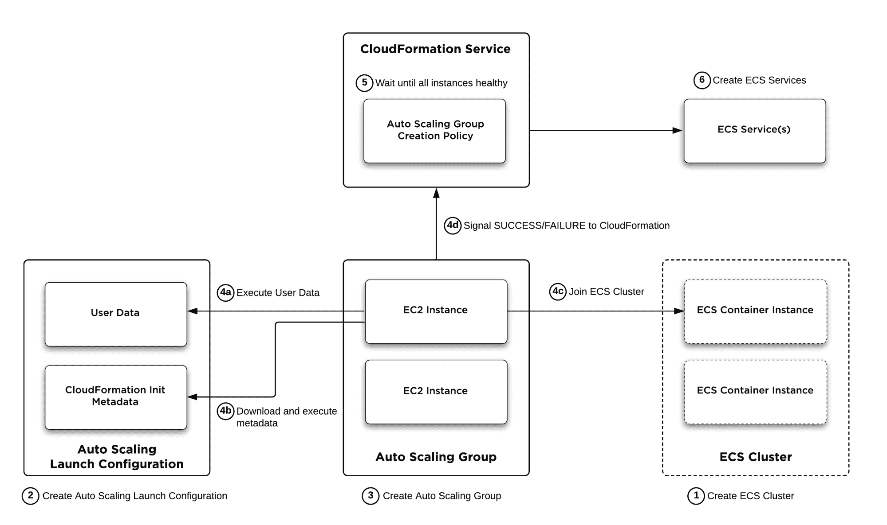
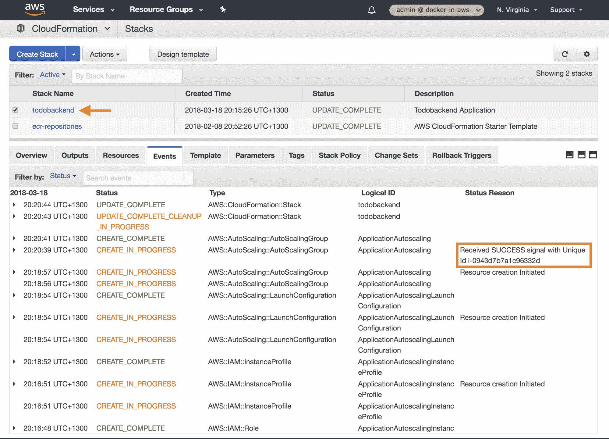
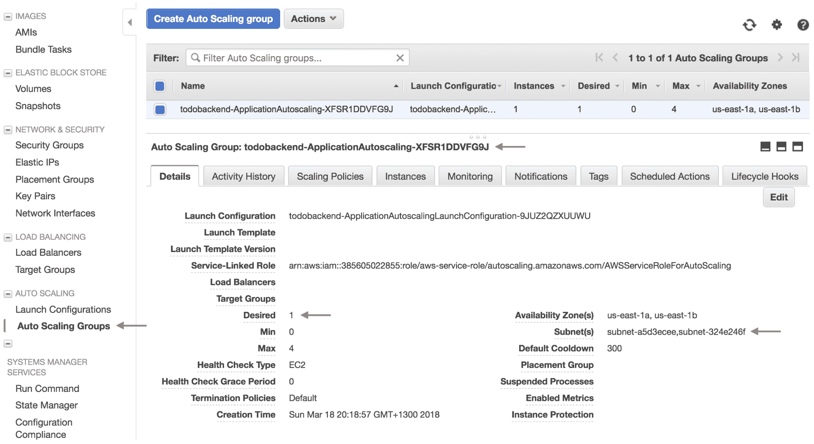

# 创建电子商务集群

在上一章中，您学习了如何构建定制的 ECS 容器实例 Amazon Machine Image (AMI)，它介绍了您在生产实际用例中通常需要的功能，包括定制的存储配置、CloudWatch 日志支持以及与 CloudFormation 的集成。

在本章中，您将使用您的自定义机器映像，基于您的自定义机器映像构建一个由 ECS 容器实例组成的 ECS 集群。在本章中，我们将重点关注使用基础架构即代码的方法，并使用 CloudFormation 定义您的 ECS 集群和支持资源，而不是采用前几章的方法，即讨论配置 AWS 资源的各种方法。

部署 ECS 集群的标准模型基于 EC2 自动扩展组，该组由一组 EC2 实例组成，这些实例可以根据各种因素自动扩展或缩小。在 ECS 集群的使用案例中，EC2 自动扩展组是 ECS 容器实例的集合，它们共同形成了一个 ECS 集群，您可以将 ECS 服务和 ECS 任务部署到该集群中。您将学习如何定义 EC2 自动扩展组，定义控制 EC2 实例部署方式的启动配置，以及配置 CloudFormation Init 元数据，该元数据允许您在实例创建时触发自定义初始化逻辑，并等待每个实例发出初始化成功的信号。最后，您将配置支持资源，如 IAM 实例配置文件和 EC2 安全组，继续创建您的云信息堆栈，并部署您的 ECS 集群和底层 EC2 自动扩展组。

将涵盖以下主题:

*   部署概述
*   定义 ECS 集群
*   配置 EC2 自动缩放组
*   定义 EC2 自动扩展启动配置
*   配置云信息初始化元数据
*   配置自动缩放组创建策略
*   配置 EC2 实例配置文件
*   配置 EC2 安全组
*   部署和测试 ECS 集群

# 技术要求

下面列出了完成本章的技术要求:

*   对 AWS 帐户的管理员访问权限
*   根据第 3 章中的说明配置本地 AWS 配置文件
*   AWS CLI

此 GitHub URL 包含本章使用的代码示例:[https://GitHub . com/docker-in-AWS/docker-in-AWS/tree/master/ch7](https://github.com/docker-in-aws/docker-in-aws/tree/master/ch7)[。](https://github.com/docker-in-aws/docker-in-aws/tree/master/ch4)

查看以下视频，了解《行动守则》:
[http://bit.ly/2PaK6AM](http://bit.ly/2PaK6AM)

# 部署概述

接下来两章的目标是建立使用 AWS 部署 Docker 应用程序的支持基础架构和资源。本着将您的基础架构定义为代码的最佳实践的精神，您将定义一个云信息模板，该模板将包括支持您在 ECS 中运行的 Docker 应用程序所需的所有 AWS 资源。随着每一章的深入，您将在这个模板的基础上进行构建，缓慢但肯定地添加越来越多的资源，直到您有一个完整的解决方案来使用 ECS 在 AWS 中部署您的 Docker 应用程序。

考虑到这一点，本章的重点是学习如何使用 CloudFormation 构建 ECS 集群，正如您在前面几章中已经学习到的，ECS 集群是运行 ECS 服务或 ECS 任务时可以作为目标的 ECS 容器实例的集合。

ECS 集群本身是非常简单的构造——它们只是定义了一个 ECS 容器实例的集合和一个集群名称。然而，如何形成这些集群要复杂得多，需要多种支持资源，包括以下资源:

*   **EC2 自动缩放组**:定义具有相同配置的 EC2 实例的集合。
*   **EC2 自动缩放启动配置**:定义自动缩放组中新创建实例的启动配置。启动配置通常包括用户数据脚本，这些脚本在第一次运行时由实例执行，并可用于触发您在上一章的自定义机器映像中安装的 cloud information 帮助器脚本，以与 CloudFormation Init 元数据进行交互。
*   **cloud information Init Metadata**:定义自动扩展组中的每个 EC2 实例在初始创建时应该运行的初始化逻辑，例如运行配置命令、启用服务以及创建用户和组。CloudFormation Init Metadata 比用户数据提供的资源调配功能更强大，最重要的是，它为每个实例提供了一种机制，向 cloud information 发出信号，表明该实例已经成功地自行进行了资源调配。
*   **云信息创建策略**:定义标准，确定云信息何时可以认为 EC2 自动扩展组已成功创建，并继续在云信息堆栈中提供其他依赖项。这是基于云信息从每个 EC2 实例接收可配置数量的成功消息，该实例是 EC2 自动缩放组的一部分。

There are other ways you can form ECS clusters, but for large-scale production environments, you generally want to use EC2 Auto Scaling groups and use CloudFormation and associated CloudFormation Init Metadata and Creation Policies to deploy your clusters in a robust, repeatable, infrastructure-as-code manner.

这些组件如何协同工作最好用一个图表来描述，接下来是对这些组件如何形成 ECS 集群的简短描述，之后您将继续学习如何执行创建您自己的 ECS 集群所需的每个相关配置任务。

下图说明了创建 ECS 集群的部署过程，假设您使用的是 EC2 自动扩展组和云信息:



ECS cluster deployment overview using EC2 Auto Scaling Groups and CloudFormation

在上图中，一般方法如下:

1.  作为云信息部署的一部分，云信息确定它准备好开始创建已配置的 ECS 集群资源。ECS 群集资源将在云信息初始化元数据中引用，该元数据是 EC2 自动扩展启动配置资源的一部分，因此必须首先创建该 ECS 群集资源。请注意，此时，ECS 集群为空，正在等待 ECS 容器实例加入集群。
2.  CloudFormation 创建了一个 EC2 自动扩展启动配置资源，该资源定义了 EC2 自动扩展组中的每个 EC2 实例将在实例创建时应用的启动配置。启动配置包括一个用户数据脚本，该脚本调用安装在 EC2 实例上的 CloudFormation 帮助器脚本，该脚本又下载 CloudFormation Init 元数据，该元数据定义了每个实例在创建时应该执行的一系列命令和其他初始化操作。

3.  创建启动配置资源后，云信息会创建 EC2 自动缩放组资源。自动缩放组的创建将触发 EC2 自动缩放服务，以在组中创建可配置的所需数量的 EC2 实例。
4.  当每个 EC2 实例启动时，它会应用启动配置，执行用户数据脚本，并下载和执行 CloudFormation Init Metadata 中定义的配置任务。这将包括各种初始化任务，在我们的特定用例中，实例将执行您在上一章中添加到您的自定义机器映像中的第一个运行脚本，以加入已配置的 ECS 集群，确保 CloudWatch logs 代理配置为登录到正确的 CloudWatch 日志组，启动并启用 Docker 和 ECS 代理，最后，验证 EC2 实例是否成功加入 ECS 集群，并向 CloudFormation 发出信号，表明 EC2 实例已成功启动。
5.  自动缩放组配置有创建策略，这是 cloud information 的一个特殊功能，它使 cloud information 等待，直到从自动缩放组中的 EC2 实例接收到可配置数量的成功信号。通常，您会将其配置为 EC2 自动扩展组中的所有实例，确保所有实例都已成功加入 ECS 群集，并且在继续执行其他资源调配任务之前状态良好。
6.  有了从 EC2 自动扩展组派生的正确数量的 ECS 容器实例的 ECS 集群，云信息可以安全地调配需要健康的 ECS 集群的其他 ECS 资源。例如，您可能会创建一个 ECS 服务，它会将您的容器应用程序部署到您的 ECS 集群中。

# 定义 ECS 集群

现在，您已经大致了解了 ECS 群集资源调配过程，让我们逐步了解启动和运行 ECS 群集所需的配置。

正如部署概述中所指出的，您将使用云信息以基础架构即代码的方式创建您的资源，并且因为您正处于这一旅程的起点，所以您首先需要创建这个云信息模板，我假设您正在名为`stack.yml`的文件中定义该模板，该文件位于您之前在第 5 章- *中创建的 **todobackend-aws** 存储库的根目录下，使用 ECR* 发布 Docker 映像，如下例所示:

```
> touch stack.yml
> tree .
.
├── ecr.yml
└── stack.yml

0 directories, 2 files
```

Establishing the todobackend-aws repository

现在，您可以在`stack.yml`文件中建立一个框架云信息模板，并创建您的 ECS 集群资源:

```
AWSTemplateFormatVersion: "2010-09-09"

Description: Todobackend Application

Resources:
  ApplicationCluster:
    Type: AWS::ECS::Cluster
    Properties:
      ClusterName: todobackend-cluster
```

Defining a CloudFormation template

正如您在前面的示例中看到的，定义一个 ECS 集群非常简单，其中`AWS::ECS::Cluster`资源类型只有一个名为`ClusterName`的可选属性。确保您的环境配置了正确的 AWS 配置文件后，您现在可以使用`aws cloudformation deploy`命令创建和部署堆栈，并使用`aws ecs list-clusters`命令验证您的集群是否已创建，如下例所示:

```
> export AWS_PROFILE=docker-in-aws
> aws cloudformation deploy --template-file stack.yml --stack-name todobackend
Enter MFA code for arn:aws:iam::385605022855:mfa/justin.menga:

Waiting for changeset to be created..
Waiting for stack create/update to complete
Successfully created/updated stack - todobackend
> aws ecs list-clusters
{
    "clusterArns": [
        "arn:aws:ecs:us-east-1:385605022855:cluster/todobackend-cluster"
    ]
}
```

Creating an ECS cluster using CloudFormation

# 配置 EC2 自动缩放组

您已经建立了一个 ECS 集群，但是如果没有 ECS 容器实例来提供容器运行时和计算资源，集群就没有多大用处。此时，您可以创建单独的 ECS 容器实例并将它们加入集群，但是，如果您需要运行需要支持几十个或几百个容器的生产工作负载，根据集群的当前资源需求动态地向集群添加和删除 ECS 容器实例，这种方法是不可行的。

为您的 ECS 容器实例提供这种行为的 AWS 机制是 EC2 自动扩展组，它作为 EC2 实例的集合运行，这些实例共享被称为启动配置的相同配置。EC2 自动扩展服务是由 AWS 提供的托管服务，负责管理 EC2 自动扩展组和组成该组的 EC2 实例的生命周期。这种机制提供了云的核心原则之一——弹性——并允许您动态地增加或减少服务于您的应用程序的 EC2 实例的数量。

在 ECS 的上下文中，您通常可以认为 ECS 集群与 EC2 自动扩展组有密切的关联，而 ECS 容器实例是 EC2 自动扩展组中的 EC2 实例，其中 ECS 代理和 Docker 引擎是在每个 EC2 实例上运行的应用程序。严格来说，这并不正确，因为您可以拥有跨多个 EC2 自动扩展组的 ECS 集群，但是通常在您的 ECS 集群和 EC2 自动扩展组之间构建一对一的关系，将 ECS 容器实例直接链接到 EC2 实例。

现在，您已经了解了 EC2 自动缩放组的基本背景以及它们与 ECS 的具体关系，概述创建 EC2 自动缩放组时需要与之交互的各种配置结构非常重要:

*   **自动缩放组**:定义 EC2 实例的集合，并为该组指定最小、最大和理想容量。
*   **启动配置**:启动配置定义了在实例创建时应用于每个 EC2 实例的通用配置。
*   **CloudFormation Init 元数据**:定义可以在实例创建时应用的自定义初始化逻辑。
*   **IAM 实例配置文件和角色**:授予每个 EC2 实例与 ECS 服务交互并发布到 CloudWatch 日志的权限。
*   **EC2 安全组**:定义入口和出口网络策略规则。至少，这些规则必须允许运行在每个 EC2 实例上的 ECS 代理与 ECS 应用编程接口通信。

Note that I am presenting a top-down approach of defining the requirements for an EC2 Auto Scaling group, which is possible when using a declarative infrastructure-as-code approach, such as CloudFormation. When it comes to the actual implementation of these resources, they will be applied in a bottom-up manner, where dependencies, such as security groups and IAM roles, are first created, after which the launch configuration, and finally the Auto Scaling group will be created. This, of course, is handled by CloudFormation, so we can focus on the desired state configuration and let CloudFormation deal with the specific imperative execution requirements of meeting the desired state.

# 创建 EC2 自动缩放组

创建 EC2 自动缩放组时，您需要定义的第一个资源是 EC2 自动缩放组本身，用云信息术语来说，它被定义为`AWS::AutoScaling::AutoScalingGroup`类型的资源:

```
AWSTemplateFormatVersion: "2010-09-09"

Description: Todobackend Application

Parameters:
  ApplicationDesiredCount:
 Type: Number
 Description: Desired EC2 instance count
  ApplicationSubnets:
 Type: List<AWS::EC2::Subnet::Id>
 Description: Target subnets for EC2 instances

Resources:
  ApplicationCluster:
    Type: AWS::ECS::Cluster
    Properties:
      ClusterName: todobackend-cluster
  ApplicationAutoscaling:
 Type: AWS::AutoScaling::AutoScalingGroup
 Properties:
 LaunchConfigurationName: !Ref ApplicationAutoscalingLaunchConfiguration
 MinSize: 0
 MaxSize: 4
 DesiredCapacity: !Ref ApplicationDesiredCount
 VPCZoneIdentifier: !Ref ApplicationSubnets
 Tags:
 - Key: Name
 Value: !Sub ${AWS::StackName}-ApplicationAutoscaling-instance
 PropagateAtLaunch: "true"
```

Defining an EC2 Auto Scaling group

前面示例中的配置是基本配置，满足定义 EC2 自动缩放组的最低要求，如下所示:

*   `LaunchConfigurationName`:应该应用于组中每个实例的启动配置的名称。在前面的例子中，我们使用了`Ref`内部函数的简写语法，并结合了一个名为`ApplicationAutoscalingLaunchConfiguration`的资源的名称，我们将很快定义这个资源。
*   `MinSize`、`MaxSize`和`DesiredCapacity`:自动缩放组中实例的绝对最小值、绝对最大值和所需数量。EC2 自动缩放组将始终尝试保持所需的实例数量，尽管它可能会根据您自己的标准在`MinSize`和`MaxSize`属性的范围内临时放大或缩小实例数量。在前面的示例中，您引用了一个名为`ApplicationDesiredCount`的参数来定义所需的实例数量，该参数能够缩小到零个实例或最多缩小到四个实例。
*   `VPCZoneIdentifier`:自动扩展组中的 EC2 实例应部署到的目标子网列表。在前面的示例中，您引用了一个名为`ApplicationSubnets`的输入参数，它被定义为`List<AWS::EC2::Subnet::Id>`类型的参数。这可以简单地以逗号分隔列表的形式提供，您将很快看到定义这样一个列表的示例。
*   `Tags`:定义一个或多个要附加到自动缩放组的标签。至少，定义`Name`标签是有用的，这样您可以清楚地识别您的 EC2 实例，并且在前面的示例中，您使用了`Fn::Sub`内部函数的简短形式来动态地注入由`AWS::StackName`伪参数定义的堆栈名称。`PropagateAtLaunch`标签将标签配置为在启动时附加到每个 EC2 实例，确保配置的名称对每个实例可见。

Refer to the AWS CloudFormation documentation ([https://docs.aws.amazon.com/AWSCloudFormation/latest/UserGuide/aws-properties-as-group.html](https://docs.aws.amazon.com/AWSCloudFormation/latest/UserGuide/aws-properties-as-group.html)) for more information on how to configure Auto Scaling group resources.

# 配置云信息输入参数

在前面的示例中，您向名为`ApplicationDesiredCount`和`ApplicationSubnets`的云信息模板添加了参数，您需要在部署模板时提供这些参数的值。

`ApplicationDesiredCount`参数只需要是 configure MinSize 和 MaxSize 属性之间的一个数字(即介于 0 和 4 之间)，但是，要确定帐户中子网 id 的值，可以使用`aws ec2 describe-subnets`命令，如下所示:

```
> aws ec2 describe-subnets --query "Subnets[].[SubnetId,AvailabilityZone]" --output table
-----------------------------------
| DescribeSubnets                 |
+------------------+--------------+
| subnet-a5d3ecee  | us-east-1a   |
| subnet-c2abdded  | us-east-1d   |
| subnet-aae11aa5  | us-east-1f   |
| subnet-fd3a43c2  | us-east-1e   |
| subnet-324e246f  | us-east-1b   |
| subnet-d281a2b6  | us-east-1c   |
+------------------+--------------+
```

Querying subnets using the AWS CLI

在前面的示例中，您使用 JMESPath 查询表达式为每个子网选择`SubnetId`和`AvailabilityZone`属性，并以表格格式显示输出。这里我们只是利用默认 VPC 中为您的帐户创建的默认子网，但是您可以使用您的帐户中可能定义的任何子网，这取决于您的网络拓扑的性质。

对于本例，我们将在`us-east-1a`和`us-east-1b`可用性区域使用两个子网，您的下一个问题可能是，我们如何将这些值传递给云信息堆栈？AWS 命令行界面目前仅提供了使用命令行标志和`aws cloudformation deploy`命令将输入参数作为键值对提供的能力，但是，当您有大量堆栈输入并想要保持它们时，这种方法很快变得乏味和笨拙。

我们将采用的一个非常简单的方法是在`todobackend-aws`存储库的根处定义一个名为`dev.cfg`的配置文件中的各种输入参数:

```
ApplicationDesiredCount=1
ApplicationSubnets=subnet-a5d3ecee,subnet-324e246f
```

Defining a configuration file for stack parameters in dev.cfg

配置文件的方法是将`<key>=<value>`格式的每个参数添加到新的行中，在本章的后面，您将看到我们如何将该文件与`aws cloudformation deploy`命令结合使用。在前面的示例中，请注意我们将`ApplicationSubnets`参数值配置为逗号分隔的列表，这是配置云信息参数时任何列表类型的标准格式。

Stack parameters are typically environment-specific, hence it makes sense to name your configuration files according to your environments. For example, if you had a development and production environment, you might call your configuration files `dev.cfg` and `prod.cfg`, respectively.

# 定义 EC2 自动缩放启动配置

虽然您已经定义了一个 EC2 自动缩放组资源，但是您还不能部署您的云信息模板，因为自动缩放组引用了一个名为`ApplicationAutoscalingLaunchConfiguration`的资源，该资源尚未定义。

EC2 自动扩展启动配置定义了启动时应用于每个实例的配置，并提供了一种通用方法来确保自动扩展组中的每个实例都是一致的。

以下示例演示了如何在云信息模板中配置自动扩展启动配置:

```
...
...
Parameters:
  ApplicationDesiredCount:
    Type: Number
    Description: Desired EC2 instance count
  ApplicationImageId:
 Type: String
 Description: ECS Amazon Machine Image (AMI) ID
  ApplicationSubnets:
    Type: List<AWS::EC2::Subnet::Id>
    Description: Target subnets for EC2 instances

Resources:
  ApplicationAutoscalingLaunchConfiguration:
    Type: AWS::AutoScaling::LaunchConfiguration
 Properties:
 ImageId: !Ref ApplicationImageId
 InstanceType: t2.micro
 KeyName: admin
 IamInstanceProfile: !Ref ApplicationAutoscalingInstanceProfile
 SecurityGroups:
 - !Ref ApplicationAutoscalingSecurityGroup
 UserData:
 Fn::Base64:
 Fn::Sub: |
 #!/bin/bash
 /opt/aws/bin/cfn-init -v --stack ${AWS::StackName} \
 --resource ApplicationAutoscalingLaunchConfiguration \
 --region ${AWS::Region}
 /opt/aws/bin/cfn-signal -e $? --stack ${AWS::StackName} \
 --resource ApplicationAutoscaling \
 --region ${AWS::Region}
  ApplicationCluster:
    Type: AWS::ECS::Cluster
    Properties:
      ClusterName: todobackend-cluster
  ApplicationAutoscaling:
    Type: AWS::AutoScaling::AutoScalingGroup
    Properties:
      LaunchConfigurationName: !Ref ApplicationAutoscalingLaunchConfiguration
      MinSize: 0
      MaxSize: 4
      DesiredCapacity: !Ref ApplicationDesiredCount
      VPCZoneIdentifier: !Ref ApplicationSubnets
      Tags:
        - Key: Name
          Value: !Sub ${AWS::StackName}-ApplicationAutoscaling-instance
          PropagateAtLaunch: "true"
```

Defining an EC2 Auto Scaling Launch Configuration

请注意，您指定了一个`AWS::AutoScaling::LaunchConfiguration`资源类型，并为您的启动配置配置了以下属性:

*   `ImageId`:EC2 实例将从其启动的映像的 AMI。对于我们的用例，您将使用您在上一章中创建的 AMI。此属性引用了一个名为`ApplicationImageId`的新参数，因此您需要将此参数与您的自定义机器映像的 AMI 标识一起添加到`dev.cfg`文件中。
*   `InstanceType`:EC2 实例的实例族和类型。
*   `KeyName`:允许 SSH 访问每个 EC2 实例的 EC2 密钥对。
*   `IamInstanceProfile`:要附加到 EC2 实例的 IAM 实例配置文件。正如您在前面几章中所学的，为了支持作为 ECS 容器实例的操作，IAM 实例配置文件必须授予 EC2 实例与 ECS 服务交互的权限。在前面的例子中，您引用了一个名为`ApplicationAutoscalingInstanceProfile`的资源，它将在本章后面创建。
*   `SecurityGroups`:要附加到每个实例的 EC2 安全组。这些定义了应用于网络流量的入口和出口安全规则，并且至少必须允许与 ECS 服务、CloudWatch 日志服务和其他相关 AWS 服务的通信。同样，您引用了一个名为`ApplicationAutoscalingSecurityGroup`的资源，它将在本章后面创建。
*   `UserData`:定义实例创建时运行的用户数据脚本。这必须作为 Base64 编码的字符串提供，您可以使用`Fn::Base64`内部函数让 CloudFormation 自动执行此转换。您定义了一个 bash 脚本，该脚本首先运行`cfn-init`命令，该命令将下载并执行与`ApplicationAutoscalingLaunchConfiguration`引用资源相关联的 CloudFormation Init 元数据，然后运行`cfn-signal`命令，向 CloudFormation 发出信号，表明`cfn-init`是否成功运行(注意，`cfn-signal`引用的是`AutoscalingGroup`资源，而不是`ApplicationAutoscalingLaunchConfiguration`资源)。

请注意使用`Fn::Sub`函数，后跟管道操作符(`|`)，这使您能够输入允许所有换行符的自由格式文本，并允许您使用`AWS::StackName`和`AWS::Region`伪参数引用正确的堆栈名称和 AWS 区域。

You may notice that the `set -e` flag is not set in the UserData bash script, and this is deliberate as we want the `cfn-signal` script to report the exit code of the `cfn-init` script to CloudFormation (as defined by `-e $?` option, where `$?` outputs the exit code of the last process). If you were to include `set -e`, the script would exit immediately if `cfn-init` returned an error, and `cfn-signal` would not be able to signal CloudFormation of the failure.

```
ApplicationDesiredCount=1 ApplicationImageId=ami-ec957491
ApplicationSubnets=subnet-a5d3ecee,subnet-324e246f
```

Adding the ApplicationImageId parameter to the dev.cfg file

# 配置云信息初始化元数据

到目前为止，您在我们的堆栈中执行的最复杂的配置是`UserData`属性，它被定义为自动缩放启动配置的一部分。

回想一下上一章，当您创建一个自定义机器映像时，您安装了`cfn-bootstrap`cloud information 帮助器脚本，其中包括上一个示例中引用的`cfn-init`和`cfn-signal`脚本。这些脚本旨在使用名为 CloudFormation Init 元数据的功能，我们现在将对其进行配置，如下例所示:

```
...
...
Resources:
  ...
  ...
  ApplicationAutoscalingLaunchConfiguration:
    Type: AWS::AutoScaling::LaunchConfiguration
    Metadata:
 AWS::CloudFormation::Init:
 config:
 commands:            05_public_volume:
 command: mkdir -p /data/public
 06_public_volume_permissions:
 command: chown -R 1000:1000 /data/public
 10_first_run:
 command: sh firstrun.sh
 cwd: /home/ec2-user
 env:
                ECS_CLUSTER: !Ref ApplicationCluster
 STACK_NAME: !Ref AWS::StackName
 AUTOSCALING_GROUP: ApplicationAutoscaling
 AWS_DEFAULT_REGION: !Ref AWS::Region
    Properties:
      ImageId: !Ref ApplicationImageId
      InstanceType: t2.micro
      KeyName: admin
      IamInstanceProfile: !Ref ApplicationAutoscalingInstanceProfile
      SecurityGroups:
        - !Ref ApplicationAutoscalingSecurityGroup
      UserData:
        Fn::Base64:
          Fn::Sub: |
            #!/bin/bash
            /opt/aws/bin/cfn-init -v --stack ${AWS::StackName} \
              --resource ApplicationAutoscalingLaunchConfiguration \
              --region ${AWS::Region}
            /opt/aws/bin/cfn-signal -e $? --stack ${AWS::StackName} \
              --resource ApplicationAutoscaling \
              --region ${AWS::Region}
  ...
  ...
```

Configuring CloudFormation Init Metadata

在前面的示例中，您可以看到 CloudFormation Init 元数据定义了一个配置集，该配置集包含一个`commands`指令，该指令定义了几个命令对象:

*   `05_public_volume` -在`/data`挂载下创建一个名为`public`的文件夹，该文件夹在我们的自定义 ECS AMI 中配置。我们需要此路径，因为我们的应用程序需要一个公共卷，静态文件将位于该卷中，并且我们的应用程序以非根用户身份运行。稍后，我们将创建一个引用此路径的 Docker 卷，请注意，由于 ECS 目前仅支持绑定装载，因此需要这种在底层 Docker 主机上预创建文件夹的方法(更多详细信息，请参见[https://github . com/AWS/Amazon-ECS-agent/issues/1123 # issuecomment-405063273](https://github.com/aws/amazon-ecs-agent/issues/1123#issuecomment-405063273))。
*   `06_public_volume_permissions` -这将在上一个命令中创建的`/data/public`文件夹的所有权更改为由 ID 为 1000 的用户和组拥有。这是 todobackend 应用程序运行时使用的同一用户标识/组标识，因此将允许应用程序读写`/data/public`文件夹。
*   `10_first_run` -在`/home/ec2-user`的工作目录中运行`sh firstrun.sh`命令，从上一章回忆，该命令引用您在自定义机器映像中包含的第一个运行脚本，以在实例创建时执行自定义初始化任务。这个第一次运行脚本包括对许多环境变量的引用，这些变量在`env`属性下的云信息初始化元数据中定义，并为第一次运行脚本提供适当的值。

为了进一步说明`10_first_run`脚本如何工作，以下代码片段配置了 ECS 容器实例，以加入由`ECS_CLUSTER`环境变量定义的 ECS 集群:

```
#!/usr/bin/env bash
set -e

# Configure ECS Agent
echo "ECS_CLUSTER=${ECS_CLUSTER}" > /etc/ecs/ecs.config
...
...
```

First run script snippet

类似地，`STACK_NAME`、`AUTOSCALING_GROUP`和`AWS_DEFAULT_REGION`变量都用于配置 CloudWatch 日志代理:

```
...
...
# Write AWS Logs region
sudo tee /etc/awslogs/awscli.conf << EOF > /dev/null
[plugins]
cwlogs = cwlogs
[default]
region = ${AWS_DEFAULT_REGION}
EOF

# Write AWS Logs config
sudo tee /etc/awslogs/awslogs.conf << EOF > /dev/null
[general]
state_file = /var/lib/awslogs/agent-state 

[/var/log/dmesg]
file = /var/log/dmesg
log_group_name = /${STACK_NAME}/ec2/${AUTOSCALING_GROUP}/var/log/dmesg
log_stream_name = {instance_id}
...
...
```

First run script snippet

# 配置自动缩放组创建策略

在上一节中，您配置了用户数据脚本和 CloudFormation Init 元数据，以便您的 ECS 容器实例可以执行适合给定目标环境的首次初始化和配置。尽管每个实例都将发出 cloud information 成功或 CloudFormation Init 过程失败的信号，但您需要显式配置 cloud information，以等待自动扩展组中的每个实例发出成功信号，如果您希望确保在 ECS 服务注册到 ECS 群集之前，或者如果它们由于某种原因失败，您不会尝试将 ECS 服务部署到您的 ECS 群集，这一点非常重要。

CloudFormation 包括一个称为创建策略的功能，允许您在创建 EC2 自动缩放组和 EC2 实例时指定可选的创建成功标准。当创建策略附加到 EC2 自动扩展组时，在继续创建云信息堆栈中的其他资源之前，云信息将等待自动扩展组中可配置数量的实例发出成功信号，这为我们提供了强大的功能来确保您的 ECS 自动扩展组和相应的 ECS 集群处于健康状态。回想一下上一章，您的自定义机器映像中的第一个运行脚本的最后一步是查询本地 ECS 代理元数据，以验证实例是否已加入已配置的 ECS 集群，因此，如果第一个运行脚本成功完成，并且 cfn-signal 向 CloudFormation 发送成功信号，我们就知道该实例已成功注册到 ECS 集群。

以下示例演示了在现有的 EC2 自动缩放组资源上配置创建策略:

```
Resources:
  ...
  ...
  ApplicationAutoscaling:
    Type: AWS::AutoScaling::AutoScalingGroup
    CreationPolicy:
 ResourceSignal:
 Count: !Ref ApplicationDesiredCount
 Timeout: PT15M
    Properties:
      LaunchConfigurationName: !Ref ApplicationAutoscalingLaunchConfiguration
      MinSize: 0
      MaxSize: 4
      DesiredCapacity: !Ref ApplicationDesiredCount
      VPCZoneIdentifier: !Split [",", !Ref ApplicationSubnets]
      Tags:
        - Key: Name
          Value: !Sub ${AWS::StackName}-ApplicationAutoscaling-instance
          PropagateAtLaunch: "true"
```

Configuring a Creation Policy in CloudFormation

如您在前面的示例中所见，创建策略是使用`CreationPolicy`属性配置的，在编写本文时，这些策略只能为 EC2 自动扩展组资源、EC2 实例资源和另一种特殊类型的 CloudFormation 资源调用等待条件配置。

`ResourceSignal`对象包含一个`Count`属性，该属性定义了确定自动缩放组是否已成功创建所需的最小成功信号数，并且您引用了`ApplicationDesiredCount`参数，这意味着您期望自动缩放组中的所有实例都已成功创建。`Timeout`属性定义等待所有成功信号的最长时间-如果在此时间范围内未达到配置的计数，则自动缩放组将被视为未成功创建，堆栈部署将失败并回滚。该属性使用一种称为 **ISO8601 持续时间格式**的特殊格式进行配置，`PT15M`的值意味着 CloudFormation 将等待 15 分钟以获得所有成功信号。

# 配置 EC2 实例配置文件

在前面示例中定义的 EC2 自动缩放启动配置中，您引用了一个 IAM 实例配置文件，我们需要在堆栈中将它创建为单独的资源。EC2 实例配置文件允许您附加一个 IAM 角色，您的 EC2 实例可以使用它来访问 AWS 资源和服务，并且在 ECS 容器实例用例中。回想一下第 4 章，当您创建第一个 ECS 集群时，授予各种 ECS 权限的 IAM 实例配置文件和关联的 IAM 角色会自动附加到您的 ECS 容器实例。

因为我们从头开始配置 ECS 集群和自动扩展组，所以我们需要显式定义适当的 IAM 实例配置文件和链接的 IAM 角色，如下例所示:

```

Resources:
  ...
  ...
  ApplicationAutoscalingInstanceProfile:
 Type: AWS::IAM::InstanceProfile
 Properties:
 Roles:
 - Ref: ApplicationAutoscalingInstanceRole
 ApplicationAutoscalingInstanceRole:
 Type: AWS::IAM::Role
 Properties:
 AssumeRolePolicyDocument:
 Version: "2012-10-17"
 Statement:
 - Effect: Allow
 Principal:
 Service:
 - ec2.amazonaws.com
 Action:
 - sts:AssumeRole
 Policies:
 - PolicyName: ECSContainerInstancePermissions
 PolicyDocument: 
 Version: "2012-10-17"
 Statement:
 - Effect: Allow
 Action:
 - ecs:RegisterContainerInstance
 - ecs:DeregisterContainerInstance
                  - ecs:UpdateContainerInstancesState
 Resource: !Sub ${ApplicationCluster.Arn}
 - Effect: Allow
 Action:
 - ecs:DiscoverPollEndpoint
 - ecs:Submit*
 - ecs:Poll
 - ecs:StartTelemetrySession
 Resource: "*"
 - Effect: Allow
 Action: 
 - ecr:BatchCheckLayerAvailability
 - ecr:BatchGetImage
 - ecr:GetDownloadUrlForLayer
 - ecr:GetAuthorizationToken
 Resource: "*"
 - Effect: Allow
 Action:
 - logs:CreateLogGroup
 - logs:CreateLogStream
 - logs:PutLogEvents
 - logs:DescribeLogStreams
 Resource: !Sub arn:aws:logs:${AWS::Region}:${AWS::AccountId}:log-group:/${AWS::StackName}*
...
...
```

Defining an IAM instance profile and IAM role

在前面的示例中，您没有附加`AmazonEC2ContainerServiceforEC2Role`托管策略，而是附加了一个自定义策略，该策略定义了一组类似的权限，注意到以下不同之处:

*   没有授予创建集群的权限，因为您已经在堆栈中创建了 ECS 集群。
*   注册、取消注册和更新容器实例状态的权限仅限于您的堆栈中定义的 ECS 集群。相比之下，`AmazonEC2ContainerServiceforEC2Role`角色将此权限授予您帐户中的所有集群，因此您的自定义配置被认为更加安全。
*   自定义策略授予`logs:CreateLogGroup`权限-这是必需的，因为 CloudWatch 日志代理需要此权限，即使日志组已经创建。在前面的示例中，我们将此权限限制在以当前堆栈名称为前缀的日志组中，从而限制了这些权限的范围。

# 配置 EC2 安全组

您几乎已经完成了部署 ECS 集群和 EC2 自动扩展组所需的配置，但是我们需要创建的最后一个资源是`ApplicationAutoscalingSecurityGroup`资源，您之前在`ApplicationAutoscalingLaunchConfiguration`资源配置中提到过:

```
Parameters:
  ApplicationDesiredCount:
    Type: Number
    Description: Desired EC2 instance count
  ApplicationImageId:
    Type: String
    Description: ECS Amazon Machine Image (AMI) ID
  ApplicationSubnets:
    Type: List<AWS::EC2::Subnet::Id>
    Description: Target subnets for EC2 instances
  VpcId:
 Type: AWS::EC2::VPC::Id
 Description: Target VPC

Resources:
  ApplicationAutoscalingSecurityGroup:
 Type: AWS::EC2::SecurityGroup
 Properties:
 GroupDescription: !Sub ${AWS::StackName} Application Autoscaling Security Group
 VpcId: !Ref VpcId
 SecurityGroupIngress:
 - IpProtocol: tcp
 FromPort: 22
 ToPort: 22
 CidrIp: 0.0.0.0/0
 SecurityGroupEgress:
 - IpProtocol: udp
 FromPort: 53
 ToPort: 53
 CidrIp: 0.0.0.0/0
 - IpProtocol: tcp
 FromPort: 80
 ToPort: 80
 CidrIp: 0.0.0.0/0
 - IpProtocol: tcp
 FromPort: 443
 ToPort: 443
 CidrIp: 0.0.0.0/0
...
...
```

Defining an EC2 Security Group

在前面的示例中，您允许入站 SSH 访问您的实例，并允许您的实例访问互联网上的 DNS、HTTP 和 HTTPS 资源。这不是最安全的安全组配置，在生产用例中，至少，您会限制 SSH 对内部管理地址的访问，但是为了保持简单和便于演示，您配置了一组相当宽松的安全规则。

请注意，您还定义了一个名为 VPC 标识的新参数，它指定了将在其中创建安全组的 VPC 的标识，您可以使用`aws ec2 describe-vpcs`命令来获取默认情况下在您的 AWS 帐户中创建的默认 VPC 的标识:

```
> aws ec2 describe-vpcs
{
    "Vpcs": [
        {
            "CidrBlock": "172.31.0.0/16",
            "DhcpOptionsId": "dopt-a037f9d8",
            "State": "available",
            "VpcId": "vpc-f8233a80",
            "InstanceTenancy": "default",
            "CidrBlockAssociationSet": [
                {
                    "AssociationId": "vpc-cidr-assoc-32524958",
                    "CidrBlock": "172.31.0.0/16",
                    "CidrBlockState": {
                        "State": "associated"
                    }
                }
            ],
            "IsDefault": true
        }
    ]
}
```

Determining your VPC ID

一旦您有了正确的 VPC 身份证值，您需要更新您的`dev.cfg`文件，以包括`VpcId`参数和值:

```
ApplicationDesiredCount=1ApplicationImageId=ami-ec957491
ApplicationSubnets=subnet-a5d3ecee,subnet-324e246f
VpcId=vpc-f8233a80
```

Configuring the VpcId parameter in dev.cfg A more scalable approach to looking up the physical identifiers of external resources that your stack has dependencies on is to use a feature referred to as CloudFormation exports, which allow you to export data about a resource to other stacks. For example, you might define all of your networking resources in a stack called network-resources, and then configure a CloudFormation export that exports the VPC ID of VPC resources created by that stack. These exports can then be referenced in other CloudFormation stacks by using the `Fn::ImportValue` intrinsic function. See [https://docs.aws.amazon.com/AWSCloudFormation/latest/UserGuide/using-cfn-stack-exports.html](https://docs.aws.amazon.com/AWSCloudFormation/latest/UserGuide/using-cfn-stack-exports.html) for more details on this approach.

# 部署和测试 ECS 集群

现在，您已经完成了云信息模板的配置，现在是时候部署您在上一节中所做的更改了。回想一下，您创建了一个名为`dev.cfg`的单独配置文件来存储每个堆栈参数的值。以下示例演示了如何使用`aws cloudformation deploy`命令部署更新的堆栈并引用输入参数值:

```
> aws cloudformation deploy --template-file stack.yml \
 --stack-name todobackend --parameter-overrides $(cat dev.cfg) \
 --capabilities CAPABILITY_NAMED_IAM

Waiting for changeset to be created..
Waiting for stack create/update to complete
Successfully created/updated stack - todobackend
```

Deploying a CloudFormation Stack with parameter overrides

在前面的示例中，您使用`--parameter-overrides`标志来指定模板期望的每个参数的值。您不必每次都手动键入这些内容，只需使用 bash 替换并列出本地`dev.cfg`文件的内容，该文件以正确的格式表示每个参数名称和值。

还要注意，因为您的云信息堆栈现在包括 IAM 资源，所以您必须用值`CAPABILITY_IAM`或`CAPABILITY_NAMED_IAM`指定`--capabilities`标志。当您这样做的时候，您承认 CloudFormation 将代表您创建 IAM 资源，并且您授予了权限。虽然在创建命名 IAM 资源的时候只需要指定`CAPABILITY_NAMED_IAM`值(我们没有)，但是我发现总是引用这个值只是更通用，更不容易出错。

假设您的模板没有配置错误，您的堆栈应该会成功部署，如果您浏览到 AWS 控制台中的 CloudFormation 并选择 todobackend 堆栈，您可以查看堆栈部署期间发生的各种事件:



Viewing CloudFormation deployment status

在前面的截图中，您可以看到 CloudFormation 在`20:18:56`开始创建自动缩放组，然后一分半钟后，在`20:20:39`从自动缩放组中的单个 EC2 实例接收到成功信号。这符合接收所需实例数的创建策略标准，并且堆栈更新成功完成。

此时，您的 ECS 集群应该有一个已注册并处于活动状态的 ECS 容器实例，您可以使用`aws ecs describe-cluster`命令来验证这一点:

```
> aws ecs describe-clusters --cluster todobackend-cluster
{
    "clusters": [
        {
            "clusterArn": "arn:aws:ecs:us-east-1:385605022855:cluster/todobackend-cluster",
            "clusterName": "todobackend-cluster",
 "status": "ACTIVE",
 "registeredContainerInstancesCount": 1,
            "runningTasksCount": 0,
            "pendingTasksCount": 0,
            "activeServicesCount": 0,
            "statistics": []
        }
    ],
    "failures": []
}
```

Verifying an ECS cluster

在前面的示例中，您可以看到 ECS 集群只有一个注册的 ECS 容器实例，并且集群的状态为“活动”，这意味着您的 ECS 集群已经准备好运行您的 ECS 任务和服务。

您还可以通过导航到 EC2 控制台并从左侧菜单中选择自动缩放组来验证 EC2 自动缩放组是否已正确创建:



Verifying EC2 Auto Scaling Groups

在上一个截图中，请注意您的自动缩放组的名称包括堆栈名称(`todobackend`)、逻辑资源名称(`ApplicationAutoscaling`)和随机字符串值(`XFSR1DDVFG9J`)。这说明了 cloud information 的一个重要概念——如果您没有显式命名您的资源(假设资源具有`Name`或等效属性)，那么 cloud information 将附加一个随机字符串，以确保资源被唯一命名。

如果您已经遵循并配置了您的堆栈，没有任何错误，那么您的云信息堆栈应该会成功部署，如前面的截图所示。很有可能，对于一个大约有 150 行配置的云信息模板，您可能会出错，并且您的云信息部署将会失败。如果您确实遇到了问题并且无法解决部署问题，请参考此 GitHub URL 作为参考:[https://GitHub . com/docker-in-AWS/docker-in-AWS/blob/master/ch7/todobackend-AWS](https://github.com/docker-in-aws/docker-in-aws/blob/master/ch7/todobackend-aws)

# 摘要

在本章中，您学习了如何创建一个 ECS 集群，包括一个 EC2 自动扩展组和基于自定义 Amazon 机器映像的 ECS 容器实例，使用基础架构即代码的方法使用 CloudFormation 定义所有资源。

您已经了解了 ECS 集群是如何简单地由 ECS 容器实例组成的逻辑分组，并且由管理 EC2 实例集合的 EC2 自动扩展组组成。EC2 自动缩放组可以动态地向上和向下缩放，您将 EC2 自动缩放启动配置附加到您的自动缩放组，该组提供了应用于添加到组中的每个新 EC2 实例的设置的公共集合。

cloud information 提供了强大的功能来确保您的自动缩放组中的实例被正确初始化，并且您学习了如何配置用户数据来调用您在自定义机器映像中安装的 cloud information 帮助器脚本，这些脚本随后下载 CloudFormation Init 元数据中定义的可配置初始化逻辑，该元数据附加到您的启动配置资源中。一旦云信息初始化过程完成，助手脚本向云信息发出初始化过程成功或失败的信号，并且您为您的自动缩放组配置了一个创建策略，该策略定义了为使整个自动缩放组资源被认为是健康的，必须报告成功的所需实例数。

接下来，您将 IAM 实例配置文件和安全组附加到您的启动配置中，确保您的 ECS 容器实例具有与 ECS 服务交互、从 ECR 下载映像、将日志发布到 CloudWatch 日志以及与相关 AWS API 端点通信的必要权限。

有了核心的自动扩展组、启动配置和其他支持资源，您成功地使用云信息部署了集群，建立了运行 ECS 任务和服务所需的必要基础架构基础。在下一章中，您将在此基础上进行构建，扩展您的 CloudFormation 模板来定义 ECS 任务定义、ECS 服务以及部署完整的端到端应用程序环境所需的其他支持资源。

# 问题

1.  对/错:EC2 自动缩放组允许您为每个实例定义一个固定的 IP 地址。
2.  EC2 用户数据需要应用什么类型的编码？
3.  如何在您的云信息模板中引用当前的 AWS 区域？
4.  对/错:`Ref`内在函数只能引用云信息模板中的资源。
5.  当使用 CloudFormation Init 元数据时，您需要在您的 EC2 实例上运行哪两个助手脚本？
6.  您正在尝试使用亚马逊发布的标准 ECS 优化的 AMI 创建 EC2 自动扩展组和 ECS 集群，但是您收到错误，表明没有实例注册到目标 ECS 集群，即使云信息报告自动扩展组已经创建。你如何解决这个问题？
7.  对/错:`aws cloudformation create`命令用于部署和更新云信息堆栈。
8.  您试图在没有默认互联网路由的专用子网中部署一个 ECS 群集，但是群集中的 ECS 容器实例无法注册到 ECS。对此最可能的解释是什么？

# 进一步阅读

有关本章所涵盖主题的更多信息，您可以查看以下链接:

*   CloudFormation EC2 自动缩放组资源参考:[https://docs . AWS . Amazon . com/AWS cloud information/latest/user guide/AWS-properties-as-group . html](https://docs.aws.amazon.com/AWSCloudFormation/latest/UserGuide/aws-properties-as-group.html)
*   CloudFormation EC2 自动扩展启动配置资源参考:[https://docs . AWS . Amazon . com/AWS cloud information/latest/user guide/AWS-properties-as-Launch config . html](https://docs.aws.amazon.com/AWSCloudFormation/latest/UserGuide/aws-properties-as-launchconfig.html)
*   CloudFormation IAM 实例配置文件资源参考:[https://docs . AWS . Amazon . com/AWS cloud information/latest/user guide/AWS-Resource-IAM-Instance Profile . html](https://docs.aws.amazon.com/AWSCloudFormation/latest/UserGuide/aws-resource-iam-instanceprofile.html)
*   CloudFormation IAM 角色资源参考:[https://docs . AWS . Amazon . com/AWS cloud information/latest/user guide/AWS-Resource-IAM-Role . html](https://docs.aws.amazon.com/AWSCloudFormation/latest/UserGuide/aws-resource-iam-role.html)
*   CloudFormation EC2 安全组资源参考:[https://docs . AWS . Amazon . com/AWS cloud information/last/user guide/AWS-properties-EC2-Security-Group . html](https://docs.aws.amazon.com/AWSCloudFormation/latest/UserGuide/aws-properties-ec2-security-group.html)
*   支持的亚马逊 ECS API 资源级权限操作:[https://docs . AWS . Amazon . com/Amazon ECS/latest/developer guide/ECS-支持-iam-actions-resources.html](https://docs.aws.amazon.com/AmazonECS/latest/developerguide/ecs-supported-iam-actions-resources.html)
*   cloud information Helper Scripts:[https://docs . AWS . Amazon . com/AWS cloud information/latest/user guide/cfn-Helper-Scripts-reference . html](https://docs.aws.amazon.com/AWSCloudFormation/latest/UserGuide/cfn-helper-scripts-reference.html)
*   CloudFormation Init 元数据参考:[https://docs . AWS . Amazon . com/AWS cloud information/latest/user guide/AWS-resource-Init . html](https://docs.aws.amazon.com/AWSCloudFormation/latest/UserGuide/aws-resource-init.html)
*   云信息创建策略属性:[https://docs . AWS . Amazon . com/AWS cloudinformation/latest/user guide/AWS-Attribute-Creation Policy . html](https://docs.aws.amazon.com/AWSCloudFormation/latest/UserGuide/aws-attribute-creationpolicy.html)