# 八、使用 ECS 系统部署应用

在前一章中，您学习了如何使用 EC2 自动扩展组在 AWS 中配置和部署 ECS 集群，本章的目标是使用云信息将 ECS 应用部署到您新构建的 ECS 集群中。

您将首先开始学习如何定义和部署生产级环境中 ECS 应用通常需要的各种支持资源。这些资源包括创建应用数据库来存储应用的数据，部署应用负载平衡器来服务和平衡对应用的请求，以及配置其他资源，如 IAM 角色和安全组，以控制对应用的访问。

有了这些支持资源，您将继续创建定义容器运行时配置的 ECS 任务定义，然后配置将 ECS 任务定义部署到 ECS 集群的 ECS 服务，并与应用负载平衡器集成以管理功能，如滚动部署。最后，您将学习如何创建云信息定制资源来执行定制配置任务，例如运行数据库迁移，从而为您提供基于 AWS 云信息的完整应用部署框架。

将涵盖以下主题:

*   使用无线电数据系统创建应用数据库
*   配置应用负载平衡器
*   创建 ECS 任务定义
*   部署 ECS 服务
*   ECS 滚动部署
*   创建云信息自定义资源

# 技术要求

下面列出了完成本章的技术要求:

*   对 AWS 帐户的管理员访问权限
*   根据第 3 章中的说明配置本地 AWS 配置文件
*   AWS CLI
*   本章从第 7 章继续，因此要求您已成功完成该章中定义的所有配置任务

以下 GitHub URL 包含本章使用的代码示例:[https://GitHub . com/docker-in-AWS/docker-in-AWS/tree/master/ch8](https://github.com/docker-in-aws/docker-in-aws/tree/master/ch8)[。](https://github.com/docker-in-aws/docker-in-aws/tree/master/ch4)

查看以下视频，了解《行动守则》:
[http://bit.ly/2Mx8wHX](http://bit.ly/2Mx8wHX)

# 使用无线电数据系统创建应用数据库

todobackend 示例应用包括一个 MySQL 数据库，用于保存通过应用接口创建的待办事项。当您第一次在第 1 章中设置并运行示例应用时，您使用了 Docker 容器来提供应用数据库，但是，在生产级环境中，通常认为最佳做法是在专门为数据库和数据访问操作优化的专用机器上运行数据库和其他提供持久存储的服务。AWS 中的一个这样的服务是关系数据库服务(RDS)，它提供了专用的托管实例，这些实例针对提供流行的关系数据库引擎进行了优化，包括 MySQL、Postgres、SQL Server 和 Oracle。RDS 是一种非常成熟和健壮的服务，非常常用于支持 ECS 和其他在 AWS 中运行的应用的数据库需求。

可以使用云信息配置无线电数据系统实例。首先，让我们在 todobackend CloudFormation 模板中定义一个名为`ApplicationDatabase`的新资源，其资源类型为`AWS::RDS::DBInstance`，如下例所示:

```
AWSTemplateFormatVersion: "2010-09-09"

Description: Todobackend Application

Parameters:
  ApplicationDesiredCount:
    Type: Number
    Description: Desired EC2 instance count
  ApplicationImageId:
    Type: String
    Description: ECS Amazon Machine Image (AMI) ID
  ApplicationSubnets:
    Type: List<AWS::EC2::Subnet::Id>
    Description: Target subnets for EC2 instances
  DatabasePassword:
 Type: String
 Description: Database password
 NoEcho: "true"
  VpcId:
    Type: AWS::EC2::VPC::Id
    Description: Target VPC

Resources:
  ApplicationDatabase:
 Type: AWS::RDS::DBInstance
 Properties:
 Engine: MySQL
 EngineVersion: 5.7
 DBInstanceClass: db.t2.micro
 AllocatedStorage: 10
 StorageType: gp2
 MasterUsername: todobackend
 MasterUserPassword: !Ref DatabasePassword
 DBName: todobackend
 VPCSecurityGroups:
 - !Ref ApplicationDatabaseSecurityGroup
 DBSubnetGroupName: !Ref ApplicationDatabaseSubnetGroup
 MultiAZ: "false"
 AvailabilityZone: !Sub ${AWS::Region}a
      Tags:
        - Key: Name
          Value: !Sub ${AWS::StackName}-db  ApplicationAutoscalingSecurityGroup:
    Type: AWS::EC2::SecurityGroup
...
...
```

Creating RDS resources

前面示例中的配置被视为定义无线电数据系统实例的最低配置，如下所述:

*   `Engine`和`EngineVersion`:数据库引擎，在这里是 MySQL，以及要部署的主版本或次版本。
*   `DBInstanceClass`:运行数据库的 RDS 实例类型。为了确保您有资格进行自由层访问，您可以将其硬编码到`db.t2.micro`，尽管您通常会将此属性参数化，以便为您的生产环境使用更大的实例大小。
*   `AllocatedStorage`和`StorageType`:以 GB 为单位定义存储量和存储类型。在第一个示例中，存储类型设置为基于固态硬盘的 10gb GP2(通用 2)存储。
*   `MasterUsername`和`MasterUserPassword`:指定为无线电数据系统实例配置的主用户名和密码。`MasterUserPassword`属性引用了一个名为`DatabasePassword`的输入参数，其中包括一个名为`NoEcho`的属性，确保 CloudFormation 不会在任何日志中打印该参数的值。
*   `DBName`:指定数据库的名称。
*   `VPCSecurityGroups`:应用于无线电数据系统实例的网络通信入口和出口的安全组列表。
*   `DBSubnetGroupName`:引用`AWS::RDS::DBSubnetGroup`类型的资源，该资源定义了 RDS 实例可以部署到的子网。请注意，即使您只配置了单可用性区域 RDS 实例，您仍然需要引用您创建的数据库子网组资源中的至少两个子网。在前面的例子中，您引用了一个名为`ApplicationDatabaseSubnetGroup`的资源，您将很快创建它。
*   `MultiAZ`:定义是否在高可用性多可用性区域配置中部署 RDS 实例。出于演示应用的目的，此设置可以配置为`false`，但是在现实应用中，您通常会将此设置配置为`true`，至少对于您的生产环境是如此。
*   `AvailabilityZone`:定义 RDS 实例将部署到的可用性区域。此设置仅适用于单可用性区域实例(即`MultiAZ`设置为假的实例)。在前面的示例中，您使用`AWS::Region`伪参数来引用本地区域中的可用性区域`a`。

# 配置支持无线电数据系统的资源

回到前面的例子，很明显，您需要为 RDS 实例配置至少两个额外的支持资源:

*   `ApplicationDatabaseSecurityGroup`:定义应用于 RDS 实例的入口和出口安全规则的安全组资源。
*   `ApplicationDatabaseSubnetGroup`:RDS 实例可以部署到的子网列表。

除了这些资源，下面的示例演示了我们还需要添加一些资源:

```
...

Resources:
  ApplicationDatabase:
    Type: AWS::RDS::DBInstance
    Properties:
      Engine: MySQL
      EngineVersion: 5.7
      DBInstanceClass: db.t2.micro
      AllocatedStorage: 10
      StorageType: gp2
      MasterUsername: todobackend
      MasterUserPassword:
        Ref: DatabasePassword
      DBName: todobackend
      VPCSecurityGroups:
        - !Ref ApplicationDatabaseSecurityGroup
      DBSubnetGroupName: !Ref ApplicationDatabaseSubnetGroup
      MultiAZ: "false"
      AvailabilityZone: !Sub ${AWS::Region}a
      Tags:
        - Key: Name
          Value: !Sub ${AWS::StackName}-db
 ApplicationDatabaseSubnetGroup:
    Type: AWS::RDS::DBSubnetGroup
    Properties:
      DBSubnetGroupDescription: Application Database Subnet Group
      SubnetIds: !Ref ApplicationSubnets
      Tags:
        - Key: Name
          Value: !Sub ${AWS::StackName}-db-subnet-group
  ApplicationDatabaseSecurityGroup:
    Type: AWS::EC2::SecurityGroup
    Properties:
      GroupDescription: !Sub ${AWS::StackName} Application Database Security Group
      VpcId: !Ref VpcId
      SecurityGroupEgress:
        - IpProtocol: icmp
          FromPort: -1
          ToPort: -1
          CidrIp: 192.0.2.0/32
      Tags:
        - Key: Name
          Value: !Sub ${AWS::StackName}-db-sg
  ApplicationToApplicationDatabaseIngress:
    Type: AWS::EC2::SecurityGroupIngress
    Properties:
      IpProtocol: tcp
      FromPort: 3306
      ToPort: 3306
      GroupId: !Ref ApplicationDatabaseSecurityGroup
      SourceSecurityGroupId: !Ref ApplicationAutoscalingSecurityGroup
  ApplicationToApplicationDatabaseEgress:
    Type: AWS::EC2::SecurityGroupEgress
    Properties:
      IpProtocol: tcp
      FromPort: 3306
      ToPort: 3306
      GroupId: !Ref ApplicationAutoscalingSecurityGroup
      DestinationSecurityGroupId: !Ref ApplicationDatabaseSecurityGroup
...
...
```

Creating supporting RDS resources

在前面的示例中，您首先创建数据库子网组资源，SubnetIds 属性引用您在第 7 章中创建的相同`ApplicationSubnets`列表参数，这意味着您的数据库实例将安装在与您的应用 ECS 集群和 EC2 自动扩展组实例相同的子网中。在生产应用中，您通常会在单独的专用子网中运行 RDS 实例，出于安全目的，理想情况下没有通往互联网的路由，但是为了保持我们的示例简单，我们将只利用与应用 ECS 集群相同的子网。

接下来，您创建了一个名为`ApplicationDatabaseSecurityGroup`的安全组资源，并注意到这仅包含一个出口规则，有点奇怪的是，该规则允许 ICMP 访问 IP 地址`192.0.2.0/32`。该 IP 地址是“TEST-NET”IP 地址范围中的一个特殊地址，它是互联网上无效的 IP 地址，用于示例代码和文档。将此作为出口规则的原因是，默认情况下，AWS 会自动在出口上应用允许任何规则，除非您显式覆盖这些规则，因此通过添加允许访问不可出口的 IP 地址的单个规则，您实际上阻止了 RDS 实例发起的任何出站通信。

最后，请注意，您创建了两个与安全组相关的资源，`ApplicationToApplicationDatabaseIngress`和`ApplicationToApplicationDatabaseEgress`，它们分别具有`AWS::EC2::SecurityGroupIngress`和`AWS::EC2::SecurityGroupEgress`的资源类型。这些特殊的资源避免了在 CloudFormation 中被称为循环依赖的问题，在这种情况下，您在由于某种原因需要相互引用的两个资源之间创建了循环依赖。在我们的特定场景中，我们希望允许`ApplicationAutoscalingSecurityGroup`的成员访问`ApplicationDatabaseSecurityGroup`的成员，适当的安全规则应用于应用数据库的入口，也应用于应用实例的出口。如果您尝试按照下图所示配置这些规则，CloudFormation 将抛出一个错误并检测到一个循环依赖关系:

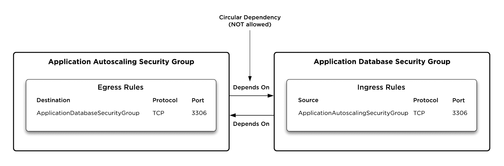

CloudFormation circular dependencies

为了解决这个问题，下图演示了一种使用您在前面示例中创建的资源的替代方法。

`ApplicationToApplicationDatabaseIngress`资源将在`ApplicationDatabaseSecurityGroup`中动态创建入口规则(由`GroupId`属性指定)，该规则允许从`ApplicationAutoscalingSecurityGroup`访问 MySQL 端口(TCP/3306)(由`SourceSecurityGroupId`属性指定)。类似地，`ApplicationToApplicationDatabaseEgress`资源将在`ApplicationAutoscalingSecurityGroup`(由`GroupId`属性指定)中动态创建出口规则，该规则允许访问与属于`ApplicationDatabaseSecurityGroup`(由`DestinationSecurityGroupId`属性指定)的实例相关联的 MySQL 端口(TCP/3306)。这最终实现了上图所示配置的目的，但不会在 CloudFormation 中导致任何循环依赖错误:

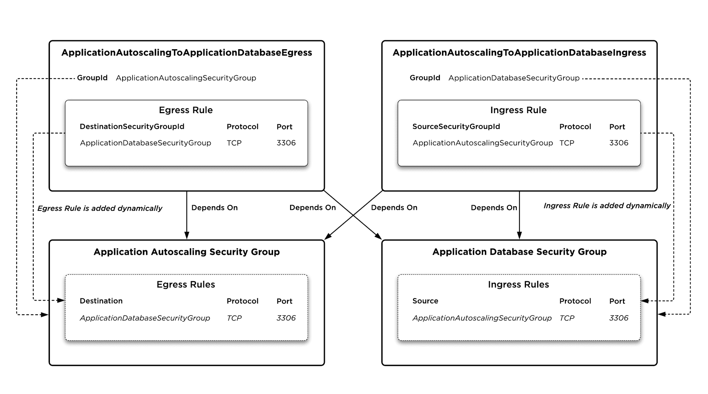

Solving CloudFormation circular dependencies

# 使用云信息部署无线电数据系统资源

有了前面示例的配置，您现在可以实际更新您的云信息栈，这将添加 RDS 实例和其他支持资源。在此之前，您需要更新您在第 7 章中创建的`dev.cfg`文件，该文件为您需要提供给云信息栈的输入参数提供了环境特定的值。具体来说，您需要为`MasterPassword`参数指定一个值，如下例所示:

```
ApplicationDesiredCount=1
ApplicationImageId=ami-ec957491
ApplicationSubnets=subnet-a5d3ecee,subnet-324e246f
DatabasePassword=my-super-secret-password
VpcId=vpc-f8233a80
```

Adding a database password to the dev.cfg file

现在，如果您担心您以明文形式提供的密码最终会提交给源代码，那么做得好，您绝对 100%正确地非常关注这种方法。在下一章中，我们将专门讨论安全地管理凭据，但目前我们不会解决这个问题，因此请记住，前面示例中演示的方法不被认为是最佳实践，我们将暂时保留这个方法，以便启动和运行您的应用数据库实例。

有了前面示例的配置，您现在可以使用之前在第 7 章中使用的`aws cloudformation deploy`命令来部署更新的栈:

```
> export AWS_PROFILE=docker-in-aws
> aws cloudformation deploy --template-file stack.yml \
 --stack-name todobackend --parameter-overrides $(cat dev.cfg) \
 --capabilities CAPABILITY_NAMED_IAM
Enter MFA code for arn:aws:iam::385605022855:mfa/justin.menga:
Waiting for changeset to be created..
Waiting for stack create/update to complete
Successfully created/updated stack - todobackend
> aws cloudformation describe-stack-resource --stack-name todobackend \
    --logical-resource-id ApplicationDatabase
{
    "StackResourceDetail": {
        "StackName": "todobackend",
        "StackId": "arn:aws:cloudformation:us-east-1:385605022855:stack/todobackend/297933f0-37fe-11e8-82e0-503f23fb55fe",
        "LogicalResourceId": "ApplicationDatabase",
 "PhysicalResourceId": "ta10udhxgd7s4gf",
        "ResourceType": "AWS::RDS::DBInstance",
        "LastUpdatedTimestamp": "2018-04-04T12:12:13.265Z",
        "ResourceStatus": "CREATE_COMPLETE",
        "Metadata": "{}"
    }
}
> aws rds describe-db-instances --db-instance-identifier ta10udhxgd7s4gf
{
    "DBInstances": [
        {
            "DBInstanceIdentifier": "ta10udhxgd7s4gf",
            "DBInstanceClass": "db.t2.micro",
            "Engine": "mysql",
            "DBInstanceStatus": "available",
            "MasterUsername": "todobackend",
            "DBName": "todobackend",
            "Endpoint": {
                "Address": "ta10udhxgd7s4gf.cz8cu8hmqtu1.us-east-1.rds.amazonaws.com",
                "Port": 3306,
                "HostedZoneId": "Z2R2ITUGPM61AM"
            }
...
...
```

Updating a CloudFormation stack with RDS resources

部署将需要一些时间(通常为 15-20 分钟)才能完成，一旦部署完成，请注意，您可以使用`aws cloudformation describe-stack-resource`命令获取关于`ApplicationDatabase`资源的更多信息，包括指定 RDS 实例标识符的`PhysicalResourceId`属性。

# 配置应用负载平衡器

我们已经建立了一个 ECS 集群，并创建了一个应用数据库来存储应用数据，接下来我们需要创建前端基础架构，为从外部世界到我们的 Docker 应用的连接提供服务。

AWS 中提供此类基础架构的一种流行方法是利用弹性负载平衡服务，该服务为应用的负载平衡连接提供了许多不同的选项:

*   **经典弹性负载平衡器**:支持第 4 层(TCP)负载平衡的原 AWS 负载平衡器。通常，您应该使用较新的应用负载平衡器或网络负载平衡器，它们共同提供了经典负载平衡器的所有现有功能以及更多功能。
*   **应用负载平衡器**:一个 HTTP 感知负载平衡器，专门针对基于 web 的应用和 API。
*   **网络负载平衡器**:一种高性能的第 4 层(TCP)负载平衡服务，通常用于基于非 HTTP TCP 的应用，或者需要非常高性能的应用。

出于我们的目的，我们将利用应用负载平衡器(ALB)，这是一个现代的第 7 层负载平衡器，可以根据 HTTP 协议信息执行高级操作，例如主机头和基于路径的路由。例如，ALB 可以将对给定 HTTP 主机头的请求路由到给定的一组目标，还可以将对 some.domain/foo 路径的请求路由到一组目标，并将对 some.domain/bar 路径的请求路由到不同的一组目标。

AWS ALB 与弹性容器服务集成，支持许多关键的集成特性:

*   **滚动更新** : ECS 服务可以以滚动的方式部署，ECS 利用负载均衡器连接引流，让应用的旧版本优雅地退出服务，终止每个应用容器并用新版本替换，然后将新容器添加到负载均衡器，确保执行更新时不会造成最终用户中断或影响。
*   **动态端口映射**:此功能允许您将容器端口映射到 ECS 容器实例上的动态端口，ECS 负责确保动态端口映射在应用负载平衡器中正确注册。动态端口映射的主要好处是，它允许同一应用容器的多个实例在单个 ECS 容器实例上运行，从而在确定 ECS 集群的规模和扩展方面提供了更大的灵活性。
*   **运行状况检查** : ECS 使用应用负载平衡器运行状况检查来确定您的 Docker 应用的运行状况，自动终止并替换任何可能变得不健康且负载平衡器运行状况检查失败的容器。

# 应用负载平衡器架构

如果您熟悉较旧的经典弹性负载平衡器，您会发现，考虑到 ALBs 支持的高级第 7 层/HTTP 功能的性质，较新的应用负载平衡器的体系结构更加复杂。

下图显示了组成应用负载平衡器的各种组件:

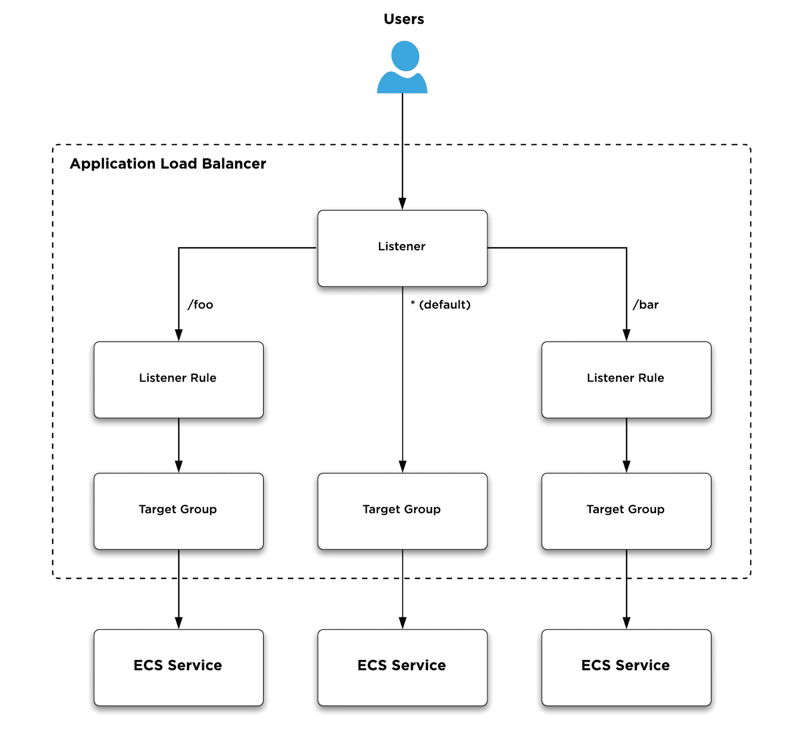

Application Load Balancer components

下面描述了上图中所示的每个组件:

*   **应用负载均衡器**:应用负载均衡器是定义负载均衡器物理特性的物理资源，例如负载均衡器应该运行的子网以及允许或拒绝进出负载均衡器的网络流量的安全组。
*   **监听器**:监听器定义终端用户和设备连接的网络端口。您可以将侦听器视为负载平衡器的前端组件，为最终将被路由到承载您的应用的目标组的传入连接提供服务。每个应用负载平衡器都可以包括多个侦听器，一个常见的例子可能是同时服务于端口`80`和端口`443`网络流量的侦听器配置。
*   **侦听器规则**:侦听器规则根据接收到的主机头和/或请求路径的值，选择性地将侦听器接收到的 HTTP 流量路由到不同的目标组。例如，如上图所示，您可以将发送到`/foo/*`请求路径的所有流量路由到一个目标组，而发送到`/bar/*`的所有流量可能会路由到另一个目标组。请注意，每个侦听器都必须定义一个默认目标组，没有路由侦听器规则的所有流量都将被路由到该目标组。
*   **目标组**:目标组定义了一个或多个传入连接应该路由到的目标。您可以将目标组视为负载平衡器的后端组件，负责负载平衡接收到的到目标组内成员的连接。将应用负载平衡器与 ECS 集成时，目标组链接到一个 ECS 服务，ECS 服务的每个实例(即容器)都被视为一个目标。

# 配置应用负载平衡器

现在您已经理解了应用负载平衡器的基本体系结构，让我们在您的云信息模板中定义各种应用负载平衡器组件，并继续将新资源部署到您的云信息栈中。

# 创建应用负载平衡器

以下示例演示如何添加名为`ApplicationLoadBalancer`的资源，顾名思义，该资源配置基础应用负载平衡器资源:

```
...
...
Resources:
 ApplicationLoadBalancer:
 Type: AWS::ElasticLoadBalancingV2::LoadBalancer
 Properties:
 Scheme: internet-facing
 Subnets: !Ref ApplicationSubnets
 SecurityGroups:
 - !Ref ApplicationLoadBalancerSecurityGroup
 LoadBalancerAttributes:
 - Key: idle_timeout.timeout_seconds
 Value : 30
 Tags:
 - Key: Name
 Value: !Sub ${AWS::StackName}-alb
  ApplicationDatabase:
    Type: AWS::RDS::DBInstance
...
...
```

Creating an Application Load Balancer

在前面的示例中，为应用负载平衡器资源配置了以下属性:

*   `Scheme`:定义负载均衡器是有公共 IP 寻址(由值`internet-facing`指定)还是只有私有 IP 寻址(由值`internal`指定)
*   `Subnets`:定义应用负载平衡器端点将部署到的子网。在前面的示例中，您引用了`ApplicationSubnets`输入参数，该参数之前用于 EC2 自动缩放组和 RDS 数据库实例资源。
*   `SecurityGroups`:指定应用于负载平衡器的安全组列表，负载平衡器限制入口和出口网络流量。您引用了一个名为`ApplicationLoadBalancerSecurityGroup`的安全组，您将很快创建它。
*   `LoadBalancerAttributes`:以键/值格式配置应用负载平衡器的各种属性。您可以在[https://docs . AWS . Amazon . com/elastic cload balancing/latest/application/application-load-balancers . html # load-balancer-attributes](https://docs.aws.amazon.com/elasticloadbalancing/latest/application/application-load-balancers.html#load-balancer-attributes)找到支持的属性列表，在前面的示例中，您配置了一个属性，将空闲连接超时从默认值`60`秒减少到`30`秒。

CloudFormation 的一个特性是能够定义您自己的*输出*，它可以用来提供关于您的栈中的资源的信息。您可以为栈配置的一个有用的输出是应用负载平衡器端点的公共 DNS 名称的值，因为负载平衡器所服务的任何应用都将在这里发布:

```
...
...
Resources:
  ...
  ...
Outputs:
 PublicURL:
 Description: Public DNS name of Application Load Balancer
 Value: !Sub ${ApplicationLoadBalancer.DNSName}

```

Configuring a CloudFormation Output

在前面的例子中，注意`ApplicationLoadBalancer`资源输出一个名为`DNSName`的属性，该属性返回`ApplicationLoadBalancer`资源的公共域名。

# 配置应用负载平衡器安全组

在前面的示例中，您引用了一个名为`ApplicationLoadBalancerSecurityGroup`的资源，它定义了进出应用负载平衡器的入口和出口网络访问。

除了这个资源之外，您还需要以类似于前面示例的方式创建`AWS::EC2::SecurityGroupIngress`和`AWS::EC2::SecurityGroupEgress`资源，这确保应用负载平衡器可以与您的 ECS 服务应用实例通信:

```
...
...
Resources:
  ApplicationLoadBalancer:
    Type: AWS::ElasticLoadBalancingV2::LoadBalancer
    Properties:
      Scheme: internet-facing
      Subnets: !Ref ApplicationSubnets
      SecurityGroups:
        - !Ref ApplicationLoadBalancerSecurityGroup
      LoadBalancerAttributes:
        - Key: idle_timeout.timeout_seconds
          Value : 30
      Tags:
        - Key: Name
          Value: !Sub ${AWS::StackName}-alb
  ApplicationLoadBalancerSecurityGroup:
 Type: AWS::EC2::SecurityGroup
 Properties:
 GroupDescription: Application Load Balancer Security Group
 VpcId: !Ref VpcId
 SecurityGroupIngress:
 - IpProtocol: tcp
 FromPort: 80
 ToPort: 80
 CidrIp: 0.0.0.0/0
 Tags:
 - Key: Name
 Value: 
 Fn::Sub: ${AWS::StackName}-alb-sg  ApplicationLoadBalancerToApplicationIngress:
 Type: AWS::EC2::SecurityGroupIngress
 Properties:
 IpProtocol: tcp
 FromPort: 32768
 ToPort: 60999
 GroupId: !Ref ApplicationAutoscalingSecurityGroup
 SourceSecurityGroupId: !Ref ApplicationLoadBalancerSecurityGroup
 ApplicationLoadBalancerToApplicationEgress:
 Type: AWS::EC2::SecurityGroupEgress
 Properties:
 IpProtocol: tcp
 FromPort: 32768
 ToPort: 60999
 GroupId: !Ref ApplicationLoadBalancerSecurityGroup
 DestinationSecurityGroupId: !Ref ApplicationAutoscalingSecurityGroup
  ApplicationDatabase:
    Type: AWS::RDS::DBInstance
...
...
```

Configuring Application Load Balancer security group resources

在前面的例子中，首先创建`ApplicationLoadBalancerSecurityGroup`资源，允许从互联网进入端口 80。`ApplicationLoadBalancerToApplicationIngress`和`ApplicationLoadBalancerToApplicationEgress`资源将安全规则添加到`ApplicationLoadBalancerSecurityGroup`和`ApplicationAutoscalingSecurityGroup`资源中，而不创建循环依赖关系(回头参考前面的图表和相关描述)，请注意，这些规则引用了应用自动缩放组中`32768`到`60999`的短暂端口范围，因为我们将为您的 ECS 服务配置动态端口映射。

# 创建侦听器

现在，您已经建立了基本的应用负载平衡器和相关的安全组资源，您可以为应用负载平衡器配置一个侦听器。出于本书的目的，您只需要配置一个服务于 HTTP 连接的侦听器，但是在任何实际的生产用例中，您通常会配置一个具有相关证书的 HTTPS 侦听器，尤其是对于任何面向互联网的服务。

以下示例演示了如何配置单个侦听器，该侦听器支持使用端口`80` (HTTP)访问应用负载平衡器:

```
...
...
Resources:
  ApplicationLoadBalancerHttpListener:
 Type: AWS::ElasticLoadBalancingV2::Listener
 Properties:
 LoadBalancerArn: !Ref ApplicationLoadBalancer
 Protocol: HTTP
 Port: 80
 DefaultActions:
 - TargetGroupArn: !Ref ApplicationServiceTargetGroup
 Type: forward
  ApplicationLoadBalancer:
    Type: AWS::ElasticLoadBalancingV2::LoadBalancer
    Properties:
      Scheme: internet-facing
      Subnets: !Ref ApplicationSubnets
      SecurityGroups:
        - !Ref ApplicationLoadBalancerSecurityGroup
      LoadBalancerAttributes:
        - Key: idle_timeout.timeout_seconds
          Value : 30
      Tags:
        - Key: Name
          Value: !Sub ${AWS::StackName}-alb
...
...
```

Creating an Application Load Balancer listener

在前面的示例中，侦听器通过`LoadBalancerArn`属性绑定到`ApplicationLoadBalancer`资源，其中`Protocol`和`Port`属性配置侦听器以预期端口`80`上的传入 HTTP 连接。请注意，您必须定义`DefaultActions`属性，该属性定义传入连接将被转发到的默认目标组。

# 创建目标组

与配置应用负载平衡器相关的最后一项配置任务是配置目标组，该目标组将用于将侦听器资源收到的传入请求转发到您的应用实例。

以下示例演示了如何配置目标组资源:

```
...
...
Resources:
  ApplicationServiceTargetGroup:
 Type: AWS::ElasticLoadBalancingV2::TargetGroup
 Properties:
 Protocol: HTTP
 Port: 8000
 VpcId: !Ref VpcId
 TargetGroupAttributes:
 - Key: deregistration_delay.timeout_seconds
 Value: 30
  ApplicationLoadBalancerHttpListener:
    Type: AWS::ElasticLoadBalancingV2::Listener
    Properties:
      LoadBalancerArn: !Ref ApplicationLoadBalancer
      Protocol: HTTP
      Port: 80
      DefaultActions:
        - TargetGroupArn: !Ref ApplicationServiceTargetGroup
          Type: forward
  ApplicationLoadBalancer:
    Type: AWS::ElasticLoadBalancingV2::LoadBalancer
...
...
```

Creating a target group

在前面的示例中，为目标组定义了以下配置:

*   `Protocol`:定义将转发到目标组的连接协议。
*   `Port`:指定应用将在其上运行的容器端口。默认情况下，todobackend 示例应用在端口`8000`上运行，因此您可以为端口配置该值。请注意，配置动态端口映射时，ECS 将动态重新配置此端口。
*   `VpcId`:配置目标所在的 VPC 标识。
*   `TargetGroupAttributes`:定义目标组的配置属性([https://docs . AWS . Amazon . com/elastic cloadbalancing/latest/application-load-balancer-target-groups . html # target-group-attributes](https://docs.aws.amazon.com/elasticloadbalancing/latest/application/load-balancer-target-groups.html#target-group-attributes))。在前面的示例中，`deregistration_delay.timeout_seconds`属性配置了在注销目标之前等待的时间，这发生在应用滚动部署期间清空连接时。

# 使用云信息部署应用负载平衡器

现在，您的所有应用负载平衡器组件都已经在您的云信息模板中定义，您可以使用`aws cloudformation deploy`命令将这些组件部署到 AWS。

一旦您的栈部署完成，如果您打开 AWS 控制台并导航到 EC2 仪表板，在**负载平衡**部分下，您应该能够看到您的新应用负载平衡器资源。

下面的屏幕截图演示了如何查看作为部署的一部分而创建的应用负载平衡器资源:

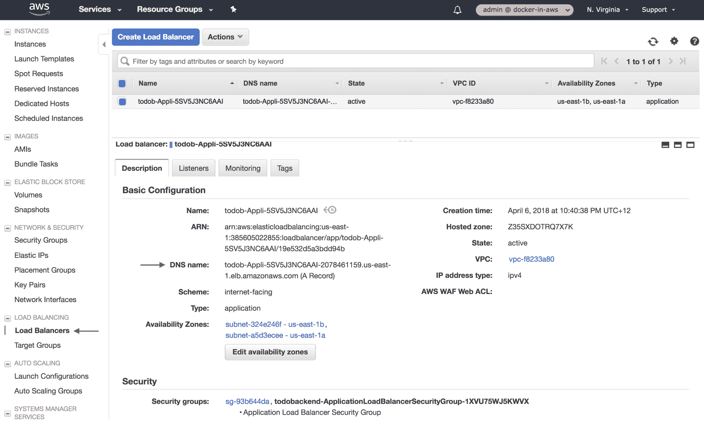

Viewing an Application Load Balancer

在前面的截图中，您可以看到应用负载平衡器资源有一个域名，这是终端用户和设备在访问负载平衡器后面的应用时需要连接到的端点的名称。一旦您完全部署了栈中的所有资源，您将在以后使用这个名称，但是现在因为您的目标组是空的，这个 URL 将返回一个 503 错误，如下例所示。请注意，您可以通过单击上一张截图中的**监听器**选项卡来查看您的监听器资源，而您关联的目标组资源可以通过单击左侧菜单中的**目标组**链接来查看。

You will notice that the DNS name of the Application Load Balancer is not a particularly friendly name that your end users will be able to recognize or remember. In a real-world application, you would typically create a CNAME or ALIAS DNS record, which configures a friendly canonical name, such as example.com, that points to your load balancer DNS name. See [https://docs.aws.amazon.com/Route53/latest/DeveloperGuide/routing-to-elb-load-balancer.html](https://docs.aws.amazon.com/Route53/latest/DeveloperGuide/routing-to-elb-load-balancer.html) for more details on how to do this, and note that you can and should create CNAME and ALIAS records using CloudFormation ([https://docs.aws.amazon.com/AWSCloudFormation/latest/UserGuide/quickref-route53.html#scenario-recordsetgroup-zoneapex](https://docs.aws.amazon.com/AWSCloudFormation/latest/UserGuide/quickref-route53.html#scenario-recordsetgroup-zoneapex)).

```
> aws cloudformation describe-stacks --stack-name todobackend --query Stacks[].Outputs[]
[
    {
        "OutputKey": "PublicURL",
        "OutputValue": "todob-Appli-5SV5J3NC6AAI-2078461159.us-east-1.elb.amazonaws.com",
        "Description": "Public DNS name of Application Load Balancer"
    }
]
> curl todob-Appli-5SV5J3NC6AAI-2078461159.us-east-1.elb.amazonaws.com
<html>
<head><title>503 Service Temporarily Unavailable</title></head>
<body bgcolor="white">
<center><h1>503 Service Temporarily Unavailable</h1></center>
</body>
</html>
```

Testing an Application Load Balancer endpoint

请注意，在前面的示例中，您可以使用 AWS 命令行界面查询云信息栈的输出，并获取应用负载平衡器的公共域名。在云信息仪表板中选择栈后，您也可以通过单击输出选项卡来查看栈的输出。

# 创建 ECS 任务定义

现在，您已经使用 CloudFormation 定义了一个 ECS 集群，并创建了许多支持资源，包括应用数据库的 RDS 实例和服务于应用连接的应用负载平衡器。

在这个阶段，您已经准备好创建代表您的应用的 ECS 资源，其中包括 ECS 任务定义和 ECS 服务。

我们将从在您的云信息模板中定义 ECS 任务定义开始，如以下示例所示:

```
Parameters:
  ...
  ...
  ApplicationImageId:
    Type: String
    Description: ECS Amazon Machine Image (AMI) ID
 ApplicationImageTag:
 Type: String
 Description: Application Docker Image Tag
 Default: latest  ApplicationSubnets:
    Type: List<AWS::EC2::Subnet::Id>
    Description: Target subnets for EC2 instances
 ...
  ... 
Resources:
  ApplicationTaskDefinition:
 Type: AWS::ECS::TaskDefinition
 Properties:
 Family: todobackend      Volumes:
 - Name: public          Host:
 SourcePath: /data/public
 ContainerDefinitions:        - Name: todobackend
 Image: !Sub ${AWS::AccountId}.dkr.ecr.${AWS::Region}.amazonaws.com/docker-in-aws/todobackend:${ApplicationImageTag}
 MemoryReservation: 395
 Cpu: 245
 MountPoints:
 - SourceVolume: public
 ContainerPath: /public
 Environment:
            - Name: DJANGO_SETTINGS_MODULE
 Value: todobackend.settings_release
 - Name: MYSQL_HOST
 Value: !Sub ${ApplicationDatabase.Endpoint.Address}
 - Name: MYSQL_USER
 Value: todobackend
 - Name: MYSQL_PASSWORD
 Value: !Ref DatabasePassword
 - Name: MYSQL_DATABASE
 Value: todobackend            - Name: SECRET_KEY
 Value: some-random-secret-should-be-here
 Command: 
 - uwsgi
 - --http=0.0.0.0:8000
 - --module=todobackend.wsgi
 - --master
 - --die-on-term
 - --processes=4
 - --threads=2
 - --check-static=/public
 PortMappings:
 - ContainerPort: 8000
              HostPort: 0
 LogConfiguration:
 LogDriver: awslogs
 Options:
 awslogs-group: !Sub /${AWS::StackName}/ecs/todobackend
 awslogs-region: !Ref AWS::Region
 awslogs-stream-prefix: docker
 - Name: collectstatic
          Essential: false
 Image: !Sub ${AWS::AccountId}.dkr.ecr.${AWS::Region}.amazonaws.com/docker-in-aws/todobackend:${ApplicationImageTag}
 MemoryReservation: 5
 Cpu: 5          MountPoints:
 - SourceVolume: public
              ContainerPath: /public
 Environment:
 - Name: DJANGO_SETTINGS_MODULE
              Value: todobackend.settings_release
 Command:
 - python3
            - manage.py
            - collectstatic
            - --no-input
 LogConfiguration:
 LogDriver: awslogs
 Options:
 awslogs-group: !Sub /${AWS::StackName}/ecs/todobackend
 awslogs-region: !Ref AWS::Region
 awslogs-stream-prefix: docker  ApplicationLogGroup:
 Type: AWS::Logs::LogGroup
 Properties:
 LogGroupName: !Sub /${AWS::StackName}/ecs/todobackend
 RetentionInDays: 7
  ApplicationServiceTargetGroup:
    Type: AWS::ElasticLoadBalancingV2::TargetGroup
...
...
```

Defining an ECS task definition using CloudFormation

正如您在前面的示例中看到的，配置任务定义需要合理的配置量，并且需要详细了解任务定义所代表的容器应用的运行时配置。

回到第 1 章，当您创建示例应用并在本地运行它时，您必须使用 Docker Compose 执行类似的练习。下面的示例显示了 todobackend 存储库中 Docker 编写文件的相关片段:

```
version: '2.3'

volumes:
  public:
    driver: local

services:
  ...
  ...
  app:
    image: 385605022855.dkr.ecr.us-east-1.amazonaws.com/docker-in-aws/todobackend:${APP_VERSION}
    extends:
      service: release
    depends_on:
      db:
        condition: service_healthy
    volumes:
      - public:/public
    healthcheck:
      test: curl -fs localhost:8000
    ports:
      - 8000
    command:
      - uwsgi
      - --http=0.0.0.0:8000
      - --module=todobackend.wsgi
      - --master
      - --die-on-term
      - --processes=4
      - --threads=2
      - --check-static=/public
  acceptance:
    extends:
      service: release
    depends_on:
      app:
        condition: service_healthy
    environment:
      APP_URL: http://app:8000
    command:
      - bats 
      - acceptance.bats
  migrate:
    extends:
      service: release
    depends_on:
      db:
        condition: service_healthy
    command:
      - python3
      - manage.py
      - migrate
      - --no-input
  ...
  ...
```

Todobackend application Docker Compose configuration

如果您比较前面两个示例的配置，可以看到您可以使用本地 Docker Compose 配置来确定 ECS 任务定义所需的配置。

现在让我们更详细地检查各种 ECS 任务定义配置属性。

# 配置 ECS 任务定义系列

您在任务定义中定义的第一个属性是**族**属性，它建立了 ECS 任务定义族名称，并影响每当您更改任务定义时 CloudFormation 将创建任务定义资源的新实例的方式。

回想一下第 4 章，ECS 任务定义支持修订的概念，您可以将其视为 ECS 任务定义的特定版本或配置，并且每当您需要修改任务定义(例如，修改映像标签)时，您可以创建 ECS 任务定义的新修订。

因此，如果您的 ECS 任务定义系列名称为**todo back and**，则您的任务定义的第一个修订版将为**todo back and:1**，并且对任务定义的任何后续更改都将导致创建新的修订版—例如，**todo back and:2**、**todo back and:3**等等。在您的 ECS 任务定义资源中配置**系列**属性可确保每当您的 ECS 任务定义资源被修改时，云信息将采用创建新版本的行为。

请注意，如果您没有按照前面的示例配置**族**属性，CloudFormation 将为该族生成一个修订版为 1 的随机名称，并且对任务定义的任何后续更改都将导致使用一个修订版为 1 的随机名称创建一个*新的*族。

# 配置 ECS 任务定义卷

回到前面例子中的`ApplicationTaskDefinition`资源，`Volumes`属性定义了本地 Docker 卷，每当 ECS 任务定义的实例被部署到 ECS 容器实例时，就会创建本地 Docker 卷。参考上例中的本地 Docker Compose 配置，可以看到配置了一个名为 **public** 的卷，然后在 **app** 服务定义中将其作为挂载点引用。

此卷用于存储静态 web 文件，这些文件是通过在本地 Makefile 工作流中运行`python3 manage.py collectstatic --no-input`命令生成的，并且必须可供主应用容器使用，因此需要一个卷来确保运行此命令生成的文件可供应用容器使用:

```
...
...
release:
  docker-compose up --abort-on-container-exit migrate
 docker-compose run app python3 manage.py collectstatic --no-input
  docker-compose up --abort-on-container-exit acceptance
  @ echo App running at http://$$(docker-compose port app 8000 | sed s/0.0.0.0/localhost/g)
...
...
```

Todobackend Makefile

请注意，在我们的 ECS 任务定义中，我们还需要指定`/data/public`的主机源路径，这是我们在上一章中作为 ECS 集群自动扩展组 CloudFormation init 配置的一部分创建的。该文件夹在底层 ECS 容器实例上具有正确的权限，这确保了我们的应用能够读写公共卷。

# 配置 ECS 任务定义容器

先前配置的 ECS 任务定义包括`ContainerDefinitions`属性，该属性定义了与任务定义相关联的一个或多个容器的列表。您可以看到定义了两个容器:

*   `todobackend`容器:这是主要的应用容器定义。
*   `collectstatic`容器:这个容器是一个短命的容器，运行`python3 manage.py collectstatic`命令生成本地静态 web 文件。与该容器相关联的一个重要配置参数是`Essential`属性，该属性定义了如果容器失败或退出，ECS 是否应该尝试重新启动该容器(事实上，ECS 将尝试重新启动任务定义中的所有容器，导致主应用容器不必要地停止和重新启动)。鉴于`collectstatic`容器仅打算作为短期任务运行，您必须将此属性设置为 false，以确保 ECS 不会尝试重新启动您的 ECS 任务定义容器。

There are many ways you could tackle the requirement to run the collect static process to generate static web files. For example, you could define a startup script that first runs collect static and then starts the application container, or you may wish to publish your static files to an S3 bucket, meaning you would run the collect static process quite differently.

除了本质属性之外，`todobackend`和`collectstatic`容器定义的配置属性非常相似，因此我们将在此讨论主`todobackend`容器定义的属性，并在适当的地方讨论与`collectstatic`容器定义的任何差异:

*   `Image`:该属性定义容器所基于的 Docker 映像的 URI。请注意，我们发布了您在第 5 章中为 todobackend 应用创建的 ECR 存储库的 URI，并引用了一个名为`ApplicationImageTag`的栈参数，该参数允许您在部署栈时提供适当版本的 Docker 映像。
*   `Cpu`和`MemoryReservation`:这些属性为您的容器分配 CPU 和内存资源。我们将在接下来的章节中更详细地讨论这些资源，但是现在要理解，这些值保留了配置的 CPU 份额和内存量，但是如果可用的话，允许您的容器使用更多的 CPU 和内存(即“突发”)。请注意，您为`collectstatic`容器分配了最少量的 CPU 和内存，因为它只需要运行很短的时间，并且很可能 ECS 容器实例将有空闲的 CPU 和内存容量来满足容器的实际资源需求。这避免了为只在一小部分时间处于活动状态的容器保留大量的 CPU 和内存。
*   `MountPoints`:定义将要装载到容器的 Docker 卷。每个容器都有一个挂载点，将**公共**卷挂载到`/public`容器路径，用于托管静态 web 文件。

*   `Environment`:定义容器可用的环境变量。参考前面示例中的本地 Docker Compose 配置，您可以看到发布服务是应用服务继承的基础服务定义，它指示容器需要将`DJANGO_SETTINGS_MODULE`变量设置为`todobackend.settings_release`，并且需要定义许多与数据库相关的环境变量来定义与应用数据库的连接。另一个需要的环境变量是`SECRET_KEY`变量，它用于 Django 框架中的各种加密函数，为 todobackend 应用提供动力，并且应该用一个机密的随机值进行配置。如您所见，目前我们已经设置了一个非随机的明文值，在下一章中，您将了解如何将该值作为加密的机密注入
*   `Command`:定义启动容器时应该执行的命令。您可以看到`todobackend`容器定义使用本地 Docker Compose 工作流用来启动`uwsgi`应用服务器的相同`uwsgi`命令，而 collectstatic 容器使用`python3 manage.py collectstatic`命令来生成要从主应用提供的静态 web 文件。
*   `PortMappings`:指定应该从容器公开的端口映射。todobackend 容器定义有一个单一的端口映射，它为容器端口指定了`8000`的默认应用端口，并指定了`0`的主机端口值，这意味着将使用动态端口映射(注意，在使用动态端口映射时，您也可以省略 host port 参数)。
*   `LogConfiguration`:配置容器的日志配置。在前面的示例中，您通过使用 awslogs 驱动程序将 CloudWatch 日志配置为日志驱动程序，然后配置特定于该驱动程序的选项。awslogs-group 选项指定日志将输出到的日志组，它引用了在`ApplicationLogGroup`资源中定义的日志组的名称，就在`ApplicationTaskDefinition`资源下面。awslogs-stream-prefix 非常重要，因为它将容器标识的默认日志流命名约定修改为`<prefix-name>/<container-name>/<ecs-task-id>`格式，这里的关键信息是 ECS 任务标识，这是使用 ECS 而不是容器标识时使用的主要任务标识符。

In Chapter 7, you granted your ECS container instances the ability to publish to any log group prefixed with the name of your CloudFormation stack. As long as your ECS task definitions and associated log groups follow this naming convention, the Docker Engine will be able to publish logs for your ECS tasks and containers to CloudWatch logs.

# 使用云信息部署 ECS 任务定义

现在您已经定义了 ECS 任务定义，您可以使用现在熟悉的`aws cloudformation deploy`命令来部署它。更新栈后，应创建一个新的任务定义，其系列名称为 todobackend，您可以使用 AWS CLI 查看该定义，如下例所示:

```
> aws ecs describe-task-definition --task-definition todobackend
{
    "taskDefinition": {
        "taskDefinitionArn": "arn:aws:ecs:us-east-1:385605022855:task-definition/todobackend:1",
        "family": "todobackend",
        "revision": 1,
        "volumes": [
            {
                "name": "public",
                "host": {
                    "sourcePath": "/data/public"
                }
            }
        ],
        "containerDefinitions": [
            {
                "name": "todobackend",
                "image": "385605022855.dkr.ecr.us-east-1.amazonaws.com/docker-in-aws/todobackend:latest",
                "cpu": 245,
                "memoryReservation": 395,
...
...
```

Verifying the todobackend task definition

# 部署 ECS 服务

有了您的 ECS 集群、ECS 任务定义和各种支持资源，您现在可以定义一个 ECS 服务，该服务将按照 ECS 任务定义中的定义将您的容器应用部署到您的 ECS 集群。

以下示例演示了向您的云信息模板添加一个 ECS 服务资源，该模板的资源类型为`AWS::ECS::Service`:

```
...
...
Resources:
  ApplicationService:
 Type: AWS::ECS::Service
 DependsOn:
      - ApplicationAutoscaling
      - ApplicationLogGroup
      - ApplicationLoadBalancerHttpListener
    Properties:
      TaskDefinition: !Ref ApplicationTaskDefinition
      Cluster: !Ref ApplicationCluster
      DesiredCount: !Ref ApplicationDesiredCount
      LoadBalancers:
        - ContainerName: todobackend
          ContainerPort: 8000
          TargetGroupArn: !Ref ApplicationServiceTargetGroup
      Role: !Sub arn:aws:iam::${AWS::AccountId}:role/aws-service-role/ecs.amazonaws.com/AWSServiceRoleForECS 
 DeploymentConfiguration:
 MaximumPercent: 200
 MinimumHealthyPercent: 100
  ApplicationTaskDefinition:
    Type: AWS::ECS::TaskDefinition
...
...
```

Creating an ECS service

前面示例中配置的一个有趣方面是`DependsOn`参数，它定义了在创建或更新 ECS 服务资源之前必须创建或更新的栈中的其他资源。尽管当一个资源直接引用另一个资源时，CloudFormation 会自动创建依赖关系，但是一个资源可能依赖于与该资源没有直接关系的其他资源。ECS 服务资源就是一个很好的例子——如果没有一个正常运行的 ECS 集群和相关的 ECS 容器实例(这由`ApplicationAutoscaling`资源表示)，服务就不能运行，如果没有`ApplicationLogGroup`资源，服务就不能写日志。一个更微妙的依赖关系是`ApplicationLoadBalancerHttpListener`资源，在与 ECS 服务相关联的目标组注册目标之前，该资源必须起作用。

这里描述了为 ECS 服务配置的各种属性:

*   `TaskDefinition`、`DesiredCount`和`Cluster`:定义 ECS 任务定义、ECS 任务数量以及服务将部署到的目标 ECS 集群。
*   `LoadBalancers`:配置 ECS 服务应该集成的负载平衡器资源。您必须指定将向 ECS 服务注册的容器名称、容器端口和目标组 ARN。请注意，您引用了本章前面创建的`ApplicationServiceTargetGroup`资源。
*   `Role`:仅当您将 ECS 服务与负载平衡器集成时，此属性才是必需的，并且指定了一个 IAM 角色，该角色授予 ECS 服务管理已配置负载平衡器的权限。在前面的示例中，您引用了一个特殊 IAM 角色的 ARN，该角色被称为服务角色([https://docs . aws . Amazon . com/IAM/latest/user guide/use-service-link-roles . html](https://docs.aws.amazon.com/IAM/latest/UserGuide/using-service-linked-roles.html)，每当您创建 ECS 资源时，它都会由 AWS 自动创建。`AWSServiceRoleForECS`服务角色授予 ECS 通常需要的许多权限，包括管理和集成应用负载平衡器。
*   `DeploymentConfiguration`:配置与新版本 ECS 任务定义滚动部署相关的设置。在部署过程中，ECS 将根据新版本的 ECS 任务定义停止现有容器并部署新容器，并且`MinimumHealthyPercent`设置定义了与部署期间必须使用的`DesiredCount`属性相关的容器的最小允许百分比。类似地，`MaximumPercent`设置定义了在部署期间相对于`DesiredCount`属性可以部署的容器的最大允许百分比。

# 使用云信息部署 ECS 服务

在您的 ECS 服务配置就绪后，是时候使用`aws cloudformation deploy`命令将更改部署到您的栈中了。部署完成后，您的 ECS 服务应该向您在本章前面创建的目标组注册，如果您浏览到应用负载平衡器的 URL，您应该会看到示例应用的根 URL 正在正确加载:

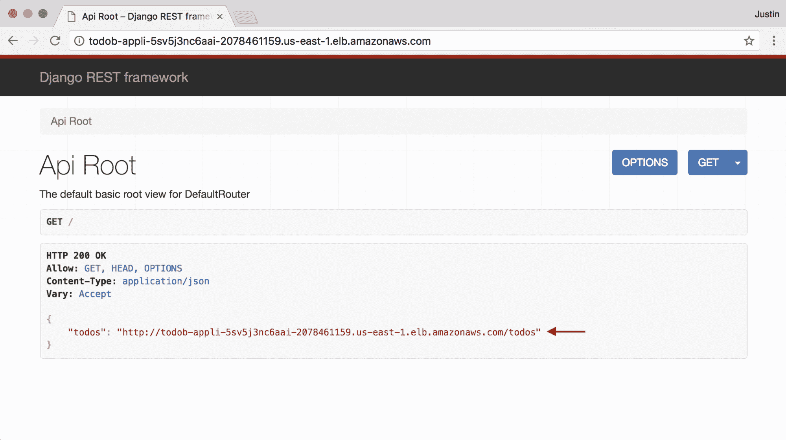

Testing the todobackend application

但是，如果您点击前面截图中显示的**转到**链接，您将会收到一个错误，如下图所示:

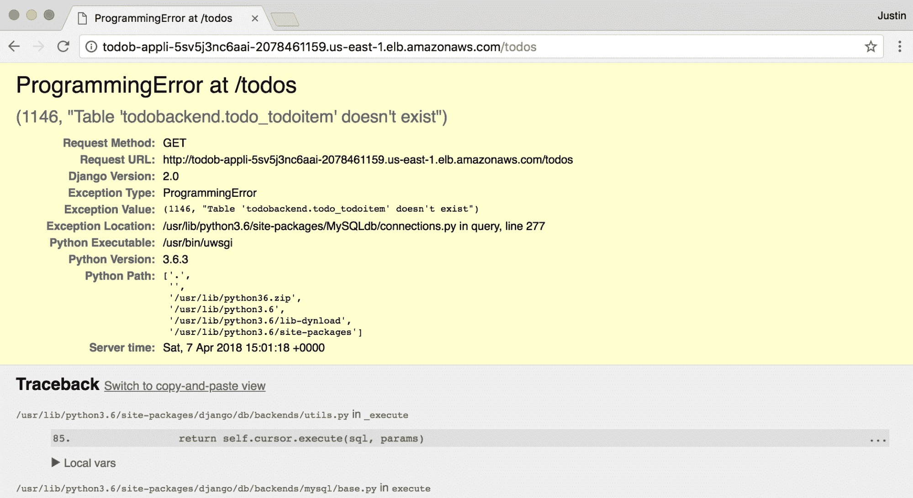

todobackend application error

前面截图中的问题是应用数据库中预期的数据库表尚未创建，因为我们还没有对应用数据库运行数据库迁移。我们将很快了解如何解决这个问题，但在此之前，我们还有一个与部署 ECS 服务相关的主题需要讨论:滚动部署。

# ECS 滚动部署

ECS 的一个关键特性是滚动部署，其中 ECS 将以滚动方式自动部署应用的新版本，结合您配置的负载平衡器协调各种操作，以确保您的应用成功部署，而不会出现停机时间，也不会对最终用户造成影响。ECS 如何管理滚动部署的过程实际上非常详细，下图试图在单个图表中从较高的层次描述该过程:

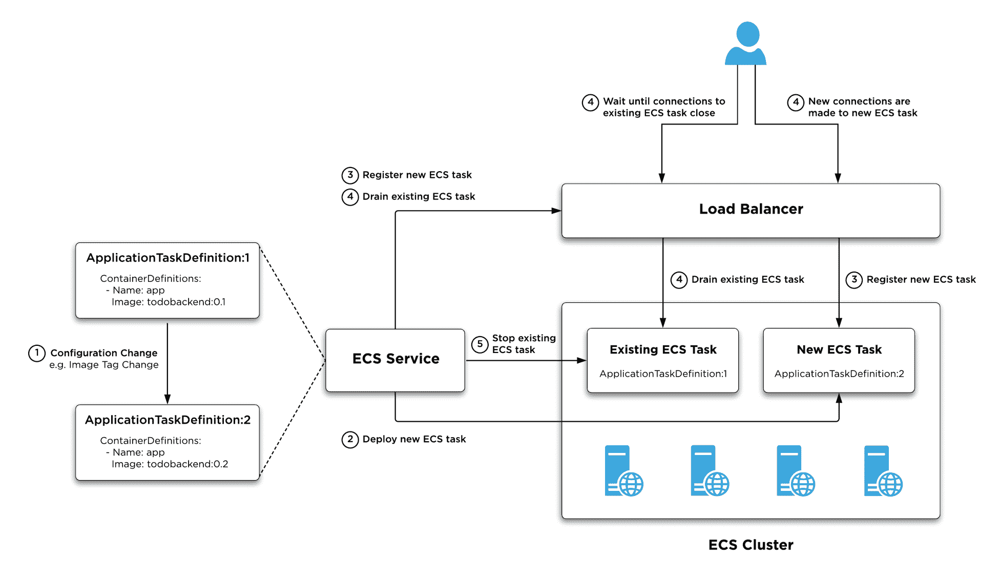

ECS rolling deployments

在上图中，滚动部署期间会发生以下事件:

1.  对链接到 ECS 服务的`ApplicationTaskDefinition` ECS 任务定义进行配置更改，这通常是应用新版本的映像标签的更改，但也可能是对任务定义的任何更改。这将导致创建任务定义的新版本(本例中为版本 2)。

2.  ECS 服务被配置为使用新的任务定义版本，这在使用云信息管理您的 ECS 资源时会自动发生。ECS 服务的部署配置决定了 ECS 如何管理滚动部署-在上图中，ECS 必须确保在部署期间至少保持 100%的已配置所需任务数，并且可以在部署期间将任务数临时增加到 200%。假设所需的任务数为 1，这意味着 ECS 可以基于新的任务定义版本部署新的 ECS 任务，并满足部署配置。请注意，您的 ECS 群集必须有足够的资源来容纳这些部署，并且您负责管理 ECS 群集容量(也就是说，ECS 不会临时增加 ECS 群集容量来容纳部署)。您将在后面的章节中学习如何动态管理 ECS 集群容量。
3.  一旦新的 ECS 任务成功启动，ECS 将向配置负载平衡器注册新任务(在应用负载平衡器的情况下，该任务将向目标组资源注册)。负载平衡器将执行运行状况检查，以确定新任务的运行状况，一旦确认运行状况良好，新的 ECS 任务将在负载平衡器中注册，并能够接受传入的连接。
4.  ECS 现在指示负载平衡器清空现有的 ECS 任务。负载平衡器将使现有的 ECS 任务停止服务(也就是说，它不会向任务转发任何新连接)，但是将等待一段可配置的时间，以便现有连接“耗尽”或关闭。在此期间，到负载平衡器的任何新连接都将被转发到在步骤 3 中向负载平衡器注册的新 ECS 任务。
5.  排出过程完成后，负载平衡器会从目标组中完全删除旧的 ECS 任务，现在 ECS 可以终止现有的 ECS 任务。完成后，新应用任务定义的部署就完成了。

从这个描述中可以看出，部署过程非常复杂。好消息是，所有这些都是 ECS 开箱即用的——您需要理解的是，对任务定义的任何更改都将触发新的部署，并且您的部署配置(由`DeploymentConfiguration`属性确定)为您提供了对滚动部署的一些控制。

# 执行滚动部署

现在您已经了解了滚动部署是如何工作的，让我们通过更改您的 ECS 任务定义并通过云信息部署更改来查看正在进行的过程，这将触发您的 ECS 服务的滚动部署。

目前，您的云信息配置没有指定`ApplicationImageTag`参数，这意味着您的 ECS 任务定义使用了`latest`的默认值。回到第 5 章，当您将 Docker 映像发布到 ECR 时，您实际上推送了两个标签——T2 标签和 todobackend 存储库的提交散列。这为我们提供了一个很好的机会来进一步改进我们的云信息模板——通过引用提交散列，而不是`latest`标记，每当您有新版本的应用要部署时，我们总是能够触发对您的 ECS 任务定义的配置更改。

下面的示例演示了将`ApplicationImageTag`参数添加到 todobackend-aws 存储库中的`dev.cfg`文件，引用 ECR 中当前发布的映像的提交哈希:

```
ApplicationDesiredCount=1
ApplicationImageId=ami-ec957491
ApplicationImageTag=97e4abf
ApplicationSubnets=subnet-a5d3ecee,subnet-324e246f
VpcId=vpc-f8233a80
```

Adding ApplicationImageTag to the dev.cfg file

如果您现在使用`aws cloudformation deploy`命令部署您的更改，尽管您现在引用的映像与当前最新标记的映像相同，但是 CloudFormation 会将其检测为配置更改，创建 ECS 任务定义的新版本，并更新`ApplicationService` ECS 服务资源，从而触发滚动部署。

部署运行时，如果您在 ECS 控制面板中浏览到您的 ECS 服务并选择“部署”选项卡，如下图所示，您将看到两个部署 ACTIVE 部署指的是现有的 ECS 任务，而 PRIMARY 部署指的是正在部署的新 ECS 任务:

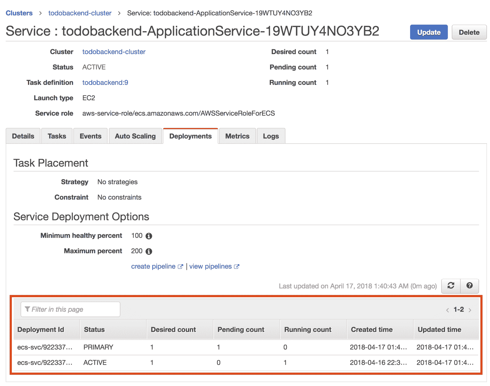

ECS service rolling deployment

最终，滚动部署过程完成后，活动部署将消失，如果您单击事件选项卡，您将看到部署期间发生的各种事件，这些事件对应于前面的描述:

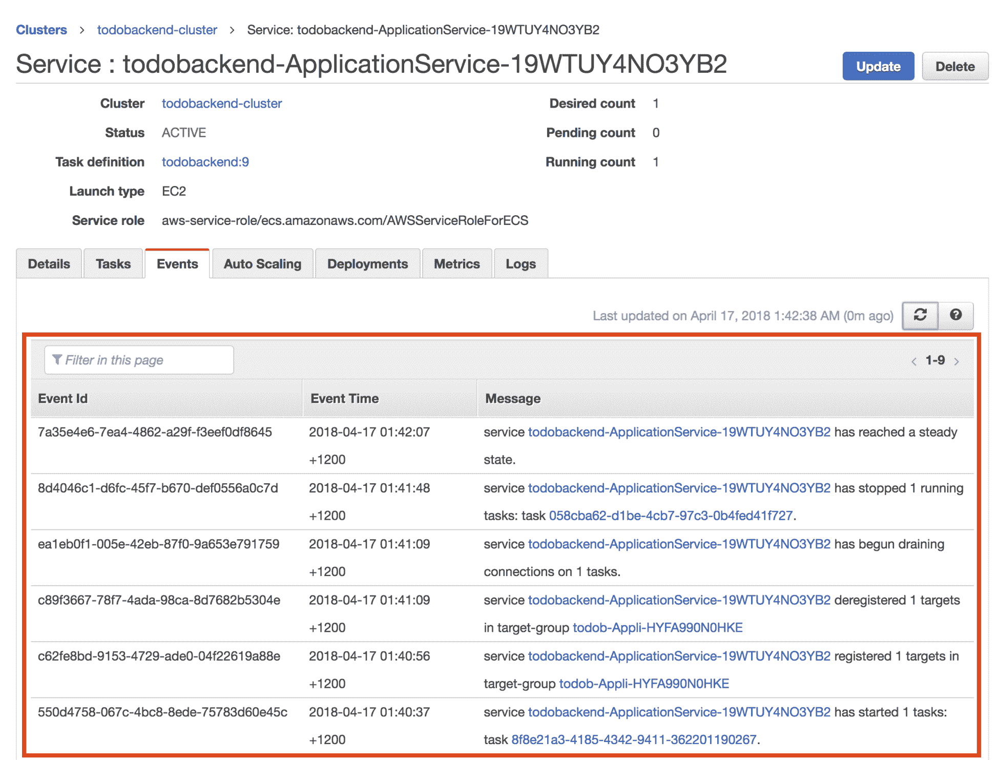

ECS service rolling deployment events

# 创建云信息自定义资源

尽管我们的应用已经部署并正在运行，但我们显然有一个问题，那就是我们没有运行数据库迁移，这是一项必需的部署任务。我们已经处理了运行另一个部署任务，即收集静态文件，但是数据库迁移应该只作为每个部署的*单个*部署任务运行。例如，如果您正在部署服务的多个实例，您不想为您部署的每个实例运行迁移，您只想在每个部署中运行一次迁移，而不考虑服务中的实例数量。

一个显而易见的解决方案是在每次部署后手动运行迁移，但是理想情况下，您希望部署完全自动化，并确保有一个自动运行迁移的机制。cloud information 不提供允许您运行一次性 ECS 任务的资源，但是 cloud information 的一个极其强大的功能是能够创建您自己的自定义资源，这允许您执行自定义资源调配任务。创建自定义资源的一个好处是，您可以将自定义资源调配任务合并到部署各种 AWS 服务和资源的工作流中，使用 CloudFormation 框架来为您管理。

现在让我们了解如何创建一个简单的 ECS 任务运行器自定义资源，该资源将运行迁移任务，作为通过云信息创建和更新应用环境的一部分。

# 了解云信息定制资源

在开始配置云信息定制资源之前，值得讨论一下它们实际上是如何工作的，并描述组成定制资源的关键组件。

下图说明了云信息自定义资源的工作方式:

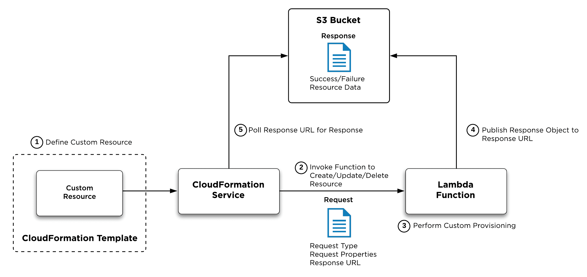

CloudFormation custom resources

在上图中，当您在云信息模板中使用自定义资源时，会发生以下步骤:

1.  您需要在您的云信息模板中定义自定义资源。自定义资源具有`AWS::CloudFormation::CustomResource`资源类型，或者`Custom::<resource-name>`。当 CloudFormation 遇到自定义资源时，它会寻找一个名为`ServiceToken`的特定属性，该属性为 Lambda 函数的 ARN 提供了一个应该提供自定义资源的属性。
2.  CloudFormation 调用 Lambda 函数，并以 JSON 对象的形式将自定义资源请求传递给该函数。事件有一个请求类型，它定义请求是创建、更新还是删除资源，并包括请求属性，这些属性是您可以在自定义资源定义中定义的自定义属性，将传递给 Lambda 函数。请求的另一个重要属性是响应 URL，它提供了一个预签名的 S3 URL，一旦配置完成，Lambda 函数应该在其中发布响应。

3.  Lambda 函数处理自定义资源请求，并根据请求类型和请求属性执行适当的资源供应。一旦供应完成，该功能向在定制资源请求中接收的响应 URL 发布成功或失败响应，并且在资源已经被创建或更新的情况下包括资源标识符。假设响应表示成功，则响应可以包括`Data`属性，该属性可以包括关于所提供的定制资源的有用信息，该定制资源可以使用标准的`!Sub ${<resource-name>.<data-property>}`语法在云信息栈的其他地方引用，其中`<data-property>`是包括在响应的`Data`属性中的属性。
4.  云信息服务轮询响应的响应网址。一旦收到响应，CloudFormation 将解析响应并继续栈供应(或在响应指示失败的情况下回滚栈)。

# 创建自定义资源 Lambda 函数

如前一节所述，自定义资源要求您创建一个 Lambda 函数，该函数处理 cloud information 发送的传入事件，执行自定义配置操作，然后使用预签名的 S3 URL 响应 cloud information。

这听起来相当复杂，但是有许多可用的工具可以以相对简单的方式实现简单的用例，如下例所示:

```
...
...
Resources:
 EcsTaskRunner:
 Type: AWS::Lambda::Function
    DependsOn:
 - EcsTaskRunnerLogGroup
 Properties:
 FunctionName: !Sub ${AWS::StackName}-ecsTasks
 Description: !Sub ${AWS::StackName} ECS Task Runner
 Handler: index.handler
 MemorySize: 128
 Runtime: python3.6
 Timeout: 300
      Role: !Sub ${EcsTaskRunnerRole.Arn}
 Code:
 ZipFile: |
 import cfnresponse
 import boto3

 client = boto3.client('ecs')

 def handler(event, context):
 try:
              print("Received event %s" % event)
              if event['RequestType'] == 'Delete':
                cfnresponse.send(event, context, cfnresponse.SUCCESS, {}, event['PhysicalResourceId'])
                return
              tasks = client.run_task(
                cluster=event['ResourceProperties']['Cluster'],
                taskDefinition=event['ResourceProperties']['TaskDefinition'],
                overrides=event['ResourceProperties'].get('Overrides',{}),
                count=1,
                startedBy=event['RequestId']
              )
              task = tasks['tasks'][0]['taskArn']
              print("Started ECS task %s" % task)
              waiter = client.get_waiter('tasks_stopped')
              waiter.wait(
                cluster=event['ResourceProperties']['Cluster'],
                tasks=[task],
              )
              result = client.describe_tasks(
                cluster=event['ResourceProperties']['Cluster'],
                tasks=[task]
              )
              exitCode = result['tasks'][0]['containers'][0]['exitCode']
              if exitCode > 0:
                print("ECS task %s failed with exit code %s" % (task, exitCode))
                cfnresponse.send(event, context, cfnresponse.FAILED, {}, task)
              else:
                print("ECS task %s completed successfully" % task)
                cfnresponse.send(event, context, cfnresponse.SUCCESS, {}, task)
            except Exception as e:
              print("A failure occurred with exception %s" % e)
              cfnresponse.send(event, context, cfnresponse.FAILED, {})
 EcsTaskRunnerRole:
 Type: AWS::IAM::Role
 Properties:
 AssumeRolePolicyDocument:
 Version: "2012-10-17"
 Statement:
 - Effect: Allow
 Principal:
 Service: lambda.amazonaws.com
 Action:
 - sts:AssumeRole
 Policies:
 - PolicyName: EcsTaskRunnerPermissions
 PolicyDocument:
 Version: "2012-10-17"
 Statement:
 - Sid: EcsTasks
 Effect: Allow
 Action:
 - ecs:DescribeTasks
 - ecs:ListTasks
 - ecs:RunTask
 Resource: "*"
 Condition:
 ArnEquals:
 ecs:cluster: !Sub ${ApplicationCluster.Arn}
 - Sid: ManageLambdaLogs
 Effect: Allow
 Action:
 - logs:CreateLogStream
 - logs:PutLogEvents
 Resource: !Sub ${EcsTaskRunnerLogGroup.Arn}
 EcsTaskRunnerLogGroup:
 Type: AWS::Logs::LogGroup
 Properties:
 LogGroupName: !Sub /aws/lambda/${AWS::StackName}-ecsTasks
 RetentionInDays: 7
  ApplicationService:
    Type: AWS::ECS::Service
...
...
```

Creating an inline Lambda function using CloudFormation

前面例子中最重要的一个方面是`EcsTaskRunner`资源中的`Code.ZipFile`属性，它定义了一个内联 Python 脚本来执行自定义资源的自定义配置操作。注意这种定义代码内联的方法通常不推荐用于现实世界的用例，在后面的章节中，我们将为 Lambda 函数代码创建一个更复杂的定制资源，并有自己的源代码库，但是为了保持这个例子的简单并介绍定制资源的核心概念，我现在使用的是内联方法。

# 了解自定义资源功能代码

让我们集中讨论自定义资源函数代码，我在前面的示例中已经隔离了它，并添加了注释来描述各种语句正在做什么。

```
# Generates an appropriate CloudFormation response and posts to the pre-signed S3 URL
import cfnresponse
# Imports the AWS Python SDK (boto3) for interacting with the ECS service
import boto3

# Create a client for interacting with the ECS service
client = boto3.client('ecs')

# Lambda functions require a handler function that is passed an event and context object
# The event object contains the CloudFormation custom resource event
# The context object contains runtime information about the Lambda function
def handler(event, context):
  # Wrap the code in a try/catch block to ensure any exceptions generate a failure
  try:
    print("Received event %s" % event)
    # If the request is to Delete the resource, simply return success
    if event['RequestType'] == 'Delete':
      cfnresponse.send(event, context, cfnresponse.SUCCESS, {}, event.get('PhysicalResourceId'))
      return
    # Run the ECS task
    # http://boto3.readthedocs.io/en/latest/reference/services/ecs.html#ECS.Client.run_task
    # Requires 'Cluster', 'TaskDefinition' and optional 'Overrides' custom resource properties
    tasks = client.run_task(
      cluster=event['ResourceProperties']['Cluster'],
      taskDefinition=event['ResourceProperties']['TaskDefinition'],
      overrides=event['ResourceProperties'].get('Overrides',{}),
      count=1,
      startedBy=event['RequestId']
    )
    # Extract the ECS task ARN from the return value from the run_task call
    task = tasks['tasks'][0]['taskArn']
    print("Started ECS task %s" % task)

    # Creates a waiter object that polls and waits for ECS tasks to reached a stopped state
    # http://boto3.readthedocs.io/en/latest/reference/services/ecs.html#waiters
    waiter = client.get_waiter('tasks_stopped')
    # Wait for the task ARN that was run earlier to stop
    waiter.wait(
      cluster=event['ResourceProperties']['Cluster'],
      tasks=[task],
    )
    # After the task has stopped, get the status of the task
    # http://boto3.readthedocs.io/en/latest/reference/services/ecs.html#ECS.Client.describe_tasks
    result = client.describe_tasks(
      cluster=event['ResourceProperties']['Cluster'],
      tasks=[task]
    )
    # Get the exit code of the container that ran
    exitCode = result['tasks'][0]['containers'][0]['exitCode']
    # Return failure for non-zero exit code, otherwise return success
    # See https://docs.aws.amazon.com/AWSCloudFormation/latest/UserGuide/aws-properties-lambda-function-code.html for more details on cfnresponse module
    if exitCode > 0:
      print("ECS task %s failed with exit code %s" % (task, exitCode))
      cfnresponse.send(event, context, cfnresponse.FAILED, {}, task)
else:
      print("ECS task %s completed successfully" % task)
      cfnresponse.send(event, context, cfnresponse.SUCCESS, {}, task)
  except Exception as e:
    print("A failure occurred with exception %s" % e)
    cfnresponse.send(event, context, cfnresponse.FAILED, {})
```

Creating an inline Lambda function using CloudFormation

在高层次上，自定义资源函数接收 CloudFormation 自定义资源事件，并从 AWS Python SDK 调用 ECS 服务的`run_task`方法，传入 ECS 集群、ECS 任务定义和可选覆盖来执行。然后，该函数等待任务完成，检查 ECS 任务的结果以确定关联的容器是否成功完成，然后以成功或失败来响应云信息。

请注意，该函数导入了一个名为`cfnresponse`的模块，该模块包含在 AWS Lambda Python 运行时环境中，为响应 CloudFormation 自定义资源请求提供了一个简单的高级机制。该函数还导入了一个名为`boto3`的模块，该模块提供了 AWS Python SDK，并用于创建一个`client`对象，该对象专门与 ECS 服务交互。然后，Lambda 函数定义了一个名为`handler`的函数，这是传递给 Lambda 函数的新事件的入口点，请注意，`handler`函数必须接受一个包含 CloudFormation 自定义资源事件的`event`对象和一个提供 Lambda 环境运行时信息的`context`对象。请注意，该函数应该只尝试为 CloudFormation 创建和更新请求运行一个任务，并且可以在收到删除自定义资源的请求时简单地返回成功，因为给定的任务是短期资源。

The code in the preceding example is by no means production-level code and has been simplified for demonstration purposes to only handle two primary scenarios related to success and failure.

# 了解自定义资源 Lambda 函数资源

现在您已经理解了 Lambda 函数代码的实际工作原理，让我们关注您在前面的示例中添加的配置的剩余部分。

`EcsTaskRunner`资源定义了 Lambda 函数，这里描述了关键配置属性:

*   `FunctionName`:函数的名称。要理解函数命名的一个重要方面是，用于存储函数日志的相关 CloudWatch 日志组必须遵循`/aws/lambda/<function-name>`的命名约定，并且您可以看到`FunctionName`属性与`EcsTaskRunnerLogGroup`资源的`LogGroupName`属性相匹配。请注意，`EcsTaskRunner`还必须根据`DependsOn`设置的配置声明对`EcsTaskRunnerLogGroup`资源的依赖。
*   `Handler`:以`<module>.<function>`格式指定 Lambda 函数的入口点。请注意，当使用内联代码机制时，为您的 Lambda 函数创建的模块将始终被称为`index`。
*   `Timeout`:重要的是要明白，在写的时候，Lambda 有一个最大的五分钟(300 秒)超时，这意味着你的功能必须在五分钟内完成，否则它们将被终止。Lambda 函数的默认超时时间为 3 秒，由于部署新的 ECS 任务、运行 ECS 任务并等待任务完成确实需要时间，因此该超时时间已增加到 300 秒的最大超时时间。
*   `Role`:定义要分配给 Lambda 函数的 IAM 角色。请注意，引用的`EcsTaskRunnerRole`资源必须信任 lambda.amazonaws.com，如果您想要捕获任何日志，至少每个 Lambda 函数都必须有权限写入关联的 CloudWatch 日志组。ECS 任务运行器功能需要运行和描述 ECS 任务的权限，条件的使用被配置为仅将这些权限授予栈中定义的 ECS 集群。

# 创建自定义资源

既然您的定制资源 Lambda 函数和相关的支持资源已经就绪，您就可以定义实际的定制资源对象了。对于我们的用例，我们需要定义一个自定义资源，该资源将在我们的应用容器中运行`python3 manage.py migrate`命令，并且给定迁移任务与应用数据库交互，该任务必须配置定义与应用数据库资源连接的各种数据库环境变量。

一种方法是利用您之前创建的`ApplicationTaskDefinition`资源并指定一个命令覆盖，然而一个问题是`ApplicationTaskDefinition`包含`collectstatic`容器，我们并不真的希望在您运行迁移时运行该容器。为了克服这一点，您需要创建一个名为`MigrateTaskDefinition`的单独任务定义，它只包含一个专门运行数据库迁移的容器定义:

```
...
...
Resources:
 MigrateTaskDefinition:
    Type: AWS::ECS::TaskDefinition
 Properties:
 Family: todobackend-migrate
 ContainerDefinitions:
 - Name: migrate
 Image: !Sub ${AWS::AccountId}.dkr.ecr.${AWS::Region}.amazonaws.com/docker-in-aws/todobackend:${ApplicationImageTag}
 MemoryReservation: 5
 Cpu: 5
 Environment:
 - Name: DJANGO_SETTINGS_MODULE
 Value: todobackend.settings_release
 - Name: MYSQL_HOST
 Value: !Sub ${ApplicationDatabase.Endpoint.Address}
 - Name: MYSQL_USER
 Value: todobackend
 - Name: MYSQL_PASSWORD
 Value: !Ref DatabasePassword
 - Name: MYSQL_DATABASE
 Value: todobackend
Command: 
 - python3
 - manage.py
 - migrate
 - --no-input
 LogConfiguration:
 LogDriver: awslogs
 Options:
 awslogs-group: !Sub /${AWS::StackName}/ecs/todobackend
 awslogs-region: !Ref AWS::Region
 awslogs-stream-prefix: docker
  EcsTaskRunner:
    Type: AWS::Lambda::Function
...
...

```

Creating a migrate task definition

在前面的示例中，请注意`MigrateTaskDefinition`资源需要配置与数据库相关的环境变量，但是不需要您之前在`ApplicationTaskDefinition`资源中配置的卷映射或端口映射。

有了这个任务定义，您现在可以创建自定义资源，如下例所示:

```
...
...
Resources:
 MigrateTask:
 Type: AWS::CloudFormation::CustomResource
 DependsOn:
 - ApplicationAutoscaling
 - ApplicationDatabase
 Properties:
 ServiceToken: !Sub ${EcsTaskRunner.Arn}
 Cluster: !Ref ApplicationCluster
 TaskDefinition: !Ref MigrateTaskDefinition MigrateTaskDefinition:
     Type: AWS::ECS::TaskDefinition
   ...
   ...
   ApplicationService:
    Type: AWS::ECS::Service
    DependsOn:
      - ApplicationAutoscaling
      - ApplicationLogGroup
      - ApplicationLoadBalancerHttpListener
 - MigrateTask
Properties:
...
...
```

Creating a migrate task custom resource

在前面的示例中，请注意您的自定义资源是使用`AWS::CloudFormation::CustomResource`类型创建的，并且您创建的每个自定义资源都必须包含`ServiceToken`属性，该属性引用相关自定义资源 Lambda 函数的 ARN。其余的属性特定于您的自定义资源函数，在我们的例子中，它必须至少指定需要执行的任务的目标 ECS 集群和 ECS 任务定义。请注意，自定义资源包含依赖项，以确保它仅在创建`ApplicationAutoscaling`和`ApplicationDatabase`资源后运行，并且您还需要在本章前面创建的`ApplicationService`资源上添加依赖项，以便在`MigrateTask`自定义资源成功完成之前不会创建或更新该资源。

# 部署自定义资源

您现在可以使用`aws cloudformation deploy`命令部署您的更改了。部署云信息栈更改时，一旦云信息开始创建自定义资源并调用您的 Lambda 函数，您就可以导航到 AWS Lambda 控制台来查看您的 Lambda 函数并检查函数日志。

CloudFormation custom resources can be time-consuming to initially get working, particularly if your code throws exceptions and you don't have appropriate code to catch these exceptions and send failure responses. It is possible for you to end up waiting several hours for a custom resource action to timeout, because your custom resource threw an exception and did not return an appropriate failure response to CloudFormation.

下面的截图演示了如何在 AWS Lambda 控制台中查看从您的云信息栈创建的`todobackend-ecsTasks` Lambda 函数:

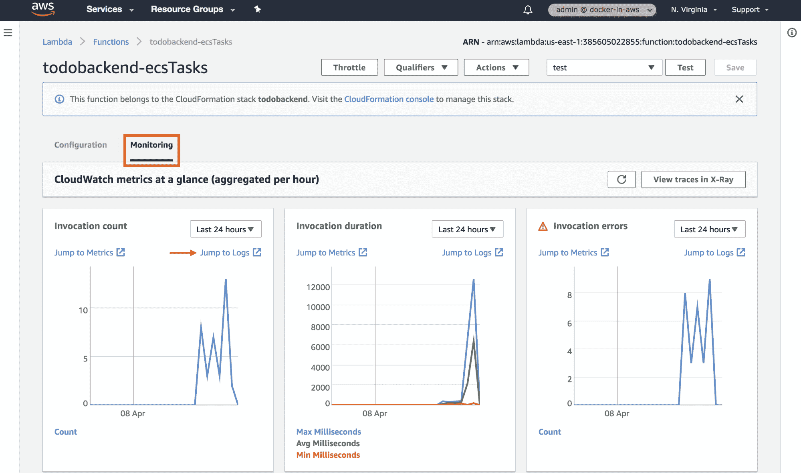

Viewing Lambda functions in the AWS console

在前面的截图中，**配置**选项卡提供了关于您的函数的配置细节，甚至包括一个内联代码编辑器，您可以在其中查看、测试和调试您的代码。**监控**选项卡提供对您的功能的各种指标的访问，并包括一个有用的**跳转到日志**链接，该链接将您直接带到 CloudWatch 日志中您的功能的日志:

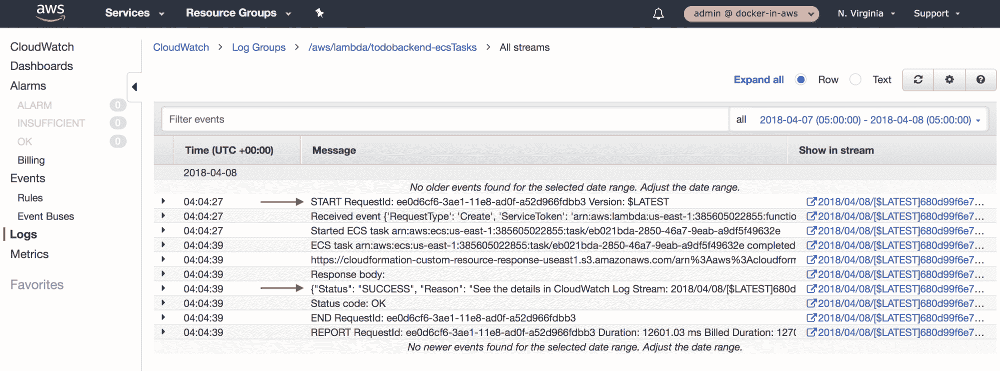

Viewing Lambda function logs in the AWS console

在前面的截图中，START 消息指示了函数被调用的时间，您可以看到一个状态为 SUCCESS 的响应主体被生成，它被发布到 CloudFormation 自定义资源响应 URL。

现在也是查看您的 ecs 任务的 CloudWatch 日志的好时机—显示了**/todo backnd/ECS/todo backnd**日志组，这是在您的 CloudFormation 栈中配置的日志组，它收集应用的所有 ECS 任务日志。请注意，有几个日志流——一个用于生成静态任务的**收集静态**容器，一个用于运行迁移的**迁移**容器，以及一个用于主到后台应用的日志流。请注意，每个日志流都在日志流名称的末尾包含 ECS 任务标识-这些与您使用 ECS 控制台或 AWS CLI 交互的 ECS 任务标识直接相关:


ECS log groups in CloudWatch logs

# 验证应用

作为最后的检查，示例应用现在应该完全正常工作了——例如，在早期失败的 todos 链接现在应该可以工作了，如下面的屏幕截图所示。

您可以与 API 交互来添加或删除待办事项，现在您的所有待办事项都将保存在栈中定义的应用数据库中:

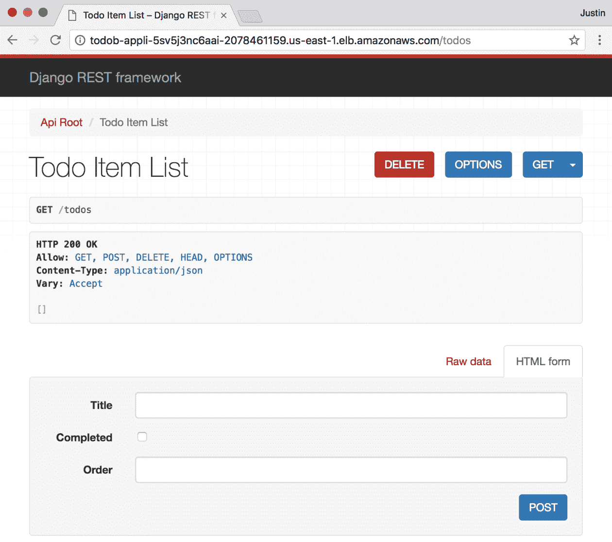

Working todobackend application

# 摘要

在本章中，您使用 ECS 成功地将示例 Docker 应用部署到了 AWS。您学习了如何定义关键的支持应用和基础架构资源，包括如何使用 AWS RDS 服务创建应用数据库，以及如何将您的 ECS 应用与 AWS 弹性负载平衡服务提供的应用负载平衡器集成。

有了这些支持资源，您学习了如何创建控制容器运行时配置的 ECS 任务定义，然后通过为示例应用创建 ECS 服务，将 ECS 任务定义的实例部署到 ECS 集群。您学习了 ECS 任务定义如何定义卷和多个容器定义，并使用此功能创建了一个独立的非必需容器定义，该定义总是在部署 ECS 任务定义时运行，并为示例应用生成静态 web 文件。您还将示例应用的 ECS 服务与栈中的各种应用负载平衡器资源集成在一起，确保以高度可用的方式在 ECS 服务的多个实例之间对应用的连接进行负载平衡。

虽然您能够成功地将您的应用部署为 ECS 服务，但是您发现您的应用没有完全运行，因为为您的应用数据库建立模式和表的数据库迁移还没有运行。您通过创建 ECS 任务运行器云信息定制资源解决了这个问题，该资源允许您在每个应用部署中将迁移作为单次任务运行。自定义资源被定义为用 Python 编写的简单 Lambda 函数，它首先在给定的 ECS 集群上为给定的 ECS 任务定义运行一个任务，等待任务完成，然后根据与任务相关联的容器的退出代码报告任务的成功或失败。

有了这个定制资源，您的示例应用现在已经完全正常运行了，尽管它仍然有一些不足。在下一章中，我们将解决其中的一个缺陷，即机密管理和确保密码保密，这对安全的生产级 Docker 应用至关重要。

# 问题

1.  对/错:无线电数据系统实例要求您创建至少有两个子网的数据库子网组。
2.  配置应用负载平衡器时，哪些组件服务终端用户的前端连接？
3.  对/错:在创建应用负载平衡器侦听器之前，目标组可以接受来自目标的注册。
4.  当配置允许应用数据库和 ECS 容器实例之间访问的安全组规则时，您会收到一个关于循环依赖关系的 CloudFormation 错误。您可以使用什么类型的资源来解决这个问题？
5.  您可以配置包含两个容器定义的 ECS 任务定义。其中一个容器定义执行一个简短的配置任务，然后退出。您发现 ECS 正在根据此任务定义持续重新启动 ECS 服务。您如何解决这个问题？
6.  您可以配置哪个 CloudFormation 参数来定义对其他资源的显式依赖？
7.  true/False:cloud information 自定义资源使用 AWS Lambda 函数来执行自定义资源调配任务。
8.  当接收 CloudFormation 自定义资源事件时，您需要处理哪三种类型的事件？
9.  您创建了一个带有内联 Python 函数的 Lambda 函数，该函数执行自定义配置任务，但是当试图查看该函数的日志时，不会向 CloudWatch 日志中写入任何内容。您确认日志组名称已为该功能正确配置。问题最可能的原因是什么？

# 进一步阅读

有关本章所涵盖主题的更多信息，您可以查看以下链接:

*   CloudFormation RDS 实例资源参考:[https://docs . AWS . Amazon . com/AWS cloud information/latest/user guide/AWS-properties-RDS-database-Instance . html](https://docs.aws.amazon.com/AWSCloudFormation/latest/UserGuide/aws-properties-rds-database-instance.html)
*   CloudFormation 应用负载平衡器资源参考:[https://docs . AWS . Amazon . com/AWS cloud information/latest/user guide/AWS-Resource-elastic cloadbalancing v2-Load Balancer . html](https://docs.aws.amazon.com/AWSCloudFormation/latest/UserGuide/aws-resource-elasticloadbalancingv2-loadbalancer.html)
*   CloudFormation 应用负载平衡器侦听器资源参考:[https://docs . AWS . Amazon . com/AWS cloud information/latest/user guide/AWS-Resource-elastic cloadbalancingv2-Listener . html](https://docs.aws.amazon.com/AWSCloudFormation/latest/UserGuide/aws-resource-elasticloadbalancingv2-listener.html)
*   CloudFormation 应用负载平衡器目标组资源参考:[https://docs . AWS . Amazon . com/AWS cloud information/latest/user guide/AWS-Resource-elastic cloadbalancingv2-Target Group . html](https://docs.aws.amazon.com/AWSCloudFormation/latest/UserGuide/aws-resource-elasticloadbalancingv2-targetgroup.html)
*   CloudFormation ECS 任务定义资源参考:[https://docs . AWS . Amazon . com/AWS cloud information/latest/user guide/AWS-Resource-ECS-Task Definition . html](https://docs.aws.amazon.com/AWSCloudFormation/latest/UserGuide/aws-resource-ecs-taskdefinition.html)
*   CloudFormation ECS 服务资源参考:[https://docs . AWS . Amazon . com/AWS cloud information/latest/user guide/AWS-Resource-ECS-Service . html](https://docs.aws.amazon.com/AWSCloudFormation/latest/UserGuide/aws-resource-ecs-service.html)
*   CloudFormation Lambda 函数资源参考:[https://docs . AWS . Amazon . com/AWS cloud information/latest/user guide/AWS-Resource-Lambda-Function . html](https://docs.aws.amazon.com/AWSCloudFormation/latest/UserGuide/aws-resource-lambda-function.html)
*   CloudFormation Lambda 函数代码:[https://docs . AWS . Amazon . com/AWS cloud information/latest/user guide/AWS-properties-Lambda-Function-Code . html](https://docs.aws.amazon.com/AWSCloudFormation/latest/UserGuide/aws-properties-lambda-function-code.html)
*   CloudFormation 自定义资源文档:[https://docs . AWS . Amazon . com/AWS cloud information/latest/user guide/template-Custom-resources . html](https://docs.aws.amazon.com/AWSCloudFormation/latest/UserGuide/template-custom-resources.html)
*   CloudFormation 自定义资源参考:[https://docs . AWS . Amazon . com/AWS cloud information/latest/user guide/crpg-ref . html](https://docs.aws.amazon.com/AWSCloudFormation/latest/UserGuide/crpg-ref.html)