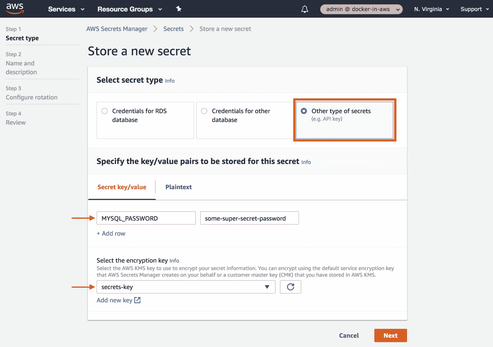
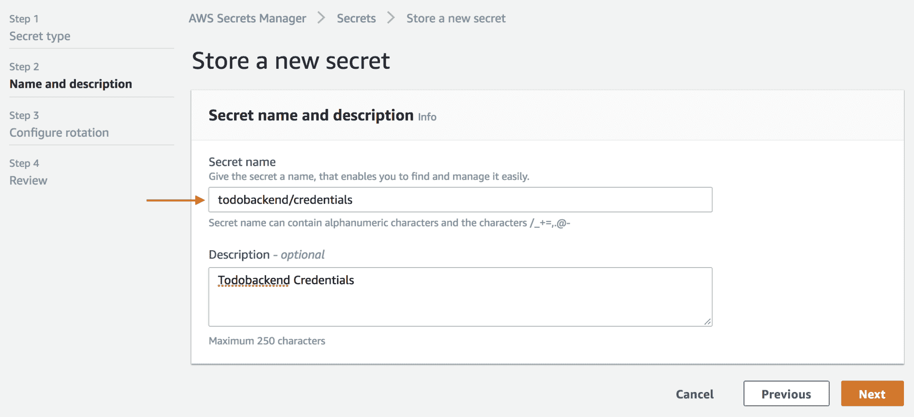
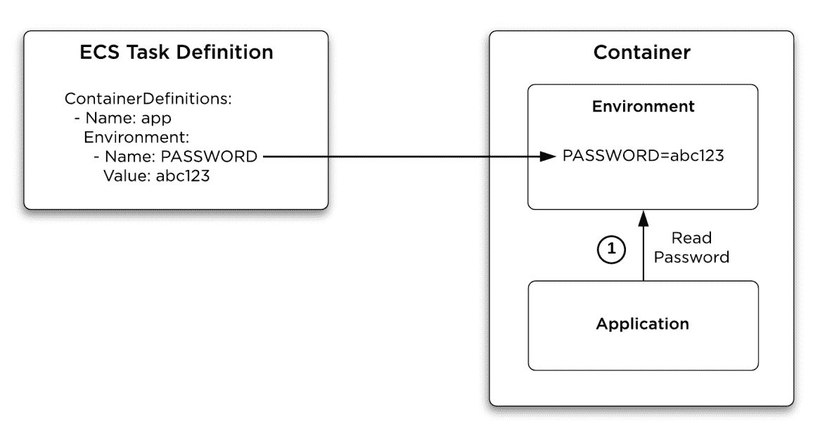
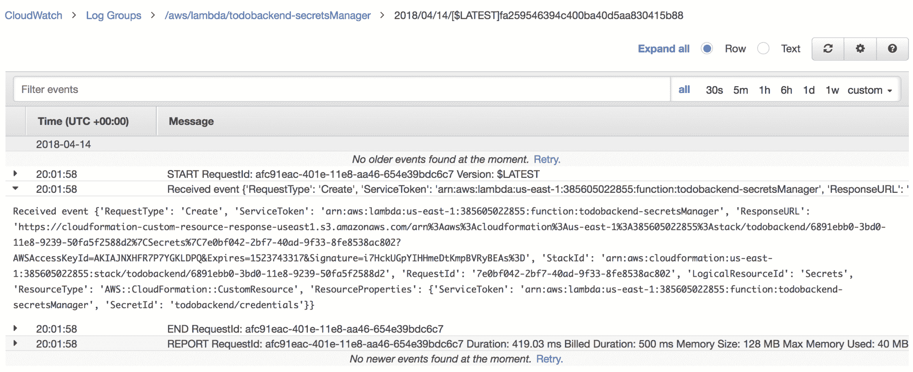

# 九、管理机密

机密管理是现代应用和系统的关键安全和操作要求。用户名和密码等凭据通常用于验证对可能包含私有和敏感数据的资源的访问，非常重要的一点是，您可以实现一个机密管理解决方案，该解决方案能够以安全的方式向您的应用提供这些凭据，而不会将它们暴露给未经授权的一方。

基于容器的应用的机密管理具有挑战性，部分原因是容器的短暂性以及在一次性和可重复的基础架构上运行容器的基本要求。可以将机密存储在本地文件中的长寿命服务器的时代已经一去不复返了——现在您的服务器是可以来去的 ECS 容器实例，您需要有某种机制能够在运行时将机密动态地注入到您的应用中。我们在本书中使用的一个天真的解决方案是使用环境变量将您的机密直接注入到您的应用中；但是，这种方法被认为是不安全的，因为它经常通过各种操作数据源以纯文本形式暴露您的机密。一个更可靠的解决方案是实现安全的凭据存储，您的应用可以在其中以安全的方式动态检索其机密—但是，设置自己的凭据存储可能成本高、耗时，并且会带来巨大的运营开销。

在本章中，您将实现一个简单而有效的机密管理解决方案，该解决方案由两个关键的 AWS 服务提供支持，即 AWS 机密管理器和密钥管理服务或 KMS。这些服务将为您提供基于云的安全凭据存储，该存储易于管理、经济高效，并与标准 AWS 安全控制(如 IAM 策略和角色)完全集成。您将学习如何通过在 Docker 映像中创建一个入口点脚本来集成任何支持通过环境变量进行配置的应用和您的机密管理解决方案，该脚本使用 AWS CLI 动态检索机密并将其安全地注入到您的内部容器环境中，还将学习当您使用 cloud information 部署环境时，如何将机密公开给 cloud information 栈中的其他资源。

将涵盖以下主题:

*   创建 KMS 密钥
*   使用自动气象站机密管理器创建机密
*   在容器启动时注入机密
*   使用云信息提供机密
*   向 AWS 部署机密

# 技术要求

下面列出了完成本章的技术要求:

*   对 AWS 帐户的管理员访问权限
*   根据第 3 章中的说明配置本地 AWS 配置文件
*   AWS CLI 版本 1.15.71 或更高版本
*   第 8 章需要与成功部署到 AWS 的示例应用一起完成

以下 GitHub URL 包含本章使用的代码示例–[https://GitHub . com/docker-in-AWS/docker-in-AWS/tree/master/ch9](https://github.com/docker-in-aws/docker-in-aws/tree/master/ch9)。

查看以下视频，了解《行动守则》:
[http://bit.ly/2LzpEY2](http://bit.ly/2LzpEY2)

# 创建 KMS 密钥

任何机密管理解决方案的一个关键构造块是使用加密密钥加密您的凭据的能力，这确保了您的凭据的隐私性和机密性。AWS 密钥管理服务(KMS)是一项托管服务，允许您创建和控制加密密钥，并提供简单、低成本的解决方案，消除了管理加密密钥的许多操作挑战。KMS 的主要特点包括集中式密钥管理、符合多项行业标准、内置审计以及与其他 AWS 服务的集成。

在构建使用 AWS 机密管理器的机密管理解决方案时，您至少应该在本地 AWS 帐户和区域中创建一个 KMS 密钥，用于加密您的机密。AWS 确实提供了一个默认的 KMS 密钥，您可以与 AWS 机密管理器一起使用，因此这不是一个严格的要求，但是，一般来说，您应该可以根据您的安全要求创建自己的 KMS 密钥。

您可以使用 AWS 控制台和命令行界面轻松创建 KMS 密钥，但是为了与采用基础架构作为代码的一般主题保持一致，我们将使用云信息创建一个新的 KMS 密钥。

以下示例演示了在新的云信息模板文件中创建 KMS 密钥和 KMS 别名，您可以将其放在 todobackend-aws 存储库的根目录下，我们称之为`kms.yml`:

```
AWSTemplateFormatVersion: "2010-09-09"

Description: KMS Keys

Resources:
  KmsKey:
    Type: AWS::KMS::Key
    Properties:
      Description: Custom key for Secrets
      Enabled: true
      KeyPolicy:
        Version: "2012-10-17"
        Id: key-policy
        Statement: 
          - Sid: Allow root account access to key
            Effect: Allow
            Principal:
              AWS: !Sub arn:aws:iam::${AWS::AccountId}:root
            Action:
              - kms:*
            Resource: "*"
  KmsKeyAlias:
    Type: AWS::KMS::Alias
    Properties:
      AliasName: alias/secrets-key
      TargetKeyId: !Ref KmsKey

Outputs:
  KmsKey:
    Description: Secrets Key KMS Key ARN
    Value: !Sub ${KmsKey.Arn}
    Export:
      Name: secrets-key
```

Creating KMS resources using CloudFormation

在前面的示例中，您创建了两个资源—一个名为`KmsKey`的`AWS::KMS::Key`资源，用于创建新的 KMS 密钥；另一个名为`KmsKeyAlias`的`AWS::KMS::Alias`资源，用于为密钥创建别名或友好名称。

`KmsKey`资源包括一个`KeyPolicy`属性，该属性定义了一个授予根帐户访问密钥的资源策略。这是对您创建的任何 KMS 密钥的要求，以确保您始终至少有一些访问密钥的方法，您可能已经使用这些方法来加密有价值的数据，如果密钥不可访问，将会给企业带来相当大的成本。

If you create a KMS key via the AWS console or CLI, the root account access policy will be automatically created for you.

上例中 CloudFormation 模板的一个有趣特性是创建 CloudFormation 导出，每当您向 CloudFormation 输出添加`Export`属性时，都会创建该导出。在前面的示例中，`KmsKey`输出导出了由`Value`属性指定的`KmsKey`资源的 ARN，而`Export`属性创建了一个云信息导出，您可以在其他云信息栈中引用它来注入导出的值，而不必显式指定导出的值。您将在本章后面看到如何利用这个 CloudFormation 导出，所以不要担心这会不会有意义。

有了前面示例的配置，假设您已经将此模板放在名为`kms.yml`的文件中，现在您可以部署新的栈，这将导致创建新的 KMS 密钥和 KMS 资源:

```
> export AWS_PROFILE=docker-in-aws
> aws cloudformation deploy --template-file kms.yml --stack-name kms
Enter MFA code for arn:aws:iam::385605022855:mfa/justin.menga:

Waiting for changeset to be created..
Waiting for stack create/update to complete
Successfully created/updated stack - kms
> aws cloudformation list-exports
{
    "Exports": [
        {
            "ExportingStackId": "arn:aws:cloudformation:us-east-1:385605022855:stack/kms/be0a6d20-3bd4-11e8-bf63-50faeaabf0d1",
            "Name": "secrets-key",
            "Value": "arn:aws:kms:us-east-1:385605022855:key/ee08c380-153c-4f31-bf72-9133b41472ad"
        }
    ]
}
```

Deploying KMS Keys using CloudFormation

在前面的示例中，创建 CloudFormation 栈后，请注意`aws cloudformation list-exports`命令现在列出了一个名为`secrets-key`的导出。此导出的值是栈中 KMS 密钥资源的 ARN，现在您可以使用其他云信息栈中的`Fn::ImportValue`内部函数，通过简单地引用`secrets-key`的导出名称(例如，`Fn::ImportValue: secrets-key`)来导入此值。

Be careful with your use of CloudFormation exports. These exports are intended for referencing resources that are static in nature whose value that you are exporting will never change in the future. Once a CloudFormation export is referenced by another stack you cannot change the value of that export, nor delete the resource or stack that the export belongs to. CloudFormation exports are useful for resources such as IAM roles, KMS keys and network infrastructure (for example, VPCs and subnets), which often are very static in nature and do not change once implemented.

# 使用 KMS 加密和解密数据

现在您已经创建了一个 KMS 密钥，您可以使用这个密钥来加密和解密数据。

以下示例演示了如何使用 AWS 命令行界面加密简单的纯文本值:

```
> aws kms encrypt --key-id alias/secrets-key --plaintext "Hello World"
{
    "CiphertextBlob": "AQICAHifCoHWAYb859mOk+pmJ7WgRbhk58UL9mhuMIcVAKJ18gHN1/SRRhwQVoVJvDS6i7MoAAAAaTBnBgkqhkiG9w0BBwagWjBYAgEAMFMGCSqGSIb3DQEHATAeBglghkgBZQMEAS4wEQQMYm4au5zNZG9wa5ceAgEQgCZdADZyWKTcwDfTpw60kUI8aIAtrECRyW+/tu58bYrMaZFlwVYmdA==",
    "KeyId": "arn:aws:kms:us-east-1:385605022855:key/ee08c380-153c-4f31-bf72-9133b41472ad"
}
```

Encrypting Data Using a KMS Key

在前面的示例中，请注意，您必须使用`--key-id`标志指定 KMS 密钥 ID 或别名，并且每当您使用 KMS 密钥别名时，您总是在别名前面加上`alias/<alias-name>`。加密数据在`CiphertextBlob`属性中作为 Base64 编码的二进制 blob 返回，这也方便地将加密 KMS 密钥的密钥 ID 编码到加密数据中，这意味着 KMS 服务可以解密密文 blob，而无需您明确指定加密 KMS 密钥 ID:

```
> ciphertext=$(aws kms encrypt --key-id alias/secrets-key --plaintext "Hello World" --query CiphertextBlob --output text)
> aws kms decrypt --ciphertext-blob fileb://<(echo $ciphertext | base64 --decode)
{
    "KeyId": "arn:aws:kms:us-east-1:385605022855:key/ee08c380-153c-4f31-bf72-9133b41472ad",
    "Plaintext": "SGVsbG8gV29ybGQ="
}
```

Decrypting Data Using a KMS Key

在前面的示例中，您加密了一些数据，这次使用 AWS CLI 查询和文本输出选项来捕获名为`ciphertext`的 bash 变量中的`CiphertextBlob`属性值。然后使用`aws kms decrypt`命令将密文作为 blob 文件传递，使用 bash 进程替换将密文的 Base64 解码值送入二进制文件 URI 指示器(`fileb://`)。请注意，返回的`Plaintext`值不是您最初加密的`Hello World`值，这是因为`Plaintext`值采用的是 Base64 编码格式，下面的示例将`aws kms decrypt`命令向前推进了一步，以返回原始明文值:

```
> aws kms decrypt --ciphertext-blob fileb://<(echo $ciphertext | base64 --decode) \
    --query Plaintext --output text | base64 --decode
Hello World
```

Decrypting Data Using a KMS Key and Returning the Plaintext Value The `base64 --decode` command in the previous two examples are used to decode Base64 values on MacOS and most Linux platforms. On some Linux platforms such as Alpine Linux, the `--decode` flag is not recognized and you instead must use the `base64 -d` command.

# 使用自动气象站机密管理器创建机密

您已经建立了一个可用于加密和解密数据的 KMS 密钥，现在您可以将该密钥与 AWS 机密管理器服务集成，这是一项于 2018 年 3 月推出的托管服务，使您能够轻松且经济高效地将机密管理纳入您的应用。

# 使用 AWS 控制台创建机密

虽然在过去的几章中，我们一直专注于通过云信息创建 AWS 资源，但不幸的是，在撰写本文时，云信息不支持 AWS 机密管理器资源，因此，如果您使用 AWS 工具，您需要通过 AWS 控制台或 AWS 命令行界面提供您的机密。

要通过 AWS 控制台创建新的机密，请从服务列表中选择 AWS 机密管理器，然后单击**存储新机密**按钮。选择**的机密类型其他类型的机密**，指定机密密钥和值，并选择您在本章前面创建的`secrets-key` KMS 密钥，如下图所示:



Creating a New Secret using AWS Secrets Manager

在前面的示例中，请注意 AWS 机密管理器允许您在单个机密中存储多个密钥/值对。这一点很重要，因为您经常希望将机密作为环境变量注入，所以以键/值格式存储机密允许您将环境变量名指定为键，将机密指定为值。

单击“下一步”后，您可以配置机密名称和可选描述:



Configuring Secret Name and Description

在前面的截图中，您配置了名为`todobackend/credentials`的机密，我们将在本章后面的 todobackend 应用中使用它。一旦你配置了一个机密名称和描述，你可以点击**下一步**，跳过**配置自动旋转**部分，最后点击**存储**按钮完成机密的创建。

# 使用 AWS 命令行界面创建机密

您也可以使用`aws secretsmanager create-secret`命令通过 AWS 命令行界面创建机密:

```
> aws secretsmanager create-secret --name test/credentials --kms-key-id alias/secrets-key \
 --secret-string '{"MYSQL_PASSWORD":"some-super-secret-password"}'
{
    "ARN": "arn:aws:secretsmanager:us-east-1:385605022855:secret:test/credentials-l3JdTI",
    "Name": "test/credentials",
    "VersionId": "beab75bd-e9bc-4ac8-913e-aca26f6e3940"
}
```

Creating a Secret Using the AWS CLI

在前面的示例中，请注意，您将机密字符串指定为 JSON 对象，它提供了您之前看到的键/值格式。

# 使用 AWS 命令行界面检索机密

您可以使用`aws secretsmanager get-secret-value`命令通过 AWS 命令行界面检索机密:

```
> aws secretsmanager get-secret-value --secret-id test/credentials
{
    "ARN": "arn:aws:secretsmanager:us-east-1:385605022855:secret:test/credentials-l3JdTI",
    "Name": "test/credentials",
    "VersionId": "beab75bd-e9bc-4ac8-913e-aca26f6e3940",
    "SecretString": "{\"MYSQL_PASSWORD\":\"some-super-password\"}",
    "VersionStages": [
        "AWSCURRENT"
    ],
    "CreatedDate": 1523605423.133
}
```

Obtain a Secret Value Using the AWS CLI

在本章的后面，您将为示例应用容器创建一个自定义入口点脚本，它将使用前面示例中的命令在启动时向应用容器环境注入机密。

# 使用 AWS 命令行界面更新机密

回想一下第 8 章，驱动 todobackend 应用的 Django 框架需要配置一个名为`SECRET_KEY`的环境变量，该变量用于各种加密操作。在本章的前面，当您创建**信任/凭证**机密时，您只为用于数据库密码的`MYSQL_PASSWORD`变量创建了一个键/值对。

让我们看看现在如何更新**的 todo back/credentials**机密，为`SECRET_KEY`变量添加一个值。您可以通过运行`aws secretsmanager update-secret`命令，引用机密的标识并指定新的机密值来更新机密:

```
> aws secretsmanager get-random-password --password-length 50 --exclude-characters "'\""
{
    "RandomPassword": "E2]eTfO~8Z5)&amp;0SlR-&amp;XQf=yA:B(`,p.B#R6d]a~X-vf?%%/wY"
}
> aws secretsmanager update-secret --secret-id todobackend/credentials \
    --kms-key-id alias/secrets-key \
    --secret-string '{
 "MYSQL_PASSWORD":"some-super-secret-password",
 "SECRET_KEY": "E2]eTfO~8Z5)&amp;0SlR-&amp;XQf=yA:B(`,p.B#R6d]a~X-vf?%%/wY"
 }'
{
    "ARN": "arn:aws:secretsmanager:us-east-1:385605022855:secret:todobackend/credentials-f7AQlO",
    "Name": "todobackend/credentials",
    "VersionId": "cd258b90-d108-4a06-b0f2-849be15f9c33"
}
```

Updating a Secret Value Using the AWS CLI

在前面的例子中，请注意，您可以使用`aws secretsmanager get-random-password`命令为您生成一个随机密码，这对于`SECRET_KEY`变量来说是理想的。从这个机密中排除使用`--exclude-characters`的引号和引号字符是很重要的，因为这些字符通常会导致处理这些值的 bash 脚本出现问题。

然后运行`aws secretsmanager update-secret`命令，指定正确的 KMS 键标识，并提供一个包含`MYSQL_PASSWORD`和`SECRET_KEY`键/值对的更新的 JSON 对象。

# 使用 AWS 命令行界面删除和恢复机密

删除机密可以通过运行`aws secretsmanager delete-secret`命令来实现，如下例所示:

```
> aws secretsmanager delete-secret --secret-id test/credentials
{
    "ARN": "arn:aws:secretsmanager:us-east-1:385605022855:secret:test/credentials-l3JdTI",
    "Name": "test/credentials",
    "DeletionDate": 1526198116.323
}
```

Deleting a Secret Value Using the AWS CLI

请注意，AWS 机密管理器不会立即删除您的机密，而是计划在 30 天内删除机密。在此期间，机密不可访问，但是可以在计划删除日期之前恢复，如下例所示:

```
> aws secretsmanager delete-secret --secret-id todobackend/credentials
{
    "ARN": "arn:aws:secretsmanager:us-east-1:385605022855:secret:todobackend/credentials-f7AQlO",
    "Name": "todobackend/credentials",
    "DeletionDate": 1526285256.951
}
> aws secretsmanager get-secret-value --secret-id todobackend/credentials
An error occurred (InvalidRequestException) when calling the GetSecretValue operation: You can’t perform this operation on the secret because it was deleted.

> aws secretsmanager restore-secret --secret-id todobackend/credentials
{
    "ARN": "arn:aws:secretsmanager:us-east-1:385605022855:secret:todobackend/credentials-f7AQlO",
    "Name": "todobackend/credentials"
}

> aws secretsmanager get-secret-value --secret-id todobackend/credentials \
 --query SecretString --output text
{
  "MYSQL_PASSWORD":"some-super-secret-password",
  "SECRET_KEY": "E2]eTfO~8Z5)&amp;0SlR-&amp;XQf=yA:B(`,p.B#R6d]a~X-vf?%%/wY"
}
```

Restoring a Secret Value Using the AWS CLI

您可以看到，在删除机密后，您无法访问该机密，但是，一旦您使用`aws secretsmanager restore-secret`命令恢复机密，您就可以再次访问您的机密。

# 在容器启动时注入机密

Docker 中机密管理的一个挑战是以安全的方式将机密传递给容器。

下图说明了一种有些天真但可以理解的方法，它使用环境变量将您的机密直接作为明文值注入，这就是我们在第 8 章中采用的方法:



Injecting passwords via environment variables

这种方法易于配置和理解，但是从安全角度来看，它并不被认为是最佳实践。当您采取这样的方法时，您可以通过检查 ECS 任务定义以明文查看您的凭据，如果您在 ECS 容器实例上运行`docker inspect`命令，您也可以以明文查看您的凭据。您还可能会无意中使用这种方法记录您的机密，这可能会无意中与未经授权的第三方共享，因此显然这种方法不被认为是好的做法。

另一种被认为更安全的方法是将您的机密存储在安全的凭据存储中，并让您的应用在启动或需要机密时检索机密。AWS Secrets Manager 是提供这种功能的安全凭据存储的一个示例，显然这是我们将在本章中重点介绍的解决方案。

当您将机密存储在安全的凭据存储(如 AWS 机密管理器)中时，您有两种获取机密的常规方法，如下图所示:

*   **应用注入机密:**通过这种方法，您的应用包括对直接与您的凭据存储接口的支持。在这里，您的应用可能会寻找具有静态名称的机密，或者通过环境变量注入机密名称。在 AWS 机密管理器的例子中，这意味着您的应用代码将使用 AWS SDK 对 AWS 机密管理器进行适当的应用编程接口调用来检索机密值。
*   **入口点脚本注入机密:**通过这种方法，您可以将应用所需的机密的名称配置为标准环境变量，入口点脚本在应用之前运行，从 AWS 机密管理器中检索机密，并将它们作为环境变量注入内部容器环境。虽然这听起来像是在 ECS 任务定义级别配置环境变量的类似方法，但不同之处在于，这是在应用外部配置的环境变量后在容器内部发生的，这意味着它们不会暴露给 ECS 控制台或`docker inspect`命令:


Using a Credential Store to Store and Retrieve Passwords

从安全角度来看，应用注入机密的方法通常被认为是最好的方法，但是它确实要求应用明确支持与您使用的凭据存储进行交互，这意味着需要额外的开发和成本来支持这种方法。

入口点脚本方法被认为不太安全，因为您在应用之外公开了一个机密，但是机密的可见性只在容器本身之内，而在外部是不可见的。使用入口点脚本的好处是不需要应用专门支持与凭据存储的交互，这使得它成为一个更通用的解决方案，可以在运行时以对大多数组织来说足够安全的方式提供机密，这是我们现在将关注的方法。

# 创建入口点脚本

Docker `ENTRYPOINT`指令配置容器执行的第一个命令或脚本。当结合`CMD`指令进行配置时，将执行`ENTRYPOINT`命令或脚本，其中`CMD`命令作为参数传递给入口点脚本。这建立了一种非常常见的模式，即入口点执行初始化任务，例如向环境中注入机密，然后环境根据传递给脚本的命令参数调用应用。

下面的示例演示了如何为 todo back and 示例应用创建入口点脚本，该脚本应该放在 todo back and 存储库的根目录下:

```
> pwd
/Users/jmenga/Source/docker-in-aws/todobackend
> touch entrypoint.sh > tree -L 1 .
├── Dockerfile
├── Makefile
├── docker-compose.yml
├── entrypoint.sh
└── src

1 directory, 4 files
```

Creating an Entrypoint Script in the Todobackend Repository

以下示例显示了入口点脚本的内容，该脚本将来自 AWS 机密管理器的机密注入到环境中:

```
#!/bin/bash
set -e -o pipefail

# Inject AWS Secrets Manager Secrets
# Read space delimited list of secret names from SECRETS environment variable
echo "Processing secrets [${SECRETS}]..."
read -r -a secrets <<< "$SECRETS"
for secret in "${secrets[@]}"
do
  vars=$(aws secretsmanager get-secret-value --secret-id $secret \
    --query SecretString --output text \
    | jq -r 'to_entries[] | "export \(.key)='\''\(.value)'\''"')
  eval "$vars"
done

# Run application
exec "$@"
```

Defining an Entrypoint Script that Injects Secrets into the Environment

在前面的示例中，从`SECRETS`环境变量创建了一个名为`secrets`的数组，该数组应该包含一个或多个应该处理的以空格分隔的格式的机密的名称。例如，您可以通过设置`SECRETS`环境变量来处理两个名为`db/credentials`和`app/credentials`的机密，如示例所示:

```
> export SECRETS="db/credentials app/credentials"
```

Defining Multiple Secrets

回到前面的例子，脚本循环遍历数组中的每个机密，使用`aws secretsmanager get-secret-value`命令获取每个机密的`SecretString`值，然后将每个值传递给`jq`实用程序，将`SecretString`值解析为 JSON 对象，并生成一个 shell 表达式，将每个机密密钥和值导出为环境变量。请注意，`jq`表达式包含大量转义，以确保特殊字符按字面意思解释，但该表达式的本质是为凭据中的每个键/值对输出`export *key*='*value*'`。

为了进一步理解这一点，您可以使用之前创建的`todobackend/credentials`密码在命令行运行相同的命令:

```
> aws secretsmanager get-secret-value --secret-id todobackend/credentials \
 --query SecretString --output text \
 | jq -r 'to_entries[] | "export \(.key)='\''\(.value)'\''"'
export MYSQL_PASSWORD='some-super-secret-password'
export SECRET_KEY='E2]eTfO~8Z5)&amp;0SlR-&amp;XQf=yA:B(`,p.B#R6d]a~X-vf?%%/wY'
```

Generating a Shell Expression to Export Secrets into the Environment

在前面的例子中，请注意输出是您将要执行的将密钥/值对注入环境的单个`export`命令。每个环境变量值也是单引号，以确保 bash 将所有特殊字符视为文字值。

回到前面的例子，for 循环中的`eval $vars`语句只是将生成的导出语句作为 shell 命令进行评估，这导致每个键/值对被注入到本地环境中。

Capturing the output of the `aws secretsmanager ...` command substitution in a separate variable ensures any errors that occur in this command substitution will be relayed back to your entrypoint script. You might be tempted to just run a single `eval $(aws secretsmanager ..)` statement in the for loop, however taking such an approach would mean if the `aws secretsmanager ...` command substitution exits with an error, your entrypoint script will not be aware of this error and will continue executing, which may lead to strange behavior for your application.

一旦循环完成，最终的`exec "$@"`语句将控制权交给传递给入口点脚本的参数——这些参数由特殊的`$@`外壳变量表示。例如，如果您的入口点脚本被调用为`entrypoint python3 manage.py migrate --noinput`，那么`$@` shell 变量将保存参数`python3 manage.py migrate --noinput`，最终的`exec`命令将启动并将控制权移交给`python3 manage.py migrate --noinput`命令。

It is very important to use the `exec "$@"` approach in your container entrypoint scripts, as `exec` ensures that the parent process of your container becomes whatever the command arguments that were passed to the entrypoint. If you didn't use `exec` and just ran the commands, the parent bash process that is running the script would remain the parent process of your container, and the bash process (rather than your application) would received subsequent signals to terminate the container when the container is stopped. You typically want your application to receive these signals, so that your application can gracefully clean up before terminating.

# 向 Dockerfile 添加入口点脚本

现在，您已经在 todobackend 存储库中建立了入口点脚本，您需要将该脚本添加到现有的 Dockerfile 中，并使用`ENTRYPOINT`指令确保该脚本被指定为入口点:

```
...
...
# Release stage
FROM alpine
LABEL=todobackend

# Install operating system dependencies
RUN apk add --no-cache python3 mariadb-client bash curl bats jq && \
 pip3 --no-cache-dir install awscli

# Create app user
RUN addgroup -g 1000 app && \
    adduser -u 1000 -G app -D app

# Copy and install application source and pre-built dependencies
COPY --from=test --chown=app:app /build /build
COPY --from=test --chown=app:app /app /app
RUN pip3 install -r /build/requirements.txt -f /build --no-index --no-cache-dir
RUN rm -rf /build

# Create public volume
RUN mkdir /public
RUN chown app:app /public
VOLUME /public

# Entrypoint script
COPY entrypoint.sh /usr/bin/entrypoint
RUN chmod +x /usr/bin/entrypoint
ENTRYPOINT ["/usr/bin/entrypoint"]

# Set working directory and application user
WORKDIR /app
USER app
```

Add an Entrypoint Script to a Dockerfile

在前面的示例中，请注意，通过添加高亮显示的`pip3 --no-cache install awscli`命令，您修改了第一个`RUN`指令，以确保安装了 AWS 命令行界面。

最后，将入口点脚本复制到`/usr/bin/entrypoint`，确保脚本设置了可执行标志，并将脚本指定为映像的入口点。请注意，您必须以 exec 风格格式配置`ENTRYPOINT`指令，以确保您在容器中运行的命令作为参数传递给入口点脚本(参见[https://docs.docker.com/engine/reference/builder/#cmd](https://docs.docker.com/engine/reference/builder/#cmd)的第一条注释)。

随着 Docker 文件的更新，您需要提交更改、重建和发布 Docker 映像更改，如下例所示:

```
> git add -A
> git commit -a -m "Add entrypoint script"
[master 5fdbe62] Add entrypoint script
 4 files changed, 31 insertions(+), 7 deletions(-)
 create mode 100644 entrypoint.sh
> export AWS_PROFILE=docker-in-aws
> make login
$(aws ecr get-login --no-include-email)
Login Succeeded
> make test && make release docker-compose build --pull release
Building release
Step 1/28 : FROM alpine AS test
latest: Pulling from library/alpine...
...
docker-compose run app bats acceptance.bats
Starting todobackend_db_1 ... done
Processing secrets []...
1..4
ok 1 todobackend root
ok 2 todo items returns empty list
ok 3 create todo item
ok 4 delete todo item
App running at http://localhost:32784
> make publish docker-compose push release
Pushing release (385605022855.dkr.ecr.us-east-1.amazonaws.com/docker-in-aws/todobackend:latest)...
The push refers to repository [385605022855.dkr.ecr.us-east-1.amazonaws.com/docker-in-aws/todobackend]
fdc98d6948f6: Pushed
9f33f154b3fa: Pushed
d8aedb2407c9: Pushed
f778da37eed6: Pushed
05e5971d2995: Pushed
4932bb9f39a5: Pushed
fa63544c9f7e: Pushed
fd3b38ee8bd6: Pushed
cd7100a72410: Layer already exists
latest: digest: sha256:5d456c61dd23728ec79c281fe5a3c700370382812e75931b45f0f5dd1a8fc150 size: 2201
Pushing app (385605022855.dkr.ecr.us-east-1.amazonaws.com/docker-in-aws/todobackend:5fdbe62)...
The push refers to repository [385605022855.dkr.ecr.us-east-1.amazonaws.com/docker-in-aws/todobackend]
fdc98d6948f6: Layer already exists
9f33f154b3fa: Layer already exists
d8aedb2407c9: Layer already exists
f778da37eed6: Layer already exists
05e5971d2995: Layer already exists
4932bb9f39a5: Layer already exists
fa63544c9f7e: Layer already exists
fd3b38ee8bd6: Layer already exists
cd7100a72410: Layer already exists
34d86eb: digest: sha256:5d456c61dd23728ec79c281fe5a3c700370382812e75931b45f0f5dd1a8fc150 size: 2201
```

Publishing the Updated Docker Image

在前面的示例中，当 Docker 映像发布时，请注意应用服务的 Docker 标记(在我的示例中这是`5fdbe62`，实际的散列将因您而异)，您可以从第 1 章中回忆起，它指定了源代码存储库的 Git 提交散列。在本章的后面，您将需要这个标签，以确保您可以将您的更改部署到在 AWS 中运行的 todobackend 应用。

# 使用云信息提供机密

您已经在 AWS 机密管理器中创建了一个机密，并添加了使用入口点脚本将机密安全地注入容器的支持。回想一下，入口点脚本寻找一个名为`SECRETS`的环境变量，并且用于 todobackend 栈的云信息模板中的`ApplicationTaskDefinition`和`MigrateTaskDefinition`资源当前正在直接注入应用数据库。为了支持在您的栈中使用机密，您需要配置您的 ECS 任务定义以包括`SECRETS`环境变量，用您的机密的名称进行配置，并且您还需要确保您的容器具有适当的 IAM 权限来检索和解密您的机密。

另一个需要考虑的问题是`ApplicationDatabase`资源的密码是如何配置的——当前配置为使用通过栈参数输入的密码；然而，您的数据库现在需要能够以某种方式从您新创建的机密中获得它的密码。

# 配置 ECS 任务定义以使用机密

让我们首先处理重新配置 ECS 任务定义，以使用您新创建的机密。您的容器现在包含一个入口点脚本，该脚本将从 AWS 机密管理器中检索机密，在更新各种 ECS 任务定义以将机密的名称作为环境变量导入之前，您需要确保您的容器具有正确的权限来执行此操作。虽然您可以将此类权限添加到 ECS 容器实例角色(应用于 EC2 实例级别)，但更安全的方法是创建您可以分配给容器的特定 IAM 角色，因为您可能与多个应用共享您的 ECS 集群，并且不希望从集群上运行的任何容器授予对机密的访问权限。

ECS 包括一个名为任务 iam 角色的功能([https://docs . AWS . Amazon . com/Amazon ECS/latest/developer guide/task-IAM-roles . html](https://docs.aws.amazon.com/AmazonECS/latest/developerguide/task-iam-roles.html)，它允许您在 ECS 任务定义级别授予 IAM 权限，在我们希望只将 todo back and 机密的访问权限授予 todo back and 应用的场景中非常有用。下面的示例演示了如何创建一个 IAM 角色来授予这些权限:

```
...
...
Resources:
  ...
  ...
  ApplicationTaskRole:
 Type: AWS::IAM::Role
 Properties:
 AssumeRolePolicyDocument:
 Version: "2012-10-17"
 Statement:
 - Effect: Allow
 Principal:
 Service: ecs-tasks.amazonaws.com
 Action:
 - sts:AssumeRole
 Policies:
 - PolicyName: SecretsManagerPermissions
 PolicyDocument:
 Version: "2012-10-17"
 Statement:
 - Sid: GetSecrets
 Effect: Allow
 Action:
 - secretsmanager:GetSecretValue
 Resource: !Sub arn:aws:secretsmanager:${AWS::Region}:${AWS::AccountId}:secret:todobackend/*
 - Sid: DecryptSecrets
 Effect: Allow
 Action:
 - kms:Decrypt
 Resource: !ImportValue secrets-key
  ApplicationTaskDefinition:
    Type: AWS::ECS::TaskDefinition
...
...
```

Creating an IAM Task Role

在前面的示例中，您创建了一个名为`ApplicationTaskRole`的新资源，该资源包含一个`AssumeRolePolicyDocument`属性，该属性定义了可以承担该角色的受信任实体。请注意，这里的主体是`ecs-tasks.amazonaws.com`服务，这是容器在尝试使用 IAM 角色授予的权限访问 AWS 资源时所采用的服务上下文。该角色包括一个授予权限`secretsmanager:GetSecretValue`的策略，正如您所料，该权限允许您检索机密值，并且该权限仅限于以前缀`todobackend/`命名的所有机密的 ARN。如果您在通过 AWS 命令行界面创建测试密码时参考前面的示例，您可以看到密码的 ARN 在 ARN 末尾包含一个随机值，因此您需要在您的 ARN 中使用通配符来确保您拥有权限，而不管这个随机后缀是什么。请注意，该角色还包括对`secrets-key` KMS 键的`Decrypt`权限，您可以使用`!ImportValue`或`Fn::ImportValue`固有功能导入您在第一个示例中导出的 KMS 键的 ARN。

当`ApplicationTaskRole`资源就位后，以下示例演示如何重新配置位于 todo back and-AWS 存储库中的`stack.yml`文件中的`ApplicationTaskDefinition`和`MigrateTaskDefinition`资源:

```
Parameters:
  ...
  ...
  ApplicationSubnets:
    Type: List<AWS::EC2::Subnet::Id>
    Description: Target subnets for EC2 instances
 # The DatabasePassword parameter has been removed
  VpcId:
    Type: AWS::EC2::VPC::Id
    Description: Target VPC
 ...
  ... 
Resources:
  ...
  ...
  MigrateTaskDefinition:
    Type: AWS::ECS::TaskDefinition
    Properties:
      Family: todobackend-migrate
 TaskRoleArn: !Sub ${ApplicationTaskRole.Arn}
      ContainerDefinitions:
        - Name: migrate
          Image: !Sub ${AWS::AccountId}.dkr.ecr.${AWS::Region}.amazonaws.com/docker-in-aws/todobackend:${ApplicationImageTag}
          MemoryReservation: 5
          Cpu: 5
          Environment:
            - Name: DJANGO_SETTINGS_MODULE
              Value: todobackend.settings_release
            - Name: MYSQL_HOST
              Value: !Sub ${ApplicationDatabase.Endpoint.Address}
            - Name: MYSQL_USER
              Value: todobackend
            - Name: MYSQL_DATABASE
              Value: todobackend
            # The MYSQL_PASSWORD variable has been removed
 - Name: SECRETS
 Value: todobackend/credentials
            - Name: AWS_DEFAULT_REGION
              Value: !Ref AWS::Region  ...
  ...
  ApplicationTaskDefinition:
    Type: AWS::ECS::TaskDefinition
    Properties:
      Family: todobackend
 TaskRoleArn: !Sub ${ApplicationTaskRole.Arn}
      Volumes:
        - Name: public
      ContainerDefinitions:
        - Name: todobackend
          Image: !Sub ${AWS::AccountId}.dkr.ecr.${AWS::Region}.amazonaws.com/docker-in-aws/todobackend:${ApplicationImageTag}
          MemoryReservation: 395
          Cpu: 245
          MountPoints:
            - SourceVolume: public
              ContainerPath: /public
          Environment:- Name: DJANGO_SETTINGS_MODULE
              Value: todobackend.settings_release
            - Name: MYSQL_HOST
              Value: !Sub ${ApplicationDatabase.Endpoint.Address}
            - Name: MYSQL_USER
              Value: todobackend
            - Name: MYSQL_DATABASE
              Value: todobackend
 # The MYSQL_PASSWORD and SECRET_KEY variables have been removed            - Name: SECRETS
 Value: todobackend/credentials
            - Name: AWS_DEFAULT_REGION
              Value: !Ref AWS::Region
...
...
```

Configuring ECS Task Definitions to use Secrets

在前面的示例中，您通过`TaskRoleArn`属性将每个任务定义配置为使用 IAM 任务角色，该属性引用您在前面的示例中创建的`ApplicationTaskRole`资源。接下来，添加 Docker 映像中新入口点脚本所期望的`SECRETS`环境变量，并移除之前的`MYSQL_PASSWORD`和`SECRET_KEY`变量，这些变量现在是从 AWS 机密管理器服务中检索的。请注意，您需要包含一个名为`AWS_DEFAULT_REGION`的环境变量，因为这是 AWS 命令行界面确定您所在区域所必需的。

因为您不再将数据库密码作为参数注入栈，所以您还需要更新 todobackend-aws 存储库中的`dev.cfg`文件，并指定您在前面的示例中发布回来的更新的 Docker 映像标记:

```
ApplicationDesiredCount=1
ApplicationImageId=ami-ec957491
ApplicationImageTag=5fdbe62
ApplicationSubnets=subnet-a5d3ecee,subnet-324e246f
VpcId=vpc-f8233a80
```

Updating input parameters

在前面的示例中，`DatabasePassword=my-super-secret-password`行已被删除，`ApplicationImageTag`参数的值已被更新，引用了在新更新的 Docker 映像上标记的提交哈希。

# 向其他资源透露机密

您已经更新了您的 ECS 任务定义，这样您的应用容器现在将从 AWS 机密管理器中提取机密，并将它们作为环境变量注入。这对 Docker 映像来说很好，因为您可以完全控制映像的行为，并且可以添加诸如入口点脚本等功能来适当地注入机密。对于依赖于这些机密的其他资源，您没有这样的能力——例如，您的栈中的`ApplicationDatabase`资源定义了一个 RDS 实例，在编写本文时，它不包括对 AWS 机密管理器的本机支持。

这个问题的一个解决方案是创建一个云信息定制资源，其工作是查询 AWS 机密管理器服务并返回与给定机密相关联的机密值。因为自定义资源可以附加数据属性，所以您可以在其他资源中引用这些属性，从而提供一种简单的机制，将您的机密注入到任何不支持 AWS 机密管理器的云信息资源中。如果您对这种方法的安全性感到疑惑，cloud information 自定义资源响应规范([https://docs . AWS . Amazon . com/AWSCloudFormation/latest/user guide/crpg-ref-responses . html](https://docs.aws.amazon.com/AWSCloudFormation/latest/UserGuide/crpg-ref-responses.html))包含一个名为`NoEcho`的属性，它指示 cloud information 不要通过控制台或在日志信息中公开数据属性。通过设置此属性，您可以通过查询云信息应用编程接口或查看云信息日志来确保您的机密不会被无意中暴露。

# 创建机密管理器λ函数

下面的示例演示了向云信息栈中添加一个 Lambda 函数资源，该资源查询 AWS 机密管理器服务，并在机密值内的密钥/值对中给定目标机密名称和目标密钥的情况下返回机密值:

```
...
...
Resources:
  SecretsManager:
 Type: AWS::Lambda::Function
 DependsOn:
 - SecretsManagerLogGroup
 Properties:
 FunctionName: !Sub ${AWS::StackName}-secretsManager
 Description: !Sub ${AWS::StackName} Secrets Manager
 Handler: index.handler
 MemorySize: 128
 Runtime: python3.6
 Timeout: 300
 Role: !Sub ${SecretsManagerRole.Arn}
 Code:
 ZipFile: |
 import cfnresponse, json, sys, os
 import boto3

 client = boto3.client('secretsmanager')

 def handler(event, context):
            sys.stdout = sys.__stdout__
 try:
 print("Received event %s" % event)
 if event['RequestType'] == 'Delete':
 cfnresponse.send(event, context, cfnresponse.SUCCESS, {}, event['PhysicalResourceId'])
 return
 secret = client.get_secret_value(
 SecretId=event['ResourceProperties']['SecretId'],
 )
 credentials = json.loads(secret['SecretString'])
              # Suppress logging output to ensure credential values are kept secure
              with open(os.devnull, "w") as devnull:
                sys.stdout = devnull
                cfnresponse.send(
                  event, 
                  context, 
                  cfnresponse.SUCCESS,
                  credentials, # This dictionary will be exposed to CloudFormation resources
                  secret['VersionId'], # Physical ID of the custom resource
                  noEcho=True
                )
 except Exception as e:
 print("A failure occurred with exception %s" % e)
 cfnresponse.send(event, context, cfnresponse.FAILED, {})
 SecretsManagerRole:
 Type: AWS::IAM::Role
 Properties:
 AssumeRolePolicyDocument:
 Version: "2012-10-17"
 Statement:
 - Effect: Allow
 Principal:
 Service: lambda.amazonaws.com
 Action:
 - sts:AssumeRole
 Policies:
 - PolicyName: SecretsManagerPermissions
 PolicyDocument:
 Version: "2012-10-17"
 Statement:
 - Sid: GetSecrets
 Effect: Allow
 Action:
 - secretsmanager:GetSecretValue
 Resource: !Sub arn:aws:secretsmanager:${AWS::Region}:${AWS::AccountId}:secret:todobackend/*
            - Sid: DecryptSecrets
              Effect: Allow
              Action:
 - kms:Decrypt
 Resource: !ImportValue secrets-key
- Sid: ManageLambdaLogs
 Effect: Allow
 Action:
 - logs:CreateLogStream
 - logs:PutLogEvents
 Resource: !Sub ${SecretsManagerLogGroup.Arn}
```

```
SecretsManagerLogGroup:
 Type: AWS::Logs::LogGroup
 Properties:
 LogGroupName: !Sub /aws/lambda/${AWS::StackName}-secretsManager
 RetentionInDays: 7...
  ...
```

Adding a Secrets Manager CloudFormation Custom Resource Function

前面示例的配置与您在第 8 章中创建`EcsTaskRunner`自定义资源函数时执行的配置非常相似。在这里，您创建了一个带有相关联的`SecretsManagerRole` IAM 角色的`SecretsManager` Lambda 函数，该角色授予从 AWS 机密管理器中检索和解密机密的能力，其方式类似于之前创建的`ApplicationTaskRole`，同时还有一个`SecretsManagerLogGroup`资源来从 Lambda 函数中收集日志。

该函数代码比 ECS 任务运行器代码更简单，并且期望将名为`SecretId`的单个属性传递给自定义资源，该自定义资源指定机密的标识或名称。该函数从 AWS 机密管理器获取机密，然后使用`json.loads`方法将机密密钥/值对作为 JSON 对象加载到名为`credentials`的变量中。然后，该函数将`credentials`变量返回到 CloudFormation，这意味着每个凭据都可以被栈中的其他资源访问。请注意，您使用`with`语句来确保通过将`sys.stdout`属性设置为`/dev/null`来抑制通过`cfnresponse.send`方法打印的响应数据，因为响应数据包含您不想以明文形式公开的机密值。这种方法确实需要一些小心，您需要将`sys.stdout`属性恢复到其在`handler`方法开始时的默认状态(由`sys.__stdout__`属性表示)，因为您的 Lambda 函数运行时可能会在多次调用中被缓存。

The custom resource function code could be extended to also provision secrets into AWS Secrets Manager. For example, you could take as an input the KMS encrypted value of a intended secret value or even generate a random secret value, and then provision and expose this credential to other resources.

# 创建机密自定义资源

现在您已经为您的自定义资源准备好了一个 Lambda 函数，您可以创建实际的自定义资源，该资源将提供对存储在 AWS 机密管理器中的机密的访问。以下示例演示如何为您在本章前面创建的**证书/凭证**机密添加自定义资源，然后从您的`ApplicationDatabase`资源访问该资源:

```
...
...
Resources:
  Secrets:
 Type: AWS::CloudFormation::CustomResource
 Properties:
 ServiceToken: !Sub ${SecretsManager.Arn}
 SecretId: todobackend/credentials
  SecretsManager:
    Type: AWS::Lambda::FunctionResources:
  ...
  ...
  ApplicationDatabase:
    Type: AWS::RDS::DBInstance
    Properties:
      Engine: MySQL
      EngineVersion: 5.7
      DBInstanceClass: db.t2.micro
      AllocatedStorage: 10
      StorageType: gp2
      MasterUsername: todobackend
 MasterUserPassword: !Sub ${Secrets.MYSQL_PASSWORD} ...
  ...
```

Adding a Secrets Manager Custom Resource

在前面的示例中，您创建了一个名为`Secrets`的自定义资源，该资源通过`ServiceToken`属性引用`SecretsManager`函数，然后通过`SecretId`属性传递要检索的凭据的名称。现有`ApplicationDatabase`资源上的`MasterUserPassword`属性随后被更新，以引用可通过`Secrets`资源访问的`MYSQL_PASSWORD`密钥，该密钥返回存储在**todo back/credentials**机密中的正确密码值。

# 向 AWS 部署机密

此时，您已经准备好将您的更改部署到您的云信息栈中，这可以使用我们在过去几章中使用的`aws cloudformation deploy`命令来完成:

```
> aws cloudformation deploy --template-file stack.yml \
 --stack-name todobackend --parameter-overrides $(cat dev.cfg) \
 --capabilities CAPABILITY_NAMED_IAM

Waiting for changeset to be created..
Waiting for stack create/update to complete
Successfully created/updated stack - todobackend
```

Deploying CloudFormation stack changes

该部署将影响以下资源:

*   将首先创建支持自定义资源的资源，以及对正在应用的 ECS 任务定义的更改。
*   将创建名为`Secrets`的自定义资源，一旦创建，它将向其他云信息资源公开**的键/值对和/或凭证**的机密。
*   将更新`ApplicationDatabase`资源，其中`MasterPassword`属性基于**todo back/credentials**机密中的`MYSQL_PASSWORD`变量的值进行更新。
*   给定对关联的`MigrateTaskDefinition`的更改后，`MigrateTask`自定义资源将被更新，并运行一个新任务，该任务使用更新后的 todo backnd 映像中的入口点脚本将**todo backnd/credentials**机密中的每个键/值对导出到环境中，其中包括访问应用数据库所需的`MYSQL_PASSWORD`变量。
*   给定相关联的`ApplicationTaskDefinition`的改变，资源`ApplicationService`将被更新，并且类似于`MigrateTask`，每个应用实例现在将在启动时注入与**相关联的环境变量来建立/证明**机密。该更新将触发`ApplicationService`的滚动部署，这将使新版本的应用投入使用，然后在不导致任何中断的情况下耗尽并删除旧版本的应用。

假设部署成功，您应该能够验证您的应用是否仍在成功运行，并且您可以列出、添加和删除待办事项。

您还应该验证您的`SecretsManagerFunction`资源没有记录机密的明文值——下面的屏幕截图显示了该函数的日志输出，您可以看到它确实抑制了发送回 CloudFormation 的成功响应的记录:



Viewing Log Output from the Secrets Manager Function

# 摘要

机密管理对于 Docker 应用的短暂性来说是一个挑战，在这种情况下，将凭据存储在配置文件中的预配置长时间运行的服务器的概念不再是一个选项，直接将密码作为外部配置的环境变量注入被认为是一种糟糕的安全做法。这需要一个机密管理解决方案，您的应用可以从安全的凭据存储中动态获取机密，在本章中，您使用 AWS 机密管理器和 KMS 服务成功实现了这样一个解决方案。

您学习了如何创建 KMS 密钥，该密钥用于加密和解密机密信息，并由 AWS 机密管理器用于确保其存储的机密的隐私和机密性。接下来，您将被介绍给 AWS 机密管理器，并学习如何使用 AWS 控制台和 AWS 命令行界面创建机密。您学习了如何在机密中存储多个密钥/值对，并了解了删除保护等功能，其中 AWS 机密管理器允许您将以前删除的机密还原长达 30 天。

有了示例应用的凭据存储，您学习了如何在容器中使用入口点脚本在容器启动时动态获取和注入机密值，使用简单的 bash 脚本结合 AWS CLI 将一个或多个机密值作为变量注入到内部容器环境中。尽管这种方法被认为不如您的应用直接获取机密安全，但它确实具有优势，可以应用于任何支持环境变量进行配置的应用，使其成为一种更通用的解决方案。

在为应用发布更新的 Docker 映像后，您更新了 ECS 任务定义，以注入每个容器应该检索的机密的名称，然后创建了一个简单的自定义资源，该资源能够将您的机密公开给其他类型的 AWS 资源，这些资源本身不支持 AWS 机密管理器，也没有容器入口点脚本等机制来检索机密。您已确保此自定义资源的配置不会通过日志或其他形式的操作事件泄露您的凭据，并更新了您的应用数据库资源，以便通过此自定义资源检索应用的数据库密码。

有了机密管理解决方案，您已经解决了前几章中的一个核心安全问题，在下一章中，您将了解如何解决应用的另一个安全问题，即能够独立隔离网络访问，并在每个容器或 ECS 任务定义的基础上应用网络访问规则。

# 问题

1.  对/错:KMS 服务要求您提供自己的私钥信息。
2.  KMS 的哪项功能允许您为密钥指定逻辑名称，而不是基于 UUID 的密钥标识符？
3.  您希望避免手动配置在多个云信息栈中使用的 KMS 密钥的 ARN。假设您在单独的云信息栈中定义了 KMS 键，您可以使用什么云信息功能来解决这个问题？
4.  对/错:当您从 AWS 机密管理器中删除机密时，您永远无法恢复该机密。
5.  在入口点脚本中，您通常会使用哪些工具从 AWS 机密管理器中检索机密，并将机密中的密钥/值对转换为适合导出到容器环境的密钥/值对？
6.  您在容器入口点脚本中收到一个错误，表明您没有足够的权限访问机密。您检查 IAM 角色，并确认它具有允许机密的单一权限`secretsmanager:GetSecretValue`。要解决此问题，您还需要授予什么权限？
7.  在处理不应作为明文值公开的敏感数据时，应该设置哪个 CloudFormation 自定义资源属性？
8.  您在访问 AWS 资源的容器入口点脚本中收到一个错误“您必须配置一个区域”。应该向容器中添加什么环境变量？

# 进一步阅读

有关本章主题的更多信息，您可以查看以下链接:

*   云信息 KMS 关键资源参考:[https://docs . AWS . Amazon . com/AWS cloudinformation/latest/user guide/AWS-Resource-kms-Key . html](https://docs.aws.amazon.com/AWSCloudFormation/latest/UserGuide/aws-resource-kms-key.html)
*   cloud information KMS 别名资源参考:[https://docs . AWS . Amazon . com/AWS cloud information/latest/user guide/AWS-Resource-kms-Alias . html](https://docs.aws.amazon.com/AWSCloudFormation/latest/UserGuide/aws-resource-kms-alias.html)
*   AWS KMS 开发者指南:[https://docs . AWS . Amazon . com/kms/latest/Developer Guide/overview . html](https://docs.aws.amazon.com/kms/latest/developerguide/overview.html)
*   KMS 参考:https://docs . AWS . Amazon . com/CLI/latest/Reference/kms/index . html
*   AWS 机密管理器用户指南:[https://docs . AWS . Amazon . com/Secrets Manager/latest/User Guide/intro . html](https://docs.aws.amazon.com/secretsmanager/latest/userguide/intro.html)
*   AWS CLI 机密管理器参考:[https://docs . AWS . Amazon . com/CLI/latest/Reference/Secrets Manager/index . html](https://docs.aws.amazon.com/cli/latest/reference/secretsmanager/index.html)
*   AWS Python SDK Secrets Manager 参考:[http://boto 3 . read the docs . io/en/latest/Reference/services/Secrets Manager . html](http://boto3.readthedocs.io/en/latest/reference/services/secretsmanager.html)
*   cloud information Exports:[https://docs . AWS . Amazon . com/AWS cloud information/latest/user guide/using-cfn-stack-Exports . html](https://docs.aws.amazon.com/AWSCloudFormation/latest/UserGuide/using-cfn-stack-exports.html)
*   关于Docker机密管理的一般性讨论:https://github . com/Moby/Moby/issues/13490