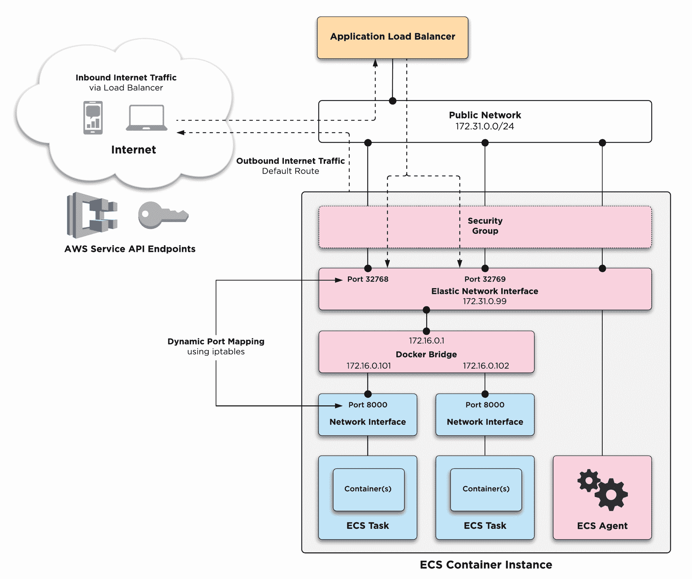
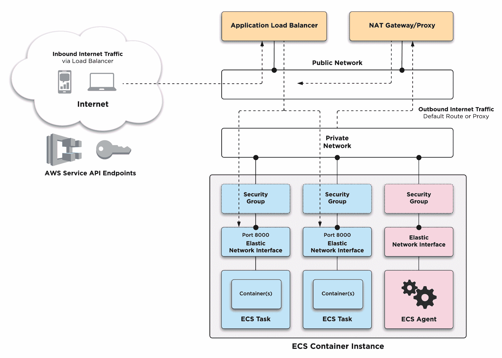
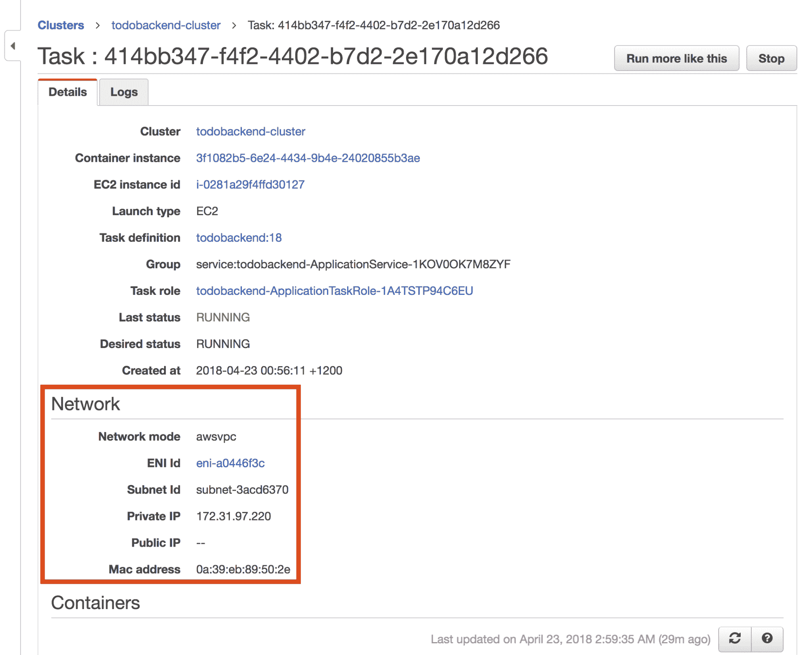

# 十、隔离网络访问

应用安全性的一个基本组成部分是控制网络访问的能力，包括应用的入站和出站。AWS 提供的 EC2 安全组提供了这样的功能，您可以基于每个网络接口将它应用到您的 EC2 实例。这种机制对于部署到 EC2 实例的传统应用很有效，但对于容器应用来说，历史上并不那么有效，容器应用通常在共享的 EC2 实例上运行，这些实例通过 EC2 实例上的共享主机接口进行通信。对于 ECS，直到最近的方法是，您有两个已应用的安全组，它们满足您需要支持在给定 ECS 容器实例上运行的所有容器的网络安全要求，这降低了您的安全规则的有效性，对于具有高安全要求的应用，这是不可接受的。直到最近，这种方法的唯一替代方案是为每个应用构建专用的 ECS 集群，确保能够满足应用安全要求，但代价是额外的基础架构和运营开销。

AWS 在 2017 年末宣布了一项称为 ECS 任务联网的功能，该功能引入了为您的 ECS 容器实例动态分配弹性网络接口(ENI)的能力，该接口是为给定的 ECS 任务保留的。这允许您创建特定于每个容器应用的安全组，并在同一 ECS 容器实例上同时运行这些应用，而不会影响安全性。

在本章中，您将学习如何配置 ECS 任务网络，这要求您了解 ECS 任务网络的工作原理，为任务网络配置 ECS 任务定义，并创建和部署链接到您的已启用任务网络的 ECS 任务定义的 ECS 服务。结合您在上一章中配置的 ECS 任务角色功能，这将使您能够构建高度安全的容器应用环境，在 IAM 权限和网络安全级别强制隔离和分离。

将涵盖以下主题:

*   了解 ECS 任务网络
*   配置网络地址转换网关
*   配置 ECS 任务网络
*   部署和测试 ECS 任务网络

# 技术要求

下面列出了完成本章的技术要求:

*   对 AWS 帐户的管理员访问权限
*   根据第 3 章中的说明配置本地 AWS 配置文件
*   AWS CLI 1.15.71 或更高版本
*   完成第 9 章，并成功地将示例应用部署到 AWS

以下 GitHub URL 包含本章使用的代码示例:[https://GitHub . com/docker-in-AWS/docker-in-AWS/tree/master/ch10](https://github.com/docker-in-aws/docker-in-aws/tree/master/ch10)。

查看以下视频，了解《行动守则》:
[http://bit.ly/2MUBJfs](http://bit.ly/2MUBJfs)

# 了解 ECS 任务网络

在幕后，ECS 任务联网实际上是一个相当复杂的功能，它依赖于多种 Docker 联网功能，需要详细了解 Docker 联网。作为一个使用 ECS 在 AWS 中设计、构建和部署容器环境的人，好消息是，您不必了解这种级别的细节，实际上您只需要对 ECS 任务网络如何工作有一个高层次的了解。因此，我将在本节中提供 ECS 任务联网如何工作的高级概述，但是，如果您对 ECS 任务联网如何更详细地工作感兴趣，这篇来自 AWS([https://AWS . Amazon . com/blogs/compute/under-hood-task-networking-for-Amazon-ECS/](https://aws.amazon.com/blogs/compute/under-the-hood-task-networking-for-amazon-ecs/))的博文将提供更多信息。

# Docker桥网络

为了理解 ECS 任务网络，了解 Docker 网络和 ECS 容器的标准配置默认情况下是如何工作的是有帮助的。默认情况下，ECS 任务定义配置为 Docker 网桥网络模式，如下图所示:



Docker bridge networking

在上图中，您可以看到每个 ECS 任务都有自己的专用网络接口，该接口由 Docker Engine 在创建 ECS 任务容器时动态创建。Docker 桥接口是第 2 层网络组件，类似于以太网交换机，它将 Docker 引擎主机内部网络中的每个 Docker 容器网络接口连接在一起。

请注意，每个容器在`172.16.0.x`子网内有一个 IP 地址，而外部 AWS 公共网络和 ECS 容器实例的弹性网络接口在`172.31.0.x`子网内有 IP 地址，您可以看到所有容器流量都通过单个主机网络接口路由，在 AWS EC2 实例的情况下，该接口是分配给实例的默认弹性网络接口。弹性网络接口(ENI)是一种 EC2 资源，可为您的 VPC 子网提供网络连接，是您认为每个 EC2 实例使用的标准网络接口。

同样作为 Docker 容器运行的 ECS 代理与其他容器的不同之处在于，它以主机网络模式运行，这意味着它使用主机操作系统网络接口(即 ENI)进行网络连接。由于容器位于 Docker Engine 主机内部的不同 IP 网络上，为了提供与外部世界的网络连接，Docker 在 ENI 上配置 iptables 规则，将所有出站网络流量转换为弹性网络接口 IP 地址，并为入站网络流量设置动态端口映射规则。例如，上图中某个容器的动态端口映射规则会将`172.31.0.99:32768`的传入流量转换为`172.16.0.101:8000`。

iptables are a standard Linux kernel capability that provides network access control and network address translation features to your Linux hosts.

尽管许多应用在网络地址转换(NAT)方面运行良好，但有些应用在 NAT 方面运行不佳或根本不运行，使用 NAT 会对网络流量大的应用产生性能影响。还要注意，应用于 ENI 的安全组由所有容器、ECS 代理和操作系统本身共享，这意味着安全组必须允许所有这些组件的组合网络连接要求，这可能会危及容器和 ECS 容器实例的安全性。

It is possible to configure your ECS task definitions to operate in host-networking mode, meaning their network configuration would be similar to the ECS agent configuration, where no network address translation (NAT) is required. Host-networking mode has its own security implications and is generally not recommended for applications that want to avoid NAT or require network isolation—instead you should use ECS task networking for such requirements. Host networking should be used with care and only for ECS tasks that perform a system function, such as logging or monitoring a sidecar container.

# ECS 任务联网

现在，您已经对 ECS 容器实例及其关联容器的默认网络配置有了基本的了解，让我们回顾一下当您配置 ECS 任务网络时，这种情况是如何变化的。下图说明了 ECS 任务网络在高层次上是如何工作的:



ECS task networking

在上图中，每个 ECS 任务都被分配和配置为使用自己的专用弹性网络接口。这与第一个图有很大不同，在第一个图中，容器使用由 Docker 动态创建的内部网络接口，相反，ECS 负责每个 ECS 任务弹性网络接口的动态创建。这对于 ECS 来说更加复杂，但是它的优点是您的容器可以直接连接到您的 VPC 子网，并且可以有自己独立的安全组。这意味着您的容器网络端口不再需要复杂的功能，如动态端口映射，这将损害安全性和性能，您的容器端口将直接暴露给 AWS 网络环境，并可由负载平衡器直接访问。

在上图中需要注意的一点是外部网络配置，它引入了私有子网和公共子网的概念。我以这种方式表示网络连接，因为在撰写本文时，ECS 任务网络不支持为每个动态创建的 ENI 分配公共 IP 地址，因此如果您的容器需要互联网连接，您确实需要额外的 VPC 网络设置。该设置包括在公共网络上创建 NAT 网关或 HTTP 代理，然后您的 ECS 任务可以将互联网流量路由到该网关或代理。在当前 todobackend 应用的场景中，第 9 章中介绍的入口点脚本与位于互联网上的 AWS Secrets Manager API 进行通信，因此需要类似于第一个图中所示的网络设置。

The ECS agent does not have the limitation of being unable to assign a public IP address, given it uses the default EC2 instance ENI that is allocated to the instance on creation. So you could, for example in the preceding diagram, connect the default ENI used by the ECS agent to the public network or another network with internet connectivity.

通过比较前面的两个图表，您可以看到，如果您想象 ECS 容器实例是一台裸机服务器，而您的容器是虚拟机，那么 ECS 任务网络简化了您的 ECS 容器实例的内部网络配置，使其看起来非常像传统的虚拟机网络模型。这带来了更高的性能和安全性，但代价是外部网络设置更复杂，出站互联网连接需要 NAT 网关或 HTTP 代理配置，而 ECS 负责将 ENI 动态附加到您的实例，这有其自身的局限性。

例如，可以附加到给定 EC2 实例的最大 eni 数量因 EC2 实例类型而异，如果您查看[https://docs . AWS . Amazon . com/AWSEC2/latest/user guide/using-ENI . html # available pereni](https://docs.aws.amazon.com/AWSEC2/latest/UserGuide/using-eni.html#AvailableIpPerENI)，您可以看到自由层 t2.micro 实例类型最多只支持两个 Eni，将您在 ECS 任务联网模式下可以运行的 ECS 任务的最大数量限制为每个实例一个(给定一个 ENI 将

# 配置网络地址转换网关

正如您在上一节中了解到的，在编写本文时，ECS 任务网络不支持分配公共 IP 地址，这意味着您必须配置额外的基础架构来支持您的应用可能需要的任何互联网连接。虽然应用可以通过栈中的应用负载平衡器在没有出站互联网访问的情况下访问，但应用容器入口点脚本确实需要在启动时与 AWS 机密管理器服务通信，这需要互联网连接才能与机密管理器应用编程接口通信。

为了提供这种连接，您可以采用两种典型的方法:

*   **配置 NAT 网关**:这是一个 AWS 管理的服务，为出站通信提供网络地址转换，使位于私有子网的主机和容器能够访问互联网。
*   **配置一个 HTTP 代理**:这提供了一个转发代理，配置了代理支持的应用可以将 HTTP、HTTPS 和 FTP 请求转发给你的代理。

我通常推荐后一种方法，因为它为您提供了基于对 HTTP 和 HTTPS 流量的 DNS 命名来限制对网站的访问的能力(后者取决于所使用的 HTTP 代理的能力)，而 NAT 网关仅具有基于 IP 地址来限制访问的能力。然而，设置代理确实需要更多的努力，并且会产生管理附加服务的操作开销，因此，为了专注于 ECS 任务联网并保持简单，我们将在本章中实现 NAT 网关方法。

# 配置专用子网和路由表

为了使用您在现实世界中看到的典型路由配置来支持 NAT 网关，我们需要首先添加一个私有子网和一个私有路由表，我们将把它作为 CloudFormation 资源添加到 todobackend 栈中。以下示例演示了如何在位于 todobackend-aws 存储库根目录的`stack.yml`文件中执行此配置:

In the interests of keeping this example simple, we are creating network resources in the todobackend application stack, however you typically would create network subnets and associated resources such as NAT gateways in a separate network-focused CloudFormation stack.

```
...
...
Resources:
  PrivateSubnet:
 Type: AWS::EC2::Subnet
 Properties:
 AvailabilityZone: !Sub ${AWS::Region}a
 CidrBlock: 172.31.96.0/20
 VpcId: !Ref VpcId
 PrivateRouteTable:
 Type: AWS::EC2::RouteTable
 Properties:
 VpcId: !Ref VpcId
 PrivateSubnetRouteTableAssociation:
 Type: AWS::EC2::SubnetRouteTableAssociation
 Properties:
 RouteTableId: !Ref PrivateRouteTable
 SubnetId: !Ref PrivateSubnet
...
...
```

Creating a private subnet and route table

在上例中，您创建了私有子网和路由表资源，然后通过`PrivateSubnetRouteTableAssociation`资源将它们关联起来。这种配置意味着从专用子网发送的所有网络流量都将根据专用路由表中公布的路由进行路由。请注意，您只在本地 AWS 区域的可用性区域 A 中指定了一个子网，在实际场景中，您通常会在两个可用性区域中配置至少两个子网以实现高可用性。另一点需要注意的是，您必须确保为您的子网配置的`CidrBlock`位于为您的 VPC 配置的 IP 范围内，并且没有分配给任何其他子网。

以下示例演示了如何使用 AWS CLI 确定 VPC IP 范围并查看现有的子网 CIDR 块:

```
> export AWS_PROFILE=docker-in-aws
> aws ec2 describe-vpcs --query Vpcs[].CidrBlock
[
    "172.31.0.0/16"
]
> aws ec2 describe-subnets --query Subnets[].CidrBlock
[
    "172.31.16.0/20",
    "172.31.80.0/20",
    "172.31.48.0/20",
    "172.31.64.0/20",
    "172.31.32.0/20",
    "172.31.0.0/20"
]
```

Querying VPC and subnet CIDR blocks

在前面的示例中，您可以看到默认的 VPC 已经配置了一个名为`172.31.0.0/16`的 CIDR 块，您还可以看到已经分配给默认 VPC 中创建的默认子网的现有 CIDR 块。如果您回头参考第一个示例，您可以看到我们已经为新定义的专用子网选择了该块中的下一个`/20`子网(`172.31.96.0/20`)。

# 配置网络地址转换网关

私有路由配置就绪后，您现在可以配置 NAT 网关和其他支持资源。

网络地址转换网关需要一个弹性的 IP 地址，这是固定的公共 IP 地址，通过网络地址转换网关的出站流量看起来就是来自这个地址，并且必须安装在具有互联网连接的公共子网中。

以下示例演示了配置 NAT 网关以及相关的弹性 IP 地址:

```
...
...
Resources:
 NatGateway:
 Type: AWS::EC2::NatGateway
 Properties:
 AllocationId: !Sub ${ElasticIP.AllocationId}
 SubnetId:
 Fn::Select:
 - 0
 - !Ref ApplicationSubnets
 ElasticIP:
 Type: AWS::EC2::EIP
 Properties:
 Domain: vpc
...
...
```

Configuring a NAT gateway

在前面的示例中，您创建了一个分配给虚拟专用网络使用的弹性 IP 地址，然后通过`AllocationId`属性将分配的 IP 地址链接到 NAT 网关。

Elastic IP addresses are somewhat interesting from a billing perspective, in that AWS does not charge you for them as long as you are actively using them. If you create Elastic IP addresses but don't associate them with an EC2 instance or a NAT gateway, then AWS will charge you for them. See [https://aws.amazon.com/premiumsupport/knowledge-center/elastic-ip-charges/](https://aws.amazon.com/premiumsupport/knowledge-center/elastic-ip-charges/) for more details on how billing works for Elastic IP addresses.

注意在指定`SubnetId`时`Fn::Select`固有函数的使用，重要的是要理解子网必须与将链接到 NAT 网关的子网和路由表资源处于同一可用性区域。在我们的用例中，这是可用性区域 A，`ApplicationSubnets`输入包括分别位于可用性区域 A 和 B 的两个子网标识，因此您选择第一个零索引子网标识。注意:您可以使用以下示例中演示的`aws ec2 describe-subnets`命令来验证子网的可用性区域:

```
> cat dev.cfg
ApplicationDesiredCount=1
ApplicationImageId=ami-ec957491
ApplicationImageTag=5fdbe62
ApplicationSubnets=subnet-a5d3ecee,subnet-324e246f VpcId=vpc-f8233a80
> aws ec2 describe-subnets --query Subnets[].[AvailabilityZone,SubnetId] --output table
-----------------------------------
|         DescribeSubnets         |
+-------------+-------------------+
|  us-east-1a |  subnet-a5d3ecee  |
|  us-east-1d |  subnet-c2abdded  |
|  us-east-1f |  subnet-aae11aa5  |
|  us-east-1e |  subnet-fd3a43c2  |
|  us-east-1b |  subnet-324e246f  |
|  us-east-1c |  subnet-d281a2b6  |
+-------------+-------------------+
```

Querying subnet IDs by availability zone

在上例中，您可以看到在`dev.cfg`文件中输入的`ApplicationSubnets`中的第一项是`us-east-1a`的子网标识，确保 NAT 网关将被安装到正确的可用性区域。

# 为您的专用子网配置路由

配置 NAT 网关的最后一步是为私有子网配置一条指向 NAT 网关资源的默认路由。此配置将确保所有出站互联网流量将被路由到您的 NAT 网关，然后该网关将执行地址转换，使您的私有主机和容器能够与互联网通信。

以下示例演示如何为您之前创建的专用路由表添加默认路由:

```
...
...
Resources:
 PrivateRouteTableDefaultRoute:
 Type: AWS::EC2::Route
 Properties:
 DestinationCidrBlock: 0.0.0.0/0
 RouteTableId: !Ref PrivateRouteTable
      NatGatewayId: !Ref NatGateway
...
...
```

Configuring a default route

在前面的示例中，您可以看到您配置了`RouteTableId`和`NatGatewayId`属性，以确保您在第一个示例中创建的私有路由表的默认路由被设置为您在后面的示例中创建的 NAT 网关。

现在，您已经准备好部署您的更改，但是在此之前，让我们在 todobackend-aws 存储库中创建一个名为 **ecs-task-networking** 的单独分支，以便您可以在本章结束时轻松地恢复您的更改:

```
> git checkout -b ecs-task-networking
M stack.yml
Switched to a new branch 'ecs-task-networking'
> git commit -a -m "Add NAT gateway resources"
[ecs-task-networking af06d37] Add NAT gateway resources
 1 file changed, 33 insertions(+)
```

Creating an ECS task networking branch

现在，您可以使用熟悉的`aws cloudformation deploy`命令来部署您的更改，您在本书中一直在使用该命令进行栈部署:

```
> export AWS_PROFILE=docker-in-aws > aws cloudformation deploy --template-file stack.yml \
 --stack-name todobackend --parameter-overrides $(cat dev.cfg) \ --capabilities CAPABILITY_NAMED_IAM Enter MFA code for arn:aws:iam::385605022855:mfa/justin.menga:

Waiting for changeset to be created..
Waiting for stack create/update to complete
Successfully created/updated stack - todobackend
> aws ec2 describe-subnets --query "Subnets[?CidrBlock=='172.31.96.0/20'].SubnetId" ["subnet-3acd6370"]
> aws ec2 describe-nat-gateways
{
    "NatGateways": [
        {
            "CreateTime": "2018-04-22T10:30:07.000Z",
            "NatGatewayAddresses": [
                {
                    "AllocationId": "eipalloc-838abd8a",
                    "NetworkInterfaceId": "eni-90d8f10c",
                    "PrivateIp": "172.31.21.144",
 "PublicIp": "18.204.39.34"
                }
            ],
            "NatGatewayId": "nat-084089330e75d23b3",
            "State": "available",
            "SubnetId": "subnet-a5d3ecee",
            "VpcId": "vpc-f8233a80",
...
...
```

Deploying changes to the todobackend application

在前面的示例中，成功部署云信息更改后，您可以使用`aws ec2 describe-subnets`命令查询您创建的新子网的子网标识，因为您将在本章的后面需要该值。您还可以运行`aws ec2 describe-nat-gateways`命令来验证 NAT 网关是否已成功创建，并查看网关的弹性 IP 地址，该地址由突出显示的`PublicIP`属性表示。注意您还应该检查默认路由是否创建正确，如以下示例所示:

```
> aws ec2 describe-route-tables \
 --query "RouteTables[].Routes[?DestinationCidrBlock=='0.0.0.0/0']"
[
    [
        {
            "DestinationCidrBlock": "0.0.0.0/0",
            "NatGatewayId": "nat-084089330e75d23b3",
            "Origin": "CreateRoute",
            "State": "active"
        }
    ],
    [
        {
            "DestinationCidrBlock": "0.0.0.0/0",
            "GatewayId": "igw-1668666f",
            "Origin": "CreateRoute",
            "State": "active"
        }
    ]
]
...
...
```

Checking default routes

在前面的示例中，您可以看到存在两条默认路由，一条默认路由与 NAT 网关相关联，另一条默认路由与互联网网关相关联，确认您帐户中的一个路由表正在将互联网流量路由到您新创建的 NAT 网关。

# 配置 ECS 任务网络

现在，您已经建立了网络基础设施，将支持 ECS 任务网络的私有 IP 寻址要求，您可以继续在您的 ECS 资源上配置 ECS 任务网络。这需要以下配置和注意事项:

*   您必须配置您的 ECS 任务定义和 ECS 服务，以支持 ECS 任务联网。
*   您的任务定义的网络模式必须设置为`awsvpc`。
*   用于 ECS 任务联网的弹性网络接口只能有一个与之关联的 ECS 任务。根据您的 ECS 实例类型，这将限制您可以在任何给定的 ECS 容器实例中运行的 ECS 任务的最大数量。
*   配置了 ECS 任务网络的 ECS 任务的部署比传统的 ECS 部署需要更长的时间，因为需要创建一个弹性网络接口并将其绑定到您的 ECS 容器实例。
*   因为您的容器应用有一个专用的网络接口，所以动态端口映射不再可用，您的容器端口直接暴露在网络接口上。
*   当使用`awsvpc`网络模式的 ECS 服务与应用负载平衡器目标组结合使用时，目标类型必须设置为`ip`(默认为`instance`)。

移除动态端口映射的含义意味着，例如，todobackend 应用(运行在端口 8000 上)将在启用任务网络的情况下在端口`8000`上被外部访问，而不是通过动态映射的端口。这为生成大量网络流量的应用带来了更好的性能，也意味着您的安全规则可以针对应用运行的特定端口，而不是允许访问动态端口映射使用的短暂网络端口范围。

# 为任务网络配置 ECS 任务定义

配置 ECS 任务网络的第一步是配置您的 ECS 任务定义。以下示例演示了修改`ApplicationTaskDefinition`资源以支持 ECS 任务联网:

```
...
...
  ApplicationTaskDefinition:
    Type: AWS::ECS::TaskDefinition
    Properties:
      Family: todobackend
 NetworkMode: awsvpc
      TaskRoleArn: !Sub ${ApplicationTaskRole.Arn}
      Volumes:
        - Name: public
      ContainerDefinitions:
        - Name: todobackend
          ...
          ...
 PortMappings:
 - ContainerPort: 8000 
          LogConfiguration:
            LogDriver: awslogs
            Options:
              awslogs-group: !Sub /${AWS::StackName}/ecs/todobackend
              awslogs-region: !Ref AWS::Region
              awslogs-stream-prefix: docker
        - Name: collectstatic
          Essential: false
...
...
```

Configuring ECS task definitions to use task networking

在前面的示例中，`NetworkMode`属性已被添加并配置为值`awsvpc`。默认情况下，此属性设置为`bridge`，它实现默认的 Docker 行为，如第一个图所示，包括一个 Docker 桥接口，网络地址转换配置为启用动态端口映射。通过将网络模式设置为`awsvpc`，ECS 将确保从该任务定义部署的任何 ECS 任务都分配有专用的弹性网络接口(ENI)，并在任务定义中配置容器以使用 ENI 的网络栈。本例中的另一项配置更改是`HostPort: 0`配置已从`PortMappings`部分删除，因为 ECS 任务网络不使用或不支持动态端口映射。

# 为任务网络配置 ECS 服务

将 ECS 任务定义配置为使用正确的网络模式进行任务联网后，接下来需要配置 ECS 服务。您的 ECS 服务配置定义了 ECS 应该在其中创建 ENI 的目标子网，还定义了应该应用于 ENI 的安全组。以下示例演示了如何更新 todobackend 栈中的`ApplicationService`资源:

```
...
...
Resources:
  ...
  ...
  ApplicationService:
    Type: AWS::ECS::Service
    DependsOn:
      - ApplicationAutoscaling
      - ApplicationLogGroup
      - ApplicationLoadBalancerHttpListener
      - MigrateTask
    Properties:
      TaskDefinition: !Ref ApplicationTaskDefinition
      Cluster: !Ref ApplicationCluster
      DesiredCount: !Ref ApplicationDesiredCount
      NetworkConfiguration:
 AwsvpcConfiguration:
 SecurityGroups:
 - !Ref ApplicationSecurityGroup
 Subnets:
            - !Ref PrivateSubnet
      LoadBalancers:
        - ContainerName: todobackend
          ContainerPort: 8000
          TargetGroupArn: !Ref ApplicationServiceTargetGroup
 # The Role property has been removed
      DeploymentConfiguration:
        MaximumPercent: 200
        MinimumHealthyPercent: 100
...
...
```

Configuring ECS services to use task networking

在前面的示例中，名为`NetworkConfiguration`的新属性被添加到 ECS 服务定义中。每当您启用任务网络时，此属性都是必需的，您可以看到您需要配置与将由 ECS 创建的 ENI 相关联的子网和安全组。请注意，您引用了本章前面创建的`PrivateSubnet`资源，这确保了您的容器网络接口不会直接从互联网到达。一个不太明显的变化是`Role`属性被删除了——每当您使用一个使用 ECS 任务网络的 ECS 服务时，AWS 会自动配置 ECS 角色，如果您试图设置该角色，将会引发一个错误。

# 为任务网络配置支持资源

如果您回顾一下前面的示例，您会注意到您引用了一个名为`ApplicationSecurityGroup`的新安全组，它需要添加到您的模板中，如下例所示:

```
...
...
 ApplicationSecurityGroup:
Type: AWS::EC2::SecurityGroup
 Properties:
 GroupDescription: !Sub ${AWS::StackName} Application Security Group
 VpcId: !Ref VpcId
 SecurityGroupEgress:
 - IpProtocol: udp
 FromPort: 53
 ToPort: 53
 CidrIp: 0.0.0.0/0
 - IpProtocol: tcp
 FromPort: 443
 ToPort: 443
 CidrIp: 0.0.0.0/0
  ...
  ...
  ApplicationLoadBalancerToApplicationIngress:
    Type: AWS::EC2::SecurityGroupIngress
    Properties:
      IpProtocol: tcp
 FromPort: 8000
 ToPort: 8000
 GroupId: !Ref ApplicationSecurityGroup
      SourceSecurityGroupId: !Ref ApplicationLoadBalancerSecurityGroup
  ApplicationLoadBalancerToApplicationEgress:
    Type: AWS::EC2::SecurityGroupEgress
    Properties:
      IpProtocol: tcp
 FromPort: 8000
 ToPort: 8000
      GroupId: !Ref ApplicationLoadBalancerSecurityGroup
 DestinationSecurityGroupId: !Ref ApplicationSecurityGroup
  ...
  ...
  ApplicationToApplicationDatabaseIngress:
    Type: AWS::EC2::SecurityGroupIngress
    Properties:
      IpProtocol: tcp
      FromPort: 3306
      ToPort: 3306
      GroupId: !Ref ApplicationDatabaseSecurityGroup
 SourceSecurityGroupId: !Ref ApplicationSecurityGroup
  ApplicationToApplicationDatabaseEgress:
    Type: AWS::EC2::SecurityGroupEgress
    Properties:
      IpProtocol: tcp
      FromPort: 3306
      ToPort: 3306
GroupId: !Ref ApplicationSecurityGroup
      DestinationSecurityGroupId: !Ref ApplicationDatabaseSecurityGroup
...
...
```

Configuring security groups for task networking

在前面的示例中，您首先创建了一个安全组，其中包含一个允许出站 DNS 和 HTTPS 流量的出口规则集，这是允许容器中的入口点脚本与 AWS 机密管理器 API 通信所必需的。请注意，您需要修改现有的`AWS::EC2::SecurityGroupIngress`和`AWS::EC2::SecurityGroupEgress`资源，它们之前允许在应用负载平衡器/应用数据库和应用自动缩放组实例之间进行访问。您可以看到，对于`ApplicationLoadBalancerToApplicationEgress`和`ApplicationLoadBalancerToApplicationEgress`资源，端口范围已经从`32768`的短暂端口范围减少到`60999`到仅端口`8000`，这导致了更安全的配置。此外，ECS 容器实例控制平面(与`ApplicationAutoscalingSecurityGroup`资源相关联)现在不能再访问您的应用数据库(现在只有您的应用可以这样做)，这同样更加安全。

There's one problem with the current modifications to the todobackend stack, which is that you have not updated your `MigrateTaskDefinition` to use task networking. The main reason I am not doing this is because it would require your ECS container instances to support more elastic network interfaces than what the free tier t2.micros supports, and also would require the ECS Task Runner custom resource to be updated to support running ad-hoc ECS tasks. Of course if you want to use ECS task networking in a production environment, you would need to address such concerns, however for the purposes of providing a basic understanding of ECS task networking, I have chosen not to do this. This does mean if you make any change that requires the migrate task to be run, it will fail with the configuration changes of the previous example, however, once this chapter is complete, you will revert your todobackend stack configuration to not use ECS task networking to ensure you can complete the remaining chapters.

最后，您需要对模板进行最后一项更改，即修改与您的 ECS 服务相关联的应用负载平衡器目标组。当您的 ECS 服务运行以`awsvpc`网络模式运行的任务时，您必须将目标组类型从默认的`instance`更改为`ip`值，如下例所示，因为您的 ECS 任务现在有了自己唯一的 IP 地址:

```
Resources:
 ...
 ...
 ApplicationServiceTargetGroup:
     Type: AWS::ElasticLoadBalancingV2::TargetGroup
     Properties:
       Protocol: HTTP
       Port: 8000
       VpcId: !Ref VpcId
       TargetType: ip
       TargetGroupAttributes:
         - Key: deregistration_delay.timeout_seconds
           Value: 30
 ...
 ...
```

Updated application-load-balancer target group target type

# 部署和测试 ECS 任务网络

您现在可以部署您的更改，并验证 ECS 任务网络是否正常工作。如果运行`aws cloudformation deploy`命令，会发生以下情况:

*   将创建应用任务定义的新版本，该版本是为 ECS 任务网络配置的。
*   ECS 服务配置将检测到这些更改，并尝试部署新版本以及 ECS 服务配置更改。ECS 将动态地将新的 ENI 连接到专用子网，并将这个 ENI 分配给`ApplicationService`资源的新 ECS 任务。

部署完成后，您应该验证您的应用是否仍在工作，完成后，您可以浏览到 ECS 控制台，单击您的 ECS 服务，并选择为该服务运行的当前任务。

以下屏幕截图显示了 ECS 任务屏幕:



ECS task in task networking mode

如您所见，任务的网络模式现在是`awsvpc`，并且已经从您在本章前面创建的专用子网中动态分配了一个 ENI。如果您单击 ENI 标识链接，您将能够验证连接到 ENI 的安全组，并检查 ENI 是否已连接到您的一个 ECS 容器实例。

此时，您应该将本章中所做的最后一组更改提交给 ECS 任务网络分支，签出主分支，并重新部署您的云信息栈。这将恢复本章中所做的所有更改，将栈恢复到上一章结束时的状态。这是必需的，因为我们不想升级到更大的实例类型来容纳`MigrateTaskDefinition`资源和我们将在后面章节测试的未来自动扩展场景:

```
> git commit -a -m "Add ECS task networking resources"
 [ecs-task-networking 7e995cb] Add ECS task networking resources
 2 files changed, 37 insertions(+), 10 deletions(-)
> git checkout master
Switched to branch 'master'
> aws cloudformation deploy --template-file stack.yml --stack-name todobackend \
 --parameter-overrides $(cat dev.cfg) --capabilities CAPABILITY_NAMED_IAM

Waiting for changeset to be created..
Waiting for stack create/update to complete
Successfully created/updated stack - todobackend
```

Reverting the todobackend-aws repository

# 摘要

在本章中，您学习了如何使用 ECS 任务网络来增加 Docker 应用的网络隔离和安全性。ECS 任务联网将默认的现成 Docker 桥和 NAT 网络配置更改为每个 ECS 任务接收自己的专用弹性网络接口或 ENI 的模式。这意味着您的 Docker 应用被分配了自己的专用安全组，并且可以通过其发布的端口直接访问，这避免了实现可能影响性能并需要更宽松的安全规则才能工作的功能(如动态端口映射)的需要。然而，ECS 任务联网也有其自身的一系列挑战和限制，包括更复杂的网络拓扑以适应当前仅私有 IP 地址的限制，以及每个 ENI 只能运行一个 ECS 任务的能力。

ECS 任务网络目前不支持公共 IP 地址，这意味着如果您的任务需要出站互联网连接，则必须提供 NAT 网关或 HTTP 代理。NAT 网关是由 AWS 提供的托管服务，您学习了如何配置用于 ECS 任务的专用子网，以及如何配置专用路由表以将互联网流量路由到您在预先存在的公共子网之一中创建的 NAT 网关。

您了解到，配置 ECS 任务网络需要您在 ECS 任务定义中指定 awsvpc 网络模式，并且您需要向 ECS 服务添加网络配置，该配置指定您的 ECS 任务将连接到的子网以及将应用的安全组。如果您的应用由应用负载平衡器提供服务，您还需要确保链接到您的 ECS 服务的目标组的目标类型配置为`ip`，而不是默认的`instance`目标类型。如果要将这些更改应用于现有环境，您可能还需要更新附加到资源(如负载平衡器和数据库)的安全组，因为您的 ECS 任务不再与应用于 ECS 容器实例级别的安全组相关联，并且有自己的专用安全组。

在接下来的两章中，您将学习如何处理 ECS 的一些更具挑战性的操作方面，包括管理 ECS 容器实例的生命周期和自动扩展 ECS 集群。

# 问题

1.  对/错:默认的 Docker 网络配置使用 iptables 来执行网络地址转换。
2.  您有一个应用，它形成应用级集群，并使用 EC2 元数据来发现运行您的应用的其他主机的 IP 地址。当您使用 ECS 运行您的应用时，您注意到您的应用使用的是`172.16.x.x/16`地址，但是您的 EC2 实例配置的是`172.31.x.x/16`地址。哪些 Docker 网络模式可以帮助解决这个问题？
3.  对/错:您的电子控制系统任务定义中`NetworkMode`的`host`值启用电子控制系统任务联网。

4.  您可以为 ECS 任务定义启用 ECS 任务网络，但是您的应用负载平衡器无法再到达您的应用。您检查附加到 ECS 容器实例的安全组的规则，并确认您的负载平衡器被允许访问您的应用。您如何解决这个问题？

5.  您可以为 ECS 任务定义启用 ECS 任务网络，但是您的容器在启动时会出现错误，无法到达位于互联网上的位置。您如何解决这个问题？
6.  t2.micro 实例上最多可以运行多少个 ENi？
7.  在 t2.micro 实例上，您可以在任务网络模式下运行的 ECS 任务的最大数量是多少？
8.  在 t2.micro 实例上，在任务网络模式下可以运行的最大容器数量是多少？
9.  启用 ECS 任务网络模式后，您会收到一个部署错误，指示目标组有一个目标类型实例，这与 awsvpc 网络模式不兼容。你如何解决这个问题？
10.  启用 ECS 任务网络模式后，您会收到一个部署错误，指出您无法为需要服务链接角色的服务指定 IAM 角色。你如何解决这个问题？

# 进一步阅读

您可以查看以下链接，了解有关本章所涵盖主题的更多信息:

*   Docker网络概述:[https://docs.docker.com/network/](https://docs.docker.com/network/)
*   使用 awsvpc 进行任务联网网络模式:[https://docs . AWS . Amazon . com/Amazon ECS/latest/developer guide/task-Networking . html](https://docs.aws.amazon.com/AmazonECS/latest/developerguide/task-networking.html)
*   引擎盖下:亚马逊 ecs 的任务联网:[https://AWS . Amazon . com/blogs/compute/引擎盖下-亚马逊 ECS 的任务联网/](https://aws.amazon.com/blogs/compute/under-the-hood-task-networking-for-amazon-ecs/)
*   EC2 实例类型的最大网络接口数:[https://docs . AWS . Amazon . com/AWSEC2/latest/user guide/using-Eni . html # availablepereni](https://docs.aws.amazon.com/AWSEC2/latest/UserGuide/using-eni.html#AvailableIpPerENI)
*   NAT 网关:[https://docs . AWS . Amazon . com/Amazon PC/latest/user guide/VPC-NAT-gateway . html](https://docs.aws.amazon.com/AmazonVPC/latest/UserGuide/vpc-nat-gateway.html)
*   CloudFormation NAT 网关资源参考:[https://docs . AWS . Amazon . com/AWS cloud information/latest/user guide/AWS-Resource-ec2-natgateway . html](https://docs.aws.amazon.com/AWSCloudFormation/latest/UserGuide/aws-resource-ec2-natgateway.html)
*   CloudFormation EC2 弹性 IP 地址资源参考:[https://docs . AWS . Amazon . com/AWS cloud information/latest/user guide/AWS-properties-EC2-EIP . html](https://docs.aws.amazon.com/AWSCloudFormation/latest/UserGuide/aws-properties-ec2-eip.html)
*   CloudFormation EC2 子网资源参考:[https://docs . AWS . Amazon . com/AWS cloud information/latest/user guide/AWS-Resource-EC2-Subnet . html](https://docs.aws.amazon.com/AWSCloudFormation/latest/UserGuide/aws-resource-ec2-subnet.html)

*   CloudFormation EC2 子网路由表关联资源参考:[https://docs . AWS . Amazon . com/AWS cloud information/latest/user guide/AWS-Resource-EC2-子网-路由表-assoc.html](https://docs.aws.amazon.com/AWSCloudFormation/latest/UserGuide/aws-resource-ec2-subnet-route-table-assoc.html)
*   CloudFormation EC2 路由表资源参考:[https://docs . AWS . Amazon . com/AWS cloud information/latest/user guide/AWS-Resource-EC2-路由表. html](https://docs.aws.amazon.com/AWSCloudFormation/latest/UserGuide/aws-resource-ec2-route-table.html)
*   CloudFormation EC2 路由资源参考:[https://docs . AWS . Amazon . com/AWS cloud information/latest/user guide/AWS-Resource-EC2-Route . html](https://docs.aws.amazon.com/AWSCloudFormation/latest/UserGuide/aws-resource-ec2-route.html)
*   为亚马逊 ECS 使用服务链接角色:[https://docs . AWS . Amazon . com/Amazon ECS/latest/developer guide/use-Service-link-Roles . html](https://docs.aws.amazon.com/AmazonECS/latest/developerguide/using-service-linked-roles.html)