# 自动缩放

**弹性**是云计算的基本原则之一，描述了按需自动扩展应用程序的能力，以确保为客户提供最佳体验和响应能力，同时通过仅在实际需要时为应用程序提供额外容量来优化成本。

AWS 通过两个关键特性支持扩展使用 ECS 部署的 Docker 应用程序:

*   **应用程序自动扩展**:这使用了 AWS 应用程序自动扩展服务，并支持 ECS 服务级别的自动扩展，其中运行您的 ECS 服务的 ECS 任务或容器的数量可以增加或减少。
*   **EC2 自动缩放**:这使用了 EC2 自动缩放服务，并支持 EC2 自动缩放组级别的自动缩放，您的自动缩放组中的 EC2 实例数量可以增加或减少。在 ECS 的上下文中，您的 EC2 自动扩展组通常对应于 ECS 集群，而单个 EC2 实例对应于 ECS 容器实例，因此 EC2 自动扩展管理您的 ECS 集群的整体容量。

因为这里有两个范例在起作用，所以 Docker 应用程序的自动扩展目标可能是一个很难理解的技术概念，更不用说以可预测和可靠的方式成功实现了。在撰写本书时，应用程序自动缩放和 EC2 自动缩放是完全独立的功能，彼此之间不提供集成，这一事实进一步加剧了这种情况，因此，您有责任确保这两个功能相互协同工作。

当分析这些特性时，好消息是应用程序自动伸缩非常容易理解和实现。借助应用程序自动扩展，您只需定义应用程序的关键性能指标，并扩展(增加)或缩减(减少)运行应用程序的 ECS 任务数量。坏消息是，当 EC2 自动扩展应用于 ECS 集群中的自动扩展 ECS 容器实例时，绝对是一个更难处理的问题。在这里，您需要确保您的 ECS 集群为集群中运行的所有 ECS 任务提供足够的计算、内存和网络资源，并且您需要确保每当应用程序自动扩展单个 ECS 服务时，您的集群能够增加或减少容量。

Another challenge of scaling ECS clusters is ensuring you do not disrupt service and drain running tasks on an ECS container instance that is about to be removed from the cluster during a scale down/in event. The ECS life cycle hooks solution implemented in Chapter 11 - *Managing the ECS Infrastructure Life Cycle* takes care of this for you, ensuring the ECS container instances are drained of all running tasks before permitting the EC2 auto scaling service to take an instance out of service.

处理扩展您的 ECS 集群资源的问题是本章的主要重点，因为一旦解决，您将能够任意扩展您的每个 ECS 服务，并确保您的 ECS 集群将动态添加或删除 ECS 容器实例，以确保始终有足够的最佳资源用于您的应用程序。在本章中，我们将首先重点解决 ECS 集群的容量管理问题，然后讨论如何配置 AWS 应用程序自动扩展服务来自动扩展您的 ECS 服务和应用程序。

将涵盖以下主题:

*   了解 ECS 集群资源
*   计算电子控制系统集群容量
*   实施 ECS 集群容量管理解决方案
*   配置 CloudWatch 事件以触发容量管理计算
*   发布与 ECS 集群容量相关的自定义云观察指标
*   配置云观察警报和 EC2 自动扩展策略来扩展您的 ECS 集群
*   配置 ECS 应用程序自动扩展

# 技术要求

下面列出了完成本章的技术要求:

*   对 AWS 帐户的管理员访问权限
*   根据第 3 章中的说明配置本地 AWS 配置文件
*   AWS CLI
*   本章是第 11 章的继续，因此它要求您已经成功完成了第 11 章中定义的所有配置任务。

以下 GitHub URL 包含本章使用的代码示例:[https://GitHub . com/docker-in-AWS/docker-in-AWS/tree/master/ch12](https://github.com/docker-in-aws/docker-in-aws/tree/master/ch12)。

查看以下视频，了解《行动守则》:
[http://bit.ly/2PdgtPr](http://bit.ly/2PdgtPr)

# 了解 ECS 集群资源

在开始管理您的 ECS 集群的容量之前，您需要对影响 ECS 集群容量的各种资源有一个清晰而扎实的了解。

一般来说，您需要考虑三个关键资源:

*   中央处理器
*   记忆
*   网络

# 中央处理器资源

**CPU** 是 Docker 作为一等公民支持和管理的核心资源。ECS 利用了 Docker 的 CPU 资源管理功能，并公开了通过您的 ECS 任务定义来管理这些资源的能力。ECS 用 *CPU 单位*来定义 CPU 资源，单个 CPU 核包含 1024 个 CPU 单位。当您配置 ECS 任务定义时，您指定了一个 CPU 预留，它定义了每当有 CPU 时间争用时，将分配给应用程序多少 CPU 时间。

请注意，中央处理器预留并不限制中央处理器任务可以使用多少中央处理器——每个中央处理器任务都可以自由爆发并使用所有可用的中央处理器资源——该预留仅在中央处理器存在争用时应用，Docker 会根据每个运行中的中央处理器任务的配置预留来公平分配中央处理器时间。

重要的是要理解，每个 CPU 预留都是从给定 ECS 容器实例的可用 CPU 容量中推导出来的。例如，如果您的 ECS 容器实例有 2 个 CPU 内核，那就相当于总共有 2，048 个 CPU 单元。如果您运行 3 个配置有 500、600 和 700 个 CPU 单元的 ECS 任务，这意味着您的 ECS 容器实例有 2，048 - (500 + 600 + 700)或 248 个 CPU 单元可用。请注意，每当 ECS 调度程序需要运行新的 ECS 任务时，它将始终确保目标 ECS 容器实例有足够的 CPU 容量来运行任务。根据前面的示例，如果需要启动一个保留 400 个 CPU 单元的新 ECS 任务，那么剩余 248 个 CPU 单元的 ECS 容器实例将不会被考虑，因为它当前没有足够的 CPU 资源可用:

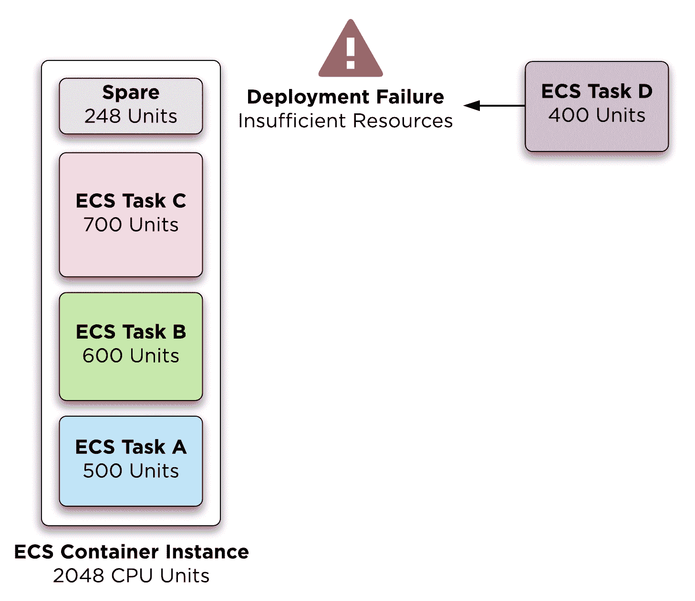

Allocating CPU resources

在配置中央处理器预留方面，您已经学习了如何通过云信息实现这一点–参见第 8 章- *中的*使用云信息定义 ECS 任务定义*示例使用 ECS* 部署应用程序，其中您通过名为`Cpu`的属性为 todobackend 容器定义分配了值 245。

# 内存资源

**内存**是通过 Docker 管理的另一个基本资源，其工作方式与 CPU 类似，尽管您可以为给定的 ECS 任务保留和限制内存容量，而在管理 CPU 容量时，您只能保留(而不是限制)CPU 资源。在为 ECS 任务配置内存时，这种限制内存的额外能力会导致三种情况:

*   **仅内存预留**:这个场景的行为与中央处理器预留的工作方式相同。Docker 将从 ECS 容器实例的可用内存中扣除已配置的预留，并尝试在内存出现争用时分配此内存量。ECS 将允许 ECS 任务最多使用 ECS 容器实例支持的最大内存量。使用 ECS 任务容器定义中的`MemoryReservation`属性配置内存预留。
*   **内存预留+限制**:在这个场景中，内存预留和前面的场景一样工作，但是，ECS 任务可以使用的最大内存量受到配置内存限制的限制。通常，配置内存预留和内存限制被认为是最佳选择。使用 ECS 任务容器定义中的`Memory`属性配置内存限制。
*   **仅限内存限制**:这里，ECS 将内存预留和内存限制值视为同一个，也就是说 ECS 会从可用的 ECS 容器实例内存中扣除配置的内存限制，也将内存使用限制在同一个限制内。

配置内存预留和限制很简单–如果您参考第 8 章- *使用 ECS 部署应用程序*的*使用云信息*定义 ECS 任务定义一节，您可以看到您配置了`MemoryReservation`属性来配置 395 MB 的预留。如果您想要配置内存限制，您还需要使用适当的最大限制值来配置`Memory`属性。

# 网络资源

中央处理器和内存是典型且显而易见的资源，您可以期望您的 ECS 集群来控制和管理它们。一组不太明显的资源是*网络资源*，可以分为两类:

*   **主机网络端口**:每当您为 ECS 服务配置静态端口映射时，主机网络端口都是您需要考虑的资源。原因是静态端口映射使用由 ECS 容器实例公开的公共端口–例如，如果您创建了一个带有静态端口映射的 ECS 任务，该静态端口映射公开了给定应用程序的端口 80，则您将无法在同一 ECS 容器实例主机上部署 ECS 任务的另一个实例，因为给定的端口 80 仍在使用中。
*   **主机网络接口**:如果您正在使用 ECS 任务联网，请务必了解，该功能目前要求您为每个 ECS 任务实现一个弹性网络接口(ENI)。因为 EC2 实例对于每个实例类型可以支持的 ENi 数量有有限的限制，所以配置了可以支持的 ECS 任务网络的 ECS 任务数量将被限制在 ECS 容器实例可以支持的最大 ENi 数量。

# 计算电子控制系统集群容量

在计算 ECS 群集容量之前，您需要清楚了解哪些资源会影响容量，以及如何计算每个资源的当前容量。一旦为每个单独的资源定义了这一点，就需要对所有资源应用聚合计算，这将导致当前能力的最终计算。

计算容量似乎是一项相当艰巨的任务，尤其是当您考虑不同类型的资源及其行为方式时:

*   **CPU** :这是你可以使用的最简单的资源，因为每个 CPU 预留量只是从集群的可用 CPU 容量中扣除。

*   **内存:**根据内存计算集群的当前容量与中央处理器相同，因为内存预留是从集群的可用内存容量中扣除的。根据我们在本章前面的讨论，如何配置内存预留由于内存限制和内存预留的各种排列而变得复杂，然而从根本上来说，一旦确定了内存预留，计算就和 CPU 资源一样了。
*   **静态网络端口**:如果您的 ECS 集群需要支持*任何使用静态端口映射的*容器，那么您需要将您的 ECS 容器实例网络端口视为一种资源。例如，如果容器应用程序总是使用 ECS 容器实例上的端口 80，那么每个实例只能部署一个容器，而不管该实例可能拥有多少 CPU、内存或其他资源。
*   **网络接口**:如果您有任何为 ECS 任务联网而配置的 ECS 服务或任务，请务必了解您目前每个网络接口只能运行一个 ECS 任务。例如，如果您正在运行一个 t2.micro 实例，这意味着在给定一个 t2.micro 的情况下，每个实例只能运行一个启用了任务网络的 ECS 任务，并且只能支持一个用于 ECS 任务网络的弹性网络接口。

Given the sample application is not using ECS task networking and is being deployed using dynamic port mapping, we will only consider CPU and memory resources for the remainder of this chapter. If you are interested in an example solution that incorporates static network ports, check out the Auto Scaling ECS Applications module of my [Docker in Production Using Amazon Web Services](https://www.pluralsight.com/courses/docker-production-using-amazon-web-services) course.

这里的挑战是如何根据前面的所有考虑因素来考虑您的所有 ECS 服务和任务，然后决定何时应该增加或减少集群中的实例数量。我见过的一种常见且有些幼稚的方法是独立对待每种资源，并相应地扩展实例。例如，一旦集群的内存容量用完，就会添加一个新的容器实例，同样，如果集群的 CPU 容量即将用完，也会添加一个新的容器实例。如果您纯粹考虑横向扩展的能力，这种方法可以很好地工作，但是当您想要在集群中进行扩展时，它就不起作用了。如果仅根据当前的内存容量来扩展集群，则在 CPU 容量方面有扩展过快的风险，因为如果从集群中删除一个实例，集群可能没有足够的 CPU 容量。

这可能会让您的群集陷入自动扩展循环，也就是说，您的群集不断地向外扩展，然后再向内扩展，这是因为单个资源容量独立地推动了向外扩展和向外扩展的决策，而没有考虑对其他资源的影响。

解决这一挑战的关键是，您需要做出横向扩展或纵向扩展的*单一*决策，并考虑集群的所有*适用资源。这可能会让整个问题看起来更难解决，但实际上它很简单。解决方案的关键是你总是考虑*最坏的情况*，并在此基础上做出决定。例如，如果集群中有足够的 CPU 和内存容量，但是给定端口的所有静态端口映射都在所有集群实例上使用，最坏的情况是，如果您在集群中进行扩展并删除一个实例，您将无法再支持当前使用受影响的静态端口映射的 ECS 任务。因此，这里的决定很简单，完全基于最坏的情况——所有其他情况都被忽略。*

# 计算集装箱容量

计算集群容量时的一个关键考虑因素是，您需要对资源容量计算进行标准化，这样每个资源的容量就可以用一种通用且等效的格式来表示，而与每个单独资源的特定度量单位无关。这对于做出考虑所有资源的集体决策至关重要，一种自然的方法是根据使用当前可用的未分配资源可以支持的额外 ECS 任务的数量来表示资源容量。此外，与最坏情况场景的主题保持一致，您不需要考虑您需要支持的所有不同的 ECS 任务–您只需要考虑对于您当前正在计算容量的资源而言最糟糕的 ECS 任务(需要最多资源的任务)。

例如，如果您有两个 ECS 任务，分别需要 200 个 CPU 单元和 400 个 CPU 单元，那么您只需要根据具有 400 个 CPU 单元的 ECS 任务来计算 CPU 容量:


The expression with the somewhat strange upside down A in the formula means "for each taskCpu value in a given set of taskDefinitions".

一旦您确定了需要支持的最坏情况的 ECS 任务，您就可以继续计算集群当前可以支持的额外 ECS 任务的数量。鉴于最坏情况下的 ECS 任务需要 400 个 CPU 单元，如果我们现在假设您的群集中有两个实例，每个实例都有 600 个 CPU 单元的可用容量，这意味着您目前可以支持另外两个 ECS 任务:

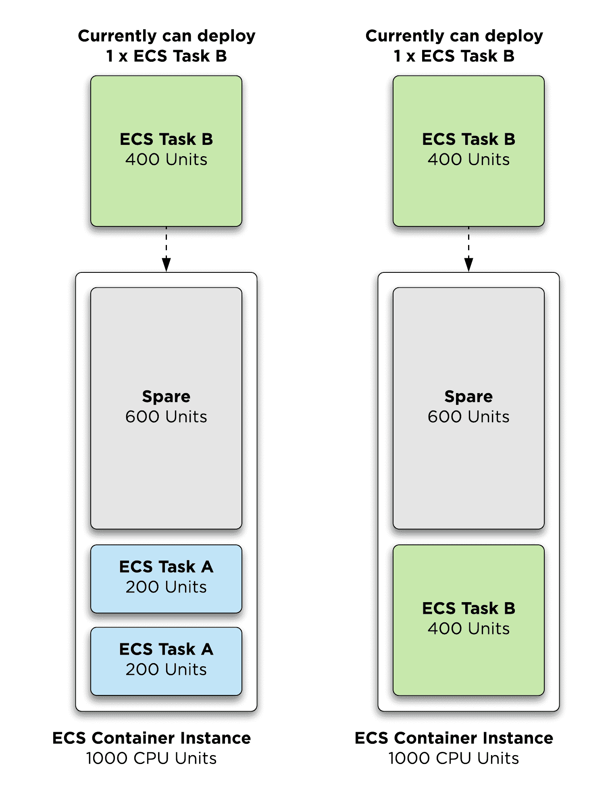

Calculating container capacity

这里需要注意的是，您需要在每个实例的基础上进行计算，而不仅仅是在整个集群中进行计算。使用前面的示例，如果您考虑整个集群中的空闲 CPU 容量，您有 1，200 个可用 CPU 单元，因此您将计算三个 ECS 任务的空闲容量，然而现实是您不能*将*ECS 任务分割到两个实例中，因此如果您考虑每个实例的空闲容量，显然您只能在每个实例上支持一个额外的 ECS 任务，从而在集群中正确地总共支持两个额外的 ECS 任务。

这可以形式化为一个数学方程，如下所示，公式右侧的标注表示取*楼*或计算的最低最近整数值，表示集群中的一个实例:

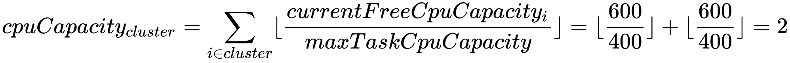

如果对内存资源重复前面的方法，您将计算一个单独的计算，根据内存定义集群的当前备用容量。如果我们假设内存的最坏情况 ECS 任务需要 500 MB 的内存，并且两个实例都有 400 MB 的可用内存，那么很明显，就内存而言，集群当前没有备用容量:


如果您现在考虑前面针对 CPU(当前两个空闲 ECS 任务)和内存(当前零个 ECS 任务)的两个计算，很明显，最坏的情况是零个空闲 ECS 任务的内存容量计算，可以形式化为:


请注意，虽然我们没有合并静态网络端口和网络接口的计算来帮助简化我们的解决方案，但一般方法是相同的-计算每个实例的当前容量和总和，以获得资源的总体群集容量值，然后将该值合并到总体群集容量计算中:

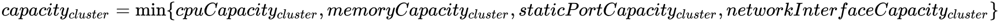

# 决定何时横向扩展

此时，我们已经确定您需要评估集群中的每个当前资源容量，用集群当前可以支持的空闲或备用 ECS 任务数量来表示，然后使用最坏情况计算(最小值)来确定您当前的总体集群容量。完成计算后，您需要决定是横向扩展群集，还是保持当前群集容量不变。当然，您还需要决定何时在集群中扩展，但是我们将很快单独讨论这个主题。

现在，我们将重点关注是否应该扩展*集群(即增加容量)，因为这是更简单的评估场景。这里的规则是，只要您当前的群集容量小于 1，您至少应该横向扩展群集:*

 *

换句话说，如果您的集群中当前没有足够的容量来支持一个以上的*最坏情况* *场景* ECS 任务，您应该向 ECS 集群添加一个新实例。这是有意义的，因为您试图确保您的集群在新的 ECS 任务启动时始终有足够的容量。当然，如果您想要更多的可用容量，可以将此阈值提高，这可能适用于容器经常上下旋转的更动态的环境。

# 计算空闲主机容量

如果我们现在考虑放大场景，这就变得有点难以确定了。我们讨论的备用 ECS 任务容量计算是相关的，也是必需的，但是您需要从这些方面考虑:如果您从集群中删除了一个 ECS 容器实例，是否有足够的容量用于所有当前正在运行的 ECS 任务以及至少一个附加 ECS 任务的备用容量？另一种表达方式是计算集群的*空闲主机容量*-如果集群中有超过 1.0 台主机空闲，则可以安全地在集群中扩展，因为减去一台主机将导致剩余的非零正容量。请注意，我们指的是整个集群中的空闲主机容量，因此请将其视为虚拟主机计算，因为您可能不会有完全空闲的主机。这种虚拟主机计算是安全的，因为如果我们真的从集群中删除了一个主机，生命周期挂钩和 ECS 容器实例-我们之前在第 11 章- *中介绍的排空功能管理 ECS 基础架构生命周期*将确保在要删除的实例上运行的任何容器都将迁移到集群中的其他实例。

了解空闲主机容量必须大于 1.0 且不等于 1.0 也很重要，因为您必须有足够的备用容量来执行一项 ECS 任务，否则您将触发横向扩展操作，从而导致自动横向扩展/纵向扩展循环。

要确定当前的空闲主机容量，我们需要了解以下内容:

*   每个 ECS 容器实例可以为每种不同类型的 ECS 资源运行的最大 ECS 任务数(表示为)。
*   整个集群中每种类型的 ECS 资源的当前可用容量(表示为)，我们在确定是否横向扩展时已经计算过了。

利用这些信息，您可以计算给定资源的空闲主机容量，如下所示:


# 空闲主机容量示例

为了更清楚地说明这一点，我们来看一个例子，如下图所示，首先假设如下:

*   最坏情况下，ECS 任务需要 400 个中央处理器
*   最坏情况下，ECS 任务内存需要 200 MB
*   每个 ECS 容器实例最多支持 1，000 个 CPU 单元和 1，000 MB 内存
*   当前在 ECS 群集中的两个 ECS 容器实例
*   每个 ECS 容器实例目前有 600 个 CPU 单元的备用容量。使用前面讨论的可用容量计算，这相当于两个群集的当前可用容量
*   ECS 在 CPU 资源方面的任务，我们将称之为。

*   每个 ECS 容器实例目前都有 800 MB 的备用容量。使用前面讨论的可用容量计算，这相当于内存资源方面的八个 ECS 任务集群的当前可用容量，我们将其称为:

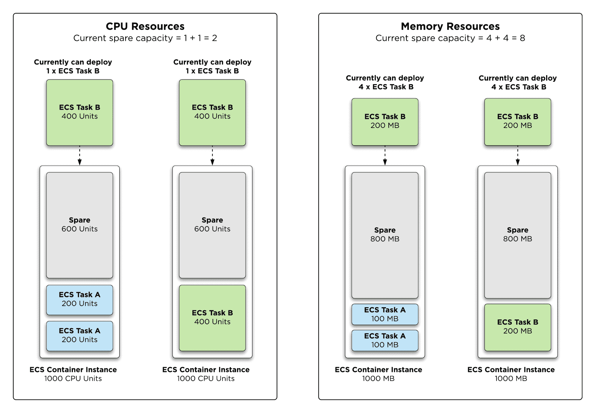

Idle host capacity

我们可以首先计算值，如下所示:

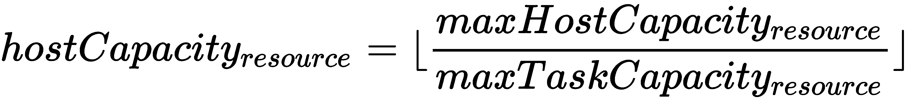

对于 CPU，它等于值 2，对于内存，它等于值 *5* :

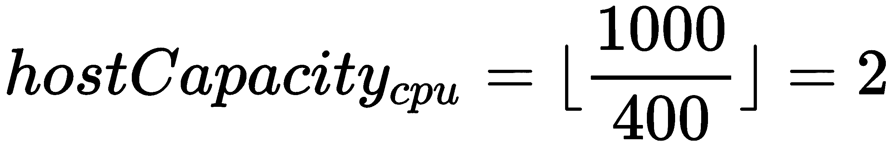

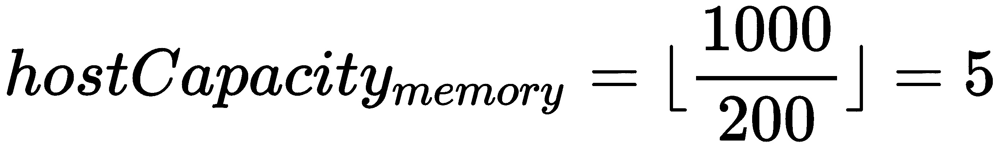

通过计算这些值并了解集群的当前可用容量，我们现在可以计算每个资源的空闲主机容量:


以下是如何计算最坏情况下的总空闲主机容量:


此时，给定空闲主机容量为 1.0，我们应该在集群中*而不是*扩展，因为容量当前不大于 1*。鉴于您正好有一台空闲主机，这可能看起来违反直觉，但是如果您此时确实删除了一个实例，这将导致集群的可用 CPU 容量为 0，并且在没有空闲 CPU 容量的情况下，集群将横向扩展。*

 *# 实施 ECS 自动扩展解决方案

现在，您已经很好地理解了如何计算 ECS 群集容量以做出横向扩展和纵向扩展决策，我们准备实施自动扩展解决方案，如下图所示:

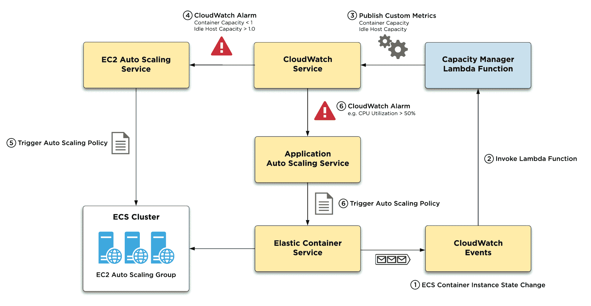

下面提供了上图所示解决方案的演练:

1.  在计算 ECS 集群容量之前，您需要一种机制来触发容量计算，最好是在 ECS 容器实例的容量发生变化时。这可以通过利用 CloudWatch Events 服务来实现，该服务为包括 ECS 在内的各种 AWS 服务发布事件，并允许您创建*事件规则*，这些规则订阅特定事件并使用各种机制(包括 Lambda 函数)对其进行处理。CloudWatch 事件支持接收有关 ECS 容器实例状态变化的信息，这代表了触发集群容量计算的理想机制，因为对 ECS 容器实例可用资源的任何更改都将触发状态变化事件。

2.  为每个 ECS 容器实例状态更改事件触发一个负责计算 ECS 集群容量的 Lambda 函数。
3.  Lambda 函数不是决定自动扩展集群，而是以 CloudWatch 自定义指标的形式发布当前容量，该指标报告当前空闲容器容量和空闲主机容量。
4.  CloudWatch 服务配置有警报，只要空闲容器容量或空闲主机容量低于或超过集群中横向扩展或扩展的阈值，就会触发 EC2 自动扩展操作。
5.  EC2 自动缩放服务配置有 EC2 自动缩放策略，这些策略是响应 CloudWatch 发出的警报而调用的。
6.  除了配置用于管理 ECS 集群容量的 CloudWatch 警报之外，您还可以为每个 ECS 服务配置适当的 CloudWatch 警报，这样就可以触发 AWS 应用程序自动扩展服务来扩展或扩展为您的 ECS 服务运行的 ECS 任务的数量。例如，在上图中，ECS 服务配置有应用程序自动扩展策略，如果 ECS 服务的 CPU 利用率超过 50%，该策略会增加 ECS 任务的数量。

现在让我们实现解决方案的各个组件。

# 为 ECS 配置云监视事件

我们需要执行的第一个任务是设置一个 CloudWatch 事件规则，该规则订阅 ECS 容器-实例状态-更改事件，并配置一个 Lambda 函数的目标，该函数将计算 ECS 集群容量。

下面的示例演示了如何将 CloudWatch 事件规则添加到 todo back and-AWS`stack.yml`cloud information 模板中:

```
...
...
Resources:
  EcsCapacityPermission:
 Type: AWS::Lambda::Permission
 Properties:
 Action: lambda:InvokeFunction
 FunctionName: !Ref EcsCapacityFunction
 Principal: events.amazonaws.com
 SourceArn: !Sub ${EcsCapacityEvents.Arn}
 EcsCapacityEvents:
 Type: AWS::Events::Rule
 Properties:
 Description: !Sub ${AWS::StackName} ECS Events Rule
 EventPattern:
 source:
 - aws.ecs
 detail-type:
 - ECS Container Instance State Change
 detail:
 clusterArn:
 - !Sub ${ApplicationCluster.Arn}
 Targets:
 - Arn: !Sub ${EcsCapacityFunction.Arn}
 Id: !Sub ${AWS::StackName}-ecs-events
  LifecycleHook:
    Type: AWS::AutoScaling::LifecycleHook
...
...
```

`EcsCapacityEvents`资源定义事件规则，包括两个关键属性:

*   `EventPattern`:定义事件与此规则匹配的模式。所有 CloudWatch 事件包括`source`、`detail-type`和`detail`属性，事件模式确保只有与`ApplicationCluster`资源(由`detail`模式定义)的 ECS 容器实例状态更改(由`detail-type`模式定义)相关的 ECS 事件(由`aws.ecs`的`source`模式定义)将与规则匹配。
*   `Targets`:定义事件应该路由到的目标资源。在前面的例子中，您引用了一个名为`EcsCapacityFunction`的 Lambda 函数的 ARN，您将很快定义它。

`EcsCapacityPermission`资源确保 CloudWatch 事件服务拥有调用`EcsCapacityFunction` Lambda 函数的权限。对于任何调用 Lambda 函数的服务，这都是一种常见的方法，即添加一个 Lambda 权限，该权限授予给定 AWS 服务(由`SourceArn`属性定义)的给定资源(由`Principal`属性定义)调用 Lambda 函数(`FunctionName`属性)的能力。

现在，让我们添加引用的 Lambda 函数，以及一个 IAM 角色和 CloudWatch 日志组:

```
...
...
Resources:
  EcsCapacityRole:
 Type: AWS::IAM::Role
 Properties:
 AssumeRolePolicyDocument:
 Version: "2012-10-17"
 Statement:
 - Action:
 - sts:AssumeRole
 Effect: Allow
 Principal:
 Service: lambda.amazonaws.com
 Policies:
 - PolicyName: EcsCapacityPermissions
 PolicyDocument:
 Version: "2012-10-17"
 Statement:
 - Sid: ManageLambdaLogs
 Effect: Allow
 Action:
 - logs:CreateLogStream
 - logs:PutLogEvents
 Resource: !Sub ${EcsCapacityLogGroup.Arn}
 EcsCapacityFunction:
 Type: AWS::Lambda::Function
 DependsOn:
 - EcsCapacityLogGroup
 Properties:
 Role: !Sub ${EcsCapacityRole.Arn}
 FunctionName: !Sub ${AWS::StackName}-ecsCapacity
 Description: !Sub ${AWS::StackName} ECS Capacity Manager
 Code:
 ZipFile: |
 import json
 def handler(event, context):
 print("Received event %s" % json.dumps(event))
 Runtime: python3.6
 MemorySize: 128
 Timeout: 300
 Handler: index.handler
  EcsCapacityLogGroup:
 Type: AWS::Logs::LogGroup
 DeletionPolicy: Delete
 Properties:
 LogGroupName: !Sub /aws/lambda/${AWS::StackName}-ecsCapacity
 RetentionInDays: 7
  EcsCapacityPermission:
    Type: AWS::Lambda::Permission
...
...
```

到目前为止，您应该已经很好地理解了如何使用 CloudFormation 定义 Lambda 函数，因此我将不深入描述前面的示例。但是，请注意，目前我已经实现了一个简单打印任何接收到的事件的基本功能——我们将使用它来初步了解 ECS 容器实例状态更改事件的结构。

此时，您现在可以使用`aws cloudformation deploy`命令部署您的更改:

```
> export AWS_PROFILE=docker-in-aws
> aws cloudformation deploy --template-file stack.yml \
 --stack-name todobackend --parameter-overrides $(cat dev.cfg) \
 --capabilities CAPABILITY_NAMED_IAM
Enter MFA code for arn:aws:iam::385605022855:mfa/justin.menga:

Waiting for changeset to be created..
Waiting for stack create/update to complete
Successfully created/updated stack - todobackend
```

部署完成后，您可以通过停止在您的 ECS 群集上运行的现有 ECS 任务来触发 ECS 容器实例状态更改:

```
> aws ecs list-tasks --cluster todobackend-cluster
{
    "taskArns": [
        "arn:aws:ecs:us-east-1:385605022855:task/5754a076-6f5c-47f1-8e73-c7b229315e31"
    ]
}
> aws ecs stop-task --cluster todobackend-cluster --task 5754a076-6f5c-47f1-8e73-c7b229315e31
```

```
{
    "task": {
        ...
        ...
        "lastStatus": "RUNNING",
        "desiredStatus": "STOPPED",
        ...
        ...
    }
}
```

因为此 ECS 任务链接到一个 ECS 服务，所以 ECS 将自动启动一个新的 ECS 任务，如果您前往 CloudWatch 控制台，选择 Logs，然后为处理 ECS 容器实例状态更改事件(`/aws/lambda/todobackend-ecsCapacity`)的 Lambda 函数打开日志组的最新日志流，您应该会看到记录了几个事件:


在前面的截图中，您可以看到在几秒钟内记录了两个事件，这表示您停止了 ECS 任务，然后 ECS 自动启动了一个新的 ECS 任务，以确保链接的 ECS 服务满足其配置的期望计数。

您可以看到`source`和`detail-type`属性与您之前配置的事件模式相匹配，如果您在第二个事件中进一步向下滚动，您应该会发现一个名为`registeredResources`和`remainingResources`的属性，如下例所示:

```
{
  ...
  ...
  "clusterArn": "arn:aws:ecs:us-east-1:385605022855:cluster/todobackend-cluster",      
  "containerInstanceArn": "arn:aws:ecs:us-east-1:385605022855:container-instance/d27868d6-79fd-4858-bec6-65720855e0b3",
  "ec2InstanceId": "i-0d9bd79d19a843216",
  "registeredResources": [             
    {                 
      "name": "CPU",                 
      "type": "INTEGER",                 
      "integerValue": 1024             
    },
    {                 
       "name": "MEMORY",                 
       "type": "INTEGER",                 
       "integerValue": 993             
    },
    {
       "name": "PORTS",                 
       "type": "STRINGSET",                 
       "stringSetValue": ["22","2376","2375","51678","51679"]
    }
  ],
  "remainingResources": [ 
    { 
      "name": "CPU", 
      "type": "INTEGER", 
      "integerValue": 774 
    },
    { 
       "name": "MEMORY", 
       "type": "INTEGER", 
       "integerValue": 593 
    },
    {
       "name": "PORTS", 
       "type": "STRINGSET", 
       "stringSetValue": ["22","2376","2375","51678","51679"]
    }
  ],
  ...
  ...
}
```

`registeredResources`属性定义了分配给实例的总资源，而`remainingResources`表示每个资源的当前剩余数量。因为上例中的事件是在 ECS 为 todobackend 服务启动新的 ECS 任务时引发的，所以分配给该任务的总共 250 个 CPU 单元和 400 MB 内存从`registeredResources`中扣除，然后反映在`remainingResources`属性中。还要注意，在示例 12-6 的输出顶部，该事件包括其他有用的信息，例如 ECS 集群 ARN 和 ECS 容器实例 ARN 值(由`clusterArn`和`containerInstanceArn`属性指定)。

# 对计算集群容量的 Lambda 函数进行编程

现在，您已经设置了 CloudWatch 事件和 Lambda 函数，每当检测到 ECS 容器实例状态更改时，就会调用该函数，现在，您可以在 Lambda 函数中实现所需的应用程序代码，该代码将执行适当的 ECS 集群容量计算:

```
...
...
Resources:
  ...
  ...
  EcsCapacityFunction:
    Type: AWS::Lambda::Function
    DependsOn:
      - EcsCapacityLogGroup
    Properties:
      Role: !Sub ${EcsCapacityRole.Arn}
      FunctionName: !Sub ${AWS::StackName}-ecsCapacity
      Description: !Sub ${AWS::StackName} ECS Capacity Manager
      Code:
 ZipFile: |
 import json
          import boto3
          ecs = boto3.client('ecs')
          # Max memory and CPU - you would typically inject these as environment variables
          CONTAINER_MAX_MEMORY = 400
          CONTAINER_MAX_CPU = 250

          # Get current CPU
          def check_cpu(instance):
            return sum(
              resource['integerValue']
              for resource in instance['remainingResources']
              if resource['name'] == 'CPU'
            )
          # Get current memory
          def check_memory(instance):
            return sum(
              resource['integerValue']
              for resource in instance['remainingResources']
              if resource['name'] == 'MEMORY'
            )
          # Lambda entrypoint
          def handler(event, context):
            print("Received event %s" % json.dumps(event))

            # STEP 1 - COLLECT RESOURCE DATA
            cluster = event['detail']['clusterArn']
            # The maximum CPU availble for an idle ECS instance
            instance_max_cpu = next(
              resource['integerValue']
              for resource in event['detail']['registeredResources']
              if resource['name'] == 'CPU')
            # The maximum memory availble for an idle ECS instance
            instance_max_memory = next(
              resource['integerValue']
              for resource in event['detail']['registeredResources']
              if resource['name'] == 'MEMORY')
            # Get current container capacity based upon CPU and memory
            instance_arns = ecs.list_container_instances(
              cluster=cluster
            )['containerInstanceArns']
            instances = [
              instance for instance in ecs.describe_container_instances(
                cluster=cluster,
                containerInstances=instance_arns
              )['containerInstances']
              if instance['status'] == 'ACTIVE'
            ]
            cpu_capacity = 0
            memory_capacity = 0
            for instance in instances:
              cpu_capacity += int(check_cpu(instance)/CONTAINER_MAX_CPU)
              memory_capacity += int(check_memory(instance)/CONTAINER_MAX_MEMORY)
            print("Current container cpu capacity of %s" % cpu_capacity)
            print("Current container memory capacity of %s" % memory_capacity)

            # STEP 2 - CALCULATE OVERALL CONTAINER CAPACITY
            container_capacity = min(cpu_capacity, memory_capacity)
            print("Overall container capacity of %s" % container_capacity)

            # STEP 3 - CALCULATE IDLE HOST COUNT
            idle_hosts = min(
              cpu_capacity / int(instance_max_cpu / CONTAINER_MAX_CPU),
              memory_capacity / int(instance_max_memory / CONTAINER_MAX_MEMORY)
            )
            print("Overall idle host capacity of %s" % idle_hosts)
      Runtime: python3.6
      MemorySize: 128
      Timeout: 300
      Handler: index.handler
...
...
```

在前面的示例中，您首先定义了您的群集将支持的 ECS 任务的最大 CPU 和最大内存，这是进行各种群集容量计算所必需的，我们使用当前为 todobackend 服务配置的 CPU 和内存设置，因为这是我们群集上唯一支持的应用程序。在`handler`功能中，第一步是使用接收到的 CloudWatch 事件收集当前资源容量数据。该事件包括`registeredResources`属性中有关您的 ECS 容器实例的最大容量的详细信息，还包括该实例所属的 ECS 集群。该函数首先列出集群中的所有实例，然后使用 ECS 客户端上的`describe_container_instances`调用加载每个实例的详细信息。

在每个实例上收集的信息仅限于活动实例，因为您不希望包含可能处于 DRAINING 状态或其他非活动状态的实例的资源。

The code in the preceding example, will only work correctly in a Python 3.x environment, so ensure your Lambda function is configured to use Python 3.6.

收集了关于每个 ECS 容器实例的必要信息后，您可以遍历每个实例并计算 CPU 和内存容量。这将调用帮助器函数来查询每个实例的`remainingResources`属性，返回每个资源的当前可用容量。每一个计算都是用您前面定义的最大容器来表示的，并被加在一起以提供整个集群的 CPU 和内存容量，这是为了提供信息而打印的。

下一步是计算整体容器容量，这很容易通过取先前计算的资源容量的最小值来计算，这将用于确定您的 ECS 群集何时需要横向扩展，至少是在容器容量降至零以下时。最后，进行空闲主机容量计算–该值将用于确定您的 ECS 群集何时应进行扩展，这只有在空闲主机容量大于 1.0 时才会发生，如前所述。

# 添加用于计算群集容量的 IAM 权限

关于前面例子中的代码，需要注意的一点是，它需要调用 ECS 服务并执行`ListContainerInstances`和`DescribeContainerInstances` API 调用的能力。这意味着您需要向 Lambda 函数 IAM 角色添加适当的 IAM 权限，如下例所示:

```
...
...
Resources:
  ...
  ...
  EcsCapacityRole:
    Type: AWS::IAM::Role
    Properties:
      AssumeRolePolicyDocument:
        Version: "2012-10-17"
        Statement:
          - Action:
              - sts:AssumeRole
            Effect: Allow
            Principal:
              Service: lambda.amazonaws.com
      Policies:
        - PolicyName: EcsCapacityPermissions
          PolicyDocument:
            Version: "2012-10-17"
            Statement:
              - Sid: ListContainerInstances
 Effect: Allow
 Action:
 - ecs:ListContainerInstances
 Resource: !Sub ${ApplicationCluster.Arn}
 - Sid: DescribeContainerInstances
 Effect: Allow
 Action:
 - ecs:DescribeContainerInstances
 Resource: "*"
 Condition:
 ArnEquals:
 ecs:cluster: !Sub ${ApplicationCluster.Arn}
              - Sid: ManageLambdaLogs
                Effect: Allow
                Action:
                - logs:CreateLogStream
                - logs:PutLogEvents
                Resource: !Sub ${EcsCapacityLogGroup.Arn}
  ...
  ...
```

# 测试集群容量计算

您已经添加了计算集群容量所需的代码，并确保您的 Lambda 函数具有适当的权限来查询 ECS，以确定集群中所有 ECS 容器实例的当前容量。您现在可以使用`aws cloudformation deploy`命令部署您的更改，一旦部署完成，您可以通过停止在 todobackend ECS 集群内运行的任何 ECS 任务来再次测试您的 Lambda 函数。

如果您查看 Lambda 函数的 CloudWatch 日志，您应该会看到类似于这里所示的事件:

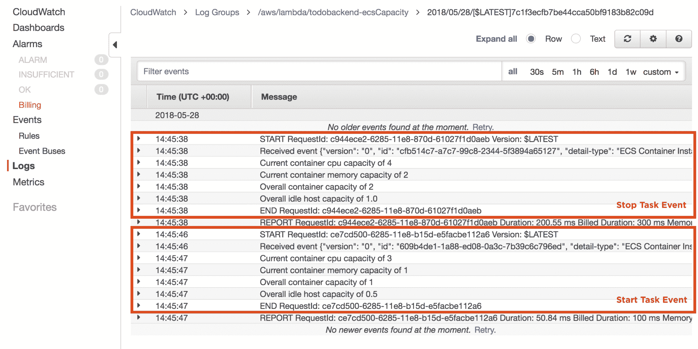

请注意，当您停止 ECS 任务时(如停止任务事件所示)，Lambda 函数报告的 CPU 容量为 4，内存容量为 2，总容量为 2，这是每个计算出的资源容量的最小值。

如果你仔细检查一下，你会发现计算是准确无误的。对于初始事件，由于您停止了 ECS 任务，因此没有任务在运行，因此可用的 CPU 和内存资源分别为 1，024 个单位和 993 MB(T2 . micro 实例的容量)。这相当于以下集装箱容量:

*   中央处理器容量= 1024 / 250 = 4
*   内存容量= 993 / 400 = 2

当 ECS 自动替换停止的 ECS 任务时，您可以看到集群容量下降，因为一个新的 ECS 任务(具有 250 个 CPU 单元和 400 MB 内存)现在正在消耗资源:

*   CPU 容量= 1024 - 250 / 250 = 774 / 250 = 3
*   内存容量= 993 - 400 / 400 = 593 / 400 = 1

最后，您可以看到，当您停止 ECS 任务时，总空闲主机容量被正确计算为 1.0，这是正确的，因为当时您的群集上没有运行任何 ECS 任务。当 ECS 替换停止的任务时，总体空闲主机容量减少到 0.5，因为就内存资源而言，ECS 容器实例现在正在运行单个实例上最多可以运行的两个 ECS 任务中的一个。

# 发布自定义云观察指标

此时，我们正在计算适当的指标，以确定何时需要在集群中进行横向扩展或纵向扩展，该功能中需要执行的最后一项任务是发布定制的 CloudWatch 事件指标，我们可以使用这些指标来触发自动扩展策略:

```
...
...
Resources:
  ...
  ...
  EcsCapacityFunction:
    Type: AWS::Lambda::Function
    DependsOn:
      - EcsCapacityLogGroup
    Properties:
      Role: !Sub ${EcsCapacityRole.Arn}
      FunctionName: !Sub ${AWS::StackName}-ecsCapacity
      Description: !Sub ${AWS::StackName} ECS Capacity Manager
      Code:
        ZipFile: |
          import json
          import boto3
          import datetime
          ecs = boto3.client('ecs') cloudwatch = boto3.client('cloudwatch') # Max memory and CPU - you would typically inject these as environment variables
          CONTAINER_MAX_MEMORY = 400
          CONTAINER_MAX_CPU = 250          ...
          ...
          # Lambda entrypoint
          def handler(event, context):
            print("Received event %s" % json.dumps(event))            ...
            ...# STEP 3 - CALCULATE IDLE HOST COUNT            idle_hosts = min(
              cpu_capacity / int(instance_max_cpu / CONTAINER_MAX_CPU),
              memory_capacity / int(instance_max_memory / CONTAINER_MAX_MEMORY)
            )
            print("Overall idle host capacity of %s" % idle_hosts)

 # STEP 4 - PUBLISH CLOUDWATCH METRICS
 cloudwatch.put_metric_data(
 Namespace='AWS/ECS',
 MetricData=[
              {
                'MetricName': 'ContainerCapacity',
                'Dimensions': [{
                  'Name': 'ClusterName',
                  'Value': cluster.split('/')[-1]
                }],
                'Timestamp': datetime.datetime.utcnow(),
                'Value': container_capacity
              }, 
              {
 'MetricName': 'IdleHostCapacity',
 'Dimensions': [{
 'Name': 'ClusterName',
 'Value': cluster.split('/')[-1]
 }],
 'Timestamp': datetime.datetime.utcnow(),
 'Value': idle_hosts
 }
            ])
      Runtime: python3.6
      MemorySize: 128
      Timeout: 300
      Handler: index.handler
...
...
```

在前面的示例中，您使用 CloudWatch 客户端`put_metric_data`函数来发布 AWS/ECS 命名空间内的`ContainerCapacity`和`IdleHostCapacity`自定义指标。这些度量是根据由集群名称维度名称指定的 ECS 集群来确定的，并且仅限于 todobackend 和 ECS 集群。

确保 Lambda 函数正确运行所需的最后一项配置任务是授予函数发布 CloudWatch 度量的权限。这是通过向您在前面的示例中创建的`EcsCapacityRole`添加适当的 IAM 权限来实现的:

```
...
...
Resources:
  ...
  ...
  EcsCapacityRole:
    Type: AWS::IAM::Role
    Properties:
      AssumeRolePolicyDocument:
        Version: "2012-10-17"
        Statement:
          - Action:
              - sts:AssumeRole
            Effect: Allow
            Principal:
              Service: lambda.amazonaws.com
      Policies:
        - PolicyName: EcsCapacityPermissions
          PolicyDocument:
            Version: "2012-10-17"
            Statement:
              - Sid: PublishCloudwatchMetrics
 Effect: Allow
 Action:
 - cloudwatch:putMetricData
 Resource: "*"
              - Sid: ListContainerInstances
                Effect: Allow
                Action:
                  - ecs:ListContainerInstances
                Resource: !Sub ${ApplicationCluster.Arn}
              - Sid: DescribeContainerInstances
                Effect: Allow
                Action:
                  - ecs:DescribeContainerInstances
                Resource: "*"
                Condition:
                  ArnEquals:
                    ecs:cluster: !Sub ${ApplicationCluster.Arn}
              - Sid: ManageLambdaLogs
                Effect: Allow
                Action:
                - logs:CreateLogStream
                - logs:PutLogEvents
                Resource: !Sub ${EcsCapacityLogGroup.Arn}
  ...
  ...
```

如果您现在使用`aws cloudformation deploy`命令部署您的更改，然后停止正在运行的 ECS 任务，在切换到 CloudWatch 控制台后，您应该能够看到与您的 ECS 集群相关的新指标正在发布。如果您从左侧菜单中选择**指标**，然后在**所有指标**下选择 **ECS >集群名称**，您应该会看到您的自定义指标(`ContainerCapacity`和`IdleHostCapacity`)。下面的屏幕截图显示了根据一分钟内收集的最大值绘制的这些指标。在图表上的 12:49，您可以看到当您停止 ECS 任务时`ContainerCapacity`和`IdleHostCapacity`指标都增加了，然后一旦 ECS 开始新的 ECS 任务，这两个指标的值就会随着新的 ECS 任务从您的集群中分配资源而减少:

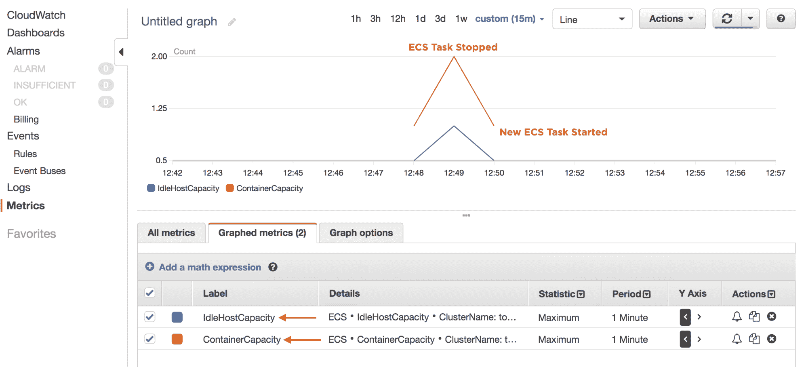

# 为集群容量管理创建云监控警报

现在，只要您的 ECS 集群中发生 ECS 容器实例状态更改，您就能够计算和发布 ECS 集群容量指标。整体解决方案的下一步是实施 CloudWatch 警报，每当指标超过或低于与集群容量相关的指定阈值时，该警报将触发自动扩展操作。

下面的代码演示了如何将两个 CloudWatch 警报添加到 todobackend 堆栈中:

```
...
...
Resources:
  ...
  ...
 ContainerCapacityAlarm:
 Type: AWS::CloudWatch::Alarm
 Properties:
 AlarmDescription: ECS Cluster Container Free Capacity
 AlarmActions:
        - !Ref ApplicationAutoscalingScaleOutPolicy
 Namespace: AWS/ECS
 Dimensions:
 - Name: ClusterName
 Value: !Ref ApplicationCluster
 MetricName: ContainerCapacity
 Statistic: Minimum
 Period: 60
 EvaluationPeriods: 1
 Threshold: 1
 ComparisonOperator: LessThanThreshold
 TreatMissingData: ignore
 IdleHostCapacityAlarm:
 Type: AWS::CloudWatch::Alarm
 Properties:
 AlarmDescription: ECS Cluster Container Free Capacity
 AlarmActions:
        - !Ref ApplicationAutoscalingScaleInPolicy
 Namespace: AWS/ECS
 Dimensions:
 - Name: ClusterName
 Value: !Ref ApplicationCluster
 MetricName: IdleHostCapacity
 Statistic: Maximum
 Period: 60
 EvaluationPeriods: 1
 Threshold: 1
 ComparisonOperator: GreaterThanThreshold
 TreatMissingData: ignore
  ...
  ...
```

在前面的示例中，您添加了两个 CloudWatch 警报–一个`ContainerCapacityAlarm`将用于在容器容量低于 1 时触发横向扩展操作，另一个`IdleHostCapacityAlarm`将用于在空闲主机容量大于 1 时触发横向扩展操作。每个警报的各种属性将在此进一步详细描述:

*   `AlarmActions`:定义警报违反其配置标准时应采取的措施。在这里，我们参考了我们将很快定义的 EC2 自动扩展策略资源，每当发出警报时，这些资源都会触发适当的自动扩展扩展或扩展操作。
*   `Namespace`:定义警报相关的度量的名称空间。
*   `Dimensions`:定义度量如何与给定命名空间内的资源相关联的上下文。在前面的示例中，上下文被配置为我们堆栈中的 ECS 集群。
*   `MetricName`:定义度量的名称。在这里，我们指定了上一节中发布的每个自定义指标的名称。
*   `Statistic`:定义应该评估的度量的统计。这实际上是一个非常重要的参数，例如，在集装箱容量警报的情况下，设置最大值可确保低于配置阈值 1 的瞬态指标不会不必要地触发警报，假设在每个评估期间至少有 1 个值超过配置阈值。这同样适用于空闲主机容量警报，但方向相反。
*   `Period`、`EvaluationPeriods`、`Threshold`和`ComparisonOperator`:这些定义了指标必须超出配置的阈值和比较运算符界限的时间范围。如果超过这些界限，将会发出警报。
*   `TreatMissingData`:该设置定义了您应该如何处理丢失的度量数据。在我们的用例中，丢失度量数据是常见的情况，因为我们只在 ECS 容器实例状态改变时发布度量，所以设置值`ignore`可以确保我们不会将丢失数据视为出错的指示。

# 创建 EC2 自动缩放策略

现在，您需要创建在每个 CloudWatch 警报资源中引用的 EC2 自动缩放策略资源。

下面的示例演示了向 todobackend 堆栈添加横向扩展和纵向扩展策略:

```
...
...
Resources:
  ...
  ...
 ApplicationAutoscalingScaleOutPolicy:
    Type: AWS::AutoScaling::ScalingPolicy
    Properties:
      PolicyType: SimpleScaling
      AdjustmentType: ChangeInCapacity
      ScalingAdjustment: 1
      AutoScalingGroupName: !Ref ApplicationAutoscaling
      Cooldown: 600
  ApplicationAutoscalingScaleInPolicy:
    Type: AWS::AutoScaling::ScalingPolicy
    Properties:
      PolicyType: SimpleScaling
      AdjustmentType: ChangeInCapacity
      ScalingAdjustment: -1
      AutoScalingGroupName: !Ref ApplicationAutoscaling
      Cooldown: 600
  ...
  ...
  ApplicationAutoscaling:
    Type: AWS::AutoScaling::AutoScalingGroup
    DependsOn:
      - DmesgLogGroup
      - MessagesLogGroup
      - DockerLogGroup
      - EcsInitLogGroup
      - EcsAgentLogGroup
    CreationPolicy:
      ResourceSignal:
 Count: 1
        Timeout: PT15M
    UpdatePolicy:
      AutoScalingRollingUpdate:
        SuspendProcesses:
 - HealthCheck
 - ReplaceUnhealthy
 - AZRebalance
 - AlarmNotification
 - ScheduledActions        MinInstancesInService: 1
        MinSuccessfulInstancesPercent: 100
        WaitOnResourceSignals: "true"
        PauseTime: PT15M
    Properties:
      LaunchConfigurationName: !Ref ApplicationAutoscalingLaunchConfiguration
      MinSize: 0
      MaxSize: 4
 DesiredCapacity: 1        ...
        ...

```

在前面的示例中，您定义了两个`SimpleScaling`类型的自动缩放策略，这是您可以实现的最简单的自动缩放形式。对各种自动缩放类型的讨论不在本书的讨论范围内，但是如果您有兴趣了解更多可用的选项，可以参考[https://docs . AWS . Amazon . com/autoscaling/ec2/user guide/as-scale-based-on-demand . html](https://docs.aws.amazon.com/autoscaling/ec2/userguide/as-scale-based-on-demand.html)。`AdjustmentType`和`ScalingAdjustment`属性被配置为将自动缩放组的大小增加或减少一个实例，而`Cooldown`属性提供了一种机制来确保在指定的持续时间内禁用进一步的自动缩放操作，这有助于避免自动缩放循环，在该循环中，您的集群会不断地向外扩展和向内扩展。

请注意，`ApplicationAutoscaling` `UpdatePolicy`设置已更新为包含`SuspendProcesses`参数，该参数将云信息配置为每当发生自动缩放滚动更新时禁用某些操作流程。这特别禁用了滚动更新期间的自动缩放操作，这很重要，因为您不希望自动缩放操作干扰 CloudFormation 协调的滚动更新。最后，我们还将`ApplicationAutoscaling`资源上的各种计数设置设置为固定值 1，因为自动缩放现在将管理我们的 ECS 集群的大小。

# 测试 ECS 集群-容量管理

现在，我们已经拥有了计算 ECS 集群容量、发布指标和触发警报的所有组件，这些组件将调用自动扩展操作，让我们部署我们的更改，并测试解决方案是否按预期工作。

# 测试横向扩展

要人工触发横向扩展操作，我们需要在`dev.cfg`配置文件中将`ApplicationDesiredCount`输入参数设置为 2，这将使我们的 ECS 服务的 ECS 任务计数增加到 2，并将导致 ECS 集群中的单个 ECS 容器实例不再有足够的资源来支持任何其他容器:

```
ApplicationDesiredCount=2
ApplicationImageId=ami-ec957491
ApplicationImageTag=5fdbe62
ApplicationSubnets=subnet-a5d3ecee,subnet-324e246f
VpcId=vpc-f8233a80
```

该配置更改将导致`ContainerCapacity`度量低于配置的报警阈值`1`，我们现在可以通过运行`aws cloudformation deploy`命令将更改部署到云信息来测试该阈值。

部署完成后，如果您浏览到 CloudWatch 控制台并从左侧菜单中选择 Alarms，您应该会看到容器容量警报进入 alarm 状态(这可能需要几分钟时间)，如前所述:

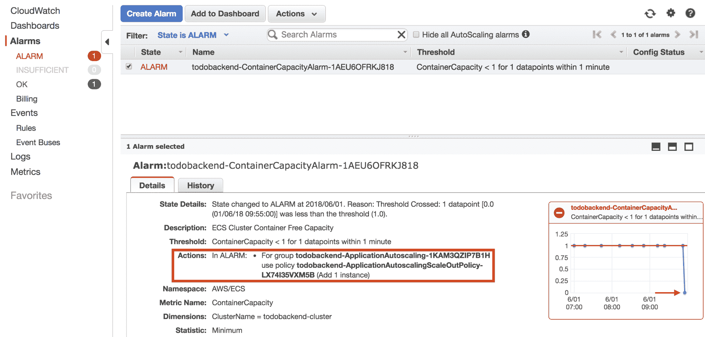

您可以在操作详细信息中看到，CloudWatch 警报触发了应用程序自动扩展扩展策略，请注意，在左侧的图表中，这是因为在单个 ECS 容器实例上运行的 ECS 任务增加，导致容器容量降至 0。

如果您现在导航到 EC2 控制台，从左侧菜单中选择**自动缩放组**，然后为 todobackend 自动缩放组选择**活动历史记录**选项卡，您可以看到自动缩放组中的当前实例计数为`2`，并且由于容器容量警报转换为报警状态而启动了新的 EC2 实例:

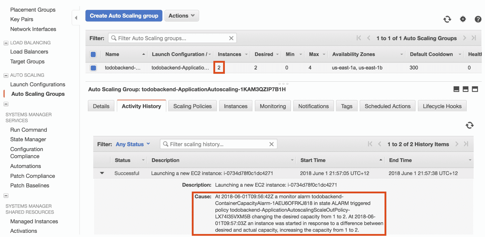

将新的 ECS 容器实例添加到 ECS 集群后，将进行新的容量计算，如果切换回 CloudWatch 控制台，您应该会看到 ContainerCapacity 警报最终会转换为 OK 状态，如下图所示:

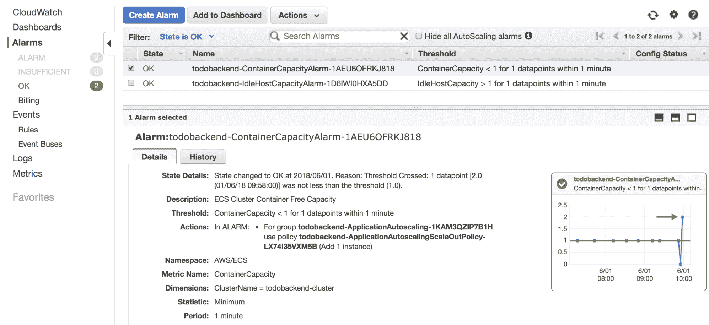

在右下角的图中，可以看到添加新的 ECS 容器实例的效果，将容器容量从`0`增加到`2`，将容器容量告警置为 OK 状态。

# 测试规模

现在，您已经成功测试了 ECS 群集容量管理解决方案的横向扩展行为，现在让我们通过将`dev.cfg`文件中的`ApplicationDesiredCount`减少到 1 并运行`aws cloudformation deploy`命令来部署修改后的计数，从而人工触发横向扩展行为:

```
ApplicationDesiredCount=1
ApplicationImageId=ami-ec957491
ApplicationImageTag=5fdbe62
ApplicationSubnets=subnet-a5d3ecee,subnet-324e246f
VpcId=vpc-f8233a80
```

一旦部署了这一更改，在 CloudWatch 控制台中，您应该会看到空闲主机容量警报在几分钟后变为报警状态:

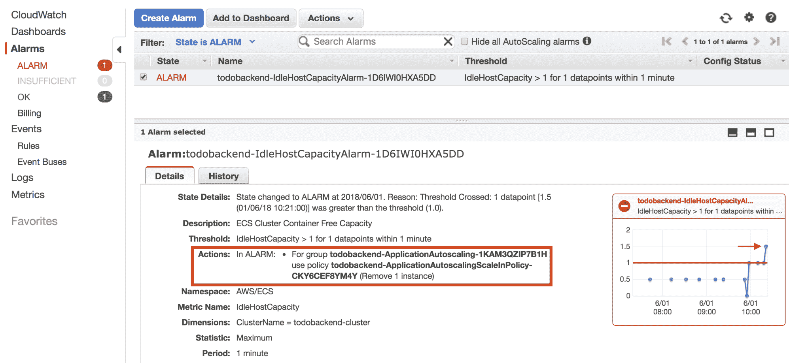

在前面的截图中，空闲主机容量从 1.0 增加到 1.5，因为我们现在在集群中只有一个正在运行的 ECS 任务和两个 ECS 容器实例。这触发了策略中已配置的应用程序自动缩放比例，这将把 ECS 群集容量减少到单个 ECS 容器实例，最终空闲主机容量警报将转换为正常状态。

# 配置自动缩放服务

我们现在有了一个 ECS 集群容量管理解决方案，随着新的 ECS 任务在您的 ECS 集群中来来去去，该解决方案将在您的 ECS 集群中自动横向扩展和扩展。到目前为止，我们通过手动增加 todobackend ECS 服务的任务数来人工测试这一点，但是在您的实际应用程序中，您通常会使用 AWS 应用程序自动扩展服务，根据对您的应用程序最有意义的指标来动态地上下扩展 ECS 服务。

Another scenario that impacts ECS cluster capacity is the deployment of new applications, in the form of ECS task definition changes to your ECS services. The rolling-update mechanism of ECS will often temporarily increase the ECS task count, which can result in your ECS cluster scaling out for a short period of time, and then scaling back in. You can tune this behavior by adjusting the period of time the container capacity can fall below your configured minimum threshold before raising an alarm, and also increasing the minimum container capacity threshold that must be available at all times. This approach builds more spare capacity in your cluster, which allows you to respond less aggressively to capacity changes and absorb the transient capacity fluctuations caused by rolling deployments.

AWS 应用程序自动缩放比 EC2 自动缩放配置更复杂，至少需要几个组件:

*   **CloudWatch 警报**:这定义了您感兴趣的指标，并在您应该向外扩展或向内扩展时触发。
*   **自动缩放目标**:定义应用程序自动缩放将应用到的目标组件。对于我们的场景，这将被配置为 todobackend ECS 服务。
*   **自动缩放 IAM 角色**:您必须创建一个 IAM 角色，该角色授予 AWS 应用程序自动缩放服务权限，以管理您的 CloudWatch 警报、读取您的应用程序自动缩放策略以及修改您的 ECS 服务，从而增加或减少 ECS 服务任务数。
*   **横向扩展和纵向扩展策略**:这些定义了与横向扩展和纵向扩展您的 ECS 服务相关的行为。

# 配置云监控警报

让我们从添加 CloudWatch 警报开始，该警报将在 todobackand`stack.yml`模板中触发应用程序自动缩放:

```
...
...
Resources:
  ApplicationServiceLowCpuAlarm:
 Type: AWS::CloudWatch::Alarm
 Properties:
 AlarmActions:
 - !Ref ApplicationServiceAutoscalingScaleInPolicy
 AlarmDescription: Todobackend Service Low CPU 
 Namespace: AWS/ECS
 Dimensions:
 - Name: ClusterName
 Value: !Ref ApplicationCluster
 - Name: ServiceName
 Value: !Sub ${ApplicationService.Name}
 MetricName: CPUUtilization
 Statistic: Average
 Period: 60
 EvaluationPeriods: 3
 Threshold: 20
 ComparisonOperator: LessThanThreshold
 ApplicationServiceHighCpuAlarm:
 Type: AWS::CloudWatch::Alarm
 Properties:
 AlarmActions:
 - !Ref ApplicationServiceAutoscalingScaleOutPolicy
 AlarmDescription: Todobackend Service High CPU 
 Namespace: AWS/ECS
 Dimensions:
 - Name: ClusterName
 Value: !Ref ApplicationCluster
 - Name: ServiceName
 Value: !Sub ${ApplicationService.Name}
 MetricName: CPUUtilization
 Statistic: Average
 Period: 60
 EvaluationPeriods: 3
 Threshold: 40
 ComparisonOperator: GreaterThanThreshold
  ...
  ...
```

在前面的示例中，警报是为低 CPU 和高 CPU 条件创建的，并针对在 todo back and ECS 集群上运行的 todo back and ECS 服务进行了标注。当 ECS 服务的平均 CPU 利用率在 3 分钟(3 x 60 秒)内大于 40%时，将触发高 CPU 警报，当平均 CPU 利用率低于 20%时，将触发低 CPU 警报，同样持续 3 分钟。在每种情况下，都会配置一个警报操作，它引用我们将很快创建的横向扩展和纵向扩展策略资源。

# 定义自动缩放目标

AWS 应用程序自动缩放要求您定义一个自动缩放目标，这是您需要放大或缩小的资源。对于 ECS 用例，这被定义为 ECS 服务，如前面的示例所示:

```
...
...
Resources:
 ApplicationServiceAutoscalingTarget:
 Type: AWS::ApplicationAutoScaling::ScalableTarget
 Properties:
 ServiceNamespace: ecs
 ResourceId: !Sub service/${ApplicationCluster}/${ApplicationService.Name}
 ScalableDimension: ecs:service:DesiredCount
 MinCapacity: 1
 MaxCapacity: 4
 RoleARN: !Sub ${ApplicationServiceAutoscalingRole.Arn}
  ...
  ...
```

在前面的示例中，您为自动缩放目标定义了以下属性:

*   `ServiceNamespace`:定义目标 AWS 服务的命名空间。当瞄准一个 ECS 服务时，将其设置为`ecs`。
*   `ResourceId`:与目标相关联的资源的标识符。对于 ECS，这在`service/<ecs-cluster-name>/<ecs-service-name>`格式中定义。
*   `ScalableDimension`:指定可以缩放的目标资源类型的属性。在 ECS 服务的情况下，这是`DesiredCount`属性，定义为`ecs:service:DesiredCount`。
*   `MinCapacity`和`MaxCapacity`:期望的 ECS 服务计数可以缩放到的最小和最大界限。
*   `RoleARN`:应用程序自动扩展服务将用于向外扩展和在目标中扩展的 IAM 角色的 ARN。在前面的示例中，您引用了将在下一节中创建的 IAM 资源。

有关上述每个属性的更多详细信息，您可以参考[应用程序自动缩放应用编程接口参考](https://docs.aws.amazon.com/autoscaling/application/APIReference/API_RegisterScalableTarget.html)。

# 创建自动缩放 IAM 角色

在应用程序自动缩放目标的资源定义中，您引用了应用程序自动缩放服务将承担的 IAM 角色。以下示例定义了此 IAM 角色以及应用程序自动扩展服务所需的权限:

```
...
...
Resources:
  ApplicationServiceAutoscalingRole:
 Type: AWS::IAM::Role
 Properties:
 AssumeRolePolicyDocument:
 Version: "2012-10-17"
 Statement:
 - Action:
 - sts:AssumeRole
 Effect: Allow
 Principal:
 Service: application-autoscaling.amazonaws.com
 Policies:
 - PolicyName: AutoscalingPermissions
 PolicyDocument:
 Version: "2012-10-17"
 Statement:
 - Effect: Allow
 Action:
 - application-autoscaling:DescribeScalableTargets
 - application-autoscaling:DescribeScalingActivities
 - application-autoscaling:DescribeScalingPolicies
 - cloudwatch:DescribeAlarms
 - cloudwatch:PutMetricAlarm
 - ecs:DescribeServices
 - ecs:UpdateService
 Resource: "*"
  ApplicationServiceAutoscalingTarget:
    Type: AWS::ApplicationAutoScaling::ScalableTarget
  ...
  ...
```

您可以看到，应用程序自动扩展服务需要大量与应用程序自动扩展服务本身相关联的读取权限，以及管理 CloudWatch 警报的能力，并且必须能够更新 ECS 服务，以便管理 ECS 服务所需的计数。请注意，您必须在`AssumeRolePolicyDocument`部分将主体指定为`application-autoscaling.amazonaws.com`，这允许应用程序自动缩放服务承担该角色。

# 配置横向扩展和纵向扩展策略

配置应用程序自动扩展所需的最后一项任务是添加横向扩展和纵向扩展策略:

```
...
...
Resources:
  ApplicationServiceAutoscalingScaleInPolicy:
 Type: AWS::ApplicationAutoScaling::ScalingPolicy
 Properties:
 PolicyName: ScaleIn
 PolicyType: StepScaling
 ScalingTargetId: !Ref ApplicationServiceAutoscalingTarget
 StepScalingPolicyConfiguration:
 AdjustmentType: ChangeInCapacity
 Cooldown: 360
 MetricAggregationType: Average
 StepAdjustments:
 - ScalingAdjustment: -1
 MetricIntervalUpperBound: 0
 ApplicationServiceAutoscalingScaleOutPolicy:
Type: AWS::ApplicationAutoScaling::ScalingPolicy
 Properties:
 PolicyName: ScaleOut
 PolicyType: StepScaling
 ScalingTargetId: !Ref ApplicationServiceAutoscalingTarget
 StepScalingPolicyConfiguration:
 AdjustmentType: ChangeInCapacity
 Cooldown: 360
 MetricAggregationType: Average
 StepAdjustments:
 - ScalingAdjustment: 1
 MetricIntervalLowerBound: 0
ApplicationServiceAutoscalingRole:
    Type: AWS::IAM::Role
  ...
  ...
```

在这里，您定义了横向扩展和纵向扩展策略，确保资源名称与您之前在配置用于触发策略的 CloudWatch 警报时引用的名称相匹配。`PolicyType`参数指定您正在配置步长缩放策略，其工作方式类似于您之前定义的 EC2 自动缩放策略，并允许您以增量步长向上或向下缩放。其余的属性是相当不言自明的，尽管`StepAdjustments`属性确实值得进一步描述。

`ScalingAdjustment`指示每次缩放时您将增加或减少多少 ECS 服务计数，而`MetricIntervalLowerBound`和`MetricIntervalUpperBound`属性允许您在超过警报阈值时定义自动缩放操作应适用的附加界限。

前面示例中显示的配置是这样的:每当 CPU 利用率超过或低于配置的 CloudWatch 警报阈值时，应用程序自动缩放将总是被调用。这是因为未配置的上限和下限分别默认为无穷大或负无穷大，因此报警阈值和无穷大/负无穷大之间的任何度量值都将触发报警。为了帮助进一步阐明度量间隔界限的上下文，如果您改为配置 10 的`MetricIntervalLowerBound`值和 30 的`MetricIntervalUpperBound`，当超过 CloudWatch 警报阈值(当前配置为 40%的 CPU 利用率)时，自动缩放操作将仅适用于 50%利用率(阈值+ `MetricIntervalLowerBound`或 40 + 10 = 50)和 70%利用率(`threshold` + `MetricIntervalUpperBound`或 40 + 30 = 70%)之间。

# 部署应用程序自动扩展

此时，您已经准备好部署您的 ECS 应用程序自动扩展解决方案。运行`aws cloudformation deploy`命令后，如果您浏览到 ECS 控制台，选择 todo back and 集群和 todobackend ECS 服务，在自动扩展选项卡上，您应该会看到您的新应用程序自动扩展配置就位:

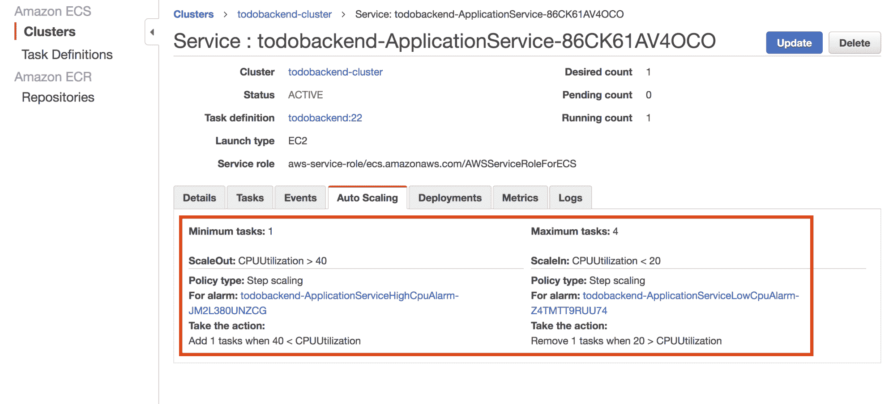

现在，只要您的 ECS 服务的 CPU 利用率超过 40%(所有 ECS 任务的平均值)，您的 ECS 服务的期望计数就会增加一。只要 CPU 利用率超过 40%，这种情况就会持续，最多可执行 4 个任务，根据前面示例的配置，每个自动缩放操作之间会有 360 秒的冷却时间。

在 ECS 服务级别，您不需要担心底层的 ECS 群集资源，因为您的 ECS 群集容量管理解决方案确保群集中始终有多余的容量用于额外的 ECS 任务。这意味着您现在可以根据每个 ECS 服务的特定性能特征独立扩展每个 ECS 服务，并强调了了解每个 ECS 任务为每个应用程序分配最佳资源的重要性。

# 摘要

在本章中，您创建了一个全面的自动扩展解决方案，允许您根据应用程序负载和客户需求自动扩展您的 ECS 服务和应用程序，同时确保您的底层 ECS 集群有足够的资源来根据需要部署新的 ECS 任务。

您首先了解了关键的 ECS 资源，包括 CPU、内存、网络端口和网络接口，以及 ECS 如何分配这些资源。管理 ECS 群集容量时，这些资源决定了 ECS 容器实例是否可以运行给定的 ECS 任务，因此了解每种资源的使用方式至关重要。

接下来，您实施了一个 ECS 群集容量管理解决方案，每当发生 ECS 容器实例状态更改时，该解决方案都会计算 ECS 群集容量。ECS 通过 CloudWatch 事件发布这些状态变化，您创建了一个 CloudWatch 事件规则，该规则触发一个计算当前集群容量的 Lambda 函数。此函数计算两个关键指标-容器容量，表示为群集当前可以支持的额外容器或 ECS 任务的数量，以及空闲主机容量，它定义了整个群集当前有多少“虚拟”主机空闲。容器容量用于横向扩展您的 ECS 群集，每当容器容量低于 1 时，就会添加额外的 ECS 容器实例，这意味着群集不再有足够的资源来部署额外的 ECS 任务。空闲主机容量用于在您的 ECS 群集中进行扩展，每当空闲主机容量大于 1.0 时，就会删除 ECS 容器实例，这意味着您可以安全地删除 ECS 容器实例，并且仍然有能力部署新的 ECS 任务。

我们讨论的一个关键概念是，需要始终对所有资源的最坏情况进行计算，这确保了当一种类型的资源有足够的备用容量，但另一种类型的资源可能容量很低时，您永远不会进行扩展。

最后，您学习了如何配置 AWS 应用程序自动扩展服务来扩展和缩减 ECS 服务。在这里，您将基于特定于您的应用程序的适当指标来扩展单个 ECS 服务，并且因为您是在单个 ECS 服务的上下文中进行扩展的，所以这一级别的自动扩展很容易定义和理解。扩展您的 ECS 服务最终将推动您的整个 ECS 群集容量的变化，您实施的 ECS 群集容量管理解决方案可以解决这一问题，并允许您自动扩展您的 ECS 服务，而无需担心对底层 ECS 群集的影响。

在下一章中，您将学习如何持续地将您的 ECS 应用程序交付给 AWS，并结合我们在前面章节中讨论的所有特性。这将允许您以完全自动化的方式部署最新的应用程序更改，减少操作开销，并向您的开发团队提供快速反馈。

# 问题

1.  对/错:当您使用 ECS 并部署自己的 ECS 容器实例时，ECS 会自动为您上下扩展集群。
2.  您使用哪种 AWS 服务来扩展您的 ECS 集群？
3.  您使用哪种 AWS 服务来扩展您的 ECS 服务？
4.  您的应用程序至少需要 300 兆字节的内存，最大需要 1 GB 的内存才能运行。您会在 ECS 任务定义中配置哪些参数来支持此配置？
5.  您将 3 个不同的 ECS 任务部署到单个实例 ECS 集群，每个任务运行不同的应用程序，并将每个 ECS 任务配置为保留 10 个 CPU 单元。在繁忙时段，其中一个 ECS 任务会占用 CPU，从而降低其他 ECS 任务的速度。假设 ECS 容器实例具有 1，000 个 CPU 单元的容量，您可以做些什么来避免一个 ECS 任务占用 CPU？
6.  对/错:如果您只对 ECS 任务使用动态端口映射，则无需担心网络端口资源。
7.  您将一个实例部署到总共支持四个网络接口的 AWS。假设所有的 ECS 任务都使用 ECS 任务网络，就实例的 ECS 任务数量而言，容量是多少？
8.  什么时候应该禁用 EC2 自动缩放组中的自动缩放？你会怎么做？

9.  您的 ECS 集群目前有 2 个 ECS 容器实例，每个实例有 500 个 CPU 单元和 500 MB 的备用内存容量。您只向集群部署了一种类型的应用程序，并且当前有两个 ECS 任务正在运行。假设 ECS 任务需要 500 个 CPU 单元，500 MB 内存，并且具有到 TCP 端口 80 的静态端口映射，那么就 ECS 任务的数量而言，集群当前的总体备用容量是多少？

10.  您的 ECS 集群需要支持 3 个不同的 ECS 任务，分别需要 300、400 和 500MB 的内存。如果您的每个 ECS 容器实例都有 2 GB 的内存，那么在执行 ECS 集群容量计算时，按内存计算，每个 ECS 容器实例的最大容器数是多少？

# 进一步阅读

您可以查看以下链接，了解本章所述主题的更多信息:

*   ECS 服务自动缩放:[https://docs . AWS . Amazon . com/Amazon ECS/latest/developer guide/Service-自动缩放. html](https://docs.aws.amazon.com/AmazonECS/latest/developerguide/service-auto-scaling.html)
*   EC2 自动缩放用户指南:[https://docs . AWS . Amazon . com/autoscaling/EC2/User Guide/什么是 Amazon-EC2-自动缩放. html](https://docs.aws.amazon.com/autoscaling/ec2/userguide/what-is-amazon-ec2-auto-scaling.html)
*   EC2 自动缩放策略类型:[https://docs . AWS . Amazon . com/autoscaling/EC2/user guide/as-Scaling-simple-step . html](https://docs.aws.amazon.com/autoscaling/ec2/userguide/as-scaling-simple-step.html)
*   自动扩展组滚动更新的推荐最佳实践:[https://AWS . Amazon . com/premium support/知识中心/自动扩展-组-滚动-更新/](https://aws.amazon.com/premiumsupport/knowledge-center/auto-scaling-group-rolling-updates/)
*   应用程序自动缩放用户指南:[https://docs . AWS . Amazon . com/autoscaling/application/User Guide/什么是应用程序-自动缩放. html](https://docs.aws.amazon.com/autoscaling/application/userguide/what-is-application-auto-scaling.html)
*   任务定义参数参考(见`cpu`、`memory`和`memoryReservation`参数):[https://docs . AWS . Amazon . com/Amazon ics/latest/developer guide/task _ definition _ Parameters . html # container _ definitions](https://docs.aws.amazon.com/AmazonECS/latest/developerguide/task_definition_parameters.html#container_definitions)
*   CloudFormation CloudWatch 事件规则资源参考:[https://docs . AWS . Amazon . com/AWS cloud information/latest/user guide/AWS-Resource-Events-Rule . html](https://docs.aws.amazon.com/AWSCloudFormation/latest/UserGuide/aws-resource-events-rule.html)

*   cloud information cloud watch alarm resource Reference:[https://docs . AWS . Amazon . com/AWS cloud information/latest/user guide/AWS-properties-CW-alarm . html](https://docs.aws.amazon.com/AWSCloudFormation/latest/UserGuide/aws-properties-cw-alarm.html)
*   CloudFormation EC2 自动扩展策略资源参考:[https://docs . AWS . Amazon . com/AWS cloud information/latest/user guide/AWS-properties-as-Policy . html](https://docs.aws.amazon.com/AWSCloudFormation/latest/UserGuide/aws-properties-as-policy.html)
*   CloudFormation 应用程序自动缩放可缩放目标资源参考:[https://docs . AWS . Amazon . com/AWS cloud information/latest/user guide/AWS-Resource-Application autoscaling-scalabletarget . html](https://docs.aws.amazon.com/AWSCloudFormation/latest/UserGuide/aws-resource-applicationautoscaling-scalabletarget.html)
*   CloudFormation 应用程序自动缩放策略资源参考:[https://docs . AWS . Amazon . com/AWS cloud information/latest/user guide/AWS-Resource-Application autoscaling-Scaling Policy . html](https://docs.aws.amazon.com/AWSCloudFormation/latest/UserGuide/aws-resource-applicationautoscaling-scalingpolicy.html)**