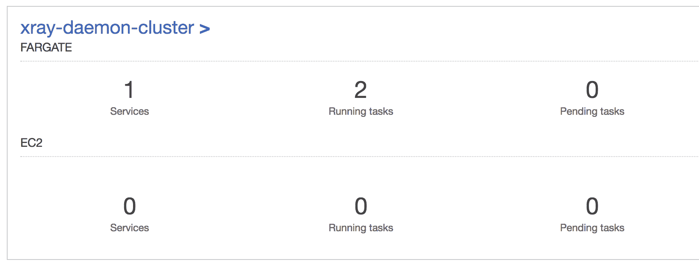
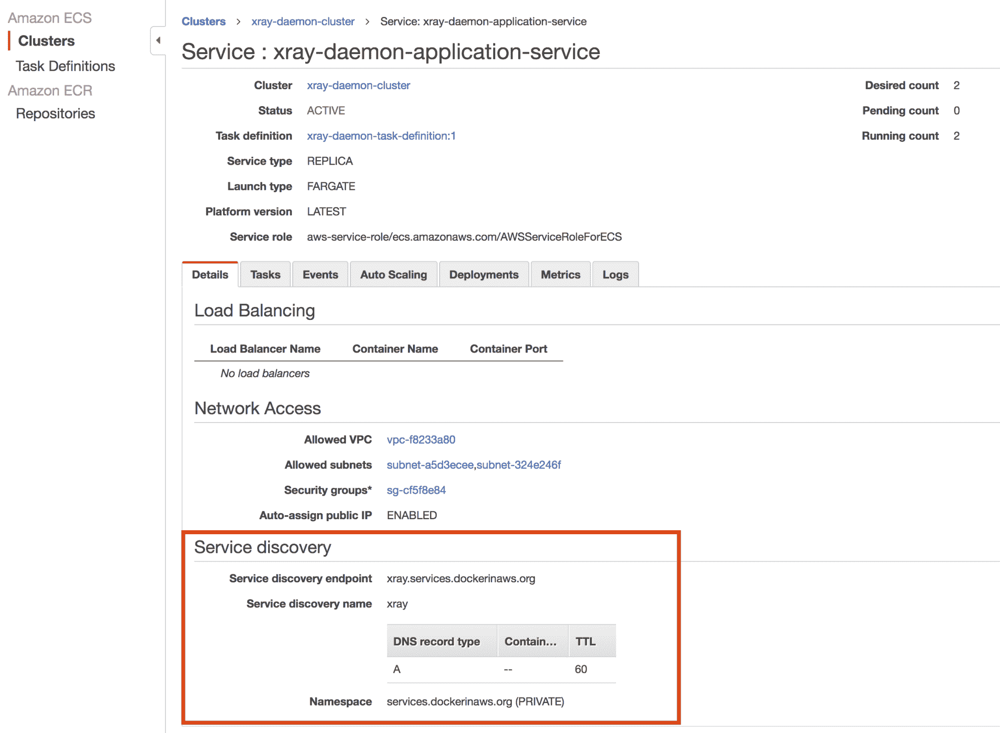
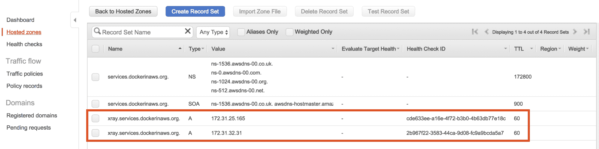
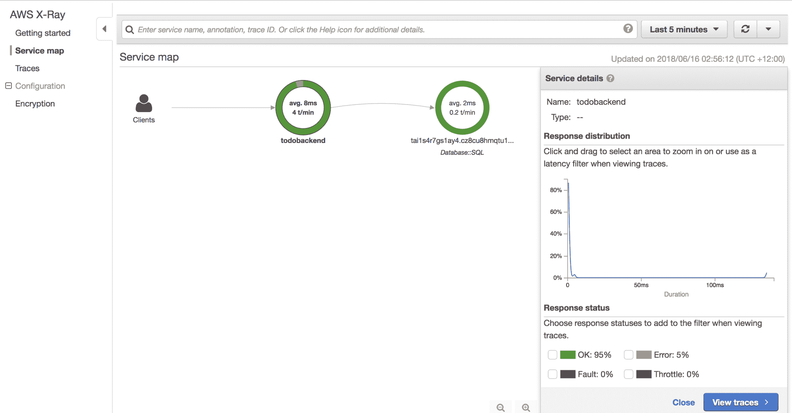
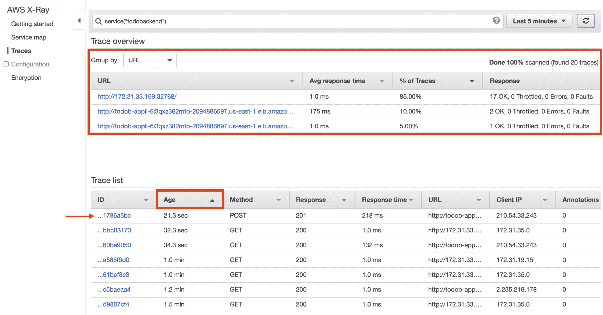
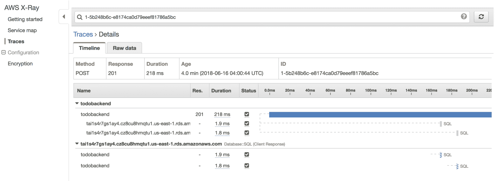

# 护卫舰和 ecs 服务发现

到目前为止，在本书中，我们花了相当多的时间专注于构建支持您的 ECS 集群的基础架构，详细介绍了如何为您的 ECS 容器实例构建定制的 Amazon 机器映像，以及如何创建 EC2 Auto Scaling 组，这些组可以动态地向您的 ECS 集群添加或删除 ECS 容器实例，其中有专门用于管理集群生命周期和容量的章节。

想象一下不必担心 ECS 集群和 ECS 容器实例。想象一下，别人为你管理它们，以至于你甚至不知道它们的存在。对于某些用例，对硬件选择、存储配置、安全状态和其他与基础架构相关的问题进行高度控制是非常重要的；到目前为止，您应该对 ECS 如何提供这些功能有了相当深刻的理解。但是，在许多情况下，没有必要进行这种级别的控制，能够利用管理您的 ECS 群集修补、安全配置、容量和其他一切的服务将会带来巨大的好处，降低您的运营开销，让您能够专注于交付您的组织正在努力实现的任何目标。

好消息是，这实际上是可能的，这要归功于 2017 年 12 月推出的名为 **AWS Fargate** 的服务。Fargate 是一个完全托管的服务，您只需在其中定义 ECS 任务定义和 ECS 服务，然后让 Fargate 负责您在本书中已经习惯的 ECS 集群和容器实例管理的其余部分。在本章中，您将学习如何使用 AWS Fargate 部署容器应用程序，使用我们在本书中一直采用的云信息的**基础架构作为代码** ( **IaC** )方法。为了让这一章更有趣一点，我们将添加对一个名为 X 射线的 AWS 服务的支持，它为您在 AWS 中运行的应用程序提供分布式跟踪。

当您希望在容器应用程序中使用 x 光时，您需要实现所谓的 x 光守护程序，它是一个从容器应用程序中收集跟踪信息并将其发布到 x 光服务的应用程序。我们将扩展 todobackend 应用程序来捕获传入请求的跟踪信息，并将通过利用 AWS Fargate 服务向您的 AWS 环境添加一个 X 射线守护程序，该服务将收集跟踪信息并将其转发给 X 射线服务。

另外，我们还将实现一个名为 ECS 服务发现的功能，它允许您的容器应用程序使用 DNS 自动发布和发现。这个特性对于 x 光守护程序非常有用，它是一个基于 UDP 的应用程序，不能由各种负载平衡服务提供服务，这些服务可用于前端基于 TCP 和 HTTP 的应用程序。ECS 包括对服务发现的内置支持，在 ECS 任务开始和停止时负责服务注册和取消注册，允许您创建其他应用程序可以轻松发现的高可用性服务。

本章将涵盖以下主题:

*   何时使用法盖特
*   向应用程序添加对自动气象站 x 光的支持
*   创建 x 光守护程序 Docker 映像
*   配置 ECS 服务发现资源
*   为 Fargate 配置 ECS 任务定义
*   为护卫舰配置 ecs 服务
*   部署和测试 x 光守护程序

# 技术要求

以下是本章的技术要求:

*   对 AWS 帐户的管理员访问权限
*   根据第 3 章中的说明配置的本地 AWS 配置文件
*   AWS CLI 版本 1.15.71 或更高版本
*   坞站 18.06 CE 或更高版本
*   码头工人写作 1.22 或更高
*   GNU Make 3.82 或更高版本
*   本章继续第 13 章，因此它要求您已经成功完成第 13 章中定义的所有配置任务

以下 GitHub URL 包含本章使用的代码示例:[https://GitHub . com/docker-in-AWS/docker-in-AWS/tree/master/ch14](https://github.com/docker-in-aws/docker-in-aws/tree/master/ch14)

查看以下视频，了解《行动守则》:
[http://bit.ly/2Lyd9ft](http://bit.ly/2Lyd9ft)

# 什么时候用法盖特？

正如本章介绍中所讨论的，AWS Fargate 是一项服务，它允许您部署基于容器的应用程序，而不需要您部署任何 ECS 容器实例、自动扩展组或任何与管理 ECS 集群基础架构相关的操作要求。这将 AWS Fargate 定位为无服务器技术，介于使用 AWS Lambda 运行“功能即服务”和使用传统的 ECS 集群和 ECS 容器实例运行您自己的基础架构之间。

尽管 Fargate 是一项伟大的技术，但重要的是要理解 Fargate 非常年轻(至少在撰写本书时是这样)，并且它确实带有一些限制，可能会使其不适合某些用例，概述如下:

*   **无持久存储** : Fargate 目前不支持持久存储，所以如果你的应用需要使用持久 Docker 卷，应该使用替代服务，比如传统的 ECS 服务。
*   **定价**:定价随时变化；然而，与您通过 ECS 获得的常规 EC2 实例定价相比，许多人认为 Fargate 的初始定价设置非常昂贵。例如，你能买到的最小的 Fargate 配置有 0.25v 的 CPU 和 512 MB 的内存，每月花费 14.25 美元。相比之下，CPU 为 0.5v、内存为 512 MB 的 t2.nano 价格要低得多，为 4.75 美元(所有价格均基于`us-east-1 region`)，
*   **部署时间**:到目前为止，根据我的经验，在 Fargate 上运行的 ECS 任务通常需要更长的时间来进行资源调配和部署，这可能会影响您的应用程序部署所花费的时间长度(这也会影响自动扩展操作)。
*   **安全和控制**:使用 Fargate，您不能控制任何关于运行您的容器的底层硬件或实例。如果您有严格的安全和/或合规要求，那么 Fargate 可能不会为您提供保证或必要的控制来满足您的特定要求。但是，需要注意的是，Fargate 被 AWS 列为同时符合 HIPAA 和 PCI 级 DSS。
*   **网络隔离:**在撰写本书时，Fargate 不支持使用 HTTP 代理进行 ECS 代理和 CloudWatch 日志通信。这要求您或者将 Fargate 任务放置在具有互联网连接的公共子网中，或者放置在具有 NAT 网关的私有子网中，类似于您在*隔离网络访问*一章中学习的方法。要允许访问公共 AWS API 端点，这确实需要您开放传出的 web 访问，这可能会违反组织的安全要求。
*   **服务可用性**:撰写本书时，Fargate 仅在美国东部(弗吉尼亚州)、美国东部(俄亥俄州)、美国西部(俄勒冈州)和欧盟(爱尔兰)地区提供；然而，我预计 Fargate 将很快在大多数地区得到广泛应用。

如果你能忍受法盖特目前的限制，那么法盖特将大大减少你的运营开支，让你的生活更简单。例如，当涉及到自动扩展时，您可以简单地使用我们在 *ECS 自动扩展*章节末尾讨论的应用程序自动扩展方法来自动扩展您的 ECS 服务，Fargate 将负责确保有足够的集群容量。同样，您也不需要担心 ECS 集群的修补和生命周期管理——Fargate 会为您处理以上所有问题。

在本章中，我们将部署一个 AWS X 射线守护程序服务来支持 todobackend 应用程序的应用程序跟踪。这种类型的服务非常适合 Fargate，因为它是一种后台服务，不需要持久存储，不影响 todobackend 应用程序的可用性(如果它关闭)，也不处理最终用户数据。

# 向应用程序添加对自动气象站 x 光的支持

在我们可以使用 AWS X 射线服务之前，您的应用程序需要支持收集跟踪信息并将其发布到 X 射线服务。X 射线**软件开发工具包(SDK)** 包括对多种编程语言和流行应用程序框架的支持，包括 Python 和 Django，它们都为 todobackend 应用程序提供了动力。

您可以在[https://aws.amazon.com/documentation/xray/](https://aws.amazon.com/documentation/xray/)找到适合您所选语言的 SDK 文档，但是对于我们的用例，[https://docs . AWS . Amazon . com/Xray-SDK-for-python/latest/reference/framework . html](https://docs.aws.amazon.com/xray-sdk-for-python/latest/reference/frameworks.html)提供了如何配置 Django 以自动为应用程序的每个传入请求创建跟踪的相关信息。

在 todobacknd 存储库中，首先需要将 X 射线 SDK 包添加到`src/requirements.txt`文件中，这将确保 SDK 与 todobacknd 应用程序的其他依赖项一起安装:

```
Django==2.0
django-cors-headers==2.1.0
djangorestframework==3.7.3
mysql-connector-python==8.0.11
pytz==2017.3
uwsgi==2.0.17
aws-xray-sdk
```

接下来，您需要将包含在 SDK 中的 Django X 射线中间件组件添加到位于`src/todobackend/settings_release.py`的 Django 项目的发布设置文件中的`MIDDLEWARE`配置元素中:

```
from .settings import *
...
...
STATIC_ROOT = os.environ.get('STATIC_ROOT', '/public/static')
MEDIA_ROOT = os.environ.get('MEDIA_ROOT', '/public/media')

MIDDLEWARE.insert(0,'aws_xray_sdk.ext.django.middleware.XRayMiddleware')
```

该配置与姜戈的 [X 光文档有所不同，但是通常您只想在您的 AWS 环境中运行 x 光，使用标准方法可能会在您的本地开发环境中导致 x 光配置问题。因为我们有一个单独的导入基础设置文件的发布设置文件，所以我们可以简单地使用如图所示的`insert()`功能在基础`MIDDLEWARE`列表的开头插入 X 射线中间件组件。这种方法确保我们将在使用发布设置的 AWS 环境中运行 X 射线，但不会在本地开发设置中使用 X 射线。](https://docs.aws.amazon.com/xray-sdk-for-python/latest/reference/frameworks.html)

It is important that the X-Ray middleware component is specified first in the `MIDDLEWARE` list, as this ensures that X-Ray can start tracing incoming requests before any other middleware components.

最后，Python X-Ray SDK 包括对许多流行包的跟踪支持，包括`mysql-connector-python`包，todobackend 应用程序使用该包连接到其 MySQL 数据库。在 Python 中，X 射线使用一种称为修补的技术包装受支持的包进行的调用，这种技术允许 X 射线拦截包进行的调用并捕获跟踪信息。对于我们的用例，修补`mysql-connector-python`包将使我们能够跟踪应用程序进行的数据库调用，这对于排除性能问题非常有用。要修补这个包，您需要向应用程序入口点添加几行代码，对于 Django，它位于文件`src/todobackend.wsgi.py`中:

```
"""
WSGI config for todobackend project.

It exposes the WSGI callable as a module-level variable named ``application``.

For more information on this file, see
https://docs.djangoproject.com/en/2.0/howto/deployment/wsgi/
"""

import os

from django.core.wsgi import get_wsgi_application

os.environ.setdefault("DJANGO_SETTINGS_MODULE", "todobackend.settings")

from aws_xray_sdk.core import xray_recorder
from aws_xray_sdk.core import patch_all

# Required to avoid SegmentNameMissingException errors
xray_recorder.configure(service="todobackend")

patch_all()

application = get_wsgi_application()
```

`xray_recorder`配置将为每个跟踪段添加一个服务名，这是必需的，否则您将观察到 SegmentNameMissingException 错误。此时，您已经添加了应用程序级别的支持来开始跟踪传入的请求，并且您应该能够在提交和推送您的更改到 GitHub 之前成功运行 make 工作流(运行`make test`和`make release`)。因为您现在已经有了一个连续的交付管道，这将触发该管道，从而确保一旦管道构建阶段完成，您的应用程序更改将被发布到 ECR。如果您还没有完成上一章，或者您已经删除了您的管道，那么您将需要在运行`make test`和`make release`后使用`make login`和`make publish`命令手动发布新图像。

# 创建 x 光守护程序 Docker 映像

在我们的应用程序可以发布 x 光跟踪信息之前，您必须部署一个 x 光守护程序，您的应用程序可以将此信息发送到该守护程序。我们的目标是使用 AWS Fargate 运行 X 射线守护程序，但在此之前，我们需要创建一个 Docker 映像来运行守护程序。AWS 提供了如何构建 X 射线守护程序映像的示例，我们将通过在`todobackend-aws`存储库的根目录下创建一个名为`Dockerfile.xray`的文件，遵循与 AWS 所记录的类似方法:

```
FROM amazonlinux
RUN yum install -y unzip
RUN curl -o daemon.zip https://s3.dualstack.us-east-2.amazonaws.com/aws-xray-assets.us-east-2/xray-daemon/aws-xray-daemon-linux-2.x.zip
RUN unzip daemon.zip && cp xray /usr/bin/xray

ENTRYPOINT ["/usr/bin/xray", "-b", "0.0.0.0:2000"]
EXPOSE 2000/udp
```

现在，您可以使用`docker build`命令在本地构建该图像，如下所示:

```
> docker build -t xray -f Dockerfile.xray .
Sending build context to Docker daemon 474.1kB
Step 1/6 : FROM amazonlinux
 ---> 81bb3e78db3d
Step 2/6 : RUN yum install -y unzip
 ---> Running in 35aca63a625e
Loaded plugins: ovl, priorities
Resolving Dependencies
...
...
Step 6/6 : EXPOSE 2000/udp
 ---> Running in 042542d22644
Removing intermediate container 042542d22644
 ---> 63b422e40099
Successfully built 63b422e40099
Successfully tagged xray:latest
```

现在我们的形象已经建立，我们需要将其发布给 ECR。在此之前，您需要为 x 光图像创建一个新的存储库，我们可以将其添加到位于`todobackend-aws`存储库根目录的现有`ecr.yml`文件中:

```
AWSTemplateFormatVersion: "2010-09-09"

Description: ECR Resources

Resources:
  XrayRepository:
 Type: AWS::ECR::Repository
 Properties:
 RepositoryName: docker-in-aws/xray
  CodebuildRepository:
    Type: AWS::ECR::Repository
  ...
  ...
```

在前面的示例*、*中，您创建了一个名为`docker-in-aws/xray`的新存储库，这将产生一个名为`<account-id>.dkr.ecr.<region>.amazonaws.com/docker-in-aws/xray`的完全限定存储库名称(例如，`385605022855.dkr.ecr.us-east-1.amazonaws.com/docker-in-aws/xray`)。

现在，您可以通过运行`aws cloudformation deploy`命令来创建新的存储库:

```
> export AWS_PROFILE=docker-in-aws
> aws cloudformation deploy --template-file ecr.yml --stack-name ecr-repositories
Enter MFA code for arn:aws:iam::385605022855:mfa/justin.menga:

Waiting for changeset to be created..
Waiting for stack create/update to complete
Successfully created/updated stack - ecr-repositories
  ...
  ...
```

部署完成后，您可以登录到 ECR，然后用新 ECR 存储库的完全限定名标记并发布您之前创建的映像:

```
> eval $(aws ecr get-login --no-include-email)
Login Succeeded
> docker tag xray 385605022855.dkr.ecr.us-east-1.amazonaws.com/docker-in-aws/xray
> docker push 385605022855.dkr.ecr.us-east-1.amazonaws.com/docker-in-aws/xray
The push refers to repository [385605022855.dkr.ecr.us-east-1.amazonaws.com/docker-in-aws/xray]
c44926e8470e: Pushed
1c9da599a308: Pushed
9d486dac1b0b: Pushed
0c1715974ca1: Pushed
latest: digest: sha256:01d9b6982ce3443009c7f07babb89b134c9d32ea6f1fc380cb89ce5639c33938 size: 1163
```

# 配置 ECS 服务发现资源

ECS 服务发现是一项功能，它允许您的客户端应用程序在动态环境中发现 ECS 服务，在动态环境中，基于容器的端点来来去去。到目前为止，我们已经使用 AWS 应用程序负载平衡器来执行此功能，在此功能中，您可以配置一个稳定的服务端点，您的应用程序可以连接到该端点，然后连接在 ECS 管理的目标组中进行负载平衡，该目标组包括与您的 ECS 服务相关联的每个 ECS 任务。虽然这通常是我推荐的最佳实践方法，但是对于不支持负载平衡器的应用程序(例如，基于 UDP 的应用程序)，或者对于与给定的 ECS 任务直接通信更有效的超大型微服务体系结构，ECS 服务发现可能是比使用负载平衡器更好的方法。

ECS service discovery also supports AWS load balancers, where ECS will publish the IP address of the load balancer listener if a load balancer is associated with a given ECS service.

ECS 服务发现使用 DNS 作为其发现机制，这很有用，因为在其最基本的形式中，DNS 被任何应用客户端普遍支持。您的 ECS 服务注册的 DNS 命名空间被称为**服务发现命名空间**，它简单地对应于 Route 53 DNS 域或区域，您在命名空间中注册的每个服务被称为**服务发现**。例如，您可以将`services.dockerinaws.org`配置为服务发现命名空间，如果您有一个名为`todobackend`的 ECS 服务，那么您将使用域名`todobackend.services.dockerinaws.org`连接到该服务。ECS 将自动管理针对您的服务的 DNS 记录注册的地址(`A`)记录，动态添加与您的 ECS 服务的每个活动且健康的 ECS 任务相关联的 IP 地址，并删除任何退出或变得不健康的 ECS 任务。ECS 服务发现同时支持公共和私有命名空间，对于我们运行 X 射线守护程序的示例，私有命名空间是合适的，因为该服务只需要支持来自 todobackend 应用程序的内部应用程序跟踪通信。

ECS service discovery supports the provisioning of DNS service (SRV) records, which include both IP address and TCP/UDP port information about a given service endpoint. You typically use address (`A`) records when using static port mapping or **awsvpc** networking mode (as is the case with Fargate), and SRV records when using dynamic port mapping, given that SRV records can include the dynamic port information for the port mapping that is created. Note that application support for SRV records is somewhat limited, so I typically recommend using the tried and true approach of using `A` records for ECS service discovery.

# 配置服务发现命名空间

像大多数 AWS 资源一样，您可以使用 AWS 控制台、AWS 命令行界面、各种 AWS 软件开发工具包或云信息来配置服务发现资源。鉴于我们的基础设施是贯穿本书的代码方法，我们自然会在本章中采用 CloudFormation 因为 x 光守护程序是一个新的服务(通常被认为是一个共享服务，您的每个应用程序都向其发布跟踪信息)，所以我们将在名为`xray.yml`的文件中创建一个新的堆栈，位于`todobackend-aws`存储库的根。

以下示例演示了创建初始模板和创建服务发现命名空间资源:

```
AWSTemplateFormatVersion: "2010-09-09"

Description: X-Ray Daemon

Resources:
  ApplicationServiceDiscoveryNamespace:
    Type: AWS::ServiceDiscovery::PrivateDnsNamespace
    Properties:
      Name: services.dockerinaws.org.
      Description: services.dockerinaws.org namespace
      Vpc: vpc-f8233a80
```

在前面的示例*、*中，我们创建了一个私有服务发现命名空间，它只需要命名空间的域名、可选描述和关联的私有路由 53 区域将链接到的 VPC 标识。为了简单起见，我还为与我的 AWS 帐户相关的 VPC ID 硬编码了一个适当的值，您通常会通过堆栈参数注入该值。

Given that the intention of a service discovery namespace is to support multiple services, you would typically create the namespace in a separate CloudFormation stack, such as a dedicated network stack that creates shared network resources. However, in the interest of keeping things simple, we are creating the namespace in the X-Ray stack.

现在，您可以使用`aws cloudformation deploy`命令将初始堆栈部署到云信息，该命令应该创建一个服务发现命名空间和相关的 53 号路由私有区域:

```
> aws cloudformation deploy --template-file xray.yml --stack-name xray-daemon
Waiting for changeset to be created..
Waiting for stack create/update to complete
Successfully created/updated stack - xray-daemon
> aws servicediscovery list-namespaces
{
    "Namespaces": [
        {
            "Id": "ns-lgd774j6s2cmxwq3",
            "Arn": "arn:aws:servicediscovery:us-east-1:385605022855:namespace/ns-lgd774j6s2cmxwq3",
            "Name": "services.dockerinaws.org",
            "Type": "DNS_PRIVATE"
        }
    ]
}
> aws route53 list-hosted-zones --query HostedZones[].Name --output table
-------------------------------
| ListHostedZones             |
+-----------------------------+
| services.dockerinaws.org.   |
+-----------------------------+
```

在前面的示例中，一旦您的堆栈成功部署，您将使用`aws servicediscovery list-namespaces`命令来验证是否创建了私有命名空间，而`aws route53 list-hosted-zones`命令显示也创建了一个名为`services.dockerinaws.org`的 53 号路由区域。

# 配置服务发现服务

现在您已经有了服务发现命名空间，下一步是创建一个服务发现服务，它与每个 ECS 服务具有一对一的关系，这意味着您需要创建一个服务发现服务，它代表您将在本章后面创建的 X 射线 ECS 服务:

```
AWSTemplateFormatVersion: "2010-09-09"

Description: X-Ray Daemon

Resources:
  ApplicationServiceDiscoveryService:
 Type: AWS::ServiceDiscovery::Service
 Properties:
 Name: xray
 Description: xray service 
 DnsConfig: 
 NamespaceId: !Ref ApplicationServiceDiscoveryNamespace
 DnsRecords:
 - Type: A
 TTL: 60
 HealthCheckCustomConfig:
 FailureThreshold: 1
  ApplicationServiceDiscoveryNamespace:
    Type: AWS::ServiceDiscovery::PrivateDnsNamespace
    Properties:
      Name: services.dockerinaws.org.
      Description: services.dockerinaws.org namespace
      Vpc: vpc-f8233a80
```

在上例中，您添加了一个名为`ApplicationServiceDiscoveryService`的新资源，并配置了以下属性:

*   `Name`:定义服务的名称。该名称将用于在关联的命名空间中注册服务。
*   `DnsConfig`:指定服务关联的命名空间(由`NamespaceId`属性定义)，定义应该创建的 DNS 记录类型和生存时间(TTL)。在这里，您指定一个地址记录(键入`A`)和 60 秒的 TTL，这意味着客户端最多只能缓存该记录 60 秒。一般来说，您应该将 TTL 设置为较低的值，以确保当新的 ECS 任务注册到服务或现有的 ECS 任务从服务中删除时，您的客户端能够获取 DNS 更改。
*   `HealthCheckCustomConfig`:这将配置 ECS 来管理健康检查，以确定 ECS 任务是否可以注册。还可以配置 Route 53 健康检查(参见[https://docs . AWS . Amazon . com/Amazon ECS/latest/developer guide/service-discovery . html # service-discovery-concepts](https://docs.aws.amazon.com/AmazonECS/latest/developerguide/service-discovery.html#service-discovery-concepts))；但是，对于我们的用例，假设 X-Ray 是一个基于 UDP 的应用程序，Route 53 运行状况检查仅支持基于 TCP 的服务，则必须使用前面示例中显示的`HealthCheckCustomConfig`配置。`FailureThreshold`指定在接收到自定义运行状况检查更新后，服务发现等待更改给定服务实例运行状况的`30`秒间隔数(在这种情况下，ECS 提供自定义运行状况检查)。

现在，您可以使用`aws cloudformation deploy`命令将更新后的堆栈部署到云信息，这将创建一个服务发现服务:

```
> aws cloudformation deploy --template-file xray.yml --stack-name xray-daemon
Waiting for changeset to be created..
Waiting for stack create/update to complete
Successfully created/updated stack - xray-daemon
> aws servicediscovery list-services
{
    "Services": [
        {
            "Id": "srv-wkdxwh4pzo7ea7w3",
            "Arn": "arn:aws:servicediscovery:us-east-1:385605022855:service/srv-wkdxwh4pzo7ea7w3",
            "Name": "xray",
            "Description": "xray service"
        }
    ]
}
```

这将为`xray.services.dockerinaws.org`创建一个 DNS 记录集，在我们为我们将在本章后面创建的 X 射线 ECS 服务配置 ECS 服务发现支持之前，不会有任何地址(`A`)记录与之相关联。

# 为 Fargate 配置 ECS 任务定义

现在，您已经准备好开始定义您的 ECS 资源，您将配置这些资源来使用 AWS Fargate 服务，并利用您在上一节中创建的服务发现资源。

在配置 ECS 任务定义以支持 Fargate 时，您需要了解一些关键注意事项:

*   **发射类型:**一个 ECS 任务定义包括一个名为`RequiresCompatibilities`的参数，该参数定义了该定义的兼容发射类型。目前的发射类型包括 EC2，指在传统 ECS 集群上发射的 ECS 任务，以及 Fargate，指在 FARGATE 上发射的 ECS 任务。默认情况下，`RequiresCompatibilities`参数被配置为 EC2，这意味着如果您想使用 Fargate，您必须显式配置该参数。
*   **网络模式**:法盖特只支持`awsvpc`网络模式，我们在第 10 章- *隔离网络接入*中讨论过。
*   **执行角色** : Fargate 要求您配置一个**执行角色**，这是分配给 ECS 代理和 Fargate 运行时的 IAM 角色，它根据您的 Fargate 任务定义来管理 ECS 任务的生命周期。这是一个独立的角色，不同于您在第 9 章- *管理机密*中配置的任务 IAM 角色功能，您可以使用该功能向运行在 ECS 任务中的应用程序授予 IAM 权限。执行角色通常配置有与您为与传统 ECS 容器实例相关联的 EC2 IAM 实例角色配置的权限相似的权限，至少授予 ECS 代理和法盖特运行时从 ECR 提取映像并将日志写入 CloudWatch 日志的权限。
*   **CPU 和内存** : Fargate 要求您在任务定义级别定义 CPU 和内存需求，因为这决定了基于您的任务定义的 ECS 任务将在其上运行的底层目标实例。请注意，这与您在第 8 章- *使用 ECS* 部署应用程序中为 todobackend 应用程序在 ECS 任务定义中配置的每个容器定义 CPU 和内存设置是分开的；您仍然可以配置每个容器定义的 CPU 和内存设置，但是您需要确保分配给容器定义的总 CPU/内存不超过分配给 ECS 任务定义的总 CPU/内存。Fargate 目前只支持有限的一组 CPU/内存分配，您可以在*任务 CPU 和内存*部分的[https://docs . AWS . Amazon . com/AmazonECS/latest/developer guide/AWS _ fargate . html](https://docs.aws.amazon.com/AmazonECS/latest/developerguide/AWS_Fargate.html)中了解更多。
*   **日志记录**:在写的时候，Fargate 只支持`awslogs`日志记录驱动，将你的容器日志转发到 CloudWatch 日志。

考虑到上述因素，现在让我们为 x 光守护程序服务定义一个任务定义:

```
...
...
Resources:
  ApplicationTaskDefinition:
 Type: AWS::ECS::TaskDefinition
 Properties:
 Family: !Sub ${AWS::StackName}-task-definition
 NetworkMode: awsvpc
 ExecutionRoleArn: !Sub ${ApplicationTaskExecutionRole.Arn}
 TaskRoleArn: !Sub ${ApplicationTaskRole.Arn}
 Cpu: 256
 Memory: 512
 RequiresCompatibilities:
 - FARGATE
 ContainerDefinitions:
 - Name: xray
 Image: !Sub ${AWS::AccountId}.dkr.ecr.${AWS::Region}.amazonaws.com/docker-in-aws/xray
 Command:
 - -o
 LogConfiguration:
 LogDriver: awslogs
 Options:
 awslogs-group: !Sub /${AWS::StackName}/ecs/xray
 awslogs-region: !Ref AWS::Region
 awslogs-stream-prefix: docker
 PortMappings:
 - ContainerPort: 2000
 Protocol: udp
 Environment:
 - Name: AWS_REGION
 Value: !Ref AWS::Region
  ApplicationLogGroup:
 Type: AWS::Logs::LogGroup
 DeletionPolicy: Delete
 Properties:
 LogGroupName: !Sub /${AWS::StackName}/ecs/xray
 RetentionInDays: 7
  ApplicationServiceDiscoveryService:
    Type: AWS::ServiceDiscovery::Service
  ...
  ...
```

在上例中，注意`RequiresCompatibilities`参数指定`FARGATE`为支持的发射类型，`NetworkMode`参数配置为所需的`awsvpc`模式。`Cpu`和`Memory`设置分别配置为 256 个中央处理器单元(0.25 个虚存)和 512 兆字节，这是可用的最小法盖特中央处理器/内存配置。对于`ExecutionRoleArn`参数，您引用了一个名为`ApplicationTaskExecutionRole`的 IAM 角色，我们将很快对其进行配置，与为`TaskRoleArn`参数配置的角色分开。

接下来，您定义了一个名为`xray`的容器定义，它引用了您在本章前面创建的 ECR 存储库；请注意，您为`Command`参数指定了`-o`标志。这将把`-o`追加到您在上一个示例中在 x 光守护程序映像中配置的`ENTRYPOINT`指令中指定的命令中，这将阻止 x 光守护程序尝试查询 EC2 实例元数据，因为当您使用 Fargate 时不支持这一点。

容器定义的日志配置被配置为使用`awslogs`驱动程序，这是 Fargate 所需要的，它引用了任务定义下配置的`ApplicationLogGroup` CloudWatch 日志组资源。最后，您将 X 射线守护程序端口(`UDP port 2000`)指定为容器端口映射，并配置一个名为`AWS_REGION`的环境变量，该变量引用您部署堆栈的区域，X 射线守护程序需要该区域来确定守护程序应该向其发布跟踪数据的区域 X 射线服务端点。

# 为 Fargate 配置 IAM 角色

在前面的示例中，您的 ECS 任务定义引用了任务执行角色(由`ExecutionRoleArn`参数定义)和任务角色(由`TaskRoleArn`参数定义)。

如前所述，任务执行角色定义了将分配给 ECS 代理和 Fargate 运行时的 IAM 权限，通常包括拉取运行任务定义中定义的容器所需的 ECR 映像的权限，以及写入容器日志配置中引用的 CloudWatch 日志组的权限:

```
...
...
Resources:
  ApplicationTaskExecutionRole:
    Type: AWS::IAM::Role
    Properties:
      AssumeRolePolicyDocument:
        Version: "2012-10-17"
        Statement:
          - Effect: Allow
            Principal:
              Service:
                - ecs-tasks.amazonaws.com
            Action:
              - sts:AssumeRole
      Policies:
        - PolicyName: EcsTaskExecutionRole
          PolicyDocument:
            Statement:
              - Sid: EcrPermissions
                Effect: Allow
                Action:
                  - ecr:BatchCheckLayerAvailability
                  - ecr:BatchGetImage
                  - ecr:GetDownloadUrlForLayer
                  - ecr:GetAuthorizationToken
                Resource: "*"
              - Sid: CloudwatchLogsPermissions
                Effect: Allow
                Action:
                  - logs:CreateLogStream
                  - logs:PutLogEvents
                Resource: !Sub ${ApplicationLogGroup.Arn}
  ApplicationTaskDefinition:
    Type: AWS::ECS::TaskDefinition
  ...
  ...
```

任务角色定义了从您的 ECS 任务定义运行的应用程序可能需要的任何 IAM 权限。对于我们的用例，X 射线守护程序需要权限才能向 X 射线服务发布跟踪，如下例所示:

```
Resources:
 ApplicationTaskRole:
 Type: AWS::IAM::Role
 Properties:
 AssumeRolePolicyDocument:
 Version: "2012-10-17"
 Statement:
 - Effect: Allow
 Principal:
 Service:
 - ecs-tasks.amazonaws.com
 Action:
 - sts:AssumeRole
 Policies:
 - PolicyName: EcsTaskRole
 PolicyDocument:
 Statement:
 - Effect: Allow
 Action:
 - xray:PutTraceSegments
 - xray:PutTelemetryRecords
 Resource: "*"    ApplicationTaskExecutionRole:
    Type: AWS::IAM::Role
  ...
  ...
```

在前面的示例*、*中，您向 X 射线守护程序授予`xray:PutTraceSegments`和`xray:PutTelemetryRecords`权限，这允许守护程序将从您的应用程序捕获的应用程序跟踪发布到 X 射线服务。请注意，对于`ApplicationTaskExecutionRole`和`ApplicationTaskRole`资源，`AssumeRolePolicyDocument`部分中的受信任实体必须配置为`ecs-tasks.amazonaws.com`服务。

# 为护卫舰配置 ecs 服务

现在，您已经为 Fargate 定义了一个 ECS 任务定义，您可以创建一个 ECS 服务，该服务将引用您的 ECS 任务定义，并为您的服务部署一个或多个实例(ECS 任务)。

正如您所料，在配置 ECS 服务以支持 Fargate 时，您需要注意一些关键的注意事项:

*   **启动类型**:您必须指定 Fargate 作为您想要使用 Fargate 运行的任何 ECS 服务的启动类型。
*   **平台版本** : AWS 维护不同版本的 Fargate 运行时或平台，这些版本会随着时间的推移而演变，并可能在某个时候为您的 ECS 服务引入突破性的变化。您可以选择为您的 ECS 服务指定一个特定的平台版本，或者简单地忽略配置此属性，以使用可用的最新平台版本。
*   **网络配置**:由于 Fargate 需要使用 **awsvpc** 网络模式，您的 ECS 服务必须定义一个网络配置，该网络配置定义您的 ECS 服务将在其中运行的子网、分配给您的 ECS 服务的安全组，以及您的服务是否分配了公共 IP 地址。在撰写本书时，在使用 Fargate 时，您必须分配一个公共 IP 地址或使用 NAT 网关，如*隔离网络访问*一章中所述，以确保管理您的 ECS 服务的 ECS 代理可以与 ECS 通信，从 ECR 中提取图像，并将日志发布到 CloudWatch 日志服务。

Although you can't interact with the ECS agent, it is important to understand that all ECS agent communications use the same network interface as your container applications running in Fargate. This means that you must consider the communication requirements of the ECS agent and Fargate runtime when attaching security groups and determining the network placement of your ECS service.

以下示例演示了为 Fargate 和 ECS 服务发现配置 ECS 服务:

```
...
...
Resources:
 ApplicationCluster:
 Type: AWS::ECS::Cluster
 Properties:
 ClusterName: !Sub ${AWS::StackName}-cluster
 ApplicationService:
 Type: AWS::ECS::Service
 DependsOn:
 - ApplicationLogGroup
 Properties:
 ServiceName: !Sub ${AWS::StackName}-application-service
 Cluster: !Ref ApplicationCluster
 TaskDefinition: !Ref ApplicationTaskDefinition
 DesiredCount: 2
 LaunchType: FARGATE
 NetworkConfiguration:
 AwsvpcConfiguration:
 AssignPublicIp: ENABLED
 SecurityGroups:
 - !Ref ApplicationSecurityGroup
 Subnets:
 - subnet-a5d3ecee
 - subnet-324e246f
 DeploymentConfiguration:
 MinimumHealthyPercent: 100
 MaximumPercent: 200
 ServiceRegistries:
 - RegistryArn: !Sub ${ApplicationServiceDiscoveryService.Arn}
  ApplicationTaskRole:
    Type: AWS::IAM::Role
  ...
  ...
```

在前面的示例*、*中，需要注意的第一点是，虽然在使用 Fargate 时没有运行任何 ECS 容器实例或其他基础设施，但是在为 Fargate 配置 ECS 服务时，仍然需要定义一个 ECS 集群，然后您将在 ECS 服务中引用该集群。

ECS 服务配置类似于您在*隔离网络访问*一章中使用 ECS 任务联网运行 todobackend 应用程序时定义的配置，尽管有几个关键配置属性需要讨论:

*   `LaunchType`:必须指定为`FARGATE`。务必确保将您的 ECS 服务放在公共子网中，并将网络配置中的`AssignPublicIp`属性配置为`ENABLED`，或者将您的服务放在带有 NAT 网关的专用子网中。在前面的例子中，请注意我已经将`Subnets`属性硬编码到我的 VPC 内的公共子网；您需要将这些值更改为适合您的环境的值，并且通常会通过堆栈参数注入这些值。
*   `ServiceRegistries`:此属性配置您的 ECS 服务，以使用我们在本章前面配置的 ECS 服务发现功能，在这里，您可以参考您在前面的示例中配置的服务发现服务的 ARN。配置完成后，ECS 将在为链接服务发现服务创建的 DNS 记录集中自动注册/取消注册每个 ECS 服务实例(ECS 任务)的 IP 地址。

此时，还有最后一个资源需要配置——您需要定义您的 ECS 服务引用的`ApplicationSecurityGroup`资源:

```
...
...
Resources:
  ApplicationSecurityGroup:
 Type: AWS::EC2::SecurityGroup
 Properties:
 VpcId: vpc-f8233a80
 GroupDescription: !Sub ${AWS::StackName} Application Security Group
 SecurityGroupIngress:
 - IpProtocol: udp
 FromPort: 2000
 ToPort: 2000
 CidrIp: 172.31.0.0/16
 SecurityGroupEgress:
 - IpProtocol: tcp
 FromPort: 80
 ToPort: 80
 CidrIp: 0.0.0.0/0
 - IpProtocol: tcp
 FromPort: 443
 ToPort: 443
 CidrIp: 0.0.0.0/0
 - IpProtocol: udp
 FromPort: 53
 ToPort: 53
 CidrIp: 0.0.0.0/0
 Tags:
 - Key: Name
 Value: !Sub ${AWS::StackName}-ApplicationSecurityGroup
  ApplicationCluster:
    Type: AWS::ECS::Cluster
    Properties:
      ClusterName: !Sub ${AWS::StackName}-cluster
  ApplicationService:
    Type: AWS::ECS::Service
  ...
  ...
```

在前面的例子中，请再次注意，我使用的是硬编码值，通常我会使用堆栈参数，以使事情简单明了。安全组允许从 VPC 内的任何主机对 UDP 端口 2000 进行入口访问，而出口安全规则允许对 DNS、HTTP 和 HTTPS 进行访问，这是确保 ECS 代理可以与 ECS、ECR 和 CloudWatch 日志进行通信，以及确保 X 射线守护程序可以与 X 射线服务进行通信所必需的。

# 部署和测试 x 光守护程序

至此，我们已经完成了 CloudFormation 模板的配置，该模板将使用 Fargate 服务将 X 射线守护程序部署到 AWS，并启用了 ECS 服务发现；您可以使用`aws cloudformation deploy`命令将更改部署到您的堆栈中，包括`--capabilities`参数，假设我们的堆栈现在正在创建 IAM 资源:

```
> aws cloudformation deploy --template-file xray.yml --stack-name xray-daemon \
 --capabilities CAPABILITY_NAMED_IAM
Waiting for changeset to be created..
Waiting for stack create/update to complete
Successfully created/updated stack - xray-daemon
```

部署完成后，如果您在 AWS 控制台中打开 ECS 仪表板并选择集群，您应该会在 FARGATE 部分看到一个名为 xray-daemon-cluster 的新集群，其中有一个服务和两个正在运行的任务:



X-Ray daemon cluster

如果您选择集群并点击**x 射线-守护程序-应用程序-服务**，您应该会在详细信息选项卡上看到 ECS 服务发现配置:



X-Ray daemon service details

在服务发现命名空间中，您现在应该找到两个附加到`xray.services.dockerinaws.org`记录集的地址记录，您可以通过导航到 Route 53 仪表板，从左侧菜单中选择托管区域，然后选择`services.dockerinaws.org`区域来查看它们:



Service discovery DNS records

请注意，存在两个`A`记录，每个支持我们的 ECS 服务的 ECS 任务一个记录。如果您要停止其中一个 ECS 任务，ECS 会自动从 DNS 中删除该记录，然后在 ECS 将 ECS 服务计数恢复到其所需计数并开始替换 ECS 任务后添加新的`A`记录。这确保了您的服务高度可用，并且依赖于您的服务的应用程序可以动态解析您的服务的适当实例。

# 为 x 光支持配置 todobackend 堆栈

有了我们的 x 光守护程序服务，我们现在可以将对 x 光的支持添加到`todobackend-aws`堆栈中。在本章的开头，您在 todo back and 应用程序中配置了对 X 射线的支持，如果您提交并推送了您的更改，您在最后一章中创建的连续交付管道应该已经向 ECR 发布了更新的 Docker 映像(如果不是这种情况，请在 todo back and 存储库中运行`make publish`命令)。您需要执行的唯一其他配置是更新附加到 todobackend 集群实例的安全规则，以允许 x 光通信，并确保 Docker 环境配置有适当的环境变量，以实现正确的 x 光操作。

以下示例演示了向`todobackend-aws`堆栈中的`ApplicationAutoscalingSecurityGroup`资源添加安全规则，该规则允许与 x 光守护程序进行 x 光通信:

```
...
...
Resources:
  ...
  ...
  ApplicationAutoscalingSecurityGroup:
    Type: AWS::EC2::SecurityGroup
    Properties:
      GroupDescription: !Sub ${AWS::StackName} Application Autoscaling Security Group
      VpcId: !Ref VpcId
      SecurityGroupIngress:
        - IpProtocol: tcp
          FromPort: 22
          ToPort: 22
          CidrIp: 0.0.0.0/0
      SecurityGroupEgress:
 - IpProtocol: udp
 FromPort: 2000
 ToPort: 2000
 CidrIp: 172.31.0.0/16
        - IpProtocol: udp
          FromPort: 53
          ToPort: 53
          CidrIp: 0.0.0.0/0
        - IpProtocol: tcp
          FromPort: 80
          ToPort: 80
          CidrIp: 0.0.0.0/0
        - IpProtocol: tcp
          FromPort: 443
          ToPort: 443
          CidrIp: 0.0.0.0/0
...
...
```

以下示例演示了在`ApplicationTaskDefinition`资源中为 todobackend 容器定义配置环境设置:

```
...
...
Resources:
  ...
  ...
  ApplicationAutoscalingSecurityGroup:
    Type: AWS::EC2::SecurityGroup
    Properties:
    ...
    ...
      ContainerDefinitions:
        - Name: todobackend
          Image: !Sub ${AWS::AccountId}.dkr.ecr.${AWS::Region}.amazonaws.com/docker-in-aws/todobackend:${ApplicationImageTag}
          MemoryReservation: 395
          Cpu: 245
          MountPoints:
            - SourceVolume: public
              ContainerPath: /public
          Environment:
            - Name: DJANGO_SETTINGS_MODULE
              Value: todobackend.settings_release
            - Name: MYSQL_HOST
              Value: !Sub ${ApplicationDatabase.Endpoint.Address}
            - Name: MYSQL_USER
              Value: todobackend
            - Name: MYSQL_DATABASE
              Value: todobackend
            - Name: SECRETS
              Value: todobackend/credentials
            - Name: AWS_DEFAULT_REGION
              Value: !Ref AWS::Region
            - Name: AWS_XRAY_DAEMON_ADDRESS
 Value: xray.services.dockerinaws.org:2000
...
...
```

在前面的示例中，您添加了一个名为`AWS_XRAY_DAEMON_ADDRESS`的变量，该变量引用了我们的 x 光守护程序服务的`xray.services.dockerinaws.org`服务端点，并且必须以`<hostname>:<port>`的格式表示。

You can override the service name used in your X-Ray traces be setting the `AWS_XRAY_TRACE_NAME` environment variable.  This would be important in our scenario where we have a dev and production instance of the todobackend application in the same account, and want to ensure each application environment has its own set of traces.

如果您现在提交并将所有更改推送到`todobackend-aws`存储库，上一章中的连续交付管道应该会检测到更改并自动部署您更新的堆栈，或者您可以运行`make deploy/dev`命令从命令行部署您的更改。

# 测试 x 光服务

成功部署您的更改后，浏览到您的环境的 todobackend URL，并与应用程序进行一些交互，例如添加一个`todo`项。

如果您接下来从 AWS 控制台(服务|开发人员工具| X 射线)打开 X 射线仪表板，并从左侧菜单中选择服务地图，您应该会看到一个非常简单的地图，其中包括 todobackend 应用程序:



X-Ray service map

在前面的截图中，我点击了 todobackend 服务，它在右侧显示了服务详细信息窗格，显示了响应时间分布和响应状态响应等信息。此外，请注意，服务映射包括 todobackend RDS 实例，假设我们在本章前面的示例中配置了我们的应用程序来修补`mysql-connector-python`库。

如果单击查看跟踪按钮，将显示该服务的跟踪；请注意，用于 Django 的 X 射线中间件包含 URL 信息，该信息允许您的跟踪按 URL 分组:



X-Ray traces

在前面的截图*、*中，请注意，85%的跟踪都命中了一个 IP 地址 URL，这对应于正在进行的应用负载平衡器运行状况检查。如果您单击跟踪列表中的“年龄”列，从最新到最早对跟踪进行排序，您应该能够看到您对 todobackend 应用程序的请求，在我的例子中，这是一个创建新的`todo`项目的`POST`请求。

点击身份链接，您可以查看以下截图*、*中`POST`轨迹的更多详细信息:



X-Ray trace details

在前面的截图中，可以看到响应总共花费了 218 ms 完成，并且进行了两次数据库调用，每次调用花费的时间都不到 2 ms，如果您使用的是 X 射线 SDK 支持的其他库，还可以看到这些库进行调用的跟踪信息；例如，通过 boto3 库进行的任何 AWS 服务调用，例如将文件复制到 S3 或将消息发布到驱动流，也会被捕获。显然，在为应用程序排除性能问题时，这类信息非常有用。

# 摘要

在本章中，您学习了如何使用 AWS Fargate 服务部署 Docker 应用程序。为了使事情更有趣，您还学习了如何利用 ECS 服务发现来自动发布应用程序端点的服务可达性信息，这是在负载平衡器后面发布应用程序端点的更传统方法的替代方法。此外，为了结束我相信您会发现有趣且有趣的一章，您将对 AWS X 射线服务的支持添加到 todobackend 应用程序中，并部署了一个 X 射线守护程序服务，使用 Fargate 来捕获应用程序跟踪。

首先，您学习了如何将对 X 射线的支持添加到 Python Django 应用程序中，该应用程序只需要添加一个拦截传入请求的 X 射线中间件组件，还需要修补支持包，例如 mysql-connector-python 和 boto3 库，该库允许您捕获 mysql 数据库调用和您的应用程序可能进行的任何 AWS 服务调用。然后，您为 X 射线守护程序创建了一个 Docker 映像，并将其发布到弹性容器注册表中，以便在您的 AWS 环境中进行部署。

您学习了如何配置 ECS 服务发现所需的支持元素，添加了一个服务发现命名空间，该命名空间创建了一个维护服务发现服务端点的公共或私有 DNS 区域，然后为 X 射线守护程序创建了一个服务发现服务，允许您的 todobackend 应用程序(和其他应用程序)通过逻辑 DNS 名称发现所有活动和健康的 X 射线守护程序实例。

有了这些组件，您就可以使用 Fargate 创建一个 x 光守护程序服务，创建一个 ECS 任务定义和一个 ECS 服务。ECS 任务定义对支持 Fargate 有一些具体要求，包括定义一个单独的任务执行角色，向底层 ECS 代理和 Fargate 运行时授予权限，将 Fargate 指定为支持的启动类型，并确保配置了 awsvpc 网络模式。您创建的 ECS 服务要求您配置网络配置，以支持您的 ECS 任务定义的 awsvpc 网络模式。您还通过参考您在本章前面创建的服务发现服务，增加了对 ECS 服务发现的支持。

最后，您在 todobackend 堆栈中配置了现有的 ECS 任务定义，将服务发现服务名称指定为`AWS_XRAY_DAEMON_ADDRESS`变量；部署更改后，您学习了如何使用 X 射线跟踪来分析应用程序的传入请求的性能，并能够分析对 todobackend 应用程序数据库的单个调用。

在下一章中，您将了解另一个支持 Docker 应用程序的 AWS 服务，称为 Elastic Beanstalk。它提供了一种**平台即服务(Paas)** 方法来在 AWS 中部署和运行您的基于容器的应用程序。

# 问题

1.  对/错:Fargate 要求您创建一个 ECS 集群。
2.  配置 Fargate 时，支持哪些网络模式？
3.  对/错:Fargate 将 ECS 代理**控制平面**网络通信与 ECS 任务**数据平面**网络通信分开。
4.  您使用 Fargate 部署了一个新的 ECS 服务，但失败了，并出现一个错误，指示无法提取任务定义中指定的 ECR 映像。您验证图像名称和标签是否正确，以及任务定义的`TaskRoleArn`属性上引用的 IAM 角色是否允许访问 ECR 存储库。这个错误最可能的原因是什么？
5.  您正在确定在 AWS 中部署基于容器的应用程序的最佳技术。您的组织部署 Splunk 来收集所有应用程序的日志，并使用 New Relic 来收集性能指标。基于这些要求，Fargate 是一种合适的技术吗？
6.  对/错:ECS 服务发现使用 Consul 发布服务注册信息。
7.  哪个服务发现资源创建了 53 号路由区域？
8.  您将 ECS 任务定义配置为使用 Fargate，并指定应该为该任务分配 400 个 CPU 单元和 600 MB 内存。当您部署使用任务定义的 ECS 服务时，部署会失败。您如何解决这个问题？
9.  默认情况下，AWS X 射线通信使用哪种网络协议和端口？
10.  对/错:当您向基于容器的应用程序添加 X 射线支持时，它们将向 AWS X 射线服务发布跟踪。

# 进一步阅读

有关本章所涵盖主题的更多信息，您可以查看以下链接:

*   亚马逊 ECS 上的 AWS Fargate:[https://docs . AWS . Amazon . com/Amazon ECS/latest/developer guide/AWS _ Fargate . html](https://docs.aws.amazon.com/AmazonECS/latest/developerguide/AWS_Fargate.html)
*   Amazon ECS 任务执行 IAM 角色:[https://docs . AWS . Amazon . com/AWS cloudinformation/latest/user guide/AWS-resource-ECS-service . html](https://docs.aws.amazon.com/AWSCloudFormation/latest/UserGuide/aws-resource-ecs-service.html)
*   ECS 服务发现:[https://docs . AWS . Amazon . com/Amazon ECS/latest/developer guide/Service-Discovery . html](https://docs.aws.amazon.com/AmazonECS/latest/developerguide/service-discovery.html)
*   AWS X 射线开发者指南:[https://docs . AWS . Amazon . com/X 射线/latest/dev Guide/AWS-X 射线. html](https://docs.aws.amazon.com/xray/latest/devguide/aws-xray.html)
*   AWS X 射线 Python SDK:[https://docs . AWS . Amazon . com/Xray/latest/dev guide/Xray-SDK-Python . html](https://docs.aws.amazon.com/xray/latest/devguide/xray-sdk-python.html)
*   在亚马逊 ECS 上运行 X 射线守护程序:[https://docs . AWS . Amazon . com/X 射线/latest/dev guide/X 射线-守护程序-ecs.html](https://docs.aws.amazon.com/xray/latest/devguide/xray-daemon-ecs.html)
*   CloudFormation 服务发现公共命名空间资源参考:[https://docs . AWS . Amazon . com/AWS cloud information/latest/user guide/AWS-Resource-Service Discovery-Public dnsnamespace . html](https://docs.aws.amazon.com/AWSCloudFormation/latest/UserGuide/aws-resource-servicediscovery-publicdnsnamespace.html)
*   CloudFormation 服务发现私有命名空间资源参考:[https://docs . AWS . Amazon . com/AWS cloud information/latest/user guide/AWS-Resource-Service Discovery-privated dnsnamespace . html](https://docs.aws.amazon.com/AWSCloudFormation/latest/UserGuide/aws-resource-servicediscovery-privatednsnamespace.html)
*   云信息服务发现服务资源参考:[https://docs . AWS . Amazon . com/AWS cloudinformation/latest/user guide/AWS-Resource-Service Discovery-Service . html](https://docs.aws.amazon.com/AWSCloudFormation/latest/UserGuide/aws-resource-servicediscovery-service.html)
*   CloudFormation ECS 任务定义资源参考:[https://docs . AWS . Amazon . com/AWS cloud information/latest/user guide/AWS-Resource-ECS-Task Definition . html](https://docs.aws.amazon.com/AWSCloudFormation/latest/UserGuide/aws-resource-ecs-taskdefinition.html)
*   CloudFormation ECS 服务资源参考:[https://docs . AWS . Amazon . com/AWS cloud information/latest/user guide/AWS-Resource-ECS-Service . html](https://docs.aws.amazon.com/AWSCloudFormation/latest/UserGuide/aws-resource-ecs-service.html)