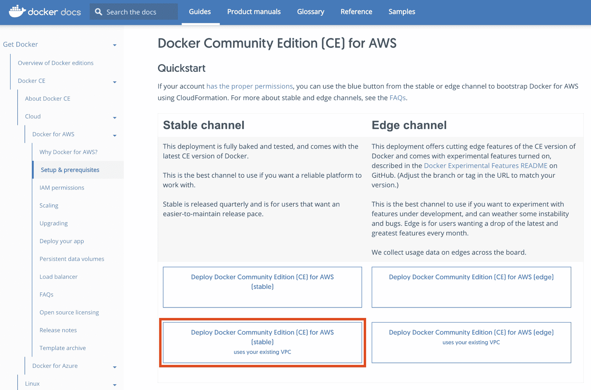
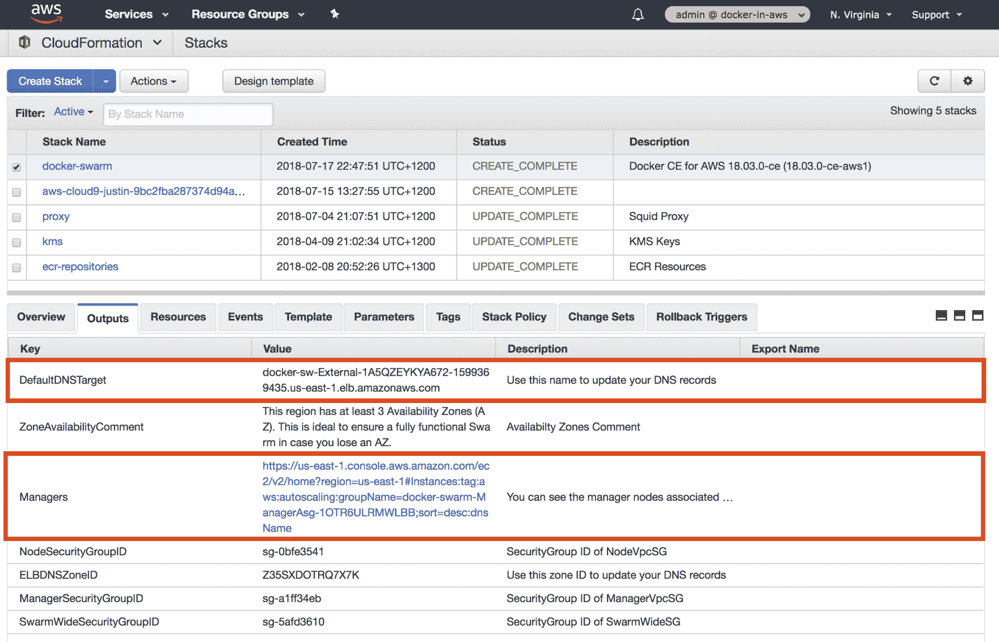
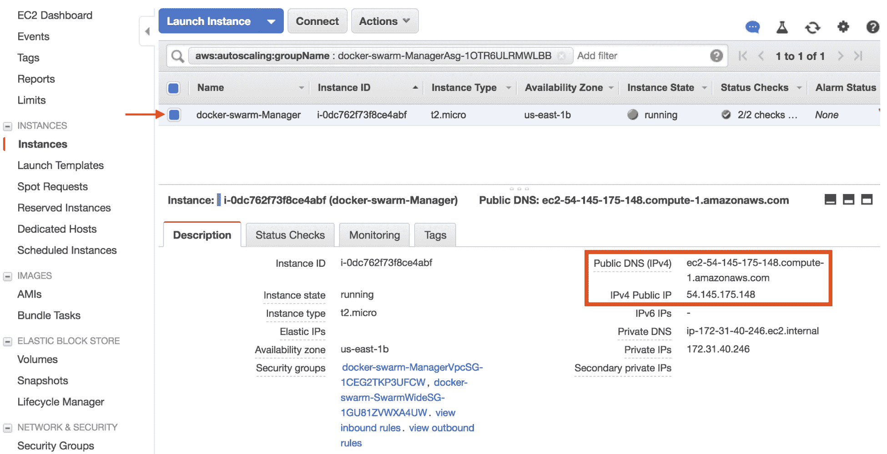
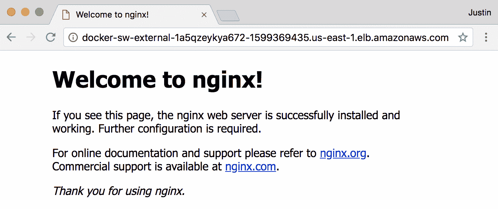
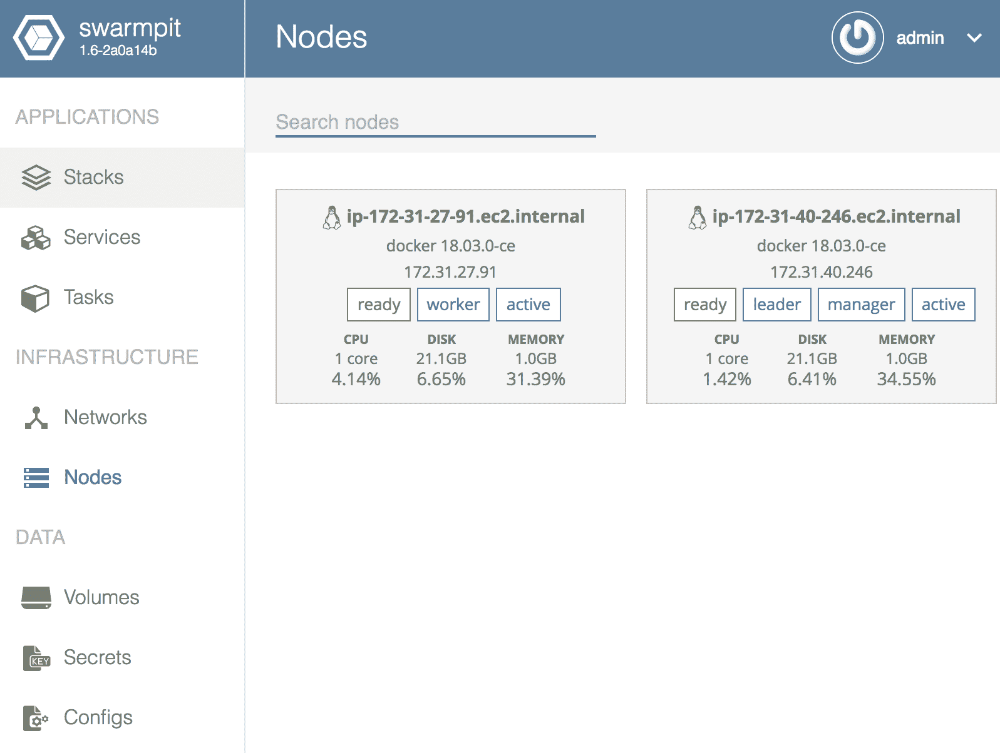
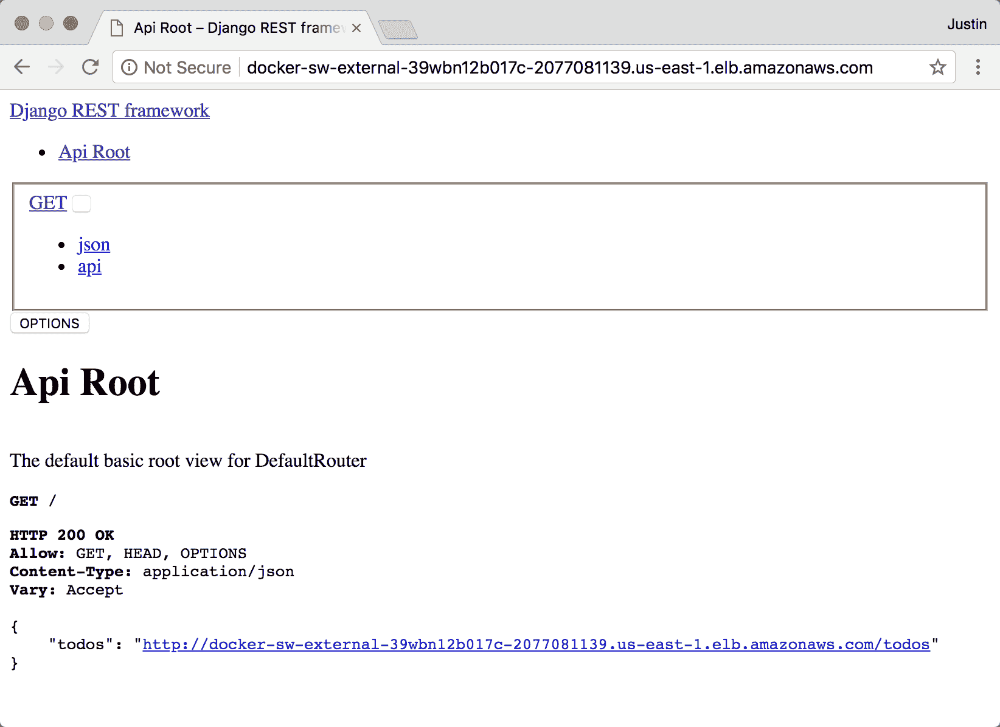
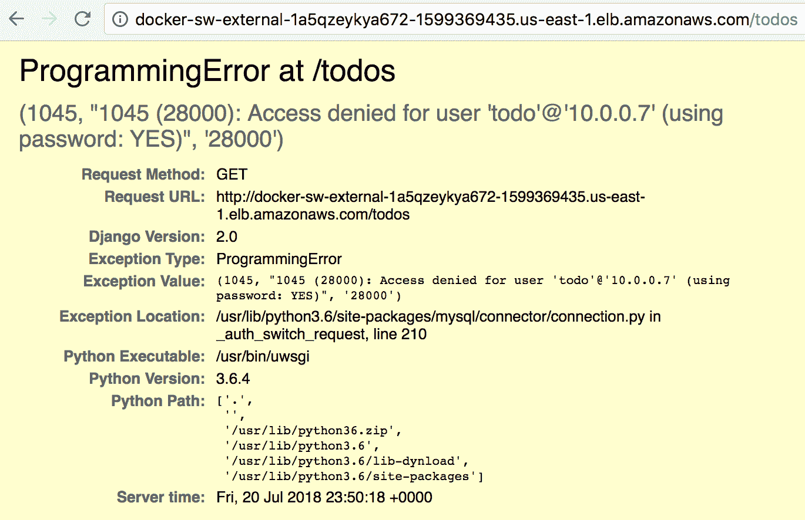
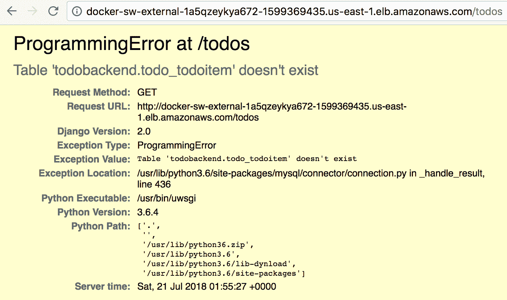
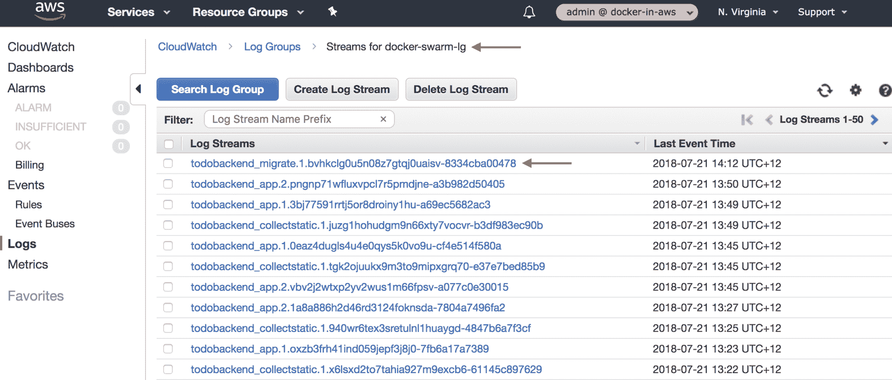
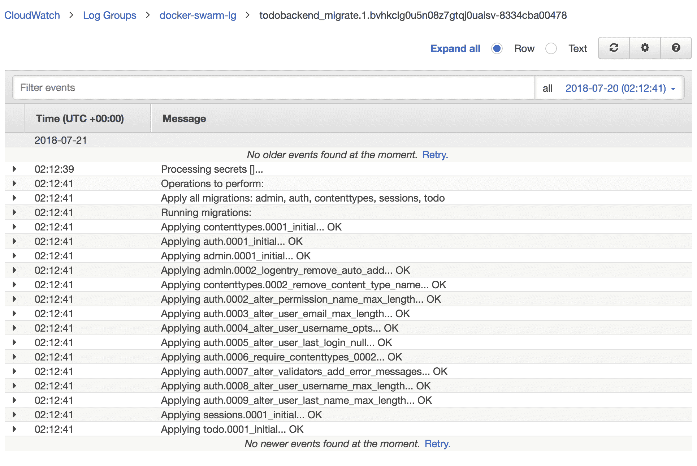

# 十六、AWS中的Docker Swarm

Docker Swarm 代表 Docker 的原生容器管理平台，该平台直接内置于 Docker Engine 中，对于许多第一次使用 Docker 的人来说，Docker Swarm 是他们阅读和了解的第一个容器管理平台，因为它是 Docker Engine 的集成功能。Docker Swarm 自然是 AWS 支持的 ECS、Fargate、Elastic Beanstalk 和最近的 Elastic Kubernetes Service (EKS)产品的竞争对手，因此您可能会想知道为什么 AWS 中关于 Docker 的书会有一章专门介绍 Docker Swarm。许多组织更喜欢使用与云无关的容器管理平台，它们可以在 AWS、其他云提供商(如谷歌云和 Azure)以及内部运行，如果您和您的组织都是这样，那么 Docker Swarm 肯定是一个值得考虑的选项。

在本章中，您将学习如何使用 Docker for AWS 解决方案将 Docker Swarm 部署到 AWS，这使得在 AWS 中启动和运行 Docker Swarm 集群变得非常容易。您将学习如何管理和访问您的 Swarm 集群的基础知识，如何创建服务并将其部署到 Docker Swarm，以及如何在 Docker for AWS 解决方案中利用与 Swarm 集成的大量 AWS 服务。这将包括将 Docker Swarm 与弹性容器注册中心(ECR)集成，通过与 AWS 弹性负载平衡(ELB)集成向外界发布您的应用，使用 AWS 弹性文件系统创建共享卷(EFS)，以及使用 AWS 弹性块存储(EBS)创建持久卷。

最后，您将学习如何应对关键的运营挑战，包括运行一次性部署任务、使用 Docker 机密执行机密管理以及使用滚动更新部署应用。到本章结束时，您将知道如何将 Docker Swarm 集群部署到 AWS，如何将 Docker Swarm 与 AWS 服务集成，以及如何将您的生产应用部署到 Docker Swarm。

本章将涵盖以下主题:

*   Docker Swarm 简介
*   安装自动装卸系统的Docker
*   访问Docker Swarm
*   向Docker Swarm部署Docker服务
*   将Docker栈部署到Docker Swarm
*   将 Docker Swarm 与ECR集成
*   使用 EFS 创建共享 Docker 卷
*   使用 EBS 创建持久 Docker 卷
*   支持一次性部署任务
*   执行滚动更新

# 技术要求

以下是本章的技术要求:

*   对 AWS 帐户的管理访问
*   按照第 1 章中的说明配置本地环境
*   根据第 3 章中的说明配置的本地 AWS 配置文件
*   AWS CLI 版本 1.15.71 或更高版本
*   坞站 18.06 CE 或更高版本
*   Docker写作 1.22 或更高
*   GNU Make 3.82 或更高版本

本章假设您已经完成了本书前面的所有章节

以下 GitHub URL 包含本章使用的代码示例:[https://GitHub . com/docker-in-AWS/docker-in-AWS/tree/master/ch16](https://github.com/docker-in-aws/docker-in-aws/tree/master/ch16)。

查看以下视频，了解《行动守则》:
[http://bit.ly/2ogdBpp](http://bit.ly/2ogdBpp)

# Docker Swarm 游戏攻略

**Docker Swarm** 是 Docker Engine 的原生集成功能，提供集群管理和容器编排功能，允许您在生产中大规模运行 Docker 容器。运行版本 1.13 或更高版本的每个 Docker Engine 都能够以集群模式运行，这提供了以下功能:

*   **集群管理**:所有在集群模式下运行的节点都包含本机集群功能，允许您快速建立集群，以便将应用部署到其中。

*   **多主机联网** : Docker 支持覆盖联网，允许您创建虚拟网络，所有连接到网络的容器都可以通过该网络进行私有通信。该网络层完全独立于连接您的 Docker Engines 的物理网络拓扑，这意味着您通常不必担心传统的网络限制，如 IP 寻址和网络分段，Docker 会为您处理所有这些问题。
*   **服务发现和负载平衡** : Docker Swarm 支持基于 DNS 的简单服务发现模型，允许您的应用相互发现，而不需要复杂的服务发现协议或基础架构。Docker Swarm 还支持使用 DNS 循环对应用的流量进行自动负载平衡，并且可以与外部负载平衡器集成，如 AWS 弹性负载平衡器服务。
*   **服务扩展和滚动更新**:您可以轻松地上下扩展您的服务，当需要更新您的服务时，Docker 支持智能滚动更新功能，在部署失败时支持回滚。
*   **声明式服务模型** : Docker Swarm 使用流行的 Docker Compose 规范，以易于理解和维护的格式声明性地定义应用服务、网络、卷等。

*   **期望状态** : Docker Swarm 持续监控应用和运行时状态，确保您的服务按照您配置的期望状态运行。例如，如果您配置实例或副本计数为 2 的服务，Docker Swarm 将始终尝试并维护此计数，并在现有节点出现故障时自动将新副本部署到新节点。

*   **机密和配置管理等生产级操作功能**:Docker 机密和 Docker 配置等一些功能是 Docker Swarm 独有的，为现实世界的生产问题提供了解决方案，例如能够将机密和配置数据安全地分发到您的应用中。

说到在 AWS 上运行 Docker Swarm，Docker 提供了一个社区版产品，被称为 AWS CE 的 Docker，你可以在[https://store.docker.com/editions/community/docker-ce-aws](https://store.docker.com/editions/community/docker-ce-aws)找到关于它的更多信息。目前，用于 AWS CE 的 Docker 是通过预定义的云信息模板部署的，该模板将 Docker Swarm 与许多 AWS 服务集成在一起，包括 EC2 自动扩展、弹性负载平衡、弹性文件系统和弹性数据块存储。正如您将很快看到的，这使得在 AWS 中建立一个新的 Docker Swarm 集群变得非常容易。

# Swarm 坞站对 kubernetes(库比涅斯库比涅斯库比涅斯库比涅斯库比涅斯库比涅斯库比涅斯库比涅斯库比涅斯库比涅斯库比涅斯库比涅斯特)

首先，正如本书大部分内容所证明的那样，我是一个 ECS 人员，如果您专门在 AWS 上运行您的容器工作负载，我的建议，至少在撰写本书时，几乎总是 ECS。然而，许多组织不希望被局限在 AWS 中，而是希望采用云不可知的方法，这就是 Docker Swarm 是目前可用的领先解决方案之一的地方。

现在，Docker Swarm 与 Kubernetes 正面竞争，我们将在下一章讨论。可以公平地说，Kubernetes 看起来已经确立了自己作为领先的云不可知容器管理平台的选择，但这并不意味着您一定要忽略 Docker Swarm。

总的来说，我个人认为 Docker Swarm 更容易设置和使用，至少对我来说，一个关键的好处是它使用了熟悉的工具，如 Docker Compose，这意味着您可以非常快地启动和运行，尤其是如果您以前使用过这些工具。对于那些只想快速启动和运行，并确保事情以最小的麻烦工作的小型组织来说，Docker Swarm 是一个有吸引力的选择。AWS 的 Docker 解决方案使在 AWS 中建立 Docker Swarm 集群变得非常容易，尽管 AWS 最近推出了弹性 Kubernetes 服务(EKS)，使 AWS 上的 Kubernetes 变得容易得多——下一章将详细介绍这一点。

最后，我鼓励您以开放的心态进行尝试，并自行决定什么样的容器管理平台最适合您和您的组织目标。

# 安装自动装卸系统的Docker

让 Docker Swarm 在 AWS 中启动并运行的推荐且最快的方法是将 Docker 用于 AWS，您可以在[https://docs.docker.com/docker-for-aws/](https://docs.docker.com/docker-for-aws/)了解更多。如果您浏览到此页面，在设置&先决条件部分，您将看到允许您为 AWS 安装 Docker 企业版(EE)和 Docker 社区版(CE)的链接。

我们将使用免费的 Docker CE for AWS(稳定)变体，请注意，您可以选择部署到全新的 VPC 或现有的 VPC:



Selecting a Docker CE for AWS option

假设我们已经有了一个现有的 VPC，如果您单击为 AWS(稳定)用户部署 Docker CE 您现有的 VPC 选项，您将被重定向到 AWS 云信息控制台，在那里您将被提示从 Docker 发布的模板创建一个新的栈:


Creating a Docker for AWS stack

单击“下一步”后，系统将提示您指定一些参数来控制 Docker Swarm Docker 安装的配置。我不会描述所有可用的选项，因此假设您应该保留这里没有提到的任何参数的默认配置:

*   **栈名称**:为您的栈指定一个合适的名称，例如 docker-swarm。
*   **群大小**:这里可以指定群管理器和工作者节点的数量。至少，您可以只指定一个管理器，但是我也建议配置一个工作节点，以便您可以测试将应用部署到多节点 Swarm 集群。

*   **Swarm Properties** :在这里，您应该配置 Swarm EC2 实例以使用您现有的管理 SSH 密钥(EC2 密钥对)，并且启用 Store 属性的创建 EFS 先决条件，因为我们将在本章稍后使用 EFS 来提供共享卷。
*   **群管理器属性**:将管理器临时存储卷类型更改为 gp2(固态硬盘)。
*   **群集工作程序属性**:将工作程序临时存储卷类型更改为 gp2(固态硬盘)。
*   **VPC/网络**:选择您现有的默认 VPC，然后确保您指定了当您选择 VPC 时显示的 VPC CIDR 范围(例如，`172.31.0.0/16`)，然后从公共子网 1 到 3 的默认 VPC 中选择适当的子网。

完成上述配置后，单击“下一步”按钮两次，最后在“查看”屏幕上，选择“我承认 AWS 云信息可能会创建 IAM 资源”选项，然后单击“创建”按钮。

此时，您的新云信息栈将被创建，并应在 10-15 分钟内完成。请注意，如果您想增加集群中管理器和/或工作器节点的数量，建议的方法是执行云信息栈更新，修改定义管理器和工作器数量的适当输入参数。此外，要升级 AWS Swarm 集群的 Docker，您应该应用最新的云信息模板，其中包括对 Docker Swarm 和各种其他资源的更新。

# Docker 为 AWS 云信息栈创建的资源

如果您在云信息控制台中查看新栈的“资源”选项卡，您会注意到创建了各种资源，其中最重要的如下所示:

*   **CloudWatch 日志组**:这将通过您的 Swarm 集群存储容器计划的所有日志。仅当您在栈创建期间启用“使用 Cloudwatch 进行容器日志记录”参数时，才会创建此资源(默认情况下，此参数处于启用状态)。
*   **外部负载平衡器**:创建了一个经典的弹性负载平衡器，用于发布对 Docker 应用的公共访问。

*   **弹性容器注册 IAM 策略**:创建一个 IAM 策略，并将其附加到所有允许对 ECR 进行读/拉访问的 Swarm 管理器和 worker EC2 实例角色。如果您将 Docker 映像存储在 ECR 中，这是必需的，这适用于我们的场景。
*   **其他资源**:还创建了多种资源，例如用于集群管理操作的 DynamoDB 表，以及在 Swarm manager 升级场景中用于 EC2 自动扩展生命周期挂钩的 Simple Queue Service (SQS)队列。

如果您单击“输出”选项卡，您会注意到一个名为 DefaultDNSTarget 的输出属性，它引用了外部负载平衡器的公共 URL。请记下此网址，因为在本章的后面部分，您将可以从这里访问示例应用:



Docker for AWS stack outputs

# 访问群集群

在云信息栈输出中，还有一个名为“管理器”的属性，它为每个 Swarm 管理器提供了到 EC2 实例的链接:



Swarm Manager Auto Scaling group

您可以使用这些信息来获取您的一个 Swarm 管理员的公共 IP 地址或域名。一旦您有了这个 IP 地址，您就可以建立到管理器的 SSH 连接:

```
> ssh -i ~/.ssh/admin.pem docker@54.145.175.148
The authenticity of host '54.145.175.148 (54.145.175.148)' can't be established.
ECDSA key fingerprint is SHA256:Br/8IMAuEzPOV29B8zdbT6H+DjK9sSEEPSbXdn+v0YM.
Are you sure you want to continue connecting (yes/no)? yes
Warning: Permanently added '54.145.175.148' (ECDSA) to the list of known hosts.
Welcome to Docker!
~ $ docker ps --format "{{ .ID }}: {{ .Names }}"
a5a2dfe609e4: l4controller-aws
0d7f5d2ae4a0: meta-aws
d54308064314: guide-aws
58cb47dad3e1: shell-aws
```

请注意，在访问管理器时必须指定一个用户名`docker`，如果运行`docker ps`命令，可以看到管理器上默认运行着四个系统容器:

*   **shell-aws** :这提供了对管理器的 SSH 访问，这意味着您建立到 Swarm 管理器的 SSH 会话实际上正在这个容器内运行*。*
*   **元 aws** :提供一般的元数据服务，包括提供允许新成员加入集群的令牌。
*   **guide-aws** :执行集群状态管理操作，例如将每个管理器添加到 DynamoDB，以及其他内务处理任务，例如清理未使用的映像和卷以及停止的容器。
*   **l4 控制器-aws** :管理与 Swarm 集群的外部负载平衡器的集成。该组件负责发布新端口，并确保它们在弹性负载平衡器上是可访问的。请注意，您不应该直接修改集群的 ELB，而应该依靠`l4controller-aws`组件来管理 ELB。

要查看和访问集群中的其他节点，可以使用`docker node ls`命令:

```
> docker node ls
ID                         HOSTNAME                      STATUS   MANAGER STATUS   ENGINE VERSION
qna4v46afttl007jq0ec712dk  ip-172-31-27-91.ec2.internal  Ready                     18.03.0-ce
ym3jdy1ol17pfw7emwfen0b4e* ip-172-31-40-246.ec2.internal Ready    Leader           18.03.0-ce
> ssh docker@ip-172-31-27-91.ec2.internal Permission denied (publickey,keyboard-interactive).
```

请注意，工作节点不允许公共 SSH 访问，因此您只能从管理器通过 SSH 访问工作节点。但是有一个问题:您不能建立到工作节点的 SSH 会话，因为管理节点没有本地存储的管理员 EC2 密钥对的私钥。

# 设置对 Docker Swarm 的本地访问

虽然您可以通过 SSH 会话远程运行 Docker 命令到 Swarm 管理器，但是使用本地 Docker 客户端与远程 Swarm 管理器后台程序交互要容易得多，在本地 Docker 客户端中，您可以访问本地 Docker 服务定义和配置。我们还存在无法通过 SSH 访问工作节点的问题，我们可以通过使用 SSH 代理转发和 SSH 隧道技术来解决这两个问题。

# 配置 SSH 代理转发

要设置 SSH 代理转发，首先使用`ssh-add`命令将管理员 SSH 密钥添加到本地 SSH 代理中:

```
> ssh-add -K ~/.ssh/admin.pem
Identity added: /Users/jmenga/.ssh/admin.pem (/Users/jmenga/.ssh/admin.pem)
> ssh-add -L
ssh-rsa AAAAB3NzaC1yc2EAAAADAQABAAABAQCkF7aAzIRayGHiiR81wcz/k9b+ZdmAEkdIBU0pOvAaFYjrDPf4JL4I0rJjdpFBjFZIqKXM9dLWg0skENYSUl9pfLT+CzValQat/XpBw/HfwzbzMy8wqcKehN0pB4V1bpzfOYe7lTLmTYIQ/21wW63QVlZnNyV1VZiVgN5DcLqgiG5CHHAooMIbiExAYvRrgo8XEXoqFRODLwIn4HZ7OAtojWzxElBx+EC4lmDekykgxnfGd30QgATIEF8/+UzM17j91JJohfxU7tA3GhXkScMBXnxBhdOftVvtB8/bGc+DHjJlkYSxL20792eBEv/ZsooMhNFxGLGhidrznmSeC8qL /Users/jmenga/.ssh/admin.pem
```

`-K`标志是特定于 macOS 的，它会将 SSH 密钥的密码添加到您的 OS X 钥匙串中，这意味着此配置将在重新启动后保持不变。如果不使用 macOS，可以直接省略`-K`标志。

您现在可以使用`-A`标志访问您的 Swarm 管理器，该标志配置 SSH 客户端使用您的 SSH 代理身份。使用 SSH 代理还可以启用 SSH 代理转发，这意味着用于与 Swarm 管理器建立 SSH 会话的 SSH 密钥可以自动用于或转发您可能在 SSH 会话中建立的其他 SSH 连接:

```
> ssh -A docker@54.145.175.148
Welcome to Docker!
~ $ ssh docker@ip-172-31-27-91.ec2.internal
Welcome to Docker!
```

如您所见，使用 SSH 代理转发解决了能够访问您的工作节点的问题。

# 配置 SSH 隧道

**SSH 隧道**是一种强大的技术，允许您通过加密的 SSH 会话将网络通信安全地隧道传输到远程主机。SSH 隧道的工作原理是公开一个连接到远程主机上的远程套接字或端口的本地套接字或端口。这可能会造成您正在与本地服务通信的错觉，这在使用 Docker 时尤其有用。

以下命令演示了如何使运行在 Swarm 管理器上的 Docker 套接字显示为运行在本地主机上的端口:

```
> ssh -i ~/.ssh/admin.pem -NL localhost:2374:/var/run/docker.sock docker@54.145.175.148 &
[1] 7482
> docker -H localhost:2374 ps --format "{{ .ID }}: {{ .Names }}"
a5a2dfe609e4: l4controller-aws
0d7f5d2ae4a0: meta-aws
d54308064314: guide-aws
58cb47dad3e1: shell-aws
> export DOCKER_HOST=localhost:2374
> docker node ls --format "{{ .ID }}: {{ .Hostname }}" qna4v46afttl007jq0ec712dk: ip-172-31-27-91.ec2.internal
ym3jdy1ol17pfw7emwfen0b4e: ip-172-31-40-246.ec2.internal
```

传递给第一个 SSH 命令的`-N`标志指示客户端不要发送远程命令，而`-L`或本地转发标志配置将本地主机上的 TCP 端口`2374`映射到远程 Swarm 管理器上的`/var/run/docker.sock` Docker Engine 套接字。命令末尾的&符号(`&`)字符导致命令在后台运行，进程标识作为该命令的输出发布。

有了这个配置，您现在可以运行 Docker 客户端，本地引用`localhost:2374`作为连接到远程 Swarm 管理器的本地端点。请注意，您可以使用`-H`标志或通过导出环境变量`DOCKER_HOST`来指定主机。这将允许您在本地环境中引用本地文件的同时执行远程 Docker 操作，从而更容易管理和部署到您的 Swarm 集群。

Although Docker does include a client/server model that enables communications between a Docker client and remote Docker Engine, to do so securely requires mutual transport layer security (TLS) and public key infrastructure (PKI) technologies, which are complex to set up and maintain. Using SSH tunneling to expose the remote Docker socket is much easier to set up and maintain, and is considered as secure as any form of remote SSH access.

# 将应用部署到 Docker Swarm

现在，您已经使用 Docker for AWS 安装了 Docker Swarm，并建立了与 Swarm 集群的管理连接，我们准备开始部署应用。将应用部署到 Docker Swarm 需要使用`docker service`和`docker stack`命令，我们到目前为止还没有在本书中涉及到这两个命令，所以在着手部署 todobackend 应用之前，我们将通过部署几个示例应用来熟悉这些命令。

# Docker服务

虽然从技术上讲，您可以将单个容器部署到 Swarm 集群，但是您应该避免这样做，并且始终使用 Docker *服务*作为部署到 Swarm 集群的标准单元。我们实际上已经使用了 Docker Compose 与 Docker 服务一起工作，但是当与 Docker Swarm 一起使用时，它们被提升到了一个新的水平。

要创建 Docker 服务，您可以使用`docker service create`命令，下面的示例演示了使用流行的 Nginx web 服务器建立一个非常简单的 web 应用:

```
> docker service create --name nginx --publish published=80,target=80 --replicas 2 nginx ez24df69qb2yq1zhyxma38dzo
overall progress: 2 out of 2 tasks
1/2: running [==================================================>]
2/2: running [==================================================>]
verify: Service converged
> docker service ps --format "{{ .ID }} ({{ .Name }}): {{ .Node }} {{ .CurrentState }}" nginx 
```

```
wcq6jfazrums (nginx.1): ip-172-31-27-91.ec2.internal  Running 2 minutes ago
i0vj5jftf6cb (nginx.2): ip-172-31-40-246.ec2.internal Running 2 minutes ago
```

`--name`标志为服务提供了一个友好的名称，而`--publish`标志允许您发布服务可以访问的外部端口(在本例中为端口`80`)。`--replicas`标志现在定义了应该为服务部署多少容器，最后您为要运行的服务指定映像的名称(在本例中是 nginx)。请注意，您可以使用`docker service ps`命令列出为服务运行的单个容器和节点。

如果您现在尝试浏览外部负载平衡器的网址，您应该会收到默认的**欢迎使用 nginx！**网页:



Nginx welcome page To remove a service, you can simply use the `docker service rm` command:

```
> docker service rm nginx
nginx
```

# Docker栈

一个 **Docker 栈**被定义为由多个服务、网络和/或卷组成的复杂、独立的环境，并且被定义在一个 Docker Compose 文件中。

Docker 栈的一个很好的例子是一个名为 **swarmpit** 的开源 Swarm 管理工具，你可以在[https://swarmpit.io/](https://swarmpit.io/)阅读更多关于它的信息。要开始使用群坑，将[https://github.com/swarmpit/swarmpit](https://github.com/swarmpit/swarmpit)存储库克隆到本地文件夹，然后打开存储库根目录下的`docker-compose.yml`文件。

```
version: '3.6'

services:

  app:
    image: swarmpit/swarmpit:latest
    environment:
      - SWARMPIT_DB=http://db:5984
    volumes:
      - /var/run/docker.sock:/var/run/docker.sock:ro
    ports:
 - target: 8080
 published: 8888
 mode: ingress
    networks:
      - net
    deploy:
      resources:
        limits:
          cpus: '0.50'
          memory: 1024M
        reservations:
          cpus: '0.25'
          memory: 512M
      placement:
        constraints:
          - node.role == manager

  db:
    image: klaemo/couchdb:2.0.0
    volumes:
      - db-data:/opt/couchdb/data
    networks:
      - net
    deploy:
      resources:
        limits:
          cpus: '0.30'
          memory: 512M
        reservations:
          cpus: '0.15'
          memory: 256M
 placement:
 constraints:
 - node.role == manager

  agent:
    ...
    ...

networks:
  net:
    driver: overlay

volumes:
  db-data:
    driver: local
```

我已经强调了我对文件的修改，即将 Docker Compose 文件规范版本更新为 3.6，修改 app 服务的 ports 属性以在端口 8888 上对外发布管理 UI，并确保数据库仅部署到您集群中的 Swarm 管理器。锁定数据库的原因是为了确保在数据库容器因任何原因出现故障的情况下，Docker Swarm 会尝试将数据库容器重新部署到存储本地数据库卷的同一节点。

In the event that you inadvertently wipe the swarmpit database, be warned that the admin password will be reset to the default value of admin, representing a significant security risk if you have published the swarmpit management interface to the public internet.

有了这些更改，您现在可以运行`docker stack deploy`命令来部署群坑管理应用:

```
> docker stack deploy -c docker-compose.yml swarmpit
Creating network swarmpit_net
Creating service swarmpit_agent
Creating service swarmpit_app
Creating service swarmpit_db
> docker stack services swarmpit
ID            NAME            MODE        REPLICAS  IMAGE                     PORTS
8g5smxmqfc6a  swarmpit_app    replicated  1/1       swarmpit/swarmpit:latest  *:8888->8080/tcp
omc7ewvqjecj  swarmpit_db     replicated  1/1
klaemo/couchdb:2.0.0
u88gzgeg8rym  swarmpit_agent  global      2/2       swarmpit/agent:latest
```

您可以看到`docker stack deploy`命令比`docker service create`命令简单得多，因为 Docker Compose 文件包含了所有的服务配置细节。在端口 8888 上浏览到您的外部网址，并使用`admin` / `admin`的默认用户名和密码登录，您应该立即通过选择右上角的管理下拉菜单并选择**更改密码**来更改管理密码。一旦您更改了管理员密码，您就可以查看 swarmpit 管理用户界面，它提供了大量关于您的 Swarm 集群的信息。下面的截图展示了**基础设施** | **节点**页面，该页面列出了集群中的节点，并显示了每个节点的详细信息:



The swarmkit management interface

# 将示例应用部署到 Docker Swarm

我们现在进入这一章的业务结尾，即将我们的示例 todobackend 应用部署到我们新创建的 Docker swarm 集群。正如您所料，我们将会遇到一些挑战，需要执行以下配置任务:

*   将 Docker Swarm 与弹性容器注册表集成
*   定义栈
*   创建用于托管静态内容的共享存储
*   创建集合静态服务
*   创建用于存储 todobackend 数据库的持久存储
*   使用 Docker Swarm 进行机密管理
*   运行数据库迁移

# 将 Docker Swarm 与弹性容器注册表集成

todobackend 应用已经发布在现有的弹性容器注册(ECR)存储库中，理想情况下，我们希望能够集成我们的 Docker 群集群，以便我们可以从 ECR 中提取私有映像。截至撰写本书时，ECR 集成的支持方式有些有限，因为您可以在部署时将注册表凭据传递给 Docker swarm 管理器，这些凭据将在集群中的所有节点之间共享。但是，这些凭据会在 12 小时后过期，目前没有自动刷新这些凭据的本机机制。

为了定期刷新 ECR 凭据，以便您的 Swarm 群集始终可以从 ECR 中提取映像，您需要执行以下操作:

*   确保您的经理和员工实例具有从 ECR 中提取的权限。默认情况下，AWS 云信息模板的 Docker 配置了这种访问，因此您不必担心配置这种访问。
*   将`docker-swarm-aws-ecr-auth`自动登录系统容器部署为服务，在[https://github.com/mRoca/docker-swarm-aws-ecr-auth](https://github.com/mRoca/docker-swarm-aws-ecr-auth)发布。安装后，该服务会自动刷新集群中所有节点上的 ECR 凭据。

要部署`docker-swarm-aws-ecr-auth`服务，您可以使用如下`docker service create`命令:

```
> docker service create \
    --name aws_ecr_auth \
    --mount type=bind,source=/var/run/docker.sock,destination=/var/run/docker.sock \
    --constraint 'node.role == manager' \
    --restart-condition 'none' \
    --detach=false \
    mroca/swarm-aws-ecr-auth
lmf37a9pbzc3nzhe88s1nzqto
overall progress: 1 out of 1 tasks
1/1: running [==================================================>]
verify: Service converged
```

请注意，一旦该服务启动并运行，您必须为使用 ECR 映像部署的任何服务添加`--with-registry-auth`标志。

下面的代码演示了使用`docker service create`命令和`--with-registry-auth`标志部署 todobackend 应用:

```
> export AWS_PROFILE=docker-in-aws
> $(aws ecr get-login --no-include-email)
WARNING! Using --password via the CLI is insecure. Use --password-stdin.
Login Succeeded
> docker service create --name todobackend --with-registry-auth \
 --publish published=80,target=8000 --env DJANGO_SETTINGS_MODULE=todobackend.settings_release\
 385605022855.dkr.ecr.us-east-1.amazonaws.com/docker-in-aws/todobackend \
 uwsgi --http=0.0.0.0:8000 --module=todobackend.wsgi p71rje93a6pqvipqf2a14v6cc
overall progress: 1 out of 1 tasks
1/1: running [==================================================>]
verify: Service converged
```

您可以通过浏览到外部负载平衡器网址来验证 todobackend 服务是否确实已部署:



Deploying the todobackend service

请注意，因为我们没有生成任何静态文件，所以 todobackend 服务缺少静态内容。我们将在稍后创建 Docker Compose 文件并为 todobackend 应用部署栈时解决这个问题。

# 定义栈

虽然您可以使用类似`docker service create`的命令来部署服务，但是您可以非常快速地部署一个完整的多服务环境，正如我们之前使用`docker stack deploy`命令所看到的，该命令引用了一个 Docker Compose 文件，该文件捕获了组成栈的各种服务、网络和卷的配置。将栈部署到 Docker Swarm 需要 Docker Compose 文件规范的第 3 版，因此我们不能使用 todobackend 存储库根目录下的现有`docker-compose.yml`文件来定义我们的 Docker Swarm 环境，我建议将您的开发和测试工作流分开，因为 Docker Compose 第 2 版规范专门支持对连续交付工作流工作良好的特性。

现在，让我们开始为 todobackend 应用定义一个栈，通过在`todobackend`存储库的根目录下创建一个名为`stack.yml`的文件，我们可以将其部署到 AWS 中的 Docker Swarm 集群中:

```
version: '3.6'

networks:
  net:
    driver: overlay

services:
  app:
    image: 385605022855.dkr.ecr.us-east-1.amazonaws.com/docker-in-aws/todobackend
    ports:
      - target: 8000
        published: 80
    networks:
      - net
    environment:
      DJANGO_SETTINGS_MODULE: todobackend.settings_release
    command:
      - uwsgi
      - --http=0.0.0.0:8000
      - --module=todobackend.wsgi
      - --master
      - --die-on-term
      - --processes=4
      - --threads=2
      - --check-static=/public

    deploy:
      replicas: 2
      update_config:
        parallelism: 1
        delay: 30s

```

我们指定的第一个属性是强制的`version`属性，我们将其定义为 3.6 版本，这是撰写本书时支持的最新版本。接下来，我们配置顶层网络属性，该属性指定栈将使用的 Docker 网络。您将创建一个名为`net`的网络，该网络实现`overlay`驱动程序，该驱动程序跨 Swarm 集群中的所有节点创建一个虚拟网段，栈中定义的各种服务可以通过该网段相互通信。一般来说，您部署的每个栈都应该指定自己的覆盖网络，这在每个栈之间提供了分段，意味着您不需要担心 IP 寻址或集群的物理网络拓扑。

接下来，您必须定义一个名为`app`的服务，它代表主 todobackend web 应用，并通过`image`属性为您在前面几章中发布的 todo back and 应用指定 ECR 映像的完全限定名。请注意，Docker 栈不支持`build`属性，并且必须引用已发布的 Docker 映像，这是为什么您应该始终为您的开发、测试和构建工作流拥有单独的 Docker Compose 规范的一个很好的理由。

`ports`属性使用长样式配置语法(在前面的章节中，您已经使用了短样式语法)，这提供了对更多配置选项的访问，允许您指定容器端口 8000(由`target`属性指定)将在端口 80 上对外发布(由`published`属性指定)，而`networks`属性将`app`服务配置为连接到您之前定义的`net`网络。请注意,`environment`属性没有指定任何数据库配置设置——现在的重点是让应用启动并运行，尽管处于某种中断状态，但我们将在本章稍后配置数据库访问。

最后，`deploy`属性允许您控制应该如何部署服务，其中`replica`属性指定部署我们服务的两个实例，`update_config`属性配置滚动更新，一次更新一个实例(由`parallelism`属性指定)，在部署每个更新的实例之间有 30 秒的延迟。

有了这个配置，您现在可以使用`docker stack deploy`命令部署您的栈:

```
> $(aws ecr get-login --no-include-email)
WARNING! Using --password via the CLI is insecure. Use --password-stdin.
Login Succeeded
> docker stack deploy --with-registry-auth -c stack.yml todobackend Creating network todobackend_net
Creating service todobackend_app
> docker service ps todobackend_app --format "{{ .Name }} -> {{ .Node }} ({{ .CurrentState }})"
todobackend_app.1 -> ip-172-31-27-91.ec2.internal (Running 6 seconds ago)
todobackend_app.2 -> ip-172-31-40-246.ec2.internal (Running 6 seconds ago)
```

请注意，我第一次登录到 ECR—这一步不是绝对必需的，但是如果您没有登录到 ECR，Docker 客户端将无法确定与最新标签相关联的当前映像哈希，并且您将收到以下警告:

```
> docker stack deploy --with-registry-auth -c stack.yml todobackend image 385605022855.dkr.ecr.us-east-1.amazonaws.com/docker-in-aws/todobackend:latest could not be accessed on a registry to record
its digest. Each node will access 385605022855.dkr.ecr.us-east-1.amazonaws.com/docker-in-aws/todobackend:latest independently,
possibly leading to different nodes running different
versions of the image.
...
...
```

如果您现在浏览外部负载平衡器 URL，todobackend 应用应该会加载，但是您会注意到应用缺少静态内容，如果您尝试访问`/todos`，将出现数据库配置错误，这是意料之中的，因为我们没有配置任何数据库设置或考虑如何在 Docker swarm 中运行 **collectstatic** 进程。

# 创建用于托管静态内容的共享存储

AWS 解决方案的 Docker 包括 Cloudstor 卷插件，这是 Docker 构建的存储插件，旨在支持流行的持久存储云存储机制。

就 AWS 而言，该插件提供了与以下类型的持久存储的现成集成:

*   **弹性块存储** ( **EBS** ):提供专用(非共享)访问的块级存储。这提供了高水平的性能，能够将卷分离和连接到不同的实例，并支持快照和恢复操作。EBS 存储适用于数据库存储或任何需要高吞吐量和最小延迟来读写本地数据的应用。
*   **弹性文件系统** ( **EFS** ):使用**网络文件系统** ( **NFS** )版本 4 协议提供共享文件系统访问。NFS 允许在多台主机上同时共享存储，但是这比 EBS 存储的性能低得多。NFS 存储适用于共享公共文件且不要求高性能的应用。之前，当您为 AWS 部署 Docker 解决方案时，您选择为 EFS 创建先决条件，该先决条件为云存储卷插件与之集成的 Swarm 集群设置 EFS 文件系统。

正如您在前面几章中所知道的那样，todobackend 应用对存储静态内容有一个特定的要求，尽管我通常不会推荐 EFS 用于这样的用例，但静态内容要求代表了一个很好的机会来演示如何在 Docker Swarm 环境中配置和使用 EFS 作为共享卷:

```
version: '3.6'

networks:
  net:
    driver: overlay

volumes:
 public:
 driver: cloudstor:aws
 driver_opts:
 backing: shared

services:
  app:
    image: 385605022855.dkr.ecr.us-east-1.amazonaws.com/docker-in-aws/todobackend
    ports:
      - target: 8000
        published: 80
    networks:

      - net
 volumes:
 - public:/public
    ...
    ...
```

您必须首先创建一个名为`public`的卷，并指定`cloudstor:aws`的驱动程序，这将确保 Cloudstor 驱动程序加载了 AWS 支持。要创建 EFS 卷，您只需配置一个名为`backing`的驱动程序选项，其值为`shared`，然后在`app`服务中的`/public`安装该卷。

如果您现在使用`docker stack deploy`命令部署您的更改，将创建`volume`并更新`app`服务实例:

```
> docker stack deploy --with-registry-auth -c stack.yml todobackend
Updating service todobackend_app (id: 59gpr2x9n7buikeorpf0llfmc)
> docker volume ls
DRIVER          VOLUME NAME
local           bd3d2804c796064d6e7c4040040fd474d9adbe7aaf68b6e30b1d195b50cdefde
local           sshkey
cloudstor:aws   todobackend_public
>  docker service ps todobackend_app \
 --format "{{ .Name }} -> {{ .DesiredState }} ({{ .CurrentState }})"
todobackend_app.1 -> Running (Running 44 seconds ago)
todobackend_app.1 -> Shutdown (Shutdown 45 seconds ago)
todobackend_app.2 -> Running (Running 9 seconds ago)
todobackend_app.2 -> Shutdown (Shutdown 9 seconds ago)
```

您可以使用`docker volume ls`命令查看当前卷，您会看到根据惯例`<stack name>_<volume name>`(例如`todobackend_public`)命名的新卷是用`cloudstor:aws`的驱动程序创建的。请注意，`docker service ps`命令输出显示`todobackend.app.1`先更新，然后`todobackend.app.2`30 秒后更新，这是基于您在`deploy`设置中为`app`服务应用的较早滚动更新配置。

要验证卷是否已成功装载，您可以使用`docker ps`命令向 Swarm manager 查询任何在本地运行的应用服务容器，然后使用`docker exec`验证`/public`装载是否存在，以及是否可由`app`用户读取/写入，todobackend 容器运行方式如下:

```
> docker ps -f name=todobackend -q
60b33d8b0bb1
> docker exec -it 60b33d8b0bb1 touch /public/test
> docker exec -it 60b33d8b0bb1 ls -l /public
total 4
-rw-r--r-- 1 app app 0 Jul 19 13:45 test
```

需要注意的一点是，前面示例中显示的`docker volume`和其他`docker`命令仅在您连接到的当前 Swarm 节点的上下文中执行，不会显示卷或允许您访问集群中其他节点上运行的容器。要验证该卷是否确实被运行在我们群集中另一个 Swarm 节点上的应用服务容器共享和访问，您需要首先 SSH 到 Swarm 管理器，然后 SSH 到群集中的单个工作节点:

```
> ssh -A docker@54.145.175.148
Welcome to Docker!
~ $ docker node ls
ID                          HOSTNAME                        STATUS  MANAGER  STATUS
qna4v46afttl007jq0ec712dk   ip-172-31-27-91.ec2.internal    Ready   Active 
ym3jdy1ol17pfw7emwfen0b4e * ip-172-31-40-246.ec2.internal   Ready   Active   Leader
> ssh docker@ip-172-31-27-91.ec2.internal
Welcome to Docker!
> docker ps -f name=todobackend -q
71df5495080f
~ $ docker exec -it 71df5495080f ls -l /public
total 4
-rw-r--r-- 1 app app 0 Jul 19 13:58 test
~ $ docker exec -it 71df5495080f rm /public/test
```

如您所见，该卷在工作节点上可用，工作节点可以看到我们在另一个实例上创建的`/public/test`文件，这证明该卷确实是共享的，所有`app`服务实例都可以访问，而不管底层节点如何。

# 创建集合静态服务

现在您已经有了一个共享卷，我们需要考虑如何定义和执行 collectstatic 过程来生成静态内容。到目前为止，在本书中，您已经将 collectstatic 流程作为一项必要的任务来执行，该任务需要在定义的部署序列中的特定时间点发生，但是 Docker Swarm 提倡最终一致性的概念，因此您应该能够部署您的栈并运行一个 collectstatic 流程，该流程可能会失败，但最终会成功，此时您的应用将达到所需的状态。这种方法与我们之前采用的命令式方法大不相同，但被公认为架构良好的现代云原生应用的最佳实践。

为了演示这是如何工作的，我们首先需要拆除 todobackend 栈，以便您可以观察 Docker 存储引擎创建和装载 EFS 支持的卷时收集静态过程中会出现的故障:

```
> docker stack rm todobackend
Removing service todobackend_app
Removing network todobackend_net
> docker volume ls
DRIVER         VOLUME NAME
local          sshkey
cloudstor:aws  todobackend_public
> docker volume rm todobackend_public
```

需要注意的一点是，Docker Swarm 不会在您销毁栈时删除卷，因此您需要手动删除卷来完全清理环境。

我们现在可以向栈中添加 collectstatic 服务:

```
version: '3.6'

networks:
  net:
    driver: overlay

volumes:
  public:
    driver: cloudstor:aws
    driver_opts:
      backing: shared

services:
  app:
    image: 385605022855.dkr.ecr.us-east-1.amazonaws.com/docker-in-aws/todobackend
    ports:
      - target: 8000
        published: 80
    networks:
      - net
    volumes:
      - public:/public
    ...
    ...
  collectstatic:
 image: 385605022855.dkr.ecr.us-east-1.amazonaws.com/docker-in-aws/todobackend volumes:
 - public:/public    networks:
 - net
 environment:
 DJANGO_SETTINGS_MODULE: todobackend.settings_release
 command:
 - python3
 - manage.py
 - collectstatic
 - --no-input
 deploy:
 replicas: 1
 restart_policy:
 condition: on-failure
 delay: 30s
 max_attempts: 6
```

`collectstatic`服务装载`public`共享卷，并运行适当的`manage.py`任务来生成静态内容。在`deploy`部分，假设`collectstatic`服务每次部署只需要运行一次，我们将副本计数配置为 1，然后配置一个`restart_policy`，说明 Docker Swarm 应该在失败时尝试重新启动服务，每次重新启动尝试之间的延迟为 30 秒，最多 6 次尝试。这提供了最终的一致性行为，因为它允许 collectstatic 在 EFS 卷装载操作进行时最初失败，然后在卷装载完毕并准备就绪后最终成功。

如果现在部署栈并监视 collectstatic 服务，您可能会注意到一些初始故障:

```
> docker stack deploy --with-registry-auth -c stack.yml todobackend
Creating network todobackend_default
Creating network todobackend_net
Creating service todobackend_collectstatic
Creating service todobackend_app
> docker service ps todobackend_collectstatic NAME                        NODE                          DESIRED STATE CURRENT STATE
todobackend_collectstatic.1 ip-172-31-40-246.ec2.internal Running       Running 2 seconds ago
\_ todobackend_collectstatic.1 ip-172-31-40-246.ec2.internal Shutdown     Rejected 32 seconds ago
```

`docker service ps`命令不仅显示当前服务状态，还显示服务历史记录(如之前任何运行服务的尝试)，可以看到 32 秒前第一次尝试运行`collectstatic`失败，之后 Docker Swarm 尝试重新启动服务。此尝试成功，尽管`collectstatic`服务最终将完成并退出，但由于重启策略设置为失败，Docker Swarm 不会再次尝试启动该服务，因为该服务已无错误退出。这支持在出现故障时具有重试功能的“一次性”服务的概念，并且 Swarm 将尝试再次运行该服务的唯一时间是在该服务的新配置被部署到集群的情况下。

如果您现在浏览到外部负载平衡器 URL，您应该会发现 todobackend 应用的静态内容现在已经正确显示，但是数据库配置错误仍然存在。

# 创建用于存储应用数据库的永久存储器

我们现在可以将注意力转移到应用数据库上，它是 todobackend 应用的一个重要支持组件。如果您在 AWS 中运行，我的典型建议是，无论容器编排平台如何，都使用关系数据库服务(RDS)，就像我们在本书中所做的那样，但是 todobackend 应用的应用数据库要求提供了一个机会来演示如何使用 AWS 的 Docker 解决方案来支持持久存储。

除了 EFS 支持的卷，Cloudstor 卷插件还支持*可重定位*弹性块存储(EBS)卷。可重定位意味着，如果 Docker Swarm 决定将容器从一个节点重定位到另一个节点，插件将自动将容器的当前分配的 EBS 卷重定位到另一个节点。在 EBS 卷的重新定位过程中实际发生的情况取决于场景:

*   **新节点在同一个可用性区域**:插件只是将卷从现有节点的 EC2 实例中分离出来，并在新节点上重新连接卷。
*   **新节点位于不同的可用性区域**:这里，插件会对现有卷进行快照，然后根据快照在新的可用性区域中创建新卷。一旦完成，先前的卷将被销毁。

需要注意的是，Docker 只支持对可重定位的 EBS 支持的卷的单一访问，也就是说，在任何给定时间，应该只有一个容器对该卷进行读/写操作。如果您需要共享访问卷，则必须创建一个 EFS 支持的共享卷。

现在，让我们定义一个名为`data`的卷来存储 todobackend 数据库，并创建一个`db`服务，该服务将运行 MySQL 并连接到`data`卷:

```
version: '3.6'

networks:
  net:
    driver: overlay

volumes:
  public:
    driver: cloudstor:aws
    driver_opts:
      backing: shared
 data:
 driver: cloudstor:aws
 driver_opts: 
 backing: relocatable
 size: 10
 ebstype: gp2

services:
  app:
    image: 385605022855.dkr.ecr.us-east-1.amazonaws.com/docker-in-aws/todobackend
    ports:
      - target: 8000
        published: 80
    networks:
      - net
    volumes:
      - public:/public
    ...
    ...
  collectstatic:
    image: 385605022855.dkr.ecr.us-east-1.amazonaws.com/docker-in-aws/todobackend
    volumes:
      - public:/public
    ...
    ...
  db:
 image: mysql:5.7
 environment:
 MYSQL_DATABASE: todobackend
 MYSQL_USER: todo
 MYSQL_PASSWORD: password
 MYSQL_ROOT_PASSWORD: password
 networks:
 - net
 volumes:
 - data:/var/lib/mysql
 command:
 - --ignore-db-dir=lost+found
 deploy:
      replicas: 1
 placement:
 constraints:
 - node.role == manager
```

首先，我们创建一个名为`data`的卷，并将驱动程序配置为`cloudstor:aws`。在驱动程序选项中，我们指定了一个可重定位的备份来创建一个 EBS 卷，指定了 10 GB 的大小和一个 EBS 类型的`gp2`(固态硬盘)存储。然后，我们定义了一个名为`db`的新服务，它运行官方的 MySQL 5.7 映像，将`db`服务连接到之前定义的网络，并在`/var/lib/mysql`装载数据量，这是 MySQL 存储其数据库的地方。请注意，因为 Cloudstor 插件将装入的卷格式化为`ext4`，所以在格式化过程中会自动创建一个名为`lost+found`的文件夹，这会导致 [MySQL 容器中止](https://github.com/docker-library/mysql/issues/69#issuecomment-365927214)，因为它认为存在名为`lost+found`的现有数据库。

为了克服这一点，我们传入了一个名为`--ignore-db-dir`的标志，它引用了`lost+found`文件夹，该文件夹被传递到 MySQL 映像入口点，并将 MySQL 守护程序配置为忽略该文件夹。

最后，我们定义了一个放置约束，它将强制将`db`服务部署到 Swarm 管理器，这将允许我们通过稍后将这个放置约束更改为一个工作者来测试数据卷的可重定位特性。

如果您现在部署栈并监控`db`服务，您应该观察到服务在数据卷初始化时需要一些时间才能启动:

```
> docker stack deploy --with-registry-auth -c stack.yml todobackend
docker stack deploy --with-registry-auth -c stack.yml todobackend
Updating service todobackend_app (id: 28vrdqcsekdvoqcmxtum1eaoj)
Updating service todobackend_collectstatic (id: sowciy4i0zuikf93lmhi624iw)
Creating service todobackend_db
> docker service ps todobackend_db --format "{{ .Name }} ({{ .ID }}): {{ .CurrentState }}" todobackend_db.1 (u4upsnirpucs): Preparing 35 seconds ago
> docker service ps todobackend_db --format "{{ .Name }} ({{ .ID }}): {{ .CurrentState }}"
todobackend_db.1 (u4upsnirpucs): Running 2 seconds ago
```

要验证 EBS 卷是否已实际创建，您可以使用 AWS 命令行界面，如下所示:

```
> aws ec2 describe-volumes --filters Name=tag:CloudstorVolumeName,Values=* \
    --query "Volumes[*].{ID:VolumeId,Zone:AvailabilityZone,Attachment:Attachments,Tag:Tags}"
[
    {
        "ID": "vol-0db01995ba87433b3",
        "Zone": "us-east-1b",
        "Attachment": [
            {
                "AttachTime": "2018-07-20T09:58:16.000Z",
                "Device": "/dev/xvdf",
                "InstanceId": "i-0dc762f73f8ce4abf",
                "State": "attached",
                "VolumeId": "vol-0db01995ba87433b3",
                "DeleteOnTermination": false
            }
        ],
        "Tag": [
            {
                "Key": "CloudstorVolumeName",
                "Value": "todobackend_data"
            },
            {
                "Key": "StackID",
                "Value": "0825319e9d91a2fc0bf06d2139708b1a"
            }
        ]
    }
]
```

请注意，由 Cloudstor 插件创建的 EBS 卷用关键字`CloudstorVolumeName`和 Docker Swarm 卷名的值进行标记。在前面的示例中，您还可以看到卷是在 us-east-1b 可用性区域中创建的。

# 重新定位 EBS 卷

现在，您已经成功创建并附加了一个 EBS 支持的数据卷，让我们通过更改其放置约束来测试将`db`服务从管理器节点迁移到工作器节点:

```
version: '3.6'
...
...
services:
  ...
  ...
  db:
    image: mysql:5.7
    environment:
      MYSQL_DATABASE: todobackend
      MYSQL_USER: todo
      MYSQL_PASSWORD: password
      MYSQL_ROOT_PASSWORD: password
    networks:
      - net
    volumes:
      - data:/var/lib/mysql
    command:
      - --ignore-db-dir=lost+found
    deploy:
      replicas: 1
      placement:
        constraints:
 - node.role == worker
```

如果您现在部署您的更改，您应该能够观察到 EBS 重新定位过程:

```
> volumes='aws ec2 describe-volumes --filters Name=tag:CloudstorVolumeName,Values=*
 --query "Volumes[*].{ID:VolumeId,State:Attachments[0].State,Zone:AvailabilityZone}"
 --output text' > snapshots='aws ec2 describe-snapshots --filters Name=status,Values=pending
    --query "Snapshots[].{Id:VolumeId,Progress:Progress}" --output text' > docker stack deploy --with-registry-auth -c stack.yml todobackend
Updating service todobackend_app (id: 28vrdqcsekdvoqcmxtum1eaoj)
Updating service todobackend_collectstatic (id: sowciy4i0zuikf93lmhi624iw)
Updating service todobackend_db (id: 4e3sc0dlot9lxlmt5kwfw3sis)
> eval $volumes vol-0db01995ba87433b3 detaching us-east-1b
> eval $volumes vol-0db01995ba87433b3 None us-east-1b
> eval $snapshots vol-0db01995ba87433b3 76%
> eval $snapshots
vol-0db01995ba87433b3 99%
> eval $volumes vol-0db01995ba87433b3 None us-east-1b
vol-07e328572e6223396 None us-east-1a
> eval $volume
vol-07e328572e6223396 None us-east-1a
> eval $volume
vol-07e328572e6223396 attached us-east-1a
> docker service ps todobackend_db --format "{{ .Name }} ({{ .ID }}): {{ .CurrentState }}"
todobackend_db.1 (a3i84kwz45w9): Running 1 minute ago
todobackend_db.1 (u4upsnirpucs): Shutdown 2 minutes ago
```

我们首先定义一个显示当前 Cloudstor 卷状态的`volumes`查询和一个显示任何正在进行的 EBS 快照的`snapshots`查询。部署放置约束更改后，我们多次运行卷查询并观察位于`us-east-1b`的当前卷，转换到`detaching`状态和`None`状态(分离)。

然后，我们运行快照查询，您可以看到正在为刚刚分离的卷创建快照，一旦该快照完成，我们将多次运行卷查询，以观察旧卷被删除，并且在`us-east-1a`中创建新卷，然后连接该卷。此时，`todobackend_data`卷已从`us-east-1b`中的管理器重新定位到`us-east-1a`，您可以通过执行`docker service ps`命令来验证`db`服务现在已启动并再次运行。

Because the Docker for AWS CloudFormation template creates separate auto scaling groups for managers and workers, there is a possibility the manager and worker are running in the same subnet and availability zone, which will change the behavior of the example above.

在进入下一部分之前，我们实际上需要拆除栈，因为当前在栈文件中使用明文密码的密码管理策略并不理想，并且我们的数据库已经用这些密码进行了初始化:

```
> docker stack rm todobackend
Removing service todobackend_app
Removing service todobackend_collectstatic
Removing service todobackend_db
Removing network todobackend_net
> docker volume ls
DRIVER          VOLUME NAME
local           sshkey
cloudstor:aws   todobackend_data
cloudstor:aws   todobackend_public
> docker volume rm todobackend_public
todobackend_public
> docker volume rm todobackend_data
todobackend_data
```

请记住，无论何时拆除栈，都必须手动删除该栈中可能使用过的任何卷。

# 使用 Docker 机密进行机密管理

在前面的例子中，当我们创建`db`服务时，我们实际上并没有将应用配置为与`db`服务集成，因为虽然我们关注的是如何创建持久存储，但是我没有将`app`服务与`db`服务集成的另一个原因是因为我们当前正在以明文形式配置`db`服务的密码，这并不理想。

Docker Swarm 包括一个名为 Docker secrets 的功能，它提供了一个安全的机密管理解决方案，用于向在 Docker Swarm 集群上运行的应用提供机密。机密存储在一个名为 *raft 日志*的内部加密存储机制中，该机制被复制到集群中的所有节点，确保任何被授权访问机密的服务和相关容器都可以安全地访问机密。

要创建 Docker 机密，您可以使用`docker secret create`命令:

```
> openssl rand -base64 32 | docker secret create todobackend_mysql_password -
wk5fpokcz8wbwmuw587izl1in
> openssl rand -base64 32 | docker secret create todobackend_mysql_root_password -
584ojwg31c0oidjydxkglv4qz
> openssl rand -base64 50 | docker secret create todobackend_secret_key -
t5rb04xcqyrqiglmfwrfs122y
> docker secret ls
ID                          NAME                              CREATED          UPDATED
wk5fpokcz8wbwmuw587izl1in   todobackend_mysql_password        57 seconds ago   57 seconds ago
584ojwg31c0oidjydxkglv4qz   todobackend_mysql_root_password   50 seconds ago   50 seconds ago
t5rb04xcqyrqiglmfwrfs122y   todobackend_secret_key            33 seconds ago   33 seconds ago
```

在前面的例子中，我们使用`openssl rand`命令生成 Base64 格式的随机机密，然后作为标准输入传递给`docker secret create`命令。我们为 todo back and 用户的 MySQL 密码和 MySQL 根密码创建了 32 个字符的机密，最后为 Django `SECRET_KEY`设置创建了一个 50 个字符的机密，这是 todo back and 应用执行加密操作所需的。

现在我们已经创建了几个机密，我们可以配置栈来使用这些机密:

```
version: '3.6'

networks:
  ...

volumes:
  ...

secrets:
 todobackend_mysql_password:
 external: true
 todobackend_mysql_root_password:
 external: true
 todobackend_secret_key:
 external: true

services:
  app:
    ...
    ...
    environment:
      DJANGO_SETTINGS_MODULE: todobackend.settings_release
 MYSQL_HOST: db
 MYSQL_USER: todo
    secrets:
 - source: todobackend_mysql_password
 target: MYSQL_PASSWORD
 - source: todobackend_secret_key
 target: SECRET_KEY
    command:
    ...
    ...
  db:
    image: mysql:5.7
    environment:
      MYSQL_DATABASE: todobackend
      MYSQL_USER: todo
      MYSQL_PASSWORD_FILE: /run/secrets/mysql_password
      MYSQL_ROOT_PASSWORD_FILE: /run/secrets/mysql_root_password
    secrets:
 - source: todobackend_mysql_password
 target: mysql_password
 - source: todobackend_mysql_root_password
 target: mysql_root_password
  ...
  ...
```

我们首先声明顶层`secrets`参数，指定我们之前创建的每个机密的名称，并将每个机密配置为`external`，假设我们在栈之外创建了机密。如果不使用外部机密，则必须在文件中定义您的机密，这无法解决在栈定义和配置之外安全存储密码的问题，因此将您的机密创建为独立于栈的独立实体要安全得多。

然后我们重新配置`app`服务，通过`secrets`属性消费每个机密。请注意，我们指定了`MYSQL_PASSWORD`和`SECRET_KEY`的目标。每当您将机密附加到服务时，将在`/run/secrets`创建内存中 tmpfs 支持的挂载，每个机密存储在位置`/run/secrets/<target-name>`，因此对于`app`服务，将挂载以下机密:

*   `/run/secrets/MYSQL_PASSWORD`
*   `/run/secrets/SECRET_KEY`

我们将在后面学习如何配置我们的应用来使用这些机密，但是还要注意，我们配置了`MYSQL_HOST`和`MYSQL_USER`环境变量，以便我们的应用知道如何连接到`db`服务以及作为哪个用户进行认证。

接下来，我们配置`db`服务来使用 MySQL 密码和根密码机密，这里我们为每个机密配置目标，以便将以下机密装入`db`服务容器:

*   `/run/secrets/mysql_password`
*   `/run/secrets/mysql_root_password`

最后，我们从`db`服务中移除`MYSQL_PASSWORD`和`MYSQL_ROOT_PASSWORD`环境变量，并用它们基于文件的等价物替换它们，引用每个已配置机密的路径。

此时，如果您部署了新更新的栈(如果您之前没有删除栈，则需要在此之前执行此操作，以确保您可以使用新凭据重新创建数据库)，一旦 todobackend 服务成功启动，您就可以通过运行`docker ps`命令来确定在 Swarm 管理器上运行的`app`服务实例的容器标识，之后您可以检查`/run/secrets`目录的内容:

```
> docker stack deploy --with-registry-auth -c stack.yml todobackend
Creating network todobackend_net
Creating service todobackend_db
Creating service todobackend_app
Creating service todobackend_collectstatic
> docker ps -f name=todobackend -q
7804a7496fa2
> docker exec -it 7804a7496fa2 ls -l /run/secrets
total 8
-r--r--r-- 1 root root 45 Jul 20 23:49 MYSQL_PASSWORD
-r--r--r-- 1 root root 70 Jul 20 23:49 SECRET_KEY
> docker exec -it 7804a7496fa2 cat /run/secrets/MYSQL_PASSWORD
qvImrAEBDz9OWJS779uvs/EWuf/YlepTlwPkx4cLSHE=
```

如您所见，您之前创建的机密在`/run/secrets`文件夹中可用，如果您现在浏览到发布应用的外部负载平衡器 URL 上的`/todos`路径，不幸的是，您将收到一个`access denied`错误:



Database authentication error

这里的问题是，虽然我们已经在`app`服务中装载了数据库机密，但是我们的 todo back and 应用不知道如何使用这些机密，所以我们需要对 todo back and 应用进行一些修改，以便能够使用这些机密。

# 配置应用以使用机密

在前面的章节中，我们使用了一个入口点脚本来增加对一些特性的支持，比如在容器启动时注入机密，然而一个同样有效(并且实际上更好和更安全)的方法是配置您的应用来本地支持您的机密管理策略。

在 Docker 机密的情况下，这非常简单，因为机密被安装在容器的本地文件系统中的一个众所周知的位置(`/run/secrets`)。下面演示了如何修改`todobackend`存储库中的`src/todobackend/settings_release.py`文件以支持 Docker secrets，您应该还记得，这是我们传递给`app`服务的设置，由环境变量配置`DJANGO_SETTINGS_MODULE=todobackend.settings_release.`指定:

```
from .settings import *
import os

# Disable debug
DEBUG = True

# Looks up secret in following order:
# 1\. /run/secret/<key>
# 2\. Environment variable named <key>
# 3\. Value of default or None if no default supplied
def secret(key, default=None):
 root = os.environ.get('SECRETS_ROOT','/run/secrets')
 path = os.path.join(root,key)
 if os.path.isfile(path):
 with open(path) as f:
 return f.read().rstrip()
 else:
 return os.environ.get(key,default)

# Set secret key
SECRET_KEY = secret('SECRET_KEY', SECRET_KEY)

# Must be explicitly specified when Debug is disabled
ALLOWED_HOSTS = os.environ.get('ALLOWED_HOSTS', '*').split(',')

# Database settings
DATABASES = {
    'default': {
        'ENGINE': 'mysql.connector.django',
        'NAME': os.environ.get('MYSQL_DATABASE','todobackend'),
        'USER': os.environ.get('MYSQL_USER','todo'),
 'PASSWORD': secret('MYSQL_PASSWORD','password'),
        'HOST': os.environ.get('MYSQL_HOST','localhost'),
        'PORT': os.environ.get('MYSQL_PORT','3306'),
    },
    'OPTIONS': {
      'init_command': "SET sql_mode='STRICT_TRANS_TABLES'"
    }
}

STATIC_ROOT = os.environ.get('STATIC_ROOT', '/public/static')
MEDIA_ROOT = os.environ.get('MEDIA_ROOT', '/public/media')

MIDDLEWARE.insert(0,'aws_xray_sdk.ext.django.middleware.XRayMiddleware')
```

我们首先创建一个名为`secret()`的简单函数，它将设置的名称或`key`作为输入，如果找不到机密，则为可选默认值。然后，该函数尝试查找路径`/run/secrets`(这可以通过设置环境变量`SECRETS_ROOT`来覆盖)，并查找与请求的密钥同名的文件。如果找到该文件，则使用`f.read().rstrip()`调用读取该文件的内容，使用`rstrip()`函数剥离由`read()`函数返回的换行符。否则，该函数会查找一个与 key 同名的环境变量，如果所有这些查找都失败，它会返回传递给`secret()`函数的`default`值(该函数本身的默认值为`None`)。

有了这个函数，我们就可以简单地调用机密函数，如`SECRET_KEY`和`DATABASES['PASSWORD']`设置所示，并以`SECRET_KEY`设置为例，函数将按照以下优先顺序返回:

1.  `/run/secrets/SECRET_KEY`内容的价值
2.  环境变量`SECRET_KEY`的值
3.  传递给`secrets()`功能的默认值(在这种情况下，是从基础设置文件导入的`SECRET_KEY`设置)

现在我们已经更新了 todobackend 应用以支持 Docker 机密，您需要提交您的更改，然后测试、构建和发布您的更改。请注意，您需要在连接到本地 Docker 引擎(而不是 Docker Swarm 集群)的单独外壳中完成此操作:

```
> git commit -a -m "Add support for Docker secrets"
[master 3db46c4] Add support for Docker secrets
> make login
...
...
> make test
...
...
> make release
...
...
> make publish
...
...
```

一旦您的映像成功发布，切换回连接到您的 Swarm 集群的终端会话，并使用`docker stack deploy`命令重新部署您的栈:

```
> docker stack deploy --with-registry-auth -c stack.yml todobackend
Updating service todobackend_app (id: xz0tl79iv75qvq3tw6yqzracm)
Updating service todobackend_collectstatic (id: tkal4xxuejmf1jipsg24eq1bm)
Updating service todobackend_db (id: 9vj845j54nsz360q70lk1nrkr)
> docker service ps todobackend_app --format "{{ .Name }}: {{ .CurrentState }}"
todobackend_app.1: Running 20 minutes ago
todobackend_app.2: Running 20 minutes ago
```

如果您运行`docker service ps`命令，如前例所示，您可能会注意到您的 todobackend 服务没有被重新部署(注意，在某些情况下，服务可能会被重新部署)。原因是我们在栈文件中默认使用最新的映像。为了确保我们能够持续交付和部署我们的应用，我们需要引用一个特定的版本或构建标签，这是您应该始终采取的最佳实践方法，因为它将强制在每次服务更新时部署您的映像的显式版本。

为了在本地工作流中做到这一点，我们可以利用 todobackend 应用存储库中已经存在的`Makefile`，并包含一个`APP_VERSION`环境变量，该变量返回当前的 Git 提交哈希，我们随后可以在栈文件中引用它:

```
version: '3.6'

services:
  app:
 image: 385605022855.dkr.ecr.us-east-1.amazonaws.com/docker-in-aws/todobackend:${APP_VERSION}
    ...
    ...
  collectstatic:
 image: 385605022855.dkr.ecr.us-east-1.amazonaws.com/docker-in-aws/todobackend:${APP_VERSION}
    ...
    ...
```

有了这个配置，我们现在需要在`todobackend`存储库的根目录下向`Makefile`添加一个部署配方，当 Docker 客户端解析栈文件时，它将自动使`APP_VERSION`环境变量对其可用:

```
.PHONY: test release clean version login logout publish deploy

export APP_VERSION ?= $(shell git rev-parse --short HEAD)

version:
  @ echo '{"Version": "$(APP_VERSION)"}'

deploy: login
  @ echo "Deploying version ${APP_VERSION}..."
 docker stack deploy --with-registry-auth -c stack.yml todobackend 
login:
  $$(aws ecr get-login --no-include-email)
...
...
```

`deploy`食谱引用了`login`食谱，确保我们在运行`deploy`食谱中的任务之前，总是先运行相当于`make login`的内容。这个方法只是运行`docker stack deploy`命令，这样我们就可以通过运行`make deploy`将更新部署到我们的栈中:

```
> make deploy
Deploying version 3db46c4,,,
docker stack deploy --with-registry-auth -c stack.yml todobackend
Updating service todobackend_app (id: xz0tl79iv75qvq3tw6yqzracm)
Updating service todobackend_collectstatic (id: tkal4xxuejmf1jipsg24eq1bm)
Updating service todobackend_db (id: 9vj845j54nsz360q70lk1nrkr)
> docker service ps todobackend_app --format "{{ .Name }}: {{ .CurrentState }}"
todobackend_app.1: Running 5 seconds ago
todobackend_app.1: Shutdown 6 seconds ago
todobackend_app.2: Running 25 minutes ago
> docker service ps todobackend_app --format "{{ .Name }}: {{ .CurrentState }}"
todobackend_app.1: Running 45 seconds ago
todobackend_app.1: Shutdown 46 seconds ago
todobackend_app.2: Running 14 seconds ago
todobackend_app.2: Shutdown 15 seconds ago
```

因为我们的栈现在配置了一个特定的映像标签，如前面例子中的`APP_VERSION`变量(`3db46c4`)所定义的，检测到一个变化并且更新`app`服务。您可以使用`docker service ps`命令来确认这一点，如前所述，回想一下，我们已经将该服务配置为每次更新一个实例，每次更新之间有 30 秒的延迟。

如果您现在浏览到外部负载平衡器 URL 上的`/todos`路径，认证错误现在应该被替换为`table does not exist`错误，这证明我们现在至少能够连接到数据库，但是还没有将数据库迁移作为 Docker Swarm 解决方案的一部分来处理:



Database error

# 运行数据库迁移

现在我们已经建立了一种机制来安全地访问栈中的 db 服务，我们需要执行的最后一项配置任务是添加一个将运行数据库迁移的服务。这类似于我们之前创建的 collectstatic 服务，因为它需要是一个“一次性”任务，只在我们创建栈或部署新版本的应用时执行:

```
version: '3.6'

networks:
  ...

volumes:
  ...

secrets:
  ...

services:
  app:
    ...
  migrate:
 image: 385605022855.dkr.ecr.us-east-1.amazonaws.com/docker-in-aws/todobackend:${APP_VERSION}
 networks:
 - net
 environment:
 DJANGO_SETTINGS_MODULE: todobackend.settings_release
 MYSQL_HOST: db
 MYSQL_USER: todo
 secrets:
 - source: todobackend_mysql_password
 target: MYSQL_PASSWORD
command:
 - python3
 - manage.py
 - migrate
 - --no-input
 deploy:
 replicas: 1
 restart_policy:
 condition: on-failure
 delay: 30s
 max_attempts: 6
  collectstatic:
    ...
  db:
    ...
```

新的`migrate`服务的所有设置应该是不言自明的，因为我们之前已经为其他服务配置了它们。`deploy`配置尤其重要，它的配置与另一个一次性收集服务相同，Docker Swarm 将尝试确保`migrate`服务的单个副本能够成功启动六次，每次尝试之间的延迟为 30 秒。

如果您现在运行`make deploy`来部署您的更改，`migrate`服务应该能够成功完成:

```
> make deploy
Deploying version 3db46c4...
docker stack deploy --with-registry-auth -c stack.yml todobackend
Updating service todobackend_collectstatic (id: tkal4xxuejmf1jipsg24eq1bm)
Updating service todobackend_db (id: 9vj845j54nsz360q70lk1nrkr)
Updating service todobackend_app (id: xz0tl79iv75qvq3tw6yqzracm)
Creating service todobackend_migrate
> docker service ps todobackend_migrate --format "{{ .Name }}: {{ .CurrentState }}"
todobackend_migrate.1: Complete 18 seconds ago
```

为了验证迁移是否实际运行，因为我们在创建 Docker Swarm 集群时启用了 CloudWatch 日志，所以您可以在 CloudWatch 日志控制台中查看`migrate`服务的日志。当使用 Docker for AWS 解决方案模板部署集群时，会创建一个名为`<cloudformation-stack-name>-lg`的日志组，在我们的例子中是`docker-swarm-lg`。如果您在 CloudWatch 日志控制台中打开此日志组，您将看到每个正在运行或已经在 Swarm 集群中运行的容器都存在日志流:



Deploying the migrate service

您可以看到最近的日志流与`migrate`服务相关，如果您打开该日志流，您可以确认数据库迁移成功运行:



The migrate service log stream

此时，您的应用应该能够成功运行，并且您应该能够与应用交互来创建、更新、查看和删除 Todo 项。验证这一点的一个好方法是运行您在前面章节中创建的验收测试，这些测试包含在 todobackend 发行版映像中，确保您通过`APP_URL`环境变量传入外部负载平衡器 URL:

```
> docker run -it --rm \ 
 -e APP_URL=http://docker-sw-external-1a5qzeykya672-1599369435.us-east-1.elb.amazonaws.com \ 
 385605022855.dkr.ecr.us-east-1.amazonaws.com/docker-in-aws/todobackend:3db46c4 \
 bats /app/src/acceptance.bats
Processing secrets []...
1..4
ok 1 todobackend root
ok 2 todo items returns empty list
ok 3 create todo item
ok 4 delete todo item
```

现在，您已经成功地将 todobackend 应用部署到在 AWS 中运行的 Docker Swarm 集群中，我鼓励您通过拆除/重新创建栈来进一步测试您的应用是否已准备好投入生产，并通过测试提交和创建新的应用版本来运行一些示例部署。

一旦完成，您应该提交您所做的更改，并且不要忘记通过删除云信息控制台中的`docker-swarm`栈来销毁您的 Docker Swarm 集群。

# 摘要

在本章中，您学习了如何使用 Docker Swarm 和 Docker for AWS 解决方案部署 Docker 应用。AWS Docker 提供了一个云信息模板，允许您在几分钟内设置 Docker Swarm 集群，还提供了与 AWS 服务的集成，包括弹性负载平衡器服务、弹性文件系统和弹性块存储。

创建 Docker Swarm 集群后，您学习了如何通过配置 SSH 隧道为本地 Docker 客户端建立对 Swarm 管理器的远程访问，该隧道链接到 Swarm 管理器上的`/var/run/docker.sock`套接字文件，并将其呈现为 Docker 客户端可以与之交互的本地端点。这使得管理集群的体验类似于管理本地 Docker 引擎。

您学习了如何创建和部署 Docker 服务，这些服务通常代表长时间运行的应用，但也可能代表一次性任务，如运行数据库迁移或生成静态内容文件。Docker 栈代表复杂的多服务环境，使用 Docker Compose 第 3 版规范进行定义，并使用`docker stack deploy`命令进行部署。使用 Docker Swarm 的一个优势是可以访问 Docker 机密功能，该功能允许您将机密安全地存储在加密的 raft 日志中，该日志会自动复制并在集群中的所有节点之间共享。Docker 机密可以在内存 tmpfs 安装在`/run/secrets`时暴露给服务。您已经了解了将应用配置为与 Docker secrets 功能集成是多么容易。

最后，您学习了如何解决与在生产中运行容器相关的常见操作挑战，例如如何以 EBS 卷的形式提供对持久、持久存储的访问，EBS 卷可以随容器自动重新定位，如何使用 EFS 提供对共享卷的访问，以及如何协调新应用功能的部署，支持运行一次性任务和滚动升级应用服务的能力。

在本书的下一章也是最后一章，将向您介绍 AWS Elastic Kubernetes 服务(EKS)，该服务于 2018 年年中推出，为与 Docker Swarm 竞争的领先开源容器管理平台 Kubernetes 提供支持。

# 问题

1.  对/错:Docker Swarm 是 Docker 引擎的一个原生特性。
2.  您使用什么 Docker 客户端命令来创建服务？
3.  对/错:Docker Swarm 包括三种节点类型——管理器、工作器和代理。
4.  对/错:AWS 的 Docker 提供了与 AWS 应用负载平衡器的集成。
5.  对/错:当备份设置为可重定位时，Cloudstor AWS 卷插件创建一个 EFS 备份卷。
6.  对/错:您创建了一个数据库服务，该服务使用 Cloudstor AWS 卷插件来提供位于可用性区域 us-west-1a 中的 EBS 支持的卷。出现故障，并且在可用性区域 us-west-1b 中创建新的数据库服务容器。在这种情况下，原始 EBS 卷将重新连接到新的数据库服务容器。
7.  您需要向 Docker Stack 部署和 Docker 服务创建命令附加什么标志来与私有 Docker 注册表集成？
8.  您部署了一个从 ECR 下载映像的栈。第一次部署成功，但是当您第二天尝试执行新部署时，您会注意到您的 Docker 群节点无法提取 ECR 映像。你怎么能解决这个问题？
9.  定义 Docker Swarm 栈应该使用 Docker 编写规范的哪个版本？
10.  对/错:在配置单次服务时，您应该像往常一样配置重启策略。

# 进一步阅读

有关本章所涵盖主题的更多信息，您可以查看以下链接:

*   AWS 坞站社区版:https://store . docker . com/versions/community/docker-ce-AWS
*   自动气象站文件记录员:[https://docs.docker.com/docker-for-aws](https://docs.docker.com/docker-for-aws)
*   Docker 合成文件版本 3 参考:https://docs . docker . com/compose/compose-file/
*   AWS 持久数据卷的 docker:[https://docs . docker . com/docker-for-AWS/持久数据卷/](https://docs.docker.com/docker-for-aws/persistent-data-volumes/)
*   AWS 模板档案的记录人:[https://docs.docker.com/docker-for-aws/archive/](https://docs.docker.com/docker-for-aws/archive/)
*   用 Docker 机密管理敏感数据:[https://docs.docker.com/engine/swarm/secrets/](https://docs.docker.com/engine/swarm/secrets/)T2】
*   Docker 命令行参考:[https://docs.docker.com/engine/reference/commandline/cli/](https://docs.docker.com/engine/reference/commandline/cli/)
*   Docker入门-第 4 部分:群集:[https://docs.docker.com/get-started/part4/](https://docs.docker.com/get-started/part4/)
*   Docker入门-第 5 部分:栈:[https://docs.docker.com/get-started/part5](https://docs.docker.com/get-started/part5/)
*   AWS Swarm ECR 自动登录坞站:https://github . com/mroca/docker-swarm-AWS-ECR-auth
*   SSH 代理转发:[https://developer . github . com/v3/guides/using-SSH-agent-forwarding/](https://developer.github.com/v3/guides/using-ssh-agent-forwarding/)