# 四、容器的网络和数据管理

在本章中，我们将介绍以下食谱:

*   从外面进入容器
*   将容器连接到主机网络
*   启动没有网络的容器
*   与其他容器共享 IP 地址
*   创建用户定义的桥接网络
*   发现和负载平衡容器
*   使用卷保存数据
*   在主机和容器之间共享数据

# 介绍

到目前为止，我们一直使用单个容器，并在本地访问它。但是，随着我们转向更真实的用例，我们将需要从外部世界访问容器，共享容器内的外部存储，与运行在其他主机上的容器进行通信，等等。在本章中，我们将学习如何满足这些要求。让我们从了解 Docker 的默认网络设置开始，然后进入高级用例。

当 Docker 守护程序启动时，它会创建一个名为`docker0`的虚拟以太网桥。或许我们可以在运行 Docker 守护程序的系统上使用`ip addr`命令来收集更多关于`docker0`的信息:

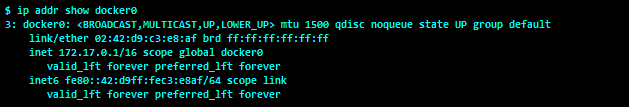

我们可以看到，`docker0`有`172.17.0.1/16`的 IP 地址。Docker 从 RFC 1918 中定义的私有范围中随机选择一个地址和子网([https://tools.ietf.org/html/rfc1918](https://tools.ietf.org/html/rfc1918))。使用这个桥接接口，容器可以相互通信，也可以与主机系统通信。

默认情况下，每当 Docker 启动一个容器时，它都会在以太网接口上创建一对虚拟运行，然后对这对虚拟运行执行以下操作:

*   将`veth`对的一端连接到 Docker 主机中的`docker0`桥接口—让我们将这一端称为主机端
*   将`veth`对的另一端连接到新创建的容器作为其`eth0`接口—让我们将`veth`对的这一端称为容器端

让我们启动一个容器并检查它的网络接口 IP 地址:


在前面的截图中，`veth`对的容器端被命名为`eth0@if17`，其中`17`是`veth`对的主机端的接口索引。我们可以使用该索引来识别 Docker 主机中`veth`对的主机端。容器的`eth0`被分配了 IP 地址`172.17.0.3`，该地址属于`docker0`子网，即`172.17.0.1/16`。

现在，让我们来看看第十七个索引的界面:


这里`veth`接口的主机端被命名为`vethe8b40b8@if16`，其中`16`是`veth`对的容器端的接口索引。由于索引`16`处的接口被分配给容器的网络名称空间，因此它不会显示在 Docker 主机中。Docker 引擎通过生成一个七位十六进制数自动生成主机端`veth`对的名称，然后将其附加到字符串 veth 中。在这个例子中，`e8b40b8`是由 Docker 引擎生成的随机数。Docker 引擎还确保这个随机数在 Docker 主机中是唯一的。如果仔细观察，您可能还会注意到`veth`接口的主机端绑定到了`docker0 `桥。

现在让我们再创建几个容器，并使用 Linux 以太网桥管理命令`brctl`查看`docker0`桥。

The Ubuntu Linux distribution does not usually carry the `brctl` tool, so we have to either install the `bridge-utils` package or leverage one of Docker's nifty features that lets you share the Docker host's network stack with the Docker container, as described in the *Attaching container to the host network* recipe.

这里，我们使用`docker container run`命令的`--network=host`选项连接到 Docker 主机的网络栈。由于`alpine`映像打包了`brctl`实用程序命令，我们将选择旋转带有`alpine`映像的容器，并运行`brctl show`命令来显示桥细节，如下图所示:


显然，`veth`对的所有主机端都绑定到默认的 Docker 桥`docker0`。除了设置`docker0`桥之外，Docker 还创建了`iptables` NAT 规则，这样所有容器默认都可以和外部世界对话，但是外部世界不能和容器对话。让我们看看 Docker 主机上的 NAT 规则:

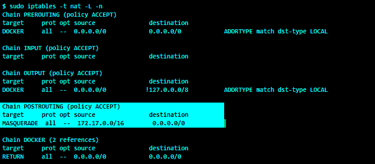

在前面的输出中，为`172.17.0.0/16`子网配置了一个`POSTROUTING`规则。该规则的唯一目的是将源自`172.17.0.0/16`子网的数据包的源 IP 地址更改为主机 IP 地址。显然，`172.17.0.0/16`子网被分配给了我们的`docker0`桥。本质上，这个`POSTROUTING`规则使 Docker 容器能够连接到外部世界，正如您可以在下面的`traceroute`输出中看到的:


很酷，不是吗？尽管如此，默认情况下，Docker 不会为外部世界做任何网络管道来连接容器。但是，当您在容器中托管服务时，必须从外部世界访问它。*从外部访问容器*的方法演示了如何向外部世界开放在容器内部运行的服务。此外，我们还有其他一些方法，这些方法关注单主机容器网络的各个方面。

For more information about the different kinds of networking we discussed in the preceding section, visit: [https://docs.docker.com/network/](https://docs.docker.com/network/).

在本章中，我们只关注单主机容器网络。除了单主机容器网络，我们还将研究如何在容器范例中共享和持久化数据。

# 从外面进入容器

在微服务架构中，多个较小的服务用于提供有意义的企业级应用。受 Docker 启发的容器化技术本质上是非常轻量级的，因此它在支持微服务架构方面发挥着至关重要的作用。默认情况下，Docker 容器允许传出数据流量，但是外部世界没有连接到容器内运行的服务的路径。尽管如此，Docker 提供了一个优雅的解决方案，使用`docker container run`命令的以下选项，有选择地使外部世界能够与容器内部运行的服务进行通信:

| `--publish`、`-p` | 向主机发布容器的端口 |
| `--publish-all`、`-P` | 将所有公开的端口发布到随机端口 |

这两个选项都允许外部世界通过 Docker 主机的端口连接到容器内部运行的服务。

# 准备好

在我们开始之前，请确保 Docker 守护程序正在 Docker 主机上运行。

# 怎么做...

执行以下步骤:

1.  让我们使用我们的`cookbook/apache2`映像在一个容器中启动一个`apache2`服务，并发布该服务，以便它使用`docker container run`命令的`-p`选项通过 Docker 主机的`80`端口运行到外部世界，如以下代码所示:

```
 $ docker container run -d -p 80:80 cookbook/apache2
a101ac9009f2237a2e4356e9caed6d0cf1666b5b86768f559a629d39034b4132
```

2.  接下来，使用`docker container port`命令查看容器和 Docker 主机端口之间的端口映射:

```
    $ docker container port a101ac9009f2
    80/tcp -> 0.0.0.0:80 
```

3.  显然，Docker 容器的端口`80`被映射到 Docker 主机的端口`80`。`0.0.0.0`的 IP 地址意味着 Docker 主机中的任何 IP 地址。

4.  现在，您可以使用 Docker 主机的 IP 地址从任何网络连接到容器内运行的`apache`服务，只要 Docker 主机具有来自该网络的 IP 网络连接。比如说你的 Docker 主机的 IP 地址是`198.51.100.73`。这意味着它可以通过使用任何浏览器的`http://198.51.100.73`网址连接到`apache`服务，您将获得以下输出:

```
    <html><h1>Docker Cookbook</h1></html>
```

# 它是如何工作的...

当容器用`-p <host port>:<container port>`启动时，Docker 引擎配置`iptables`目的 NAT 规则。此目标 NAT 规则负责将它在 Docker 主机端口上接收的所有数据包转发到容器的端口:

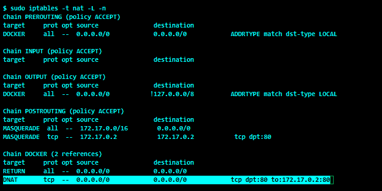

值得注意的是，Docker 引擎插入了具有以下配置的目标 NAT 规则:

*   **源地址** `0.0.0.0/0`:通配符地址，表示该规则适用于从任何来源接收的数据包
*   **目的地址** `0.0.0.0/0`:通配符地址，表示该规则适用于 Docker 主机的任何网络接口上接收的数据包
*   **目的端口** `dpt:80`:该规则的关键属性之一，使`iptables`能够选择性地将该规则应用于仅发送到 Docker 主机的端口`80`的数据包
*   **转发地址** `172.17.0.2:80`:满足上述条件时`iptables`将数据包转发到的容器的 IP 地址和端口

# 还有更多...

`docker container run`命令的`-p` ( `--publish`)选项支持四种配置，您可以使用这些配置向外部世界发布您的容器化服务，如下列表所示:

1.  `<hostPort>:<containerPort>`:这种配置在早期的配方中有所提及。
2.  `<containerPort>`:在这个配置中，我们只是指定容器端口，让 Docker Engine 选择 Docker 主机端口。典型的端口范围是从`32768`到`61000`，在`/proc/sys/net/ipv4/ip_local_port_range`中定义。
3.  `<ip>:<hostPort>:<containerPort>`:这个配置和`<hostPort>:<containerPort>`很像；但是，这里您指定的是 Docker 主机的特定 IP 接口。
4.  `<ip>::<containerPort>`:这个配置和`<containerPort>`很像；但是，这里您指定的是 Docker 主机的特定 IP 接口。

`docker container run`命令的`-P` ( `--publish-all`)选项从映像元数据中读出容器端口，并将其映射到 Docker 主机中的随机高阶端口(`32768`到`61000`)。`Dockerfile`的`EXPOSE`指令将端口信息添加到映像元数据中。

# 请参见

*   `docker container run`的`help`选项:

```
        $ docker container run --help      
```

*   Docker 网站上的文档:
    *   [https://docs.docker.com/engine/userguide/networking/](https://docs.docker.com/engine/userguide/networking/)
    *   [https://docs . docker . com/engine/user guide/networking/default _ network/binding/](https://docs.docker.com/engine/userguide/networking/default_network/binding/)

# 将容器连接到主机网络

在前面的方法中，Docker 默认将我们的容器连接到默认的桥接网络`docker0`，然后利用`iptables`的`DNAT`规则允许来自外部世界的 TCP 连接。然而，有许多用例，其中容器需要完全访问主机网络名称空间，例如本章介绍部分的`brctl show`场景。在这个方法中，我们将一个容器连接到默认网桥网络，另一个连接到主机网络，并比较它们之间的差异。

# 准备好

在我们开始之前，请确保 Docker 守护程序正在运行，并且可以访问 alpine 映像。

# 怎么做...

请执行以下步骤:

1.  首先，让我们在不指定任何网络选项的情况下启动一个 alpine 容器，并调用`ip address`命令，如下图所示:

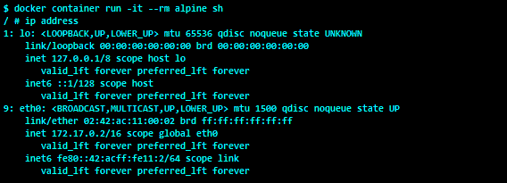

2.  现在，让我们通过使用`--net=host`作为参数并执行`ip address`命令将其附加到 Docker 主机的网络栈来继续启动一个 alpine 容器，如下图所示:


显然，在步骤 1 中，Docker 为容器创建了一个网络名称空间，并为容器分配了一个 IP 地址，而在步骤 2 中，Docker 将容器附加到主机网络栈，因此容器可以完全访问主机的网络栈。

# 它是如何工作的...

Docker 引擎通过将容器附加到 Docker 主机的网络栈来启动新容器，从而允许容器完全访问主机的网络栈。

# 请参见

*   `docker container run`的`help`选项:

```
    $ docker container run --help
```

*   Docker 网站上的文档:
    *   [https://docs.docker.com/engine/userguide/networking/](https://docs.docker.com/engine/userguide/networking/)
    *   [https://docs . docker . com/engine/user guide/networking/default _ network/binding/](https://docs.docker.com/engine/userguide/networking/default_network/binding/)

# 启动没有网络的容器

Docker 固有地支持三种类型的网络(`bridge`、`hosts`和`none`，如以下`docker network ls`命令输出所示:


在之前的食谱中，我们讨论了`bridge`和`host`网络功能。尽管如此，`none`网络模式在您将任何不需要任何网络连接的实用程序打包到容器中时会派上用场。此外，`none`网络模式也可以用来做你的自定义网络管道，不需要 Docker 参与。在这个食谱中，我们将推出一个具有`none `网络模式的容器，并探索容器的网络细节。

# 准备好

在我们开始之前，请确保 Docker 守护程序正在运行，并且可以访问 alpine 映像。

# 怎么做...

使用`docker container run`命令中的`--net none`参数启动没有网络的容器，如下图所示:

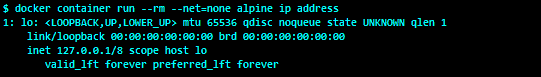

显然，当我们启动一个网络模式设置为`none`的容器时，Docker 只为该容器创建一个`loopback`接口。由于没有为此容器定义以太网接口，因此容器与网络隔离。

# 它是如何工作的...

当容器以`none `网络模式启动时，Docker 引擎为容器创建一个网络命名空间。但是，它没有为该容器配置任何网络。

# 请参见

*   `docker container run`的`help`选项:

```
$ docker container run --help 
```

*   Docker 网站上的文档:

[https://docs.docker.com/engine/userguide/networking/](https://docs.docker.com/engine/userguide/networking/)T2】

[https://docs . docker . com/engine/user guide/networking/default _ network/binding/](https://docs.docker.com/engine/userguide/networking/default_network/binding/)

# 与其他容器共享 IP 地址

通常，当我们启动一个容器时，Docker 引擎会为该容器分配一个 IP 地址。当然，我们可以使用`host`网络模式将容器附加到 Docker 主机的 IP 地址，或者使用`none`网络模式启动一个没有分配任何 IP 地址的容器。但是，您可能会遇到多个服务必须共享同一个 IP 地址的情况。在这种情况下，您可以在一个容器中运行多个服务；然而，这种做法被认为是反容器模式。

更好的选择是在单独的容器中运行每个服务，但共享 IP 地址，如下图所示:

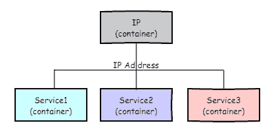

本质上，Docker 引擎为 IP 容器分配一个 IP 地址，然后该 IP 地址被 **Service1** 、 **Service2、**和 **Service3** 容器继承。在这个食谱中，我们将启动一个容器，并与另一个容器共享 IP 地址。

# 准备好

Before we begin, ensure that the Docker daemon is running and has access to the alpine image.

# 怎么做...

执行以下步骤:

1.  首先，在后台启动一个容器，如下图所示:


在这里，容器被命名为`ipcontainer`。

2.  看`ipcontainer`的 IP 地址，如下图截图所示:


3.  最后，让我们通过将其网络附加到`ipcontainer`来启动一个容器，并显示附加到该容器的 IP 地址:

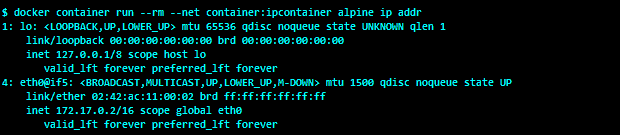

如步骤 2 和步骤 3 所示，步骤 2 中`ipcontainer`的`eth0`和步骤 3 中的瞬态容器具有相同的`4`接口索引和`172.17.0.2`的 IP 地址。

# 它是如何工作的...

在这个配方中，我们创建了一个容器，然后创建了后续的容器来使用第一个容器的网络。在这种情况下，Docker 引擎将为第一个容器创建一个网络名称空间，然后也为其他容器分配相同的名称空间。

# 还有更多...

当容器共享网络命名空间时，创建命名空间的原始容器必须处于运行状态，直到其他容器运行。如果原始容器在其他容器之前停止，它将使其他容器处于不可用状态，如以下代码所示:

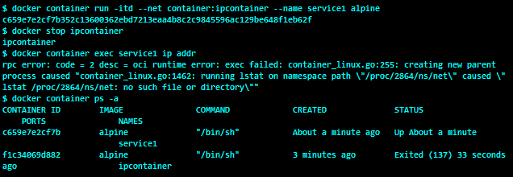

Kubernetes([http://kubernetes.io/](http://kubernetes.io/))容器中的容器使用这个技巧在容器中的容器之间共享 IP 地址。我们将在[第 8 章](08.html)、 *Docker 编排和托管平台*中再次讨论这一点。

# 请参见

*   `docker container run`的`help`选项:

```
$ docker container run --help
```

*   Docker 网站上的文档:
    *   [https://docs.docker.com/engine/userguide/networking/](https://docs.docker.com/engine/userguide/networking/)
    *   [https://docs . docker . com/engine/user guide/networking/default _ network/binding/](https://docs.docker.com/engine/userguide/networking/default_network/binding/)

# 创建用户定义的桥接网络

在前面的食谱中，我们使用了默认的桥，当我们安装 Docker 时，它会被激活。通过默认网桥连接的容器可以使用 IP 地址相互通信，但不能使用容器的名称。在微服务体系结构中，多个容器被协调起来以提供有意义的更高级服务，这些容器必须有效地相互通信。容器 IP 地址是在容器启动时分配的，因此它不适用于多容器编排。Docker 试图通过使用`docker container run`命令的`--link`选项静态链接容器来解决这个问题。不幸的是，链接的容器有一个紧密耦合的容器生命周期，因此容器的重启可能会妨碍完整的解决方案，并且它也不可扩展。后来，在 1.9 和 1.12 版本之间，Docker 通过用户定义的网络引入了一系列新功能，解决了前面提到的多容器编排和通信的许多缺点。

用户定义的网桥网络在功能上非常类似于默认网桥；但是，它提供了以下附加功能:

*   通过嵌入式 DNS 服务器进行服务发现，非常适合多容器编排和通信。
*   基于 DNS 的负载平衡，另一个很酷的功能，补充了多容器编排和通信。值得注意的是，这个特性允许我们无缝透明地扩展容器。
*   或者，我们可以为网桥配置自己的子网。
*   或者，我们可以从网桥的子网手动为容器分配一个 IP 地址。

在这个食谱中，我们将创建一个用户定义的网络，并仔细检查它的一些基本结构。在下面的方法中，我们将在用户定义的网桥中创建容器，并演示用户定义的网桥网络的功能。

# 准备好

在我们开始之前，请确保 Docker 守护程序正在运行。

# 怎么做...

1.  让我们首先使用`docker network create`命令创建一个新的用户定义的桥接网络，如下图所示:


这里，用户定义的桥接网络被命名为`cookbook`。

2.  使用`docker network inspect`命令检查用户定义的网桥网络`cookbook`:


这里，`172.18.0.0/16`子网被分配给用户定义的网桥网络食谱，`172.18.0.1 ` IP 地址被分配给网关。

3.  现在让我们看看 Docker 主机的接口细节:

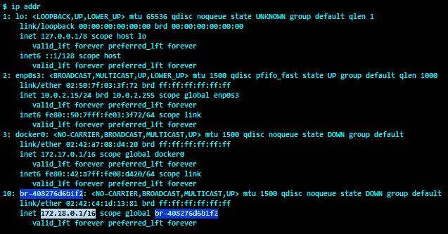

显然，一个新的 Linux 桥接口`br-408276d6b1f2`被创建，并被分配了地址`172.18.0.1/16`。网桥名称是通过将`br-`字符串与网络标识的前 12 位数字连接起来而得到的。

4.  最后，让我们看看`iptables`来理解用户定义桥的行为:


如前一张截图中突出显示的，已经为`172.18.0.0/16`子网添加了一个 NAT `POSTROUTING`规则，就像默认网桥一样。

# 它是如何工作的...

当我们创建一个用户定义的网桥时，Docker 会创建一个 Linux 网桥接口，并在`iptables`中创建必要的 NAT 规则。

# 还有更多...

`docker network create`命令提供了十几个选项来根据您的业务需求定制您的网络。在以下示例中，我们在`10.1.0.0/16`子网中创建了一个用户定义的网络:

```
$ docker network create 10dot1net --subnet 10.1.0.0/16
```

# 请参见

*   `docker network create`的`help`选项:

```
$ docker network create --help
```

*   Docker 网站上的文档:

[https://docs.docker.com/engine/userguide/networking/](https://docs.docker.com/engine/userguide/networking/)

[https://docs . docker . com/engine/user guide/networking/default _ network/binding/](https://docs.docker.com/engine/userguide/networking/default_network/binding/)

# 发现和负载平衡容器

在前面的方法中，我们研究了用户定义的桥接网络的优势，以及创建和检查用户定义的桥接网络的步骤。在这个配方中，我们将构建一个容器拓扑，如下图所示:


在这个拓扑中，我们将像服务一样启动`container1`和`container2`，并使用一个临时容器来演示用户定义的桥接网络的以下功能:

*   通过嵌入式域名系统服务器发现服务
*   基于域名系统的负载平衡

# 准备好

在我们开始之前，请确保 Docker 守护程序正在运行。

# 怎么做...

执行以下步骤:

1.  让我们从旋转两个容器`container1`和`container2`开始，使用`docker container run`命令将它们连接到用户定义的桥接网络`cookbook`，如下图所示:

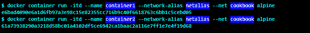

在这里，`--network-alias`选项帮助我们使用一个别名对多个容器进行分组，并使用嵌入式 DNS 进行负载平衡。嵌入式域名系统提供循环负载平衡。

2.  使用`docker container inspect`命令查看`container1`和`container2`的 IP 地址:


这里，`.NetworkSettings.Networks.cookbook.IPAddress`过滤器应用于`--format`选项，因为我们知道容器连接到用户定义的桥接网络`cookbook`。

3.  现在，让我们使用瞬态容器来理解用户定义网络的服务发现功能，如下图所示:

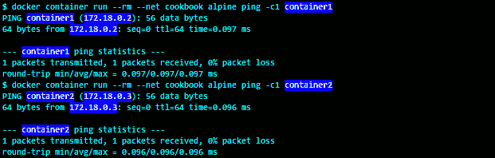

很酷，不是吗！现在，容器可以通过使用容器的名称相互通信。这种服务发现功能极大地简化了多容器编排。

4.  深入研究了服务发现功能之后，让我们通过 ping 网络别名`netalias`，进一步了解用户自定义网络的 DNS 负载均衡能力，如下图截图所示:


从前面的截图中我们可以看出，`netalias`上的第一个`ping`得到了 IP 地址`172.18.0.3`的响应，就是`container2`，而`netalias`上的第二个 ping 得到了`172.18.0.2`的响应，就是`container1`。本质上，嵌入式域名系统负载平衡器使用循环算法解决了`netalias`。

# 它是如何工作的...

当容器连接到用户定义的网络时，Docker 引擎会将容器的名称及其网络别名(如果存在)添加到用户定义的网络的 DNS 记录中。然后 Docker 通过`127.0.0.11`托管的嵌入式 DNS 将这些细节共享给连接到同一用户定义网络的其他容器。

# 还有更多...

*   像任何 DNS 服务器一样，我们可以使用`dig`或`nslookup`查询我们的嵌入式 DNS 服务器的 DNS 记录。这里，我们使用名为`sequenceiq/alpine-dig`的第三方映像来查询 DNS 记录，因为该映像附带有`dig`命令，而不是没有`dig`命令的官方`alpine`映像:


显然，域名系统条目`netalias`有两个 IP 地址`172.18.0.3`和`172.18.0.2`，作为其`A`记录。

*   像`nginx`这样的应用通常会缓存 IP 地址，因此基于 DNS 的负载平衡解决方案通常不能很好地适用于此类应用。

# 请参见

*   `docker network create`命令的`help`选项:

```
$ docker network create -help
```

*   `dig`命令的`h`选项:

```
$ dig -h
```

*   Docker 网站上的文档:

[https://docs.docker.com/engine/userguide/networking/](https://docs.docker.com/engine/userguide/networking/)

[https://docs.docker.com/engine/userguide/networking/default_network/binding/](https://docs.docker.com/engine/userguide/networking/default_network/binding/)

# 使用卷保存数据

正如我们所知，容器的读写层是临时的，当容器被移除时就会被破坏。但是，在一些用例中，您必须在容器的生命周期之外保存应用数据。例如，一个 Docker 注册表容器保存所有被推送到它的映像。如果这个容器被删除，那么我们将丢失它保存的所有映像。也许，我们可以借助容器的提交流来保存数据，但是这会使映像膨胀，并使容器部署过程复杂化。推荐的替代方法是使用卷或绑定装载将应用数据保存在容器的文件系统之外。我们将在下一个食谱中讨论绑定坐骑。

Docker 卷是 Docker 主机中的一个特殊目录，由 Docker 自己创建和管理。我们可以将这些卷装载到容器中，并让应用将其数据存储到卷中。Docker 卷要么是命名的，要么是匿名的。在功能上，匿名卷与命名卷相同；但是，匿名卷名是随机生成的。Docker 还支持`volume`插件来解决高级存储需求，这超出了本书的范围。

在本食谱中，我们将使用一个命名卷和两个容器来演示数据持久性。

# 准备好

在我们开始之前，请确保 Docker 守护程序正在运行。

# 怎么做...

执行以下步骤:

1.  让我们首先使用`docker volume create `命令创建一个命名卷，如下面的代码所示:

```
 $ docker volume create datavol 
 datavol
```

2.  使用`docker volume ls`命令列出音量，如下代码所示:

```
 $ docker volume create ls 
 DRIVER  VOLUME NAME 
 local   datavol
```

3.  使用`docker container run`命令和`-v`选项启动交互式容器，将`datavol`卷装入容器，如下代码所示:

```
 $ docker container run -it --rm -v datavol:/data alpine / #
```

4.  现在，让我们在容器的`/data`目录下创建一个新文件，并向其中写入一些文本:

```
/ # echo "This is a named volume demo" > /data/demo.txt / #
```

5.  退出前面的容器，并使用 docker container `rm`命令移除容器。

6.  现在，通过再次安装`datavol `卷来启动一个新的容器，并打印`demo.txt`的内容，如下代码所示。在这里，我们有意选择一个`ubuntu`映像，只是为了强调 Docker 卷的功能是相同的，与创建容器的 Docker 映像无关:

```
$ docker container run --rm \ -v datavol:/data ubuntu cat /data/demo.txt 
```

这是一个命名的卷演示。显然，我们从第一个容器中写入的文本被保存在`datavol`卷中，然后被第二个容器检索。

# 它是如何工作的...

默认的`docker volume create`命令在 Docker 主机的`/var/lib/docker/volumes/`目录下为卷创建一个目录。例如，在本食谱中，在`/var/lib/docker/volumes/`下创建了一个`datavol `目录。此外，Docker 在为卷创建的目录下为每个卷再创建一个名为`_data`的目录。我们可以通过运行`docker volume inspect`命令来确认目录路径，如下图所示:

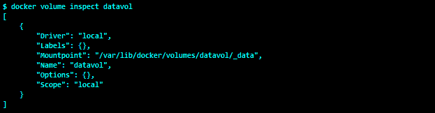

当我们将卷装入容器时，Docker 内部绑定将卷的`_data`目录装入容器。

我们将在下一个食谱中了解更多关于装订机的知识。

在当前配方中，`/var/lib/docker/volumes/datavol/_data`目录在启动容器时被绑定装载，并且卷上的任何文件操作都保留在该目录中，如下面的`tree`输出所示:


因为文件操作是从容器外部化的，所以卷的生命周期是从容器中分离出来的。

# 还有更多...

Docker 允许我们与多个容器共享卷，因此卷也可以用作容器之间共享数据的有效工具。

# 请参见

*   `docker volume create`命令的`help`选项:

```
$ docker volume create -help
```

*   `docker volume ls `命令的`help`选项:

```
$ docker volume ls -help
```

*   `docker volume inspect`命令的`help`选项:

```
$ docker volume inspect -help
```

*   Docker 网站上的文档:

[https://docs . docker . com/engine/admin/volumes/volumes/](https://docs.docker.com/engine/admin/volumes/volumes/)

[https://docs . docker . com/engine/reference/command line/volume _ create/](https://docs.docker.com/engine/reference/commandline/volume_create/)

[https://docs . docker . com/engine/reference/command line/volume _ ls/](https://docs.docker.com/engine/reference/commandline/volume_ls/)

[https://docs . docker . com/engine/reference/command line/volume _ inspect/](https://docs.docker.com/engine/reference/commandline/volume_inspect/)

# 在主机和容器之间共享数据

在前面的方法中，我们使用了一个命名卷来保存应用数据。我们还了解到命名卷可用于在容器之间共享数据。在这个方法中，我们将使用绑定装载将 Docker 主机目录装载到容器，然后使用该装载点在 Docker 主机和容器之间共享数据。

# 准备好

在我们开始之前，请确保 Docker 守护程序正在运行。

# 怎么做...

请执行以下步骤:

1.  让我们从在主目录中创建一个名为`data_share`的新目录开始，如以下代码所示:

```
 $ mkdir $HOME/data_share
```

2.  在 Docker 主机的`$HOME/data_share`目录中创建新文件，并在其中写入一些文本:

```
$ echo "data sharing demo" > $HOME/data_share/demo.txt
```

3.  现在，通过挂载`$HOME/data_share`目录启动一个容器，然后打印`demo.txt`的内容:

```
$ docker container run --rm \ 
 -v $(HOME)/data_share:/data \ 
 ubuntu cat /data/demo.txt 
data sharing demo
```

在这个配方中，我们有效地从 Docker 主机向容器共享了一个文件。虽然这是一个非常简单的例子，但它是一个非常强大的机制来共享您的应用配置以及其他细节。

# 它是如何工作的...

当使用`-v <host path>:<container path>`选项启动容器时，Docker 引擎绑定将主机路径装入指定容器路径上的容器文件系统。绑定挂载是一种 Linux 功能，用于获取现有的目录结构并将其映射到不同的位置。

# 还有更多...

在这个配方中，我们在容器中安装了一个目录。同样，我们也可以将单个文件装载到容器中，如下面的代码所示:

```
$ docker container run --rm \
          -v $(HOME)/data_share/demo.txt:/demo.txt \
          ubuntu cat /demo.txt 
data sharing demo
```

默认情况下，当我们将目录或文件装入容器时，它会以读写模式装入，这样容器就可以更改装入的目录或文件的内容。我们可以使用`ro`标志防止容器修改挂载的目录或文件的内容，如下面的代码所示:

```
$ touch file 
$ docker container run -rm \ 
 -v ${PWD}/file:/file:rw \ 
 ubuntu sh -c "echo rw mode >> /file" 
$ cat file rw mode 
$ docker container run -rm \ 
 -v ${PWD}/file:/file:rw \                    ubuntu sh -c "echo ro >> /file" 
sh: 1: cannot create /file: Read-only file system
```

显然，当我们以只读方式装载文件时，`write`操作失败。

# 请参见

*   `docker container run`命令的`help`选项:

```
$ docker container run -help
```

*   Docker 网站上的文档:

[https://docs . docker . com/engine/admin/volumes/volumes/](https://docs.docker.com/engine/admin/volumes/volumes/)