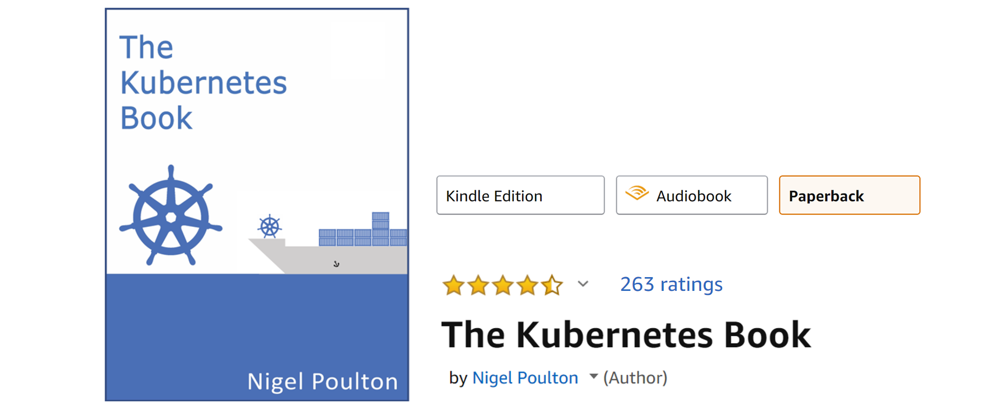

## 1:来自 30，000 英尺的集装箱

集装箱绝对是*的东西*。

在这一章中，我们将讨论以下问题:为什么我们有容器，它们为我们做什么，我们可以在哪里使用它们。

### 糟糕的旧时光

应用程序是企业的核心。如果应用程序崩溃，企业也会崩溃。有时他们甚至会破产。这些说法一天比一天真实！

大多数应用程序运行在服务器上。过去，我们每台服务器只能运行一个应用程序。Windows 和 Linux 的开放系统世界只是没有在同一台服务器上安全运行多个应用程序的技术。

结果，事情是这样的……每次企业需要新的应用程序时，信息技术部门都会购买新的服务器。大多数情况下，没有人知道新应用程序的性能要求，这迫使信息技术部门在选择要购买的服务器的型号和大小时进行猜测。

因此，IT 部门做了唯一能做的事情——购买了价格不菲的大型快速服务器。毕竟，包括企业在内的所有人最不希望看到的是，动力不足的服务器无法执行交易，并可能失去客户和收入。所以，IT 买大了。这导致过度供电的服务器只能运行其潜在容量的 5-10%。**公司资金和环境资源的悲惨浪费！**

### 你好，VMware！

在这一切中，VMware 公司给了世界一个礼物——虚拟机。几乎在一夜之间，世界变得更加美好。我们终于有了一种技术，使我们能够在一台服务器上安全地运行多个业务应用程序。暗示疯狂的庆祝！

这是一个游戏规则的改变者。IT 部门不再需要在每次企业需要新应用程序时都采购全新的超大服务器。通常，他们可以在闲置的现有服务器上运行新的应用程序。

突然之间，我们可以从现有的公司资产中榨取大量的价值，从而为公司带来更多的收益。

### vmware

但是……总有一个*但是！*尽管虚拟机很棒，但它们远非完美！

每个虚拟机都需要自己的专用操作系统，这是一个主要缺陷。每个操作系统都会消耗 CPU、RAM 和其他资源，这些资源原本可以用来为更多应用提供动力。每个操作系统都需要打补丁和监控。在某些情况下，每个操作系统都需要许可证。所有这些都导致时间和资源的浪费。

虚拟机模型还有其他挑战。虚拟机启动速度慢，可移植性也不好——在虚拟机管理程序和云平台之间迁移和移动虚拟机工作负载比需要的要困难。

### 你好集装箱！

长期以来，像谷歌这样的大型网络公司一直在使用容器技术来解决虚拟机模型的缺点。

在容器模型中，容器大致类似于虚拟机。一个主要的区别是容器不需要自己的完整操作系统。事实上，单个主机上的所有容器共享主机的操作系统。这释放了大量的系统资源，如中央处理器、内存和存储。它还降低了潜在的许可成本，并减少了操作系统修补和其他维护的开销。最终结果:节省了时间、资源和资金。

容器也是快速启动和超便携的。将容器工作负载从您的笔记本电脑转移到云中，然后转移到数据中心的虚拟机或裸机上，这是轻而易举的事情。

### Linux 容器

现代容器始于 Linux 世界，是长期以来各种各样的人大量工作的产物。仅举一个例子，谷歌有限责任公司为 Linux 内核贡献了许多与容器相关的技术。没有这些以及其他贡献，我们就不会有今天的现代集装箱。

近年来促成集装箱大规模增长的一些主要技术包括:**内核命名空间**、**控制组**、**联合文件系统**，当然还有 **Docker** 。再次强调前面说过的话——现代集装箱生态系统深深地感谢许多个人和组织，他们为我们目前的发展奠定了坚实的基础。谢谢大家！

尽管如此，集装箱仍然很复杂，大多数组织都无法触及。直到 Docker 出现，集装箱才被有效地民主化，并为大众所接受。

> **注意:**有许多类似于容器的操作系统虚拟化技术先于 Docker 和现代容器。有些甚至可以追溯到大型机的 System/360。BSD 监狱和 Solaris Zones 是 Unix 类型容器技术的其他一些著名的例子。然而，在这本书里，我们将我们的谈话限制在由 Docker 制造的流行的*现代集装箱*上。

### 你好，多克！

我们将在下一章更详细地讨论 Docker。但就目前而言，可以说 Docker 是让 Linux 容器对普通人可用的魔力。换句话说，Docker，Inc .让容器变得简单了！

### Windows 容器

在过去的几年里，微软公司极其努力地将 Docker 和容器技术引入 Windows 平台。

在撰写本文时，Windows 容器在 Windows 桌面和 Windows Server 平台上可用(某些版本的 Windows 10 和更高版本，以及 Windows Server 2016 和更高版本)。为了实现这一目标，微软与 Docker，Inc .和开源社区密切合作。

实现容器所需的核心 Windows 内核技术统称为 *Windows 容器*。使用这些*视窗容器*的用户空间工具可以是 Docker。这使得 Windows 上的 Docker 体验与 Linux 上的 Docker 几乎完全相同。这样，熟悉 Linux 平台 Docker 工具集的开发人员和系统管理员就可以像在家里一样使用 Windows 容器了。

**这本书的修订版包括了 Linux 和 Windows 的混合示例。**

### Windows 容器与 Linux 容器

理解一个正在运行的容器共享它正在运行的主机的内核是至关重要的。这意味着容器化的 Windows 应用程序不会在基于 Linux 的 Docker 主机上运行，反之亦然——Windows 容器需要 Windows 主机，而 Linux 容器需要 Linux 主机。只是……事情并不总是那么简单。

在 Windows 机器上运行 Linux 容器是可能的。例如，在 Windows 上运行的 Docker Desktop 有两种模式——“Windows 容器”和“Linux 容器”。根据您的 Docker Desktop 版本，Linux 容器要么在轻量级 Hyper-V 虚拟机中运行，要么使用 Windows Linux 子系统(WSL)。WSL 选项较新，是未来的战略选项，因为它不需要 Hyper-V 虚拟机，并且提供了更好的性能和兼容性。

### 那么 Mac 容器呢？

目前还没有 Mac 容器这种东西。

但是，您可以使用 *Docker Desktop* 在 Mac 上运行 Linux 容器。这是通过在 Mac 上的轻量级 Linux 虚拟机中无缝运行容器来实现的。它非常受开发人员的欢迎，他们可以在自己的苹果电脑上轻松开发和测试 Linux 容器。

### 库本内斯怎么样

Kubernetes 是谷歌的一个开源项目，它已经迅速成为容器化应用程序的实际协调者。这只是一种花哨的说法 *Kubernetes 是部署和管理容器化应用程序*最流行的工具。

> **注意:**容器化的应用是作为容器运行的应用。

在撰写本文时，Kubernetes 使用 Docker 作为其默认的容器运行时——这是一种低级技术，可以拉取图像并启动和停止容器。然而，Kubernetes 有一个可插拔的容器运行时接口(CRI)，它可以很容易地将 Docker 换成不同的容器运行时。未来，Docker 可能会被`containerd`取代，成为 Kubernetes 中的默认容器运行时。更多关于`containerd`的内容将在本书后面介绍，但就目前而言，知道 containerd 是 Docker 的一个小的专门部分就足够了，它负责启动和停止容器的低级任务。

关于 Kubernetes，现阶段需要了解的重要一点是，它是一个比 Docker 更高级的平台，目前它使用 Docker 进行与容器相关的低级操作。

我有以下资源可以帮助您学习 Kubernetes:

*   《忽必烈之书》
*   Kubernetes 视频课程入门
*   kubernetes 101 视频课程

库本内特入门版在 pluralsight.com 发售，库本内特 101 版在 udemy.com 发售。

### 章节总结

我们曾经生活在这样一个世界里，每当企业想要一个新的应用程序，我们就必须购买一台全新的服务器。VMware 的出现使我们能够从新的和现有的公司信息技术资产中获得更多价值。尽管 VMware 和虚拟机模型很好，但并不完美。随着 VMware 和虚拟机管理程序的成功，出现了一种更新、更高效、更轻量级的虚拟化技术，称为容器。但是容器最初很难实现，只能在拥有 Linux 内核工程师的网络巨头的数据中心找到。Docker，Inc .出现了，突然之间，集装箱可以供大众使用了。

说到 Docker…让我们去找谁，为什么，Docker 是什么！