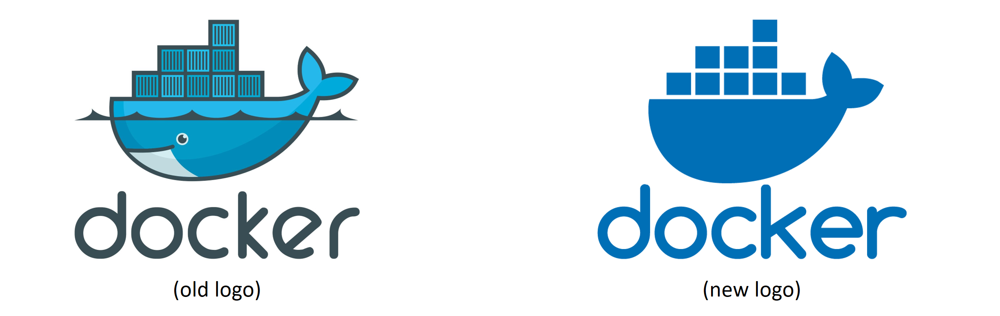

## 二、Docker

不谈论 Docker，任何关于容器的书或对话都是不完整的。但是当我们说“Docker”时，我们可以指以下任何一个:

1.  该公司
2.  技术Docker

### 坞站 tldr

Docker 是运行在 Linux 和 Windows 上的软件。它创建、管理甚至可以编排容器。该软件目前由来自*莫比*开源项目的各种工具构建而成。Docker，Inc .是创造这项技术的公司，并继续创造技术和解决方案，使您的笔记本电脑上的代码更容易在云中运行。

这是快速版本。让我们再深入一点。

### Docker公司。

Docker，Inc .是一家总部位于旧金山的科技公司，由法国出生的美国开发者和企业家所罗门·海克斯创立。所罗门已经不在公司了。

Figure 2.1 Docker, Inc. logo.

该公司最初是一家名为 *dotCloud* 的平台即服务(PaaS)提供商。在幕后，dotCloud 平台建立在 Linux 容器上。为了帮助创建和管理这些容器，他们构建了一个内部工具，最终他们将其昵称为“Docker”。Docker 技术就是这样诞生的！

有趣的是，“Docker”这个词来自英国，意思是Docker——从船上装卸货物的人。

2013 年，他们摆脱了业务中苦苦挣扎的 PaaS 部门，将公司更名为“Docker，Inc .，并专注于将 Docker 和容器带到世界各地。他们非常成功地将容器引入了主流信息技术，但迄今为止，他们一直在努力实现盈利。

在撰写本文时，Docker，Inc .正专注于他们的 Docker Desktop 和 Docker Hub 产品，以简化从笔记本电脑上的源代码到云中运行的应用的整个过程。

在本书中，我们将使用术语“Docker公司”来指代Docker公司。术语“Docker”的所有其他用途将指该技术。

### Docker技术

当大多数人谈论 Docker 时，他们指的是运行容器的技术。但是，在将 Docker 称为技术时，至少要注意三件事:

1.  运行时
2.  守护进程(也称为引擎)
3.  管弦乐队

图 2.2 显示了三层，在我们解释每个组件时，它将是一个有用的参考。我们将在本书后面深入探讨。

Figure 2.2 Docker architecture.

运行时在最底层运行，负责启动和停止容器(这包括构建所有操作系统结构，如名称空间和 cgroups)。Docker 实现了一个分层的运行时架构，高级和低级运行时协同工作。

低级运行时称为`runc`，是开放容器计划(OCI)运行时规范的参考实现。它的工作是与底层操作系统接口，启动和停止容器。Docker 节点上的每个运行容器都有一个 runc 实例来管理它。

更高级别的运行时称为`containerd`。`containerd`做的比 runc 多很多。它管理容器的整个生命周期，包括拉映像、创建网络接口和管理低级 runc 实例。`containerd`发音为“container-dee ”,是 Docker 和 Kubernetes 用作容器运行时的毕业 CNCF 项目。

典型的 Docker 安装有一个控制与每个运行容器相关联的 runc ( `docker-runc`)实例的容器进程(`docker-containerd`)。

Docker 守护进程(`dockerd`)位于`containerd`之上，执行更高级别的任务，例如；展示 Docker 远程 API、管理映像、管理卷、管理网络等等…

Docker 守护程序的一项主要工作是提供一个易于使用的标准接口，该接口抽象出较低的级别。

Docker 还支持管理运行 Docker 的节点集群。这些集群被称为集群，本地技术被称为 Docker Swarm。Docker Swarm 易于使用，许多公司都在现实生产中使用它。然而，大多数人选择使用 Kubernetes 而不是 Docker Swarm。

### 开放式容器倡议(OCI)

在本章的前面，我们提到了[容器开放倡议——OCI](https://www.opencontainers.org)。

OCI 是一个治理委员会，负责标准化容器基础设施的底层基础组件。特别是它聚焦于*映像格式*和*容器运行时*(如果你还不习惯这些术语，不要担心，我们会在书中介绍它们)。

同样真实的是，如果不提及一点历史，任何关于 OCI 的讨论都是不完整的。和所有关于历史的报道一样，你得到的版本取决于谁在说话。奈杰尔说，这是容器的历史

从第一天起，Docker 的使用就变得疯狂起来。越来越多的人用越来越多的方式去做越来越多的事情。因此，一些政党不可避免地会感到沮丧。这很正常，也很健康。

根据奈杰尔的说法，这段历史的 TLDR 是一家名为 CoreOS 的公司(被红帽收购，随后被 IBM 收购)不喜欢 Docker 做某些事情的方式。因此，他们创建了一个名为的开放标准，定义了映像格式和容器运行时等内容。他们还创建了一个名为 **rkt** (发音为“火箭”)的规范实现。

这使得容器生态系统在两个相互竞争的标准下处于尴尬的境地。

回到这个故事，这可能会破坏生态系统，让用户和客户陷入两难境地。虽然竞争通常是好事，*竞争标准*通常不是。它们会造成混乱，减缓用户采用。对谁都不好。

考虑到这一点，每个人都尽最大努力表现得像成年人一样，共同组成了 OCI——一个管理容器标准的轻量级敏捷委员会。

在撰写本文时，OCI 已经发布了两个规范(标准)

*   [映像规格](https://github.com/opencontainers/image-spec)
*   [运行时间规格](https://github.com/opencontainers/runtime-spec)

在提到这两个标准时经常使用的类比是*铁轨*。这两个标准就像是在铁路轨道的标准尺寸和属性上达成一致，让其他人自由建造更好的火车、更好的车厢、更好的信号系统、更好的车站……所有这些都是安全的，因为他们知道自己将在标准化的轨道上工作。没有人想要铁路轨道尺寸的两个竞争标准！

公平地说，这两个 OCI 规范对 Docker 核心产品的架构和设计产生了重大影响。从 Docker 1.11 开始，Docker 引擎架构符合 OCI 运行时规范。

OCI 是在 Linux 基金会的支持下组织的。

### 章节总结

在本章中，我们了解了 Docker，Inc .公司和 Docker 技术。

Docker，Inc .是一家总部位于旧金山的科技公司，其目标是改变我们做软件的方式。他们可以说是现代容器革命的先行者和煽动者。

Docker 技术侧重于运行和管理应用容器。它运行在 Linux 和 Windows 上，几乎可以安装在任何地方，是目前 Kubernetes 使用的最流行的容器运行时。

开放容器倡议(OCI)有助于容器运行时格式和容器映像格式的标准化。