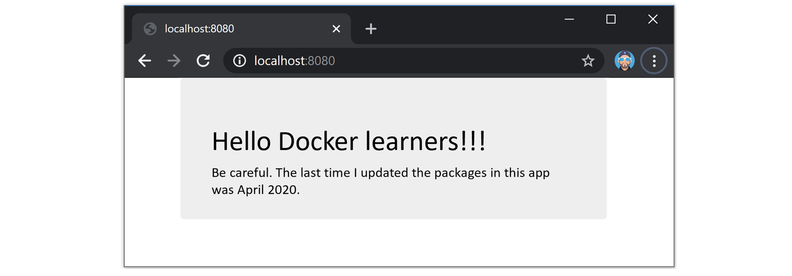
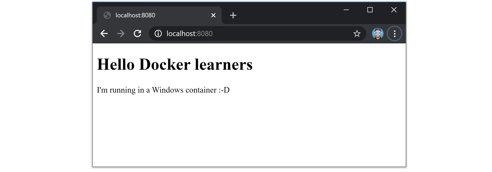

## 四、概览

这一章的目的是在我们在后面的章节深入探讨之前，快速描绘出 Docker 的全貌。

我们将把这一章分成两部分:

*   运营部的观点
*   发展视角

在操作透视图部分，我们将下载一个映像，启动一个新的容器，登录到新的容器，在其中运行一个命令，然后销毁它。

在开发视角部分，我们将更加关注应用。我们将从 GitHub 中克隆一些应用代码，检查一个 Dockerfile，将应用容器化，将其作为一个容器运行。

这两个部分将让您很好地了解 Docker 是关于什么的，以及主要组件是如何组合在一起的。**建议您阅读这两个部分，以获得*开发*和*运营*的视角。** DevOps 有人吗？

不要担心我们在这里做的一些事情对你来说是全新的。我们不是想让你成为本章的专家。这是为了让你对事物有一个*的感觉*——让你在后面的章节中进入细节的时候，你会有一个关于这些部分如何组合在一起的想法。

如果你想跟进，你需要的只是一台带互联网连接的 Docker 主机。我推荐你的 Mac 或 Windows 电脑使用 Docker 桌面。然而，这些例子将适用于任何安装了 Docker 的地方。我们将展示使用 Linux 容器和 Windows 容器的例子。

如果你不能安装软件，也不能访问公共云，另一个获得 Docker 的好方法是玩 Docker (PWD)。这是一个基于网络的 Docker 游乐场，你可以免费使用。只需将您的网络浏览器指向 https://labs.play-with-docker.com/，您就可以开始了(您需要一个 Docker Hub 或 GitHub 帐户才能登录)。

随着本章的深入，我们可能会交替使用术语“Docker 主机”和“Docker 节点”。两者都是指您运行 Docker 的系统。

### 运营视角

安装 Docker 时，您会得到两个主要组件:

*   Docker 客户
*   Docker 守护进程(有时称为“Docker 引擎”)

守护进程实现运行时、应用编程接口和运行 Docker 所需的所有其他东西。

在默认的 Linux 安装中，客户端通过本地 IPC/Unix 套接字在`/var/run/docker.sock`与守护进程对话。在 Windows 上，这是通过位于`npipe:////./pipe/docker_engine`的命名管道实现的。安装后，您可以使用`docker version`命令来测试客户端和守护程序(服务器)是否正在运行并相互通信。


```
> docker version
Client: Docker Engine - Community
 Version:       19.03.8
 API version:   1.40
 Go version:    go1.12.17
 Git commit:    afacb8b
 Built: Wed Mar 11 01:23:10 2020
 OS/Arch:       linux/amd64
 Experimental:  false

Server:
 Engine:
  Version:          19.03.8
  API version:      1.40 (minimum version 1.12)
  Go version:       go1.12.17
  Git commit:       afacb8b
  Built:            Wed Mar 11 01:29:16 2020
  OS/Arch:          linux/amd64
  Experimental:     false
 containerd:
  Version:          v1.2.13
  ... 
```


 `如果你从`Client` **和** `Server`得到回复，你就可以走了。

如果您正在使用 Linux 并从服务器组件获得错误响应，请确保 Docker 已启动并运行。另外，再次尝试前面有`sudo`的命令:`sudo docker version`。如果它与`sudo`一起工作，你需要将你的用户帐户添加到本地`docker`组，或者在本书剩余的命令前面加上`sudo`。

#### 形象

将 Docker 映像视为包含操作系统文件系统、应用和所有应用依赖项的对象是很有用的。如果你在运营部门工作，它就像一个虚拟机模板。虚拟机模板本质上是一个停止的虚拟机。在 Docker 世界中，映像实际上是一个停止的容器。如果你是开发人员，你可以把一个映像想象成一个*类*。

在 Docker 主机上运行`docker image ls`命令。


```
$ docker image ls
REPOSITORY    TAG        IMAGE ID       CREATED       SIZE 
```


 `如果您是在新安装的 Docker 主机上工作，或者玩 Docker，您将没有映像，它看起来像以前的输出。

把映像放到你的 Docker 主机上叫做“拉”。如果你跟着 Linux 走，拉`ubuntu:latest`映像。如果您在 Windows 上跟随，请拖动`mcr.microsoft.com/powershell:lts-nanoserver-1903`映像。


```
$ docker image pull ubuntu:latest
latest: Pulling from library/ubuntu
50aff78429b1: Pull complete
f6d82e297bce: Pull complete
275abb2c8a6f: Pull complete
9f15a39356d6: Pull complete
fc0342a94c89: Pull complete
Digest: sha256:fbaf303...c0ea5d1212
Status: Downloaded newer image for ubuntu:latest 
```


 `Windows 映像可能很大，需要很长时间才能拉出来。

再次运行`docker image ls`命令，查看刚才拉的图片。


```
$ docker images
REPOSITORY      TAG      IMAGE ID        CREATED         SIZE
ubuntu          latest   1d622ef86b13    16 hours ago    73.9MB 
```


 `在后面的章节中，我们将详细讨论映像的存储位置和内容。目前，只要知道一个映像包含足够的操作系统(OS)以及所有代码和依赖项来运行它所设计的任何应用就足够了。我们提取的`ubuntu`映像有一个 Ubuntu Linux 文件系统的精简版本，包括一些常见的 Ubuntu 实用程序。`mcr.microsoft.com/powershell:lts-nanoserver-1903`映像包含一个 Windows 服务器核心操作系统加上 PowerShell。

如果你拉一个应用容器，比如`nginx`或者`mcr.microsoft.com/windows/servercore/iis`，你会得到一个包含一些操作系统的映像，以及运行`NGINX`或者`IIS`的代码。

还值得注意的是，每个映像都有自己唯一的 ID。引用映像时，可以使用`IDs`或名称来引用。如果您正在处理映像标识，通常只需键入标识的前几个字符就足够了——只要它是唯一的，Docker 就会知道您指的是哪个映像。

#### 容器

现在我们已经在本地提取了一个映像，我们可以使用`docker container run`命令从其中启动一个容器。

对于 Linux:


```
$ docker container run -it ubuntu:latest /bin/bash
root@6dc20d508db0:/# 
```


 `对于窗口:


```
> docker container run -it mcr.microsoft.com/powershell:lts-nanoserver-1903 pwsh.exe

PowerShell 7.0.0
Copyright (C) Microsoft Corporation. All rights reserved.
PS C:\> 
```


 `仔细查看前面命令的输出。您应该注意到 shell 提示符在每个实例中都发生了变化。这是因为`-it`标志将你的外壳切换到容器的终端——你实际上是在新的容器里面！

让我们检查一下`docker container run`命令。

`docker container run`告诉 Docker 守护进程启动一个新的容器。`-it`标志告诉 Docker 使容器具有交互性，并将当前外壳附加到容器的终端(我们将在关于容器的章节中对此进行更具体的描述)。接下来，该命令告诉 Docker，我们希望容器基于`ubuntu:latest`映像(或者`mcr.microsoft.com/powershell:lts-nanoserver-1903`映像，如果您跟随 Windows 的话)。最后，我们告诉 Docker 我们希望在容器内部运行哪个进程。对于 Linux 示例，我们运行的是 Bash shell，对于 Windows 容器，我们运行的是 PowerShell。

从容器内部运行`ps`命令，列出所有正在运行的进程。

**Linux 示例:**


```
root@6dc20d508db0:/# ps -elf
F S UID    PID  PPID   NI ADDR SZ WCHAN  STIME TTY      TIME CMD
4 S root     1     0    0 -  4560 -      13:38 pts/0    00:00:00 /bin/bash
0 R root     9     1    0 -  8606 -      13:38 pts/0    00:00:00 ps -elf 
```


 `**窗口示例:**


```
PS C:\> ps

NPM(K)    PM(M)      WS(M)     CPU(s)      Id  SI ProcessName
 ------    -----      -----     ------      --  -- -----------
      5     0.90       3.78       0.00    1068   1 CExecSvc
      6     0.97       4.12       0.03    1184   1 conhost
      6     0.87       2.16       0.00     972   1 csrss
      0     0.06       0.01       0.00       0   0 Idle
     18     4.38      12.32       0.00     272   1 lsass
     54    34.82      65.09       1.27    1212   1 pwsh
      9     1.61       4.99       0.00    1020   1 services
      4     0.49       1.18       0.00     948   0 smss
     14     1.98       6.61       0.00     628   1 svchost
     12     2.95      10.02       0.00     752   1 svchost
      8     1.83       6.02       0.00     788   1 svchost
      7     1.42       4.70       0.00    1040   1 svchost
     16     6.12      11.41       0.00    1120   1 svchost
     24     3.73      10.38       0.00    1168   1 svchost
     15     9.60      18.96       0.00    1376   1 svchost
      0     0.16       0.14       0.00       4   0 System
      8     1.16       4.12       0.00    1004   1 wininit 
```


 `Linux 容器只有两个进程:

*   PID 1。这是我们告诉容器使用`docker container run`命令运行的`/bin/bash`过程。
*   PID 9。这是我们用来列出正在运行的进程的`ps -elf`命令/进程。

Linux 输出中`ps -elf`进程的存在可能有点误导，因为它是一个短暂的进程，一旦`ps`命令完成就会死亡。这意味着容器内唯一长时间运行的过程是`/bin/bash`过程。

Windows 容器还有很多事情要做。这是视窗操作系统工作方式的产物。然而，即使 Windows 容器的进程比 Linux 容器多得多，它仍然比普通的 Windows **服务器**少得多。

按`Ctrl-PQ`退出容器，不终止。这将把你的外壳放回 Docker 主机的终端。您可以通过查看 shell 提示符来验证这一点。

现在您回到了 Docker 主机的 shell 提示符下，再次运行`ps`命令。

请注意，与您刚刚运行的容器相比，您的 Docker 主机上还运行了多少进程。Windows 容器运行的进程远少于 Windows 主机，Linux 容器运行的进程也远少于 Linux 主机。

在上一步中，您按下`Ctrl-PQ`退出容器。从容器内部这样做将使你离开容器而不会杀死它。您可以使用`docker container ls`命令查看系统上所有正在运行的容器。


```
$ docker container ls
CONTAINER ID   IMAGE          COMMAND       CREATED  STATUS    NAMES
6dc20d508db0   ubuntu:latest  "/bin/bash"   7 mins   Up 7 min  vigilant_borg 
```


 `上面的输出显示了一个运行的容器。这是您之前创建的容器。这个输出中容器的存在证明它仍然在运行。还可以看到它是 7 分钟前创建的，已经运行了 7 分钟。

#### 连接到运行的容器

您可以使用`docker container exec`命令将外壳连接到正在运行的容器的终端。由于前面步骤中的容器仍在运行，让我们建立一个新的连接。

**Linux 示例:**

这个例子引用了一个名为“警惕博格”的容器。您的容器的名称会有所不同，所以请记住用您的 Docker 主机上运行的容器的名称或 ID 替换“警惕 _borg”。


```
$ docker container exec -it vigilant_borg bash
root@6dc20d508db0:/# 
```


 `**窗口示例:**

这个例子引用了一个名为“pensive _ hamilton”的容器。您的容器的名称会有所不同，所以请记住用您的 Docker 主机上运行的容器的名称或 ID 替换“pensive_hamilton”。


```
> docker container exec -it pensive_hamilton pwsh.exe

PowerShell 7.0.0
Copyright (C) Microsoft Corporation. All rights reserved.
PS C:\> 
```


 `请注意，您的 shell 提示符已再次更改。您再次登录到容器。

`docker container exec`命令的格式为:`docker container exec <options> <container-name or container-id> <command/app>`。在我们的例子中，我们使用`-it`选项将我们的外壳连接到容器的外壳上。我们通过名称引用了容器，并告诉它运行 bash shell(Windows 示例中的 PowerShell)。我们很容易通过容器的十六进制标识来引用它。

按下`Ctrl-PQ`再次退出容器。

您的 shell 提示符应该返回到 Docker 主机。

再次运行`docker container ls`命令，验证您的容器是否仍在运行。


```
$ docker container ls
CONTAINER ID   IMAGE          COMMAND       CREATED  STATUS    NAMES
6dc20d508db0   ubuntu:latest  "/bin/bash"   9 mins   Up 9 min  vigilant_borg 
```


 `停止容器并使用`docker container stop`和`docker container rm`命令将其杀死。请记住替换您自己的容器的名称/标识。


```
$ docker container stop vigilant_borg
vigilant_borg

$ docker container rm vigilant_borg
vigilant_borg 
```


 `通过运行带有`-a`标志的`docker container ls`命令，验证容器是否被成功删除。添加`-a`告诉 Docker 列出所有容器，甚至是那些处于停止状态的容器。


```
$ docker container ls -a
CONTAINER ID    IMAGE    COMMAND    CREATED    STATUS    PORTS    NAMES 
```


 `您刚刚提取了一个 Docker 映像，从中启动了一个容器，附加到它上面，在其中执行了一个命令，停止了它，并删除了它。

### 发展视角

容器就是应用。

在本节中，我们将从 Git repo 中克隆一个应用，检查它的 Dockerfile，将其容器化，并将其作为容器运行。

Linux 应用可以从 https://github.com/nigelpoulton/psweb.git 克隆而来

视窗应用可以从 https://github.com/nigelpoulton/win-web.git 克隆而来

本节的其余部分将集中在 Linux NGINX 示例上。然而，这两个例子都是简单网络应用的容器化，所以过程是一样的。在 Windows 示例中有差异的地方，我们将突出显示它们，以帮助您理解。

从 Docker 主机上的终端运行以下所有命令。

在本地克隆回购。这将把应用代码拉到您的本地 Docker 主机上，以便您将其容器化。

如果您要跟随 Windows 示例，请确保用 Windows repo 替换以下 repo。


```
$ git clone https://github.com/nigelpoulton/psweb.git
Cloning into 'psweb'...
remote: Counting objects: 15, done.
remote: Compressing objects: 100% (11/11), done.
remote: Total 15 (delta 2), reused 15 (delta 2), pack-reused 0
Unpacking objects: 100% (15/15), done.
Checking connectivity... done. 
```


 `将目录更改为克隆的 repo 的目录，并列出其内容。


```
$ cd psweb
$ ls -l
total 40
-rw-r--r--@ 1 ubuntu ubuntu  338 24 Apr 19:29 Dockerfile
-rw-r--r--@ 1 ubuntu ubuntu  396 24 Apr 19:32 README.md
-rw-r--r--@ 1 ubuntu ubuntu  341 24 Apr 19:29 app.js
-rw-r--r--  1 ubuntu ubuntu  216 24 Apr 19:29 circle.yml
-rw-r--r--@ 1 ubuntu ubuntu  377 24 Apr 19:36 package.json
drwxr-xr-x  4 ubuntu ubuntu  128 24 Apr 19:29 test
drwxr-xr-x  3 ubuntu ubuntu   96 24 Apr 19:29 views 
```


 `Linux 的例子是一个简单的 nodejs web 应用。Windows 示例是一个运行一些静态 HTML 的 IIS 服务器。

两个 Git 转帖都包含一个名为`Dockerfile`的文件。这是一个纯文本文档，告诉 Docker 如何将应用和依赖关系构建到 Docker 映像中。

列出 Dockerfile 的内容。


```
$ cat Dockerfile

FROM alpine
LABEL maintainer="nigelpoulton@hotmail.com"
RUN apk add --update nodejs nodejs-npm
COPY . /src
WORKDIR /src
RUN  npm install
EXPOSE 8080
ENTRYPOINT ["node", "./app.js"] 
```


 `窗口示例中 Dockerfile 的内容是不同的。然而，这在现阶段并不重要。现在，理解每行代表 Docker 用来构建映像的指令就足够了。

此时，我们已经从远程 Git repo 中提取了一些应用代码。我们还有一个 Docker 文件，包含如何将应用构建成 Docker 映像的说明。

使用`docker image build`命令，使用 Dockerfile 中的指令创建新映像。本示例创建一个名为`test:latest`的新 Docker 映像。

对于 Linux 和 Windows 示例，该命令是相同的，请确保从包含应用代码和 Dockerfile 的目录中运行该命令。


```
$ docker image build -t test:latest .

Sending build context to Docker daemon  74.75kB
Step 1/8 : FROM alpine
latest: Pulling from library/alpine
88286f41530e: Pull complete
Digest: sha256:f006ecbb824...0c103f4820a417d
Status: Downloaded newer image for alpine:latest
 ---> 76da55c8019d
<Snip>
Successfully built f154cb3ddbd4
Successfully tagged test:latest 
```


 `> **注意:**在 Windows 示例中，构建完成可能需要很长时间。这是因为所提取的映像大小为几千兆字节。

构建完成后，检查以确保新的`test:latest`映像存在于您的主机上。


```
$ docker image ls
REPO     TAG      IMAGE ID        CREATED         SIZE
test     latest   f154cb3ddbd4    1 minute ago    81.5MB
... 
```


 `您有一个新构建的 Docker 映像，其中包含应用和依赖项。

从映像中运行一个容器并测试应用。

**Linux 示例:**


```
$ docker container run -d \
  --name web1 \
  --publish 8080:8080 \
  test:latest 
```


 `打开网络浏览器，导航到运行容器的 Docker 主机的域名或 IP 地址，并将其指向端口 8080。您将看到以下网页。

如果您正在使用 Windows Docker 或 Mac Docker，您将能够使用`localhost:8080`或`127.0.0.1:8080`。如果你正在关注《与 Docker 一起玩》，你可以点击终端屏幕上方的`8080`超链接。



Figure 4.1


**窗口示例:**


```
> docker container run -d \
  --name web1 \
  --publish 8080:80 \
  test:latest 
```


 `打开网络浏览器，导航到运行容器的 Docker 主机的域名或 IP 地址，并将其指向端口 8080。您将看到以下网页。

同样的规则也适用于你跟随 Docker 桌面或与 Docker 一起玩的情况。



Figure 4.2


干得好。您已经从远程 Git repo 获取了一些应用代码，并将其构建到 Docker 映像中。然后你用它运行一个容器。我们称之为“应用容器化”。

### 章节总结

在本章的操作部分，您下载了一个 Docker 映像，从其中启动了一个容器，登录到该容器，在其中执行了一个命令，然后停止并删除了该容器。

在开发部分，您通过从 GitHub 中提取一些源代码，并使用 Dockerfile 中的指令将其构建成一个映像，从而将一个简单的应用容器化。然后你运行了容器化的应用。

这个*大图*视图应该可以帮助你理解接下来的章节，我们将深入挖掘映像和容器。`````````````````````