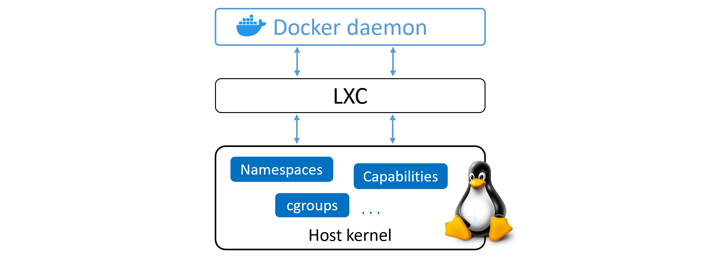
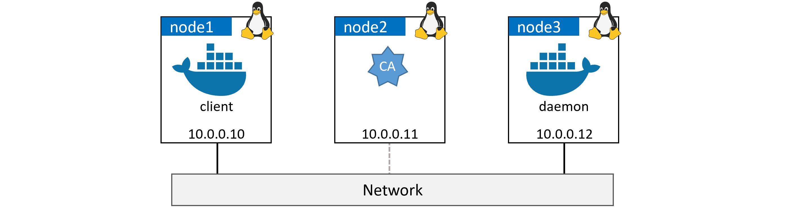

## 五、Docker引擎

在这一章中，我们将快速浏览一下 Docker 引擎的引擎盖。

您可以使用 Docker，而无需了解我们将在本章中介绍的任何内容。所以，请随意跳过它。然而，要成为真正的大师，你需要了解幕后发生了什么。所以，要成为一个真正的Docker师傅，你需要知道本章的内容。

这将是一个基于理论的章节，没有动手练习。

由于这一章是本书**技术部分**的一部分，我们将采用三层方法，将这一章分为三个部分:

*   **TLDR:排队喝咖啡时，你可以快速阅读两三段文字**
*   **深潜:**我们进入细节的真正长的部分
*   **命令:**快速回顾一下我们学习的命令

让我们去了解一下 Docker 引擎吧！

### 对接引擎 tldr

*Docker 引擎*是运行和管理容器的核心软件。我们通常简称它为*Docker*。如果您对 VMware 略知一二，那么将其视为 ESXi 可能会有所帮助。

Docker 引擎采用模块化设计，由许多小型专业工具构建而成。在可能的情况下，这些标准基于开放标准，如开放容器倡议(OCI)所维护的标准。

从很多方面来说，Docker Engine 就像一台汽车发动机——两者都是模块化的，并且是通过连接许多小的专门部件而创建的:

*   汽车发动机是由许多专门的零件组成的，这些零件一起工作来驱动汽车——进气歧管、节气门体、气缸、火花塞、排气歧管等。
*   Docker 引擎是由许多专门的工具组成的，这些工具协同工作来创建和运行容器——API、执行驱动程序、运行时、垫片等。

在撰写本文时，组成 Docker 引擎的主要组件有: *Docker 守护程序*、*容器*、 *runc* ，以及网络和存储等各种插件。这些一起创建和运行容器。

图 5.1 显示了一个高级视图。


Figure 5.1


在整本书中，我们会用小写的“r”和“c”来指代`runc`和`containerd`。这意味着以`runc`或`containerd`开头的句子不会以大写字母开头。这是故意的，不是错误。

### Docker引擎-深潜

当 Docker 首次发布时，Docker 引擎有两个主要组件:

*   Docker 守护进程(以下简称为“守护进程”)
*   LXC

Docker 守护程序是一个整体的二进制文件。它包含了 Docker 客户端、Docker API、容器运行时、映像构建的所有代码，还有更多。

LXC 为守护进程提供了对 Linux 内核中存在的容器的基本构造块的访问。像*命名空间*和*控制组(cggroups)*这样的东西。

图 5.2。展示了守护进程、LXC 和操作系统在 Docker 的旧版本中是如何交互的。



Figure 5.2 Original Docker architecture


#### 摆脱 LXC

对 LXC 的依赖从一开始就是一个问题。

首先，LXC 是特定于 Linux 的。对于一个渴望成为多平台的项目来说，这是一个问题。

其次，依赖外部工具完成如此核心的项目是一个巨大的风险，可能会阻碍发展。

因此，多克。公司开发了他们自己的名为 *libcontainer* 的工具来代替 LXC。 *libcontainer* 的目标是成为一个平台无关的工具，为 Docker 提供对主机内核中存在的基本容器构建块的访问。

Libcontainer 取代 LXC 成为 Docker 0.9 中默认的*执行驱动程序*。

#### 摆脱单一的 Docker 守护进程

随着时间的推移，Docker 守护进程的整体性变得越来越成问题:

1.  很难创新
2.  它变得更慢了
3.  这不是生态系统想要的

Docker，Inc .意识到了这些挑战，并开始了一项巨大的努力来分解单体守护进程并将其模块化。这项工作的目的是从守护进程中分离出尽可能多的功能，并在较小的专用工具中重新实现它。这些专用工具可以换出，也可以很容易地被第三方重用来构建其他工具。这个计划遵循了久经考验的 Unix 哲学，即构建可以拼凑成更大工具的小型专用工具。

分解和重新分解 Docker 引擎的工作已经将所有的*容器执行*和容器*运行时*代码从守护进程中完全移除，并重构为小的专用工具。

图 5.3 显示了当前 Docker 引擎架构的高级视图，并附有简要描述。


Figure 5.3


#### 开放式容器倡议的影响(OCI)

当 Docker，Inc .正在分解守护进程并重构代码时， [OCI](https://www.opencontainers.org/) 正在定义两个与容器相关的规范(也称为标准):

1.  [映像规格](https://github.com/opencontainers/image-spec)
2.  [容器运行时间规格](https://github.com/opencontainers/runtime-spec)

这两个规范都是在 2017 年 7 月作为 1.0 版本发布的，我们不应该看到太多的变化，因为稳定性是这里游戏的名字。最新的映像规范是 2017 年 11 月发布的 v1.0.1。最新的运行时规范是 2020 年 3 月发布的 v1.0.2。

Docker，Inc .大量参与创建这些规范，并贡献了大量代码。

截至 Docker 1.11(2016 年初)，Docker 引擎尽可能紧密地实现了 OCI 规范。例如，Docker 守护程序不再包含任何容器运行时代码—所有容器运行时代码都在一个独立的 OCI 兼容层中实现。默认情况下，Docker 对此使用 *runc* 。runc 是 OCI 容器运行时规范的*参考实现*。这是图 5.3 中的`runc`容器运行时层。

除此之外，Docker 引擎的*容器*组件确保 Docker 映像作为有效的 OCI 包呈现给 *runc* 。

#### runc

如前所述， *runc* 是 OCI 容器运行时规范的参考实现。Docker 公司大量参与了规范的定义和 runc 的开发。

如果你把其他东西都去掉，runc 是 libcontainer 的一个小的、轻量级的 CLI 包装器(记住 libcontainer 最初在早期的 Docker 架构中用主机操作系统代替了 LXC 作为接口层)。

runc 在生活中只有一个目的——创造容器。它非常擅长这个。而且要快！但是由于它是一个命令行界面包装器，它实际上是一个独立的容器运行时工具。这意味着您可以下载并构建二进制文件，您将拥有构建和使用 runc (OCI)容器所需的一切。但这是赤裸裸的，非常低级的，这意味着你将没有成熟的 Docker 引擎带来的丰富性。

我们有时称 runc 运行的层为“OCI 层”。见图 5.3。

您可以在以下网址查看 runc 版本信息:

*   https://github.com/opencontainers/runc/releases

#### 包含在内

作为将功能从 Docker 守护程序中剥离出来的努力的一部分，所有的容器执行逻辑都被剥离出来，并重构到一个名为 container der(发音为 container-dee)的新工具中。它一生的唯一目的是管理容器的生命周期运营。

containerd 可以作为 Linux 和 Windows 的守护程序，Docker 从 1.11 版本开始就在 Linux 上使用它。在 Docker 引擎栈中，containerd 位于守护进程和 OCI 层的 runc 之间。

如前所述，containerd 最初旨在小型、轻量级，并针对生命周期中的单一任务(容器生命周期操作)而设计。然而，随着时间的推移，它已经扩展并承担了更多的功能。像映像拉力、体积和网络。

增加更多功能的原因之一是为了在其他项目中更容易使用。例如，在像 Kubernetes 这样的项目中，containerd 做一些额外的事情是有益的，比如推拉映像。由于这些原因，containerd 现在不仅仅是简单的容器生命周期管理。然而，所有额外的功能都是模块化和可选的，这意味着您可以选择您想要的位。因此，在像 Kubernetes 这样的项目中包含 containerd 是可能的，但是只能包含项目需要的部分。

containerd 由 Docker 公司开发，并捐赠给云原生计算基金会(CNCF)。在撰写本文时，containerd 是一个完全毕业的 CNCF 项目，这意味着它是稳定的，并被认为已准备好投入生产。您可以在此处查看最新版本:

*   https://github.com/containerd/containerd/releases

#### 启动新容器(示例)

现在，我们已经看到了全局，也看到了一些历史，让我们走完创建新容器的过程。

启动容器的最常见方式是使用 Docker CLI。以下`docker container run`命令将基于`alpine:latest`映像启动一个简单的新容器。


```
$ docker container run --name ctr1 -it alpine:latest sh 
```


 `当您在 Docker CLI 中键入这样的命令时，Docker 客户端会将它们转换为适当的 API 负载，并将它们发布到 Docker 守护程序公开的 API 端点。

该应用编程接口在守护进程中实现，可以通过本地套接字或网络公开。在 Linux 上插座是`/var/run/docker.sock`，在 Windows 上是`\pipe\docker_engine`。

一旦守护程序收到创建新容器的命令，它就会调用 containerd。记住，守护进程不再包含任何代码来创建容器！

守护进程通过 CRUD 风格的应用编程接口通过 [gRPC](https://grpc.io/) 与容器进行通信。

不管它的名字是什么，容器实际上不能创建容器。它使用 *runc* 来做到这一点。它将所需的 Docker 映像转换成 OCI 包，并告诉 runc 使用它来创建一个新的容器。

runc 与 OS 内核接口，将创建容器(名称空间、cgroups 等)所需的所有构造集合在一起。).容器进程作为 runc 的子进程启动，一旦启动，runc 就会退出。

瞧啊。容器现在已启动。

该过程总结在图 5.4 中。


Figure 5.4


#### 这种模式的一个巨大好处是

从守护进程中移除启动和管理容器的所有逻辑和代码意味着整个容器运行时与 Docker 守护进程解耦。我们有时称之为“无 daemonless containers”，它使得在 Docker 守护程序上执行维护和升级而不影响正在运行的容器成为可能！

在旧模型中，所有容器运行时逻辑都在守护程序中实现，启动和停止守护程序会杀死主机上所有正在运行的容器。这在生产环境中是一个巨大的问题——尤其是当您考虑到 Docker 的新版本发布的频率时！每次守护程序升级都会杀死该主机上的所有容器，这可不好！

幸运的是，这不再是一个问题。

#### 这个垫片是怎么回事？

本章中的一些图表显示了一个垫片组件。

shim 是 daemonless 容器实现中不可或缺的一部分(我们刚才提到的将运行容器从守护进程中分离出来，例如守护进程升级)。

我们之前提到*容器*使用 runc 来创建新的容器。事实上，它为它创建的每个容器分叉一个 runc 的新实例。但是，一旦创建了每个容器，父 runc 进程就会退出。这意味着我们可以运行数百个容器，而不必运行数百个 runc 实例。

一旦容器的父 runc 进程退出，关联的 containerd-shim 进程就成为容器的父进程。shim 作为容器的父代执行的一些职责包括:

*   保持任何 STDIN 和 STDOUT 流打开，这样当守护进程重新启动时，容器不会因为管道关闭等原因而终止。
*   向守护进程报告容器的退出状态。

#### 如何在 Linux 上实现

在 Linux 系统上，我们讨论的组件被实现为单独的二进制文件，如下所示:

*   `dockerd`(Docker守护程序)
*   `docker-containerd`(容器)
*   `docker-containerd-shim`(垫片)
*   `docker-runc`

通过在 Docker 主机上运行`ps`命令，您可以在 Linux 系统上看到所有这些。显然，只有当系统有运行的容器时，它们中的一些才会出现。

#### 守护进程有什么意义

随着所有的执行和运行时代码从守护进程中剥离出来，您可能会问这样一个问题:“守护进程中还剩下什么？”。

显然，随着越来越多的功能被剥离和模块化，这个问题的答案会随着时间的推移而改变。然而，在编写本文时，守护进程中仍然存在的一些主要功能包括:映像管理、映像构建、REST API、认证、安全性、核心网络和编排。

#### 保护客户端和守护进程的通信

让我们看一下如何通过网络保护守护进程来结束这一章。

Docker 实现了一个客户机-服务器模型。

*   客户端组件实现命令行界面
*   服务器(守护程序)组件实现功能，包括面向公共的 REST 应用编程接口

客户端在 Windows 上称为`docker` ( `docker.exe`)，守护进程在 Windows 上称为`dockerd` ( `dockerd.exe`)。默认安装将它们放在同一台主机上，并将其配置为通过本地 IPC 套接字进行通信:

*   `/var/run/docker.sock`在 Linux 上
*   `//./pipe/docker_engine`在窗户上

也可以将它们配置为通过网络进行通信。默认情况下，网络通信通过端口`2375/tcp`上不安全的 HTTP 套接字进行。


Figure 5.5


像这样不安全的配置可能适合实验室，但对其他任何东西来说都是不可接受的。

TLS 来救援了！

Docker 允许您强制客户端和守护程序只接受用 TLS 保护的网络连接。建议在生产环境中使用这种方式，即使所有流量都通过受信任的内部网络。

您可以保护客户端和守护进程。保护客户端会强制客户端仅使用由受信任的证书颁发机构(CA)签名的证书连接到 Docker 守护程序。保护守护程序会强制守护程序只接受来自客户端的连接，这些客户端提供来自受信任证书颁发机构的证书。两种模式的结合提供了最大的安全性。

我们将使用一个简单的实验室环境来完成为**守护程序模式**和**客户端模式** TLS 配置 Docker 的过程。

##### 实验室设置

对于剩余的示例，我们将使用图 5.6 所示的实验室设置。您的实验室看起来会有所不同，但是客户端和守护程序能够通过名称相互解析是至关重要的。



Figure 5.6 Sample lab setup


高级别进程如下:

1.  **配置证书颁发机构和证书**
2.  创建证书颁发机构
3.  为守护进程创建密钥并签名
4.  为客户端创建密钥并签名
5.  分发密钥
6.  **配置 Docker 使用 TLS**
7.  配置守护模式
8.  配置客户端模式

##### 创建证书颁发机构(自签名证书)

如果您正在实验室中学习，并且还没有证书颁发机构，则只需完成这一步。此外，我们在这里构建的 CA 是为了帮助演示如何配置 Docker，我们不是试图构建生产级的东西。

从实验室的`CA`节点运行以下命令。

1.  Create a new private key for the CA.

    您将设置一个密码作为操作的一部分。别忘了！

    

    ```
     $ openssl genrsa -aes256 -out ca-key.pem 4096

     Generating RSA private key, 4096 bit long modulus
     ...............................................++
     ..++
     e is 65537 (0x10001)
     Enter pass phrase for ca-key.pem:
     Verifying - Enter pass phrase for ca-key.pem: 
    ```

    

     `您将在当前目录中有一个名为`ca-key.pem`的新文件。这是 CA 的私钥。` 
`*   Use the CA’s private key to generate a public key (certificate).

    您需要输入上一步中的密码。希望你没有忘记；-)

    

    ```
     $ openssl req -new -x509 -days 730 -key ca-key.pem -sha256 -out ca.pem 
    ```

    

     `这为您的工作目录添加了第二个文件`ca.pem`。这是 CA 的公钥，也称为“证书”。`` 

 ``现在，您的当前目录中有两个文件:`ca-key.pem`和`ca.pem`。这些是认证中心的密钥对，构成了认证中心的*身份*。此时，CA 就可以使用了。

##### 为守护进程创建密钥对

在这一步中，我们将为`node3`上的 Docker 守护程序生成一个新的密钥对。这是一个四步走的过程:

1.  创建私钥
2.  创建签名请求
3.  添加 IP 地址并使其对*服务器授权*有效
4.  生成证书

开始吧。

从证书颁发机构(节点 2)运行这些命令。

1.  Create the private key for the daemon.

    

    ```
     $ openssl genrsa -out daemon-key.pem 4096
     <Snip> 
    ```

    

     `这在您的工作目录中创建了一个名为`daemon-key.pem`的新文件。这是守护程序节点的私钥。` 
`*   Create a certificate signing request (CSR) for the CA to create and sign a certificate for the daemon. Be sure to use the correct DNS name for your daemon node. The example uses `node3`.

    

    ```
     $ openssl req -subj "/CN=node3" \
       -sha256 -new -key daemon-key.pem -out daemon.csr 
    ```

    

     `现在，您的工作目录中有了第四个文件。这个是企业社会责任，叫做`daemon.csr`。` `*   Add required attributes to the certificate.

    这一步创建了一个文件，告诉证书颁发机构在对守护进程的证书进行签名时向证书添加几个扩展属性。这些将添加守护进程的域名和 IP 地址，并将证书配置为对*服务器认证*有效。

    用以下值创建一个名为`extfile.cnf`的新文件。该示例使用了实验中守护程序节点的域名和 IP，如图 5.6 所示。您环境中的价值观可能不同。

    

    ```
     subjectAltName = DNS:node3,IP:10.0.0.12
     extendedKeyUsage = serverAuth 
    ```

    

    `*   Generate the certificate.

    该步骤使用 CSR 文件、CA 密钥和`extfile.cnf`文件来签名和配置守护进程的证书。它将输出守护进程的公钥(证书)作为名为`daemon-cert.pem`的新文件

    

    ```
     $ openssl x509 -req -days 730 -sha256 \
       -in daemon.csr -CA ca.pem -CAkey ca-key.pem \
       -CAcreateserial -out daemon-cert.pem -extfile extfile.cnf 
    ```

    ``` 

 ```此时，您有了一个工作的证书颁发机构，以及一个用于`node3`的密钥对，该密钥对可用于保护 Docker 守护程序。

继续之前，删除企业社会责任和`extfile.cnf`。


```
$ rm daemon.csr extfile.cnf 
```


 `##### 为客户端创建密钥对

接下来的步骤将重复我们刚刚为`node3`所做的，但这次我们将为运行 Docker 客户端的`node1`做。

运行来自 CA ( `node2`)的所有命令。

1.  Create a private key for `node1`.

    这将在您的工作目录中生成一个名为`client-key.pem`的新文件。

    

    ```
     $ openssl genrsa -out client-key.pem 4096 
    ```

    

`*   Create a CSR. Be sure to use the correct DNS name of the node that will be your secure Docker client. The example uses `node1`.

    

    ```
     $ openssl req -subj '/CN=node1' -new -key client-key.pem -out client.csr 
    ```

    

     `这将在您当前的目录中创建一个名为`client.csr`的新文件。` `*   创建一个名为`extfile.cnf`的文件，并用以下值填充它。这将使证书对客户端认证有效。

    

    ```
     extendedKeyUsage = clientAuth 
    ```

    

    `*   使用企业社会责任、证书颁发机构的公钥和私钥以及`extfile.cnf`文件为`node1`创建证书。这将在您当前名为`client-cert.pem`的目录中创建客户端的签名公钥作为新文件。

    

    ```
     $ openssl x509 -req -days 730 -sha256 \
       -in client.csr -CA ca.pem -CAkey ca-key.pem \
       -CAcreateserial -out client-cert.pem -extfile extfile.cnf 
    ```

    ``` 

 ```删除企业社会责任和`extfile.cnf`文件，因为这些不再需要。


```
$ rm client.csr extfile.cnf 
```


 `此时，您的工作目录中应该有以下 7 个文件:


```
ca-key.pem          << CA private key
ca.pem              << CA public key (cert)
ca.srl              << Tracks serial numbers
client-cert.pem     << client public key (Cert)
client-key.pem      << client private key
daemon-cert.pem     << daemon public key (cert)
daemon-key.pem      << daemon private key 
```


 `在继续之前，您应该从私钥中删除写权限，并使它们仅对您和您组中的其他帐户可读。


```
$ chmod 0400 ca-key.pem client-key.pem daemon-key.pem 
```


 `您还应该删除对公钥证书的写访问权限。


```
$ chmod -v 0444 ca.pem client-cert.pem daemon-cert.pem 
```


 `##### 分发密钥

现在您已经获得了所有必需的密钥和证书，您需要将它们分发到客户端和守护程序节点，如下所示:

*   从 CA 到`node3`(守护进程节点)的`ca.pem`、`daemon-cert.pem`和`daemon-key.pem`。
*   从 CA 到`node1`(客户端节点)的`ca.pem`、`client-cert.pem`和`client-key.pem`。

有多种方法可以在节点之间复制文件，这些方法可能因系统而异。需要知道的重要一点是，Docker 要求复制的文件具有以下名称和位置:

*   daemon-cert . PEM–> ~/。Docker/证书. pem
*   daemon key . PEM–> ~/。Docker/密钥. pem
*   client-cert . PEM –> ~/。docker/cert.pem
*   client-key . PEM –> ~/。docker/key.pem

您可能需要在守护进程和客户端节点上创建`~/.docker`隐藏目录。您可能还必须更改`.docker`目录上的权限，才能启用副本— `chmod 777 .docker`可以工作，但不安全。

如果您一直在关注，实验室现在看起来如图 5.7 所示


Figure 5.7 Updated lab with keys


客户端和守护程序节点上证书颁发机构公钥(`ca.pem`)的存在告诉它们信任由证书颁发机构签署的证书。

有了证书，是时候配置 Docker 了，这样客户端和守护程序就可以使用 TLS 了。

##### 为顶级域名系统配置 Docker

如前所述，Docker 有两种 TLS 模式:

*   守护模式
*   客户端模式

守护程序模式强制守护程序只允许来自具有有效证书的客户端的连接。客户端模式告诉客户端只与拥有有效证书的守护程序连接。

我们将在`node1`上为*守护模式*配置守护进程，并对其进行测试。之后，我们将在`node2`上为*客户端模式*配置客户端进程，并进行测试。

##### 为顶级域名系统配置 Docker 守护程序

保护守护进程就像在`daemon.json`配置文件中设置几个守护进程标志一样简单:

*   `tlsverify`启用张力腿平台验证
*   `tlscacert`告诉守护进程信任哪个 CA
*   `tlscert`告诉 Docker 守护进程的证书位于何处
*   `tlskey`告诉 Docker 守护进程的私钥在哪里
*   `hosts`告诉 Docker 要在哪些套接字上绑定守护程序

我们将在独立于平台的`daemon.json`配置文件中配置这些。这可以在 Linux 上的`/etc/docker/`和 Windows 上的`C:\ProgramData\Docker\config\`中找到。

在将运行安全 Docker 守护程序的节点上执行以下所有操作(示例实验中的`node3`)。

编辑`daemon.json`文件并添加以下行。假设一个叫`ubuntu`的用户，你的可能不一样。


```
{
    "hosts": ["tcp://node3:2376"],
    "tls": true,
    "tlsverify": true,
    "tlscacert": "/home/ubuntu/.docker/ca.pem",
    "tlscert": "/home/ubuntu/.docker/cert.pem",
    "tlskey": "/home/ubuntu/.docker/key.pem"
} 
```


 `**警告！**运行`systemd`的 Linux 系统不允许使用`daemon.json`中的“主机”选项。相反，您必须在 systemd 覆盖文件中指定它。你可以通过`sudo systemctl edit docker`命令做到这一点。这将在编辑器中打开一个名为`/etc/systemd/system/docker.service.d/override.conf`的新文件。添加以下三行并保存文件。


```
[Service]
ExecStart=
ExecStart=/usr/bin/dockerd -H tcp://node3:2376 
```


 `现在已经设置了 TLS 和主机选项，您需要重新启动 Docker。

一旦 Docker 重新启动，您可以通过检查`ps`命令的输出来检查新的`hosts`值是否有效。


```
$ ps -elf | grep dockerd
4 S root  ... /usr/bin/dockerd -H tcp://node3:2376 
```


 `命令输出中出现“`-H tcp://node3:2376`”是守护进程正在网络上侦听的证据。端口`2376`是 Docker 使用 TLS 的标准端口。`2375`是默认的非安全端口。

此时，从`node1`运行`docker version`等命令不起作用。这是因为**守护程序**被配置为在网络上监听，但是 **Docker 客户端**仍在尝试使用本地 IPC 套接字。再次尝试该命令，但这次添加了`-H tcp://node3:2376`标志。


```
$ docker -H tcp://node3:2376 version
Client:
 Version:       19.03.8
 API version:   1.40
 <Snip>
Get http://daemon:2376/v1.35/version: net/http: HTTP/1.x transport connection broken: 
malformed HTTP response "\x15\x03\x01\x00\x02\x02".
* Are you trying to connect to a TLS-enabled daemon without TLS? 
```


 `命令看起来更好，但仍然不起作用。这是因为守护进程拒绝来自未经认证的客户端的所有连接。

恭喜你。Docker 守护程序被配置为侦听网络，并拒绝来自未经认证的客户端的连接。

让我们将`node1`上的 Docker 客户端配置为使用 TLS。

##### 为顶级域名系统配置 Docker 客户端

在本节中，您将在`node1`上为两件事配置 Docker 客户端:

*   通过网络连接到远程守护程序
*   签署所有`docker`命令

从将运行安全 Docker 客户端的节点运行以下所有操作(示例实验中的`node1`)。

导出以下环境变量，以配置客户端通过网络连接到远程守护程序。客户端必须能够通过名称连接到守护进程才能工作。


```
export DOCKER_HOST=tcp://node3:2376 
```


 `尝试以下命令。


```
$ docker version
Client:
 Version:       19.03.8
<Snip>
Get http://daemon:2376/v1.35/version: net/http: HTTP/1.x transport connection broken: 
malformed HTTP response "\x15\x03\x01\x00\x02\x02".
* Are you trying to connect to a TLS-enabled daemon without TLS? 
```


 `Docker 客户端现在通过网络向远程守护程序发送命令，而无需您明确指定`-H tcp://node3:2376`标志。但是，您仍然需要配置客户端来签署命令。

再导出一个环境变量，告诉 Docker 客户端使用其证书对所有命令进行签名。


```
export DOCKER_TLS_VERIFY=1 
```


 `再次运行`docker version`命令。


```
$ docker version
Client:
 Version:       19.03.8
<Snip>
Server:
 Engine:
  Version:      19.03.8
  API version:  1.40 (minimum version 1.12)
  Go version:   go1.12.17
  Git commit:   afacb8b
  Built:        Wed Mar 11 01:29:16 2020
  OS/Arch:      linux/amd64
  Experimental: true 
```


 `恭喜你。客户端正在通过安全网络连接与远程守护程序成功对话。实验室的最终配置如图 5.8 所示


Figure 5.8


在我们快速回顾之前，还有最后几点。

1.  最后一个示例之所以有效，是因为您将客户端的 TLS 密钥复制到了 Docker 期望它们所在的文件夹中。这是用户主目录中的一个隐藏文件夹，名为`.docker`。您还为键提供了 Docker 期望的默认文件名(`ca.pem`、`cert.pem`和`key.pem`)。您可以通过导出`DOCKER_CERT_PATH`来指定不同的文件夹。
2.  您可能想让环境变量(`DOCKER_HOST`和`DOCKER_TLS_VERIFY`)成为您环境中更持久的固定装置。

### 章节总结

Docker 引擎采用模块化设计，并在很大程度上基于 OCI 的开放标准。

*Docker 守护程序*实现了 Docker API，这是一个丰富的、版本化的 HTTP API，它是与 Docker 项目的其他部分一起开发的。

容器执行由*容器*处理。《容器》是由 Docker，Inc .撰写的，并为《CNCF》供稿。您可以将其视为处理容器生命周期操作的容器主管。它小巧轻便，可以被其他项目和第三方工具使用。例如，它正在成为 Kubernetes 中最常见的容器运行时。

containerd 需要与 OCI 兼容的容器运行时对话，才能真正创建容器。默认情况下，Docker 使用 *runc* 作为其默认容器运行时。runc 实际上是 OCI 运行时规范的实现，并期望从符合 OCI 规范的包中启动容器。containerd 与 runc 对话，并确保 Docker 映像作为符合 OCI 标准的包呈现给 runc。

runc 可以作为一个独立的 CLI 工具来创建容器。它基于 libcontainer 的代码，也可以被其他项目和第三方工具使用。

Docker 守护程序中仍然实现了许多功能。随着时间的推移，更多的这种情况可能会爆发。目前仍在 Docker 守护进程中的功能包括但不限于:Docker API、映像管理、认证、安全功能和核心网络。``````````````````````