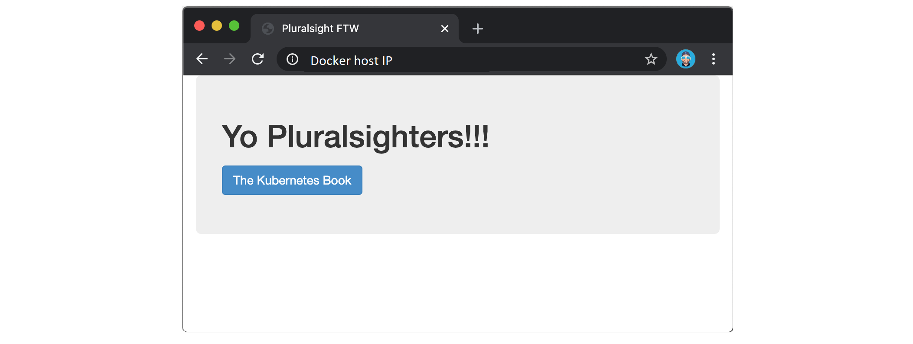

## 7:容器

现在我们对图像有所了解，是时候进入容器了。由于这是一本关于 Docker 的书，我们将具体讨论 Docker 容器。然而，Docker 实现了 https://www.opencontainers.org 开放容器倡议(OCI)发布的图像和容器规范。这意味着您在这里学到的很多内容将适用于其他符合 OCI 标准的容器运行时。此外，如果你需要学习和使用 Kubernetes，你将学到的东西会对你有所帮助。

我们将把这一章分成通常的三个部分:

*   TLDR
*   深潜
*   命令

### 对接容器 tldr

容器是图像的运行时实例。就像您可以从虚拟机模板启动虚拟机一样，您可以从单个映像启动一个或多个容器。虚拟机和容器之间的最大区别是容器更快、更轻——容器与运行它们的主机共享操作系统/内核，而不是像虚拟机一样运行成熟的操作系统。容器基于极简图像也很常见，极简图像只包含应用程序所需的软件和依赖项。

图 7.1 显示了一个用于启动多个 Docker 容器的 Docker 映像。


Figure 7.1


启动容器最简单的方法是使用`docker container run`命令。这个命令可以有很多参数，但是最基本的形式是告诉它要使用的图像和要运行的应用程序:`docker container run <image> <app>`。以下命令将启动一个 Ubuntu Linux 容器，运行作为其应用程序的 Bash shell。

`$ docker container run -it ubuntu /bin/bash`

您可以使用以下命令启动运行 PowerShell 应用程序的窗口容器。

`> docker container run -it mcr.microsoft.com/powershell:nanoserver pwsh.exe`

在每个例子中，`-it`标志将把你当前的终端窗口连接到容器的外壳。

容器一直运行，直到它们正在执行的应用程序退出。在前面的例子中，当 Bash shell 退出时，Linux 容器将退出，当 PowerShell 进程终止时，Windows 容器将退出。

演示这一点的简单方法是启动一个新的容器，并告诉它运行 sleep 命令 10 秒钟。集装箱将启动，抓住你的终端 10 秒钟，然后退出。下面是在 Linux Docker 主机上演示这一点的简单方法。


```
$ docker container run -it alpine:latest sleep 10 
```


 `您可以使用以下命令对 Windows 容器执行同样的操作。


```
> docker container run microsoft/powershell:nanoserver pwsh -c "Start-Sleep -s 10" 
```


 `您可以使用`docker container stop`命令手动停止正在运行的容器。然后可以用`docker container start`重启。要永久删除一个容器，你必须用`docker container rm`明确删除它。

这就是电梯推销！现在让我们进入细节…

### 码头集装箱-深潜

我们将在这里讨论的第一件事是容器和虚拟机之间的基本区别。在这一点上主要是理论，但这是重要的东西。

> **平视:**作为作者，在我们进一步讨论之前，我要先说这些。我们很多人都对我们所做的事情和我们拥有的技能充满热情。你还记得*大 Unix* 们抵制 Linux 的崛起。您可能还记得早期抵制 VMware 的人。在这两种情况下**的抵抗都是徒劳的**。在本节中，我将重点介绍我认为容器模型相对于虚拟机模型的一些优势。但我猜你们中的许多人将会是虚拟机专家，在虚拟机生态系统中投入了大量资金。我也在猜测，你们中的一两个人可能会因为我说的一些话而和我争吵。所以让我说清楚…我是个大家伙，我会在肉搏战中击败你:-D 开玩笑。然而，我并不是想摧毁你的帝国或说你的宝宝丑。容器和虚拟机将在未来许多年内并行运行。

开始了。

#### 容器与虚拟机

容器和虚拟机都需要一个主机来运行。这可以是任何东西，从您的笔记本电脑、数据中心的裸机服务器，一直到公共云中的实例。事实上，许多云服务现在提供了在短暂的无服务器后端上运行容器的能力。如果这听起来像是技术胡言乱语，不要担心，这只是意味着后端高度虚拟化，主机或节点的概念不再有任何意义——您的容器只是运行，您不需要关心*如何*或*在哪里*。

总之，让我们假设一个需求，即您的企业有一台物理服务器，需要运行 4 个业务应用程序。

在虚拟机模型中，物理服务器通电，虚拟机管理程序启动(我们跳过了基本输入输出系统和引导加载程序代码等)。).一旦启动，虚拟机管理程序就可以控制系统上的所有物理资源，如中央处理器、内存、存储和网卡。然后，它将这些硬件资源雕刻成虚拟版本，看起来、闻起来、感觉起来都和真实的一样。然后，它将它们打包成一个称为虚拟机的软件结构。我们获取这些虚拟机，并在每个虚拟机上安装操作系统和应用程序。

假设单个物理服务器需要运行 4 个业务应用程序，我们将创建 4 个虚拟机，安装 4 个操作系统，然后安装 4 个应用程序。当它全部完成时，它看起来有点像图 7.2。


Figure 7.2


容器模型中的情况有点不同。

服务器已通电，操作系统启动。在 Docker 世界中，这可以是 Linux，或者支持其内核中的容器原语的现代版本的 Windows。与虚拟机模型类似，操作系统要求所有硬件资源。在操作系统之上，我们安装了一个容器引擎，比如 Docker。容器引擎然后获取**操作系统资源**，如*进程树*、*文件系统*和*网络堆栈*，并将它们切割成称为*容器*的独立结构。每个容器看起来、闻起来和感觉起来都像一个真正的操作系统。在每个*容器*中，我们运行一个应用程序。

如果我们假设单个物理服务器需要运行 4 个业务应用程序，我们会将操作系统分成 4 个容器，并在每个容器中运行一个应用程序。这如图 7.3 所示。


Figure 7.3


在高级别上，虚拟机管理程序执行**硬件虚拟化** —它们将物理硬件资源分割成称为虚拟机的虚拟版本。另一方面，容器执行**操作系统虚拟化** —它们将操作系统资源分割成称为容器的虚拟版本。

#### 虚拟机税

让我们在刚才介绍的基础上，深入探讨虚拟机管理程序模型的一个问题。

我们从一台物理服务器开始，要求运行 4 个业务应用程序。在这两种型号中，我们都安装了操作系统或虚拟机管理程序(一种专门针对虚拟机进行高度调整的操作系统)。到目前为止，模型几乎完全相同。但这就是相似之处。

虚拟机模型将**低级硬件资源**雕刻成虚拟机。每个虚拟机都是包含虚拟处理器、虚拟内存、虚拟磁盘等的软件结构。因此，每个虚拟机都需要自己的操作系统来声明、初始化和管理所有这些虚拟资源。可悲的是，每个操作系统都有自己的包袱和开销。例如，每个操作系统消耗一片中央处理器、一片内存、一片存储等。有些需要自己的许可证，以及人员和基础设施来修补和升级它们。每个操作系统也呈现出相当大的攻击面。我们经常把这一切称为 ***OS 税*** ，或者 ***VM 税***——你安装的每一个 OS 都会消耗资源！

容器模型有一个运行在主机上的操作系统/内核。可以在一台主机上运行几十个或几百个容器，每个容器共享同一个操作系统/内核。这意味着单个操作系统会消耗 CPU、内存和存储。需要许可的单一操作系统。需要更新和修补的单一操作系统。以及呈现攻击面的单个操作系统内核。总之，一个单一的操作系统税单！

在我们的单个服务器运行 4 个业务应用程序的例子中，这似乎并不多。但是当你开始谈论成百上千的应用程序时，它就变成了一个游戏规则的改变者。

另一个需要考虑的问题是应用程序的启动时间。由于容器不是成熟的操作系统，它启动的速度比虚拟机快得多。请记住，容器中没有需要定位、解压缩和初始化的内核，更不用说与普通内核引导相关的所有硬件枚举和初始化了。启动容器时，这些都不需要。运行在主机上的单个共享内核已经启动。最终结果是，容器可以在不到一秒钟的时间内启动。唯一影响容器启动时间的是启动它正在运行的应用程序所需的时间。

所有这些都意味着容器模型比虚拟机模型更精简、更高效。您可以将更多的应用程序打包到更少的资源上，更快地启动它们，并支付更少的许可和管理成本，同时减少对黑暗面的攻击。有什么不喜欢的！？

容器模型不太好的一点是安全性。与虚拟机相比，开箱即用的容器安全性较低，提供的工作负载隔离也较少。存在保护容器并将其锁定的技术，但是在撰写本文时，其中一些技术非常复杂。

抛开理论不谈，我们来玩一些容器。

#### 运行容器

按照这些例子，你需要一个工作的 Docker 主机。如果你还没有，我建议在你的 Mac 或 PC 上安装 Docker Desktop(只需谷歌“Docker Desktop”并遵循简单的下一步，下一步，下一步安装)。

我们将展示 Linux 和 Windows 容器的例子。但是，如果您在 Windows 10 上运行 Docker Desktop，您可以通过在`Linux containers`模式下运行 Docker Desktop 来跟随 Linux 示例。

#### 检查 Docker 是否正在运行

当我登录到 Docker 主机时，我总是做的第一件事是检查 Docker 是否正在运行。


```
$ docker version
Client: Docker Engine - Community
 Version:           19.03.8
 API version:       1.40
 OS/Arch:           darwin/amd64
 Experimental:      true

Server: Docker Engine - Community
 Engine:
  Version:          19.03.8
  API version:      1.40 (minimum version 1.12)
  OS/Arch:          linux/amd64
  Experimental:     true
  <Snip> 
```


 `只要你在`Client`和`Server`中得到回复，你就应该可以走了。如果您在`Server`部分得到一个错误代码，很有可能 Docker 守护程序(服务器)没有运行，或者您的用户帐户没有访问它的权限。

如果您在 Linux 机器上，并且您的用户帐户没有访问守护程序的权限，您需要确保它是本地`docker` Unix 组的成员。如果不是，你可以用`usermod -aG docker <user>`添加它，然后你必须注销并重新登录到你的 shell 中，更改才会生效。

如果您的用户帐户已经是本地`docker`组的成员，问题可能是 Docker 守护程序没有运行。要检查 Docker 守护程序的状态，请根据 Docker 主机的操作系统运行以下命令之一。

不使用 Systemd 的 Linux 系统。


```
$ service docker status
docker start/running, process 29393 
```


 `使用 Systemd 的 Linux 系统。


```
$ systemctl is-active docker
active 
```


 `Windows 系统(从 PowerShell 终端运行)。


```
> Get-Service docker

Status    Name      DisplayName
------    ----      -----------
Running   Docker    Docker Engine 
```


 `如果 Docker 守护程序正在运行，您可以继续。

#### 启动简单的容器

如果你正在使用 Docker Desktop，你可以跟随 Linux 或 Windows 的例子。只需确保 Docker Desktop 设置为正确的模式。

启动容器最简单的方法是使用`docker container run`命令。

以下命令启动一个简单的容器，该容器将运行 Ubuntu Linux 的容器化版本。


```
$ docker container run -it ubuntu:latest /bin/bash
Unable to find image 'ubuntu:latest' locally
latest: Pulling from library/ubuntu
d51af753c3d3: Pull complete 
fc878cd0a91c: Pull complete 
6154df8ff988: Pull complete 
fee5db0ff82f: Pull complete 
Digest: sha256:747d2dbbaaee995098c9792d99bd333c6783ce56150d1b11e333bbceed5c54d7
Status: Downloaded newer image for ubuntu:latest
root@50949b614477:/# 
```


 `下面是一个启动运行 PowerShell (pwsh.exe)的容器的 Windows 示例。


```
> docker container run -it mcr.microsoft.com/powershell:nanoserver pwsh.exe
docker container run -it mcr.microsoft.com/powershell:nanoserver pwsh.exe
Unable to find image 'mcr.microsoft.com/powershell:nanoserver' locally
nanoserver: Pulling from powershell
0fe89239909b: Pull complete 
2c9371eb1f40: Pull complete
<Snip>       
806da439b031: Pull complete 
Digest: sha256:cefdb984d9...ad3ab2079a
Status: Downloaded newer image for mcr.microsoft.com/powershell:nanoserver

PowerShell 7.0.0
Copyright (c) Microsoft Corporation. All rights reserved.
PS C:\> 
```


 `让我们仔细看看这个命令。

`docker container run`告诉 Docker 运行一个新的容器。`-it`标志使容器具有交互性，并将其附加到您的终端。`ubuntu:latest`或`mcr.microsoft.com/powershell:nanoserver`告诉 Docker 从哪个图像开始集装箱。最后，`/bin/bash`和`pwsh.exe`分别是每个容器将运行的应用程序。

当您点击`Return`时，Docker 客户端打包命令，并将其发布到在 Docker 守护程序上运行的 API 服务器。Docker 守护程序接受了该命令，并搜索 Docker 主机的本地映像存储库，查看它是否已经有了所请求映像的副本。在引用的例子中，它没有，所以它去 Docker Hub 看看它是否能在那里找到它。它找到了它，在本地提取它，并将其存储在本地缓存中。

> **注:**在标准的、现成的 Linux 安装中，Docker 守护程序在`/var/run/docker.sock`的本地 IPC/Unix 套接字上实现 Docker 远程 API。在 Windows 上，它监听位于`npipe:////./pipe/docker_engine`的命名管道。可以将 Docker 守护程序配置为在网络上侦听。Docker 的默认非 TLS 网络端口为 2375，默认 TLS 端口为 2376。

一旦映像被提取，守护进程就指示`containerd`和`runc`创建并启动容器。

如果您跟着走，您的终端现在已经连接到容器上了——仔细看，您会看到您的 shell 提示符已经更改。在引用的 Linux 示例中，shell 提示符已更改为`root@50949b614477:/#`。`@`后的长数字是容器唯一标识的前 12 个字符。在视窗系统的例子中，它变成了`PS C:\>`。

尝试在容器内部执行一些基本命令。你可能会注意到其中一些不起作用。这是因为图像被优化为轻量级的。因此，他们没有安装所有正常的命令和软件包。下面的示例显示了两个命令——一个成功，另一个失败。


```
root@50949b614477:/# ls -l
total 64
lrwxrwxrwx   1 root root    7 Apr 23 11:06 bin -> usr/bin
drwxr-xr-x   2 root root 4096 Apr 15 11:09 boot
drwxr-xr-x   5 root root  360 Apr 27 17:24 dev
drwxr-xr-x   1 root root 4096 Apr 27 17:24 etc
drwxr-xr-x   2 root root 4096 Apr 15 11:09 home
lrwxrwxrwx   1 root root    7 Apr 23 11:06 lib -> usr/lib
<Snip>

root@50949b614477:/# ping nigelpoulton.com
bash: ping: command not found 
```


 `如您所见，`ping`实用程序没有作为官方 Ubuntu 图像的一部分。

#### 容器过程

当我们在上一节中启动 Ubuntu 容器时，我们告诉它运行 Bash shell ( `/bin/bash`)。这使得 Bash shell 成为在容器内部运行的**唯一的进程。从容器内部运行`ps -elf`可以看到这一点。**


```
root@50949b614477:/# ps -elf
F S UID   PID  PPID   NI ADDR SZ WCHAN  STIME TTY     TIME      CMD
4 S root    1     0    0 -  4558 wait   00:47 ?     00:00:00  /bin/bash
0 R root   11     1    0 -  8604 -      00:52 ?     00:00:00  ps -elf 
```


 `列表中的第一个进程，PID 为 1，是我们告诉容器运行的 Bash shell。第二个过程是我们运行的`ps -elf`命令产生列表。这是一个短暂的过程，一显示输出就退出。长话短说，这个容器运行的是一个进程— `/bin/bash`。

> **注意:** Windows 容器略有不同，往往运行相当多的后台进程。

如果您登录到容器并键入`exit`，您将终止 Bash 进程，容器将退出(终止)。这是因为没有指定的主进程，容器就不能存在。Linux 和 Windows 容器也是如此——**杀死容器中的主进程就会杀死容器**。

按`Ctrl-PQ`退出容器，不终止其主要过程。这样做将把您放回 Docker 主机的外壳中，让容器在后台运行。您可以使用`docker container ls`命令查看系统上运行的容器列表。


```
$ docker container ls
CNTNR ID  IMAGE          COMMAND    CREATED  STATUS    NAMES
509...74  ubuntu:latest  /bin/bash  6 mins   Up 6mins  sick_montalcini 
```


 `重要的是要了解这个容器仍然在运行，您可以使用`docker container exec`命令将您的终端重新连接到它。


```
$ docker container exec -it 50949b614477 bash
root@50949b614477:/# 
```


 `重新连接到 Windows Nano Server PowerShell 容器的命令将是`docker container exec -it <container-name-or-ID> pwsh.exe`。

如您所见，shell 提示符已变回容器。如果您再次运行`ps -elf`命令，您现在将看到两个**T4 Bash 或 PowerShell 进程。这是因为`docker container exec`命令创建了一个新的 Bash 或 PowerShell 进程，并附加到该进程上。这意味着在这个 shell 中键入`exit`不会终止容器，因为原始的 Bash 或 PowerShell 进程将继续运行。**

键入`exit`离开容器，并使用`docker container ls`验证它是否仍在运行。它仍将运行。

如果您跟随示例，您应该使用以下两个命令停止并删除容器(您需要替换容器的标识)。


```
$ docker container stop 50949b614477
50949b614477

$ docker container rm 50949b614477
50949b614477 
```


 `前面示例中启动的容器将不再出现在您的系统中。

#### 容器生命周期

在本节中，我们将研究容器的生命周期——从出生、工作和休假到最终死亡。

我们已经看到了如何用`docker container run`命令启动容器。让我们开始另一个，这样我们就可以走完它的整个生命周期。以下示例将来自运行 Ubuntu 容器的 Linux Docker 主机。然而，所有的例子都将与前面例子中的 Windows PowerShell 容器一起工作——显然，您将不得不用它们的等效 Windows 命令来替换 Linux 命令。

如前所述，如果您在 Windows 10 Pro 笔记本电脑上运行 Docker Desktop，您可以在 Linux 容器模式下运行，并遵循所有 Linux 示例。


```
$ docker container run --name percy -it ubuntu:latest /bin/bash
root@9cb2d2fd1d65:/# 
```


 `这就是创建的容器，我们将其命名为“percy”表示持久化。

现在让我们通过向它写入一些数据来实现它。

以下过程将一些文本写入`/tmp`目录中的新文件，并验证操作是否成功。请确保在刚刚启动的容器中运行这些命令。


```
root@9cb2d2fd1d65:/# cd tmp

root@9cb2d2fd1d65:/tmp# ls -l
total 0

root@9cb2d2fd1d65:/tmp# echo "Sunderland is the greatest football team in the world" > newfile

root@9cb2d2fd1d65:/tmp# ls -l
total 4
-rw-r--r-- 1 root root 14 Apr 27 11:22 newfile

root@9cb2d2fd1d65:/tmp# cat newfile
Sunderland is the greatest football team in the world 
```


 `按`Ctrl-PQ`退出容器，不杀死容器。

现在使用`docker container stop`命令停止集装箱并放入*假期*。


```
$ docker container stop percy
percy 
```


 `您可以在`docker container stop`命令中使用容器的名称或标识。格式为`docker container stop <container-id or container-name>`。

现在运行`docker container ls`命令，列出所有正在运行的容器。


```
$ docker container ls
CONTAINER ID   IMAGE   COMMAND   CREATED  STATUS  PORTS   NAMES 
```


 `该容器没有在上面的输出中列出，因为它处于停止状态。再次运行同一个命令，只是这次增加`-a`标志显示所有容器，包括停止的容器。


```
$ docker container ls -a
CNTNR ID  IMAGE          COMMAND    CREATED  STATUS      NAMES
9cb...65  ubuntu:latest  /bin/bash  4 mins   Exited (0)  percy 
```


 `现在我们可以看到容器显示为`Exited (0)`。停止容器就像停止虚拟机一样。尽管它目前没有运行，但它的整个配置和内容仍然存在于 Docker 主机的本地文件系统中。这意味着它可以随时重启。

让我们使用`docker container start`命令将其从假期中带回来。


```
$ docker container start percy
percy

$ docker container ls
CONTAINER ID  IMAGE          COMMAND      CREATED  STATUS     NAMES
9cb2d2fd1d65  ubuntu:latest  "/bin/bash"  4 mins   Up 3 secs  percy 
```


 `停止的容器现在重新启动。是时候验证我们之前创建的文件是否仍然存在了。使用`docker container exec`命令连接到重启的容器。


```
$ docker container exec -it percy bash
root@9cb2d2fd1d65:/# 
```


 `您的 shell 提示符将会改变，以显示您现在正在容器的命名空间内操作。

验证您之前创建的文件是否仍然存在，并且包含您写入的数据。


```
root@9cb2d2fd1d65:/# cd tmp
root@9cb2d2fd1d65:/# ls -l
-rw-r--r-- 1 root root 14 Sep 13 04:22 newfile

root@9cb2d2fd1d65:/# cat newfile
Sunderland is the greatest football team in the world 
```


 `就像变魔术一样，你创建的文件仍然在那里，它包含的数据正是你离开它的方式。这证明了停止容器并不会破坏容器或容器内的数据。

虽然这个例子说明了容器的持久性，但重要的是您要理解两件事:

1.  本例中创建的数据存储在 Docker 主机的本地文件系统中。如果 Docker 主机出现故障，数据将会丢失。
2.  容器被设计成不可变的对象，向它们写入数据不是一个好的做法。

由于这些原因，Docker 提供了与容器分开存在的*卷*，但是可以在运行时装入容器。

在您旅程的这个阶段，这是一个容器生命周期的有效例子，您很难区分容器和虚拟机的生命周期。

现在让我们杀死容器，并将其从系统中删除。

您可以通过向`docker container rm`传递`-f`标志，使用单个命令删除运行容器的*。然而，采取先停止容器然后删除它的两步方法被认为是最佳实践。这给了在容器中运行的应用程序/进程一个干净地停止的机会。稍后会有更多的介绍。*

下一个示例将停止`percy`容器，将其删除，并验证操作。如果您的终端仍然连接到 percy 容器，您需要通过键入`Ctrl-PQ`回到 Docker 主机的终端。


```
$ docker container stop percy
percy

$ docker container rm percy
percy

$ docker container ls -a
CONTAINER ID    IMAGE      COMMAND    CREATED  STATUS     PORTS      NAMES 
```


 `这个容器现在被删除了——几乎从地球表面抹去了。如果是好的容器，来世就变成*无服务器功能*。如果它是一个淘气的容器，它就会变成一个哑终端:-D

总结容器的生命周期…您可以根据需要多次停止、启动、暂停和重新启动容器。直到您显式删除一个容器，您才有可能丢失它的数据。即便如此，如果您将数据存储在容器外的*卷*中，即使容器已经不在了，数据也会一直存在。

让我们快速提一下为什么我们建议在删除容器之前先停止容器的两阶段方法。

#### 优雅地停止容器

Linux 世界中的大多数容器将运行一个进程。Windows 容器的情况有点不同，但是它们仍然运行一个主应用程序进程，并且以下规则适用。

在前面的例子中，容器正在运行`/bin/bash`应用程序。当你用`docker container rm <container> -f`杀死一个正在运行的容器时，该容器会毫无征兆地被杀死。这个过程相当暴力——有点像偷偷溜到容器后面，朝它的后脑勺开枪。你实际上给了容器和它运行的应用程序，没有机会完成任何操作并优雅地退出。

然而，`docker container stop`命令要礼貌得多——就像用枪指着集装箱的头部说“你有 10 秒的时间说最后的话”。它给容器内部的进程一个即将停止的警告，给它一个机会在结束前把事情安排好。一旦完成，您可以使用`docker container rm`删除容器。

这里的幕后魔力可以用 Linux/POSIX *信号*来解释。`docker container stop`向容器内的主应用程序进程(PID 1)发送**信号。正如我们所说的，这给了这个过程一个机会来清理东西并优雅地关闭它自己。如果 10 秒内没有退出，会收到 **SIGKILL** 。这实际上是子弹射向头部。但是，嘿，它有 10 秒钟的时间自己先解决。**

`docker container rm <container> -f`并不麻烦用 **SIGTERM** 很好地询问，而是直接去 **SIGKILL** 。

#### 具有重启策略的自修复容器

用*重启策略*运行容器通常是个好主意。这是一种自我修复的形式，使 Docker 能够在某些事件或故障发生后自动重新启动它们。

重启策略是按容器应用的，可以作为`docker-container run`命令的一部分在命令行上强制配置，或者在 YAML 文件中声明性地配置，以便与更高级别的工具(如 Docker Swarm、Docker Compose 和 Kubernetes)一起使用。

在撰写本文时，存在以下重启策略:

*   `always`
*   `unless-stopped`
*   `on-failed`

**始终**政策是最简单的。它总是重新启动一个停止的容器，除非它已经被显式停止，例如通过`docker container stop`命令。演示这一点的一个简单方法是用`--restart always`策略启动一个新的交互式容器，并告诉它运行一个 shell 进程。当容器启动时，你将被固定在它的外壳上。从外壳中键入`exit`将杀死容器的 PID 1 进程并杀死容器。但是，Docker 会自动重启，因为它有`--restart always`策略。如果您发出一个`docker container ls`命令，您将看到容器的正常运行时间比它创建以来的时间要短。让我们来测试一下。

如果您正在使用 Windows 容器执行一个长命令，请将示例中的`docker container run`命令替换为以下命令:`docker container run --name neversaydie -it --restart always mcr.microsoft.com/powershell:nanoserver`。


```
$ docker container run --name neversaydie -it --restart always alpine sh
/# 
```


 `等待几秒钟，然后输入`exit`命令。

一旦退出容器并返回到正常的 shell 提示符，请检查容器的状态。


```
$ docker container ls
CONTAINER ID    IMAGE     COMMAND    CREATED           STATUS         NAME
0901afb84439    alpine    "sh"       35 seconds ago    Up 9 seconds   neversaydie 
```


 `看看容器是如何在 35 秒前创建的，但只运行了 9 秒钟。这是因为`exit`命令杀死了它，Docker 重新启动了它。请注意，Docker 已经重新启动了同一个容器，并且没有创建新的容器。事实上，如果你用`docker container inspect`检查，你可以看到`restartCount`已经增加了。

`--restart always`策略的一个有趣的特性是，如果你用`docker container stop`停止一个容器并重新启动 Docker 守护程序，该容器将被重新启动。明确一点…你用`--restart always`策略启动一个新的容器，然后用`docker container stop`命令停止它。此时容器处于`Stopped (Exited)`状态。但是，如果重新启动 Docker 守护程序，当守护程序重新启动时，容器将自动重新启动。你需要意识到这一点。

**始终**和**除非停止**策略之间的主要区别在于，当守护程序重新启动时，具有`--restart unless-stopped`策略的容器不会重新启动，如果它们处于`Stopped (Exited)`状态的话。这可能是一个令人困惑的句子，让我们来看一个例子。

我们将创建两个新容器。一个用`--restart always`策略称为“总是”，一个用`--restart unless-stopped`策略称为“除非-停止”。我们将使用`docker container stop`命令阻止他们，然后重新启动 Docker。“始终”容器将重新启动，但“除非停止”容器不会。

1.  创建两个新容器

    

    ```
     $ docker container run -d --name always \
       --restart always \
       alpine sleep 1d

     $ docker container run -d --name unless-stopped \
       --restart unless-stopped \
       alpine sleep 1d

     $ docker container ls
     CONTAINER ID   IMAGE     COMMAND       STATUS       NAMES
     3142bd91ecc4   alpine    "sleep 1d"    Up 2 secs    unless-stopped
     4f1b431ac729   alpine    "sleep 1d"    Up 17 secs   always 
    ```

    

 `我们现在有两个集装箱在运行。一个叫“永远”，一个叫“除非-停止”。

1.  停止两个集装箱

    

    ```
     $ docker container stop always unless-stopped

     $ docker container ls -a
     CONTAINER ID   IMAGE     STATUS                        NAMES
     3142bd91ecc4   alpine    Exited (137) 3 seconds ago    unless-stopped
     4f1b431ac729   alpine    Exited (137) 3 seconds ago    always 
    ```

    

`*   重启 Docker。`

 `在不同的操作系统上，重新启动 Docker 的过程不同。这个例子展示了如何在运行`systemd`的 Linux 主机上停止 Docker。要在 Windows Server 2016 上重新启动 Docker，请使用`restart-service Docker`。


```
 $ systemlctl restart docker 
```


 `1.  一旦 Docker 重新启动，您就可以检查容器的状态。

    

    ```
     $ docker container ls -a
     CONTAINER   CREATED             STATUS                       NAMES
     314..cc4    2 minutes ago      Exited (137) 2 minutes ago    unless-stopped
     4f1..729    2 minutes ago      Up 9 seconds                  always 
    ```

    

 `请注意，“始终”容器(从`--restart always`策略开始)已经重新启动，但是“除非停止”容器(从`--restart unless-stopped`策略开始)没有重新启动。

如果容器以非零退出代码退出，则 **on-failure** 策略将重新启动容器。当 Docker 守护程序重新启动时，它还将重新启动容器，甚至是处于停止状态的容器。

如果您使用的是 Docker Compose 或 Docker Stacks，您可以将重启策略应用到一个`service`对象，如下所示。我们将在本书后面更多地讨论这些技术。


```
version: "3"
services:
  myservice:
    <Snip>
    restart_policy:
      condition: always | unless-stopped | on-failure 
```


 `#### Web 服务器示例

到目前为止，我们已经看到了如何启动一个简单的容器并与之交互。我们还看到了如何停止、重启和删除容器。现在让我们来看一个基于 Linux 的 web 服务器示例。

在这个例子中，我们将从我在我的一些 [Pluralsight 视频课程](https://www.pluralsight.com/search?q=nigel%20poulton%20docker&categories=all)中使用的图像开始一个新的容器。该图像在端口 8080 上运行一个简单的网络服务器。

您可以使用`docker container stop`和`docker container rm`命令清理系统中的任何现有容器。然后运行以下命令来启动一个新的 web 服务器容器。


```
$ docker container run -d --name webserver -p 80:8080 \
  nigelpoulton/pluralsight-docker-ci

Unable to find image 'nigelpoulton/pluralsight-docker-ci:latest' locally
latest: Pulling from nigelpoulton/pluralsight-docker-ci
a3ed95caeb02: Pull complete
3b231ed5aa2f: Pull complete
7e4f9cd54d46: Pull complete
929432235e51: Pull complete
6899ef41c594: Pull complete
0b38fccd0dab: Pull complete
Digest: sha256:7a6b0125fe7893e70dc63b2...9b12a28e2c38bd8d3d
Status: Downloaded newer image for nigelpoulton/plur...docker-ci:latest
6efa1838cd51b92a4817e0e7483d103bf72a7ba7ffb5855080128d85043fef21 
```


 `请注意，您的 shell 提示没有改变。这是因为这个容器是在后台用`-d`标志启动的。像这样启动一个容器不会把它连接到你的终端。

让我们看看命令中的其他一些参数。

我们知道`docker container run`开始一个新的容器。然而，这次我们给它的是`-d`旗帜，而不是`-it`。`-d`代表 **d** aemon 模式，告诉集装箱后台运行。您不能在同一命令中使用`-d`和`-it`标志。

之后，该命令将容器命名为“webserver”。`-p`标志将 Docker 主机上的端口 80 映射到容器内部的端口 8080。这意味着到达端口 80 上的 Docker 主机的流量将被定向到容器内部的端口 8080。碰巧我们用于这个容器的图像定义了一个在端口 8080 上监听的 web 服务。这意味着容器将运行一个监听端口 8080 的 web 服务器。

最后，命令告诉容器基于`nigelpoulton/pluralsight-docker-ci`图像。此图像包含 node.js webserver 和所有依赖项。它大约每年维护一次，所以会包含漏洞！

一旦容器正在运行，一个`docker container ls`命令将显示容器正在运行以及映射的端口。重要的是要知道端口映射表示为`host-port:container-port`。


```
$ docker container ls
CONTAINER ID  COMMAND        STATUS       PORTS               NAMES
6efa1838cd51  /bin/sh -c...  Up 2 mins  0.0.0.0:80->8080/tcp  webserver 
```


 `为了提高可读性，一些列已经从输出中删除。

现在容器正在运行，并且端口已映射，您可以通过将网络浏览器指向端口 80 上的 **Docker 主机**的 IP 地址或 DNS 名称来连接到它。图 7.4 显示了容器提供的网页。



Figure 7.4


相同的`docker container stop`、`docker container pause`、`docker container start`和`docker container rm`命令可以在容器上使用。

#### 检查容器

在前面的 web 服务器示例中，您可能已经注意到，当我们发出`docker container run`命令时，我们没有为容器指定应用程序。然而，容器运行的是网络服务。这是怎么发生的？

构建 Docker 映像时，您可以嵌入一条指令，列出使用该映像的任何容器的默认应用程序。你可以通过运行`docker image inspect`来查看任何图像。


```
$ docker image inspect nigelpoulton/pluralsight-docker-ci

[
    {
        "Id": "sha256:07e574331ce3768f30305519...49214bf3020ee69bba1",
        "RepoTags": [
            "nigelpoulton/pluralsight-docker-ci:latest"

            <Snip>

            ],
            "Cmd": [
                "/bin/sh",
                "-c",
                "#(nop) CMD [\"/bin/sh\" \"-c\" \"cd /src \u0026\u0026 node ./app.js\"]"
            ],
<Snip> 
```


 `输出被剪切，以便更容易找到我们感兴趣的信息。

`Cmd`后的条目显示了容器将运行的命令/应用程序，除非您在用`docker container run`启动容器时用不同的命令/应用程序覆盖它。如果移除示例中的所有 shell 转义符，您将获得以下命令`/bin/sh -c "cd /src && node ./app.js"`。这是基于此图像的容器将运行的默认应用程序。请随意查看更多图片，有时默认应用会被列为`Entrypoint`而不是`Cmd`。

用这样的默认命令构建图像是很常见的，因为这样可以更容易地启动容器。它还强制一种默认行为，并且是一种自我记录的形式——也就是说，你可以*检查*图像，并且知道它被设计来运行什么应用程序。

这就是我们在本章中所做的例子。让我们看看整理我们系统的快速方法。

#### 整理

让我们看看最简单快捷的方法来摆脱 Docker 主机上的每个运行容器。不过要注意的是，该程序将强制销毁所有**集装箱，不给它们清理的机会。**这绝不应该在生产系统或运行重要容器的系统上执行。****

从 Docker 主机的外壳运行以下命令，删除所有**容器。**


```
$ docker container rm $(docker container ls -aq) -f
6efa1838cd51 
```


 `在本例中，只有一个容器在运行，因此只删除了一个(6efa1838cd51)。但是，该命令的工作方式与我们在上一章中用来删除单个 Docker 主机上所有图像的`docker image rm $(docker image ls -q)`命令相同。我们已经知道`docker container rm`命令删除容器。传递它`$(docker container ls -aq)`作为一个参数，实际上传递了系统上每个容器的 ID。`-f`标志强制操作，这样即使处于运行状态的容器也会被销毁。最终结果…所有运行或停止的容器都将被销毁并从系统中移除。

上述命令将在 Windows Docker 主机上的 PowerShell 终端中工作。

### 容器-命令

*   `docker container run`是用于启动新容器的命令。最简单的形式，它接受一个*图像*和一个*命令*作为参数。图像用于创建容器，命令是容器启动时运行的应用程序。这个例子将在前台启动一个 Ubuntu 容器，并告诉它运行 Bash shell: `docker container run -it ubuntu /bin/bash`。
*   `Ctrl-PQ`会将你的外壳从一个容器的终端上拆下，让容器在后台运行`(UP)`。
*   `docker container ls`列出所有处于运行`(UP)`状态的容器。如果您添加了`-a`标志，您还会看到处于停止`(Exited)`状态的集装箱。
*   `docker container exec`在运行的容器内部运行一个新的进程。这对于将 Docker 主机的外壳连接到正在运行的容器内部的终端非常有用。这个命令将在一个正在运行的容器中启动一个新的 Bash shell，并连接到它:`docker container exec -it <container-name or container-id> bash`。为此，用于创建容器的映像必须包含 Bash 外壳。
*   `docker container stop`将停止一个正在运行的容器，并将其置于`Exited (0)`状态。它通过向容器内部 PID 为 1 的过程发出`SIGTERM`来实现这一点。如果在 10 秒内没有清理并停止进程，将发出 SIGKILL 命令，强制停止容器。`docker container stop`接受容器标识和容器名称作为参数。
*   `docker container start`将重启一个停止的`(Exited)`容器。您可以给`docker container start`一个容器的名称或 ID。
*   `docker container rm`将删除一个停止的容器。您可以通过名称或标识指定容器。建议您在使用`docker container rm`删除容器之前，先使用`docker container stop`命令停止容器。
*   `docker container inspect`将向您显示关于容器的详细配置和运行时信息。它接受容器名称和容器标识作为它的主要参数。

### 章节总结

在本章中，我们比较了容器模型和虚拟机模型。我们研究了虚拟机模型中固有的*操作系统税*问题，看到了容器模型如何带来巨大的优势，就像虚拟机模型相对于物理服务器模型带来巨大的优势一样。

我们看到了如何使用`docker container run`命令启动几个简单的容器，并且看到了前台的交互容器和后台运行的容器之间的区别。

我们知道，杀死容器内部的 PID 1 进程将杀死容器。我们已经看到了如何启动、停止和删除容器。

我们使用`docker container inspect`命令查看详细的容器元数据，完成了这一章。

目前为止还不错！`````````````````````````````````