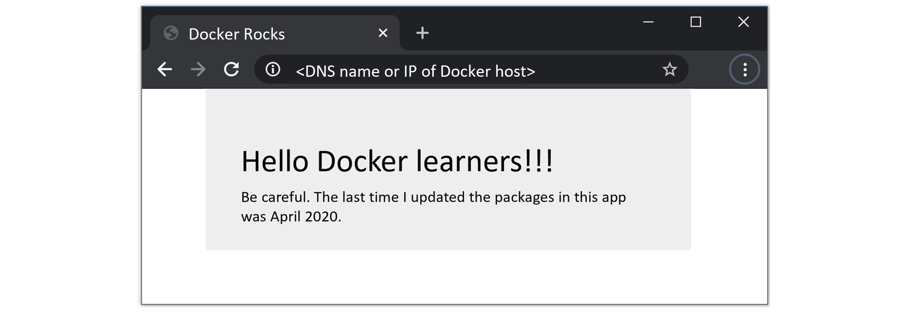

## 8:将应用容器化

Docker 主要是获取应用并在容器中运行它们。

获取应用并将其配置为作为容器运行的过程称为“容器化”。

在本章中，我们将介绍一个简单的基于 Linux 的 web 应用的容器化过程。如果你没有一个 Linux Docker 环境可以跟随，你可以免费使用*玩转 Docker* 。只需将您的网络浏览器指向 https://play-with-docker.com，并旋转一些 Linux Docker 节点。这是我最喜欢的加速 Docker 并进行测试的方式！

我们将把这一章分成通常的三个部分:

*   TLDR
*   深潜
*   命令

让我们容器化一个应用！

### 将应用容器化——TLDR

容器就是让应用变得简单到可以构建、**运送**和**运行**。

应用容器化的过程如下所示:

1.  从应用代码和依赖项开始
2.  创建一个描述你的应用、它的依赖关系以及如何运行它的文件
3.  将*文件*输入`docker image build`命令
4.  将新映像推送到注册表(可选)
5.  从映像运行容器

一旦你的应用被容器化(做成容器映像)，你就可以共享它并作为容器运行了。

图 8.1 以图片的形式展示了这个过程。


Figure 8.1 - Basic flow of containerizing an app


### 应用容器化——深潜

我们将把本章的深度潜水部分分解如下:

*   将单容器应用容器化
*   通过多阶段构建转移到生产
*   一些最佳实践

#### 将单容器应用容器化

本章的其余部分将介绍一个简单的 Node.js web 应用的容器化过程。

我们将完成以下高级步骤:

*   克隆回购以获取应用代码
*   检查文件
*   将应用容器化
*   运行应用
*   测试应用
*   靠近一点看
*   通过**多阶段构建**转移到生产
*   一些最佳实践

本章中的例子是单容器应用。下一章将包括一个稍微复杂一点的多容器应用，我们将在 Docker Stacks 一章中继续讨论一个更复杂的应用。

##### 获取应用代码

本例中使用的应用可在 GitHub 上获得，网址为:

*   https://github.com/nigelpoulton/psweb.git

从 GitHub 克隆示例应用。


```
$ git clone https://github.com/nigelpoulton/psweb.git

Cloning into 'psweb'...
remote: Counting objects: 15, done.
remote: Compressing objects: 100% (11/11), done.
remote: Total 15 (delta 2), reused 15 (delta 2), pack-reused 0
Unpacking objects: 100% (15/15), done.
Checking connectivity... done. 
```


 `克隆操作会创建一个名为`psweb`的新目录。将目录更改为`psweb`并列出其内容。


```
$ cd psweb

$ ls -l
total 28
-rw-r--r-- 1 root root  341 Sep 29 16:26 app.js
-rw-r--r-- 1 root root  216 Sep 29 16:26 circle.yml
-rw-r--r-- 1 root root  338 Sep 29 16:26 Dockerfile
-rw-r--r-- 1 root root  421 Sep 29 16:26 package.json
-rw-r--r-- 1 root root  370 Sep 29 16:26 README.md
drwxr-xr-x 2 root root 4096 Sep 29 16:26 test
drwxr-xr-x 2 root root 4096 Sep 29 16:26 views 
```


 `该目录包含所有应用源代码，以及视图和单元测试的子目录。请随意查看文件——这个应用非常简单。我们不会在本章中使用单元测试。

现在我们有了应用代码，让我们看看它的 Dockerfile。

##### 检查文件

一个 **Dockerfile** 是创建容器映像的起点——它描述了一个应用，并告诉 Docker 如何将其构建成一个映像。

包含应用和依赖项的目录被称为*构建上下文*。将 Dockerfile 保存在*构建上下文*的根目录中是一种常见的做法。同样重要的是 **Dockerfile** 以大写“ **D** ”开头，并且都是一个字。“dockerfile”和“Docker file”无效。

让我们看看 Dockerfile 的内容。


```
$ cat Dockerfile

FROM alpine
LABEL maintainer="nigelpoulton@hotmail.com"
RUN apk add --update nodejs nodejs-npm
COPY . /src
WORKDIR /src
RUN npm install
EXPOSE 8080
ENTRYPOINT ["node", "./app.js"] 
```


 `不要低估 Dockerfile 作为一种文档形式的影响。这是一份弥合开发和运营之间差距的伟大文件。它也有能力加快新开发者的加入等。这是因为该文件以易于阅读的格式准确描述了应用及其依赖关系。您应该像对待源代码一样对待它，并将其检查到版本控制系统中。

在高层，示例 Dockerfile 表示:从`alpine`映像开始，注意“nigelpoulton@hotmail.com”是维护者，安装 Node.js 和 NPM，将构建上下文中的所有内容复制到映像中的`/src`目录，将工作目录设置为`/src`，安装依赖项，记录应用的网络端口，并将`app.js`设置为运行的默认应用。

让我们更详细地看一下。

所有文件都以`FROM`指令开始。这将是映像的基础层，应用的其余部分将作为附加层添加到顶部。这个特殊的应用是一个 Linux 应用，所以 FROM 指令引用一个基于 Linux 的映像是很重要的。如果你正在组装一个视窗应用，你需要指定合适的视窗基础映像，比如`mcr.microsoft.com/dotnet/core/aspnet`。

在 Dockerfile 中的这一点上，映像有一个单层，如图 8.2 所示。


Figure 8.2


接下来，Dockerfile 创建一个标签，指定“nigelpoulton@hotmail.com”作为映像的维护者。标签是简单的键值对，是向映像添加自定义元数据的一种极好的方式。列出一个映像的维护者，以便其他潜在用户在使用它时有一个联系点，这被认为是最佳实践。

`RUN apk add --update nodejs nodejs-npm`指令使用 Alpine `apk`包管理器将`nodejs`和`nodejs-npm`安装到映像中。它在 Alpine 基础层的正上方创建一个新的映像层，并在该层中安装软件包。在 Dockerfile 中的这一点上，映像看起来像图 8.3。


Figure 8.3


`COPY . /src`指令创建另一个新层，并从*构建上下文*复制应用和依赖文件。在 Dockerfile 中的这一点上，映像有三层，如图 8.4 所示。


Figure 8.4


接下来，Dockerfile 使用`WORKDIR`指令为文件中的其余指令设置映像文件系统内的工作目录。该指令不会创建新的映像层。

然后`RUN npm install`指令创建一个新层，并使用`npm`在构建上下文中安装`package.json`文件中列出的应用依赖项。它在先前指令中设置的`WORKDIR`的上下文中运行，并将依赖项安装到新创建的层中。在 Dockerfile 中的这一点上，映像有四层，如图 8.5 所示。


Figure 8.5


应用在 TCP 端口 8080 上公开了一个 web 服务，因此 Dockerfile 用`EXPOSE 8080`指令记录了这一点。这是作为映像元数据而不是映像图层添加的。

最后`ENTRYPOINT`指令用于设置镜像(容器)应该运行的主应用。这也是作为元数据而不是映像层添加的。

##### 将应用容器化/构建映像

既然我们了解了它的工作原理，就让我们来构建它吧！

以下命令将构建一个名为`web:latest`的新映像。命令末尾的句点(`.`)告诉 Docker 使用 shell 的当前工作目录作为*构建上下文*。

请确保包含结尾句点(。)并确保从包含 Dockerfile 和应用代码的`psweb`目录运行命令。


```
$ docker image build -t web:latest .

Sending build context to Docker daemon  76.29kB
Step 1/8 : FROM alpine
latest: Pulling from library/alpine
ff3a5c916c92: Pull complete
Digest: sha256:7df6db5aa6...0bedab9b8df6b1c0
Status: Downloaded newer image for alpine:latest
 ---> 76da55c8019d
<Snip>
Step 8/8 : ENTRYPOINT node ./app.js
 ---> Running in 13977a4f3b21
 ---> fc69fdc4c18e
Removing intermediate container 13977a4f3b21
Successfully built fc69fdc4c18e
Successfully tagged web:latest 
```


 `检查映像是否存在于 Docker 主机的本地存储库中。


```
$ docker image ls
REPO    TAG       IMAGE ID          CREATED              SIZE
web     latest    fc69fdc4c18e      10 seconds ago       81.5MB 
```


 `恭喜你，这个应用是容器化的！

您可以使用`docker image inspect web:latest`命令来验证映像的配置。它将列出从 Dockerfile 配置的所有设置。注意映像图层列表和`Entrypoint`命令。

##### 推送映像

一旦您创建了一个映像，最好将其存储在映像注册表中，以确保其安全并可供他人使用。Docker Hub 是最常见的公共映像注册表，也是`docker image push`命令的默认推送位置。

为了将映像推送到 Docker Hub，您需要使用您的 Docker ID 登录。您还需要适当地标记映像。

让我们登录 Docker Hub 并推送新创建的映像。

在下面的示例中，您需要用自己的 Docker ID 替换我的 Docker ID。所以任何时候你看到“nigelpoulton”，把它换成你的 Docker ID (Docker Hub 用户名)。


```
$ docker login
Login with **your** Docker ID to push and pull images from Docker Hub...
Username: nigelpoulton
Password:
Login Succeeded 
```


 `在推送映像之前，您需要用特殊的方式对其进行标记。这是因为 Docker 在推送映像时需要以下所有信息:

*   `Registry`
*   `Repository`
*   `Tag`

Docker 是固执己见的，因此默认情况下，它会将映像推送到 Docker Hub。您可以推送到其他注册表，但是您必须显式设置注册表网址作为`docker image push`命令的一部分。

先前的`docker image ls`输出显示映像被标记为`web:latest`。这转化为一个名为`web`的存储库和一个标记为`latest`的映像。因此，`docker image push`将尝试将映像推送到 Docker Hub 上名为`web`的存储库。然而，我没有访问`web`存储库的权限，我所有的映像都在`nigelpoulton`二级命名空间中。这意味着我需要重新标记映像，以包括我的码头工人标识。记得用你自己的码头工人身份证代替。


```
$ docker image tag web:latest nigelpoulton/web:latest 
```


 `命令的格式是`docker image tag <current-tag> <new-tag>`并且它增加了一个附加标签，它不会覆盖原来的。

另一个映像列表显示映像现在有两个标签，其中一个包括我的 Docker ID。


```
$ docker image ls
REPO                TAG       IMAGE ID         CREATED         SIZE
web                 latest    fc69fdc4c18e     10 secs ago     64.4MB
nigelpoulton/web    latest    fc69fdc4c18e     10 secs ago     64.4MB 
```


 `现在我们可以将其推送到 Docker Hub。您不能在我的 Docker Hub 命名空间中推送映像来重新发布，您必须标记映像才能使用您自己的映像。


```
$ docker image push nigelpoulton/web:latest
The push refers to repository [docker.io/nigelpoulton/web]
2444b4ec39ad: Pushed
ed8142d2affb: Pushed
d77e2754766d: Pushed
cd7100a72410: Mounted from library/alpine
latest: digest: sha256:68c2dea730...f8cf7478 size: 1160 
```


 `图 8.6 显示了 Docker 如何确定推送位置。


Figure 8.6


现在，映像被推送到注册表，您可以通过互联网连接从任何地方访问它。您还可以授予其他人访问权限，以拉取和推送更改。

本章其余部分的示例将使用两个映像标签中较短的一个(`web:latest`)。

##### 运行应用

容器化的应用是一个监听 TCP 端口`8080`的网络服务器。您可以在从 GitHub 克隆的构建上下文中的`app.js`文件中验证这一点。

以下命令将基于您刚刚创建的`web:latest`映像启动一个名为`c1`的新容器。它将码头工人主机上的港口`80`映射到集装箱内的港口`8080`。这意味着您可以将网络浏览器指向运行容器的 Docker 主机的 DNS 名称或 IP 地址，并访问该应用。

> **注意:**如果您的主机已经在端口 80 上运行服务，您可以指定不同的端口作为`docker container run`命令的一部分。例如，要将应用映射到 Docker 主机上的端口 5000，请使用`-p 5000:8080`标志。


```
$ docker container run -d --name c1 \
  -p 80:8080 \
  web:latest 
```


 ``-d`标志在后台运行容器，`-p 80:8080`标志将主机上的端口 80 映射到运行容器内部的端口 8080。

检查容器是否正在运行，并验证端口映射。


```
$ docker container ls

ID    IMAGE       COMMAND           STATUS      PORTS                  NAMES
49..  web:latest  "node ./app.js"   UP 6 secs   0.0.0.0:80->8080/tcp   c1 
```


 `为了可读性，上面的输出被剪掉了，但是显示应用容器正在运行。请注意，所有主机接口(`0.0.0.0:80`)上都映射了端口 80。

##### 测试应用

打开一个网络浏览器，指向运行容器的主机的域名或 IP 地址。您将看到如图 8.7 所示的网页。如果您正在使用 Docker Desktop 或在本地机器上运行容器的其他技术。可以使用`localhost`作为 DNS 名称。



Figure 8.7


如果测试不起作用，请尝试以下操作:

1.  使用`docker container ls`命令确保容器已启动并运行。容器名为`c1`，您应该看到端口映射为`0.0.0.0:80->8080/tcp`。
2.  检查防火墙和其他网络安全设置是否阻止到 Docker 主机上端口 80 的流量。
3.  重试在 Docker 主机上指定高编号端口的命令(可能是`-p 5000:8080`)。

恭喜，应用已经容器化并正在运行！

##### 再看近一点

现在应用已经被容器化了，让我们仔细看看一些机器是如何工作的。

`docker image build`命令从顶部开始一次一行地解析 Dockerfile。

注释行以`#`字符开始。

所有非注释行均为**说明**，格式为`INSTRUCTION argument`。指令名称不区分大小写，但通常以大写形式书写。这使得读取 Dockerfile 更加容易。

一些指令创建新层，而另一些指令只是向映像配置文件添加元数据。

创建新图层的指令示例有`FROM`、`RUN`和`COPY`。创建元数据的示例包括`EXPOSE`、`WORKDIR`、`ENV`和`ENTRYPOINT`。基本前提是这样的——如果一条指令正在向映像中添加*内容*如文件和程序，它将创建一个新的图层。如果它正在添加如何构建映像和运行应用的说明，它将创建元数据。

您可以使用`docker image history command`查看用于构建映像的说明。


```
$ docker image history web:latest

IMAGE     CREATED BY                                      SIZE
fc6..18e  /bin/sh -c #(nop)  ENTRYPOINT ["node" "./a...   0B
334..bf0  /bin/sh -c #(nop)  EXPOSE 8080/tcp              0B
b27..eae  /bin/sh -c npm install                          14.1MB
932..749  /bin/sh -c #(nop) WORKDIR /src                  0B
052..2dc  /bin/sh -c #(nop) COPY dir:2a6ed1703749e80...   22.5kB
c1d..81f  /bin/sh -c apk add --update nodejs nodejs-npm   46.1MB
336..b92  /bin/sh -c #(nop)  LABEL maintainer=nigelp...   0B
3fd..f02  /bin/sh -c #(nop)  CMD ["/bin/sh"]              0B
<missing> /bin/sh -c #(nop) ADD file:093f0723fa46f6c...   4.15MB 
```


 `上面输出的两件东西毫无价值。

首先。每行对应于 Dockerfile 中的一条指令(从底部开始向上)。`CREATED BY`列甚至列出了已执行的确切 Dockerfile 指令。

其次。输出中只显示了 4 行创建新图层(在`SIZE`列中具有非零值的图层)。这些对应于文件中的`FROM`、`RUN`和`COPY`指令。虽然其他指令看起来像是在创建图层，但实际上它们创建的是元数据而不是图层。`docker image history`输出看起来像所有指令创建图层的原因是构建和映像分层工作方式的假象。

使用`docker image inspect`命令确认只创建了 4 层。


```
$ docker image inspect web:latest

<Snip>
},
"RootFS": {
    "Type": "layers",
    "Layers": [
        "sha256:cd7100...1882bd56d263e02b6215",
        "sha256:b3f88e...cae0e290980576e24885",
        "sha256:3cfa21...cc819ef5e3246ec4fe16",
        "sha256:4408b4...d52c731ba0b205392567"
    ]
}, 
```


 `在`FROM`指令下使用来自官方存储库的映像被认为是一种良好的做法。这是因为他们的内容已经过审查，当漏洞被修复时，他们会很快发布新版本。从(`FROM`)小映像开始也是一个好主意，因为这样可以保持映像小，减少攻击面和潜在漏洞。

您可以查看`docker image build`命令的输出，查看构建映像的一般过程。如下图片段所示，基本流程为:`spin up a temporary container` > `run the Dockerfile instruction inside of that container` > `save the results as a new image layer` > `remove the temporary container`。


```
Step 3/8 : RUN apk add --update nodejs nodejs-npm
 ---> Running in e690ddca785f    << Run inside of temp container
fetch http://dl-cdn...APKINDEX.tar.gz
fetch http://dl-cdn...APKINDEX.tar.gz
(1/10) Installing ca-certificates (20171114-r0)
<Snip>
OK: 61 MiB in 21 packages
 ---> c1d31d36b81f               << Create new layer
Removing intermediate container  << Remove temp container
Step 4/8 : COPY . /src 
```


 `#### 通过**多阶段构建**转移到生产

说到 Docker 的映像，大就是坏！

大意味着慢。大意味着努力工作。而大意味着更多潜在的漏洞和可能更大的攻击面！

由于这些原因，Docker 映像应该很小。游戏的目的是只运送生产映像和运行你的应用所需的东西。

问题是……保持映像小*是*的辛苦。

例如，您编写 Dockerfiles 的方式对映像的大小有着巨大的影响。一个常见的例子是，每一条`RUN`指令都会增加一个新的图层。因此，通常认为最佳做法是将多个命令作为单个 RUN 指令的一部分，所有命令都用双&符号(& &)和反斜杠(`\`)换行粘合在一起。虽然这不是火箭科学，但它需要时间和纪律。

另一个问题是我们不会自己清理。我们将对一个映像运行一个命令，该命令会提取一些构建时工具，并且当我们将这些工具运送到生产环境时，我们会将它们保留在映像中。不理想！

多阶段建设救援！

多阶段构建就是在不增加复杂性的情况下优化构建。他们兑现了承诺！

这里是高层…

多阶段构建有一个包含多个 FROM 指令的 Dockerfile。每个 FROM 指令都是一个新的**构建阶段**，可以轻松复制之前**阶段**的人工制品。

我们来看一个例子！

这个示例应用在 https://github.com/nigelpoulton/atsea-sample-shop-app.git 可用，Dockerfile 在`app`目录中。这是一个基于 Linux 的应用，因此只能在 Linux Docker 主机上工作。它也很旧了，所以不要部署到重要的系统上，一定要一完成就删除。

文件如下所示:


```
FROM node:latest AS storefront
WORKDIR /usr/src/atsea/app/react-app
COPY react-app .
RUN npm install
RUN npm run build

FROM maven:latest AS appserver
WORKDIR /usr/src/atsea
COPY pom.xml .
RUN mvn -B -f pom.xml -s /usr/share/maven/ref/settings-docker.xml dependency:resolve
COPY . .
RUN mvn -B -s /usr/share/maven/ref/settings-docker.xml package -DskipTests

FROM java:8-jdk-alpine AS production
RUN adduser -Dh /home/gordon gordon
WORKDIR /static
COPY --from=storefront /usr/src/atsea/app/react-app/build/ .
WORKDIR /app
COPY --from=appserver /usr/src/atsea/target/AtSea-0.0.1-SNAPSHOT.jar .
ENTRYPOINT ["java", "-jar", "/app/AtSea-0.0.1-SNAPSHOT.jar"]
CMD ["--spring.profiles.active=postgres"] 
```


 `首先要注意的是 Dockerfile 有三个`FROM`指令。每一个都构成了一个独特的**建造阶段**。在内部，它们从 0 开始从顶部开始编号。然而，我们也给每个阶段起了一个友好的名字。

*   阶段 0 称为`storefront`
*   第一阶段称为`appserver`
*   第二阶段称为`production`

`storefront`阶段拉取尺寸超过 900MB 的`node:latest`映像。它设置工作目录，复制一些应用代码，并使用两条 RUN 指令来执行一些`npm`魔法。这增加了三层和相当大的尺寸。生成的映像甚至比基本的`node:latest`映像还要大，因为它包含了大量的构建内容，而没有太多的应用代码。

`appserver`阶段拉取大小超过 500MB 的`maven:latest`映像。它通过两条 COPY 指令和两条 RUN 指令添加了四层内容。这产生了另一个非常大的映像，有大量的构建工具和非常少的实际生产代码。

`production`阶段从拉动`java:8-jdk-alpine`映像开始。该映像大约为 150MB，比之前构建阶段使用的节点和 maven 映像小得多。它添加一个用户，设置工作目录，并从`storefront`舞台产生的映像中复制一些应用代码。之后，它设置一个不同的工作目录，并从`appserver`阶段生成的映像中复制应用代码。最后，它设置映像的主应用在作为容器启动时运行。

需要注意的一点是，`COPY --from`指令用于**只从前面阶段构建的映像中复制生产相关的应用代码**。他们不会复制生产不需要的建筑人工制品。

还需要注意的是，我们只需要一个 Dockerfile，并且`docker image build`命令不需要额外的参数！

说到这里…让我们建造它。

克隆回购协议。


```
$ git clone https://github.com/nigelpoulton/atsea-sample-shop-app.git

Cloning into 'atsea-sample-shop-app'...
remote: Counting objects: 632, done.
remote: Total 632 (delta 0), reused 0 (delta 0), pack-reused 632
Receiving objects: 100% (632/632), 7.23 MiB | 1.88 MiB/s, done.
Resolving deltas: 100% (195/195), done.
Checking connectivity... done. 
```


 `将目录更改为克隆报告的`app`文件夹，并验证 Dockerfile 是否存在。


```
$ cd atsea-sample-shop-app/app

$ ls -l
total 24
-rw-r--r-- 1 root root  682 Oct  1 22:03 Dockerfile
-rw-r--r-- 1 root root 4365 Oct  1 22:03 pom.xml
drwxr-xr-x 4 root root 4096 Oct  1 22:03 react-app
drwxr-xr-x 4 root root 4096 Oct  1 22:03 src 
```


 `执行构建(这可能需要几分钟才能完成，因为提取的一些映像很大)。


```
$ docker image build -t multi:stage .

Sending build context to Docker daemon  3.658MB
Step 1/19 : FROM node:latest AS storefront
latest: Pulling from library/node
aa18ad1a0d33: Pull complete
15a33158a136: Pull complete
<Snip>
Step 19/19 : CMD --spring.profiles.active=postgres
 ---> Running in b4df9850f7ed
 ---> 3dc0d5e6223e
Removing intermediate container b4df9850f7ed
Successfully built 3dc0d5e6223e
Successfully tagged multi:stage 
```


 `> **注意:**上面例子中使用的`multi:stage`标记是任意的。您可以根据自己的要求和标准来标记您的映像，不需要像我们在本例中那样标记多阶段构建。

运行`docker image ls`查看构建操作提取和创建的映像列表。


```
$ docker image ls

REPO    TAG             IMAGE ID        CREATED        SIZE
node    latest          a5a6a9c32877    5 days ago     941MB
<none>  <none>          d2ab20c11203    9 mins ago     1.11GB
maven   latest          45d27d110099    9 days ago     508MB
<none>  <none>          fa26694f57cb    7 mins ago     649MB
java    8-jdk-alpine    3fd9dd82815c    7 months ago   145MB
multi   stage           3dc0d5e6223e    1 min ago      210MB 
```


 `上面输出中的顶行显示了由`storefront`级拉动的`node:latest`映像。下图是该阶段生成的映像(通过添加代码并运行 npm 安装和构建操作创建)。这两个都是非常大的映像，包括大量的建筑垃圾。

第三、四行是`appserver`阶段拉出来的映像。它们都很大，并且包含许多构建工具。

最后一行是 Dockerfile 中最终构建阶段构建的`multi:stage`映像(阶段 2/生产)。您可以看到，这明显小于前几个阶段提取和生成的映像。这是因为它基于小得多的`java:8-jdk-alpine`映像，并且只添加了之前阶段与生产相关的应用文件。

最终结果是一个小的生产映像，由一个 Dockerfile、一个普通的`docker image build`命令和零个额外的脚本创建！

多阶段构建在 Docker 17.05 中是新的，并且是构建小的值得生产的映像的一个优秀特性。

#### 一些最佳实践

在结束本章之前，让我们列出一些最佳实践。这份清单并非详尽无遗。

##### 利用构建缓存

Docker 使用的构建过程有一个缓存的概念，它用来加速构建过程。查看缓存影响的最佳方式是在干净的 Docker 主机上构建新映像，然后立即重复相同的构建。第一次构建将提取映像并花时间构建图层。第二次建造将几乎瞬间完成。这是因为来自第一个构建的人工产物，例如图层，被缓存并被以后的构建所利用。

正如我们所知，`docker image build`过程从顶部开始一次一行地遍历一个 Dockerfile。对于每条指令，Docker 都会查看其缓存中是否已经有该指令的映像层。如果是的话，这是一个*缓存命中*，它使用该层。如果没有，这是一个*缓存未命中*，它根据指令构建一个新的层。获得*缓存命中*可以极大地加快构建过程。

让我们仔细看看。

我们将使用这个示例 Dockerfile 来提供快速浏览:


```
FROM alpine
RUN apk add --update nodejs nodejs-npm
COPY . /src
WORKDIR /src
RUN npm install
EXPOSE 8080
ENTRYPOINT ["node", "./app.js"] 
```


 `第一条指令告诉 Docker 使用`alpine:latest`映像作为其*基础映像*。如果此映像已经存在于主机上，构建将继续下一个指令。如果映像不存在，它将从 Docker Hub (index.docker.io)中拉出。

下一条指令(`RUN apk...`)运行命令更新包列表并安装`nodejs`和`nodejs-npm`。在执行该指令之前，Docker 检查其构建缓存中是否有从相同的基础映像构建的层，以及是否使用了当前要求其执行的相同指令。在这种情况下，它通过执行`RUN apk add --update nodejs nodejs-npm`指令寻找直接构建在`alpine:latest`之上的层。

如果它找到了一个层，它会跳过指令，链接到该现有层，然后继续构建缓存。如果它没有**而不是**找到图层，它将使缓存无效并构建图层。这种使缓存无效的操作会使其在构建的剩余时间内无效。这意味着所有后续的 Dockerfile 指令都完全完成，而不会尝试引用构建缓存。

让我们假设 Docker 在缓存中已经有了该指令的层(缓存命中)。让我们假设该层的 ID 是`AAA`。

下一条指令将一些代码复制到映像中(`COPY . /src`)。因为之前的指令导致了缓存命中，所以 Docker 现在检查它是否有一个缓存层，该缓存层是使用`COPY . /src`命令从`AAA`层构建的。如果是，它链接到该层并继续执行下一条指令。如果没有，它将构建该层，并使构建剩余部分的缓存无效。

让我们假设 Docker 在高速缓存中已经有了该指令的层(高速缓存命中)。假设该层的 ID 为`BBB`。

这个过程在 Dockerfile 的其余部分继续。

多了解一些事情很重要。

首先，一旦任何指令导致缓存未命中(没有为该指令找到层)，缓存就不再用于整个构建的其余部分。这对你如何编写 Dockerfiles 有着重要的影响。尝试以这样一种方式写入它们:将可能使缓存无效的指令放在 Dockerfile 的末尾。这意味着直到构建的后期才会发生缓存未命中，从而使构建尽可能多地受益于缓存。

通过向`docker image build`命令传递`--no-cache=true`标志，可以强制构建过程忽略整个缓存。

理解`COPY`和`ADD`指令包括确保复制到映像中的内容自上次构建以来没有改变的步骤也很重要。例如，Dockerfile 中的`COPY . /src` **指令**可能自上一次**后没有变化，但是……**复制到映像**中的目录内容**发生了变化！

为了防止这种情况，Docker 对每个被复制的文件执行校验和，并将其与缓存层中相同文件的校验和进行比较。如果校验和不匹配，缓存将失效，并构建一个新层。

##### 挤压映像

挤压映像实际上不是一个最佳实践，因为它有优点也有缺点。

在高层次上，Docker 遵循正常的过程来构建一个映像，但随后增加了一个额外的步骤，将所有东西挤压成一个单一的层。

挤压在映像开始有很多层的情况下是很好的，但这并不理想。一个例子可能是当创建一个新的基础映像时，您希望将来从它构建其他映像，这个基础映像作为单层映像要好得多。

从负面来看，被挤压的映像不共享映像层。这可能导致存储效率低下和更大的推拉操作。

如果你想创建一个压扁的映像，在`docker image build`命令中添加`--squash`标志。

图 8.8 显示了压缩映像带来的一些低效率。两个映像完全相同，除了一个被压扁，另一个没有。未压缩的映像与主机上的其他映像共享图层(节省磁盘空间)，但压缩的映像不共享图层。压扁的映像还需要通过`docker image push`命令将每个字节发送到 Docker Hub，而未压扁的映像只需要发送唯一的图层。


Figure 8.8 - Squashed images vs non-squashed images


##### 使用不安装-推荐

如果您正在构建 Linux 映像，并且使用 apt 包管理器，您应该使用带有`apt-get install`命令的`no-install-recommends`标志。这确保了`apt`只安装主依赖项(在`Depends`字段中的包)，而不安装推荐或建议的包。这可以大大减少下载到映像中的不需要的包的数量。

### 应用容器化-命令

*   `docker image build`是读取 Dockerfile 并容器化应用的命令。`-t`标志标记映像，`-f`标志允许您指定 Dockerfile 的名称和位置。使用`-f`标志，可以在任意位置使用任意名称的 Dockerfile。*构建上下文*是应用文件存在的地方，它可以是本地 Docker 主机上的目录，也可以是远程 Git repo。
*   Dockerfile 中的`FROM`指令为您将要构建的新映像指定了基础映像。它通常是 Dockerfile 中的第一条指令，最佳实践是在这条线上使用来自官方转帖的映像。
*   Dockerfile 中的`RUN`指令允许您在映像中运行命令。每个`RUN`指令创建一个新的层。
*   Dockerfile 中的`COPY`指令将文件作为新层添加到映像中。通常使用`COPY`指令将应用代码复制到映像中。
*   Dockerfile 中的`EXPOSE`指令记录了应用使用的网络端口。
*   Dockerfile 中的`ENTRYPOINT`指令将默认应用设置为当映像作为容器启动时运行。
*   其他 Dockerfile 指令包括`LABEL`、`ENV`、`ONBUILD`、`HEALTHCHECK`、`CMD`等…

### 章节总结

在本章中，我们学习了如何将应用容器化。

我们从远程 Git repo 中提取了一些应用代码。该报告包括应用代码，以及包含如何将应用构建到映像中的说明的 Dockerfile。我们学习了 Dockerfiles 如何工作的基础知识，并将其输入到`docker image build`命令中以创建新映像。

一旦创建了映像，我们就从它开始一个容器，并用网络浏览器测试它。

之后，我们看到了多阶段构建如何为我们提供一种简单的方法来构建较小的映像并将其运送到我们的生产环境中。

我们还了解到 Dockerfile 是记录应用的一个很好的工具。因此，它可以加快新开发人员的入职速度，弥合开发人员和运营人员之间的鸿沟。考虑到这一点，把它当作代码来对待，并将其签入和签出源代码控制系统。

虽然引用的例子是一个基于 Linux 的例子，但是容器化 Windows 应用的过程是一样的:从你的应用代码开始，创建一个描述应用的 Dockerfile，用`docker image build`构建映像。任务完成！````````````````````