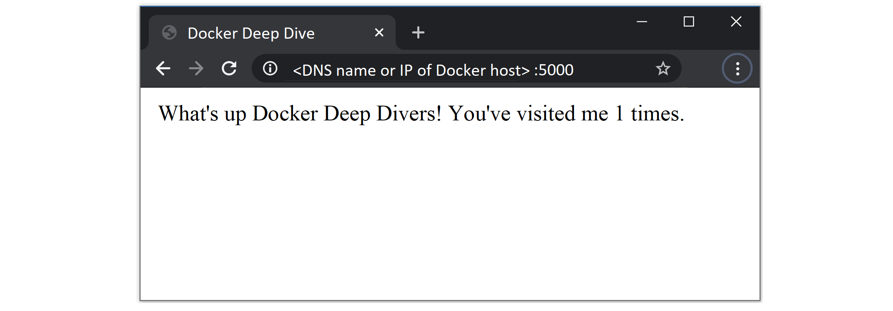
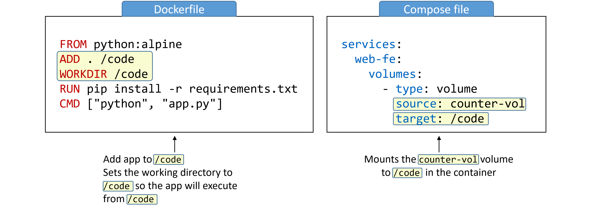
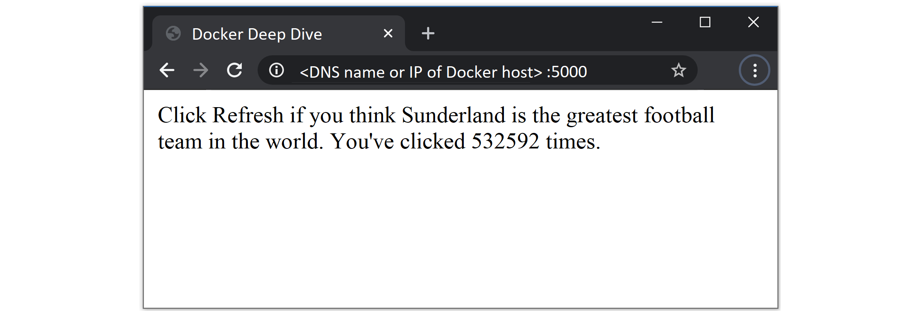

## 9:使用 Docker 编写部署应用

在本章中，我们将了解如何使用 Docker Compose 部署多容器应用。

Docker 编写和 Docker 堆栈非常相似。在本章中，我们将重点介绍 Docker Compose，它在以**单引擎模式**运行的 Docker 节点上部署和管理多容器应用。在后面的章节中，我们将重点讨论 Docker Stacks。栈在运行于**群模式**的 Docker 节点上部署和管理多容器应用。

我们将把这一章分成通常的三个部分:

*   TLDR
*   深潜
*   命令

### 通过撰写部署应用-TLDR

现代云原生应用由多个较小的服务组成，它们相互作用形成一个有用的应用。我们称这种模式为“微服务”。一个简单的例子可能是一个包含以下七项服务的应用:

*   Web 前端
*   排序
*   目录
*   后端数据库
*   记录
*   证明
*   批准

让所有这些一起工作，你就有了一个*有用的应用*。

部署和管理大量类似这样的小型微服务可能会很困难。这是*码头工人作曲*进场的地方。

Docker Compose 不是用脚本和长的`docker`命令将每个微服务粘合在一起，而是让您在单个声明性配置文件中描述整个应用，并使用单个命令部署它。

一旦应用被*部署*，你可以*用一组简单的命令管理*的整个生命周期。您甚至可以在版本控制系统中存储和管理配置文件。

这是最基本的。让我们深入挖掘。

### 通过编写部署应用-深度潜水

我们将深潜部分划分如下:

*   撰写背景
*   安装合成
*   撰写文件
*   使用撰写部署应用
*   使用撰写管理应用

#### 撰写背景

一开始是*图*。Fig 是一个强大的工具，由一家名为*果园*的公司创建，它是管理多容器 Docker 应用的最佳方式。它是一个 Python 工具，位于 Docker 之上，允许您在一个 YAML 文件中定义整个多容器应用。然后，您可以使用`fig`命令行工具来部署和管理应用的生命周期。

在幕后，Fig 将读取 YAML 文件，并使用 Docker 通过 Docker API 部署和管理应用。这是件好事。

事实上，它是如此的好，以至于 Docker，Inc .收购了 Orchard，并将 Fig 重新命名为 *Docker Compose* 。命令行工具从`fig`更名为`docker-compose`，并继续作为外部工具安装在 Docker 引擎的顶部。尽管它从未完全集成到 Docker Engine 中，但它一直很受欢迎并被广泛使用。

就目前的情况来看，Compose 仍然是一个外部 Python 二进制文件，您必须将其安装在 Docker 主机上。您在 YAML 文件中定义多容器(微服务)应用，将 YAML 文件传递到`docker-compose`命令行，并通过 Docker API 进行组合部署。然而，2020 年 4 月发布了[作曲规范](https://github.com/compose-spec/compose-spec)。这旨在为定义多容器云原生应用创建一个开放标准。最终目的是大大简化*代码到云*的流程。

该规范将由社区主导，并与 Docker，Inc .的`docker-compose`实现分开。这有助于保持更好的治理和更清晰的分界线。然而，我们应该期待 Docker 在`docker-compose`中实现填充规范。

规范本身是了解细节的一个很好的文档。

是时候看到它发挥作用了。

#### 安装合成

Docker Compose 可在多个平台上使用。在本节中，我们将演示一些在视窗、苹果和 Linux 上安装它的方法。有更多的安装方法，但我们在这里展示的方法会让你开始。

##### 在 Windows 10 上安装合成

Docker Compose 是 Windows 10 上标准 Docker 桌面安装的一部分。所以，如果你的 Windows 10 电脑上有 Docker Desktop，你就有了 Docker Compose。

使用以下命令检查是否安装了撰写。您可以从 PowerShell 或 CMD 终端运行此命令。


```
> docker-compose --version
docker-compose version 1.25.5, build 8a1c60f6 
```


 `如果您需要在 Windows 10 上安装 *Docker Desktop* 的更多信息，请参见**第 3 章:安装 Docker** 。

##### 在苹果电脑上安装合成

与 Windows 10 一样，Docker Compose 作为 Mac 的 *Docker 桌面*的一部分安装。所以，如果你的 Mac 上有 Docker 桌面，你就有了 Docker 作曲。

在终端窗口中运行以下命令，验证您是否拥有 Docker Compose。


```
$ docker-compose --version
docker-compose version 1.25.5, build 8a1c60f6 
```


 `如需了解更多关于安装 *Docker Desktop* 的信息，请参见**第三章:安装 Docker** 。

##### 在视窗服务器上安装合成

Docker Compose 作为单独的二进制文件安装在 Windows 服务器上。要使用它，您需要在您的 Windows 服务器上安装最新的 Docker。

从提升的 PowerShell 终端运行以下命令(以管理员身份运行)。


```
PS C:\> [Net.ServicePointManager]::SecurityProtocol = [Net.SecurityProtocolType]::Tls12 
```


 `为了可读性，以下命令在您想要安装的版本的 URL 中使用了倒勾(`) to escape carriage returns and wrap the command over multiple lines. It installs version 1.25.5 of Docker Compose. You can install any version listed here: https://github.com/docker/compose/releases by replacing the` 1.25.5`)。


```
PS C:\> Invoke-WebRequest `
 "https://github.com/docker/compose/releases/download/1.25.5/docker-compose-Windows-x86_64.exe" `
 -UseBasicParsing `
 -OutFile $Env:ProgramFiles\Docker\docker-compose.exe

Writing web request
Writing request stream... (Number of bytes written: 5260755) 
```


 `使用`docker-compose --version`命令验证安装。


```
> docker-compose --version
docker-compose version 1.25.5, build 01110ad01 
```


 `撰写现已安装。只要您的 Windows Server 机器安装了最新的 Docker 引擎，您就可以开始了。

##### 在 Linux 上安装合成

在 Linux 上安装 Docker Compose 是一个两步的过程。首先，使用`curl`命令下载二进制文件。然后使用`chmod`使其可执行。

要让 Docker Compose 在 Linux 上工作，您需要一个 Docker 引擎的工作版本。

以下命令将下载 Docker Compose 的版本`1.25.5`，并将其复制到`/usr/bin/local`。您可以查看 [GitHub](https://github.com/docker/compose/releases) 上的发布页面获取最新版本，并将网址中的`1.25.5`替换为您想要安装的版本。

该命令可能会覆盖书中的多行。如果在一行中运行该命令，则需要删除所有反斜杠(`\`)。


```
$ sudo curl -L \
 "https://github.com/docker/compose/releases/download/1.25.5/docker-compose-$(uname -s)-$(uname -m)" \
  -o /usr/local/bin/docker-compose

% Total    % Received   Time        Time     Time    Current
                        Total       Spent    Left    Speed
100   617    0   617    0 --:--:-- --:--:-- --:--:--  1047
100 8280k  100 8280k    0  0:00:03  0:00:03 --:--:--  4069k 
```


 `现在您已经下载了`docker-compose`二进制文件，使用下面的`chmod`命令使其可执行。


```
$ sudo chmod +x /usr/local/bin/docker-compose 
```


 `验证安装并检查版本。


```
$ docker-compose --version
docker-compose version 1.25.5, build 1110ad01 
```


 `您已经准备好在 Linux 上使用 Docker Compose 了。

也可以使用`pip`从其 Python 包安装 Compose。但是我不想浪费宝贵的页面来展示每一种可能的安装方法。够了，该继续前进了。

#### 撰写文件

Compose 使用 YAML 文件定义多服务应用。YAML 是 JSON 的一个子集，所以你也可以使用 JSON。然而，本章中的所有例子都将是 YAML。

撰写 YAML 文件的默认名称是`docker-compose.yml`。但是，您可以使用`-f`标志来指定自定义文件名。

以下示例显示了一个非常简单的合成文件，该文件定义了一个带有两个微服务(`web-fe`和`redis`)的小 Flask 应用。该应用是一个简单的网络服务器，它计算网页的访问量，并将该值存储在 Redis 中。我们将称该应用为`counter-app`，并将其用作本章其余部分的示例应用。


```
version: "3.8"
services:
  web-fe:
    build: .
    command: python app.py
    ports:
      - target: 5000
        published: 5000
    networks:
      - counter-net
    volumes:
      - type: volume
        source: counter-vol
        target: /code
  redis:
    image: "redis:alpine"
    networks:
      counter-net:

networks:
  counter-net:

volumes:
  counter-vol: 
```


 `在仔细查看之前，我们将跳过文件的基础知识。

首先要注意的是，该文件有 4 个顶级键:

*   `version`
*   `services`
*   `networks`
*   `volumes`

其他顶级键也存在，例如`secrets`和`configs`，但是我们现在没有看到这些。

`version`键是强制的，它总是文件根目录的第一行。这定义了编写文件格式的版本(基本上是应用编程接口)。您通常应该使用最新版本。

需要注意的是`versions`键并没有定义 Docker Compose 或 Docker Engine 的版本。有关 Docker 引擎、Docker Compose 和 Compose 文件格式版本之间兼容性的信息，请搜索“Compose 文件版本和升级”。

在本章的剩余部分，我们将使用版本 3 或更高版本的合成文件格式。

顶层`services`键是定义不同应用微服务的地方。这个例子定义了两个服务；名为`web-fe`的网络前端和名为`redis`的内存数据库。Compose 会将这些服务部署为自己的容器。

顶层`networks`键告诉 Docker 创建新网络。默认情况下，合成将创建`bridge`网络。这些是单主机网络，只能连接同一 Docker 主机上的容器。但是，您可以使用`driver`属性来指定不同的网络类型。

下面的代码可以用在你的合成文件中，创建一个新的*叠加*网络，称为`over-net`，允许独立容器连接到它(`attachable`)。


```
networks:
  over-net:
  driver: overlay
  attachable: true 
```


 `顶层`volumes`键是告诉 Docker 创建新卷的地方。

##### 我们特定的合成文件

我们列出的示例文件使用 Compose 版本`3.8`文件格式，定义了两个服务，定义了一个名为 counter-net 的网络，并定义了一个名为 counter-vol 的卷。

大部分细节在`services`部分，让我们仔细看看。

服务部分有两个二级键:

*   web-fe
*   redis

这些都定义了应用中的服务(容器)。重要的是要理解 Compose 将把这些都部署为一个容器，并且它将使用键的名称作为容器名称的一部分。在我们的例子中，我们定义了两个键；`web-fe`和`redis`。这意味着 Compose 将部署两个容器，一个名称中有`web-fe`，另一个名称中有`redis`。

在`web-fe`服务的定义中，我们给 Docker 以下指令:

*   `build: .`这告诉 Docker 使用当前目录(`.`)中的`Dockerfile`中的指令构建一个新的映像。新构建的映像将在后面的步骤中用于为此服务创建容器。
*   `command: python app.py`这告诉 Docker 运行一个名为`app.py`的 Python 应用作为容器中的主应用。`app.py`文件必须存在于映像中，并且映像必须包含 Python。Dockerfile 满足了这两个需求。
*   `ports:`告诉 Docker 将容器内的端口 5000(`-target`)映射到主机(`published`)上的端口 5000。这意味着发送到端口 5000 上的 Docker 主机的流量将被定向到容器上的端口 5000。容器内的应用监听端口 5000。
*   `networks:`告诉 Docker 将服务的容器连接到哪个网络。网络应该已经存在，或者在`networks`顶级密钥中定义。如果它是一个覆盖网络，它将需要有`attachable`标志，这样独立的容器就可以连接到它(Compose 部署独立的容器，而不是 Docker Services)。
*   `volumes:`告诉 Docker 将`counter-vol`卷(`source:`)安装到容器内的`/code` ( `target:`)。`counter-vol`卷需要已经存在，或者在文件底部的`volumes`顶层键中定义。

总之，Compose 将指示 Docker 为`web-fe`服务部署一个独立的容器。它将基于与合成文件位于同一目录中的 Dockerfile 构建的映像。该图片将作为容器启动，并作为其主应用运行`app.py`。它将暴露在主机的端口 5000 上，连接到`counter-net`网络，并将卷装入`/code`。

> **注:**从技术上讲，我们不需要`command: python app.py`选项。这是因为应用的 Dockerfile 已经将`python app.py`定义为映像的默认应用。然而，我们在这里展示它，所以你知道它是如何工作的。您也可以使用“编写”来覆盖 Dockerfiles 中设置的 CMD 指令。

`redis`服务的定义更简单:

*   `image: redis:alpine`这告诉 Docker 基于`redis:alpine`映像启动一个名为`redis`的独立容器。该映像将从 Docker Hub 中提取。
*   `networks:`集装箱将连接到`counter-net`网络。

由于两种服务将部署在同一个`counter-net`网络上，它们将能够通过名称相互解析。这很重要，因为应用被配置为通过名称与 redis 服务通信。

现在我们已经了解了合成文件是如何工作的，让我们部署它吧！

#### 使用撰写部署应用

在本节中，我们将部署上一节的合成文件中定义的应用。为此，您需要来自 https://github.com/nigelpoulton/counter-app:的以下 4 个文件

*   Dockerfile
*   app.py
*   requirements.txt
*   坞站-组合. yml

在本地克隆 Git 回购。


```
$ git clone https://github.com/nigelpoulton/counter-app.git

Cloning into 'counter-app'...
remote: Counting objects: 9, done.
remote: Compressing objects: 100% (8/8), done.
remote: Total 9 (delta 1), reused 5 (delta 0), pack-reused 0
Unpacking objects: 100% (9/9), done.
Checking connectivity... done. 
```


 `克隆回购将创建一个名为`counter-app`的新子目录。这将包含所有必需的文件，并将被视为您的*构建上下文*。撰写还将使用目录的名称(`counter-app`)作为项目名称。我们稍后会看到这一点，但是 Compose 会在所有资源名称前面加上`counter-app_`。

进入`counter-app`目录，检查文件是否存在。


```
$ cd counter-app
$ ls
app.py  docker-compose.yml  Dockerfile  requirements.txt ... 
```


 `让我们快速描述每个文件:

*   `app.py`是应用代码(Python Flask 应用)
*   `docker-compose.yml`是 Docker 编写文件，描述 Docker 应该如何构建和部署应用
*   `Dockerfile`描述如何为`web-fe`服务构建映像
*   `requirements.txt`列出了应用所需的 Python 包

请随意检查每个文件的内容。

`app.py`文件显然是应用的核心。但是`docker-compose.yml`是把所有应用微服务粘在一起的胶水。

让我们使用合成来打开应用。您必须在刚刚从 GitHub 克隆的`counter-app`目录中运行以下所有命令。


```
$ docker-compose up &

[1] 1635
Creating network "counter-app_counter-net" with the default driver
Creating volume "counter-app_counter-vol" with default driver
Pulling redis (redis:alpine)...
alpine: Pulling from library/redis
1160f4abea84: Pull complete
a8c53d69ca3a: Pull complete
<Snip>
web-fe_1  |  * Debugger PIN: 313-791-729 
```


 `应用需要几秒钟才能启动，输出可能会相当冗长。部署完成后，您可能还需要按下`Return`键。

我们将在一秒钟内逐步了解发生了什么，但首先让我们谈谈`docker-compose`命令。

`docker-compose up`是最常见的打开合成应用的方式(我们称合成文件中定义的多容器应用为*合成应用*)。它构建或提取所有必需的映像，创建所有必需的网络和卷，并启动所有必需的容器。

默认情况下，`docker-compose up`期望合成文件的名称为`docker-compose.yml`。如果您的合成文件有不同的名称，您需要用`-f`标志指定它。以下示例将从名为`prod-equus-bass.yml`的编写文件中部署应用


```
$ docker-compose -f prod-equus-bass.yml up 
```


 `使用`-d`标志在后台调出应用也很常见。例如:


```
docker-compose up -d

--OR--

docker-compose -f prod-equus-bass.yml up -d 
```


 `我们的示例将应用放在前台(我们没有使用`-d`标志)，但是我们使用了`&`将终端窗口还给我们。这迫使 Compose 将所有消息输出到终端窗口，我们将在后面引用这些消息。

现在该应用已经构建并运行，我们可以使用正常的`docker`命令来查看 Compose 创建的映像、容器、网络和卷。


```
$ docker image ls
REPOSITORY           TAG        IMAGE ID    CREATED         SIZE
counter-app_web-fe   latest     96..6ff9e   3 minutes ago   95.9MB
python               alpine     01..17a02   2 weeks ago     85.5MB
redis                alpine     ed..c83de   5 weeks ago     26.9MB 
```


 `我们可以看到，作为部署的一部分，构建或提取了三个映像。

`counter-app_web-fe:latest`映像是由`docker-compose.yml`文件中的`build: .`指令创建的。该指令导致 Docker 使用同一目录中的 Dockerfile 构建新映像。它包含 Python Flask 网络应用的应用代码，并且是从`python:alpine`映像构建的。详见`Dockerfile`的内容。


```
FROM python:alpine                   << Base image
ADD . /code                          << Copy app into image
WORKDIR /code                        << Set working directory
RUN pip install -r requirements.txt  << Install requirements
CMD ["python", "app.py"]             << Set the default app 
```


 `我在每一行的末尾添加了注释来帮助解释。在部署应用之前，必须删除它们。

请注意 Compose 如何将新构建的映像命名为项目名称(`counter-app`)和 Compose 文件中指定的资源名称(`web-fe`)的组合。Compose 部署的所有资源都将遵循这个命名约定。

合成文件的`.Services.redis`部分中的`image: "redis:alpine"`指令从 Docker Hub 中提取了`redis:alpine`映像。

下面的容器列表显示了两个正在运行的容器。每个项目的名称都以项目名称(构建上下文目录的名称)为前缀。此外，每一个都有一个数字后缀来指示实例号，这是因为 Compose 允许缩放。


```
$ docker container ls
ID    COMMAND                 STATUS      PORTS                     NAMES
84..  "python app.py"          Up 2 mins  0.0.0.0:5000->5000/tcp    counter-app_web-fe_1
eb..  "docker-entrypoint.s…"   Up 2 mins  6379/tcp                  counter-app_redis_1 
```


 ``counter-app_web-fe`容器正在运行应用的 web 前端。这正在运行`app.py`代码，并被映射到 Docker 主机上所有接口上的端口`5000`。我们一会儿就能接通。

以下网络和卷列表显示了`counter-app_counter-net`网络和`counter-app_counter-vol`卷。


```
$ docker network ls
NETWORK ID     NAME                      DRIVER    SCOPE
b4c1976d7c27   bridge                    bridge    local
33ff702253b3   counter-app_counter-net   bridge    local
<Snip>

$ docker volume ls
DRIVER     VOLUME NAME
<Snip>
local      counter-app_counter-vol 
```


 `应用成功部署后，您可以将网络浏览器指向端口`5000`上的 Docker 主机，看到应用的辉煌。




令人印象深刻；-)

点击浏览器的刷新按钮将导致计数器递增。看看 app ( `app.py`)看看计数器数据在 Redis 后端是怎么存储的。

如果您使用`&`启动应用，您将能够在终端窗口中看到`HTTP 200`响应代码。这些表示请求成功，每次加载网页时，您都会看到一个请求。


```
web-fe_1  | 172.20.0.1 - - [29/Apr/2020 10:15:27] "GET / HTTP/1.1" 200 -
web-fe_1  | 172.20.0.1 - - [29/Apr/2020 10:15:28] "GET / HTTP/1.1" 200 - 
```


 `恭喜你。您已经使用 Docker Compose 成功部署了一个多容器应用！

#### 使用撰写管理应用

在本节中，您将看到如何启动、停止、删除和获取由 Docker Compose 管理的应用的状态。您还将看到如何使用我们正在使用的卷直接向应用的 web 前端注入更新。

由于应用已经启动，让我们看看如何将其关闭。为此，将`up`子命令替换为`down`。


```
$ docker-compose down
 1\. Stopping counter-app_redis_1  ...
 2\. Stopping counter-app_web-fe_1 ...
 3\. redis_1   | 1:signal-handler Received SIGTERM scheduling shutdown...
 4\. redis_1   | 1:M 09 Jan 11:16:00.456 # User requested shutdown...
 5\. redis_1   | 1:M 09 Jan 11:16:00.456 * Saving the final RDB snap...
 6\. redis_1   | 1:M 09 Jan 11:16:00.463 * DB saved on disk
 7\. Stopping counter-app_redis_1  ... done
 8\. counter-app_redis_1 exited with code 0
 9\. Stopping counter-app_web-fe_1 ... done
10\. Removing counter-app_redis_1  ... done
11\. Removing counter-app_web-fe_1 ... done
12\. Removing network counter-app_counter-net
13\. [1]+  Done          docker-compose up 
```


 `当您最初用`&`启动应用时，它正在前台运行。这意味着您可以向终端获得详细的输出，让您对事情是如何工作的有极好的了解。让我们来看看每一行都告诉我们什么。

1 号线和 2 号线正在停止这两项服务。这些是在合成文件中定义的`web-fe`和`redis`服务。

第 3 行显示`stop`指令发出`SIGTERM`信号。这被发送到每个容器中的 PID 1 过程。第 4-6 行显示了 Redis 容器优雅地处理信号并关闭自己。第 7 行和第 8 行报告停止操作成功。

第 9 行显示`web-fe`服务成功停止。

第 10 行和第 11 行显示了正在删除的已停止服务。

第 12 行显示`counter-net`网络被移除，第 13 行显示`docker-compose up`进程退出。

需要注意的是`counter-vol`卷被**而不是**删除了。这是因为卷旨在成为长期持久的数据存储。因此，它们的生命周期与它们所服务的应用完全分离。运行`docker volume ls`将显示该卷仍然存在于系统中。如果您向卷中写入了任何数据，这些数据仍然存在。

此外，作为`docker-compose up`操作的一部分构建或提取的任何映像仍将出现在系统上。这意味着该应用的未来部署将会更快。

让我们看看其他几个`docker-compose`子命令。

使用以下命令再次打开应用，但这次是在后台。


```
$ docker-compose up -d
Creating network "counter-app_counter-net" with the default driver
Creating counter-app_redis_1  ... done
Creating counter-app_web-fe_1 ... done 
```


 `看看这一次应用是如何启动得更快的——第`counter-vol`卷已经存在，并且所有映像都已经存在于 Docker 主机上。

使用`docker-compose ps`命令显示应用的当前状态。


```
$ docker-compose ps
Name                   Command                       State   Ports
-----------------------------------------------------------------------------------
counter-app_redis_1    docker-entrypoint.sh redis..  Up      6379/tcp
counter-app_web-fe_1   python app.py                 Up      0.0.0.0:5000->5000/tcp 
```


 `您可以看到这两个容器、它们正在运行的命令、它们的当前状态以及它们正在侦听的网络端口。

使用`docker-compose top`列出每个服务(容器)内部运行的进程。


```
$ docker-compose top
counter-app_redis_1
 PID    USER   TIME     COMMAND   
----------------------------------
19643   999    0:01   redis-server

counter-app_web-fe_1
 PID    USER   TIME                COMMAND              
--------------------------------------------------------
19679   root   0:00   python app.py                     
19788   root   0:01   /usr/local/bin/python /code/app.py 
```


 `返回的 PID 号是从 Docker 主机看到的 PID 号(不是从容器中看到的)。

使用`docker-compose stop`命令停止应用，但不删除其资源。然后用`docker-compose ps`显示应用的状态。


```
$ docker-compose stop
Stopping counter-app_web-fe_1 ... done
Stopping counter-app_redis_1  ... done

$ docker-compose ps
Name                   Command                      State
----------------------------------------------------------
counter-app_redis_1    docker-entrypoint.sh redis   Exit 0
counter-app_web-fe_1   python app.py                Exit 0 
```


 `如您所见，停止撰写应用不会从系统中删除应用定义。它只是停止应用的容器。您可以使用`docker container ls -a`命令验证这一点。

您可以使用`docker-compose rm`删除停止的撰写应用。这将删除应用正在使用的容器和网络，但不会删除卷或映像。它也不会删除项目构建上下文目录中的应用源代码(`app.py`、`Dockerfile`、`requirements.txt`和`docker-compose.yml`)。

使用`docker-compose restart`命令重启应用。


```
$ docker-compose restart
Restarting counter-app_web-fe_1 ... done
Restarting counter-app_redis_1  ... done 
```


 `验证操作。


```
$ docker-compose ps
        Name                      Command            State           Ports         
-----------------------------------------------------------------------------------
counter-app_redis_1    docker-entrypoint.sh redis    Up      6379/tcp              
counter-app_web-fe_1   python app.py                 Up      0.0.0.0:5000->5000/tcp 
```


 `使用`docker-compose down`命令**停止并删除**应用，只需一个命令。


```
$ docker-compose down
Stopping counter-app_redis_1  ... done
Stopping counter-app_web-fe_1 ... done
Removing counter-app_redis_1  ... done
Removing counter-app_web-fe_1 ... done
Removing network counter-app_counter-net 
```


 `该应用现已删除。只剩下它的映像、卷和源代码。

让我们最后一次部署该应用，并进一步了解该卷的工作原理。


```
$ docker-compose up -d
Creating network "counter-app_counter-net" with the default driver
Creating counter-app_redis_1  ... done
Creating counter-app_web-fe_1 ... done 
```


 `如果您查看合成文件，您会看到它定义了一个名为`counter-vol`的卷，并将其装载到位于`/code`的`web-fe`容器中。


```
services:
  web-fe:
  <Snip>
    volumes:
      - type: volume
        source: counter-vol
        target: /code
<Snip>
volumes:
  counter-vol: 
```


 `第一次部署应用时，Compose 会检查名为`counter-vol`的卷是否已经存在。它没有，所以 Compose 创建了它。使用`docker volume ls`命令可以看到，使用`docker volume inspect counter-app_counter-vol`可以得到更详细的信息。


```
$ docker volume ls
RIVER              VOLUME NAME
local               counter-app_counter-vol 
```


 `还值得了解的是，Compose 在部署服务之前先构建网络和卷**。这是有意义的，因为网络和卷是由服务(容器)使用的低级基础设施对象。下面的代码片段显示了 Compose 创建网络和卷作为它的前两个任务(甚至在构建和拖动映像之前)。**


```
$ docker-compose up -d

Creating network "counter-app_counter-net" with the default driver
Creating volume "counter-app_counter-vol" with default driver
Pulling redis (redis:alpine)...
<Snip> 
```


 `如果我们再看一下`web-fe`的服务定义，我们会看到它正在`/code`将计数器应用量装入服务的容器中。我们也可以从 Dockerfile 中看到`/code`是安装和执行应用的地方。最终，应用代码驻留在 Docker 卷上。见图 9.2。



Figure 9.2


这意味着我们可以从容器外部对卷中的文件进行更改，并立即在应用中反映出来。让我们看看这是怎么回事。

接下来的几个步骤将引导您完成以下过程。我们将在 Docker 主机上更新项目工作目录中`app.py`的内容。我们会将更新后的`app.py`复制到 Docker 主机上的卷中。我们将刷新应用的网页以查看更新的文本。这是可行的，因为无论您向 Docker 主机上的卷写入什么，都会立即出现在容器中装载的卷中。

> **注意:**如果您在 Mac 或 Windows 10 PC 上使用 Docker Desktop，以下操作将不起作用。这是因为 Docker Desktop 在轻量级虚拟机内部运行 Docker，并且卷存在于虚拟机内部。

使用您最喜欢的文本编辑器编辑项目工作目录中的`app.py`文件。我们将在示例中使用`vim`。


```
$ vim ~/counter-app/app.py 
```


 `更改第 22 行双引号("")之间的文本。该行以`return "What's up..."`开头。输入任何您喜欢的文本，只要它在双引号内，并保存您的更改。

现在您已经更新了应用，您需要将其复制到 Docker 主机上的卷中。每个 Docker 卷都暴露在 Docker 主机文件系统内的某个位置，以及一个或多个容器中的装载点。使用以下`docker volume inspect`命令查找卷在 Docker 主机上的显示位置。


```
$ docker volume inspect counter-app_counter-vol | grep Mount

"Mountpoint": "/var/lib/docker/volumes/counter-app_counter-vol/_data", 
```


 `将更新的应用文件复制到 Docker 主机上的卷装载点(请记住，这在 Docker Desktop 上不起作用)。一旦执行复制操作，更新后的文件将出现在`web-fe`容器的`/code`目录中。该操作将覆盖容器中现有的`/code/app.py`文件。


```
$ cp ~/counter-app/app.py \
  /var/lib/docker/volumes/counter-app_counter-vol/_data/app.py 
```


 `更新后的应用文件现在位于容器中。连接到应用以查看您的更改。您可以通过将您的网络浏览器指向端口`5000`上您的 Docker 主机的 IP 来做到这一点。

图 9.3 显示了更新后的应用。




显然你不会在生产中做这样的更新操作，但是在开发中它是一个真正的省时工具。

恭喜你。您已经使用 Docker Compose 部署和管理了一个简单的多容器应用。

在提醒我们自己主要的`docker-compose`命令之前，理解这是一个非常简单的例子是很重要的。Docker Compose 能够部署和管理更复杂的应用。

### 使用编写命令部署应用

*   `docker-compose up`是部署撰写应用的命令。它希望编写文件被称为`docker-compose.yml`或`docker-compose.yaml`，但是您可以用`-f`标志指定一个自定义文件名。在后台用`-d`标志启动应用是很常见的。
*   `docker-compose stop`将停止合成应用中的所有容器，而不会从系统中删除它们。通过`docker-compose restart`可以轻松重启应用。
*   `docker-compose rm`将删除停止的撰写应用。它将删除容器和网络，但不会删除卷和映像。
*   `docker-compose restart`将重新启动已被`docker-compose stop`停止的撰写应用。如果您在停止撰写应用后对其进行了更改，这些更改将**而不是**出现在重新启动的应用中。您需要重新部署应用才能获得更改。
*   `docker-compose ps`将在撰写应用中列出每个容器。它显示当前状态、每个命令正在运行以及网络端口。
*   `docker-compose down`将停止并删除正在运行的撰写应用。它删除容器和网络，但不删除卷和映像。

### 章节总结

在本章中，您学习了如何使用 Docker Compose 部署和管理多容器应用。

Docker Compose 是一个安装在 Docker 引擎之上的 Python 应用。它允许您在单个声明性配置文件中定义多容器应用，并使用单个命令进行部署。

合成文件可以是 YAML 或 JSON，它们定义了应用所需的所有容器、网络、卷和秘密。然后将文件馈送到`docker-compose`命令行工具，Compose 使用 Docker 部署它。

应用部署后，您可以使用许多`docker-compose`子命令管理其整个生命周期。

您还看到了卷如何与应用的其余部分有一个独立的生命周期，并可用于将更改直接装载到容器中。

Docker Compose 很受开发人员的欢迎，Compose 文件是应用文档的一个很好的来源——它定义了组成应用的所有服务、它们使用的映像、它们公开的端口、它们使用的网络和卷等等。因此，它可以帮助弥合开发和运营之间的差距。您还应该将您的编写文件视为代码。这意味着，除了别的以外，将它们存储在源代码管理的 repos 中。```````````````````````````````````