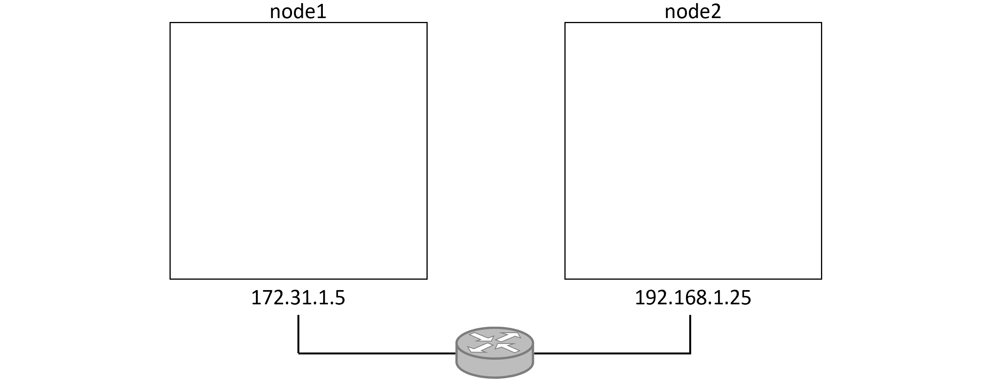
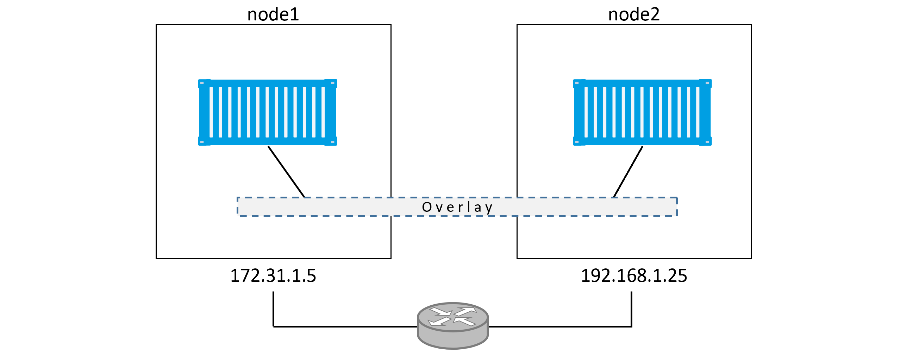
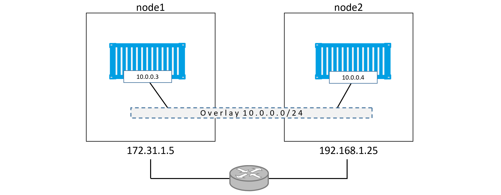
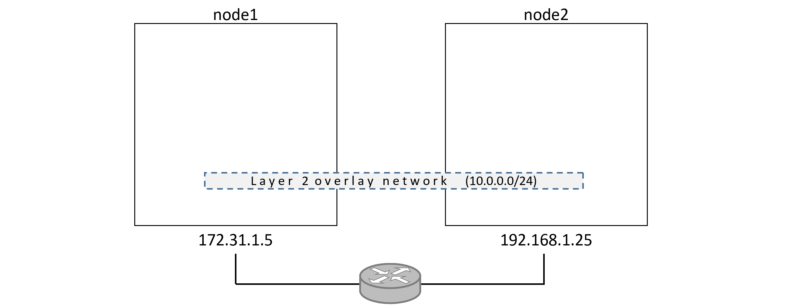
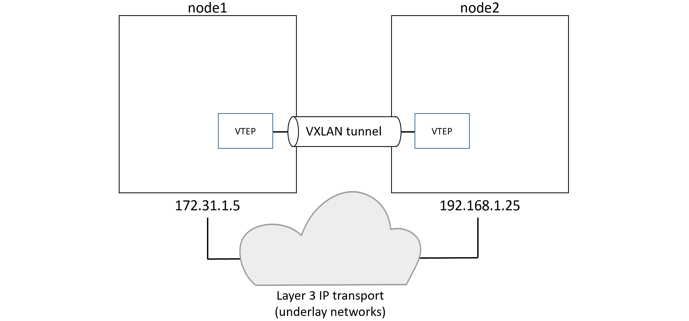
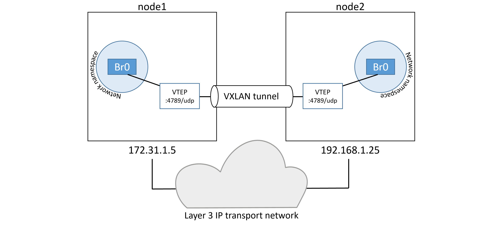
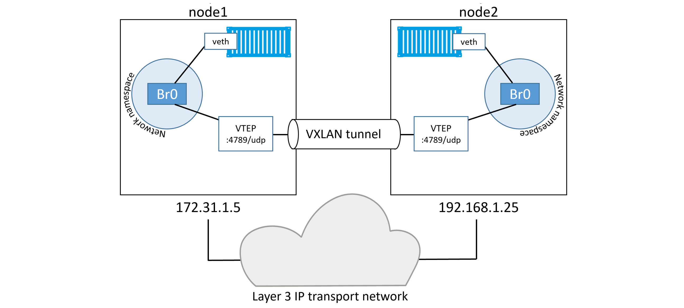
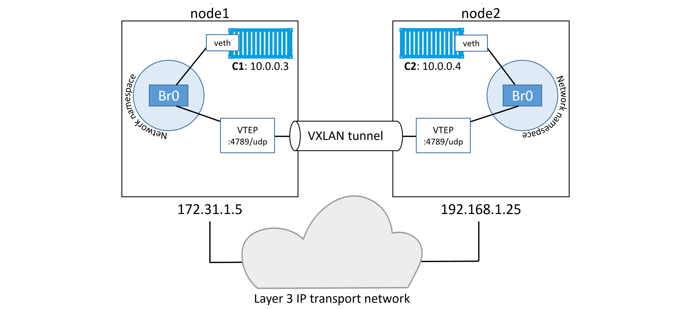

## 十二、Docker 覆盖网络

覆盖网络是许多云原生微服务应用的心脏。在本章中，我们将介绍本机 Docker 覆盖网络的基础知识。

Windows 上的 Docker 覆盖网络具有与 Linux 相同的功能。这意味着我们将在本章中使用的示例都将在 Linux 和 Windows 上工作。

我们将把这一章分成通常的三个部分:

*   TLDR
*   深潜
*   命令

让我们做一些网络魔术。

### Docker 覆盖网络-TLDR

在现实世界中，容器能够可靠、安全地相互通信至关重要，即使它们位于不同网络上的不同主机上。这就是叠加网络发挥作用的地方。它允许您创建跨越多台主机的平坦、安全的第 2 层网络。容器连接到这个，可以直接通信。

Docker 提供本地覆盖网络，默认情况下配置简单且安全。

在幕后，它建立在`libnetwork`和司机之上。`libnetwork`是容器网络模型(CNM)的规范实现，驱动程序是实现不同网络技术和拓扑的可插拔组件。Docker 提供本地驱动程序，包括`overlay`驱动程序。

### Docker 覆盖网络-深潜

2015 年 3 月，Docker，Inc .收购了一家名为 *Socket Plane* 的容器网络初创公司。收购背后的两个原因是将*真正的网络*带到 Docker，并使容器网络足够简单，甚至开发人员也可以做到。

他们在这两方面都做得太好了。

然而，隐藏在简单网络命令后面的是许多移动部件。在进行生产部署和尝试解决问题之前，您需要了解的内容。

本章的其余部分将分为两部分:

*   第 1 部分:我们将构建和测试一个 Docker 覆盖网络
*   第 2 部分:我们将解释使它工作的魔力

#### 在 Swarm 模式下构建和测试 Docker 覆盖网络

对于以下示例，我们将在两个独立的第 2 层网络上使用两台 Docker 主机，通过路由器连接。请参见图 12.1，并注意每个节点所在的不同网络。



Figure 12.1


您可以使用 Linux 或 Windows Docker 主机。Linux 应该至少有一个 4.4 Linux 内核(更新的总是更好的)，Windows 应该是安装了最新修补程序的 Windows Server 2016 或更高版本。你也可以在你的苹果电脑或视窗电脑上使用 Docker Desktop。但是，您不会看到全部好处，因为它们只支持单个 Docker 主机。

##### 建立一个群体

首先要做的是将两台主机配置成一个双节点群。这是因为群模式是覆盖网络的先决条件。

我们在**节点 1** 上运行`docker swarm init`命令使其成为*经理*，然后在**节点 2** 上运行`docker swarm join`命令使其成为*工人*。这不是生产级设置，但对于学习实验室来说已经足够了。我们鼓励你与更多的经理和员工一起进行测试，并扩展示例。

如果您在自己的实验室中进行实验，您需要根据您的环境用正确的值来交换 IP 地址等。

在**节点 1** 上运行以下命令。


```
$ docker swarm init \
  --advertise-addr=172.31.1.5 \
  --listen-addr=172.31.1.5:2377

Swarm initialized: current node (1ex3...o3px) is now a manager. 
```


 `在**节点 2** 上运行下一个命令。您需要确保在任何防火墙上都启用了以下端口:

*   `2377/tcp`用于管理平面通信
*   `7946/tcp`和`7946/udp`用于控制平面通信(基于 SWIM 的八卦)
*   `4789/udp`用于 VXLAN 数据平面


```
$ docker swarm join \
  --token SWMTKN-1-0hz2ec...2vye \
  172.31.1.5:2377
This node joined a swarm as a worker. 
```


 `我们现在有一个双节点 Swarm，其中**节点 1** 作为管理人员，**节点 2** 作为工作人员。

##### 创建新的覆盖网络

现在让我们创建一个新的*叠加网络*，称为**超级网络**。

从**节点 1** (管理器)运行以下命令。


```
$ docker network create -d overlay uber-net
c740ydi1lm89khn5kd52skrd9 
```


 `就这样。您刚刚创建了一个全新的覆盖网络，可供 Swarm 中的所有主机使用，并使用 TLS(GCM 模式下的 AES，密钥每 12 小时自动轮换一次)对其控制平面进行加密。如果要加密数据平面，只需在命令中添加`-o encrypted`标志即可。但是，由于性能开销，默认情况下不启用数据平面加密。强烈建议您在启用数据平面加密之前广泛测试性能。但是，如果您启用了它，它会在带有密钥轮换的 GCM 模式下受到相同的 AES 保护。

如果您不确定诸如*控制平面*和*数据平面*等术语，控制平面流量是集群管理流量，而数据平面流量是应用流量。默认情况下，Docker 覆盖网络加密集群管理流量，但不加密应用流量。您必须显式启用应用流量加密。

您可以使用`docker network ls`命令列出每个节点上的所有网络。


```
$ docker network ls
NETWORK ID      NAME              DRIVER     SCOPE
ddac4ff813b7    bridge            bridge     local
389a7e7e8607    docker_gwbridge   bridge     local
a09f7e6b2ac6    host              host       local
ehw16ycy980s    ingress           overlay    swarm
2b26c11d3469    none              null       local
c740ydi1lm89    uber-net          overlay    swarm 
```


 `在 Windows 服务器上，输出看起来更像这样:


```
NETWORK ID      NAME             DRIVER      SCOPE
8iltzv6sbtgc    ingress          overlay     swarm
6545b2a61b6f    nat              nat         local
96d0d737c2ee    none             null        local
nil5ouh44qco    uber-net         overlay     swarm 
```


 `新创建的网络位于名为**超网**的列表底部。其他网络是在安装 Docker 和集群初始化时自动创建的。

如果你在**节点 2** 上运行`docker network ls`命令，你会发现它看不到**超网**网络。这是因为新的覆盖网络仅在工作节点负责在其上运行容器时才扩展到工作节点。这种扩展覆盖网络的惰性方法通过减少网络闲言碎语来提高网络的可扩展性。

##### 将服务附加到覆盖网络

现在您有了一个覆盖网络，让我们创建一个新的 *Docker 服务*并将其连接到网络。该示例将创建带有两个副本(容器)的服务，一个在**节点 1** 上运行，另一个在**节点 2** 上运行。这将自动将**超网**覆盖扩展到**节点 2**

从**节点 1** 运行以下命令。

Linux 示例:


```
$ docker service create --name test \
   --network uber-net \
   --replicas 2 \
   ubuntu sleep infinity 
```


 `Windows 示例:


```
> docker service create --name test `
  --network uber-net `
  --replicas 2 `
  mcr.microsoft.com\powershell:nanoserver pwsh.exe -Command Start-Sleep 3600 
```


 `> **注意:**Windows 示例使用 backtick 字符将参数拆分为多行，使命令更具可读性。反斜杠是 PowerShell 如何转义换行。

该命令创建一个名为 **test** 的新服务，将其连接到 **uber-net** 覆盖网络，并基于所提供的映像创建两个副本(容器)。在这两个例子中，您向容器发出了睡眠命令，以保持它们运行并阻止它们退出。

因为我们正在运行两个副本(容器)，而 Swarm 有两个节点，所以将在每个节点上调度一个副本。

使用`docker service ps`命令验证操作。


```
$ docker service ps test
ID          NAME    IMAGE   NODE    DESIRED STATE  CURRENT STATE
77q...rkx   test.1  ubuntu  node1   Running        Running
97v...pa5   test.2  ubuntu  node2   Running        Running 
```


 `当 Swarm 在覆盖网络上启动一个容器时，它会自动将该网络扩展到运行该容器的节点。这意味着**超级网络**网络现在可以在**节点 2** 上看到。

不属于群组服务的独立容器不能连接到覆盖网络，除非它们具有`attachable=true`属性。以下命令可用于创建独立容器也可连接的可连接覆盖网络。


```
$ docker network create -d overlay --attachable uber-net 
```


 `恭喜你。您已经创建了一个新的覆盖网络，它跨越独立物理底层网络上的两个节点。你还在上面装了两个容器。那是多么容易啊！

#### 测试覆盖网络

让我们用 ping 命令测试覆盖网络。

如图 12.2 所示，我们在不同的网络上有两个 Docker 主机，一个覆盖网络横跨这两个网络。我们在每个节点上都有一个连接到覆盖网络的容器。让我们看看他们是否能互相 ping 通。



Figure 12.2


您可以通过按名称 ping 远程容器来运行测试。然而，示例将使用 IP 地址，因为它给了我们一个学习如何找到容器 IP 地址的借口。

运行`docker network inspect`查看分配给覆盖的子网和分配给`test`服务中两个容器的 IP 地址。


```
$ docker network inspect uber-net
[
    {
        "Name": "uber-net",
        "Id": "c740ydi1lm89khn5kd52skrd9",
        "Scope": "swarm",
        "Driver": "overlay",
        "EnableIPv6": false,
        "IPAM": {
            "Driver": "default",
            "Options": null,
            "Config": [
                {
                    "Subnet": "10.0.0.0/24",
                    "Gateway": "10.0.0.1"
                }
        "Containers": {
                "Name": "test.1.mfd1kn0qzgosu2f6bhfk5jc2p",
                "IPv4Address": "10.0.0.3/24",
                <Snip>
            },
                "Name": "test.2.m49f4psxp3daixlwfvy73v4j8",
                "IPv4Address": "10.0.0.4/24",
            },
<Snip> 
```


 `为了可读性，输出被大量删减，但是你可以看到它显示**超级网络**的子网是`10.0.0.0/24`。这与图 12.2 所示的两个物理底层网络都不匹配(`172.31.1.0/24`和`192.168.1.0/24`)。您还可以看到分配给这两个容器的 IP 地址。

在**节点 1** 和**节点 2** 上运行以下两个命令。这些将获得容器的标识，并从前面的命令中确认 IP 地址。确保在第二个命令中使用您自己实验室的容器标识。


```
$ docker container ls
CONTAINER ID   IMAGE           COMMAND           CREATED      STATUS     NAME
396c8b142a85   ubuntu:latest   "sleep infinity"  2 hours ago  Up 2 hrs   test.1.mfd...

$ docker container inspect \
  --format='{{range .NetworkSettings.Networks}}{{.IPAddress}}{{end}}' 396c8b142a85
10.0.0.3 
```


 `在两个节点上运行这些命令，以确认两个容器的 IP 地址。

图 12.3 显示了到目前为止的配置。在您的实验室中，子网和 IP 地址可能不同。



Figure 12.3


如您所见，有一个跨越两台主机的第 2 层覆盖网络，每个容器在这个覆盖网络上都有一个 IP 地址。这意味着**节点 1** 上的容器将能够使用其`10.0.0.4`地址 ping 通**节点 2** 上的容器。尽管两个*节点*位于不同的第 2 层底层网络上，但这种方法仍然有效。

我们来证明一下。

登录到**节点 1** 上的容器，ping 远程容器。

要在 Linux Ubuntu 容器上做到这一点，您需要安装`ping`实用程序。如果您正在遵循 Windows PowerShell 示例，则`ping`实用程序已经安装。

请记住，容器标识在您的环境中会有所不同。

Linux 示例:


```
$ docker container exec -it 396c8b142a85 bash

root@396c8b142a85:/# apt-get update && apt-get install iputils-ping -y
<Snip>
Reading package lists... Done
Building dependency tree
Reading state information... Done
<Snip>
Setting up iputils-ping (3:20190709-3) ...
Processing triggers for libc-bin (2.31-0ubuntu9) ...

root@396c8b142a85:/# ping 10.0.0.4
PING 10.0.0.4 (10.0.0.4) 56(84) bytes of data.
64 bytes from 10.0.0.4: icmp_seq=1 ttl=64 time=1.06 ms
64 bytes from 10.0.0.4: icmp_seq=2 ttl=64 time=1.07 ms
64 bytes from 10.0.0.4: icmp_seq=3 ttl=64 time=1.03 ms
64 bytes from 10.0.0.4: icmp_seq=4 ttl=64 time=1.26 ms
^C
root@396c8b142a85:/# 
```


 `Windows 示例:


```
> docker container exec -it 1a4f29e5a4b6 pwsh.exe
Windows PowerShell

PS C:\> ping 10.0.0.4
Pinging 10.0.0.4 with 32 bytes of data:
Reply from 10.0.0.4: bytes=32 time=1ms TTL=128
Reply from 10.0.0.4: bytes=32 time<1ms TTL=128
Reply from 10.0.0.4: bytes=32 time=2ms TTL=128
Reply from 10.0.0.4: bytes=32 time=2ms TTL=12
PS C:\> 
```


 `恭喜你。**节点 1** 上的容器可以通过覆盖网络 ping 通**节点 2** 上的容器。如果您创建了带有`-o encrypted`标志的网络，交换将被加密。

您还可以从容器中跟踪 ping 命令的路由。这将报告单跳，证明容器直接通过覆盖网络进行通信——幸运的是没有任何被穿越的底层网络。

> **注意:**您需要安装`traceroute`才能让 Linux 示例工作。

Linux 示例:


```
$ root@396c8b142a85:/# traceroute 10.0.0.4
traceroute to 10.0.0.4 (10.0.0.4), 30 hops max, 60 byte packets
 1  test-svc.2.97v...a5.uber-net (10.0.0.4)  1.110ms  1.034ms  1.073ms 
```


 `Windows 示例:


```
PS C:\> tracert 10.0.0.3

Tracing route to test.2.ttcpiv3p...7o4.uber-net [10.0.0.4]
over a maximum of 30 hops:

  1  <1 ms  <1 ms  <1 ms  test.2.ttcpiv3p...7o4.uber-net [10.0.0.4]

Trace complete. 
```


 `到目前为止，您已经用一个命令创建了一个覆盖网络。然后向其中添加容器。这些容器被安排在位于两个不同的第 2 层底层网络上的两台主机上。一旦你算出了容器的 IP 地址，你就证明了它们可以通过覆盖网络直接通信。

#### 这一切是如何运作的理论

现在，您已经看到了构建和使用安全覆盖网络是多么容易，让我们来看看它是如何在幕后组合在一起的。

本节中的一些细节将特定于 Linux。然而，同样的总体原则也适用于 Windows。

##### 主维信网络

首先，Docker 覆盖网络使用 VXLAN 隧道来创建虚拟的第 2 层覆盖网络。所以，在我们进一步讨论之前，让我们先快速了解一下 VXLAN 入门。

在最高级别，VXLANs 允许您在现有的第 3 层基础架构上创建虚拟的第 2 层网络。这是很多技术术语，意味着你可以创建一个简单的网络，将极其复杂的网络隐藏在下面。我们之前使用的示例在包含两个第 2 层网络(172.31.1.0/24 和 192.168.1.0/24)的第 3 层 IP 网络之上创建了一个新的 10.0.0.0/24 第 2 层网络。这如图 12.4 所示。



Figure 12.4


VXLAN 的美妙之处在于，它是一种封装技术，现有的路由器和网络基础设施只将其视为常规的 IP/UDP 数据包，可以毫无问题地进行处理。

为了创建虚拟的第 2 层覆盖网络，通过底层的第 3 层 IP 基础设施创建了一个 VXLAN *隧道*。您可能会听到术语*底层网络*用于指代底层第 3 层基础架构，即 Docker 主机所连接的网络。

VXLAN 隧道的每一端都由一个 VXLAN 隧道端点(VTEP)终止。正是这个 VTEP 完成了封装/解封装以及其他完成所有这些工作所需的魔法。参见图 12.5。



Figure 12.5


##### 浏览我们的双容器示例

在前面的示例中，您有两台通过 IP 网络连接的主机。每个主机运行一个容器，您为容器创建了一个 VXLAN 覆盖网络。

为此，在每台主机上创建了一个新的*沙箱*(网络命名空间)。如前一章所述，*沙盒*就像一个容器，但它不是运行一个应用，而是运行一个隔离的网络栈——一个与主机本身的网络栈隔离的沙盒。

在沙箱内创建了一个名为 **Br0** 的虚拟交换机(也称为虚拟桥)。还创建了一个 VTEP，其一端垂直于 **Br0** 虚拟交换机，另一端垂直于主机网络栈(VTEP)。主机网络栈中的一端获得主机连接到的底层网络上的一个 IP 地址，并绑定到端口 4789 上的一个 UDP 套接字。每台主机上的两个虚拟磁带库通过 VXLAN 隧道创建覆盖，如图 12.6 所示。



Figure 12.6


此时，VXLAN 覆盖已创建并准备使用。

然后，每个容器获得自己的虚拟以太网(T0)适配器，该适配器也连接到本地 **Br0** 虚拟交换机。拓扑现在看起来像图 12.7，应该更容易看到这两个容器如何通过 VXLAN 覆盖网络进行通信，尽管它们的主机位于两个独立的网络上。



Figure 12.7


##### 通信示例

现在我们已经看到了主要的管道元件，让我们看看这两个容器是如何通信的。

> **警告！**这一部分变得相当技术性，您没有必要了解日常操作的所有这些细节。

对于这个例子，我们将把节点 1 上的容器称为“C1”**，节点 2 上的容器称为“T2”【C2】。让我们假设 **C1** 想要 ping **C2** ，就像我们在本章前面的实例中所做的那样。**

 **

Figure 12.8


**C1** 创建 ping 请求，并将目的 IP 地址设置为 **C2** 的`10.0.0.4`地址。它通过连接到 **Br0** 虚拟交换机的`veth`接口发送流量。虚拟交换机不知道将数据包发送到哪里，因为它的媒体访问控制地址表(ARP 表)中没有对应于目的 IP 地址的条目。因此，它会将数据包泛洪到所有端口。VTEP 接口连接到 **Br0** 知道如何转发帧，因此用自己的媒体访问控制地址进行响应。这是*代理 ARP* 的回复，导致 **Br0** 开关*学习*如何转发数据包。因此， **Br0** 更新其 ARP 表，将 10.0.0.4 映射到本地 VTEP 的 MAC 地址。

现在 **Br0** 交换机已经*学习了*如何将流量转发到 **C2** ，所有未来发往 **C2** 的数据包将直接传输到本地 VTEP 接口。VTEP 接口知道 **C2** ，因为所有新启动的容器都使用网络内置的八卦协议将它们的网络详细信息传播到群中的其他节点。

数据包被发送到 VTEP 接口，该接口封装帧，以便通过底层传输基础设施发送。在相当高的层次上，这种封装包括向单个以太网帧添加一个 VXLAN 报头。VXLAN 报头包含 VXLAN 网络标识(VNID)，用于将帧从 VLAN 映射到 VXLAN，反之亦然。每个 VLAN 都映射到一个虚拟网络标识，这样数据包就可以在接收端解封装并转发到正确的 VLAN。这保持了网络隔离。

封装还将帧封装在一个 UDP 数据包中，在*目的 IP 字段*中包含节点 2 上远程 VTEP 的 IP 地址，以及 UDP 端口 4789 套接字信息。这种封装允许数据通过底层网络发送，而底层网络不必知道任何关于 VXLAN 的信息。

当数据包到达节点 2 时，内核会发现它是发往 UDP 端口 4789 的。内核也知道它有一个绑定到这个套接字的 VTEP 接口。因此，它将数据包发送到 VTEP，后者读取虚拟网络标识，对数据包进行解封装，并将其发送到 VLAN 上与虚拟网络标识对应的本地 **Br0** 交换机。从那里，它被运送到容器 C2。

女士们，先生们，这就是本地 Docker 覆盖网络如何利用 VXLAN 技术的。

希望这足以让您开始任何潜在的生产 Docker 部署。它还应该为您提供与您的网络团队讨论 Docker 基础架构的网络方面所需的知识。关于与你的网络团队交谈的话题……我建议你不要认为你现在对 VXLAN 了如指掌。如果你这样做，你可能会让自己难堪；-)

最后一件事。Docker 还支持同一覆盖网络中的第 3 层路由。例如，您可以创建一个包含两个子网的覆盖网络，Docker 将负责它们之间的路由。创建这样一个网络的命令可能是`docker network create --subnet=10.1.1.0/24 --subnet=11.1.1.0/24 -d overlay prod-net`。这将导致在*沙箱*内创建两个虚拟交换机 **Br0** 和 **Br1** ，并且默认情况下会发生路由。

### 覆盖网络-命令

*   `docker network create`是我们用来创建新容器网络的命令。`-d`标志让你指定要使用的驱动，最常见的驱动是`overlay`驱动。您也可以从第三方指定*远程*驾驶员。对于覆盖网络，默认情况下控制平面是加密的。只需添加`-o encrypted`标志来加密数据平面(可能会产生性能开销)。
*   `docker network ls`列出 Docker 主机可见的所有容器网络。运行在*集群模式*下的 Docker 主机只有在托管连接到特定网络的容器时才会看到覆盖网络。这使得与网络相关的流言蜚语降至最低。
*   `docker network inspect`显示特定容器网络的详细信息。这包括*范围*、*驱动程序*、 *IPv4* 和 *IPv4* 信息、*子网配置*、*已连接容器的 IP 地址*、 *VXLAN 网络 ID* 、*加密状态*。
*   `docker network rm`删除网络

### 章节总结

在本章中，我们看到了使用`docker network create`命令创建新的 Docker 覆盖网络是多么容易。然后，我们学习了如何使用 VXLAN 技术在幕后将它们组合在一起。

我们只触及了 Docker 覆盖网络的表面。**```````````````