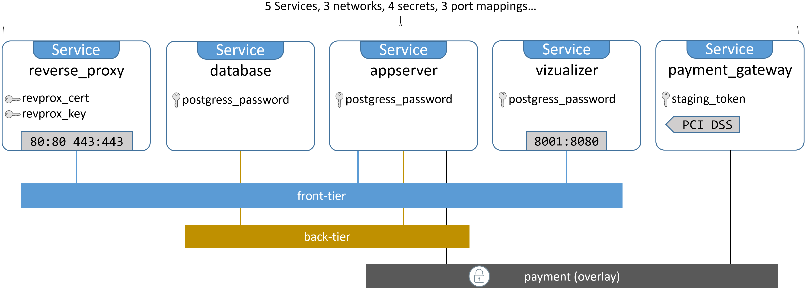
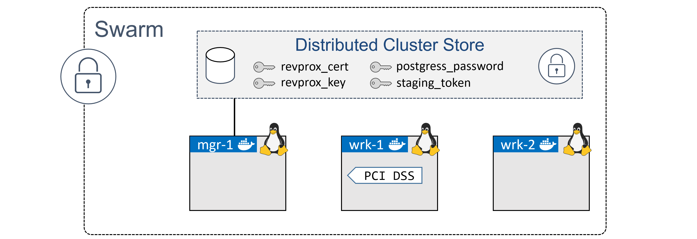

## 14:使用 Docker 堆栈部署应用程序

大规模部署和管理包含大量小型集成服务的云原生微服务应用程序非常困难。

幸运的是，Docker Stacks 在这里提供帮助。它们通过提供以下功能简化了应用程序管理:*想要的状态，滚动更新，简单，缩放操作，健康检查，*等等！都被包装在一个很好的声明模型中。很喜欢！

不要担心如果这些流行语对你来说是新的或者听起来很复杂，你会在这一章结束时理解它们。

我们将把这一章分成通常的三个部分:

*   TLDR
*   深潜
*   命令

### 使用 Docker Stacks 部署应用程序-TLDR

在笔记本电脑上测试和部署简单的应用程序很容易，但那是业余爱好者的事。在真实的生产环境中部署和管理多服务应用程序……这是为专业人士准备的！

幸好书库在这里帮忙！。它们允许您在一个声明性文件中定义复杂的多服务应用程序。它们还提供了一种部署应用程序并管理其整个生命周期的简单方法—初始部署>运行状况检查>扩展>更新>回滚等等！

过程很简单。在*合成文件*中定义应用的期望状态，然后使用`docker stack`命令部署和管理它。就这样。

撰写文件包括组成应用程序的整个微服务堆栈。它还包括应用程序所需的所有卷、网络、机密和其他基础设施。`docker stack deploy`命令用于从单个文件部署整个应用程序。很简单。

为了实现所有这些，堆栈建立在 Docker Swarm 之上，这意味着您可以获得 Swarm 附带的所有安全性和高级功能。

简而言之，Docker 非常适合应用程序开发和测试。Docker Stacks 非常适合规模化生产。

### 使用 Docker Stacks 部署应用程序-深度潜水

如果你知道 Docker Compose，你会发现 Docker Stacks 真的很容易。事实上，在许多方面，堆栈都是我们一直希望 Compose 做到的——完全集成到 Docker 中，并且能够管理应用程序的整个生命周期。

从体系结构上讲，堆栈位于 Docker 应用程序层次结构的顶部。它们建立在*服务*之上，而服务又建立在容器之上。

我们将本章的这一部分划分如下:

*   示例应用程序概述
*   仔细查看堆栈文件
*   部署应用程序
*   管理应用程序

#### 示例应用程序概述

在本章的剩余部分，我们将使用流行的 **AtSea Shop** 演示应用程序。它位于 [GitHub](https://github.com/dockersamples/atsea-sample-shop-app) 上，在 [Apache 2.0 许可](https://github.com/dockersamples/atsea-sample-shop-app/blob/master/LICENSE)下开源。

我们正在使用这个应用程序，因为它适度复杂，不会大到无法在书中列出和描述。在封面之下，是一个利用证书和秘密的云原生微服务应用程序。高级应用程序架构如图 14.1 所示。



Figure 14.1 AtSea Shop high level architecture


如您所见，它包括 5 个*服务*，3 个网络，4 个秘密和 3 个端口映射。当我们检查堆栈文件时，我们将详细看到这些。

> **注意:**在本章中提到*服务*时，我们指的是 Docker 服务对象，它是一个或多个相同的容器，在集群集群中作为单个对象进行管理。

克隆应用程序的 GitHub repo，以便在本地机器上拥有所有的应用程序源文件。


```
$ git clone https://github.com/dockersamples/atsea-sample-shop-app.git
Cloning into 'atsea-sample-shop-app'...
remote: Enumerating objects: 30, done.
remote: Counting objects: 100% (30/30), done.
remote: Compressing objects: 100% (30/30), done.
remote: Total 672 (delta 20), reused 0 (delta 0), pack-reused 642
Receiving objects: 100% (672/672), 7.29 MiB | 1.46 MiB/s, done.
Resolving deltas: 100% (217/217), done. 
```


 `该应用程序由几个目录和源文件组成。尽情探索吧。然而，我们将关注定义应用及其需求的`docker-stack.yml`文件。我们称之为*堆栈文件*。

在最高级别，它定义了 4 个顶级键。


```
version:
services:
networks:
secrets: 
```


 `**版本**表示撰写文件格式的版本。这必须是 3.0 或更高版本才能使用堆栈。**服务**是您定义组成应用程序的服务堆栈的地方。**网络**列出需要的网络，**秘密**定义应用使用的秘密。

如果您展开每个顶级键，您将看到事情如何映射到图 14.1。堆栈文件有五个服务，分别叫做“reverse_proxy”、“database”、“appserver”、“visualizer”和“payment_gateway”。图 14.1 也是如此。堆栈文件有三个网络，称为“前端层”、“后端层”和“支付”。图 14.1 也是如此。最后，堆栈文件有四个秘密，称为“postgres_password”、“staging_token”、“revprox_key”和“revprox_cert”。图 14.1 也是如此。


```
version: "3.2"
services:
    reverse_proxy:
    database:
    appserver:
    visualizer:
    payment_gateway:
networks:
    front-tier:
    back-tier:
    payment:
secrets:
    postgres_password:
    staging_token:
    revprox_key:
    revprox_cert: 
```


 `重要的是要理解堆栈文件捕获并定义了整个应用程序的许多需求。因此，它是自我记录的，也是弥合开发和运营之间差距的一个很好的工具。

让我们仔细看看堆栈文件的每个部分。

#### 仔细查看堆栈文件

堆栈文件与合成文件非常相似。唯一的要求是`version:`键指定“3.0”或更高的值。请参阅 Docker 文档中的[，了解有关撰写文件版本以及与您的 Docker 版本的兼容性的最新信息。](https://docs.docker.com/compose/compose-file/)

Docker 从堆栈文件部署应用程序时首先要做的一件事是创建任何列在`networks`键下的所需网络。如果网络还不存在，Docker 会创建它们。

让我们看看堆栈文件中定义的网络。

##### 网络


```
networks:
  front-tier:
  back-tier:
  payment:
    driver: overlay
    driver_opts:
      encrypted: 'yes' 
```


 `堆栈文件描述了三个网络；`front-tier`、`back-tier`和`payment`。默认情况下，它们都将由`overlay`驱动程序创建为覆盖网络。但是`payment`网络是特殊的——它需要一个加密的数据平面。

如覆盖网络一章所述，默认情况下，所有覆盖网络的控制平面都是加密的，但您必须显式加密数据平面。控制平面用于网络管理流量，数据平面用于应用流量。加密数据平面有潜在的性能开销。

要加密数据平面，您有两种选择:

*   将`-o encrypted`标志传递给`docker network create`命令。
*   在堆栈文件中的`driver_opts`下指定`encrypted: 'yes'`。

加密数据平面产生的开销取决于各种因素，如流量类型和流量流量。您应该执行广泛的测试，以了解加密数据平面流量对工作负载的性能开销。这一比例约为 10%并不罕见。

如前所述，所有三个网络都将在秘密和服务之前创建。

让我们看看秘密。

##### 秘密

秘密被定义为顶级对象，我们使用的堆栈文件定义了四个:


```
secrets:
  postgres_password:
    external: true
  staging_token:
    external: true
  revprox_key:
    external: true
  revprox_cert:
    external: true 
```


 `注意，这四个都被定义为`external`。这意味着在部署堆栈之前，它们必须已经存在。

部署应用程序时，可以按需创建秘密——只需将`external: true`替换为`file: <filename>`。但是，要做到这一点，主机的文件系统上必须已经存在一个包含未加密的秘密值的明文文件。这有明显的安全隐患。

当我们开始部署应用程序时，我们将看到如何创建这些秘密。目前，知道应用程序定义了四个需要预先创建的秘密就足够了。

让我们看看每一项服务。

##### 服务

服务是大多数行为发生的地方。

每个服务都是包含一堆键的 JSON 集合(字典)。我们将逐一介绍，并解释每个选项的作用。

###### 反向代理服务

如您所见，`reverse_proxy`服务定义了图像、端口、秘密和网络。


```
reverse_proxy:
  image: dockersamples/atseasampleshopapp_reverse_proxy
  ports:
    - "80:80"
    - "443:443"
  secrets:
    - source: revprox_cert
      target: revprox_cert
    - source: revprox_key
      target: revprox_key
  networks:
    - front-tier 
```


 `图像密钥是服务对象中唯一的强制密钥。顾名思义，它定义了将用于构建服务副本的 Docker 映像。请记住，服务是一个或多个相同的容器。

Docker 是固执己见的，所以除非您另外指定，否则**图像**将从 Docker Hub 中拉出。您可以通过在图像名称前面加上注册表的应用编程接口端点的域名来指定来自第三方注册表的图像，例如谷歌容器注册表的`gcr.io`。

Docker Stacks 和 Docker Compose 之间的一个区别是堆栈不支持**构建**。这意味着必须在部署堆栈之前构建所有映像。

**端口**键定义了两个映射:

*   `80:80`将群中的端口 80 映射到每个服务副本上的端口 80。
*   `443:443`将 Swarm 中的端口 443 映射到每个服务副本上的端口 443。

默认情况下，所有端口都使用*入口模式*进行映射。这意味着它们将被映射，并且可以从群集中的每个节点访问，甚至是没有运行副本的节点。另一种选择是*主机模式*，其中端口仅映射到运行服务副本的群节点上。但是，*主机模式*要求您使用长格式语法。例如，使用长格式语法在*主机模式*下映射端口 80 如下所示:


```
ports:
  - target: 80
    published: 80
    mode: host 
```


 `推荐使用长格式语法，因为它更容易阅读，功能更强大(支持入口模式**和**主机模式)。但是，它至少需要 3.2 版的合成文件格式。

**秘密**键定义了两个秘密— `revprox_cert`和`revprox_key`。这些秘密必须已经存在于群中，并且必须在堆栈文件的顶层`secrets`部分定义。

机密作为常规文件装载到服务副本中。该文件的名称将是您在堆栈文件中指定为`target`值的任何名称，并且该文件将出现在 Linux 上的`/run/secrets`和 Windows 上的`C:\ProgramData\Docker\secrets`下的副本中。Linux 将`/run/secrets`装载为内存文件系统，但 Windows 没有。

本服务中定义的秘密将作为`/run/secrets/revprox_cert`和`/run/secrets/revprox_key`装载在每个服务副本中。要将其中一个挂载为`/run/secrets/uber_secret`，可以在堆栈文件中定义如下:


```
secrets:
  - source: revprox_cert
    target: uber_secret 
```


 `**网络**密钥确保服务的所有副本都将连接到`front-tier`网络。这里指定的网络必须在`networks`顶级密钥中定义，如果还不存在，Docker 会将其创建为覆盖。

###### 数据库服务

数据库服务还定义了:图像、网络和秘密。除此之外，它还引入了环境变量和放置约束。


```
database:
  image: dockersamples/atsea_db
  environment:
    POSTGRES_USER: gordonuser
    POSTGRES_DB_PASSWORD_FILE: /run/secrets/postgres_password
    POSTGRES_DB: atsea
  networks:
    - back-tier
  secrets:
    - postgres_password
  deploy:
    placement:
      constraints:
        - 'node.role == worker' 
```


 `**环境**键允许您在运行时将环境变量注入服务副本。该服务使用三个环境变量来定义数据库用户、数据库密码的位置(安装在每个服务副本中的密码)和数据库的名称。


```
environment:
  POSTGRES_USER: gordonuser
  POSTGRES_DB_PASSWORD_FILE: /run/secrets/postgres_password
  POSTGRES_DB: atsea 
```


 `更好、更安全的解决方案是将这三个值都作为机密传入，因为这样可以避免用明文变量记录数据库名称和数据库用户。

该服务还在`deploy`键下定义了*放置约束*。这确保了该服务的副本将始终在 Swarm *工作节点*上运行。


```
deploy:
  placement:
    constraints:
      - 'node.role == worker' 
```


 `布局约束是影响调度决策的一个很好的方式。Swarm 目前允许您针对以下所有内容进行计划:

*   节点标识。`node.id == o2p4kw2uuw2a`
*   节点名。`node.hostname == wrk-12`
*   角色。`node.role != manager`
*   发动机标签。`engine.labels.operatingsystem==ubuntu 16.04`
*   自定义节点标签。`node.labels.zone == prod1`

注意`==`和`!=`都是支持的。

###### appserver 服务

`appserver`服务使用一个图像，连接到三个网络，并安装一个秘密。它还在`deploy`键下引入了几个附加功能。


```
appserver:
  image: dockersamples/atsea_app
  networks:
    - front-tier
    - back-tier
    - payment
  deploy:
    replicas: 2
    update_config:
      parallelism: 2
      failure_action: rollback
    placement:
      constraints:
        - 'node.role == worker'
    restart_policy:
      condition: on-failure
      delay: 5s
      max_attempts: 3
      window: 120s
  secrets:
    - postgres_password 
```


 `让我们仔细看看`deploy`键下的新东西。

首先，`services.appserver.deploy.replicas = 2`将服务的副本数量设置为 2。如果省略，默认值为 1。

如果您需要在部署服务后更改副本的数量，您应该声明性地这样做。这意味着用新值更新堆栈文件中的`services.appserver.deploy.replicas`字段，然后重新部署堆栈。我们稍后会看到这一点，但是重新部署堆栈不会影响您尚未更改的服务。

`services.appserver.deploy.update_config`告诉 Docker 在更新服务时如何行动。对于此服务，Docker 将一次更新两个副本(`parallelism`)，如果检测到更新失败，将执行“回滚”。回滚将根据服务的先前定义启动新的副本。`failure_action`的默认值是`pause`，这将停止更新更多副本。另一个选择是`continue`。


```
update_config:
  parallelism: 2
  failure_action: rollback 
```


 `您可以指定其他选项作为`update_config`的一部分。其中包括插入一个`delay`、一个故障`monitor`周期，并控制`order`在终止旧副本之前启动更新副本，反之亦然。

`services.appserver.deploy.restart-policy`对象告诉 Swarm 如何在副本(容器)失败时重启它们。如果复制副本以非零退出代码(`condition: on-failure`)停止，则此服务的策略将重新启动复制副本。它将尝试重新启动失败的副本 3 次，并等待 120 秒来决定重新启动是否有效。它将在三次重启尝试之间等待 5 秒钟。


```
restart_policy:
  condition: on-failure
  delay: 5s
  max_attempts: 3
  window: 120s 
```


 `###### 视觉型的人

可视化工具服务引用图像、映射端口、定义更新配置和定义放置约束。它还安装了一个卷，并为容器停止操作定义了自定义宽限期。


```
visualizer:
  image: dockersamples/visualizer:stable
  ports:
    - "8001:8080"
  stop_grace_period: 1m30s
  volumes:
    - "/var/run/docker.sock:/var/run/docker.sock"
  deploy:
    update_config:
      failure_action: rollback
    placement:
      constraints:
        - 'node.role == manager' 
```


 `当 Docker 停止一个容器时，它向容器内 PID 为 1 的应用程序进程发出`SIGTERM`。然后，应用程序有 10 秒的宽限期来执行任何清理操作。如果不处理信号，10 秒后用`SIGKILL`强行终止。`stop_grace_period`房产优先于这 10 秒的宽限期。

`volumes`键用于将预先创建的卷和主机目录装载到服务复制副本中。在这种情况下，它从 Docker 主机将`/var/run/docker.sock`装载到每个服务副本的`/var/run/docker.sock`中。这意味着对复制副本中`/var/run/docker.sock`的任何读写都将传递到主机中的同一目录。

`/var/run/docker.sock`恰好是 Docker 守护程序公开其所有 API 端点的 IPC 套接字。这意味着给予容器对它的访问权限，使容器能够向 Docker 守护程序发出命令。这有很大的安全隐患，不建议在现实世界中使用。幸运的是，这只是一个实验室环境中的演示应用程序。

该服务需要访问 Docker 守护程序的原因是因为它提供了 Swarm 上服务的图形表示。为此，它需要能够查询管理器节点上的 Docker 守护程序。为了实现这一点，放置约束将所有服务副本强制放在管理器节点上，Docker 套接字绑定到每个服务副本中。

###### 支付网关

`payment_gateway`服务指定一个映像，安装一个秘密，连接到一个网络，定义一个部分部署策略，然后强加一些放置约束。


```
payment_gateway:
  image: dockersamples/atseasampleshopapp_payment_gateway
  secrets:
    - source: staging_token
      target: payment_token
  networks:
    - payment
  deploy:
    update_config:
      failure_action: rollback
    placement:
      constraints:
        - 'node.role == worker'
        - 'node.labels.pcidss == yes' 
```


 `除了放置约束中的`node.label`之外，我们以前见过所有这些选项。节点标签是通过`docker node update`命令添加到群集节点的自定义标签。因此，它们只适用于 Swarm 中节点角色的上下文(您不能在独立容器上或 Swarm 之外利用它们)。

在这个例子中，`payment_gateway`服务执行的操作要求它在一个已经强化到 PCI DSS 标准的群节点上运行。为此，您可以将自定义*节点标签*应用于满足这些要求的任何群节点。我们将在构建实验室以部署应用程序时这样做。

由于此服务定义了两个放置约束，副本将仅部署到两者都匹配的节点。即带有`pcidss=yes`节点标签的**工人**节点。

现在我们已经完成了对堆栈文件的检查，您应该已经很好地理解了应用程序的需求。如前所述，堆栈文件是一个很好的应用程序文档。我们知道该应用程序有 5 项服务、3 个网络和 4 个秘密。我们知道哪些服务连接到哪些网络，哪些端口需要发布，哪些映像是必需的，我们甚至知道有些服务需要在特定的节点上运行。

让我们部署它。

#### 部署应用程序

在部署应用程序之前，有几个先决条件需要注意:

*   **Swarm 模式:**我们将应用部署为 Docker Stack，而 Stack 需要 Swarm 模式。
*   **标签:**其中一个 Swarm 工作节点需要自定义节点标签。
*   **秘密:**该应用使用需要预先创建的秘密，然后才能部署。

##### 为示例应用程序构建实验室

在本节中，我们将构建一个三节点的基于 Linux 的 Swarm 集群，满足应用程序的所有先决条件。一旦我们完成了，实验室就会变成这样。



Figure 14.2 Sample lab


我们将完成以下三个步骤:

*   创建新的群
*   添加节点标签
*   创造秘密

让我们创建一个新的三节点 Swarm 集群。

1.  Initialize a new Swarm.

    在要成为群管理器的节点上运行以下命令。

    

    ```
     $ docker swarm init
     Swarm initialized: current node (lhma...w4nn) is now a manager.
     <Snip> 
    ```

    

`*   Add worker nodes.

    复制上一条命令输出中显示的`docker swarm join`命令。将其粘贴到要作为工作人员加入的两个节点中。

    

    ```
     //Worker 1 (wrk-1)
     wrk-1$ docker swarm join --token SWMTKN-1-2hl6...-...3lqg 172.31.40.192:2377
     This node joined a swarm as a worker.

     //Worker 2 (wrk-2)
     wrk-2$ docker swarm join --token SWMTKN-1-2hl6...-...3lqg 172.31.40.192:2377
     This node joined a swarm as a worker. 
    ```

    

    `*   Verify that the Swarm is configured with one manager and two workers.

    从管理器节点运行此命令。

    

    ```
     $ docker node ls
     ID            HOSTNAME   STATUS     AVAILABILITY    MANAGER STATUS
     lhm...4nn *   mgr-1      Ready      Active          Leader
     b74...gz3     wrk-1      Ready      Active
     o9x...um8     wrk-2      Ready      Active 
    ```

    `` 

 ```蜂群现在准备好了。

`payment_gateway`服务有一组放置约束，强制其只在带有`pcidss=yes`节点标签的**工作节点**上运行。在这一步中，我们将把节点标签添加到`wrk-1`中。

在现实世界中，在标记它之前，您应该将至少一个 Docker 节点强化到 PCI 标准。然而，这只是一个实验室，所以我们将跳过硬化步骤，只需将标签添加到`wrk-1`。

从 Swarm 管理器运行以下命令。

1.  Add the node label to `wrk-1`.

    

    ```
     $ docker node update --label-add pcidss=yes wrk-1
     wrk-1 
    ```

    

     `节点标签仅适用于群内。` 
`*   验证节点标签。

    

    ```
     $ docker node inspect wrk-1
     [
     {
         "ID": "b74rzajmrimfv7hood6l4lgz3",
         "Version": {
             "Index": 27
         },
         "CreatedAt": "2020-05-04T12:06:18.221580486Z",
         "UpdatedAt": "2020-05-04T12:08:17.335295528Z",
         "Spec": {
             "Labels": {
                 "pcidss": "yes"
             },
             <Snip> 
    ```

    ` 

 ```wrk-1`工作节点现在已经配置好，可以为`payment_gateway`服务运行副本。

该应用程序定义了四个秘密，所有这些秘密都需要在部署应用程序之前创建:

*   `postgress_password`
*   `staging_token`
*   `revprox_cert`
*   `revprox_key`

从管理器节点运行以下命令来创建它们。

1.  Create a new key pair.

    其中三个秘密将被加密密钥填充。我们将在这一步中创建密钥，然后在接下来的步骤中将它们放入 Docker 机密中。

    

    ```
     $ openssl req -newkey rsa:4096 -nodes -sha256 \
       -keyout domain.key -x509 -days 365 -out domain.crt 
    ```

    

     `在您当前的目录中将有两个新文件。我们将在下一步中使用它们。` 
`*   创造`revprox_cert`、`revprox_key`和`postgress_password`的秘密。

    

    ```
     $ docker secret create revprox_cert domain.crt
     cqblzfpyv5cxb5wbvtrbpvrrj

     $ docker secret create revprox_key domain.key
     jqd1ramk2x7g0s2e9ynhdyl4p

     $ docker secret create postgres_password domain.key
     njpdklhjcg8noy64aileyod6l 
    ```

    

    `*   创造`staging_token`秘密。

    

    ```
     $ echo staging | docker secret create staging_token -
     sqy21qep9w17h04k3600o6qsj 
    ```

    

    `*   列出秘密。

    

    ```
     $ docker secret ls
     ID          NAME                DRIVER    CREATED              UPDATED
     njp...d6l   postgres_password             47 seconds ago       47 seconds ago
     cqb...rrj   revprox_cert                  About a minute ago   About a minute ago
     jqd...l4p   revprox_key                   About a minute ago   About a minute ago
     sqy...qsj   staging_token                 23 seconds ago       23 seconds ago 
    ```

    ``` 

 ```这是所有的先决条件。该部署应用了！

##### 部署示例应用程序

如果你还没有这样做，克隆应用的 GitHub 回购到你的 Swarm 管理器。


```
$ git clone https://github.com/dockersamples/atsea-sample-shop-app.git
Cloning into 'atsea-sample-shop-app'...
remote: Enumerating objects: 30, done.
remote: Counting objects: 100% (30/30), done.
remote: Compressing objects: 100% (30/30), done.
remote: Total 672 (delta 20), reused 0 (delta 0), pack-reused 642
Receiving objects: 100% (672/672), 7.29 MiB | 33.19 MiB/s, done.
Resolving deltas: 100% (217/217), done.

$ cd atsea-sample-shop-app 
```


 `现在您已经有了代码，可以部署应用程序了。

使用`docker stack deploy`命令部署堆栈。在其基本形式中，它接受两个参数:

*   堆栈文件的名称
*   堆栈的名称

该应用程序的 GitHub 存储库包含一个名为`docker-stack.yml`的堆栈文件，因此我们将使用它作为堆栈文件。我们将堆栈称为`seastack`，尽管如果您不喜欢，可以选择不同的名称。

在 Swarm 管理器的`atsea-sample-shop-app`目录中运行以下命令。

部署堆栈(应用程序)。


```
$ docker stack deploy -c docker-stack.yml seastack
Creating network seastack_default
Creating network seastack_back-tier
Creating network seastack_front-tier
Creating network seastack_payment
Creating service seastack_database
Creating service seastack_appserver
Creating service seastack_visualizer
Creating service seastack_payment_gateway
Creating service seastack_reverse_proxy 
```


 `您可以运行`docker network ls`和`docker service ls`命令来查看作为应用程序一部分部署的网络和服务。

从命令输出中需要注意的几件事。

网络是在服务出现之前创建的。这是因为服务连接到网络，因此需要先创建网络，然后才能启动。

Docker 在其创建的每个资源前添加堆栈的名称。在我们的示例中，堆栈被称为`seastack`，这意味着所有资源都被命名为`seastack_<resource>`。例如，`payment`网络被称为`seastack_payment`。部署前创建的资源(如机密)不会被重命名。

另外需要注意的是一个名为`seastack_default`的网络的存在。这在堆栈文件中没有定义，那么为什么要创建它呢？每个服务都需要连接到一个网络，但是`visualizer`服务没有指定一个。因此，Docker 创建了一个名为`seastack_default`的网站，并将其附在上面。您可以通过运行`docker network inspect seastack_default`命令来验证这一点。

您可以使用几个命令来验证堆栈的状态。`docker stack ls`列出系统上的所有栈，包括它们有多少服务。`docker stack ps <stack-name>`给出特定堆栈的更详细信息，如*期望状态*和*当前状态*。让我们看看他们俩。


```
$ docker stack ls
NAME                SERVICES       ORCHESTRATOR
seastack            5              Swarm

$ docker stack ps seastack
NAME                          NODE     DESIRED STATE    CURRENT STATE
seastack_reverse_proxy.1      wrk-2    Running          Running 7 minutes ago
seastack_payment_gateway.1    wrk-1    Running          Running 7 minutes ago
seastack_visualizer.1         mgr-1    Running          Running 7 minutes ago
seastack_appserver.1          wrk-2    Running          Running 7 minutes ago
seastack_database.1           wrk-2    Running          Running 7 minutes ago
seastack_appserver.2          wrk-1    Running          Running 7 minutes ago 
```


 `当对无法启动的服务进行故障排除时，`docker stack ps`命令是一个很好的开始位置。它概述了堆栈中的每个服务，包括每个副本计划在哪个节点上、当前状态、所需状态和错误消息。以下输出显示了在`wrk-2`节点上为`reverse_proxy`服务启动副本的两次失败尝试。


```
$ docker stack ps seastack
NAME                NODE     DESIRED      CURRENT  ERROR
                             STATE        STATE
reverse_proxy.1     wrk-2    Shutdown     Failed   "task: non-zero exit (1)"
\_reverse_proxy.1   wrk-2    Shutdown     Failed   "task: non-zero exit (1)" 
```


 `要了解特定服务的更多详细日志，您可以使用`docker service logs`命令。您可以将服务名称/标识或副本标识传递给它。如果您将服务名称或 ID 传递给它，您将获得所有服务副本的日志。如果您向它传递一个特定的副本标识，您将只能获得该副本的日志。

以下`docker service logs`命令显示了`seastack_reverse_proxy`服务中所有副本的日志，这些副本在之前的输出中有两个失败的副本。


```
$ docker service logs seastack_reverse_proxy
seastack_reverse_proxy.1.zhc3cjeti9d4@wrk-2 | [emerg] 1#1: host not found...
seastack_reverse_proxy.1.6m1nmbzmwh2d@wrk-2 | [emerg] 1#1: host not found...
seastack_reverse_proxy.1.6m1nmbzmwh2d@wrk-2 | nginx: [emerg] host not found..
seastack_reverse_proxy.1.zhc3cjeti9d4@wrk-2 | nginx: [emerg] host not found..
seastack_reverse_proxy.1.1tmya243m5um@mgr-1 | 10.255.0.2 "GET / HTTP/1.1" 302 
```


 `输出被修剪以适合页面，但是您可以看到显示了来自所有三个服务副本的日志(两个失败，一个正在运行)。每一行都以复制副本的名称开始，包括服务名称、复制副本编号、复制副本标识和计划运行的主机名称。下面是日志输出。

> **注意:**您可能已经注意到，前面输出中的所有副本都显示为副本编号 1。这是因为 Docker 一次创建一个，并且在前一个失败时才开始一个新的。

这很难说，因为输出被修剪以适合书籍，但看起来前两个副本失败了，因为它们依赖于另一个服务中仍在启动的东西(当相关服务启动时，这是一种竞争条件)。

你可以跟踪日志(`--follow`)，跟踪日志(`--tail`)，获取额外的细节(`--details`)。

现在堆栈已经启动并运行，让我们看看如何管理它。

#### 管理应用程序

我们知道*栈*是一组相关的服务和基础设施，作为一个单元进行部署和管理。虽然这是一个充满时髦词汇的花哨句子，但它提醒我们，堆栈是由正常的 Docker 资源构建的——网络、卷、秘密、服务等。这意味着我们可以用它们正常的 docker 命令来检查它们:`docker network`、`docker volume`、`docker secret`、`docker service` …

考虑到这一点，可以使用`docker service`命令来管理作为堆栈一部分的服务。一个简单的例子是使用`docker service scale`命令增加`appserver`服务中的副本数量。但是，**这不是推荐的方法！**

推荐的方法是声明性方法，它使用堆栈文件作为真理的最终来源。因此，对堆栈的所有更改都应该对堆栈文件进行，然后更新后的堆栈文件应该用于重新部署应用程序。

下面是为什么命令式方法(通过命令行界面进行更改)不好的一个快速例子:

> *假设您有一个从本章前面从 GitHub 克隆的`docker-stack.yml`文件部署的堆栈。这意味着您有两个`appserver`服务的副本。如果使用`docker service scale`命令将其更改为 4 个副本，集群的当前观察状态将是 4 个正在运行的副本，但堆栈文件仍将定义 2 个。诚然，这听起来不像世界末日。但是，假设您随后编辑堆栈文件以使用更新的图像，并使用`docker stack deploy`命令以推荐的方式将其展开。作为此次推广的一部分，集群中`appserver`副本的数量将回滚到 2 个，因为您从未将堆栈文件更新为 4 个副本。出于这种原因，建议通过堆栈文件对应用程序进行所有更改，并在适当的版本控制系统中管理堆栈文件。*

让我们走一遍对堆栈进行一些声明性更改的过程。

我们将进行以下更改:

*   将`appserver`副本的数量从 2 个增加到 10 个
*   将可视化工具服务的停止宽限期延长至 2 分钟

编辑`docker-stack.yml`文件并更新以下两个值:

*   `.services.appserver.deploy.replicas=10`
*   `.services.visualizer.stop_grace_period=2m`

堆栈文件的相关部分现在如下所示:


```
<Snip>
appserver:
  image: dockersamples/atsea_app
  networks:
    - front-tier
    - back-tier
    - payment
  deploy:
    replicas: 2             <<Updated value
<Snip>
visualizer:
  image: dockersamples/visualizer:stable
  ports:
    - "8001:8080"
  stop_grace_period: 2m     <<Updated value
<Snip 
```


 `保存文件并重新部署应用程序。


```
$ docker stack deploy -c docker-stack.yml seastack
Updating service seastack_reverse_proxy (id: z4crmmrz7zi83o0721heohsku)
Updating service seastack_database (id: 3vvpkgunetxaatbvyqxfic115)
Updating service seastack_appserver (id: ljht639w33dhv0dmht1q6mueh)
Updating service seastack_visualizer (id: rbwoyuciglre01hsm5fviabjf)
Updating service seastack_payment_gateway (id: w4gsdxfnb5gofwtvmdiooqvxs) 
```


 `像这样重新部署应用程序只会更新已更改的组件。

运行`docker stack ps`查看`appserver`副本数量增加。


```
$ docker stack ps seastack
NAME                    NODE     DESIRED STATE   CURRENT STATE
seastack_visualizer.1   mgr-1    Running         Running 1 second ago
seastack_visualizer.1   mgr-1    Shutdown        Shutdown 3 seconds ago
seastack_appserver.1    wrk-2    Running         Running 24 minutes ago
seastack_appserver.2    wrk-1    Running         Running 24 minutes ago
seastack_appserver.3    wrk-2    Running         Running 1 second ago
seastack_appserver.4    wrk-1    Running         Running 1 second ago
seastack_appserver.5    wrk-2    Running         Running 1 second ago
seastack_appserver.6    wrk-1    Running         Starting 7 seconds ago
seastack_appserver.7    wrk-2    Running         Running 1 second ago
seastack_appserver.8    wrk-1    Running         Starting 7 seconds ago
seastack_appserver.9    wrk-2    Running         Running 1 second ago
seastack_appserver.10   wrk-1    Running         Starting 7 seconds ago 
```


 `输出已被修剪，以便适合页面，并且只显示更新的服务。

注意`visualizer`服务有两行。一行显示 3 秒前关闭的副本，另一行显示已经运行 1 秒的副本。这是因为我们对`visualizer`服务所做的更改导致 Swarm 终止现有的副本，并使用新的`stop_grace_period`值开始新的副本。

您还可以看到`appserver`服务现在有 10 个副本，并且它们在“当前状态”列中处于不同的状态——一些是*运行*，而另一些仍然是*启动*。

足够的时间后，集群将收敛，使得*当前观察状态*与新的*期望状态*相匹配。此时，集群上部署和观察到的内容将与堆栈文件中定义的内容完全匹配。这是一个快乐的地方

这种声明式更新模式应该用于对应用程序/堆栈的所有更新。也就是说**所有的更改都应该通过堆栈文件以声明方式进行，并使用`docker stack deploy`** 展开。

删除堆栈的正确方法是使用`docker stack rm`命令。不过要注意！它删除堆栈而不要求确认。


```
$ docker stack rm seastack
Removing service seastack_appserver
Removing service seastack_database
Removing service seastack_payment_gateway
Removing service seastack_reverse_proxy
Removing service seastack_visualizer
Removing network seastack_front-tier
Removing network seastack_payment
Removing network seastack_default
Removing network seastack_back-tier 
```


 `请注意，网络和服务被删除，但秘密没有被删除。这是因为秘密是预先创建的，并且在部署堆栈之前就存在了。如果您的堆栈在顶层定义了卷，这些卷也不会被`docker stack rm`删除。这是因为卷旨在作为长期持久的数据存储，并且独立于容器、服务和堆栈的生命周期而存在。

恭喜你。您知道如何使用 Docker Stacks 部署和管理多服务应用程序。

### 使用 Docker 堆栈部署应用程序-命令

*   `docker stack deploy`是部署**和**更新栈文件(通常称为`docker-stack.yml`)中定义的服务栈的命令。
*   `docker stack ls`列出 Swarm 上的所有栈，包括它们有多少服务。
*   `docker stack ps`给出了已部署堆栈的详细信息。它接受堆栈的名称作为其主要参数，列出每个副本在哪个节点上运行，并显示*期望状态*和*当前状态*。
*   `docker stack rm`从蜂群中删除一个堆栈。在删除堆栈之前，它不会要求确认。

### 章节总结

堆栈是本机 Docker 解决方案，用于部署和管理具有多种服务的云本机微服务应用程序。它们被整合到 Docker 引擎中，并为部署和管理应用程序的整个生命周期提供了一个简单的声明性界面。

您从应用程序代码和一组基础设施需求开始，比如网络、端口、卷和机密。您将应用程序容器化，并将所有应用程序服务和基础设施需求组合到一个声明性堆栈文件中。您可以设置副本的数量，以及滚动更新和重启策略。然后，使用`docker stack deploy`命令获取文件并从中部署应用程序。

未来对已部署应用程序的更新应该通过声明方式完成，方法是将堆栈文件签出源代码管理，对其进行更新，重新部署应用程序，并将堆栈文件签回源代码管理。

因为堆栈文件定义了诸如服务副本数量之类的东西，所以您应该为每个环境维护单独的堆栈文件，例如开发、测试和生产。`````````````````````````````````