## 十五、Docker 的安全

好的安全性都是关于层的，Docker 有很多层。它支持所有主要的 Linux 安全技术以及大量自己的技术。最棒的是……它们中的许多都很简单，很容易配置。

在这一章中，我们将研究一些可以使 Docker 上运行的容器非常安全的技术。

当我们进入本章的深层部分时，我们将把事情分为两类:

*   Linux 安全技术
*   Docker 安全技术

这一章的大部分内容将专门针对 Linux。然而， **Docker 安全技术**部分与平台无关，同样适用于 Linux 和 Windows。

### Docker 的安全-TLDR

安全是关于层次的。一般来说，安全层越多，东西就越安全。嗯……Docker 提供了很多安全层。图 15.1 显示了我们将在本章中介绍的一些安全相关技术。

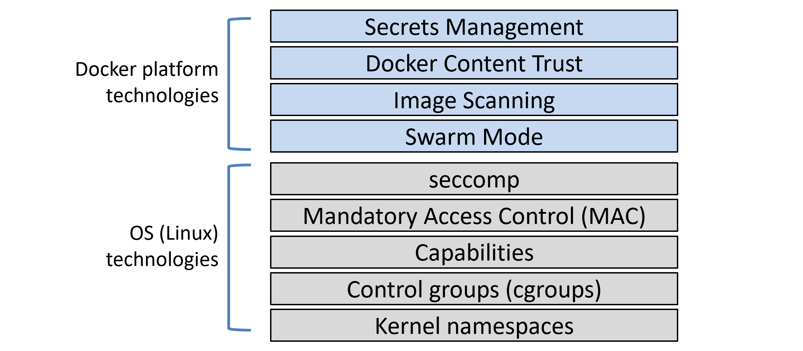

Figure 15.1


Linux 上的 Docker 利用了大多数常见的 Linux 安全和工作负载隔离技术。这些包括*名称空间*、*控制组(cggroups)*、*功能*、*强制访问控制(MAC)系统*和 *seccomp* 。对于每一个，Docker 都实现了合理的默认值，以获得无缝且*适度安全的*开箱即用体验。但是，您可以根据自己的特定要求定制每一个。

Docker 本身增加了一些优秀的附加安全技术。Docker 安全技术最好的一点是它们使用起来非常简单！

**DockerSwarm 体模式**默认是安全的。您无需配置即可获得以下所有内容；加密节点 id、相互认证、自动 CA 配置、自动证书轮换、加密集群存储、加密网络等等。

**Docker 内容信任(DCT)** 可以让您签署您的映像，并验证您消费的映像的完整性和发布者。

**映像安全扫描**分析映像，检测已知漏洞，并提供详细报告。

**Docker 机密**是一种安全共享敏感数据的方式，是 Docker 中的一级对象。它们存储在加密的集群存储中，在传送到容器时在传输中加密，在使用时存储在内存文件系统中，并以最低权限模式运行。

还有很多，但重要的是要知道，Docker 与主要的 Linux 安全技术合作，并提供自己的广泛和不断增长的安全技术集。虽然 Linux 安全技术趋于复杂，但是原生的 Docker 安全技术趋于简单。

### Docker 的安全——深潜

我们都知道安全很重要。我们也知道安全可能是复杂和无聊的。

当 Docker 决定将安全性烘焙到平台中时，它决定让它变得简单易行。他们知道，如果安全性很难配置，人们就不会使用它。因此，Docker 平台提供的大多数安全技术都易于使用。他们还提供合理的默认设置——这意味着你可以不费吹灰之力就获得一个相当安全的平台。当然，违约并不完美，但它们足以作为一个安全的起点。从那里你应该定制他们来满足你的需求。

我们将按如下方式组织本章的其余部分:

*   Linux 安全技术
    *   命名空间
    *   控制组
    *   能力
    *   强制访问控制
    *   seccomp(部门)
*   Docker 平台安全技术
    *   群体模式
    *   映像扫描
    *   Docker 内容信任
    *   Docker 的机密

#### Linux 安全技术

所有*好的*容器平台都使用*命名空间*和*组*来构建容器。*最佳*容器平台还将与其他 Linux 安全技术集成，如*功能*、*强制访问控制系统*如 SELinux 和 AppArmor、 *seccomp* 。不出所料，Docker 将它们全部整合在一起。

在本章的这一部分，我们将简要介绍 Docker 使用的一些主要 Linux 安全技术。我们不会详细讨论，因为我希望这一章的主要重点是 Docker 添加的增值安全技术。

##### 命名空间

内核命名空间是容器的核心。他们将一个操作系统(OS)切片，使其看起来和感觉都像多个**隔离的**操作系统。这让我们可以在同一个操作系统上运行多个网络服务器，而不会发生端口冲突。它还允许我们在同一个操作系统上运行多个应用，而不会因为共享配置文件和共享库而发生冲突。

几个简单的例子:

*   名称空间允许您在单个操作系统上运行多个网络服务器，每个服务器都在端口 443 上。为此，您只需在自己的*网络命名空间*内运行每个 web 服务器应用。这是因为每个*网络名称空间*都有自己的 IP 地址和全部端口。您可能必须将每个端口映射到 Docker 主机上的单独端口，但是每个端口都可以运行，而无需重写或重新配置来使用不同的端口。
*   您可以运行多个应用，每个应用都需要自己版本的共享库或配置文件。为此，您在自己的*挂载命名空间*中运行每个应用。这是可行的，因为每个*挂载命名空间*都可以有自己的系统上任何目录的独立副本(例如/etc，/var，/dev 等)。)

图 15.2 显示了在单个主机上运行的两个 web 服务器应用的高级示例，这两个应用都使用端口 443。每个 web 服务器应用都在自己的网络命名空间内运行。

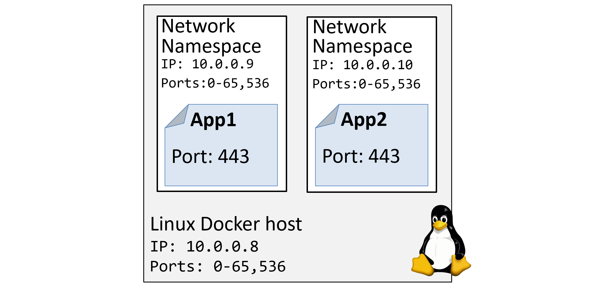

Figure 15.2


> **注意**:虽然命名空间隔离了单个 OS 上的多个进程，但是它们提供的隔离并不是很强。例如，名称空间不如虚拟机擅长工作负载隔离。从安全角度来看，您应该记住这一点，不要过于依赖名称空间提供的隔离。

直接使用名称空间很难。幸运的是，Docker 隐藏了这种复杂性，并管理构建有用容器所需的所有名称空间。

Linux 上的 Docker 目前使用以下内核命名空间:

*   过程标识
*   网络
*   文件系统/挂载(mnt)
*   进程间通信
*   用户
*   UTS （UTS）

我们稍后将简要解释每个人都做了什么。但是要理解的最重要的事情是 **Docker 容器是命名空间**的有组织的集合。这意味着您可以免费获得每个容器的所有操作系统隔离。

例如，每个容器都有自己的`pid`、`net`、`mnt`、`ipc`、`uts`以及潜在的`user`命名空间。事实上，这些名称空间的有组织的集合就是我们所说的“容器”。图 15.3 显示了运行两个容器的单个 Linux 主机。

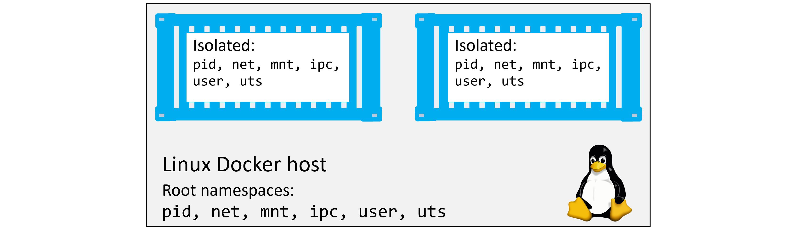

Figure 15.3


让我们简单看看 Docker 如何使用每个命名空间:

*   `Process ID namespace:` Docker 使用`pid`命名空间为每个容器提供隔离的进程树。这意味着每个容器都有自己的 PID 1。PID 名称空间也意味着一个容器不能看到或访问其他容器的进程树。它也不能看到或访问它运行的主机的进程树。
*   `Network namespace:` Docker 使用`net`命名空间为每个容器提供自己的隔离网络栈。该栈包括:接口、IP 地址、端口范围和路由表。例如，每个容器都有自己的`eth0`接口，有自己独特的 IP 和端口范围。
*   `Mount namespace:`每个容器都有自己唯一的独立根(`/`)文件系统。这意味着每个容器都可以有自己的`/etc`、`/var`、`/dev`和其他重要的文件系统结构。容器内部的进程不能访问 Linux 主机或其他容器的装载命名空间，它们只能看到和访问自己的独立文件系统。
*   `Inter-process Communication namespace:` Docker 使用`ipc`命名空间进行容器内的共享内存访问。它还将容器与容器外部的共享内存隔离开来。
*   `User namespace:` Docker 允许您使用`user`名称空间将容器内部的用户映射到 Linux 主机上的不同用户。一个常见的例子是将容器的`root`用户映射到 Linux 主机上的非根用户。
*   `UTS namespace:` Docker 使用`uts`命名空间为每个容器提供自己的主机名。

请记住…容器是打包并随时可用的命名空间的集合。

##### 控制组

如果名称空间是关于隔离的，*控制组(cggroups)*是关于设置限制的。

把容器想象成类似于旅馆的房间。虽然每个房间可能看起来都是孤立的，但每个房间都共享一组公共的基础设施资源，例如供水、供电、共享游泳池、共享健身房、共享早餐吧等。Cgroups 让我们设定限制，这样(坚持酒店的类比)没有一个容器可以使用所有的水或在早餐吧吃所有的东西。

在现实世界中，而不是酒店的类比中，容器相互隔离，但都共享一组通用的操作系统资源，如中央处理器、内存、网络带宽和磁盘输入/输出。Cgroups 让我们对每一个都设置限制，这样单个容器就不会消耗所有资源并导致拒绝服务(DoS)攻击。

##### 能力

运行容器不是一个好主意，因为`root` — `root`是全能的，因此非常危险。但是，作为非特权的非根用户运行容器可能会很有挑战性。例如，在大多数 Linux 系统上，非根用户往往如此无能为力，以至于实际上毫无用处。我们需要的是一种技术，它让我们选择一个容器需要哪个根来运行。

进入*战力！*

在幕后，Linux 根用户是一长串*功能*的组合。其中一些*功能*包括:

*   `CAP_CHOWN`:允许您更改文件所有权
*   `CAP_NET_BIND_SERVICE`:允许您将套接字绑定到编号较低的网络端口
*   `CAP_SETUID`:让你提升一个进程的权限级别
*   `CAP_SYS_BOOT`:让你重启系统。

名单还在继续，而且很长。

Docker 与*功能*一起工作，因此您可以像`root`一样运行容器，但是去掉所有不需要的功能。例如，如果您的容器需要的唯一根特权是绑定到低编号网络端口的能力，您应该启动一个容器并删除所有根功能，然后只添加回 CAP_NET_BIND_SERVICE 功能。

这是实现*最小特权*的一个很好的例子——您得到一个只运行所需功能的容器。Docker 还施加了限制，这样容器就不能重新添加被丢弃的功能。

虽然这很好，但是对于许多用户来说，配置正确的功能集可能非常复杂。

##### 强制访问控制系统

Docker 与主要的 Linux MAC 技术合作，如 AppArmor 和 SELinux。

根据您的 Linux 发行版，Docker 会对所有新容器应用默认的 AppArmor 配置文件。根据 Docker 文档，该默认配置文件是“适度保护，同时提供广泛的应用兼容性”。

Docker 还允许您在没有应用策略的情况下启动容器，并允许您自定义策略以满足特定需求。这也非常强大，但也非常复杂。

##### seccomp(部门)

Docker 在过滤模式下使用 seccomp 来限制容器可以对主机内核进行的系统调用。

根据 Docker 的安全理念，所有新容器都会获得一个默认的 seccomp 配置文件，该配置文件配置了合理的默认值。这是为了在不影响应用兼容性的情况下提供适度的安全性。

与往常一样，您可以自定义 seccomp 配置文件，并且可以向 Docker 传递一个标志，以便在没有 seccomp 配置文件的情况下启动容器。

与前面提到的许多技术一样，seccomp 的功能非常强大。然而，Linux 系统调用表很长，配置适当的 seccomp 策略可能非常复杂。

##### 关于 Linux 安全技术的最后思考

Docker 支持大多数重要的 Linux 安全技术，并附带了合理的默认值，这些默认值增加了安全性，但限制不太多。图 15.4 显示了这些技术如何形成多层潜在的安全性。

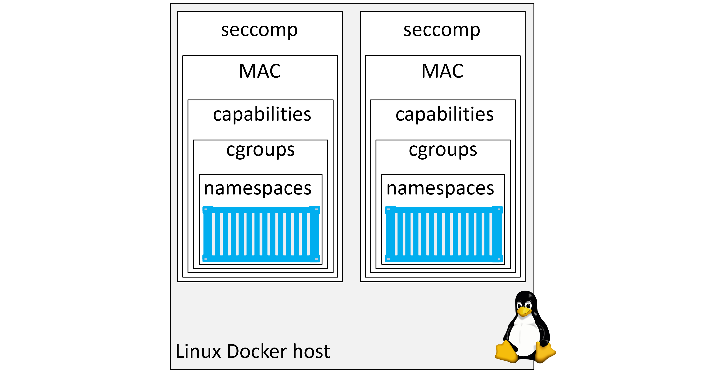

Figure 15.4


其中一些技术可能很难定制，因为它们需要深入了解 Linux 内核的工作原理。希望它们在未来变得更容易配置，但目前，Docker 附带的默认配置可能是一个很好的开始。

#### Docker 平台安全技术

让我们来看看 **Docker 平台**提供的一些主要安全技术。

##### 群体模式下的安全性

Docker Swarm 允许您集群多个 Docker 主机，并以声明方式部署应用。每个 Swarm 由*经理*和*工人*组成，可以是 Linux 或 Windows。管理人员管理集群的控制平面，并负责配置集群和分派工作任务。工作者是作为容器运行应用代码的节点。

不出所料，*群模式*包括许多现成的安全功能，并具有合理的默认值。其中包括:

*   加密节点标识
*   用于相互认证的顶级域名系统
*   安全加入令牌
*   具有自动证书循环的证书颁发机构配置
*   加密集群存储(配置数据库)
*   加密网络

让我们走一遍构建安全集群和配置一些安全方面的过程。

要了解完整的示例集，您至少需要三台运行 Docker 17.03 或更高版本的 Docker 主机。引用的示例使用了三个名为“mgr1”、“mgr2”和“wrk1”的 Docker 主机。每个都运行 Docker 19.03.4。所有三台主机之间都有网络连接，三台主机都可以通过名称相互 ping 通。

##### 配置安全的群

从希望成为新群集中第一个管理器的节点运行以下命令。在示例中，我们将从 **mgr1** 运行它。


```
$ docker swarm init
Swarm initialized: current node (7xam...662z) is now a manager.

To add a worker to this swarm, run the following command:

    docker swarm join --token \
     SWMTKN-1-1dmtwu...r17stb-ehp8g...hw738q 172.31.5.251:2377

To add a manager to this swarm, run 'docker swarm join-token manager'
and follow the instructions. 
```


 `就这样！这就是你配置一个安全的群所需要做的。

**mgr1** 被配置为群的第一个管理器，也是根证书颁发机构(CA)。群体本身被赋予了密码`clusterID`。 **mgr1** 已经为自己颁发了一个客户端证书，该证书将自己标识为群中的一个管理器，证书轮换已配置为默认值 90 天，并且群集配置数据库已配置并加密。还创建了一组安全令牌，以便新经理和新员工可以加入群。而这一切只需要一个**命令！**

图 15.5 显示了实验室现在的样子。在您的实验室中，某些细节可能会有所不同。

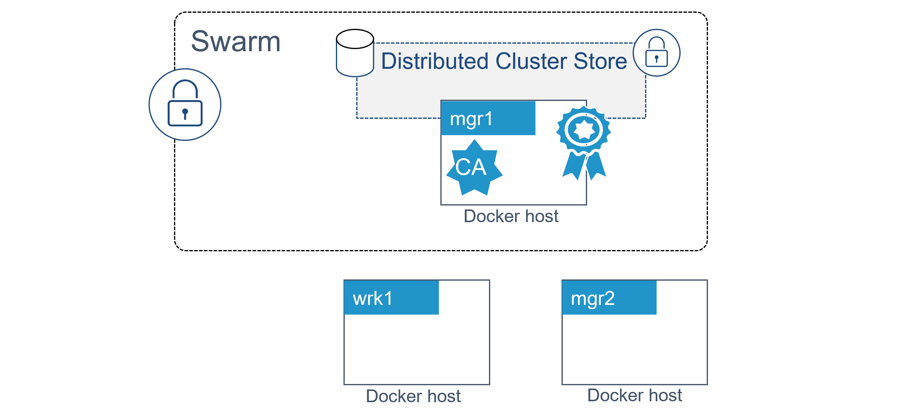

Figure 15.5


让我们加入 **mgr2** 作为附加经理。

让新经理加入群体是一个分两步走的过程。第一步提取所需的令牌。第二步在要添加的节点上运行`docker swarm join`命令。只要您将管理器加入令牌作为命令的一部分， **mgr2** 将作为管理器加入群。

从 **mgr1** 运行以下命令提取管理器加入令牌。


```
$ docker swarm join-token manager
To add a manager to this swarm, run the following command:

    docker swarm join --token \
    SWMTKN-1-1dmtwu...r17stb-2axi5...8p7glz \
    172.31.5.251:2377 
```


 `输出为您提供了在要作为管理器加入的节点上运行所需的确切命令。在您的实验中，加入令牌和 IP 地址会有所不同。

连接命令的格式是:

*   `docker swarm join --token <manager-join-token> <ip-of-existing-manager>:<swarm-port>`

令牌的格式为:

*   `SWMTKN-1-<hash-of-cluster-certificate>-<manager-join-token>`

复制命令并在“mgr2”上运行:


```
$ docker swarm join --token SWMTKN-1-1dmtwu...r17stb-2axi5...8p7glz \
> 172.31.5.251:2377

This node joined a swarm as a manager. 
```


 `**mgr2** 作为额外的管理者加入了群体。在生产集群中，您应该始终运行 3 个或 5 个管理器来实现高可用性。

通过在两个管理器中的任一个上运行`docker node ls`来验证 **mgr2** 是否已成功添加。


```
$ docker node ls
ID                HOSTNAME   STATUS    AVAILABILITY    MANAGER STATUS
7xamk...ge662z    mgr1       Ready     Active          Leader
i0ue4...zcjm7f *  mgr2       Ready     Active          Reachable 
```


 `输出显示 **mgr1** 和 **mgr2** 都是群体的一部分，都是管理者。更新后的配置如图 15.6 所示。

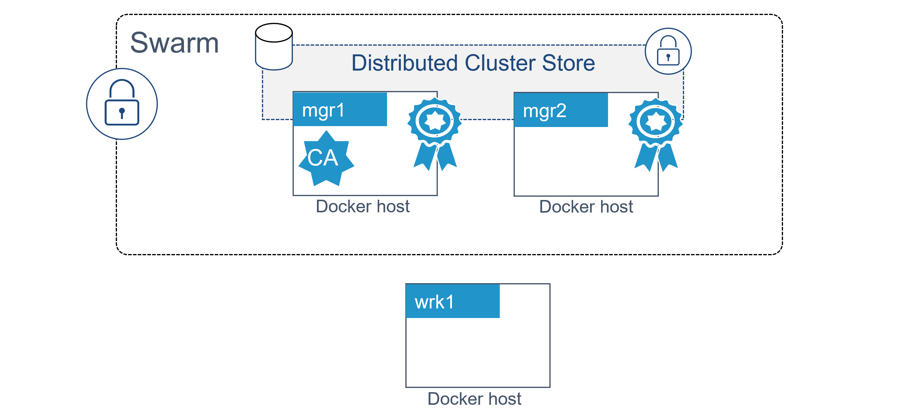

Figure 15.8


两个经理可能是最糟糕的数字。然而，我们只是在演示实验室里瞎折腾，而不是构建一个业务关键的生产环境；-)

添加群体工作者是一个类似的两步过程。第一步提取加入令牌，第二步是在想要作为工作者加入的节点上运行`docker swarm join`命令。

在任一管理器上运行以下命令，以公开工作者加入令牌。


```
$ docker swarm join-token worker

To add a worker to this swarm, run the following command:

    docker swarm join --token \
    SWMTKN-1-1dmtw...17stb-ehp8g...w738q \
    172.31.5.251:2377 
```


 `同样，您将获得在想要作为工作人员加入的节点上运行所需的确切命令。在您的实验中，加入令牌和 IP 地址会有所不同。

复制命令并在 **wrk1** 上运行，如图所示:


```
$ docker swarm join --token SWMTKN-1-1dmtw...17stb-ehp8g...w738q \
> 172.31.5.251:2377

This node joined a swarm as a worker. 
```


 `从任一群管理器运行另一个`docker node ls`命令。


```
$ docker node ls
ID                 HOSTNAME     STATUS     AVAILABILITY   MANAGER STATUS
7xamk...ge662z *   mgr1         Ready      Active         Leader
ailrd...ofzv1u     wrk1         Ready      Active
i0ue4...zcjm7f     mgr2         Ready      Active         Reachable 
```


 `你现在有一群两个经理和一个工人。管理器配置为高可用性，集群存储复制到两者。最终配置如图 15.7 所示。

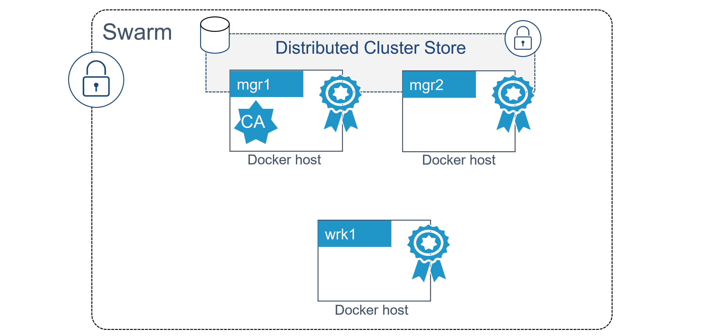

Figure 15.7


##### 从幕后看 Swarm 安全

现在，我们已经构建了一个安全的 Swarm，让我们花一分钟时间来看看一些涉及的安全技术。

###### 群加入令牌

将新经理和员工加入现有群体所需的唯一东西是相关的加入令牌。因此，保证您的加入令牌的安全是至关重要的。不要在公开的 GitHub 转贴，甚至是不受限制的内部源代码转贴上发布。

每个群维护两个不同的连接标记:

*   一个是加入新经理
*   一个是加入新员工

了解 Swarm 加入标记的格式是值得的。每个连接标记由 4 个不同的字段组成，用破折号(`-`)分隔:

`PREFIX - VERSION - SWARM ID - TOKEN`

前缀总是`SWMTKN`。这允许你对它进行模式匹配，防止人们不小心公开发布它。`VERSION`字段指示群的版本。`Swarm ID`字段是蜂群证书的散列。`TOKEN`字段是决定其能否作为管理者或工作者加入节点的部分。

如下图所示，给定 Swarm 的管理器和工作者加入令牌除了最后的`TOKEN`字段之外是相同的。

*   经理:`SWMTKN-1-1dmtwusdc...r17stb-2axi53zjbs45lqxykaw8p7glz`
*   工人:`SWMTKN-1-1dmtwusdc...r17stb-ehp8gltji64jbl45zl6hw738q`

如果您怀疑您的任何一个加入令牌已经被破坏，您可以用一个命令撤销它们并发布新的令牌。以下示例撤销现有的*管理器*加入令牌并发布新令牌。


```
$ docker swarm join-token --rotate manager

Successfully rotated manager join token.

To add a manager to this swarm, run the following command:

    docker swarm join --token \
     SWMTKN-1-1dmtwu...r17stb-1i7txlh6k3hb921z3yjtcjrc7 \
     172.31.5.251:2377 
```


 `现有的管理器不需要更新，但是，您需要使用新的令牌来添加新的管理器。

请注意，新旧连接令牌之间的唯一区别是最后一个字段。群标识的散列保持不变。

加入令牌存储在默认加密的集群存储中。

###### TLS 和相互认证

每一个加入群体的经理和工人都会被颁发客户证书。该证书用于相互认证。它标识节点、它所属的群以及节点在群中扮演的角色(管理者或工作者)。

您可以使用以下命令在 Linux 节点上检查节点的客户端证书。


```
$ sudo openssl x509 \
  -in /var/lib/docker/swarm/certificates/swarm-node.crt \
  -text

  Certificate:
      Data:
          Version: 3 (0x2)
          Serial Number:
              80:2c:a7:b1:28...a8:af:89:a1:2a:51:89
      Signature Algorithm: ecdsa-with-SHA256
          Issuer: CN = swarm-ca
          Validity
              Not Before: May  5 10:31:00 2020 GMT
              Not After : Aug  3 11:31:00 2020 GMT
          Subject: O=mfbkgjm2tlametbnfqt2zid8x, OU=swarm-manager,
          CN=7xamk8w3hz9q5kgr7xyge662z
          Subject Public Key Info:
<SNIP> 
```


 `输出中的`Subject`数据使用标准的`O`、`OU`和`CN`字段来指定群标识、节点角色和节点标识。

*   组织(`O`)字段存储群标识
*   组织单位(`OU`)字段存储节点在群中的角色
*   规范名称(`CN`)字段存储节点的加密标识。

这如图 15.8 所示。

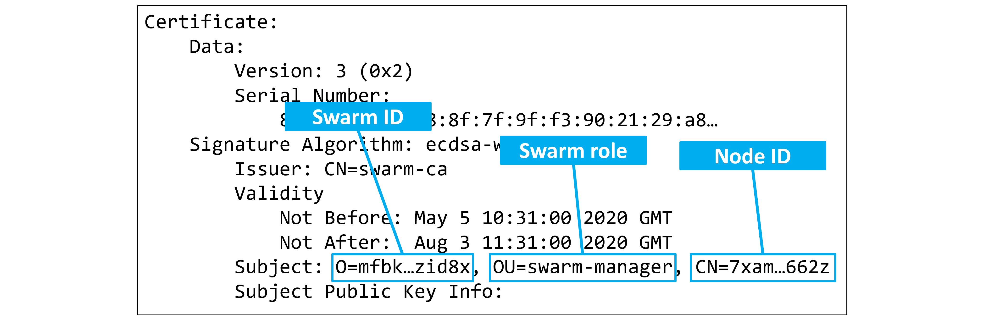

Figure 15.8


也可以在`Validity`部分看到证书轮换周期。

您可以将这些值与`docker system info`命令输出中显示的相应值进行匹配。


```
$ docker system info
<SNIP>
Swarm: active
 NodeID: 7xamk8w3hz9q5kgr7xyge662z    # Relates to the CN field
 Is Manager: true                     # Relates to the OU field
 ClusterID: mfbkgjm2tlametbnfqt2zid8x # Relates to the O field
 ...
 <SNIP>
 ...
 CA Configuration:
  Expiry Duration: 3 months           # Relates to Validity field
  Force Rotate: 0
 Root Rotation In Progress: false
 <SNIP> 
```


 `###### 配置一些证书颁发机构设置

您可以使用`docker swarm update`命令为 Swarm 配置证书循环周期。以下示例将证书轮换周期更改为 30 天。


```
$ docker swarm update --cert-expiry 720h 
```


 `Swarm 允许节点提前(稍微在证书过期之前)更新证书，这样并非所有节点都不会同时尝试更新它们的证书。

通过将`--external-ca`标志传递给`docker swarm init`命令，您可以在创建新群时配置外部 CA。

新的`docker swarm ca`子命令可用于管理 CA 相关配置。运行带有`--help`标志的命令，查看它可以做的事情的列表。


```
$ docker swarm ca --help

Usage:  docker swarm ca [OPTIONS]

Manage root CA

Options:
      --ca-cert pem-file          Path to the PEM-formatted root CA
                                  certificate to use for the new cluster
      --ca-key pem-file           Path to the PEM-formatted root CA
                                  key to use for the new cluster
      --cert-expiry duration      Validity period for node certificates
                                  (ns|us|ms|s|m|h) (default 2160h0m0s)
  -d, --detach                    Exit immediately instead of waiting for
                                  the root rotation to converge
      --external-ca external-ca   Specifications of one or more certificate
                                  signing endpoints
  -q, --quiet                     Suppress progress output
      --rotate                    Rotate the swarm CA - if no certificate
                                  or key are provided, new ones will be generated 
```


 `###### 集群存储

集群存储是集群的大脑，是存储集群配置和状态的地方。它对其他 Docker 技术也至关重要，如覆盖网络和机密。这就是为什么这么多高级和安全相关的 Docker 功能需要集群模式。这个故事的寓意是……如果你不是在集群模式下运行，将会有一堆你无法使用的 Docker 技术和安全特性。

该商店目前基于流行的`etcd`分布式数据库，并被自动配置为将其自身复制到群中的所有经理。默认情况下，它也是加密的。

集群存储的日常维护由 Docker 自动负责。但是，在生产环境中，您应该为其准备好强大的备份和恢复解决方案。

关于群模式安全性，到此为止。

##### 通过映像安全扫描检测漏洞

映像扫描是您抵御映像漏洞和安全漏洞的主要武器。

映像扫描仪通过检查映像和搜索具有已知漏洞的包来工作。一旦您了解了这些，您就可以将包和依赖项更新为带有修复的版本。

尽管映像扫描很好，但了解它的局限性也很重要。例如，映像扫描集中在映像上，不会检测到网络、节点或编排器的安全问题。此外，并不是所有的映像扫描仪都是相同的——一些扫描仪执行深度二进制级别的扫描来检测包，而另一些扫描仪只是查看包的名称，并不仔细检查映像的内容。

在撰写本文时，Docker Hub 不提供映像扫描服务。这在未来可能会改变。一些内部私有注册表解决方案提供内置扫描，还有第三方服务提供映像扫描服务。

图 15.9 和图 15.10 是映像扫描仪可以提供的报告类型的示例。

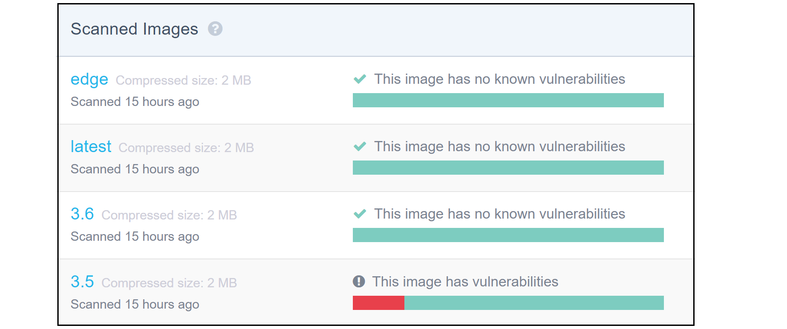

Figure 15.9


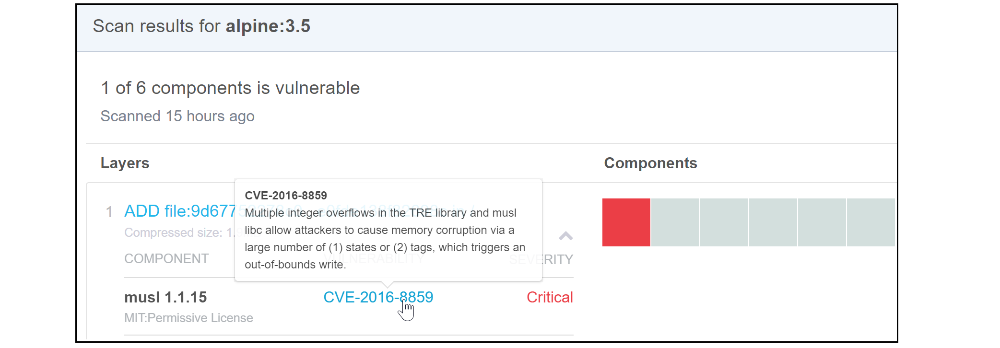

Figure 15.10


总之，映像安全扫描可以成为深入检查映像中已知漏洞的一个很好的工具。不过要小心，知识越丰富，责任越大——一旦你意识到漏洞，你就有责任减轻或修复它们。

##### 使用 Docker 内容信任签署和验证映像

Docker 内容信任(DCT)使验证您下载和运行的映像的完整性和发布者变得简单易行。当通过不可信的网络(如互联网)提取映像时，这一点尤其重要。

在高层次上，当映像被推送到 Docker Hub 或其他容器注册中心时，DCT 允许开发人员对映像进行签名。这些映像可以在拉取和运行时进行验证。这个高级过程如图 15.11 所示

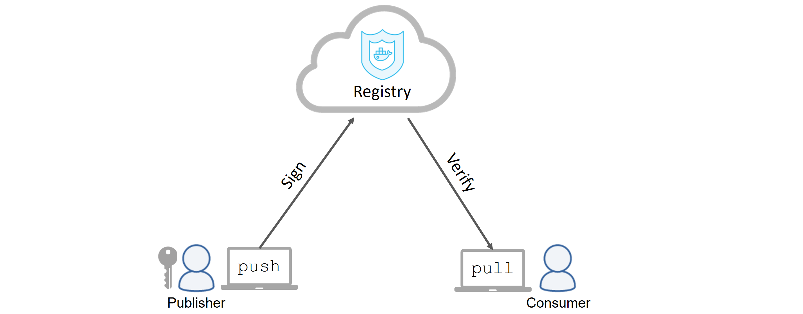

Figure 15.11


DCT 也可以用来提供重要的*上下文*。这包括:一个映像是否已被签名以在特定环境中使用，如“prod”或“dev ”,或者一个映像是否已被较新的版本所取代并因此过时。

以下步骤将引导您完成配置 Docker 内容信任、签名和推送映像，然后拉出签名的映像。接下来，你需要一个加密密钥对来签署映像。

如果您还没有密钥对，您可以使用`docker trust`子命令生成一个新的密钥对。以下命令生成一个名为“nigel”的新密钥对。


```
$ docker trust key generate nigel
Generating key for nigel...
Enter passphrase for new nigel key with ID 1f78609: 
Repeat passphrase for new nigel key with ID 1f78609: 
Successfully generated and loaded private key.... public key available: /root/nigel.pub 
```


 `如果你已经有一个密钥对，你可以导入并加载`docker trust key load key.pem --name nigel`。

现在您已经加载了一个有效的密钥对，您需要将它与您将要将签名映像推送到的映像存储库相关联。本示例使用 Docker Hub 上的`nigelpoulton/dct` repo 和由先前的`docker trust key generate`命令创建的`nigel.pub`键。您的密钥文件将会不同。


```
$ docker trust signer add --key nigel.pub nigel nigelpoulton/dct
Adding signer "nigel" to nigelpoulton/dct...
Initializing signed repository for nigelpoulton/dct...
Enter passphrase for root key with ID aee3314: 
Enter passphrase for new repository key with ID 1a18dd1: 
Repeat passphrase for new repository key with ID 1a18dd1: 
Successfully initialized "nigelpoulton/dct"
Successfully added signer: nigel to nigelpoulton/dct 
```


 `以下命令将签署`nigelpoulton/dct:signed`映像**并**将其推送到 Docker Hub。


```
$ docker trust sign nigelpoulton/dct:signed
Signing and pushing trust data for local image nigelpoulton/dct:signed, 
may overwrite remote trust data
The push refers to repository [docker.io/nigelpoulton/dct]
1a777bda846c: Mounted from nigelpoulton/dct
d23c343f7626: Mounted from nigelpoulton/dct 
18dc259b4479: Mounted from nigelpoulton/dct 
40a236c21a47: Mounted from nigelpoulton/dct 
a9a7f132e4de: Mounted from nigelpoulton/dct 
9a8b7b2b0c33: Mounted from nigelpoulton/dct 
00891a9058ec: Mounted from nigelpoulton/dct 
d87eb7d6daff: Mounted from nigelpoulton/dct 
beee9f30bc1f: Mounted from nigelpoulton/dct 
signed: digest: sha256:c9f8e18822...6cbb9a74cf size: 2202
Signing and pushing trust metadata
Enter passphrase for nigel key with ID 1f78609: 
Successfully signed docker.io/nigelpoulton/dct:signed 
```


 `推送映像后，您可以使用以下命令检查其签名数据。


```
$ docker trust inspect nigelpoulton/dct:signed --pretty

Signatures for nigelpoulton/dct:signed
  SIGNED TAG          DIGEST                           SIGNERS
  signed              c9f8c18522...75aaccd6cbb9a74cf   nigel

List of signers and their keys for nigelpoulton/dct:signed
  SIGNER              KEYS
  nigel               1f786095c467

Administrative keys for nigelpoulton/dct:signed
  Repository Key:   1a18dd1113...a91f489782
  Root Key:         c2f53fd2f2...b0a720d344 
```


 `您可以通过导出值为`1`的`DOCKER_CONTENT_TRUST`环境变量，强制 Docker 主机始终对映像`push`和`pull`操作进行签名和验证。在现实世界中，您会希望这成为 Docker 主机的一个更持久的特性。


```
$ export DOCKER_CONTENT_TRUST=1 
```


 `一旦启用了 DCT，您将不再能够提取和处理未签名的映像。您可以通过尝试拉出以下两个映像来测试此行为:

*   nigelpoulton/dct:无符号
*   nigelpoulton/dct:签名

如果通过设置`DOCKER_CONTENT_TRUST`环境变量启用了 DCT，将无法拉取`dct:unsigned`映像。但是，您可以提取标记为`signed`的映像。


```
$ docker image pull nigelpoulton/dct:unsigned
No valid trust data for unsigned 
```


 `Docker 内容信任是一项重要技术，可帮助您验证从容器注册表中提取的映像。基本形式的配置很简单，但是更高级的功能，比如*上下文*，配置起来可能更复杂。

#### Docker 的机密

许多应用需要机密——比如密码、TLS 证书、SSH 密钥等等。

Docker 的早期版本没有标准化的方法来安全地让应用获得机密。开发人员通过纯文本环境变量将机密插入应用是很常见的(我们都做过)。这远非理想。

Docker 1.13 引入了 *Docker Secrets* 作为 Docker API 中的一级对象。

在幕后，机密在静止时被加密，在飞行中被加密，在容器中被装载到内存中的文件系统中，并在最低特权模式下运行，在这种模式下，机密只对已被明确授予访问权限的服务可用。相当全面的端到端解决方案，甚至有自己的`docker secret`子命令。

图 15.12 显示了一个高级工作流:


Figure 15.12


以下步骤遍历图 15.12 所示的高级工作流。

1.  蓝色的机密被创造并发布到蜂群中
2.  它存储在加密的集群存储中(所有管理人员都可以访问集群存储)
3.  蓝色服务被创建，机密被附加在它上面
4.  机密在传送到蓝色服务中的任务(容器)时被加密
5.  机密在`/run/secrets/`以未加密文件的形式装入蓝色服务的容器中。这是内存中的 tmpfs 文件系统(这一步在 Windows Docker 主机上是不同的，因为它们不像 tmpfs 那样有内存中文件系统的概念)
6.  一旦容器(服务任务)完成，内存中的文件系统就会被拆除，并且从节点中清除机密
7.  红色服务中的红色容器不能访问机密

机密以未加密的形式出现在运行的容器中的原因是，应用可以使用它们，而不需要方法来解密它们。

您可以使用`docker secret`子命令创建和管理机密，并且可以通过指定`docker service create`命令的`--secret`标志将它们附加到服务。

### 章节总结

Docker 可以配置为非常安全。它支持所有主要的 Linux 安全技术，包括:内核命名空间、cgroups、功能、MAC 和 seccomp。它附带了所有这些合理的默认值，但是您可以自定义它们，甚至禁用它们。

除了一般的 Linux 安全技术之外，Docker 还包括一系列自己的安全技术。群模式建立在顶级域名系统之上，配置和定制极其简单。映像扫描可以对映像执行二进制级别的扫描，并提供已知漏洞的详细报告。Docker 内容信任允许您签名和验证内容，Docker 机密允许您与容器和 Swarm 服务安全地共享敏感数据。

最终的结果是，您的 Docker 环境可以根据您的需要配置为安全或不安全，这完全取决于您如何配置它。``````````````````