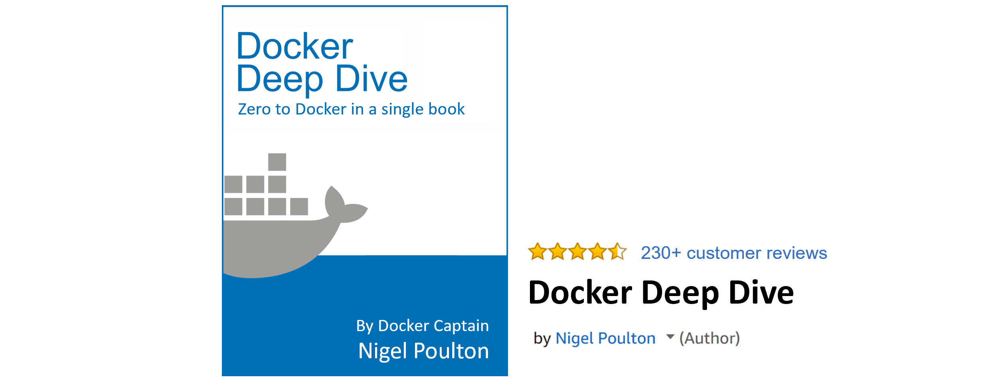
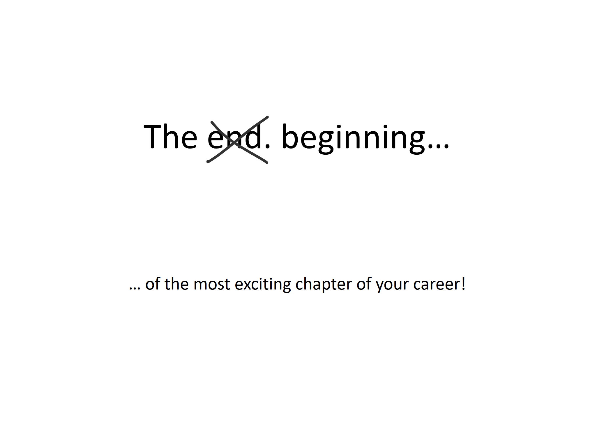

## 十六、下一步

希望你对 Docker 充满信心，并准备好采取下一步行动。幸运的是，采取这些后续步骤从未如此容易。

### 熟能生巧

没有什么能代替动手实践。幸运的是，正如我们在第 3 章中所展示的，获得 Docker 并开始开发您的实践技能比以往任何时候都更容易。我个人每天都用 Docker Desktop，需要用多个节点快速测试某个东西的时候，会定期用[玩 Docker](https://play-with-docker.com/) 。

### 视频培训

视频培训是另一种学习东西和在行动中看到东西的方式。

我在 [Pluralsight](http://app.pluralsight.com/author/nigel-poulton) 创建了很多高质量的 Docker 视频培训课程。如果你不是 Pluralsight 的会员，那就成为会员吧！这需要钱，但可能是你做过的最重要的职业投资之一。如果你不确定是否要放弃你的血汗钱……他们总是有免费试用，你可以在有限的时间内免费使用我的课程。

### 融入社区

有一个充满活力的 Docker 社区，充满了乐于助人的人。参与 Docker 群组并在互联网上聊天，查找您当地的 Docker 或云原生 meeting up(在谷歌上搜索“我附近的 Docker meeting up”)。我经常出席会议，它们是与人交流和学习的好地方。

### KubernetesKubernetesKubernetesKubernetesKubernetesKubernetesKubernetesKubernetesKubernetesKubernetes

现在你已经对 Docker 略知一二，一个合乎逻辑的下一步可能是 Kubernetes。无需赘述，Kubernetes 类似于 Docker Swarm，但范围更大，社区更活跃。也是出了名的难学。然而，现在您已经知道了 Docker 和集群编排是如何工作的，学习 Kubernetes 将会更容易。也就是说，如果你不需要Kubernetes带来的所有额外功能，你可能会更好地坚持 Swarm。

### 反馈和连接

非常感谢你阅读我的书，我真的希望它有用。如果你能在亚马逊上留下评论，那就太神奇了。

欢迎在[推特](https://twitter.com/nigelpoulton)[领英](https://www.linkedin.com/in/nigelpoulton/)等你能找到我的地方和我联系(我不接受脸书朋友的请求。没什么私人恩怨，我只是把脸书留给家人和老朋友)。

