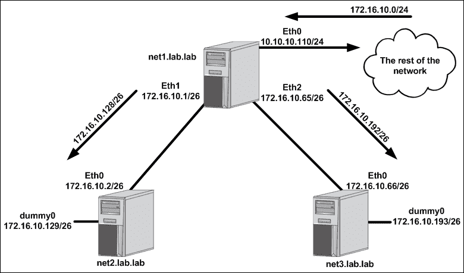
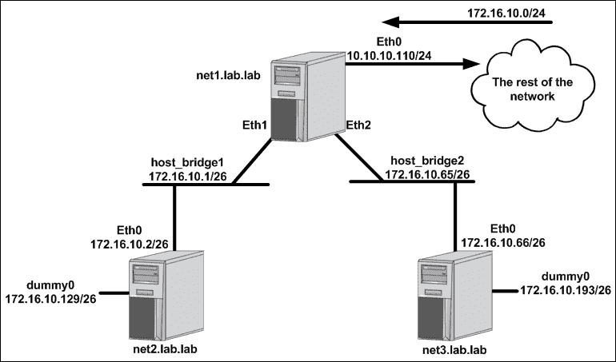
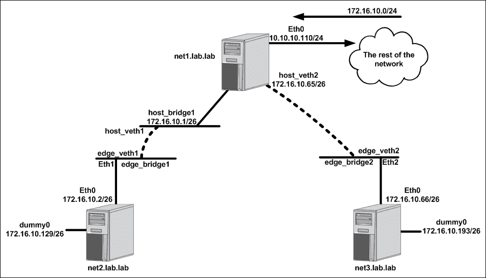

# 一、Linux 网络结构

在本章中，我们将介绍以下食谱:

*   使用接口和地址
*   配置 Linux 主机路由
*   探索桥梁
*   建立联系
*   探索网络名称空间

# 简介

Linux 是一个强大的操作系统，具有许多强大的网络结构。就像任何网络技术一样，它们各自都很强大，但当以创造性的方式结合起来时，会变得更加强大。Docker 是一个很好的例子，它将 Linux 网络栈的许多独立组件组合成一个完整的解决方案。虽然 Docker 为您管理了大部分内容，但是了解 Docker 使用的 Linux 网络组件仍然很有帮助。

在本章中，我们将花一些时间在 Docker 之外单独研究这些构造。我们将学习如何在 Linux 主机上更改网络配置，并验证网络配置的当前状态。虽然这一章不是专门针对 Docker 本身的，但是理解后面章节的原语是很重要的，在后面的章节中，我们将讨论 Docker 如何使用这些构造来网络容器。

# 使用接口和地址

理解【Linux 如何处理网络是理解 Docker 如何处理网络不可或缺的一部分。在本食谱中，我们将通过学习如何定义和操作 Linux 主机上的接口和 IP 地址来关注 Linux 网络基础知识。为了演示配置，我们将在本食谱中开始构建实验室拓扑，并在本章的其他食谱中继续进行。

## 做好准备

为了查看和操作网络设置，您需要确保安装了`iproute2`工具集。如果系统上没有，可以使用以下命令进行安装:

```
sudo apt-get install iproute2
```

为了对主机进行网络更改，您还需要根级访问。

为了本章演示的目的，我们将使用一个简单的实验室拓扑。主机的初始网络布局如下所示:


在这种情况下，我们有三个主机，每个主机都有一个已经定义的`eth0`接口:

*   `net1` : `10.10.10.110/24`默认网关为`10.10.10.1`
*   `net2` : `172.16.10.2/26`
*   `net3` : `172.16.10.66/26`

## 怎么做…

大多数终端主机上的网络配置通常仅限于单个接口的 IP 地址、子网掩码和默认网关。这是因为大多数主机都是网络端点，在单个 IP 接口上提供一组离散的服务。但是，如果我们想要定义更多的接口或者操作现有的接口，会发生什么呢？为了回答这个问题，我们首先来看看简单的单宿服务器，如前面例子中的`net2`或`net3`。

在 Ubuntu 主机上，所有的接口配置都在`/etc/network/interfaces`文件中完成。让我们检查一下主机`net2`上的文件:

```
# The loopback network interface
auto lo
iface lo inet loopback

# The primary network interface
auto eth0
iface eth0 inet static
        address 172.16.10.2
        netmask 255.255.255.192
```

我们可以看到这个文件定义了两个接口——本地`loopback`接口和接口`eth0`。`eth0`界面定义了以下信息:

*   `address`:主机接口的 IP 地址
*   `netmask`:与 IP 接口关联的子网掩码

每当接口试图进入启动或运行状态时，该文件中的信息将被处理。我们可以通过使用`ip addr show <interface name>`命令检查接口`eth0`的当前 IP 地址来验证该配置文件是在系统启动时处理的:

```
user@net2:~$ ip addr show eth0
2: eth0: <BROADCAST,MULTICAST,UP,LOWER_UP> mtu 1500 qdisc pfifo_fast state UP group default qlen 1000
    link/ether 00:0c:29:59:ca:ca brd ff:ff:ff:ff:ff:ff
    inet 172.16.10.2/26 brd 172.16.10.63 scope global eth0
       valid_lft forever preferred_lft forever
    inet6 fe80::20c:29ff:fe59:caca/64 scope link
       valid_lft forever preferred_lft forever
user@net2:~$
```

现在我们已经回顾了单主机配置，让我们来看看在一台主机上配置多个接口需要什么。从目前的情况来看，`net1`主机是唯一一台在本地子网之外有任何可达性的主机。这是因为它有一个定义的默认网关指向网络的其余部分。为了使`net2`和`net3`可以到达，我们需要找到一种方法将它们连接回网络的其余部分。为此，我们假设主机`net1`有两个额外的网络接口，可以直接连接到主机`net2`和`net3`:


让我们通过了解如何在`net1`上配置额外的接口和 IP 地址来完成拓扑。

我们要做的第一件事是验证我们在`net1`上有额外的接口可用。为此，我们将使用`ip link show`命令:

```
user@net1:~$ ip link show
1: lo: <LOOPBACK,UP,LOWER_UP> mtu 65536 qdisc noqueue state UNKNOWN mode DEFAULT group default
    link/loopback 00:00:00:00:00:00 brd 00:00:00:00:00:00
2: eth0: <BROADCAST,MULTICAST,UP,LOWER_UP> mtu 1500 qdisc pfifo_fast state UP mode DEFAULT group default qlen 1000
    link/ether 00:0c:29:2d:dd:79 brd ff:ff:ff:ff:ff:ff
3: eth1: <BROADCAST,MULTICAST> mtu 1500 qdisc noop state DOWN mode DEFAULT group default qlen 1000
    link/ether 00:0c:29:2d:dd:83 brd ff:ff:ff:ff:ff:ff
4: eth2: <BROADCAST,MULTICAST> mtu 1500 qdisc noop state DOWN mode DEFAULT group default qlen 1000
    link/ether 00:0c:29:2d:dd:8d brd ff:ff:ff:ff:ff:ff
user@net1:~$
```

从输出中我们可以看到，除了`eth0`接口，我们还有`eth1`和`eth2`接口可供我们使用。要查看哪些接口有关联的 IP 地址，我们可以使用`ip address show`命令:

```
user@net1:~$ ip address show
1: lo: <LOOPBACK,UP,LOWER_UP> mtu 65536 qdisc noqueue state UNKNOWN group default
    link/loopback 00:00:00:00:00:00 brd 00:00:00:00:00:00
    inet 127.0.0.1/8 scope host lo
       valid_lft forever preferred_lft forever
    inet6 ::1/128 scope host
       valid_lft forever preferred_lft forever
2: eth0: <BROADCAST,MULTICAST,UP,LOWER_UP> mtu 1500 qdisc pfifo_fast state UP group default qlen 1000
    link/ether 00:0c:29:2d:dd:79 brd ff:ff:ff:ff:ff:ff
    inet 10.10.10.110/24 brd 10.10.10.255 scope global eth0
       valid_lft forever preferred_lft forever
    inet6 fe80::20c:29ff:fe2d:dd79/64 scope link
       valid_lft forever preferred_lft forever
3: eth1: <BROADCAST,MULTICAST> mtu 1500 qdisc noop state DOWN group default qlen 1000
    link/ether 00:0c:29:2d:dd:83 brd ff:ff:ff:ff:ff:ff
4: eth2: <BROADCAST,MULTICAST> mtu 1500 qdisc noop state DOWN group default qlen 1000
    link/ether 00:0c:29:2d:dd:8d brd ff:ff:ff:ff:ff:ff
user@net1:~$
```

前面的输出证明了我们目前在接口`eth0`上只分配了一个 IP 地址。这意味着我们可以使用接口`eth1`连接到服务器`net2`和`eth2`连接到服务器`net3`。

我们可以通过两种方式配置这些新接口。首先是用相关的 IP 地址信息更新`net1`上的网络配置文件。让我们对面向主机的链路`net2`进行此操作。要配置该连接，只需编辑文件`/etc/network/interfaces`并为两个接口添加相关配置。完成的配置应该如下所示:

```
# The primary network interface
auto eth0
iface eth0 inet static
        address 10.10.10.110
        netmask 255.255.255.0
        gateway 10.10.10.1
auto eth1
iface eth1 inet static
 address 172.16.10.1
 netmask 255.255.255.192

```

文件保存后，您需要找到一种方法来告诉系统重新加载配置文件。一种方法是重新加载系统。一个更简单的方法是重新加载接口。例如，我们可以执行以下命令来重新加载界面`eth1`:

```
user@net1:~$ sudo ifdown eth1 && sudo ifup eth1
ifdown: interface eth1 not configured
user@net1:~$
```

### 注

虽然在这种情况下不需要，但同时上下移动界面是一个很好的习惯。这可以确保在您关闭管理主机的接口时不会切断电源。

在某些情况下，您可能会发现这种更新接口配置的方法并不像预期的那样有效。根据您的 Linux 版本，您可能会遇到一种情况，即先前的 IP 地址没有从接口中删除，导致接口有多个 IP 地址。要解决此问题，您可以手动删除旧的 IP 地址，或者重新启动主机，这将防止旧配置持续存在。

命令执行后，我们应该可以看到界面`eth1`现在被正确寻址:

```
user@net1:~$ ip addr show dev eth1
3: eth1: <BROADCAST,MULTICAST,UP,LOWER_UP> mtu 1500 qdisc pfifo_fast state UP group default qlen 1000
    link/ether 00:0c:29:2d:dd:83 brd ff:ff:ff:ff:ff:ff
    inet 172.16.10.1/26 brd 172.16.10.63 scope global eth1
       valid_lft forever preferred_lft forever
    inet6 fe80::20c:29ff:fe2d:dd83/64 scope link
       valid_lft forever preferred_lft forever
user@net1:~$
```

要在主机`net1`上配置接口`eth2`，我们将使用不同的方法。我们将使用`iproute2`命令行更新界面的配置，而不是依赖配置文件。为此，我们只需执行以下命令:

```
user@net1:~$ sudo ip address add 172.16.10.65/26 dev eth2
user@net1:~$ sudo ip link set eth2 up
```

这里需要注意的是，这种配置不是持久的。也就是说，因为它不是系统初始化时加载的配置文件的一部分，所以该配置将在重新启动时丢失。对于使用`iproute2`或其他命令行工具集手动完成的任何网络相关配置，情况都是如此。

### 注

最佳做法是在网络配置文件中配置接口信息和寻址。更改配置文件之外的接口配置是在这些方法中完成的，只是为了举例。

到目前为止，我们只通过向现有接口添加 IP 信息来修改它们。我们实际上并没有给任何系统增加新的接口。添加接口是一个相当常见的任务，正如后面的菜谱所显示的，有多种接口类型可以添加。现在，让我们专注于添加 Linux 所称的虚拟接口。虚拟接口就像网络中的环回接口一样，描述一种始终在线的接口类型。使用`ip link add`语法定义或创建接口。然后指定一个名称，并定义您正在定义的接口类型。例如，让我们在主机`net2`和`net3`上定义一个虚拟接口:

```
user@net2:~$ sudo ip link add dummy0 type dummy
user@net2:~$ sudo ip address add 172.16.10.129/26 dev dummy0
user@net2:~$ sudo ip link set dummy0 up

user@net3:~$ sudo ip link add dummy0 type dummy
user@net3:~$ sudo ip address add 172.16.10.193/26 dev dummy0
user@net3:~$ sudo ip link set dummy0 up
```

定义接口后，每台主机都应该能够 ping 通自己的`dummy0`接口:

```
user@net2:~$ ping 172.16.10.129 -c 2
PING 172.16.10.129 (172.16.10.129) 56(84) bytes of data.
64 bytes from 172.16.10.129: icmp_seq=1 ttl=64 time=0.030 ms
64 bytes from 172.16.10.129: icmp_seq=2 ttl=64 time=0.031 ms
--- 172.16.10.129 ping statistics ---
2 packets transmitted, 2 received, 0% packet loss, time 999ms
rtt min/avg/max/mdev = 0.030/0.030/0.031/0.005 ms
user@net2:~$

user@net3:~$ ping 172.16.10.193 -c 2
PING 172.16.10.193 (172.16.10.193) 56(84) bytes of data.
64 bytes from 172.16.10.193: icmp_seq=1 ttl=64 time=0.035 ms
64 bytes from 172.16.10.193: icmp_seq=2 ttl=64 time=0.032 ms
--- 172.16.10.193 ping statistics ---
2 packets transmitted, 2 received, 0% packet loss, time 999ms
rtt min/avg/max/mdev = 0.032/0.033/0.035/0.006 ms
user@net3:~$
```

### 注

你可能想知道为什么我们必须打开`dummy0`界面，如果他们被认为总是打开的话。实际上，界面无需打开即可到达。但是，如果不打开接口，接口的本地路由将不会出现在系统路由表中。

# 配置 Linux 主机路由

一旦定义了新的 IP 接口，下一步就是配置路由。在大多数情况下，Linux 主机路由配置仅限于指定主机的默认网关。虽然这通常是大多数需要达到的程度，但是 Linux 主机能够成为成熟的路由器。在本食谱中，我们将学习如何查询 Linux 主机路由表以及手动配置路由。

## 做好准备

为了查看和操作网络设置，您需要确保安装了`iproute2`工具集。如果系统上没有，可以使用以下命令进行安装:

```
sudo apt-get install iproute2
```

为了对主机进行网络更改，您还需要根级访问。该配方将延续前一配方的实验室拓扑。在前面的配方之后，我们让拓扑看起来像这样:


## 怎么做…

尽管 Linux 主机能够路由，但默认情况下它们不会这样做。为了进行路由，我们需要修改内核级参数来启用 IP 转发。我们可以用几种不同的方法检查设置的当前状态:

*   使用`sysctl`命令:

    ```
    sysctl net.ipv4.ip_forward
    ```

*   通过直接查询`/proc/`文件系统:

    ```
    more /proc/sys/net/ipv4/ip_forward
    ```

在任一情况下，如果返回值为`1`，则启用 IP 转发。如果您没有收到`1`，您将需要启用 IP 转发，以便 Linux 主机通过系统路由数据包。您可以使用`sysctl`命令或直接与`/proc/`文件系统交互来手动启用 IP 转发:

```
sudo sysctl -w net.ipv4.ip_forward=1
echo 1 | sudo tee /proc/sys/net/ipv4/ip_forward
```

虽然这可以动态启用 IP 转发，但此设置不会在重新启动后保持不变。要使设置持久化，需要修改`/etc/sysctl.conf`，取消对 IP 转发行的注释，并确保设置为`1`:

```
…<Additional output removed for brevity>…
# Uncomment the next line to enable packet forwarding for IPv4
net.ipv4.ip_forward=1
…<Additional output removed for brevity>…
```

### 注

您可能会注意到，我们目前仅修改与 IPv4 相关的设置。不用担心；稍后我们将在[第 10 章](10.html "Chapter 10. Leveraging IPv6")、*利用 IPv6* 中介绍 IPv6 和 Docker 网络。

验证转发配置后，我们使用`ip route show`命令查看所有三台实验主机上的路由表:

```
user@net1:~$ ip route show
default via 10.10.10.1 dev eth0
10.10.10.0/24 dev eth0  proto kernel  scope link  src 10.10.10.110
172.16.10.0/26 dev eth1  proto kernel  scope link  src 172.16.10.1
172.16.10.64/26 dev eth2  proto kernel  scope link  src 172.16.10.65

user@net2:~$ ip route show
172.16.10.0/26 dev eth0  proto kernel  scope link  src 172.16.10.2
172.16.10.128/26 dev dummy0  proto kernel  scope link  src 172.16.10.129

user@net3:~$ ip route show
172.16.10.64/26 dev eth0  proto kernel  scope link  src 172.16.10.66
172.16.10.192/26 dev dummy0  proto kernel  scope link  src 172.16.10.193
```

这里有几个有趣的注意事项。首先，我们注意到主机列出了与其每个 IP 接口相关联的路由。根据与接口相关联的子网掩码，主机可以确定与接口相关联的网络。这条路线是固有的，可以说是直接相连的。直连路由是系统如何知道哪些 IP 目的地是直连的，而哪些需要转发到下一跳才能到达远程目的地。

其次，在最后一个配方中，我们为主机`net1`添加了两个额外的接口，以提供与主机`net2`和`net3`的连接。然而，仅此一项就只能让`net1`与`net2`和`net3`通话。如果我们希望`net2`和`net3`可以通过网络的其余部分到达，它们将需要一个指向`net1`上各自接口的默认路由。再一次，让我们用两种不同的方式来做这件事。在`net2`上，我们会更新网络配置文件并重新加载接口，在`net3`上，我们会通过命令行直接添加默认路由。

在主机`net2`上，更新文件`/etc/network/interfaces`，在`eth0`接口上添加网关，指向主机`net1`上已连接的接口:

```
# The primary network interface
auto eth0
iface eth0 inet static
        address 172.16.10.2
        netmask 255.255.255.192
 gateway 172.16.10.1

```

要激活新配置，我们将重新加载界面:

```
user@net2:~$ sudo ifdown eth0 && sudo ifup eth0
```

现在我们应该可以在`net1`主机的直连接口(`172.16.10.1`)上看到`net2`主机路由表中指向`eth0`的默认路由:

```
user@net2:~$ ip route show
default via 172.16.10.1 dev eth0
172.16.10.0/26 dev eth0  proto kernel  scope link  src 172.16.10.2
172.16.10.128/26 dev dummy0  proto kernel  scope link  src 172.16.10.129
user@net2:~$
```

在主机`net3`上，我们将使用`iproute2`工具集动态修改主机路由表。为此，我们将执行以下命令:

```
user@net3:~$ sudo ip route add default via 172.16.10.65
```

### 注

请注意，我们使用关键字`default`。这表示默认网关或**无类域间路由** ( **CIDR** )符号中`0.0.0.0/0`的目的地。我们也可以使用`0.0.0.0/0`语法执行该命令。

执行命令后，我们将检查路由表，以确保我们现在有一条指向`net1` ( `172.16.10.65`)的默认路由:

```
user@net3:~$ ip route show
default via 172.16.10.65 dev eth0
172.16.10.64/26 dev eth0  proto kernel  scope link  src 172.16.10.66
172.16.10.192/26 dev dummy0  proto kernel  scope link  src 172.16.10.193
user@net3:~$
```

此时，主机和网络的其他部分应该对其所有物理接口具有完全的网络可达性。但是，除了在上面定义的主机之外，任何其他主机都无法访问在前面的方法中创建的虚拟接口。为了使这些可以到达，我们需要添加一些静态路由。

虚拟接口网络为`172.16.10.128/26`和`172.16.10.192/26`。因为这些网络是更大的`172.16.10.0/24`总结的一部分，所以网络的其余部分已经知道路由到`net1`主机的`10.10.10.110`接口来获得这些前缀。然而，`net1`目前还不知道这些前缀在哪里，反过来，它会按照默认路线将流量循环回其来源。要解决这个问题，我们需要在`net1`上增加两条静态路由:



我们可以通过`iproute2`命令行工具临时添加这些路由，或者我们可以以更持久的方式将其添加为主机网络脚本的一部分。让我们各做一个:

要添加指向`net2`的`172.16.10.128/26`路线，我们将使用命令行工具:

```
user@net1:~$ sudo ip route add 172.16.10.128/26 via 172.16.10.2
```

如您所见，添加手动路线是通过`ip route add`命令语法完成的。需要到达的子网与相关的下一跳地址一起指定。当主机立即填充路由表以反映更改时，该命令立即生效:

```
user@net1:~$ ip route
default via 10.10.10.1 dev eth0
10.10.10.0/24 dev eth0  proto kernel  scope link  src 10.10.10.110
172.16.10.0/26 dev eth1  proto kernel  scope link  src 172.16.10.1
172.16.10.64/26 dev eth2  proto kernel  scope link  src 172.16.10.65
172.16.10.128/26 via 172.16.10.2 dev eth1
user@net1:~$
```

如果我们希望使一个路由持久化，我们可以将其分配为`post-up`接口配置。`post-up`接口配置在接口加载后立即进行。如果我们想在`eth2`上线时将路由`172.16.10.192/26`添加到主机路由表中，我们可以按如下方式编辑`/etc/network/interfaces`配置脚本:

```
auto eth2
iface eth2 inet static
        address 172.16.10.65
        netmask 255.255.255.192
 post-up ip route add 172.16.10.192/26 via 172.16.10.66

```

添加配置后，我们可以重新加载界面，强制配置文件重新处理:

```
user@net1:~$ sudo ifdown eth2 && sudo ifup eth2
```

### 注

在某些情况下，主机可能不会处理`post-up`命令，因为我们在早期的配方中手动定义了接口上的地址。在重新加载接口之前删除 IP 地址将解决此问题；但是，在这些情况下，重启主机是最简单(也是最干净)的做法。

我们的路由表现在将显示两条路由:

```
user@net1:~$ ip route
default via 10.10.10.1 dev eth0
10.10.10.0/24 dev eth0  proto kernel  scope link  src 10.10.10.110
172.16.10.0/26 dev eth1  proto kernel  scope link  src 172.16.10.1
172.16.10.64/26 dev eth2  proto kernel  scope link  src 172.16.10.65
172.16.10.128/26 via 172.16.10.2 dev eth1
172.16.10.192/26 via 172.16.10.66 dev eth2
user@net1:~$
```

为了验证这是否如预期的那样工作，让我们从试图 ping 通主机上虚拟接口的远程工作站进行一些测试`net2` ( `172.16.10.129`)。假设工作站连接到不在外部网络上的接口，流程可能如下所示:


1.  一个 IP 地址为`192.168.127.55`的工作站正试图到达其 IP 地址为`172.16.10.129`的连接到`net2`的虚拟接口。工作站向其默认网关发送流量，因为它寻找的目的地没有直接连接。
2.  网络有一条`172.16.10.0/24`指向`net1's eth0`接口(`10.10.10.110`)的路由。目的 IP 地址(`172.16.10.129`)是该较大前缀的成员，因此网络将工作站的流量转发到主机`net1`。
3.  `net1`主机检查流量，询问其路由表，并确定其具有指向`net2`的前缀的路由，该前缀的下一跳为`172.16.10.2`。
4.  `net2`接收到请求，意识到虚拟接口是直连的，尝试向工作站发回回复。由于没有到达`192.168.127.55`目的地的具体路线，主机`net2`将其回复发送到其默认网关`net1` ( `172.16.10.1`)。
5.  类似地，`net1`没有针对`192.168.127.55`目的地的特定路由，因此它通过默认网关将流量转发回网络。假设网络具有将流量返回到工作站的可达性。

如果我们想删除静态定义的路由，我们可以使用`ip route delete`子命令来完成。例如，这里有一个添加路由然后删除它的例子:

```
user@net1:~$ sudo ip route add 172.16.10.128/26 via 172.16.10.2
user@net1:~$ sudo ip route delete 172.16.10.128/26
```

注意我们如何在删除路由时只需要指定目的前缀，而不需要指定下一跳。

# 探索桥梁

Linux 中的桥是网络连接的关键构件。Docker 在自己的许多网络驱动程序中广泛使用它们，这些驱动程序包含在`docker-engine`中。网桥已经存在很长时间了，在大多数情况下，它与物理网络交换机非常相似。Linux 中的网桥可以像第 2 层或第 3 层网桥一样工作。

### 注

**第二层对比第三层**

术语指的是现场视察网络模型的不同层。第 2 层代表**数据链路层**，与主机之间交换帧相关。第 3 层代表**网络层**，与通过网络路由数据包相关联。两者的主要区别是交换和路由。第 2 层交换机能够在同一网络上的主机之间发送帧，但不能根据 IP 信息路由帧。如果您希望在不同网络或子网的两台主机之间进行路由，您将需要一台能够在两个子网之间进行路由的第 3 层设备。另一种观点认为，第 2 层交换机只能处理 MAC 地址，第 3 层设备可以处理 IP 地址。

默认情况下，Linux 桥是第 2 层结构。以这种方式，它们通常被称为协议无关。也就是说，任何数量的更高级别(第 3 层)协议都可以在相同的网桥实现上运行。但是，您也可以为网桥分配一个 IP 地址，将它转换为支持第 3 层的网络结构。在这个食谱中，我们将通过几个例子向您展示如何创建、管理和检查 Linux 桥。

## 做好准备

为了查看和操作网络设置，您需要确保安装了`iproute2`工具集。如果系统上没有，可以使用以下命令进行安装:

```
sudo apt-get install iproute2
```

为了对主机进行网络更改，您还需要根级访问。该配方将延续前一配方的实验室拓扑。前面提到的所有先决条件仍然适用。

## 怎么做…

为了演示网桥是如何工作的，让我们考虑对我们一直在使用的实验室拓扑结构做一个小小的改变:



与其让服务器通过物理接口直接相互连接，不如利用主机上的桥`net1`连接下游主机。以前，我们依赖于`net1`和任何其他主机之间的一对一映射连接。这意味着我们需要为每个物理接口配置一个唯一的子网和 IP 地址。虽然这确实可行，但不太实际。利用桥接接口而不是标准接口为我们提供了一些早期配置中没有的灵活性。我们可以为网桥接口分配一个 IP 地址，然后将许多物理连接接入同一个网桥。例如，`net4`主机可以添加到拓扑中，其在`net1`上的接口可以简单地添加到`host_bridge2`中。这将允许它使用与`net3`相同的网关(`172.16.10.65`)。因此，虽然添加主机的物理布线要求不会改变，但这确实避免了我们必须为每台主机定义一对一的 IP 地址映射。

### 注

从主机`net2`和`net3`的角度来看，当我们重新配置使用网桥时，一切都不会改变。

由于我们正在改变定义`net1`主机的`eth1`和`eth2`接口的方式，我们将从刷新它们的配置开始:

```
user@net1:~$ sudo ip address flush dev eth1
user@net1:~$ sudo ip address flush dev eth2
```

刷新接口只是清除接口上任何与 IP 相关的配置。接下来我们要做的就是自己创造桥梁。我们使用的语法与我们在前面创建虚拟接口时看到的非常相似。我们使用`ip link add`命令并指定一种桥的类型:

```
user@net1:~$ sudo ip link add host_bridge1 type bridge
user@net1:~$ sudo ip link add host_bridge2 type bridge
```

在创建桥之后，我们可以通过使用`ip link show <interface>`命令检查可用的接口来验证它们是否存在:

```
user@net1:~$ ip link show host_bridge1
5: host_bridge1: <BROADCAST,MULTICAST> mtu 1500 qdisc noop state DOWN mode DEFAULT group default
    link/ether f6:f1:57:72:28:a7 brd ff:ff:ff:ff:ff:ff
user@net1:~$ ip link show host_bridge2
6: host_bridge2: <BROADCAST,MULTICAST> mtu 1500 qdisc noop state DOWN mode DEFAULT group default
    link/ether be:5e:0b:ea:4c:52 brd ff:ff:ff:ff:ff:ff
user@net1:~$
```

接下来，我们想让他们知道第 3 层，所以我们给网桥接口分配一个 IP 地址。这与我们在之前的方案中为物理接口分配 IP 地址的方式非常相似:

```
user@net1:~$ sudo ip address add 172.16.10.1/26 dev host_bridge1
user@net1:~$ sudo ip address add 172.16.10.65/26 dev host_bridge2

```

我们可以通过使用`ip addr show dev <interface>`命令来验证是否分配了 IP 地址:

```
user@net1:~$ ip addr show dev host_bridge1
5: host_bridge1: <BROADCAST,MULTICAST> mtu 1500 qdisc noop state DOWN group default
    link/ether f6:f1:57:72:28:a7 brd ff:ff:ff:ff:ff:ff
    inet 172.16.10.1/26 scope global host_bridge1
       valid_lft forever preferred_lft forever
user@net1:~$ ip addr show dev host_bridge2
6: host_bridge2: <BROADCAST,MULTICAST> mtu 1500 qdisc noop state DOWN group default
    link/ether be:5e:0b:ea:4c:52 brd ff:ff:ff:ff:ff:ff
    inet 172.16.10.65/26 scope global host_bridge2
       valid_lft forever preferred_lft forever
user@net1:~$
```

下一步是将与每个下游主机相关联的物理接口绑定到正确的网桥。在我们的例子中，我们希望连接到`net1's` `eth1`接口的主机`net2`成为网桥`host_bridge1`的一部分。同样，我们希望连接到`net1`的`eth2`接口的主机`net3`成为`host_bridge2`桥的一部分。使用`ip link set`子命令，我们可以将网桥定义为物理接口的主人:

```
user@net1:~$ sudo ip link set dev eth1 master host_bridge1
user@net1:~$ sudo ip link set dev eth2 master host_bridge2
```

我们可以通过使用`bridge link show`命令来验证接口是否成功绑定到网桥。

### 注

`bridge`命令是`iproute2`包的一部分，用于验证网桥配置。

```
user@net1:~$ bridge link show
3: eth1 state UP : <BROADCAST,MULTICAST,UP,LOWER_UP> mtu 1500 master host_bridge1 state forwarding priority 32 cost 4
4: eth2 state UP : <BROADCAST,MULTICAST,UP,LOWER_UP> mtu 1500 master host_bridge2 state forwarding priority 32 cost 4
user@net1:~$
```

最后，我们需要打开桥接接口，因为默认情况下，它们是在关闭状态下创建的:

```
user@net1:~$ sudo ip link set host_bridge1 up
user@net1:~$ sudo ip link set host_bridge2 up
```

我们现在可以再次检查网桥的链接状态，以验证它们是否成功启动:

```
user@net1:~$ ip link show host_bridge1
5: host_bridge1: <BROADCAST,MULTICAST,UP,LOWER_UP> mtu 1500 qdisc noqueue state UP mode DEFAULT group default
    link/ether 00:0c:29:2d:dd:83 brd ff:ff:ff:ff:ff:ff
user@net1:~$ ip link show host_bridge2
6: host_bridge2: <BROADCAST,MULTICAST,UP,LOWER_UP> mtu 1500 qdisc noqueue state UP mode DEFAULT group default
    link/ether 00:0c:29:2d:dd:8d brd ff:ff:ff:ff:ff:ff
user@net1:~$
```

此时，您应该可以再次到达主机`net2`和`net3`。但是，虚拟接口现在无法访问。这是因为在我们刷新接口`eth1`和`eth2`后，虚拟接口的路由被自动撤回。从这些接口中移除 IP 地址使得用于到达虚拟接口的下一跳不可到达。当下一跳变得不可达时，设备通常会从其路由表中撤回路由。我们可以很容易地再次添加它们:

```
user@net1:~$ sudo ip route add 172.16.10.128/26 via 172.16.10.2
user@net1:~$ sudo ip route add 172.16.10.192/26 via 172.16.10.66
```

现在一切都恢复正常了，我们可以执行一些额外的步骤来验证配置。Linux 网桥，很像真正的第二层交换机，也可以跟踪它们接收的 MAC 地址。我们可以使用`bridge fdb show`命令查看系统知道的媒体访问控制地址:

```
user@net1:~$ bridge fdb show
…<Additional output removed for brevity>…
00:0c:29:59:ca:ca dev eth1
00:0c:29:17:f4:03 dev eth2
user@net1:~$
```

我们在前面的输出中看到的两个媒体访问控制地址引用了`net1`为了到达主机`net2`和`net3`而与之直接相连的接口，以及在它们相关的`dummy0`接口上定义的子网。我们可以通过查看主机 ARP 表来验证这一点:

```
user@net1:~$ arp -a
? (10.10.10.1) at 00:21:d7:c5:f2:46 [ether] on eth0
? (172.16.10.2) at 00:0c:29:59:ca:ca [ether] on host_bridge1
? (172.16.10.66) at 00:0c:29:17:f4:03 [ether] on host_bridge2
user@net1:~$
```

### 注

旧工具更好的场景并不多，但就`bridge`命令行工具而言，有些人可能会认为旧的`brctl`工具有一些优势。首先，输出更容易阅读。在学习媒体访问控制地址的情况下，使用`brctl showmacs <bridge name>`命令可以更好地查看映射。如果想用老一点的工具，可以安装`bridge-utils`套装。

从桥上移除接口可以通过`ip link set`子命令完成。例如，如果我们想将`eth1`从`host_bridge1`桥上移除，我们将运行以下命令:

```
sudo ip link set dev eth1 nomaster
```

这将移除`eth1`和网桥`host_bridge1`之间的主从绑定。接口也可以被重新分配给新的桥(主设备)，而不需要将它们从当前关联的桥中移除。如果我们想完全删除该桥，可以使用以下命令:

```
sudo ip link delete dev host_bridge2
```

应该注意的是，在删除桥之前，不需要从桥上移除所有接口。删除桥将自动删除所有主绑定。

# 建立联系

直到这一点，我们一直专注于在接口之间建立连接的物理电缆。但是我们如何连接两个没有物理接口的接口呢？为此，Linux 网络有一个内部接口类型，称为**虚拟以太网** ( **VETH** )对。VETH 接口总是成对创建，使它们像一种虚拟配线电缆。VETH 接口也可以分配 IP 地址，这允许它们参与第 3 层路由路径。在本食谱中，我们将研究如何通过构建我们在以前的食谱中使用的实验室拓扑来定义和实现 VETH 对。

## 做好准备

为了查看和操作网络设置，您需要确保安装了`iproute2`工具集。如果系统上没有，可以使用以下命令进行安装:

```
sudo apt-get install iproute2
```

为了对主机进行网络更改，您还需要根级访问。该配方将延续前一配方的实验室拓扑。前面提到的所有先决条件仍然适用。

## 怎么做…

让我们再次修改实验室拓扑，这样我们就可以利用 VETH 对:



同样，主机`net2`和`net3`上的配置将保持不变。在主机`net1`上，我们将以两种不同的方式实现 VETH 对。

在`net1`和`net2`之间的连接上，我们将使用两个不同的桥，并用一个 VETH 对将它们连接在一起。大桥`host_bridge1`将保留在`net1`上，并保持其`172.16.10.1`的 IP 地址。我们还将增加一座名为`edge_bridge1`的新桥。该网桥不会被分配一个 IP 地址，但是将使`net1`的接口作为其成员面向`net2` ( `eth1`)。在这一点上，我们将使用一个 VETH 对来连接两个网桥，允许流量从`net1`通过两个网桥流向`net2`。在这种情况下，VETH 对将用作第 2 层构造。

关于`net1`和`net3`之间的连接，我们将使用一对 VETH，但方式略有不同。我们将添加一个名为`edge_bridge2`的新桥，并将`net1`主机面向主机`net3` ( `eth2`)的接口放在该桥上。然后我们将提供一对 VETH 并将一端放在桥上`edge_bridge2`。然后，我们将先前分配给`host_bridge2`的 IP 地址分配给 VETH 对的主机端。在这种情况下，VETH 对将用作第 3 层构造。

让我们从增加新的边桥开始`net1`和`net2`之间的连接:

```
user@net1:~$ sudo ip link add edge_bridge1 type bridge
```

然后，我们将面向`net2`的界面添加到`edge_bridge1`中:

```
user@net1:~$ sudo ip link set dev eth1 master edge_bridge1
```

接下来，我们将配置用于连接`host_bridge1`和`edge_bridge1`的 VETH 对。VETH 对总是在一对中定义。创建接口将产生两个新的对象，但是它们相互依赖。也就是说，如果您删除了 VETH 对的一端，另一端将随之被删除。要定义 VETH 对，我们使用`ip link add`子命令:

```
user@net1:~$ sudo ip link add host_veth1 type veth peer name edge_veth1

```

### 注

请注意，该命令定义了 VETH 连接两端的名称。

我们可以使用`ip link show`子命令查看它们的配置:

```
user@net1:~$ ip link show
…<Additional output removed for brevity>…
13: edge_veth1@host_veth1: <BROADCAST,MULTICAST,M-DOWN> mtu 1500 qdisc noop state DOWN mode DEFAULT group default qlen 1000
    link/ether 0a:27:83:6e:9a:c3 brd ff:ff:ff:ff:ff:ff
14: host_veth1@edge_veth1: <BROADCAST,MULTICAST,M-DOWN> mtu 1500 qdisc noop state DOWN mode DEFAULT group default qlen 1000
    link/ether c2:35:9c:f9:49:3e brd ff:ff:ff:ff:ff:ff
user@net1:~$
```

请注意，我们有两个条目显示了已定义的 VETH 对每一侧的接口。下一步是将 VETH 对的末端放在正确的位置。在`net1`和`net2`连接的情况下，我们希望一端在`host_bridge1`上，另一端在`edge_bridge1`上。为此，我们使用与分配接口给网桥相同的语法:

```
user@net1:~$ sudo ip link set host_veth1 master host_bridge1
user@net1:~$ sudo ip link set edge_veth1 master edge_bridge1

```

我们可以使用`ip link show`命令验证映射:

```
user@net1:~$ ip link show
…<Additional output removed for brevity>…
9: edge_veth1@host_veth1: <BROADCAST,MULTICAST,M-DOWN> mtu 1500 qdisc noop master edge_bridge1 state DOWN mode DEFAULT group default qlen 1000
    link/ether f2:90:99:7d:7b:e6 brd ff:ff:ff:ff:ff:ff
10: host_veth1@edge_veth1: <BROADCAST,MULTICAST,M-DOWN> mtu 1500 qdisc noop master host_bridge1 state DOWN mode DEFAULT group default qlen 1000
    link/ether da:f4:b7:b3:8d:dd brd ff:ff:ff:ff:ff:ff
```

我们需要做的最后一件事是调出与连接相关的接口:

```
user@net1:~$ sudo ip link set host_bridge1 up
user@net1:~$ sudo ip link set edge_bridge1 up
user@net1:~$ sudo ip link set host_veth1 up
user@net1:~$ sudo ip link set edge_veth1 up
```

要到达`net2`之外的虚拟接口，您需要重新添加路由，因为它在重新配置期间再次丢失:

```
user@net1:~$ sudo ip route add 172.16.10.128/26 via 172.16.10.2
```

此时，我们应该通过`net1`对`net2`及其`dummy0`接口有完全的可达性。

在主机`net1`和`net3`之间的连接上，我们首先要做的就是清理掉所有没有使用的接口。在这种情况下，那就是`host_bridge2`:

```
user@net1:~$ sudo ip link delete dev host_bridge2
```

然后，我们需要添加新的边缘桥(`edge_bridge2`)并将`net1`面向`net3`的接口关联到桥:

```
user@net1:~$ sudo ip link add edge_bridge2 type bridge
user@net1:~$ sudo ip link set dev eth2 master edge_bridge2
```

然后，我们将为这个连接定义 VETH 对:

```
user@net1:~$ sudo ip link add host_veth2 type veth peer name edge_veth2

```

在这种情况下，我们将保持主机端 VETH 对与网桥没有关联，而是直接为其分配一个 IP 地址:

```
user@net1:~$ sudo ip address add 172.16.10.65/25 dev host_veth2
```

就像任何其他接口一样，我们可以通过使用`ip address show dev`命令来查看分配的 IP 地址:

```
user@net1:~$ ip addr show dev host_veth2
12: host_veth2@edge_veth2: <BROADCAST,MULTICAST,UP,LOWER_UP> mtu 1500 qdisc pfifo_fast state UP group default qlen 1000
    link/ether 56:92:14:83:98:e0 brd ff:ff:ff:ff:ff:ff
    inet 172.16.10.65/25 scope global host_veth2
       valid_lft forever preferred_lft forever
    inet6 fe80::5492:14ff:fe83:98e0/64 scope link
       valid_lft forever preferred_lft forever
user@net1:~$
```

然后，我们将 VETH 对的另一端放入`edge_bridge2`中，将`net1`连接到边缘桥:

```
user@net1:~$ sudo ip link set edge_veth2 master edge_bridge2
```

我们再次打开所有相关的界面:

```
user@net1:~$ sudo ip link set edge_bridge2 up
user@net1:~$ sudo ip link set host_veth2 up
user@net1:~$ sudo ip link set edge_veth2 up
```

最后，我们阅读到达`net3`虚拟界面的路线:

```
user@net1:~$ sudo ip route add 172.16.10.192/26 via 172.16.10.66
```

配置完成后，我们应该再次完全进入环境和所有接口。如果您的配置有任何问题，您应该能够通过使用`ip link show`和`ip addr show`命令进行诊断。

如果您曾经质疑 VETH 对的另一端是什么，您可以使用`ethtool`命令行工具返回该对的另一端。例如，假设我们创建了一个未命名的 VETH 对，如下所示:

```
user@docker1:/$ sudo ip link add type veth
user@docker1:/$ ip link show
…<output removed for brevity>,,,
16: veth1@veth2: <BROADCAST,MULTICAST,M-DOWN> mtu 1500 qdisc noop state DOWN mode DEFAULT group default qlen 1000
    link/ether 12:3f:7b:8d:33:90 brd ff:ff:ff:ff:ff:ff
17: veth2@veth1: <BROADCAST,MULTICAST,M-DOWN> mtu 1500 qdisc noop state DOWN mode DEFAULT group default qlen 1000
    link/ether 9e:9f:34:bc:49:73 brd ff:ff:ff:ff:ff:ff
```

虽然在这个例子中很明显，但是我们可以使用`ethtool`来确定这个 VETH 对的一侧或另一侧的接口索引或 ID:

```
user@docker1:/$ ethtool -S veth1
NIC statistics:
     peer_ifindex: 17
user@docker1:/$ ethtool -S veth2
NIC statistics:
     peer_ifindex: 16
user@docker1:/$
```

当确定 VETH 对的末端不像这些例子中那么明显时，这可能是一个方便的故障排除工具。

# 探索网络命名空间

网络名称空间允许您创建网络的独立视图。命名空间有一个唯一的路由表，该路由表可能与主机上的默认路由表完全不同。此外，您可以将接口从物理主机映射到命名空间中，以便在命名空间中使用。网络名称空间的行为非常类似于**虚拟路由和转发** ( **VRF** )实例的行为，后者在大多数现代网络硬件中都可用。在这个食谱中，我们将学习网络名称空间的基础知识。我们将介绍创建命名空间的过程，并讨论如何在网络命名空间中使用不同类型的接口。最后，我们将展示如何将多个名称空间连接在一起。

## 做好准备

为了查看和操作网络设置，您需要确保安装了`iproute2`工具集。如果系统上没有，可以使用以下命令进行安装:

```
sudo apt-get install iproute2
```

为了对主机进行网络更改，您还需要根级访问。该配方将延续前一配方的实验室拓扑。前面提到的所有先决条件仍然适用。

## 怎么做…

网络名称空间的概念通过一个例子得到了最好的演示，因此让我们直接回到前面的实验拓扑:


该图与我们在上一个配方中使用的拓扑相同，但有一个显著的区别。我们增加了两个名称空间， **NS_1** 和 **NS_2** 。每个命名空间包含主机上的某些接口:

*   NS_1:
    *   `edge_bridge1`
    *   `eth1`
    *   `edge_veth1`
*   NS_2:
    *   `edge_bridge2`
    *   `eth2`
    *   `edge_veth2`

注意命名空间的边界在哪里。在任一种情况下，边界都落在物理接口上(主机的`net1`和`eth2`)或直接位于 VETH 对的中间。正如我们将很快看到的，VETH 对可以在名称空间之间桥接，使它们成为将网络名称空间连接在一起的理想工具。

为了开始重新配置，让我们从定义名称空间开始，然后向名称空间添加接口。定义名称空间相当简单。我们使用`ip netns add`子命令:

```
user@net1:~$ sudo ip netns add ns_1
user@net1:~$ sudo ip netns add ns_2
```

然后可以使用`ip netns list`命令查看名称空间:

```
user@net1:~$ ip netns list
ns_2
ns_1
user@net1:~$
```

一旦创建了名称空间，我们就可以分配我们确定为每个名称空间的一部分的特定接口。在大多数情况下，这意味着告诉现有接口它属于哪个命名空间。但是，并非所有接口都可以移动到网络命名空间中。实例的桥可以存在于网络名称空间中，但需要从名称空间中实例化。为此，我们可以使用`ip netns exec`子命令从命名空间中运行命令。例如，为了在每个名称空间中创建边缘桥，我们将运行以下两个命令:

```
user@net1:~$ sudo ip netns exec ns_1 ip link add \
edge_bridge1 type bridge
user@net1:~$ sudo ip netns exec ns_2 ip link add \
edge_bridge2 type bridge

```

让我们将该命令分成两部分:

*   `sudo ip nent exec ns_1`:这告诉主机您想要在特定的名称空间内运行命令，在本例中为`ns_1`
*   `ip link add edge_bridge1 type bridge`:正如我们在前面的菜谱中看到的，我们执行命令来构建一个桥并给它命名，在本例中为`edge_bridge1`。

使用同样的语法，我们现在可以检查特定命名空间的网络配置。例如，我们可以查看带有`sudo ip netns exec ns_1 ip link show`的界面:

```
user@net1:~$ sudo ip netns exec ns_1 ip link show
1: lo: <LOOPBACK> mtu 65536 qdisc noop state DOWN mode DEFAULT group default
    link/loopback 00:00:00:00:00:00 brd 00:00:00:00:00:00
2: edge_bridge1: <BROADCAST,MULTICAST> mtu 1500 qdisc noop state DOWN mode DEFAULT group default
    link/ether 26:43:4e:a6:30:91 brd ff:ff:ff:ff:ff:ff
user@net1:~$
```

正如我们所料，我们看到了在命名空间中实例化的桥。图表在命名空间中显示的另外两种接口类型是可以动态分配到命名空间中的类型。为此，我们使用`ip link set`命令:

```
user@net1:~$ sudo ip link set dev eth1 netns ns_1
user@net1:~$ sudo ip link set dev edge_veth1 netns ns_1
user@net1:~$ sudo ip link set dev eth2 netns ns_2
user@net1:~$ sudo ip link set dev edge_veth2 netns ns_2

```

现在，如果我们查看可用的主机接口，我们应该注意到我们移动的接口不再存在于默认名称空间中:

```
user@net1:~$ ip link show
1: lo: <LOOPBACK,UP,LOWER_UP> mtu 65536 qdisc noqueue state UNKNOWN mode DEFAULT group default
    link/loopback 00:00:00:00:00:00 brd 00:00:00:00:00:00
2: eth0: <BROADCAST,MULTICAST,UP,LOWER_UP> mtu 1500 qdisc pfifo_fast state UP mode DEFAULT group default qlen 1000
    link/ether 00:0c:29:2d:dd:79 brd ff:ff:ff:ff:ff:ff
5: host_bridge1: <NO-CARRIER,BROADCAST,MULTICAST,UP> mtu 1500 qdisc noqueue state DOWN mode DEFAULT group default
    link/ether 56:cc:26:4c:76:f6 brd ff:ff:ff:ff:ff:ff
7: edge_bridge1: <NO-CARRIER,BROADCAST,MULTICAST,UP> mtu 1500 qdisc noqueue state DOWN mode DEFAULT group default
    link/ether 00:00:00:00:00:00 brd ff:ff:ff:ff:ff:ff
8: edge_bridge2: <NO-CARRIER,BROADCAST,MULTICAST,UP> mtu 1500 qdisc noqueue state DOWN mode DEFAULT group default
    link/ether 00:00:00:00:00:00 brd ff:ff:ff:ff:ff:ff
10: host_veth1@if9: <NO-CARRIER,BROADCAST,MULTICAST,UP> mtu 1500 qdisc pfifo_fast master host_bridge1 state LOWERLAYERDOWN mode DEFAULT group default qlen 1000
    link/ether 56:cc:26:4c:76:f6 brd ff:ff:ff:ff:ff:ff
12: host_veth2@if11: <NO-CARRIER,BROADCAST,MULTICAST,UP> mtu 1500 qdisc pfifo_fast state LOWERLAYERDOWN mode DEFAULT group default qlen 1000
    link/ether 2a:8b:54:81:36:31 brd ff:ff:ff:ff:ff:ff
user@net1:~$
```

### 注

您可能注意到`edge_bridge1`和`edge_bridge2`仍然存在于该输出中，因为我们从未删除它们。这很有趣，因为它们现在也存在于名称空间`ns_1`和`ns_2`中。重要的是要指出，由于名称空间是完全隔离的，甚至接口名称也可能重叠。

现在所有的接口都在正确的名称空间中，剩下要做的就是应用标准的桥映射并打开接口。因为我们必须在每个名称空间中重新创建桥接口，所以我们需要将接口重新连接到每个桥。这就像你平常做的一样；我们只需在命名空间中运行命令:

```
user@net1:~$ sudo ip netns exec ns_1 ip link set \
dev edge_veth1 master edge_bridge1
user@net1:~$ sudo ip netns exec ns_1 ip link set \
dev eth1 master edge_bridge1
user@net1:~$ sudo ip netns exec ns_2 ip link set \
dev edge_veth2 master edge_bridge2
user@net1:~$ sudo ip netns exec ns_2 ip link set \
dev eth2 master edge_bridge2

```

一旦我们将所有接口都放在正确的名称空间中并连接到正确的桥上，剩下的就是将它们全部调出:

```
user@net1:~$ sudo ip netns exec ns_1 ip link set edge_bridge1 up
user@net1:~$ sudo ip netns exec ns_1 ip link set edge_veth1 up
user@net1:~$ sudo ip netns exec ns_1 ip link set eth1 up
user@net1:~$ sudo ip netns exec ns_2 ip link set edge_bridge2 up
user@net1:~$ sudo ip netns exec ns_2 ip link set edge_veth2 up
user@net1:~$ sudo ip netns exec ns_2 ip link set eth2 up

```

接口出现后，我们应该可以再次连接到连接到所有三台主机的所有网络。

虽然这个名称空间的例子只是将第 2 层类型构造移动到一个名称空间中，但是它们也支持第 3 层路由，每个名称空间都有唯一的路由表实例。例如，如果我们查看其中一个名称空间的路由表，我们会发现它完全是空的:

```
user@net1:~$ sudo ip netns exec ns_1 ip route
user@net1:~$
```

这是因为我们没有任何在名称空间中定义了 IP 地址的接口。这表明第 2 层和第 3 层结构都被隔离在一个名称空间中。这是网络名称空间和 VRF 实例不同的一个主要方面。VRF 实例只考虑第 3 层配置，而网络名称空间隔离第 2 层和第 3 层结构。当我们讨论 Docker 用于网络容器的过程时，我们将在[第 3 章](03.html "Chapter 3. User-Defined Networks")、*用户定义网络*中看到一个带有网络名称空间的第 3 层隔离的例子。