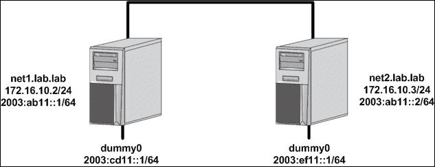
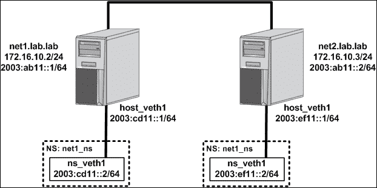
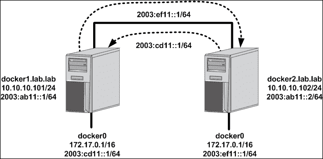
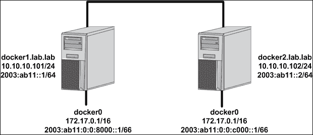

# 十、利用 IPv6

在本章中，我们将介绍以下食谱:

*   IPv6 命令行基础
*   在 Docker 中启用 IPv6 功能
*   使用支持 IPv6 的容器
*   配置 NDP 代理
*   用户定义的网络和 IPv6

# 简介

到目前为止，我们只关注 IPv4 网络。然而，IPv4 并不是我们唯一可用的 IP 协议。尽管 IPv4 仍然是最广为人知的协议，但 IPv6 已经开始获得巨大的吸引力。公共 IPv4 空间已经耗尽，许多人也开始预见到私有 IPv4 分配不足的问题。IPv6 希望通过定义一组更大的可用 IP 空间来克服这个问题。然而，IPv6 做了一些不同于 IPv4 的事情，让一些人认为实现 IPv6 会很麻烦。我认为，当您考虑部署容器技术时，您也应该考虑如何有效地利用 IPv6。尽管 IPv6 是一种不同的动物，但它很快将成为许多网络的要求。容器代表了在您的网络上引入更多 IP 端点的可能性，所以尽早过渡是个好主意。在本章中，我们将了解 Docker 目前支持哪些 IPv6 功能。

# IPv6 命令行基础

即使你了解了 IPv6 协议的基础知识，第一次在 Linux 主机上使用 IPv6 可能会有点让人望而生畏。与 IPv4 非常相似，IPv6 有自己独特的一套命令行工具，可用于配置和排除 IPv6 连接故障。其中一些工具与我们在 IPv4 中使用的相同，只是使用了略有不同的语法。其他工具完全是 IPv6 独有的。在本食谱中，我们将逐步完成基本 IPv6 连接的配置和验证。

## 做好准备

在本食谱中，我们将使用一个由两台 Linux 主机组成的小型实验室:


每个主机都有一个 IPv4 地址和一个分配给其物理接口的 IPv6 地址。您需要对每台主机进行根级访问，以更改网络配置。

### 注

本食谱的目的不是教授 IPv6 或 IPv6 网络设计的基础知识。本配方中的示例仅用于示例目的。虽然我们可能会在示例中介绍一些基础知识，但我们假设读者对 IPv6 协议的工作原理有一个基本的了解。

## 怎么做…

如上图所示，每个 Linux 主机都被分配了一个 IPv4 和一个 IPv6 IP 地址。这些都是作为主机网络配置脚本的一部分配置的。以下是两台实验主机的配置示例:

*   `net1.lab.lab`

    ```
    auto eth0
    iface eth0 inet static
            address 172.16.10.2
            netmask 255.255.255.0
            gateway 172.16.10.1
            dns-nameservers 10.20.30.13
            dns-search lab.lab
    iface eth0 inet6 static
     address 2003:ab11::1
     netmask 64

    ```

*   `net2.lab.lab`

    ```
    auto eth0
    iface eth0 inet static
            address 172.16.10.3
            netmask 255.255.255.0
            gateway 172.16.10.1
            dns-nameservers 10.20.30.13
            dns-search lab.lab
    iface eth0 inet6 static
     address 2003:ab11::2
     netmask 64

    ```

请注意，在每种情况下，我们都会将 IPv6 地址添加到现有的物理网络接口。在这种类型的配置中，IPv4 和 IPv6 地址共存于同一个网卡上。这通常被称为运行**双栈**，因为两个协议共享相同的物理适配器。配置完成后，您需要重新加载接口以使配置生效。然后，您应该能够通过使用`ifconfig`工具或`ip` ( `iproute2`)工具集来确认每台主机的配置是否正确:

```
user@net1:~$ ifconfig eth0
eth0      Link encap:Ethernet  HWaddr 00:0c:29:2d:dd:79
inet addr:172.16.10.2  Bcast:172.16.10.255  Mask:255.255.255.0
 inet6 addr: fe80::20c:29ff:fe2d:dd79/64 Scope:Link
 inet6 addr: 2003:ab11::1/64 Scope:Global
          UP BROADCAST RUNNING MULTICAST  MTU:1500  Metric:1
          RX packets:308 errors:0 dropped:0 overruns:0 frame:0
          TX packets:348 errors:0 dropped:0 overruns:0 carrier:0
          collisions:0 txqueuelen:1000
          RX bytes:32151 (32.1 KB)  TX bytes:36732 (36.7 KB)
user@net1:~$

user@net2:~$ ip -6 addr show dev eth0
2: eth0: <BROADCAST,MULTICAST,UP,LOWER_UP> mtu 1500 qlen 1000
 inet6 2003:ab11::2/64 scope global
       valid_lft forever preferred_lft forever
 inet6 fe80::20c:29ff:fe59:caca/64 scope link
       valid_lft forever preferred_lft forever
user@net2:~$
```

使用较旧的`ifconfig`工具的好处是可以同时看到 IPv4 和 IPv6 接口信息。使用`ip`工具时，您需要通过传递`-6`标志来指定您希望查看 IPv6 信息。稍后当我们使用`ip`工具配置 IPv6 接口时，我们会看到这是同样的情况。

无论是哪种情况，两台主机现在似乎都在其`eth0`接口上配置了 IPv6。但是，请注意，我们实际上定义了两个 IPv6 地址。您会注意到，一个地址的范围是本地的，另一个地址的范围是全局的。在 IPv6 中，每个 IP 接口都被分配了一个全局和一个本地 IPv6 地址。本地范围的接口只对分配给它的链路上的通信有效，通常用于到达同一网段上的相邻设备。在大多数情况下，链路本地地址由主机本身动态确定。这意味着，即使您没有在接口上专门配置全局 IPv6 地址，启用 IPv6 的接口几乎总是定义了链路本地 IPv6 地址。使用链路本地 IP 地址的数据包不会被路由器转发，路由器会将其限制在定义的网段内。在我们的大部分讨论中，我们将关注全球演讲。

### 注

除非另有说明，否则对 IPv6 地址的任何进一步引用都是指全局范围的 IPv6 地址。

由于我们的两台主机位于同一子网，因此我们应该能够使用 IPv6 从另一台服务器到达另一台服务器:

```
user@net1:~$ ping6 2003:ab11::2 -c 2
PING 2003:ab11::2(2003:ab11::2) 56 data bytes
64 bytes from 2003:ab11::2: icmp_seq=1 ttl=64 time=0.422 ms
64 bytes from 2003:ab11::2: icmp_seq=2 ttl=64 time=0.401 ms
--- 2003:ab11::2 ping statistics ---
2 packets transmitted, 2 received, 0% packet loss, time 999ms
rtt min/avg/max/mdev = 0.401/0.411/0.422/0.022 ms
user@net1:~$
```

请注意，我们不是使用标准 ping 工具，而是使用`ping6`工具来验证 IPv6 可达性。

我们最不想检查的是邻居发现表。IPv6 的另一个主要变化是，它不使用 ARP 来查找 IP 端点的硬件或媒体访问控制地址。主要原因是 IPv6 不支持广播流量。ARP 依赖广播工作，所以不能在 IPv6 中使用。相反，IPv6 使用利用多播的邻居发现。

也就是说，在排除本地网络故障时，您需要查看邻居发现表，而不是 ARP 表。为此，我们可以使用熟悉的`iproute2`工具集:

```
user@net1:~$ ip -6 neighbor show
fe80::20c:29ff:fe59:caca dev eth0 lladdr 00:0c:29:59:ca:ca DELAY
2003:ab11::2 dev eth0 lladdr 00:0c:29:59:ca:ca REACHABLE
user@net1:~$
```

与 ARP 表非常相似，邻居表向我们显示了我们希望到达的 IPv6 地址的硬件或 MAC 地址。请注意，像以前一样，我们将`-6`标志传递给`ip`命令，告诉它我们想要 IPv6 信息。

现在已经有了基本的连接，让我们给每台主机增加一个新的 IPv6 接口。为此，我们遵循几乎与添加 IPv4 接口时相同的步骤。例如，添加虚拟接口几乎是一样的:

```
user@net1:~$ sudo ip link add ipv6_dummy type dummy
user@net1:~$ sudo ip -6 address add 2003:cd11::1/64 dev ipv6_dummy
user@net1:~$ sudo ip link set ipv6_dummy up
```

请注意，唯一的区别是我们需要告诉`iproute2`我们通过再次传递`-6`标志来指定 IPv6 地址。在所有其他方面，配置与我们在 IPv4 中的配置相同。让我们也在第二台主机上配置另一个虚拟接口:

```
user@net2:~$ sudo ip link add ipv6_dummy type dummy
user@net2:~$ sudo ip -6 address add 2003:ef11::1/64 dev ipv6_dummy
user@net2:~$ sudo ip link set ipv6_dummy up
```

此时，我们的拓扑结构如下所示:



现在让我们检查每台主机上的 IPv6 路由表。和以前一样，我们也可以使用`iproute2`工具检查 IPv6 路由表:

```
user@net1:~$ ip -6 route
2003:ab11::/64 dev eth0  proto kernel  metric 256  pref medium
2003:cd11::/64 dev ipv6_dummy  proto kernel  metric 256  pref medium
fe80::/64 dev eth0  proto kernel  metric 256  pref medium
fe80::/64 dev ipv6_dummy  proto kernel  metric 256  pref medium
user@net1:~$

user@net2:~$ ip -6 route
2003:ab11::/64 dev eth0  proto kernel  metric 256  pref medium
2003:ef11::/64 dev ipv6_dummy  proto kernel  metric 256  pref medium
fe80::/64 dev eth0  proto kernel  metric 256  pref medium
fe80::/64 dev ipv6_dummy  proto kernel  metric 256  pref medium
user@net2:~$
```

我们可以看到，每台主机都知道其直连接口，但不知道其他主机的虚拟接口。为了让任何一台主机到达其他主机的虚拟接口，我们需要通过路由到达它。由于这些主机是直接连接的，这可以通过添加默认的 IPv6 路由来解决。每条默认路由都将另一台主机作为下一跳。虽然这是可行的，但是让我们为引用虚拟接口所在网络的每台主机添加特定路由:

```
user@net1:~$ sudo ip -6 route add 2003:ef11::/64 via 2003:ab11::2
user@net2:~$ sudo ip -6 route add 2003:cd11::/64 via 2003:ab11::1

```

添加这些路由后，任一台主机都应该能够到达其他主机的`ipv6_dummy`界面:

```
user@net1:~$ ping6 2003:ef11::1 -c 2
PING 2003:ef11::1(2003:ef11::1) 56 data bytes
64 bytes from 2003:ef11::1: icmp_seq=1 ttl=64 time=0.811 ms
64 bytes from 2003:ef11::1: icmp_seq=2 ttl=64 time=0.408 ms
--- 2003:ef11::1 ping statistics ---
2 packets transmitted, 2 received, 0% packet loss, time 999ms
rtt min/avg/max/mdev = 0.408/0.609/0.811/0.203 ms
user@net1:~$
```

### 注

您可能会注意到，只需在一台主机上添加一条路由，该主机就可以到达另一台主机上的虚拟接口。这是因为我们只需要路由就可以让发起主机的流量消失。流量将由主机`eth0`接口(`2003:ab11::/64`)提供，其他主机本身就知道如何到达该接口。如果 ping 来自虚拟接口，则需要两条路由才能工作。

现在我们已经配置并验证了基本的连接，让我们进行最后一步，使用网络名称空间重建这些接口。为此，让我们首先清理虚拟接口，因为我们将在名称空间内重用这些 IPv6 子网:

```
user@net1:~$ sudo ip link del dev ipv6_dummy
user@net2:~$ sudo ip link del dev ipv6_dummy
```

我们需要的配置如下:



虽然与上一个配置非常相似，但有两大区别。您会注意到，我们现在正在使用网络名称空间来封装新的接口。这样，我们已经为 VETH 对一侧的新接口配置了 IPv6 地址。VETH 对的另一端位于默认网络命名空间中的主机上。

### 注

如果您对其中一些 Linux 网络结构不满意，请查看[第 1 章](01.html "Chapter 1. Linux Networking Constructs")、 *Linux 网络结构*，在这里我们将更详细地讨论名称空间和 VETH 接口。

为此，我们将应用以下配置:

添加名为`net1_ns`的新网络命名空间:

```
user@net1:~$ sudo ip netns add net1_ns
```

创建一个 VETH 对，命名一端`host_veth1`和另一端`ns_veth1`:

```
user@net1:~$ sudo ip link add host_veth1 type veth peer name ns_veth1
```

将 VETH 对的命名空间侧移动到命名空间中:

```
user@net1:~$ sudo ip link set dev ns_veth1 netns net1_ns
```

在命名空间中，给 VETH 接口一个 IP 地址:

```
user@net1:~$ sudo ip netns exec net1_ns ip -6 address \
add 2003:cd11::2/64 dev ns_veth1
```

在命名空间中，调出接口:

```
user@net1:~$ sudo ip netns exec net1_ns ip link set ns_veth1 up
```

在命名空间中，添加一条到达另一台主机上的命名空间的路由:

```
user@net1:~$ sudo ip netns exec net1_ns ip -6 route \
add 2003:ef11::/64 via 2003:cd11::1
```

给 VETH 对的主机端一个 IP 地址:

```
user@net1:~$ sudo ip -6 address add 2003:cd11::1/64 dev host_veth1
```

调出 VETH 接口的主机端:

```
user@net1:~$ sudo ip link set host_veth1 up
```

### 注

请注意，我们只在名称空间中添加了一条到达另一个名称空间的路由。我们没有在 Linux 主机上添加相同的路由。这是因为为了到达虚拟界面，我们已经在配方的前面做了。如果您删除了该路由，则需要重新添加它才能正常工作。

我们现在必须在第二台主机上执行类似的配置:

```
user@net2:~$ sudo ip netns add net2_ns
user@net2:~$ sudo ip link add host_veth1 type veth peer name ns_veth1
user@net2:~$ sudo ip link set dev ns_veth1 netns net2_ns
user@net2:~$ sudo ip netns exec net2_ns ip -6 address add \
2003:ef11::2/64 dev ns_veth1
user@net2:~$ sudo ip netns exec net2_ns ip link set ns_veth1 up
user@net2:~$ sudo ip netns exec net2_ns ip -6 route add \
2003:cd11::/64 via 2003:ef11::1
user@net2:~$ sudo ip -6 address add 2003:ef11::1/64 dev host_veth1
user@net2:~$ sudo ip link set host_veth1 up
```

添加后，您应该能够验证每个命名空间都有到达其他主机命名空间所需的路由信息:

```
user@net1:~$ sudo ip netns exec net1_ns ip -6 route
2003:cd11::/64 dev ns_veth1  proto kernel  metric 256  pref medium
2003:ef11::/64 via 2003:cd11::1 dev ns_veth1  metric 1024  pref medium
fe80::/64 dev ns_veth1  proto kernel  metric 256  pref medium
user@net1:~$
user@net2:~$ sudo ip netns exec net2_ns ip -6 route
2003:cd11::/64 via 2003:ef11::1 dev ns_veth1  metric 1024  pref medium
2003:ef11::/64 dev ns_veth1  proto kernel  metric 256  pref medium
fe80::/64 dev ns_veth1  proto kernel  metric 256  pref medium
user@net2:~$
```

但是当我们试图从一个名称空间到达另一个名称空间时，连接失败了:

```
user@net1:~$ sudo ip netns exec net1_ns ping6 2003:ef11::2 -c 2
PING 2003:ef11::2(2003:ef11::2) 56 data bytes
--- 2003:ef11::2 ping statistics ---
2 packets transmitted, 0 received, 100% packet loss, time 1007ms
user@net1:~$
```

这是因为我们现在正试图使用 Linux 主机作为路由器。如果你还记得前几章，当我们希望 Linux 内核转发或路由数据包时，我们必须启用该功能。这是通过在每台主机上更改这两个内核参数来实现的:

```
user@net1:~$ sudo sysctl net.ipv6.conf.default.forwarding=1
net.ipv6.conf.default.forwarding = 1
user@net1:~$ sudo sysctl net.ipv6.conf.all.forwarding=1
net.ipv6.conf.all.forwarding = 1
```

### 注

请记住，以这种方式定义时，这些设置不会在重新启动时保持不变。

一旦在两台主机上进行了这些设置，您的 ping 应该开始工作了:

```
user@net1:~$ sudo ip netns exec net1_ns ping6 2003:ef11::2 -c 2
PING 2003:ef11::2(2003:ef11::2) 56 data bytes
64 bytes from 2003:ef11::2: icmp_seq=1 ttl=62 time=0.540 ms
64 bytes from 2003:ef11::2: icmp_seq=2 ttl=62 time=0.480 ms
--- 2003:ef11::2 ping statistics ---
2 packets transmitted, 2 received, 0% packet loss, time 999ms
rtt min/avg/max/mdev = 0.480/0.510/0.540/0.030 ms
user@net1:~$
```

有趣的是，一旦在内核中启用了 IPv6 转发，请检查主机上的邻居表:

```
user@net1:~$ ip -6 neighbor
2003:ab11::2 dev eth0 lladdr 00:0c:29:59:ca:ca router STALE
2003:cd11::2 dev host_veth1 lladdr a6:14:b5:39:da:96 STALE
fe80::20c:29ff:fe59:caca dev eth0 lladdr 00:0c:29:59:ca:ca router STALE
fe80::a414:b5ff:fe39:da96 dev host_veth1 lladdr a6:14:b5:39:da:96 STALE
user@net1:~$
```

你能注意到其他 Linux 主机的邻居条目有什么不同吗？它现在有`router`标志作为邻居定义的一部分。当内核中启用 IPv6 转发时，Linux 主机会将自己宣传为网段上的路由器。

# 在 Docker 中启用 IPv6 功能

在 Docker 中，IPv6 功能默认被禁用。很像我们之前回顾的其他特性，启用它需要在服务级别这样做。一旦启用，Docker 将为与 Docker 相关联的主机接口以及容器本身提供 IPv6 寻址。

## 做好准备

在本食谱中，我们将使用一个由两台 Docker 主机组成的小型实验室:


每台主机都有分配给其物理接口的 IPv4 地址和 IPv6 地址。您需要对每台主机进行根级访问，以更改网络配置。假设安装了 Docker，这是默认配置。

## 怎么做…

如上所述，除非被告知，否则 Docker 不会为容器提供 IPv6 地址。为了在 Docker 中启用 IPv6，我们需要向 Docker 服务传递一个服务级别标志。

### 注

如果您需要了解如何定义 Docker 服务级别参数，请参阅[第 2 章](02.html "Chapter 2. Configuring and Monitoring Docker Networks")、*配置和监控 Docker 网络*中的最后一个方法，我们将在运行`systemd`的系统上讨论如何配置这些参数。

除了启用 IPv6 功能，您还需要为`docker0`网桥定义一个子网。为此，我们将为 Docker 修改我们的`systemd`插件文件，并确保它具有以下选项:

*   主机上`docker1` :

    ```
    ExecStart=/usr/bin/dockerd --ipv6 --fixed-cidr-v6=2003:cd11::/64
    ```

*   主机上`docker2` :

    ```
    ExecStart=/usr/bin/dockerd --ipv6 --fixed-cidr-v6=2003:ef11::/64
    ```

如果我们应用此配置，重新加载`systemd`配置并在每台主机上重新启动 Docker 服务，我们应该会看到`docker0`桥已经从定义的 IPv6 CIDR 范围中获取了第一个可用的 IP 地址:

```
user@docker1:~$ ip -6 addr show dev docker0
3: docker0: <NO-CARRIER,BROADCAST,MULTICAST,UP> mtu 1500
    inet6 2003:cd11::1/64 scope global tentative
       valid_lft forever preferred_lft forever
    inet6 fe80::1/64 scope link tentative
       valid_lft forever preferred_lft forever
user@docker1:~$

user@docker2:~$ ip -6 addr show dev docker0
5: docker0: <NO-CARRIER,BROADCAST,MULTICAST,UP> mtu 1500
 inet6 2003:ef11::1/64 scope global tentative
       valid_lft forever preferred_lft forever
    inet6 fe80::1/64 scope link tentative
       valid_lft forever preferred_lft forever
user@docker2:~$
```

在这一点上，我们的拓扑看起来很像它在第一个食谱:


Docker 将向它创建的每个容器发出一个 IPv6 地址和一个 IPv4 地址。让我们在第一台主机上旋转一个容器，看看我的意思:

```
user@docker1:~$ docker run -d --name=web1 jonlangemak/web_server_1
50d522d176ebca2eac0f7e826ffb2e36e754ce27b3d3b4145aa8a11c6a13cf15
user@docker1:~$
```

注意我们没有将`-P`标志传递给容器来公布容器暴露的港口。如果我们在本地测试，我们可以验证主机可以从容器的 IPv4 和 IPv6 地址到达容器内的服务:

```
user@docker1:~$ docker exec web1 ifconfig eth0
eth0      Link encap:Ethernet  HWaddr 02:42:ac:11:00:02
          inet addr:172.17.0.2  Bcast:0.0.0.0  Mask:255.255.0.0
          inet6 addr: fe80::42:acff:fe11:2/64 Scope:Link
 inet6 addr: 2003:cd11::242:ac11:2/64 Scope:Global
          UP BROADCAST RUNNING MULTICAST  MTU:1500  Metric:1
          RX packets:16 errors:0 dropped:0 overruns:0 frame:0
          TX packets:8 errors:0 dropped:0 overruns:0 carrier:0
          collisions:0 txqueuelen:0
          RX bytes:1792 (1.7 KB)  TX bytes:648 (648.0 B)

user@docker1:~$ curl http://172.17.0.2
<body>
  <html>
    <h1><span style="color:#FF0000;font-size:72px;">Web Server #1 - Running on port 80</span>
    </h1>
</body>
  </html>
user@docker1:~$ curl -g http://[2003:cd11::242:ac11:2]
<body>
  <html>
    <h1><span style="color:#FF0000;font-size:72px;">Web Server #1 - Running on port 80</span>
    </h1>
</body>
  </html>
user@docker1:~$
```

### 注

使用带 IPv6 地址的`curl`时，需要将 IPv6 地址放在括号内，然后通过传递`-g`标志告诉`curl`不要 glob。

我们可以看到，IPv6 地址的行为与 IPv4 地址相同。同样，同一台主机上的容器可以使用其分配的 IPv6 地址通过`docker0`桥直接相互对话。让我们在同一台主机上启动第二个容器:

```
user@docker1:~$ docker run -d --name=web2 jonlangemak/web_server_2
```

快速的验证将向我们证明，这两个容器被允许使用它们的 IPv6 地址直接相互对话，正如预期的那样:

```
user@docker1:~$ docker exec web2 ip -6 addr show dev eth0
10: eth0@if11: <BROADCAST,MULTICAST,UP,LOWER_UP> mtu 1500
    inet6 2003:cd11::242:ac11:3/64 scope global nodad
       valid_lft forever preferred_lft forever
    inet6 fe80::42:acff:fe11:3/64 scope link
       valid_lft forever preferred_lft forever
user@docker1:~$
user@docker1:~$ docker exec -it web1 curl -g \
http://[2003:cd11::242:ac11:3]
<body>
  <html>
    <h1><span style="color:#FF0000;font-size:72px;">Web Server #2 - Running on port 80</span>
    </h1>
</body>
  </html>
user@docker1:~$
```

# 使用支持 IPv6 的容器

在之前的配方中，我们看到了 Docker 如何处理支持 IPv6 的容器的基本分配。到目前为止，我们看到的行为与我们在前面章节中看到的仅处理 IPv4 寻址容器的行为非常相似。然而，并非所有的网络功能都是如此。Docker 目前在 IPv4 和 IPv6 之间没有完整的功能奇偶校验。也就是说，正如我们将在本食谱中看到的，Docker 没有支持 IPv6 的容器的`iptables` (ip6tables)集成。在本章中，我们将回顾一些网络功能，这些功能是我们之前使用仅支持 IPv4 的容器访问的，并查看它们在使用 IPv6 寻址时的表现。

## 做好准备

在这个配方中，我们将在之前配方中构建的实验室的基础上进行构建。您需要对每台主机进行根级访问，以更改网络配置。假设安装了 Docker，这是默认配置。

## 怎么做…

如上所述，Docker 目前没有主机防火墙，特别是 netfilter 或`iptables`，集成 IPv6。这意味着，在处理容器 IPv6 地址时，我们以前依赖于 IPv4 的几个功能会有所不同。让我们从一些基本功能开始。在之前的食谱中，我们看到同一个主机上的两个容器，连接到`docker0`桥，可以直接相互对话。

当使用 IPv4 地址时，这种行为是意料之中的，并且以几乎相同的方式工作。如果我们想阻止这种通信，我们可以在 Docker 服务中禁用**容器间通信** ( **ICC** )。让我们更新主机上的 Docker 选项`docker1`，将 ICC 设置为`false`:

```
ExecStart=/usr/bin/dockerd --icc=false --ipv6 --fixed-cidr-v6=2003:cd11::/64
```

然后，我们可以重新加载`systemd`配置，重启 Docker 服务，重启容器:

```
user@docker1:~$ docker start web1
web1
user@docker1:~$ docker start web2
web2
user@docker1:~$ docker exec web2 ifconfig eth0
eth0      Link encap:Ethernet  HWaddr 02:42:ac:11:00:03
          inet addr:172.17.0.3  Bcast:0.0.0.0  Mask:255.255.0.0
          inet6 addr: fe80::42:acff:fe11:3/64 Scope:Link
          inet6 addr: 2003:cd11::242:ac11:3/64 Scope:Global
          UP BROADCAST RUNNING MULTICAST  MTU:1500  Metric:1
          RX packets:12 errors:0 dropped:0 overruns:0 frame:0
          TX packets:8 errors:0 dropped:0 overruns:0 carrier:0
          collisions:0 txqueuelen:0
          RX bytes:1128 (1.1 KB)  TX bytes:648 (648.0 B)

user@docker1:~$
user@docker1:~$ docker exec -it web1 curl http://172.17.0.3
curl: (7) couldn't connect to host
user@docker1:~$ docker exec -it web1 curl -g \
http://[2003:cd11::242:ac11:3]
<body>
  <html>
    <h1><span style="color:#FF0000;font-size:72px;">Web Server #2 - Running on port 80</span>
    </h1>
</body>
  </html>
user@docker1:~$
```

正如我们看到的，IPv4 上的尝试失败，随后的 IPv6 尝试成功。由于 Docker 不管理与容器 IPv6 地址相关的任何防火墙规则，因此没有什么可以阻止 IPv6 地址之间的直接连接。

由于 Docker 不管理与 IPv6 相关的防火墙规则，您可能还会认为出站伪装和端口发布等功能也不再起作用。虽然从 Docker 没有创建 IPv6 关联的 NAT 规则和防火墙策略的意义上来说，这是正确的，但这并不意味着无法从外部网络访问容器的 IPv6 地址。让我们通过一个例子向你展示我的意思。让我们在第二个 Docker 主机上启动一个容器:

```
user@docker2:~$ docker run -dP --name=web2 jonlangemak/web_server_2
5e2910c002db3f21aa75439db18e5823081788e69d1e507c766a0c0233f6fa63
user@docker2:~$
user@docker2:~$ docker port web2
80/tcp -> 0.0.0.0:32769
user@docker2:~$
```

请注意，当我们在主机`docker2`上运行容器时，我们传递了`-P`标志来告诉 Docker 发布容器的公开端口。如果我们检查端口映射，我们可以看到主机已经选择了端口`32768`。请注意，端口映射表示`0.0.0.0`的一个 IP 地址，它通常表示任何 IPv4 地址。让我们从另一台 Docker 主机上执行一些快速测试，以验证哪些工作正常，哪些工作不正常:

```
user@docker1:~$ curl http://10.10.10.102:32769
<body>
  <html>
    <h1><span style="color:#FF0000;font-size:72px;">Web Server #2 - Running on port 80</span>
    </h1>
</body>
  </html>
user@docker1:~$
```

正如预期的那样，IPv4 端口映射工作正常。通过利用`iptables` NAT 规则将端口`32769`映射到`80`的实际服务端口，我们能够通过 Docker hosts IPv4 地址访问容器服务。现在让我们尝试相同的示例，但使用主机的 IPv6 地址:

```
user@docker1:~$ curl -g http://[2003:ab11::2]:32769
<body>
  <html>
    <h1><span style="color:#FF0000;font-size:72px;">Web Server #2 - Running on port 80</span>
    </h1>
</body>
  </html>
user@docker1:~$
```

令人惊讶的是，这也有效。考虑到 Docker 不管理或不集成任何主机 IPv6 防火墙策略，您可能想知道这是如何工作的。答案其实很简单。如果我们查看第二个 Docker 主机开放的端口，我们会看到有一个`docker-proxy`服务绑定到端口`32769`:

```
user@docker2:~$ sudo netstat -plnt
…<output removed for brevity>…
Active Internet connections (only servers)
Local Address   Foreign Address         State       PID/Program name
0.0.0.0:22      0.0.0.0:*               LISTEN      1387/sshd
127.0.0.1:6010  0.0.0.0:*               LISTEN      3658/0
:::22           :::*                    LISTEN      1387/sshd
::1:6010        :::*                    LISTEN      3658/0
:::32769        :::*                    LISTEN      2390/docker-proxy
user@docker2:~$
```

正如我们在前面章节中看到的，`docker-proxy`服务促进了容器间和已发布端口的连接。为了实现这一点，`docker-proxy`服务必须绑定到容器发布的端口。回想一下，监听所有 IPv4 接口的服务使用`0.0.0.0`的语法来表示所有 IPv4 接口。以类似的方式，IPv6 接口使用`:::`的语法来指示同样的事情。您会注意到`docker-proxy`端口引用了所有的 IPv6 接口。尽管这可能因您的操作系统而异，但绑定到所有 IPv6 接口也意味着绑定到所有 IPv4 接口。也就是说，前面的`docker-proxy`服务实际上正在侦听所有主机的 IPv4 和 IPv6 接口。

### 注

请记住`docker-proxy`通常不用于入站服务。这些依赖于`iptables` NAT 规则将发布的端口映射到容器。然而，在这些规则不存在的情况下，主机仍然在其所有接口上监听到端口`32769`的流量。

这样做的最终结果是，尽管没有 IPv6 NAT 规则，我仍然能够通过 Docker 主机接口访问容器服务。这样，使用 IPv6 发布的端口仍然可以工作。然而，这仅在使用`docker-proxy`时有效。虽然这种操作模式仍然是默认的，但它将被删除，取而代之的是发夹型 NAT。我们可以在 Docker 主机上启用发夹 NAT，方法是将`--userland-proxy=false`参数作为服务级别选项传递给 Docker。这样做会阻止这种 IPv6 端口发布方式的工作。

最后，缺少防火墙集成也意味着我们不再支持出站伪装功能。在 IPv4 中，这个特性允许容器与外部网络对话，而不必担心路由或 IP 地址重叠。离开主机的容器流量总是隐藏在主机的一个 IP 接口后面。然而，这不是一个强制配置。正如我们在前面几章中看到的，您可以非常容易地禁用出站伪装功能，并为`docker0`网桥提供一个可路由的 IP 地址和子网。只要外部网络知道如何到达该子网，容器就很容易拥有唯一的可路由 IP 地址。

IPv6 出现的原因之一是因为 IPv4 地址的快速耗尽。IPv4 中的 NAT 在很大程度上成功地解决了地址耗尽问题，尽管同样麻烦。这意味着许多人认为我们不应该对 IPv6 实施任何类型的网络地址转换。相反，所有 IPv6 前缀都应该是本地可路由和可达的，而不需要混淆 IP 转换。由于缺乏 IPv6 防火墙集成，将 IPv6 流量本地路由到每台主机是 Docker 目前促进跨多台 Docker 主机和外部网络可达性的手段。这要求每个 Docker 主机使用唯一的 IPv6 CIDR 范围，并且 Docker 主机知道如何到达所有其他 Docker 主机定义的 CIDR 范围。虽然这通常要求物理网络具有网络可达性信息，但在我们简单的实验示例中，每台主机只需要一条到其他主机 CIDR 的静态路由。就像我们在第一个食谱中所做的那样，我们将在每台主机上添加一条 IPv6 路由，这样双方都知道如何到达另一个`docker0`网桥的 IPv6 子网:

```
user@docker1:~$ sudo ip -6 route add 2003:ef11::/64 via 2003:ab11::2
user@docker2:~$ sudo ip -6 route add 2003:cd11::/64 via 2003:ab11::1
```

添加路由后，每个 Docker 主机都知道如何到达另一台主机的 IPv6 `docker0`桥接子网:



如果我们现在检查，我们应该在每个主机上的容器之间有可达性:

```
user@docker2:~$ docker exec web2 ifconfig eth0
eth0      Link encap:Ethernet  HWaddr 02:42:ac:11:00:02
          inet addr:172.17.0.2  Bcast:0.0.0.0  Mask:255.255.0.0
          inet6 addr: fe80::42:acff:fe11:2/64 Scope:Link
          inet6 addr: 2003:ef11::242:ac11:2/64 Scope:Global
          UP BROADCAST RUNNING MULTICAST  MTU:1500  Metric:1
          RX packets:43 errors:0 dropped:0 overruns:0 frame:0
          TX packets:34 errors:0 dropped:0 overruns:0 carrier:0
          collisions:0 txqueuelen:0
          RX bytes:3514 (3.5 KB)  TX bytes:4155 (4.1 KB)

user@docker2:~$
user@docker1:~$ docker exec -it web1 curl -g http://[2003:ef11::242:ac11:2]
<body>
  <html>
    <h1><span style="color:#FF0000;font-size:72px;">Web Server #2 - Running on port 80</span>
    </h1>
</body>
  </html>
user@docker1:~$
```

我们可以看到，主机`docker1`上的容器能够成功地直接路由到主机`docker2`上运行的容器。因此，只要每个 Docker 主机都有适当的路由信息，容器就能够直接相互路由。

这种方法的缺点是容器现在是一个完全暴露的网络端点。我们不再获得通过 Docker 发布的端口只向外部网络公开某些端口的优势。如果您想确保在您的 IPv6 接口上只暴露某些端口，此时用户域代理可能是您的最佳选择。在围绕 IPv6 连接设计服务时，请记住这些选项。

# 配置 NDP 代理

正如我们在上一份食谱中看到的，Docker 中 IPv6 支持的主要区别之一是缺少防火墙集成。没有这种集成，我们将失去出站伪装和完整的端口发布功能。虽然这可能不是在所有情况下都是必要的，但当不使用它时，会失去某些便利因素。例如，当在仅 IPv4 模式下运行时，管理员可以安装 Docker，并立即将您的容器连接到外部网络。这是因为只有通过 Docker 主机的 IP 地址才能看到容器的入站(发布端口)和出站(伪装)连接。这意味着不需要向外部网络通知额外的子网，因为外部网络只看到 Docker 主机的 IP 地址。在 IPv6 模型中，外部网络必须知道容器子网才能路由到它们。在本章中，我们将回顾如何配置 NDP 代理来解决这个问题。

## 做好准备

在本食谱中，我们将使用以下实验拓扑:


您需要对每台主机进行根级访问，以更改网络配置。假设安装了 Docker，这是默认配置。

## 怎么做…

前面的拓扑显示，我们的主机是双栈连接到网络，但 Docker 尚未配置为使用 IPv6。正如我们在前面的配方中看到的，为 IPv6 配置 Docker 通常也意味着在外部网络上配置路由，因此它知道如何到达您为`docker0`网桥定义的 IPv6 CIDR。然而，暂时假设这是不可能的。假设您无法控制外部网络，这意味着您无法向其他网络端点通告或通知 Docker 主机上任何新定义的 IPv6 子网。

我们还假设，虽然您不能通告任何新定义的 IPv6 网络，但是您可以在现有网络中保留额外的 IPv6 空间。例如，主机当前具有在`2003:ab11::/64`网络中定义的接口。如果我们瓜分这个空间，我们可以把它分成四个`/66`网络:

*   `2003:ab11::/66`
*   `2003:ab11:0:0:4000::/66`
*   `2003:ab11:0:0:8000::/66`
*   `2003:ab11:0:0:c000::/66`

让我们假设允许我们保留最后两个子网供我们使用。我们现在可以在 Docker 中启用 IPv6，并将这两个网络分配为 IPv6 CIDR 范围。以下是每个 Docker 主机的配置选项:

*   `docker1`

    ```
    ExecStart=/usr/bin/dockerd --ipv6 --fixed-cidr-v6=2003:ab11:0:0:8000::/66
    ```

*   `docker2`

    ```
    ExecStart=/usr/bin/dockerd --ipv6 --fixed-cidr-v6=2003:ab11:0:0:c000::/66
    ```

将新配置加载到`systemd`并重新启动 Docker 服务后，我们的实验室拓扑现在看起来如下:



让我们在两台主机上启动一个容器:

```
user@docker1:~$ docker run -d --name=web1 jonlangemak/web_server_1
user@docker2:~$ docker run -d --name=web2 jonlangemak/web_server_2
```

现在确定`web1`容器的分配的 IPv6 地址:

```
user@docker1:~$ docker exec web1 ip -6 addr show dev eth0
4: eth0@if5: <BROADCAST,MULTICAST,UP,LOWER_UP> mtu 1500
    inet6 2003:ab11::8000:242:ac11:2/66 scope global nodad
       valid_lft forever preferred_lft forever
    inet6 fe80::42:acff:fe11:2/64 scope link
       valid_lft forever preferred_lft forever
user@docker1:~$
```

现在，让我们试着从`web2`容器到达那个容器:

```
user@docker2:~$ docker exec -it web2 ping6 \
2003:ab11::8000:242:ac11:2  -c 2
PING 2003:ab11::8000:242:ac11:2 (2003:ab11::8000:242:ac11:2): 48 data bytes
56 bytes from 2003:ab11::c000:0:0:1: Destination unreachable: Address unreachable
56 bytes from 2003:ab11::c000:0:0:1: Destination unreachable: Address unreachable
--- 2003:ab11::8000:242:ac11:2 ping statistics ---
2 packets transmitted, 0 packets received, 100% packet loss
user@docker2:~$
```

这将失败，因为 Docker 主机认为目的地址直接连接到他们的`eth0`接口。当`web2`容器尝试连接时，会发生以下操作:

*   容器进行路由查找，并确定地址`2003:ab11::8000:242:ac11:2`不在它的本地子网`2003:ab11:0:0:c000::1/66`内，因此它将流量转发到它的默认网关(T2 桥接口)
*   主机接收流量并进行路由查找，确定`2003:ab11::8000:242:ac11:2`的目的地址位于其本地子网`2003:ab11::/64` ( `eth0`)内，并使用 NDP 尝试找到具有该目的 IP 地址的主机
*   主机没有收到对此查询的响应，流程失败

我们可以通过检查`docker2`主机的 IPv6 邻居表来验证这是否发生:

```
user@docker2:~$ ip -6 neighbor show
fe80::20c:29ff:fe50:b8cc dev eth0 lladdr 00:0c:29:50:b8:cc STALE
2003:ab11::c000:242:ac11:2 dev docker0 lladdr 02:42:ac:11:00:02 REACHABLE
2003:ab11::8000:242:ac11:2 dev eth0  FAILED
fe80::42:acff:fe11:2 dev docker0 lladdr 02:42:ac:11:00:02 REACHABLE
user@docker2:~$
```

遵循正常的路由逻辑，一切都按照它应该的方式运行。然而，IPv6 有一个名为 NDP 代理的功能，可以帮助解决这个问题。熟悉 IPv4 中代理 ARP 的人会发现 NDP 代理提供了类似的功能。本质上，NDP 代理允许主机代表另一个端点回答邻居请求。在我们的例子中，我们可以告诉两个 Docker 主机代表容器回答。为此，我们需要首先在主机本身上启用 NDP 代理。这是通过启用内核参数`net.ipv6.conf.eth0.proxy_ndp`来完成的，如以下代码所示:

```
user@docker1:~$ sudo sysctl net.ipv6.conf.eth0.proxy_ndp=1
net.ipv6.conf.eth0.proxy_ndp = 1
user@docker1:~$
user@docker2:~$ sudo sysctl net.ipv6.conf.eth0.proxy_ndp=1
net.ipv6.conf.eth0.proxy_ndp = 1
user@docker2:~$
```

### 注

请记住，以这种方式定义时，这些设置不会在重新启动时保持不变。

启用后，我们需要手动告诉每台主机要应答哪个 IPv6 地址。我们通过向每台主机的邻居表添加代理条目来实现这一点。在前面的示例中，我们需要对源容器和目标容器都这样做，以便允许双向流量。首先，在主机`docker1`上为目的地添加条目:

```
user@docker1:~$ sudo ip -6 neigh add proxy \
2003:ab11::8000:242:ac11:2 dev eth0
```

然后，确定`web2`容器的 IPv6 地址，它将作为流量的来源，并在主机`docker2`上为此添加一个代理条目:

```
user@docker2:~$ docker exec web2 ip -6 addr show dev eth0
6: eth0@if7: <BROADCAST,MULTICAST,UP,LOWER_UP> mtu 1500
    inet6 2003:ab11::c000:242:ac11:2/66 scope global nodad
       valid_lft forever preferred_lft forever
    inet6 fe80::42:acff:fe11:2/64 scope link
       valid_lft forever preferred_lft forever
user@docker2:~$
user@docker2:~$ sudo ip -6 neigh add proxy \
2003:ab11::c000:242:ac11:2 dev eth0
```

这将告诉每个 Docker 主机代表容器回复邻居请求请求。Ping 测试现在应该可以正常工作了:

```
user@docker2:~$ docker exec -it web2 ping6 \
2003:ab11::8000:242:ac11:2 -c 2
PING 2003:ab11::8000:242:ac11:2 (2003:ab11::8000:242:ac11:2): 48 data bytes
56 bytes from 2003:ab11::8000:242:ac11:2: icmp_seq=0 ttl=62 time=0.462 ms
56 bytes from 2003:ab11::8000:242:ac11:2: icmp_seq=1 ttl=62 time=0.660 ms
--- 2003:ab11::8000:242:ac11:2 ping statistics ---
2 packets transmitted, 2 packets received, 0% packet loss
round-trip min/avg/max/stddev = 0.462/0.561/0.660/0.099 ms
user@docker2:~$
```

我们应该会在每台主机上看到相关的邻居条目:

```
user@docker1:~$ ip -6 neighbor show
fe80::20c:29ff:fe7f:3d64 dev eth0 lladdr 00:0c:29:7f:3d:64 router REACHABLE
2003:ab11::8000:242:ac11:2 dev docker0 lladdr 02:42:ac:11:00:02 REACHABLE
fe80::42:acff:fe11:2 dev docker0 lladdr 02:42:ac:11:00:02 DELAY
2003:ab11::c000:242:ac11:2 dev eth0 lladdr 00:0c:29:7f:3d:64 REACHABLE
user@docker1:~$
user@docker2:~$ ip -6 neighbor show
fe80::42:acff:fe11:2 dev docker0 lladdr 02:42:ac:11:00:02 REACHABLE
2003:ab11::c000:242:ac11:2 dev docker0 lladdr 02:42:ac:11:00:02 REACHABLE
fe80::20c:29ff:fe50:b8cc dev eth0 lladdr 00:0c:29:50:b8:cc router REACHABLE
2003:ab11::8000:242:ac11:2 dev eth0 lladdr 00:0c:29:50:b8:cc REACHABLE
user@docker2:~$
```

很像代理 ARP，NDP 代理的工作原理是主机响应邻居发现请求提供自己的媒体访问控制地址。我们可以看到，在这两种情况下，邻居表中的 MAC 地址实际上是每台主机的`eth0` MAC 地址:

```
user@docker1:~$ ip link show dev eth0
2: eth0: <BROADCAST,MULTICAST,UP,LOWER_UP> mtu 1500 qdisc pfifo_fast state UP mode DEFAULT group default qlen 1000
    link/ether 00:0c:29:50:b8:cc brd ff:ff:ff:ff:ff:ff
user@docker1:~$
user@docker2:~$ ip link show dev eth0
2: eth0: <BROADCAST,MULTICAST,UP,LOWER_UP> mtu 1500 qdisc pfifo_fast state UP mode DEFAULT group default qlen 1000
    link/ether 00:0c:29:7f:3d:64 brd ff:ff:ff:ff:ff:ff
user@docker2:~$
```

在无法向外部网络通告 Docker IPv6 子网的情况下，这种方法相当有效。但是，它依赖于您希望代理的每个 IPv6 地址的单独代理条目。对于生成的每个容器，您需要生成一个额外的 IPv6 代理地址。

# 用户定义的网络和 IPv6

很像我们在 IPv4 中看到的，用户定义的网络可以利用 IPv6 寻址。也就是说，所有与网络相关的参数都与 IPv4 和 IPv6 相关。在本章中，我们将介绍如何定义用户定义的 IPv6 网络，并演示一些相关的配置选项。

## 做好准备

在本食谱中，我们将使用单个 Docker 主机。假设安装了 Docker，这是它的默认配置。为了在用户定义的网络上使用 IPv6 寻址，不需要使用`--ipv6`服务级别参数来启用 Docker 服务。

## 怎么做…

使用用户定义的网络时，我们可以为 IPv4 和 IPv6 定义配置。此外，当我们运行容器时，我们可以指定它们的 IPv4 和 IPv6 地址。为了演示这一点，让我们首先定义一个同时具有 IPv4 和 IPv6 寻址的用户定义网络:

```
user@docker1:~$ docker network create -d bridge \
--subnet 2003:ab11:0:0:c000::/66 --subnet 192.168.127.0/24 \
--ipv6 ipv6_bridge
```

这个命令的语法应该是你从[第 3 章](03.html "Chapter 3. User-Defined Networks")、*用户定义网络*中熟悉的，我们在这里讨论了用户定义网络。然而，有几件事需要指出。

首先，您会注意到我们已经定义了`--subnet`参数两次。为此，我们定义了一个 IPv4 子网和一个 IPv6 子网。当定义 IPv4 和 IPv6 地址时，`--gateway`和`--aux-address`字段可以以类似的方式使用。其次，我们定义了在该网络上启用 IPv6 的选项。如果不定义此选项来启用 IPv6，将不会定义主机的网关接口。

定义好之后，让我们在网络上启动一个容器，看看我们的配置是什么样的:

```
user@docker1:~$ docker run -d --name=web1 --net=ipv6_bridge \
--ip 192.168.127.10 --ip6 2003:ab11::c000:0:0:10 \
jonlangemak/web_server_1
```

您应该也很熟悉这个语法。请注意，我们指定该容器应该是用户定义网络`ipv6_bridge`的成员。这样，我们还可以使用`--ip`和`--ip6`参数为容器定义一个 IPv4 和 IPv6 地址。

如果我们检查网络，我们应该看到附加的容器以及与网络定义和容器网络接口相关的所有相关信息:

```
user@docker1:~$ docker network inspect ipv6_bridge
[
    {
        "Name": "ipv6_bridge",
        "Id": "0c6e760998ea6c5b99ba39f3c7ce63b113dab2276645e5fb7a2207f06273401a",
        "Scope": "local",
        "Driver": "bridge",
        "IPAM": {
            "Driver": "default",
            "Options": {},
            "Config": [
                {
                    "Subnet": "192.168.127.0/24"
                },
                {
                    "Subnet": "2003:ab11:0:0:c000::/66"
                }
            ]
        },
        "Containers": {
            "38e7ac1a0d0ce849a782c5045caf770c3310aca42e069e02a55d0c4a601e6b5a": {
                "Name": "web1",
                "EndpointID": "a80ac4b00d34d462ed98084a238980b3a75093591630b5832f105d400fabb4bb",
                "MacAddress": "02:42:c0:a8:7f:0a",
                "IPv4Address": "192.168.127.10/24",
                "IPv6Address": "2003:ab11::c000:0:0:10/66"
            }
        },
        "Options": {
            "com.docker.network.enable_ipv6": "true"
        }
    }
]
user@docker1:~$
```

通过检查主机的网络配置，我们应该看到已经创建了一个与这些网络相匹配的新桥:

```
user@docker1:~$ ip addr show
…<Additional output removed for brevity>… 
9: br-0b2efacf6f85: <BROADCAST,MULTICAST,UP,LOWER_UP> mtu 1500 qdisc noqueue state UP group default
    link/ether 02:42:09:bc:9f:77 brd ff:ff:ff:ff:ff:ff
    inet 192.168.127.1/24 scope global br-0b2efacf6f85
       valid_lft forever preferred_lft forever
    inet6 2003:ab11::c000:0:0:1/66 scope global
       valid_lft forever preferred_lft forever
    inet6 fe80::42:9ff:febc:9f77/64 scope link
       valid_lft forever preferred_lft forever
    inet6 fe80::1/64 scope link
       valid_lft forever preferred_lft forever
…<Additional output removed for brevity>…
user@docker1:~$ 
```

如果我们检查容器本身，我们会注意到这些接口是此网络上的容器将用于其 IPv4 和 IPv6 默认网关的接口:

```
user@docker1:~$ docker exec web1 ip route
default via 192.168.127.1 dev eth0
192.168.127.0/24 dev eth0  proto kernel  scope link  src 192.168.127.10
user@docker1:~$ docker exec web1 ip -6 route
2003:ab11:0:0:c000::/66 dev eth0  proto kernel  metric 256
fe80::/64 dev eth0  proto kernel  metric 256
default via 2003:ab11::c000:0:0:1 dev eth0  metric 1024
user@docker1:~$
```

就像默认的网络模式一样，用户定义的网络不支持主机防火墙集成来支持出站伪装或入站端口发布。就必须本地路由 IPv6 流量而言，主机上和主机外的 IPv6 连接与`docker0`桥相同。

您还会注意到，如果在主机上启动第二个容器，嵌入式 DNS 可以同时用于 IPv4 和 IPv6 寻址:

```
user@docker1:~$ docker run -d --name=web2 --net=ipv6_bridge \
jonlangemak/web_server_1
user@docker1:~$
user@docker1:~$ docker exec -it web2 ping web1 -c 2
PING web1 (192.168.127.10): 48 data bytes
56 bytes from 192.168.127.10: icmp_seq=0 ttl=64 time=0.113 ms
56 bytes from 192.168.127.10: icmp_seq=1 ttl=64 time=0.111 ms
--- web1 ping statistics ---
2 packets transmitted, 2 packets received, 0% packet loss
round-trip min/avg/max/stddev = 0.111/0.112/0.113/0.000 ms
user@docker1:~$ 
user@docker1:~$ docker exec -it web2 ping6 web1 -c 2
PING web1 (2003:ab11::c000:0:0:10): 48 data bytes
56 bytes from web1.ipv6_bridge: icmp_seq=0 ttl=64 time=0.113 ms
56 bytes from web1.ipv6_bridge: icmp_seq=1 ttl=64 time=0.127 ms
--- web1 ping statistics ---
2 packets transmitted, 2 packets received, 0% packet loss
round-trip min/avg/max/stddev = 0.113/0.120/0.127/0.000 ms
user@docker1:~$
```