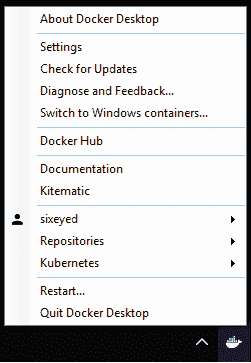
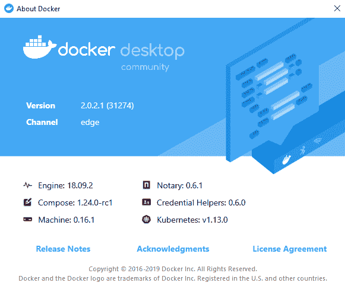

# 一、Windows Docker 入门

Docker 是一个应用平台。这是一种在被称为**容器**的独立轻量级单元中运行应用的新方式。容器是运行应用的一种非常高效的方式，比**虚拟机** ( **虚拟机**)或裸机服务器要高效得多。容器在几秒钟内启动，它们不会给应用的内存和计算需求增加任何开销。Docker 完全不知道它可以运行的应用类型。你可以经营一家全新的.NET Core 应用在一个容器中，一个 10 年前的 ASP.NET 2.0 WebForms 应用在同一服务器上的另一个容器中。

容器是独立的单元，但它们可以与其他组件集成。您的网络表单容器可以访问托管在.NET 核心容器。你的.NET Core 容器可以访问运行在容器中的 SQL Server 数据库，或者运行在单独机器上的 SQL Server 实例。您甚至可以用运行 Docker 的 Linux 和 Windows 机器的混合来建立一个集群，并让 Windows 容器透明地与 Linux 容器通信。

大大小小的公司都在转向 Docker，以利用这种灵活性和效率。Docker 平台背后的公司 Docker，Inc .的案例研究表明，通过迁移到 Docker，您可以将硬件需求减少 50%，并将发布时间减少 90%，同时仍然保持应用的高可用性。这一显著减少同样适用于内部数据中心和云。

效率不是唯一的收获。当您打包应用以在 Docker 中运行时，您会获得可移植性。您可以在笔记本电脑上的 Docker 容器中运行您的应用，它在数据中心的服务器上和任何云中的虚拟机上都将以完全相同的方式运行。这意味着您的部署过程简单且无风险，因为您部署的工件与您测试的工件完全相同，并且您还可以在硬件供应商和云提供商之间自由选择。

另一个巨大的动力是安全性。容器增加了应用之间的安全隔离，因此您可以确信，如果一个应用受到危害，攻击者就不能继续危害同一主机上的其他应用。该平台还有更广泛的安全优势。Docker 可以扫描打包应用的内容，并提醒您应用栈中的安全漏洞。您还可以对容器映像进行数字签名，并将 Docker 配置为仅从您信任的映像作者处运行容器。

Docker 由开源组件构建，发货为 **Docker 社区版** ( **Docker CE** )和 **Docker 企业**。Docker CE 免费使用，每月发布一次。Docker Enterprise 是付费订阅；它具有扩展的功能和支持，并且每季度发布一次。Docker CE 和 Docker Enterprise 都在 Windows 上可用，两个版本都使用相同的底层平台，因此您可以以相同的方式在 Docker CE 和 Docker Enterprise 上的容器中运行您的应用。

本章让您开始使用 Docker 容器。它包括:

*   Docker 和窗口容器
*   理解关键的 Docker 概念
*   在 Windows 上运行 Docker
*   用这本书了解 Docker

# 技术要求

您可以使用 GitHub 资源库[https://GitHub . com/six eyes/docker-on-window/tree/second edition/ch01](https://github.com/sixeyed/docker-on-windows/tree/second-edition/ch01)跟随本书的代码示例。在本章中，您将学习如何安装 Docker 唯一的先决条件是带有 1809 微软更新或 Windows Server 2019 的 Windows 10。

# Docker 和窗口容器

Docker 最初是在 Linux 上开发的，它利用了 Linux 的核心特性，但使使用容器处理应用工作负载变得简单而高效。微软看到了这一潜力，并与 Docker 工程团队密切合作，为 Windows 带来了同样的功能。

Windows Server 2016 是第一个为运行 Docker 容器而构建的 Windows 版本；Windows Server 2019 延续了这一创新，显著提高了 Windows 容器的功能和性能。您可以在 Windows 10 上运行与在生产环境中的 Windows Server 上运行的开发和测试相同的 Docker 容器。目前，您只能在 Windows 上的容器中运行 Windows 应用，但微软也正在增加对在 Windows 上运行的 Linux 应用容器的支持。

你需要知道的第一件事是容器和窗口用户界面之间没有集成。容器仅用于服务器端应用工作负载，如网站、应用接口、数据库、消息队列、消息处理程序和控制台应用。您不能使用 Docker 来运行客户端应用，如. NET WinForms 或 WPF 应用，但您可以使用 Docker 来打包和分发应用，这将为您的所有应用提供一致的构建和发布过程。

容器在 Windows Server 2019 和 Windows 10 上的运行方式也有区别。使用 Docker 的用户体验是相同的，但是容器的托管方式是不同的。在 Windows Server 上，服务于应用的进程实际上是在服务器上运行的，容器和主机之间没有任何层。在容器中，您可能会看到`w3wp.exe`运行以服务网站，但该进程实际上是在服务器上运行的——如果您有 10 个运行的 web 容器，您将在服务器上的任务管理器中看到 10 个`w3wp.exe`实例。

Windows 10 没有和 Windows Server 2019 一样的操作系统内核，所以为了给容器提供 Windows Server 内核，Windows 10 在一个非常轻的 VM 中运行每个容器。这些被称为 **Hyper-V 容器**，如果你在 Windows 10 的一个容器中运行一个网络应用，你将看不到`w3wp.exe`在主机上运行——它实际上运行在 Hyper-V 容器中的一个专用 Windows Server 内核中。

This is the default behavior, but in the latest versions of Windows and Docker you can run Windows Server containers in Windows 10, so you can skip the extra overhead of running a VM for each container.

理解 Windows Server 容器和 Hyper-V 容器之间的区别很好。您使用相同的 Docker 工件和相同的 Docker 命令，因此过程是相同的，但是使用 Hyper-V 容器会稍微影响性能。在本章的后面，我将向您展示在 Windows 上运行 Docker 的选项，您可以选择最适合自己的方法。

# Windows 版本

Windows Server 容器中的应用直接在主机上运行进程，服务器上的 Windows 版本需要与容器内的 Windows 版本相匹配。本书中的所有示例都是基于使用 Windows Server 2019 的容器，这意味着您需要一台 Windows Server 2019 机器来运行它们——或者是带有 1809 更新的 Windows 10(使用`winver`命令会告诉您拥有哪个更新版本)。

如果您将容器作为 Hyper-V 容器运行，则可以运行为不同版本的 Windows 构建的容器。这为您提供了向后兼容性，因此您可以在运行 Windows Server 2019 的计算机上运行为 Windows Server 2016 构建的容器。

# Windows 授权

Windows 容器与运行 Windows 的服务器或虚拟机没有相同的许可要求。Windows 是在主机级别而不是容器级别获得许可的。如果在一台服务器上运行 100 个 Windows 容器，您只需要一个服务器许可证。如果您当前使用虚拟机来隔离应用工作负载，将会节省大量成本。删除虚拟机层并直接在服务器上的容器中运行应用，可以消除所有虚拟机的许可要求以及所有这些机器的管理开销。

Hyper-V 容器有单独的许可。在 Windows 10 上，您可以运行多个容器，但不能用于生产部署。在 Windows Server 上，您还可以在 Hyper-V 模式下运行容器以增强隔离。这在多租户场景中非常有用，在多租户场景中，您需要预期并减轻不利的工作负载。Hyper-V 容器是单独许可的，在高容量环境中，您需要 Windows Server Datacenter 许可证才能在没有单独许可证的情况下运行 Hyper-V 容器。

微软和 Docker，Inc .已经合作，免费为 Docker Enterprise 提供 Windows Server 2016 和 Windows Server 2019。Windows Server 许可证的价格包括 Docker 企业引擎，它支持在容器中运行应用。如果您对容器或 Docker 服务有问题，您可以向微软提出，他们可以继续将其上报给 Docker 的工程师。

# 理解关键的 Docker 概念

Docker 是一个非常强大但非常简单的应用平台。您可以在几天内开始在 Docker 中运行您现有的应用，并在几天内准备好投入生产。这本书将带你通过许多例子.NET 框架和。在 Docker 中运行的核心应用。您将学习如何在 Docker 中构建、发布和运行应用，并继续学习高级主题，如解决方案设计、安全性、管理、仪器仪表以及**持续集成和持续交付** ( **CI/CD** )。

首先，您需要理解 Docker 的核心概念:映像、注册表、容器和编排器，并理解 Docker 实际上是如何运行的。

# Docker 引擎和 Docker 命令行

Docker 作为后台 Windows 服务运行。这项服务管理着每一个正在运行的容器——它被称为 Docker 引擎。该引擎公开了一个 REST API，供消费者使用容器和其他 Docker 资源。这个 API 的主要消费者是 Docker **命令行工具** ( **CLI** )，这是我在本书的大部分代码示例中使用的工具。

Docker REST API 是公开的，并且有由该 API 提供动力的替代管理工具，包括像 Portainer(它是开源的)和 Docker **通用控制平面** ( **UCP** )(它是一个商业产品)这样的 web UIs。Docker CLI 使用起来非常简单——您可以使用类似`docker container run`的命令在容器中运行应用，使用`docker container rm`移除容器。

您还可以将 Docker API 配置为可远程访问，并将 Docker CLI 配置为连接到远程服务。这意味着您可以使用笔记本电脑上的 Docker 命令管理云中运行的 Docker 主机。允许远程访问的设置还可以包括加密，因此您的连接是安全的，在本章中，我将向您展示一种简单的配置方法。

一旦您运行了 Docker，您将从从映像运行容器开始。

# Docker 映像

Docker 映像是一个完整的应用包。它包含一个应用及其所有依赖项:语言运行库、应用宿主和底层操作系统。从逻辑上讲，映像是一个单独的文件，并且是一个可移植的单元——您可以通过将映像推送到 Docker 注册表来共享您的应用。任何有访问权限的人都可以自己提取映像，并在容器中运行您的应用；它对他们和对你的行为方式完全一样。

这里有一个具体的例子。一款 ASP.NET 网络表单应用将在视窗服务器的互联网信息服务上运行。要在 Docker 中打包应用，您需要构建一个基于 Windows Server Core 的映像，添加 IIS，然后添加 ASP.NET，复制您的应用，并将其配置为 IIS 中的网站。您可以用一个名为 **Dockerfile** 的简单脚本描述所有这些步骤，并且您可以为需要执行的每个步骤使用 PowerShell 或批处理文件。

您可以通过运行`docker image build`来构建映像。输入是 Dockerfile 和需要打包到映像中的任何资源(如 web 应用内容)。输出是 Docker 映像。在这种情况下，映像的逻辑大小约为 5 GB，但其中 4 GB 将是您用作基础的 Windows Server Core 映像，并且该映像可以作为基础在许多其他映像之间共享。(我将在 [第 4 章](04.html)*与 Docker* *注册管理机构*分享映像图层和缓存更多内容。)

Docker 映像就像应用的一个版本的文件系统的快照。映像是静态的，您可以使用映像注册表来分发它们。

# 映像注册表

注册表是 Docker 映像的存储服务器。注册中心可以是公共的，也可以是私有的，还有免费的公共注册中心和商业注册服务器，允许对映像进行细粒度的访问控制。映像以唯一的名称存储在注册表中。任何有权限的人都可以通过运行`docker image push`上传图片，通过运行`docker image pull`下载图片。

最受欢迎的注册中心是 **Docker Hub** ，这是 Docker 托管的公共注册中心，但其他公司也托管自己的注册中心来分发自己的软件:

*   Docker Hub 是默认的注册中心，它在开源项目、商业软件和致力于私人项目的团队中变得非常受欢迎。Docker Hub 上存储了数十万个映像，每年为数十亿个拉取请求提供服务。您可以将 Docker Hub 映像配置为公共或私有。它适用于内部产品，您可以限制对映像的访问。您可以设置 Docker Hub 从 GitHub 中存储的 Docker 文件自动构建映像–目前，这仅支持基于 Linux 的映像，但 Windows 支持应该很快就会到来。
*   **微软容器注册中心** ( **MCR** )是微软托管他们自己的视窗服务器核心和纳米服务器的 Docker 映像以及预先配置的映像的地方.NET 框架。微软的 Docker 映像可以免费下载和使用。它们只在 Windows 机器上运行，这是应用 Windows 授权的地方。

在典型的工作流中，您可能会将映像构建为配置项管道的一部分，并在所有测试都通过的情况下将它们推送到注册表。您可以使用 Docker Hub，也可以运行自己的私有注册表。然后，该映像可供其他用户在容器中运行您的应用。

# Docker 容器

容器是从映像创建的应用的实例。该映像包含整个应用栈，它还指定了启动应用的进程，因此 Docker 知道在运行容器时要做什么。您可以从同一个映像运行多个容器，也可以用不同的方式运行容器。(我将在下一章中描述它们。)

您用`docker container run`启动应用，指定映像的名称和配置选项。分发内置于 Docker 平台中，因此如果您在尝试运行容器的主机上没有映像的副本，Docker 将首先提取映像。然后它启动指定的进程，您的应用在一个容器中运行。

容器不需要固定的 CPU 或内存分配，应用的进程可以根据需要使用尽可能多的主机计算能力。您可以在普通的硬件上运行几十个容器，除非应用都试图同时使用大量的 CPU，否则它们会愉快地并发运行。您还可以启动带有资源限制的容器，以限制它们可以访问的 CPU 和内存量。

Docker 提供容器运行时，以及映像打包和分发。在小型环境和开发中，您将在单个 Docker 主机上管理单个容器，该主机可以是您的笔记本电脑或测试服务器。当您转向生产时，您将需要高可用性和扩展选项，这与 Docker Swarm 这样的编排器是分不开的。

# DockerSwarm

Docker 能够在单台机器上运行，或者作为所有运行 Docker 的机器集群中的一个节点运行。这个集群叫做**蜂群**，在蜂群模式下运行不需要额外安装任何东西。你在一组机器上安装 Docker 在第一台机器上，你运行`docker swarm init`来初始化集群，在其他机器上，你运行`docker swarm join`来加入集群。

我将在[第 7 章](07.html)、*中深入介绍集群模式，用 Docker Swarm、*编排分布式解决方案，但在进一步了解 Docker 平台内置的高可用性、安全性、可扩展性和弹性之前，了解这一点很重要。您的 Docker 之旅将有望引导您走向生产，在那里您将受益于所有这些属性。

在集群模式下，Docker 使用完全相同的工件，因此您可以在一个 20 节点的集群中跨 50 个容器运行您的应用，并且功能将与您在笔记本电脑上的单个容器中运行时相同。在 swarm 上，您的应用性能更高，对故障的容忍度更高，您将能够自动滚动更新到新版本。

群集中的节点对所有通信使用安全加密，对每个节点使用可信证书。您也可以将应用机密作为加密数据存储在群中，这样就可以安全地保存数据库连接字符串和应用编程接口密钥，群只会将它们传递给需要它们的容器。

Docker 是一个成熟的平台。它在 2016 年是 Windows Server 的新版本，但在 Linux 上发布了四年后才出现在 Windows 上。Docker 是用 Go 编写的，Go 是一种跨平台语言，只有少数代码是 Windows 特有的。当您在 Windows 上运行 Docker 时，您运行的是一个已经在生产中成功使用多年的应用平台。

# 库比涅斯的笔记

Docker Swarm 是一个非常受欢迎的容器编排器，但它不是唯一的一个。Kubernetes 是一个增长巨大的替代方案，现在大多数公共云都提供托管的 Kubernetes 服务。在撰写本书时，Kubernetes 是一个只支持 Linux 的编排器，Windows 支持仍处于测试阶段。在您的容器之旅中，您可能会听到很多关于 Kubernetes 的信息，因此了解它与 Docker Swarm 的比较是值得的。

首先是相似性——他们都是容器编排者，这意味着他们是负责大规模生产中运行容器的机器集群。它们都运行 Docker 容器，您可以对 Docker Swarm 和 Kubernetes 使用相同的 Docker 映像。它们都是基于开源项目构建的，并且符合**开放容器倡议** ( **OCI** )，因此无需担心供应商锁定。您可以从 Docker Swarm 开始，然后转到 Kubernetes，反之亦然，而无需更改您的应用。

区别在于。Docker Swarm 非常简单；您可以用几行标记来描述在 swarm 上的容器中运行的分布式应用。要在 Kubernetes 上运行相同的应用，您的应用描述将是标记的四倍，甚至更多。Kubernetes 比 swarm 有更多的抽象和配置选项，所以有些事情你可以用 Kubernetes 做，但不能用 swarm 做。这种灵活性的代价是复杂性，Kubernetes 的学习曲线比 swarm 陡峭得多。

Kubernetes 将很快支持 Windows，但在一段时间内，它不太可能在 Linux 服务器和 Windows 服务器之间提供完全的功能兼容性。在此之前，使用 Docker Swarm 很好——Docker 有数百个企业客户在 Docker Swarm 上运行他们的生产集群。如果你确实发现 Kubernetes 有一些你需要的额外功能，一旦你对 swarm 有了很好的理解，学习 Kubernetes 就会容易得多。

# 在 Windows 上运行 Docker

在 Windows 10 上安装 Docker 很容易，使用*Docker Desktop*–一个 Windows 软件包，它设置了所有先决条件，部署了 Docker 社区引擎的最新版本，并为您提供了一个 UI，其中包含一些管理映像库和远程集群的有用选项。

在生产中，您应该理想地使用没有用户界面的安装。这减少了攻击面和服务器需要的 Windows 更新数量。如果您将所有应用移动到 Docker，则不需要安装任何其他 Windows 功能；您将只需要让 Docker 引擎作为 Windows 服务运行。

我将介绍这两个安装选项，并向您展示在 Azure 中使用虚拟机的第三个选项，如果您想尝试 Docker，但无法访问 Windows 10 或 Windows Server 2019，这将非常有用。

There is a fantastic online Docker playground called Play with Docker at [https://dockr.ly/play-with-docker](https://dockr.ly/play-with-docker). Windows support is expected soon, and it's a great way to try Docker without having to make any investment – you just browse the site and get started.

# Docker 桌面

Docker Desktop 可从 Docker Hub 获得–您可以通过导航至[https://dockr.ly/docker-for-windows](https://dockr.ly/docker-for-windows)找到它。您可以在**稳定频道**和**边缘频道**之间进行选择。这两个频道都为您提供了社区 Docker Engine，但 Edge 频道遵循每月发布周期，您将获得实验性功能。稳定频道跟踪 Docker 引擎发布周期，每季度更新一次。

You should use the Edge channel in development if you want to work with the latest features. In test and production, you will use Docker Enterprise, so you need to be careful that you don't use features in development, which are not yet available in Enterprise. Docker recently announced **Docker Desktop Enterprise**, which lets developers run the exact same engine locally as their organization is running in production.

您需要下载并运行安装程序。安装程序将验证您可以在安装程序中运行 Docker，并将配置支持 Docker 所需的 Windows 功能。当 Docker 正在运行时，您将在通知栏中看到一个鲸鱼图标，您可以右键单击该图标以获得选项:



您需要选择切换到窗口容器...在你做其他事情之前。Windows 上的 Docker Desktop 可以通过在机器上的 Linux 虚拟机中运行 Docker 来运行 Linux 容器。这非常适合测试 Linux 应用，看看它们如何在容器中运行，但是这本书完全是关于 Windows 容器的——所以切换一下，Docker 将来会记住这个设置。

当窗口 Docker 正在运行时，您可以打开命令提示符或 PowerShell 会话并开始使用容器。首先，通过运行`docker version`来验证一切是否按预期运行。您应该会看到类似以下代码片段的输出:

```
> docker version

Client: Docker Engine - Community
 Version:           18.09.2
 API version:       1.39
 Go version:        go1.10.8
 Git commit:        6247962
 Built:             Sun Feb 10 04:12:31 2019
 OS/Arch:           windows/amd64
 Experimental:      false

Server: Docker Engine - Community
 Engine:
  Version:          18.09.2
  API version:      1.39 (minimum version 1.24)
  Go version:       go1.10.6
  Git commit:       6247962
  Built:            Sun Feb 10 04:28:48 2019
  OS/Arch:          windows/amd64
  Experimental:     true
```

The output tells you the version of the command-line client and the Docker Engine. The operating system field should read *Windows* for both; if not, then you may still be in Linux mode, and you'll need to switch to Windows containers.

现在使用 Docker 命令行界面运行一个简单的容器:

```
docker container run dockeronwindows/ch01-whale:2e
```

这使用了 Docker Hub 上的一个公共映像——这本书的示例映像之一，Docker 将在您第一次使用它时提取该映像。如果您没有任何其他映像，这将需要几分钟时间，因为它还将下载微软纳米服务器映像，我的映像用作基础。当容器运行时，它会显示一些 ASCII 艺术，然后退出。再次运行相同的命令，您会看到它执行得更快，因为映像现在已经在本地缓存了。

Docker Desktop 会在启动时检查更新，并在更新完成时提示您下载新版本。您可以通过在 Docker 工具发布时安装新版本来保持它们的最新状态。您可以通过从任务栏菜单中选择**关于 Docker 桌面**来检查您已经安装的当前版本:



这就是你需要的全部设置。Docker Desktop 还包含我将在本书后面使用的 Docker Compose 工具，因此您已经准备好跟随代码示例了。

# Docker 引擎

Docker Desktop 非常适合在 Windows 10 上使用容器进行开发。对于没有用户界面的无头服务器的生产环境，可以安装 Docker 引擎，使用 PowerShell 模块作为后台 Windows 服务运行。

在新安装的 Windows Server 2019 Core 上，使用`sconfig`工具安装所有最新的 Windows 更新，然后运行以下 PowerShell 命令安装 Docker 引擎和 Docker CLI:

```
Install-Module -Name DockerMsftProvider -Repository PSGallery -Force
Install-Package -Name docker -ProviderName DockerMsftProvider
```

这将为服务器配置必要的 Windows 功能，安装 Docker，并将其设置为作为 Windows 服务运行。根据安装的 Windows 更新数量，您可能需要重新启动服务器:

```
Restart-Computer -Force
```

当服务器在线时，确认 Docker 正在使用`docker version`运行，然后从本章的示例映像中运行一个容器:

```
docker container run dockeronwindows/ch01-whale:2e
```

当 Docker Engine 的新版本发布时，您可以通过重复`Install`命令并添加`-Update`标志来更新您的服务器:

```
Install-Package -Name docker -ProviderName DockerMsftProvider -Update 
```

我将此配置用于我的一些环境—在仅安装了 Docker 的轻量级虚拟机中运行 Windows Server 2019 Core。您可以通过与远程桌面连接在服务器上使用 Docker，也可以配置 Docker 引擎以允许远程连接，这允许您使用笔记本电脑上的`docker`命令管理服务器上的 Docker 容器。这是一个更高级的设置，但它确实为您提供了安全的远程访问。

最好设置 Docker Engine，以便使用 TLS(与 HTTPS 使用的加密技术相同)保护与客户端的通信。客户端只有在拥有正确的 TLS 证书以使用服务进行认证的情况下才能连接。您可以通过在虚拟机内部运行这些 PowerShell 命令来设置，提供虚拟机的外部 IP 地址:

```
$ipAddress = '<vm-ip-address>'

mkdir -p C:\certs\client

docker container run --rm `
 --env SERVER_NAME=$(hostname) `
 --env IP_ADDRESSES=127.0.0.1,$ipAddress `
 --volume 'C:\ProgramData\docker:C:\ProgramData\docker' `
 --volume 'C:\certs\client:C:\Users\ContainerAdministrator\.docker' `
 dockeronwindows/ch01-dockertls:2e

Restart-Service docker
```

Don't worry too much about what this command is doing. Over the next few chapters, you'll get a good understanding of all these Docker options. I'm using a Docker image based on one from Stefan Scherer, who is a Microsoft MVP and Docker Captain. The image has a script that secures the Docker Engine with TLS certificates. You can read more details on Stefan's blog at [https://stefanscherer.github.io](https://stefanscherer.github.io).

当这个命令完成时，它将配置 Docker Engine API 只允许安全的远程连接，并且还将创建客户端需要用来连接的证书。将虚拟机上`C:\certs\client`的这些证书复制到您想要使用 Docker 客户端的机器上。

在客户端机器上，您可以设置环境变量来指示 Docker 客户端使用远程 Docker 服务。这些命令将建立到虚拟机的远程连接(假设您对客户端上的证书文件使用了相同的路径)，如下所示:

```
$ipAddress = '<vm-ip-address>'

$env:DOCKER_HOST='tcp://$($ipAddress):2376'
$env:DOCKER_TLS_VERIFY='1'
$env:DOCKER_CERT_PATH='C:\certs\client'
```

您可以使用这种方法安全地连接到任何远程 Docker 引擎。如果您没有访问 Windows 10 或 Windows Server 2019 的权限，您可以在云上创建一个虚拟机，并使用相同的命令连接到它。

# 蓝色 VM Docker

微软让在 Azure 中运行 Docker 变得很容易。他们提供了安装并配置了 Docker 的虚拟机映像，并且已经提取了基本的 Windows 映像，因此您可以快速开始。

为了测试和探索，我总是使用 Azure 中的 DevTest 实验室。这是非生产环境的一大特色。默认情况下，您在开发测试实验室中创建的任何虚拟机每天晚上都会被关闭，因此您不会因为使用了几个小时却忘记关闭的虚拟机而收到一大笔 Azure 账单。

您可以通过 Azure 门户创建一个 DevTest Lab，然后从微软的虚拟机映像**创建一个虚拟机，Windows Server 2019 数据中心带有容器**。作为 Azure 门户的替代方案，您可以使用`az`命令行来管理 DevTest 实验室。我已经将`az`打包在 Docker 映像中，您可以在 Windows 容器中运行它:

```
docker container run -it dockeronwindows/ch01-az:2e
```

这运行了一个交互式 Docker 容器，该容器已经打包了`az`命令并准备使用。运行`az login`，您需要打开浏览器并验证 Azure 命令行界面。然后，您可以在容器中运行它来创建虚拟机:

```
az lab vm create `
 --lab-name docker-on-win --resource-group docker-on-win `
 --name dow-vm-01 `
 --image "Windows Server 2019 Datacenter with Containers" `
 --image-type gallery --size Standard_DS2_v2 `
 --admin-username "elton" --admin-password "S3crett20!9"
```

虚拟机使用完整的 Windows Server 2019 安装和用户界面，因此您可以使用远程桌面连接到机器，打开一个 PowerShell 会话，并立即开始使用 Docker。与其他选项一样，您可以检查 Docker 是否正在使用`docker version`运行，然后从本章的示例映像中运行一个容器:

```
docker container run dockeronwindows/ch01-whale:2e
```

如果 Azure 虚拟机是您的首选，您可以按照上一节中的步骤来保护 Docker API 以进行远程访问。这样，您可以在笔记本电脑上运行 Docker 命令行来管理云上的容器。Azure 虚拟机使用 PowerShell 部署 Docker，因此您可以使用上一节中的`InstallPackage ... -Update`命令更新虚拟机上的 Docker 引擎。

所有这些选项 Windows 10、Windows Server 2019 和 Azure 虚拟机—都可以运行完全相同的 Docker 映像并获得相同的结果。Docker 映像中的示例应用`dockeronwindows/ch01-whale:2e`在每个环境中都以相同的方式运行。

# 用这本书了解 Docker

本书中的每一个代码清单都附有我位于 https://github.com/sixeyed/docker-on-windows T4 的 GitHub 存储库中的完整代码示例。这本书有一个分支，叫做`second-edition`。源代码树为每一章组织成一个文件夹，每一章都有一个文件夹用于每个代码示例。在本章中，我使用了三个示例来创建 Docker 映像，您将在`ch01\ch01-whale`、`ch01\ch01-az`和`ch01\ch01-dockertls`中找到这些映像。

The code listings in this book may be condensed, but the full code can always be found in the GitHub repository.

当我学习一项新技术时，我更喜欢跟随代码示例，但是如果您想使用演示应用的工作版本，每个示例也可以作为 Docker Hub 上的公共 Docker 映像提供。无论你在哪里看到`docker container run`命令，映像已经存在于 Docker Hub 上，所以如果你愿意，你可以使用我的，而不是自己构建。像本章的`dockeronwindows/ch01-whale:2e`一样，`dockeronwindows`组织中的所有映像都是从 GitHub 存储库中的相关 Dockerfile 构建的。

我自己的开发环境分为使用 Docker Desktop 的 Windows 10 和运行 Docker 企业引擎的 Windows Server 2019。我的测试环境是基于 Windows Server 2019 Core 的，我也在那里运行 Docker 企业引擎。我已经在所有这些环境中验证了本书中的所有代码示例。

我使用的是 Docker 的 18.09 版本，这是撰写本文时的最新版本。Docker 一直都是向后兼容的，所以如果您在 Windows 10 或 Windows Server 2019 上使用的版本晚于 18.09，那么示例 docker 文件和映像的工作方式应该是相同的。

我的目标是让它成为关于 Windows Docker 的权威书籍，所以我已经涵盖了从容器 101 到现代化的所有内容.NET 应用与 Docker 和容器的安全含义，CI/CD 和生产中的管理。这本书的结尾是一个在你自己的项目中推进 Docker 的指南。

If you want to discuss the book or your own Docker journey with me, feel free to ping me on Twitter at `@EltonStoneman`.

# 摘要

在本章中，我介绍了 Docker，这是一个应用平台，可以在称为容器的轻量级计算单元中运行新老应用。公司为了效率、安全性和可移植性正在转向 Docker。我讲述了以下主题:

*   Docker 如何在 Windows 上工作，以及容器如何获得许可。
*   关键的 Docker 概念:映像、注册表、容器和编排器。
*   在 Windows 10、Windows Server 2019 或 Azure 上运行 Docker 的选项。

如果您计划使用本书其余部分的代码示例，那么现在您应该已经有了一个工作的 Docker 环境。在[第 2 章](02.html)、*将应用打包和运行为 Docker 容器，*我将继续将更复杂的应用打包为 Docker 映像，并展示如何管理带有 Docker 卷的容器中的状态。