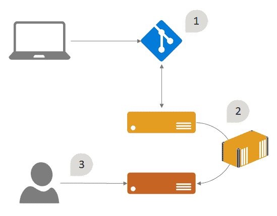
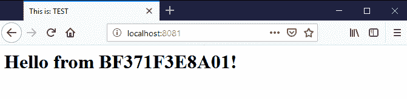
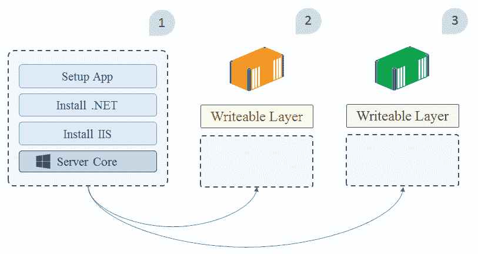
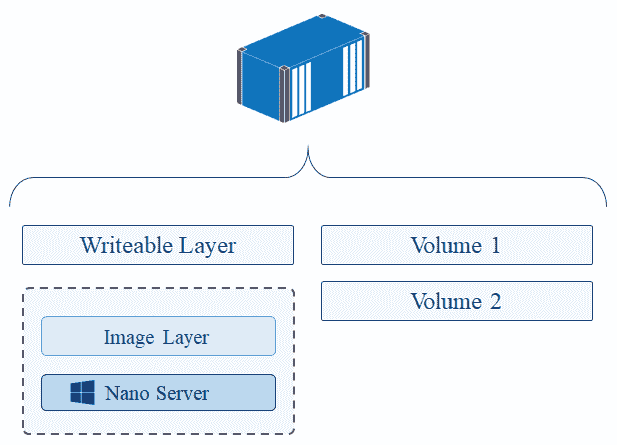
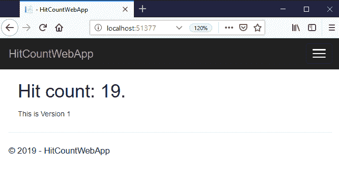
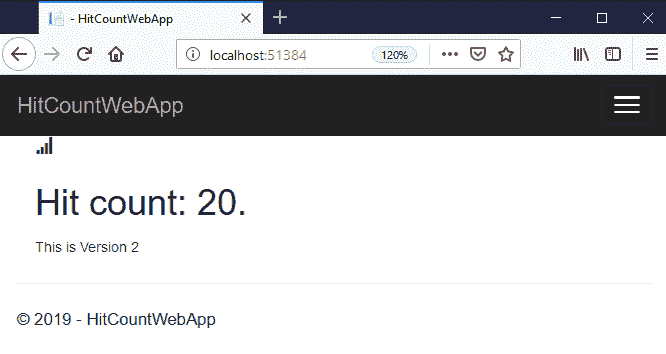
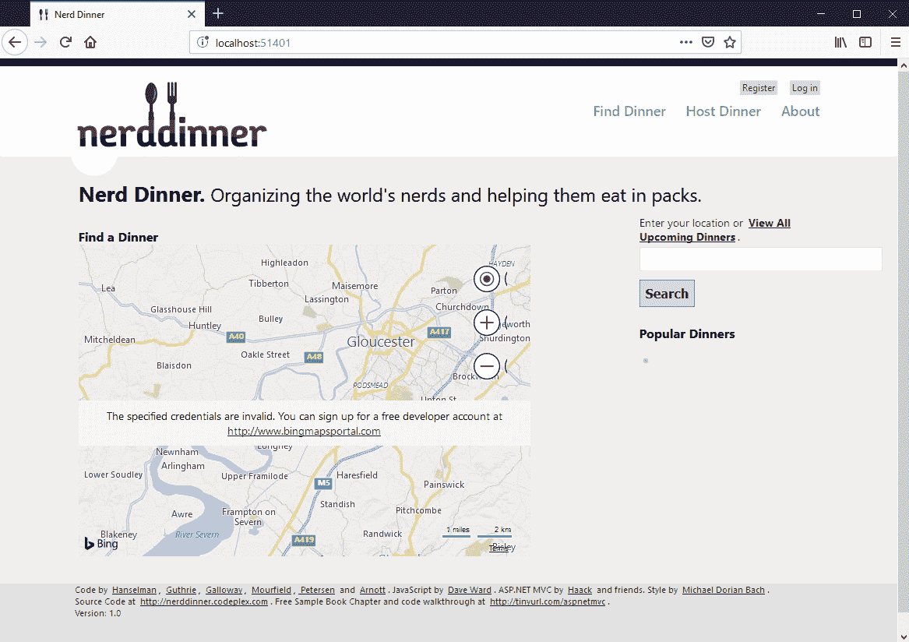

# 将应用程序打包并作为 Docker 容器运行

Docker 将基础架构的逻辑视图简化为三个核心组件:主机、容器和映像。主机是运行容器的服务器，每个容器都是应用程序的独立实例。容器是从图像创建的，图像是打包的应用程序。Docker 容器图像在概念上非常简单:它是一个包含完整、独立应用程序的单一单元。图像格式非常高效，图像和容器运行时之间的集成非常智能，因此掌握图像是您有效使用 Docker 的第一步。

您已经在[第 1 章](01.html)、*中看到了一些图像，通过运行一些基本容器来检查您的 Docker 安装是否正常工作，从而开始在 Windows 上使用 Docker*、*、*，但是我没有仔细检查图像或 Docker 如何使用它。在本章中，您将全面了解 Docker 映像，了解它们的结构，了解 Docker 如何使用它们，并了解如何将自己的应用程序打包为 Docker 映像。

首先要了解的是图像和容器之间的区别，通过从同一个图像运行不同类型的容器，可以非常清楚地看到这一点。

在本章中，您将了解更多关于 Docker 的基础知识，包括:

*   从图像运行容器
*   从 Dockerfiles 构建图像
*   将您自己的应用程序打包为 Docker 映像
*   处理图像和容器中的数据
*   将传统的 ASP.NET 网络应用打包为 Docker 映像

# 技术要求

您将需要在更新为 18.09 的 Windows 10 或 Windows Server 2019 上运行 Docker 来完成示例。本章代码可在[https://github . com/six eyes/docker-on-window/tree/第二版/ch02](https://github.com/sixeyed/docker-on-windows/tree/second-edition/ch02) 获得。

# 从图像运行容器

`docker container run`命令从图像创建一个容器，并启动容器内的应用程序。这实际上相当于运行两个单独的命令，`docker container create`和`docker container start`，这表明容器可以有不同的状态。您可以在不启动容器的情况下创建容器，并且可以暂停、停止和重新启动正在运行的容器。容器可以处于不同的状态，您可以以不同的方式使用它们。

# 使用任务容器做一件事

`dockeronwindows/ch02-powershell-env:2e`图像是打包应用程序的一个例子，该应用程序打算在一个容器中运行并执行一个任务。该映像基于微软视窗服务器核心，设置为启动时运行一个简单的 PowerShell 脚本，打印当前环境的详细信息。让我们看看当我直接从图像运行容器时会发生什么:

```
> docker container run dockeronwindows/ch02-powershell-env:2e

Name                           Value
----                           -----
ALLUSERSPROFILE                C:\ProgramData
APPDATA                        C:\Users\ContainerAdministrator\AppData\Roaming
CommonProgramFiles             C:\Program Files\Common Files
CommonProgramFiles(x86)        C:\Program Files (x86)\Common Files
CommonProgramW6432             C:\Program Files\Common Files
COMPUTERNAME                   8A7D5B9A4021
...
```

在没有任何选项的情况下，容器运行一个内置在映像中的 PowerShell 脚本，该脚本打印出一些关于操作系统环境的基本信息。我称之为**任务容器**，因为容器执行一个任务，然后退出。

如果运行列出所有活动容器的`docker container ls`，将看不到这个容器。但是如果你运行`docker container ls --all`，它显示所有州的集装箱，你会看到它处于`Exited`状态:

```
> docker container ls --all
CONTAINER ID  IMAGE       COMMAND    CREATED          STATUS
8a7d5b9a4021 dockeronwindows/ch02-powershell-env:2e "powershell.exe C:..."  30 seconds ago   Exited
```

任务容器在自动化重复性任务方面非常有用，例如运行脚本来设置环境、备份数据或收集日志文件。您的容器映像打包了要运行的脚本，以及该脚本所需的所有需求的确切版本，因此任何安装了 Docker 的人都可以运行该脚本，而不必安装先决条件。

这对于 PowerShell 尤其有用，因为脚本可能依赖于几个 PowerShell 模块。模块可能是公开可用的，但是您的脚本可能依赖于特定的版本。您不必共享需要用户安装许多不同模块的正确版本的脚本，而是构建一个已经安装了模块的映像。那么您只需要 Docker 来运行脚本任务。

图像是独立的单元，但您也可以将它们用作模板。一个映像可能被配置为做一件事，但是您可以用不同的方式从一个映像运行容器来做不同的事情。

# 连接到交互式容器

一个**交互容器**是一个与 Docker 命令行有开放连接的容器，所以你使用这个容器就像你连接到一个远程机器一样。通过指定交互选项和容器启动时要运行的命令，可以从同一 Windows Server Core 映像运行交互容器:

```
> docker container run --interactive --tty dockeronwindows/ch02-powershell-env:2e `
 powershell

Windows PowerShell
Copyright (C) Microsoft Corporation. All rights reserved.

PS C:\> Write-Output 'This is an interactive container'
This is an interactive container
PS C:\> exit
```

`--interactive`选项运行一个交互式容器，`--tty`标志将终端连接附加到容器。容器图像名称后的`powershell`语句是容器启动时运行的命令。通过指定一个命令，您可以替换图像中设置的启动命令。在这种情况下，我启动了一个 PowerShell 会话，该会话代替配置的命令运行，因此环境打印输出脚本不会运行。

只要内部的命令在运行，交互式容器就会一直运行。当您连接到 PowerShell 时，在主机上的另一个窗口中运行`docker container ls`将显示容器仍在运行。当您在容器中键入`exit`时，PowerShell 会话结束，因此没有进程运行，容器也退出。

当您构建自己的容器图像时，交互式容器非常有用，它们允许您首先交互式地完成各个步骤，并验证一切都将如您所期望的那样工作。它们也是很好的探索工具。您可以从 Docker 注册表中提取其他人的图像，并在运行应用程序之前浏览其内容。

当您通读这本书时，您会看到 Docker 可以在虚拟网络中托管复杂的分布式系统，每个组件都在自己的容器中运行。如果您想检查系统的某些部分，您可以在网络中运行一个交互式容器并检查单个组件，而不必公开这些部分。

# 让进程在后台容器中运行

最后一种容器是您在生产中最常用的容器，即后台容器，它使一个长期运行的进程在后台运行。它是一个行为类似于 Windows 服务的容器。在 Docker 术语中，它被称为**分离容器**，是 Docker 引擎让它在后台运行。在容器内部，进程在前台运行。该进程可能是一个网络服务器或一个控制台应用程序轮询消息队列进行工作，但是只要该进程保持运行，Docker 就会保持容器活动。

我可以从同一个图像再次运行一个背景容器，指定`detach`选项和运行几分钟的命令:

```
> docker container run --detach dockeronwindows/ch02-powershell-env:2e `
 powershell Test-Connection 'localhost' -Count 100

bb326e5796bf48199a9a6c4569140e9ca989d7d8f77988de7a96ce0a616c88e9
```

在这种情况下，当容器已经启动时，控制返回到终端；长随机字符串是新容器的 ID。可以运行`docker container ls`看到容器在运行，`docker container logs`命令显示容器的控制台输出。对于在特定容器上操作的命令，您可以通过容器名称或容器标识的一部分来引用它们——标识是随机的，在我的例子中，这个容器标识以`bb3`开头:

```
> docker container logs bb3

Source        Destination     IPV4Address      IPV6Address
------        -----------     -----------      -----------
BB326E5796BF  localhost       127.0.0.1        ::1
BB326E5796BF  localhost       127.0.0.1        ::1
```

`--detach`标志分离容器，使其移动到后台，这种情况下的命令只是反复 ping`localhost`一百次。几分钟后，PowerShell 命令完成，因此没有进程运行，容器退出。

This is a key thing to remember: if you want to keep a container running in the background, the process that Docker starts when it runs the container has to keep running.

现在，您已经看到容器是从图像创建的，但是它可以以不同的方式运行。因此，您可以完全按照准备的方式使用图像，或者将图像视为内置默认启动模式的模板。接下来，我将向您展示如何构建该图像。

# 构建 Docker 映像

Docker 图像是分层的。底层是操作系统，可以是 Windows Server Core 这样的完整操作系统，也可以是微软 Nano Server 这样的最小操作系统。最重要的是，在构建映像时，通过安装软件、复制文件和运行命令，对基本操作系统所做的每一项更改都有相应的层。从逻辑上讲，Docker 将图像视为单个单元，但从物理上讲，每一层都作为单独的文件存储在 Docker 的缓存中，因此具有许多共同特征的图像可以共享缓存中的层。

图像是使用 Dockerfile 语言的文本文件构建的–指定要开始的基本操作系统图像以及要添加到其上的所有步骤。语言非常简单，只需要掌握几个命令就可以构建生产级图像。我将从本章到目前为止使用的基本 PowerShell 映像开始。

# 理解码头文件

Dockerfile 只是一个将软件打包到 Docker 映像中的部署脚本。PowerShell 映像的完整代码只有三行:

```
FROM mcr.microsoft.com/windows/servercore:ltsc2019
COPY scripts/print-env-details.ps1 C:\\print-env.ps1
CMD ["powershell.exe", "C:\\print-env.ps1"]
```

即使你以前从未见过 Dockerfile，也很容易猜到发生了什么。按照惯例，指令(`FROM`、`COPY`、`CMD`)是大写的，参数是小写的，但这不是强制性的。同样按照惯例，您将文本保存在名为`Dockerfile`的文件中，但这也不是强制性的(没有扩展名的文件在 Windows 中看起来很奇怪，但请记住 Docker 的传统是在 Linux 中)。

让我们一行一行地看看 Dockerfile 中的说明:

*   `FROM mcr.microsoft.com/windows/servercore:ltsc2019`使用名为`windows/servercore`的图像作为该图像的起点，指定该图像的`ltsc2019`版本及其所在的注册表。
*   `COPY scripts/print-env-details.ps1 C:\\print-env.ps1`将 PowerShell 脚本从本地计算机复制到映像中的特定位置。
*   `CMD ["powershell.exe", "C:\\print-env.ps1"]`指定容器运行时的启动命令，在本例中是运行 PowerShell 脚本。

这里有几个明显的问题。基础图像来自哪里？Docker 内置了映像注册表的概念，它是容器映像的存储。默认注册中心是一个名为 **Docker Hub** 的免费公共服务。微软在 Docker Hub 上发布了一些图像，但 Windows 基础图像托管在**微软容器注册中心** ( **MCR** )上。

2019 年发布的 Windows Server Core 映像名为`windows/servercore:ltsc2019`。第一次使用映像时，Docker 会将其从 MCR 下载到您的本地机器上，然后将其缓存以供进一步使用。

Docker Hub is where all the Microsoft images are listed for discovery, as MCR doesn't have a web UI. Even if images are hosted on MCR, they will be listed on Docker Hub, so that's the place to go when you're looking for images.

PowerShell 脚本从哪里复制的？构建映像时，包含 Dockerfile 的目录用作构建的上下文。当您从这个 Docker 文件构建图像时，Docker 将期望在上下文目录中找到一个名为`scripts`的文件夹，其中包含一个名为`print-env-details.ps1`的文件。如果找不到该文件，构建将会失败。

Dockerfiles use the backslash as an escape character in order to continue instructions onto a new line. This clashes with Windows file paths, so you have to write `C:\print.ps1` as `C:\\print.ps1` or `C:/print.ps1`. There is a nice way to get around this, using a processor directive at the start of the Dockerfile, which I'll demonstrate later in the chapter.

您如何知道 PowerShell 可供使用？它是 Windows Server Core 基础映像的一部分，因此您可以依赖它的存在。您可以使用附加的 Dockerfile 指令安装任何不在基本映像中的软件。您可以添加 Windows 功能、设置注册表值、将文件复制或下载到映像中、提取 ZIP 文件、部署 MSIs 以及执行您需要的任何其他操作。

这是一个非常简单的 Dockerfile，但即使如此，其中两个指令也是可选的。只有`FROM`指令是强制的，所以如果你想构建一个微软 Windows Server Core 映像的精确克隆，你可以在你的 Dockerfile 中只用一个`FROM`语句就可以做到，并且可以随意调用克隆的映像。

# 从 Dockerfile 构建图像

现在您有了一个 Dockerfile，您可以使用`docker`命令行将其构建成一个图像。像大多数 Docker 命令一样，`image build`命令很简单，所需选项很少，更喜欢约定。

要构建图像，请打开命令行并导航到 Dockerfile 所在的目录。然后，运行`docker image build`并给你的图像一个标签，这是将识别图像的名称:

```
docker image build --tag dockeronwindows/ch02-powershell-env:2e .
```

每个图像都需要一个标签，用`--tag`选项指定，它是本地图像缓存和图像注册表中图像的唯一标识符。标签是您在运行容器时引用图像的方式。完整的标记指定要使用的注册表:存储库名称，它是应用程序的标识符，以及后缀，它是该版本映像的标识符。

当您为自己构建一个映像时，您可以称它为任何东西，但是惯例是将您的存储库命名为您的注册表用户名，后跟应用程序名:`{user}/{app}`。您也可以使用标签来识别应用程序版本或变体，例如`sixeyed/git`和`sixeyed/git:2.17.1-windowsservercore-ltsc2019`，这是我在 Docker Hub 上的两张图片。

`image build`命令末尾的句点告诉 Docker 要用于图像的上下文的位置。`.`是当前目录。Docker 将目录树的内容复制到构建的临时文件夹中，因此上下文需要包含您在 Dockerfile 中引用的任何文件。复制上下文后，Docker 开始执行 Docker 文件中的指令。

# 检查 Docker 如何构建图像

了解 Docker 映像是如何构建的将有助于您构建高效的映像。`image build`命令会产生大量输出，它会告诉您 Docker 在构建的每一步都做了什么。Dockerfile 中的每个指令都是作为一个单独的步骤执行的，它会生成一个新的图像层，最终的图像将是所有层的组合堆栈。下面的代码片段是构建我的图像的输出:

```
> docker image build --tag dockeronwindows/ch02-powershell-env:2e .

Sending build context to Docker daemon  4.608kB
Step 1/3 : FROM mcr.microsoft.com/windows/servercore:ltsc2019
 ---> 8b79386f6e3b
Step 2/3 : COPY scripts/print-env-details.ps1 C:\\print-env.ps1
 ---> 5e9ed4527b3f
Step 3/3 : CMD ["powershell.exe", "C:\\print-env.ps1"]
 ---> Running in c14c8aef5dc5
Removing intermediate container c14c8aef5dc5
 ---> 5f272fb2c190
Successfully built 5f272fb2c190
Successfully tagged dockeronwindows/ch02-powershell-env:2e
```

这就是 Docker 构建映像时发生的情况:

1.  `FROM`镜像已经存在于我的本地缓存中，所以 Docker 不需要下载。输出是微软 Windows Server 核心镜像的 ID(从`8b79`开始)。
2.  Docker 将脚本文件从构建上下文复制到新的图像层(ID `5e9e`)。
3.  Docker 将命令配置为在从映像运行容器时执行。它从*步骤 2* 图像创建一个临时容器，配置启动命令，将容器保存为一个新的图像层(标识`5f27`)，并删除中间容器(标识`c14c`)。

最后一层用图像名标记，但是所有中间层也被添加到本地缓存中。这种分层方法意味着 Docker 在构建图像和运行容器时非常高效。最新的 Windows Server Core 映像未压缩超过 4 GB，但是当您运行基于 Windows Server Core 的多个容器时，它们都将使用相同的基础映像层，因此您最终不会得到 4 GB 映像的多个副本。

在本章的后面，您将会了解更多关于图像层和存储的内容，但是首先我会看一些更复杂的 Dockerfiles。NET 和。NET 核心应用程序。

# 打包您自己的应用程序

构建映像的目标是将应用程序打包到一个可移植的、独立的单元中。映像应该尽可能小，以便在您想要运行应用程序时可以轻松移动，并且应该具有尽可能少的操作系统功能，因此启动时间快，攻击向量小。

Docker 对图像大小没有限制。您的长期目标可能是构建轻量级运行的最小映像。NET 核心应用程序。但是你可以从将你现有的 ASP.NET 应用程序打包成 Docker 映像在 Windows Server Core 上运行开始。Docker 也没有对如何打包你的应用进行限制，所以你可以从不同的方法中进行选择。

# 在构建期间编译应用程序

在 Docker 映像中打包自己的应用程序有两种常见方法。首先是使用包含应用程序平台和构建工具的基础映像。因此，在 Dockerfile 中，您将源代码复制到映像中，并在映像构建过程中编译应用程序。

这是一种流行的公共映像方法，因为这意味着任何人都可以构建映像，而无需在本地安装应用程序平台。这也意味着应用程序的工具与映像捆绑在一起，因此可以对容器中运行的应用程序进行调试和故障排除。

这里有一个简单的例子。NET 核心应用程序。该 Dockerfile 用于`dockeronwindows/ch02-dotnet-helloworld:2e`图像:

```
FROM microsoft/dotnet:2.2-sdk-nanoserver-1809

WORKDIR /src
COPY src/ .

USER ContainerAdministrator
RUN dotnet restore && dotnet build
CMD ["dotnet", "run"]
```

Dockerfile 使用微软的。来自 Docker Hub 的. NET 核心映像作为基础映像。这是该图像的一个特定变体，它基于 Nano Server 版本，并且具有。安装了. NET Core 2.2 SDK。构建从上下文复制应用程序源代码，并作为容器构建过程的一部分编译应用程序。

这个 Dockerfile 中有三个您以前没有见过的新指令:

1.  `WORKDIR`指定当前工作目录。Docker 在中间容器中创建目录(如果它还不存在)，并将其设置为当前目录。它仍然是 Dockerfile 中后续指令的工作目录，当容器从映像运行时，它也是容器的工作目录。
2.  `USER`在构建中更改当前用户。默认情况下，纳米服务器使用最低权限用户。这将切换到容器映像中具有管理权限的内置帐户。
3.  `RUN`在中间容器内执行命令，命令完成后保存容器的状态，创建新的图像层。

当我构建这个图像时，您将看到`dotnet`命令输出，它是根据图像构建中的`RUN`指令编译的应用程序:

```
> docker image build --tag dockeronwindows/ch02-dotnet-helloworld:2e . 
Sending build context to Docker daemon  192.5kB
Step 1/6 : FROM microsoft/dotnet:2.2-sdk-nanoserver-1809
 ---> 90724d8d2438
Step 2/6 : WORKDIR /src
 ---> Running in f911e313b262
Removing intermediate container f911e313b262
 ---> 2e2f7deb64ac
Step 3/6 : COPY src/ .
 ---> 391c7d8f4bcc
Step 4/6 : USER ContainerAdministrator
 ---> Running in f08f860dd299
Removing intermediate container f08f860dd299
 ---> 6840a2a2f23b
Step 5/6 : RUN dotnet restore && dotnet build
 ---> Running in d7d61372a57b

Welcome to .NET Core!
...
```

在 Docker Hub 上，您会经常看到这种方法，用于使用类似。NET Core、Go 和 Node.js，其中工具很容易添加到基础映像中。这意味着您可以在 Docker Hub 上设置自动构建，这样当您将代码更改推送到 GitHub 时，Docker 的服务器就会从 Docker 文件构建您的映像。服务器可以做到这一点。NET Core、Go 或 Node.js，因为所有的构建依赖都在基本映像中。

此选项意味着最终图像将比生产应用程序所需的大得多。语言 SDK 和工具可能会比应用程序本身占用更多的磁盘空间，但是您的最终结果应该是应用程序；当容器在生产环境中运行时，所有占用图像空间的构建工具都不会被使用。另一种方法是先构建应用程序，然后将编译后的二进制文件打包到容器映像中。

# 在构建前编译应用程序

构建应用程序首先要与现有的构建管道协调一致。您的构建服务器需要安装所有的应用程序平台和构建工具来编译应用程序，但是您完成的容器映像只具有运行应用程序所需的最低限度。通过这种方法，我的。NET Core 应用变得更加简单:

```
FROM microsoft/dotnet:2.2-runtime-nanoserver-1809

WORKDIR /dotnetapp
COPY ./src/bin/Debug/netcoreapp2.2/publish .

CMD ["dotnet", "HelloWorld.NetCore.dll"]
```

这个 Dockerfile 使用了一个不同的`FROM`图像，它只包含。NET Core 2.2 运行时，而不是工具(因此它可以运行编译后的应用程序，但不能从源代码编译)。如果不首先构建应用程序，就无法构建这个映像，因此您需要将`docker image build`命令包装在构建脚本中，该脚本还运行`dotnet publish`命令来编译二进制文件。

编译应用程序并构建 Docker 映像的简单构建脚本如下所示:

```
dotnet restore src; dotnet publish src

docker image build --file Dockerfile.slim --tag dockeronwindows/ch02-dotnet-helloworld:2e-slim .
```

If you put your Dockerfile instructions in a file called something other than **Dockerfile**, you need to specify the filename with the `--file` option: `docker image build --file Dockerfile.slim`.

我已经将平台工具的需求从映像转移到构建服务器，这导致了一个小得多的最终映像:这个版本为 410 MB，而前一个版本为 1.75 GB。您可以通过列出图像并过滤图像存储库名称来查看大小差异:

```
> docker image ls --filter reference=dockeronwindows/ch02-dotnet-helloworld

REPOSITORY                               TAG     IMAGE ID       CREATED              SIZE
dockeronwindows/ch02-dotnet-helloworld   2e-slim b6e7dca114a4   About a minute ago   410MB
dockeronwindows/ch02-dotnet-helloworld   2e      bf895a7452a2   7 minutes ago        1.75GB
```

这个新版本也是一个比较受限制的形象。源代码和。NET Core SDK 没有打包在映像中，因此您不能连接到正在运行的容器并检查应用程序代码，或者对代码进行更改并重新编译应用程序。

对于企业环境或商业应用程序，您可能已经拥有了一台设备完善的构建服务器，打包构建的应用程序可以成为更全面的工作流程的一部分:



在这个管道中，开发人员将他们的更改推送到中央源代码存储库( **1** )。构建服务器编译应用程序并运行单元测试；如果它们通过了，那么容器映像将被构建并部署在一个登台环境中(2)。集成测试和端到端测试是针对登台环境运行的，如果它们通过了，那么您的容器映像版本是测试人员验证的一个很好的发布候选(3)。

您通过在生产环境中运行映像中的容器来部署新版本，并且您知道您的整个应用程序堆栈是通过所有测试的同一套二进制文件。

这种方法的缺点是，您需要在所有构建代理上安装应用程序 SDK，并且 SDK 的版本及其所有依赖项都需要与开发人员使用的相匹配。通常在 Windows 项目中，您会发现安装了 Visual Studio 的 CI 服务器，以确保服务器拥有与开发人员相同的工具。这使得构建非常繁重的服务器，这需要大量的调试和维护工作。

It also means that you can't build this Docker image from the source code for this chapter yourself unless you have the .NET Core 2.2 SDK installed on your machine.

您可以通过使用多阶段构建来获得这两个选项的最佳效果，在多阶段构建中，您的 Dockerfile 定义了编译应用程序的一个步骤，以及将其打包到最终映像中的另一个步骤。多阶段 Dockerfiles 是可移植的，因此任何人都可以在没有先决条件的情况下构建图像，但是最终的图像只包含应用程序所需的最低限度。

# 使用多阶段构建进行编译

在多阶段构建中，您的 Dockerfile 中有多个`FROM`指令，其中每个`FROM`指令开始构建中的一个新阶段。Docker 会在您构建映像时执行所有指令，后期阶段可以访问早期阶段的输出，但只有最后一个阶段用于完成的映像。

我可以为。NET Core 控制台应用程序，将前面的两个 Dockerfiles 合并为一个:

```
# build stage
FROM microsoft/dotnet:2.2-sdk-nanoserver-1809 AS builder

WORKDIR /src
COPY src/ .

USER ContainerAdministrator
RUN dotnet restore && dotnet publish

# final image stage
FROM microsoft/dotnet:2.2-runtime-nanoserver-1809

WORKDIR /dotnetapp
COPY --from=builder /src/bin/Debug/netcoreapp2.2/publish .

CMD ["dotnet", "HelloWorld.NetCore.dll"]
```

这里有一些新东西。第一个阶段使用一个大的基本图像。已安装. NET Core SDK。我已经使用`FROM`指令中的`AS`选项将这个阶段命名为`builder`。阶段的剩余部分继续复制源代码并发布应用程序。当构建器阶段完成时，发布的应用程序将存储在一个中间容器中。

第二阶段使用运行时。NET Core 镜像，没有安装 SDK。在这个阶段，我复制前一阶段发布的输出，在`COPY`指令中指定`--from=builder`。任何人都可以使用 Docker 从源代码编译这个应用程序，而不需要。NET 核心安装在他们的机器上。

Windows 应用的多阶段 Dockerfiles 是完全可移植的。要编译应用程序并构建映像，唯一的先决条件是安装一台带有 Docker 的 Windows 机器，以及一份代码副本。构建器阶段包含 SDK 和所有的编译器工具，但是最终的映像只有运行应用程序所需的最低限度。

这种方法不仅仅是为了。NET 核心。您可以为. NET Framework 应用程序编写一个多阶段 Dockerfile，其中第一阶段使用安装了 MSBuild 的映像，您可以使用它来编译应用程序。本书后面有很多这样的例子。

无论您采取哪种方法，为了构建更复杂的应用程序映像，对于与其他系统集成的软件，您只需要了解更多的 Dockerfile 指令。

# 使用主 Dockerfile 指令

Dockerfile 语法非常简单。您已经看到了`FROM`、`COPY`、`USER`、`RUN`和`CMD`，这些都足以打包一个基本的应用程序作为容器运行。对于真实世界的图像，你需要做的不仅仅是这些，还有三个关键的说明需要理解。

这里有一个简单静态网站的 Dockerfile 它使用**互联网信息服务** ( **IIS** )并在默认网站上提供一个 HTML 页面，其中显示了一些基本细节:

```
# escape=`
FROM mcr.microsoft.com/windows/servercore/iis:windowsservercore-ltsc2019
SHELL ["powershell"]

ARG ENV_NAME=DEV

EXPOSE 80

COPY template.html C:\template.html
RUN (Get-Content -Raw -Path C:\template.html) `
 -replace '{hostname}', [Environment]::MachineName `
 -replace '{environment}', [Environment]::GetEnvironmentVariable('ENV_NAME') `
 | Set-Content -Path C:\inetpub\wwwroot\index.html
```

这个 Dockerfile 以不同的方式开始，使用`escape`指令。这告诉 Docker 对转义字符使用倒勾```选项，将命令拆分到多行，而不是默认的反斜杠`\`选项。有了这个转义指令，我可以在文件路径中使用反斜杠，使用倒勾来拆分长的 PowerShell 命令，这对于 Windows 用户来说更自然。

基础镜像为`microsoft/iis`，是已经设置了 IIS 的微软 Windows Server Core 镜像。我将一个 HTML 模板文件从 Docker 构建上下文复制到根文件夹中。然后我运行一个 PowerShell 命令来更新模板文件的内容，并将其保存在 IIS 的默认网站位置。

在这个 Dockerfile 中，我使用了三个新指令:

*   `SHELL`指定在`RUN`命令中使用的命令行。默认为`cmd`，切换到`powershell`。
*   `ARG`使用默认值指定要在图像中使用的构建参数。
*   `EXPOSE`将在图像中提供一个端口，这样图像中的容器就可以从主机发送流量。

这个静态网站有一个单独的主页，它告诉你发送响应的服务器的名称，以及页面标题中的环境名称。HTML 模板文件中有主机名和环境名的占位符。`RUN`命令执行 PowerShell 脚本读取文件内容，用实际主机名和环境值替换占位符，然后将内容写出。

容器在一个隔离的空间中运行，只有当映像明确地使端口可供使用时，主机才能将网络流量发送到容器中。那是`EXPOSE`指令，就像一个很简单的防火墙；您使用它来公开您的应用程序正在监听的端口。当您从该图像运行一个容器时，端口`80`可用于发布，因此 Docker 可以从该容器服务网络流量。

我可以用通常的方式构建这个图像，并使用 Dockerfile 中指定的`ARG`命令在构建时用`--build-arg`选项覆盖默认值:

```
docker image build --build-arg ENV_NAME=TEST --tag dockeronwindows/ch02-static-website:2e .
```

Docker 处理新指令的方式与您已经看到的相同:它从堆栈中的前一个图像创建一个新的中间容器，执行指令，并从容器中提取一个新的图像层。构建完成后，我有了一个新的映像，可以运行它来启动静态 web 服务器:

```
> docker container run --detach --publish 8081:80 dockeronwindows/ch02-static-website:2e
6e3df776cb0c644d0a8965eaef86e377f8ebe036e99961a0621dcb7912d96980
```

这是一个分离的容器，因此它在后台运行，并且`--publish`选项使容器中的端口`80`可供主机使用。已发布的端口意味着进入主机的流量可以被 Docker 定向到容器中。我已经指定主机上的港口`8081`应该映射到集装箱上的港口`80`。

您也可以让 Docker 在主机上选择一个随机端口，并使用`port`命令列出容器公开了哪些端口，以及它们在主机上的发布位置:

```
> docker container port 6e
80/tcp -> 0.0.0.0:8081
```

现在我可以浏览到我机器上的端口`8081`，看到容器内部运行的 IIS 的响应，显示出主机名，实际上是容器 ID，标题栏中是环境的名称:



环境名称只是一个文本描述，但是来自参数的值被传递给`docker image build`命令，该命令覆盖 Dockerfile 中`ARG`指令的默认值。主机名应该显示容器标识，但是当前的实现有问题。

在网页上，主机名以`bf37`开头，但我的容器 ID 实际上以`6e3d`开头。为了理解为什么显示的 ID 不是运行容器的实际 ID，我将再次查看在图像构建期间使用的临时容器。

# 了解临时容器和图像状态

我的网站容器有一个以`6e3d`开头的 ID，这是容器内部的应用程序应该看到的主机名，但这不是网站宣称的。那么，哪里出了问题？请记住，Docker 在临时的中间容器中执行每个构建指令。

生成 HTML 的`RUN`指令运行在一个临时容器中，所以 PowerShell 脚本在 HTML 文件中写了*那个*容器的 ID 作为主机名；这就是以`bf37`开头的容器 ID 的来源。Docker 移除了中间容器，但是它创建的 HTML 文件仍然保留在图像中。

这是一个重要的概念:当您构建 Docker 映像时，指令在临时容器中执行。容器会被移除，但是它们所写的状态会保留在最终的映像中，并且会出现在您从该映像运行的任何容器中。如果我从我的网站图像中运行多个容器，它们都将显示 HTML 文件中相同的主机名，因为它保存在图像中，由所有容器共享。

当然，您也可以将状态存储在单独的容器中，这不是图像的一部分，因此它不会在容器之间共享。我现在将看看如何在 Docker 中处理数据，然后用一个真实的 Dockerfile 示例来结束这一章。

# 使用 Docker 图像和容器中的数据

在 Docker 容器中运行的应用程序会看到一个文件系统，它们可以按照操作系统通常的方式读写该文件系统。容器看到的是一个文件系统驱动器，但它实际上是一个虚拟文件系统，底层数据可能位于许多不同的物理位置。

容器可以在其`C`驱动器上访问的文件实际上可以存储在图像层、容器自己的存储层或映射到主机上某个位置的卷中。Docker 将所有这些位置合并到一个虚拟文件系统中。

# 分层数据和虚拟 c 盘

虚拟文件系统是 Docker 如何获取一组物理映像层并将它们视为一个逻辑容器映像。图像层作为文件系统的只读部分安装在一个容器中，因此它们不能被更改，这就是它们可以被许多容器安全共享的方式。

每个容器在所有只读层之上都有自己的可写层，因此每个容器都可以修改自己的数据，而不会影响任何其他容器:



该图显示了从同一图像运行的两个容器。图像(1)在物理上由许多层组成:一层由 Dockerfile 中的每个指令构建而成。这两个容器(2 和 3)在运行时使用图像中的相同层，但是它们都有自己独立的可写层。

Docker 向容器呈现一个文件系统。图层和只读基础图层的概念是隐藏的，您的容器只是读取和写入数据，就好像它有一个完整的本机文件系统，只有一个驱动器。如果在构建 Docker 映像时创建文件，然后在容器内编辑该文件，Docker 实际上会在容器的可写层中创建已更改文件的副本，并隐藏原始只读文件。所以容器有一个文件的编辑副本，但是图像中的原始文件没有改变。

您可以通过创建一些简单的图像来看到这一点，这些图像包含不同层中的数据。`dockeronwindows/ch02-fs-1:2e`图像的 Dockerfile 使用 Nano Server 作为基础图像，创建一个目录，并向其中写入一个文件:

```
# escape=`
FROM mcr.microsoft.com/windows/nanoserver:1809

RUN md c:\data & `
    echo 'from image 1' > c:\data\file1.txt 

```

`dockeronwindows/ch02-fs-2:2e`图像的 Dockerfile 基于该图像创建一个图像，并向数据目录添加第二个文件:

```
FROM dockeronwindows/ch02-fs-1:2e
RUN echo 'from image 2' > c:\data\file2.txt 

```

There's nothing special about *base* images; any image can be used in the `FROM` instruction for a new image. It can be an official image curated on Docker Hub, a commercial image from a private registry, a local image built from scratch, or an image that is many levels deep in a hierarchy.

我将构建这两个图像并从`dockeronwindows/ch02-fs-2:2e`运行一个交互式容器，这样我就可以查看`C`驱动器上的文件。这个命令启动一个容器，并给它一个显式名称，`c1`，这样我就可以在不使用随机容器标识的情况下使用它:

```
docker container run -it --name c1 dockeronwindows/ch02-fs-2:2e 
```

Many options in the Docker commands have short and long forms. The long form starts with two dashes, like `--interactive`. The short form is a single letter and starts with a single dash, like `-i`. Short tags can be combined, so `-it` is equivalent to `-i -t`, which is equivalent to `--interactive --tty`. Run `docker --help` to navigate the commands and their options.

Nano Server 是一个最小的操作系统，是为在容器中运行应用程序而构建的。它不是 Windows 的完整版本，不能在虚拟机或物理机上运行 Nano Server 作为操作系统，也不能在 Nano Server 容器中运行所有 Windows 应用程序。基本图像故意很小，甚至没有包含 PowerShell 来保持表面区域向下，这意味着您需要的更新更少，潜在的攻击向量也更少。

您需要刷掉旧的 DOS 命令来使用纳米服务器容器。`dir`列出容器内的目录内容:

```
C:\>dir C:\data
 Volume in drive C has no label.
 Volume Serial Number is BC8F-B36C

 Directory of C:\data

02/06/2019  11:00 AM    <DIR>          .
02/06/2019  11:00 AM    <DIR>          ..
02/06/2019  11:00 AM                17 file1.txt
02/06/2019  11:00 AM                17 file2.txt 
```

这两个文件都在`C:\data`目录下，供容器使用；第一个文件位于`ch02-fs-1:2e`图像的图层中，第二个文件位于`ch02-fs-2:2e`图像的图层中。`dir`可执行文件可从基础 Nano Server 映像中的另一层获得，容器以相同的方式查看它们。

我将在一个现有文件中添加更多的文本，并在`c1`容器中创建新文件:

```
C:\>echo ' * ADDITIONAL * ' >> c:\data\file2.txt

C:\>echo 'New!' > c:\data\file3.txt

C:\>dir C:\data
 Volume in drive C has no label.
 Volume Serial Number is BC8F-B36C

 Directory of C:\data

02/06/2019  01:10 PM    <DIR>          .
02/06/2019  01:10 PM    <DIR>          ..
02/06/2019  11:00 AM                17 file1.txt
02/06/2019  01:10 PM                38 file2.txt
02/06/2019  01:10 PM                 9 file3.txt 
```

从文件列表中可以看到图像层的`file2.txt`已经被修改，并且有一个新的文件`file3.txt`。现在我将退出这个容器，并使用相同的图像创建一个新的容器:

```
C:\> exit
PS> docker container run -it --name c2 dockeronwindows/ch02-fs-2:2e 
```

你期望在这个新容器的`C:\data`目录中看到什么？让我们来看看:

```
C:\>dir C:\data
 Volume in drive C has no label.
 Volume Serial Number is BC8F-B36C

 Directory of C:\data

02/06/2019  11:00 AM    <DIR>          .
02/06/2019  11:00 AM    <DIR>          ..
02/06/2019  11:00 AM                17 file1.txt
02/06/2019  11:00 AM                17 file2.txt 
```

您知道图像层是只读的，每个容器都有自己的可写层，因此结果应该是有意义的。新容器`c2`具有来自映像的原始文件，而没有来自第一个容器`c1`的更改，这些文件存储在`c1`的可写层中。每个容器的文件系统都是隔离的，因此一个容器看不到另一个容器所做的任何更改。

如果要在容器之间或容器与主机之间共享数据，可以使用 Docker 卷。

# 在具有卷的容器之间共享数据

卷是存储单位。它们与容器有一个独立的生命周期，因此它们可以独立创建，然后安装在一个或多个容器中。您可以使用 Dockerfile 中的`VOLUME`指令确保容器始终使用卷存储创建。

您可以使用目标目录指定卷，目标目录是容器内卷出现的位置。当您运行包含映像中定义的卷的容器时，该卷将映射到主机上特定于该容器的物理位置。从同一映像运行的更多容器会将其卷映射到不同的主机位置。

在 Windows 中，卷目录需要为空。在 Dockerfile 中，您不能在目录中创建文件，然后将其公开为卷。还需要在映像中存在的磁盘上定义卷。在 Windows 基本映像中，只有一个`C`驱动器可用，因此需要在`C`驱动器上创建卷。

`dockeronwindows/ch02-volumes:2e`的 Dockerfile 创建了一个包含两个卷的图像，并在从该图像运行容器时将`cmd`外壳明确指定为`ENTRYPOINT`:

```
# escape=`
FROM mcr.microsoft.com/windows/nanoserver:1809

VOLUME C:\app\config
VOLUME C:\app\logs

USER ContainerAdministrator
ENTRYPOINT cmd /S /C
```

Remember the Nano Server image uses a least-privilege user by default. Volumes are not accessible by that user, so this Dockerfile switches to the administrative account, and when you run a container from the image you can access volume directories.

当我从该映像运行一个容器时，Docker 从三个来源创建了一个虚拟文件系统。图像层是只读的，容器层是可写的，卷可以设置为只读或可写:



因为卷与容器是分开的，所以即使源容器没有运行，它们也可以与其他容器共享。我可以从该映像运行一个任务容器，并使用命令在卷中创建一个新文件:

```
docker container run --name source dockeronwindows/ch02-volumes:2e "echo 'start' > c:\app\logs\log-1.txt"
```

Docker 启动写文件的容器，然后退出。该容器及其卷尚未删除，因此我可以使用`--volumes-from`选项并通过指定我的第一个容器的名称来连接到另一个容器中的卷:

```
docker container run -it --volumes-from source dockeronwindows/ch02-volumes:2e cmd
```

这是一个交互容器，当我列出`C:\app`目录的内容时，我会看到两个目录，`logs`和`config`，它们是第一个容器的卷:

```
> ls C:\app

 Directory: C:\app

Mode     LastWriteTime      Length  Name
----     -------------      ------  ----
d----l   6/22/2017 8:11 AM          config
d----l   6/22/2017 8:11 AM          logs 
```

共享卷具有读写权限，因此我可以看到在第一个容器中创建的文件并将其追加到该文件中:

```
C:\>type C:\app\logs\log-1.txt
'start'

C:\>echo 'more' >> C:\app\logs\log-1.txt

C:\>type C:\app\logs\log-1.txt
'start'
'more'
```

像这样在容器之间共享数据非常有用；您可以运行一个任务容器，从长期运行的后台容器中获取数据或日志文件的备份。默认访问权限是卷是可写的，但这是需要警惕的，因为您可能会编辑数据并破坏在源容器中运行的应用程序。

Docker 允许您以只读模式从另一个容器装载卷，方法是在`--volumes-from`选项中的容器名称上添加`:ro`标志。如果您想在不做更改的情况下读取数据，这是一种更安全的访问数据方式。我将运行一个新容器，以只读模式共享原始容器中的相同卷:

```
> docker container run -it --volumes-from source:ro dockeronwindows/ch02-volumes:2e cmd

C:\>type C:\app\logs\log-1.txt
'start'
'more'

C:\>echo 'more' >> C:\app\logs\log-1.txt
Access is denied.

C:\>echo 'new' >> C:\app\logs\log-2.txt
Access is denied.
```

在新容器中，我不能创建新文件或写入现有的日志文件，但我可以从原始容器中看到日志文件中的内容，以及第二个容器附加的行。

# 使用卷在容器和主机之间共享数据

容器卷存储在主机上，因此您可以从运行 Docker 的机器上直接访问它们，但是它们将位于 Docker 程序数据目录中的某个嵌套目录中。`docker container inspect`命令告诉您容器卷的物理位置，以及更多信息，包括容器的标识、名称和容器在 Docker 网络中的虚拟 IP 地址。

我可以在`container inspect`命令中使用 JSON 格式，通过一个查询只提取`Mounts`字段中的体积信息。该命令将 Docker 输出传输到 PowerShell cmdlet 中，以友好的格式显示 JSON:

```
> docker container inspect --format '{{ json .Mounts }}' source | ConvertFrom-Json

Type        : volume
Name        : 65ab1b420a27bfd79d31d0d325622d0868e6b3f353c74ce3133888fafce972d9
Source      : C:\ProgramData\docker\volumes\65ab1b42...\_data
Destination : c:\app\config
Driver      : local
RW          : TruePropagation :

Type        : volume
Name        : b1451fde3e222adbe7f0f058a461459e243ac15af8770a2f7a4aefa7516e0761
Source      : C:\ProgramData\docker\volumes\b1451fde...\_data
Destination : c:\app\logs
Driver      : local
RW          : True
```

我已经缩短了输出，但是在`Source`字段中，您可以看到卷数据存储在主机上的完整路径。我可以使用该源目录直接从主机访问容器的文件。当我在我的 Windows 机器上运行此命令时，我将看到在容器卷内创建的文件:

```
> ls C:\ProgramData\docker\volumes\b1451fde...\_data
   Directory: C:\ProgramData\docker\volumes\b1451fde3e222adbe7f0f058a461459e243ac15af8770a2f7a4aefa7516e0761\_data

Mode                LastWriteTime         Length Name
----                -------------         ------ ----
-a----       06/02/2019     13:33             19 log-1.txt
```

通过这种方式可以访问主机上的文件，但是使用带有卷标识的嵌套目录位置会很尴尬。相反，您可以在创建容器时从主机上的特定位置装载卷。

# 从主机目录装载卷

您可以使用`--volume`选项从主机上的已知位置显式映射容器中的目录。容器中的目标位置可以是使用`VOLUME`命令创建的目录，也可以是容器文件系统中的任何目录。如果目标位置已经存在于 Docker 映像中，它将被卷装载隐藏，因此您将看不到任何映像文件。

我将在我的 Windows 机器上的`C`驱动器的目录中为我的应用程序创建一个虚拟配置文件:

```
PS> mkdir C:\app-config | Out-Null
PS> echo 'VERSION=18.09' > C:\app-config\version.txt
```

现在，我将运行一个从主机映射卷的容器，并读取实际存储在主机上的配置文件:

```
> docker container run `
 --volume C:\app-config:C:\app\config `
 dockeronwindows/ch02-volumes:2e `
 type C:\app\config\version.txt
VERSION=18.09
```

`--volume`选项以`{source}:{target}`的格式指定挂载。源是主机位置，它需要存在。目标是容器位置，它不需要存在，但是如果存在，现有的内容将被隐藏。

Volume mounts are different in Windows and Linux containers. In Linux containers, Docker merges the contents from the source into the target, so if files exist in the image, you see them as well as the contents of the volume source. Docker on Linux also lets you mount a single file location, but on Windows you can only mount whole directories.

卷装载对于在容器(如数据库)中运行有状态应用程序非常有用。您可以在容器中运行 SQL Server，并将数据库文件存储在主机上的某个位置，该位置可能是服务器上的 RAID 阵列。当模式更新时，从更新的 Docker 映像中移除旧容器并启动新容器。您对新容器使用相同的卷装载，以便从旧容器中保留数据。

# 使用卷进行配置和状态

在容器中运行应用程序时，应用程序状态是一个重要的考虑因素。容器可以是长期运行的，但它们并不是永久性的。与传统计算模型相比，容器的最大优势之一是您可以轻松替换它们，并且只需几秒钟。当您需要部署新功能或修补安全漏洞时，只需构建和测试升级的映像，停止旧容器，并从新映像开始替换。

通过将数据与应用程序容器分开，卷允许您管理升级过程。我将用一个简单的 web 应用程序来演示这一点，该应用程序将页面的命中次数存储在一个文本文件中；每次浏览页面时，网站都会增加计数。

`dockeronwindows/ch02-hitcount-website`图像的 Dockerfile 使用多阶段构建，使用`microsoft/dotnet`图像编译应用程序，并使用`microsoft/aspnetcore`作为基础打包最终应用程序:

```
# escape=`
FROM microsoft/dotnet:2.2-sdk-nanoserver-1809 AS builder

WORKDIR C:\src
COPY src .

USER ContainerAdministrator
RUN dotnet restore && dotnet publish

# app image
FROM microsoft/dotnet:2.2-aspnetcore-runtime-nanoserver-1809

EXPOSE 80
WORKDIR C:\dotnetapp
RUN mkdir app-state

CMD ["dotnet", "HitCountWebApp.dll"]
COPY --from=builder C:\src\bin\Debug\netcoreapp2.2\publish .
```

在 Dockerfile 中，我在`C:\dotnetapp\app-state`处创建了一个空目录，应用程序将在该目录中将命中次数存储在一个文本文件中。我已经将该应用的第一个版本构建为带有`2e-v1`标签的图像:

```
docker image build --tag dockeronwindows/ch02-hitcount-website:2e-v1 .
```

我将在主机上创建一个用于容器状态的目录，并运行一个容器，该容器从主机上的目录装载应用程序状态目录:

```
mkdir C:\app-state

docker container run -d --publish-all `
 -v C:\app-state:C:\dotnetapp\app-state `
 --name appv1 `
 dockeronwindows/ch02-hitcount-website:2e-v1 
```

`publish-all`选项告诉 Docker 将容器映像中所有暴露的端口发布到主机上的随机端口。这是在本地环境中测试容器的快速选项，因为 Docker 将从主机分配一个空闲端口，您不需要担心哪些端口已经被其他容器使用。您可以使用`container port`命令找到容器发布的端口:

```
> docker container port appv1
80/tcp -> 0.0.0.0:51377
```

我可以在`http://localhost:51377`浏览网站。当我刷新页面几次时，我会看到点击次数增加:



现在，当我有一个升级版本的应用程序要部署时，我可以把它打包成一个标记有`2e-v2`的新图像。当映像准备就绪时，我可以停止旧容器，并使用相同的卷映射启动新容器:

```
PS> docker container stop appv1
appv1

PS> docker container run -d --publish-all `
 -v C:\app-state:C:\dotnetapp\app-state `
 --name appv2 `
 dockeronwindows/ch02-hitcount-website:2e-v2

db8a39ba7af43be04b02d4ea5d9e646c87902594c26a62168c9f8bf912188b62
```

包含应用程序状态的卷将被重用，因此新版本将继续使用旧版本中保存的状态。我有一个新的集装箱，有一个新公布的港口。当我第一次获取端口并浏览到它时，我看到更新后的用户界面有一个吸引人的图标，但命中数是从版本 1 结转过来的:



应用程序状态可能会在不同版本之间发生结构性变化，这是您需要自己管理的事情。开源 Git 服务器 GitLab 的 Docker 映像就是一个很好的例子。状态存储在卷上的数据库中，当您升级到新版本时，应用程序会检查数据库，并在需要时运行升级脚本。

应用程序配置是利用卷装载的另一种方式。您可以在应用程序中附带一个内置于映像中的默认配置集，但是用户可以使用挂载用自己的文件覆盖基本配置。

在下一章中，您将看到这些技术得到很好的利用。

# 将传统的 ASP.NET 网络应用打包成 Docker 映像

微软已经在 MCR 上提供了视窗服务器核心基础映像，这是视窗服务器 2019 的一个版本，它具有完整服务器版本的大部分功能，但没有用户界面。就基本映像而言，它非常大:在 Docker Hub 上压缩了 2 GB，而 Nano Server 压缩了 100 MB，小的 Alpine Linux 映像压缩了 2 MB。但这意味着你几乎可以对任何现有的 Windows 应用进行 Docker 化，这是开始将你的系统迁移到 Docker 的好方法。

还记得纳丁纳吗？这是一个开源的 ASP.NET MVC 展示应用程序，最初是由微软的斯科特·汉斯曼和斯科特·格思里等人编写的。您仍然可以在 CodePlex 获得代码，但自 2013 年以来没有任何变化，因此它是证明旧代码的理想选择。NET Framework 应用程序可以迁移到 Docker Windows 容器中，这可能是它们现代化的第一步。

# 为 NerdDinner 编写一个 Dockerfile

我将遵循 NerdDinner 的多阶段构建方法，因此`dockeronwindows/ch-02-nerd-dinner:2e`图像的 Dockerfile 从构建器阶段开始:

```
# escape=`
FROM microsoft/dotnet-framework:4.7.2-sdk-windowsservercore-ltsc2019 AS builder

WORKDIR C:\src\NerdDinner
COPY src\NerdDinner\packages.config .
RUN nuget restore packages.config -PackagesDirectory ..\packages

COPY src C:\src
RUN msbuild NerdDinner.csproj /p:OutputPath=c:\out /p:Configuration=Release 

```

该阶段使用`microsoft/dotnet-framework`作为编译应用程序的基础图像。这是微软在 Docker Hub 上维护的一张图片。它建立在 Windows Server Core 映像之上，拥有编译所需的一切。NET 框架应用程序，包括 NuGet 和 MSBuild。构建阶段分为两部分:

1.  将 NuGet `packages.config`文件复制到图像中，然后运行`nuget restore`。
2.  复制源树的其余部分并运行`msbuild`。

分离这些部分意味着 Docker 将使用多个图像层:第一层将包含所有恢复的 NuGet 包，第二层将包含编译后的 web 应用程序。这意味着我可以利用 Docker 的层缓存。除非我更改我的 NuGet 引用，否则包将从缓存层加载，Docker 不会运行恢复部分，这是一个昂贵的操作。每次源文件发生变化时，都会运行 MSBuild 步骤。

如果在迁移到 Docker 之前，我有一个关于 NerdDinner 的部署指南，它看起来像这样:

1.  在干净的服务器上安装 Windows。
2.  运行所有窗口更新。
3.  安装 IIS。
4.  安装. NET
5.  建立 ASP.NET。
6.  将网络应用复制到`C`驱动器中。
7.  在 IIS 中创建应用程序池。
8.  使用应用程序池在 IIS 中创建网站。
9.  删除默认网站。

这将是 Dockerfile 第二阶段的基础，但我将能够简化所有步骤。我可以使用微软的 ASP.NET Docker 映像作为`FROM`映像，这将为我提供一个安装了 IIS 和 ASP.NET 的干净的 Windows 安装。这解决了一个指令中的前五个步骤。这是`dockeronwindows/ch-02-nerd-dinner:2e`的剩余文件:

```
FROM mcr.microsoft.com/dotnet/framework/aspnet:4.7.2-windowsservercore-ltsc2019
SHELL ["powershell", "-Command", "$ErrorActionPreference = 'Stop']

ENV BING_MAPS_KEY bing_maps_key
WORKDIR C:\nerd-dinner

RUN Remove-Website -Name 'Default Web Site'; `
    New-Website -Name 'nerd-dinner' `
                -Port 80 -PhysicalPath 'c:\nerd-dinner' `
                -ApplicationPool '.NET v4.5'

RUN & c:\windows\system32\inetsrv\appcmd.exe `
      unlock config /section:system.webServer/handlers

COPY --from=builder C:\out\_PublishedWebsites\NerdDinner C:\nerd-dinner 

```

Microsoft uses both Docker Hub and MCR to store their Docker images. The .NET Framework SDK is on Docker Hub, but the ASP.NET runtime image is on MCR. You can always find where an image is hosted by checking on Docker Hub.

使用`escape`指令和`SHELL`指令让我可以使用没有双反斜杠的普通窗口文件路径，以及 PowerShell 风格的反斜杠来分隔多行命令。使用 PowerShell 移除默认网站并在 IIS 中创建新网站很简单，Dockerfile 清楚地向我显示了应用程序正在使用的端口和内容的路径。

我用的是内置的。NET 4.5 应用程序池，这是对原始部署过程的简化。在虚拟机上的 IIS 中，通常每个网站都有一个专用的应用程序池，以便将进程相互隔离。但是在容器化的应用程序中，将只有一个网站在运行。任何其他网站都将在其他容器中运行，所以我们已经有了隔离，每个容器都可以使用默认的应用程序池，而不用担心干扰。

最终的`COPY`指令将发布的 web 应用程序从构建器阶段复制到应用程序映像中。这是 Docker 文件中再次利用 Docker 缓存的最后一行。当我在开发应用程序的时候，源代码将是我最经常更改的东西。Dockerfile 的结构是这样的，当我更改代码并运行`docker image build`时，运行的唯一指令是第一阶段的 MSBuild 和第二阶段的 copy，因此构建非常快。

这可能是一个功能完整的 Dockerized ASP.NET 网站所需要的全部，但是在 NerdDinner 的例子中，还有一个说明，它证明了当你将应用程序容器化时，你可以处理尴尬的、意想不到的细节。NerdDinner 应用程序在其`Web.config`文件的`system.webServer`部分有一些自定义配置设置，默认情况下该部分被 IIS 锁定。我需要解锁该部分，这是我在第二个`RUN`指令中用`appcmd`完成的。

现在，我可以构建映像，并在 Windows 容器中运行传统的 ASP.NET 应用程序:

```
docker container run -d -P dockeronwindows/ch02-nerd-dinner:2e 
```

我可以用`docker container port`获取容器的发布端口，并浏览到 NerdDinner 主页:



这是一个在 Docker 容器中运行了六年的应用程序，没有任何代码更改。Docker 是构建新应用程序和更新旧应用程序的一个很好的平台，但它也是将您现有的应用程序从数据中心转移到云中的一个很好的方法，或者将它们从不再支持的旧版本的 Windows 中转移出来，如 Windows Server 2003 和(很快)Windows Server 2008。

在这一点上，应用程序并没有完全发挥作用，我只是运行了一个基本版本。必应地图对象没有显示真实的地图，因为我没有提供应用编程接口密钥。API 键是每个环境都会改变的东西(每个开发人员、测试环境和产品都有不同的键)。

在 Docker 中，您使用环境变量和配置对象来管理环境配置，我将在[第 3 章](03.html)、*开发 Docker 化中的 Dockerfile 的下一个迭代中使用它们。NET 框架和。网络核心应用*。

如果您在这个版本的 NerdDinner 中导航，并尝试注册新用户或搜索晚餐，您将看到一个黄色的崩溃页面，告诉您数据库不可用。在其原始形式中，NerdDinner 使用 SQL Server LocalDB 作为轻量级数据库，并将数据库文件存储在应用程序目录中。我可以将 LocalDB 运行时安装到容器映像中，但这不符合 Docker 的理念，即每个容器有一个应用程序。相反，我将为数据库构建一个单独的映像，这样我就可以在它自己的容器中运行它。

在下一章中，我将重复 NerdDinner 示例，添加配置管理，在自己的容器中作为单独的组件运行 SQL Server，并演示如何通过使用 Docker 平台开始实现传统 ASP.NET 应用程序的现代化。

# 摘要

在本章中，我仔细研究了 Docker 图像和容器。图像是应用程序的打包版本，容器是应用程序的实例，从图像运行。您可以使用容器来完成简单的一次性任务，交互式地使用它们，或者让它们在后台运行。随着你开始更多地使用 Docker，你会发现自己做到了这三点。

Dockerfile 是构建图像的源脚本。这是一个简单的文本文件，包含少量指令来指定基本图像、复制文件和运行命令。您可以使用 Docker 命令行来构建映像，这很容易作为一个步骤添加到您的 CI 构建中。当开发人员推送通过所有测试的代码时，构建的输出将是一个版本化的 Docker 映像，您可以将其部署到任何主机，因为您知道它将始终以相同的方式运行。

在本章中，我看了几个简单的 Dockerfiles，并以一个真实的应用程序结束。NerdDinner 是一个遗留的 ASP.NET MVC 应用程序，是为在 Windows Server 和 IIS 上运行而构建的。使用多阶段构建，我将该遗留应用打包成 Docker 映像，并在容器中运行。这表明 Docker 提供的新计算模型不仅仅是针对绿地项目使用的。NET Core 和 Nano Server -您可以将现有的应用程序迁移到 Docker，并让自己处于一个很好的位置来开始更新它们。

在下一章中，我将使用 Docker 来更新 NerdDinner 的体系结构，将特性分解成独立的组件，并使用 Docker 将它们连接在一起。