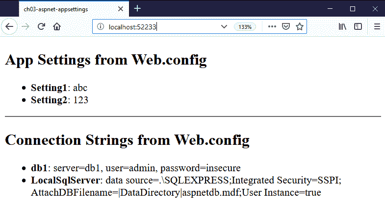
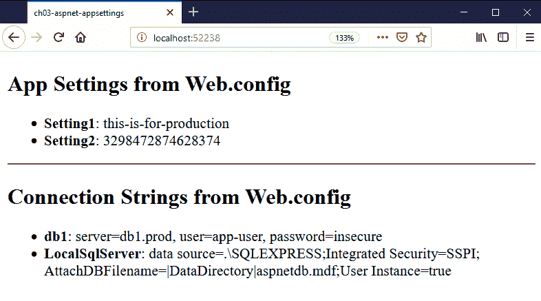
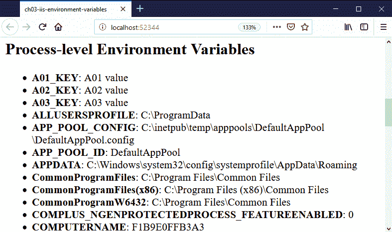
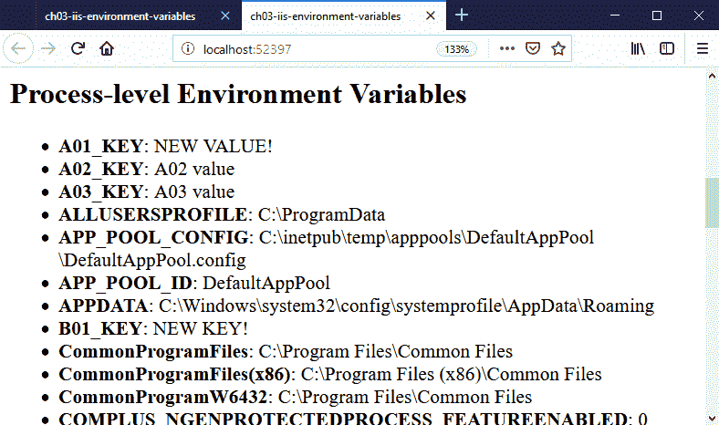
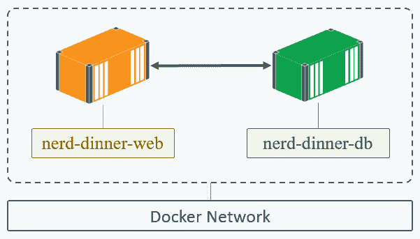
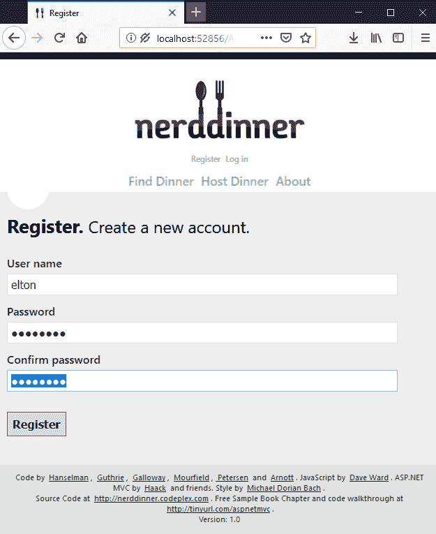
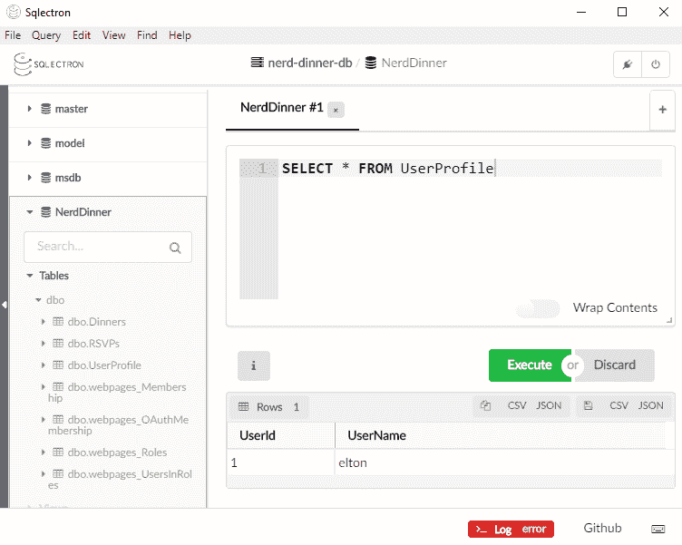
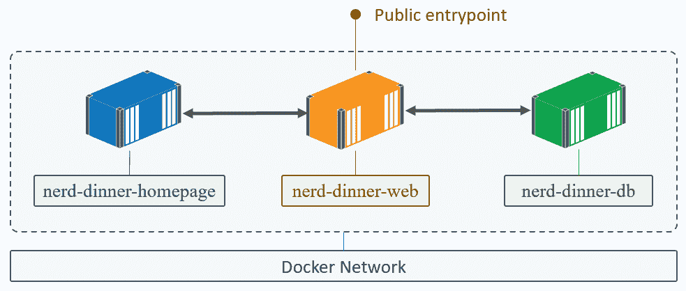
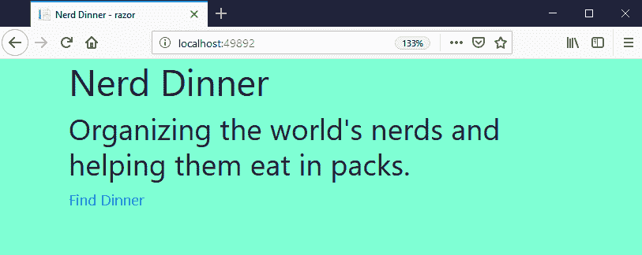
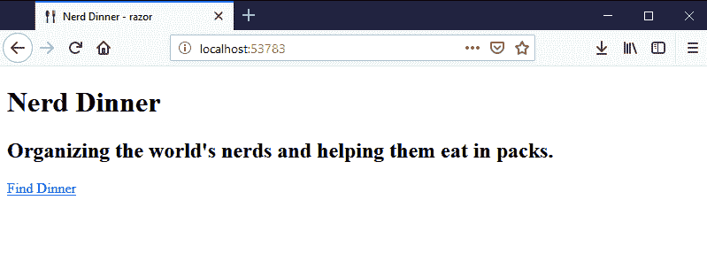

# 三、开发 .NET 框架和 .NET Core 应用

Docker 是一个打包、分发、运行和管理应用的平台。当您将应用打包为 Docker 映像时，它们都具有相同的形状。您可以用相同的方式部署、管理、保护和升级它们。所有 Docker 化的应用都有相同的运行要求:在兼容的操作系统上运行的 Docker 引擎。应用在隔离的环境中运行，因此您可以在同一台机器上托管不同的应用平台和不同的平台版本，而不会受到干扰。

在.NET 世界，这意味着您可以在一台 Windows 机器上运行多个工作负载。它们可能是 ASP.NET 的网站，或者运行的应用.NET 控制台应用或。视窗服务。在前一章中，我们研究了 Dockerizing 遗产.NET 应用，没有任何代码更改，但是 Docker 对在容器内运行的应用应该如何表现有一些简单的期望，以便它们可以充分受益于该平台。

在本章中，我们将了解如何构建应用，以便它们能够充分利用 Docker 平台，包括:

*   Docker 和您的应用之间的集成点
*   用配置文件和环境变量配置应用
*   通过运行状况检查监控应用
*   使用不同容器中的组件运行分布式解决方案

这会帮助你发展.NET 和.NET 核心应用，这些应用以 Docker 期望的方式运行，因此您可以使用 Docker 完全管理它们。

我们将在本章中讨论以下主题:

*   为 Docker 培养好公民
*   分离依赖关系
*   分解单片应用

# 为 Docker 培养好公民

Docker 平台对使用它的应用要求很少。你不局限于某些语言或框架，你不需要使用特殊的库在应用和容器之间进行通信，你也不需要以某种方式构建你的应用。

为了支持尽可能广泛的应用，Docker 使用控制台在应用和容器运行时之间进行通信。控制台输出和错误流中应包含应用日志和错误消息。由 Docker 管理的存储对于操作系统来说是一个普通的磁盘，Docker 的网络栈是透明的。应用将看起来运行在自己的机器上，通过正常的 TCP/IP 网络连接到其他机器。

Docker 的好公民是这样一个应用，它对运行它的系统做了很少的假设，并使用所有操作系统都支持的基本机制:文件系统、环境变量、网络和控制台。最重要的是，应用应该只做一件事。如您所见，当 Docker 运行容器时，它会启动 Dockerfile 或命令行中指定的进程，并监视该进程。当过程结束时，容器退出。因此，理想情况下，您应该构建一个单一流程的应用，这可以确保 Docker 关注重要的流程。

这些是建议，而不是要求。当一个容器启动时，您可以在引导脚本中启动多个进程，Docker 将愉快地运行它，但它将只监控最后启动的进程。您的应用可以将日志条目写入本地文件，而不是控制台，Docker 仍然会运行它们，但是如果您使用 Docker 检查容器日志，您将看不到任何输出。

英寸 NET，您可以通过运行控制台应用轻松满足这些建议，这提供了应用和主机之间的简化集成，这也是为什么.NET 核心应用——包括网站和网络应用接口——作为控制台应用运行。带着遗产.NET 应用，你将无法使他们成为完美的公民，但你可以小心包装他们，以便他们很好地利用 Docker 平台。

# 在 Docker 中托管互联网信息服务应用

完成.NET Framework 应用可以很容易地打包成 Docker 映像，但是您需要注意一些限制。微软为 Docker 提供了纳米服务器和 Windows 服务器核心基础映像。完整的.NET 框架不在 Nano 服务器上运行，所以要托管你现有的。在 Docker 中，你需要使用 Windows 服务器核心基础映像。

从 Windows Server Core 运行意味着您的应用映像大小约为 4 GB，其中大部分位于基本映像中。您有一个完整的 Windows Server 操作系统，所有可用的软件包都支持 Windows Server 功能，如**域名系统** ( **DNS** )和**动态主机配置协议** ( **DHCP** )，即使您只想将其用于单个应用角色。从 Windows Server Core 运行容器是完全合理的，但是您需要意识到其中的含义:

*   基本映像有很大的表面区域，安装了很多软件，这意味着它可能会有更频繁的安全和功能补丁。
*   除了您的应用进程之外，操作系统还运行许多自己的进程，因为窗口的几个核心部分作为后台窗口服务运行。
*   Windows 有自己的应用平台，具有用于托管和管理的高价值特性集，这些特性集并不与 Docker 方法本地集成。

你可以用一个 ASP.NET 的网络应用，在几个小时内把它归档。它将构建成一个大型 Docker 映像，与构建在轻量级现代应用栈上的应用相比，它的分发和启动时间稍长。但是您仍然会有一个单独的包来部署、配置和运行您的整个应用。这是在提高质量和减少部署时间方面迈出的一大步，并且它可以是使遗留应用现代化的程序的第一部分。

要将 ASP.NET 应用与 Docker 更紧密地集成，您可以修改 IIS 日志的编写方式，指定 Docker 如何检查容器是否健康，并在不更改应用代码的情况下将配置注入容器。如果更改代码是现代化程序的一部分，那么只需做很少的更改，就可以使用容器的环境变量和文件系统进行应用配置。

# 为对 Docker 友好的日志记录配置 IIS

IIS 将日志条目写入文本文件，记录 HTTP 请求和响应。您可以准确地配置写入哪些字段，但是默认安装会记录一些有用的信息，如 HTTP 请求的路由、响应状态代码以及 IIS 响应所用的时间。最好将这些日志条目展示给 Docker，但是 IIS 管理自己的日志文件，在将条目写入磁盘之前对它们进行缓冲，并旋转日志文件来管理磁盘空间。

日志管理是应用平台的一个基本部分，这就是为什么 IIS 为网络应用处理它，但是 Docker 有自己的日志系统。Docker 日志记录比 IIS 使用的文本文件系统更强大、更可插拔，但是它只从容器的控制台输出流中读取日志条目。您不能让 IIS 向控制台写入日志，因为它运行在没有连接控制台的后台窗口服务中，所以您需要一种不同的方法。

对此有两种选择。第一个是构建一个 HTTP 模块，该模块通过一个接收来自 IIS 的日志的事件处理程序插入到 IIS 平台中。此处理程序可以将所有消息发布到队列或窗口管道，因此您不会更改 IIS 的日志记录方式；您只需添加另一个日志接收器。然后，您可以将您的 web 应用与一个控制台应用打包在一起，该应用监听已发布的日志条目并在控制台上转发它们。控制台应用将是容器启动时的入口点，因此每个 IIS 日志条目都将被路由到控制台供 Docker 读取。

HTTP 模块方法是健壮且可扩展的，但是它增加了比我们开始时需要的更多的复杂性。第二个选项更简单——将 IIS 配置为将所有日志条目写入一个文本文件，并在容器的启动命令中，运行一个 PowerShell 脚本来监视该文件，并将新的日志条目回显到控制台。当容器运行时，所有的 IIS 日志条目都会回显到控制台，控制台会将它们显示给 Docker。

要在 Docker 映像中设置这一点，首先需要配置 IIS，使其将任何站点的所有日志条目写入一个文件，并允许文件增长而不旋转。您可以使用 PowerShell，使用 Dockerfile 中的`Set-WebConfigurationProperty` cmdlet，在应用主机级别修改中央日志记录属性来实现这一点。我在 Dockerfile 中对`dockeronwindows/ch03-iis-log-watcher`映像使用了这个 cmdlet:

```
RUN Set-WebConfigurationProperty -p 'MACHINE/WEBROOT/APPHOST' -fi 'system.applicationHost/log' -n 'centralLogFileMode' -v 'CentralW3C'; `
    Set-WebConfigurationProperty -p 'MACHINE/WEBROOT/APPHOST' -fi 'system.applicationHost/log/centralW3CLogFile' -n 'truncateSize' -v 4294967295; `
    Set-WebConfigurationProperty -p 'MACHINE/WEBROOT/APPHOST' -fi 'system.applicationHost/log/centralW3CLogFile' -n 'period' -v 'MaxSize'; `
    Set-WebConfigurationProperty -p 'MACHINE/WEBROOT/APPHOST' -fi 'system.applicationHost/log/centralW3CLogFile' -n 'directory' -v 'C:\iislog'
```

这是丑陋的代码，但它表明您可以在 Dockerfile 中编写任何您需要的东西来设置您的应用。它配置 IIS 将所有条目记录到`C:\iislog`中的一个文件中，并设置日志循环的最大文件大小，让日志文件增长到 4 GB。这是很大的发挥空间——记住，容器并不意味着长寿，所以我们不应该在一个容器中有千兆字节的日志条目。IIS 仍然对日志文件使用子目录格式，因此实际的日志文件路径将是`C:\iislog\W3SVC\u_extend1.log`。现在我有了一个已知的日志文件位置，我可以使用 PowerShell 将日志条目回显到控制台。

我在`CMD`指令中这样做，所以 Docker 运行和监视的最后一个命令是 PowerShell cmdlet，用于回显日志条目。当新条目被写入控制台时，它们会被 Docker 拾取。PowerShell 使观看文件变得很容易，但是有一个复杂之处，因为文件需要先存在，PowerShell 才能观看。在 Dockerfile 中，我在启动时按顺序运行多个命令:

```
 CMD Start-Service W3SVC; `
     Invoke-WebRequest http://localhost -UseBasicParsing | Out-Null; `
     netsh http flush logbuffer | Out-Null; `
     Get-Content -path 'c:\iislog\W3SVC\u_extend1.log' -Tail 1 -Wait
```

容器启动时会发生四件事:

1.  启动 IIS Windows 服务(W3SVC)。
2.  向本地主机发出 HTTP `GET`请求，本地主机启动 IIS 工作进程并写入第一个日志条目。
3.  刷新 HTTP 日志缓冲区，以便日志文件写入磁盘并存在，供 PowerShell 查看。
4.  在尾部模式下读取日志文件的内容，这样写入该文件的任何新行都会显示在控制台上。

我可以用通常的方法从这个映像运行一个容器:

```
 docker container run -d -P --name log-watcher dockeronwindows/ch03-iis-log-watcher:2e
```

当我通过浏览容器的 IP 地址(或使用 PowerShell 中的`Invoke-WebRequest`向站点发送一些流量时，我可以看到 IIS 日志条目，这些条目是使用`docker container logs`从`Get-Content` cmdlet 中继到 Docker 的:

```
> docker container logs log-watcher
2019-02-06 20:21:30 W3SVC1 172.27.97.43 GET / - 80 - 192.168.2.214 Mozilla/5.0+(Windows+NT+10.0;+Win64;+x64;+rv:64.0)+Gecko/20100101+Firefox/64.0 - 200 0 0 7
2019-02-06 20:21:30 W3SVC1 172.27.97.43 GET /iisstart.png - 80 - 192.168.2.214 Mozilla/5.0+(Windows+NT+10.0;+Win64;+x64;+rv:64.0)+Gecko/20100101+Firefox/64.0 http://localhost:51959/ 200 0 0 17
2019-02-06 20:21:30 W3SVC1 172.27.97.43 GET /favicon.ico - 80 - 192.168.2.214 Mozilla/5.0+(Windows+NT+10.0;+Win64;+x64;+rv:64.0)+Gecko/20100101+Firefox/64.0 - 404 0 2 23
```

IIS always buffers log entries in the memory before writing them to the disk, so it micro-batches writes to improve performance. Flushing happens every 60 seconds, or when the buffer is 64 KB in size. If you want to force the IIS log in a container to flush, use the same `netsh` command I used in the Dockerfile: `docker container exec log-watcher netsh http flush logbuffer`. You'll see an `Ok` output, and new entries will be in `docker container logs`.

我已经在映像和一个新命令中向 IIS 添加了配置，这意味着所有 IIS 日志条目都会被回显到控制台。这将适用于任何在 IIS 中托管的应用，所以我可以回显 ASP.NET 应用和静态网站的 HTTP 日志，而无需对应用或网站内容进行任何更改。控制台输出是 Docker 查找日志条目的地方，因此这个简单的扩展将现有应用的日志记录集成到了新平台中。

# 管理应用配置

在 Docker 映像中打包应用的目标是在每个环境中使用相同的映像。您不会为测试和生产构建单独的映像，因为这将使它们成为单独的应用，并且它们之间可能存在不一致。您应该从用户测试的完全相同的 Docker 映像中部署您的生产应用，这是由构建过程生成并用于所有自动化集成测试的完全相同的映像。

当然，有些东西需要在环境之间改变——数据库的连接字符串、日志记录级别和特性开关。这是应用配置，在 Docker 世界中，您使用一组默认配置来构建应用映像，通常用于开发环境。在运行时，您将当前环境的正确配置注入到容器中，这将覆盖默认配置。

注入这种配置有不同的方法。在本章中，我将向您展示如何使用卷装载和环境变量。在生产中，您将运行一个运行 Docker 的机器集群，并且您可以将配置数据存储在集群的安全数据库中，作为 Docker 配置对象或 Docker 机密。我将在[第 7 章](07.html)、*中介绍使用 Docker Swarm* 编排分布式解决方案。

# 将配置文件装入 Docker 卷

传统的应用平台使用配置文件来改变环境之间的行为。.NET Framework 应用具有丰富的基于 XML 的配置框架，Java 应用通常在属性文件中使用键值对。您可以将这些配置文件添加到 Dockerfile 中的应用映像中，当您从映像运行容器时，它将使用此默认配置。

您的应用设置应该为配置文件使用特定的目录，这将允许您在运行时通过装入 Docker 卷来覆盖它们。我在`dockeronwindows/ch03-aspnet-config:2e`中用一个简单的 ASP.NET 网络表单应用做到了这一点。Dockerfile 只使用您已经看到的命令:

```
# escape=`
FROM mcr.microsoft.com/dotnet/framework/aspnet

COPY Web.config C:\inetpub\wwwroot
COPY config\*.config C:\inetpub\wwwroot\config\
COPY default.aspx C:\inetpub\wwwroot
```

这使用微软的 ASP.NET 映像作为基础，并在我的应用文件中复制——一个 ASPX 页面和一些配置文件。在这个例子中，我使用的是默认的 IIS 网站，它从`C:\inetpub\wwwroot`加载内容，所以我在 Dockerfile 中只有`COPY`指令，我不需要运行任何 PowerShell 脚本。

split 希望在应用目录中找到`Web.config`文件，但是您可以将配置的各个部分分割成单独的文件。我已经在`appSettings `和`connectionStrings`部分做到了这一点，它们是从子目录中的文件加载的:

```
<?xml version="1.0" encoding="utf-8"?>
<configuration>
  <appSettings configSource="config\appSettings.config" />
  <connectionStrings configSource="config\connectionStrings.config" />
</configuration>
```

`config`目录填充了默认的配置文件，所以我可以从映像中运行一个容器，而不必指定任何额外的设置:

```
docker container run -d -P dockeronwindows/ch03-aspnet-config:2e
```

当我获取容器的端口并浏览到它时，我看到显示默认配置文件中的值的网页:



我可以通过从主机上的目录加载配置文件，将本地目录挂载为容器内的目标卷`C:\inetpub\wwwroot\config`，为不同的环境运行应用。当容器运行时，该目录的内容将从主机上的目录加载:

```
docker container run -d -P `
 -v $pwd\prod-config:C:\inetpub\wwwroot\config `
 dockeronwindows/ch03-aspnet-config:2e
```

I'm using PowerShell to run this command, which expands `$pwd` to the full value of the current directory, so I'm saying the `prod-config` directory in the current path should be mounted as `C:\inetpub\wwwroot\config` in the container. You can use fully-qualified paths too.

当我浏览到这个容器的端口时，我看到显示了不同的配置值:



这里重要的是，我使用的是完全相同的 Docker 映像，在每个环境中都有相同的设置和相同的二进制文件。只有配置文件会改变，Docker 提供了一种很好的方法。

# 促进环境变量

现代应用越来越多地使用环境变量进行配置设置，因为几乎每个平台都支持它们，从物理机器到平台即服务，再到无服务器功能。所有平台都以相同的方式使用环境变量——作为键值对的存储——因此，通过使用环境变量进行配置，您可以使您的应用高度可移植。

ASP.NET 应用已经在`Web.config`中有了丰富的配置框架，但是通过一些小的代码更改，您可以进行关键设置并将其移动到环境变量中。这使您可以为应用构建一个 Docker 映像，该映像可以在不同的平台上运行，在容器中设置环境变量来更改配置。

Docker 允许您在 Dockerfile 中指定环境变量，并为它们提供初始默认值。`ENV`指令设置环境变量，每个`ENV`指令可以设置一个变量，也可以设置多个变量。以下示例来自`dockeronwindows/ch03-iis-environment-variables:2e`的文档:

```
 ENV A01_KEY A01 value
 ENV A02_KEY="A02 value" `
     A03_KEY="A03 value"
```

用`ENV`添加到 Dockerfile 中的设置成为映像的一部分，因此从映像运行的每个容器都将设置这些值。运行容器时，可以使用`--env`或`-e`选项添加新的环境变量或替换现有映像变量的值。您可以看到环境变量如何与一个简单的纳米服务器容器一起工作:

```
> docker container run `
  --env ENV_01='Hello' --env ENV_02='World' `
  mcr.microsoft.com/windows/nanoserver:1809 `
  cmd /s /c echo %ENV_01% %ENV_02%

Hello World
```

在 IIS 中托管应用的情况下，使用 Docker 中的环境变量会很复杂。当 IIS 启动时，它从系统中读取所有环境变量并缓存它们。当 Docker 运行一个设置了环境变量的容器时，它会在进程级别写入这些变量，但这是在 IIS 缓存了原始值之后发生的，因此它们不会被更新，IIS 应用也不会看到新值。然而，IIS 不会以同样的方式缓存机器级环境变量，所以我们可以将 Docker 设置的值提升到机器级环境变量，IIS 应用将能够读取它们。

提升环境变量可以通过将它们从过程级复制到机器级来实现。您可以在容器启动命令中使用 PowerShell 脚本，这是通过循环遍历所有进程级变量并将它们复制到机器级来实现的，除非机器级密钥已经存在:

```
 foreach($key in [System.Environment]::GetEnvironmentVariables('Process').Keys) {
     if ([System.Environment]::GetEnvironmentVariable($key, 'Machine') -eq $null) {
         $value = [System.Environment]::GetEnvironmentVariable($key, 'Process')
         [System.Environment]::SetEnvironmentVariable($key, $value, 'Machine')
     }
 }
```

如果您使用的是基于微软 IIS 映像的映像，则不需要这样做，因为它是通过名为`ServiceMonitor.exe`的实用程序为您完成的，该实用程序打包在 IIS 映像中。ServiceMonitor 做三件事——它使进程级环境变量可用，它启动一个后台 Windows 服务，然后它监视服务以确保它保持运行。这意味着您可以使用服务监视器作为容器的启动进程，如果 IIS 窗口服务失败，服务监视器将退出，Docker 将看到您的应用已经停止。

`ServiceMonitor.exe` is available as a binary file on GitHub, but it's not open source and not all its behavior is documented (it seems to only work for the default IIS App Pool). It's copied into Microsoft's IIS image and set as the `ENTRYPOINT` for containers. The ASP.NET image is based on the IIS image, so it also has ServiceMonitor configured.

如果您想使用 ServiceMonitor 和您自己的逻辑来回显 IIS 日志，您需要在后台启动 ServiceMonitor，并在 Dockerfile 中完成您的启动命令和日志读取。我在`dockeronwindows/ch03-iis-environment-variables:2e`中这样做，用 PowerShell 的`Start-Process` cmdlet 运行 ServiceMonitor:

```
ENTRYPOINT ["powershell"]
CMD Start-Process -NoNewWindow -FilePath C:\ServiceMonitor.exe -ArgumentList w3svc; `
    Invoke-WebRequest http://localhost -UseBasicParsing | Out-Null; `
    netsh http flush logbuffer | Out-Null; `
    Get-Content -path 'C:\iislog\W3SVC\u_extend1.log' -Tail 1 -Wait 
```

The `ENTRYPOINT` and `CMD` instructions both tell Docker how to run your application. You can combine them to specify a default entry point and allow users of your image to override the command when they start a container.

映像中的应用是一个简单的 ASP.NET 网页表单页面，其中列出了环境变量。我可以用通常的方法在容器中运行:

```
docker container run -d -P --name iis-env dockeronwindows/ch03-iis-environment-variables:2e
```

当容器启动时，我可以获取容器的端口，并在 ASP.NET 网页表单页面上打开一个浏览器，使用一些简单的 PowerShell 脚本:

```
$port = $(docker container port iis-env).Split(':')[1]
start "http://localhost:$port"
```

该网站显示了 Docker 映像中作为过程级变量列出的默认环境变量值:



您可以使用不同的环境变量运行同一个映像，覆盖其中一个映像变量并添加一个新变量:

```
docker container run -d -P --name iis-env2 ` 
 -e A01_KEY='NEW VALUE!' ` 
 -e B01_KEY='NEW KEY!' `
 dockeronwindows/ch03-iis-environment-variables:2e
```

浏览新容器的端口，您将看到由 ASP.NET 页面写出的新值:



我现在已经在 IIS 映像中添加了对 Docker 环境变量管理的支持，因此 ASP.NET 应用可以使用`System.Environment`类来读取配置设置。我在这个新映像中保留了 IIS 日志回声，所以这是一个很好的 Docker 公民，现在您可以配置应用并通过 Docker 检查日志。

我能做的最后一个改进是告诉 Docker 如何监控容器内运行的应用，这样 Docker 就可以确定应用是否健康，如果变得不健康就采取行动。

# 构建监视应用的 Docker 映像

当我将这些新功能添加到 NerdDinner Dockerfile 文件中并从该映像运行一个容器时，我将能够看到带有`docker container logs`命令的 web 请求和响应日志，该命令将中继 Docker 捕获的所有 IIS 日志条目，并且我可以使用环境变量和配置文件来指定 API 键和数据库用户凭据。这使得运行和管理遗留的 ASP.NET 应用与我如何使用 Docker 上运行的任何其他容器化应用保持一致。我还可以配置 Docker 为我监控容器，这样我就可以管理任何意外的故障。

Docker 通过 Dockerfile 中的`HEALTHCHECK`指令，提供了监控应用运行状况的能力，而不仅仅是检查应用进程是否仍在运行。有了`HEALTHCHECK`你告诉 Docker 如何测试应用是否还健康。语法类似于`RUN`和`CMD`指令。您传入一个 shell 命令来执行，如果应用是健康的，它应该有一个返回代码`0`，如果不是健康的，它应该有一个返回代码`1`。Docker 会在容器运行时定期运行运行状况检查，并在容器运行状况发生变化时发出状态事件。

对于 web 应用来说，*健康的*的简单定义是正常响应 HTTP 请求的能力。你的要求取决于你希望检查的彻底程度。理想情况下，该请求应该执行应用的关键部分，因此您确信它工作正常。但是同样，请求应该快速完成，并且对计算的影响最小，所以处理大量的健康检查不会影响消费者的请求。

任何 web 应用的一个简单的健康检查就是只使用`Invoke-WebRequest` PowerShell cmdlet 获取主页并检查 HTTP 响应代码是否为`200`，这意味着响应被成功接收:

```
try { 
    $response = iwr http://localhost/ -UseBasicParsing
    if ($response.StatusCode -eq 200) { 
        return 0
    } else {
        return 1
    } 
catch { return 1 }
```

对于更复杂的 web 应用，添加一个专门用于运行状况检查的新端点可能会很有用。您可以向应用接口和网站添加一个诊断端点，该端点执行应用的一些核心逻辑，并返回一个布尔结果来指示应用是否健康。您可以在 Docker 运行状况检查中调用此端点，并检查响应内容以及状态代码，以便让您更加确信应用工作正常。

Dockerfile 中的`HEALTHCHECK`指令非常简单。您可以配置检查之间的间隔以及在容器被认为不健康之前可能失败的检查数量，但是要使用默认值，只需在`HEALTHCHECK CMD`中指定测试脚本。`dockeronwindows/ch03-iis-healthcheck:2e`映像的 Dockerfile 中的以下示例使用 PowerShell 向诊断 URL 发出`GET`请求，并检查响应状态代码:

```
HEALTHCHECK --interval=5s `
 CMD powershell -command `
    try { `
     $response = iwr http://localhost/diagnostics -UseBasicParsing; `
     if ($response.StatusCode -eq 200) { return 0} `
     else {return 1}; `
    } catch { return 1 }
```

我已经为运行状况检查指定了一个时间间隔，因此 Docker 将每 5 秒钟在容器内执行一次该命令(如果没有指定时间间隔，默认时间间隔是 30 秒)。运行健康检查非常便宜，因为它是在容器本地进行的，所以您可以像这样有一个很短的时间间隔，并快速发现任何问题。

这个 Docker 映像中的应用是一个 ASP.NET Web API 应用，它有一个诊断端点和一个控制器，您可以使用它来切换应用的运行状况。Docker 文件包含一个运行状况检查，当您从该映像运行容器时，您可以看到 Docker 如何使用它:

```
docker container run -d -P --name healthcheck dockeronwindows/ch03-iis-healthcheck:2e
```

如果您在启动该容器后运行`docker container ls`，您将在状态字段中看到略有不同的输出，类似于`Up 3 seconds (health: starting)`。Docker 每 5 秒钟对该容器运行一次运行状况检查，因此此时，检查尚未运行。再等一会儿，状态就像`Up 46 seconds (healthy)`了。

您可以通过查询`diagnostics`端点来检查应用编程接口的当前运行状况:

```
$port = $(docker container port healthcheck).Split(':')[1]
iwr "http://localhost:$port/diagnostics"
```

在返回的内容中，您将看到`"Status":"GREEN"`表示 API 是健康的。这个容器将保持健康，直到我调用控制器来切换健康。我可以通过一个`POST`请求做到这一点，该请求设置应用编程接口为所有后续请求返回 HTTP 状态`500`:

```
iwr "http://localhost:$port/toggle/unhealthy" -Method Post
```

现在，应用将对 Docker 平台发出的所有`GET`请求做出 500 响应，这将导致运行状况检查失败。Docker 一直在尝试运行状况检查，如果一行中有三个失败，那么它认为容器是不健康的。此时，容器列表中的状态字段显示`Up 3 minutes (unhealthy)`。Docker 不会对不健康的单个容器采取自动操作，所以这个容器保持运行，您仍然可以访问该 API。

当您开始在集群 Docker 环境中运行容器时，运行状况检查非常重要(我在第 7 章、*中介绍了使用 Docker Swarm* 编排分布式解决方案)，最好将它们包含在所有 Docker 文件中。能够打包一个平台可以测试运行状况的应用是一个非常有用的特性——这意味着无论你在哪里运行该应用，Docker 都可以对其进行检查。

现在，您拥有了将 ASP.NET 应用容器化并使其成为一个好的 Docker 公民的所有工具，与平台集成在一起，因此可以像其他容器一样对其进行监控和管理。一个完整的。在 Windows Server Core 上运行的. NET Framework 应用无法满足运行单个进程的预期，因为需要所有必要的后台 Windows 服务，但是您仍然应该构建容器映像，以便它们只运行一个逻辑函数并分离任何依赖关系。

# 分离依赖关系

在最后一章中，我整理了旧的 NerdDinner 应用，并让它运行，但没有数据库。原始应用应该在运行该应用的同一主机上使用 SQL Server 本地数据库。LocalDB 是一个基于 MSI 的安装，我可以通过下载 MSI，用 Dockerfile 中的`RUN`命令安装，将其添加到 Docker 镜像中。但这意味着当我从映像启动一个容器时，它有两个功能:托管一个 web 应用和运行一个数据库。

Having two functions in one container is not a good idea. What would happen if you wanted to upgrade your website without changing the database? Or what if you needed to do some maintenance on the database, which didn't impact the website? What if you need to scale out the website? By coupling the two functions together, you've added deployment risk, test effort, and administration complexity, and reduced your operational flexibility.

相反，我将把数据库打包到一个新的 Docker 映像中，在一个单独的容器中运行它，并使用 Docker 的网络层从网站容器访问数据库容器。SQL Server 是一个许可产品，但免费的变体是 SQL Server Express，它可以从微软以 Docker Hub 上的映像形式获得，并附带生产许可证。我可以将此作为我的映像的基础，在此基础上构建一个预配置的数据库实例，部署模式并准备连接到 web 应用。

# 为 SQL Server 数据库创建 Docker 映像

设置数据库映像就像任何其他 Docker 映像一样。我将把设置任务封装在一个 Dockerfile 中。总的来说，对于一个新的数据库，步骤将是:

1.  安装 SQL Server
2.  配置 SQL 服务器
3.  运行 DDL 脚本来创建数据库模式
4.  运行 DML 脚本来填充静态数据

这非常适合使用 Visual Studio 的 SQL 数据库项目类型和 Dacpac 部署模型的典型构建过程。发布项目的输出是一个`.dacpac`文件，其中包含数据库模式和要运行的任何自定义 SQL 脚本。使用`SqlPackage`工具，您可以将 Daccap 文件部署到一个 SQL Server 实例，如果不存在数据库，它将创建一个新的数据库，或者升级一个现有的数据库，使模式与 Daccap 相匹配。

这种方法非常适合定制的 SQL Server Docker 映像。我可以对 Dockerfile 再次使用多阶段构建，因此其他用户不需要安装 Visual Studio 来从源代码打包数据库。这是`dockeronwindows/ch03-nerd-dinner-db:2e`映像的 Dockerfile 的第一阶段:

```
# escape=`
FROM microsoft/dotnet-framework:4.7.2-sdk-windowsservercore-ltsc2019 AS builder
SHELL ["powershell", "-Command", "$ErrorActionPreference = 'Stop';"]

# add SSDT build tools
RUN nuget install Microsoft.Data.Tools.Msbuild -Version 10.0.61804.210

# add SqlPackage tool
ENV download_url="https://download.microsoft.com/download/6/E/4/6E406.../EN/x64/DacFramework.msi"
RUN Invoke-WebRequest -Uri $env:download_url -OutFile DacFramework.msi ; `
    Start-Process msiexec.exe -ArgumentList '/i', 'DacFramework.msi', '/quiet', '/norestart' -NoNewWindow -Wait; `
    Remove-Item -Force DacFramework.msi

WORKDIR C:\src\NerdDinner.Database
COPY src\NerdDinner.Database .

RUN msbuild NerdDinner.Database.sqlproj `
  /p:SQLDBExtensionsRefPath="C:\Microsoft.Data.Tools.Msbuild.10.0.61804.210\lib\net46" `
  /p:SqlServerRedistPath="C:\Microsoft.Data.Tools.Msbuild.10.0.61804.210\lib\net46" 

```

这里有很多，但都很简单。`builder`阶段从微软开始.NET 框架 SDK 映像。这给了我`NuGet`和`MSBuild`，但没有给我构建 SQL Server Dacpac 所需的依赖。前两条`RUN`说明安装了 SQL Server 数据工具和`SqlPackage`工具。如果我有许多数据库项目要打包，我可以将它打包成一个单独的 SQL Server SDK 映像。

该阶段的其余部分只是复制 SQL 项目源，并运行`MSBuild`来生成 Dacpac。

这是 Dockerfile 的第二个阶段，它打包了要在 SQL Server Express 中运行的 NerdDinner Dacpac:

```
FROM dockeronwindows/ch03-sql-server:2e

ENV DATA_PATH="C:\data" `
    sa_password="N3rdD!Nne720^6"

VOLUME ${DATA_PATH}

WORKDIR C:\init
COPY Initialize-Database.ps1 .
CMD powershell ./Initialize-Database.ps1 -sa_password $env:sa_password -data_path $env:data_path -Verbose

COPY --from=builder ["C:\\Program Files...\\DAC", "C:\\Program Files...\\DAC"]
COPY --from=builder C:\docker\NerdDinner.Database.dacpac . 

```

I'm using my own Docker image with SQL Server Express 2017 installed here. Microsoft do have SQL Server images published on Docker Hub for Windows and Linux, but the Windows versions haven't been regularly maintained. SQL Server Express is freely distributed, so you can package it into your own Docker image (the Dockerfile for `dockeronwindows/ch03-sql-server` is on GitHub in the `sixeyed/docker-on-windows` repository).

除了你目前看到的，这里没有新的说明。有一个为 SQL Server 数据文件设置的卷，以及一个将默认数据文件路径设置为`C:\data`的环境变量。您会看到没有`RUN`命令，所以我在构建映像时实际上并没有设置数据库模式；我只是将 Dacpac 文件打包到映像中，这样当容器启动时，我就拥有了创建或升级数据库所需的一切。

在`CMD`指令中，我运行了一个建立数据库的 PowerShell 脚本。有时在一个单独的脚本中隐藏所有的启动细节并不是一个好主意，因为这意味着你不能仅仅从 Dockerfile 中看到容器运行时会发生什么。但是在这种情况下，启动过程有相当多的功能，如果我们把它们都放在那里，它们会形成一个巨大的 Dockerfile。

基本的 SQL Server Express 映像定义了一个名为`sa_password`的环境变量来设置管理员密码。我扩展了这个映像，并为变量设置了一个默认值。我将以同样的方式使用该变量，以便允许用户在运行容器时指定管理员密码。启动脚本的其余部分处理在 Docker 卷中存储数据库状态的问题。

# 管理 SQL Server 容器的数据库文件

数据库容器类似于任何其他 Docker 容器，但侧重于状态。您需要确保您的数据库文件存储在容器之外，这样您就可以替换数据库容器而不会丢失任何数据。正如我们在上一章中看到的那样，您可以很容易地用卷来实现这一点，但是有一个陷阱。

如果使用已部署的数据库架构构建自定义的 SQL Server 映像，则数据库文件将位于映像内部的已知位置。您可以在不装载卷的情况下从该映像运行容器，它将正常工作，但数据将存储在容器的可写层中。如果在需要执行数据库升级时更换容器，那么您将丢失所有数据。

相反，您可以使用从主机装载的卷运行容器，从主机目录映射预期的 SQL Server 数据目录，因此您的文件位于容器之外的主机上的已知位置。这样，您可以确保数据文件存储在可靠的地方，例如服务器上的 RAID 阵列。但这意味着您不能在 Dockerfile 中部署数据库，因为数据目录将在映像中存储数据文件，如果您在目录上装载卷，这些文件将被隐藏。

微软的 SQL Server 映像通过允许您在运行时附加数据库和日志文件来处理这个问题，因此它是在主机上已经有了数据库文件的基础上工作的。在这种情况下，您可以直接使用映像，装载您的数据文件夹，并运行一个带有参数的 SQL Server 容器，告诉它要附加哪个(哪些)数据库。这是一种非常有限的方法——这意味着您需要首先在不同的 SQL Server 实例上创建数据库，然后在运行容器时附加它。这不符合自动发布流程。

对于我的自定义映像，我想做一些不同的事情。该映像包含 Dacpac，因此它拥有部署数据库所需的一切。当容器启动时，我希望它检查数据目录，如果它是空的，那么我就通过部署 Dacpac 模型来创建一个新的数据库。如果容器启动时数据库文件已经存在，那么首先附加数据库文件，并使用 Dacpac 模型升级数据库。

这种方法意味着您可以使用相同的映像为新环境运行新的数据库容器，或者升级现有的数据库容器而不会丢失任何数据。无论您是否从主机装载数据库目录，这都同样有效，因此您可以让用户选择如何管理容器存储，因此该映像支持许多不同的场景。

这样做的逻辑都在`Initialize-Database.ps1` PowerShell 脚本中，Dockerfile 将其设置为容器的入口点。在 Dockerfile 中，我将数据目录传递给`data_path`变量中的 PowerShell 脚本，该脚本检查 NerdDinner 数据(`mdf`)和 log ( `ldf`)文件是否在该目录中:

```
$mdfPath = "$data_path\NerdDinner_Primary.mdf"
$ldfPath = "$data_path\NerdDinner_Primary.ldf"

# attach data files if they exist: 
if ((Test-Path $mdfPath) -eq $true) {
   $sqlcmd = "IF DB_ID('NerdDinner') IS NULL BEGIN CREATE DATABASE NerdDinner ON (FILENAME = N'$mdfPath')"   
   if ((Test-Path $ldfPath) -eq $true) {
   $sqlcmd = "$sqlcmd, (FILENAME = N'$ldfPath')"
   }
   $sqlcmd = "$sqlcmd FOR ATTACH; END"
   Invoke-Sqlcmd -Query $sqlcmd -ServerInstance ".\SQLEXPRESS"
}
```

This script looks complex, but actually, it's just building a `CREATE DATABASE...FOR ATTACH` statement, filling in the paths of the MDF data file and LDF log files if they exist. Then it invokes the SQL statement, which attaches the database files from the external volume as a new database in the SQL Server container.

这包括用户运行带有卷装载的容器，并且主机目录已经包含来自先前容器的数据文件的场景。这些文件是附加的，数据库在新容器中可用。接下来，脚本使用`SqlPackage`工具从 Dacpac 生成部署脚本。我知道`SqlPackage`工具的存在，我知道它的路径，因为它在构建器阶段被打包到我的映像中:

```
$SqlPackagePath = 'C:\Program Files\Microsoft SQL Server\140\DAC\bin\SqlPackage.exe'
& $SqlPackagePath `
    /sf:NerdDinner.Database.dacpac `
    /a:Script /op:deploy.sql /p:CommentOutSetVarDeclarations=true `
    /tsn:.\SQLEXPRESS /tdn:NerdDinner /tu:sa /tp:$sa_password  

```

如果容器启动时数据库目录为空，则容器上没有`NerdDinner`数据库，`SqlPackage`将生成一个带有一组`CREATE`语句的脚本来部署新的数据库。如果数据库目录确实包含文件，那么将附加现有的数据库。在这种情况下`SqlPackage`将生成一个包含一组`ALTER`和`CREATE`语句的脚本，以使数据库符合 Dacpac。

这一步生成的`deploy.sql`脚本将创建新的模式，或者对旧的模式应用更改来升级它。在这两种情况下，最终的数据库模式都是相同的。

最后，PowerShell 脚本执行 SQL 脚本，传入数据库名称、文件前缀和数据路径的变量:

```
$SqlCmdVars = "DatabaseName=NerdDinner", "DefaultFilePrefix=NerdDinner"...
Invoke-Sqlcmd -InputFile deploy.sql -Variable $SqlCmdVars -Verbose
```

在运行 SQL 脚本后，数据库存在于容器中，模式在 Dacpac 中建模，它是在 Dockerfile 的构建器阶段从 SQL 项目构建的。数据库文件位于具有预期名称的预期位置，因此如果此容器被来自同一映像的另一个容器替换，新容器将找到现有数据库并附加它。

# 在容器中运行数据库

现在我有了一个可以用于新部署和升级的数据库映像。开发人员可以使用该映像，他们在处理某个功能时可能无需装载卷即可运行该映像，因此每次运行容器时都可以从一个新的数据库开始。在需要通过运行包含数据库文件的卷的容器来保留现有数据库的环境中，也可以使用相同的映像。

这就是如何在 Docker 中运行 NerdDinner 数据库，使用默认的管理员密码、数据库文件的主机目录，并命名容器，以便我可以从其他容器访问它:

```
mkdir -p C:\databases\nd

docker container run -d -p 1433:1433 ` --name nerd-dinner-db ` -v C:\databases\nd:C:\data ` dockeronwindows/ch03-nerd-dinner-db:2e
```

第一次运行该容器时，Dacpac 将运行以创建数据库，并将数据和日志文件保存在主机上的装载目录中。您可以用`ls`检查文件是否存在于您的主机上，`docker container logs`的输出显示生成的 SQL 脚本正在运行，并正在创建资源:

```
> docker container logs nerd-dinner-db
VERBOSE: Starting SQL Server
VERBOSE: Changing SA login credentials
VERBOSE: No data files - will create new database
Generating publish script for database 'NerdDinner' on server '.\SQLEXPRESS'.
Successfully generated script to file C:\init\deploy.sql.
VERBOSE: Changed database context to 'master'.
VERBOSE: Creating NerdDinner...
VERBOSE: Changed database context to 'NerdDinner'.
VERBOSE: Creating [dbo].[Dinners]...
...
VERBOSE: Deployed NerdDinner database, data files at: C:\data
```

我使用的`docker container run`命令也发布了标准的 SQL Server 端口`1433`，所以您可以通过. NET 连接远程连接到容器内部运行的数据库，或者使用 **SQL Server 管理工作室** ( **SSMS** )。如果您的主机上已经运行了一个 SQL Server 实例，您可以将容器的端口`1433`映射到主机上的不同端口。

要使用 SSMS、Visual Studio 或 Visual Studio 代码连接到容器中运行的 SQL Server 实例，请使用`localhost`作为服务器名称，选择“SQL Server 认证”，并使用`sa`凭据。我使用的是 **SqlElectron** ，这是一个非常轻量级的 SQL 数据库客户端:


然后，您可以像使用任何其他 SQL Server 数据库一样使用 Dockerized 数据库，查询表和插入数据。在 Docker 主机上，您使用`localhost`作为数据库服务器名称。通过发布端口，您可以使用主机名称作为服务器名称，在主机之外访问容器化数据库。Docker 会将端口`1433`上的任何流量路由到容器上运行的 SQL Server。

# 从应用容器连接到数据库容器

Docker 在平台中内置了一个 DNS 服务器，由容器用于服务发现。我用一个显式名称启动了 NerdDinner 数据库容器，在同一个 Docker 网络中运行的任何其他容器都可以通过其名称访问该容器，就像 web 服务器通过其 DNS 主机名访问远程数据库服务器一样:



这使得应用配置比传统的分布式解决方案简单得多。每个环境看起来都一样。在开发、集成测试、质量保证和生产中，网络容器总是使用`nerd-dinner-db`主机名连接到数据库，该主机名实际上在容器内运行。容器可以在同一个 Docker 主机上，也可以在 Docker Swarm 集群中的单独机器上，这对应用是透明的。

Service discovery in Docker isn't for containers only. A container can access another server on the network using its hostname. You could run your web application in a container, but still have it connected to SQL Server running on a physical machine rather than using a database container.

对于每个环境，有一项配置可能不同，那就是 SQL Server 登录凭据。在 NerdDinner 数据库映像中，我使用了与本章前面`dockeronwindows/ch03-aspnet-config`相同的配置方法。我已经将`Web.config`中的`appSettings`和`connectionStrings`部分分割成单独的文件，Docker 映像将这些配置文件与默认值捆绑在一起。

开发人员只需从映像中运行一个容器，它将使用默认的数据库凭据，这些凭据与 NerdDinner 数据库 Docker 映像中内置的默认凭据相匹配。在其他环境中，容器可以通过卷装载运行，使用主机服务器上的配置文件，这些文件指定不同的应用设置和数据库连接字符串。

这是一种简化的安全凭证方法，我用它来展示如何在不改变代码的情况下使我们的应用对 Docker 更加友好。将凭据保存在服务器上的纯文本文件中并不是管理机密的好方法，当我在 Docker 中介绍安全性时，我将在[第 9 章](03.html)、*了解 Docker 的安全风险和优势、*中再次讨论这一点。

本章对 NerdDinner 的 Dockerfile 进行了一些更新。我添加了运行状况检查和从 IIS 中回显日志的设置。我仍然没有对 NerdDinner 代码库做任何功能上的更改，只是拆分`Web.config`文件，设置默认的数据库连接字符串使用 SQL Server 数据库容器。当我现在运行 web 应用容器时，它将能够通过名称连接到数据库容器，并使用在 Docker:

```
docker container run -d -P dockeronwindows/ch03-nerd-dinner-web:2e
```

You can explicitly specify the Docker network a container should join when it's created, but on Windows, all containers default to joining the system-created Docker network called `nat`. The database container and web container are both connected to the `nat` network, so they can reach each other by the container name.

当容器启动时，我现在可以使用容器的端口打开网站，单击注册链接，并创建一个帐户:



“注册”页查询在 SQL Server 容器中运行的 ASP.NET 成员资格数据库。如果注册页面正在运行，那么 web 应用与数据库有一个工作连接。我可以在 Sqlectron 中验证这一点，查询`UserProfile`表，看到新的用户行:



我现在已经将 SQL Server 数据库从 web 应用中分离出来，每个组件都在一个轻量级 Docker 容器中运行。在我的开发笔记本电脑上，每个容器在空闲时使用不到 1%的主机 CPU，数据库使用 250 MB 内存，web 服务器使用 70 MB 内存。

`docker container top` shows you information on the processes running inside a container, including memory and CPU.

容器对资源要求不高，因此将功能单元拆分成不同的容器是没有坏处的，然后您可以分别扩展、部署和升级这些组件。

# 分解单片应用

传统。依赖于 SQL Server 数据库的. NET web 应用可以以最少的工作量迁移到 Docker，而无需重写任何应用代码。在我的 NerdDinner 迁移的这个阶段，我有一个应用 Docker 映像和一个数据库 Docker 映像，我可以可靠地重复部署和维护它们。我也有一些有益的副作用。

将数据库定义封装在 Visual Studio 项目中可能是一种新的方法，但它为数据库脚本增加了质量保证，并将模式带入代码库中，因此可以与系统的其他部分一起进行源代码控制和管理。Dacpacs、PowerShell 脚本和 Dockerfiles 为不同的 IT 功能提供了新的共同点。开发、操作和数据库管理团队可以使用相同的语言在相同的工件上一起工作。

Docker 是 DevOps 过渡的推动者，但是不管 DevOps 是否在您的路线图上，Docker 都为快速、可靠的发布提供了基础。为了最好地利用这一点，您需要考虑将单一应用分解成更小的部分，这样您就可以频繁地发布高价值的组件，而不必对整个大型应用进行回归测试。

从现有应用中提取核心组件可以让您将现代的轻量级技术引入系统，而无需进行大型复杂的重写。您可以将微服务架构原则应用到现有的解决方案中，在那里您已经了解了值得提取到自己的服务中的领域。

# 从单片中提取高价值成分

Docker 平台为传统应用的现代化提供了一个巨大的机会，允许您从单片中提取功能，并在单独的容器中运行它们。如果您可以在一个特性中隔离逻辑，这也是一个将其迁移到的机会.NET Core，它允许您将其打包成一个小得多的 Docker 映像。

微软的.NET Core 已经看到它采用了越来越多的完整功能.NET 框架，但是移植了遗留系统的一部分.NET 应用.NET Core 仍可能是一项大事业。这是一个值得评估的选项，但它不一定是您现代化方法的一部分。打破整体的价值在于拥有可以独立开发、部署和维护的功能。如果这些组件使用完整的.NET 框架，您仍然可以获得这些好处。

当你更新传统应用时，你的优势是你已经了解了功能集。您可以识别系统中的高价值功能，并从将这些功能提取到它们自己的组件开始。好的候选功能是那些如果频繁变更就能为业务带来价值的功能，因此新的功能请求可以在不修改和测试整个应用的情况下快速构建和部署。

同样好的候选功能是那些如果保持不变就能为信息技术带来价值的功能——具有大量依赖性的复杂组件，业务不会经常改变。将这样的特性提取到单独的组件中意味着您可以将升级部署到主应用中，而不必测试复杂的组件，因为它保持不变。像这样分解一个整体会给你一组组件，每个组件都有自己的交付节奏。

在 NerdDinner，有一些优秀的候选人可以闯出自己的事业。在本章的剩余部分，我将重点介绍其中的一个:主页。主页是为应用的第一页呈现 HTML 的功能。在生产中快速安全地将更改部署到主页的过程将让业务实验有一个新的外观和感觉，评估新版本的影响，并决定是否继续使用它。

当前应用分布在两个容器之间。在本章的这一部分，我将把主页分成它自己的组件，这样整个 NerdDinner 应用将跨三个容器运行:



我不会更改应用的路由。用户仍然会首先来到 NerdDinner 应用，应用容器会调用新的主页服务容器来获取要显示的内容。这样我就不需要公开暴露新容器了。变更只有一个技术要求:主应用需要能够与新的主页服务组件进行通信。

您可以自由选择容器中的应用如何通信。Docker 网络为您提供对 TCP/IP 和 UDP 的全面协议支持。您可以使整个过程异步，在另一个容器中运行消息队列，让消息处理程序在其他容器中侦听。但是我将在这一章从更简单的东西开始。

# 在 ASP.NET 核心应用中托管用户界面组件

ASP.NET 核心是一个现代的应用栈，它在一个快速和轻量级的运行时中提供了最好的 ASP.NET MVC 和网络应用编程接口。ASP.NET 核心网站作为控制台应用运行，它们将日志写入控制台输出流，并且它们可以使用环境变量和文件进行配置。建筑让他们成为开箱即用的好 Docker。

将 NerdDinner 主页提取到新服务中的最简单方法是将其写成一个 ASP.NET 核心网站，只有一个页面，并从现有应用中转发新应用的输出。下面的截图显示了我在 Docker 的 ASP.NET 核心剃刀页面中运行的主页的时尚、现代的重新设计:



为了将主页应用打包为 Docker 映像，我使用了与主应用和数据库映像相同的多阶段构建方法。在[第 10 章](10.html)、*用 Docker 启动持续部署管道、*中，您将看到如何使用 Docker 启动 CI/CD 构建管道，并将整个自动化部署过程联系在一起。

`dockeronwindows/ch03-nerd-dinner-homepage:2e`映像的 Dockerfile 使用了我在整个 ASP.NET 应用中使用的相同模式。构建器阶段使用 SDK 映像，并将包还原和编译步骤分开:

```
# escape=`
FROM microsoft/dotnet:2.2-sdk-nanoserver-1809 AS builder

WORKDIR C:\src\NerdDinner.Homepage
COPY src\NerdDinner.Homepage\NerdDinner.Homepage.csproj .
RUN dotnet restore

COPY src\NerdDinner.Homepage .
RUN dotnet publish 

```

Dockerfile 的最后阶段为`NERD_DINNER_URL`环境变量提供默认值。应用将其用作主页上链接的目标。Dockerfile 指令的其余部分只是复制到发布的应用中，并设置入口点:

```
FROM microsoft/dotnet:2.2-aspnetcore-runtime-nanoserver-1809

WORKDIR C:\dotnetapp
ENV NERD_DINNER_URL="/home/find"
EXPOSE 80

CMD ["dotnet", "NerdDinner.Homepage.dll"]
COPY --from=builder C:\src\NerdDinner.Homepage\bin\Debug\netcoreapp2.2\publish .
```

我可以在单独的容器中运行主页组件，但它还没有连接到主 NerdDinner 应用。按照我在本章中采用的方法，我需要对原始应用进行代码更改，以便集成新的主页服务。

# 从其他应用容器连接到应用容器

从主应用容器调用新的主页服务与连接到数据库基本相同:我将使用已知的名称运行主页容器，并且我可以使用它的名称和 Docker 的内置服务发现在其他容器中访问该服务。

对主应用中的`HomeController`类的简单更改将从新的主页服务传递响应，而不是从主应用呈现页面:

```
static HomeController()
{
  var homepageUrl = Environment.GetEnvironmentVariable("HOMEPAGE_URL", EnvironmentVariableTarget.Machine);
  if (!string.IsNullOrEmpty(homepageUrl))
  {
    var request = WebRequest.Create(homepageUrl);
    using (var response = request.GetResponse())
    using (var responseStream = new StreamReader(response.GetResponseStream()))
    {
      _NewHomePageHtml = responseStream.ReadToEnd();
    }
  } 
}

public ActionResult Index()
{
  if (!string.IsNullOrEmpty(_NewHomePageHtml))
  {
    return Content(_NewHomePageHtml);
  }
  else
  {
    return Find();
  }
}
```

在新代码中，我从一个环境变量中获得了主页服务的 URL。就像数据库连接一样，我可以在 Dockerfile 中为它设置一个默认值。这在分布式应用中是不好的做法，在分布式应用中，我们不能保证组件在哪里运行，但是在 Dockerized 应用中，我可以安全地做到这一点，因为我将控制容器的名称，所以我可以确保在部署它们时服务名称是正确的。

我已经将这张更新的图片标记为`dockeronwindows/ch03-nerd-dinner-web:2e-v2`。现在要开始整个解决方案，我需要运行三个容器:

```
docker container run -d -p 1433:1433 `
 --name nerd-dinner-db ` 
 -v C:\databases\nd:C:\data `
 dockeronwindows/ch03-nerd-dinner-db:2e

docker container run -d -P `
 --name nerd-dinner-homepage `
 dockeronwindows/ch03-nerd-dinner-homepage:2e

docker container run -d -P dockeronwindows/ch03-nerd-dinner-web:2e-v2
```

当容器运行时，我浏览到 NerdDinner 容器的发布端口，看到新组件的主页:



“查找晚餐”链接将我带回到最初的网络应用，现在我可以遍历主页，只需更换容器就可以发布新的用户界面，而无需发布或测试应用的其余部分。

What happened to the new UI? In this simple example, the integrated home page doesn't have the styling of the new ASP.NET Core version because the main application only reads the HTML for the page, not the CSS files or other assets. A better approach would be to run a reverse proxy in a container and use that as the entry point to other containers, so each container serves all its assets. I'll do that later in the book.

现在，我已经将我的解决方案分成了三个容器，极大地提高了灵活性。在构建时，我可以专注于提供最高价值的特性，而无需花费精力去测试没有变化的组件。在部署时，我可以快速而自信地发布，因为我知道我们推向生产的新映像将完全是经过测试的。然后在运行时，我可以根据组件的需求独立地扩展组件。

我确实有一个新的非功能性要求，即确保所有容器都有预期的名称，以正确的顺序启动，并且在同一个 Docker 网络中，因此解决方案作为一个整体可以正常工作。Docker 对此有支持，它专注于用 Docker Compose 组织分布式系统。我将在[第 6 章](06.html)、*用 Docker Compose 组织分布式解决方案中向您展示这一点。*

# 摘要

在本章中，我们讨论了三个主要主题。首先，我们讨论了容器化的遗产.NET Framework 应用，使他们成为优秀的 Docker 公民，并与平台集成进行配置、日志记录和监控。

然后，我们用 SQL Server Express 和 Dacpac 部署模型介绍了容器化数据库工作负载，构建了一个版本化的 Docker 映像，该映像可以作为新数据库运行容器，也可以升级现有数据库。

最后，我们展示了如何将单片应用的功能提取到单独的容器中，使用 ASP.NET 核心和 Windows Nano Server 打包一个快速、轻量级的服务，供主应用使用。

您已经学习了如何在 Docker Hub 上使用更多来自微软的映像，以及如何使用 Windows Server Core 进行完整备份.NET 应用，数据库的 SQL Server Express，以及.NET 核心映像。

在后面的章节中，我将回到 NerdDinner，并通过将特性提取到专用服务中来继续对其进行现代化。在此之前，在下一章中，我将更仔细地研究如何使用 Docker Hub 和其他注册表来存储映像。