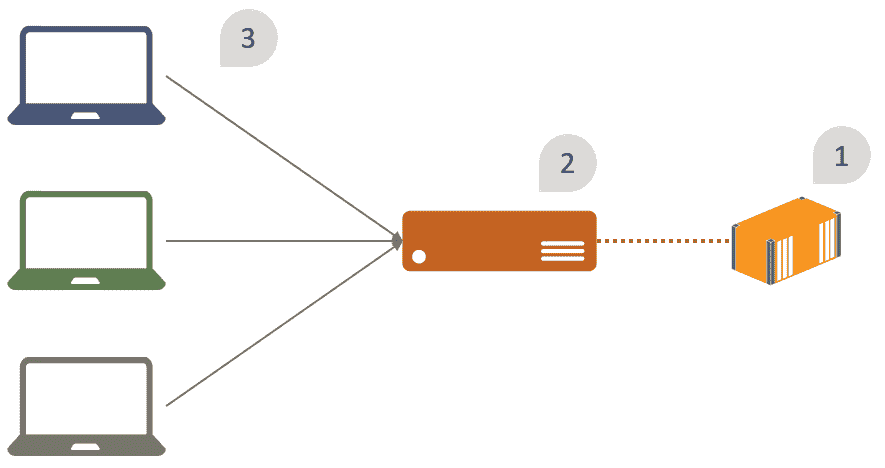
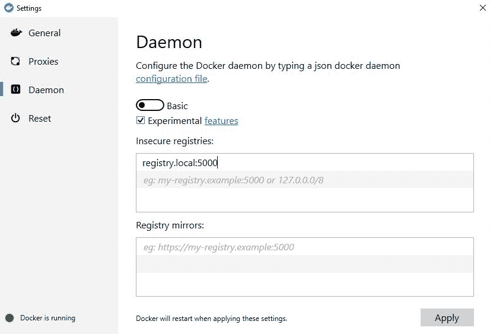
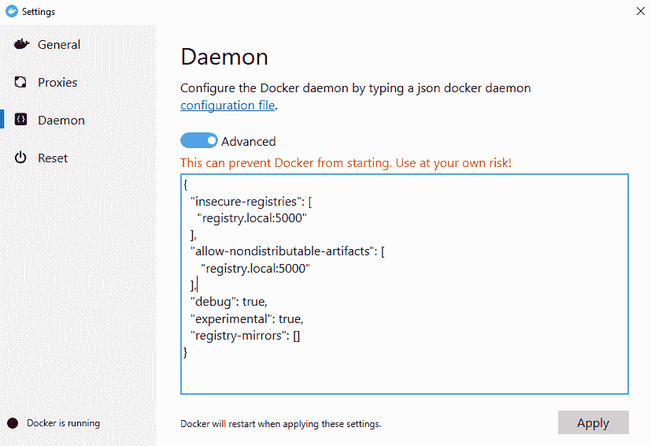
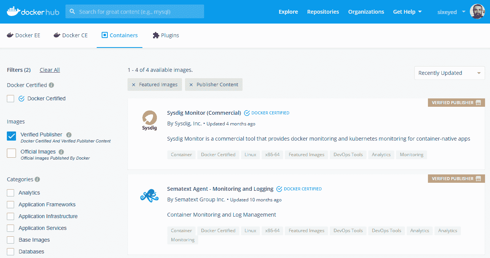
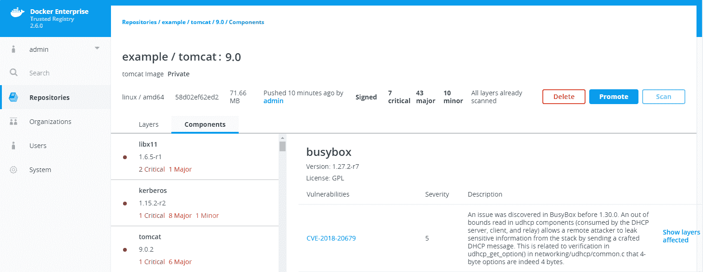

# 与 Docker 注册表共享图像

装运应用程序是 Docker 平台不可或缺的一部分。Docker 引擎可以从一个中心位置下载图像来运行容器，还可以将本地构建的图像上传到一个中心位置。这些共享的图像存储被称为**注册表**，在本章中，我们将更仔细地研究图像注册表是如何工作的，以及您可以使用的注册表类型。

主映像注册表是 Docker Hub，这是一个免费的在线服务，是 Docker 服务处理映像的默认位置。Docker Hub 是社区共享映像的好地方，这些映像是为打包开源软件而构建的，可以自由地重新分发。Docker Hub 取得了巨大的成功。在写这本书的时候，上面有几十万张图片，每年下载数十亿次。

公共注册表可能不适合您自己的应用程序。Docker Hub 还提供了一个商业计划，以便您可以托管私有映像(类似于 GitHub 如何让您托管公共和私有源代码存储库)，还有其他商业注册中心添加了安全扫描等功能。您还可以通过使用免费提供的开源注册表实现，在您的环境中运行您自己的注册表服务器。

在这一章中，我将向您展示如何使用这些注册表，我将介绍标记图像(这是您如何对 Docker 图像进行版本化)以及使用不同注册表中的图像的更详细的信息。我们将涵盖:

*   了解注册表和存储库
*   运行本地映像注册表
*   使用本地注册表推送和拉取图像
*   使用商业登记处

# 了解注册表和存储库

您可以使用`docker image pull`命令从注册表下载图像。当您运行该命令时，Docker 引擎会连接到注册表，进行身份验证(如果需要的话)并下拉映像。拉进程下载所有图像层，并将它们存储在机器上的本地图像缓存中。容器只能从本地映像缓存中可用的映像运行，因此除非它们是在本地构建的，否则需要首先提取它们。

当您开始在 Windows 上使用 Docker 时，您运行的最早的命令之一将是一些简单的东西，比如第 2 章*中的这个例子，将应用程序打包并运行为 Docker 容器*:

```
> docker container run dockeronwindows/ch02-powershell-env:2e

Name                           Value
----                           -----
ALLUSERSPROFILE                C:\ProgramData
APPDATA                        C:\Users\ContainerAdministrator\AppData\Roaming
...
```

即使您的本地缓存中没有该映像，这也可以工作，因为 Docker 可以从默认注册表 Docker Hub 中提取它。如果您试图从本地没有存储的图像中运行容器，Docker 会在创建容器之前自动提取它。

在这个例子中，我并没有给 Docker 太多的信息——只有图像名`dockeronwindows/ch02-powershell-env:2e`。这个细节足以让 Docker 在注册表中找到正确的图像，因为 Docker 用默认值填充了一些缺失的细节。存储库的名称是`dockeronwindows/ch02-powershell-env`存储库是一个存储单元，可以包含多种版本的 Docker 映像。

# 检查图像存储库名称

存储库有一个固定的命名方案:`{registry-domain}/{account-id}/{repository-name}:{tag}`。所有零件都是必需的，但 Docker 假定某些值为默认值。所以`dockeronwindows/ch02-powershell-env:2e`实际上是完整存储库名称的简称，`docker.io/dockeronwindows/ch02-powershell-env:2e`:

*   `registry-domain`是存储映像的注册表的域名或 IP 地址。Docker Hub 是默认注册表，因此当您使用 Hub 中的图像时，可以省略注册表域。如果您没有指定，Docker 将使用`docker.io`作为注册表。
*   `account-id`是在注册表中拥有映像的帐户或组织的名称。在 Docker Hub 上，帐户名是必需的。我自己的账号 ID 是`sixeyed`，本书所附图片的组织账号 ID 是`dockeronwindows`。在其他注册中心，可能不需要帐户标识。
*   `repository-name`是您希望在注册表中您的帐户的所有存储库中，为您的映像指定的唯一标识应用程序的名称。
*   `tag`是如何区分存储库中不同的图像变化。

您可以使用标签对应用程序进行版本控制或识别变体。如果在构建或拉取图像时没有指定标签，Docker 会使用默认标签`latest`。当您开始使用 Docker 时，您将使用 Docker Hub 和`latest`标签，这是 Docker 提供的默认设置，以隐藏一些复杂性，直到您准备深入挖掘。当您继续使用 Docker 时，您将使用标签来明确区分应用程序包的不同版本。

微软就是一个很好的例子。NET Core 基础映像，位于`microsoft/dotnet`存储库中的 Docker Hub 上。。NET Core 是一个跨平台的应用堆栈，运行在 Linux 和 Windows 上。您只能在基于 Linux 的 Docker 主机上运行 Linux 容器，并且只能在基于 Windows 的 Docker 主机上运行 Windows 容器，因此微软在标签名称中包含了操作系统。

在撰写本文时，微软有几十个版本的。可在`microsoft/dotnet`存储库中使用的 NET Core 图像，用不同的标签标识。这些只是一些标签:

*   `2.2-runtime-bionic`一个基于 Ubuntu 版本的 Linux 镜像，其中有。NET Core 2.2 运行时已安装
*   `2.2-runtime-nanoserver-1809`一个 Nano Server 版本的图像，其中有。NET Core 2.2 运行时已安装
*   `2.2-sdk-bionic`一个基于 Debian 的 Linux 镜像，它具有。已安装. NET Core 2.2 运行时和 SDK
*   `2.2-sdk-nanoserver-1809`一个具有。已安装. NET Core 2.2 运行时和 SDK

标签清楚地表明了每个图像包含的内容，但它们本质上都是相似的——它们都是`microsoft/dotnet`的变体。

Docker 还支持多拱形图像，其中单个图像标签被用作许多变体的保护伞。基于 Linux 和 Windows 操作系统，或者英特尔和**高级 RISC 机器** ( **ARM** )处理器，可能会有图像变化。它们都使用相同的映像名称，当您运行`docker image pull`时，Docker 会为您的主机操作系统和 CPU 架构提取匹配的映像。。NET Core images 这样做–`docker image pull microsoft/dotnet:2.2-sdk`会在 Linux 机器上下载 Linux 映像，在 Windows 机器上下载 Windows 映像。

If you publish a cross-platform app to Docker Hub and you want to make it as easy as possible for consumers to use it, you should publish it as a multi-arch image. In your own development, it's better to be explicit and specify the exact `FROM` image in your Dockerfiles, otherwise your app will build differently on different operating systems.

# 构建、标记和版本化图像

您可以在第一次构建图像时对其进行标记，但也可以使用`docker image tag`命令向图像中显式添加标记。这在对成熟的应用程序进行版本控制时非常有用，因此用户可以选择他们想要使用的版本控制级别。如果您要运行以下命令，您将构建一个具有五个标签的图像，对于应用程序版本具有递增的精度级别:

```
docker image build -t myapp .
docker image tag myapp:latest myapp:5
docker image tag myapp:latest myapp:5.1
docker image tag myapp:latest myapp:5.1.6
docker image tag myapp:latest myapp:bc90e9
```

初始的`docker image build`命令没有指定标签，因此新图像将默认为`myapp:latest`。每一个后续的`docker image tag`命令都会给同一张图片添加一个新的标签。标记不会复制图像，因此不存在数据重复–您只有一个图像，可以用几个标记引用它。通过添加所有这些标签，您可以让消费者选择使用哪个图像，或者根据自己的图像。

这个示例应用程序使用语义版本控制。最后一个标签可能是触发构建的源代码提交的标识；这可能会在内部使用，但不会公开。`5.1.6`为补丁版本，`5.1`为次要版本号，`5`为主要版本号。

用户可以明确使用`myapp:5.1.6`，这是最具体的版本号，知道标签在那个级别不会改变，图像永远不变。下一个版本将有标签`5.1.7`，但这将是一个不同的应用程序版本的不同图像。

`myapp:5.1`将随着每个补丁的发布而改变——下一个版本`5.1`将是`5.1.7`的标签别名——但是用户可以确信不会有任何重大改变。`myapp:5`将随着每个小版本而改变——下个月，它可能是`myapp:5.2`的别名。如果用户总是想要版本 5 的最新版本，他们可以选择主要版本，或者如果他们总是想要最新版本，他们可以使用最新版本，并且可以接受打破更改的可能性。

作为图像的制作者，您可以决定如何在图像标签中支持版本控制。作为消费者，你应该更具体一些——尤其是在你自己的构建中使用的`FROM`图像。如果您正在打包一个. NET Core 应用程序，如果您像这样启动 Dockerfile，您将会遇到问题:

```
FROM microsoft/dotnet:sdk
```

在撰写本文时，此映像的版本为 2.2.103。已安装. NET Core SDK。如果你的应用程序的目标是 2.2 版本，那没关系；图像将被构建，您的应用程序将在容器中正确运行。但是当。NET Core 2.3 或 3.0 发布后，通用的`:sdk`标签将被应用到新镜像中，可能不支持瞄准 2.2 应用。当您在该版本之后使用完全相同的 Dockerfile 时，它将使用不同的基础映像—您的映像构建可能会失败，或者它可能会在运行时仅在应用程序出现重大更改时才完成。NET 核心更新。

相反，您应该考虑为您正在使用的应用程序框架的次要版本使用一个标签，如果它是一个多拱形映像，则明确说明操作系统和 CPU 体系结构:

```
FROM microsoft/dotnet:2.2-sdk-nanoserver-1809
```

这样，您将从映像的任何补丁版本中受益，但您将始终使用的 2.2 版本。NET Core，所以您的应用程序在基本映像中总是有一个匹配的主机平台。

您可以标记本地缓存中的任何图像，而不仅仅是您自己构建的图像。如果您想重新标记一个公共映像，并将其添加到本地私有注册表中一组已批准的基础映像中，这将非常有用。

# 将图像推送到注册表

构建和标记图像是本地操作。`docker image build`和`docker image tag`的最终结果是对运行命令的 Docker 引擎上的图像缓存进行了更改。图像需要通过`docker image push`命令明确共享到注册表中。

Docker Hub 可以在不进行身份验证的情况下使用，以拉取公共图像，但是要上传图像(或拉取私有图像)，您需要注册一个帐户。注册在[https://hub.docker.com/](https://hub.docker.com/)是免费的，在那里你可以创建一个码头工人标识，你可以在码头工人中心和其他码头工人服务中使用。您的码头工人标识是您如何向码头工人服务进行身份验证以访问码头工人中心。这是通过`docker login`命令完成的:

```
> docker login
Login with your Docker ID to push and pull images from Docker Hub. If you don't have a Docker ID, head over to https://hub.docker.com to create one.
Username: sixeyed
Password:
Login Succeeded
```

要将图像推送到 Docker Hub，存储库名称必须包含您的 Docker ID 作为帐户 ID。您可以使用任何帐户标识(如`microsoft/my-app`)在本地标记图像，但不能将其推送到注册表中的微软组织。您登录时使用的 Docker ID 需要有权限推送至注册表中的帐户。

当我发布图像以配合这本书时，我在存储库中用`dockeronwindows`作为帐户名来构建它们。这是 Docker Hub 上的一个组织，我自己的用户帐户`sixeyed`可以将图像推送至该组织。当我以`sixeyed`身份登录时，我可以将图像推送至属于`sixeyed`或`dockeronwindows`的存储库:

```
docker image push sixeyed/git:2.17.1-windowsservercore-ltsc2019 docker image push dockeronwindows/ch03-iis-healthcheck:2e 
```

Docker CLI 的输出显示了如何将图像分割成层，并告诉您每个层的上传状态:

```
The push refers to repository [docker.io/dockeronwindows/ch03-iis-healthcheck]
55e5e4877d55: Layer already exists
b062c01c8395: Layer already exists
7927569daca5: Layer already exists
...
8df29e538807: Layer already exists
b42b16f07f81: Layer already exists
6afa5894851e: Layer already exists
4dbfee563a7a: Skipped foreign layer
c4d02418787d: Skipped foreign layer
2e: digest: sha256:ffbfb90911efb282549d91a81698498265f08b738ae417bc2ebeebfb12cbd7d6 size: 4291
```

This image uses Windows Server Core as the base image. That image is not publicly redistributable – it's listed on Docker Hub, and free to download from the Microsoft Container Registry, but it is not licensed to be stored on other public image registries. That's why we can see the lines stating *Skipped foreign layer* – Docker will not push layers containing the Windows OS to Docker Hub.

您不能发布到其他用户的帐户，但是您可以用自己的帐户名标记其他用户的图像。这是一组完全有效的命令，如果我想下载特定版本的 Windows Server Core 映像，给它一个更友好的名称，并在 Hub 上以该新名称在我的帐户中使用，我可以运行这些命令:

```
docker image pull mcr.microsoft.com/windows/servercore:1809_KB4480116_amd64
docker image tag mcr.microsoft.com/windows/servercore:1809_KB4480116_amd64 `
  sixeyed/windowsservercore:2019-1811
docker image push sixeyed/windowsservercore:2019-1811
```

Microsoft have used different tagging schemes for their images at different times. Windows Server 2016 images use the full Windows version number, like `10.0.14393.2608`. Windows Server 2019 images use the release name followed by the KB identifier for the most recent Windows update included in the image, like `1809_KB4480116`.

对用户来说，将图像推送到注册表并不比这更复杂，尽管在幕后，Docker 运行着一些智能逻辑。映像分层适用于注册表以及 Docker 主机上的本地映像缓存。当您将基于 Windows Server Core 的映像推送到 Hub 时，Docker 不会上传 4 GB 的基础映像—它知道 MCR 上已经存在基础层，它只会上传目标注册表中缺失的层。

标记公共图像并将其推送到公共中心的最后一个例子是有效的，但不太可能——您更有可能标记图像并将其推送到自己的私有注册表中。

# 运行本地映像注册表

Docker 平台是可移植的，因为它是用 Go 编写的，这是一种跨平台语言。Go 应用程序可以编译成本机二进制文件，因此 Docker 可以在 Linux 或 Windows 上运行，而用户不必安装 Go。在 Docker Hub 上有一个官方映像，其中包含一个用 Go 编写的注册表服务器，因此您可以通过从该映像运行 Docker 容器来托管自己的映像注册表。

`registry`是一个由 Docker 团队维护的官方存储库，但是在撰写本文时，它只有 Linux 可用的映像。很可能很快就会发布一个 Windows 版本的注册表，但是在本章中，我将引导您构建自己的注册表映像，因为它演示了一些常见的 Docker 使用模式。

*Official repositories* are available on Docker Hub like other public images, but they have been curated by Docker, Inc. and are maintained either by Docker themselves or by the application owners. You can rely on them containing correctly packaged and up-to-date software. The majority of official images have Linux variants, but the number of Windows-based official images is growing.

# 构建注册表映像

Docker 的注册表服务器是一个功能齐全的映像注册表，但它只是 API 服务器——它没有 Docker Hub 那样的 Web UI。这是一个开源应用程序，托管在`docker/distribution`存储库中的 GitHub 上。要在本地构建应用程序，您需要首先安装 Go SDK。如果您已经这样做了，您可以运行一个简单的命令来编译应用程序:

```
go get github.com/docker/distribution/cmd/registry
```

但是如果你不是一个普通的 Go 开发人员，你不希望在你的本地机器上安装和维护 Go 工具的开销仅仅是为了在你想要更新的时候可以构建注册服务器。最好将 Go 工具打包到 Docker 映像中，并设置该映像，以便当您运行容器时，它会为您构建注册表服务器。您可以使用我在[第 3 章](03.html)*中演示的相同的多阶段构建方法来实现这一点。NET 框架和。网络核心应用*。

多阶段模式有很多优点。首先，这意味着您的应用程序映像可以保持尽可能的轻量级——您不需要将构建工具与运行时打包在一起。其次，这意味着您的构建代理被封装在 Docker 映像中，因此您不需要在构建服务器上安装这些工具。第三，这意味着开发人员可以使用与构建服务器完全相同的构建过程，因此您可以避免开发人员机器和构建服务器安装了不同工具集的情况，避免工具集漂移并导致构建问题的风险。

`dockeronwindows/ch04-registry:2e`的 Dockerfile 使用官方的 Go 映像，在 Docker Hub 上有一个 Windows Server Core 变体。构建器阶段使用该映像来编译注册表应用程序:

```
# escape=`
FROM golang:1.11-windowsservercore-1809 AS builder

ARG REGISTRY_VERSION="v2.6.2"

WORKDIR C:\gopath\src\github.com\docker
RUN git clone https://github.com/docker/distribution.git; `
    cd distribution; `
    git checkout $env:REGISTRY_VERSION; `
    go build -o C:\out\registry.exe .\cmd\registry 

```

我使用`ARG`指令来指定要构建的源代码版本 GitHub 存储库对每个发布的版本都有标签，我默认为版本 2.6.2。然后我用`git`克隆源代码，切换到代码的标签版本，用`go build`编译应用程序。Git 客户端和 Go 工具都在基本的`golang`图像中。输出将是`registry.exe`，一个不需要安装 Go 就能运行的原生 Windows 可执行文件。

Dockerfile 的最后阶段使用 Nano Server 作为基础，它可以很好地运行 Go 应用程序。以下是整个申请阶段:

```
FROM mcr.microsoft.com/windows/nanoserver:1809

ENV REGISTRY_STORAGE_FILESYSTEM_ROOTDIRECTORY="C:\data"
VOLUME ${REGISTRY_STORAGE_FILESYSTEM_ROOTDIRECTORY}
EXPOSE 5000

WORKDIR C:\registry
CMD ["registry", "serve", "config.yml"]

COPY --from=builder C:\out\registry.exe .
COPY --from=builder C:\gopath\src\github.com\docker\...\config-example.yml .\config.yml
```

这个阶段没什么复杂的。首先设置图像:

1.  `REGISTRY_STORAGE_FILESYSTEM_ROOTDIRECTORY`是一个环境变量，注册表使用它作为存储数据的基本路径。
2.  通过使用在环境变量中捕获的路径，为注册表数据创建一个`VOLUME`。
3.  端口`5000`暴露，是 Docker 注册表使用的常规端口。

Dockerfile 的剩余部分为容器设置入口点，并从构建器阶段复制编译后的二进制文件和默认配置文件。

Docker containers in Windows Server 2016 had a different implementation of volumes – the target directory inside the container was actually a symbolic link rather than a normal directory. That caused issues with Go, Java, and other languages. There was a workaround that was made possible by using mapped drives, but that's no longer needed. If you see any Dockerfiles that use a G: drive, they're based on Windows Server 2016 and can be simplified for Windows Server 2019 just by using the C: drive.

构建注册表映像与任何其他映像一样，但是当您使用它来运行自己的注册表时，有一些重要的因素需要考虑。

# 运行注册表容器

通过运行您自己的注册表，您可以在团队成员之间共享图像，并使用快速局域网而不是互联网连接存储所有应用程序构建的输出。您通常会在这样的配置中可以广泛访问的服务器上运行注册表容器:



注册表运行在服务器(2)上的容器(1)中。客户端机器(3)连接到服务器，以便它们可以使用本地网络上的注册表来推送和拉取私有映像。

要使注册表容器可访问，您需要将端口`5000`从容器发布到主机上的端口`5000`。注册表用户可以使用主机服务器的 IP 地址或主机名访问容器，这将是您在映像名称中使用的注册表域。您还需要从主机装载一个卷，将图像数据存储在一个已知的位置。当您用新版本替换容器时，它仍然可以使用主机的域名，并且它仍然具有由以前的容器存储的所有图像层。

在我的主机服务器上，我有一个配置为磁盘`E:`的 RAID 阵列，我将它用于我的注册表数据，这样我就可以运行我的注册表容器，为数据路径装载该卷:

```
mkdir E:\registry-data
docker container run -d -p 5000:5000 -v E:\registry-data:C:\data dockeronwindows/ch04-registry:2e
```

在我的网络中，我将在 IP 地址为`192.168.2.146`的物理机器上运行容器。我可以使用`192.168.2.146:5000`作为注册域来标记图像，但是这不是很灵活。最好使用主机的域名，这样我就可以在需要时将其指向不同的物理服务器，而不必重新标记所有图像。

对于主机名，您可以使用网络的**域名系统** ( **域名系统**)服务，或者如果您运行的是公共服务器，可以使用**规范名称** ( **CNAME** )。或者，您可以在客户机上的 hosts 文件中添加一个条目，并使用自定义域名。这是我用来为`registry.local`添加主机名条目的 PowerShell 命令，指向我的 Docker 服务器:

```
Add-Content -Path 'C:\Windows\System32\drivers\etc\hosts' -Value "`r`n192.168.2.146 registry.local"
```

现在，我的服务器在一个具有可靠存储的容器中运行一个注册服务器，我的客户端被设置为使用友好的域名访问注册主机。我可以开始从我自己的注册表中推送和提取私有图像，该注册表只对我网络上的用户可用。

# 使用本地注册表推送和拉取图像

只有当图像标签与注册表域匹配时，才能将图像推送到注册表。标记和推送的过程与 Docker Hub 相同，但是您需要在新标记中明确包含本地注册表域。这些命令从 Docker Hub 中提取我的注册表服务器映像，并添加一个新标签，使其适合推送至本地注册表:

```
docker image pull dockeronwindows/ch04-registry:2e

docker image tag dockeronwindows/ch04-registry:2e registry.local:5000/infrastructure/registry:v2.6.2
```

`docker image tag`命令先指定源标签，再指定目标标签。您可以为新的目标标签更改图像名称的每个部分。我使用了以下内容:

*   `registry.local:5000`是注册域。原始图像名称有一个隐含的域`docker.io`。
*   `infrastructure`是账户名称。原户名为`dockeronwindows`。
*   `registry`是存储库名称。原来是`ch04-registry`。
*   `v2.6.2`是图像标签。最初的标签是`2e`。

If you're wondering why all of the images for this book have the `2e` tag, it's because I've used that to identify them as working with the second edition of this book. I didn't use tags for images in the first edition, so they all have the implied tag of `latest`. They still exist on Docker Hub, but by tagging the new versions as `2e`, I can publish images to the same repositories without breaking the code samples for readers of the first edition.

我可以尝试将新的标记图像推送到本地注册表，但是 Docker 不让我使用注册表:

```
> docker image push registry.local:5000/infrastructure/registry:v2.6.2

The push refers to a repository [registry.local:5000/infrastructure/registry]
Get https://registry.local:5000/v2/: http: server gave HTTP response to HTTPS client
```

Docker 平台默认是安全的，同样的原则也适用于图像注册。Docker Engine 希望使用 HTTPS 与注册中心通信，以便对流量进行加密。我的简单注册表安装使用明文 HTTP，所以我得到一个错误，说 Docker 试图对注册表使用加密传输，但只有未加密传输可用。

设置 Docker 使用本地注册表有两个选项。第一种方法是扩展注册服务器来保护通信——如果您向注册服务器映像提供 SSL 证书，它可以在 HTTPS 上运行。这是我在生产环境中会做的事情，但首先我可以使用另一个选项，并在 Docker 配置中做一个例外。如果在不安全注册表的允许列表中明确命名了 HTTP 注册表，Docker 引擎将允许使用该注册表。

You can run the registry image with HTTPS using your company's SSL certificate or a self-signed certificate, which means that you don't need to configure the Docker Engine to allow insecure registries. There is a Windows registry walkthrough in Docker's lab repository on GitHub, `docker/labs`, which explains how to do that.

# 配置 Docker 以允许不安全的注册表

Docker 引擎可以使用 JSON 配置文件来更改设置，包括引擎允许的不安全注册表列表。该列表中的任何注册表域都可以使用 HTTP 而不是 HTTPS，因此这不是您应该为托管在公共网络上的注册表做的事情。

Docker 的配置文件位于`%programdata%\docker\config\daemon.json` ( **守护进程**是 Linux 术语，指后台服务，所以这是 Docker Engine 配置文件的名称)。您可以手动编辑它，将本地注册表添加为安全选项，然后重新启动 Docker Windows 服务。此配置允许 Docker 通过 HTTP 使用本地注册表:

```
{  
    "insecure-registries": [    
         "registry.local:5000"  
    ]
}
```

如果您在 Windows 10 上使用 Docker Desktop，用户界面有一个很好的配置窗口，可以为您解决这个问题。不要手动编辑文件，只需右键单击状态栏中的 Docker 徽标，选择设置*、*导航到守护程序页面，并在不安全注册表列表中添加一个条目:



将本地注册表域添加到我的不安全列表后，我可以使用它来推送和拉取映像:

```
> docker image push registry.local:5000/infrastructure/registry:v2.6.2

The push refers to repository [registry.2019:5000/infrastructure/registry]
dab5f9f9b952: Pushed
9ab5db0fd189: Pushed
c53fe60c877c: Pushed
ccc905d24a7d: Pushed
470656dd7daa: Pushed
f32c8541ff24: Pushed
3ad7de2744af: Pushed
b9fa4df06e58: Skipped foreign layer
37c182b75172: Skipped foreign layer
v2.6.2: digest: sha256:d7e87b1d094d96569b346199c4d3dd5ec1d5d5f8fb9ea4029e4a4aa9286e7aac size: 2398 
```

任何可以通过网络访问我的 Docker 服务器的用户都可以使用`docker image pull`或`docker container run`命令来使用存储在本地注册表中的图像。您也可以通过在`FROM`指令中指定带有注册表域、存储库名称和标签的名称，将本地图像用作其他 Dockerfiles 中的基础图像:

```
FROM registry.local:5000/infrastructure/registry:v2.6.2
CMD ["cmd /s /c", "echo", "Hello from Chapter 4."]
```

There is no way to override the default registry, so you can't set your local registry as the default when a domain isn't specified – the default is always Docker Hub. If you want to use a different registry for images, the registry domain always has to be specified in the image name. Any image names you use without a registry address will be assumed to refer to images from `docker.io`.

# 将窗口图像层存储在本地注册表中

不允许您公开重新分发 Microsoft 图像的基础层，但允许您将它们存储在私有注册表中。这对于 Windows 服务器核心映像特别有用。该映像的压缩大小为 2 GB，微软每月都会发布一个新版本的映像，并在 Docker Hub 上列出最新的安全补丁。

更新通常只向映像添加一个新层，但该层可能是 300 MB 的下载。如果您有许多用户使用 Windows 映像，他们都需要下载这些层，这需要大量带宽和时间。如果您运行本地注册表服务器，您可以从 Docker Hub 中提取这些层一次，并将它们推送到您的本地注册表中。然后，其他用户从本地注册中心下载，从快速本地网络而不是从互联网下载。

您需要使用`allow-nondistributable-artifacts`字段为 Docker 配置文件中的特定注册表启用此功能:

```
{
  "insecure-registries": [
    "registry.local:5000"
  ],
 "allow-nondistributable-artifacts": [
    "registry.local:5000"
  ]
}
```

此设置不会直接显示在窗口用户界面的 Docker 中，但您可以在设置屏幕的高级模式中进行设置:



现在，我可以将 Windows *外来图层*推送到我的本地注册表中。我可以用自己的注册表域标记最新的 Nano Server 映像，并将该映像推送到那里:

```
PS> docker image tag mcr.microsoft.com/windows/nanoserver:1809 `
     registry.local:5000/microsoft/nanoserver:1809

PS> docker image push registry.local:5000/microsoft/nanoserver:1809
The push refers to repository [registry.2019:5000/microsoft/nanoserver]
75ddd2c5f09c: Pushed
37c182b75172: Pushing  104.8MB/243.8MB
```

当您将视窗基础图像图层储存在自己的注册表中时，图层编号将不同于 MCR 上的原始图层编号。这对 Docker 的图像缓存有影响。您可以使用完整的标签`registry.local:5000/microsoft/nanoserver:1809`在干净的机器上提取自己的纳米服务器图像。然后如果你拉微软官方图片，图层会再次下载。它们具有相同的内容但不同的标识，因此 Docker 不会将它们识别为缓存命中。

If you're going to store your own versions of base images for Windows, make sure you're consistent and only use those images in your Dockerfiles. That also applies to images that build from the Windows image – so if you want to use .NET, you'll need to build your own SDK image using your Windows image as the base. There's an overhead to this, but lots of large organizations prefer the approach because it gives them fine control over their base images.

# 使用商业登记处

运行您自己的注册表并不是拥有安全、私有的映像存储库的唯一方法，您可以使用一些第三方产品。实际上，它们都以相同的方式工作——您需要用注册表域标记您的映像，并向注册表服务器进行身份验证。有几个选项可供选择，最全面的选项来自 Docker，Inc .，该公司有不同的产品可用于不同的服务级别。

# 坞站集线器

Docker Hub 是使用最广泛的公共容器注册中心，在撰写本文时，平均每月有超过 10 亿次图像提取。您可以在 Hub 上托管无限的公共存储库，并支付订阅费用来托管多个私有存储库。

Docker Hub 有一个自动构建系统，因此您可以在 GitHub 或 Bitbucket 中将映像存储库链接到源代码存储库，每当您推送更改时，Docker 的服务器都会从存储库中的 Docker 文件构建映像–这是一个简单有效的托管**持续集成** ( **CI** )解决方案，尤其是当您使用可移植的多阶段 Docker 文件时。

Hub 订阅适用于多个用户在同一应用程序上工作的较小项目或团队。它有一个授权框架，用户可以在其中创建一个组织，该组织将成为存储库中的帐户名，而不是单个用户的帐户名。许多用户可以访问组织的存储库，这允许多个用户推送图像。

Docker Hub 也是商业软件分发的注册中心。它就像是服务器端应用的应用商店。如果你的公司生产商业软件，Docker Hub 可能是分发它的好选择。您以完全相同的方式构建和推送图像，但是您的源代码可以保密，只有打包的应用程序是公开的。

您可以向 Docker 注册为经验证的发行商，以确定有商业实体维护图像。Docker Hub 允许您过滤已验证的发布者，因此这是获得应用可见性的好方法:



对于托管在 Docker Hub 上的图像，您还可以通过认证流程。Docker 认证适用于软件映像和硬件堆栈。如果您的映像经过认证，它保证可以在任何经过认证的硬件上工作。Docker 在认证过程中测试了所有这些组合，这种端到端的保证对大型企业非常有吸引力。

# 可信注册表坞站

**Docker 可信注册中心** ( **DTR** )是 Docker 企业套件的一部分，该套件是 Docker 公司的企业级**集装箱即服务** ( **CaaS** )平台..它面向在自己的数据中心或任何云中运行 Docker 主机集群的企业。Docker Enterprise 附带了一个名为**通用控制平面** ( **UCP** )的综合管理套件，该套件提供了一个界面来管理 Docker 集群中的所有资源—主机服务器、映像、容器、网络、卷以及其他一切。Docker Enterprise 还提供了 DTR，这是一个安全、可扩展的映像注册表。

DTR 运行在 HTTPS 之上，是一个集群服务，因此您可以跨集群部署多个注册服务器，以实现可扩展性和故障转移。您可以为 DTR 使用本地存储或云存储，因此如果您在 Azure 中运行，图像可以以几乎无限的容量保存在 Azure 存储中。像 Docker Hub 一样，您可以为共享存储库创建组织，但是使用 DTR，您可以通过创建自己的用户帐户或插入**轻量级目录访问协议** ( **LDAP** )服务(如活动目录)来管理身份验证。然后，您可以为细粒度权限配置基于角色的访问控制。

DTR 也提供安全扫描，这是一项扫描图像中二进制文件以检查已知漏洞的功能。您可以将扫描配置为每当推送图像时运行，或者建立时间表。当在旧映像的某个依赖项中发现新漏洞时，预设扫描会向您发出警报。通过 DTR 用户界面，您可以深入了解漏洞的详细信息，并查看确切的文件和确切的漏洞利用情况:



还有一个主要的安全特性只有在 Docker Enterprise 中可用，即**内容信任**。Docker 内容信任允许用户对图像进行数字签名，以捕获批准工作流，因此 QA 和安全团队可以通过他们的测试套件运行图像版本，并对其进行签名，以确认他们批准了用于生产的候选版本。这些签名保存在 DTR。UCP 可以配置为只运行由特定团队签名的映像，因此您可以密切控制集群将运行什么软件，以及证明谁构建并批准了该软件的审计跟踪。

Docker Enterprise 有一套丰富的功能，可以通过友好的网络用户界面以及常用的 Docker 命令行进行访问。安全性、可靠性和可扩展性是功能集中的主要因素，这使得它成为寻求管理映像、容器和 Docker 主机的标准方法的企业用户的一个很好的选择。我将在[第 8 章](08.html)、*管理和监控码头化解决方案*中介绍 UCP，在[第 9 章](09.html)、*中介绍 DTR 了解码头化的安全风险和好处*。

If you want to try out Docker Enterprise in a sandbox environment with no setup requirements, browse to [http://trial.docker.com](http://trial.docker.com) for a hosted trial that you can use for 12 hours.

# 其他注册表

Docker 现在如此受欢迎，以至于许多第三方服务已经在其现有产品中添加了图像注册。在云上，你有来自**的 **EC2 容器注册** ( **ECR** )亚马逊网络服务** ( **AWS** )、微软的 Azure 容器注册、谷歌云平台的容器注册。所有这些产品都与标准的 Docker 命令行以及每个平台中的其他产品相集成，因此，如果您大量投资于一家云服务提供商，它们可能是不错的选择。

还有独立的注册中心产品，包括来自 JFrog 的 Artifactory 和 Quay.io，它们都是托管服务。拥有托管注册中心可以消除运行您自己的注册中心服务器的管理开销，如果您已经在使用提供注册中心的提供商提供的服务，那么评估该选项是有意义的。

所有注册表提供商都有不同的功能集和服务级别，您应该比较他们的产品，最重要的是，检查 Windows 支持的级别。大多数现有平台最初都是为了支持 Linux 映像和 Linux 客户端而构建的，Windows 可能没有功能对等。

# 摘要

在本章中，您已经学习了图像注册表的功能以及如何使用 Docker 来使用它。我讲述了存储库名称和图像标记，以识别应用程序版本或平台变体，以及如何运行和使用本地注册服务器-通过在容器中运行一个。

在 Docker 之旅的早期，您可能会使用私有注册表。当您开始整理现有的应用程序并尝试新的软件堆栈时，在快速的本地网络中推送和拉入映像可能会很有用，如果本地存储空间有问题，也可以使用云。随着您越来越多地使用 Docker 并推进到生产实施，您可能会有一个升级到 DTR 的路线图，以获得具有丰富安全功能的受支持的注册表。

现在，您已经很好地理解了如何共享图像和使用他人共享的图像，您可以考虑使用容器优先的解决方案设计，将可靠的软件组件引入我们自己的应用程序。