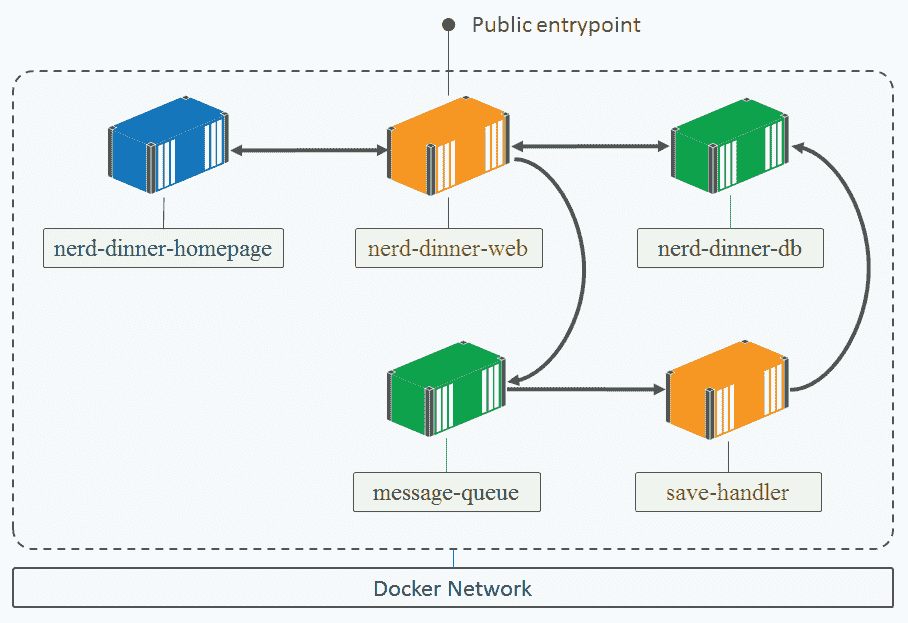
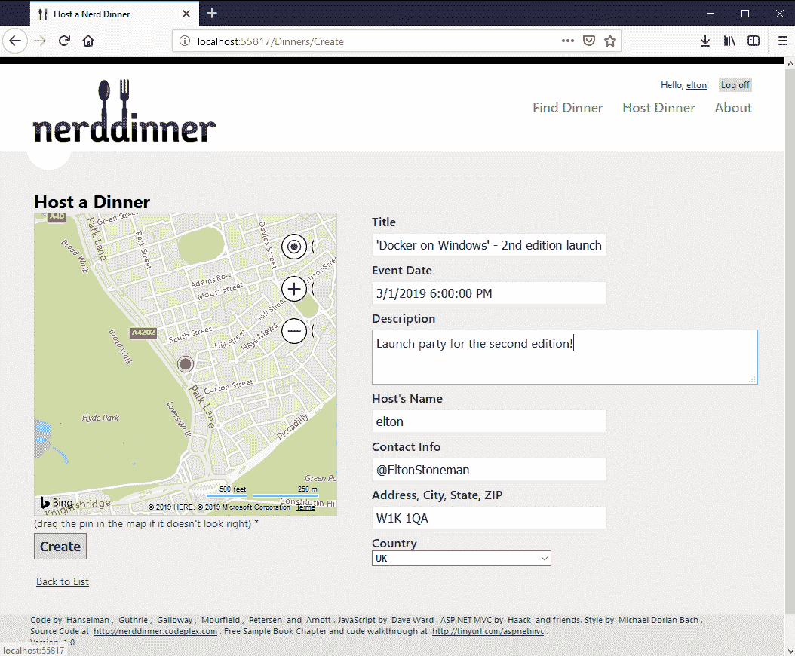
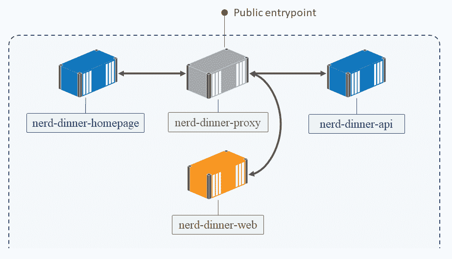
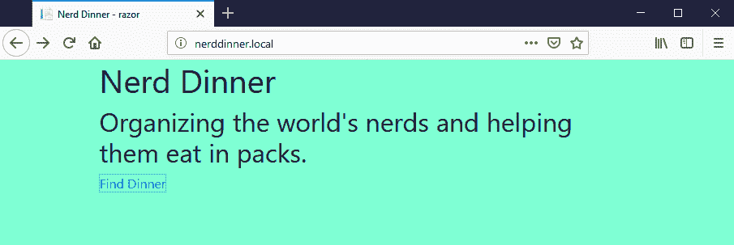
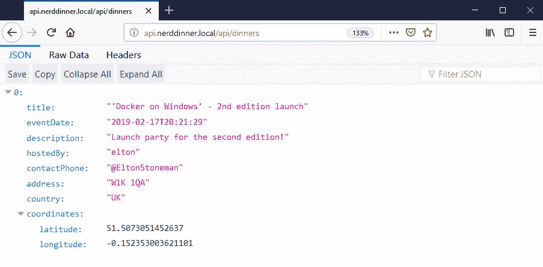
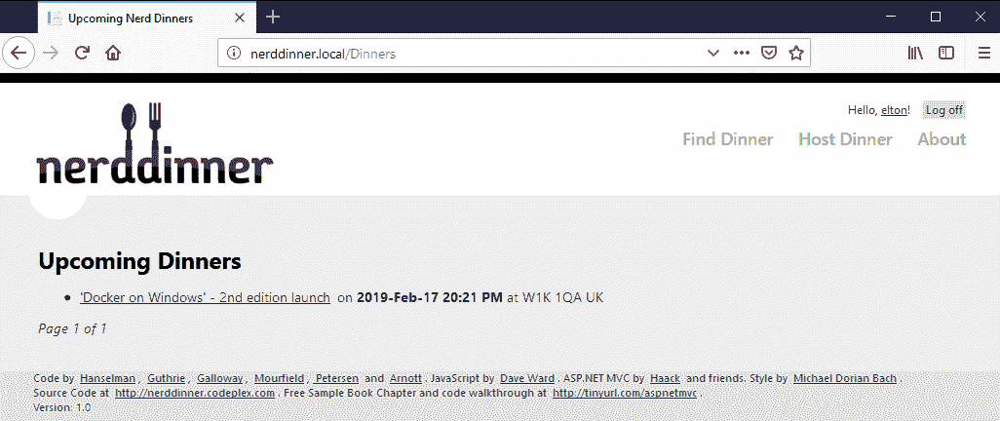
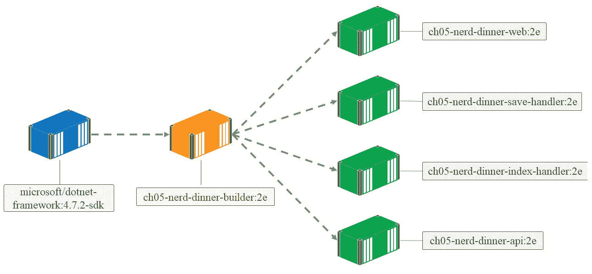
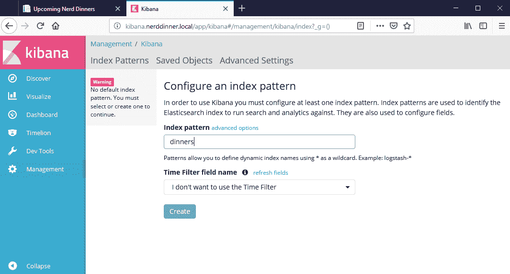
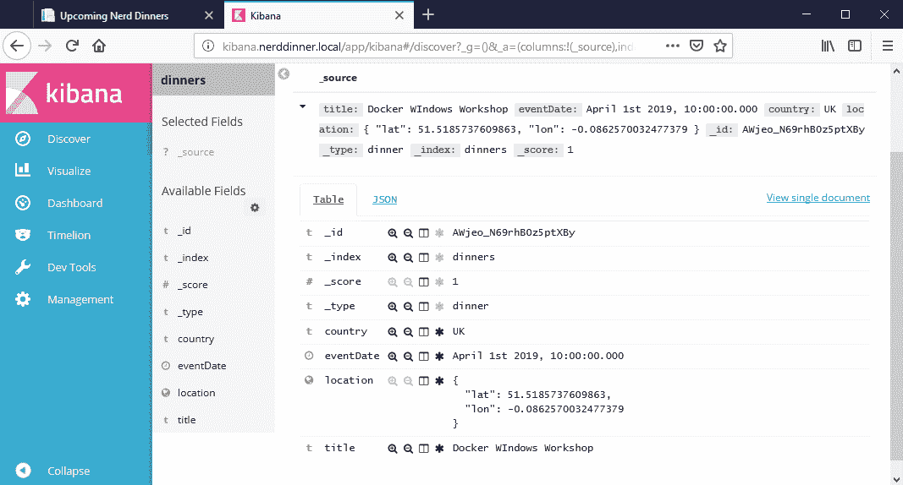
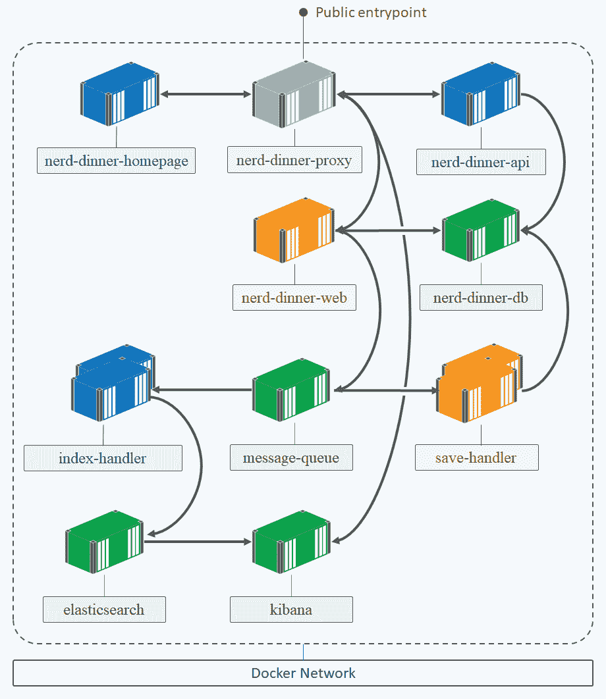

# 五、容器优先的解决方案设计

采用 Docker 作为您的应用平台会带来明显的运营优势。容器是比虚拟机轻得多的计算单元，但它们仍然提供隔离，因此您可以在更少的硬件上运行更多的工作负载。所有这些工作负载在 Docker 中都有相同的形状，因此运营团队可以管理.NET、Java、Go 和 Node.js 应用。Docker 平台在应用架构方面也有优势。在本章中，我将了解容器优先解决方案设计如何帮助您以高质量和低风险向应用添加功能。

在这一章中，我将回到尼尔丁纳，从我在[第三章](03.html)*中停下来的地方继续.NET 框架和。网络核心应用*。NerdDinner 是一个传统的.NET 应用，一种组件间紧密耦合的单片设计，其中所有通信都是同步的。没有单元测试、集成测试或端到端测试。纳丁纳和其他数百万人一样.NET 应用——它可能有用户需要的功能，但修改起来既困难又危险。将这样的应用转移到 Docker 可以让您采取不同的方法来修改或添加功能。

Docker 平台的两个方面将改变您对解决方案设计的思考方式。首先，联网、服务发现和负载平衡意味着您可以将应用分布在多个组件中，每个组件都运行在可以独立移动、扩展和升级的容器中。其次，Docker Hub 和其他注册中心上可用的生产级软件的范围不断扩大，这意味着您可以将现成的软件用于许多通用服务，并以与您自己的组件相同的方式管理它们。这让您可以自由设计更好的解决方案，而不受基础架构或技术的限制。

在本章中，我将向您展示如何使传统的.NET 应用，通过采用容器优先设计:

*   NerdDinner 的设计目标
*   在 Docker 中运行消息队列
*   启动多容器解决方案
*   传统应用的现代化
*   在容器中添加新功能
*   从整体到分布式解决方案

# 技术要求

您将需要在更新为 18.09 的 Windows 10 或 Windows Server 2019 上运行 Docker 来完成示例。本章代码可在[https://github . com/six eyes/docker-on-window/tree/第二版/ch05](https://github.com/sixeyed/docker-on-windows/tree/second-edition/ch05) 获得。

# NerdDinner 的设计目标

第三章*发展中的Docker化.NET 框架和.NET 核心应用*，我把 NerdDinner 主页提取到了一个单独的组件中，这使得 UI 变更的快速交付成为可能。现在，我将进行一些更基本的更改，分解遗留应用并更新架构。

我将从 web 应用中的一个性能问题开始。NerdDinner 中的数据层使用**实体框架** ( **EF** )，所有数据库访问都是同步的。网站的大量流量将创建大量到 SQL Server 的开放连接，并运行大量查询。随着负载的增加，性能会下降，到查询超时或连接池不足的地步，站点会向用户显示错误。

改善这种情况的一种方法是采用所有的数据访问方法`async`，但这是一种侵入式的改变——所有的控制器动作也需要进行`async`，并且没有自动化的测试套件来验证这种大规模的改变。或者，我可以为数据检索添加一个缓存，这样`GET`请求将会到达缓存，而不是数据库。这也是一个复杂的变化，我需要将数据缓存足够长的时间，以使缓存命中成为可能，同时在数据发生变化时保持缓存同步。同样，缺乏测试意味着像这样复杂的变化很难验证，所以这也是一种有风险的方法。

如果我真的实现了这些复杂的变更，那么很难估计其收益。如果所有的数据访问都转移到异步方法，这是否会使网站运行得更快，并使其能够处理更多的流量？如果我可以集成一个足够高效的缓存来从数据库中读取数据，这是否会提高整体性能？这些好处很难量化，直到你真正做出改变，这时你可能会发现改进并不能证明投资是合理的。

使用容器优先的方法，您可以从不同的角度看待设计。如果您识别出一个进行昂贵的数据库调用但不需要同步运行的特性，您可以将数据库代码移动到一个单独的组件中。然后在组件之间使用异步消息传递，将事件从主 web 应用发布到消息队列，并对新组件中的事件消息采取行动。使用 Docker，这些组件中的每一个都将在一个或多个容器中运行:



如果我只关注一个特性，那么我就可以快速实现改变。这种设计没有其他方法的任何缺点，并且有许多优点:

*   这是一个有针对性的更改，在主应用中只有一个控制器操作发生了更改
*   新的消息处理程序组件很小，并且具有很高的内聚性，因此很容易测试
*   web 层和数据层是分离的，因此它们可以独立缩放
*   我正在将工作从 web 应用中转移出来，这样我们就可以确保性能的提高

还有其他优势。新组件完全独立于原始应用；它只需要监听事件消息并对其采取行动。你可以用。. NET.NET Core，或任何其他用于消息处理程序的技术栈；您不需要被限制在一个栈中。您还有正在从应用发布的事件，因此您可以选择稍后通过添加监听这些事件的新处理程序来添加其他功能。

# 正在记录 NerdDinner 的配置

NerdDinner 使用`Web.config`进行配置—既用于在不同版本之间保持不变的应用配置值，也用于在不同环境之间变化的环境配置值。配置文件被烘焙到发行包中，这使得更改变得很困难。在[第三章](03.html)、*发展中.NET 框架和.NET 核心应用*，我将`Web.config`中的`appSettings`和`connectionStrings`部分分割成单独的文件；通过附加包含不同配置文件的卷，这样做可以让我运行一个具有不同配置集的容器。

尽管有不同类型的配置，但是对于开发人员来说，装载一个卷是一个相当沉重的选择。对于您想要在不更改代码的情况下切换的功能设置来说，这很好——像`UnobtrusiveJavaScriptEnabled`这样的设置确实属于配置文件。但是针对每一个环境和每一个开发人员而改变的设置——比如`BingMapsKey`——应该有一个更简单的方法来设置它们。

理想情况下，您需要多层配置，从文件中读取，但可以选择使用环境变量覆盖值。这就是配置系统的工作原理.NET 核心，并且因为配置包在.NET Core 实际上是.NET 标准库，它们可以在经典中使用.NET 框架项目。

为了迎接更大的变化，我更新了本章的代码，以便使用.NET Core 配置模型的所有环境配置设置，如下面的代码所示。以前的文件`appSettings.config`和`connectionStrings.config`已经迁移到`appsettings.json`中新的 JSON 配置样式:

```
{
  "Homepage": {
    "Url": "http://nerd-dinner-hompage"
  },
  "ConnectionStrings": {
    "UsersContext": "Data Source=nerd-dinner-db...",
    "NerdDinnerContext": "Data Source=nerd-dinner-db..."
  },
  "Apis": {    
    "IpInfoDb": {
      "Key": ""
    },
    "BingMaps": {
      "Key": ""
    }      
  }
}
```

JSON 格式更容易阅读，因为它包含嵌套对象，所以您可以将类似的设置分组在一起，我已经用`Apis`对象完成了这一点。我可以通过使用键`Apis:BingMaps:Key`访问当前配置对象来获取代码中的必应地图应用编程接口键。我仍然将配置文件存储在一个单独的目录中，因此我可以使用一个卷来覆盖整个文件，但是我还将配置设置为使用环境变量。这意味着如果设置了名为`Apis:BingMaps:Key`的环境变量，该变量的值将覆盖 JSON 文件中的值。在我的代码中，我只引用配置键，在运行时.NET Core 从环境变量或配置文件中获取它。

这种方法允许我在 JSON 文件中使用数据库连接字符串的默认值，这样当开发人员启动数据库和 web 容器时，应用就可以使用，而不必指定任何环境变量。不过，这个应用并不是 100%正常运行的，因为必应地图和 IP 地理定位服务需要应用编程接口密钥。这些都是速率受限的服务，因此每个开发人员和每个环境都可能有不同的密钥，这些密钥可以用 web 容器中的环境变量来设置。

为了使环境值更安全，Docker 允许您从文件中加载它们，而不是在`docker container run`命令中用纯文本指定它们。隔离文件中的值意味着文件本身可以得到保护，因此只有管理员和 Docker 服务帐户可以访问它。环境文件是一种简单的文本格式，每个环境变量有一行，写成键值对。对于 web 容器，我的环境文件包含机密的 API 密钥:

```
Apis:BingMaps:Key=[your-key-here]
Apis:IpInfoDb:Key=[your-key-here]
```

要运行容器并将文件内容作为环境变量加载，可以使用`--env-file`选项。

Environment values still aren't secure. If someone gains access to your app, they could print out all the environment variables and get your API keys. The approach I'm using with a JSON file as well as environment variables means I can use the same application image in production with Docker secrets for configuration—and that is secure.

我已经将这些变化打包到新版的 NerdDinner Docker 映像中，您可以在`dockeronwindows/ch05-nerd-dinner-web:2e`找到。就像第三章、*中的其他例子一样.NET 框架和.NET 核心应用*，Dockerfile 使用引导脚本作为入口点，它将环境变量提升到机器级别，这样 ASP.NET 应用就可以读取它们。

新版 NerdDinner 网站在 Docker 中运行时使用以下命令:

```
docker container run -d -P `
 --name nerd-dinner-web `
 --env-file api-keys.env `
 dockeronwindows/ch05-nerd-dinner-web:2e
```

应用需要运行其他组件才能正确启动。我有一个 PowerShell 脚本，它用正确的选项以正确的顺序启动容器，但是在这一章结束时，这个脚本将变得笨拙。在下一章，当我看 Docker Compose 的时候，我会解决这个问题。

# 拆分创建晚餐功能

在`DinnerController`类中，`Create`动作是一个相对昂贵的数据库操作，不需要同步。这个特性很适合拆分成单独的组件。我可以从 web 应用发布消息，而不是在用户等待时将其保存到数据库中——如果网站负载很高，消息可能会在队列中等待几秒钟甚至几分钟才能被处理，但给用户的响应几乎是即时的。

要将特征拆分成一个新的组件，需要做两件工作。web 应用需要在创建晚餐时向队列发布消息，消息处理程序需要监听队列，并在收到消息时保存晚餐。在 NerdDinner 中，有更多的工作要做，因为现有的代码库是一个物理的整体，也是一个逻辑的整体——只有一个 Visual Studio 项目包含所有的东西，所有的模型定义以及用户界面代码。

在本章的源代码中，我添加了一个新的.NET 程序集项目调用`NerdDinner.Model`到解决方案，并将 EF 类移动到该项目，以便它们可以在 web 应用和消息处理程序之间共享。模型项目的目标是全部。. NET 框架，而不是.NET Core，所以我可以按原样使用现有的代码，并且我不需要将 EF 的升级纳入这个特性更改的范围。该选项将消息处理程序限制为完整的.NET 框架应用。

还有一个共享的汇编项目来隔离`NerdDinner.Messaging`中的消息队列代码。我将使用 NATS 消息系统，这是一个高性能的开源消息队列。NuGet 上有一个针对这些目标的 NATS 客户端包.NET 标准，所以两者都可以使用.NET 框架和.NET Core，我的消息传递项目有相同的客户端包。这意味着我可以灵活地编写其他不使用 EF 模型的消息处理程序.NET 核心。

在模型项目中，`Dinner`类的原始定义被大量的 EF 和 MVC 代码污染，以捕获验证和存储行为，就像下面对`Description`属性的定义一样:

```
[Required(ErrorMessage = "Description is required")]
[StringLength(256, ErrorMessage = "Description may not be longer than 256 characters")]
[DataType(DataType.MultilineText)]
public string Description { get; set; }
```

类应该是一个简单的 POCO 定义，但是这些属性意味着模型定义是不可移植的，因为任何消费者也需要引用 EF 和 MVC。为了避免在消息传递项目中出现这种情况，我定义了一个简单的`Dinner`实体，它没有任何这些属性，而这个类就是我用来在消息中发送晚餐信息的类。我可以使用`AutoMapper` NuGet 包在`Dinner`类定义之间转换，因为属性基本相同。

This is the sort of challenge you will find in lots of older projects—there's no clear separation of concerns, so breaking out features is not straightforward. You can take this approach to isolate shared components into new library projects. This is restructuring the code base without fundamentally changing its logic, which will help with modernizing the app.

`DinnersController`类的`Create`方法中的主代码现在将晚餐模型映射到干净的`Dinner`实体，并发布事件，而不是写入数据库:

```
if (ModelState.IsValid)
{
  dinner.HostedBy = User.Identity.Name;
  var eventMessage = new DinnerCreatedEvent
  {
    Dinner = Mapper.Map<entities.Dinner>(dinner),
    CreatedAt = DateTime.UtcNow
  };
  MessageQueue.Publish(eventMessage);
  return RedirectToAction("Index");
}
```

这就是一劳永逸的消息传递模式。web 应用是生产者，发布事件消息。生产者不等待响应，也不知道哪些组件(如果有的话)将消费消息并对其采取行动。它是松散耦合且快速的，它将传递消息的责任放在消息队列上，这是它应该在的地方。

收听此事件消息是一项新功能.NET Framework 控制台项目在`NerdDinner.MessageHandlers.CreateDinner`。控制台应用的`Main`方法使用共享消息传递项目打开到消息队列的连接，并订阅这些晚餐创建的事件消息。当收到消息时，处理程序将消息中的`Dinner`实体映射回晚餐模型，并使用从`DinnersController`类的原始实现中获取的代码将模型保存到数据库中(并稍微整理一下):

```
var dinner = Mapper.Map<models.Dinner>(eventMessage.Dinner);
using (var db = new NerdDinnerContext())
{
  dinner.RSVPs = new List<RSVP>
  {
    new RSVP
    {
      AttendeeName = dinner.HostedBy
    }
  };
  db.Dinners.Add(dinner);
  db.SaveChanges();
}
```

现在，消息处理程序可以打包到自己的 Docker 映像中，并在网站容器旁边的容器中运行。

# 包装。包装。Docker中的网络控制台应用

作为 Docker 的好公民，控制台应用很容易构建。为应用编译的可执行文件将是 Docker 启动和监控的主要进程，因此您只需要使用控制台进行日志记录，并且可以使用文件和环境变量进行配置。

对于我的消息处理程序，我使用了一个模式略有不同的 Dockerfile。我有一个单独的构建器阶段的映像，用来编译整个解决方案——包括 web 项目和我添加的新项目。一旦您看到了所有的新组件，我将在本章的稍后部分详细介绍构建器映像。

构建器编译解决方案，控制台应用的 Dockerfile 引用`dockeronwindows/ch05-nerd-dinner-builder:2e`映像来复制出编译后的二进制文件。整个 Dockerfile 非常简单:

```
# escape=`
FROM mcr.microsoft.com/windows/servercore:ltsc2019

CMD ["NerdDinner.MessageHandlers.SaveDinner.exe"]

WORKDIR C:\save-handler
COPY --from=dockeronwindows/ch05-nerd-dinner-builder:2e `
     C:\src\NerdDinner.MessageHandlers.SaveDinner\obj\Release\ . 

```

The `from` argument in the `COPY` instruction specifies the source of the files. It can be another stage in a multistage build, or—as in this example—an existing image on the local machine or a registry.

新的消息处理程序需要访问消息队列和数据库，每个消息的连接字符串都捕获在项目的`appsettings.json`文件中。控制台应用使用与 NerdDinner web 应用相同的`Config`类，后者从 JSON 文件中加载默认值，并可以从环境变量中覆盖它们。

在 Dockerfile 中，`CMD`指令中的入口点是控制台可执行文件，所以只要控制台应用在运行，容器就会一直运行。消息队列的侦听器在主应用的独立线程上异步运行。当收到消息时，处理程序代码将会触发，因此不会对队列进行轮询，应用运行非常高效。

使用`ManualResetEvent`对象，让控制台应用无限期运行是很简单的。在`Main`方法中，我等待一个从未发生过的复位事件，所以程序一直运行:

```
class Program
{
  private static ManualResetEvent _ResetEvent = new ManualResetEvent(false);

  static void Main(string[] args)
  {
    // set up message listener
    _ResetEvent.WaitOne();
  }
}
```

这是保持. NET Framework 或. NET Core 控制台应用活动的一种简单有效的方法。当我启动一个消息处理程序容器时，它将继续在后台运行并监听消息，直到容器停止。

# 在 Docker 中运行消息队列

web 应用现在发布消息，一个处理程序监听它们，所以我需要的最后一个组件是一个消息队列来连接两者。队列需要与解决方案的其余部分相同的可用性级别，因此它们很适合在 Docker 容器中运行。在部署在许多服务器上的分布式解决方案中，队列可以跨多个容器进行集群，以获得性能和冗余。

您对消息传递技术的选择取决于您需要的功能，但是有很多选择.NET 客户端库。**微软消息队列** ( **MSMQ** )是原生 Windows 队列，**rabbtmq**是一个流行的开源队列，支持持久消息传递， **NATS** 是一个开源内存队列，性能非常出色。

NATS 消息传递的高吞吐量和低延迟使其成为容器之间通信的好选择，Docker Hub 上有 NATS 的官方映像。NATS 是一个跨平台运行的 Go 应用，Docker 映像有 Linux、Windows Server Core 和 Nano Server 变体。

At the time of writing, the NATS team only had images for Windows Server 2016 published on Docker Hub. There will be a Windows Server 2019 image soon, but I've built my own for this chapter. Look at the Dockerfile for `dockeronwindows/ch05-nats:2e` and you'll see how easy it is to use the content from an official image in one of your own images.

您可以像运行任何其他容器一样运行 NATS 消息队列。Docker 映像公开了端口`4222`，这是客户端用来连接到队列的端口，但是您不需要发布该端口，除非您想要在 Docker 容器之外向 NATS 发送消息。同一个网络中的容器总是可以访问彼此的端口，它们只需要发布就可以在 Docker 之外使用。NerdDinner web 应用和消息处理程序正在使用服务器名`message-queue`连接到 NATS，因此它需要是容器名:

```
docker container run --detach `
 --name message-queue `
 dockeronwindows/ch05-nats:2e
```

NATS 服务器应用将消息记录到控制台，以便 Docker 收集日志条目。当容器正在运行时，您可以使用`docker container logs`验证队列正在侦听:

```
> docker container logs message-queue
[7996] 2019/02/09 15:40:05.857320 [INF] Starting nats-server version 1.4.1
[7996] 2019/02/09 15:40:05.858318 [INF] Git commit [3e64f0b]
[7996] 2019/02/09 15:40:05.859317 [INF] Starting http monitor on 0.0.0.0:8222
[7996] 2019/02/09 15:40:05.859317 [INF] Listening for client connections on 0.0.0.0:4222
[7996] 2019/02/09 15:40:05.859317 [INF] Server is ready
[7996] 2019/02/09 15:40:05.948151 [INF] Listening for route connections on 0.0.0.0:6222
```

消息队列是一个基础结构级别的组件，不依赖于其他组件。它可以在其他容器之前启动，并在应用容器停止或升级时保持运行。

# 启动多容器解决方案

随着您更多地使用 Docker，您的解决方案将分布在更多的容器中——要么运行从单块中分离出来的自定义代码，要么运行 Docker Hub 或第三方注册表中经过测试和信任的第三方软件。

NerdDinner 现在跨五个容器运行——SQL Server、原始 web 应用、新主页、NATS 消息队列和消息处理程序。容器之间存在依赖关系，它们需要以正确的顺序启动，并用正确的名称创建，以便可以使用 Docker 的服务发现找到组件。

在下一章中，我将使用 Docker Compose 来声明性地映射这些依赖关系。目前，我有一个名为`ch05-run-nerd-dinner_part-1.ps1`的 PowerShell 脚本，它以正确的配置显式启动容器:

```
docker container run -d `
 --name message-queue `
 dockeronwindows/ch05-nats:2e;

docker container run -d -p 1433 `
 --name nerd-dinner-db `
 -v C:\databases\nd:C:\data `
 dockeronwindows/ch03-nerd-dinner-db:2e;

docker container run -d `
 --name nerd-dinner-save-handler `
 dockeronwindows/ch05-nerd-dinner-save-handler:2e;

docker container run -d `
 --name nerd-dinner-homepage `
 dockeronwindows/ch03-nerd-dinner-homepage:2e;

docker container run -d -p 80 `
 --name nerd-dinner-web `
 --env-file api-keys.env `
 dockeronwindows/ch05-nerd-dinner-web:2e;
```

In this script I'm using the SQL database and home page images from [Chapter 3](03.html), *Developing Dockerized .NET Framework and .NET Core Applications*—these components haven't changed, so they can be run alongside the new components. If you want to run this yourself with full functionality, you will need to populate your own API keys in the file `api-keys.env`. You'll need to sign up to the Bing Maps API and the IP information database. You can run the app without those keys, but not all features will work correctly.

当我用自己设置的 API 键运行脚本并检查 web 容器以获取端口时，我可以浏览到应用。现在是 NerdDinner 的全功能版本。我可以登录并完成创建晚餐表单，完成地图集成:



当我提交表单时，web 应用会向队列发布一条事件消息。这是一个非常便宜的操作，所以网络应用几乎立即返回给用户。监听消息是控制台应用，运行在不同的容器中，可能在不同的主机上。它接收信息并进行处理。处理程序将活动记录到控制台，以便管理员用户可以使用`docker container logs`进行监控:

```
> docker container logs nerd-dinner-save-handler

Connecting to message queue url: nats://message-queue:4222
Listening on subject: events.dinner.created, queue: save-dinner-handler
Received message, subject: events.dinner.created
Saving new dinner, created at: 2/10/2019 8:22:16 PM; event ID: a6340c95-3629-4c0c-9a11-8a0bce8e6d91
Dinner saved. Dinner ID: 1; event ID: a6340c95-3629-4c0c-9a11-8a0bce8e6d91
```

创建晚餐功能的功能是相同的—用户输入的数据保存到 SQL Server—用户体验也是相同的，但是该功能的可扩展性得到了极大的提高。设计容器让我可以将持久性代码提取到一个新组件中，知道该组件可以部署在与现有解决方案相同的基础架构上，并且如果应用部署在集群上，它将继承现有的可伸缩性和故障转移级别。

我可以依赖 Docker 平台，并依赖一个新的核心组件:消息队列。队列技术本身是企业级软件，每秒能够处理数十万条消息。NATS 是免费的开源软件，可在 Docker Hub 上直接下载到您的解决方案中，作为一个容器运行，并连接到 Docker 网络中的其他容器。

到目前为止，我已经使用了容器优先的设计和 Docker 的力量来更新 NerdDinner 的一部分。瞄准一个特性意味着我可以自信地发布这个新版本，只测试已经改变的特性。如果我想在创建晚餐功能中添加审计，我只需要对消息处理程序进行更新，并且不需要对 web 应用进行完整的回归测试，因为该组件不会被更新。

考虑到容器的设计也给了我一个基础来更新我的遗留应用的架构，并添加新的功能。

# 传统应用的现代化

突破后端特性是开始分解遗留单片的好方法。将消息队列添加到您的部署中使得这种模式可以与任何受益于异步的特性一起重复。还有其他打破单一应用的模式。如果我们公开一个 REST 应用编程接口，并转向前端的模块化用户界面，用一个反向代理在不同组件之间路由，我们就可以真正开始实现 NerdDinner 的现代化。我们可以用 Docker 做所有这些。

# 添加一个 REST API 来公开数据

传统应用最终往往成为无法在应用之外访问的数据存储。如果可以访问，这些数据对其他应用或业务合作伙伴来说将是有价值的。NerdDinner 就是一个很好的例子——它是在单页应用时代之前设计和构建的，在这个时代，用户界面是逻辑，而业务逻辑是通过 REST API 公开的。NerdDinner 将其数据保留给自己；你不能看到一个晚餐列表，除非你浏览了 NerdDinner 用户界面。

在 Docker 容器中运行一个简单的 REST API 很容易解锁遗留数据。它不需要复杂的交付:您可以从识别遗留应用中的单个数据集开始，这对其他业务部门或外部消费者很有用。然后，只需将该数据集的加载逻辑提取到单独的功能中，并将其作为容器中的只读应用编程接口进行部署。当您有需求时，您可以迭代地向 API 添加更多的特性，您不需要为您的第一个版本实现整个服务目录。

NerdDinner 中的主要数据集是晚餐列表，我构建了一个 ASP.NET Core REST API，以一个只读`GET`请求公开所有的晚餐。代码在本章的`NerdDinner.DinnerApi`项目中，这是一个非常简单的实现。因为我已经从主`NerdDinner`项目中分离出了核心实体定义，所以我可以从 API 中公开现有的契约，并在项目中使用任何我喜欢的数据访问技术。

我选择了使用 Dapper，这是一个快速直观的对象关系映射器.NET 标准，所以它与.NET 框架和.NET 核心应用。Dapper 使用基于约定的映射；您提供一个 SQL 语句和一个目标类类型，它执行数据库查询并将结果映射到对象。从现有表中加载晚餐数据并将其映射到共享的`Dinner`对象的代码非常简单:

```
protected override string GetAllSqlQuery => "SELECT *, Location.Lat as Latitude... FROM Dinners";

public override IEnumerable<Dinner> GetAll()
{
  _logger.LogDebug("GetAll - executing SQL query: '{0}'", GetAllSqlQuery);
  using (IDbConnection dbConnection = Connection)
  {
    dbConnection.Open();
    return dbConnection.Query<Dinner, Coordinates, Dinner>(
      GetAllSqlQuery, 
      (dinner,coordinates) => { 
        dinner.Coordinates = coordinates;
        return dinner;
      },
      splitOn: "LocationId");
   }
}
```

`GetAll`方法在 API 控制器类中被调用，剩下的代码就是通常的 ASP.NET Core 设置。

Dapper is usually much easier to work with than this example, but it lets you do some manual mapping when you need to, which is what I've done here. NerdDinner uses an SQL Server location data type to store where dinners are taking place. This maps to a .NET `DbGeography` type, but that type doesn't exist in .NET Standard. If you look through the code in `Chapter 5`, you'll see a few places where I map between `DbGeography` and my custom `Coordinates` types, which is what you'll need to do if you have a similar issue.

我已经改变了最初的 NerdDinner 网络应用，当它获取`DinnersController`类中的晚餐列表时，使用这个新的应用接口。我正在通过配置设置`DinnerApi:Enabled`使用一个特性标志，这样应用要么使用 API 作为数据源，要么直接从数据库中查询。这让我可以分阶段推出该功能:

```
if (bool.Parse(Config.Current["DinnerApi:Enabled"]))
{
  var client = new RestClient(Config.Current["DinnerApi:Url"]);
  var request = new RestRequest("dinners");
  var response = client.Execute<List<Dinner>>(request);
  var dinners = response.Data.Where(d => d.EventDate >= DateTime.Now).OrderBy(d => d.EventDate);
  return View(dinners.ToPagedList(pageIndex, PageSize));
}
else
{
  var dinners = db.Dinners.Where(d => d.EventDate >= DateTime.Now).OrderBy(d => d.EventDate);
  return View(dinners.ToPagedList(pageIndex, PageSize));
}
```

新的应用编程接口被打包成名为`dockeronwindows/ch05-nerd-dinner-api`的 Docker 映像。这个的 Dockerfile 非常简单；它只是从名为`microsoft/dotnet:2.1-aspnetcore-runtime-nanoserver-1809`的官方 ASP.NET Core 基础映像开始，并在编译后的 API 代码中复制。

我可以在 Docker 容器中运行 API 作为内部组件，由 NerdDinner web 容器使用，但不能公开访问，或者我可以在 API 容器上发布一个端口，并使其在 Docker 网络之外可用。公共 REST 应用编程接口有一个定制端口是不寻常的，消费者希望在端口`80`访问它，用于 HTTP，在端口`443`访问它，用于 HTTPS。我可以在我的解决方案中再添加一个组件，让我可以对所有服务使用标准的端口集，并将传入的请求路由到不同的容器，这就是所谓的**反向代理**。

# 使用反向代理在容器之间路由 HTTP 请求

反向代理是一项非常有用的技术，可以添加到您的项目中，无论您是在考虑构建一个新的微服务架构，还是更新一个传统的整体。反向代理只是一个 HTTP 服务器，它接收来自外部世界的所有传入网络流量，从另一个 HTTP 服务器获取内容，并将其返回给客户端。在 Docker 中，反向代理运行在具有已发布端口的容器中，它代理来自没有任何已发布端口的其他容器的流量。

这是带有反向代理的用户界面和应用编程接口容器的体系结构:



传入流量的所有路由规则都在代理容器中。它将被配置为从`nerd-dinner-homepage`容器加载对主页位置`/`的请求；以路径`/api`开始的请求将从`nerd-dinner-api`容器加载，任何其他请求将从`nerd-dinner-web`容器中的原始应用加载。

It's important to realize that the proxy does not redirect the client to these other services. The proxy is the only endpoint that the client connects to. The proxy makes HTTP requests to the actual service on the client's behalf, using the containers' host names.

反向代理可以做的不仅仅是路由请求。所有流量都通过反向代理，因此它可以是您应用 SSL 终止和 HTTP 缓存的层。您甚至可以在反向代理中构建安全性，将它用于认证和作为 web 应用防火墙，保护您免受像 SQL 注入这样的常见攻击。这对于遗留应用尤其有吸引力。您可以在代理层进行性能和安全性改进，将原始应用作为一个内部组件留在一个容器中，除非通过代理，否则无法访问该容器。

反向代理有许多技术选择。Nginx 和 HAProxy 是 Linux 世界中流行的选项，它们也可以在 Windows 容器中使用。您甚至可以将 IIS 实现为反向代理，在单独的容器中运行它，所有路由规则都使用 URL 重写模块设置。这些选项功能强大，但需要大量配置才能启动和运行。我将使用一个名为 **Traefik** 的反向代理，它是为在云原生应用的容器中运行而构建的，它从 Docker 获得所需的配置。

# 用 trafik 代理来自 docker 容器的流量

Traefik 是一个快速、强大且易于使用的反向代理。您可以在一个容器中运行它，并发布 HTTP(或 HTTPS)端口，并将容器配置为侦听来自 Docker Engine API 的事件:

```
docker container run -d -P `
 --volume \\.\pipe\docker_engine:\\.\pipe\docker_engine `
 sixeyed/traefik:v1.7.8-windowsservercore-ltsc2019 `
 --docker --docker.endpoint=npipe:////./pipe/docker_engine
```

Traefik is an official image on Docker Hub, but just like NATS the only Windows images available are based on Windows Server 2016\. I'm using my own image here, based on Windows Server 2019\. The Dockerfile is in my `sixeyed/dockerfiles-windows` repository on GitHub, but you should check Docker Hub to see whether there's a 2019 variant of the official Traefik image before you use mine.

您以前见过`volume`选项——它用于将主机上的文件系统目录装入容器。她，我用它装了一个窗户**名叫管道**，叫`docker_engine`。管道是客户端-服务器通信的一种网络方法。Docker 命令行界面和 Docker 应用编程接口支持通过 TCP/IP 和命名管道的连接。像这样安装管道可以让容器查询 Docker API，而不需要知道运行容器的主机的 IP 地址。

Traefik 使用`docker.endpoint`选项中的连接细节，使用命名管道连接从 Docker API 订阅事件流。当创建或移除容器时，它将从 Docker 获得通知，Traefik 使用这些事件中的数据来构建自己的路由映射。

当运行 Traefik 时，您可以创建带有标签的应用容器来告诉 Traefik 哪些请求应该路由到哪些容器。标签只是键值对，可以在创建时应用于容器。它们出现在 Docker 的事件流中。Traefik 使用前缀为`traefik.frontend`的标签来构建其路由规则。这是我如何通过 Traefik 运行带有路由的 API 容器:

```
docker container run -d `
 --name nerd-dinner-api `
 -l "traefik.frontend.rule=Host:api.nerddinner.local" `
 dockeronwindows/ch05-nerd-dinner-api:2e;
```

Docker 创建名为`nerd-dinner-api`的容器，然后发布一个包含新容器细节的事件。Traefik 获取该事件，并在其路由映射中添加一个规则。任何以 HTTP `Host`头`api.nerddinner.local`进入 Traefik 的请求都将从 API 容器中被代理。API 容器不发布任何端口——反向代理是唯一可公开访问的组件。

Traefik has a very rich set of routing rules, using different parts of the HTTP request—the host, path, headers, and query string. You can map anything from wildcard strings to very specific URLs using Traefik's rules. There's much more that Traefik can do too, like load balancing and SSL termination. The documentation can be found at [https://traefik.io](https://traefik.io).

使用类似的规则，我可以部署新版本的 NerdDinner，并让 Traefik 代理所有的前端容器。脚本`ch05-run-nerd-dinner_part-2.ps1`是一个升级，首先移除现有的 web 容器:

```
docker container rm -f nerd-dinner-homepage
docker container rm -f nerd-dinner-web
```

标签和环境变量是在创建容器时应用的，它们会持续到容器的整个生命周期。您不能在现有容器上更改这些值；您需要删除它并创建一个新的。我想为 Traefik 运行带有标签的 NerdDinner web 和主页容器，所以我需要替换现有的容器。脚本的其余部分启动 Traefik，用新配置替换 web 容器，并启动 API 容器:

```
docker container run -d -p 80:80 `
 -v \\.\pipe\docker_engine:\\.\pipe\docker_engine `
 sixeyed/traefik:v1.7.8-windowsservercore-ltsc2019 `
 --api --docker --docker.endpoint=npipe:////./pipe/docker_engine

docker container run -d `
 --name nerd-dinner-homepage `
 -l "traefik.frontend.rule=Path:/,/css/site.css" `
 -l "traefik.frontend.priority=10" `
 dockeronwindows/ch03-nerd-dinner-homepage:2e;

docker container run -d `
 --name nerd-dinner-web `
 --env-file api-keys.env `
 -l "traefik.frontend.rule=PathPrefix:/" `
 -l "traefik.frontend.priority=1" `
 -e "DinnerApi:Enabled=true" `
 dockeronwindows/ch05-nerd-dinner-web:2e;

docker container run -d `
 --name nerd-dinner-api `
 -l "traefik.frontend.rule=PathPrefix:/api" `
 -l "traefik.frontend.priority=5" `
 dockeronwindows/ch05-nerd-dinner-api:2e;
```

现在当我加载 NerdDinner 网站时，我会浏览到端口`80`上的 Traefik 容器。我正在使用`Host`头部路由规则，所以我将把`http://nerddinner.local`放入我的浏览器。这是一个本地开发环境，因此我将这些值添加到了我的`hosts`文件中(在测试和生产环境中，将有一个真正的 DNS 系统解析主机名):

```
127.0.0.1  nerddinner.local
127.0.0.1  api.nerddinner.local
```

路径`/`的主页请求从主页容器中得到代理，我还为 CSS 文件指定了一个路由路径，这样我就可以看到新的主页完成样式:



该响应由主页容器生成，但由 Traefik 代理。我可以浏览到`api.nerddinner.local`并从新的 REST API 容器中看到 JSON 格式的所有晚餐:



原来的 NerdDinner 应用还是一样的工作方式，但是当我浏览到`/Dinners`的时候，要显示的晚餐列表是从 API 中获取的，而不是直接从数据库中获取的:



Working out the routing rules for the proxy is one of the harder parts of breaking up a monolith into multiple frontend containers. Microservice apps tend to be easier here, because they're designed to be different concerns running at different domain paths. You'll need a good understanding of Traefik's rules and of regular expressions when you start routing UI features to their own containers.

容器优先的设计让我不用完全重写就能实现 NerdDinner 架构的现代化。我正在使用企业级开源软件和 Docker 来支持以下三种模式来打破这种单一模式:

*   通过发布和订阅消息队列中的事件使功能异步
*   使用简单的现代技术栈，用 REST APIs 公开数据
*   跨多个容器拆分前端功能，并使用反向代理在它们之间进行路由

现在，我可以更加敏捷地交付对特性的改进，因为我不总是需要对整个应用进行回归测试。我也有从关键用户活动中发布的事件，这是向事件驱动架构迈出的一步。这让我可以在不改变任何现有代码的情况下添加全新的特性。

# 在容器中添加新功能

将整块建筑分解成小的组件并使建筑现代化有一个有益的副作用。我采用的方法引入了事件发布作为一个特性。我可以在此基础上添加新功能，再次采用容器优先的方法。

在网络中，只有一个数据存储，一个存储在 SQL Server 中的事务数据库。这对于网站服务来说没问题，但是当涉及到面向用户的功能时，比如报告，就受到了限制。没有用户友好的方法来搜索数据、构建仪表板或启用自助报告。

一个理想的解决方案是添加一个辅助数据存储，一个报告数据库，使用一种提供自助分析的技术。没有 Docker，这将是一个大项目，需要重新设计或增加基础设施，或者两者兼而有之。有了 Docker，我可以不去管现有的应用，在现有的服务器上添加在容器中运行的新特性。

Elasticsearch 是另一个企业级开源项目，在 Docker Hub 上以官方映像形式提供。Elasticsearch 是一个完整的搜索文档数据存储，与配套产品 Kibana 一起作为报告数据库运行良好，它提供了一个用户友好的网络前端。

我可以为 NerdDinner 中创建的晚餐添加自助分析，方法是在与其他容器相同的网络中的容器中运行 Elasticsearch 和 Kibana。当前的解决方案已经发布了带有晚餐详细信息的事件，因此要将晚餐添加到报告数据库中，我需要构建一个新的消息处理程序，该程序订阅现有事件并将详细信息保存在 Elasticsearch 中。

当新的报告功能准备就绪时，可以将其部署到生产环境中，而无需对正在运行的应用进行任何更改。零停机部署是容器优先设计的另一个好处。功能被构建为在解耦的单元中运行，因此单个容器可以在不影响其他容器的情况下启动或升级。

对于下一个特性，我将添加一个独立于解决方案其余部分的新消息处理程序。如果我需要替换保存晚餐处理程序的实现，我也可以在零停机时间内完成，在替换处理程序时使用消息队列来缓冲事件。

# 与 Docker 和一起使用弹性搜索。网

Elasticsearch 是一项非常有用的技术，值得仔细研究一下。这是一个 Java 应用，但是在 Docker 中运行时，您可以将其视为一个黑盒，并以与所有其他 Docker 工作负载相同的方式进行管理—您不需要安装 Java 或配置 JDK。Elasticsearch 公开了一个用于写入、读取和搜索数据的 REST API，所有主要语言中都有该 API 的客户端包装器。

Elasticsearch 中的数据存储为 JSON 文档，每个文档都可以完全索引，这样您就可以在任何字段中搜索任何值。这是一种集群技术，可以跨多个节点运行，以实现规模和弹性。在 Docker 中，您可以在一个单独的容器中运行每个节点，并将它们分布在您的服务器上，以获得规模和弹性，但是使用 Docker 很容易进行部署和管理。

同样的存储注意事项适用于 Elasticsearch，就像它们适用于任何有状态的工作负载一样——在开发中，您可以将数据保存在容器中，这样当容器被替换时，您就可以从一个新的数据库开始。在测试环境中，您可以使用装载到主机上的驱动器文件夹的 Docker 卷来保持容器外部的持久存储。在生产中，您可以将带有驱动程序的卷用于内部存储阵列或云存储服务。

Docker Hub 上有一个官方的 Elasticsearch 映像，但它目前只有 Linux 变体。我在 Docker Hub 上有自己的映像，它将 Elasticsearch 打包成 Windows Server 2019 Docker 映像。在 Docker 中运行 Elasticsearch 与启动任何容器相同。该命令公开端口`9200`，这是 REST 应用编程接口的默认端口:

```
 docker container run -d -p 9200 `
 --name elasticsearch ` --env ES_JAVA_OPTS='-Xms512m -Xmx512m' `
 sixeyed/elasticsearch:5.6.11-windowsservercore-ltsc2019
```

Elasticsearch 是一个需要大量内存的应用，默认情况下，它在启动时会分配 2 GB 的系统内存。在开发环境中，数据库不需要那么多内存。我可以通过设置`ES_JAVA_OPTS`环境变量来配置。在这个命令中，我将弹性搜索限制在 512 兆内存。

Elasticsearch is a cross-platform application, like NATS. There is no official Elasticsearch image for Windows, but you can check my Dockerfile on GitHub in the repository `sixeyed/dockerfiles-windows`. You'll see that I use the official OpenJDK Java image based on Windows Server Core 2019 for my Elasticsearch image.

弹性搜索有一个名为 **NEST** 的 NuGet 包，它是一个读写数据的应用编程接口客户端，面向.NET 框架和.NET 核心。我在一个新的.NET Core 控制台项目，`NerdDinner.MessageHandlers.IndexDinner`。新的控制台应用监听来自 NATS 的晚餐创建事件消息，并将晚餐细节作为文档写入弹性搜索。

连接到消息队列和订阅消息的代码与现有的消息处理程序相同。我有一个新的`Dinner`类，它代表了 Elasticsearch 文档，因此消息处理程序代码从`Dinner`实体映射到晚餐文档，并将其保存在 Elasticsearch 中:

```
var eventMessage = MessageHelper.FromData<DinnerCreatedEvent>(e.Message.Data);
var dinner = Mapper.Map<documents.Dinner>(eventMessage.Dinner);
var node = new Uri(Config.Current["Elasticsearch:Url"]);
var client = new ElasticClient(node);
client.Index(dinner, idx => idx.Index("dinners"));
```

Elasticsearch 将在一个容器中运行，新的文档消息处理程序将在一个容器中运行，所有这些都与 NerdDinner 解决方案的其余部分在同一个 Docker 网络中。我可以在现有解决方案运行时启动新的容器，因为对 web 应用或 SQL Server 消息处理程序没有任何更改。在 Docker 中添加这一新功能是零停机部署。

弹性搜索消息处理程序不依赖于 EF 或任何遗留代码，就像新的 REST 应用编程接口一样。我利用这一点编写了这些应用.NET Core，这让我可以在 Linux 或 Windows 主机上的 Docker 容器中自由运行它们。我的 Visual Studio 解决方案现在有了。. NET 框架.NET 标准，以及.NET 核心项目。代码库的一部分在.NET 框架和.NET 核心应用项目。我可以为每个应用 Dockerfile 使用多阶段构建，但这可能会在较大的项目中导致问题。

大的.NET 代码库往往采用多解决方案的方法，主解决方案包含 CI 服务器中使用的所有项目，应用的每个区域有不同的`.sln`文件，每个文件都有一个项目子集。这使得不同的团队可以在他们自己的代码库中工作，而无需每个开发人员将数百万行代码加载到 Visual Studio 中。它节省了大量开发人员的时间，但是它确实引入了风险，对共享组件的更改可能会破坏另一个团队的构建。

如果您为所有组件转移到多阶段构建，当您转移到 Docker 时，您仍然会遇到这个问题。在这种情况下，您可以使用一种替代方法，在一个 Dockerfile 中构建所有代码，这与 Visual Studio 的旧主解决方案非常相似。

# 建造混合动力车.NET 框架和。Docker 中的 NET 核心解决方案

到目前为止，您所看到的多阶段构建都使用了 Docker Hub 上的`microsoft/dotnet-framework:4.7.2-sdk`映像或`microsoft/dotnet:2.2-sdk`映像。这些映像提供了相关的.NET 运行时，以及用于恢复包、编译源代码和发布应用的 SDK 组件。

那个。. NET Framework 4.7.2 映像还包含.NET Core 2.1 SDK，所以如果您正在使用这些版本(或更早版本)，那么您可以同时构建这两个版本.NET 框架和.NET 核心应用。

In the first edition of this book, there was no official image that had both the .NET Framework and .NET Core SDKs, so I showed you how to build your own using quite a complex Dockerfile with lots of Chocolatey installs. I also wrote, "*I expect later releases of MSBuild and .NET Core will have integrated tooling, so the complexity of managing multiple toolchains will go away," *and I'm glad to say that's where we are right now, with Microsoft managing those toolchains in Docker for us.

# 编译混合 NerdDinner 解决方案

在本章中，我采用了一种不同的方法来构建 NerdDinner，如果您正在混合，这种方法非常适合 CI 流程.NET 核心和.NET Framework 项目(我在 [第 10 章](10.html)*中用 Docker 介绍了 CI 和 CD，用 Docker* 为持续部署管道提供动力)。我将在一个映像中编译整个解决方案，并将该映像用作我的应用 Dockerfiles 中二进制文件的源。

下图显示了如何使用 SDK 和构建器映像来打包本章的应用映像:



我构建解决方案所需的所有工具都在微软的 SDK 中，所以`dockeronwindows/ch05-nerd-dinner-builder:2e`的 Dockerfile 很简单。它从 SDK 开始，在解决方案的源树中复制，并恢复依赖关系:

```
# escape=`
FROM microsoft/dotnet-framework:4.7.2-sdk-windowsservercore-ltsc2019 AS builder

WORKDIR C:\src
COPY src .

RUN nuget restore
```

这将为 NerdDinner 解决方案文件运行`nuget restore`。这将恢复所有的。. NET 框架.NET 标准，以及。所有项目的核心参考。最后一条指令构建每个应用项目，为每个项目指定项目文件和单独的输出路径:

```
RUN msbuild ...\NerdDinner.csproj /p:OutputPath=c:\nerd-dinner-web; `
    msbuild ...\NerdDinner.MessageHandlers.SaveDinner.csproj /p:OutputPath=c:\save-handler; `
    dotnet publish -o C:\index-handler ...\NerdDinner.MessageHandlers.IndexDinner.csproj; `
    dotnet publish -o C:\dinner-api ...\NerdDinner.DinnerApi.csproj
```

您可以只对整个解决方案文件运行`msbuild`，但这将生成编译后的二进制文件，而不是完全发布的目录。这种方法意味着每个应用都已发布并准备打包，输出位于构建器映像中的已知位置。这也意味着整个应用都是从同一套源代码编译而来的，所以你会发现应用之间的依赖关系的任何重大问题。

这种方法的缺点是没有明智地使用 Docker 缓存。第一步是将整个源树复制到映像中。每当有代码更改时，即使包引用没有更改，构建也会更新包。您可以用不同的方式编写这个构建器，首先在恢复阶段复制`.sln`、`.csproj`和`package.config`文件，然后在构建阶段复制源代码的其余部分。

这将为您提供包缓存和更快的构建，代价是更脆弱的 Dockerfile—每次添加或删除项目时，您都需要编辑初始文件列表。

您可以选择最适合您的流程的方法。在比这更复杂的解决方案的情况下，开发人员可以从 Visual Studio 构建和运行应用，并且在签入代码之前只构建 Docker 映像来运行测试。在这种情况下，较慢的 Docker 映像构建不成问题(我在[第 11 章](11.html)、*调试和检测应用容器*中讨论了在 Docker 中运行应用的选项)。

关于这个形象是如何建立的，有一点是不同的。Dockerfile 复制在`src`文件夹中，该文件夹比 Dockerfile 所在的文件夹高一级。为了确保`src`文件夹包含在 Docker 上下文中，我需要从`ch05`文件夹运行`build image`命令，并使用`--file`选项指定 Docker 文件的路径:

```
docker image build `
 --tag dockeronwindows/ch05-nerd-dinner-builder `
 --file ch05-nerd-dinner-builder\Dockerfile .
```

构建映像会编译并打包所有项目，因此我可以将该映像用作应用 Dockerfiles 中已发布输出的来源。我只需要构建一次构建器，然后我就可以使用它来构建所有其他映像。

# 包装。Docker 中的 NET 核心控制台应用

第三章*发展中的Docker化.NET 框架和.NET Core Applications* ，我将替换的 NerdDinner 主页构建为一个 ASP.NET Core web 应用，在本章中，我将 REST API 和 Elasticsearch 消息处理程序作为.NET 核心应用。这些可以被打包成 Docker 映像，使用 Docker Hub 上的`microsoft/dotnet`映像的变体。

REST API 的 Dockerfile】非常简单:它只是设置容器环境，然后从构建器映像复制到发布的应用中；

```
# escape=`
FROM microsoft/dotnet:2.1-aspnetcore-runtime-nanoserver-1809

EXPOSE 80
WORKDIR /dinner-api
ENTRYPOINT ["dotnet", "NerdDinner.DinnerApi.dll"]

COPY --from=dockeronwindows/ch05-nerd-dinner-builder:2e C:\dinner-api .
```

消息处理程序`dockeronwindows/ch05-nerd-dinner-index-handler:2e`的 Dockerfile 甚至更简单——这是一个. NET Core 控制台应用，因此没有可公开的端口:

```
# escape=`
FROM microsoft/dotnet:2.1-runtime-nanoserver-1809

CMD ["dotnet", "NerdDinner.MessageHandlers.IndexDinner.dll"]

WORKDIR /index-handler
COPY --from=dockeronwindows/ch05-nerd-dinner-builder:2e C:\index-handler .
```

内容与非常相似。用于 SQL Server 消息处理程序的. NET 框架控制台应用。不同的是`FROM`映像；在这里，我使用.NET Core 运行时映像和`CMD`指令，这里是运行控制台应用 DLL 的`dotnet`命令。这两个消息处理程序都使用构建器映像作为复制已编译应用的源，然后设置它们需要的环境变量和启动命令。

两者.NET Core 应用与`appsettings.json`中的默认配置值捆绑在一起，可以在容器运行时使用环境变量覆盖这些值。它们捕获消息队列和弹性搜索应用编程接口的网址，以及 SQL Server 数据库的连接字符串。启动命令运行.NET 核心应用。ASP.NET 核心应用继续在前台运行，直到应用停止。那个。消息处理程序的 NET Core 控制台应用在前台使用`ManualResetEvent`对象保持活动状态。两者都将日志条目写入控制台，因此它们与 Docker 集成得很好。

当索引处理程序应用运行时，它将监听来自 NATS 的消息，消息主题是晚餐创建的。当从 web 应用发布事件时，NATS 会向每个订阅者发送副本，因此 SQL Server 保存处理程序和 Elasticsearch 索引处理程序都会获得事件的副本。事件消息包含足够的细节，两个处理程序都可以操作。如果未来的功能需要更多的细节，那么 web 应用可以发布带有附加信息的事件的新版本，但是现有的消息处理程序不需要改变。

用 Kibana 运行另一个容器将完成这个功能，并将自助分析添加到 NerdDinner。

# 为基巴纳提供分析

Kibana 是 Elasticsearch 的一个开源 web 前端，它为您提供了可视化的分析和搜索特定数据的能力。它由 Elasticsearch 背后的公司生产，使用非常广泛，因为它提供了一种用户友好的方式来导航大量数据。您可以交互式地浏览数据，高级用户可以构建全面的仪表板与其他人共享。

Kibana 的最新版本是 Node.js 应用，所以像 Elasticsearch 和 NATS 一样，它是一个跨平台的应用。在 Docker Hub 上有一个带有 Linux 和变体的官方映像，我已经基于 Windows Server 2019 打包了自己的映像。Kibana 映像是使用我在消息处理程序中使用的相同的基于约定的方法构建的:它期望连接到默认 API 端口`9200`上名为`elasticsearch`的容器。

在本章的源代码目录中，还有第二个 PowerShell 脚本，用于部署该功能的容器。名为`ch05-run-nerd-dinner_part-3.ps1`的 fine 启动附加的 Elasticsearch、Kibana 和 index handler 容器，并假设其他组件已经从第 1 部分和第 2 部分脚本运行:

```
 docker container run -d `
 --name elasticsearch `
 --env ES_JAVA_OPTS='-Xms512m -Xmx512m' `
 sixeyed/elasticsearch:5.6.11-windowsservercore-ltsc2019;

docker container run -d `
 --name kibana `
 -l "traefik.frontend.rule=Host:kibana.nerddinner.local" `
 sixeyed/kibana:5.6.11-windowsservercore-ltsc2019;

docker container run -d `
 --name nerd-dinner-index-handler `
 dockeronwindows/ch05-nerd-dinner-index-handler:2e; 
```

The Kibana container is labelled with Traefik's frontend rules. By default, Kibana listens on port `5601`, but in my setup, I'll be able to reach it on port `80` using the `kibana.nerddinner.local` domain, which I've added to my `hosts` file, and Traefik will proxy the UI.

整个栈现在正在运行。当我添加新的晚餐时，我将看到来自消息处理程序容器的日志，显示数据现在被保存到弹性搜索和 SQL Server:

```
> docker container logs nerd-dinner-save-handler
Connecting to message queue url: nats://message-queue:4222
Listening on subject: events.dinner.created, queue: save-dinner-handler
Received message, subject: events.dinner.created
Saving new dinner, created at: 2/11/2019 10:18:32 PM; event ID: 9919cd1e-2b0b-41c7-8019-b2243e81a412
Dinner saved. Dinner ID: 2; event ID: 9919cd1e-2b0b-41c7-8019-b2243e81a412

> docker container logs nerd-dinner-index-handler
Connecting to message queue url: nats://message-queue:4222
Listening on subject: events.dinner.created, queue: index-dinner-handler
Received message, subject: events.dinner.created
Indexing new dinner, created at: 2/11/2019 10:18:32 PM; event ID: 9919cd1e-2b0b-41c7-8019-b2243e81a412
```

Kibana 被 Traefik 代理，我只需要浏览`kibana.nerddinner.local`。启动屏幕需要的唯一配置是文档集合的名称，Elasticsearch 称之为索引。在这种情况下，指数被称为**晚餐**。我已经添加了一个带有消息处理程序的文档，这样 Kibana 就可以访问 Elasticsearch 元数据来确定文档中的字段:



现在，创建的每一顿晚餐都将保存在原来的事务数据库中，以及新的报告数据库弹性搜索中。用户可以在聚合数据上创建可视化，在流行的时间或地点寻找模式，并且他们可以搜索特定的晚餐细节和检索特定的文档:



Elasticsearch and Kibana are hugely capable software systems. Docker has made them accessible to a whole new set of users. I won't cover them in any further detail in this book, but they are popular components with a lot of online resources, that you can search for, if you want to learn more.

# 从整体到分布式解决方案

NerdDinner 已经从一个传统的整体发展成为一个易于扩展的解决方案，使用现代设计模式在现代应用平台上运行。这是一个快速和低风险的发展，由 Docker 平台和容器优先设计提供动力。

该项目从将 NerdDinner 按原样迁移到 Docker 开始，运行一个 web 应用容器和一个 SQL Server 数据库容器。现在我有十个组件在容器中运行。五个正在运行我的自定义代码:

*   最初的 ASP.NET·纳丁纳网络应用
*   新的 ASP.NET 核心网主页
*   新的.NET 框架保存晚餐消息处理程序
*   新的。核心索引-晚餐消息处理程序
*   新的 ASP.NET 核心晚餐空气污染指数

四种是企业级开源技术:

*   trafik 反向代理
*   NATS 消息队列
*   弹性搜索文档数据库
*   基巴纳分析用户界面

最后一个是 SQL Server Express，可以在生产中免费使用。每个组件都在一个轻量级 Docker 容器中运行，并且每个组件都能够独立部署，因此它们可以遵循自己的发布节奏:



Docker 的一大好处是可以添加到您的解决方案中的大量打包软件库。Docker Hub 上的官方图片多年来一直受到社区的尝试和信任。Docker Hub 上的认证映像提供了商业软件，可以保证在 Docker Enterprise 上正常工作。

越来越多的软件包在易于使用的 Docker 映像中变得可用于 Windows，为您提供了无需大量开发即可向应用添加功能的空间。

NerdDinner 栈中的新定制组件是消息处理程序和 REST API，所有简单的应用都包含大约 100 行代码。保存晚餐处理程序使用来自 web 应用的原始代码，并使用 EF 模型，我将其重构到自己的项目中，以实现重用。索引晚餐处理程序和 REST 应用编程接口使用所有新编写的代码.NET Core，这使得它在运行时高效且可移植，但是在构建时，所有项目都在一个 Visual Studio 解决方案中。

容器优先的方法是将功能分解成独立的组件，并将这些组件设计成在容器中运行，或者作为您自己编写的小型定制应用，或者作为 Docker Hub 的现成映像。这种功能驱动的方法意味着您专注于对项目利益相关者有价值的领域:

*   因为它给了他们新的功能或者更频繁的发布
*   因为它使应用更有弹性，更容易维护
*   对开发团队来说，因为它解决了技术债务并允许更大的架构自由

# 管理构建和部署依赖关系

在当前的发展中，NerdDinner 有一个结构良好的逻辑架构，但实际上，它有很多依赖关系。容器优先的设计方法给了我技术栈的自由，但这可以带来很多新技术。如果您要在这个阶段加入项目，并希望在 Docker 之外本地运行应用，您需要以下内容:

*   Visual Studio 2017
*   .NET Core 2.1 运行时和 SDK
*   IIS 和 ASP.NET 4 . 7 . 2
*   SQL 服务器
*   Traefik、NATS、Elasticsearch 和 Kibana

如果你加入了这个项目，并且在 Windows 10 上有 Docker Desktop，那么你不需要这些依赖项。当您已经克隆了源代码，您可以用 Docker 构建和运行整个应用栈。您甚至可以使用 Docker 和轻量级编辑器(如 VS Code)来开发和调试解决方案，甚至消除了对 Visual Studio 的依赖。

这也使得持续集成变得非常容易:您的构建服务器只需要安装 Docker 来构建和打包解决方案。您可以使用一次性构建服务器，在构建已排队时启动虚拟机，然后在队列为空时销毁虚拟机。您不需要复杂的虚拟机初始化脚本，只需要脚本化的 Docker 安装。您还可以在云中使用托管配置项服务，因为它们现在都支持 Docker。

该解决方案仍然存在运行时依赖关系，我目前正在使用一个脚本来管理这个依赖关系，该脚本以正确的选项和顺序启动所有容器。这是一种脆弱且有限的方法——脚本没有逻辑来处理任何故障，或者允许在一些容器已经运行的情况下部分启动。你不会在真正的项目中这样做；我只是使用脚本，所以我们可以专注于构建和运行容器。在下一章中，我将向您展示正确的方法，使用 Docker Compose 来定义和运行整个解决方案。

# 摘要

在这一章中，我研究了容器优先的解决方案设计，在设计时利用 Docker 平台轻松安全地向应用添加特性。我描述了一种功能驱动的方法来更新现有的软件项目，最大化您的投资回报，并让您清楚地看到它的进展。

容器优先的功能方法允许您使用 Docker Hub 的生产级软件来为您的解决方案添加功能，官方和认证的映像是高质量的精选应用。您可以添加这些现成的组件，并专注于构建小的定制组件来完成这些功能。您的应用将发展成松散耦合的，这样每个单独的元素都可以有最合适的发布周期。

本章的开发速度已经超过了运营速度，因此我们目前有一个架构良好的解决方案，部署起来很脆弱。在下一章中，我将介绍 **Docker Compose** ，它提供了一种清晰统一的方式来描述和管理多容器解决方案。