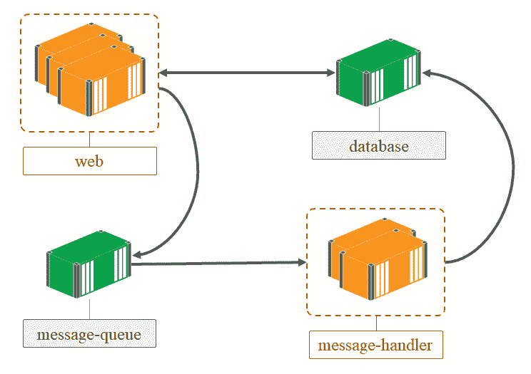
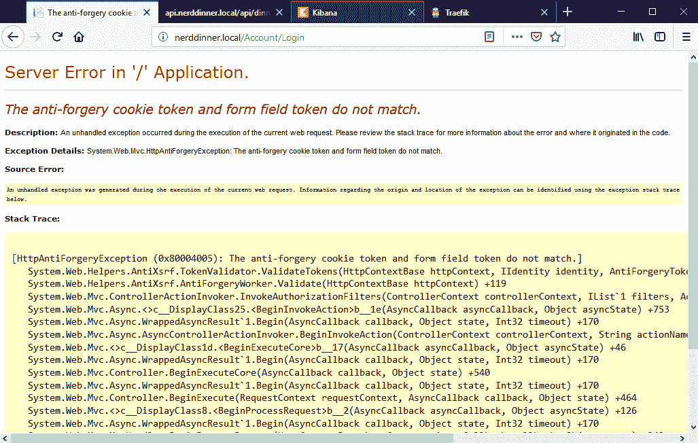
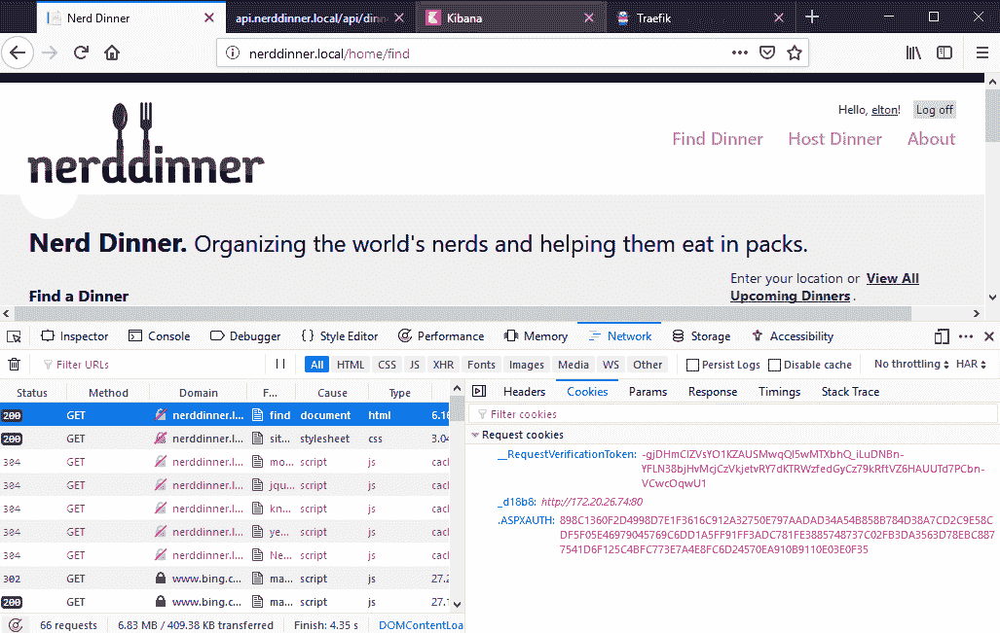
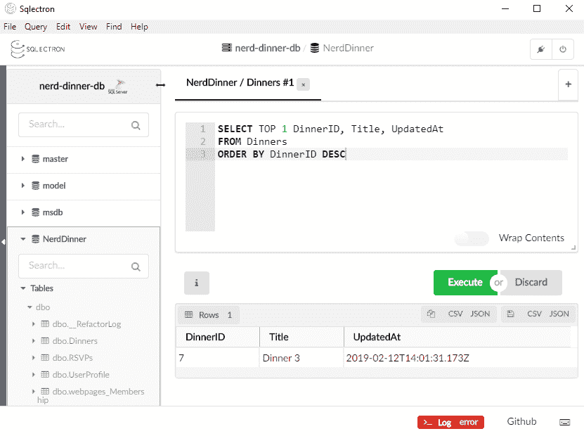

# 用 Docker 组合组织分布式解决方案

发货软件是 Docker 平台不可或缺的一部分。Docker Hub 上的官方存储库使得使用久经考验的组件设计分布式解决方案变得容易。在前一章中，我向您展示了如何将这些组件集成到您自己的解决方案中，采用容器优先的设计方法。最终的结果是一个具有几个移动部分的分布式解决方案。在本章中，您将学习如何使用 Docker Compose 将所有这些移动部件组织成一个单元。

Docker Compose 是 Docker 公司的另一个开源产品，它扩展了 Docker 生态系统。Docker **命令行界面** ( **CLI** )和 Docker API 处理单个资源，如图像和容器。Docker Compose 在更高的层次上工作，提供服务和应用程序。*应用程序*是由一个或多个服务组成的单一单元，这些服务在运行时作为容器部署。您可以使用 Docker Compose 来定义应用程序的所有资源—服务、网络、卷和其他 Docker 对象—以及它们之间的依赖关系。

Docker 编写了两个部分。设计时元素使用 YAML 规范在标记文件中捕获应用程序定义，在运行时 Docker Compose 可以从 YAML 文件管理应用程序。我们将在本章中讨论这两个问题:

*   使用 Docker 编写定义应用程序
*   使用 Docker 编写管理应用程序
*   配置应用程序环境

Docker Compose is installed as part of Docker Desktop on Windows. If you install Docker on Windows Server using the PowerShell installer, that doesn't give you Docker Compose. You can download it from the releases on GitHub at `docker/compose`.

# 技术要求

您将需要在更新为 18.09 的 Windows 10 或 Windows Server 2019 上运行 Docker 来完成示例。本章代码见[https://github . com/six eyes/docker-on-window/tree/第二版/ch06](https://github.com/sixeyed/docker-on-windows/tree/second-edition/ch06) 。

# 使用 Docker 编写定义应用程序

Docker 编写文件格式非常简单。YAML 是一种人类可读的标记语言，编写文件规范使用与 Docker CLI 相同的选项名称来捕获您的应用程序配置。在撰写文件中，您可以定义组成应用程序的服务、网络和卷。网络和卷与 Docker 引擎使用的概念相同。服务是对容器的抽象。

一个*容器*是一个组件的单个实例，它可以是从网络应用到消息处理器的任何东西。一个服务可以是在不同容器中运行的同一个组件的多个实例，所有实例都使用相同的 Docker 映像和相同的运行时选项。您可以在用于 web 应用程序的服务中有三个容器，在用于消息处理程序的服务中有两个容器:



一个*服务*就像一个模板，用一个已知的配置从一个图像运行一个容器。使用服务，您可以扩展应用程序的组件—从同一个映像运行多个容器，并将它们作为一个单元进行配置和管理。服务不在独立的 Docker 引擎中使用，但它们在 Docker Compose 中使用，并且还与在 Docker Swarm 模式下运行的一组 Docker 引擎一起使用(我将在下一章中介绍， [【第 7 章】](07.html)*使用 Docker Swarm* 编排分布式解决方案。

Docker 为服务提供了可发现性，就像它为容器提供服务一样。消费者通过名称访问服务，Docker 可以在服务中的多个容器之间对请求进行负载平衡。服务中的实例数量对消费者来说是透明的；它们总是引用服务名，流量总是被 Docker 定向到单个容器。

在这一章中，我将使用 Docker Compose 来组织我在前一章中构建的分布式解决方案，用一个可靠的、生产就绪的 Docker Compose 文件来替换脆弱的`docker container run` PowerShell 脚本。

# 捕获服务定义

可以在合成文件中以任何顺序定义服务。为了更容易阅读，我更喜欢从最简单的服务开始，这些服务没有依赖关系——**基础设施组件**，例如消息队列、反向代理和数据库。

Docker Compose 文件按惯例称为`docker-compose.yml`，它们以 API 版本的显式语句开始；最新的是 3.7 版本。应用程序资源在顶层定义—这是一个模板合成文件，包含服务、网络和卷的部分:

```
 version: '3.7'

  services:
    ...

  networks:
    ...

  volumes:
    ...
```

The Docker Compose specification is documented at the Docker website at [https://docs.docker.com/compose/compose-file/](https://docs.docker.com/compose/compose-file/). This lists the full specification for all supported versions, and the changes between the versions.

所有资源都需要一个唯一的名称，这个名称就是资源引用其他资源的方式。服务可能依赖于网络、卷和其他服务，这些都是通过名称捕获的。每个资源的配置都在自己的部分，可用的属性与 Docker CLI 中相应的`create`命令大致相同，例如`docker network create`和`docker volume create`。

在本章中，我将为分布式 NerdDinner 应用程序构建一个组合文件，并向您展示如何使用 Docker 组合来管理应用程序。我将首先从公共服务开始编写我的文件。

# 定义基础设施服务

我拥有的最简单的服务是消息队列 **NATS** ，它没有依赖关系。每个服务都需要一个名称和图像名称来启动容器。可选地，您可以包括您将在`docker container run`中使用的参数。对于 NATS 消息队列，我添加了一个网络名称，这意味着为该服务创建的任何容器都将连接到`nd-net`网络:

```
message-queue:
  image: dockeronwindows/ch05-nats:2e
 networks:
    - nd-net 
```

在这个服务定义中，我拥有启动消息队列容器所需的所有参数:

*   `message-queue`是服务的名称。这成为其他服务访问 NATS 的域名系统入口。
*   `image`是启动容器的图像的全名。在这种情况下，它是我的 Windows Server 2019 版本的 Docker Hub 官方 NATS 映像，但是您也可以通过在映像名称中包含注册表域来使用私有注册表中的映像。
*   `networks`是容器启动时要连接的网络列表。该服务连接到一个名为`nd-net`的网络。这将是一个 Docker 网络，用于该应用程序中的所有服务。稍后在 Docker Compose 文件中，我将明确捕获网络的细节。

I haven't published any ports for the NATS service. The message queue is only used internally by other containers. Within a Docker network, containers can access ports on other containers without them being published to the host. This keeps the message queue secure, as it is only accessible through the Docker platform by other containers in the same network. No external server and no applications running on the server can access the message queue.

# 弹性搜索

下一个基础设施服务是 **Elasticsearch** ，它也不依赖于其他服务。它将由消息处理程序使用，该程序也使用 NATS 消息队列，因此我需要将所有这些服务加入同一个 Docker 网络。对于 Elasticsearch，我还想限制它使用的内存量，并为数据使用一个卷，以便将数据存储在容器之外:

```
 elasticsearch:
   image: sixeyed/elasticsearch:5.6.11-windowsservercore-ltsc2019
 environment: 
     - ES_JAVA_OPTS=-Xms512m -Xmx512m
   volumes:
     - es-data:C:\data
   networks:
     - nd-net
```

这里，`elasticsearch`是服务的名称，`sixeyed/elasticsearch`是图像的名称，这是我在 Docker Hub 上的公共图像。我正在将服务连接到同一个`nd-net`网络，并且我还将一个卷装载到容器中的已知位置。当 Elasticsearch 将数据写入容器上的`C:\data`时，它实际上会存储在一个卷中。

就像网络一样，卷是 Docker Compose 文件中的一流资源。对于弹性搜索，我正在将一个名为`es-data`的卷映射到容器中的数据位置。稍后我将在合成文件中指定如何创建`es-data`卷。

# 特拉菲克

接下来是反向代理，Traefik。代理在创建容器时根据标签构建其路由规则，因此它需要连接到 Docker API:

```
reverse-proxy:
  image: sixeyed/traefik:v1.7.8-windowsservercore-ltsc2019
  command: --docker --docker.endpoint=npipe:////./pipe/docker_engine --api
 ports:
    - "80:80"
 - "8080:8080"
  volumes:
    - type: npipe
      source: \\.\pipe\docker_engine
      target: \\.\pipe\docker_engine 
  networks:
    - nd-net
```

Traefik 容器发布到主机上的端口`80`，连接到应用程序网络，并为 Docker API 命名的管道使用一个卷。这些是我用`docker container run`启动 Traefik 时使用的相同选项；通常，您可以将运行命令复制到 Docker Compose 文件中。

在 Docker Compose 中，端口发布与运行容器时相同。您可以指定要发布到哪个容器端口以及应该发布到哪个主机端口，因此 Docker 会将传入的主机流量路由到该容器。`ports`部分允许多个映射，如果您有特定要求，您可以选择指定 TCP 或 UDP 协议。

I'm also publishing port `8080` and using the `--api` flag in the Traefik configuration. This gives me access to Traefik's dashboard, where I can see all the routing rules Traefik has configured. This is useful in non-production environments, to check your proxy rules are correct, but this is not something you want exposed publicly in production.

Docker Compose 也支持扩展定义，我将它用于`volume`规范。我没有使用单行来定义卷装载，而是将卷的类型、源和目标分成了不同的行。这是可选的，但它使文件更容易阅读。

# 马纳人

**Kibana** 是第一个依赖其他服务的服务——它需要运行 Elasticsearch，以便能够连接到数据库。Docker Compose 没有给出任何关于它创建容器的顺序的保证，所以如果您在服务之间有一个启动依赖，您需要在服务定义中捕获它:

```
kibana:
  image: sixeyed/kibana:5.6.11-windowsservercore-ltsc2019
  labels:
    - "traefik.frontend.rule=Host:kibana.nerddinner.local"
  depends_on:
    - elasticsearch
  networks:
    - nd-net
```

`depends_on`属性展示了如何捕获服务之间的依赖关系。在这种情况下，Kibana 依赖于 Elasticsearch，因此 Docker 将在启动`kibana`服务之前确保`elasticsearch`服务已启动并运行。

Capturing dependencies like this is fine for running distributed applications on a single machine, but it doesn't scale. When you're running in a cluster you want the orchestrator to manage distributing the workload. It can't do that effectively if you have explicit dependencies, because it needs to make sure all the containers running the dependent service are healthy before it starts the consuming containers. There are better ways of managing dependencies that we'll see when we look at Docker Swarm.

基巴纳将由特拉菲克代理，但特拉菲克不需要在基巴纳之前运行。当 Traefik 启动时，它会从 Docker API 中获取一个正在运行的容器列表，以构建其初始路由映射。然后，它从 Docker 订阅事件流，以便在创建或移除容器时更新路由规则。因此，Traefik 可以在 web 容器之前或之后启动。

`kibana`服务的容器也连接到应用网络。在另一种配置中，我可以有单独的后端和前端网络。所有基础设施服务将连接到后端网络，面向公众的服务将连接到后端和前端网络。这两个都是 Docker 网络，但是将它们分开可以让我灵活地以不同的方式配置网络。

# 配置应用程序服务

到目前为止，我指定的基础设施服务不需要太多的应用程序级配置。我已经用网络、卷和端口配置了容器和 Docker 平台之间的集成点，但是应用程序使用构建在每个 Docker 映像中的配置。

基巴纳映像按照惯例使用主机名`elasticsearch`连接到弹性搜索，这是我在 Docker Compose 文件中使用的支持该惯例的服务名。Docker 平台会将任何到`elasticsearch`主机名的请求路由到服务，如果有多个容器运行该服务，则在容器之间进行负载平衡，因此 Kibana 将能够在预期的域名找到 Elasticsearch。

我的自定义应用程序需要指定配置设置，我可以使用环境变量将这些设置包含在合成文件中。在组合文件中为服务定义环境变量会为运行该服务的每个容器设置这些环境变量。

索引晚餐消息处理程序服务订阅 NATS 消息队列并在 Elasticsearch 中插入文档，因此它需要连接到同一个 Docker 网络，并且它也依赖于这些服务。我可以在合成文件中捕获这些依赖关系，并为应用程序指定配置:

```
nerd-dinner-index-handler:
  image: dockeronwindows/ch05-nerd-dinner-index-handler:2e
  environment:
    - Elasticsearch:Url=http://elasticsearch:9200
    - MessageQueue:Url=nats://message-queue:4222
  depends_on:
    - elasticsearch
    - message-queue
  networks:
    - nd-net
```

这里，我使用`environment`部分来指定两个环境变量——每个变量都有一个键值对——来配置消息队列和弹性搜索的 URL。这些实际上是烘焙到消息处理程序图像中的默认值，所以我不需要将它们包含在合成文件中，但是显式设置它们会很有用。

You can think of the Compose file as the complete deployment guide for the distributed solution. If you explicitly specify the environment values, it makes it clear what configuration options are available, at the cost of making your Compose file less manageable.

对于简单的应用程序设置，以纯文本形式存储配置变量是可以的，但是对于敏感值，使用单独的环境文件更好，这是我在上一章中使用的方法。撰写文件格式也支持这一点。对于数据库服务，我可以使用环境文件作为管理员密码，用`env-file`属性指定:

```
nerd-dinner-db:
  image: dockeronwindows/ch03-nerd-dinner-db:2e
 env_file:
    - db-credentials.env
  volumes:
    - db-data:C:\data
  networks:
    - nd-net
```

当数据库服务启动时，Docker 将从名为`db-credentials.env`的文件中设置环境变量。我使用了相对路径，因此该文件需要与合成文件位于同一位置。如前所述，该文件的内容是键值对，每个环境变量一行。在这个文件中，我包含了应用程序的连接字符串，以及数据库的密码，因此凭据都在一个地方:

```
sa_password=4jsZedB32!iSm__
ConnectionStrings:UsersContext=Data Source=nerd-dinner-db,1433;Initial Catalog=NerdDinner...
ConnectionStrings:NerdDinnerContext=Data Source=nerd-dinner-db,1433;Initial Catalog=NerdDinner...
```

敏感数据仍然是纯文本，但是通过将其隔离在单独的文件中，我可以做两件事:

*   首先，我可以保护文件以限制访问。
*   第二，我可以利用服务配置与应用程序定义的分离，对不同的环境使用相同的 Docker Compose 文件，替换不同的环境文件。

Environment variables are not secure even if you secure access to the file. You can view environment variable values when you inspect a container, so anyone with access to the Docker API can read this data. For sensitive data such as passwords and API keys, you should use Docker secrets with Docker Swarm, which I cover in the next chapter.

对于保存晚餐消息处理程序，我可以对数据库凭证使用相同的环境文件。处理程序依赖于消息队列和数据库服务，但是在这个定义中没有新的属性:

```
nerd-dinner-save-handler:
  image: dockeronwindows/ch05-nerd-dinner-save-handler:2e
  depends_on:
    - nerd-dinner-db
    - message-queue
  env_file:
    - db-credentials.env
  networks:
    - nd-net
```

接下来是由 Traefik 代理的我的前端服务 REST API、新的主页和旧的 NerdDinner web 应用程序。REST 应用编程接口使用相同的凭据文件来配置 SQL Server 连接，并包括 Traefik 路由规则:

```
nerd-dinner-api:
  image: dockeronwindows/ch05-nerd-dinner-api:2e
  labels:
    - "traefik.frontend.rule=Host:api.nerddinner.local"
  env_file:
    - db-credentials.env
  networks:
    - nd-net
```

主页包括 Traefik 路由规则和高优先级值，以确保在 NerdDinner web 应用程序使用更通用的规则之前评估该规则:

```
nerd-dinner-homepage:
  image: dockeronwindows/ch03-nerd-dinner-homepage:2e
  labels:
    - "traefik.frontend.rule=Host:nerddinner.local;Path:/,/css/site.css"
    - "traefik.frontend.priority=10"
  networks:
    - nd-net
```

最后一项服务是网站本身。这里，我使用了环境变量和环境文件的组合。跨环境通常一致的变量值可以显式地声明，以使配置清晰明了——我这样做是为了特性标志。敏感数据可以从单独的文件中读取，在这种情况下，包含数据库凭证和 API 密钥:

```
nerd-dinner-web:
  image: dockeronwindows/ch05-nerd-dinner-web:2e
  labels:
    - "traefik.frontend.rule=Host:nerddinner.local;PathPrefix:/"
    - "traefik.frontend.priority=1"
 environment: 
    - HomePage:Enabled=false
    - DinnerApi:Enabled=true
  env_file:
    - api-keys.env
    - db-credentials.env
  depends_on:
    - nerd-dinner-db
    - message-queue
  networks:
    - nd-net
```

网站容器不需要公开，所以没有端口发布。应用程序需要访问其他服务，因此它连接到同一个网络。

所有的服务现在都配置好了，所以我只需要指定网络和卷资源来完成合成文件。

# 指定应用程序资源

Docker Compose 将网络和卷定义与服务定义分开，这允许环境之间的灵活性。我将在本章的后面介绍这种灵活性，但是为了完成 NerdDinner Compose 文件，我将从最简单的方法开始，使用默认值。

我的撰写文件中的服务都使用名为`nd-net`的网络，这需要在撰写文件中指定。Docker 网络是隔离应用程序的好方法。您可能有几个解决方案都使用弹性搜索，但有不同的服务级别协议和存储要求。如果每个应用程序都有单独的网络，您可以在不同的 Docker 网络中运行单独的 Elasticsearch 服务，为每个应用程序单独配置，但都命名为`elasticsearch`。这符合预期的约定，但被网络隔离，因此服务只能在自己的网络中看到弹性搜索实例。

Docker Compose 可以在运行时创建网络，也可以定义资源来使用主机上已经存在的外部网络。该规范针对的网络使用 Docker 安装时创建的默认`nat`网络，因此该设置适用于所有标准 Docker 主机:

```
networks:
  nd-net:
   external:
     name: nat
```

还需要指定卷。我的两个有状态服务 Elasticsearch 和 SQL Server 都使用命名卷进行数据存储:`es-data`和`nd-data`。与其他网络一样，卷可以指定为外部卷，因此 Docker Compose 将使用现有卷。Docker 不创建任何默认卷，因此如果我使用外部卷，我需要在运行应用程序之前在每台主机上创建它。相反，我将指定没有任何选项的卷，因此 Docker Compose 将为我创建它们:

```
volumes:
  es-data:
  db-data:
```

这些卷将数据存储在主机上，而不是存储在容器的可写层中。它们不是主机装载的卷，因此尽管数据存储在本地磁盘上，但我没有指定位置。每个卷将在`C:\ProgramData\Docker`将其数据写入 Docker 数据目录。我将在本章的后面讨论如何管理这些卷。

我的合成文件已经指定了服务、网络和卷，因此可以运行了。完整文件在本章`ch06\ch06-docker-compose`的源代码中。

# 使用 Docker 编写管理应用程序

Docker Compose 提供了一个类似于 Docker 命令行界面的界面。`docker-compose`命令为其支持的功能使用了一些相同的命令名称和参数，这是完整 Docker CLI 功能的子集。当您通过编写命令行界面运行命令时，它会向 Docker 引擎发送请求，以对编写文件中的资源进行操作。

Docker 编写文件是您的应用程序所需的状态。当您运行`docker-compose`命令时，它会将合成文件与 Docker 中已经存在的对象进行比较，并进行任何必要的更改以达到所需的状态。这可能是停止容器、启动容器或创建卷。

合成将合成文件中的所有资源视为单个应用程序，为了消除在同一主机上运行的应用程序的歧义，运行时会将项目名称添加到它为应用程序创建的所有资源中。当您通过 Compose 运行应用程序，然后查看主机上运行的容器时，您不会看到名称与服务名称完全匹配的容器。Compose 将项目名称和索引添加到容器名称中，以支持服务中的多个容器，但这不会影响 Docker 的 DNS 系统，因此容器仍然通过服务名称相互访问。

# 运行应用程序

我在`ch06-docker-compose`目录中有 NerdDinner 的第一个 Compose 文件，里面也包含了环境变量文件。从该目录中，我可以用一个`docker-compose`命令启动整个应用程序:

```
> docker-compose up -d
Creating ch06-docker-compose_message-queue_1        ... done
Creating ch06-docker-compose_nerd-dinner-api_1      ... done
Creating ch06-docker-compose_nerd-dinner-db_1            ... done
Creating ch06-docker-compose_nerd-dinner-homepage_1 ... done
Creating ch06-docker-compose_elasticsearch_1        ... done
Creating ch06-docker-compose_reverse-proxy_1        ... done
Creating ch06-docker-compose_kibana_1                    ... done
Creating ch06-docker-compose_nerd-dinner-index-handler_1 ... done
Creating ch06-docker-compose_nerd-dinner-web_1           ... done
Creating ch06-docker-compose_nerd-dinner-save-handler_1  ... done
```

让我们看看前面命令的描述:

*   `up`命令用于启动应用程序、创建网络、卷和运行容器。
*   `-d`选项运行后台的所有容器，与`docker container run`中的`--detach`选项相同。

可以看到 Docker Compose 尊重服务的`depends_on`设置。首先创建任何依赖于其他服务的服务。没有任何依赖关系的服务将以随机顺序创建。在这种情况下，`message-queue`服务首先被创建，因为许多其他服务依赖于它，`nerd-dinner-web`和`nerd-dinner-save-handler`服务是最后一个，因为它们具有最多的依赖性。

输出中的名称是单独的容器名称，命名格式为`{project}_{service}_{index}`。每个服务只有一个容器在运行，这是默认的，所以索引都是`1`。项目名是我运行`compose`命令的目录名的净化版本。

当您运行`docker-compose up`命令并完成时，您可以使用 Docker Compose 或标准的 Docker CLI 管理容器。容器只是普通的 Docker 容器，由 compose 使用一些额外的元数据作为一个整体来管理它们。列出容器向我展示了所有由`compose`创建的服务容器:

```
> docker container ls
CONTAINER ID   IMAGE                                      COMMAND                     
c992051ba468   dockeronwindows/ch05-nerd-dinner-web:2e   "powershell powershe…"
78f5ec045948   dockeronwindows/ch05-nerd-dinner-save-handler:2e          "NerdDinner.MessageH…"      
df6de70f61df  dockeronwindows/ch05-nerd-dinner-index-handler:2e  "dotnet NerdDinner.M…"      
ca169dd1d2f7  sixeyed/kibana:5.6.11-windowsservercore-ltsc2019   "powershell ./init.p…"      
b490263a6590  dockeronwindows/ch03-nerd-dinner-db:2e             "powershell -Command…"      
82055c7bfb05  sixeyed/elasticsearch:5.6.11-windowsservercore-ltsc2019   "cmd /S /C \".\\bin\\el…"   
22e2d5b8e1fa  dockeronwindows/ch03-nerd-dinner-homepage:2e       "dotnet NerdDinner.H…"     
 058248e7998c dockeronwindows/ch05-nerd-dinner-api:2e            "dotnet NerdDinner.D…"      
47a9e4d91682  sixeyed/traefik:v1.7.8-windowsservercore-ltsc2019  "/traefik --docker -…"      
cfd1ef3f5414  dockeronwindows/ch05-nats:2e              "gnatsd -c gnatsd.co…"
... 
```

运行 Traefik 的容器将端口`80`发布到本地机器，我的主机文件中有本地 NerdDinner 域的条目。NerdDinner 应用程序及其新的主页、REST API 和 Kibana 分析将按预期运行，因为完整的配置在 Compose 文件中捕获，所有组件都由 Docker Compose 启动。

这是撰写文件格式最强大的功能之一。该文件包含运行应用程序的完整规范，任何人都可以使用它来运行您的应用程序。在这种情况下，所有组件都使用 Docker Hub 上的公共 Docker 映像，因此任何人都可以从这个 Compose 文件启动应用程序。除了 Docker 和 Docker Compose 之外，您不需要任何先决条件来运行 NerdDinner，它现在是一个分布式应用程序，包含。. NET 框架。NET 核心、Java、Go 和 Node.js 组件。

# 扩展应用服务

Docker Compose 允许您轻松地上下扩展服务，向正在运行的服务添加或移除容器。当服务使用多个容器运行时，网络中的其他服务仍然可以访问它。消费者使用服务名称进行发现，Docker 中的 DNS 服务器在服务中的所有容器之间对请求进行负载平衡。

不过，添加更多的容器并不能自动为您的服务带来规模和弹性；这取决于运行服务的应用程序。仅仅通过向 SQL 数据库服务添加另一个容器是无法获得 SQL Server 故障转移群集的，因为需要为故障转移显式配置 SQL Server。如果添加另一个容器，您将只有两个不同的数据库实例，它们有不同的数据存储。

如果 Web 应用程序旨在支持横向扩展，那么它们通常可以很好地扩展。无状态应用程序可以在任何数量的容器中运行，因为任何容器都可以处理任何请求。但是，如果您的应用程序在本地维护会话状态，来自同一个用户的请求需要由同一个服务来处理，这将阻止您跨许多容器进行负载平衡，除非您使用粘性会话。

向主机发布端口的服务如果在单个 Docker 引擎上运行，则无法扩展。端口只能有一个操作系统进程监听它们，Docker 也是如此——不能将同一个主机端口映射到多个容器端口。在多主机的 Docker Swarm 上，您可以使用已发布的端口扩展服务，Docker 将在不同的主机上运行每个容器。

在 NerdDinner 中，消息处理程序是真正的无状态组件。他们从队列中接收到一条包含他们需要的所有信息的消息，并对其进行处理。NATS 支持将订阅者分组在同一个消息队列中，这意味着我可以让几个容器运行 save-feature 处理程序，而 NATS 将确保只有一个处理程序获得每个消息的副本，因此我没有重复的消息处理。消息处理程序中的代码已经利用了这一点。

我可以在高峰时间扩大消息处理程序，以提高消息处理的吞吐量。我可以通过`up`命令和`--scale`选项来实现，指定服务名称和所需的实例数量:

```
> docker-compose up -d --scale nerd-dinner-save-handler=3

ch06-docker-compose_elasticsearch_1 is up-to-date
ch06-docker-compose_nerd-dinner-homepage_1 is up-to-date
ch06-docker-compose_message-queue_1 is up-to-date
ch06-docker-compose_nerd-dinner-db_1 is up-to-date
ch06-docker-compose_reverse-proxy_1 is up-to-date
ch06-docker-compose_nerd-dinner-api_1 is up-to-date
Starting ch06-docker-compose_nerd-dinner-save-handler_1 ...
ch06-docker-compose_kibana_1 is up-to-date
ch06-docker-compose_nerd-dinner-web_1 is up-to-date
Creating ch06-docker-compose_nerd-dinner-save-handler_2 ... done
Creating ch06-docker-compose_nerd-dinner-save-handler_3 ... done
```

Docker Compose 将正在运行的应用程序的状态与 Compose 文件中的配置以及命令中指定的覆盖进行比较。在这种情况下，除了保存晚餐处理程序之外，所有服务都没有变化，因此它们被列为`up-to-date`。保存处理程序有了新的服务级别，因此 Docker Compose 创建了另外两个容器。

随着保存消息处理程序的三个实例的运行，它们以循环方式共享传入的消息负载。这是扩大规模的好方法。处理程序同时处理消息并写入 SQL 数据库，这增加了保存的吞吐量，并减少了处理消息所需的时间。但是写入 SQL Server 的进程数量仍然有严格的限制，所以数据库不会成为这个特性的瓶颈。

我可以通过 web 应用程序创建多个晚餐，当发布事件消息时，消息处理程序将分担负载。我可以在日志中看到不同的处理程序处理不同的消息，并且没有重复的事件处理:

```
> docker container logs ch06-docker-compose_nerd-dinner-save-handler_1
Connecting to message queue url: nats://message-queue:4222
Listening on subject: events.dinner.created, queue: save-dinner-handler
Received message, subject: events.dinner.created
Saving new dinner, created at: 2/12/2019 11:22:47 AM; event ID: 60f8b653-f456-4bb1-9ccd-1253e9a222b6
Dinner saved. Dinner ID: 1; event ID: 60f8b653-f456-4bb1-9ccd-1253e9a222b6
...

> docker container logs ch06-docker-compose_nerd-dinner-save-handler_2
Connecting to message queue url: nats://message-queue:4222
Listening on subject: events.dinner.created, queue: save-dinner-handler
Received message, subject: events.dinner.created
Saving new dinner, created at: 2/12/2019 11:25:00 AM; event ID: 5f6d017e-a66b-4887-8fd5-ac053a639a6d
Dinner saved. Dinner ID: 5; event ID: 5f6d017e-a66b-4887-8fd5-ac053a639a6d

> docker container logs ch06-docker-compose_nerd-dinner-save-handler_3
Connecting to message queue url: nats://message-queue:4222
Listening on subject: events.dinner.created, queue: save-dinner-handler
Received message, subject: events.dinner.created
Saving new dinner, created at: 2/12/2019 11:24:55 AM; event ID: 8789179b-c947-41ad-a0e4-6bde7a1f2614
Dinner saved. Dinner ID: 4; event ID: 8789179b-c947-41ad-a0e4-6bde7a1f2614
```

我运行的是单个 Docker 引擎，所以无法扩展 Traefik 服务，因为只能将一个容器发布到端口`80`。但是我可以扩展 Traefik 代理的前端容器，这是测试我的应用程序在扩展到多个实例时是否正常工作的好方法。我将添加原始 NerdDinner web 应用程序的另外两个实例:

```
> docker-compose up -d --scale nerd-dinner-web=3
ch06-docker-compose_message-queue_1 is up-to-date
...
Stopping and removing ch06-docker-compose_nerd-dinner-save-handler_2 ... done
Stopping and removing ch06-docker-compose_nerd-dinner-save-handler_3 ... done
Creating ch06-docker-compose_nerd-dinner-web_2                       ... done
Creating ch06-docker-compose_nerd-dinner-web_3                       ... done
Starting ch06-docker-compose_nerd-dinner-save-handler_1              ... done
```

仔细看看这个输出——这里发生的事情是正确的，但不是我想要的。Compose 创建了两个新的 NerdDinner web 容器，以满足我指定的 3 的比例，但是它也停止并删除了两个保存处理程序容器。

这是因为 Compose 隐式使用我的`docker-compose.yml`文件作为应用程序定义，它使用每个服务的单个实例。然后，它为 web 服务添加来自命令的 scale 值，并构建一个期望的状态，表示每个服务都应该有一个容器在运行，除了 web 服务，它应该有三个。它看到 web 服务只有一个容器，所以它又创建了两个。它看到保存处理程序有三个容器，所以它删除了两个。

正是由于这种情况，不建议将合成文件定义与命令中的更改混合使用。仅编写文件应该是应用程序的理想状态。但是在这种情况下，您不能在 Compose 文件中指定比例选项(您可以在旧版本中指定，但不能从 v3 规范中指定)，因此您需要为所有服务显式添加比例级别:

```
docker-compose up -d --scale nerd-dinner-web=3 --scale nerd-dinner-save-handler=3
```

现在我有三个保存处理程序容器，它们共享消息队列中的工作，还有三个 web 容器。Traefik 将在这三个 web 容器之间对请求进行负载平衡。我可以从我在端口`8080`上发布的 Traefik 仪表板中查看该配置:


Traefik 在左边的蓝色框中显示了前端路由规则，在右边的绿色框中显示了它们映射到的后端服务。`nerddinner.local`有一个前端路由规则，路径前缀为`/`，将所有流量发送到`nerd-dinner-web`后端(主页除外，主页有不同的规则)。后端显示列出了三个服务器，这是我用 Docker Compose 缩放的三个容器。`172.20.*.*`服务器地址是 Docker 网络上容器可以用来通信的内部 IP 地址。

我可以浏览 NerdDinner 应用程序，它工作正常，可以跨后端容器对 Traefik 请求进行负载平衡。但是，当我尝试登录时，我会发现 NerdDinner 不是为扩展到多个实例而设计的:



这条错误消息告诉我，NerdDinner 希望来自一个用户的所有请求都由 web 应用程序的同一个实例来处理。Traefik 正好支持这种情况下的粘性会话，所以要解决这个问题，我只需要在我的 Compose 文件中给 web 服务定义添加一个新标签。这将为 NerdDinner 后端启用粘性会话:

```
nerd-dinner-web:
  image: dockeronwindows/ch05-nerd-dinner-web:2e
  labels:
    - "traefik.frontend.rule=Host:nerddinner.local;PathPrefix:/"
    - "traefik.frontend.priority=1"
    - "traefik.backend.loadbalancer.stickiness=true"
```

现在，我可以再次部署，确保包含我的扩展参数:

```
> docker-compose up -d --scale nerd-dinner-web=3 --scale nerd-dinner-save-handler=3
ch06-docker-compose_message-queue_1 is up-to-date
...
Recreating ch06-docker-compose_nerd-dinner-web_1 ... done
Recreating ch06-docker-compose_nerd-dinner-web_2 ... done
Recreating ch06-docker-compose_nerd-dinner-web_3 ... done
```

Compose 重新创建 web 服务容器，删除旧的容器，并用新的配置启动新的容器。现在，Traefik 正在使用粘性会话，所以来自我的浏览器会话的每个请求都将进入同一个容器。Traefik 使用一个自定义 cookie 来实现这一点，该 cookie 指定请求应该路由到的容器 IP 地址:



在这种情况下，cookie 被称为`_d18b8`，它将我的所有请求路由到具有 IP 地址`172.20.26.74`的容器。

大规模运行时发现问题过去只发生在测试环境中，甚至发生在生产环境中。在 Docker 中运行一切意味着我可以在我的 dev 笔记本电脑上大规模测试我的应用程序的功能，并在发布前发现这些问题。使用现代技术，如 Traefik，也意味着有很好的方法来解决这些问题，而不必改变我的遗留应用程序。

# 停止和启动应用程序服务

Docker Compose 中有几个用于管理容器生命周期的命令。理解选项之间的差异很重要，这样您就不会意外地移除资源。

`up`和`down`命令是启动和停止整个应用程序的钝器。`up`命令创建在合成文件中指定的任何不存在的资源，并为所有服务创建和启动容器。`down`命令则相反——它停止任何正在运行的容器并移除应用程序资源。如果容器和网络是由 Docker Compose 创建的，则它们会被删除，但卷不会被删除，因此您拥有的任何应用程序数据都会被保留。

`stop`命令只是停止所有正在运行的容器，而不移除它们或其他资源。停止容器会以正常关闭结束正在运行的进程。`kill`命令通过强制结束运行过程来停止所有容器。停止的应用程序容器可以通过`start`再次启动，它在现有容器中运行入口点程序。

停止的容器保留了所有配置和数据，但不使用任何计算资源。如果您处理多个项目，启动和停止容器是切换上下文的一种非常有效的方法。如果我正在 nerddiner 上开发，当另一项工作作为优先事项进入时，我可以停止整个 nerddiner 应用程序来释放我的开发环境:

```
> docker-compose stop
Stopping ch06-docker-compose_nerd-dinner-web_2           ... done
Stopping ch06-docker-compose_nerd-dinner-web_1           ... done
Stopping ch06-docker-compose_nerd-dinner-web_3           ... done
Stopping ch06-docker-compose_nerd-dinner-save-handler_3  ... done
Stopping ch06-docker-compose_nerd-dinner-save-handler_2  ... done
Stopping ch06-docker-compose_nerd-dinner-save-handler_1  ... done
Stopping ch06-docker-compose_nerd-dinner-index-handler_1 ... done
Stopping ch06-docker-compose_kibana_1                    ... done
Stopping ch06-docker-compose_reverse-proxy_1             ... done
Stopping ch06-docker-compose_nerd-dinner-homepage_1      ... done
Stopping ch06-docker-compose_nerd-dinner-db_1            ... done
Stopping ch06-docker-compose_nerd-dinner-api_1           ... done
Stopping ch06-docker-compose_elasticsearch_1             ... done
Stopping ch06-docker-compose_message-queue_1             ... done
```

现在我没有运行容器，我可以切换到另一个项目。当这项工作完成后，我可以通过运行`docker-compose start`再次启动 NerdDinner。

您还可以通过指定名称来停止单个服务，如果您想测试应用程序如何管理故障，这非常有用。如果索引晚餐处理程序无法访问弹性搜索，我可以通过停止弹性搜索服务来检查它们的行为:

```
> docker-compose stop elasticsearch
Stopping ch06-docker-compose_elasticsearch_1 ... done
```

所有这些命令都是通过将编写文件与 Docker 中运行的服务进行比较来处理的。您需要访问 Docker 编写文件才能运行任何 Docker 编写命令。这是在单个主机上使用 Docker Compose 运行应用程序的最大缺点之一。另一种方法是使用相同的合成文件，但将其作为堆栈部署到 Docker Swarm，我将在下一章中介绍这一点。

The `stop` and `start` commands use the Compose file, but they work on the containers that currently exist, not just the definition in the Compose file. So, if you scale a service, then stop the whole application and then start it again—you'll still have all the containers you scaled to. Only the `up` command uses the Compose file to reset the application to the desired state.

# 升级应用服务

如果从同一个合成文件中重复运行`docker compose up`，则第一次运行后不会进行任何更改。Docker Compose 会在运行时将 Compose 文件中的配置与活动容器进行比较，并且不会更改资源，除非定义已经更改。这意味着您可以使用 Docker Compose 来管理应用程序升级。

我的合成文件目前正在使用我在[第三章](03.html)*中构建的图像的数据库服务。NET 框架和。NET 核心应用程序*，标记为`dockeronwindows/ch03-nerd-dinner-db:2e`。在本章中，我将审计字段添加到数据库模式的表中，并构建了数据库映像的新版本，标记为`dockeronwindows/ch06-nerd-dinner-db:2e`。

我在同一个`ch06-docker-compose`目录下有第二个撰写文件，叫做`docker-compose-db-upgrade.yml`。升级文件不是完整的应用程序定义；它只包含数据库服务定义的一个部分，使用新的 image 标记:

```
version: '3.7'
services:
  nerd-dinner-db:
    image: dockeronwindows/ch06-nerd-dinner-db:2e
```

Docker Compose 支持覆盖文件。您可以运行`docker-compose`命令并传递多个撰写文件作为参数。Compose 将按照命令中指定的顺序，从左到右将所有文件连接在一起。覆盖文件可用于向应用程序定义中添加新的部分，也可以替换现有的值。

当应用程序运行时，我可以再次执行`docker compose up`，指定原始合成文件和`db-upgrade`覆盖文件:

```
> docker-compose `
   -f docker-compose.yml `
   -f docker-compose-db-upgrade.yml `
  up -d 
ch06-docker-compose_reverse-proxy_1 is up-to-date
ch06-docker-compose_nerd-dinner-homepage_1 is up-to-date
ch06-docker-compose_elasticsearch_1 is up-to-date
ch06-docker-compose_message-queue_1 is up-to-date
ch06-docker-compose_kibana_1 is up-to-date
Recreating ch06-docker-compose_nerd-dinner-db_1 ... done
Recreating ch06-docker-compose_nerd-dinner-web_1          ... done
Recreating ch06-docker-compose_nerd-dinner-save-handler_1 ... done
Recreating ch06-docker-compose_nerd-dinner-api_1          ... done
```

该命令使用`db-upgrade`文件作为主`docker-compose.yml`文件的替代。Docker Compose 将两者合并，因此最终的服务定义包含原始文件中的所有值，除了来自覆盖的图像规范。新的服务定义与 Docker 中运行的不匹配，因此 Compose 会重新创建数据库服务。

Docker Compose 使用新的映像规范，通过移除旧容器并启动新容器来重新创建服务。不依赖于数据库的服务保持原样，并带有日志条目`up-to-date`，一旦新的数据库容器运行，任何依赖于数据库的服务也将被重新创建。

我的数据库容器使用了我在 [第 3 章](03.html)*中描述的模式。NET 框架和。NET Core Applications，*具有存储数据的卷和在容器被替换时可以升级数据库模式的脚本。在合成文件中，我使用了名为`db-data`的卷的默认定义，因此 Docker Compose 为我创建了它。就像 Compose 创建的容器一样，卷是标准的 Docker 资源，可以使用 Docker CLI 进行管理。`docker volume ls`列出了主机上的所有卷:

```
> docker volume ls

DRIVER  VOLUME NAME
local   ch06-docker-compose_db-data
local   ch06-docker-compose_es-data
```

我有两个卷用于我的网络部署。它们都使用本地驱动程序，这意味着数据存储在本地磁盘上。我可以检查 SQL Server 卷以查看数据在主机上的物理存储位置(在`Mountpoint`属性中)，然后检查内容以查看数据库文件:

```
> docker volume inspect -f '{{ .Mountpoint }}' ch06-docker-compose_db-data
C:\ProgramData\docker\volumes\ch06-docker-compose_db-data\_data

> ls C:\ProgramData\docker\volumes\ch06-docker-compose_db-data\_data

    Directory: C:\ProgramData\docker\volumes\ch06-docker-compose_db-data\_data

Mode                LastWriteTime         Length Name
----                -------------         ------ ----
-a----       12/02/2019     13:47        8388608 NerdDinner_Primary.ldf
-a----       12/02/2019     13:47        8388608 NerdDinner_Primary.mdf
```

该卷存储在容器之外，因此当 Docker Compose 删除旧的容器数据库时，所有数据都会被保留。新的数据库映像捆绑了一个 Dacpac，并被配置为对现有数据文件进行模式升级，方式与从[第 3 章](03.html)、*开发 Dockerized 的 SQL Server 数据库相同。NET 框架和。网络核心应用*。

新容器启动后，我可以检查日志，看到新容器附加了卷中的数据库文件，然后修改了“晚餐”表以添加新的审核列:

```
> docker container logs ch06-docker-compose_nerd-dinner-db_1

VERBOSE: Starting SQL Server
VERBOSE: Changing SA login credentials
VERBOSE: Data files exist - will attach and upgrade database
Generating publish script for database 'NerdDinner' on server '.\SQLEXPRESS'.
Successfully generated script to file C:\init\deploy.sql.
VERBOSE: Changed database context to 'NerdDinner'.
VERBOSE: Altering [dbo].[Dinners]...
VERBOSE: Update complete.
VERBOSE: Deployed NerdDinner database, data files at: C:\data
```

新的审核列在更新行时添加了时间戳，所以现在当我通过 web UI 创建一个晚餐时，我可以看到该行上次在数据库中更新的时间。在我的开发环境中，我还没有发布用于客户端连接的 SQL Server 端口，但是我可以运行`docker container inspect`来获取容器的本地 IP 地址。然后，我可以将我的 SQL 客户端直接连接到容器，并运行查询来查看新的审核时间戳:



Docker Compose 查找资源及其定义之间的任何差异，而不仅仅是 Docker 映像的名称。如果您更改环境变量、端口映射、卷设置或任何其他配置，Docker Compose 将删除或创建资源，以使正在运行的应用程序达到所需的状态。

You need to be careful with modifying Compose files to run applications. If you remove the definition for a running service from the file, Docker Compose won't recognize that the existing service containers are part of the application, so they won't be included in the difference checks. You can end up with orphaned service containers.

# 监控应用程序容器

将一个分布式应用程序作为一个单元来处理，可以更容易地监控和跟踪问题。Docker Compose 提供了自己的`top`和`logs`命令，它们对应用程序服务中的所有容器进行操作，并显示收集到的结果。

要检查所有组件的内存和 CPU 使用情况，请运行`docker-compose top`:

```
> docker-compose top

ch06-docker-compose_elasticsearch_1
Name          PID     CPU            Private Working Set
---------------------------------------------------------
smss.exe      21380   00:00:00.046   368.6kB
csrss.exe     11232   00:00:00.359   1.118MB
wininit.exe   16328   00:00:00.093   1.196MB
services.exe  15180   00:00:00.359   1.831MB
lsass.exe     12368   00:00:01.156   3.965MB
svchost.exe   18424   00:00:00.156   1.626MB
...
```

容器按名称的字母顺序列出，每个容器中的进程没有特定的顺序。没有办法改变顺序，所以不能先在最努力的容器中显示最密集的进程，但是结果是纯文本的，所以可以在 PowerShell 中进行操作。

要查看所有容器的日志条目，运行`docker-compose logs`:

```
> docker-compose logs
Attaching to ch06-docker-compose_nerd-dinner-web_1, ch06-docker-compose_nerd-dinner-save-handler_1, ch06-docker-compose_nerd-dinner-api_1, ch06-docker-compose_nerd-dinner-db_1, ch06-docker-compose_kibana_1, ch06-docker-compose_nerd-dinner-index-handler_1, ch06-docker-compose_reverse-proxy_1, ch06-docker-compose_elasticsearch_1, ch06-docker-compose_nerd-dinner-homepage_1, ch06-docker-compose_message-queue_1

nerd-dinner-web_1   | 2019-02-12 13:47:11 W3SVC1002144328 127.0.0.1 GET / - 80 - 127.0.0.1 Mozilla/5.0+(Windows+NT;+Windows+NT+10.0;+en-US)+WindowsPowerShell/5.1.17763.134 - 200 0 0 7473
nerd-dinner-web_1   | 2019-02-12 13:47:14 W3SVC1002144328 ::1 GET / - 80 - ::1 Mozilla/5.0+(Windows+NT;+Windows+NT+10.0;+en-US)+WindowsPowerShell/5.1.17763.134 - 200 0 0 9718
...
```

在屏幕上，容器名称是彩色编码的，因此您可以很容易地从不同的组件中区分条目。通过 Docker Compose 读取日志的一个优点是，它显示所有容器的输出，即使组件显示错误并且容器停止。这些错误消息在上下文中很有用—您可能会看到一个组件在另一个组件记录它已经启动之前抛出了连接错误，这可能会突出显示撰写文件中缺少的依赖项。

Docker Compose 显示了所有服务容器的所有日志条目，因此输出会很大。您可以使用`--tail`选项对此进行限制，将输出限制为每个容器的指定数量的最新日志条目。

当您在开发中或在一个小规模项目中运行时，这些命令非常有用，因为单个服务器运行少量容器。它不适用于在多种主机上的多个容器上运行的大型项目。对于这些，您需要以容器为中心的管理和监控，我将在[第 8 章](08.html)、*管理和监控文档化解决方案*中演示。

# 管理应用程序映像

Docker Compose 可以管理 Docker 图像以及容器。在合成文件中，您可以包含告诉 Docker Compose 如何构建图像的属性。您可以指定要发送到 Docker 服务的构建上下文的位置，这是所有应用程序内容的根文件夹，以及 Docker 文件的位置。

上下文路径相对于撰写文件的位置，而 Dockerfile 路径相对于上下文。这对于复杂的源树非常有用，例如本书的演示源，其中每个图像的上下文都在不同的文件夹中。在`ch06-docker-compose-build`文件夹中，我有一个完整的包含应用程序规范的合成文件，并带有指定的构建属性。

这是如何为我的图像指定构建细节的:

```
nerd-dinner-db:
  image: dockeronwindows/ch06-nerd-dinner-db:2e
 build:
    context: ../ch06-nerd-dinner-db
    dockerfile: ./Dockerfile
...
nerd-dinner-save-handler:
  image: dockeronwindows/ch05-nerd-dinner-save-handler:2e
  build:
    context: ../../ch05
    dockerfile: ./ch05-nerd-dinner-save-handler/Dockerfile
```

当您运行`docker-compose build`时，任何具有指定`build`属性的服务都将被构建并使用`image`属性中的名称进行标记。构建过程使用普通的 Docker API，因此仍然使用图像层缓存，仅重建已更改的层。向合成文件中添加构建细节是构建所有应用程序图像的一种非常有效的方式，也是捕获图像构建方式的一个中心位置。

Docker Compose 的另一个有用特性是管理整组图像的能力。本章的撰写文件使用的图像都是 Docker Hub 上公开的，所以你可以用`docker-compose up`运行完整的应用程序——但是第一次运行时，所有的图像都会被下载，这需要一段时间。您可以在使用`docker-compose pull`之前预加载图像，这会拉取所有图像:

```
> docker-compose pull
Pulling message-queue             ... done
Pulling elasticsearch             ... done
Pulling reverse-proxy             ... done
Pulling kibana                    ... done
Pulling nerd-dinner-db            ... done
Pulling nerd-dinner-save-handler  ... done
Pulling nerd-dinner-index-handler ... done
Pulling nerd-dinner-api           ... done
Pulling nerd-dinner-homepage      ... done
Pulling nerd-dinner-web           ... done
```

同样，您可以使用`docker-compose push`将图像上传到远程存储库。对于这两个命令，Docker Compose 使用来自最近的`docker login`命令的经过身份验证的用户。如果您的合成文件包含您无权推送的图像，这些推送将会失败。对于您被授权写入的任何存储库，无论是在 Docker Hub 还是私有注册表中，这些映像都将被推送。

# 配置应用程序环境

当您在 Docker Compose 中定义应用程序时，您有一个单一的工件，它描述了应用程序的所有组件以及它们之间的集成点。这通常被称为**应用程序清单**—列出应用程序所有部分的文档。与 Dockerfile 明确定义安装和配置一个软件的步骤一样，Docker Compose 文件明确定义部署整个解决方案的步骤。

Docker Compose 还允许您捕获可以部署到不同环境的应用程序定义，因此您的 Compose 文件可以在整个部署管道中使用。通常，环境之间存在差异，无论是基础架构设置还是应用程序设置。Docker Compose 为您提供了两个选项来管理这些环境差异—使用外部资源或使用覆盖文件。

生产和非生产环境之间的基础架构通常不同，这影响了 Docker 应用程序中的卷和网络。在开发笔记本电脑上，您的数据库卷可能会映射到本地磁盘上的一个已知位置，您会定期清理该位置。在生产中，您可以为共享存储硬件设备提供卷插件。同样，对于网络，生产环境可能需要明确子网范围，这在开发中并不重要。

Docker Compose 允许您将资源指定为在 Compose 文件外部，因此应用程序将使用已经存在的资源。这些资源需要提前创建，但这意味着每个环境可以进行不同的配置，并且仍然使用相同的合成文件。

撰写还支持另一种方法，即在不同的撰写文件中显式捕获每个环境的资源配置，并在运行应用程序时使用多个撰写文件。我将演示这两种选择。与其他设计决策一样，Docker 不会强加特定的实践，您可以使用最适合您的流程的实践。

# 指定外部资源

合成文件中的卷和网络定义遵循与服务定义相同的模式—每个资源都被命名，并且可以使用相关`docker ... create`命令中提供的相同选项进行配置。在撰写文件中有一个指向现有资源的额外选项。

要为我的 SQL Server 和 Elasticsearch 数据使用现有卷，我需要指定`external`属性，并可选地指定资源的名称。在`ch06-docker-compose-external`目录中，我的 Docker Compose 文件包含以下卷定义:

```
volumes:
  es-data:
 external: 
      name: nerd-dinner-elasticsearch-data

  db-data:
 external: 
      name: nerd-dinner-database-data
```

声明了外部资源，我不能只使用`docker-compose up`运行应用程序。合成不会创建定义为外部的卷；它们需要在应用程序启动之前存在。这些卷是服务所需要的，所以 Docker Compose 也不会创建任何容器。相反，您将看到一条错误消息:

```
> docker-compose up -d

ERROR: Volume nerd-dinner-elasticsearch-data declared as external, but could not be found. Please create the volume manually using `docker volume create --name=nerd-dinner-elasticsearch-data` and try again.
```

错误消息告诉您需要运行什么命令来创建缺少的资源。这将使用默认配置创建基本卷，并允许 Docker Compose 启动应用程序:

```
docker volume create --name nerd-dinner-elasticsearch-data
docker volume create --name nerd-dinner-database-data
```

Docker lets you create volumes with different configuration options, so you can specify an explicit mount point—such as a RAID array or an NFS share. Windows doesn't support options for the local driver currently, but you can use mapped drives as a workaround. There are drivers for other types of storage—using volume plugins for cloud services, such as Azure storage, and enterprise storage units, such as HPE 3PAR.

同样的方法可以用来指定网络作为外部资源。在我的编写文件中，我最初使用了默认的`nat`网络，但是在这个编写文件中，我为应用程序指定了一个自定义的外部网络:

```
networks:
  nd-net:
    external:
 name: nerd-dinner-network
```

Windows 上的 Docker 有几个网络选项。默认的也是最简单的是网络地址转换，使用`nat`网络。这个驱动程序将容器与物理网络隔离开来，每个容器在 Docker 管理的子网中都有自己的 IP 地址。在主机上，您可以通过容器的 IP 地址访问容器，但是在主机之外，您只能通过发布的端口访问容器。

您可以使用`nat`驱动程序创建其他网络，也可以使用其他驱动程序进行不同的网络配置:

*   `transparent`驱动程序，给每个容器一个物理路由器提供的 IP 地址
*   `l2bridge`驱动程序，用于指定物理网络上的静态容器 IP 地址
*   `overlay`驱动程序，用于在 Docker Swarm 中运行分布式应用程序

对于我在单个服务器上使用 Traefik 的设置来说，`nat`是最佳选项，因此我将为我的应用程序创建一个自定义网络:

```
docker network create -d nat nerd-dinner-network
```

当容器启动时，我可以使用我在`hosts`文件中设置的`nerddinner.local`域访问 Traefik。

使用外部资源可以让您拥有一个 Docker Compose 文件，该文件用于每个环境，网络和卷资源的实际实现因环境而异。开发人员可以使用基本的存储和网络选项，在生产中，运营团队可以部署更复杂的基础架构。

# 使用 Docker 编写覆盖

然而，资源并不是环境之间唯一会改变的东西。您还将拥有不同的配置设置、不同的发布端口、不同的容器运行状况检查设置等等。对于每个环境来说，拥有完全不同的 Docker Compose 文件可能很有诱惑力，但这是您应该努力避免的。

拥有多个合成文件意味着需要额外的开销来保持它们的同步，更重要的是，如果它们不保持同步，就会有环境漂移的风险。使用 Docker Compose 覆盖解决了这个问题，这意味着您对每个环境的需求都被明确地声明了。

Docker Compose 默认情况下会查找名为`docker-compose.yml`和`docker-compose.override.yml`的文件，如果两者都找到，它将使用覆盖文件来添加或替换 Docker Compose 主文件中的部分定义。当您运行 Docker Compose CLI 时，您可以为整个应用程序规范传递要组合的附加文件。这使您可以将核心解决方案定义保存在一个文件中，并在其他文件中具有明确的环境相关覆盖。

在`ch06-docker-compose-override`文件夹中，我采用了这种方法。核心`docker-compose.yml`文件包含描述解决方案结构和开发中运行的环境配置的服务定义。同一文件夹中有三个替代文件:

*   `docker-compose.test.yml`添加测试环境的配置设置。
*   `docker-compose.production.ym`添加实时环境的配置设置。
*   `docker-compose.build.yml`添加构建图像的配置设置。

标准的`docker-compose.yml`文件可以自己使用，也就行了。这对于确保您的部署过程不会给开发人员带来困难非常重要。在主文件中指定开发设置意味着开发人员只需运行`docker-compose up -d`，因为他们不需要了解任何关于覆盖的知识就可以开始了。

这是`docker-compose.yml`中的反向代理配置，设置为发布随机端口，启动 Traefik 仪表盘:

```
reverse-proxy:
  image: sixeyed/traefik:v1.7.8-windowsservercore-ltsc2019
  command: --docker --docker.endpoint=npipe:////./pipe/docker_engine --api
  ports:
    - "80"
    - "8080"
  volumes:
    - type: npipe
      source: \\.\pipe\docker_engine 
      target: \\.\pipe\docker_engine 
 networks:
   - nd-net
```

这对于可能将端口`80`用于其他应用程序的开发人员，以及想要深入仪表板查看 Traefik 路由规则的开发人员非常有用。`test`覆盖文件将端口定义更改为在主机服务器上使用`80`和`8080`，但仪表板仍然暴露，因此命令部分不变:

```
reverse-proxy:
  ports:
    - "80:80"
    - "8080:8080"
```

`production`覆盖改变启动命令，去掉命令中的`--api`标志，所以仪表盘不运行，只发布端口`80`:

```
reverse-proxy:
  command: --docker --docker.endpoint=npipe:////./pipe/docker_engine
  ports:
    - "80:80"
```

其余的服务配置、要使用的映像、Docker Engine 命名管道的卷装载以及要连接的网络在每个环境中都是相同的，因此覆盖文件不需要指定它们。

另一个例子是新的主页，它包含服务的 Traefik 标签中 URL 的域名。这是特定于环境的，在开发 Docker Compose 文件中，它被设置为使用`nerddinner.local`:

```
nerd-dinner-homepage:
  image: dockeronwindows/ch03-nerd-dinner-homepage:2e
  labels:
    - "traefik.frontend.rule=Host:nerddinner.local;Path:/,/css/site.css"
    - "traefik.frontend.priority=10"
  networks:
    - nd-net
```

在`test`覆盖文件中，域为`nerd-dinner.test`:

```
nerd-dinner-homepage:
  labels:
    - "traefik.frontend.rule=Host:nerd-dinner.test;Path:/,/css/site.css"
    - "traefik.frontend.priority=10"
```

在生产中，是`nerd-dinner.com`:

```
nerd-dinner-homepage:
 labels:
   - "traefik.frontend.rule=Host:nerd-dinner.com;Path:/,/css/site.css"
   - "traefik.frontend.priority=10"
```

其余的配置在每个环境中都是相同的，因此覆盖文件只指定新标签。

Docker Compose doesn't merge the contents of a list when it adds the override; the new list replaces the old list completely. That's why the `traefik.frontend.priority` label is there in every file, so you can't just have the frontend rule value in the labels in the override file, because the priority value wouldn't be merged in from the labels in the main file.

覆盖文件中捕获的测试环境中还有其他差异:

*   发布了 SQL Server 和弹性搜索端口，以帮助排除故障。
*   数据库的卷从`E:`驱动器上的路径装载，该驱动器是服务器上的 RAID 阵列。
*   Traefik 规则都使用`nerd-dinner.test`域。
*   应用程序网络被指定为外部网络，以允许管理员创建自己的网络配置。

这些在生产覆盖文件中又有所不同:

*   不发布 SQL Server 和 Elasticsearch 端口，以将它们保留为私有组件。
*   数据库的卷被指定为外部卷，因此管理员可以配置自己的存储。
*   Traefik 规则都使用`nerd-dinner.com`域。
*   应用程序网络被指定为外部网络，以允许管理员创建自己的网络配置。

部署到任何环境都像运行`docker-compose up`一样简单，指定要使用的覆盖文件:

```
docker-compose `
  -f docker-compose.yml `
  -f docker-compose.production.yml `
 up -d
```

这种方法是保持 Docker Compose 文件简单的好方法，并且可以在单独的文件中捕获所有的可变环境设置。您甚至可以组合几个 Docker 编写文件。如果您有多个共享许多共性的测试环境，您可以在基本的合成文件中定义应用程序设置，在一个覆盖文件中定义共享的测试配置，在另一个覆盖文件中定义每个特定的测试环境。

# 摘要

在本章中，我介绍了 Docker Compose，这是一种用于组织分布式 Docker 解决方案的工具。使用 Compose，您可以用简单明了的格式明确定义解决方案的所有组件、组件的配置以及它们之间的关系。

组合文件允许您将所有应用程序容器作为一个单元进行管理。在本章中，您学习了如何使用`docker-compose`命令行启动和关闭应用程序，创建所有资源并启动或停止容器。您还了解到，您可以使用 Docker Compose 向上或向下扩展组件，并发布对解决方案的升级。

Docker Compose 是定义复杂解决方案的强大工具。撰写文件有效地替代了冗长的部署文档，并完整地描述了应用程序的每个部分。借助外部资源和合成覆盖，您甚至可以捕获环境之间的差异，并构建一组 YAML 文件，您可以使用这些文件来驱动整个部署管道。

Docker Compose 的局限性在于它是一个客户端工具。`docker-compose`命令需要访问编写文件才能执行任何命令。将资源逻辑分组到一个应用程序中，但这仅发生在合成文件中。Docker 引擎只看到一组资源；它不认为它们是同一个应用程序的一部分。Docker Compose 也仅限于单节点 Docker 部署。

在下一章中，我将继续讨论集群 Docker 部署，在 Docker Swarm 中运行多个节点。在生产环境中，这为您提供了高可用性和可扩展性。Docker Swarm 是一个强大的容器解决方案编排器，非常容易使用。它还支持组合文件格式，因此您可以使用现有的组合文件来部署应用程序，但是 Docker 将逻辑体系结构存储在群中，允许您管理应用程序而不需要组合文件。