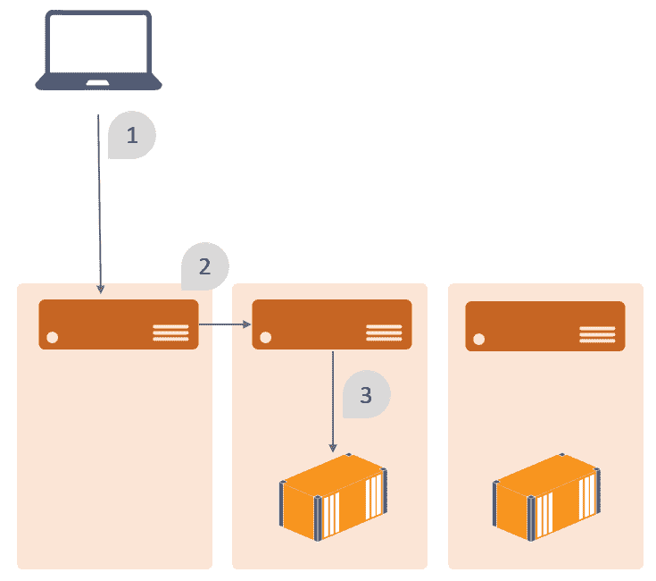
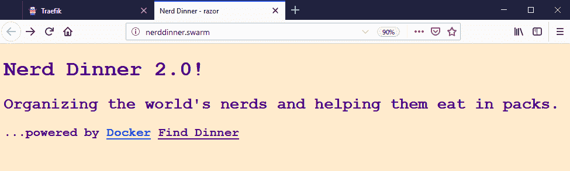

# 用 Docker Swarm 编排分布式解决方案

您可以在单台电脑上运行 Docker，这是我在本书中到目前为止所做的，这也是您在开发和基本测试环境中使用 Docker 的方式。在更高级的测试环境和生产环境中，单一服务器并不适合。为了实现高可用性并让您能够灵活地扩展解决方案，您需要多个服务器作为一个集群运行。Docker 平台内置了集群支持，您可以使用 Docker Swarm 模式将多个 Docker 主机连接在一起。

到目前为止，您所学到的所有概念(映像、容器、注册表、网络、卷和服务)仍然适用于集群模式。Docker Swarm 是一个编排层。它提供了与独立的 Docker 引擎相同的应用编程接口，并具有管理分布式计算各方面的附加功能。当您在集群模式下运行服务时，Docker 会确定在哪些主机上运行容器；它管理不同主机上的容器之间的安全通信，并监视主机。如果集群中的服务器出现故障，Docker 会安排它正在运行的容器在不同的主机上启动，以保持应用的服务级别。

自 2015 年发布 1.12 版本以来，Swarm 模式已在 Docker 中可用，并提供了经过生产强化的企业级服务编排。群中的所有通信都由相互的 TLS 保护，因此节点之间的网络流量总是加密的。您可以在集群中安全地存储应用机密，Docker 只将它们呈现给那些需要访问的容器。集群是可扩展的，因此您可以轻松添加节点以增加容量或删除节点以进行维护。Docker 还可以在 swarm 模式下运行自动滚动服务更新，因此您可以在零宕机的情况下升级应用。

在本章中，我将设置一个 Docker Swarm 并在多个节点上运行 NerdDinner。我将从创建单个服务开始，然后从一个合成文件开始部署整个栈。您将了解到:

*   创建群并管理节点
*   以集群模式创建和管理服务
*   在 Docker Swarm 中管理应用配置
*   向Docker群部署栈
*   零停机时间部署更新

# 技术要求

您将需要在 Windows 10 更新 18.09 或 Windows Server 2019 上运行 Docker 来完成示例。本章代码可在[https://github . com/sixed/docker-on-window/tree/第二版/ch07](https://github.com/sixeyed/docker-on-windows/tree/second-edition/ch07) 获得

# 创建群并管理节点

Docker Swarm 模式使用经理-员工架构，为经理和员工提供高可用性。管理器面向管理员，您使用活动管理器来管理集群和集群上运行的资源。工作人员面向用户，他们为您的应用服务运行容器。

群管理器还可以为您的应用运行容器，这在管理人员-工作人员架构中是不常见的。管理一个小型集群的开销相对较低，因此如果您有 10 个节点，其中 3 个是管理器，管理器也可以运行一部分应用工作负载(但是在生产环境中，如果您在管理器上运行大量应用工作负载，您需要意识到让管理器缺乏计算的风险)。

您可以在同一个群集中混合使用 Windows 和 Linux 节点，这是管理混合工作负载的好方法。建议您让所有节点运行相同版本的 Docker，但它可以是 Docker CE 或 Docker Enterprise—Docker Swarm 功能内置于核心 Docker 引擎中。

Many enterprises running Docker in production have a swarm with Linux nodes as the managers, and a mixture of Windows and Linux nodes as the workers. That means you can run Windows and Linux apps in containers in a single cluster, using the least-cost option for the node operating system.

# 初始化群

蜂群几乎可以是任何大小。您可以在笔记本电脑上运行单节点集群来测试功能，并且可以扩展到数千个节点。首先用`docker swarm init`命令初始化集群:

```
> docker swarm init --listen-addr 192.168.2.214 --advertise-addr 192.168.2.214
Swarm initialized: current node (jea4p57ajjalioqokvmu82q6y) is now a manager.

To add a worker to this swarm, run the following command:

    docker swarm join --token SWMTKN-1-37p6ufk5jku6tndotqlcy1w54grx5tvxb3rxphj8xkdn9lbeml-3w7e8hxfzzpt2fbf340d8phia 192.168.2.214:2377

To add a manager to this swarm, run 'docker swarm join-token manager' and follow the instructions.
```

这将创建一个具有单个节点的集群，即您运行命令的 Docker 引擎，该节点将成为集群管理器。我的机器有多个 IP 地址，所以我指定了`listen-addr`和`advertise-addr`选项，告诉 Docker 使用哪个网络接口进行集群通信。始终指定 IP 地址并为管理器节点使用静态地址是一种很好的做法。

You can keep your swarm secure using an internal private network for the swarm traffic, so that communication is not on the public network. You can even keep your managers off the public network completely. Only worker nodes with public-facing workloads need to be connected to the public network in addition to the internal network - and you can even avoid that if you're using a load-balancer as the public entrypoint to your infrastructure.

# 向群体中添加工人

`docker swarm init`的输出告诉你如何通过加入其他节点来扩大群体。节点只能属于一个群，要加入，需要使用加入令牌。如果网络遭到破坏，令牌会阻止流氓节点加入您的群，因此您需要将其视为安全的机密。节点可以作为工作人员或管理人员加入，每个节点都有不同的令牌。您可以使用`docker swarm join-token`命令查看和旋转令牌。

在运行相同版本 Docker 的第二台机器上，我可以运行`swarm join`命令加入群:

```
> docker swarm join `
   --token SWMTKN-1-37p6ufk5jku6tndotqlcy1w54grx5tvxb3rxphj8xkdn9lbeml-3w7e8hxfzzpt2fbf340d8phia `
   192.168.2.214:2377 
This node joined a swarm as a worker.
```

现在，我的 Docker 主机正在群集模式下运行，当我连接到管理器节点时，有更多的命令可供我使用。`docker node`命令管理群中的节点，所以我可以列出群中的所有节点，并通过`docker node ls`查看它们的当前状态:

```
> docker node ls
ID    HOSTNAME    STATUS   AVAILABILITY  MANAGER STATUS  ENGINE VERSION
h2ripnp8hvtydewpf5h62ja7u  win2019-02      Ready Active         18.09.2
jea4p57ajjalioqokvmu82q6y * win2019-dev-02 Ready Active Leader  18.09.2
```

`STATUS`值告诉你该节点在群中是否在线，`AVAILABILITY`值告诉你该节点是否能够运行容器。`MANAGER STATUS`字段有三个选项:

*   `Leader`:控制蜂群的主动管理者。
*   `Reachable`:备份管理器；如果现任领导人下台，它可以成为领导人。
*   `No value`:一个工作节点。

多个管理器支持高可用性。Docker Swarm 使用 Raft 协议来选举一个新的领导者，如果当前的领导者丢失了，那么有奇数个经理，你的 Swarm 可以在硬件故障中存活。对于生产，您应该有三个管理器节点，这是您所需要的，即使对于有数百个工作器节点的大型集群也是如此。

工作节点不会自动升级为管理人员，因此如果您的所有管理人员都丢失了，那么您将无法管理群。在这种情况下，工作节点上的容器继续运行，但是没有管理器来监视工作节点或您正在运行的服务。

# 提升和移除群节点

可以用`docker node promote`将工人节点做成经理，用`docker node demote`将经理节点做成工人；这些是您在管理器节点上运行的命令。

要离开群集，您需要在节点本身上运行`docker swarm leave`命令:

```
> docker swarm leave
Node left the swarm.
```

如果您有单节点集群，您可以使用相同的命令退出集群模式，但是您需要使用`--force`标志，因为这有效地将您从集群模式切换回单 Docker Engine 模式。

`docker swarm`和`docker node`命令管理群体。当您在集群模式下运行时，可以使用特定于集群的命令来管理容器工作负载。

You will see references to *Docker Swarm* and *swarm mode*. Technically, they are different things. Docker Swarm was an early orchestrator that was later built into the Docker Engine as swarm mode. The *classic* Docker Swarm only ran on Linux, so when you're talking about swarm with Windows nodes, it's always swarm mode—but it's usually called Docker Swarm.

# 在云端运行Docker群

Docker 有一组最少的基础设施需求，因此您可以轻松地在任何云中启动 Docker 主机或集群 Docker Swarm。要大规模运行 Windows 容器，您所需要的只是运行 Windows Server 虚拟机并在网络上连接它们的能力。

云是运行 Docker 的好地方，Docker 是迁移到云的好方法。Docker 为您提供了现代应用平台的力量，不受**平台即服务** ( **PaaS** )产品的限制。PaaS 选项通常有专有的部署系统，在您的代码中有专有的集成，开发人员体验不会使用相同的运行时。

Docker 允许您以可移植的方式打包您的应用并定义您的解决方案结构，该方式将在任何机器和任何云上以相同的方式运行。您可以使用基本的**基础设施即服务** ( **IaaS** )服务，所有云提供商都支持这些服务，并且在每个环境中都有一致的部署、管理和运行时体验。

The major clouds also provide managed container services, but these have centralized on Kubernetes—AKS on Azure, EKS on Amazon Web Services, and GKE on Google Cloud. At the time of writing, they're all 100% Linux offerings. Windows support for Kubernetes is being actively worked on, and the cloud services will begin to offer Windows once it's supported, but Kubernetes is a far more complex orchestrator than swarm, and I won't cover it here.

在云中部署 Docker Swarm 最简单的方法之一是使用 Terraform，这是一种强大的基础设施即代码技术，通常比云提供商自己的模板语言或脚本工具更容易使用。通过几十行配置，您可以为管理节点和工作节点定义虚拟机，以及网络设置、负载平衡器和您需要的任何其他服务。

# Docker认证基础设施

Docker 使用 Terraform 为 **Docker 认证基础架构** ( **DCI** )提供动力，这是一个在主要云提供商和主要内部虚拟化工具上部署 Docker Enterprise 的单一工具。它使用每个提供商的相关服务来设置 Docker 企业平台的企业级部署，包括通用控制平面和 Docker 可信注册中心。

DCI 在 Docker 的一系列参考架构指南中有详细介绍，可在 **Docker 成功中心**([https://success.docker.com](https://success.docker.com))上获得。在该网站上添加书签是值得的——您还可以找到关于传统应用现代化的优秀指南，以及在容器中记录、监控、存储和联网的最佳实践文档。

# 以集群模式创建和管理服务

在前一章中，您看到了如何使用 Docker Compose 来组织分布式解决方案。在合成文件中，您将应用的各个部分定义为使用网络将它们连接在一起的服务。集群模式中使用了相同的 Docker Compose 文件格式和相同的服务概念。在集群模式下，组成服务的容器被称为**副本**。您使用 Docker 命令行在群上创建服务，群管理器创建在群节点上作为容器运行的副本。

我将通过创建服务来部署 NerdDinner 栈。所有服务都将在我的集群上的同一个 Docker 网络中运行。在集群模式下，Docker 有一种特殊类型的网络，称为**覆盖网络**。覆盖网络是跨越多个物理主机的虚拟网络，因此运行在一个群节点上的容器可以到达运行在另一个节点上的容器。服务发现的工作方式是一样的:容器通过服务名称相互访问，Docker 的 DNS 服务器将它们指向一个容器。

要创建覆盖网络，您需要指定要使用的驱动程序，并为网络命名。Docker CLI 返回新网络的标识，就像它返回其他资源一样:

```
> docker network create --driver overlay nd-swarm
206teuqo1v14m3o88p99jklrn
```

您可以列出网络，您将看到新网络使用覆盖驱动程序，并且范围是群，这意味着使用该网络的任何容器都可以相互通信，无论它们运行在哪个节点上:

```
> docker network ls
NETWORK ID          NAME                DRIVER              SCOPE
osuduab0ge73        ingress             overlay             swarm
5176f181eee8        nat                 nat                 local
206teuqo1v14        nd-swarm            overlay             swarm
```

The output here also shows the default `nat` network, which has a local scope, so containers can only reach one another on the same host. There's another network created in swarm mode called `ingress`, which is the default network for services created with published ports.

我将把新网络用于 NerdDinner 服务，因为这将把我的应用与群中使用自己网络的其他应用隔离开来。在本章的后面，我将使用 Docker Compose 文件来部署整个解决方案，但是我将从使用`docker service create`命令手动创建服务开始，这样您就可以看到服务与容器有什么不同。这是如何在 Docker Swarm 中将 NATS 消息队列部署为服务:

```
docker service create `
 --network nd-swarm `
 --name message-queue `
 dockeronwindows/ch05-nats:2e 
```

除了映像名称之外，`docker service create`没有必需的选项，但是对于分布式应用，您需要指定以下内容:

*   `network`:连接到服务容器的 Docker 网络
*   `name`:用作其他组件的 DNS 条目的服务名

Docker supports different types of DNS resolution for containers. The default is Virtual IP `vip` mode, which you should use because it's the most performant. `vip` mode is only supported from Windows Server 2019, so for earlier versions you will see examples where the endpoint mode is set to `dnsrr`. That's DNS round-robin mode, which is less efficient and can cause issues when clients cache DNS responses, so avoid it, unless you have to work with containers on Windows Server 2016.

您可以从连接到集群管理器的 Docker 命令行界面运行`service create`命令。管理器查看群集中的所有节点，并确定哪些节点有能力运行副本，然后安排任务在节点上创建为容器。默认的副本级别是的*到*的*，所以这个命令只是创建了一个容器——但是它可以在群中的任何节点上运行。*

`docker service ps`显示运行服务的副本，包括托管每个容器的节点的名称:

```
> docker service ps message-queue
ID    NAME      IMAGE     NODE  DESIRED  STATE  CURRENT    STATE
xr2vyzhtlpn5 message-queue.1  dockeronwindows/ch05-nats:2e  win2019-02  Running        Running
```

在这种情况下，管理器已经安排了一个容器在节点`win2019-02`上运行，这是我的群集中的单个工作节点。如果我直接在该节点上运行 Docker 容器，看起来会得到相同的结果，但是作为 Docker Swarm 服务运行它会给我带来编排的所有额外好处:

*   **应用可靠性**:如果这个容器停止，管理者会安排一个替换立即开始。
*   **基础设施可靠性**:如果工作节点发生故障，管理器将调度一个新的容器在不同的节点上运行。
*   **可发现性**:这个容器附着在一个覆盖网络上，所以它可以使用服务名与其他节点上运行的容器进行通信(Windows 容器甚至可以与同一个群中的 Linux 容器进行对话，反之亦然)。

在 Docker Swarm 中运行服务比在单个 Docker 服务器上运行容器有更多的好处，包括安全性、可伸缩性和可靠的应用更新。我将在这一章中涵盖它们。

在源代码库中，`ch07-create-services`文件夹有一个脚本，它以正确的顺序启动 NerdDinner 的所有服务。每个`service create`命令的选项相当于[第 6 章](06.html)、*用 Docker Compose* 组织分布式解决方案的 Compose 文件中的服务定义。前端服务和 Traefik 反向代理之间只有一些不同。

Traefik 在 Docker Swarm 中运行良好——它连接到 Docker API 来构建其前端路由映射，并以与在运行 Docker Engine 的单个服务器上完全相同的方式代理来自后端容器的内容。要在群集模式下向 Traefik 注册服务，您还需要告诉 Traefik 容器中的应用正在使用哪个端口，因为它自己无法确定。REST API 服务定义增加了`traefik.port`标签:

```
docker service create `
 --network nd-swarm `
 --env-file db-credentials.env `
 --name nerd-dinner-api `
 --label "traefik.frontend.rule=Host:api.nerddinner.swarm" `
 --label "traefik.port=80" `
 dockeronwindows/ch05-nerd-dinner-api:2e
```

Traefik 本身是最复杂的创建服务，在 swarm 模式下有几个额外的选项:

```
docker service create `
 --detach=true `
 --network nd-swarm `
 --constraint=node.role==manager `
 --publish 80:80 --publish 8080:8080 `
 --mount type=bind,source=C:\certs\client,target=C:\certs `
 --name reverse-proxy `
 sixeyed/traefik:v1.7.8-windowsservercore-ltsc2019 `
 --docker --docker.swarmMode --docker.watch `
 --docker.endpoint=tcp://win2019-dev-02:2376 `
 --docker.tls.ca=/certs/ca.pem `
 --docker.tls.cert=/certs/cert.pem `
 --docker.tls.key=/certs/key.pem `
 --api
```

您只能从管理器节点上运行的 Docker API 获取有关集群服务的信息，这就是为什么您需要将 Docker CLI 连接到管理器来使用集群资源。服务的`constraint`选项确保 Docker 将只调度容器在满足约束的节点上运行。在这种情况下，服务副本将仅在管理器节点上运行。这不是唯一的选择-如果您已经配置了对 Docker API 的安全远程访问，您可以在工作节点上运行 Traefik。

为了将 Traefik 连接到 Docker API，我之前使用了一个卷来挂载名为*管道*的窗口，但是 Docker Swarm 还不支持这个特性。因此，相反，我使用一个到应用编程接口的 TCP 连接，指定管理器的域名`win2019-dev-02`。我已经用 TLS 保护了我的 Docker 引擎(正如我在[第 1 章](01.html)、*中解释的那样)在 Windows 上开始使用 Docker*，因此我还提供了客户端证书来安全地使用连接。证书存储在我的管理器节点`C:\certs\client`中，我将其作为容器内的一个目录挂载。

*Named pipe support for service mounts* means you can use the approach of mounting the pipe, which is much easier, as you don't need to specify the host name of the manager, or supply the TLS certificates. That feature is planned for Docker 19.03, and will probably be available by the time you read this book. The great thing about Docker is that it's built from open source components, so features such as this are all discussed in the open—[https://github.com/moby/moby/issues/34795](https://github.com/moby/moby/issues/34795) will tell you the background and the current status.

当我在我的集群上运行脚本时，我得到一个服务标识列表作为输出:

```
> .\ch07-run-nerd-dinner.ps1
206teuqo1v14m3o88p99jklrn
vqnncr7c9ni75ntiwajcg05ym
2pzc8c5rahn25l7we3bzqkqfo
44xsmox6d8m480sok0l4b6d80
u0uhwiakbdf6j6yemuy6ey66p
v9ujwac67u49yenxk1albw4bt
s30phoip8ucfja45th5olea48
24ivvj205dti51jsigneq3z8q
beakbbv67shh0jhtolr35vg9r
sc2yzqvf42z4l88d3w31ojp1c
vx3zyxx2rubehee9p0bov4jio
rl5irw1w933tz9b5cmxyyrthn
```

现在我可以用`docker service ls`看到所有正在运行的服务:

```
> docker service ls
ID           NAME          MODE       REPLICAS            IMAGE 
8bme2svun122 message-queue             replicated 1/1      nats:nanoserver
deevh117z4jg nerd-dinner-homepage      replicated 1/1      dockeronwindows/ch03-nerd-dinner-homepage...
lxwfb5s9erq6 nerd-dinner-db            replicated 1/1      dockeronwindows/ch06-nerd-dinner-db:latest
ol7u97cpwdcn nerd-dinner-index-handler replicated 1/1      dockeronwindows/ch05-nerd-dinner-index...
rrgn4n3pecgf elasticsearch             replicated 1/1      sixeyed/elasticsearch:nanoserver
w7d7svtq2k5k nerd-dinner-save-handler  replicated 1/1      dockeronwindows/ch05-nerd-dinner-save...
ydzb1z1af88g nerd-dinner-web           replicated 1/1      dockeronwindows/ch05-nerd-dinner-web:latest
ywrz3ecxvkii kibana                    replicated 1/1      sixeyed/kibana:nanoserver
```

每个服务都被列为副本状态为`1/1`，这意味着一个副本的请求服务级别已用完。这是用于运行服务的容器数量。Swarm 模式支持两种类型的分布式服务:复制服务和全局服务。默认情况下，分布式服务只有一个副本，这意味着群集中有一个容器。我的脚本中的`service create`命令没有指定副本数量，所以它们都使用默认的*1*。

# 跨多个容器运行服务

复制服务是您在群集模式下扩展的方式，您可以更新正在运行的服务以添加或删除容器。与 Docker Compose 不同，您不需要定义每个服务所需状态的 Compose 文件；从`docker service create`命令开始，该细节已经存储在群中。要添加更多的消息处理程序，我使用`docker service scale`，传递一个或多个服务的名称和所需的服务级别:

```
> docker service scale nerd-dinner-save-handler=3
nerd-dinner-save-handler scaled to 3
overall progress: 1 out of 3 tasks
1/3: starting  [============================================>      ]
2/3: starting  [============================================>      ]
3/3: running   [==================================================>]
```

消息处理程序服务是用默认的单个副本创建的，因此这又增加了两个容器来共享 SQL Server 处理程序服务的工作。在多节点群中，管理器可以安排容器在任何有容量的节点上运行。我不需要知道或者关心哪个服务器实际上在运行容器，但是我可以通过`docker service ps`深入到服务列表中查看容器运行的位置:

```
> docker service ps nerd-dinner-save-handler
ID      NAME    IMAGE  NODE            DESIRED STATE  CURRENT STATE 
sbt4c2jof0h2  nerd-dinner-save-handler.1 dockeronwindows/ch05-nerd-dinner-save-handler:2e    win2019-dev-02      Running             Running 23 minutes ago
bibmh984gdr9  nerd-dinner-save-handler.2 dockeronwindows/ch05-nerd-dinner-save-handler:2e    win2019-dev-02      Running             Running 3 minutes ago
3lkz3if1vf8d  nerd-dinner-save-handler.3 dockeronwindows/ch05-nerd-dinner-save-handler:2e   win2019-02           Running             Running 3 minutes ago
```

在这种情况下，我运行的是一个双节点群，副本在节点`win2019-dev-02`和`win2019-02`之间分割。Swarm 模式将服务过程称为副本，但它们实际上只是容器。您可以像往常一样，使用相同的`docker ps`、`docker logs`和`docker top`命令登录群的节点并管理服务容器。

通常，你不会这么做。运行副本的节点只是群为你管理的黑盒；您通过管理器节点使用您的服务。正如 Docker Compose 提供了一个服务日志的统一视图一样，您可以从连接到集群管理器的 Docker CLI 中获得相同的视图:

```
PS> docker service logs nerd-dinner-save-handler
nerd-dinner-save-handler.1.sbt4c2jof0h2@win2019-dev-02
    | Connecting to message queue url: nats://message-queue:4222
nerd-dinner-save-handler.1.sbt4c2jof0h2@win2019-dev-02
    | Listening on subject: events.dinner.created, queue: save-dinner-handler
nerd-dinner-save-handler.2.bibmh984gdr9@win2019-dev-02
    | Connecting to message queue url: nats://message-queue:4222
nerd-dinner-save-handler.2.bibmh984gdr9@win2019-dev-02
    | Listening on subject: events.dinner.created, queue: save-dinner-handler
...
```

副本是群如何为服务提供容错的。当您使用`docker service create`、`docker service update`或`docker service scale`命令指定服务的副本级别时，该值会记录在群中。管理器节点监控服务的所有任务。如果容器停止，并且正在运行的服务数量低于所需的副本级别，则计划新任务来替换停止的容器。在本章的后面，我将演示当我在多节点群上运行相同的解决方案时，我可以从群中取出一个节点，而不会导致任何服务损失。

# 全球服务

复制服务的替代方案是**全球服务**。在某些情况下，您可能希望群的每个节点上运行的服务与每个服务器上的单个容器相同。为此，您可以在全局模式下运行服务—Docker 在每个节点上恰好调度一个任务，任何加入的新节点也将有一个任务被调度。

全局服务对于许多服务使用的组件的高可用性非常有用，但是，同样，您不能仅仅通过运行许多集群应用的实例来获得集群应用。NATS 消息队列可以作为跨多个服务器的集群运行，并且它可能是作为全局服务运行的一个很好的候选。但是，要将 NATS 作为一个集群运行，每个实例都需要知道其他实例的地址，这对于 Docker Engine 分配的动态虚拟 IP 地址来说效果并不好。

相反，我可以将我的弹性搜索消息处理程序作为一个全局服务来运行，这样每个节点都将有一个消息处理程序的实例在运行。您不能更改正在运行的服务的模式，因此，首先，我需要删除原始服务:

```
> docker service rm nerd-dinner-index-handler
nerd-dinner-index-handler 
```

然后，我可以创建一个新的全球服务:

```
> docker service create `
>>  --mode=global `
>>  --network nd-swarm `
>>  --name nerd-dinner-index-handler `
>>  dockeronwindows/ch05-nerd-dinner-index-handler:2e;
q0c20sx5y25xxf0xqu5khylh7
overall progress: 2 out of 2 tasks
h2ripnp8hvty: running   [==================================================>]
jea4p57ajjal: running   [==================================================>]
verify: Service converged 
```

现在，我在群集中的每个节点上运行一个任务，如果将节点添加到群集中，任务总数将会增加，如果删除节点，任务总数将会减少。这对于您希望为容错而分发的服务非常有用，并且您希望服务的总容量与集群的大小成比例。

全球服务在监控和审计功能中也很有用。如果您有一个集中式监控系统，如 Splunk，或者您正在使用 Elasticsearch Beats 进行基础架构数据捕获，您可以在每个节点上运行一个代理作为全局服务。

借助全局和复制服务，Docker Swarm 提供了扩展应用和维护特定服务级别的基础架构。如果您有固定大小的群，但工作负载可变，这对于内部部署非常有效。您可以上下扩展应用组件来满足需求，前提是它们不都需要同时进行峰值处理。您在云中拥有更大的灵活性，只需向群集中添加新节点，就可以增加集群的总容量，从而使您能够更广泛地扩展应用服务。

跨多个实例大规模运行应用通常会增加复杂性—您需要有一种注册所有活动实例的方法，一种在它们之间分担负载的方法，以及一种监控所有实例的方法，以便在任何实例出现故障时，它们不会收到任何负载。这都是 Docker Swarm 的内置功能，它透明地提供服务发现、负载平衡、容错和自愈应用的基础架构。

# 集群模式下的负载平衡和扩展

Docker 使用 DNS 进行服务发现，因此容器可以通过标准网络找到彼此。应用在其客户端连接配置中使用服务器名称，当应用进行 DNS 查询以找到目标时，Docker 会用容器的 IP 地址进行响应。在 Docker Swarm 中也是如此，当您的目标**服务器**名称实际上可能是一个 Docker 服务的名称，该服务在集群中运行着几十个副本。

Docker 有两种方法来响应管理具有多个副本的服务的 DNS。默认使用 **VIP** :一个**虚拟 IP 地址**。Docker 为服务使用单个 IP 地址，并依靠主机操作系统中的网络栈将 VIP 上的请求路由到实际的容器。VIP 负责负载平衡和健康。服务中的所有健康容器共享请求。这个功能在 Linux 中已经建立很久了，并且是 Windows Server 2019 的新功能。

VIP 的替代方案是**DNS SRR**:**DNS 循环**，您可以在服务配置中的`endpoint_mode`设置中指定。DNSRR 返回服务中所有健康容器的 IP 地址列表，列表的顺序被轮换以提供负载平衡。在 Server 2019 之前，DNSRR 是 Windows 容器的唯一选项，您将在许多示例中看到它，但 VIP 是更好的选项。客户端倾向于缓存域名系统查询响应。使用 DNSRR，您可以更新服务并发现客户端缓存了已被替换的旧容器的 IP 地址，因此它们的连接失败。VIP 不会发生这种情况，因为在域名系统响应中只有一个 IP 地址，客户端可以安全地缓存它，因为它总是会路由到一个健康的容器。

Docker Swarm 负责服务副本之间的负载平衡网络流量，但它也对进入 Swarm 的外部流量进行负载平衡。在新的 NerdDinner 架构中，只有一个组件是可公开访问的——即 **Traefik 反向代理**。我们知道一个端口只能由机器上的一个进程使用，所以这应该意味着我们只能将代理服务扩展到集群中每个节点最多一个容器。但是 Docker Swarm 允许我们过度或不足地提供服务，对零个或多个副本使用机器上的同一个端口。

当您发布端口时，附加到覆盖网络的群服务的行为与标准容器不同。群中的每个节点都监听发布的端口，当收到流量时，它会被定向到一个健康的容器。该容器可以在接收请求的节点上运行，也可以在不同的节点上运行。

在本例中，客户端在标准端口`80`上为在 Docker Swarm 中运行的服务发出 HTTP GET 请求:



1.  客户端请求到达没有运行任何服务副本的节点。节点没有监听端口`80`的容器，因此无法直接处理请求。
2.  接收节点将请求转发到群中的另一个节点，该节点有一个容器在端口`80`上侦听——这对于原始客户端来说都是不可见的。
3.  新节点将请求转发到正在运行的容器，容器处理请求并发送响应。

这就是所谓的**入口联网**，这是一个极其强大的功能。这意味着您可以在大型集群上运行低规模服务，或者在小型集群上运行高规模服务，它们将以相同的方式工作。如果服务运行的副本比集群中的节点少，这不是问题，因为 Docker 会透明地将请求发送到另一个节点。如果服务运行的副本比节点多，这不是问题，因为每个节点都可以处理请求，Docker 会在节点上的容器之间负载平衡流量。

Networking in Docker Swarm is a topic that's worth understanding in detail, because it will help you design and deliver scaleable and resilient systems. I have authored a Pluralsight course called **Managing Load Balancing and Scale in Docker Swarm Mode Clusters** that covers all the key topics for Linux and Windows containers.

负载平衡和服务发现都基于健康的容器，这是一个 Docker Swarm 特性，不需要我进行任何特殊的设置。在覆盖网络上以群集模式运行的服务默认为贵宾服务发现和发布端口的入口网络。当我在 Docker Swarm 中运行 NerdDinner 时，我不需要对我的部署进行任何更改来获得生产环境中的高可用性和可扩展性，并且我可以专注于我自己的应用的配置。

# 在 Docker Swarm 中管理应用配置

我花了一些时间在[第 5 章](05.html)、*采用容器优先的解决方案设计*中，在我的 Docker 映像中为 NerdDinner 栈构建了一个灵活的配置系统。其核心原则是将开发的默认配置捆绑到每个映像中，但允许在运行容器时覆盖设置。这意味着我们将在每个环境中使用相同的 Docker 映像，只是交换配置设置来改变行为。

这适用于单个 Docker 引擎，其中我可以使用环境变量来覆盖单个设置和卷装载，以替换整个配置文件。在 Docker Swarm 中，您可以通过配置做更多的事情——使用 Docker 配置对象和 Docker 机密将数据存储在可以传递给容器的群中。这是一种比使用环境变量和文件更整洁的处理配置和敏感数据的方式，但这意味着我仍然在每个环境中使用相同的 Docker 映像。

# 将配置存储在 Docker 配置对象中

群模式中有几个新资源，除了节点和服务，还有栈、机密和配置。配置对象只是在集群中创建的文本文件，并且作为服务容器中的文件出现。它们是管理配置设置的好方法，因为它们为您提供了一个存储所有应用设置的单一位置。

您可以通过两种方式使用配置对象。您可以使用`docker config`命令创建和管理它们，并使它们对 Docker 服务命令和 Docker 编写文件中的服务可用。这种清晰的分离意味着您的应用定义与您的配置是分离的——定义在任何地方都是相同的，并且配置是由 Docker 从环境中加载的。

Docker 在您指定的路径上将配置对象作为文本文件显示在容器中，因此群中可能会有一个名为`my-app-config`的机密显示为`C:\my-app\config\appSettings.config`。Docker 不关心文件内容，所以它可以是 XML、JSON、键值对或其他任何东西。由您的应用来实际处理该文件，这可以是将完整的文件用作配置，或者将文件内容与烘焙到 Docker 映像中的一些默认配置合并。

在我的尼尔丁纳现代化中，我已经搬到了。NET 核心配置框架为我的应用设置。我在所有的中使用相同的`Config`类。NET 框架和。构成网络的核心应用。`Config`类为配置提供程序添加自定义文件位置:

```
public static IConfigurationBuilder AddProviders(IConfigurationBuilder config)
{
  return config.AddJsonFile("config/appsettings.json")
               .AddEnvironmentVariables()
               .AddJsonFile("config/config.json", optional: true)
               .AddJsonFile("config/secrets.json", optional: true);
} 

```

配置提供程序按优先级的逆序列出。首先，它们是从作为应用映像一部分的`config/appsettings.json`文件中加载的。然后，任何环境变量都将被合并进来—添加新的键，或者替换现有键的值。接下来，如果一个文件存在于路径`config/config.json`中，它的内容将被合并——覆盖任何现有的设置。最后，如果一个文件存在于`config/secrets.json`中，那么它的值将被合并。

这个模式允许我使用配置源的层次结构。应用的默认值都显示在 Docker 映像中。在运行时，用户可以用环境变量或环境变量文件指定覆盖，这对于在单个 Docker 主机上工作的开发人员来说很容易。在集群环境中，部署可以使用 Docker 配置对象和机密，它们会覆盖默认值和任何环境变量。

举个简单的例子，我可以为新的 REST API 更改日志记录级别。在 Docker 映像的`appsettings.json`文件中，记录级别被设置为`Warning`。该应用会在每次有`GET`请求时写入信息级日志，因此如果我在配置中更改日志级别，我将能够看到这些日志条目。

我在名为`nerd-dinner-api-config.json`的文件中有我想要使用的设置:

```
{
 "Logging": {
  "LogLevel": {
   "Default": "Information"
  } 
 }
}
```

首先，我需要将它作为配置对象存储在群中，这样容器就不需要访问原始文件。我用`docker config create`来做，给对象一个名称和配置源的路径:

```
docker config create nerd-dinner-api-config .\configs\nerd-dinner-api-config.json
```

您只需要在创建配置对象时访问该文件。现在数据存储在群中。群中的任何节点都可以获取配置数据并将其提供给容器，任何能够访问 Docker Engine 的人都可以看到配置数据，而不需要那个源文件。`docker config inspect`显示配置对象的内容:

```
> docker config inspect --pretty nerd-dinner-api-config
ID:                     yongm92k597gxfsn3q0yhnvtb
Name:                   nerd-dinner-api-config
Created at:             2019-02-13 22:09:04.3214402 +0000 utc
Updated at:             2019-02-13 22:09:04.3214402 +0000 utc
Data:
{
 "Logging": {
 "LogLevel": {
 "Default": "Information"
    }
 }
}
```

You can see the plain-text value of the config object by inspecting it. This is great for troubleshooting application issues, but bad for security—you should always use Docker secrets for sensitive configuration values, never config objects.

# 在集群服务中使用 Docker 配置对象

当您创建服务时，您可以使用`--config`选项使配置对象对容器可用。然后，您应该能够在应用中直接使用它们，但是可能会有一个陷阱。当配置对象作为文件呈现给容器时，它们是安全的，因此只有管理帐户可以读取它们。如果您的应用以最低特权用户的身份运行，它可以看到配置文件，但不能读取它。这是一项安全功能，旨在当有人获得对容器中文件系统的访问权限时，保护您的配置文件的安全。

这在 Linux 容器中是不同的，在 Linux 容器中，您可以指定在容器中拥有文件所有权的用户的 ID，这样您就可以给特权最低的帐户访问文件的权限。Windows 容器不支持该功能，但是 Windows 容器正在演变为与 Linux 容器一起完成功能，因此这应该会在未来的版本中出现。在编写时，要使用配置对象，应用需要以管理员帐户或具有本地系统访问权限的帐户运行。

Running your application with elevated permissions is not a good idea from a security perspective, but it is less of a concern when you run in a container. I cover this in [Chapter 9](09.html), *Understanding the Security Risks and Benefits of Docker*.

我已经从[第 5 章](05.html)、*采用容器优先解决方案设计*更新了 REST API 的 Dockerfile，以使用容器中的内置管理帐户:

```
# escape=`
FROM microsoft/dotnet:2.1-aspnetcore-runtime-nanoserver-1809

EXPOSE 80
WORKDIR /dinner-api
ENTRYPOINT ["dotnet", "NerdDinner.DinnerApi.dll"]
USER ContainerAdministrator

COPY --from=dockeronwindows/ch05-nerd-dinner-builder:2e C:\dinner-api .
```

改变的只是`USER`指令，它为 Dockerfile 的其余部分和容器启动设置了用户。代码完全一样:我还在使用[第 5 章](05.html)、*采用容器优先解决方案设计*中的构建器映像。我已经将这个新的映像构建为`dockeronwindows/ch07-nerd-dinner-api:2e`，我可以升级我正在运行的 API 服务，并使用`docker service update`应用新的配置:

```
docker service update `
 --config-add src=nerd-dinner-api-config,target=C:\dinner-api\config\config.json `
 --image dockeronwindows/ch07-nerd-dinner-api:2e `
 nerd-dinner-api;
```

更新服务会用新配置替换正在运行的副本，在这种情况下，使用新映像并应用配置对象。现在，当我向 REST API 发出`GET`请求时，它正在信息级别进行记录，我可以在服务日志中看到更多细节:

```
> docker service logs nerd-dinner-api
nerd-dinner-api.1.cjurm8tg1lmj@win2019-02    | Hosting environment: Production
nerd-dinner-api.1.cjurm8tg1lmj@win2019-02    | Content root path: C:\dinner-api
nerd-dinner-api.1.cjurm8tg1lmj@win2019-02    | Now listening on: http://[::]:80
nerd-dinner-api.1.cjurm8tg1lmj@win2019-02    | Application started. Press Ctrl+C to shut down.
nerd-dinner-api.1.cjurm8tg1lmj@win2019-02    | info: Microsoft.AspNetCore.Hosting.Internal.WebHost[1]
nerd-dinner-api.1.cjurm8tg1lmj@win2019-02    |       Request starting HTTP/1.1 GET http://api.nerddinner.swarm/api/dinners
nerd-dinner-api.1.cjurm8tg1lmj@win2019-02    | info: Microsoft.AspNetCore.Mvc.Internal.ControllerActionInvoker[1]
nerd-dinner-api.1.cjurm8tg1lmj@win2019-02    |       Route matched with {action = "Get", controller = "Dinners"}. Executing action NerdDinner.DinnerApi.Controllers.DinnersController.Get (NerdDinner.DinnerApi)
```

您可以将这种方法用于在不同环境之间变化的功能标志和行为设置。这是一种非常灵活的应用配置方法。使用单个 Docker Engine 的开发人员可以使用映像中的默认设置运行容器，或者用环境变量覆盖它们，或者通过装载本地卷来替换整个配置文件。在使用 Docker Swarm 的测试和生产环境中，管理员可以使用配置对象集中管理配置，仍然在每个环境中使用完全相同的 Docker 映像。

# 将敏感数据存储在 Docker 机密中

群体模式本质上是安全的。所有节点之间的通信都是加密的，群提供了分布在管理节点之间的加密数据存储。你可以用这个商店申请**机密**。机密的工作方式与配置对象完全相同——你在集群中创建它们，然后让它们对服务可用。不同的是，机密在群的数据存储中加密，并且在从管理器到工作节点的传输中加密。它只在运行副本的容器中解密，在那里它以文件的形式出现，就像配置对象一样。

机密是用名字和机密的内容创建的，可以从文件中读取或输入命令行。我将把我的敏感数据转移到机密中，从 SQL Server 管理员帐户密码开始。在`ch07-app-config`文件夹中，我有一个名为`secrets`的文件夹，其中包含数据库密码的机密文件。我将使用它在群中安全地存储密码，但是我需要对我的数据库映像做一些工作，然后它才能支持机密。

我在 Docker 映像`dockeronwindows/ch06-nerd-dinner-db`中打包了我最新的 SQL Server 数据库模式。该映像使用环境变量来设置管理员密码，这对开发人员来说很好，但在您想要限制访问的测试环境中就不好了。这一章我有一个新版本，有一个更新的 Dockerfile 和数据库的启动脚本，所以我可以从一个机密文件中读入密码。

在`ch07-nerd-dinner-db`的`InitializeDatabase.ps1`脚本中，我添加了一个名为`sa_password_path`的新参数和一些从文件中读取密码的简单逻辑(如果该路径中存在密码的话):

```
if ($sa_password_path -and (Test-Path $sa_password_path)) {
  $password = Get-Content -Raw $sa_password_path
  if ($password) {
    $sa_password = $password
    Write-Verbose "Using SA password from secret file: $sa_password_path"
}
```

This is a completely different approach to the one taken in the REST API. Applications have their own expectations about configuration, and you'll need to integrate that with Docker's approach of surfacing config data in files. In most cases, you can do it all in the Dockerfile, so you shouldn't need to change code to read config from a file directly.

Dockerfile 使用一个环境变量作为密码文件路径的默认值:

```
ENV sa_password_path="C:\secrets\sa-password"
```

这仍然支持运行数据库的不同方式。开发人员可以在不指定任何配置设置的情况下运行它，并且它将使用映像中内置的默认密码，这与应用映像的连接字符串中内置的默认密码相同。在集群环境中，管理员可以独立于部署应用和安全访问数据库容器来创建机密。

我需要创建密码，然后更新数据库服务以使用密码和应用密码的新映像:

```
docker secret create nerd-dinner-db-sa-password .\secrets\nerd-dinner-db-sa-password.txt;

docker service update `
 --secret-add src=nerd-dinner-db-sa-password,target=C:\secrets\sa-password `
 --image dockeronwindows/ch07-nerd-dinner-db:2e `
 nerd-dinner-db;
```

现在，数据库正在使用由 Docker Swarm 保护的强密码。能够访问 Docker 引擎的用户看不到机密的内容，因为它只能在明确使用机密的服务的容器中解密。我可以检查机密，但我只看到元数据:

```
> docker secret inspect --pretty nerd-dinner-db-sa-password
ID:              u2zsrjouhicjnn1fwo5x8jqpk
Name:              nerd-dinner-db-sa-password
Driver:
Created at:        2019-02-14 10:33:04.0575536 +0000 utc
Updated at:        2019-02-14 10:33:04.0575536 +0000 utc
```

现在我的应用坏了，因为我已经更新了数据库密码，而没有更新使用数据库的应用中的连接字符串。这就是通过向 Docker Swarm 发出命令来强制管理分布式应用的危险。相反，您应该以声明的方式管理您的应用，使用 Docker Compose 文件来定义所有服务和其他资源，并将它们部署为 Docker 栈。

# 向Docker群部署栈

Docker Swarm 中的栈解决了在单个主机上使用 Docker Compose 或在 Docker Swarm 上手动创建服务的局限性。您从一个合成文件创建一个栈，Docker 将栈服务的所有元数据存储在群中。这意味着 Docker 知道资源集代表一个应用，您可以从任何 Docker 客户端管理服务，而不需要编写文件。

一个*栈*是组成应用的所有对象的抽象。它包含服务、卷和网络，就像标准的 Docker Compose 文件一样，但它也支持 Docker Swarm 对象(配置和机密)以及用于大规模运行应用的附加部署设置。

Stacks can even abstract the orchestrator you're using. Docker Enterprise supports both Docker Swarm and Kubernetes on the same cluster, and you can deploy and manage applications as stacks to either orchestrator, using the simple Docker Compose format and the Docker CLI.

# 使用 Docker 编写文件定义栈

Docker Compose 文件模式已经从支持单个 Docker 主机上的客户端部署发展到跨 Docker Swarm 的栈部署。不同的属性集在不同的场景中是相关的，工具会强制执行这些属性集。Docker Compose 将忽略仅适用于栈部署的属性，Docker Swarm 将忽略仅适用于单节点部署的属性。

我可以利用多个合成文件来利用这一点，在一个文件中定义我的应用的基本设置，在一个覆盖文件中添加本地设置，在另一个覆盖文件中添加集群设置。我已经用`ch07-docker-compose`文件夹中的合成文件做到了这一点。`docker-compose.yml`中的核心服务定义现在非常简单——它们只包括适用于每种部署模式的属性。甚至 Traefik 的反向代理定义也很简单:

```
reverse-proxy:
 image: sixeyed/traefik:v1.7.8-windowsservercore-ltsc2019
 networks:
 - nd-net 

```

在`docker-compose.local.yml`覆盖文件中，我添加了在我的笔记本电脑上开发应用和使用 Docker Compose 进行部署时相关的属性。对于 Traefik，我需要配置要运行的命令以及要为 Docker Engine 命名管道发布和装载卷的端口:

```
reverse-proxy:
  command: --docker --docker.endpoint=npipe:////./pipe/docker_engine --api
 ports:
   - "80"
   - "8080"
 volumes:
   - type: npipe
     source: \\.\pipe\docker_engine
     target: \\.\pipe\docker_engine 

```

在`docker-compose.swarm.yml`覆盖文件中，当我在集群 Docker Swarm 环境中运行时，我有要应用的属性——这可能是测试中的两节点 Swarm 和生产中的 200 节点 Swarm；合成文件将是相同的。我设置了 Traefik 命令来使用 TCP 连接到群管理器，并且我使用机密来存储群中的 TLS 证书:

```
reverse-proxy:
  command: --docker --docker.swarmMode --docker.watch --docker.endpoint=tcp://win2019-dev-02:2376  
           --docker.tls.ca=/certs/ca.pem --docker.tls.cert=/certs/cert.pem ...
  ports:
    - "80:80"
    - "8080:8080"
  secrets:
    - source: docker-client-ca
      target: C:\certs\ca.pem
    - source: docker-client-cert
      target: C:\certs\cert.pem
    - source: docker-client-key
      target: C:\certs\key.pem
 deploy:
   placement:
     constraints:
       - node.role == manager
```

The only part of this application manifest that isn't portable is the DNS name of my swarm manager, `win2019-dev-02`. I explained in [Chapter 6](06.html), *Organizing Distributed Solutions with Docker Compose,* that you can't mount the named pipe in swarm mode yet, but it's coming soon. When that feature arrives, I can use the named pipe for Traefik in swarm mode in the same way as on a single Docker Engine, and my Compose files will work on any Docker cluster.

其余服务的模式是相同的:docker: `compose.yml`中有一个基本定义，本地文件中有一组针对开发人员的覆盖，swarm 文件中有一组替代覆盖。核心组合文件不能单独使用，因为它没有指定的所有配置，这与[第 6 章](06.html)、*用 Docker Compose 组织分布式解决方案、*不同，我的 Docker Compose 文件是为开发而设置的。您可以使用最适合您的方法，但是这种方法的优点是每个环境的设置都捕获在它自己的覆盖文件中。

有几个服务选项值得详细研究。REST 应用编程接口是在核心合成文件中定义的，只有映像和网络设置。本地覆盖添加了用于向代理注册 API 的标签，它还捕获了对数据库服务的依赖:

```
nerd-dinner-api:
  depends_on:
    - nerd-dinner-db
  labels:
    - "traefik.frontend.rule=Host:api.nerddinner.local"
```

群体模式不支持`depends_on`属性。当您部署一个栈时，不能保证服务将以哪种顺序启动。如果您的应用组件是有弹性的，并且有任何依赖关系的`retry`逻辑，那么服务启动顺序就无关紧要了。如果您的组件没有弹性，并且在无法访问依赖项时崩溃，那么 Docker 将重新启动失败的容器，并且应用应该在几次重试后准备好。

Resilience is often missing from legacy applications, which assume that their dependencies are always available and able to respond immediately. This is not the case if you move to cloud services, and this is also true of containers. Docker will keep replacing failed containers, but you can add resilience even to legacy apps by building startup checks and health checks into the Dockerfile.

群组定义增加了机密和配置设置，并且容器标签应用于 Traefik 的方式也有所不同:

```
nerd-dinner-api:
  configs:
    - source: nerd-dinner-api-config
      target: C:\dinner-api\config\config.json
  secrets:
    - source: nerd-dinner-api-secrets
      target: C:\dinner-api\config\secrets.json
  deploy:
    replicas: 2
    labels:
      - "traefik.frontend.rule=Host:api.nerddinner.swarm"
      - "traefik.port=80"

```

配置和机密仅在群集模式下适用，但您可以将它们包含在任何编写文件中—当您在单个 Docker 引擎上运行时，Docker 编写将忽略它们。`deploy`部分也仅用于集群模式，这捕获了副本的基础架构设置。这里，我的副本数为 2，这意味着群将为此服务运行两个容器。我在`deploy`部分也有 Traefik 的标签，确保标签贴在容器上，而不是服务本身。

Docker 使用标签来注释任何类型的对象—卷、节点、服务、机密、容器和任何其他 Docker 资源都可以添加或删除标签，它们在 Docker 引擎 API 中作为键值对公开。Traefik 只查找容器标签，这些标签在组合文件的`deploy`部分以群组模式应用。如果您在服务部分下直接有标签，那么它们会被添加到服务中，而不是容器中。在这种情况下，这意味着容器上没有标签，因此 Traefik 不会注册任何路线。

# 在 Docker 编写文件中定义群资源

在本章中，核心`docker-compose.yml`文件只包含一个`services`部分；没有指定其他资源。这是因为我的应用的资源在单个 Docker Engines 部署和 Docker Swarm 之间都是不同的。

本地覆盖文件使用现有的`nat`网络，并且它使用在 SQL Server 和 Elasticsearch 中使用的卷的默认规范:

```
networks:
  nd-net:
    external:
      name: nat

volumes:
  ch07-es-data:
  ch07-db-data:
```

群覆盖将所有服务连接到的同一个`nd-net`网络映射为名为`nd-swarm`的外部网络，在我部署该栈之前，该网络需要存在:

```
networks:
  nd-net:
    external:
      name: nd-swarm
```

群覆盖中没有定义卷。您可以在群集模式下使用卷，就像在单个 Docker Engine 上使用卷一样，但是您可以选择使用不同的驱动程序，并将数据中心或云存储服务中的存储设备连接到您的容器卷。

Storage in Docker is a complete topic in itself. I cover it in detail in my Pluralsight course, **Handling Data and Stateful Applications in Docker**. In that course, I demonstrate how to run stateful apps and databases in containers on the desktop, and with high availability and scale in Docker Swarm.

swarm override 文件中还有两个部分，涵盖了我的应用配置:

```
configs:
  nerd-dinner-api-config:
    external: true
  nerd-dinner-config: 
    external: true

secrets:
  nerd-dinner-db-sa-password:
    external: true
  nerd-dinner-save-handler-secrets:
    external: true
  nerd-dinner-api-secrets:
    external: true
  nerd-dinner-secrets:
    external: true
```

如果你看到这个，并且认为有很多`configs`和`secrets`需要管理，记住这是你的应用需要的配置数据，无论你在什么平台上运行它。Docker 的优势在于，所有这些设置都是集中存储和管理的，如果它们包含敏感数据，您可以选择安全地存储和传输它们。

我所有的配置和机密对象都被定义为外部资源，所以在我部署我的应用之前，它们需要存在于群中。在`ch07-docker-stack`目录中有一个名为`apply-configuration.ps1`的脚本，它包含了所有的`docker config create`和`docker secret create`命令:

```
> .\apply-configuration.ps1
ntkafttcxvf5zjea9axuwa6u9
razlhn81s50wrqojwflbak6qx
npg65f4g8aahezqt14et3m31l
ptofylkbxcouag0hqa942dosz
dwtn1q0idjz6apbox1kh512ns
reecdwj5lvkeugm1v5xy8dtvb
nyjx9jd4yzddgrb2nhwvqjgri
b3kk0hkzykiyjnmknea64e3dk
q1l5yp025tqnr6fd97miwii8f
```

输出是新对象标识的列表。现在资源都存在了，我可以将我的应用作为一个栈进行部署。

# 从 Docker 编写文件部署集群栈

我可以通过指定多个编写文件(核心文件和本地覆盖)在开发笔记本电脑上部署带有 Docker Compose 的应用。在集群模式下，使用标准的`docker`命令，而不是`docker-compose`来部署栈。Docker CLI 不支持多个文件进行栈部署，但是我可以通过使用 Docker Compose 将源文件连接在一起来生成单个栈文件。该命令从两个用于栈部署的合成文件中生成一个名为`docker-stack.yml`的合成文件:

```
docker-compose -f docker-compose.yml -f docker-compose.swarm.yml config > docker-stack.yml
```

Docker Compose 连接输入文件并检查输出配置是否有效。我在一个名为`docker-stack.yml`的文件中捕获输出。这是一个额外的步骤，很容易适合您的部署管道。现在，我可以在 swarm 上部署我的栈，使用包含核心服务描述的栈文件，加上机密和部署配置。

您可以使用单个命令`docker stack deploy`从合成文件部署栈。您需要传递合成文件的位置和栈的名称，然后 Docker 在合成文件中创建所有资源:

```
> docker stack deploy --compose-file docker-stack.yml nerd-dinner
Creating service nerd-dinner_message-queue
Creating service nerd-dinner_elasticsearch
Creating service nerd-dinner_nerd-dinner-api
Creating service nerd-dinner_kibana
Creating service nerd-dinner_nerd-dinner-index-handler
Creating service nerd-dinner_nerd-dinner-save-handler
Creating service nerd-dinner_reverse-proxy
Creating service nerd-dinner_nerd-dinner-web
Creating service nerd-dinner_nerd-dinner-homepage
Creating service nerd-dinner_nerd-dinner-db
```

结果是一组资源被逻辑分组在一起形成栈。与依赖命名约定和标签来识别分组的 Docker Compose 不同，栈是 Docker 中的一等公民。我可以列出所有栈，这为我提供了栈中的基本细节—栈名称和服务数量:

```
> docker stack ls
NAME                SERVICES            ORCHESTRATOR
nerd-dinner         10                  Swarm
```

我的栈中有 10 个服务，部署在一个 Docker Compose 文件中，该文件有 137 行 YAML。对于这样一个复杂的系统来说，这只是极少量的配置:两个数据库、一个反向代理、多个前端、一个 RESTful API、一个消息队列和多个消息处理程序。这种规模的系统通常会在长达数百页的 Word 部署文档中描述，并且需要一个周末的手动工作来运行所有步骤。我用一个命令部署了这个。

我还可以深入到运行栈的容器中，通过`docker stack ps`查看它们运行的状态和节点，或者通过`docker stack services`获得栈中服务的更高级视图:

```
> docker stack services nerd-dinner
ID              NAME       MODE        REPLICAS        IMAGE
3qc43h4djaau  nerd-dinner_nerd-dinner-homepage       replicated  2/2       dockeronwindows/ch03...
51xrosstjd79  nerd-dinner_message-queue              replicated  1/1       dockeronwindows/ch05...
820a4quahjlk  nerd-dinner_elasticsearch              replicated  1/1       sixeyed/elasticsearch...
eeuxydk6y8vp  nerd-dinner_nerd-dinner-web            replicated  2/2       dockeronwindows/ch07...
jlr7n6minp1v  nerd-dinner_nerd-dinner-index-handler  replicated  2/2       dockeronwindows/ch05...
lr8u7uoqx3f8  nerd-dinner_nerd-dinner-save-handler   replicated  3/3       dockeronwindows/ch05...
pv0f37xbmz7h  nerd-dinner_reverse-proxy              replicated  1/1       sixeyed/traefik...
qjg0262j8hwl  nerd-dinner_nerd-dinner-db             replicated  1/1       dokeronwindows/ch07...
va4bom13tp71  nerd-dinner_kibana                     replicated  1/1       sixeyed/kibana...
vqdaxm6rag96  nerd-dinner_nerd-dinner-api            replicated  2/2       dockeronwindows/ch07...
```

这里的输出显示，我有多个运行前端容器和消息处理程序的副本。总共有 15 个容器在我的双节点群集上运行，这是两个虚拟机，总共有四个 CPU 内核和 8 GB 内存。空闲时，容器使用很少的计算资源，我有足够的容量在这里运行额外的栈。我甚至可以使用不同的代理端口来部署同一个栈的副本，然后我将有两个完全独立的测试环境在同一套硬件上运行。

将服务分组到栈中使得管理您的应用变得更加容易，尤其是当您有多个应用在每个应用中运行多个服务时。栈是一组 Docker 资源的抽象，但是您仍然可以直接管理单个资源。如果我运行`docker service rm`，它将删除一个服务，即使该服务是栈的一部分。当我再次运行`docker stack deploy`时，Docker 将看到栈中缺少一个服务，并将重新创建它。

当涉及到用新的映像版本或对服务属性的更改来更新应用时，您可以采用命令式方法并直接修改服务，或者通过修改栈文件并再次部署它来保持声明性。Docker 不会强迫你执行一个过程，但最好保持声明性，并使用合成文件作为唯一的事实来源。

我可以通过向栈文件的部署部分添加`replicas :2`并再次部署它，或者通过运行`docker service update --replicas=2 nerd-dinner_nerd-dinner-save-handler`来扩展我的解决方案中的消息处理程序。如果我更新了服务，并且没有更改栈文件，那么下次我部署栈时，我的处理程序将进入一个副本。栈文件被视为所需的最终状态，如果当前状态有所偏离，它将在您再次部署时得到纠正。

使用声明性方法意味着您总是在 Docker Compose 文件中进行这些更改，并通过再次部署栈来更新您的应用。撰写文件与您的 Dockerfiles 和应用源代码一起存在于源代码控制中，因此可以对它们进行版本控制、比较和标记。这意味着，当你为你的应用的任何特定版本提取源代码时，你将拥有构建和部署它所需的一切。

Secrets and configurations are the exception, you would keep them in a more secure location than the central source repository, and only admin users would have access to the plain text. The Compose files just reference external secrets, so you get the benefit of a single source of truth for your app manifest inside source control, with sensitive data kept outside.

运行单个节点或两个节点的集群对于开发和测试环境来说很好。我可以以栈的形式运行完整的 NerdDinner 套件，验证栈文件定义是否正确，并且我可以上下扩展来检查应用的行为。这不能给我高可用性，因为群只有一个管理器节点，所以如果管理器离线，那么我就不能管理栈。在数据中心，您可以运行具有数百个节点的集群，并通过三个管理器获得完全高可用性。

通过在云中运行，您可以构建一个具有更大弹性的集群，以实现高可用性和可扩展性。所有主要的云运营商都在他们的 IaaS 服务中支持 Docker，因此您可以轻松地在预装 Docker 的情况下启动 Linux 和 Windows 虚拟机，并通过本章中看到的简单命令将它们加入群。

Docker Swarm 不仅仅是在集群中大规模运行应用。跨多个节点运行为我提供了高可用性，因此我的应用可以在出现故障时继续运行，我可以利用这一点来支持应用生命周期，实现零停机滚动更新和自动回滚。

# 零停机时间部署更新

Docker Swarm 有两个功能，可以在应用不停机的情况下更新整个栈—滚动更新和节点耗尽。当您有组件的新版本要发布时，滚动更新会用新映像中的新实例替换应用容器。更新是分阶段进行的，因此如果您有多个副本，在升级其他任务时，将始终有任务运行以满足请求。

应用更新会频繁发生，但不太频繁，您还需要更新主机，以升级 Docker 或应用 Windows 修补程序。Docker Swarm 支持清空一个节点，这意味着该节点上运行的所有容器都将停止，并且不会再调度更多容器。如果节点耗尽时任何服务的副本级别下降，任务将在其他节点上启动。当节点耗尽时，您可以更新主机，然后将其重新加入群。

我将通过介绍这两种情况来结束这一章。

# 更新应用服务

我在 Docker Swarm 上运行我的栈，现在我要部署一个应用更新——一个带有重新设计的用户界面的新主页组件，这是一个很好的、易于验证的更改。我把它建成了`dockeronwindows/ch07-nerd-dinner-homepage:2e`。为了进行更新，我有一个新的 Docker Compose 覆盖文件，它只包含现有服务的新映像名称:

```
version: '3.7'
services:
  nerd-dinner-homepage:
    image: dockeronwindows/ch07-nerd-dinner-homepage:2e
```

In a normal release, you wouldn't use an override file to update one service. You would update the image tag in the core Docker Compose file and save the file in source control. I'm using an override file to make it easier to follow along the examples from this chapter.

此更新有两个步骤。首先，我需要通过组合合成文件和所有覆盖文件来生成一个新的应用清单:

```
docker-compose `
 -f docker-compose.yml `
 -f docker-compose.swarm.yml `
 -f new-homepage.yml `
 config > docker-stack-2.yml
```

现在我可以部署栈了:

```
> docker stack deploy -c .\docker-stack-2.yml nerd-dinner
Updating service nerd-dinner_nerd-dinner-save-handler (id: 0697sstia35s7mm3wo6q5t8nu)
Updating service nerd-dinner_nerd-dinner-homepage (id: v555zpu00rwu734l2zpi6rwz3)
Updating service nerd-dinner_reverse-proxy (id: kchmkm86wk7d13eoj9t26w1hw)
Updating service nerd-dinner_message-queue (id: jlzt6svohv1bo4og0cbx4y5ac)
Updating service nerd-dinner_nerd-dinner-api (id: xhlzf3kftw49lx9f8uemhv0mo)
Updating service nerd-dinner_elasticsearch (id: 126s2u0j78k1c9tt9htdkup8x)
Updating service nerd-dinner_nerd-dinner-index-handler (id: zd651rohewgr3waud6kfvv7o0)
Updating service nerd-dinner_nerd-dinner-web (id: yq6c51bzrnrfkbwqv02k8shvr)
Updating service nerd-dinner_nerd-dinner-db (id: wilnzl0jp1n7ey7kgjyjak32q)
Updating service nerd-dinner_kibana (id: uugw7yfaza84k958oyg45cznp)
```

命令输出显示所有服务都是`Updating`，但是 Docker Swarm 实际上只会在 Compose 文件中期望的状态不同于运行状态的地方更改服务。在此部署中，它将使用合成文件中的新映像名称更新主页服务。

The update doesn't have any restrictions on the image you're upgrading to. It doesn't need to be a new tag from the same repository name; it can be a completely different image. This is very flexible, but it means you need to be careful that you don't accidentally update your message handlers with a new version of the web application, or vice versa.

Docker 一次更新一个容器，您可以配置更新之间的延迟时间间隔以及更新失败时采取的行为。在更新过程中，我可以运行`docker service ps`看到原容器处于`Shutdown`状态，替换容器为`Running`或`Starting`:

```
> docker service ps nerd-dinner_nerd-dinner-homepage
ID    NAME   IMAGE   NODE  DESIRED STATE CURRENT STATE ERROR  PORTS
is12l1gz2w72 nerd-dinner_nerd-dinner-homepage.1 win2019-02          Running Running about a minute ago
uu0s3ihzp4lk \_ nerd-dinner_nerd-dinner-homepage.1 win2019-02       Shutdown Shutdown 2 minutes ago
0ruzheqp29z1 nerd-dinner_nerd-dinner-homepage.2 win2019-dev-02      Running Running 2 minutes ago
5ivddeffrkjj \_ nerd-dinner_nerd-dinner-homepage.2 win2019-dev-02   Shutdown  Shutdown 2 minutes ago
```

新的 NerdDinner 主页应用的 Docker 文件有一个运行状况检查，Docker 会等待直到新容器的运行状况检查通过，然后再继续替换下一个容器。在滚动更新过程中，有些用户会看到旧的主页，有些用户会看到时尚的新主页:



Traefik 和主页容器之间的通信使用 VIP 网络，因此它将只向运行容器的主机发送流量——用户将从已经更新并正在运行`ch07`映像的容器或即将更新并正在运行`ch03`映像的容器中获得响应。如果这是一个高流量应用，我需要确保服务中有足够的容量，因此当一个任务被更新时，剩余的任务可以处理负载。

滚动更新给你零停机时间，但这并不一定意味着你的应用将在更新过程中正常运行。这个过程只适用于无状态应用——如果任务存储了任何会话状态，那么用户体验将受到影响。当容器保持状态被替换时，该状态将丢失。如果您有有状态的应用，您将需要计划一个更仔细的升级过程——或者最好使这些组件现代化，以便将状态存储在容器中运行的共享组件中。

# 回滚服务更新

在群模式下更新服务时，群会存储以前部署的配置。如果您发现版本有问题，可以使用一个命令回滚到以前的状态:

```
> docker service update --rollback nerd-dinner_nerd-dinner-homepage
nerd-dinner_nerd-dinner-homepage
```

回滚是服务更新的一种特殊形式。`rollback`标志不是为要更新的任务传递映像名称，而是滚动更新服务使用的前一个映像。同样，回滚一次只发生一个任务，因此这是一个零停机过程。无论您如何应用更新，无论您使用的是`docker stack deploy`还是`docker service update`，都可以使用此命令回滚到。

Rollbacks are one of the few scenarios where you might want to use imperative commands to manage your applications instead of declarative Docker Compose files. If you find a problem with a service update, it's great to be able to roll it back to the previous state with just a single command.

服务更新仅保留一个用于回滚的先前服务配置。如果从版本 1 更新到版本 2，再更新到版本 3，版本 1 的配置将丢失。您可以从版本 3 回滚到版本 2，但是如果您从版本 2 再次回滚，它将回滚到以前的版本，这将带您回到版本 3。

# 配置更新行为

对于大规模部署，您可以更改默认的更新行为，或者更快地完成部署，或者运行更保守的部署策略。默认行为是一次更新一个任务，任务更新之间没有延迟，如果任务更新失败，将暂停展开。可以用三个参数覆盖配置:

*   `update-parallelism`:并发更新的任务数
*   `update-delay`:任务更新之间等待的时间段；可以指定为小时、分钟和秒
*   `update-failure-action`:任务更新失败时采取的操作，继续或停止推出

您可以在 Dockerfile 中指定默认参数，以便将其烘焙到映像中，或者在 Compose 文件中指定默认参数，以便在部署时或使用服务命令进行设置。对于 NerdDinner 的生产部署，我可能有 9 个 SQL 消息处理程序实例，编写文件中的`update_config`设置为分三批更新，延迟 10 秒:

```
nerd-dinner-save-handler:
  deploy:
  replicas: 9
  update_config:
    parallelism: 3
    delay: 10s
...
```

还可以使用`docker service update`命令更改服务的更新配置，因此您可以更改更新参数，并使用单个命令启动滚动升级。

运行状况检查在服务更新中尤其重要。如果服务更新中的新任务的运行状况检查失败，这可能意味着映像有问题。完成部署可能会导致 100%的不健康任务和应用崩溃。默认的更新配置会阻止这种情况，因此如果更新的任务没有进入运行状态，则展开会暂停。更新不会进行，但这比更新的应用坏了要好。

# 更新群节点

应用更新是更新例程的一部分，主机更新是另一部分。您的 Windows Docker 主机应该运行最低限度的操作系统，最好是 Windows Server 2019 Core。这个版本没有用户界面，所以更新的表面积要小得多，但是仍然会有一些 Windows 更新需要重新启动。

重新启动服务器是一个侵入性的过程——它会停止 Docker Engine Windows 服务，杀死所有正在运行的容器。出于同样的原因，升级 Docker 同样具有入侵性:这意味着 Docker 引擎的重启。在群集模式下，您可以通过在更新期间停止节点服务来管理这一点，而不会影响服务级别。

我会用我的蜂群展示这个。如果我需要在`win2019-02`上工作，我可以优雅地用`docker node update`重新安排它正在运行的任务，使它进入消耗模式:

```
> docker node update --availability drain win2019-02
win-node02
```

将节点置于排出模式意味着所有容器都被停止，由于这些容器是服务任务容器，它们将被其他节点上的新容器替换。排水完成后，我在`win-node02`上没有运行任务:它们都被关闭了。您可以看到任务已经被故意关闭，因为`Shutdown`被列为所需状态:

```
> docker node ps win2019-02
ID   NAME  NODE         DESIRED STATE         CURRENT                STATE              
kjqr0b0kxoah  nerd-dinner_nerd-dinner-homepage.1      win2019-02     Shutdown Shutdown 48 seconds ago
is12l1gz2w72 \_ nerd-dinner_nerd-dinner-homepage.1    win2019-02     Shutdown Shutdown 8 minutes ago
xdbsme89swha nerd-dinner_nerd-dinner-index-handler.1  win2019-02     Shutdown Shutdown 49 seconds ago
j3ftk04x1e9j  nerd-dinner_nerd-dinner-db.1            win2019-02     Shutdown 
Shutdown 47 seconds ago
luh79mmmtwca   nerd-dinner_nerd-dinner-api.1          win2019-02     Shutdown Shutdown 47 seconds ago
... 
```

我可以检查服务列表，查看每个服务是否仍处于所需的副本级别:

```
> docker service ls
ID              NAME                                 MODE          REPLICAS   
126s2u0j78k1  nerd-dinner_elasticsearch            replicated       1/1 
uugw7yfaza84  nerd-dinner_kibana                   replicated       1/1 
jlzt6svohv1b  nerd-dinner_message-queue            replicated       1/1 
xhlzf3kftw49  nerd-dinner_nerd-dinner-api          replicated       2/2  
wilnzl0jp1n7  nerd-dinner_nerd-dinner-db           replicated       1/1   
v555zpu00rwu nerd-dinner_nerd-dinner-homepage      replicated       2/2
zd651rohewgr nerd-dinner_nerd-dinner-index-handler replicated       2/2  
0697sstia35s nerd-dinner_nerd-dinner-save-handler  replicated       3/3
yq6c51bzrnrf nerd-dinner_nerd-dinner-web           replicated       2/2 
kchmkm86wk7d nerd-dinner_reverse-proxy             replicated       1/1 
```

群体已经创建了新的容器来替换在`win2019-02`上运行的复制品。事实上，我的所有副本现在都在单个节点上运行，但是通过入口网络和 VIP 负载平衡，应用继续以相同的方式工作。Docker 引擎仍然以耗尽模式运行，因此如果任何外部流量到达耗尽的节点，它们仍然会将其转发到活动节点上的容器。

处于耗尽模式的节点被认为是不可用的，因此如果群需要调度新任务，则不会将任何任务分配给耗尽的节点。`win-node02`现在实际上已经停止工作了，所以我可以用`sconfig`工具登录并运行一个 Windows 更新，或者更新 Docker Engine。

更新节点可能意味着重新启动 Docker 引擎或重新启动服务器。完成后，我可以用另一个`docker node update`命令使服务器在集群中恢复在线:

```
docker node update --availability active win2019-02
```

这使得该节点再次可用。当节点加入群时，Docker 不会自动重新平衡正在运行的服务，因此容器都停留在`win2019-dev02`上，即使`win-node02`再次可用并且容量更大。

在高吞吐量环境中，服务会定期启动、停止和扩展，任何加入群的节点都将很快运行各自的任务。在更静态的环境中，您可以通过运行 Docker 服务`update --force`来手动重新平衡服务。这不会改变服务的配置，但它会替换所有副本，并在调度新容器运行时使用所有活动节点。

This is a disruptive action, because it forces Docker to stop healthy containers. You need to be confident that you don't impact the availability of your application if you force a rebalance. Docker can't guarantee that without knowing the architecture of your app, which is why services aren't automatically rebalanced when nodes join the swarm.

Swarm 模式使您能够更新应用的任何组件和运行 swarm 的节点，而无需停机。在更新过程中，您可能需要在集群中委托额外的节点，以确保您有足够的容量来覆盖停止服务的节点，但这些节点可以在之后删除。您不需要任何额外的工具来获得滚动更新、自动回滚和路由到健康的容器——这些都内置在 Docker 中。

# 混合群中的混合宿主

群体模式还有一个特点，它非常强大。群中的节点使用 Docker API 进行通信，并且该 API 是跨平台的——这意味着您可以让单个群运行 Windows 和 Linux 服务器的混合。Docker 还运行在不同的 CPU 架构上，因此您可以将传统的 64 位英特尔服务器与高效的新 ARM 板混合使用。

Linux 不是本书的重点，但我将简要介绍混合集群，因为它们开辟了一系列新的可能性。混合群可以让 Linux 和 Windows 节点作为管理人员和工作人员。您可以使用完全相同的 Docker CLI，以相同的方式管理节点及其运行的服务。

混合集群的一个使用案例是在 Linux 上运行您的管理器节点，以降低许可成本或运行成本(如果您的集群在云中的话)。一个生产集群至少需要三个管理器节点。即使您的所有工作负载都基于 Windows，将 Linux 节点作为管理器运行(如果可以的话，在 ARM 上运行)并为用户工作负载保存 Windows 节点可能更具成本效益。

另一个用例是混合工作负载。我的 NerdDinner 解决方案是使用开源软件，该软件可以作为 Linux Docker 映像使用，但我不得不将其打包用于 Windows Server 2019 容器。我可以将任何跨平台组件迁移到混合集群的 Linux 容器中运行。那可能是。NET 核心组件从[第 5 章](05.html)、*采用容器优先解决方案设计*，以及 Traefik、NATS 消息队列、Elasticsearch、Kibana，甚至 SQL Server。Linux 映像通常比 Windows 映像小得多，也轻得多，因此您应该能够以更高的密度运行，将更多的容器打包到每个主机上。

混合群的最大好处是，您可以从相同的用户界面以相同的方式管理所有这些组件。您可以将本地 Docker CLI 连接到群管理器，并使用完全相同的命令管理 Linux 上的 Traefik 代理和 Windows 上的 ASP.NET 应用。

# 摘要

这一章讲述的是 Docker Swarm 模式，这是 Docker 内置的本地集群选项。您学习了如何创建群，如何添加和删除群节点，以及如何在与覆盖网络连接的群上部署服务。我展示了您必须为高可用性创建服务，还讨论了如何使用配置和机密在群中安全地存储敏感的应用数据。

您可以使用组合文件将应用作为栈部署在集群上，这使得对应用组件进行分组和管理变得非常容易。我演示了单节点群集和多节点群集上的栈部署，对于有数百个节点的群集，过程是相同的。

Docker Swarm 中的高可用性意味着您可以在不停机的情况下执行应用更新和回滚。当您需要更新 Windows 或 Docker 时，您甚至可以让节点停止运行，而仍然让您的应用在其余节点上以相同的服务级别运行。

在下一章中，我将更仔细地研究文档化解决方案的管理选项。我将从了解如何将您现有的管理工具用于在 Docker 中运行的应用开始。然后，我将继续使用 Docker Enterprise 管理生产中的群集。