# 八、管理和监控归档的解决方案

构建在 Docker 上的应用本质上是可移植的，并且部署过程对于每个环境都是相同的。当您通过系统测试和用户测试将您的应用提升到产品时，您将每次都使用相同的工件。您在生产中使用的 Docker 映像与在测试环境中签署的版本化映像完全相同，任何环境差异都可以在编写文件覆盖、Docker 配置对象和机密中捕获。

在后面的章节中，我将介绍持续部署如何与 Docker 一起工作，以便您的整个部署过程可以自动化。但是，当您采用 Docker 时，您将迁移到一个新的应用平台，并且生产路径不仅仅是部署过程。容器化应用的运行方式与部署在虚拟机或裸机服务器上的应用完全不同。在本章中，我将研究如何管理和监控在 Docker 中运行的应用。

当应用被移动到 Docker 时，您今天用来管理 Windows 应用的一些工具仍然可以使用，我将从查看一些示例开始。但是在容器中运行的应用有不同的管理需求和机会，本章的主要重点将是 Docker 特有的管理产品。

在本章中，我将使用简单的 Dockerized 应用向您展示如何管理容器，包括:

*   将**互联网信息服务** ( **IIS** )管理器连接到在容器中运行的 IIS 服务
*   将 Windows 服务器管理器连接到容器，以查看事件日志和功能
*   使用开源项目来查看和管理 Docker 集群
*   使用**通用控制平面** ( **UCP** )配合**Docker企业**

# 技术要求

您将需要在 Windows 10 更新 18.09 或 Windows Server 2019 上运行 Docker 来完成示例。本章代码可在[https://github . com/six eyes/docker-on-window/tree/第二版/ch08](https://github.com/sixeyed/docker-on-windows/tree/second-edition/ch08) 获得

# 使用窗口工具管理容器

Windows 中的许多管理工具能够管理运行在远程机器上的服务。IIS 管理器、服务器管理器和 **SQL Server 管理工作室** ( **SSMS** )都可以连接到网络上的远程服务器进行检查和管理。

Docker 容器不同于远程机器，但它们可以设置为允许从这些工具进行远程访问。通常，您需要通过公开管理端口、启用 Windows 功能和运行 PowerShell cmdlets 来明确设置对该工具的访问。这些都可以在您的应用的 Dockerfile 中完成，我将介绍这些工具的设置步骤。

能够使用熟悉的工具可能会有帮助，但是你应该如何使用它们是有限制的；记住，容器是一次性的。如果您使用 IIS 管理器连接到 web 应用容器并调整应用池设置，当您使用新的容器映像更新应用时，该调整将会丢失。您可以使用图形工具检查正在运行的容器并诊断问题，但是您应该在 Dockerfile 中进行更改并重新部署。

# IIS 管理器

IIS web 管理控制台就是一个完美的例子。在 Windows 基本映像中，默认情况下不启用远程访问，但是您可以使用简单的 PowerShell 脚本进行配置。首先，需要安装 web 管理功能:

```
Import-Module servermanager
Add-WindowsFeature web-mgmt-service
```

然后，您需要使用注册表设置启用远程访问，并启动 web 管理 Windows 服务:

```
Set-ItemProperty -Path HKLM:\SOFTWARE\Microsoft\WebManagement\Server -Name EnableRemoteManagement -Value 1
Start-Service wmsvc
```

您还需要 Dockerfile 中的`EXPOSE`指令，以允许流量进入预期端口`8172`上的管理服务。这将允许您连接，但是 IIS 管理控制台需要远程计算机的用户凭据。要支持这一点而不必将容器连接到**活动目录** ( **公元**)，您可以在设置脚本中创建用户和密码:

```
net user iisadmin "!!Sadmin*" /add
net localgroup "Administrators" "iisadmin" /add
```

There are security issues here. You need to create an administrative account in the image, expose a port, and run an additional service—all increasing the attack surface of your application. Instead of running the setup script in the Dockerfile, it would be better to attach to a container and run the script interactively if you need remote access.

我在一个映像中设置了一个简单的网络服务器，并打包了一个脚本，以便在`dockeronwindows/ch08-iis-with-management:2e`的 Dockerfile 中实现远程管理。我将从这个映像运行一个容器，发布 HTTP 和 IIS 管理端口:

```
docker container run -d -p 80 -p 8172 --name iis dockeronwindows/ch08-iis-with-management:2e
```

当容器运行时，我将在容器内执行`EnableIisRemoteManagement.ps1`脚本，该脚本使用 IIS 管理服务设置远程访问:

```
> docker container exec iis powershell \EnableIisRemoteManagement.ps1
The command completed successfully.
The command completed successfully.

Success Restart Needed Exit Code      Feature Result
------- -------------- ---------      --------------
True    No             Success        {ASP.NET 4.7, Management Service, Mana...

Windows IP Configuration
Ethernet adapter vEthernet (Ethernet):
   Connection-specific DNS Suffix  . : localdomain
   Link-local IPv6 Address . . . . . : fe80::583a:2cc:41f:f2e4%14
   IPv4 Address. . . . . . . . . . . : 172.27.56.248
   Subnet Mask . . . . . . . . . . . : 255.255.240.0
   Default Gateway . . . . . . . . . : 172.27.48.1
```

设置脚本以运行`ipconfig`结束，所以我可以看到容器的内部 IP 地址(我也可以从`docker container inspect`看到这一点)。
现在我可以在我的 Windows 主机上运行 IIS 管理器，选择开始页面|连接到服务器，并输入容器的 IP 地址。当 IIS 要求我进行认证时，我使用在设置脚本中创建的`iisadmin`用户的凭据:

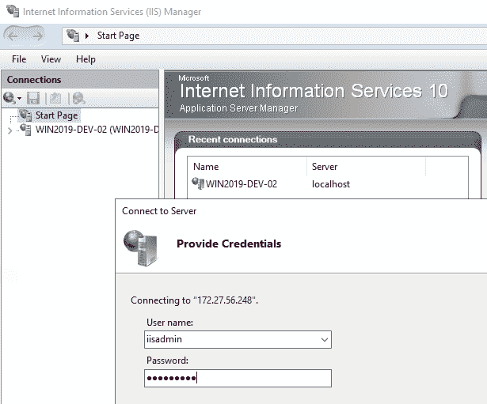

在这里，我可以像连接到远程服务器一样在应用池和网站层次结构中导航:

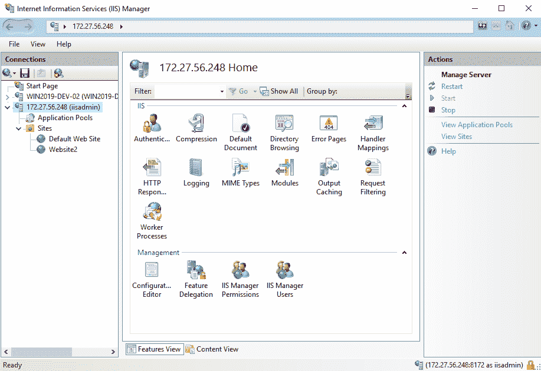

这是检查 IIS 或运行在 IIS 上的 ASP.NET 应用的配置的好方法。您可以检查虚拟目录设置、应用池和应用配置，但这应该仅用于调查。

如果我发现应用中的某些东西没有正确配置，我需要返回 Dockerfile 并修复它，而不是对运行的容器进行更改。当您将现有应用迁移到 Docker 时，这项技术非常有用。如果您在 Dockerfile 中安装了带有 web 应用的 MSI，您将看不到 MSI 实际上做了什么，但是您可以连接到 IIS 管理器并查看结果。

# SQL Server 管理工作室(SSMS)

SSMS 更简单，因为它使用标准的 SQL 客户端端口`1433`。您不需要公开任何额外的端口或启动任何额外的服务；来自微软和本书的 SQL Server 映像已经设置好了一切。您可以使用运行容器时使用的`sa`凭据使用 SQL Server 认证进行连接。

该命令运行一个 SQL Server 2019 快速版容器，向主机发布端口`1433`并指定`sa`凭证:

```
docker container run -d -p 1433:1433 `
 -e sa_password=DockerOnW!nd0ws `
 --name sql `
 dockeronwindows/ch03-sql-server:2e
```

这将发布标准的 SQL Server 端口`1433`，因此您有三个选项可以连接到容器内部的 SQL Server:

*   在主机上，使用`localhost`作为服务器名称。
*   在主机上，使用容器的 IP 地址作为服务器名称。
*   在远程机器上，使用 Docker 主机的机器名称或接入点地址。

我已经获取了我的容器的 IP 地址，所以在 SSMS 的 Docker 主机上，我只需指定 SQL 凭据:

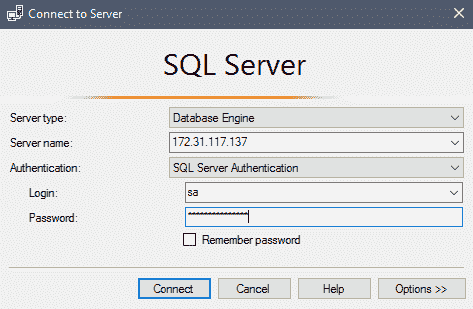

您可以使用与任何 SQL Server 相同的方式来管理此 SQL 实例—创建数据库、分配用户权限、恢复 Dacpacs 和运行 SQL 脚本。请记住，您所做的任何更改都不会影响映像，如果您希望新容器可以使用这些更改，您需要构建自己的映像。

如果您愿意，这种方法可以让您通过 SSMS 构建数据库，并在不安装和运行 SQL Server 的情况下让它在容器中工作。您可以完善您的模式，添加服务帐户和种子数据，然后将数据库导出为脚本。

我为一个简单的示例数据库这样做了，将模式和数据导出到一个名为`init-db.sql`的文件中。`dockeronwindows/ch08-mssql-with-schema:2e`的 Dockerfile 采用了 SQL 脚本，并将其打包成一个新的映像，带有一个引导 PowerShell 脚本，在您创建容器时部署数据库:

```
# escape=`
FROM dockeronwindows/ch03-sql-server:2e
SHELL ["powershell", "-Command", "$ErrorActionPreference = 'Stop';"]

ENV sa_password DockerOnW!nd0ws
VOLUME C:\mssql

WORKDIR C:\init
COPY . .

CMD ./InitializeDatabase.ps1 -sa_password $env:sa_password -Verbose

HEALTHCHECK CMD powershell -command `
 try { `
  $result = invoke-sqlcmd -Query 'SELECT TOP 1 1 FROM Authors' -Database DockerOnWindows; `
  if ($result[0] -eq 1) {return 0} `
  else {return 1}; `
} catch { return 1 }
```

There's a `HEALTHCHECK` in the SQL Server image here, which is good practice—it lets Docker check whether the database is running correctly. In this case, the test will fail if the schema has not been created, so the container won't report as healthy until the schema deployment has completed successfully.

我可以用通常的方法从这个映像运行一个容器:

```
docker container run -d -p 1433 --name db dockeronwindows/ch08-mssql-with-schema:2e
```

通过发布端口`1433`，数据库容器在主机上的一个随机端口上可用，所以我用一个 SQL 客户端连接到数据库，并从脚本中看到模式和数据:

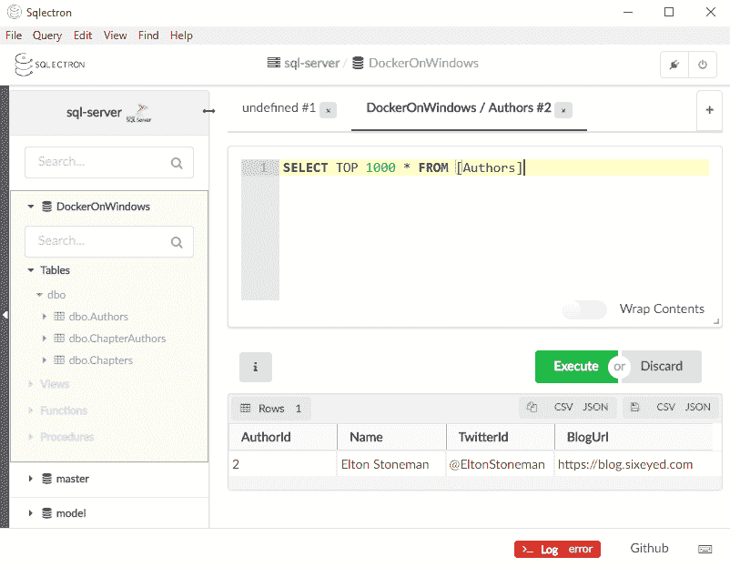

这代表了一个应用数据库的全新部署，在这种情况下，我使用了 SQL Server 的开发版来计算我的模式，但是 SQL Server Express 用于实际的数据库，所有这些都在 Docker 中运行，没有本地的 SQL Server 实例。

如果您认为使用 SQL Server 认证是一种倒退，那么您需要记住 Docker 支持不同的运行时模型。您不会有一个运行多个数据库的 SQL Server 实例；如果凭据被泄露，他们都可能成为目标。每个 SQL 工作负载都在一个专用的容器中，有自己的一组凭据，因此每个数据库实际上有一个 SQL 实例，每个服务可能有一个数据库。

在 Docker 中运行可以提高安全性。除非需要远程连接到 SQL Server，否则不需要从 SQL 容器发布端口。任何需要数据库访问的应用都将作为容器在与 SQL 容器相同的 Docker 网络中运行，并且能够访问端口`1433`，而无需将其发布到主机。这意味着 SQL 只能由运行在同一个 Docker 网络中的其他容器访问，在生产中，您可以使用 Docker 机密来获取连接细节。

If you need to use Windows authentication with an AD account, you can still do that in Docker. Containers can be domain-joined when they start, so you can use service accounts for SQL Server instead of SQL Server authentication.

# 事件日志

您可以将本地计算机上的事件查看器连接到远程服务器，但是当前在 Windows Server Core 或 Nano Server 映像上没有启用远程事件日志服务。这意味着您不能使用事件查看器用户界面连接到容器并读取事件日志条目，但是您可以使用服务器管理器用户界面来做到这一点，我将在下一节介绍这一点。

如果您只想读取事件日志，可以针对正在运行的容器执行 PowerShell cmdlets 来获取日志条目。此命令从我的数据库容器中读取 SQL Server 应用的两个最新事件日志条目:

```
> docker exec db powershell `
 "Get-EventLog -LogName Application -Source MSSQL* -Newest 2 | Format-Table TimeWritten,Message"

TimeWritten          Message
-----------          -------
6/27/2017 5:14:49 PM Setting database option READ_WRITE to ON for database '...
6/27/2017 5:14:49 PM Setting database option query_store to off for database...
```

如果您无法通过其他方式诊断容器的问题，读取事件日志会很有用。但这种方法在运行几十或几百个容器时无法扩展。最好将感兴趣的事件日志中继到控制台，这样它们就被 Docker 平台收集了，你可以用`docker container logs`或者可以访问 Docker API 的管理工具来读取它们。

转发事件日志很简单，采用类似于[第 3 章](03.html)*中转发 IIS 日志的方法.NET 框架和。网络核心应用*。对于任何写入事件日志的应用，您可以使用启动脚本作为入口点，该脚本运行应用，然后进入读取循环——从事件日志中获取条目，并将其写入控制台。

这对于作为 Windows 服务运行的应用来说是一种有用的方法，微软已经在 SQL Server Windows 映像中使用了这种方法。Dockerfile 使用一个 PowerShell 脚本作为`CMD`，该脚本以一个循环结束，该循环调用相同的`Get-EventLog` cmdlet 将日志中继到控制台:

```
$lastCheck = (Get-Date).AddSeconds(-2) 
while ($true) { 
 Get-EventLog -LogName Application -Source "MSSQL*" -After $lastCheck | `
 Select-Object TimeGenerated, EntryType, Message 
 $lastCheck = Get-Date 
 Start-Sleep -Seconds 2 
}
```

该脚本每 2 秒读取一次事件日志，获取自上次读取以来的所有条目，并将它们写入控制台。该脚本在 Docker 启动的进程中运行，因此日志条目被捕获并可以由 Docker API 显示。

这不是一个完美的方法——它使用定时循环，只从日志中选择一些数据，这意味着将数据存储在容器的事件日志和 Docker 中。如果您的应用已经写入事件日志，并且您希望在不重建应用的情况下对其进行归档，则该选项有效。在这种情况下，您需要确保您有一个机制来保持您的应用进程运行，例如窗口服务，以及 Dockerfile 中的运行状况检查，因为 Docker 只监控事件日志循环。

# 服务器管理器

服务器管理器是一个很好的远程管理和监控服务器的工具，它可以很好地处理基于 Windows Server Core 的容器。您需要对 IIS 管理控制台采取类似的方法，在容器中配置具有管理员访问权限的用户，然后从主机进行连接。

就像使用 IIS 一样，您可以向映像添加一个脚本，这样就可以进行访问，以便在需要时运行它。这比总是在映像中启用远程访问更安全。脚本只需要添加一个用户，配置服务器允许管理员账户远程访问，并确保 **Windows 远程管理** ( **WinRM** )服务正在运行:

```
net user serveradmin "s3rv3radmin*" /add
net localgroup "Administrators" "serveradmin" /add

New-ItemProperty -Path HKLM:\SOFTWARE\Microsoft\Windows\CurrentVersion\Policies\System `
 -Name LocalAccountTokenFilterPolicy -Type DWord -Value 1
Start-Service winrm
```

我有一个展示这种方法的示例映像`dockeronwindows/ch08-iis-with-server-manager:2e`。它基于 IIS，并打包一个脚本，以便能够使用服务器管理器进行远程访问。Dockerfile 还公开了 WinRM、`5985`和`5986`使用的端口。我可以在后台启动运行 IIS 的容器，然后启用远程访问:

```
> > docker container run -d -P --name iis2 dockeronwindows/ch08-iis-with-server-manager:2e
9c097d80c08b5fc55cfa27e40121d240090a1179f67dbdde653c1f93d3918370

PS> docker exec iis2 powershell .\EnableRemoteServerManagement.ps1
The command completed successfully.
... 
```

您可以使用服务器管理器连接到容器，使用容器的 IP 地址，但是容器没有加入域。服务器管理器将尝试通过安全通道进行认证，但失败了，因此您将得到一个 WinRM 认证错误。要添加未加入域的服务器，您需要将其添加为受信任的主机。可信主机列表需要使用容器的主机名，而不是 IP 地址，因此首先我将获取容器的主机名:

```
> docker exec iis2 hostname
9c097d80c08b
```

我将把它作为一个条目添加到我的服务器的`hosts`文件中，在`C:\Windows\system32\drivers\etc\hosts`处:

```
#ch08 
172.27.59.5  9c097d80c08b
```

现在，我可以将容器添加到信任列表中。该命令需要在主机上运行，而不是在容器中运行。您正在将容器的主机名添加到本地计算机的受信任服务器列表中。我在我的 Windows Server 2019 主机上运行此程序:

```
Set-Item wsman:\localhost\Client\TrustedHosts 9c097d80c08b -Concatenate -Force
```

I'm running Windows Server 2019, but you can use the server manager on Windows 10 too. Install the **Remote Server Administration Tools** (**RSAT**), and you can use the server manager on Windows 10 in the same way.

在服务器管理器中，导航到所有服务器|添加服务器，并打开 DNS 选项卡。在这里，您可以输入容器的主机名，服务器管理器将解析 IP 地址:

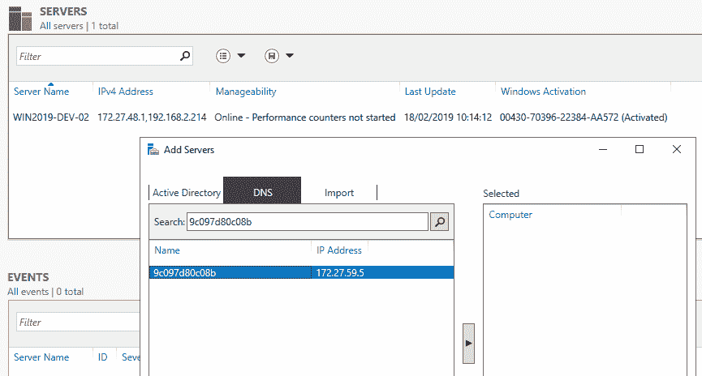

选择服务器详细信息，然后单击确定—现在服务器管理器将尝试连接到容器。您将在“所有服务器”选项卡中看到更新后的状态，显示服务器在线，但访问被拒绝。现在，您可以右键单击服务器列表中的容器，然后单击管理身份，为本地管理员帐户提供凭据。您需要将主机名指定为用户名的域部分。脚本中创建的本地用户叫`serveradmin`，但我需要用`9c097d80c08b\serveradmin`认证:

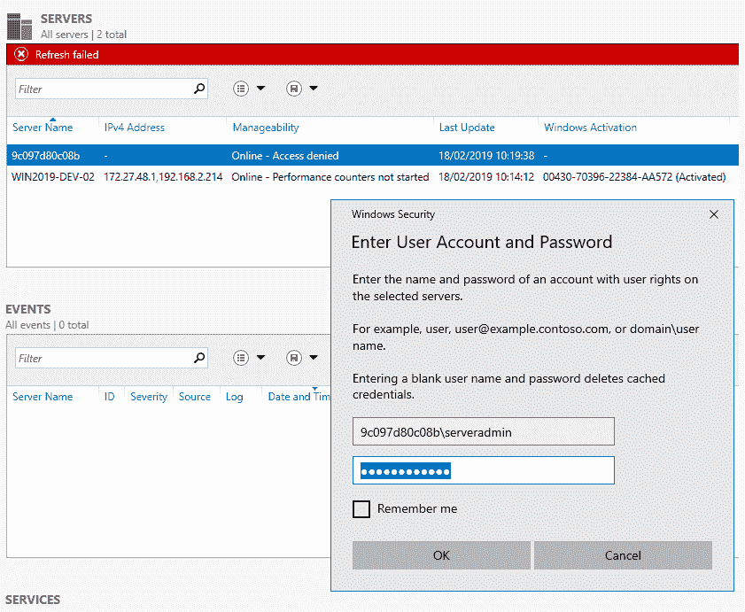

现在连接成功了，您将在服务器管理器中看到容器中的数据，包括事件日志条目、Windows 服务以及所有已安装的角色和功能:

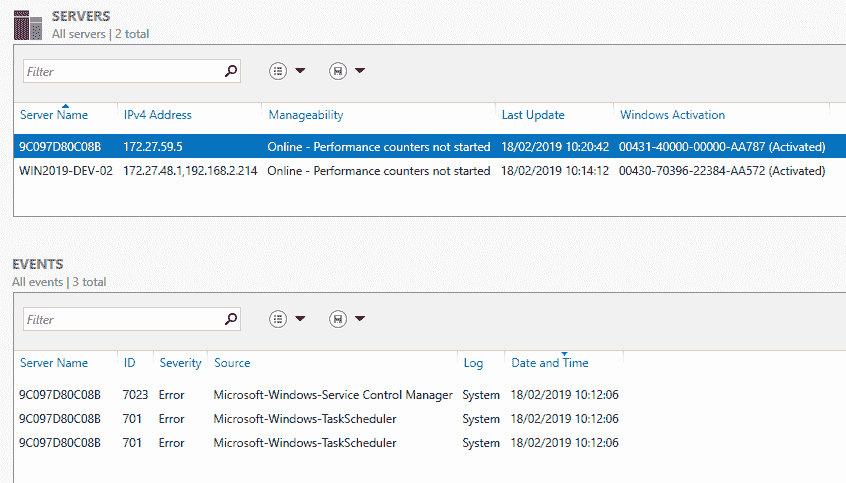

您甚至可以从远程服务器管理器用户界面向容器添加功能，但这不是一个好的做法。像其他 UI 管理工具一样，最好使用它们进行探索和调查，但不要在 Dockerfile 中进行任何更改。

# 使用 Docker 工具管理容器

您已经看到，您可以使用现有的 Windows 工具来管理容器，但是您可以使用这些工具做的事情并不总是适用于 Docker 世界。一个容器将运行一个 web 应用，所以 IIS 管理器的层次导航并没有真正的帮助。在服务器管理器中检查事件日志可能很有用，但是将条目中继到控制台要有用得多，这样它们就可以从 Docker API 中浮出水面。

还需要显式设置应用映像，以便能够访问远程管理工具、公开端口、添加用户和运行其他 Windows 服务。所有这些都增加了运行容器的攻击面。您应该认为这些现有工具在开发和测试环境的调试中很有用，但是它们并不真正适合生产。

Docker 平台为在容器中运行的任何类型的应用提供了一致的 API，这是一种新型管理界面的机会。在本章的剩余部分，我将研究了解 Docker 并为 Docker 命令行提供替代管理界面的管理工具。我将从一些开源工具开始，然后进入 Docker Enterprise 中的商业**容器即服务** ( **CaaS** )平台。

# Docker 可视化工具

**可视化工具**是一个非常简单的网络用户界面，显示关于 Docker 群中节点和容器的基本信息。这是`dockersamples/docker-swarm-visualizer`资源库中 GitHub 上的一个开源项目。它是一个 Node.js 应用，打包在 Linux 和 Windows 的 Docker 映像中。

本章我已经在 Azure 中部署了一个混合 Docker Swarm，它有一个 Linux 管理器节点、两个 Linux 工作器节点和两个 Windows 工作器节点。通过部署绑定到 Docker Engine API 的服务，我可以在管理器节点上将可视化工具作为 Linux 容器运行:

```
docker service create `
  --name=viz `
  --publish=8000:8080/tcp `
  --constraint=node.role==manager `
  --mount=type=bind,src=/var/run/docker.sock,dst=/var/run/docker.sock `
  dockersamples/visualizer
```

该约束确保容器仅在管理器节点上运行，并且由于我的管理器在 Linux 上运行，我可以使用`mount`选项让容器与 Docker API 对话。在 Linux 中，您可以将套接字视为文件系统挂载，因此容器可以使用 API 套接字，而不必通过**传输控制协议** ( **TCP** )公开公开它。

You can also run the visualizer in an all-Windows swarm. Docker currently supports Windows named pipes as volumes on a single server, but not in Docker Swarm; however, you can mount the API using TCP, as I did with Traefik in [Chapter 7](07.html), *Orchestrating Distributed Solutions with Docker Swarm*.

可视化工具为您提供群中容器的只读视图。用户界面显示了主机和容器的状态，并为您提供了一种快速检查集群上工作负载分布的方法。这是我在 Azure 中的 Docker 企业集群在部署 NerdDinner 栈时的样子:

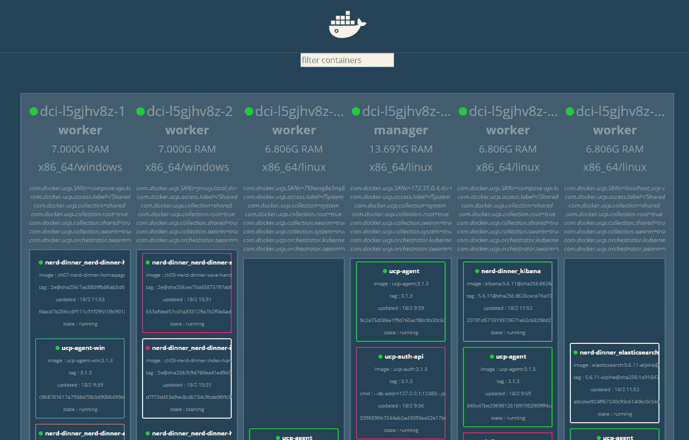

我可以一眼看出我的节点和容器是否健康，并且我可以看到 Docker 已经尽可能均匀地在集群中分布容器。可视化工具使用 Docker 服务中的 API，它通过 RESTful 接口公开所有 Docker 资源。

Docker API 还提供写访问，因此您可以创建和更新资源。一个名为 **Portainer** 的开源项目使用这些 API 提供管理。

# 搬运工人

Portainer 是 Docker 的轻量级管理 UI。它作为一个容器运行，可以管理以集群模式运行的单个 Docker 主机和集群。这是一个开源项目，托管在`portainer/portainer`存储库中的 GitHub 上。Portainer 是用 Go 编写的，所以是跨平台的，可以作为 Linux 或者 Windows 容器运行。

Portainer 有两个部分:您需要在每个节点上运行一个代理，然后运行管理 UI。所有这些都在容器中运行，因此您可以使用 Docker Compose 文件，如本章源代码中`ch08-portainer`下的文件。组合文件定义了一个全局服务，即 Portainer 代理，它运行在群中每个节点的容器中。然后是 Portainer 用户界面:

```
portainer:
  image: portainer/portainer
  command: -H tcp://tasks.agent:9001 --tlsskipverify
  ports:
    - "8000:9000"
  volumes:
    - portainer_data:/data
  networks:
    - agent_network
  deploy: 
    mode: replicated
    replicas: 1
    placement:
      constraints: [node.role == manager]
```

The `portainer/portainer` image on Docker Hub is a multi-arch image, which means you can use the same image tag on Linux and Windows, and Docker will use the matching image for the host OS. You can't mount the Docker socket on Windows, but the Portainer documentation shows you how to access the Docker API on Windows.

当您第一次浏览到 Portainer 时，您需要指定管理员密码。然后，服务连接到 Docker API 并显示所有资源的详细信息。在集群模式下，我可以看到集群中的节点数、栈数、运行的服务和容器数，以及集群中的映像、卷和网络数:

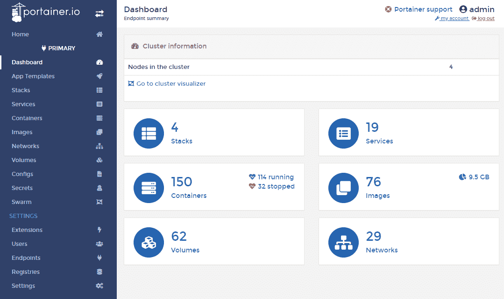

集群可视化工具链接显示的用户界面非常类似于 Docker Swarm 可视化工具，容器在每个节点上运行:

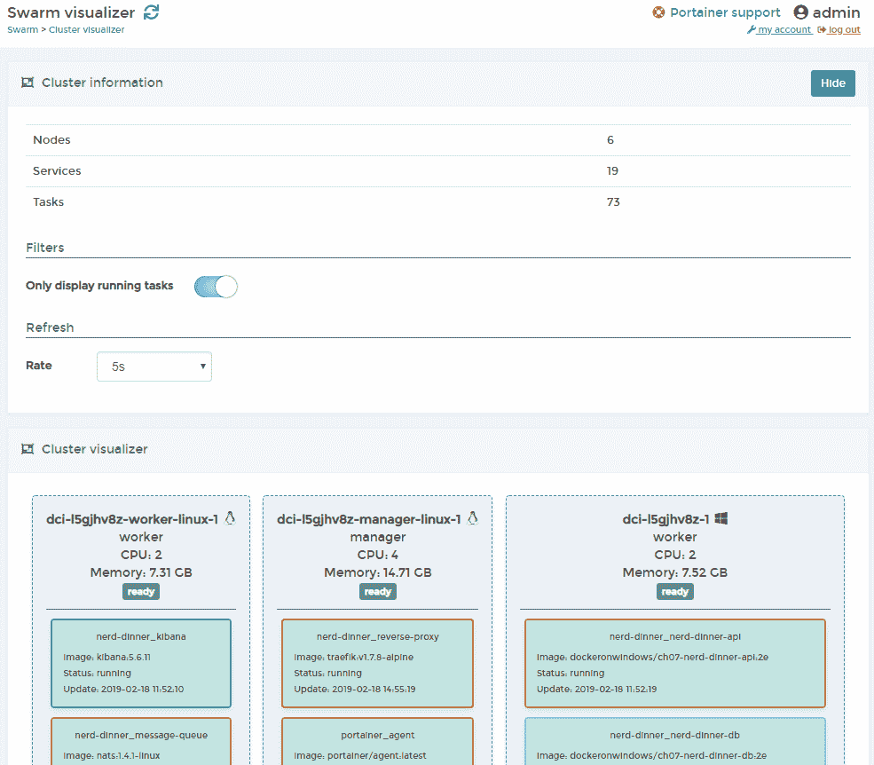

“服务”视图显示了所有正在运行的服务，从这里，我可以深入查看服务详细信息，并且有一个更新服务规模的快速链接:

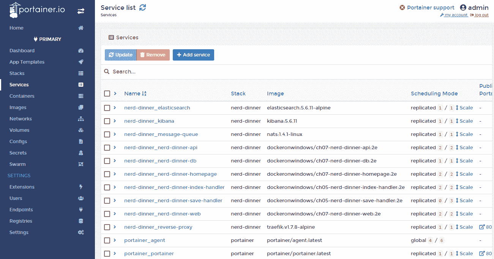

Portainer 一直在根据新的 Docker 功能进行发展，您可以从 Portainer 部署栈和服务并进行管理。您可以深入到服务日志中，将控制台会话连接到容器，并从内置于用户界面中的 Docker Compose 模板中部署通用应用。

您可以在 Portainer 中创建多个用户和团队，并对资源应用访问控制。您可以创建仅限于特定团队访问的服务。认证由 Portainer 使用本地用户数据库进行管理，或者通过连接到现有的**轻量级目录访问协议** ( **LDAP** )提供商进行管理。

Portainer 是一个很棒的工具，也是一个活跃的开源项目，但是在你采用它作为你的管理工具之前，你应该评估一下最新的版本。Portainer 最初是一个 Linux 工具，仍然有一些领域不完全支持 Windows 功能。在撰写本文时，代理容器需要在 Windows 节点上进行特殊配置，这意味着您无法将其作为全局服务部署在您的群中，没有它也无法在 Portainer 中看到 Windows 容器。

在生产环境中，您可能需要运行有支持的软件。Portainer 是开源的，但是有一个商业支持选项。对于具有严格安全流程的企业部署或环境，Docker Enterprise 提供了完整的功能集。

# Docker企业的 CaaS

Docker Enterprise 是 Docker，Inc .的商业版。它是一个完整的 CaaS 平台，充分利用 Docker 提供的单一窗格来管理运行在任意数量主机上的任意数量的容器。

Docker Enterprise 是一款生产级产品，您可以在数据中心或云中的机器集群上运行。集群功能支持多个编排器、Kubernetes 以及 Docker Swarm。在生产环境中，您可以拥有一个 100 节点的集群，该集群使用与作为单节点集群运行的开发笔记本电脑完全相同的应用平台。

Docker Enterprise 有两个部分。还有 **Docker 可信注册中心** ( **DTR** )，这就像运行自己的 Docker Hub 私有实例，完成映像签名和安全扫描。我将在[第 9 章](09.html)、*中介绍 DTR 了解 Docker* 的安全风险和好处，当我在 Docker 中查看安全时。管理组件叫做**通用控制平面** ( **UCP** )，是一种新型的管理界面。

# 理解通用控制平面

UCP 是一个基于网络的界面，用于管理节点、映像、服务、容器、机密和所有其他 Docker 资源。UCP 本身是一个分布式应用，运行在集群中连接服务的容器中。UCP 为您提供了一个以相同方式管理所有 Docker 应用的单一位置。它提供了基于角色的资源访问控制，因此您可以对谁能做什么进行细粒度控制。

Docker Enterprise 运行 Kubernetes 和 Docker Swarm。Kubernetes 将在未来版本中支持 Windows 节点，因此您将能够在单个 Docker Enterprise 集群上将 Windows 容器部署到 Docker Swarm 或 Kubernetes。您可以使用 Docker Compose 文件将栈部署到 UCP，目标是 Docker Swarm 或 Kubernetes，UCP 将创建所有资源。

UCP 为您提供了全方位的管理功能:您可以创建、扩展和删除服务，检查和连接到运行服务的任务，以及管理运行群的节点。您需要的所有其他资源，如 Docker 网络、配置、机密和卷，都以同样的方式在 UCP 进行管理。

您可以运行混合 Docker 企业集群，其中 Linux 节点用于 UCP 和 DTR，Windows 节点用于您的用户工作负载。作为 Docker 的订阅服务，Docker 的团队支持您设置集群和处理任何问题，涵盖所有 Windows 和 Linux 节点。

# 导航 UCP 用户界面

你从主页登录 UCP。您可以使用 Docker Enterprise 内置的认证，从 UCP 手动管理用户，也可以连接到任何 LDAP 认证存储。这意味着您可以将 Docker Enterprise 设置为使用您组织的 AD，并让用户使用其 Windows 帐户登录。

UCP 主页是一个仪表板，显示了您的集群的关键性能指标、节点数量、服务以及当时运行的 Swarm 和 Kubernetes 服务，以及集群的整体计算利用率:

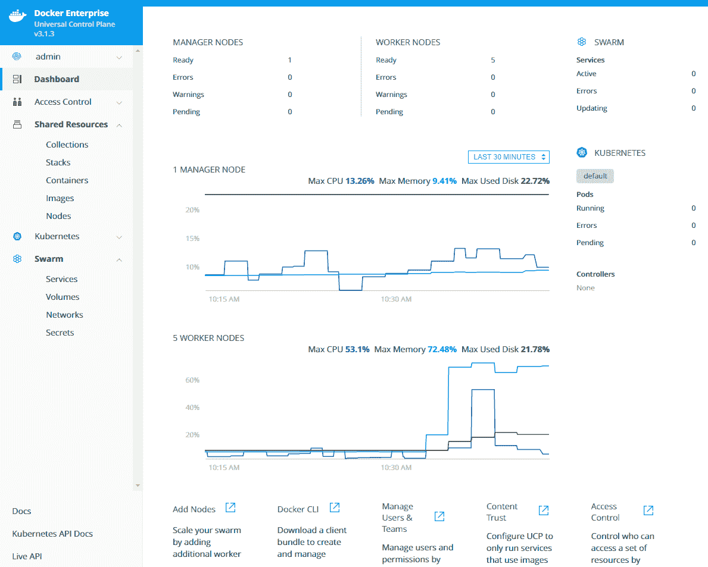

从控制面板中，您可以导航到资源视图，这些视图为您提供了按资源类型分组的访问权限:服务、容器、映像、节点、网络、卷和机密。对于大多数资源类型，您可以列出现有资源，检查它们，删除它们，并创建新的资源。

UCP is a multi-orchestrator container platform, so you can have some applications running in Kubernetes and others in Docker Swarm on the same cluster. The Shared Resources section of the navigation shows the resources that are shared between the orchestrators, including images, containers, and stacks. This is a great way to support heterogeneous deliveries, or to evaluate different orchestrators in controlled environments.

UCP 为所有资源提供**基于角色的访问控制** ( **RBAC** )。您可以将权限标签应用于任何资源，并基于该标签保护访问。可以为团队分配标签权限，范围从无访问权限到完全控制权限，这确保了团队成员对所有具有这些标签的资源的访问。

# 管理节点

节点视图向您显示群集中的所有节点，列出操作系统和 CPU 体系结构、节点状态和节点管理器状态:

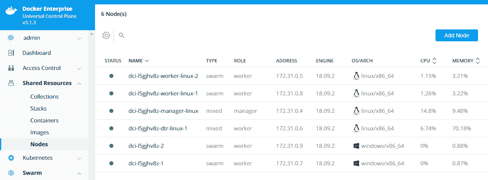

我的群集中有六个节点:

*   两个用于混合工作负载的 Linux 节点:它们可以运行 Kubernetes 或 Docker Swarm 服务
*   两个只为 Docker Swarm 服务配置的 Linux 节点
*   两个仅用于 Docker Swarm 的窗口节点

这些节点运行所有的 UCP 和 DTR 容器。Docker Enterprise 可以配置为免除管理器节点运行用户工作负载，这也可以用于运行 DTR。这是为 Docker 企业服务隔离计算能力的好方法，以确保您的应用工作负载不会使管理组件缺乏资源。

在节点管理中，您可以通过图形方式查看和管理您有权访问的集群服务器。您可以将节点置于清空模式，允许您运行窗口更新或升级节点上的 Docker。您可以将工人提升为经理，将经理降级为工人，并查看将新节点加入群所需的令牌。

深入到每个节点，您可以看到服务器的总 CPU、内存和磁盘使用情况，并有一个显示使用情况的图表，您可以在 30 分钟到 24 小时的时间段内进行聚合:

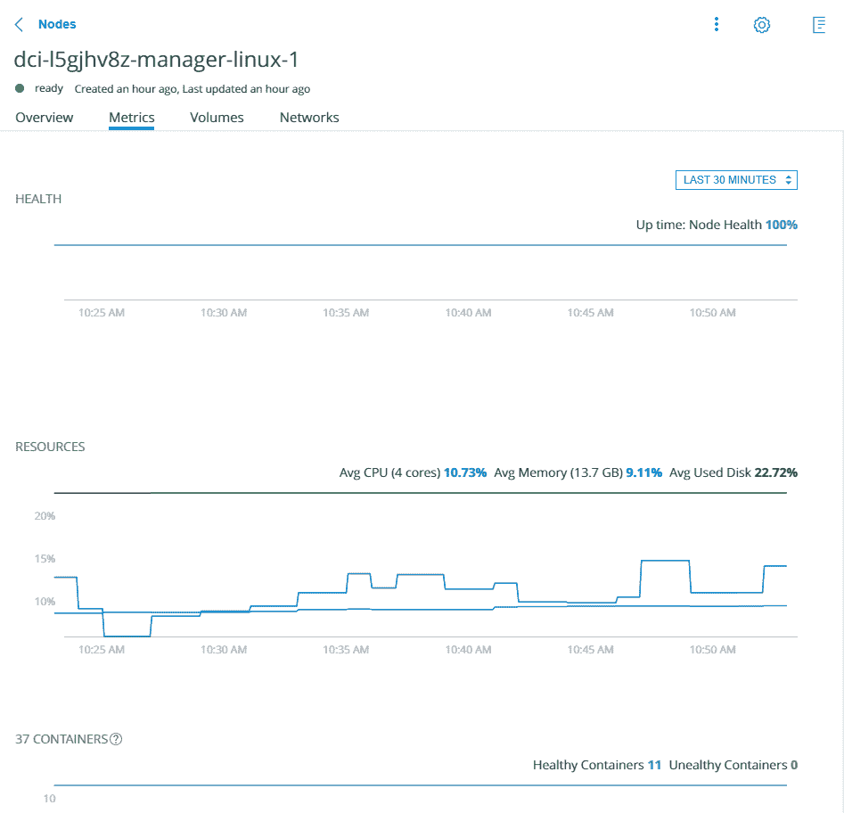

在“度量”选项卡中，有一个节点上所有容器的列表，显示了它们的当前状态和容器运行的映像。从容器列表中，您可以导航到容器视图，我稍后将介绍它。

# 卷

**卷**存在于节点级别而不是群级别，但是您可以在 UCP 跨所有群节点管理它们。如何管理群集中的卷取决于您使用的卷的类型。本地卷适用于将日志和指标写入磁盘，然后集中转发的全局服务等情况。

作为群集服务运行的持久数据存储也可以使用本地存储。您可以在每个节点上创建一个本地卷，但要为带有高容量 RAID 阵列的服务器添加标签。当您创建数据服务时，您可以使用一个约束来将其限制在 RAID 节点上，这样其他节点就永远不会在它们上面安排任务，并且在任务运行的地方，它们会将数据写入 RAID 阵列上的卷。

对于内部数据中心和云中的数据中心，您可以使用带有卷插件的共享存储。有了共享存储，即使容器移动到不同的群节点，服务也可以继续访问数据。服务任务将向共享存储设备上持久化的卷读写数据。Docker Store 上有许多可用的卷插件，包括 AWS 和 Azure 等面向云的服务、HPE 和 Nimble 的物理基础设施，以及 vSphere 等虚拟化平台。

Docker Enterprise uses the Cloudstor plugin to provide cluster-wide storage, and if you deploy with Docker Certified Infrastructure, then this is configured for you. At the time of writing, the plugin is only supported on Linux nodes, so Windows nodes are restricted to running local volumes. There are still many stateful application architectures that can work well in Docker Swarm with local volumes, but you need to configure them carefully.

存储是容器生态系统中非常关注的一个领域。正在出现的技术可以创建集群范围的存储选项，而不需要特定的基础架构。随着这些技术的成熟，您将能够运行具有高可用性和可扩展性的有状态服务，只需将集群上的磁盘汇集在一起。

卷的选项数量有限，因此创建卷需要指定驱动程序并应用任何驱动程序选项:

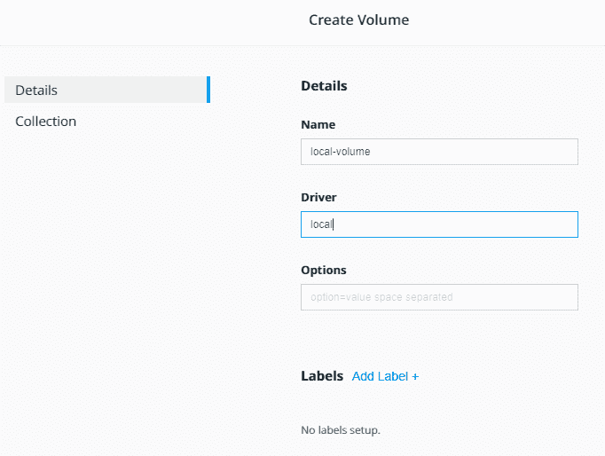

Permissions can be applied to volumes, such as other resources, by specifying a collection where the resource belongs to. Collections are how UCP enforces role-based access control to limit access.

本地卷是在每个节点上创建的，因此需要命名卷的容器可以在任何节点上运行，并且仍然可以找到该卷。在 UCP 创建的混合群集中，在每个节点上创建本地卷，并显示装载卷数据的服务器上的物理位置:

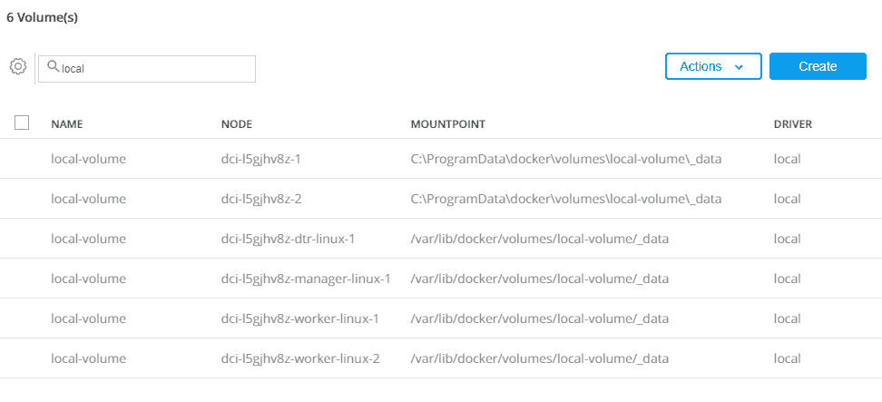

UCP 为您提供了集群中所有资源的单一视图，包括每个节点上的卷和可用于运行容器的映像。

# 形象

UCP 不是一个映像登记处。DTR 是 Docker Enterprise 中的企业私有注册中心，但是您可以使用 UCP 管理每个节点上 Docker 缓存中的映像。在 images 视图中，UCP 向您展示了哪些映像已在群集节点上提取，它还允许您提取映像，这些映像会下载到每个节点上:

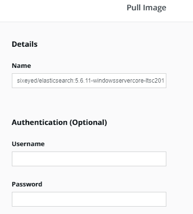

Docker 映像被压缩以供分发，当您拉取映像时，Docker 引擎会解压缩图层。有一些特定于操作系统的优化，可以在提取完成后立即启动容器，这就是为什么您不能在 Linux 主机上提取 Windows 映像，反之亦然。UCP 将尝试在每台主机上提取映像，但如果有些主机因操作系统不匹配而失败，它将继续处理剩余的节点。如果不匹配，您将看到错误:


在映像视图中，您可以深入查看映像的详细信息，包括图层的历史记录、运行状况检查、任何环境变量和公开的端口。基本细节还会向您显示映像的操作系统平台、虚拟大小以及创建日期:

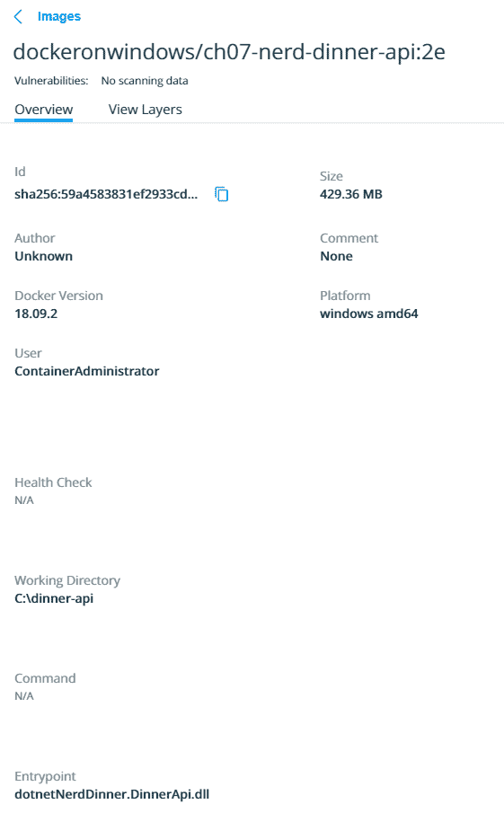

在 UCP，您也可以从集群中删除映像。您可能有一个策略，只保留集群上的当前和以前的映像版本，以允许回滚。其他映像可以安全地从 Docker Enterprise 节点中删除，将所有以前的映像版本留在 DTR，以便在需要时可以将其取出。

# 网络

网络管理很简单，UCP 提供了与其他资源类型相同的界面。网络列表显示了群集中的网络，这些网络可以添加到应用了 RBAC 的集合中，因此您将只能看到您被允许看到的网络。

网络有几个低级选项，允许您指定 IPv6 和自定义 MTU 数据包大小。Swarm 模式支持加密网络，其中节点之间的流量是透明加密的，并且可以通过 UCP 启用。在 Docker 企业集群中，您将使用覆盖驱动程序来允许服务在虚拟网络中跨集群节点进行通信:

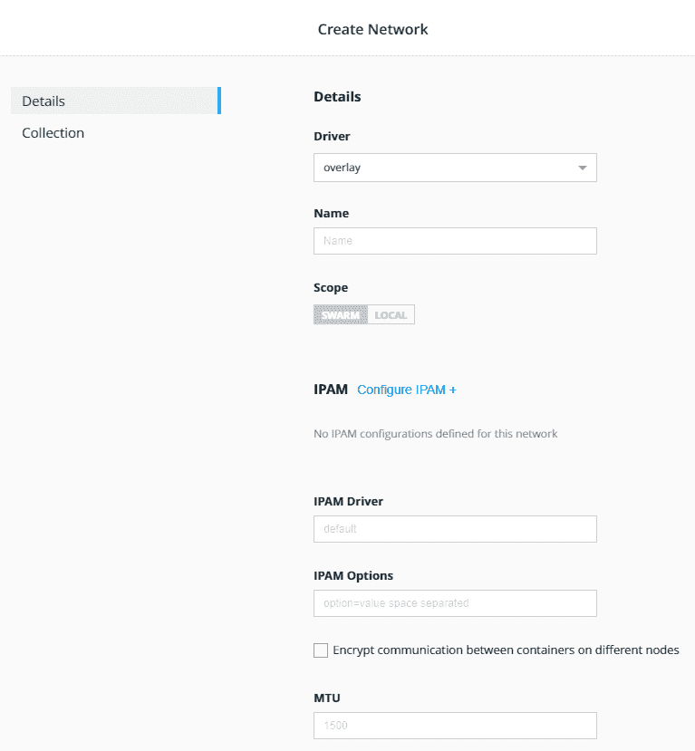

Docker 支持一种特殊类型的群网络，称为**入口网络**。入口网络为外部请求提供负载平衡和服务发现。这使得端口发布非常灵活。在 10 节点集群上，您可以在具有三个副本的服务上发布端口`80`。如果一个节点在端口`80`上接收到一个传入请求，但是它没有运行任何一个服务任务，Docker 会智能地将其重定向到一个正在运行任务的节点。

Ingress networks are a powerful feature that work the same for Linux and Windows nodes in a Docker Swarm cluster. I cover them in more detail in [Chapter 7](07.html), *Orchestrating Distributed Solutions with Docker Swarm*.

网络也可以通过 UCP 删除，但前提是没有附加容器。如果您定义了使用网络的服务，如果您试图删除它，您将收到一条警告。

# 部署栈

使用 UCP 部署应用有两种方式，类似于使用`docker service create`部署单个服务，以及使用`docker stack deploy`部署完整的合成文件。栈是最容易部署的，并且允许您使用已经在预生产环境中验证过的合成文件。

在本章的源代码中，文件夹`ch08-docker-stack`包含使用集群模式在 Docker Enterprise 上运行 NerdDinner 的部署清单。`core docker-compose.yml`文件与[第 7 章](07.html)、*中提到的使用 Docker Swarm* 编排分布式解决方案的文件相同，但是在覆盖文件中有一些更改，要部署到我的生产集群中。我正在利用我在 Docker Enterprise 中拥有的混合集群，并且我正在为所有开源基础设施组件使用 Linux 容器。

对于使用 Linux 容器而不是 Windows 的服务来说，只有两个变化:映像名，以及确保容器计划在 Linux 节点上运行的部署约束。以下是文件`docker-compose.hybrid-swarm.yml`中 NATS 消息队列的覆盖:

```
message-queue:
  image: nats:1.4.1-linux
  deploy:
    placement:
      constraints: 
        - node.platform.os == linux
```

我使用了与[第 7 章](07.html)、*相同的方法，用 Docker Swarm* 和`docker-compose config`编排分布式解决方案，将覆盖文件连接在一起并导出到`docker-swarm.yml`中。我可以将我的 Docker 命令行界面连接到集群，并使用`docker stack deploy`部署应用，或者我可以使用 UCP 用户界面。在“栈”视图中的“共享资源”下，我可以单击“创建栈”并选择编排器，然后上传一个合成 YML 文件:


UCP 验证内容并强调任何问题。有效的合成文件作为栈部署，您将看到 UCP 的所有资源:网络、卷和服务。几分钟后，我的应用的所有映像都被拉到群集节点上，UCP 为每个服务安排副本。服务列表向我显示，所有组件都以所需的规模运行:

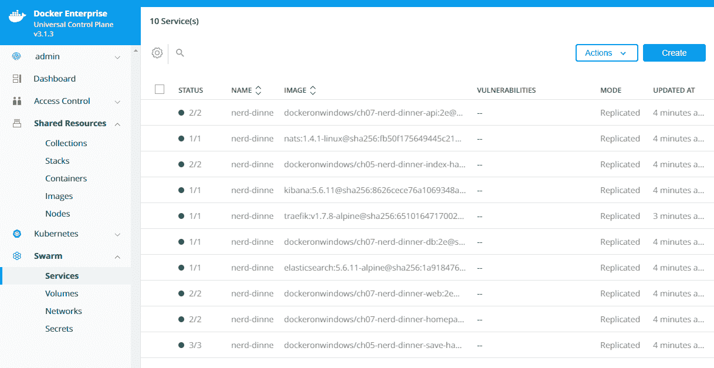

My modernized NerdDinner application is now running across 15 containers in a six-node Docker Enterprise swarm. I have high availability and scale in a supported production environment, and I've switched the four open source components from my custom images to the official Docker images, without any changes to my application images.

栈是首选的部署模型，因为它们继续使用已知的合成文件格式，并且它们自动化了所有的资源。但是栈并不适合每种解决方案，尤其是当您将遗留应用转移到容器时。在栈部署中，无法保证服务的创建顺序；Docker Compose 使用的`depends_on`选项不适用。这是一个深思熟虑的设计决策，基于服务应该具有弹性的想法，但不是所有的服务都是如此。

现代应用应该为失败而构建。如果 web 组件无法连接到数据库，它应该使用基于策略的重试机制来重复重新连接，而不是无法启动。传统的应用通常期望它们的依赖是可用的，并且没有内置的优雅重试。NerdDinner 就是这样，所以如果我从 compose 文件部署一个栈，web 应用可能会在数据库服务创建之前启动，它将会失败。

在这种情况下，容器应该退出，这样 Docker 就知道应用没有运行。然后它将安排一个新的容器运行，当它启动时，依赖关系应该是可用的。如果没有，新的容器将结束，Docker 将安排一个替换，这将一直发生，直到应用正常工作。如果您的遗留应用没有任何依赖检查，您可以使用 Dockerfile 中的启动检查和运行状况检查将此逻辑构建到 Docker 映像中。

在某些情况下，这可能是不可能的，或者新容器的重复启动可能会导致遗留应用出现问题。您仍然可以手动创建服务，而不是部署栈。UCP 也支持这个工作流，这允许您在启动每个服务之前手动确保所有依赖项都在运行。

This is the imperative approach to managing your apps, which you really should try to avoid. It's far better to encapsulate your application manifest in a simple set of Docker Compose files that can be managed in source control, but it may be difficult to do that with some legacy apps.

# 创建服务

`docker service create`命令有几十个选项。UCP 在一个引导式用户界面中支持它们，您可以从服务视图中的创建服务开始。首先，您指定基本细节，即用于服务的映像的名称；服务名称，这是其他服务发现这个名称的方式；和命令参数，如果您想覆盖映像中的默认启动:

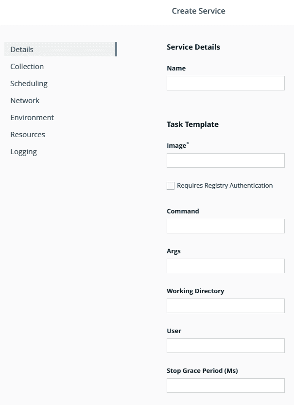

我不会涵盖所有细节；它们映射到`docker service create`命令中的选项，但是 Scheduling 选项卡值得一看。在这里，您可以将服务模式设置为复制或全局，添加所需数量的副本，以及滚动更新的配置:


重启策略默认为始终。这与副本计数一起工作，因此如果任何任务失败或停止，它们将被重新启动以保持服务级别。您可以为自动展开配置更新设置，也可以添加计划约束。约束使用节点标签来限制哪些节点可以用于运行服务任务。您可以使用它将任务限制在高容量节点或具有严格访问控制的节点上。

在其他部分，您可以配置服务如何与群集中的其他资源集成，包括网络和卷、配置和机密，并且您可以指定计算预留和限制。这使您可以将服务限制在有限的 CPU 和内存量内，还可以指定每个容器应该拥有的最小 CPU 和内存份额。

当您部署服务时，UCP 负责将映像拉到任何需要它的节点上，并启动所需数量的容器。对于全局服务，每个节点有一个容器，对于复制的服务，每个节点有指定数量的任务。

# 监控服务

UCP 允许您以相同的方式部署任何类型的应用，或者使用栈合成文件，或者通过创建服务。该应用可以使用任何技术组合的许多服务——新的 NerdDinner 栈的一部分现在正在我的混合集群中的 Linux 上运行。我已经将 Java、Go 和 Node.js 组件部署为 Linux 容器和.NET 框架和.NET 核心组件作为同一集群上的 Windows 容器。

所有这些不同的技术平台都以与 UCP 相同的方式进行管理，这使得它成为拥有大量应用的公司的宝贵平台。服务视图显示具有基本信息的所有服务，如总体状态、任务数和上次报告错误的时间。对于任何服务，您都可以深入查看显示该服务所有信息的详细视图。

这是核心 nerddiner ASP.NET 网络应用的概述选项卡:

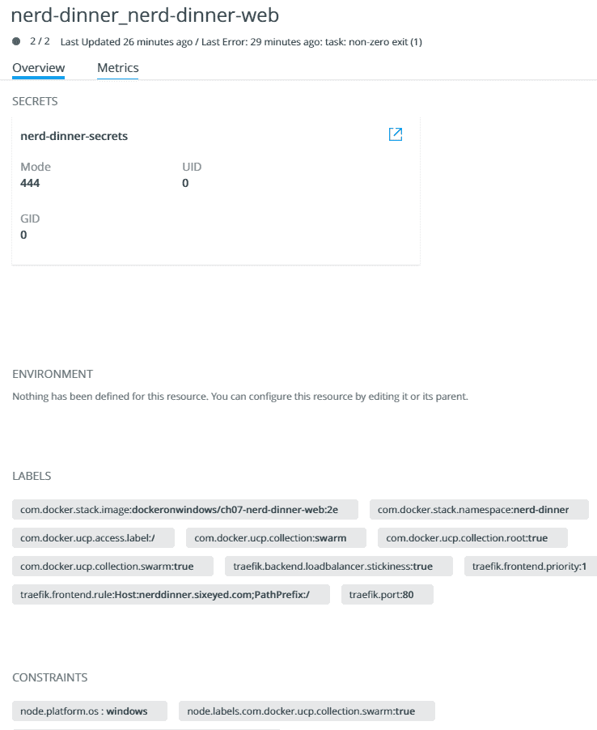

我已经滚动了这个视图，这样我就可以看到服务可用的机密，以及环境变量(在这种情况下没有)、标签(包括 Traefik 路由设置)和约束(包括平台约束)，以确保它在 Windows 节点上运行。“度量”视图向我显示了 CPU 和内存使用情况的图表，以及所有正在运行的容器的列表。

您可以使用服务视图来检查服务的整体状态并进行更改—您可以添加环境变量、更改网络或卷以及更改计划约束。您对服务定义所做的任何更改都将通过重新启动服务来实现，因此您需要了解应用的影响。无状态应用和能够妥善处理暂时故障的应用可以动态修改，但可能会出现应用宕机，具体取决于您的解决方案架构。

您可以调整服务的规模，而无需重新启动现有任务。只需在“计划”选项卡中指定新的扩展级别，UCP 将创建或删除容器以满足服务级别:

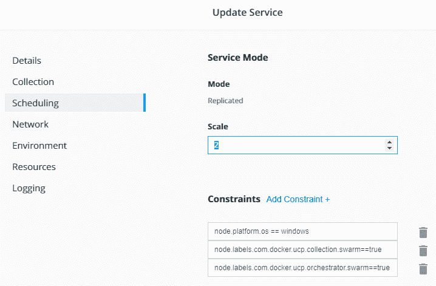

当您增加规模时，现有的容器将被保留，新的容器将被添加，因此这不会影响应用的可用性(除非应用将状态保存在单个容器中)。

从共享资源下的服务视图或容器列表中，您可以选择一个任务来深入到容器视图中，这是一致的管理体验使得管理 Dockerized 应用变得如此简单的地方。关于正在运行的容器的每个细节都会浮出水面，包括容器内部的配置和实际进程列表。这是我的 Traefik 代理的容器，它只是运行了`traefik`进程:

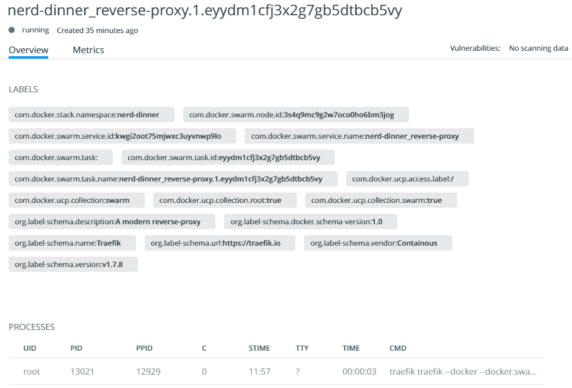

您可以读取容器的日志，其中显示了容器标准输出流的所有输出。这些是来自 Elasticsearch 的日志，这是一个 Java 应用，所以这些是`log4j`格式:


You can view the logs of any container in the cluster in the same way, whether it's a new Go app running in a minimal Linux container, or a legacy ASP.NET app running in a Windows container. This is why it's so important to build your Docker image so that log entries from your app are relayed out to the console.

如果需要解决问题，甚至可以连接到容器中运行的命令行 shell。这相当于在 Docker CLI 中运行`docker container exec -it powershell`，但都是从 UCP 接口运行的，因此不需要连接到集群上的特定节点。您可以运行安装在容器映像中的任何 shell，因此在 Kibana Linux 映像中，我可以使用`bash`:

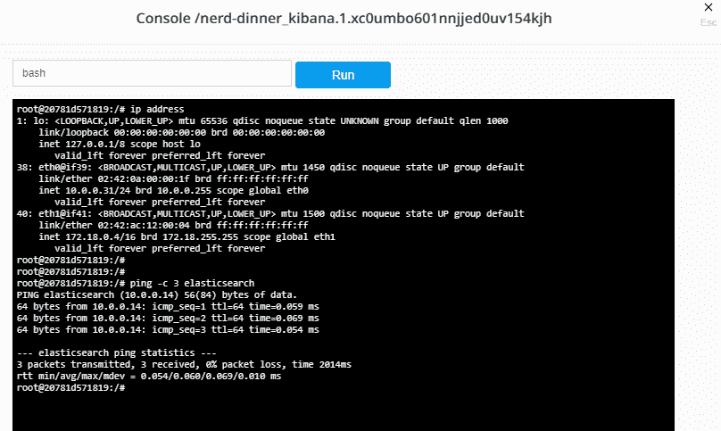

UCP 为您提供了一个界面，让您可以从集群的整体运行状况，通过所有正在运行的服务的状态，深入到在特定节点上运行的各个容器。您可以轻松监控应用的运行状况，检查应用日志，并连接到容器进行调试，所有这些都在同一个管理用户界面中。您还可以从远程 Docker **命令行界面** ( **CLI** )客户端下载**客户端捆绑包**，这是一组脚本和证书，您可以使用它们来安全地管理集群。

客户端捆绑脚本将您的本地 Docker CLI 指向在集群管理器上运行的 Docker API，并为安全通信设置客户端证书。这些证书标识 UCP 的特定用户，无论它们是在 UCP 创建的，还是外部 LDAP 用户。因此，用户可以登录 UCP 用户界面或使用`docker`命令来管理资源，对于这两个选项，他们将拥有由 UCP RBAC 策略定义的相同访问权限。

# RBAC

UCP 的授权为您提供了对所有 Docker 资源的细粒度访问控制。UCP 的 RBAC 是通过为一个主体创建访问资源集的授权来定义的。授权的主体可以是个人用户、用户团队或包含多个团队的组织。资源集可以是单个资源，如 Docker Swarm 服务，也可以是一组资源，如群集中的所有 Windows 节点。授权定义了访问级别，从无访问权限到完全控制。

这是一种非常灵活的安全方法，因为它允许您在对您的公司有意义的任何级别实现安全规则。我可以使用应用优先的方法，其中我有一个名为`nerd-dinner`的资源集合，它代表 NerdDinner 应用，这个集合是代表部署环境的其他集合的父集合:生产、UAT 和系统测试。集合层次结构位于该图的右侧:

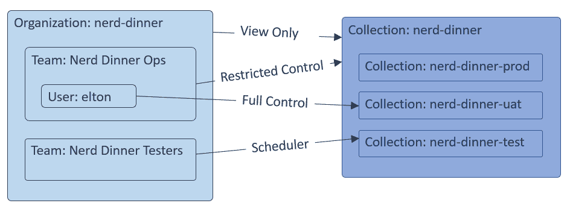

集合是资源组，所以我将每个环境部署为一个栈，资源都属于相关的集合。组织是用户的最终分组，这里我有一个左边显示的**书呆子聚餐**组织，是所有在书呆子上工作的人的分组。在组织中，有两个团队:**书呆子晚餐行动**是应用管理员，**书呆子晚餐测试人员**是测试人员。图中只显示了一个用户**艾顿**，他是**书呆子晚餐行动**团队的成员。

这种结构允许我创建授权，以便在不同级别访问不同的资源:

*   **书呆子晚餐**组织拥有**仅查看**访问**书呆子晚餐**集合的权限，这意味着组织中任何团队的任何用户都可以列出并查看任何环境中任何资源的详细信息。
*   **书呆子晚餐行动**团队还对**书呆子晚餐**集合拥有**受限控制**，这意味着他们可以在任何环境中运行和管理资源。
*   **书呆子晚餐行动**团队中的用户**艾顿**也拥有**对**书呆子晚餐-uat** 集合的完全控制**，该集合对 uat 环境中的资源进行完全管理控制。
*   **书呆子晚餐测试人员**团队拥有**调度程序**访问**书呆子晚餐测试**集合的权限，这意味着团队成员可以管理测试环境中的节点。

The default roles for Docker Swarm collections are **View Only**, **Restricted Control**, **Full Control**, and **Scheduler**. You can create your own roles, and set specific permissions for specific types of resources.

您可以在 UCP 创建授权来创建一个角色，该角色将主题链接到一组资源，并授予它们已知的权限。我已经在我的 Docker 企业集群中部署了安全访问图，我可以在默认系统授权旁边看到我的授权:

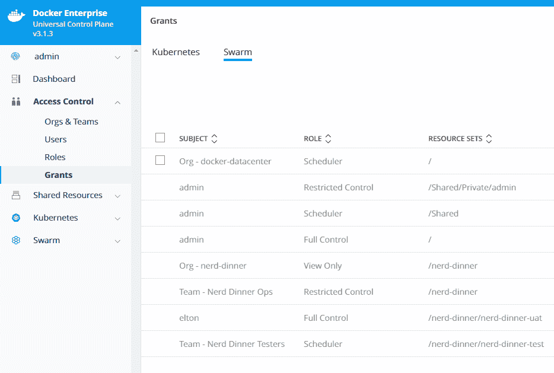

您可以创建独立于您想要保护的资源的授权和集合。然后在添加标签创建资源时指定一个集合，用键`com.docker.ucp.access.label`和集合名称的值。您可以在 Docker 的 create 命令中，在 Docker Compose 文件中声明性地，以及通过 UCP 用户界面来完成这项工作。在这里，我指定了反向代理服务属于`nerd-dinner-prod`集合:

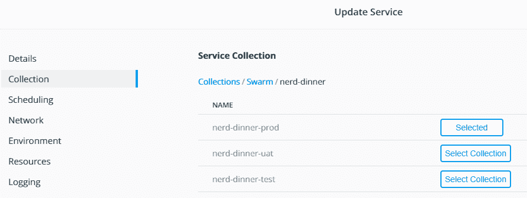

如果我以“书呆子晚餐测试员”团队成员的身份登录 UCP，我只会看到这一项服务。测试用户无权查看默认集合中的服务，只有代理服务被明确放入`nerd-dinner-prod`集合:


作为该用户，我只有查看权限，因此如果我试图以任何方式修改服务，例如重新启动服务，我将会得到一个错误:

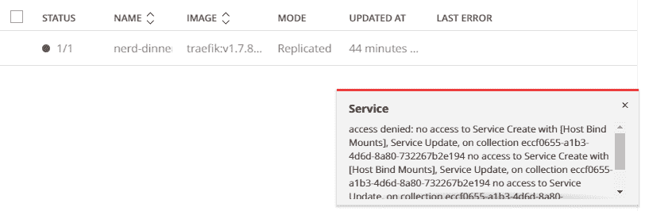

团队可以对不同的资源集拥有多个权限，用户可以属于多个团队，因此 UCP 的授权系统足够灵活，可以适应许多不同的安全模型。您可以采用 DevOps 方法并为特定项目构建集合，让所有团队成员完全控制项目资源，或者您可以有一个专门的管理团队完全控制一切。或者你可以有独立的开发团队，其中成员对他们所开发的应用拥有有限的控制权。

RBAC 是 UCP 的一大特色，也是对 Docker 更广泛的安全故事的补充，我将在[第 9 章](09.html)、*了解 Docker* 的安全风险和好处中讲述。

# 摘要

本章重点介绍运行 Dockerized 解决方案的操作方面。我向您展示了如何在 Docker 容器中使用现有的 Windows 管理工具，以及这如何对调查和调试有用。主要关注的是管理和监控应用的新方法，使用 Docker Enterprise 中的 UCP 以相同的方式管理各种工作负载。

您学习了如何使用现有的 Windows 管理工具(如 IIS 管理器和服务器管理器)来管理 Docker 容器，还学习了这种方法的局限性。当您从 Docker 开始时，坚持使用您知道的工具可能会很有用，但是专用的容器管理工具是更好的选择。

我介绍了两个管理容器的开源选项:简单的可视化工具和更高级的 Portainer。两者都作为容器运行，并连接到 Docker API，它们是打包在 Linux 和 Windows Docker 映像中的跨平台应用。

最后，我向您介绍了 Docker Enterprise 中用于管理生产工作负载的主要功能。我将 UCP 演示为一个管理各种容器化应用的单一窗口，在同一个集群中的 Linux 和 Windows 容器上的多个技术栈中运行，并展示了 RBAC 如何让您安全地访问所有 Docker 资源。

下一章的重点是安全性。在容器中运行的应用可能会提供新的攻击途径。您需要意识到风险，但是安全是 Docker 平台的核心。Docker 让您可以轻松地建立端到端的安全故事，其中策略由平台在运行时强制实现，没有 Docker 这是很难做到的。