# 了解 Docker 的安全风险和优势

Docker 是一种新型的应用平台，它的构建非常注重安全性。您可以将现有的应用打包为 Docker 映像，在 Docker 容器中运行它，并在不更改任何代码的情况下获得显著的安全优势。

a。目前运行在 Windows Server 2003 上的. NET 2.0 网络表单应用将很乐意在下运行。NET 4.7 在基于 Windows Server Core 2019 的 Windows 容器中，没有代码更改:立即升级，应用了 16 年的安全补丁！仍然有大量运行在服务器 2003 上的 Windows 应用不受支持，或者服务器 2008 也将很快不受支持。转到 Docker 是将这些应用纳入现代技术栈的一个好方法。

Docker 中的安全性包含广泛的主题，我将在本章中介绍这些主题。我将解释容器和映像的安全方面， **Docker 可信注册表** ( **DTR** )中的扩展特性，以及集群模式下 Docker 的安全配置。

在本章中，我将研究 Docker 的一些内部结构，以展示安全性是如何实现的。我会报道:

*   了解容器安全
*   使用安全的 Docker 映像保护应用
*   保护与 DTR 的软件供应链
*   理解群体模式下的安全性

# 了解容器安全

在 Windows Server 容器中运行的应用进程实际上是在主机上运行的。如果您在容器中运行多个 ASP.NET 应用，您将在主机上的任务列表中看到多个`w3wp.exe`进程。在容器之间共享操作系统内核是 Docker 容器如此高效的原因——容器不加载自己的内核，因此启动和关闭时间非常快，运行时资源的开销也最小。

在容器内运行的软件可能存在安全漏洞，安全人员询问 Docker 的一个大问题是:容器之间的隔离有多安全？如果 Docker 容器中的应用被破坏，这意味着主机进程被破坏。攻击者能否利用该进程危害其他进程，从而可能劫持主机或主机上运行的其他容器？

如果操作系统内核中存在攻击者可以利用的漏洞，就有可能突破一个容器，危及其他容器和主机。Docker 平台是基于深度安全的原则构建的，因此即使这是可能的，该平台也提供了多种方法来减轻它。

The Docker platform has near feature parity between Linux and Windows, with a few gaps on the Windows side being actively worked on. But Docker has a longer history of production deployment on Linux and much of the guidance and tooling such as Docker Bench and the CIS Docker Benchmark is specific to Linux. It's useful to know the Linux side, but many of the practical points do not apply to Windows containers.

# 容器过程

所有 Windows 进程都是由用户帐户启动和拥有的。用户帐户的权限决定了进程是否可以访问文件和其他资源，以及它们是否可以修改或查看。在 Windows Server Core 的 Docker 基础映像中，有一个名为**容器管理员**的默认用户帐户。从该映像在容器中启动的任何进程都将使用该用户帐户，您可以运行`whoami`工具，该工具只需写出当前用户名:

```
> docker container run mcr.microsoft.com/windows/servercore:ltsc2019 whoami
user manager\containeradministrator
```

您可以通过启动 PowerShell 来运行交互式容器，并找到容器管理员帐户的用户标识(SID):

```
> docker container run -it --rm mcr.microsoft.com/windows/servercore:ltsc2019 powershell

> $user = New-Object System.Security.Principal.NTAccount("containeradministrator"); `
 $sid = $user.Translate([System.Security.Principal.SecurityIdentifier]); `
 $sid.Value
S-1-5-93-2-1
```

您会发现容器用户总是有相同的 SID，`S-1-5-93-2-1`，因为该帐户是 Windows 映像的一部分。因此，它在每个容器中都具有相同的属性。容器进程确实在主机上运行，但是主机上没有**容器管理员**用户。事实上，如果您查看主机上的容器进程，您会看到用户名的空白条目。我将在后台容器中启动一个长时间运行的`ping`进程，并检查容器中的**进程标识** ( **PID** ):

```
> docker container run -d --name pinger mcr.microsoft.com/windows/servercore:ltsc2019 ping -t localhost
f8060e0f95ba0f56224f1777973e9a66fc2ccb1b1ba5073ba1918b854491ee5b

> docker container exec pinger powershell Get-Process ping -IncludeUserName
Handles      WS(K)   CPU(s)     Id UserName               ProcessName
-------      -----   ------     -- --------               -----------
     86       3632     0.02   7704 User Manager\Contai... PING
```

这是一个运行在 Windows Server 2019 上 Docker 中的 Windows Server 容器，所以`ping`进程直接在主机上运行，容器内部的 PID 会和主机上的 PID 匹配。在服务器上，我可以查看同一个 PID 的详细信息，这里是`7704`:

```
> Get-Process -Id 7704 -IncludeUserName
Handles      WS(K)   CPU(s)     Id UserName               ProcessName
-------      -----   ------     -- --------               -----------
     86       3624     0.03   7704                        PING
```

没有用户名，因为容器用户没有映射主机上的任何用户。实际上，主机进程是在匿名用户下运行的，它对主机没有权限，它只有在一个容器的沙盒环境中配置的权限。如果发现允许攻击者突破容器的 Windows Server 漏洞，他们将运行无法访问主机资源的主机进程。

一个更极端的漏洞可能会让主机上的匿名用户获得更广泛的权限，但这将是 Windows 核心权限栈中的一个主要安全漏洞，微软通常会对此做出非常快速的响应。匿名主机用户方法是限制任何未知漏洞影响的良好缓解方法。

# 容器用户帐户和 ACL

在 Windows Server Core 容器中，默认用户帐户是容器管理员。该帐户位于容器的管理员组中，因此它可以完全访问整个文件系统和容器上的所有资源。Dockerfile 中的`CMD`或`ENTRYPOINT`指令中指定的进程将在容器管理员帐户下运行。

如果应用中存在漏洞，这可能会有问题。该应用可能会受到损害，尽管攻击者突破容器的可能性很小，但攻击者仍可能在应用容器内部造成大量破坏。管理访问意味着攻击者可以从互联网下载恶意软件，并在容器中运行它，或将容器中的状态复制到外部位置。

您可以通过在最低权限用户帐户下运行容器进程来缓解这一问题。纳米服务器映像使用这种方法—它们是由容器管理员用户设置的，但是容器进程的默认帐户是没有管理员权限的用户。您可以看到，通过在纳米服务器容器中回显用户名:

```
> docker container run mcr.microsoft.com/windows/nanoserver:1809 cmd /C echo %USERDOMAIN%\%USERNAME%
User Manager\ContainerUser
```

The Nano Server image doesn't have the `whoami` command, and it doesn't even have PowerShell installed. It is set up with the bare minimum that's necessary to run new applications. This is another part of security-in-depth with containers. If there was an exploit in the `whoami` command, then your container applications could be vulnerable, so Microsoft don't package the command at all. This makes sense because you wouldn't use it in a production application. It's still there in Windows Server Core to preserve backwards compatibility.

`ContainerUser`帐户在容器内没有管理员权限。如果您需要管理员权限来设置您的应用，您可以使用`USER ContainerAdministrator`命令切换到 Dockerfile 中的管理员帐户。但是如果你的应用不需要管理员访问，你应该在你的 Dockerfile 的末尾用`USER ContainerUser`切换回来，这样容器启动命令就可以作为最低权限的帐户运行。

来自微软的**互联网信息服务** ( **IIS** )和 ASP.NET 图片是作为最低权限用户运行的其他例子。面向外部的进程是 IIS Windows 服务，它在`IIS_IUSRS`组的本地帐户下运行。该组对 IIS 根路径`C:\inetpub\wwwroot`具有读访问权限，但没有写访问权限。攻击者可以危害 web 应用，但他们将无法写入文件，因此下载恶意软件的能力不复存在。

在某些情况下，web 应用需要写访问来保存状态，但是在 Dockerfile 中可以非常精细地授予它。举个例子，开源的**内容管理系统** ( **CMS** ) Umbraco 可以打包成 Docker 映像，但是 IIS 用户组需要内容文件夹的写权限。您可以使用`RUN`指令设置 ACL 权限，而不是更改 Dockerfile 以管理帐户运行服务:

```
RUN $acl = Get-Acl $env:UMBRACO_ROOT; `
 $newOwner = [System.Security.Principal.NTAccount]('BUILTIN\IIS_IUSRS'); `
 $acl.SetOwner($newOwner); `
 Set-Acl -Path $env:UMBRACO_ROOT -AclObject $acl; `
 Get-ChildItem -Path $env:UMBRACO_ROOT -Recurse | Set-Acl -AclObject $acl
```

I won't go into detail on Umbraco here, but it runs very nicely in a container. You can find sample Dockerfiles for Umbraco and lots of other open source software in my GitHub repository at [https://github.com/sixeyed/dockerfiles-windows](https://github.com/sixeyed/dockerfiles-windows).

您应该使用最低权限的用户帐户来运行进程，并尽可能严格地设置 ACL。这限制了任何能够访问容器内部进程的攻击者的范围，但是仍然有来自容器外部的攻击媒介需要考虑。

# 运行资源受限的容器

您可以在没有约束的情况下运行 Docker 容器，容器进程将根据需要使用尽可能多的主机资源。这是默认设置，但它可能是一个简单的攻击媒介。恶意用户可能会在容器中的应用上产生额外的负载，这可能会试图获取 100%的 CPU 和内存，使主机上的其他容器挨饿。如果您正在运行数百个服务于多个应用工作负载的容器，这一点尤其重要。

Docker 具有防止单个容器使用过多资源的机制。您可以使用显式约束来启动容器，以限制它们可以使用的资源，从而确保没有一个容器消耗主机的大部分计算能力。您可以将容器限制在明确的 CPU 内核和内存数量。

我有个简单的。NET 控制台应用和一个 Dockerfile 来将它打包到`ch09-resource-check`文件夹中。构建该应用是为了占用计算资源，我可以在一个容器中运行它来展示 Docker 如何限制流氓应用的影响。我可以使用该应用成功分配 600 MB 内存，如下所示:

```
> docker container run dockeronwindows/ch09-resource-check:2e /r Memory /p 600
I allocated 600MB of memory, and now I'm done.
```

控制台应用在容器中分配 600 兆内存，这实际上是 600 兆内存，来自窗口服务器容器中的服务器。我在没有任何限制的情况下运行了容器，因此该应用能够使用与服务器一样多的内存。如果我使用`docker container run`命令中的`--memory`限制将容器限制为 500 兆内存，则应用无法分配 600 兆内存:

```
> docker container run --memory 500M dockeronwindows/ch09-resource-check:2e /r Memory /p 600 
Unhandled Exception: OutOfMemoryException.
```

示例应用也会占用中央处理器。它将π计算到给定的小数位数，这是一个计算量很大的操作。在不受限制的容器中，在我的四核开发笔记本电脑上计算π到 20，000 个小数位只需要不到一秒钟的时间:

```
> docker container run dockeronwindows/ch09-resource-check:2e /r Cpu /p 20000
I calculated Pi to 20000 decimal places in 924ms. The last digit is 8.
```

我可以通过在`run`命令中指定`--cpu`限制来使用 CPU 限制，Docker 将限制这个容器可用的计算资源，为其他任务保留更多的 CPU。同样的计算需要两倍多的时间:

```
> docker container run --cpus 1 dockeronwindows/ch09-resource-check:2e /r Cpu /p 20000
I calculated Pi to 20000 decimal places in 2208ms. The last digit is 8.
```

通过使用部署部分中的资源限制，可以将相同的内存和 CPU 限制应用于生产 Docker Swarm 部署。此示例将新的 NerdDinner REST API 限制为 25%的可用 CPU 和 250 MB 的内存:

```
nerd-dinner-api:
  image: dockeronwindows/ch07-nerd-dinner-api:2e
  deploy:
    resources:
      limits:
        cpus: '0.25'
        memory: 250M
...
```

验证资源限制是否到位可能很有挑战性。获取中央处理器数量和内存容量的底层窗口应用编程接口使用操作系统内核，并且在一个容器中，该容器将是主机的内核。内核报告完整的硬件规格，因此限制似乎不在容器内，但它们是强制执行的。您可以使用 WMI 检查约束，但输出不会如预期的那样:

```
> docker container run --cpus 1 --memory 1G mcr.microsoft.com/windows/servercore:ltsc2019 powershell `
 "Get-WmiObject Win32_ComputerSystem | select NumberOfLogicalProcessors, TotalPhysicalMemory"

NumberOfLogicalProcessors TotalPhysicalMemory
------------------------- -------------------
                        4         17101447168
```

这里，容器报告了四个中央处理器和 16 GB 内存，尽管它被限制为一个中央处理器和 1 GB 内存。这些限制实际上已经存在，但它们的运作水平高于 WMI 呼吁。如果在容器内运行的进程试图分配超过 1 GB 的内存，那么它将失败。

Remember that only Windows Server containers have access to all the host's compute power, where the container process is actually running on the host. Hyper-V containers each have a lightweight VM where the process is running, and that VM has its own allocation of CPU and memory. You can apply container limits using the same Docker commands, and they're applied to the container's VM.

# 运行具有受限功能的容器

Docker 平台有两个有用的特性来限制应用在容器中可以做什么。目前，它们只与 Linux 容器一起工作，但是如果您需要处理混合工作负载，它们值得理解，并且对 Windows 的支持可能会出现在未来的版本中。

Linux 容器可以使用`read-only`标志运行，这将创建一个具有只读文件系统的容器。该选项可用于任何映像，它将启动一个容器，其输入过程与平时相同。不同之处在于，容器没有可写文件系统层，因此不能添加或更改任何文件—容器不能修改映像的内容。

这是一个有用的安全特性。web 应用可能存在允许攻击者在服务器上执行代码的漏洞，但是只读容器严重限制了攻击者的能力。他们不能更改应用配置文件、更改访问权限、下载新的恶意软件或替换应用二进制文件。

只读容器可以与 Docker 卷相结合，因此应用可以写入已知位置以记录或缓存数据。如果您有一个向文件系统写入的应用，那就是如何在只读容器中运行它而不改变功能。您需要注意的是，如果您将日志写入卷中的文件，并且攻击者已经获得了对文件系统的访问权限，他们就可以读取历史日志，如果日志被写入标准输出并被 Docker 平台使用，他们就无法读取历史日志。

当您运行 Linux 容器时，您还可以显式地添加或删除容器可用的系统功能。例如，您可以在没有`chown`功能的情况下启动一个容器，因此容器内的任何进程都不能更改文件访问权限。同样，您可以限制对网络端口的绑定或对内核日志的写访问。

`read-only`、`cap-add`和`cap-drop`选项对 Windows 容器没有影响，但是在 Windows 上的 Docker 的未来版本中可能会提供支持。

One great thing about Docker is that the open source components are built into the supported Docker Enterprise version. You can make feature requests and track bugs on GitHub in the `moby/moby` repository, which is the source code for Docker Community Edition. When features are implemented in Docker CE, they become available in the subsequent Docker Enterprise release.

# Windows 容器和活动目录

大型组织使用**活动目录** ( **公元**)来管理其 Windows 网络中的所有用户、组和机器。应用服务器可以加入域，使它们能够访问 AD 进行身份验证和授权。这就是内部网络应用。NET 通常被部署。该应用使用 Windows 身份验证为用户提供单点登录，IIS 应用池作为可以访问 SQL Server 的服务帐户运行。

运行 Docker 的服务器可以加入域，但机器上的容器不能。您可以在容器中运行传统的 ASP.NET 应用，但是使用默认部署时，您会发现 Windows 身份验证对用户不起作用，并且应用本身无法连接到数据库。

这是一个部署问题，您可以使用**组管理的服务帐户** ( **gMSA** )让窗口容器访问广告，这是一种无需密码即可使用的广告帐户。活动目录很快成为一个复杂的话题，所以我将在这里给出一个概述，这样您就知道您可以在容器中使用广告服务:

*   域管理员在活动目录中创建 gMSA。这需要一个域控制器在 Windows Server 2012 或更高版本上运行。
*   向您的 Docker 服务器授予对 gMSA 的访问权限。
*   使用`CredentialSpec` PowerShell 模块为 gMSA 生成 JSON 格式的凭据规范。
*   运行带有`security-opt`标志的容器，指定 JSON 凭证规范的路径。
*   容器中的应用实际上是域连接的，并且可以使用分配给 gMSA 的权限来使用 AD。

在 Windows Server 2019 中，从容器内部访问广告服务要容易得多。以前，对 gMSA 必须使用的名称有限制，这使得在 Docker Swarm 中运行时很难应用凭据规范。现在，您可以为您的 gMSA 使用任何名称，并为许多容器使用一个 gMSA。Docker Swarm 通过使用`credential_spec`值支持合成文件中的凭据规范。

There's a full walkthrough of creating and using a gMSA and a credential spec in Microsoft's container documentation on GitHub: [https://github.com/MicrosoftDocs/Virtualization-Documentation/tree/live/windows-server-container-tools/ServiceAccounts](https://github.com/MicrosoftDocs/Virtualization-Documentation/tree/live/windows-server-container-tools/ServiceAccounts).

# 在超高压容器中隔离

Windows 上的 Docker 有一个 Linux 上的 Docker 没有的大安全特性:使用 Hyper-V 容器的扩展隔离。运行在 Windows Server 2019 上的容器使用主机的操作系统内核。当您运行一个容器时，您可以看到这一点，并且容器内的进程在主机上的任务管理器中列出。

在 Windows 10 上，默认行为是不同的。通过 Windows 1809 更新，您可以在 Windows 10 上运行带有进程隔离的 Windows Server 容器，方法是在 docker 容器运行命令中添加`--isolation=process`标志。您需要在命令或 Docker 配置文件中指定隔离级别，因为 Windows 10 上的默认值是`hyperv`。

有自己内核的容器叫做 **Hyper-V** 容器。它们是用提供服务器内核的轻量级虚拟机实现的，但这不是完整的虚拟机，也没有虚拟机的典型开销。Hyper-V 容器使用普通的 Docker 映像，它们以与所有容器相同的方式在普通的 Docker 引擎中运行。它们不会显示在 Hyper-V 管理工具中，因为它们不是完整的虚拟机。

Hyper-V 容器也可以使用`isolation`选项在 Windows Server 上运行。此命令将 IIS 映像作为 Hyper-V 容器运行，将端口`80`发布到主机上的随机端口:

```
docker container run -d -p 80 --isolation=hyperv `
  mcr.microsoft.com/windows/servercore/iis:windowsservercore-ltsc2019
```

容器的行为也是如此。外部用户可以浏览到主机上的端口`80`，流量由容器处理。在主机上，可以运行`docker container inspect`查看 IP 地址，直接去容器。Docker 网络、卷和群集模式等功能对 Hyper-V 容器的工作方式相同。

Hyper-V 容器的扩展隔离提供了额外的安全性。没有共享内核，因此即使内核漏洞允许容器应用访问主机，主机也只是一个运行在自己内核中的瘦虚拟机层。该内核上没有运行其他进程或容器，因此攻击者无法危害其他工作负载。

Hyper-V 容器有额外的开销，因为内核是分开的。它们的启动时间通常较慢，默认情况下，它们会对内存和 CPU 进行限制，从而在内核级别限制容器不能超过的资源。在某些情况下，这种权衡是值得的。在多租户情况下，假设对每个工作负载都不信任，扩展隔离可能是一种有用的防御措施。

Licensing is different for Hyper-V containers. Normal Windows Server containers are licensed at the host level, so you need a license for each server, and then you can run as many containers as you like. Hyper-V containers each have their own kernel, and there are licensing levels that restrict the number of containers you can run on each host.

# 使用安全的 Docker 映像保护应用

我已经介绍了在运行时保护容器的许多方面，但是 Docker 平台提供了在运行任何容器之前就开始的深度安全性。您可以通过保护打包应用的映像来开始保护应用。

# 构建最小映像

攻击者不太可能危及您的应用并获得对容器的访问，但是如果发生这种情况，您应该构建您的映像来减轻损害。建立一个最小的形象是关键。理想的 Docker 映像应该只包含应用及其运行所需的依赖项。

这对于 Windows 应用来说比 Linux 应用更难实现。Linux 应用的 Docker 映像可以使用最少的发行版作为基础，只在上面打包应用二进制文件。该映像的攻击面非常小。即使攻击者获得了对容器的访问权限，他们也会发现自己处于一个功能非常少的操作系统中。

相比之下，使用 Windows Server Core 的 Docker 映像的基础是功能齐全的操作系统。最小的替代方案是纳米服务器，它的视窗应用编程接口大大减少，甚至没有安装 PowerShell，这消除了一个可能被利用的大功能集。理论上，您可以删除功能、禁用 Windows 服务，甚至删除 Dockerfile 中的 Windows 二进制文件，以限制最终映像的功能。但是，您需要进行大量测试，以确保您的应用能够在您定制的 Windows 版本中正确运行。

Docker's recognition for experts and community leaders is the Captain's program. Docker Captains are like Microsoft MVPs, and Stefan Scherer is both a Captain and an MVP. Stefan has done some promising work by looking at reducing Windows image size by creating images with an empty filesystem and adding a minimal set of Windows binaries.

您不能轻易限制基本 Windows 映像的功能，但可以限制您在上面添加的内容。只要有可能，您应该只添加您的应用内容和最少的应用运行时，这样攻击者就不能修改应用。一些编程语言比其他语言对此有更好的支持，例如:

*   Go 应用可以编译为本机二进制文件，因此您只需要在 Docker 映像中打包可执行文件，而不需要完整的 Go 运行时。
*   。NET Core 应用可以作为程序集发布，所以您只需要打包。NET Core 运行时来执行它们，而不是完整的。NET 核心软件开发工具包。
*   。NET 框架应用需要匹配。NET Framework 安装在容器映像中，但您仍然可以最小化打包的应用内容。您应该在发布模式下编译应用，并确保不打包调试文件。
*   Node.js 使用 V8 作为解释器和编译器，因此，要在 Docker 中运行应用，映像需要安装完整的 Node.js 运行时，并且需要打包应用的完整源代码。

您将受到应用栈支持的限制，但目标是最小的映像。如果您的应用将在纳米服务器上运行，它肯定比视窗服务器核心更好。满了。NET 应用不在纳米服务器上运行，但是。NET Standard 正在快速发展，因此将您的应用移植到它可能是一个可行的选择。NET Core，然后可以在 Nano 服务器上运行。

当您在 Docker 中运行应用时，您使用的单元是容器，并且您使用 Docker 来管理和监视它。底层操作系统不会影响您与容器的交互方式，因此拥有最低限度的操作系统不会限制您对应用的操作。

# 安全扫描

最小的 Docker 映像仍可能包含已知漏洞的软件。Docker 映像使用标准的开放格式，这意味着可以可靠地构建工具来导航和检查映像层。一个工具是 Docker 安全扫描，它检查 Docker 映像中的软件是否存在漏洞。

Docker 安全扫描查看映像、应用依赖项、应用框架甚至操作系统中的所有二进制文件。针对多个**常见漏洞和漏洞利用** ( **CVE** )数据库检查每个二进制文件，寻找已知漏洞。如果发现任何问题，Docker 会报告详细信息。

Docker 安全扫描可在 Docker Hub 上用于官方存储库，在 Docker 可信注册表上用于您自己的私有注册表。这些系统的网络界面显示每次扫描的输出。像 Alpine Linux 这样的最小映像可以完全没有漏洞:

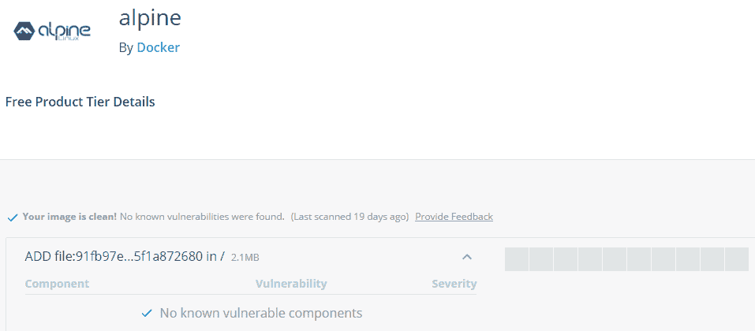

官方的 NATS 映像有一个 Nano Server 2016 变体，您可以看到该映像中有一个漏洞:


在存在漏洞的地方，您可以深入查看哪些二进制文件被标记，以及哪些文件链接到描述漏洞的 CVE 数据库。就`nats:nanoserver`映像而言，封装在 Nano Server 基础映像中的 zlib 和 SQLite 版本存在漏洞。

这些扫描结果来自 Docker Hub 上的官方映像。Docker Enterprise 也在 DTR 提供安全扫描，您可以按需运行手动扫描，或者配置对存储库的任何推送来触发扫描。我已经为 NerdDinner web 应用创建了一个存储库，它被配置为在每次映像推送时进行扫描:

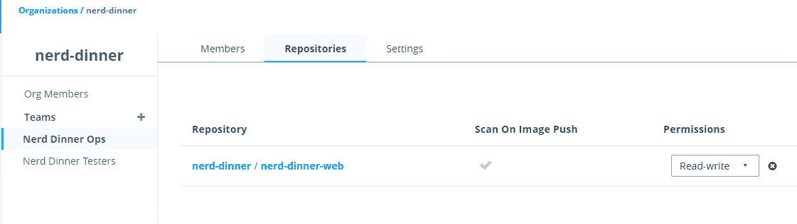

Access to this repository is based on the same security setup from [Chapter 8](08.html), *Administering and Monitoring Dockerized Solutions*, with the **nerd-dinner** organization and the **Nerd Dinner Ops** team. DTR uses the same authorization as UCP, so you build organizations and teams once in Docker Enterprise and you can use them to secure images and runtime resources. The user **elton** is in the **Nerd Dinner Ops** team, with read-write access to the **nerd-dinner-web** repository, which means access to push and pull images.

当我将映像推送到这个存储库时，Docker Trusted Registry 将开始安全扫描，从而识别映像每一层中的所有二进制文件，并在 CVE 数据库中检查它们是否存在已知漏洞。NerdDinner web 应用基于微软的 ASP.NET 映像，在撰写本文时，该映像中的组件存在已知漏洞:

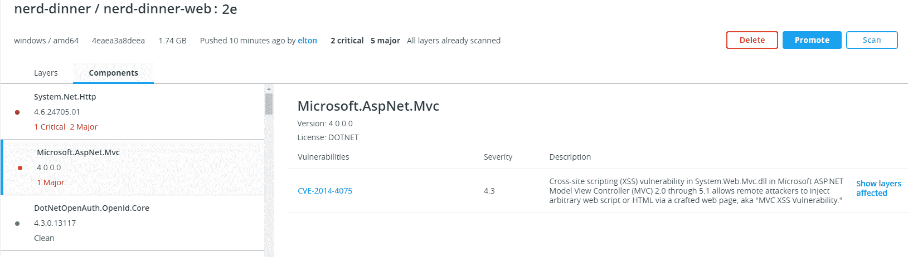

`System.Net.Http`中的问题只在 ASP.NET 核心应用中可利用，所以我可以自信地说它们不是我的问题。NET 框架应用。虽然`Microsoft.AspNet.Mvc` **跨站点脚本** ( **XSS** )问题确实适用，但我想了解更多关于该漏洞的信息，并在我的 CI 流程中添加测试，以确认攻击者无法通过我的应用利用该漏洞。

这些漏洞不在我在 Dockerfile 中添加的库中——它们在基本映像中，实际上是 ASP.NET 和 ASP.NET 核心的一部分。这与在容器中运行无关。如果您在任何版本的 Windows 上运行从 2.0 到 5.1 的任何版本的 ASP.NET MVC，那么您的生产系统中有这个 XSS 漏洞，但是您可能不知道。

当您在映像中发现漏洞时，您可以准确地看到它们的位置，并决定如何减轻它们。如果您有一个自动化测试套件，可以放心地使用它来验证您的应用在没有二进制文件的情况下仍然可以工作，那么您可以尝试完全删除二进制文件。或者，您可以决定没有从应用到易受攻击代码的路径，并保持映像原样，添加测试以确保没有方法利用该漏洞。

无论您如何管理它，知道应用栈中存在漏洞都是非常有用的。Docker 安全扫描可以在每次推送时工作，因此如果新版本引入了漏洞，您可以立即获得反馈。它还链接到 UCP，因此您可以从管理界面看到您运行的容器的映像中是否存在漏洞。

# 管理窗口更新

为 Docker 映像管理应用栈更新的过程也适用于 Windows 更新。您不会连接到正在运行的容器来更新它使用的 Node.js 版本，也不会运行 Windows Update。

微软为 Windows 发布了一套安全补丁和其他修补程序，通常是每月一次的 Windows 更新。同时，他们在 Docker Hub 和 Microsoft Container Registry 上发布新版本的 Windows Server Core 和 Nano Server 基础映像以及任何相关映像。映像标签中的版本号与 Windows 版本的修补程序号匹配。

在 Dockerfile 的`FROM`指令中明确说明要使用的 Windows 版本，并使用您安装的任何依赖项的特定版本，这是一个很好的做法。这使得您的 Dockerfile 具有确定性——将来任何时候您构建它时，您都会得到相同的映像，结果是所有的二进制文件都是相同的。

指定 Windows 版本还可以清楚地了解如何为已归档的应用管理 Windows 更新。. NET Framework 应用的 Dockerfile 可能是这样开始的:

```
FROM mcr.microsoft.com/windows/servercore:1809_KB4471332
```

这将映像固定到更新为`KB4471332`的 Windows Server 2019。这是一个可搜索的知识库标识，告诉您这是 2018 年 12 月的 Windows 更新。随着新的 Windows 基本映像的发布，您可以通过更改`FROM`指令中的标签并重建映像来更新您的应用，在这种情况下，您可以使用发布版`KB4480116`，这是 2019 年 1 月的更新:

```
FROM mcr.microsoft.com/windows/servercore:1809_KB4480116
```

我将在[第 10 章](10.html)、*中介绍自动化构建和部署，用 Docker* 为连续部署管道提供动力。有了好的配置项/光盘管道，您可以用新的窗口版本重建您的映像，并运行所有测试来确认更新不会影响任何功能。然后，通过使用`docker stack deploy`或`docker service update`，指定应用映像的新版本，您可以在不停机的情况下向所有正在运行的应用推出更新。整个过程可以自动化，所以信息技术管理员在周二补丁上的痛苦随着 Docker 消失了。

# 保护与 DTR 的软件供应链

DTR 是 Docker 扩展 EE 产品的第二部分。(我在[第 8 章](08.html)、*管理和监控备审解决方案中介绍了**通用控制平面** ( **UCP** )。* ) DTR 是一家私人 Docker 注册中心，为 Docker 平台的整体安全故事增加了一个重要部分:安全的软件供应链。

您可以使用 DTR 对 Docker 映像进行数字签名，而 DTR 允许您配置谁可以推送和拉取映像，从而安全地存储用户应用于映像的所有数字签名。它还与 UCP 合作，实施**内容信任**。借助 Docker 内容信任，您可以设置集群，使其仅运行特定用户或团队签名的映像中的容器。

这是一个强大的功能，满足了许多受监管行业的审计要求。可能会要求公司证明在生产中运行的软件实际上是由 SCM 中的代码构建的。没有软件供应链，这是很难做到的；你不得不依靠手工过程和文档记录。使用 Docker，您可以在平台上实施它，并通过自动化流程满足审核要求。

# 存储库和用户

DTR 使用与 UCP 相同的身份验证模式，因此您可以使用您的**Active Directory**(**AD**)帐户登录，也可以使用在 UCP 创建的帐户。DTR 对来自 UCP 的组织、团队和用户使用相同的授权模型，但是权限是分开的。用户可以对 DTR 的映像存储库和 UCP 从这些映像运行的服务拥有完全不同的访问权限。

DTR 授权模型的某些部分类似于 Docker Hub。用户可以拥有公共或私有存储库，这些存储库以他们的用户名作为前缀。管理员可以创建组织，组织存储库可以设置对用户和团队的访问权限，并具有良好的控制级别。

我在[第 4 章](04.html)、*与 Docker 注册表*共享映像中介绍了映像注册表和存储库。存储库的全名包含注册表主机、所有者和存储库名称。我已经使用 Docker 认证基础架构在 Azure 中建立了 Docker 企业集群。我创建了一个名为`elton`的用户，他们拥有一个私有存储库:


要为用户`elton`将映像推送到名为`private-app`的存储库，我需要在存储库名称中用完整的 DTR 域标记它。我的 DTR 实例在`dtrapp-dow2e-hvfz.centralus.cloudapp.azure.com`运行，所以我需要使用的完整映像名称是`dtrapp-dow2e-hvfz.centralus.cloudapp.azure.com/elton/private-app`:

```
docker image tag sixeyed/file-echo:nanoserver-1809 `
 dtrapp-dow2e-hvfz.centralus.cloudapp.azure.com/elton/private-app
```

这是一个私有存储库，因此只能由用户`elton`访问。DTR 提供了与任何其他 Docker 注册表相同的 API，因此我需要使用`docker login`命令登录，指定 DTR 域作为注册表地址:

```
> docker login dtrapp-dow2e-hvfz.centralus.cloudapp.azure.com
Username: elton
Password:
Login Succeeded

> docker image push dtrapp-dow2e-hvfz.centralus.cloudapp.azure.com/elton/private-app
The push refers to repository [dtrapp-dow2e-hvfz.centralus.cloudapp.azure.com/elton/private-app]
2f2b0ced10a1: Pushed
d3b13b9870f8: Pushed
81ab83c18cd9: Pushed
cc38bf58dad3: Pushed
af34821b76eb: Pushed
16575d9447bd: Pushing [==================================================>]  52.74kB
0e5e668fa837: Pushing [==================================================>]  52.74kB
3ec5dbbe3201: Pushing [==================================================>]  1.191MB
1e88b250839e: Pushing [==================================================>]  52.74kB
64cb5a75a70c: Pushing [>                                                  ]  2.703MB/143MB
eec13ab694a4: Waiting
37c182b75172: Waiting
...
...
```

如果我将存储库公开，任何可以访问 DTR 的人都可以提取映像，但是这是一个用户拥有的存储库，因此只有`elton`帐户有权推送。

这和 Docker Hub 是一样的，任何人都可以从我的`sixeyed`用户库中拉一张图片，但是只有我可以推它们。对于多个用户需要访问推送映像的共享项目，您可以使用组织。

# 组织和团队

组织支持共享存储库的所有权。组织及其拥有的存储库与拥有存储库权限的用户是分开的。特定用户可能具有管理员访问权限，而其他用户可能具有只读访问权限，特定团队可能具有读写访问权限。

The user and organization model of DTR is the same in the paid subscription tiers of Docker Hub. If you don't need the full production suite of Docker Enterprise but you need private repositories with shared access, you can use Docker Hub.

我已经为书呆子晚餐组织下的书呆子栈的更多组件创建了存储库:

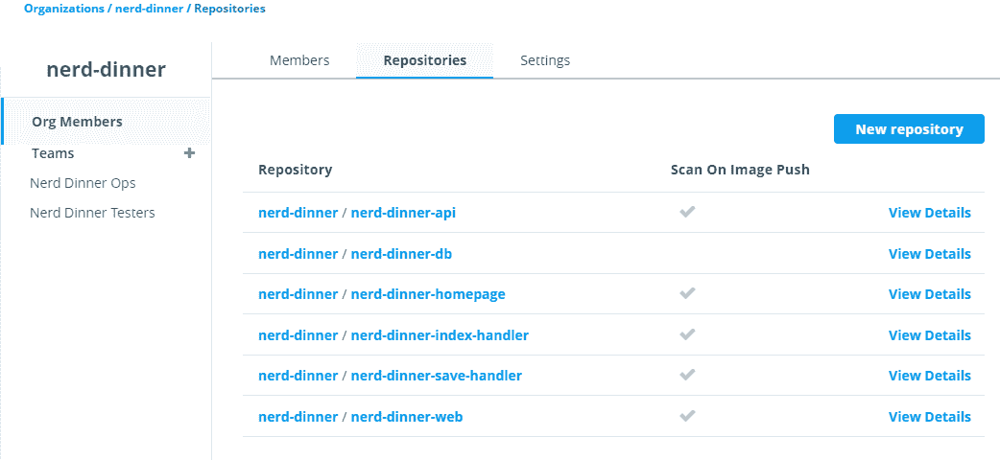

我可以授予个人用户或团队对存储库的访问权限。书呆子晚餐行动队是我在 UCP 创建的管理用户群。这些用户可以直接推送映像，因此他们可以读写所有存储库:

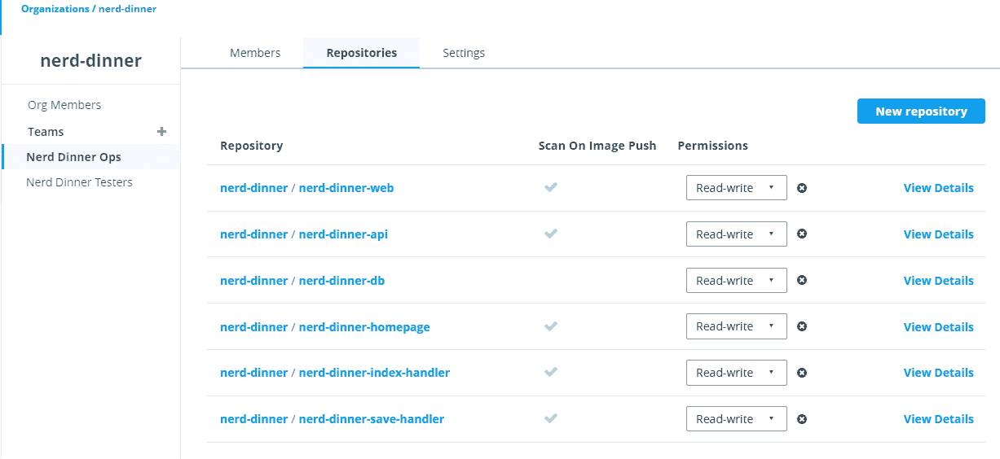

Nerd 晚餐测试人员团队只需要对存储库的读取权限，因此他们可以在本地提取映像进行测试，但不能将映像推送到注册表:

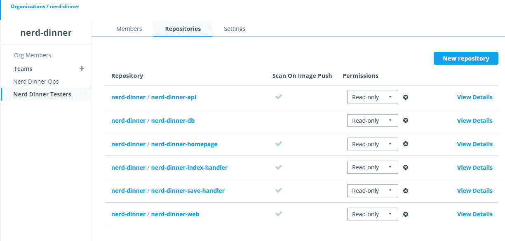

如何在 DTR 组织存储库取决于你。您可以将所有应用存储库放在一个组织下，并为可能在许多项目中使用的共享组件建立一个单独的组织，例如 NATS 和弹性搜索。这意味着共享组件可以由一个专门的团队管理，该团队可以批准更新并确保所有项目都使用相同的版本。项目团队成员拥有读取权限，因此他们总是可以获取最新的共享映像并运行完整的应用栈，但是他们只能将更新推送到他们的项目存储库。

DTR 的权限级别为无、读、读写和管理。它们可以在存储库级别应用于团队或个人用户。DTR 和 UCP 的身份验证一致但授权模式不同，这意味着开发人员可以完全访问 DTR 的拉和推映像，但可能只能读取 UCP 的运行容器。

在一个成熟的工作流程中，您不会让单个用户推送映像，而是全部自动化。您的初始推送将来自构建映像的 CI 系统，然后您将向映像添加来源层，从促销策略开始。

# DTR 的形象推广政策

许多公司在其注册表中使用多个存储库来存储应用生命周期不同阶段的映像。最简单的例子是一个用于经历不同测试阶段的映像的`nerd-dinner-test/web`存储库，以及一个用于已经被批准生产的映像的书呆子-晚餐-产品/网络存储库。

如果映像符合您指定的标准，DTR 提供了将映像从一个存储库自动复制到另一个存储库的映像推广策略。这为安全软件供应链增加了一个重要环节。配置项流程可以从每次构建中将映像推送到测试存储库，然后 DTR 可以检查映像并将其提升到生产存储库。

您可以根据扫描中发现的漏洞数量、映像标签的内容以及映像中开源组件使用的软件许可证来配置升级规则。我为从`nerd-dinner-test/web`到`nerd-dinner-prod/web`的映像升级配置了一些合理的策略:

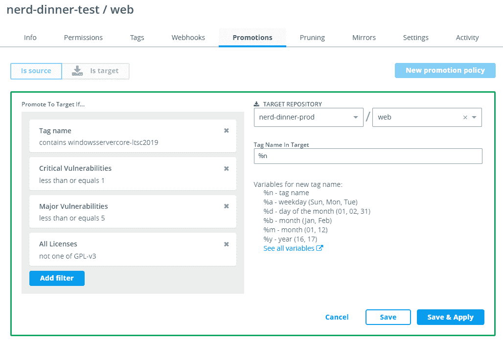

当我将符合所有标准的映像推送到测试存储库时，它会被 DTR 自动提升到生产存储库:

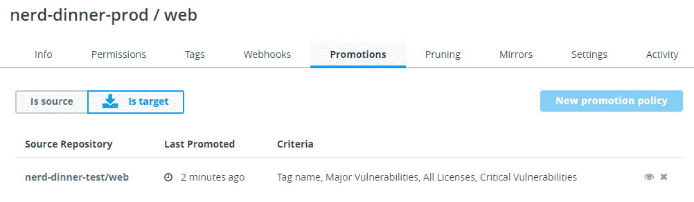

将您的生产存储库配置为没有最终用户可以直接推送到它们，这意味着映像只能通过自动化过程到达那里，例如通过 DTR 的推广。

Docker Trusted Registry 为您提供了构建安全交付管道所需的所有组件，但它并未强制要求任何特定的流程或技术。来自 DTR 的事件可以触发网络挂钩，这意味着您可以将您的注册表与几乎任何配置项系统集成。触发 webhook 的一个事件是映像升级，您可以使用它来触发新映像的自动签名。

# 映像签名和内容信任

DTR 利用 UCP 管理的客户证书，用数字签名对映像进行签名，该数字签名可以追踪到一个已知的用户账户。用户从 UCP 下载一个客户端包，其中包含他们的客户端证书的公钥和私钥，由 Docker CLI 使用。

您可以对其他系统的用户帐户使用相同的方法，这样您就可以为您的配置项服务创建一个帐户，并设置存储库，以便只有配置项帐户可以访问推送。这使您可以将映像签名集成到您的安全交付管道中，应用来自配置项流程的签名，并使用该签名来实施内容信任。

您可以使用环境变量打开 Docker 内容信任，当您将映像推送到注册表时，Docker 将使用客户端包中的密钥对它们进行签名。内容信任仅适用于特定的映像标签，而不适用于默认的`latest`标签，因为签名是针对标签存储的。

我可以将`v2`标记添加到我的私人映像中，在 PowerShell 会话中启用内容信任，并将标记的映像推送到 DTR:

```
> docker image tag `
    dtrapp-dow2e-hvfz.centralus.cloudapp.azure.com/elton/private-app `
    dtrapp-dow2e-hvfz.centralus.cloudapp.azure.com/elton/private-app:v2

> $env:DOCKER_CONTENT_TRUST=1

> >docker image push dtrapp-dow2e-hvfz.centralus.cloudapp.azure.com/elton/private-app:v2The push refers to repository [dtrapp-dow2e-hvfz.centralus.cloudapp.azure.com/elton/private-app]
2f2b0ced10a1: Layer already exists
...
v2: digest: sha256:4c830828723a89e7df25a1f6b66077c1ed09e5f99c992b5b5fbe5d3f1c6445f2 size: 3023
Signing and pushing trust metadata
Enter passphrase for root key with ID aa2544a:
Enter passphrase for new repository key with ID 2ef6158:
Repeat passphrase for new repository key with ID 2ef6158:
Finished initializing "dtrapp-dow2e-hvfz.centralus.cloudapp.azure.com/elton/private-app"
Successfully signed dtrapp-dow2e-hvfz.centralus.cloudapp.azure.com/elton/private-app:v2
```

推送映像的动作会添加数字签名，在这种情况下，使用`elton`帐户的证书并为存储库创建新的密钥对。DTR 记录了每个映像标签的签名，在 UI 中我可以看到`v2`映像标签的签名是:

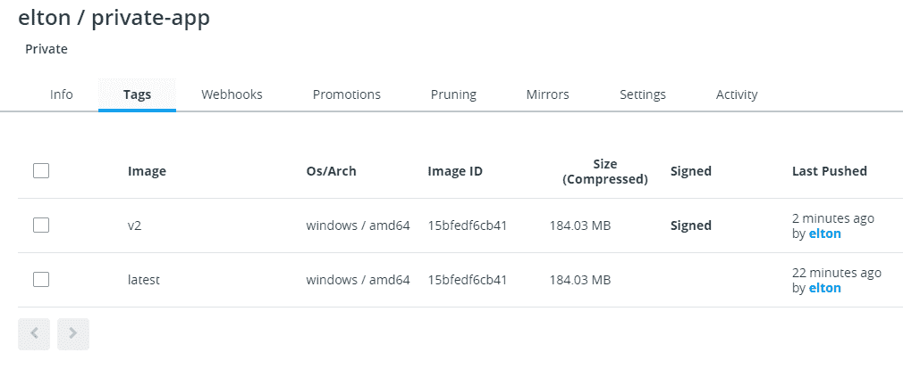

用户可以推送图片来添加自己的签名。这实现了一个批准管道，授权用户拉一个映像，运行他们需要的任何测试，然后再次推送它以确认他们的批准。

DTR uses Notary to manage access keys and signatures. Like SwarmKit and LinuxKit, Notary is an open source project that Docker integrates into a commercial product, adding features and providing support. To see image signing and content trust in action, check out my Pluralsight course, *Getting Started with Docker Datacenter*.

UCP 与 DTR 联合验证映像签名。在“管理设置”中，您可以配置 UCP，使其运行来自组织中已知团队签名的映像的容器:

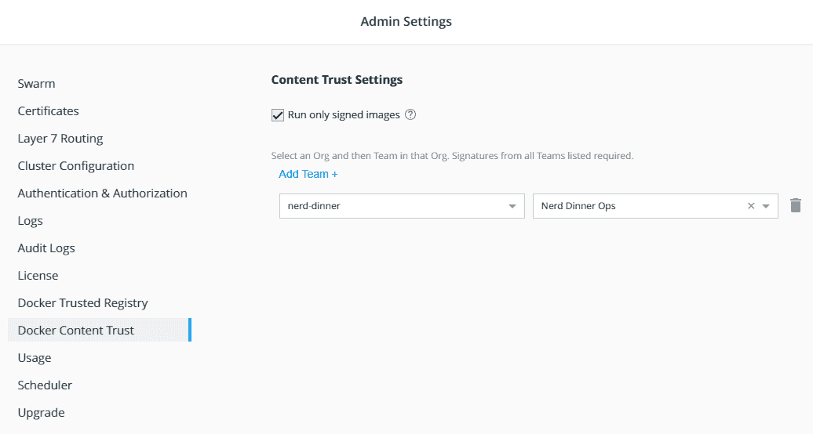

我已经配置了 Docker 内容信任，这样 UCP 将只运行由“书呆子晚餐行动”团队成员签名的容器。这明确地捕获了发布批准工作流，并且平台强制执行它。即使是管理员也无法从所需团队的用户尚未签名的映像中运行容器—UCP 将抛出一个错误，指出映像不符合签名策略:

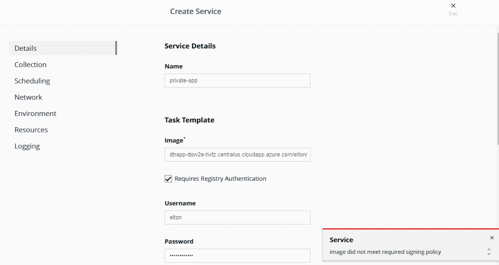

构建一个安全的软件供应链就是要建立一个自动化的管道，在这个管道中，您可以保证映像已经由一个已知的用户帐户推送，它们满足特定的质量标准，并且它们已经由一个已知的用户帐户签名。DTR 提供了使用詹金斯或 Azure DevOps 等工具将其集成到配置项管道中的所有功能。您可以使用任何自动化服务器或服务，只要它能够运行 shell 命令并响应 web hooks——这几乎是每个系统都有的。

There's a Docker Reference Architecture that covers the secure supply chain in detail, using GitLab as the example CI server and showing you how to integrate a secure delivery pipeline with Docker Hub or DTR. You can find it at [https://success.docker.com/article/secure-supply-chain](https://success.docker.com/article/secure-supply-chain).

# 金色映像

映像和注册表的最后一个安全考虑因素是用于应用映像的基础映像的来源。在生产中运行 Docker 的公司通常会限制开发人员可以用于某个集合的基本映像，这些映像已经过基础架构或安全利益相关者的批准。这组可供使用的黄金映像可能只是在文档中捕获，但是使用私有注册表更容易实施。

Windows 环境中的黄金映像可能仅限于两个选项:一个版本的 Windows Server Core 和一个版本的 Nano Server。运营团队可能会从微软的基础映像构建定制映像，而不是允许用户使用公共的微软映像。自定义映像可能会添加安全性或性能调整，或者设置一些适用于所有应用的默认值，例如打包公司的证书颁发机构证书。

使用 DTR，您可以为所有基础映像创建一个组织，其中运营团队对存储库具有读写访问权限，而所有其他用户都具有读取访问权限。检查映像是否使用了有效的基本映像只意味着检查 Dockerfile 是否使用了基本映像组织中的映像，这是一个很容易在您的配置项/光盘过程中实现自动化的测试。

黄金映像为您的组织增加了管理开销，但随着越来越多的应用转移到 Docker，这种开销变得有价值。拥有您自己的 ASP.NET 映像，并使用贵公司的默认值进行部署和配置，这使得安全团队可以轻松审核该基础映像。您还拥有自己的发行节奏和注册表的域名，因此您不需要在 Dockerfiles 中使用晦涩难懂的映像名称。

# 理解群体模式下的安全性

Docker 的深度安全方法覆盖了整个软件生命周期，从构建时的映像签名和扫描到运行时的容器隔离和管理。本章最后，我将概述在集群模式下实现的安全特性。

分布式软件提供了许多有吸引力的攻击媒介。组件之间的通信可以被拦截和修改。流氓代理可以加入网络并访问数据或运行工作负载。分布式数据存储可能会受到损害。Docker swarm 模式建立在开源的 SwarmKit 项目之上，它在平台级别处理这些向量，因此默认情况下，您的应用运行在安全的基础上。

# 节点和连接令牌

你可以通过运行`docker swarm init`切换到群体模式。该命令的输出为您提供了一个可以使用的令牌，以便其他节点可以加入群。工人和经理有各自的代币。没有令牌，节点无法加入群，因此您需要像保护任何其他机密一样保护令牌。

The join tokens are comprised of the prefix, the format version, the hash of the root key, and a cryptographically strong random string.

Docker 为令牌使用固定的`SWMTKN`前缀，因此您可以运行自动检查来查看令牌是在源代码中还是在另一个公共位置被意外共享。如果令牌被泄露，流氓节点可以加入群，如果他们可以访问您的网络。群模式可以使用特定的网络进行节点流量，因此您应该使用不可公开访问的网络。

可以使用`join-token rotate`命令轮换加入令牌，该命令可以针对工作令牌或管理令牌:

```
> docker swarm join-token --rotate worker
Successfully rotated worker join token.

To add a worker to this swarm, run the following command:

 docker swarm join --token SWMTKN-1-0ngmvmnpz0twctlya5ifu3ajy3pv8420st...  10.211.55.7:2377
```

令牌轮换是一个完全由群管理的操作。现有节点全部更新，任何错误情况，如节点脱机或加入中间循环，都得到妥善处理。

# 加密和机密

群节点之间的通信使用**传输层安全性** ( **TLS** )进行加密。创建群时，群管理器将自己配置为证书颁发机构，当每个节点加入群时，管理器会为它们生成证书。群中节点之间的通信使用相互 TLS 加密。

相互 TLS 意味着节点可以安全地相互通信和信任，因为每个节点都有一个可信的证书来标识自己。节点被分配一个证书中使用的随机标识，因此群不依赖主机名等属性，主机名可能是伪造的。

节点间的可信通信是集群模式下 Docker Secrets 的基础。机密被存储和加密在管理者的 Raft 日志中，并且只有当工作人员将要运行使用该机密的容器时，机密才被发送给该工作人员。机密总是在传输过程中使用相互 TLS 加密。在工作节点上，机密以纯文本形式存在于临时内存驱动器上，该驱动器作为卷装载呈现给容器。数据从不保存为纯文本。

Windows doesn't have a native RAM drive, so the secrets implementation currently stores the secret data on the disk on the worker nodes, with the recommendation that BitLocker is used for the system drive. Secret files are secured with ACLs on the host.

在容器内部，对机密文件的访问仅限于某些用户帐户。在 Linux 中可以指定可以访问的帐户，但是在 Windows 中，目前有一个固定的列表。我在[第 7 章](07.html)、*用 Docker Swarm* 编排分布式解决方案中使用了 ASP.NET web 应用中的机密，您可以在那里看到我配置了 IIS 应用池来使用具有访问权限的帐户。

当容器被停止、暂停或移除时，容器可用的机密将从主机中移除。在当前将机密保存到磁盘的 Windows 上，如果主机被强制关闭，则在主机重新启动时会删除机密。

# 节点标签和外部访问

一旦节点被添加到群集中，它就是要调度的容器工作负载的候选节点。许多生产部署使用约束来确保应用在正确类型的节点上运行，Docker 将尝试将请求的约束与节点上的标签相匹配。

在受监管的环境中，您可能需要确保应用仅在满足所需审核级别的服务器上运行，例如信用卡处理的 PCI 合规性。您可以使用标签来标识兼容节点，并使用约束来确保应用只在这些节点上运行。群体模式有助于确保这些约束得到正确实施。

在集群模式中有两种类型的标签:引擎标签和节点标签。引擎标签是由机器在 Docker 服务配置中设置的，因此，如果工作人员受到威胁，攻击者可以添加标签，并使他们拥有的机器看起来是兼容的。节点标签由群设置，因此只能由有权访问群管理器的用户创建。节点标签意味着您不必依赖单个节点的声明，因此，如果它们受到损害，影响可能会很有限。

节点标签在隔离对应用的访问时也很有用。您可能拥有只能在您的内部网络上访问的 Docker 主机，以及可以访问公共互联网的其他主机。有了标签，您可以显式地将其记录为一个区别，并基于标签运行带有约束的容器。您可以在一个容器中拥有一个内容管理系统，该系统只能在内部使用，但可以在公共场合使用 web 代理。

# 与容器安全技术的集成

Docker Swarm 是一个安全的容器平台，因为它使用开源组件和开放标准，所以它与第三方工具很好地集成在一起。当应用在容器中运行时，它们都公开相同的应用编程接口——您可以使用 Docker 来检查容器中运行的进程，查看日志条目，导航文件系统，甚至运行新的命令。容器安全生态系统正在发展强大的工具，利用这些工具在运行时增加更多的安全性。

如果您正在寻找 Windows 容器的扩展安全性，有两个主要供应商需要评估:Twistlock 和 Aqua Security。两者都有全面的产品套件，包括映像扫描和机密管理，以及运行时保护，这是为您的应用增加安全性的最具创新性的方式。

当您将运行时安全产品部署到集群时，它会监视容器并构建该应用典型行为的概要文件，包括 CPU 和内存使用情况以及进出的网络流量。然后，它在该应用的实例中寻找异常，其中容器开始表现得不同于预期的模型。这是一种识别应用已被破坏的强大方法，因为攻击者通常会开始运行新的进程或移动异常数量的数据。

以 Aqua Security 为例，它为 Windows 上的 Docker 提供了全套保护，扫描映像并为容器提供运行时安全控制。这包括防止容器运行不符合安全标准的映像—标记为 CVE 严重性或平均分数、黑名单和白名单包、恶意软件、敏感数据和自定义合规性检查。

Aqua 还强制实施容器不变性，将运行的容器与其原始映像进行比较，并防止更改，如安装新的可执行文件。这是防止恶意代码注入或试图绕过映像管道控件的强大方法。如果您从一个包含大量实际上不需要的组件的大型基础映像构建映像，Aqua 可以对攻击面进行分析，并将实际需要的功能和能力列入白名单。

这些功能适用于容器中的旧应用，就像适用于新的云原生应用一样。能够将安全性深入添加到应用部署的每一层，并对可疑的危害进行自动实时监控，这使得安全性成为转移到容器的最重要原因之一。

# 摘要

本章介绍了 Docker 和 Windows 容器的安全注意事项。您了解到 Docker 平台是为了深度安全而构建的，容器的运行时安全性只是故事的一部分。安全扫描、映像签名、内容信任和安全分布式通信可以结合起来，为您提供一个安全的软件供应链。

您研究了在 Docker 中运行应用的实际安全方面，并了解了 Windows 容器中的进程是如何在一个使攻击者难以逃离容器并入侵其他进程的上下文中运行的。容器进程将使用它们需要的所有计算资源，但是我还演示了如何限制 CPU 和内存的使用，这可以防止流氓容器耗尽主机的计算资源。

在一个文档化的应用中，您有更多的空间来深入实施安全性。我解释了为什么最少的映像有助于保持应用的安全，以及如何使用 Docker 安全扫描在应用使用的任何依赖关系中存在漏洞时发出警报。您可以通过对映像进行数字签名来实施良好的做法，并配置 Docker，使其仅运行来自已获批准用户签名的映像的容器。

最后，我看了 Docker Swarm 中的安全实现。Swarm 模式具有所有编排层中最深入的安全性，它为您安全运行应用提供了坚实的基础。使用机密存储敏感的应用数据和节点标签来识别主机合规性使您能够非常轻松地运行安全的解决方案，开放的应用编程接口使您能够轻松集成第三方安全增强功能，如 Aqua。

在下一章中，我们将使用分布式应用，并考虑为 CI/CD 构建一个管道。Docker 引擎可以配置为提供对 API 的远程访问，因此可以轻松地将 Docker 部署与任何构建系统集成。配置项服务器甚至可以在 Docker 容器中运行，您可以将 Docker 用于构建代理，因此您不需要任何复杂的配置项/光盘配置。