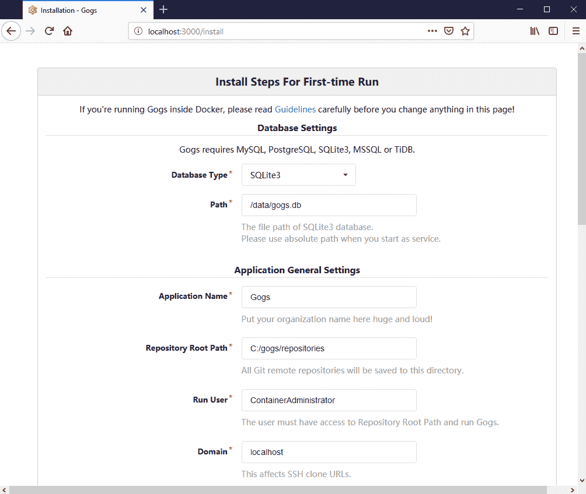
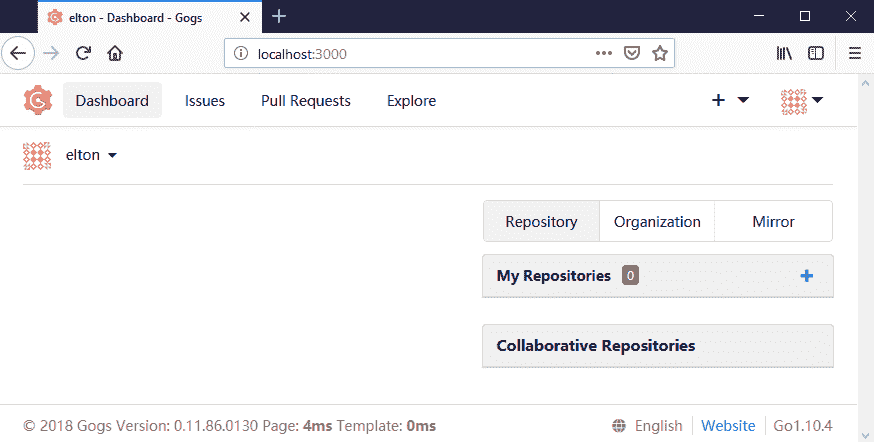
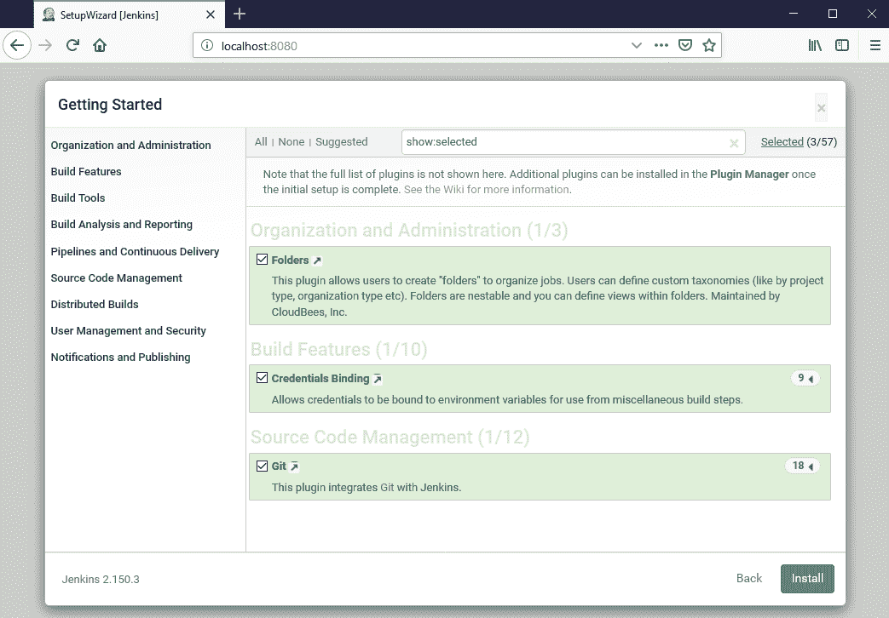
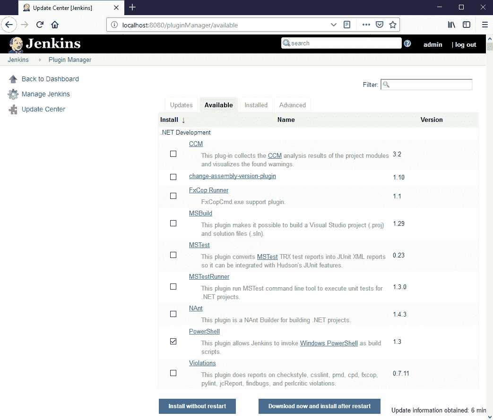
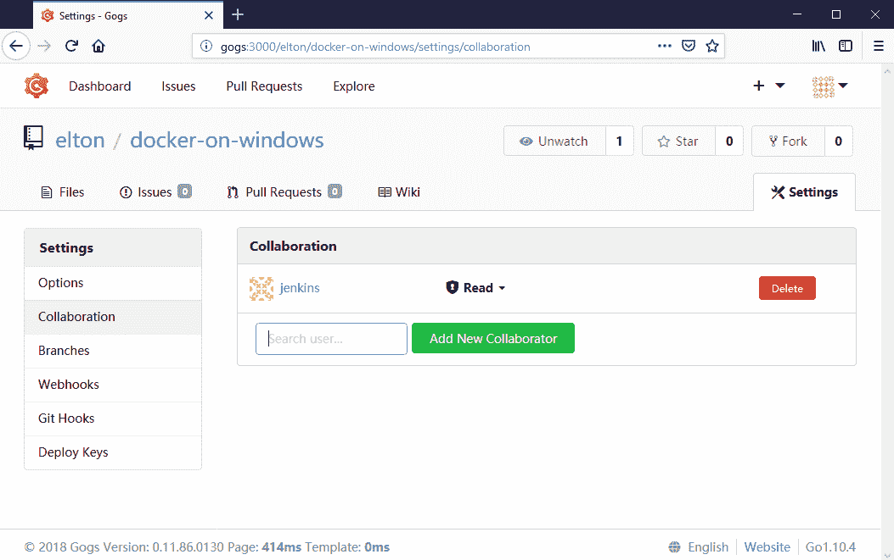
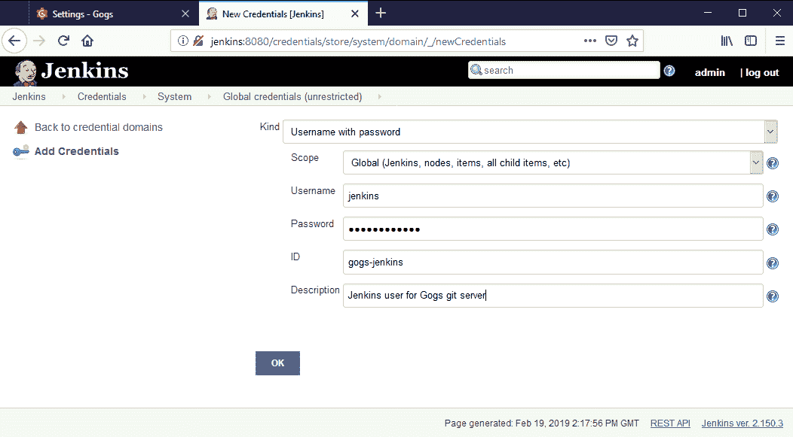
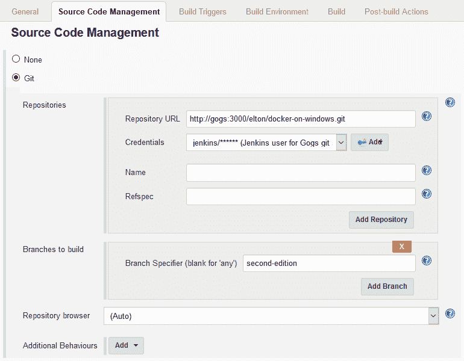
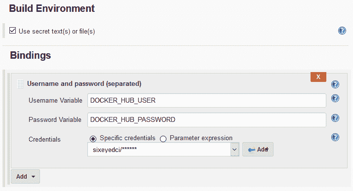
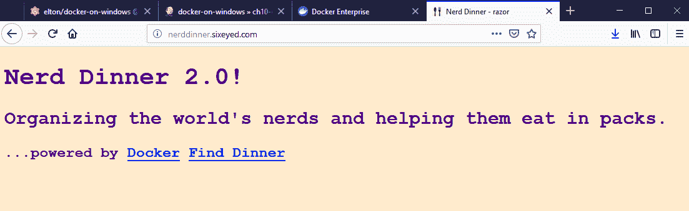

# 十、使用 Docker 为持续部署管道提供动力

Docker 支持在易于分发和管理的组件中构建和运行软件。该平台还适用于开发环境，其中源代码控制、构建服务器、构建代理和测试代理都可以在 Docker 容器中从标准映像运行。

使用 Docker 进行开发可以让您将许多项目整合到一组硬件中，同时保持隔离。您可以在 Docker Swarm 中拥有运行 Git 服务器和高可用性映像注册表的服务，许多项目都共享这些服务。每个项目都可以有一个专用的构建服务器，配置有自己的管道和构建设置，运行在一个轻量级的 Docker 容器中。

在这种环境中建立一个新项目只是在源代码管理存储库中创建一个新的存储库，在注册表中创建一个新的命名空间，并为构建过程运行新的容器。这些步骤都可以自动化，因此项目入职成为一个简单的过程，只需几分钟，并使用现有的硬件。

在本章中，我将使用 Docker 引导您完成**持续集成和持续交付** ( **CI/CD** )管道的设置。我会报道:

*   用 Docker 设计 CI/CD
*   在 Docker 中运行共享开发服务
*   在 Docker 中使用詹金斯配置配置项/光盘
*   使用詹金斯部署到远程DockerSwarm

# 技术要求

您将需要运行在 Windows 10 更新 18.09 或 Windows Server 2019 上的 Docker 来跟随示例。本章代码见[https://github . com/six eyes/docker-on-window/tree/第二版/ch10](https://github.com/sixeyed/docker-on-windows/tree/second-edition/ch10) 。

# 用 Docker 设计 CI/CD

管道将支持完全连续集成。当开发人员将代码推送到共享的源代码存储库时，这将触发生成候选版本的构建。候选版本将被标记为存储在本地注册表中的 Docker 映像。配置项工作流将构建的映像中的解决方案部署为容器，并运行端到端测试包。

我的样本管道有一个手动质量门。如果测试通过，映像版本将在 Docker Hub 上公开，管道可以在远程 Docker Swarm 上运行的公共环境中开始滚动升级。在完整的配置项/光盘环境中，您也可以在您的管道中自动部署到生产。

管道的各个阶段都将由 Docker 容器中运行的软件提供动力:

*   **源码控制** : Gogs，一个用 Go 编写的简单开源 Git 服务器
*   **构建服务器** : Jenkins，一个基于 Java 的自动化工具，使用插件支持很多工作流
*   **构建代理** : The.NET SDK 打包成 Docker 映像，在容器中编译代码
*   **测试代理** : NUnit 打包成 Docker 映像，对部署的代码运行端到端测试

Gogs 和 Jenkins 可以在 Docker Swarm 或单个 Docker 引擎上的长时间运行的容器中运行。构建和测试代理是任务容器，将由 Jenkins 运行以执行管道步骤，然后它们将退出。候选版本将被部署为一组容器，当测试完成时，这些容器将被移除。

设置它的唯一要求是让容器能够访问 Docker API——无论是在本地还是远程环境中。在本地服务器上，我将使用来自 Windows 的命名管道。对于远程 Docker Swarm，我将使用安全的 TCP 连接。我在[第 1 章](01.html)、*中介绍了保护 Docker API，使用`dockeronwindows/ch01-dockertls`映像生成 TLS 证书。您需要配置本地访问，以便 Jenkins 容器可以在开发中创建容器，并配置远程访问，以便 Jenkins 可以在公共环境中开始滚动升级。*

当开发人员将代码推送到运行 Docker 容器中 Gogs 的 Git 服务器时，这个管道的工作流就开始了。Jenkins 被配置为轮询 Gogs 存储库，如果有任何更改，它将启动构建。解决方案中的所有定制组件都使用多阶段 Dockerfiles，这些文件存储在项目的 Git 存储库中。Jenkins 为每个 Docker 文件运行`docker image build`命令，在 Jenkins 本身运行在容器中的同一个 Docker 主机上构建映像。

构建完成后，Jenkins 将解决方案作为容器部署在本地的同一个 Docker 主机上。然后，它运行端到端测试，这些测试被打包在 Docker 映像中，并作为容器在与被测试的应用相同的 Docker 网络中运行。如果所有的测试都通过了，那么最后的管道步骤将这些映像作为发布候选推送到本地注册表，并且注册表也在 Docker 容器中运行。

当您在 Docker 中运行开发工具时，您将获得与在 Docker 中运行生产工作负载时相同的好处。整个工具链变得可移植，您可以在任何您喜欢的地方运行它，并且只需要很少的计算需求。

# 在 Docker 中运行共享开发服务

源代码管理和映像注册等服务是许多项目之间共享的好选择。它们对高可用性和可靠存储有类似的要求，因此可以跨具有足够容量的集群进行部署，用于许多项目。配置项服务器可以作为共享服务运行，也可以作为每个团队或项目的单独实例运行。

我在[第 4 章](04.html)*中介绍了在 Docker 容器中运行私有注册表，并与 Docker 注册表*共享映像。在这里，我们将研究在 Docker 中运行一个 Git 服务器和一个 CI 服务器。

# 将一个 Git 服务器打包成一个 Windows Docker 映像

Gogs 是一个流行的开源 Git 服务器。它是用 Go 编写的，这是跨平台的，您可以基于最小的 Nano Server 安装或 Windows Server Core 将其打包为 Docker 映像。Gogs 是一个简单的 Git 服务器；它通过 HTTP 和 HTTPS 提供远程存储库访问，并且它有一个网络用户界面。Gogs 团队在 Docker Hub 上为 Linux 提供映像，但是您需要构建自己的映像以在 Windows 容器中运行。

在 Docker 映像中打包 Gogs 非常简单。这是一个在 Dockerfile 中编写安装指令脚本的例子，我已经为`dockeronwindows/ch10-gogs:2e`映像完成了这个过程。该映像使用从 Windows Server Core 开始的多阶段构建来下载 Gogs 版本并扩展 ZIP 文件:

```
#escape=`
FROM mcr.microsoft.com/windows/servercore:ltsc2019 as installer
SHELL ["powershell", "-Command", "$ErrorActionPreference = 'Stop';"]

ARG GOGS_VERSION="0.11.86"

RUN Write-Host "Downloading: $($env:GOGS_VERSION)"; `
    Invoke-WebRequest -Uri "https://cdn.gogs.io/$($env:GOGS_VERSION)...zip" -OutFile 'gogs.zip';

RUN Expand-Archive gogs.zip -DestinationPath C:\;
```

这里没有什么新内容，但有几点值得关注。Gogs 团队为他们的版本提供了一个 CDN，URL 使用相同的格式，所以我已经参数化了要下载的版本号。`ARG`指令使用了`0.11.86`的默认 Gogs 版本，但是我可以通过指定一个构建参数来安装不同的版本，而无需更改 Dockerfile。

为了弄清楚安装的是哪个版本，我在下载 ZIP 文件之前把它写了出来。下载在一个单独的`RUN`指令中，所以下载的文件被存储在 Docker 缓存中它自己的层中。如果我需要在 Dockerfile 中编辑后面的步骤，我可以再次构建映像，并从缓存中获取下载的文件，因此不需要重复下载。

最终的映像可能基于 Nano Server，因为 Gogs 是一种跨平台技术，但它依赖于 Git 工具，这在 Nano Server 中很难设置。用巧克力安装依赖项很简单，但是在 Nano Server 中不行。我使用`sixeyed/chocolatey`作为基础应用映像，这是 Docker Hub 上的公共映像，在 Windows Server Core 上安装了 Chocolatey，然后我为 Gogs 设置了环境:

```
FROM sixeyed/chocolatey:windowsservercore-ltsc2019

ARG GOGS_VERSION="0.11.86"
ARG GOGS_PATH="C:\gogs"

ENV GOGS_VERSION=${GOGS_VERSION} `
    GOGS_PATH=${GOGS_PATH}

EXPOSE 3000
VOLUME C:\data C:\logs C:\repositories
CMD ["gogs", "web"]
```

我将 Gogs 版本和安装路径捕获为`ARG`指令，以便可以在构建时指定它们。构建参数没有存储在最终映像中，所以我在`ENV`指令中将它们复制到环境变量中。Gogs 默认使用端口`3000`，我为所有数据、日志和存储库目录创建卷。

Gogs 是一个 Git 服务器，但它没有将 Git 包含在发行版中，这就是为什么我使用安装了 Chocolatey 的映像。我用`choco`命令行安装`git`:

```
RUN choco install -y git
```

最后，我从安装程序阶段复制扩展的`Gogs`目录，并从本地`app.ini`文件捆绑一组默认配置:

```
WORKDIR ${GOGS_PATH}
COPY app.ini ./custom/conf/app.ini
COPY --from=installer ${GOGS_PATH} .
```

构建这个映像给了我一个可以在 Windows 容器中运行的 Git 服务器。

It's not a best practice to have an application image that uses a larger base image than it needs, and includes installation tools such as Chocolatey. If my Gogs container was compromised, the attacker would have access to the `choco` command as well as all the features of PowerShell. In this case, the container won't be on a public network, so the risks are mitigated.

# 在 Docker 中运行 Gogs Git 服务器

您可以像运行任何其他容器一样运行 Gogs:将其设置为分离，发布 HTTP 端口，并使用主机装载将卷存储在容器外部的已知位置:

```
> mkdir C:\gogs\data; mkdir C:\gogs\repos

> docker container run -d -p 3000:3000 `
    --name gogs `
    -v C:\gogs\data:C:\data `
    -v C:\gogs\repos:C:\gogs\repositories `
    dockeronwindows/ch10-gogs:2e
```

Gogs 映像中捆绑了默认配置设置，但是当您第一次运行应用时，您需要完成一个安装向导。我可以浏览到`http://localhost:3000`，保留默认值，点击安装 Gogs 按钮:



现在，我可以注册用户并登录，这将我带到 Gogs 仪表板:



除了常见的 Git 特性之外，Gogs 还支持问题跟踪和拉取请求，因此它非常像 GitHub 的精简本地版本。我接着创建了一个名为`docker-on-windows`的存储库来存储这本书的源代码。要使用它，我需要在我的本地 Git 存储库中添加 Gogs 服务器作为远程服务器。

我使用了`gogs`作为容器名，所以其他容器可以通过这个名字到达 Git 服务器。我还在我的 hosts 文件中添加了一个指向本地机器的同名条目，这样我就可以在我的机器上和容器内使用相同的`gogs`名称(这在`C:\Windows\System32\drivers\etc\hosts`中):

```
#ch10 
127.0.0.1  gogs
```

I tend to do this quite a lot, adding the local machine or container IP addresses to my hosts file. I have a PowerShell alias set up to make it easier, which gets the container IP address and adds the line to the hosts file. I've blogged about this and other aliases I use at [https://blog.sixeyed.com/your-must-have-powershell-aliases-for-docker](https://blog.sixeyed.com/your-must-have-powershell-aliases-for-docker).

现在，我可以像任何其他远程 Git 服务器一样，将源代码从我的本地机器推送到 Gogs，比如 GitHub 或 GitLab。它在本地容器中运行，但对我笔记本电脑上的 Git 客户端来说是透明的:

```
> git remote add gogs http://gogs:3000/docker-on-windows.git

> git push gogs second-edition
Enumerating objects: 2736, done.
Counting objects: 100% (2736/2736), done.
Delta compression using up to 2 threads
Compressing objects: 100% (2058/2058), done.
Writing objects: 100% (2736/2736), 5.22 MiB | 5.42 MiB/s, done.
Total 2736 (delta 808), reused 2089 (delta 487)
remote: Resolving deltas: 100% (808/808), done.
To http://gogs:3000/elton/docker-on-windows.git
 * [new branch]      second-edition -> second-edition
```

Gogs 在 Docker 容器中是稳定和轻量级的。我的实例在空闲时通常使用 50 MB 内存和不到 1%的 CPU。

Running a local Git server is a good idea, even if you use a hosted service such as GitHub or GitLab. Hosted services have outages, and, although rare, they can have a significant impact on productivity. Having a local secondary running with very little cost can protect you from being impacted when the next outage occurs.

下一步是在 Docker 中运行一个 CI 服务器，它可以从 Gogs 获取代码并构建应用。

# 将配置项服务器打包到 Windows Docker 映像中

Jenkins 是一个流行的自动化服务器，用于 CI/CD。它支持具有多种触发器类型的自定义作业工作流，包括计划、配置管理轮询和手动启动。这是一个可以直接打包到 Docker 中的 Java 应用，尽管完全自动化 Jenkins 设置并不那么简单。

在本章的源代码中，我有一个`dockersamples/ch10-jenkins-base:2e`映像的 Dockerfile。这个 Dockerfile 打包了一个干净的 Jenkins 安装，在安装阶段使用 Windows Server Core 下载 Jenkins 网络存档。我使用一个参数来捕获 Jenkins 版本，安装程序也会下载 SHA256 哈希进行下载，并检查下载的文件是否已损坏:

```
WORKDIR C:\jenkins

RUN Write-Host "Downloading Jenkins version: $env:JENKINS_VERSION"; `
    Invoke-WebRequest "http://.../jenkins.war.sha256" -OutFile 'jenkins.war.sha256'; `
    Invoke-WebRequest "http://../jenkins.war" -OutFile 'jenkins.war'

RUN $env:JENKINS_SHA256=$(Get-Content -Raw jenkins.war.sha256).Split(' ')[0]; `
    if ((Get-FileHash jenkins.war -Algorithm sha256).Hash.ToLower() -ne $env:JENKINS_SHA256) {exit 1}
```

Checking the file hash for a download is an important security task to make sure that the file you download is the same as the one the publisher made available. It's a step that people typically leave out when they manually install software, but it's easy to automate in your Dockerfile and it gives you a more secure deployment.

Dockerfile 的最后阶段使用官方 OpenJDK 映像作为基础，设置环境，并从安装程序阶段下载副本:

```
FROM openjdk:8-windowsservercore-1809

ARG JENKINS_VERSION="2.150.3"
ENV JENKINS_VERSION=${JENKINS_VERSION} `
    JENKINS_HOME="C:\data"

VOLUME ${JENKINS_HOME}
EXPOSE 8080 50000
WORKDIR C:\jenkins

ENTRYPOINT java -jar C:\jenkins\jenkins.war
COPY --from=installer C:\jenkins .
```

干净的詹金斯安装没有很多有用的功能；几乎所有的功能都是由你在 Jenkins 设置好之后安装的插件提供的。这些插件中的一些也安装了它们需要的依赖项，但是其他的没有。对于我的 CI/CD 管道，我需要 Jenkins 中的一个 Git 客户端，这样它就可以连接到 Docker 中运行的 Git 服务器，我还需要 Docker CLI，这样我就可以在我的构建中使用 Docker 命令。

我可以在 Jenkins Dockerfile 中安装这些依赖项，但这会使它变得庞大且难以管理。相反，我将从其他 Docker 映像中获取这些工具。我用的是`sixeyed/git`和`sixeyed/docker-cli`，都是 Docker Hub 上的公开图片。我使用这些与詹金斯基地形象，以建立我的最终詹金斯形象。

`dockeronwindows/ch10-jenkins:2e`的 Docker 文件从基础开始，并从 Git 和 Docker 命令行界面映像复制二进制文件:

```
# escape=`
FROM dockeronwindows/ch10-jenkins-base:2e

WORKDIR C:\git
COPY --from=sixeyed/git:2.17.1-windowsservercore-ltsc2019 C:\git .

WORKDIR C:\docker
COPY --from=sixeyed/docker-cli:18.09.0-windowsservercore-ltsc2019 ["C:\\Program Files\\Docker", "."]
```

最后一行只是将所有新的刀具位置添加到系统路径中，这样 Jenkins 就可以找到它们:

```
RUN $env:PATH = 'C:\docker;' + 'C:\git\cmd;C:\git\mingw64\bin;C:\git\usr\bin;' + $env:PATH; `
    [Environment]::SetEnvironmentVariable('PATH', $env:PATH, [EnvironmentVariableTarget]::Machine)
```

对依赖项使用公共 Docker 映像给了我一个最终的 Jenkins 映像，它包含了我需要的所有组件，但是有一个使用一组可重用的源映像的可管理的 Docker 文件。现在，我可以在一个容器中运行 Jenkins，并通过安装插件来完成设置。

# 在 Docker 中运行詹金斯自动化服务器

Jenkins 将端口`8080`用于 Web UI，因此您可以使用以下命令从本章中的映像运行它，该命令映射端口并为 Jenkins 根目录挂载一个本地文件夹:

```
mkdir C:\jenkins

docker run -d -p 8080:8080 `
 -v C:\jenkins:C:\data `
 --name jenkins `
 dockeronwindows/ch10-jenkins:2e
```

Jenkins 为每个新部署生成一个随机的管理员密码。我可以在浏览网站之前从容器日志中获取密码:

```
> docker container logs jenkins
...
*************************************************************
Jenkins initial setup is required. An admin user has been created and a password generated.
Please use the following password to proceed to installation:

6467e40d9c9b4d21916c9bdb2b05bba3

This may also be found at: C:\data\secrets\initialAdminPassword
*************************************************************
```

现在，我将浏览到 localhost 上的端口`8080`，输入生成的密码，添加我需要的 Jenkins 插件。作为一个最起码的例子，我选择了定制插件安装，并选择了文件夹、凭证绑定和 Git 插件，这为我提供了所需的大部分功能:



我还需要一个插件来在构建作业中运行 PowerShell 脚本。这不是一个推荐的插件，所以它不会显示在初始设置列表中。一旦 Jenkins 启动，我将转到管理 Jenkins |管理插件，并从可用列表中选择 PowerShell，然后单击安装而不重启:



完成后，我就拥有了运行配置项/光盘管道所需的所有基础架构服务。然而，它们在定制的容器中运行。Gogs 和 Jenkins 容器中的应用已经经历了手动设置阶段，与运行它们的映像状态不同。如果我更换容器，我将失去我所做的额外设置。我可以通过从容器中创建映像来解决这个问题。

# 从正在运行的容器提交映像

您应该从 Dockerfile 构建您的映像。这是脚本中的一个可重复的过程，可以存储在源代码管理中，用于版本控制、比较和授权。但是有些应用在部署后需要额外的设置步骤，这些步骤需要手动执行。

詹金斯就是一个很好的例子。您可以使用 Jenkins 自动安装插件，但是需要额外下载 Jenkins API 并编写一些脚本。以这种方式安装时，插件依赖关系并不总是得到解决，因此手动设置插件并验证部署会更安全。完成后，您可以通过提交容器来保持最终设置，这将从容器的当前状态生成一个新的 Docker 映像。

在 Windows 上，您需要停止容器来提交它们，然后运行`docker container commit`，给出容器的名称和要创建的新映像标签:

```
> docker container stop jenkins
jenkins

> docker container commit jenkins dockeronwindows/ch10-jenkins:2e-final
sha256:96dd3caa601c3040927459bd56b46f8811f7c68e5830a1d76c28660fa726960d
```

对于我的设置，我已经提交了 Jenkins 和 Gogs，并且我有一个 Docker Compose 文件来配置它们以及注册表容器。这些都是基础设施组件，但这仍然是一个分布式解决方案。詹金斯容器将访问 Gogs 和注册表容器。这些服务都有相同的服务级别协议，所以在一个合成文件中定义它们可以让我捕获它们并一起启动所有的服务。

# 在 Docker 中使用詹金斯配置配置项/光盘

我将配置我的 Jenkins 构建作业来轮询 Git 存储库，并使用 Git 推送作为新构建的触发器。

Jenkins 将通过 Gogs 的存储库 URL 连接到 Git，构建、测试和部署解决方案的所有操作都将作为 Docker 容器运行。Gogs 服务器和 Docker 引擎具有不同的认证模型，但是 Jenkins 支持许多凭据类型。我可以配置构建作业来安全地访问主机上的源存储库和 Docker。

# 设置詹金斯凭据

Gogs 与外部身份提供者集成，并且还具有自己的基本用户名/密码认证，我正在我的设置中使用它。这在 HTTP 上是不安全的，所以，在真实环境中，我会使用 SSH 或 HTTPS 来获得 Git，要么通过在映像中打包一个**安全套接字层** ( **SSL** )证书，要么通过在 Gogs 前面使用代理服务器。

在 Gogs 管理界面的`Users`部分，我创建了一个`jenkins`用户，并授予其对`docker-on-windows` Git 存储库的读取权限，我将在我的示例 CI/CD 作业中使用该存储库:



詹金斯将从 Gogs 获取源代码库，作为`jenkins`用户进行认证。我已将用户名和密码作为全局凭据添加到 Jenkins 中，以便它们可以被任何作业使用:



一旦输入密码，Jenkins 不会显示密码，它会记录所有使用该凭据的作业的审计跟踪，因此这是一种安全的认证方式。我的 Jenkins 容器正在运行一个卷，该卷从 Windows 主机装载 Docker 命名管道，这样它就可以在不进行认证的情况下与 Docker 引擎一起工作。

As an alternative, I could connect to a remote Docker API over TCP. To authenticate with Docker, I would use the **Transport Layer Security** (**TLS**) certificates I generated when securing the Docker engine. There are three certificates—the **Certificate Authority** (**CA**), the client certificate, and the client key. They need to be passed to the Docker CLI as file paths, and Jenkins supports this with credentials that can be saved as secret files, thus storing the certificate PEM files in Jenkins.

# 配置詹金斯配置项作业

在本章中，样品溶液在`ch10-nerd-dinner`文件夹中。这是一个现代化的 NerdDinner 应用，它在前面的章节中有所发展。每个组件都有一个 Dockerfile。这使用一个多阶段构建和一组 Docker Compose 文件来构建和运行应用。

这里的文件夹结构值得一看，看看分布式应用通常是如何排列的——`src`文件夹包含所有应用和数据库源代码，`docker`文件夹包含所有 Dockerfiles，`compose`文件夹包含所有 Compose 文件。

我在 Jenkins 中创建了一个自由式作业来运行构建，并为源代码管理配置了 Git。配置 Git 很简单—我使用的存储库 URL 与我笔记本电脑上的 Git 存储库相同，我选择了 Gogs 凭据，这样 Jenkins 就可以访问它们:



Jenkins is running in a Docker container, and Gogs is running in a container on the same Docker network. I'm using the hostname `gogs`, which is the container name, so that Jenkins can reach the Git server. On my laptop, I've add `gogs` as an entry in my hosts file, so I can use the same repository URL in development and on the CI server.

Jenkins 支持多种类型的构建触发器。在这种情况下，我将按照设定的时间表轮询 Git 服务器。我使用`H/5 * * * *`作为日程频率，这意味着 Jenkins 将每五分钟检查一次存储库。如果自上次构建以来有任何新的提交，Jenkins 将运行该作业。

这就是我需要的所有作业配置，所有构建步骤现在都将使用 Docker 容器运行。

# 使用詹金斯的 Docker 构建解决方案

构建步骤使用 PowerShell，运行简单的脚本，这样就不需要依赖更复杂的 Jenkins 插件。有一些 Docker 特有的插件可以完成几项任务，比如构建映像并将它们推送到注册表，但是我可以通过基本的 PowerShell 步骤和 Docker CLI 完成我需要的一切。第一步构建所有映像:

```
cd .\ch10\ch10-nerd-dinner

docker image build -t dockeronwindows/ch10-nerd-dinner-db:2e `
                   -f .\docker\nerd-dinner-db\Dockerfile .
docker image build -t dockeronwindows/ch10-nerd-dinner-index-handler:2e `
                   -f .\docker\nerd-dinner-index-handler\Dockerfile .
docker image build -t dockeronwindows/ch10-nerd-dinner-save-handler:2e `
                   -f .\docker\nerd-dinner-save-handler\Dockerfile .
...
```

将`docker-compose build`与覆盖文件一起使用会好得多，但是 Docker Compose CLI 有一个突出的问题，这意味着它不能正确处理容器内的命名管道。当这个问题在未来的 Compose 版本中得到解决时，构建步骤将会更简单。

Docker Compose is open source, and you can check on the status of this issue on GitHub here: [https://github.com/docker/compose/issues/5934](https://github.com/docker/compose/issues/5934).

Docker 使用多阶段 Docker 文件构建映像，构建的每个步骤都在临时 Docker 容器中执行。Jenkins 本身是在一个容器中运行的，它在映像中提供了 Docker CLI。我不必在构建服务器上安装 Visual Studio，甚至不必安装。. NET 框架或.NET 核心软件开发工具包。所有的先决条件都在 Docker 映像中，所以 Jenkins 构建只需要源代码和 Docker。

# 运行并验证解决方案

Jenkins 中的下一个构建步骤将在本地部署解决方案，在 Docker 容器中运行，并验证构建是否正常工作。这一步是另一个 PowerShell 脚本，首先使用`docker container run`命令部署应用:

```
docker container run -d `
 --label ci `
 --name nerd-dinner-db `
 dockeronwindows/ch10-nerd-dinner-db:2e;

docker container run -d `
 --label ci `
 -l "traefik.frontend.rule=Host:nerd-dinner-test;PathPrefix:/" `
 -l "traefik.frontend.priority=1" `
 -e "HomePage:Enabled=false" `
 -e "DinnerApi:Enabled=false" `
 dockeronwindows/ch10-nerd-dinner-web:2e; ... 
```

在构建中使用 Docker CLI 优于 Compose 的一个优点是，我可以按照特定的顺序创建容器，这为像 NerdDinner 网站这样的慢启动应用提供了更多的时间，以便在测试它们之前做好准备。我还在所有容器上添加了一个标签`ci`，以后我可以用它来清理所有的测试容器，而不用移除任何其他容器。

完成此步骤后，所有容器都应该运行。在运行端到端测试套件(这可能是一个漫长的操作)之前，我在构建中还有另一个 PowerShell 步骤，它运行一个简单的验证测试来确保应用响应:

```
Invoke-WebRequest -UseBasicParsing http://nerd-dinner-test
```

Remember that these commands are running inside the Jenkins container, which means it can access other containers by name. I don't need to publish specific ports or inspect containers to get their IP addresses. The script starts the Traefik container with the name `nerd-dinner-test`, and all the frontend containers use that same hostname in their Traefik rules. The Jenkins job can access that URL and the app will respond if the build has been successful.

此时，应用已经由最新的源代码构建，并且都在容器中启动和运行。我已经验证了主页是可访问的，这证明该网站正在工作。构建步骤都是控制台命令，因此输出将被写入 Jenkins 中的作业日志。对于每个构建，您将看到所有输出，包括以下内容:

*   执行 Dockerfile 命令的 Docker
*   编译应用的步骤
*   Docker 启动应用容器
*   向应用发出 web 请求的 PowerShell

`Invoke-WebRequest` cmdlet 是一个简单的构建验证测试。如果构建或部署失败，它会给出一个错误，但是，如果它成功了，这仍然不意味着应用工作正常。为了对构建更有信心，我在下一个构建步骤中运行端到端集成测试。

# 在 Docker 中运行端到端测试

在本章中，我还向 NerdDinner 解决方案添加了另一个组件，它是一个测试项目，使用模拟浏览器与 web 应用进行交互。浏览器向端点发送 HTTP 请求，端点实际上是一个容器，并断言响应包含正确的内容。

`NerdDinner.EndToEndTests`项目使用 SpecFlow 来定义特性测试，陈述解决方案的预期行为。SpecFlow 测试是使用 Selenium 和 SimpleBrowser 执行的，Selenium 自动执行浏览器测试，SimpleBrowser 呈现无头浏览器。这些是可以从控制台运行的 web 测试，因此不需要 UI 组件，测试可以在 Docker 容器中执行。

如果这听起来像是要添加到您的测试基础设施中的大量技术，那么这实际上是执行应用的完全集成测试的一种非常简洁的方式，它是在使用人类语言的简单场景中指定的:

```
Feature: Nerd Dinner Homepage
    As a Nerd Dinner user
    I want to see a modern responsive homepage
    So that I'm encouraged to engage with the app

Scenario: Visit homepage
    Given I navigate to the app at "http://nerd-dinner-test"
    When I see the homepage 
    Then the heading should contain "Nerd Dinner 2.0!"
```

我有一个 Dockerfile 将测试项目构建到`dockeronwindows/ch10-nerd-dinner-e2e-tests:2e`映像中。它使用多阶段构建来编译测试项目，然后打包测试程序集。构建的最后阶段使用 Docker Hub 上安装了 NUnit Console Runner 的映像，因此它能够通过控制台运行端到端测试。当容器启动时，Dockerfile 设置一条`CMD`指令来运行所有测试:

```
FROM sixeyed/nunit:3.9.0-windowsservercore-ltsc2019

WORKDIR /e2e-tests
CMD nunit3-console NerdDinner.EndToEndTests.dll

COPY --from=builder C:\e2e-tests .
```

我可以从这个映像运行一个容器，它将启动测试套件，连接到`http://nerd-dinner-test`并断言响应中的内容包含预期的头文本。这个简单的测试实际上验证了我的新主页容器和反向代理容器都在运行，它们可以在 Docker 网络上相互访问，并且代理规则设置正确。

I only have one scenario in my tests, but because the whole stack is running in containers, it's very easy to write a suite of high-value tests that execute the key features of the app. I could build a custom database image with known test data and write simple scenarios to verify the user-login, list-dinner, and create-dinner workflows. I could even query the SQL Server container in the test assertions to make sure that new data is inserted.

詹金斯构建的下一步运行这些端到端测试。同样，这是一个简单的 PowerShell 脚本，构建端到端的 Docker 映像，然后运行一个容器。测试容器将在与应用相同的 Docker 网络中执行，因此无头浏览器可以使用 URL 中的容器名称访问 web 应用:

```
cd .\ch10\ch10-nerd-dinner

docker image build `
  -t dockeronwindows/ch10-nerd-dinner-e2e-tests:2e `
  -f .\docker\nerd-dinner-e2e-tests\Dockerfile .

$e2eId = docker container run -d dockeronwindows/ch10-nerd-dinner-e2e-tests:2e
```

NUnit 生成一个包含测试结果的 XML 文件，将其添加到 Jenkins 工作区会很有用，这样在移除所有容器后，就可以在 Jenkins UI 中查看它了。PowerShell 步骤使用`docker container cp`将该文件从容器复制到 Jenkins 工作区的当前目录中，使用从运行命令中存储的容器 ID:

```
docker container cp "$($e2eId):C:\e2e-tests\TestResult.xml" .
```

在这一步中还有一些额外的 PowerShell 来从该文件中读取 XML 并确定测试是否通过(您可以在本章的源文件夹中的`ci\04_test.ps1`文件中找到完整的脚本)。当它完成时，NUnit 的输出会回显到 Jenkins 日志中:

```
[ch10-nerd-dinner] $ powershell.exe ...
30bc931ca3941b3357e3b991ccbb4eaf71af03d6c83d95ca6ca06faeb8e46a33
*** E2E test results:
type          : Assembly
id            : 0-1002
name          : NerdDinner.EndToEndTests.dll
fullname      : NerdDinner.EndToEndTests.dll
runstate      : Runnable
testcasecount : 1
result        : Passed
start-time    : 2019-02-19 20:48:09Z
end-time      : 2019-02-19 20:48:10Z
duration      : 1.305796
total         : 1
passed        : 1
failed        : 0
warnings      : 0
inconclusive  : 0
skipped       : 0
asserts       : 2

*** Overall: Passed
```

测试完成后，数据库容器和所有其他应用容器将在测试步骤的最后部分被移除。这将使用`docker container ls`命令列出所有带有`ci`标签的容器的标识，这些容器是由该作业创建的，然后强制移除它们:

```
docker rm -f $(docker container ls --filter "label=ci" -q)
```

现在，我有一组经过测试且已知良好的应用映像。映像只存在于构建服务器上，因此下一步是将它们推送到本地注册表。

# 在 Jenkins 中标记和推送 Docker 映像

如何在构建过程中将映像推送到注册表是您的选择。您可以从用内部版本号标记每个映像开始，并将所有映像版本作为配置项内部版本的一部分推送到注册表。使用高效 Dockerfiles 的项目在构建之间的差异最小，因此您可以从缓存层中受益，并且您在注册表中使用的存储量不应过多。

如果您有大量开发变动和较短发布周期的大型项目，存储需求可能会失控。您可以转到计划推送，每天标记映像，并将最新版本推送到注册表。或者，如果您有一个带有手动质量门的管道，最终发布阶段可能会推送到注册表，因此您存储的唯一映像是有效的发布候选。

对于我的示例配置项作业，一旦测试通过，我将使用 Jenkins 内部版本号作为映像标签，将每个成功的内部版本推送到本地注册表。标记和推送映像的构建步骤是另一个 PowerShell 脚本，它使用来自 Jenkins 的`BUILD_TAG`环境变量进行标记:

```
$images = 'ch10-nerd-dinner-db:2e',
          'ch10-nerd-dinner-index-handler:2e', 
          'ch10-nerd-dinner-save-handler:2e', 
          ...

foreach ($image in $images) {
   $sourceTag = "dockeronwindows/$image"
   $targetTag = "registry:5000/dockeronwindows/$image-$($env:BUILD_TAG)"

   docker image tag $sourceTag $targetTag
   docker image push $targetTag
}
```

这个脚本使用一个简单的循环来为所有构建的映像应用一个新的标签。新标签包括我的本地注册域`registry:5000`，并添加了 Jenkins 构建标签作为后缀，这样我就可以轻松识别映像来自哪个构建。然后，它将所有映像推送到本地注册表——同样，这是在与 Jenkins 容器相同的 Docker 网络中的一个容器中运行的，因此可以通过容器名称`registry`进行访问。

My registry is only configured to use HTTP, not HTTPS, so it needs to be explicitly added as an insecure registry in the Docker Engine configuration. I covered this in [Chapter 4](04.html), *Sharing Images with Docker Registries*. The Jenkins container is using the Docker Engine on the host, so it uses the same configuration and can push to the registry that is running in another container.

几个构建完成后，我可以从我的开发笔记本电脑对注册表应用编程接口进行 REST 调用，以查询`dockeronwindows/nerd-dinner-index-handler`存储库的标签。该 API 将为我的消息处理程序应用映像提供一个所有标签的列表，这样我就可以验证它们是由 Jenkins 用正确的标签推送的:

```
> Invoke-RestMethod http://registry:5000/v2/dockeronwindows/ch10-nerd-dinner-index-handler/tags/list |
>> Select tags

tags
----
{2e-jenkins-docker-on-windows-ch10-nerd-dinner-20, 2e-jenkins-docker-on-windows-ch10-nerd-dinner-21,2e-jenkins-docker-on-windows-ch10-nerd-dinner-22}
```

詹金斯构建标签为我提供了创建映像的工作的完整路径。我还可以使用詹金斯提供的`GIT_COMMIT`环境变量来用提交标识标记映像。这使得标签更短，但是 Jenkins 构建标签包括递增的构建号，所以我总是可以通过对标签进行排序来找到最新的版本。詹金斯网络用户界面显示了每个构建的 Git 提交标识，因此很容易从作业号追溯到确切的源代码版本。

构建的配置项部分现在已经完成。对于 Git 服务器的每次新推送，Jenkins 都会编译、部署和测试应用，然后将好的映像推送到本地注册表。下一部分是将解决方案部署到公共环境中。

# 使用詹金斯部署到远程DockerSwarm

我的示例应用的工作流使用手动质量门，并将本地和外部工件的关注点分开。每次源代码推送时，解决方案都在本地部署，测试也在运行。如果通过，映像将保存到本地注册表中。最后的部署阶段是将这些映像推送到外部注册表，并将应用部署到公共环境。这模拟了一种项目方法，在这种方法中，构建发生在内部，然后批准的发布被推送到外部。

在这个例子中，我将使用 Docker Hub 上的公共存储库，并将其部署到运行在 Azure 中的多节点 Docker 企业集群中。我将继续使用 PowerShell 脚本并运行基本的`docker`命令。将映像推送到其他注册中心(如 DTR)和部署到内部 Docker Swarm 集群的原则完全相同。

我已经为部署步骤创建了一个新的 Jenkins 作业，该作业被参数化以采用要部署的版本号。版本号是配置项构建中的作业号，因此我可以随时部署已知版本。在新的工作中，我需要一些额外的证书。我已经为 Docker Swarm 管理器的 TLS 证书添加了机密文件，这将允许我连接到在 Azure 中运行的 Docker Swarm 的管理器节点。

作为发布步骤的一部分，我还将把映像推送到 Docker Hub，因此我在 Jenkins 中添加了一个用户名和密码凭据，可以用来登录 Docker Hub。为了在作业步骤中进行认证，我为部署作业中的凭据添加了绑定，这将用户名和密码公开为环境变量:



然后，我设置了命令配置，并在 PowerShell 构建步骤中使用了`docker login`，从环境变量中指定凭据:

```
docker login --username $env:DOCKER_HUB_USER --password "$env:DOCKER_HUB_PASSWORD"
```

Registry logins are executed with the Docker CLI, but the logged-in context is actually stored in the Docker Engine. When I run this step in the Jenkins container, the host where that container is running is logged in to Docker Hub using the Jenkins credentials. If you follow a similar process, you need to ensure that the job logs out after each run, or that the engine where the build server runs is secure, otherwise users could access that machine and push images as the Jenkins account.

现在，对于每个构建的映像，我从本地注册表中提取它们，为 Docker Hub 标记它们，然后将它们推送到 Hub。如果我想部署以前的版本，那么初始拉取就在那里。自生成以来，本地服务器缓存可能已被清除，因此这可确保本地注册表中存在正确的映像。对于 Docker Hub，我使用了更简单的标记格式，只是应用了版本号。

该脚本使用 PowerShell 循环来拉和推所有映像:

```
$images = 'ch10-nerd-dinner-db:2e', 
          'ch10-nerd-dinner-index-handler:2e', 
          'ch10-nerd-dinner-save-handler:2e', 
          ...  

foreach ($image in $images) { 
  $sourceTag = "registry:5000/dockeronwindows/$image...$($env:VERSION_NUMBER)"
  $targetTag = "dockeronwindows/$image-$($env:VERSION_NUMBER)"

  docker image pull $sourceTag 
  docker image tag $sourceTag $targetTag
  docker image push $targetTag
}
```

当这一步完成后，映像将在 Docker Hub 上公开。现在，部署作业的最后一步是使用这些公共映像在远程 Docker Swarm 上运行最新的应用版本。我需要生成一个包含映像标签中最新版本号的合成文件，我可以使用带有覆盖文件的`docker-compose config`来完成:

```
cd .\ch10\ch10-nerd-dinner\compose

docker-compose `
  -f .\docker-compose.yml `
  -f .\docker-compose.hybrid-swarm.yml `
  -f .\docker-compose.latest.yml `
  config > docker-stack.yml
```

`docker-compose.latest.yml`文件是命令中添加的最后一个文件，它使用由 Jenkins 填充的`VERSION_NUMBER`环境变量来创建映像标签:

```
 services:
   nerd-dinner-db:
     image: dockeronwindows/ch10-nerd-dinner-db:2e-${VERSION_NUMBER}

   nerd-dinner-save-handler:
     image: dockeronwindows/ch10-nerd-dinner-save-handler:2e-${VERSION_NUMBER}
   ...
```

The `config` command isn't affected by the issue that stops you from using Docker Compose to deploy containers when you're running inside a container using named pipes. `docker-compose config` just joins and parses the files—it doesn't communicate with the Docker Engine.

现在，我有了一个 Docker Compose 文件，其中包含了我的混合 Linux 和 Windows Docker Swarm 的所有设置，使用了 Docker Hub 的最新版本化应用映像。最后一步使用`docker stack deploy`在远程集群上实际运行栈:

```
$config = '--host', 'tcp://dow2e-swarm.westeurope.cloudapp.azure.com:2376', '--tlsverify', `
 '--tlscacert', $env:DOCKER_CA,'--tlscert', $env:DOCKER_CERT, '--tlskey', $env:DOCKER_KEY

& docker $config `
  stack deploy -c docker-stack.yml nerd-dinner
```

最后一个命令使用安全的 TCP 连接到远程集群管理器上的 Docker API。`$config`对象设置了 Docker CLI 建立连接所需的所有参数:

*   `host`是管理器节点的公共完全限定域名
*   `tlsverify`指定这是一个安全连接，CLI 应该提供客户端证书
*   `tlscacert`是群的证书颁发机构
*   `tlscert`是用户的客户端证书
*   `tlskey`是用户客户端证书的密钥

作业运行时，所有证书都以詹金斯机密文件的形式出现。当 Docker CLI 需要时，这些文件在工作区中可用；因此，这是一个无缝的安全连接。

当作业完成时，更新的服务将已经部署。Docker 将栈定义与正在运行的服务进行比较，方式与 Docker Compose 对容器进行比较的方式相同，因此只有当定义发生变化时，服务才会更新。部署作业完成后，我可以浏览到公共 DNS 条目(这是我的 Docker Swarm 集群的 CNAME)，并看到应用:



我的工作流使用两个作业，因此我可以手动控制向远程环境的发布，远程环境可以是质量保证站点，也可以是生产站点。这可以自动进行完整的光盘设置，并且您可以轻松地在詹金斯作业的基础上添加更多的功能——显示测试输出和覆盖范围，将构建加入管道，并将作业分解为可重用的部分。

# 摘要

本章介绍了 Docker 中的 CI/CD，以及在 Jenkins 中配置的示例部署工作流。我演示的过程的每个部分都在 Docker 容器中运行:Git 服务器、Jenkins 本身、构建代理、测试代理和本地注册表。

您看到用 Docker 运行您自己的开发基础设施很简单，这为您提供了托管服务的替代方案。将这些服务用于您自己的部署工作流也很简单，无论是完整的配置项/光盘还是带有门控手动步骤的单独工作流。

您看到了如何在 Docker 中配置和运行 Gogs Git 服务器和 Jenkins 自动化服务器来为工作流提供动力。在我最新的 NerdDinner 代码中，我对所有映像都使用了多阶段构建，这意味着我可以有一个非常简单的 Jenkins 设置，而不需要部署任何工具链或 SDK。

我的配置项管道是由一个开发人员将更改推送给 Git 触发的。构建作业提取源代码，编译应用组件，将它们构建到 Docker 映像中，并在 Docker 中运行应用的本地部署。然后，它在另一个容器中运行端到端测试，如果测试通过，它会标记所有映像并将其推送到本地注册表。

我演示了一个手动部署步骤，用户启动一个作业，指定要部署的构建版本。该作业将构建的映像推送到公共 Docker Hub，并通过在 Azure 中运行的 Docker Swarm 上部署栈，将更新部署到公共环境。

我在本章中使用的任何技术都没有硬依赖关系。我用 Gogs、Jenkins 和开源注册中心实现的过程也可以用 GitHub、AppVeyor 和 Docker Hub 这样的托管服务轻松实现。这个过程的所有步骤都使用简单的 PowerShell 脚本，并且可以在支持 Docker 的任何栈上运行。

在下一章中，我将回到开发人员的经验，看看在容器中运行、调试和排除应用故障的可行性。