# 十一、调试和检测应用容器

Docker 可以消除典型开发人员工作流程中的许多摩擦，并显著减少开销任务上花费的时间，例如依赖关系管理和环境配置。当开发人员使用最终产品将运行的完全相同的应用平台运行他们正在进行的更改时，出现部署错误的机会要少得多，升级路径简单易懂。

在开发过程中在容器中运行应用会给开发环境增加另一层。您将使用不同类型的资产，如 Dockerfiles 和 Docker Compose 文件，如果您的 IDE 支持这些类型，这种体验会得到改善。此外，集成开发环境和您的应用之间有一个新的运行时，因此调试体验会有所不同。您可能需要更改工作流程，以充分利用平台优势。

在这一章中，我将研究 Docker 的开发过程，包括 IDE 集成和调试，以及如何向您的 dockered 应用添加插装。您将了解到:

*   在集成开发环境中使用 Docker
*   Docker 化应用中的仪器仪表
*   Docker 中的错误修复工作流

# 技术要求

您将需要在 Windows 10 更新 18.09 或 Windows Server 2019 上运行 Docker 来完成示例。本章代码可在[https://github . com/six eyes/docker-on-window/tree/第二版/ch11](https://github.com/sixeyed/docker-on-windows/tree/second-edition/ch11) 获得。

# 在集成开发环境中使用 Docker

在前一章中，我演示了一个容器化的*外部循环*，即当开发人员推送变更时，从中央源代码管理触发的编译和打包 CI 过程。**集成开发环境** ( **IDEs** )开始支持*内部循环*的容器化工作流，这是在将更改推送到中央源代码管理之前在容器中编写、运行和调试应用的开发过程。

Visual Studio 2017 对 Docker 工件有本机支持，包括智能感知和 Docker 文件的代码完成。还有对在容器中运行的 ASP.NET 项目的运行时支持，两者都有.NET 框架和.NET 核心。在 Visual Studio 2017 中，您可以按下 *F5* 键，您的网络应用将在一个容器中启动，在 Windows 上的 Docker Desktop 中运行。该应用使用与所有其他环境中相同的基本映像和 Docker 运行时。

Visual Studio 2015 有一个为 Docker 工件提供支持的插件，Visual Studio Code 有一个非常有用的 Docker 扩展。Visual Studio 2015 和 Visual Studio Code 没有为提供集成的 *F5* 调试体验.NET 应用在 Windows 容器中运行，但是您可以手动配置它，我将在本章中演示这一点。

在容器内部调试时会有一个折衷——这意味着在内部循环和外部循环之间创建一个断开。您的开发过程使用一组不同于您的**持续集成** ( **CI** )过程的 Docker 工件，以使调试器对容器可用，并将应用程序集映射到源代码。这样做的好处是，您可以在开发中的容器中运行，拥有与您习惯的相同的开发人员构建和调试体验。缺点是您的开发 Docker 映像与您要推广测试的映像不完全相同。

减轻这种情况的一个好方法是在快速迭代一个特性时，使用本地 Docker 工件进行开发。然后，在推进变更之前，您使用仍在本地运行的 CI Docker 工件进行最终构建和端到端测试。

# Visual Studio 2017 中的 Docker

Visual Studio 2017 拥有最完整的 Docker 支持.NET IDEs。您可以在 Visual Studio 2017 中打开一个 ASP.NET 框架 Web API 项目，右键单击该项目，然后选择添加|容器编排器支持:

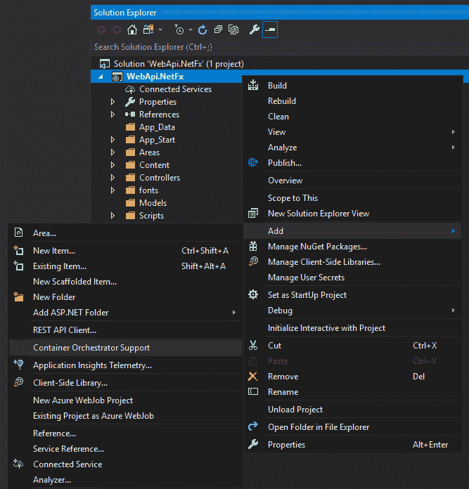

只有一个编排器选项可供选择，那就是 Docker 作曲。然后，Visual Studio 生成一组 Docker 工件。在`Web`项目中，它创建了一个如下所示的 Dockerfile:

```
FROM microsoft/aspnet:4.7.2-windowsservercore-1803
ARG source
WORKDIR /inetpub/wwwroot
COPY ${source:-obj/Docker/publish} .
```

Dockerfile 语法有完整的 IntelliSense 支持，因此您可以将鼠标悬停在指令上并查看有关它们的信息，然后使用 *Ctrl* +空格键为所有 Dockerfile 指令打开提示。

生成的 Dockerfile 使用了 ASP.NET 4 . 7 . 2 附带的`microsoft/aspnet`基本映像，该映像已完全安装和配置。在编写本文时，Dockerfile 使用的是旧版本的 Windows 基本映像，因此您需要手动将其更新为使用最新的 Windows Server 2019 基本映像，即`mcr.microsoft.com/dotnet/framework/aspnet:4.7.2-windowsservercore-ltsc2019`。

Dockerfile 看起来很奇怪，因为它使用一个 build 参数来指定源文件夹的位置，然后将该文件夹的内容复制到容器映像内部的 web 根目录`C:\inetpub\wwwroot`。

在解决方案根中，Visual Studio 创建一组 Docker 编写文件。有多个文件，Visual Studio 将它们与 Docker Compose `build`和`up`命令一起用于打包和运行应用。当你用 *F5* 键运行应用时，这在幕后工作，但值得看看 Visual Studio 如何使用它们；它向您展示了如何向不同的 IDEs 添加这种级别的支持。

# 在 Visual Studio 2017 中使用 Docker 编写进行调试

生成的 Docker 编写文件显示在顶级解决方案对象下:

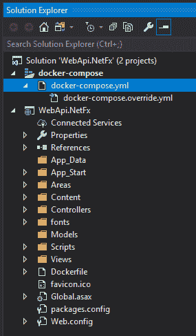

有一个基本的`docker-compose.yml`文件，将网络应用定义为服务，并包含 Dockerfile 的构建细节:

```
version: '3.4'

services:
  webapi.netfx:
    image: ${DOCKER_REGISTRY-}webapinetfx
    build:
      context: .\WebApi.NetFx
      dockerfile: Dockerfile
```

还有一个`docker-compose.override.yml`文件，添加了端口和网络配置，这样就可以在本地运行了:

```
version: '3.4'

services:
  webapi.netfx:
    ports:
      - "80"
networks:
  default:
    external:
      name: nat
```

这里没有关于构建应用的内容，因为编译是在 Visual Studio 中完成的，而不是在 Docker 中。构建的应用二进制文件存在于您的开发机器上，并被复制到容器中。当你点击 *F5* 时，容器启动，Visual Studio 在容器的 IP 地址启动浏览器。您可以在 Visual Studio 中向代码添加断点，当您从浏览器导航到该代码时，您将进入 Visual Studio 中的调试器:

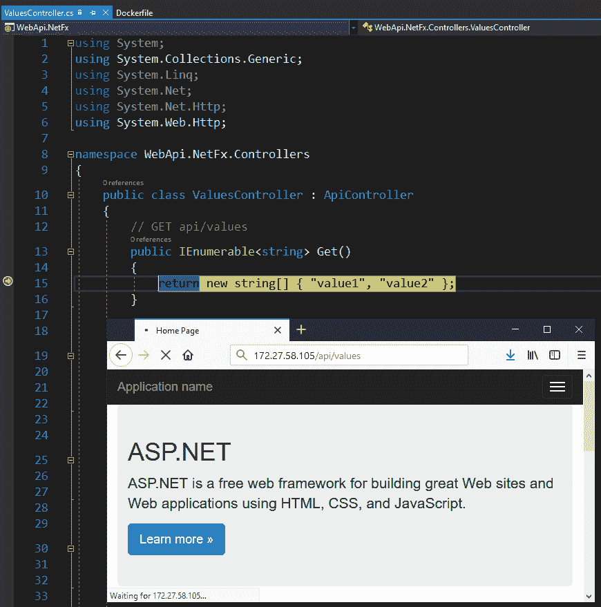

这是一种无缝的体验，但不清楚发生了什么——您机器上的 Visual Studio 调试器如何连接到容器内部的二进制文件？幸运的是，Visual Studio 会将它发出的所有 Docker 命令记录到输出窗口中，因此您可以跟踪这是如何工作的。

在构建输出窗口中，您将看到如下内容:

```
1>------ Build started: Project: WebApi.NetFx, Configuration: Debug Any CPU ------
1>  WebApi.NetFx -> C:\Users\Administrator\source\repos\WebApi.NetFx\WebApi.NetFx\bin\WebApi.NetFx.dll
2>------ Build started: Project: docker-compose, Configuration: Debug Any CPU ------
2>docker-compose  -f "C:\Users\Administrator\source\repos\WebApi.NetFx\docker-compose.yml" -f "C:\Users\Administrator\source\repos\WebApi.NetFx\docker-compose.override.yml" -f "C:\Users\Administrator\source\repos\WebApi.NetFx\obj\Docker\docker-compose.vs.debug.g.yml" -p dockercompose1902887664513455984 --no-ansi up -d
2>dockercompose1902887664513455984_webapi.netfx_1 is up-to-date
========== Build: 2 succeeded, 0 failed, 0 up-to-date, 0 skipped ==========
```

您可以看到构建首先发生，然后容器用`docker-compose up`启动。我们已经看到的`docker-compose.yml`和`docker-compose.override.yml`文件以及一个名为`docker-compose.vs.debug.g.yml`的文件被使用。Visual Studio 会在生成时生成该文件，您需要显示解决方案中的所有文件才能看到它。它包含附加的 Docker 编写设置:

```
services:
  webapi.netfx:
    image: webapinetfx:dev
    build:
      args:
        source: obj/Docker/empty/
    volumes:
      - C:\Users\Administrator\source\repos\WebApi.NetFx\WebApi.NetFx:C:\inetpub\wwwroot
      - C:\Program Files (x86)\Microsoft Visual Studio\2017\Professional\Common7\IDE\Remote Debugger:C:\remote_debugger:ro
    entrypoint: cmd /c "start /B C:\\ServiceMonitor.exe w3svc & C:\\remote_debugger\\x64\\msvsmon.exe /noauth /anyuser /silent /nostatus /noclrwarn /nosecuritywarn /nofirewallwarn /nowowwarn /timeout:2147483646"
```

这里发生了很多事情:

*   Docker 映像使用`dev`标签将其与发布版本区分开来
*   源位置的生成参数指定了一个空目录
*   卷用于从主机上的项目文件夹装载容器中的 web 根目录
*   第二个卷用于从主机在容器中装载 Visual Studio 远程调试器
*   入口点启动`ServiceMonitor`运行 IIS，然后启动`msvsmon`，这是远程调试器

在调试模式下，源代码环境变量的参数是一个空目录。Visual Studio 用一个空的`wwwroot`目录构建一个 Docker 映像，然后将源代码文件夹从宿主装载到容器的 web 根目录中，以便在运行时填充该文件夹。

当容器运行时，Visual Studio 在容器内运行一些命令来设置权限，这允许远程调试器工具工作。在 Docker 的输出窗口中，您将看到如下内容:

```
========== Debugging ==========
docker ps --filter "status=running" --filter "name=dockercompose1902887664513455984_webapi.netfx_" --format {{.ID}} -n 1
3e2b6a7cb890
docker inspect --format="{{range .NetworkSettings.Networks}}{{.IPAddress}} {{end}}" 3e2b6a7cb890
172.27.58.105 
docker exec 3e2b6a7cb890 cmd /c "C:\Windows\System32\inetsrv\appcmd.exe set config -section:system.applicationHost/applicationPools /[name='DefaultAppPool'].processModel.identityType:LocalSystem /commit:apphost & C:\Windows\System32\inetsrv\appcmd.exe set config -section:system.webServer/security/authentication/anonymousAuthentication /userName: /commit:apphost"
Applied configuration changes to section "system.applicationHost/applicationPools" for "MACHINE/WEBROOT/APPHOST" at configuration commit path "MACHINE/WEBROOT/APPHOST"
Applied configuration changes to section "system.webServer/security/authentication/anonymousAuthentication" for "MACHINE/WEBROOT/APPHOST" at configuration commit path "MACHINE/WEBROOT/APPHOST"
Launching http://172.27.58.105/ ...
```

这是 Visual Studio 获取它用 Docker Compose 启动的容器的 ID，然后运行`appcmd`来设置 IIS 应用池使用管理帐户，并设置 web 服务器允许匿名认证。

当您停止调试时，Visual Studio 2017 会保持容器在后台运行。如果您对程序进行更改并重新构建，将使用相同的容器，这样就不会有启动延迟。通过将项目位置装载到容器中，内容或二进制文件中的任何更改都会在您重建时得到反映。通过从主机挂载远程调试器，您的映像中没有任何开发工具；他们留在主机上。

这是一个内部循环过程，在这里你会得到快速的反馈。每当您更改和重建应用时，您都会在容器中看到这些更改。但是，调试模式下的 Docker 映像不可用于外环配置项进程；该应用未复制到映像中；只有当您将应用从本地源装载到容器中时，它才能工作。

为了支持外部循环，在第二个隐藏的覆盖文件`docker-compose.vs.release.g.yml`中还有一个用于发布模式的 Docker 编写覆盖文件:

```
services:
  webapi.netfx:
    build:
      args:
        source: obj/Docker/publish/
    volumes:
      - C:\Program Files (x86)\Microsoft Visual Studio\2017\Professional\Common7\IDE\Remote Debugger:C:\remote_debugger:ro
    entrypoint: cmd /c "start /B C:\\ServiceMonitor.exe w3svc & C:\\remote_debugger\\x64\\msvsmon.exe /noauth /anyuser /silent /nostatus /noclrwarn /nosecuritywarn /nofirewallwarn /nowowwarn /timeout:2147483646"
    labels:
      com.microsoft.visualstudio.debuggee.program: "C:\\app\\WebApi.NetFx.dll"
      com.microsoft.visualstudio.debuggee.workingdirectory: "C:\\app"
```

这里的区别在于，在容器中没有将本地源位置映射到 web 根目录的卷。在发布模式下编译时，源参数的值是包含 web 应用的发布位置。Visual Studio 通过将发布的应用打包到容器中来构建发布映像。

在发布模式下，您仍然可以在 Docker 容器中运行应用，并且仍然可以调试应用。但是您失去了快速反馈循环，因为要更改应用，Visual Studio 需要重建 Docker 映像并启动一个新的容器。

这是一个公平的妥协，Visual Studio 2017 中的 Docker 工具为您提供了无缝的开发体验，以及您的 CI 构建的基础。Visual Studio 2017 没有做的一件事是使用多阶段构建，因此项目编译仍然发生在宿主上，而不是容器内。这使得生成的 Docker 工件不太容易移植，所以您需要的不仅仅是 Docker 在服务器上构建这个应用。

# Visual Studio 2015 中的 Docker

Visual Studio 2015 有一个名为**的插件可以从市场上获得。这为您提供了 Docker 文件的语法高亮显示，但是它没有将 Visual Studio 与 Docker 集成在一起.NET 框架应用。使用 Visual Studio 2015，您可以将 Docker 支持添加到. NET Core 项目中，但是您需要手动编写自己的 Dockerfile 和 Docker Compose 文件来实现完整的. NET**

此外，在 Windows 容器中运行的应用没有集成调试。您仍然可以调试在容器中运行的代码，但是您需要手动配置设置。我将演示如何使用与 Visual Studio 2017 相同的方法，以及一些相同的妥协来实现这一点。

在 Visual Studio 2017 中，您可以将包含远程调试器的文件夹从主机装载到容器中。当您运行项目时，Visual Studio 启动一个容器，并从作为远程调试器代理的主机执行`msvsmon.exe`。您不需要在映像中安装任何东西来提供调试体验。

Visual Studio 2015 中的远程调试器不是那么便携。您可以从容器中的主机装载调试器，但是当您尝试启动代理时，您将看到关于丢失文件的错误。相反，您需要将远程调试器安装到映像中。

我在一个名为`ch11-webapi-vs2015`的文件夹中设置了这个。在此映像的 Dockerfile 中，如果`configuration`值设置为`debug.`，我使用构建时参数来有条件地安装调试器。这意味着我可以在安装调试器的情况下在本地构建，但是当我为部署而构建时，映像没有调试器:

```
ARG configuration

 RUN if ($env:configuration -eq 'debug') `
 { Invoke-WebRequest -OutFile c:\rtools_setup_x64.exe -UseBasicParsing -Uri http://download.microsoft.com/download/1/2/2/1225c23d-3599-48c9-a314-f7d631f43241/rtools_setup_x64.exe; `
 Start-Process c:\rtools_setup_x64.exe -ArgumentList '/install', '/quiet' -NoNewWindow -Wait }
```

在调试模式下运行时，我使用与 Visual Studio 2017 相同的方法将主机上的源目录装载到容器中，但是我创建了一个自定义网站，而不是使用默认网站:

```
ARG source
WORKDIR C:\web-app
RUN Remove-Website -Name 'Default Web Site';`
New-Website -Name 'web-app' -Port 80 -PhysicalPath 'C:\web-app'
COPY ${source:-.\Docker\publish} .
```

如果没有提供`source`参数，`COPY`指令中的`:-`语法指定了默认值。除非在`build`命令中指定，否则默认为从发布的 web 应用复制。我有一个带有基本服务定义的核心`docker-compose.yml`文件和一个`docker-compose.debug.yml`文件，该文件装载了主机源位置，映射了调试器端口，并指定了`configuration`变量:

```
services:
  ch11-webapi-vs2015:
    build:
      context: ..\
      dockerfile: .\Docker\Dockerfile
    args:
      - source=.\Docker\empty
      - configuration=debug
  ports:
    - "3702/udp"
    - "4020"
    - "4021"
  environment:
    - configuration=debug
  labels:
    - "com.microsoft.visualstudio.targetoperatingsystem=windows"
  volumes:
    - ..\WebApi.NetFx:C:\web-app
```

The label specified in the compose file attaches a key-value pair to the container. The value isn't visible inside the container, unlike an environment variable, but it is visible to external processes on the host. In this case, it is used by Visual Studio to identify the operating system of the container.

要在调试模式下启动应用，我使用两个编写文件来启动应用:

```
docker-compose -f docker-compose.yml -f docker-compose.debug.yml up -d
```

现在，容器正在使用容器内的**互联网信息服务** ( **IIS** )运行我的 web 应用，Visual Studio 远程调试器代理也在运行。我可以在 Visual Studio 2015 中连接到远程进程，并使用容器的 IP 地址:

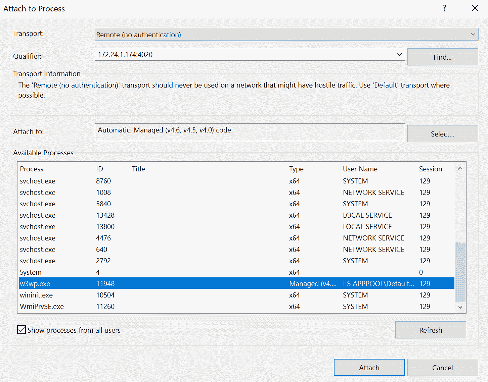

Visual Studio 中的调试器连接到容器中运行的代理，我可以添加断点和查看变量，就像调试本地进程一样。在这种方法中，容器使用主机装载 web 应用的内容。我可以停止调试器，进行更改，重新构建应用，并在同一个容器中查看更改，而无需启动新的容器。

这种方法与 Visual Studio 2017 中集成的 Docker 支持具有相同的优点和缺点。我在本地调试的容器中运行我的应用，因此我获得了 Visual Studio 调试器的所有功能，并且我的应用运行在我将在其他环境中使用的同一平台上。但是我不会使用相同的映像，因为 Dockerfile 有条件分支，所以它为调试和发布模式产生不同的输出。

在 Docker 工件中手动构建调试器支持是有好处的。您可以使用条件构建您的 Dockerfile，以便默认的`docker image build`命令生成生产就绪映像，而不需要任何额外的工件。不过，这个例子仍然没有使用多阶段构建，因此 Dockerfile 是不可移植的，应用需要在打包之前进行编译。

在开发中，您可以在调试模式下构建一次映像，运行容器，然后在需要时附加调试器。您的集成测试构建并运行产品映像，因此只有内部循环具有额外的调试器组件。

# Visual Studio 代码中的 Docker

Visual Studio Code 是一种新的跨平台 IDE，用于跨平台开发。C#扩展安装了一个调试器，可以附加到.NET Core 应用，但不支持完全调试.NET 框架应用。

Docker 扩展增加了一些非常有用的功能，包括能够将 Dockerfiles 和 Docker Compose 文件添加到已知平台的现有项目中，例如 Go 和.NET 核心。您可以将 Docker 文件添加到. NET Core 项目中，并在使用 Windows 或 Linux 容器作为基础之间进行选择-点击 *F1* ，键入`docker`，然后选择将 Docker 文件添加到工作区:

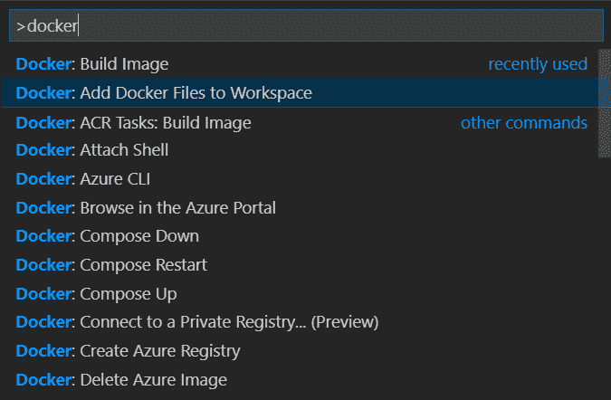

下面是为. NET 核心网络应用编程接口项目生成的 Dockerfile:

```
FROM microsoft/dotnet:2.2-aspnetcore-runtime-nanoserver-1803 AS base
WORKDIR /app
EXPOSE 80

FROM microsoft/dotnet:2.2-sdk-nanoserver-1803 AS build
WORKDIR /src
COPY ["WebApi.NetCore.csproj", "./"]
RUN dotnet restore "./WebApi.NetCore.csproj"
COPY . .
WORKDIR "/src/."
RUN dotnet build "WebApi.NetCore.csproj" -c Release -o /app

FROM build AS publish
RUN dotnet publish "WebApi.NetCore.csproj" -c Release -o /app

FROM base AS final
WORKDIR /app
COPY --from=publish /app .
ENTRYPOINT ["dotnet", "WebApi.NetCore.dll"]
```

这是使用旧版本的.NET Core 基础图片，所以第一步是用`nanoserver-1809`替换`FROM`行中的`nanoserver-1803`标签。该扩展生成一个多阶段 Dockerfile，将 SDK 映像用于构建和发布阶段，将 ASP.NET 核心运行时用于最终映像。VS 代码在 Dockerfile 中生成的阶段比您实际需要的要多，但这是一个设计选择。

VS Code also generates a `.dockerignore` file. This is a useful feature that speeds up your Docker image builds. In the ignore file, you list any file or directory paths that aren't used in your Dockerfile, and these are excluded from the build context. Excluding all the `bin`, `obj`, and `packages` folders means that the Docker CLI sends a much smaller payload to the Docker Engine when you build the image, and that can make the build much faster.

您可以使用 F1 | docker 任务来构建映像和运行容器，但是没有像 Visual Studio 2017 那样生成 docker 编写文件的功能。

Visual Studio Code 有一个非常灵活的系统来运行和调试您的项目，因此您可以添加自己的配置来为运行在 Windows 容器中的应用提供调试支持。可以编辑`launch.json`文件，在 Docker 中添加新的调试配置。

在`ch11-webapi-vscode`文件夹中，我有一个样本.NET Core 项目设置为在 Docker 中运行应用并附加调试器。它使用与 Visual Studio 2017 相同的方法。的调试器.NET Core 被称为`vsdbg`，在 Visual Studio Code 中以 C#扩展名安装，因此我使用`docker-compose.debug.yml`文件将`vsdbg`文件夹从主机挂载到容器中，同时还有源位置:

```
volumes:
  - .\bin\Debug\netcoreapp2.2:C:\app
  - ~\.vscode\extensions\ms-vscode.csharp-1.17.1\.debugger:C:\vsdbg:ro
```

This setup uses a specific version of the C# extension. That's 1.17.1 in my case, but you may have a different version. Check for the location of `vsdbg.exe` in the `.vscode` folder in your user directory.

当您使用调试覆盖文件通过 Docker Compose 运行应用时，它会启动.NET Core 应用，并使来自主机的调试器可在容器中运行。这是为`launch.json`文件中 Visual Studio 代码的调试体验而配置的。`Debug Docker container`配置指定要调试的应用类型和要附加的进程名称:

```
 "name": "Debug Docker container",
 "type": "coreclr",
 "request": "attach",
 "sourceFileMap": {
    "C:\\app": "${workspaceRoot}"
 },
"processName": "dotnet"
```

此配置还将容器中的应用根映射到主机上的源代码位置，因此调试器可以将正确的源文件与调试文件相关联。此外，调试器配置指定如何通过在命名容器上运行`docker container exec`命令来启动调试器:

```
"pipeTransport": {
 "pipeCwd": "${workspaceRoot}",
 "pipeProgram": "docker",
 "pipeArgs": [
   "exec", "-i", "webapinetcore_webapi_1"
 ],
 "debuggerPath": "C:\\vsdbg\\vsdbg.exe",
 "quoteArgs": false
}
```

要调试我的应用，我需要在调试配置中构建和运行它，使用带有覆盖文件的 Docker Compose:

```
docker-compose -f .\docker-compose.yml -f .\docker-compose.debug.yml build docker-compose -f .\docker-compose.yml -f .\docker-compose.debug.yml up -d 
```

然后，我可以使用调试操作并选择调试 Docker 容器来激活调试器:

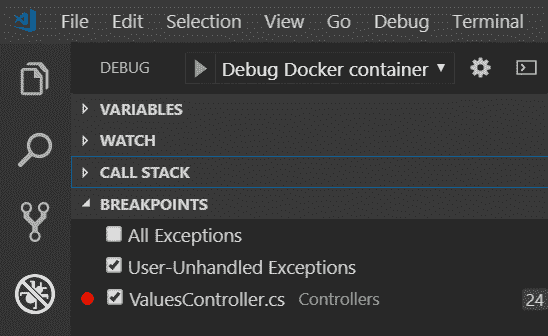

Visual Studio 代码启动.NET Core 调试器`vsdbg`在容器内部，并将其附加到正在运行的`dotnet`进程。您将看到.NET Core 应用被重定向到 Visual Studio 代码中的调试控制台窗口:

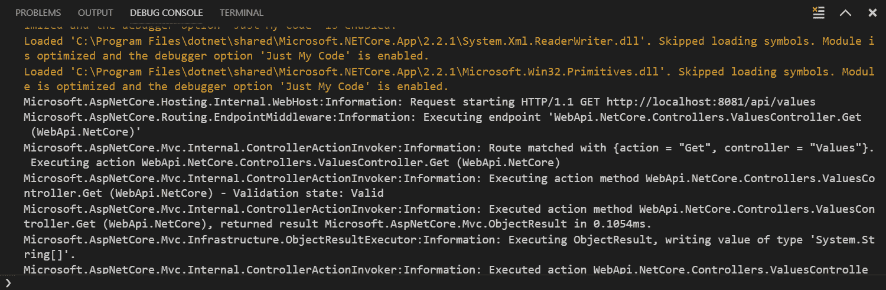

At the time of writing, Visual Studio Code doesn't fully integrate with the debugger running inside a Windows Docker container. You can place breakpoints in the code and the debugger will pause the process, but control does not pass to Visual Studio Code. This is a known issue with running the Omnisharp debugger inside a Nano Server container – it's being tracked on GitHub at: [https://github.com/OmniSharp/omnisharp-vscode/issues/1001](https://github.com/OmniSharp/omnisharp-vscode/issues/1001).

在容器中运行您的应用，并且能够从您的普通 IDE 中进行调试，这是一个巨大的好处。这意味着您的应用运行在相同的平台上，并且具有在所有其他环境中使用的相同部署配置，但是您可以像在本地运行一样单步执行代码。

IDEs 中的 Docker 支持正在迅速改进，因此我在本章中详细介绍的所有手动步骤都将很快内置到产品和扩展中。捷脑骑士是第三方的一个很好的例子.NET 集成开发环境，非常适合 Docker。它与 Docker API 集成，可以将自己的调试器附加到正在运行的容器上。

# Docker 化应用中的仪器仪表

当逻辑不像预期的那样工作时，调试你的应用就是你要做的事情，你要努力追踪出了什么问题。您不在生产中调试，因此您需要您的应用记录其行为，以帮助您跟踪发生的任何问题。

仪器经常被忽略，但是它应该是你开发的一个重要组成部分。这是了解您的应用在生产中的健康和活动的最佳方式。在 Docker 中运行您的应用为集中式日志记录和检测提供了新的机会，这样您就可以跨应用的不同部分获得一致的视图，即使它们使用不同的语言和平台。

向容器中添加工具可能是一个简单的过程。Windows 服务器核心容器已经在 Windows 性能计数器中收集了大量指标。用.NET 或 IIS 还将拥有来自这些栈的所有附加性能计数器。您可以通过向度量服务器公开性能计数器值来检测容器。

# 普罗米修斯仪器

Docker 周围的生态系统非常庞大且活跃，充分利用了平台的开放标准和可扩展性。随着生态系统的成熟，一些技术已经成为包含在几乎所有 Dockerized 应用中的强有力的候选者。

普罗米修斯是一个开源的监控解决方案。这是一个灵活的组件，可以以不同的方式使用，但是典型的实现是在 Docker 容器中运行 Prometheus 服务器，配置为读取您在其他 Docker 容器中提供的检测端点。

您将 Prometheus 配置为轮询所有容器端点，并将结果存储在时间序列数据库中。您可以通过简单地添加一个 REST API 向您的应用添加一个 Prometheus 端点，该 API 用您感兴趣收集的指标列表来响应来自 Prometheus 服务器的`GET`请求。

为了.NET 框架和.NET Core 项目中，有一个 NuGet 包可以为您做到这一点，即在您的应用中添加一个 Prometheus 端点。默认情况下，它公开了一组有用的指标，包括键值.NET 统计信息和 Windows 性能计数器。您可以将普罗米修斯支持直接添加到您的应用中，也可以在您的应用旁边运行普罗米修斯导出器。

您采取的方法将取决于您想要检测的应用类型。如果这是遗产.NET Framework 应用，您可以通过在 Docker 映像中打包一个 Prometheus 导出器来添加基本的工具，这将为您提供关于应用的指标，而无需更改代码。对于新的应用，您可以编写代码向普罗米修斯公开特定的应用指标。

# 暴露.NET 应用度量到普罗米修斯

`prometheus-net` NuGet 包提供了一组默认的度量收集器和一个`MetricServer`类，该类提供了普罗米修斯挂接的检测端点。这个包非常适合将普罗米修斯支持添加到任何应用中。这些指标由一个自托管的 HTTP 端点提供，您可以为您的应用提供自定义指标。

在`dockeronwindows/ch11-api-with-metrics`映像中，我将普罗米修斯支持添加到了一个网络应用编程接口项目中。配置和启动度量端点的代码在`PrometheusServer`类中:

```
public static void Start()
{
  _Server = new MetricServer(50505);
  _Server.Start();
}
```

这将启动一个新的`MetricServer`实例监听端口`50505`，并运行默认的.NET 统计和性能计数器收集器，由`NuGet`包提供。这些是按需收集器，这意味着当普罗米修斯服务器调用端点时，它们会提供指标。

`MetricServer`类还将返回您在应用中设置的任何自定义指标。普罗米修斯支持不同类型的指标。最简单的是计数器，它只是一个递增的计数器——普罗米修斯向你的应用查询度量值，应用为每个计数器返回一个数字。在`ValuesController`类中，我设置了一些计数器来记录对 API 的请求和响应:

```
private Counter _requestCounter = Metrics.CreateCounter("ValuesController_Requests", 
                                                         "Request count", "method", "url");

private Counter _responseCounter = Metrics.CreateCounter("ValuesController_Responses", 
                                                         "Response count", "code", "url");
```

当请求进入控制器时，控制器操作方法通过在计数器对象上调用`Inc()`方法来增加 URL 的请求计数和响应代码的状态计数:

```
public IHttpActionResult Get()
{
  _requestCounter.Labels("GET", "/").Inc();
  _responseCounter.Labels("200", "/").Inc();
  return Ok(new string[] { "value1", "value2" });
}
```

普罗米修斯有各种其他类型的指标，您可以使用它们来记录关于您的应用的关键信息——计数器只会增加，但仪表会增加和减少，因此它们对记录快照很有用。普罗米修斯用您提供的时间戳和一组任意标签记录每个度量值。在这种情况下，我将把`URL`和`HTTP`方法添加到请求计数中，把 URL 和状态代码添加到响应计数中。我可以用这些来聚合或过滤普罗米修斯中的指标。

我在网络应用编程接口控制器中设置的计数器为我提供了一组自定义指标，显示了哪些端点正在被使用以及响应的状态。这些是由`NuGet`包中的服务器组件公开的，还有记录系统性能的默认指标。在此应用的 Dockerfile 中，普罗米修斯端点还有两行:

```
EXPOSE 50505
RUN netsh http add urlacl url=http://+:50505/metrics user=BUILTIN\IIS_IUSRS; `
    net localgroup 'Performance Monitor Users' 'IIS APPPOOL\DefaultAppPool' /add
```

第一行只是公开了我用于度量端点的自定义端口。第二行设置该端点所需的权限。在这种情况下，度量端点托管在 ASP.NET 应用中，因此 IIS 用户帐户需要权限来侦听自定义端口和访问系统性能计数器。

您可以用通常的方式构建 Dockerfile 并从映像运行一个容器，即通过用`-P`发布所有端口:

```
docker container run -d -P --name api dockeronwindows/ch11-api-with-metrics:2e
```

为了检查度量是否被记录和公开，我可以运行一些 PowerShell 命令来获取容器的端口，然后对 API 端点进行一些调用并检查度量:

```
$apiPort = $(docker container port api 80).Split(':')[1]
for ($i=0; $i -lt 10; $i++) {
 iwr -useb "http://localhost:$apiPort/api/values"
}

$metricsPort = $(docker container port api 50505).Split(':')[1]
(iwr -useb "http://localhost:$metricsPort/metrics").Content
```

您将看到一个标准的纯文本列表，按名称和标签分组。每个指标还包含普罗米修斯的元数据，包括指标名称、类型和友好描述:

```
# HELP process_num_threads Total number of threads
# TYPE process_num_threads gauge
process_num_threads 27
# HELP dotnet_total_memory_bytes Total known allocated memory
# TYPE dotnet_total_memory_bytes gauge
dotnet_total_memory_bytes 8519592
# HELP process_virtual_memory_bytes Virtual memory size in bytes.
# TYPE process_virtual_memory_bytes gauge
process_virtual_memory_bytes 2212962820096
# HELP process_cpu_seconds_total Total user and system CPU time spent in seconds.
# TYPE process_cpu_seconds_total counter
process_cpu_seconds_total 1.734375
...
# HELP ValuesController_Requests Request count
# TYPE ValuesController_Requests counter
ValuesController_Requests{method="GET",url="/"} 10
# HELP ValuesController_Responses Response count
# TYPE ValuesController_Responses counter
ValuesController_Responses{code="200",url="/"} 10
```

完整的输出要大得多。在这个片段中，我展示了线程总数、分配的内存和 CPU 使用情况，这些都来自标准的 Windows 和.NET 性能计数器。我还展示了定制的 HTTP 请求和响应计数器。

我在这个应用中的自定义计数器显示 URL 和响应代码。在这种情况下，我可以看到对值控制器根 URL 的 10 个请求，以及 10 个带有 OK 状态代码`200`的响应。在本章的后面，我将向您展示如何使用 Grafana 可视化这些统计数据。

将`NuGet`包添加到项目中并运行`MetricServer`是对源代码的简单扩展。它让我可以记录任何有用的指标，但这确实意味着要改变应用，所以它只适用于正在积极开发的应用。

在某些情况下，您可能希望在不改变要检测的应用的情况下添加监控。在这种情况下，你可以在你的应用旁边运行一个**导出器**。导出器从您的应用流程中提取指标，并将其展示给普罗米修斯。在 Windows 容器中，您可以从标准性能计数器中获得许多有用的信息。

# 在现有应用旁边添加普罗米修斯导出器

在 Dockerized 解决方案中，Prometheus 将对从容器公开的度量端点进行计划调用，并将存储结果。对于现有的应用，您不需要添加度量端点，您可以在当前应用旁边运行一个控制台应用，并将度量端点托管在该控制台应用中。

我已经在第 10 章、*的 NerdDinner web 应用中添加了一个 Prometheus 端点，使用 Docker* 为持续部署管道提供动力，而无需更改任何代码。在`dockeronwindows/ch11-nerd-dinner-web-with-metrics`映像中，我添加了一个控制台应用，它导出 ASP.NET 性能计数器并提供指标端点。ASP.NET 出口商应用来自 Docker Hub 上的一个公众形象。NerdDinner 的完整 Dockerfile 复制导出器的二进制文件，并为容器设置启动命令:

```
#escape=`
FROM dockeronwindows/ch10-nerd-dinner-web:2e

EXPOSE 50505
ENV COLLECTOR_CONFIG_PATH="w3svc-collectors.json"

WORKDIR C:\aspnet-exporter
COPY --from=dockersamples/aspnet-monitoring-exporter:4.7.2-windowsservercore-ltsc2019 C:\aspnet-exporter .

ENTRYPOINT ["powershell"]
CMD Start-Service W3SVC; `
    Invoke-WebRequest http://localhost -UseBasicParsing | Out-Null; `
    Start-Process -NoNewWindow C:\aspnet-exporter\aspnet-exporter.exe; `
    netsh http flush logbuffer | Out-Null; `
    Get-Content -path 'C:\iislog\W3SVC\u_extend1.log' -Tail 1 -Wait 
```

`aspnet-exporter.exe`控制台应用实现了一个自定义指标收集器，它读取系统上运行的一个命名进程的性能计数器值。它使用与 NuGet 包中默认收集器相同的一组计数器，但是它的目标是不同的进程。导出器读取 IIS `w3wp.exe`进程的性能计数器，并被配置为导出关键的 IIS 指标。

The source code for the exporter is all on GitHub in the `dockersamples/aspnet-monitoring` repository.

控制台导出器是一个轻量级组件。它在容器启动时启动，并在容器运行期间保持运行。它仅在调用度量端点时使用计算资源，因此在普罗米修斯计划中运行时影响最小。我以通常的方式运行 NerdDinner(这里，我只是运行 ASP.NET 组件，而不是完整的解决方案):

```
docker container run -d -P --name nerd-dinner dockeronwindows/ch11-nerd-dinner-web-with-metrics:2e
```

我可以以通常的方式获取容器端口并浏览到 NerdDinner。然后，我还可以浏览到导出应用端口上的度量端点，该端点发布 IIS 性能计数器:

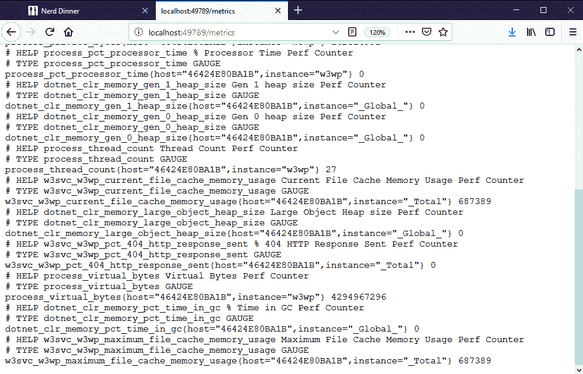

在这种情况下，应用中没有自定义计数器，所有指标都来自标准的 Windows 和.NET 性能计数器。导出器应用可以为正在运行的`w3wp`进程读取这些性能计数器值，因此应用不需要更改就可以向普罗米修斯提供基本信息。

这些是运行时指标，告诉您 IIS 在容器中工作有多努力。您可以看到活动线程的数量、内存使用情况以及 IIS 文件缓存的大小。还有 IIS 响应的 HTTP 状态代码百分比的指标，因此您可以看到是否有大量的 404 或 500 个错误。

要记录定制的应用度量，您需要测试您的代码并明确记录您感兴趣的数据点。您需要为此付出努力，但结果是一个仪表化的应用，除了.NET 运行时度量。

向您的 Dockerized 应用添加工具意味着为 Prometheus 查询提供度量端点。普罗米修斯服务器本身运行在一个 Docker 容器中，您可以用想要监控的服务来配置它。

# 在 Windows Docker 容器中运行普罗米修斯服务器

Prometheus 是用 Go 编写的跨平台应用，因此可以在 Windows 容器或 Linux 容器中运行。像其他开源项目一样，该团队在 Docker Hub 上发布了一个 Linux 映像，但是您需要构建自己的 Windows 映像。我正在使用一个现有的映像，该映像将普罗米修斯打包到一个 Windows Server 2019 容器中，该容器来自我为 ASP.NET 出口商使用的 GitHub 上的同一个`dockersamples/aspnet-monitoring`示例。

普罗米修斯的 Dockerfile 没有做任何你在本书中已经看过很多次的事情——它下载发布文件，提取它，并设置运行时环境。普罗米修斯服务器有多种功能:它运行计划的作业来轮询指标端点，它将数据存储在时间序列数据库中，它提供了一个 REST API 来查询数据库，并提供了一个简单的 Web UI 来导航数据。

我需要为调度器添加我自己的配置，这可以通过运行一个容器并为配置文件挂载一个卷，或者在集群模式下使用 Docker 配置对象来实现。我的指标端点的配置是相当静态的，所以最好将一组默认配置捆绑到我自己的 Prometheus 映像中。我已经用`dockeronwindows/ch11-prometheus:2e`做了，它有一个非常简单的 Dockerfile:

```
FROM dockersamples/aspnet-monitoring-prometheus:2.3.1-windowsservercore-ltsc2019
COPY prometheus.yml /etc/prometheus/prometheus.yml
```

我已经有了从我的仪表化应用编程接口和 NerdDinner 网络映像运行的容器，这些容器公开了供 Prometheus 使用的度量端点。为了在普罗米修斯中监控它们，我需要在`prometheus.yml`配置文件中指定度量位置。普罗米修斯将按照可配置的时间表轮询这些端点。它称之为**刮擦**，我已经在`scrape_configs`部分添加了我的容器名称和港口:

```
global:
  scrape_interval: 5s

scrape_configs:
  - job_name: 'Api'
    static_configs:
      - targets: ['api:50505']

  - job_name: 'NerdDinnerWeb'
    static_configs:
      - targets: ['nerd-dinner:50505']
```

每个要监视的应用都被指定为一个作业，每个端点都被列为一个目标。普罗米修斯将在同一个 Docker 网络上的一个容器中运行，所以我可以通过容器名称来引用目标。

This setup is for a single Docker Engine, but you can use the same approach with Prometheus to monitor services running across multiple replicas, just using different configuration settings. I cover that in detail for Windows and Linux containers in my Pluralsight course, *Monitoring Containerized Application Health with Docker.*

现在，我可以在一个容器中启动普罗米修斯服务器:

```
docker container run -d -P --name prometheus dockeronwindows/ch11-prometheus:2e
```

普罗米修斯轮询所有配置的指标端点并存储数据。您可以使用普罗米修斯作为丰富的用户界面组件(如 Grafana)的后端，将所有运行时关键绩效指标构建到一个仪表板中。对于基本监控，普罗米修斯服务器有一个简单的网络用户界面在端口`9090`上监听。

我可以去普罗米修斯容器的发布端口，对它从我的应用容器中抓取的数据运行一些查询。普罗米修斯用户界面可以显示原始数据，或随时间变化的聚合图形。下面是 REST API 应用发送的 HTTP 响应:

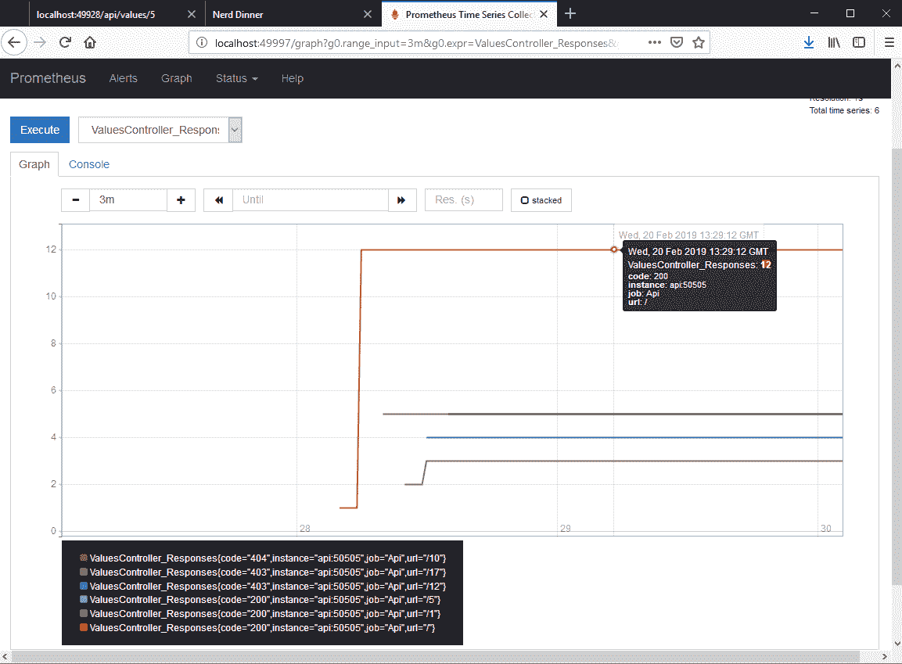

您可以看到，每个不同的标签值都有单独的行，因此我可以看到来自不同 URL 的不同响应代码。这些计数器随着容器寿命的增加而增加，因此图表总是向上。普罗米修斯有一套丰富的功能，因此您也可以绘制一段时间内的变化率，汇总指标，并选择数据的预测。

普罗米修斯`NuGet`包中的其他计数器是快照，例如性能计数器统计。我可以看到 IIS 每秒从 NerdDinner 容器处理的请求数:

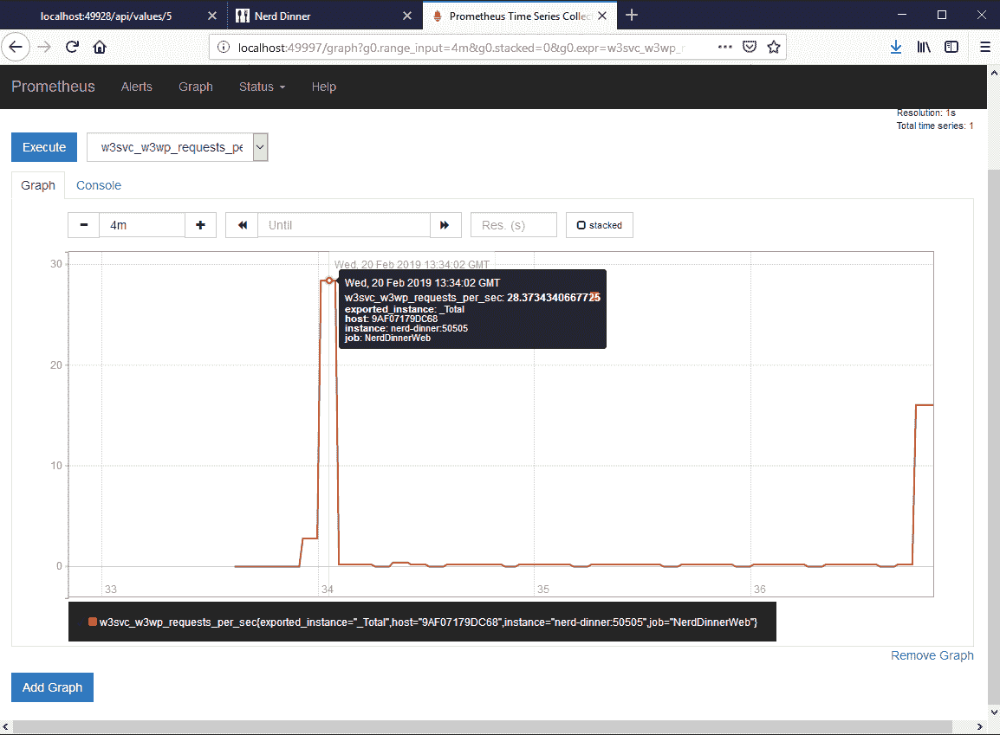

公制名称在普罗米修斯中很重要。如果我想比较. NET Console 和 ASP.NET 应用的内存使用情况，那么我可以查询两组值是否具有相同的度量名称，类似于`process_working_set`。每个指标的标签标识哪个服务提供数据，因此您可以跨所有服务进行聚合或筛选到特定的服务。您还应该包含每个容器的标识符作为度量标签。导出应用添加服务器主机名作为标签。这实际上是容器标识，所以当您大规模运行时，您可以聚合整个服务或查看单个容器。

在[第 8 章](08.html)*管理和监控 Docker 化解决方案*中，我演示了 Docker 企业中的**通用控制平面**(**UCP**)**容器即服务** ( **CaaS** )平台。启动和管理 Docker 容器的标准 API 让这个工具提供了一个统一的管理和行政体验。Docker 平台的开放性让开源工具可以采用相同的方法来进行丰富、整合的监控。

普罗米修斯就是一个很好的例子。它作为轻量级服务器运行，非常适合在容器中运行。您可以通过在应用中添加度量端点，或者在现有应用旁边运行度量导出器，在应用中添加对普罗米修斯的支持。Docker 引擎本身可以配置为导出 Prometheus 指标，因此您可以收集关于容器和节点运行状况的低级指标。

您只需要这些指标就可以启动一个丰富的仪表板，让您一目了然地了解应用的运行状况。

# 在格拉夫纳构建应用仪表板

Grafana 是一个可视化数据的网络用户界面。它可以读取许多数据源，包括时间序列数据库(如普罗米修斯)和关系数据库(如 SQL Server)。您可以在 Grafana 中构建仪表板，显示整个应用资产的运行状况，包括业务关键绩效指标、应用和运行时指标以及基础架构运行状况。

您通常在一个容器化的应用中添加 Grafana 来呈现来自普罗米修斯的数据。您也可以在一个容器中运行 Grafana，并且可以打包您的 Docker 映像，以便内置仪表板、用户帐户和数据库连接。在本章的最后部分，我已经在`dockeronwindows/ch11-grafana:2e`映像中这样做了。Grafana 团队不在 Docker Hub 上发布 Windows 映像，因此我的 Dockerfile 从一个示例映像开始，并添加了我的设置的所有配置:

```
# escape=`
FROM dockersamples/aspnet-monitoring-grafana:5.2.1-windowsservercore-ltsc2019
SHELL ["powershell", "-Command", "$ErrorActionPreference = 'Stop';"]

COPY datasource-prometheus.yaml \grafana\conf\provisioning\datasources\
COPY dashboard-provider.yaml \grafana\conf\provisioning\dashboards\
COPY dashboard.json \var\lib\grafana\dashboards\

COPY init.ps1 .
RUN .\init.ps1 
```

Grafana 有两种自动化部署的方法。第一个只是使用已知位置的文件，我用它来设置普罗米修斯数据源、仪表板和仪表板提供程序，仪表板提供程序只是将 Grafana 指向仪表板的目录。第二个使用 REST API 进行认证和授权，我的`init.ps1`脚本使用该 API 创建一个可以访问仪表板的只读用户。

用 Grafana 创建自己的仪表板很简单。您可以为特定类型的可视化创建面板，数字、图形、热图、交通灯和表格都受支持。然后，将面板连接到数据源并指定查询。通常，您会使用普罗米修斯用户界面来微调查询，然后将其添加到格拉夫纳。为了节省时间，我的映像附带了一个现成的仪表板。

我将从`ch11`文件夹中的 Docker Compose 文件开始监控解决方案，然后浏览到 API 和网站生成一些流量。现在，我可以浏览到 Grafana 并使用用户名`viewer`和密码`readonly`登录，我将看到仪表板:

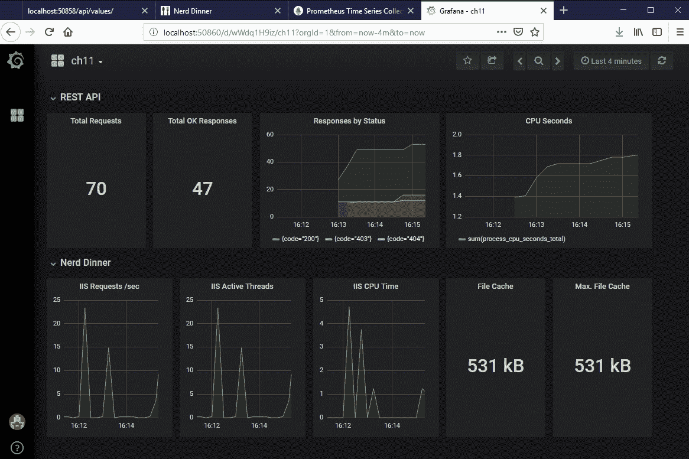

这只是一个示例仪表板，但它让您知道您可以呈现多少信息。我有一行是 REST API，显示了 HTTP 请求和响应的细分，以及 CPU 使用的整体视图。我还有一行用于 NerdDinner，显示来自 IIS 的性能指标和缓存使用情况的标题统计。

您可以不费吹灰之力将工具添加到所有应用中，并构建一个详细的仪表板，让您了解解决方案中正在发生的事情。此外，您可以在每个环境中拥有完全相同的监控设施，因此在开发和测试中，您可以看到与生产中使用的相同的指标。这对于跟踪性能问题非常有用。开发人员可以为性能问题添加新的度量和可视化，修复问题，并且当更改生效时，它将包括可以在生产中跟踪的新度量。

本章我要讲的最后一件事是如何修复 Docker 中的 bug，以及容器化如何让它变得更容易。

# Docker 中的错误修复工作流

修复生产缺陷的最大困难之一是在您的开发环境中复制它们。这是确认您有 bug 的第一步，也是深入查找问题的起点。这也可能是问题中最耗时的部分。

大的.NET 项目往往不经常发布，因为发布过程很复杂，需要大量的手动测试来验证新特性并检查任何回归。一年只有三四个版本，开发人员发现自己不得不在发布过程的不同部分支持应用的多个版本，这并不罕见。

在这种情况下，你可能会有 1.0 版本的产品，1.1 版本的**用户验收测试** ( **UAT** )和 1.2 版本的系统测试。这些版本中的任何一个都可能会出现 bug，开发团队需要在他们目前致力于版本 1.3，甚至是版本 2.0 的重大升级时追踪并修复这些 bug。

# 在 Docker 之前修复错误

我已经在这个位置上很多次了，不得不从我正在处理的重构的 2.0 代码库切换回即将发布的 1.1 代码库。上下文切换是昂贵的，但是设置我的开发环境来重新创建 1.1 UAT 环境的过程更昂贵。

发布过程可能会创建一个版本化的 MSI，但是通常你不能在你的开发环境中运行它。安装程序可以与特定环境的配置一起打包。它可能是在发布模式下编译的，打包时没有 PDB 文件，因此没有附加调试器的选项，并且它可能有我在开发中没有的先决条件，例如证书或加密密钥或其他软件组件。

相反，我需要从源代码重新编译 1.1 版本。希望发布过程有足够的信息让我找到用于构建发布的确切源代码，取一个分支，并在本地克隆它(可能 Git 提交 ID 或 TFS 更改集记录在构建的程序集中)。然后，当我试图在我的本地开发盒上重新创建另一个环境时，真正的问题就开始了。

工作流程看起来有点像这样，我的设置和 1.1 环境有很多不同之处:

*   在本地编译源代码。我将在 Visual Studio 中构建该应用，但发布的版本使用了 MSBuild 脚本，这些脚本会做很多额外的事情。
*   在本地运行应用。我将在 Windows 10 上使用 IIS Express，但是该版本使用了一个在 Windows Server 2012 上部署到 IIS 8 的 MSI。
*   我的本地 SQL Server 数据库是为我正在使用的 2.0 模式设置的。这个版本有从 1.0 到 1.1 的升级脚本，但是没有从 2.0 到 1.1 的降级脚本，所以我需要手动修复本地模式。
*   我有任何不能在本地运行的依赖项的存根，比如第三方 API。该版本使用真实的应用组件。

即使我能获得 1.1 版的确切源代码，我的开发环境与 UAT 环境也有很大的不同。这是我能做的最好的了，可能需要几个小时的努力。为了减少这一时间，我可以走捷径，例如利用我对应用的了解，针对 2.0 数据库模式运行 1.1 版，但走捷径意味着我的本地环境更不像目标环境。

此时，我可以在调试模式下运行该应用，并尝试复制该问题。如果 bug 是由 UAT 的数据问题或环境问题引起的，那么我将无法复制它，并且可能需要一整天的努力才能发现。如果我怀疑问题与 UAT 的设置有关，我无法在我的环境中验证这一点；我需要和行动小组一起研究 UAT 的配置。

但是希望我能按照错误报告中的步骤重现这个问题。当我完成手动步骤后，我可以编写一个失败的测试来复制这个问题，并且当我更改代码并且测试绿色运行时，我确信我已经修复了这个问题。我的环境和 UAT 之间存在差异，所以可能是我的分析不正确，修复程序无法修复 UAT，但我要到下一个版本才会发现这一点。

如何将修复程序发布到 UAT 环境中是另一个问题。理想情况下，已经为 1.1 分支建立了完整的配置项和打包过程，所以我只需推送我的更改，新的 MSI 就会出现，并准备好进行部署。在最坏的情况下，配置项仅从主分支运行，因此我需要在修复分支上设置一个新作业，并尝试将该作业配置为与上一个 1.1 版本相同。

如果工具链的任何部分在 1.1 和 2.0 之间移动，那么它会使过程的每一步都更加困难，从配置本地环境、运行应用、分析问题和推动修复。

# 用 Docker 修复错误

使用 Docker 的过程要简单得多。要在本地复制 UAT 环境，我只需要从在 UAT 运行的相同映像中运行容器。将会有一个 Docker Compose 或栈文件描述整个版本化的解决方案，因此通过部署 1.1 版本，我可以获得与 UAT 完全相同的环境，而不必从源代码构建。

在这一点上，我应该能够复制这个问题，并确认它是编码问题还是与数据或环境有关的问题。如果这是一个配置问题，那么我应该会看到和 UAT 一样的问题，我可以用一个更新的 Compose 文件来测试这个修复。如果是编码问题，那么我需要深入研究代码。

在这一点上，我可以从 1.1 版本标签中克隆源代码，并在调试模式下构建 Docker 映像，但在我非常确定这是应用中的问题之前，我不会花时间这样做。如果我使用的是多阶段构建，所有版本都固定在 Dockerfile 中，本地构建将生成一个与在 UAT 运行的版本相同的映像，但是有额外的调试工件。

现在，我可以找到问题，编写测试，并修复 bug。当新的集成测试通过时，它将针对我将在 UAT 部署的同一个 Dockerized 解决方案执行，因此我可以非常自信地认为这个错误已经被修复。

如果没有为 1.1 分支配置配置项，那么设置它应该很简单，因为构建任务只需要运行`docker image build`或`docker-compose build`命令。如果我想要快速反馈，我甚至可以将本地构建的映像推送到注册表，并部署一个新的 UAT 环境来验证配置项设置时的修复。这个新环境只是测试集群上的一个不同的栈，所以我不需要为部署委托更多的基础设施。

Docker 的工作流程更干净、更快，但更重要的是，风险要小得多。当您在本地复制问题时，您使用的应用组件与 UAT 环境运行在完全相同的平台上。当您测试您的修复时，您知道它将在 UAT 工作，因为您将部署相同的新工件。

您在应用 Dockerizing 上投入的时间将通过支持多个版本的应用节省的时间得到多次回报。

# 摘要

本章介绍了容器中运行的应用的故障排除，以及调试和检测。Docker 是一个新的应用平台，但是容器中的应用在主机上作为进程运行，因此它们仍然是远程调试和集中监控的合适目标。

Visual Studio 的所有当前版本都支持 Docker。Visual Studio 2017 支持最全，涵盖 Linux 和 Windows 容器。Visual Studio 2015 和 Visual Studio Code 目前具有为 Linux 容器提供调试的扩展。您可以轻松添加自己对 Windows 容器的支持，但完整的调试体验仍在不断发展。

在本章中，我还介绍了 Prometheus，这是一个轻量级的检测和监控组件，您可以在 Windows Docker 容器中运行。Prometheus 存储它从运行在其他容器上的应用中提取的指标。容器的标准化特性使得像这样的监控解决方案非常容易配置。我使用普罗米修斯数据在格拉夫纳驱动了一个仪表板，在一个容器中运行，这是一种简单而强大的方式来呈现应用运行状况的综合视图。

下一章是这本书的最后一章。最后，我将分享一些在您自己的领域中开始使用 Docker 的方法，包括我在现有项目中使用 Docker 的案例研究。