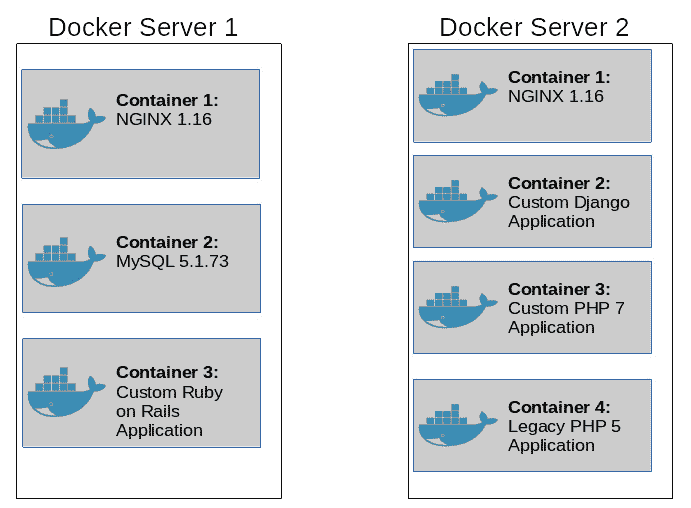
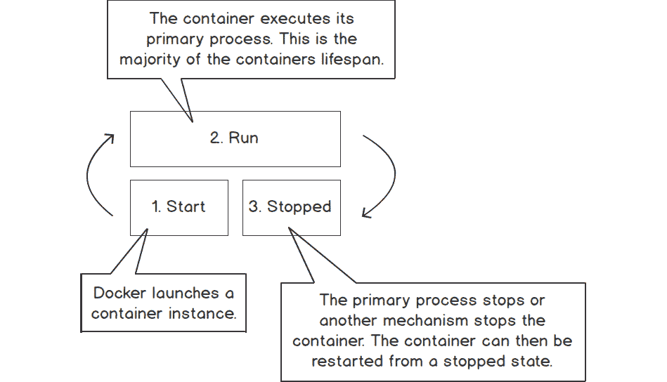
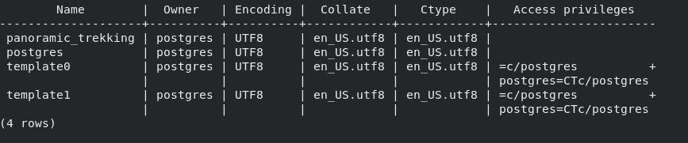

# 1.运行我的第一个码头工人集装箱

概观

在本章中，您将学习 Docker 和容器化的基础知识，并探索将传统多层应用程序迁移到快速可靠的容器化基础架构的好处。到本章结束时，您将对运行容器化应用程序的好处以及使用`docker run`命令运行容器的基础知识有一个清晰的了解。本章不仅将向您介绍 Docker 的基础知识，还将提供对 Docker 概念的坚实理解，这些概念将在整个研讨会中建立起来。

# 简介

近年来，所有行业的技术创新都在快速提高软件产品的交付速度。由于技术的发展趋势，如敏捷开发(快速编写软件的方法)和持续集成管道，使得软件能够快速交付，运营人员最近一直在努力快速构建基础设施，以满足不断增长的需求。为了跟上形势，许多组织选择迁移到云基础架构。

云基础架构提供托管虚拟化、网络和存储解决方案，可在现收现付模式中加以利用。这些提供商允许任何组织或个人注册并访问传统上需要大量空间和昂贵硬件才能在现场或数据中心实施的基础架构。亚马逊网络服务和谷歌云平台等云提供商提供了易于使用的应用编程接口，允许几乎立即创建大型虚拟机舰队**(或**虚拟机**)。**

 **将基础架构部署到云中为组织面临的许多传统基础架构解决方案难题提供了解决方案，但也带来了与大规模运行这些服务的成本管理相关的额外问题。公司如何管理每周 7 天、每天 24 小时运行昂贵服务器的持续月度和年度支出？

虚拟机通过利用虚拟机管理程序在更大的硬件上创建更小的服务器，彻底改变了基础架构。虚拟化的缺点是运行虚拟机需要大量资源。虚拟机本身看起来、行为和感觉都像真正的裸机硬件，因为 Zen、KVM 和 VMWare 等虚拟机管理程序分配资源来引导和管理整个操作系统映像。与虚拟机相关的专用资源使其变得庞大，并且有些难以管理。在内部虚拟机管理程序和云之间移动虚拟机可能意味着每个虚拟机移动数百千兆字节的数据。

为了提供更高程度的自动化，更好地利用计算密度，并优化他们的云存在，公司发现自己正在转向容器化和微服务架构作为解决方案。容器在主机操作系统内核的隔离部分提供进程级隔离或运行软件服务。容器可以共享主机操作系统的内核来运行多个软件应用程序，而不是运行整个操作系统内核来提供隔离。这是在 Linux 内核中通过称为**控制组**(或**控制组**)和**命名空间隔离**的特性来实现的。在单个虚拟机或裸机上，用户可能会运行数百个容器，这些容器在单个主机操作系统上运行单个软件应用程序实例。

这与传统的虚拟机架构形成鲜明对比。一般来说，当我们部署虚拟机时，我们将该机器用于运行单个服务器或一小部分服务。这造成了宝贵的 CPU 周期的浪费，而这些宝贵的 CPU 周期可以分配给其他任务并服务于其他请求。理论上，我们可以通过在单个虚拟机上安装多个服务来解决这个难题。然而，这可能会造成关于哪台机器运行哪项服务的大量混乱。它还将托管多个软件安装和后端依赖关系的所有权放在一个操作系统中。

容器化的微服务方法通过允许容器运行时在主机操作系统上调度和运行容器来解决这个问题。容器运行时不关心容器内运行的是什么应用程序，而是容器存在，并且可以在主机操作系统上下载和执行。不管在容器内运行的应用程序是一个 Go web API、一个简单的 Python 脚本还是一个遗留的 Cobol 应用程序。由于容器是标准格式，容器运行时将下载容器映像并在其中执行软件。在本书中，我们将研究 Docker 容器运行时，并学习在本地和大规模运行容器的基础知识。

Docker 是 2013 年开发的容器运行时，旨在利用 Linux 内核的进程隔离特性。Docker 与其他容器运行时实现的不同之处在于，Docker 开发了一个系统，不仅可以运行容器，还可以构建容器并将容器推送到容器存储库。这一创新产生了容器不变性的概念——只有在软件发生变化时，通过构建和推送容器的新版本来改变容器。

如下图所示(*图 1.1* )，我们有一系列跨两个 Docker 服务器部署的容器化应用程序。在两个服务器实例之间，已经部署了七个容器化应用程序。每个容器都有自己的一组二进制文件、库和独立的依赖项。当 Docker 运行一个容器时，容器本身会承载它正常运行所需的一切。甚至可以部署同一应用程序框架的不同版本，因为每个容器都存在于自己的内核空间中:



图 1.1:七个容器跨两个不同的容器服务器运行

在本章中，您将了解 Docker 在集装箱化的帮助下提供的各种优势。您还将学习使用`docker run`命令运行容器的基础知识。

# 使用 Docker 的优势

在传统的虚拟机方法中，代码更改需要操作人员或配置管理工具来访问该机器并安装新版本的软件。不可变容器的原则意味着，当代码发生变化时，将构建该容器映像的新版本，并将其创建为新的工件。如果需要回滚这一更改，就像下载并重新启动旧版本的容器映像一样简单。

利用容器化的方法还使软件开发团队能够在本地预测和可靠地测试各种场景和多种环境中的应用程序。由于 Docker 运行时环境提供了标准的执行环境，软件开发人员可以快速地重新创建问题并轻松地调试问题。由于容器的不变性，开发人员可以确信相同的代码在所有环境中运行，因为相同的 Docker 映像可以部署在任何环境中。这意味着配置变量(如无效的数据库连接字符串、应用编程接口凭据或其他特定于环境的变量)是失败的主要原因。这减轻了操作负担，并提供了无与伦比的效率和可重用性。

使用 Docker 的另一个优势是，与传统的基础设施应用程序相比，容器化应用程序传统上非常小且灵活。容器通常只提供运行应用程序所需的库和包，而不是提供完整的操作系统内核和执行环境。

构建 Docker 容器时，开发人员不再受安装在主机操作系统上的包和工具的支配，这些包和工具可能因环境而异。它们只能在容器映像中打包应用程序运行所需的库和实用程序的精确版本。当部署到生产机器上时，开发人员和操作团队不再关心容器运行在什么硬件或操作系统版本上，只要他们的容器在运行。

例如，从 2020 年 1 月 1 日起，不再支持 Python 2。因此，许多软件仓库正在逐步淘汰 Python 2 包和运行时。利用容器化的方法，您可以继续以受控、安全和可靠的方式运行遗留 Python 2 应用程序，直到遗留应用程序可以被重写。这消除了对安装操作系统级修补程序的担忧，因为安装操作系统级修补程序可能会取消 Python 2 的支持，并打破传统的应用程序堆栈。这些 Python 2 容器甚至可以与 Python 3 应用程序在 Docker 服务器上并行运行，以在这些应用程序迁移到新的现代化堆栈时提供精确的测试。

现在我们已经了解了什么是 Docker 以及它是如何工作的，我们可以开始与 Docker 合作，了解进程隔离与虚拟化和其他类似技术的区别。

注意

在我们开始运行容器之前，您必须首先在本地开发工作站上安装 Docker。详见本书*前言*部分。

# 码头工人引擎

**Docker 引擎**是提供对 Linux 内核进程隔离特性的访问的接口。因为只有 Linux 公开了允许容器运行的特性，所以 Windows 和 macOS 主机在后台利用 Linux 虚拟机来实现容器执行。对于 Windows 和 macOS 用户，Docker 提供了“ **Docker Desktop** ”套件，可在后台为您部署和运行该虚拟机。这允许 Docker 命令从 macOS 或 Windows 主机的终端或 PowerShell 控制台本地执行。Linux 主机拥有直接本地执行 Docker Engine 的特权，因为现代版本的 Linux 内核支持`cgroups`和命名空间隔离。

注意

由于 Windows、macOS 和 Linux 在联网和进程管理方面具有根本不同的操作系统体系结构，因此本书中的一些示例(特别是在联网方面)有时会被称为具有不同的行为，这取决于您的开发工作站上运行的操作系统。这些差异一出现就被叫出来。

Docker Engine 不仅支持容器映像的执行，还提供了内置机制，可以从称为`Dockerfiles`的源代码文件中构建和测试容器映像。当构建容器图像时，它们可以被推送到容器**图像注册表**。一个**图像注册表**是一个容器图像的存储库，其他 Docker 主机可以从中下载和执行容器图像。Docker 引擎支持运行容器映像、构建容器映像，甚至在配置为如此运行时托管容器映像注册表。

当一个容器启动时，Docker 默认情况下会下载容器映像，将其存储在本地容器映像缓存中，最后执行容器的`entrypoint`指令。`entrypoint`指令是启动应用程序主要进程的命令。当此过程停止或停止时，容器也将停止运行。

根据容器内运行的应用程序，`entrypoint`指令可能是一个长期运行的服务器守护程序，一直可用，也可能是一个短暂的脚本，当执行完成时自然会停止。或者，许多容器执行`entrypoint`脚本，在开始主要过程之前完成一系列设置步骤，这可能是长期或短期的。

在运行任何容器之前，最好先了解将在容器内运行的应用程序的类型，以及它是短期执行还是长期运行的服务器守护程序。

# r〔t0〕隧道码头容器

构建容器和微服务架构的最佳实践规定，容器应该只运行一个进程。牢记这一原则，我们可以设计易于构建、故障排除、扩展和部署的容器。

容器的生命周期是由容器的状态和其中正在运行的进程定义的。根据操作者、容器编排者或容器内部运行的应用程序的状态，容器可以处于运行或停止状态。例如，操作员可以使用`docker stop`或`docker start` **命令行界面** ( **命令行界面**)界面命令手动停止或启动容器。如果 Docker 本身检测到容器已经进入不健康状态，它可以自动停止或重新启动容器。此外，如果在容器内运行的主应用程序失败或停止，正在运行的容器实例也应该停止。许多容器运行时平台(如 Docker)甚至提供自动机制来重启自动进入停止状态的容器。许多容器平台使用这一原则来构建作业和任务执行功能。

因为容器在容器内的主进程结束时终止，所以容器是执行脚本和其他类型的无限期作业的绝佳平台。下面的*图 1.2* 说明了一个典型容器的生命周期:



图 1.2:典型容器的生命周期

一旦下载了 Docker 并将其安装到目标操作系统上，就可以开始运行容器了。Docker CLI 有一个名为`docker run`的命令，专门用于启动和运行 Docker 容器。正如我们之前了解到的，容器提供了与系统上运行的其他应用程序和进程的隔离。由于这个事实，Docker 容器的生命周期是由该容器内运行的主进程决定的。当容器停止时，Docker 可能会尝试重新启动容器，以确保应用程序的连续性。

为了查看主机系统上运行的容器，我们还将利用`docker ps`命令。`docker ps`命令类似于 Unix 风格的`ps`命令，用于显示在 Linux 或基于 Unix 的操作系统上运行的进程。

请记住，当 Docker 第一次运行容器时，如果它的本地缓存中没有存储容器映像，它将从容器映像注册表中下载容器映像。要查看本地存储的容器图像，请使用`docker images`命令。

下面的练习将演示如何使用`docker run`、`docker ps`和`docker images`命令来启动和查看一个简单的`hello-world`容器的状态。

## Ex ercise 1.01:运行 hello-world 容器

一个简单的“Hello World”应用程序通常是开发人员在学习软件开发或开始新的编程语言时编写的第一行代码，容器化也没有什么不同。Docker 已经发布了一个`hello-world`容器，它的尺寸非常小，并且易于执行。这个容器展示了运行单一进程的无限期容器的本质。

在本练习中，您将使用`docker run`命令启动`hello-world`容器，并使用`docker ps`命令查看容器执行完毕后的状态。这将提供在本地开发环境中运行容器的基本概述:

1.  Enter the `docker run` command in a Bash terminal or PowerShell window. This instructs Docker to run a container called `hello-world`:

    ```
    $ docker run hello-world
    ```

    您的 shell 应该返回类似如下的输出:

    ```
    Unable to find image 'hello-world: latest' locally
    latest: Pulling from library/hello-world
    0e03bdcc26d7: Pull complete 
    Digest: sha256:
    8e3114318a995a1ee497790535e7b88365222a21771ae7e53687ad76563e8e76
    Status: Downloaded newer image for hello-world:latest
    Hello from Docker!
    This message shows that your installation appears to be working 
    correctly.
    To generate this message, Docker took the following steps:
     1\. The Docker client contacted the Docker daemon.
     2\. The Docker daemon pulled the "hello-world" image from the 
    Docker Hub.
        (amd64)
     3\. The Docker daemon created a new container from that image 
    which runs the executable that produces the output you are 
    currently reading.
    4\. The Docker daemon streamed that output to the Docker 
    client, which sent it to your terminal.
    To try something more ambitious, you can run an Ubuntu 
    container with:
     $ docker run -it ubuntu bash
    Share images, automate workflows, and more with a free Docker ID:
     https://hub.docker.com/
    For more examples and ideas, visit:
     https://docs.docker.com/get-started/
    ```

    刚刚发生了什么？你告诉 Docker 运行容器，`hello-world`。因此，首先，Docker 将在其本地容器缓存中查找同名的容器。如果找不到，它将在互联网上寻找一个容器注册表，试图满足命令。默认情况下，通过简单地指定容器的名称，Docker 将通过该名称向 Docker Hub 查询已发布的容器映像。

    如你所见，它能够找到一个名为`library/hello-world`的容器，并开始一层一层地拉入容器图像的过程。您将在*第 2 章*、*快速入门*中更深入地了解容器图像和层。图像完全下载后，Docker 运行图像，显示`Hello from Docker`输出。由于此图像的主要过程只是显示输出，因此容器会自动停止，并在输出显示后停止运行。

2.  Use the `docker ps` command to see what containers are running on your system. In your Bash or PowerShell terminal, type the following command:

    ```
    $ docker ps
    ```

    这将返回类似如下的输出:

    ```
    CONTAINER ID      IMAGE     COMMAND      CREATED
      STATUS              PORTS                   NAMES
    ```

    `docker ps`命令的输出为空，因为默认情况下它只显示当前运行的容器。这类似于 Linux/Unix `ps`命令，只显示正在运行的进程。

3.  Use the `docker ps -a` command to display all the containers, even the stopped ones:

    ```
    $ docker ps -a
    ```

    在返回的输出中，您应该会看到`hello-world`容器实例:

    ```
    CONTAINER ID     IMAGE           COMMAND     CREATED
      STATUS                          PORTS         NAMES
    24c4ce56c904     hello-world     "/hello"    About a minute ago
      Exited (0) About a minute ago                 inspiring_moser
    ```

    如您所见，Docker 给了容器一个唯一的容器 ID。它还显示运行的`IMAGE`、执行的图像中的`COMMAND`、创建的`TIME`和运行该容器的进程的`STATUS`，以及唯一的人类可读的名称。这个特殊的容器大约在一分钟前创建，执行了程序`/hello`，并成功运行。你可以看出程序运行并成功执行，因为它产生了一个`Exited (0)`代码。

4.  You can query your system to see what container images Docker cached locally. Execute the `docker images` command to view the local cache:

    ```
    $ docker images
    ```

    返回的输出应该显示本地缓存的容器图像:

    ```
    REPOSITORY     TAG        IMAGE ID        CREATED         SIZE
    hello-world    latest     bf756fb1ae65    3 months ago    13.3kB
    ```

    到目前为止唯一缓存的图像是`hello-world`容器图像。这张图片运行的是 3 个月前创建的`latest`版本，大小为 13.3 千字节。从前面的输出中，您知道这个 Docker 映像非常小，开发人员已经 3 个月没有发布这个映像的代码更改了。该输出对于排除现实世界中软件版本之间的差异非常有帮助。

    由于您只是告诉 Docker 运行`hello-world`容器，而没有指定版本，因此 Docker 默认会提取最新版本。您可以通过在`docker run`命令中指定标签来指定不同的版本。例如，如果`hello-world`容器图像有版本`2.0`，您可以使用`docker run hello-world:2.0`命令运行该版本。

    想象一下，这个容器比一个简单的`hello-world`应用程序要复杂一点。想象一下，你的同事编写的软件要求下载许多第三方库的特定版本。如果您传统地运行这个应用程序，您将不得不为他们开发的语言下载运行时环境，加上所有的第三方库，以及关于如何构建和执行他们的代码的详细说明。

    然而，如果他们将代码的 Docker 映像发布到内部 Docker 注册表中，他们所要提供给你的只是用于运行容器的`docker run`语法。因为您有 Docker，所以无论您的底层平台是什么，容器映像都将运行相同的内容。容器映像本身已经包含库和运行时细节。

5.  If you execute the same `docker run` command over again, then, for each `docker run` command a user inputs, a new container instance will be created. It should be noted that one of the benefits of containerization is the ability to easily run multiple instances of a software application. To see how Docker handles multiple container instances, run the same `docker run` command again to create another instance of the `hello-world` container:

    ```
    $ docker run hello-world
    ```

    您应该会看到以下输出:

    ```
    Hello from Docker!
    This message shows that your installation appears to be 
    working correctly.
    To generate this message, Docker took the following steps:
     1\. The Docker client contacted the Docker daemon.
     2\. The Docker daemon pulled the "hello-world" image from 
        the Docker Hub.
        (amd64)
     3\. The Docker daemon created a new container from that image 
        which runs the executable that produces the output you 
        are currently reading.
     4\. The Docker daemon streamed that output to the Docker client, 
        which sent it to your terminal.
    To try something more ambitious, you can run an Ubuntu container 
    with:
     $ docker run -it ubuntu bash
    Share images, automate workflows, and more with a free Docker ID:
     https://hub.docker.com/
    For more examples and ideas, visit:
     https://docs.docker.com/get-started/
    ```

    请注意，这一次，Docker 不必再次从 Docker Hub 下载容器映像。这是因为您现在已经在本地缓存了该容器映像。相反，Docker 能够直接运行容器并将输出显示在屏幕上。让我们看看你现在的`docker ps -a`输出是什么样子的。

6.  In your terminal, run the `docker ps -a` command again:

    ```
    docker ps -a
    ```

    在输出中，您应该看到这个容器映像的第二个实例已经完成了它的执行并进入了停止状态，如输出的`STATUS`列中的`Exit (0)`所示:

    ```
    CONTAINER ID     IMAGE           COMMAND       CREATED
      STATUS                      PORTS               NAMES
    e86277ca07f1     hello-world     "/hello"      2 minutes ago
      Exited (0) 2 minutes ago                        awesome_euclid
    24c4ce56c904     hello-world     "/hello"      20 minutes ago
      Exited (0) 20 minutes ago                       inspiring_moser
    ```

    现在，您的输出中显示了这个容器的第二个实例。每次执行`docker run`命令时，Docker 将创建一个包含属性和数据的容器的新实例。您可以在系统资源允许的情况下运行尽可能多的容器实例。20 分钟前，您在本例中创建了一个实例。你两分钟前创建的第二个实例。

7.  Check the base image again by executing the `docker images` command once more:

    ```
    $ docker images
    ```

    返回的输出将显示 Docker 从中创建两个运行实例的单个基本映像:

    ```
    REPOSITORY     TAG       IMAGE ID        CREATED         SIZE
    hello-world    latest    bf756fb1ae65    3 months ago    13.3kB
    ```

在本练习中，您使用`docker run`启动`hello-world`容器。为了实现这一点，Docker 从 Docker Hub 注册表下载了映像，并在 Docker 引擎中执行它。一旦基本映像被下载，你就可以使用后续的`docker run`命令创建任意多个容器实例。

Docker 容器管理比简单地启动和查看在您的开发环境中运行的容器的状态更复杂。Docker 还支持许多其他操作，这些操作有助于深入了解 Docker 主机上运行的应用程序的状态。在下一节中，我们将学习如何使用不同的命令来管理 Docker 容器。

# ma〔t0〕naging 码头集装箱

在我们的集装箱之旅中，我们将经常从本地环境中拉出、启动、停止和移除集装箱。在生产环境中部署容器之前，我们首先要在本地运行容器，以了解它是如何工作的以及正常行为是什么样子，这一点非常重要。这包括启动容器、停止容器、获取关于容器如何运行的详细信息，当然，还包括访问容器日志以查看关于容器内运行的应用程序的关键细节。这些基本命令概述如下:

*   `docker pull`:该命令将容器镜像下载到本地缓存
*   `docker stop`:此命令停止正在运行的容器实例
*   `docker start`:该命令启动不再处于运行状态的容器实例
*   `docker restart`:这个命令重启一个正在运行的容器
*   `docker attach`:该命令允许用户访问(或附加)正在运行的 Docker 容器实例的主进程
*   `docker exec`:该命令在运行的容器内执行一个命令
*   `docker rm`:该命令删除一个停止的容器
*   `docker rmi`:该命令删除一个容器图像
*   `docker inspect`:该命令显示容器状态的详细信息

集装箱生命周期管理是生产环境中有效集装箱管理的重要组成部分。在评估集装箱化基础设施的健康状况时，了解如何调查运行中的集装箱至关重要。

在下面的练习中，我们将分别使用这些命令，深入了解它们的工作原理，以及如何利用它们来了解您的容器化基础架构的运行状况。

## Ex ercise 1.02:管理容器生命周期

在开发和生产环境中管理容器时，了解容器实例的状态至关重要。许多开发人员使用包含特定基线配置的基本容器映像，在此基础上可以部署他们的应用程序。Ubuntu 是用户用来打包应用程序的常用基础映像。

与完整的操作系统映像不同，Ubuntu 基本容器映像非常小，并且有意省略了完整操作系统安装的许多包。大多数基本映像都有软件包系统，允许您安装任何丢失的软件包。

请记住，在构建容器映像时，您希望尽可能保持基本映像的精简，只安装最必要的包 s。这确保了 Docker 主机可以快速拉出和启动容器映像。

在本练习中，您将使用官方的 Ubuntu 基本容器图像。此图像将用于启动容器实例，这些实例将用于测试各种容器生命周期管理命令，如`docker pull`、`docker start`和`docker stop`。这个容器映像很有用，因为默认的基本映像允许我们在长时间运行的会话中运行容器实例，以了解容器生命周期管理命令是如何工作的。在本练习中，您还将拉出`Ubuntu 18.04`容器图像，并将其与`Ubuntu 19.04`容器图像进行比较:

1.  In a new terminal or PowerShell window, execute the `docker pull` command to download the `Ubuntu 18.04` container image:

    ```
    $ docker pull ubuntu:18.04
    ```

    您应该会看到以下输出，表明 Docker 正在下载基础图像的所有层:

    ```
    5bed26d33875: Pull complete 
    f11b29a9c730: Pull complete 
    930bda195c84: Pull complete 
    78bf9a5ad49e: Pull complete 
    Digest: sha256:bec5a2727be7fff3d308193cfde3491f8fba1a2ba392
            b7546b43a051853a341d
    Status: Downloaded newer image for ubuntu:18.04
    docker.io/library/ubuntu:18.04
    ```

2.  Use the `docker pull` command to download the `Ubuntu 19.04` base image:

    ```
    $ docker pull ubuntu:19.04
    ```

    当 Docker 下载`Ubuntu 19.04`基础图像时，您将看到类似的输出:

    ```
    19.04: Pulling from library/ubuntu
    4dc9c2fff018: Pull complete 
    0a4ccbb24215: Pull complete 
    c0f243bc6706: Pull complete 
    5ff1eaecba77: Pull complete 
    Digest: sha256:2adeae829bf27a3399a0e7db8ae38d5adb89bcaf1bbef
            378240bc0e6724e8344
    Status: Downloaded newer image for ubuntu:19.04
    docker.io/library/ubuntu:19.04
    ```

3.  Use the `docker images` command to confirm that the container images are downloaded to the local container cache:

    ```
    $ docker images
    ```

    本地容器缓存的内容将显示`Ubuntu 18.04`和`Ubuntu 19.04`基础图像，以及我们之前练习中的`hello-world`图像:

    ```
    REPOSITORY     TAG        IMAGE ID         CREATED         SIZE
    ubuntu         18.04      4e5021d210f6     4 weeks ago     64.2MB
    ubuntu         19.04      c88ac1f841b7     3 months ago    70MB
    hello-world    latest     bf756fb1ae65     3 months ago    13.3kB
    ```

4.  Before running these images, use the `docker inspect` command to get verbose output about what makes up the container images and how they differ. In your terminal, run the `docker inspect` command and use the image ID of the `Ubuntu 18.04` container image as the main argument:

    ```
    $ docker inspect 4e5021d210f6
    ```

    `inspect`输出将包含定义该容器的所有属性的大列表。例如，您可以看到容器中配置了哪些环境变量，容器是否在上次更新映像时设置了主机名，以及定义该容器的所有层的详细信息。该输出包含重要的调试细节，这些细节在计划升级时可能很有价值。以下是`inspect`命令的截断输出。在`Ubuntu 18.04`图像中，`"Created"`参数应提供容器图像的创建日期和时间:

    ```
    "Id": "4e5021d210f6d4a0717f4b643409eff23a4dc01c4140fa378b1b
           f0a4f8f4",
    "Created": "2020-03-20T19:20:22.835345724Z",
    "Path": "/bin/bash",
    "Args": [],
    ```

5.  Inspecting the `Ubuntu 19.04` container, you can see that this parameter is different. Run the `docker inspect` command in the `Ubuntu 19.04` container image ID:

    ```
    $ docker inspect c88ac1f841b7
    ```

    在显示的输出中，您将看到该容器图像是在与`18.04`容器图像不同的日期创建的:

    ```
    "Id": "c88ac1f841b74e5021d210f6d4a0717f4b643409eff23a4dc0
           1c4140fa"
    "Created": "2020-01-16T01:20:46.938732934Z",
    "Path": "/bin/bash",
    "Args": []
    ```

    如果您知道 Ubuntu 基础映像中可能存在安全漏洞，这可能非常重要。这些信息对于帮助您确定要运行的容器版本也是至关重要的。

6.  在检查了两个容器图像后，很明显，您最好的选择是坚持使用 Ubuntu 长期支持 18.04 版本。从前面的输出可以看出，18.04 版本比 19.04 版本更新。这是意料之中的，因为 Ubuntu 通常会为长期支持版本提供更稳定的更新。
7.  Use the `docker run` command to start an instance of the Ubuntu 18.04 container:

    ```
    $ docker run -d ubuntu:18.04
    ```

    请注意，这次我们使用带有`-d`标志的`docker run`命令。这告诉 Docker 在守护模式下(或在后台)运行容器。如果我们忽略`-d`标志，集装箱将接管我们当前的码头，直到集装箱内的主要流程终止。

    注意

    成功调用`docker run`命令通常只会返回容器标识作为输出。Docker 的某些版本不会返回任何输出。

8.  Check the status of the container using the `docker ps -a` command:

    ```
    $ docker ps -a
    ```

    这将显示类似如下的输出:

    ```
    CONTAINER ID     IMAGE           COMMAND        CREATED
      STATUS                     PORTS         NAMES
    c139e44193de     ubuntu:18.04    "/bin/bash"    6 seconds ago
      Exited (0) 4 seconds ago                 xenodochial_banzai
    ```

    如您所见，您的容器被停止并退出。这是因为容器内部的主要过程是`/bin/bash`，是一个壳。Bash shell 不能在没有以交互模式执行的情况下运行，因为它需要用户输入和输出文本。

9.  再次运行`docker run`命令，传入`-i`标志使会话交互(期待用户输入)，传入`-t`标志给容器分配一个**伪 tty** 处理程序。`pseudo-tty` handler 本质上将用户终端链接到容器内部运行的交互式 Bash shell。这将允许 Bash 正常运行，因为它将指示容器在交互模式下运行，期望用户输入。您也可以通过传入`--name`标志给容器一个人类可读的名称。在您的 Bash 终端中键入以下命令:

    ```
    $ docker run -i -t -d --name ubuntu1 ubuntu:18.04
    ```

10.  Execute the `docker ps -a` command again to check the status of the container instance:

    ```
    $ docker ps -a 
    ```

    现在，您应该看到新实例正在运行，以及刚才未能启动的实例:

    ```
    CONTAINER ID    IMAGE          COMMAND         CREATED
      STATUS            PORTS               NAMES
    f087d0d92110    ubuntu:18.04   "/bin/bash"     4 seconds ago
      Up 2 seconds                          ubuntu1
    c139e44193de    ubuntu:18.04   "/bin/bash"     5 minutes ago
      Exited (0) 5 minutes ago              xenodochial_banzai
    ```

11.  You now have an Ubuntu container up and running. You can run commands inside this container using the `docker exec` command. Run the `exec` command to access a Bash shell, which will allow us to run commands inside the container. Similar to `docker run`, pass in the `-i` and `-t` flags to make it an interactive session. Also pass in the name or ID of the container, so that Docker knows which container you are targeting. The final argument of `docker exec` is always the command you wish to execute. In this case, it will be `/bin/bash` to start a Bash shell inside the container instance:

    ```
    docker exec -it ubuntu1 /bin/bash
    ```

    您应该立即看到您的提示更改为根外壳。这表明您已经成功地在 Ubuntu 容器中启动了一个外壳。容器的主机名`cfaa37795a7b`取自容器标识的前 12 个字符。这允许用户确定他们正在访问哪个容器，如以下示例所示:

    ```
    root@cfaa37795a7b:/#
    ```

12.  从容器内部来看，您可以使用的工具非常有限。与虚拟机映像不同，就预装的软件包而言，容器映像非常少。然而`echo`命令应该是可用的。使用`echo`给文本文件写一条简单的消息:

    ```
    root@cfaa37795a7b:/# echo "Hello world from ubuntu1" > hello-world.txt
    ```

13.  Run the `exit` command to exit from the Bash shell of the `ubuntu1` container. You should return to your normal terminal shell:

    ```
    root@cfaa37795a7b:/# exit
    ```

    该命令将返回如下输出。请注意，对于运行该命令的每个用户，输出可能会有所不同:

    ```
    user@developmentMachine:~/
    ```

14.  现在创建第二个名为`ubuntu2`的容器，它也将在你的 Docker 环境中使用`Ubuntu 19.04`图像:

    ```
    $ docker run -i -t -d --name ubuntu2 ubuntu:19.04
    ```

15.  Run `docker exec` to access a shell of this second container. Remember to use the name or container ID of the new container you created. Likewise, access a Bash shell inside this container, so the final argument will be `/bin/bash`:

    ```
    $ docker exec -it ubuntu2 /bin/bash
    ```

    您应该观察到您对 Bash 根外壳的提示更改，类似于它对`Ubuntu 18.04`容器图像的操作:

    ```
    root@875cad5c4dd8:/#
    ```

16.  在`ubuntu2`容器实例中运行`echo`命令，编写一个类似`hello-world`类型的问候语:

    ```
    root@875cad5c4dd8:/# echo "Hello-world from ubuntu2!" > hello-world.txt
    ```

17.  Currently, you have two Ubuntu container instances running in your Docker environment with two separate `hello-world` greeting messages in the home directory of the root account. Use `docker ps` to see the two running container images:

    ```
    $ docker ps
    ```

    运行容器的列表应该反映两个 Ubuntu 容器，以及它们被创建以来经过的时间:

    ```
    CONTAINER ID    IMAGE            COMMAND        CREATED
      STATUS              PORTS               NAMES
    875cad5c4dd8    ubuntu:19.04     "/bin/bash"    3 minutes ago
      Up 3 minutes                            ubuntu2
    cfaa37795a7b    ubuntu:18.04     "/bin/bash"    15 minutes ago
      Up 15 minutes                           ubuntu1
    ```

18.  Instead of using `docker exec` to access a shell inside our containers, use it to display the output of the `hello-world.txt` files you wrote by executing the `cat` command inside the containers:

    ```
    $ docker exec -it ubuntu1 cat hello-world.txt
    ```

    输出将显示您在前面步骤中传递到容器中的`hello-world`消息。请注意，一旦完成`cat`命令并显示输出，用户就被移回您的主终端的上下文。这是因为`docker exec`会话只存在于用户正在执行的命令运行的时间内。

    在前面的 Bash shell 示例中，只有当用户使用`exit`命令终止 Bash 时，Bash 才会退出。在本例中，仅显示`Hello world`输出，因为`cat`命令显示输出并退出，结束`docker exec`会话:

    ```
    Hello world from ubuntu1
    ```

    您将看到显示的`hello-world`文件的内容，然后返回到您的主终端会话。

19.  Run the same `cat` command in the `ubuntu2` container instance:

    ```
    $ docker exec -it ubuntu2 cat hello-world.txt
    ```

    与第一个示例类似，`ubuntu2`容器实例将显示先前提供的`hello-world.txt`文件的内容:

    ```
    Hello-world from ubuntu2!
    ```

    如您所见，Docker 能够在两个容器上分配一个交互会话，执行命令，并在我们运行的容器实例中直接返回输出。

20.  In a similar manner to that you used to execute commands inside our running containers, you can also stop, start, and restart them. Stop one of your container instances using the `docker stop` command. In your terminal session, execute the `docker stop` command, followed by the name or container ID of the `ubuntu2` container:

    ```
    $ docker stop ubuntu2
    ```

    该命令不应返回任何输出。

21.  Use the `docker ps` command to view all running container instances:

    ```
    $ docker ps
    ```

    输出将显示`ubuntu1`容器启动并运行:

    ```
    CONTAINER ID    IMAGE           COMMAND        CREATED
      STATUS              PORTS               NAMES
    cfaa37795a7b    ubuntu:18.04    "/bin/bash"    26 minutes ago
      Up 26 minutes                           ubuntu1
    ```

22.  Execute the `docker ps -a` command to view all container instances, regardless of whether they are running, to see your container in a stopped state:

    ```
    $ docker ps -a
    ```

    该命令将返回以下输出:

    ```
    CONTAINER ID     IMAGE            COMMAND         CREATED
      STATUS                      PORTS             NAMES
    875cad5c4dd8     ubuntu:19.04     "/bin/bash"     14 minutes ago
      Exited (0) 6 seconds ago                      ubuntu2
    ```

23.  Use the `docker start` or `docker restart` command to restart the container instance:

    ```
    $ docker start ubuntu2
    ```

    该命令将不会返回任何输出，尽管 Docker 的某些版本可能会显示容器标识。

24.  Verify that the container is running again by using the `docker ps` command:

    ```
    $ docker ps
    ```

    请注意，`STATUS`显示此容器仅启动了一小段时间(`1 second`)，尽管容器实例是在 29 分钟前创建的:

    ```
    CONTAINER ID    IMAGE           COMMAND         CREATED
      STATUS              PORTS               NAMES
    875cad5c4dd8    ubuntu:19.04    "/bin/bash"     17 minutes ago
      Up 1 second                             ubuntu2
    cfaa37795a7b    ubuntu:18.04    "/bin/bash"     29 minutes ago
      Up 29 minutes                           ubuntu1
    ```

    在这种状态下，您可以尝试在这些容器中启动、停止或执行命令。

25.  The final stage of the container management life cycle is cleaning up the container instances you created. Use the `docker stop` command to stop the `ubuntu1` container instance:

    ```
    $ docker stop ubuntu1
    ```

    尽管 Docker 的某些版本可能会返回容器标识，但该命令不会返回任何输出。

26.  执行相同的`docker stop`命令停止`ubuntu2`容器实例:

    ```
    $ docker stop ubuntu2
    ```

27.  When container instances are in a stopped state, use the `docker rm` command to delete the container instances altogether. Use `docker rm` followed by the name or container ID to delete the `ubuntu1` container instance:

    ```
    $ docker rm ubuntu1
    ```

    尽管 Docker 的某些版本可能会返回容器标识，但该命令不会返回任何输出。

    在`ubuntu2`容器实例上执行相同的步骤:

    ```
    $ docker rm ubuntu2
    ```

28.  执行`docker ps -a`查看所有容器，即使是处于停止状态的容器。您会发现停止的容器不再存在，因为它们已经被我们之前的命令删除了。您也可以删除`hello-world`容器实例。使用从`docker ps -a`输出中获取的容器标识删除`hello-world`容器:

    ```
    $ docker rm b291785f066c
    ```

29.  To completely reset the state of our Docker environment, delete the base images you downloaded during this exercise as well. Use the `docker images` command to view the cached base images:

    ```
    $ docker images
    ```

    本地缓存中的 Docker 图像和所有相关元数据的列表将显示:

    ```
    REPOSITORY     TAG        IMAGE ID        CREATED         SIZE
    ubuntu         18.04      4e5021d210f6    4 weeks ago     64.2MB
    ubuntu         19.04      c88ac1f841b7    3 months ago    70MB
    hello-world    latest     bf756fb1ae65    3 months ago    13.3kB
    ```

30.  Execute the `docker rmi` command followed by the image ID to delete the first image ID:

    ```
    $ docker rmi 4e5021d210f6
    ```

    与`docker pull`类似，`rmi`命令将删除每个图像和所有关联的图层:

    ```
    Untagged: ubuntu:18.04
    Untagged: ubuntu@sha256:bec5a2727be7fff3d308193cfde3491f8fba1a2b
    a392b7546b43a051853a341d
    Deleted: sha256:4e5021d210f65ebe915670c7089120120bc0a303b9020859
    2851708c1b8c04bd
    Deleted: sha256:1d9112746e9d86157c23e426ce87cc2d7bced0ba2ec8ddbd
    fbcc3093e0769472
    Deleted: sha256:efcf4a93c18b5d01aa8e10a2e3b7e2b2eef0378336456d86
    53e2d123d6232c1e
    Deleted: sha256:1e1aa31289fdca521c403edd6b37317bf0a349a941c7f19b
    6d9d311f59347502
    Deleted: sha256:c8be1b8f4d60d99c281fc2db75e0f56df42a83ad2f0b0916
    21ce19357e19d853
    ```

    对每个要删除的图像执行此步骤，替换为不同的图像标识。对于您删除的每个基础图像，您将看到所有图像图层都被取消标记并随之删除。

定期清理 Docker 环境非常重要，因为频繁构建和运行容器会随着时间的推移导致大量硬盘使用。现在，您已经知道如何在本地开发环境中运行和管理 Docker 容器，您可以使用更高级的 Docker 命令来了解容器的主要流程是如何工作的，以及如何解决问题。在下一节中，我们将看到`docker attach`命令直接访问容器的主进程。

注意

为了简化清理环境的过程，Docker 提供了一个`prune`命令，该命令将自动删除旧的容器和基础映像:

`$ docker system prune -fa`

执行此命令将删除任何未绑定到现有运行容器的容器映像，以及 Docker 环境中的任何其他资源。

# 使用连接命令连接到容器

在前面的练习中，您看到了如何使用`docker exec`命令在运行的容器实例中启动一个新的 shell 会话，并在其中执行命令。`docker exec`命令非常适合快速访问容器化的实例，用于调试、故障排除和理解容器运行的上下文。

但是，正如本章前面所述，Docker 容器按照容器内运行的主进程的生命周期运行。当此过程退出时，容器将停止。如果您想要直接访问容器内的主进程(与辅助外壳会话相反)，那么 Docker 提供`docker attach`命令来附加到容器内的主运行进程。

当使用`docker attach`时，您获得了对容器中运行的主进程的访问。如果这个过程是交互式的，例如 Bash 或 Bourne shell 会话，您将能够通过`docker attach`会话(类似于`docker exec`)直接执行命令。但是，如果容器中的主进程终止，整个容器实例也会终止，因为 Docker 容器生命周期取决于主进程的运行状态。

在下面的练习中，您将使用`docker attach`命令直接访问 Ubuntu 容器的主进程。默认情况下，该容器的主进程为`/bin/bash`。

## 练习 1.03:连接到 Ubuntu 容器

`docker attach`命令用于附加到主进程上下文中正在运行的容器。在本练习中，您将使用`docker attach`命令连接到正在运行的容器，并直接研究主容器`entrypoint`过程:

1.  Use the `docker run` command to start a new Ubuntu container instance. Run this container in interactive mode (`-i`), allocate a TTY session (`-t`), and run it in the background (`-d`). Call this container `attach-example1`:

    ```
    docker run -itd --name attach-example1 ubuntu:latest
    ```

    这将使用最新版本的 Ubuntu 容器映像启动名为`attach-example1`的新 Ubuntu 容器实例。

2.  Use the `docker ps` command to check that this container is running in our environment:

    ```
    docker ps 
    ```

    将显示正在运行的容器实例的详细信息。请注意，这个容器的主要进程是一个 Bash shell ( `/bin/bash`):

    ```
    CONTAINER ID    IMAGE            COMMAND          CREATED
      STATUS              PORTS               NAMES
    90722712ae93    ubuntu:latest    "/bin/bash"      18 seconds ago
      Up 16 seconds                           attach-example1
    ```

3.  Run the `docker attach` command to attach to the primary process inside this container, (`/bin/bash`). Use `docker attach` followed by the name or ID of the container instance:

    ```
    $ docker attach attach-example1
    ```

    这应该会让您进入这个容器实例的主 Bash shell 会话。请注意，您的终端会话应该更改为根 shell 会话，这表明您已经成功访问了容器实例:

    ```
    root@90722712ae93:/#
    ```

    这里需要注意的是，使用`exit`之类的命令来终止 shell 会话将导致容器实例停止，因为您现在已经连接到容器实例的主进程。默认情况下，Docker 提供快捷键序列 *Ctrl* + *P* 然后 *Ctrl* + *Q* 来优雅地脱离`attach`会话。

4.  Use the keyboard combinations *Ctrl* + *P* and then *Ctrl* + *Q* to detach from this session gracefully:

    ```
    root@90722712ae93:/# CTRL-p CTRL-q
    ```

    注意

    您不会键入`CTRL-p CTRL-q`字样；相反，您将按住 *Ctrl* 键，按下 *P* 键，然后松开两个键。然后，再次按住 *Ctrl* 键，按下 *Q* 键，然后再次松开两个键。

    成功卸下容器后，在返回您的主终端或 PowerShell 会话之前，将显示`read escape sequence`字样:

    ```
    root@90722712ae93:/# read escape sequence
    ```

5.  Use `docker ps` to verify that the Ubuntu container is still running as expected:

    ```
    $ docker ps
    ```

    将显示`attach-example1`容器，仍按预期运行:

    ```
    CONTAINER ID    IMAGE            COMMAND          CREATED
      STATUS              PORTS               NAMES
    90722712ae93    ubuntu:latest    "/bin/bash"      13 minutes ago
      Up 13 minutes                           attach-example1
    ```

6.  Use the `docker attach` command to attach once more to the `attach-example1` container instance:

    ```
    $ docker attach attach-example1
    ```

    您应该回到主进程的 Bash 会话中:

    ```
    root@90722712ae93:/#
    ```

7.  Now, terminate the primary process of this container using the `exit` command. In the Bash shell session, type the `exit` command:

    ```
    root@90722712ae93:/# exit
    ```

    终端会话应该已经退出，让您再次回到主终端。

8.  Use the `docker ps` command to observe that the `attach-example1` container should no longer be running:

    ```
    $ docker ps
    ```

    这应该不会返回正在运行的容器实例:

    ```
    CONTAINER ID    IMAGE            COMMAND              CREATED
      STATUS              PORTS               NAMES
    ```

9.  Use the `docker ps -a` command to view all the containers, even ones that have been stopped or have exited:

    ```
    $ docker ps -a
    ```

    这将显示处于停止状态的`attach-example1`容器:

    ```
    CONTAINER ID      IMAGE                COMMAND 
      CREATED            STATUS    PORTS           NAMES
    90722712ae93      ubuntu:latest        "/bin/bash"
      20 minutes ago     Exited (0) 3 minutes ago  attach-example1
    ```

    如您所见，容器在大约 3 分钟前已经优雅地终止(`Exited (0)`)。`exit`命令优雅地终止一个 Bash shell 会话。

10.  Use the `docker system prune -fa` command to clean up the stopped container instances:

    ```
    docker system prune -fa
    ```

    这将删除所有停止的容器实例，包括`attach-example1`容器实例，如以下输出所示:

    ```
    Deleted Containers:
    ry6v87v9a545hjn7535jk2kv9x8cv09wnkjnscas98v7a762nvnw7938798vnand
    Deleted Images:
    untagged: attach-example1
    ```

在本练习中，我们使用`docker attach`命令直接访问正在运行的容器的主进程。这与我们在本章前面探讨的`docker exec`命令不同，因为`docker exec`在运行的容器中执行一个新的进程，而`docker attach`直接附加到容器的主进程。然而，当连接到容器时，必须小心注意不要通过终止主要过程来停止容器。

在下一个活动中，我们将把本章中介绍的 Docker 管理命令放在一起，开始组装构建块容器，这些容器将成为全景漫游微服务应用程序堆栈。

## Ac 活动 1.01:从 Docker 集线器中提取并运行 PostgreSQL 容器映像

全景徒步旅行是我们将在本书中构建的多层网络应用程序。与任何 web 应用程序类似，它将由一个 web 服务器容器(NGINX)、一个 Python Django 后端应用程序和一个 PostgreSQL 数据库组成。在开始部署 web 应用程序或前端 web 服务器之前，必须先部署后端数据库。

在本练习中，要求您使用默认凭据启动 PostgreSQL 版本 12 数据库容器。

注意

官方 Postgres 容器映像提供了许多环境变量覆盖，您可以利用它们来配置 PostgreSQL 实例。查看位于 https://hub.docker.com/_/postgres 码头中心的集装箱文件。

请执行以下步骤:

1.  创建一个 Postgres 数据库容器实例，作为我们应用程序堆栈的数据层。
2.  使用环境变量在运行时配置容器，以使用以下数据库凭据:

    ```
    username: panoramic
    password: trekking
    ```

3.  验证容器是否运行正常。

**预期输出:**

运行`docker ps`命令时，应返回以下输出:

```
CONTAINER ID  IMAGE         COMMAND                 CREATED
  STATUS              PORTS               NAMES
29f115af8cdd  postgres:12   "docker-entrypoint.s…"  4 seconds ago
  Up 2 seconds        5432/tcp            blissful_kapitsa
```

不〔t0〕你

此活动的解决方案可以通过[这个链接](16.html#_idTextAnchor316)找到。

在下一个活动中，您将在容器实例中访问刚刚在此活动中设置的数据库。您还将与容器交互，以获取容器中运行的数据库列表。

## Ac 活动 1.02:访问全景徒步应用数据库

他的活动将涉及使用命令行界面工具访问容器实例中运行的数据库。使用凭据(`panoramic/trekking`)登录后，您将查询容器中运行的数据库列表。

请执行以下步骤:

1.  使用 PSQL 命令行实用程序登录 Postgres 数据库容器。
2.  Once logged in to the database, return a list of databases in Postgres by default.

    注意

    如果您不熟悉 PSQL CLI，下面是一个参考命令列表，可帮助您完成本练习:

    登录:`psql --username username --password`

    列出数据库:`\l`

    退出 PSQL 外壳:`\q`

**预期输出:**



图 1.3:活动 1.02 的预期产出

注意

此活动的解决方案可以通过[这个链接](16.html#_idTextAnchor318)找到。

# 总结

在本章中，您学习了容器化的基础知识、在容器中运行应用程序的好处，以及管理容器化实例的基本 Docker 生命周期命令。您了解到容器是一个通用的软件部署包，真正可以一次构建并在任何地方运行。因为我们在本地运行 Docker，所以我们可以肯定地知道，在我们的本地环境中运行的相同容器映像可以在生产中部署，并且可以放心地运行。

使用`docker run`、`docker start`、`docker exec`、`docker ps`和`docker stop`等命令，我们通过 Docker CLI 探索了容器生命周期管理的基础知识。通过各种练习，我们从同一个基本映像启动容器实例，使用`docker exec`配置它们，并使用其他基本容器生命周期命令(如`docker rm`和`docker rmi`)清理部署。

在本章的最后一部分，我们从头开始，通过启动 PostgreSQL 数据库容器实例，朝着运行全景徒步应用程序迈出了第一步。使用我们在`docker run`命令中放置的环境变量，我们创建了一个用默认用户名和密码配置的实例。我们通过从容器内部执行 PSQL 命令行工具并查询数据库以查看模式来测试配置。

尽管这只是 Docker 能力的表面，但我们希望它能够激发您对即将到来的章节中涵盖的材料的兴趣。在下一章中，我们将讨论使用`Dockerfiles`和`docker build`命令构建真正不可变的容器。编写定制的`Dockerfiles`来构建和部署独特的容器映像将展示大规模运行容器化应用程序的能力。**