# 2。Dockerfiles 入门

概观

在本章中，您将学习`Dockerfile`及其指令的形式和功能，包括`FROM`、`LABEL`和`CMD`，您将使用它们来记录应用。本章将为您提供 Docker 映像的分层文件系统的知识，以及在 Docker 构建过程中缓存的使用。本章结束时，您将能够使用通用指令编写一个`Dockerfile`，并使用`Dockerfile`构建定制的 Docker 映像。

# 简介

在前一章中，我们学习了如何通过从 Docker Hub 中提取预构建的 Docker 映像来运行我们的第一个 Docker 容器。虽然从 Docker Hub 获取预构建的 Docker 映像很有用，但我们必须知道如何创建自定义的 Docker 映像。这对于在 Docker 上运行我们的应用非常重要，因为它可以安装新的软件包并定制预构建 Docker 映像的设置。在本章中，我们将学习如何创建自定义 Docker 映像并基于它运行 Docker 容器。

这将使用名为`Dockerfile`的文本文件来完成。该文件由 Docker 可以执行的命令组成，以创建 Docker 映像。使用`docker build`(或`docker image build`)命令从`Dockerfile`创建码头工人映像。

注意

从 Docker 1.13 开始， **Docker CLI** 语法已经被重组为 Docker **COMMAND SUBCOMMAND** 的形式。例如，`docker build`命令被`docker image build`命令代替。进行这种重组是为了清理 Docker CLI 语法并获得更一致的命令分组。目前，这两种语法都受支持，但旧语法预计将在未来被弃用。

Docker 映像由多层组成，每层代表`Dockerfile`中提供的命令。这些只读层堆叠在彼此之上，以创建最终的 Docker 映像。Docker 映像可以存储在 Docker **注册表**中，例如 **Docker Hub** ，这是一个可以存储和分发 Docker 映像的地方。

Docker **容器**是 Docker 映像的运行实例。使用`docker run`(或`docker container run`)命令，可以从单个 Docker 映像创建一个或多个 Docker 容器。一旦从 Docker 映像创建了 Docker 容器，新的可写层将被添加到 Docker 映像的只读层之上。然后可以使用 Docker ps(或 docker 容器列表)命令列出 docker 容器:

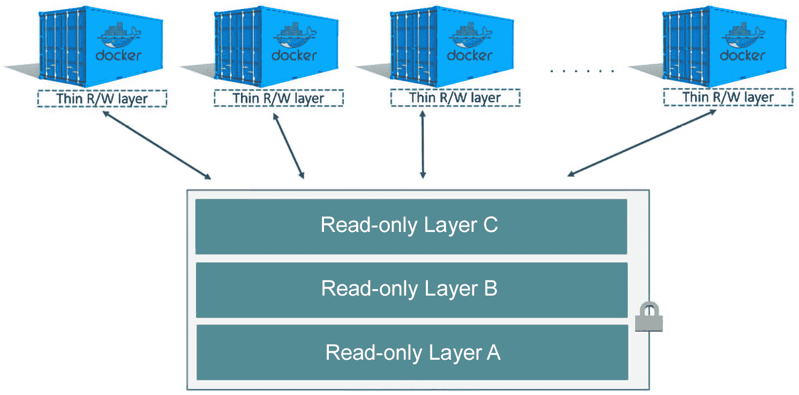

图 2.1:映像层和容器层

如上图所示，可以有一个或多个只读层组成 Docker 映像。这些只读层是在 Docker 映像构建过程中为`Dockerfile`中的每个命令生成的。一旦从映像中创建了 Docker 容器，一个新的读写层(称为**容器层**)将被添加到映像层的顶部，并将承载在运行的容器上所做的所有更改。

在本章中，我们将编写我们的第一个`Dockerfile`，从`Dockerfile`构建 Docker 映像，并从我们的自定义 Docker 映像运行一个 Docker 容器。然而，在我们执行这些任务之前，我们必须先定义一个`Dockerfile`。

# 什么是 Dockerfile？

`Dockerfile`是一个文本文件，包含如何创建 Docker 映像的说明。这些命令被称为**指令**。一个`Dockerfile`是一个机制，我们使用它来根据我们的需求创建一个定制的 Docker 映像。

一`Dockerfile`的格式如下:

```
# This is a comment
DIRECTIVE argument
```

一个`Dockerfile`可以包含多行注释和指令。这些行将由**码头工人引擎**在构建码头工人映像时按顺序执行。像编程语言一样，一个`Dockerfile`也可以包含注释。

所有以#符号开头的语句都将被视为注释。目前`Dockerfiles`只支持单行评论。如果您希望编写多行注释，则需要在每行的开头添加#符号。

然而，与大多数编程语言不同的是，`Dockerfile`中的指令不区分大小写。尽管`DIRECTIVE`不区分大小写，但最好将所有指令都写成大写，以区别于参数。

在下一节中，我们将讨论我们可以在`Dockerfiles`中用来创建自定义 Docker 映像的通用指令。

注意

如果你使用的是 18.04 以后的 ubuntu 版本，会有输入时区的提示。请用`ARG DEBIAN_FRONTEND=non_interactive`抑制提示

# 码头文件中的通用指令

如前一节所述，指令是用于创建 Docker 映像的命令。在本节中，我们将讨论以下五个`Dockerfile`指令:

1.  `FROM`指令
2.  `LABEL`指令
3.  `RUN`指令
4.  `CMD`指令
5.  `ENTRYPOINT`指令

## 从指令

A `Dockerfile`通常以`FROM`指令开头。这用于指定自定义 Docker 映像的父映像。父映像是我们自定义 Docker 映像的起点。我们所做的所有定制都将应用于父映像之上。父映像可以是来自 Docker Hub 的映像，例如 Ubuntu、CentOS、Nginx 和 MySQL。`FROM`指令采用有效的映像名称和标签作为参数。如果没有指定标签，将使用`latest`标签。

FROM 指令具有以下格式:

```
FROM <image>:<tag> 
```

在下面的`FROM`指令中，我们使用带有`20.04`标签的`ubuntu`父映像:

```
FROM ubuntu:20.04
```

此外，如果需要从头开始构建 Docker 映像，我们可以使用基础映像。基础映像(称为暂存映像)是一个空映像，主要用于构建其他父映像。

在下面的`FROM`指令中，我们使用`scratch`映像从头开始构建自定义 Docker 映像:

```
FROM scratch
```

现在，让我们在下一节了解什么是`LABEL`指令。

## 标签指令

`LABEL`是一个键值对，可用于向 Docker 映像添加元数据。这些标签可用于正确组织 Docker 映像。一个例子是添加`Dockerfile`或`Dockerfile`版本的作者姓名。

`LABEL`指令具有以下格式:

```
LABEL <key>=<value>
```

A `Dockerfile`可以有多个标签，遵循前面的键值格式:

```
LABEL maintainer=sathsara@mydomain.com
LABEL version=1.0
LABEL environment=dev
```

或者这些标签可以包含在由空格分隔的一行中:

```
LABEL maintainer=sathsara@mydomain.com version=1.0 environment=dev
```

可以使用`docker image inspect`命令查看现有 Docker 映像上的标签。

运行`docker image inspect <image>:<tag>`命令时，输出应如下所示:

```
...
...
"Labels": {
    "environment": "dev",
    "maintainer": "sathsara@mydomain.com",
    "version": "1.0"
}
...
...
```

如这里所示，docker image inspect 命令将使用`LABEL`指令输出在`Dockerfile`中配置的键值对。

在下一节中，我们将学习如何使用`RUN`指令在映像构建期间执行命令。

## 运行指令

`RUN`指令用于在映像构建期间执行命令。这将在现有图层上创建一个新图层，执行指定的命令，并将结果提交给新创建的图层。`RUN`指令可用于安装所需的包、更新包、创建用户和组等。

`RUN`指令采用以下格式:

```
RUN <command>
```

`<command>`指定要在映像构建过程中执行的 shell 命令。一个`Dockerfile`可以有多个符合前面格式的`RUN`指令。

在下面的例子中，我们在父映像之上运行两个命令。`apt-get update`用于更新包库，`apt-get install nginx -y`用于安装 Nginx 包:

```
RUN apt-get update
RUN apt-get install nginx -y
```

或者，您可以通过用`&&`符号分隔多个外壳命令来将它们添加到单个`RUN`指令中。在下面的例子中，我们使用了相同的两个命令，但这次是在一个单独的`RUN`指令中，由一个`&&`符号隔开:

```
RUN apt-get update && apt-get install nginx -y
```

现在，让我们进入下一部分，了解`CMD`指令。

## CMD 指令

Docker 容器通常需要运行一个进程。一个`CMD`指令用于提供这个默认的初始化命令，当从 Docker 映像创建一个容器时将执行该命令。一个`Dockerfile`只能执行一个`CMD`指令。如果`Dockerfile`中有多个`CMD`指令，Docker 将只执行最后一个指令。

`CMD`指令的格式如下:

```
CMD ["executable","param1","param2","param3", ...]
```

例如，使用以下命令回显“`Hello World`”作为 Docker 容器的输出:

```
CMD ["echo","Hello World"]
```

当我们使用`docker container run <image>`命令运行 Docker 容器时，前面的`CMD`指令将产生以下输出(用 Docker 映像的名称替换`<image>`):

```
$ docker container run <image>
Hello World
```

但是，如果我们发送任何带有`docker container run <image>`的命令行参数，这些参数将优先于我们定义的`CMD`命令。例如，如果我们执行以下命令(将`<image>`替换为 Docker 映像的名称)，则使用`CMD`指令定义的默认“`Hello World`”输出将被忽略。相反，容器将输出“`Hello Docker !!!`”:

```
$ docker container run <image> echo "Hello Docker !!!"
```

正如我们所讨论的，`RUN`和`CMD`指令都可以用来执行 shell 命令。这两个指令的主要区别在于，`RUN`指令提供的命令将在映像构建过程中执行，而`CMD`指令提供的命令将在从构建的映像启动容器后执行。

`RUN`和`CMD`指令的另一个显著区别是一个`Dockerfile`中可以有多个`RUN`指令，但只能有一个`CMD`指令(如果有多个`CMD`指令，除最后一个之外的所有其他指令都将被忽略)。

例如，我们可以在 Docker 映像构建过程中使用`RUN`指令安装软件包，一旦从构建的映像启动容器，就可以使用`CMD`指令启动软件包。

在下一节中，我们将了解`ENTRYPOINT`指令，除了重写之外，它提供了与`CMD`指令相同的功能。

## 入口点指令

与`CMD`指令类似，`ENTRYPOINT`指令也用于提供这个默认的初始化命令，当从 Docker 映像创建容器时将执行该命令。`CMD`指令和`ENTRYPOINT`指令的区别在于，与`CMD`指令不同，我们不能使用与`docker container run`命令一起发送的命令行参数来覆盖`ENTRYPOINT`命令。

注意

可以通过`docker container run`命令发送`--entrypoint`标志，以覆盖映像的默认`ENTRYPOINT`。

`ENTRYPOINT`指令的格式如下:

```
ENTRYPOINT ["executable","param1","param2","param3", ...]
```

类似于`CMD`指令，`ENTRYPOINT`指令也允许我们提供默认的可执行文件和参数。我们可以使用`CMD`指令和`ENTRYPOINT`指令来为可执行文件提供额外的参数。

在以下示例中，我们使用`ENTRYPOINT`指令将`"echo"`用作默认命令并将`"Hello"`用作默认参数。我们还使用`CMD`指令提供了`"World"`作为附加参数:

```
ENTRYPOINT ["echo","Hello"]
CMD ["World"]
```

根据我们如何执行`docker container run`命令，`echo`命令的输出会有所不同。

如果我们在没有任何命令行参数的情况下启动 Docker 映像，它将输出如下消息`Hello World`:

```
$ docker container run <image>
Hello World
```

但是如果我们用额外的命令行参数(例如`Docker`)启动 Docker 映像，输出消息将是`Hello Docker`:

```
$ docker container run <image> "Docker"
Hello Docker
```

在进一步讨论`Dockerfile`指令之前，让我们从在下一个练习中创建第一个`Dockerfile`开始。

## 练习 2.01:创建我们的第一个文档文件

在本练习中，您将创建一个 Docker 映像，该映像可以打印传递给 Docker 映像的参数，前面是文本`You are reading`。比如你通过`hello world`，它会输出`You are reading hello world`作为输出。如果未提供参数，将使用`The Docker Workshop`作为标准值:

1.  使用`mkdir`命令创建一个名为`custom-docker-image`的新目录。该目录将成为您的 Docker 映像的**上下文**。`Context`是包含成功构建映像所需的所有文件的目录:

    ```
    $ mkdir custom-docker-image
    ```

2.  使用`cd`命令导航到新创建的`custom-docker-image`目录，因为我们将在此目录内创建构建过程中所需的所有文件(包括`Dockerfile`:

    ```
    $ cd custom-docker-image
    ```

3.  在`custom-docker-image`目录中，使用`touch`命令创建一个名为`Dockerfile`的文件:

    ```
    $ touch Dockerfile
    ```

4.  现在，使用您最喜欢的文本编辑器打开【T0:

    ```
    $ vim Dockerfile
    ```

5.  Add the following content to the `Dockerfile`, save it, and exit from the `Dockerfile`:

    ```
    # This is my first Docker image
    FROM ubuntu 
    LABEL maintainer=sathsara@mydomain.com 
    RUN apt-get update
    CMD ["The Docker Workshop"]
    ENTRYPOINT ["echo", "You are reading"]
    ```

    Docker 映像将基于 Ubuntu 父映像。然后使用`LABEL`指令提供`Dockerfile`作者的电子邮件地址。下一行执行`apt-get update`命令，将 Debian 的包列表更新到最新的可用版本。最后，您将使用`ENTRYPOINT`和`CMD`指令来定义容器的默认可执行文件和参数。

    我们提供了`echo`作为默认的可执行文件，`You are reading`作为不能被命令行参数覆盖的默认参数。此外，我们还提供了`The Docker Workshop`作为附加参数，可以用`docker container run`命令用命令行参数覆盖。

在本练习中，我们使用在前面章节中学习的通用指令创建了第一个`Dockerfile`。该过程的下一步是从`Dockerfile`构建 Docker 映像。您只能在从`Dockerfile`构建 Docker 映像后运行 Docker 容器。在下一节中，我们将了解如何从`Dockerfile`构建 Docker 映像。

# 构建码头工人映像

在上一节中，我们学习了如何创建`Dockerfile`。该过程的下一步是使用`Dockerfile`构建**码头工人映像**。

一个 **Docker 映像**是用来构建 Docker 容器的模板。这类似于如何使用一个房屋平面图从同一个设计中创建多个房屋。如果你熟悉**面向对象编程**的概念，Docker 映像和 Docker 容器具有与**类**和**对象**相同的关系。面向对象编程中的一个类可以用来创建多个对象。

Docker 映像是基于`Dockerfile`中提供的指令由多层组成的二进制文件。这些层相互堆叠，每一层都依赖于前一层。每一层都是其下一层变化的结果。Docker 映像的所有层都是只读的。一旦我们从 Docker 映像创建了 Docker 容器，就会在其他只读层之上创建一个新的可写层，其中包含对容器文件系统所做的所有修改:

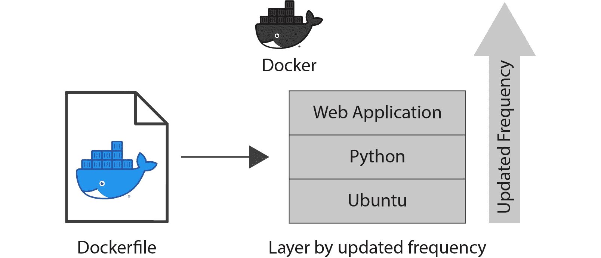

图 2.2: Docker 映像层

如上图所示，docker 映像构建命令将从`Dockerfile`创建 Docker 映像。Docker 映像的图层将映射到`Dockerfile`中提供的指令。

该映像构建过程由 Docker CLI 启动，并由 Docker 守护程序执行。要生成 Docker 映像，Docker 守护程序需要访问`Dockerfile`、源代码(例如`index.html`)以及在`Dockerfile`中引用的其他文件(例如属性文件)。这些文件通常存储在一个名为构建上下文的目录中。该上下文将在执行 docker 映像构建命令时指定。在映像构建过程中，整个上下文将被发送给 Docker 守护程序。

`docker image build`命令采用以下格式:

```
$ docker image build <context>
```

我们可以从包含`Dockerfile`和其他文件的文件夹中执行 docker image build 命令，如下例所示。请注意，命令末尾的点(`.`)用于表示当前目录:

```
$ docker image build.
```

让我们看看以下示例`Dockerfile`的 Docker 映像构建过程:

```
FROM ubuntu:latest
LABEL maintainer=sathsara@mydomain.com
CMD ["echo","Hello World"]
```

该`Dockerfile`使用最新的`ubuntu`映像作为父映像。然后，`LABEL`指令用来指定`sathsara@mydomain.com`为维护者。最后，`CMD`指令用于呼应`"Hello World"`作为映像的输出。

一旦我们对前面的`Dockerfile`执行 docker 映像构建命令，在构建过程中，我们可以在控制台上看到类似如下的输出:

```
Sending build context to Docker daemon 2.048kB
Step 1/3 : FROM ubuntu:latest
latest: Pulling from library/ubuntu
2746a4a261c9: Pull complete 
4c1d20cdee96: Pull complete 
0d3160e1d0de: Pull complete 
c8e37668deea: Pull complete
Digest: sha256:250cc6f3f3ffc5cdaa9d8f4946ac79821aafb4d3afc93928
        f0de9336eba21aa4
Status: Downloaded newer image for ubuntu:latest
 ---> 549b9b86cb8d
Step 2/3 : LABEL maintainer=sathsara@mydomain.com
 ---> Running in a4a11e5e7c27
Removing intermediate container a4a11e5e7c27
 ---> e3add5272e35
Step 3/3 : CMD ["echo","Hello World"]
 ---> Running in aad8a56fcdc5
Removing intermediate container aad8a56fcdc5
 ---> dc3d4fd77861
Successfully built dc3d4fd77861
```

输出的第一行是`Sending build context to Docker daemon`，表示构建开始于向 Docker 守护程序发送构建上下文。上下文中所有可用的文件都将递归发送给 Docker 守护程序(除非特别要求忽略某些文件)。

接下来提到的步骤为`Step 1/3`和`Step 2/3`，与`Dockerfile`中的说明相对应。作为第一步，Docker 守护程序将下载父映像。在前面显示的输出中，从库/ubuntu 拉取表明了这一点。对于`Dockerfile`的每一行，将创建一个新的中间容器来执行该指令，一旦该步骤完成，该中间容器将被移除。线`Running in a4a11e5e7c27`和`Removing intermediate container a4a11e5e7c27`用来表示这一点。最后，`Successfully built dc3d4fd77861`线在构建完成时打印出来，没有任何错误。这一行打印新构建的 Docker 映像的 ID。

现在，我们可以使用`docker image list`命令列出可用的 Docker 映像:

```
$ docker image list
```

此列表包含本地构建的 Docker 映像和从远程 Docker 存储库中提取的 Docker 映像:

```
REPOSITORY   TAG       IMAGE ID        CREATED          SIZE
<none>       <none>    dc3d4fd77861    3 minutes ago    64.2MB
ubuntu       latest    549b9b86cb8d    5 days ago       64.2MB
```

如前面的输出所示，我们可以看到两个 Docker 映像。映像标识为`dc3d4fd77861`的第一个 Docker 映像是构建过程中本地构建的 Docker 映像。我们可以看到这个`IMAGE ID`和`docker image build`命令最后一行的 ID 是一样的。下一个映像是 ubuntu 映像，我们将其用作自定义映像的父映像。

现在，让我们再次使用`docker image build`命令构建 Docker 映像:

```
$ docker image build
Sending build context to Docker daemon  2.048kB
Step 1/3 : FROM ubuntu:latest
 ---> 549b9b86cb8d
Step 2/3 : LABEL maintainer=sathsara@mydomain.com
 ---> Using cache
 ---> e3add5272e35
Step 3/3 : CMD ["echo","Hello World"]
 ---> Using cache
 ---> dc3d4fd77861
Successfully built dc3d4fd77861
```

这一次，映像构建过程是瞬间的。原因是缓存。由于我们没有更改`Dockerfile`的任何内容，Docker 守护程序利用了缓存，并重用了本地映像缓存中的现有图层来加速构建过程。我们可以看到，这次使用的缓存是前面输出中可用的`Using cache`行。

Docker 守护程序将在开始构建过程之前执行验证步骤，以确保所提供的`Dockerfile`在语法上是正确的。如果语法无效，构建过程将失败，Docker 守护程序会显示一条错误消息:

```
$ docker image build
Sending build context to Docker daemon  2.048kB
Error response from daemon: Dockerfile parse error line 5: 
unknown instruction: INVALID
```

现在，让我们使用`docker image list`命令重新访问本地可用的 Docker 映像:

```
$ docker image list
```

该命令应返回以下输出:

```
REPOSITORY    TAG       IMAGE ID         CREATED          SIZE
<none>        <none>    dc3d4fd77861     3 minutes ago    64.2MB
ubuntu        latest    549b9b86cb8d     5 days ago       64.2MB
```

请注意，我们的自定义 Docker 映像没有名称。这是因为我们在构建过程中没有指定任何存储库或标签。我们可以使用 docker image tag 命令来标记现有映像。

让我们用`IMAGE ID dc3d4fd77861`标记我们的映像为`my-tagged-image:v1.0`:

```
$ docker image tag dc3d4fd77861 my-tagged-image:v1.0
```

现在，如果我们再次列出我们的映像，我们可以在`REPOSITORY`和`TAG`列下看到 Docker 映像名称和标签:

```
REPOSITORY        TAG       IMAGE ID        CREATED         SIZE
my-tagged-image   v1.0      dc3d4fd77861    20 minutes ago  64.2MB
ubuntu            latest    549b9b86cb8d    5 days ago      64.2MB
```

我们还可以在构建过程中通过指定`-t`标志来标记映像:

```
$ docker image build -t my-tagged-image:v2.0 .
```

前面的命令将打印以下输出:

```
Sending build context to Docker daemon  2.048kB
Step 1/3 : FROM ubuntu:latest
 ---> 549b9b86cb8d
Step 2/3 : LABEL maintainer=sathsara@mydomain.com
 ---> Using cache
 ---> e3add5272e35
Step 3/3 : CMD ["echo","Hello World"]
 ---> Using cache
 ---> dc3d4fd77861
Successfully built dc3d4fd77861
Successfully tagged my-tagged-image:v2.0
```

这一次，除了`Successfully built dc3d4fd77861`线之外，我们还可以看到一条`Successfully tagged my-tagged-image:v2.0`线，表示我们 Docker 映像上的标记。

在本节中，我们学习了如何从`Dockerfile`构建 Docker 映像。我们讨论了`Dockerfile`和 Docker 映像之间的区别。然后，我们讨论了 Docker 映像是如何由多层组成的。我们还体验了缓存如何加速构建过程。最后，我们标记了 Docker 映像。

在下一个练习中，我们将根据在练习 2.01:创建我们的第一个 Dockerfile 中创建的`Dockerfile`来构建 Docker 映像。

## 练习 2.02:创建我们的第一个码头工人形象

在本练习中，您将从在*练习 2.01:* *中创建的`Dockerfile`构建 Docker 映像，并从新构建的映像运行 Docker 容器。首先，您将在不传递任何参数的情况下运行 Docker 映像，期望您正在阅读 Docker Workshop 作为输出。接下来，您将运行以`Docker Beginner's Guide`为参数的 Docker 映像，并期望您正在阅读 Docker 初学者指南作为输出:*

1.  首先，确保您在*练习 2.01 中创建的`custom-docker-image`目录中:* *创建我们的第一个文件*。确认目录包含以下在*练习 2.01 中创建的`Dockerfile`:**创建我们的第一个文档文件* :

    ```
    # This is my first Docker image
    FROM ubuntu 
    LABEL maintainer=sathsara@mydomain.com 
    RUN apt-get update
    CMD ["The Docker Workshop"]
    ENTRYPOINT ["echo", "You are reading"]
    ```

2.  Build the Docker image with the `docker image build` command. This command has the optional `-t` flag to specify the tag of the image. Tag your image as `welcome:1.0`:

    ```
    $ docker image build -t welcome:1.0 .
    ```

    注意

    不要忘记前面命令末尾的点(`.`)，它用于将当前目录表示为构建上下文。

    从下面的输出可以看出`Dockerfile`中提到的五个步骤都是在构建过程中执行的。输出的最后两行表明映像已成功构建并标记:

    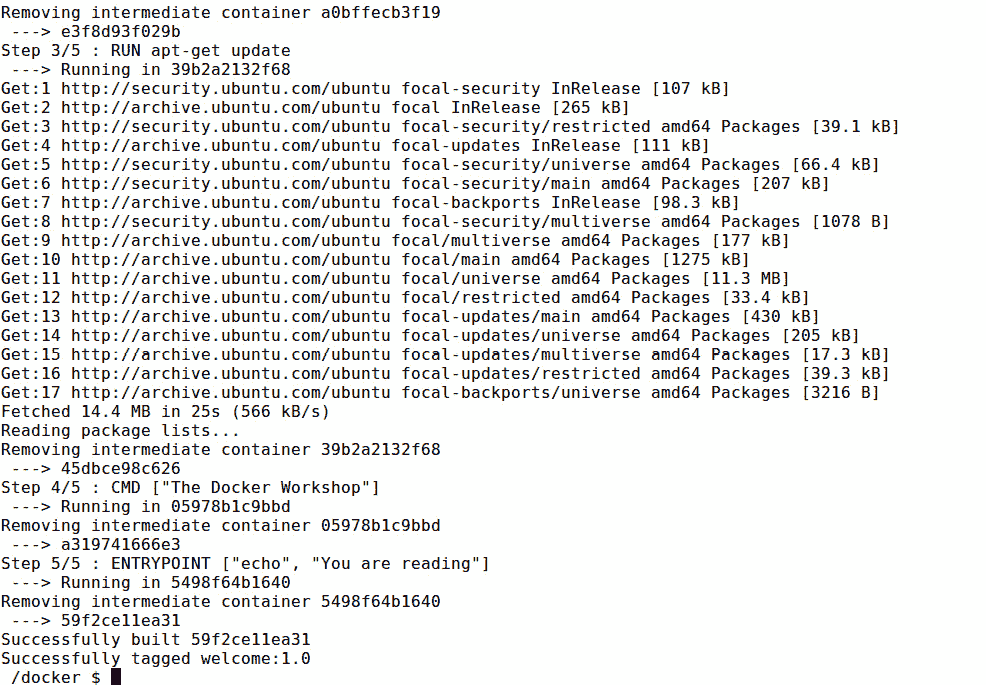

    图 2.3:构建欢迎:1.0 Docker 映像

3.  Build this image again without changing the `Dockerfile` content:

    ```
    $ docker image build -t welcome:2.0 .
    ```

    请注意，由于使用了缓存，此构建过程比之前的过程完成得快得多:

    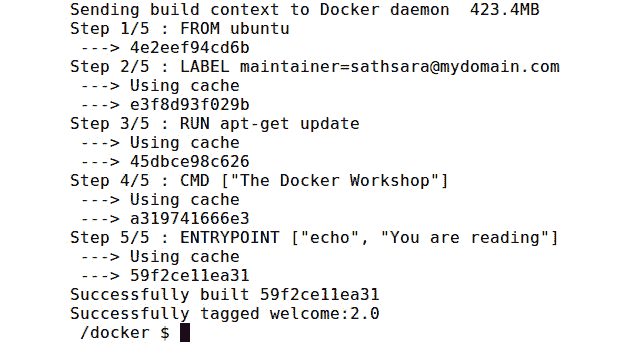

    图 2.4:使用缓存构建欢迎:1.0 Docker 映像

4.  Use the `docker image list` command to list all the Docker images available on your computer:

    ```
    $ docker image list
    ```

    这些映像在您的计算机上可用，无论是从 Docker 注册表中提取它们，还是在您的计算机上构建:

    ```
    REPOSITORY   TAG      IMAGE ID        CREATED          SIZE
    welcome      1.0      98f571a42e5c    23 minutes ago   91.9MB
    welcome      2.0      98f571a42e5c    23 minutes ago   91.9MB
    ubuntu       latest   549b9b86cb8d    2 weeks ago      64.2MB
    ```

    从前面的输出可以看出，有三个 Docker 映像可用。`ubuntu`映像从 Docker Hub 中提取，版本(`tag` ) `1.0`和`2.0``welcome`映像构建在您的计算机上。

5.  Execute the `docker container run` command to start a new container from the Docker image that you built in `step 1` (`welcome:1.0`):

    ```
    $ docker container run welcome:1.0
    ```

    输出应如下所示:

    ```
    You are reading The Docker Workshop
    ```

    您收到`You are reading The Docker Workshop`的预期输出。`You are reading`来自`ENTRYPOINT`指令提供的参数，`The Docker Workshop`来自`CMD`指令提供的参数。

6.  Finally, execute the `docker container run` command again, this time with command-line arguments:

    ```
    $ docker container run welcome:1.0 "Docker Beginner's Guide"
    ```

    由于命令行参数`Docker Beginner's Guide`和`ENTRYPOINT`指令中提供的`You are reading`参数，您将获得输出`You are reading Docker Beginner's Guide`:

    ```
    You are reading Docker Beginner's Guide
    ```

在本练习中，我们学习了如何使用`Dockerfile`构建自定义 Docker 映像，并从该映像运行 Docker 容器。在下一节中，我们将学习可以在`Dockerfile`中使用的其他 Docker 指令。

# 其他文件指令

在 Dockerfile 中的公共指令一节中，我们讨论了可用于`Dockerfile`的公共指令。在那一节中，我们讨论了`FROM`、`LABEL`、`RUN`、`CMD`和`ENTRYPOINT`指令，以及如何使用它们来创建一个简单的`Dockerfile`。

在本节中，我们将讨论更高级的`Dockerfile`指令。这些指令可用于创建更高级的 Docker 映像。例如，我们可以使用`VOLUME`指令将主机的文件系统绑定到 Docker 容器。这将允许我们保存 Docker 容器生成和使用的数据。另一个例子是`HEALTHCHECK`指令，它允许我们定义健康检查来评估 Docker 容器的健康状态。我们将在本节中研究以下指令:

1.  `ENV`指令
2.  `ARG`指令
3.  `WORKDIR`指令
4.  `COPY`指令
5.  `ADD`指令
6.  `USER`指令
7.  `VOLUME`指令
8.  `EXPOSE`指令
9.  `HEALTHCHECK`指令
10.  `ONBUILD`指令

## 环境指令

`Dockerfile`中的 ENV 指令用于设置环境变量。**应用和进程使用环境变量**来获取进程运行环境的信息。一个例子是`PATH`环境变量，它列出了搜索可执行文件的目录。

环境变量按照以下格式定义为键值对:

```
ENV <key> <value>
```

PATH 环境变量设置为以下值:

```
$PATH:/usr/local/myapp/bin/
```

因此，可以使用`ENV`指令进行如下设置:

```
ENV PATH $PATH:/usr/local/myapp/bin/
```

我们可以在由空格分隔的同一行中设置多个环境变量。然而，在这种形式中，`key`和`value`应该用等于(`=`)符号分开:

```
ENV <key>=<value> <key>=<value> ...
```

在下面的示例中，配置了两个环境变量。`PATH`环境变量配置为`$PATH:/usr/local/myapp/bin/`值，`VERSION`环境变量配置为`1.0.0`值:

```
ENV PATH=$PATH:/usr/local/myapp/bin/ VERSION=1.0.0
```

一旦用`Dockerfile`中的`ENV`指令设置了环境变量，该变量在所有后续的 Docker 映像层中都可用。这个变量甚至在从这个 Docker 映像启动的 Docker 容器中可用。

在下一节中，我们将研究`ARG`指令。

## ARG 指令

`ARG`指令用于定义用户在构建时可以传递的变量。`ARG`是`Dockerfile`中唯一可以先于`FROM`指令的指令。

用户可以在构建 Docker 映像时使用`--build-arg <varname>=<value>`传递值，如下所示:

```
$ docker image build -t <image>:<tag> --build-arg <varname>=<value> .
```

`ARG`指令的格式如下:

```
ARG <varname>
```

一个`Dockerfile`中可以有多个`ARG`指令，如下所示:

```
ARG USER
ARG VERSION
```

`ARG`指令也可以定义一个可选的默认值。如果在生成时没有传递任何值，将使用此默认值:

```
ARG USER=TestUser
ARG VERSION=1.0.0
```

与`ENV`变量不同，`ARG`变量不能从运行容器中访问。它们仅在构建过程中可用。

在下一个练习中，我们将使用到目前为止获得的知识来使用`Dockerfile`中的`ENV`和`ARG`指令。

## 练习 2.03:在文件中使用 ENV 和 ARG 指令

您的经理要求您创建一个`Dockerfile`，它将使用 ubuntu 作为父映像，但是您应该能够在构建时更改 ubuntu 版本。您还需要指定发布者的名称和应用目录作为 Docker 映像的环境变量。您将使用`Dockerfile`中的`ENV`和`ARG`指令来执行本练习:

1.  使用`mkdir`命令创建一个名为`env-arg-exercise`的新目录:

    ```
    mkdir env-arg-exercise
    ```

2.  使用`cd`命令导航至新创建的`env-arg-exercise`目录:

    ```
    cd env-arg-exercise
    ```

3.  在`env-arg-exercise`目录下，创建一个名为`Dockerfile` :

    ```
    touch Dockerfile
    ```

    的文件
4.  现在，使用您最喜欢的文本编辑器打开【T0:

    ```
    vim Dockerfile
    ```

5.  Add the following content to the `Dockerfile`. Then, save and exit from the `Dockerfile`:

    ```
    # ENV and ARG example
    ARG TAG=latest
    FROM ubuntu:$TAG
    LABEL maintainer=sathsara@mydomain.com 
    ENV PUBLISHER=packt APP_DIR=/usr/local/app/bin
    CMD ["env"]
    ```

    这个`Dockerfile`首先定义了一个名为`TAG`的参数，默认值为最新。下一行是`FROM`指令，它将使用 ubuntu 父映像，其`TAG`变量值与`build`命令一起发送(如果没有值与 build 命令一起发送，则为默认值)。然后，`LABEL`指令为维护者设置值。接下来是`ENV`指令，用值`packt`定义`PUBLISHER`的环境变量，用值`/usr/local/app/bin`定义`APP_DIR`。最后，使用`CMD`指令执行`env`命令，该命令将打印所有环境变量。

6.  Now, build the Docker image:

    ```
    $ docker image build -t env-arg --build-arg TAG=19.04 .
    ```

    请注意用于向构建过程发送`TAG`参数的`env-arg --build-arg TAG=19.04`标志。输出应如下所示:

    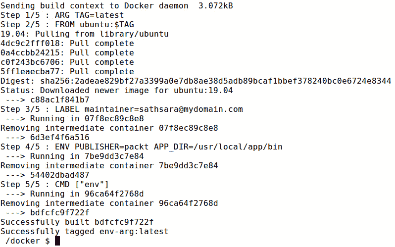

    图 2.5:构建环境参数文档映像

    请注意，ubuntu 映像的`19.04`标签被用作父映像。这是因为您在构建过程中发送了带有`TAG=19.04`值的`--build-arg flag`。

7.  Now, execute the `docker container run` command to start a new container from the Docker image that you built in the last step:

    ```
    $ docker container run env-arg
    ```

    从输出中我们可以看到，`PUBLISHER`环境变量的值为`packt`，而`APP_DIR`环境变量的值为`/usr/local/app/bin`:

    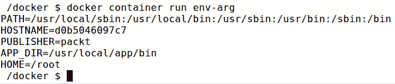

图 2.6:运行环境参数 Docker 容器

在本练习中，我们使用`ENV`指令为 Docker 映像定义了环境变量。我们还体验了如何在 Docker 映像构建期间使用`ARG`指令来传递值。在下一节中，我们将介绍`WORKDIR`指令，该指令可用于定义 Docker 容器的当前工作目录。

## 工作目录指令

`WORKDIR`指令用于指定 Docker 容器的当前工作目录。任何后续的`ADD`、`CMD`、`COPY`、`ENTRYPOINT`和`RUN`指令都将在该目录中执行。`WORKDIR`指令的格式如下:

```
WORKDIR /path/to/workdir
```

如果指定的目录不存在，Docker 将创建该目录并使其成为当前工作目录，这意味着该指令隐式执行`mkdir`和`cd`命令。

`Dockerfile`中可以有多个`WORKDIR`指令。如果在后续的`WORKDIR`指令中提供了相对路径，该路径将相对于之前的`WORKDIR`指令设置的工作目录:

```
WORKDIR /one
WORKDIR two
WORKDIR three
RUN pwd
```

在前面的例子中，我们使用`Dockerfile`末尾的`pwd`命令来打印当前的工作目录。`pwd`命令的输出将是`/one/two/three`。

在下一节中，我们将讨论用于将文件从本地文件系统复制到 Docker 映像文件系统的`COPY`指令。

## 复制指令

在 Docker 映像构建过程中，我们可能需要将文件从本地文件系统复制到 Docker 映像文件系统。这些文件可以是源代码文件(例如，JavaScript 文件)、配置文件(例如，属性文件)或工件(例如，JAR 文件)。`COPY`指令可用于在构建过程中将文件和文件夹从本地文件系统复制到 Docker 映像。这个指令有两个参数。第一个是本地文件系统的源路径，第二个是映像文件系统的目标路径:

```
COPY <source> <destination>
```

在下面的例子中，我们使用`COPY`指令将`index.html`文件从本地文件系统复制到 Docker 映像的`/var/www/html/`目录中:

```
COPY index.html /var/www/html/index.html
```

还可以指定通配符来复制与给定模式匹配的所有文件。以下示例将把扩展名为`.html`的所有文件从当前目录复制到 Docker 映像的`/var/www/html/`目录:

```
COPY *.html /var/www/html/
```

除了复制文件之外，`--chown`标志还可以与`COPY`指令一起使用，以指定文件的用户和组所有权:

```
COPY --chown=myuser:mygroup *.html /var/www/html/
```

在上例中，除了将所有 HTML 文件从当前目录复制到`/var/www/html/`目录外，`--chown`标志用于设置文件所有权，用户为`myuser`，组为`mygroup`:

注意

`--chown`标志仅在 Docker 及以上版本支持。对于 17.09 以下的 Docker 版本，您需要在`COPY`命令之后运行`chown`命令来更改文件所有权。

在下一节中，我们将看看`ADD`指令。

## 添加指令

`ADD`指令也类似于`COPY`指令，格式如下:

```
ADD <source> <destination>
```

然而，除了`COPY`指令提供的功能之外，`ADD`指令还允许我们使用网址作为`<source>`参数:

```
ADD http://sample.com/test.txt /tmp/test.txt
```

在前面的例子中，`ADD`指令将从`http://sample.com`下载`test.txt`文件，并将该文件复制到 Docker 映像文件系统的`/tmp`目录。

`ADD`指令的另一个特点是自动提取压缩文件。如果我们将压缩文件(gzip、bzip2、tar 等)添加到`<source>`参数中，`ADD`指令将提取归档文件并将内容复制到映像文件系统中。

假设我们有一个名为`html.tar.gz`的压缩文件，其中包含`index.html`和`contact.html`文件。以下命令将提取`html.tar.gz`文件并将`index.html`和`contact.html`文件复制到`/var/www/html`目录:

```
ADD html.tar.gz /var/www/html
```

由于`COPY`和`ADD`指令提供几乎相同的功能，建议始终使用`COPY`指令，除非您需要`ADD`指令提供的附加功能(从网址添加或提取压缩文件)。这是因为`ADD`指令提供了额外的功能，如果使用不当，这些功能可能会出现不可预测的行为(例如，当您想要提取时复制文件，或者当您想要复制时提取文件)。

在下一个练习中，我们将使用`WORKDIR`、`COPY`和`ADD`指令将文件复制到 Docker 映像中。

## 练习 2.04:在文档中使用工作目录、复制和添加指令

在本练习中，您将把您的自定义 HTML 文件部署到 Apache 网络服务器上。您将使用 Ubuntu 作为基础映像，并在其上安装 Apache。然后，您将把您的自定义 index.html 文件复制到 Docker 映像中，并下载 Docker 徽标(从 https://www.docker.com 网站)与自定义 index.html 文件一起使用:

1.  使用`mkdir`命令创建一个名为`workdir-copy-add-exercise`的新目录:

    ```
    mkdir workdir-copy-add-exercise
    ```

2.  导航至新创建的`workdir-copy-add-exercise`目录:

    ```
    cd workdir-copy-add-exercise
    ```

3.  在`workdir-copy-add-exercise`目录下，创建一个名为`index.html`的文件。该文件将在构建期间复制到 Docker 映像中:

    ```
    touch index.html 
    ```

4.  现在，使用您最喜欢的文本编辑器打开【T0:

    ```
    vim index.html 
    ```

5.  Add the following content to the `index.html` file, save it, and exit from `index.html`:

    ```
    <html>
      <body>
        <h1>Welcome to The Docker Workshop</h1>
        
      </body>
    </html>
    ```

    这个 HTML 文件将输出`Welcome to The Docker Workshop`作为页面的标题，输出`logo.png`(我们将在 Docker 映像构建过程中下载)作为映像。您已经将`logo.png`映像的大小定义为`350`的高度和`500`的宽度。

6.  在`workdir-copy-add-exercise`目录下，创建一个名为`Dockerfile` :

    ```
    touch Dockerfile
    ```

    的文件
7.  现在，使用您最喜欢的文本编辑器打开【T0:

    ```
    vim Dockerfile
    ```

8.  Add the following content to the `Dockerfile`, save it, and exit from the `Dockerfile`:

    ```
    # WORKDIR, COPY and ADD example
    FROM ubuntu:latest 
    RUN apt-get update && apt-get install apache2 -y 
    WORKDIR /var/www/html/
    COPY index.html .
    ADD https://www.docker.com/sites/default/files/d8/2019-07/  Moby-logo.png ./logo.png
    CMD ["ls"]
    ```

    这个`Dockerfile`首先将 ubuntu 映像定义为父映像。下一行是`RUN`指令，将执行`apt-get update`更新包列表，`apt-get install apache2 -y`安装 Apache HTTP 服务器。然后，将`/var/www/html/`设置为工作目录。接下来，将我们在*步骤 3* 中创建的`index.html`文件复制到 Docker 映像中。然后，使用`ADD`指令将 docker 徽标从[https://www . Docker . com/sites/default/files/D8/2019-07/莫比-logo.png](https://www.docker.com/sites/default/files/d8/2019-07/Moby-logo.png) 下载到 Docker 映像中。最后一步是使用`ls`命令打印`/var/www/html/`目录的内容。

9.  Now, build the Docker image with the tag of `workdir-copy-add`:

    ```
    $ docker image build -t workdir-copy-add .
    ```

    您将观察到映像已成功构建并标记为`latest`，因为我们没有明确标记我们的映像:

    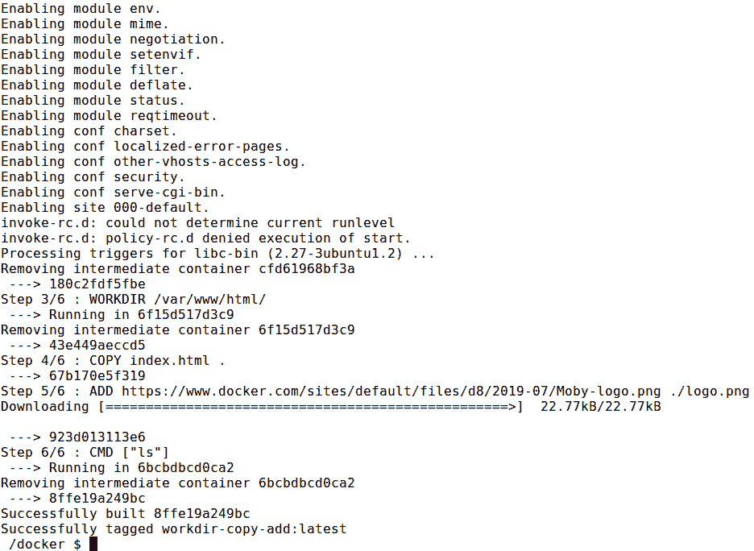

    图 2.7:使用工作目录、复制和添加指令构建 Docker 映像

10.  Execute the `docker container run` command to start a new container from the Docker image that you built in the previous step:

    ```
    $ docker container run workdir-copy-add
    ```

    从输出中我们可以看到，`index.html`和`logo.png`文件都在`/var/www/html/`目录中:

    ```
    index.html
    logo.png
    ```

在本练习中，我们观察了`WORKDIR`、`ADD`和`COPY`指令如何与 Docker 一起工作。在下一节中，我们将讨论`USER`指令。

## 用户指令

Docker 将使用根用户作为 Docker 容器的默认用户。我们可以使用`USER`指令来更改这个默认行为，并指定一个非根用户作为 Docker 容器的默认用户。这是通过以非特权用户的身份运行 Docker 容器来提高安全性的好方法。用`USER`指令指定的用户名将用于运行`Dockerfile`中所有后续的`RUN`、`CMD`和`ENTRYPOINT`指令。

`USER`指令采用以下格式:

```
USER <user>
```

除了用户名，我们还可以指定可选的组名来运行 Docker 容器:

```
USER <user>:<group>
```

我们需要确保`<user>`和`<group>`值是有效的用户名和组名。否则，Docker 守护程序将在尝试运行容器时引发错误:

```
docker: Error response from daemon: unable to find user my_user: 
        no matching entries in passwd file.
```

现在，让我们在下一个练习中尝试使用`USER`指令。

## 练习 2.05:在文档中使用用户指令

您的经理要求您创建一个 Docker 映像来运行 Apache 网络服务器。出于安全原因，他特别要求您在运行 Docker 容器时使用非根用户。在本练习中，您将使用`Dockerfile`中的`USER`指令来设置默认用户。您将安装 Apache 网络服务器并将用户更改为`www-data`。最后，您将执行`whoami`命令，通过打印用户名来验证当前用户:

注意

`www-data`用户是 Ubuntu 上 Apache web 服务器的默认用户。

1.  为本练习创建一个名为`user-exercise`的新目录:

    ```
    mkdir user-exercise
    ```

2.  导航至新创建的`user-exercise`目录:

    ```
    cd user-exercise
    ```

3.  在`user-exercise`目录下，创建一个名为`Dockerfile` :

    ```
    touch Dockerfile
    ```

    的文件
4.  现在，使用您最喜欢的文本编辑器打开【T0:

    ```
    vim Dockerfile
    ```

5.  Add the following content to the `Dockerfile`, save it, and exit from the `Dockerfile`:

    ```
    # USER example
    FROM ubuntu
    RUN apt-get update && apt-get install apache2 -y 
    USER www-data
    CMD ["whoami"]
    ```

    这个`Dockerfile`首先将 Ubuntu 映像定义为父映像。下一行是`RUN`指令，将执行`apt-get update`更新包列表，`apt-get install apache2 -y`安装 Apache HTTP 服务器。接下来，使用`USER`指令将当前用户更改为`www-data`用户。最后，您有`CMD`指令，它执行`whoami`命令，该命令将打印当前用户的用户名。

6.  Build the Docker image:

    ```
    $ docker image build -t user .
    ```

    输出应如下所示:

    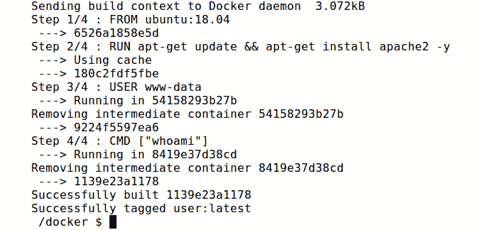

    图 2.8:构建用户 Docker 映像

7.  Now, execute the `docker container` run command to start a new container from the Docker image that we built in the previous step:

    ```
    $ docker container run user
    ```

    从下面的输出可以看出，`www-data`是与 Docker 容器关联的当前用户:

    ```
    www-data
    ```

在本练习中，我们在`Dockerfile`中实现了`USER`指令，将`www-data`用户设置为 Docker 映像的默认用户。

在下一节中，我们将讨论`VOLUME`指令。

## 体积指令

在 Docker 中，Docker 容器生成和使用的数据(例如，文件、可执行文件)将存储在容器文件系统中。当我们删除容器时，所有的数据都将丢失。为了克服这个问题，Docker 提出了卷的概念。卷用于保存数据并在容器之间共享数据。我们可以使用`Dockerfile`中的`VOLUME`指令来创建 Docker 卷。一旦在 Docker 容器中创建了一个`VOLUME`，就会在底层主机中创建一个映射目录。对 Docker 容器的卷装载的所有文件更改都将被复制到主机的映射目录。

`VOLUME`指令一般以 JSON 数组为参数:

```
VOLUME ["/path/to/volume"]
```

或者，我们可以指定一个包含多个路径的普通字符串:

```
VOLUME /path/to/volume1 /path/to/volume2
```

我们可以使用`docker container inspect <container>`命令查看容器中可用的体积。docker 容器检查命令的输出 JSON 将打印类似于以下内容的卷信息:

```
"Mounts": [
    {
        "Type": "volume",
        "Name": "77db32d66407a554bd0dbdf3950671b658b6233c509ea
ed9f5c2a589fea268fe",
        "Source": "/var/lib/docker/volumes/77db32d66407a554bd0
dbdf3950671b658b6233c509eaed9f5c2a589fea268fe/_data",
        "Destination": "/path/to/volume",
        "Driver": "local",
        "Mode": "",
        "RW": true,
        "Propagation": ""
    }
],
```

根据前面的输出，Docker 为该卷指定了一个唯一的名称。此外，输出中还提到了卷的源路径和目标路径。

此外，我们可以执行`docker volume inspect <volume>`命令来显示与卷相关的详细信息:

```
[
    {
        "CreatedAt": "2019-12-28T12:52:52+05:30",
        "Driver": "local",
        "Labels": null,
        "Mountpoint": "/var/lib/docker/volumes/77db32d66407a554
bd0dbdf3950671b658b6233c509eaed9f5c2a589fea268fe/_data",
        "Name": "77db32d66407a554bd0dbdf3950671b658b6233c509eae
d9f5c2a589fea268fe",
        "Options": null,
        "Scope": "local"
    }
]
```

这也类似于前面的输出，具有相同的唯一名称和卷的装载路径。

在下一个练习中，我们将学习如何在`Dockerfile`中使用`VOLUME`指令。

## 练习 2.06:在 Dockerfile 中使用 VOLUME 指令

在本练习中，您将设置一个 Docker 容器来运行 Apache 网络服务器。但是，您不希望在 Docker 容器出现故障时丢失 Apache 日志文件。作为一个解决方案，您已经决定通过将 Apache 日志路径装载到底层 Docker 主机来保留日志文件:

1.  创建一个名为`volume-exercise` :

    ```
    mkdir volume-exercise
    ```

    的新目录
2.  导航至新创建的`volume-exercise`目录:

    ```
    cd volume-exercise
    ```

3.  在`volume-exercise`目录下，创建一个名为`Dockerfile` :

    ```
    touch Dockerfile
    ```

    的文件
4.  现在，使用您最喜欢的文本编辑器打开【T0:

    ```
    vim Dockerfile
    ```

5.  Add the following content to the `Dockerfile`, save it, and exit from the `Dockerfile`:

    ```
    # VOLUME example
    FROM ubuntu
    RUN apt-get update && apt-get install apache2 -y
    VOLUME ["/var/log/apache2"]
    ```

    这个`Dockerfile`从定义 Ubuntu 映像为父映像开始。接下来，您将执行`apt-get update`命令来更新包列表，并执行`apt-get install apache2 -y`命令来安装 Apache 网络服务器。最后，使用`VOLUME`指令设置`/var/log/apache2`目录的挂载点。

6.  Now, build the Docker image:

    ```
    $ docker image build -t volume .
    ```

    输出应如下所示:

    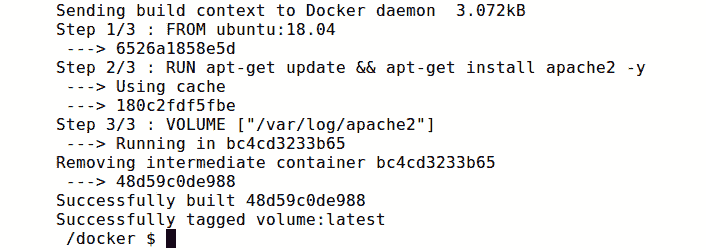

    图 2.9:构建卷 Docker 映像

7.  Execute the docker container run command to start a new container from the Docker image that you built in the previous step. Note that you are using the `--interactive` and `--tty` flags to open an interactive bash session so that you can execute commands from the bash shell of the Docker container. You have also used the `--name` flag to define the container name as `volume-container`:

    ```
    $ docker container run --interactive --tty --name volume-container volume /bin/bash
    ```

    您的 bash shell 将按如下方式打开:

    ```
    root@bc61d46de960: /#
    ```

8.  From the Docker container command line, change directory to the `/var/log/apache2/` directory:

    ```
    # cd /var/log/apache2/
    ```

    这将产生以下输出:

    ```
    root@bc61d46de960: /var/log/apache2#
    ```

9.  Now, list the available files in the directory:

    ```
    # ls -l
    ```

    输出应如下所示:

    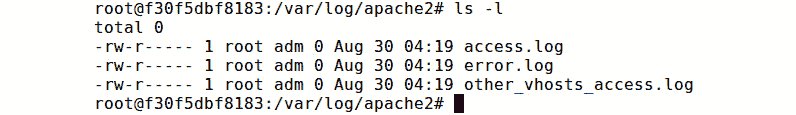

    图 2.10:列出/var/log/apache2 目录的文件

    这些是 Apache 在运行进程时创建的日志文件。检查该卷的主机装载后，应该可以使用相同的文件。

10.  现在，退出容器来检查主机文件系统:

    ```
    # exit
    ```

11.  Inspect `volume-container` to view the mount information:

    ```
    $ docker container inspect volume-container
    ```

    在“`Mounts`”键下，可以看到与坐骑相关的信息:

    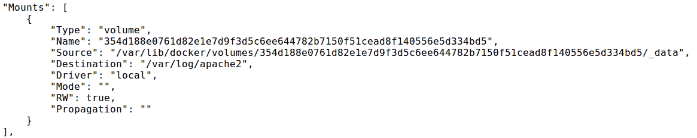

    图 2.11:检查码头工人集装箱

12.  Inspect the volume with the `docker volume inspect <volume_name>` command. `<volume_name>` can be identified by the `Name` field of the preceding output:

    ```
    $ docker volume inspect 354d188e0761d82e1e7d9f3d5c6ee644782b7150f51cead8f140556e5d334bd5
    ```

    您应该会得到类似如下的输出:

    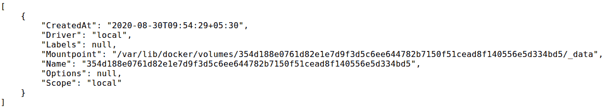

    图 2.12:检查 Docker 卷

    我们可以看到容器被安装到`"/var/lib/docker/volumes/354d188e0761d82e1e7d9f3d5c6ee644782b 7150f51cead8f140556e5d334bd5/_data"`的主机路径上，这在前面的输出中被定义为`Mountpoint`字段。

13.  List the files available in the host file path. The host file path can be identified with the `"Mountpoint`" field of the preceding output:

    ```
    $ sudo ls -l /var/lib/docker/volumes/354d188e0761d82e1e7d9f3d5c6ee644782b7150f51cead8f14 0556e5d334bd5/_data
    ```

    在下面的输出中，您可以看到容器的`/var/log/apache2`目录中的日志文件被装载到主机上:

    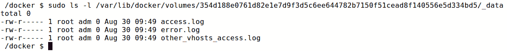

图 2.13:列出装载点目录中的文件

在本练习中，我们观察了如何使用`VOLUME`指令将 Apache 网络服务器的日志路径挂载到主机文件系统。在下一节中，我们将了解`EXPOSE`指令。

## 暴露指令

`EXPOSE`指令用于通知 Docker 容器正在运行时监听指定的端口。我们可以使用`EXPOSE`指令通过 TCP 或 UDP 协议来公开端口。`EXPOSE`指令有以下格式:

```
EXPOSE <port>
```

但是，通过`EXPOSE`指令暴露的端口只能从其他 Docker 容器中访问。要在 Docker 容器之外公开这些端口，我们可以使用`docker container run`命令发布带有`-p`标志的端口:

```
docker container run -p <host_port>:<container_port> <image>
```

举个例子，假设我们有两个容器。一个是 NodeJS web app 容器，应该通过端口`80`从外部访问。第二个是 MySQL 容器，应该通过端口`3306`从节点 app 容器访问。在这种情况下，我们必须使用`EXPOSE`指令公开 NodeJS 应用的端口`80`，并使用带有`docker container run`命令的`-p`标志将其对外公开。但是，对于 MySQL 容器，我们在运行容器时只能使用没有`-p`标志的`EXPOSE`指令，因为`3306`应该只能从节点 app 容器访问。

总之，以下语句定义了该指令:

*   如果我们同时指定`EXPOSE`指令和`-p`标志，暴露的端口将可以从其他容器和外部访问。
*   如果我们在没有`-p`标志的情况下指定`EXPOSE`，暴露的端口将只能从其他容器访问，而不能从外部访问。

您将在下一节了解`HEALTHCHECK`指令。

## 健康检查指令

Docker 中使用健康检查来检查容器是否健康运行。例如，我们可以使用运行状况检查来确保应用在 Docker 容器中运行。除非指定了健康检查，否则 Docker 无法判断容器是否健康。如果您在生产环境中运行 Docker 容器，这一点非常重要。`HEALTHCHECK`指令的格式如下:

```
HEALTHCHECK [OPTIONS] CMD command
```

一个`Dockerfile`中只能有一个`HEALTHCHECK`指令。如果有多个`HEALTHCHECK`指令，只有最后一个才会生效。

例如，我们可以使用以下指令来确保容器可以在`http://localhost/`端点上接收流量:

```
HEALTHCHECK CMD curl -f http://localhost/ || exit 1
```

前面命令末尾的退出代码用于指定容器的健康状态。`0`和`1`是该字段的有效值。0 表示健康容器，`1`表示不健康容器。

除了该命令，我们还可以用`HEALTHCHECK`指令指定其他几个参数，如下所示:

*   `--interval`:指定每次健康检查的间隔时间(默认为 30s)。
*   `--timeout`:如果在此期间没有收到成功响应，则认为健康检查失败(默认为 30s)。
*   `--start-period`:运行第一次运行状况检查之前等待的持续时间。这用于给出容器的启动时间(默认值为 0)。
*   `--retries`:如果健康检查在给定的重试次数内连续失败，容器将被视为不健康(默认值为 3)。

在下面的示例中，我们通过向自定义值提供`HEALTHCHECK`指令来覆盖默认值:

```
HEALTHCHECK --interval=1m --timeout=2s --start-period=2m --retries=3 \    CMD curl -f http://localhost/ || exit 1
```

我们可以使用`docker container list`命令检查容器的健康状态。这将在`STATUS`栏下列出健康状态:

```
CONTAINER ID  IMAGE     COMMAND                  CREATED
  STATUS                        PORTS                NAMES
d4e627acf6ec  sample    "apache2ctl -D FOREG…"   About a minute ago
  Up About a minute (healthy)   0.0.0.0:80->80/tcp   upbeat_banach
```

一旦我们启动容器，健康状态将是健康:启动。成功执行`HEALTHCHECK`命令后，状态将变为`healthy`。

在下一个练习中，我们将使用`EXPOSE`和`HEALTHCHECK`指令创建一个带有 Apache web 服务器的 Docker 容器，并为其定义健康检查。

## 练习 2.07:在 Dockerfile 中使用 EXPOSE 和 HEALTHCHECK 指令

您的经理要求您将 Apache 网络服务器归档，以便从网络浏览器访问 Apache 主页。此外，他要求您配置运行状况检查，以确定 Apache 网络服务器的运行状况。在本练习中，您将使用`EXPOSE`和`HEALTHCHECK`指令来实现这一目标:

1.  创建一个名为`expose-healthcheck` :

    ```
    mkdir expose-healthcheck
    ```

    的新目录
2.  导航至新创建的`expose-healthcheck`目录:

    ```
    cd expose-healthcheck
    ```

3.  在`expose-healthcheck`目录下，创建一个名为`Dockerfile` :

    ```
    touch Dockerfile
    ```

    的文件
4.  现在，使用您最喜欢的文本编辑器打开【T0:

    ```
    vim Dockerfile
    ```

5.  Add the following content to the `Dockerfile`, save it, and exit from the `Dockerfile`:

    ```
    # EXPOSE & HEALTHCHECK example
    FROM ubuntu
    RUN apt-get update && apt-get install apache2 curl -y 
    HEALTHCHECK CMD curl -f http://localhost/ || exit 1
    EXPOSE 80
    ENTRYPOINT ["apache2ctl", "-D", "FOREGROUND"]
    ```

    这个`Dockerfile`首先将 ubuntu 映像定义为父映像。接下来，我们执行`apt-get update`命令来更新包列表，执行`apt-get install apache2 curl -y`命令来安装 Apache web 服务器和 curl 工具。`Curl`需要执行`HEALTHCHECK`命令。接下来，我们定义卷曲到`http://localhost/`端点的`HEALTHCHECK`指令。然后，我们公开了 Apache 网络服务器的端口`80`，这样我们就可以从我们的网络浏览器访问主页。最后，我们用`ENTRYPOINT`指令启动 Apache 网络服务器。

6.  Now, build the Docker image:

    ```
    $ docker image build -t expose-healthcheck.
    ```

    您应该会得到以下输出:

    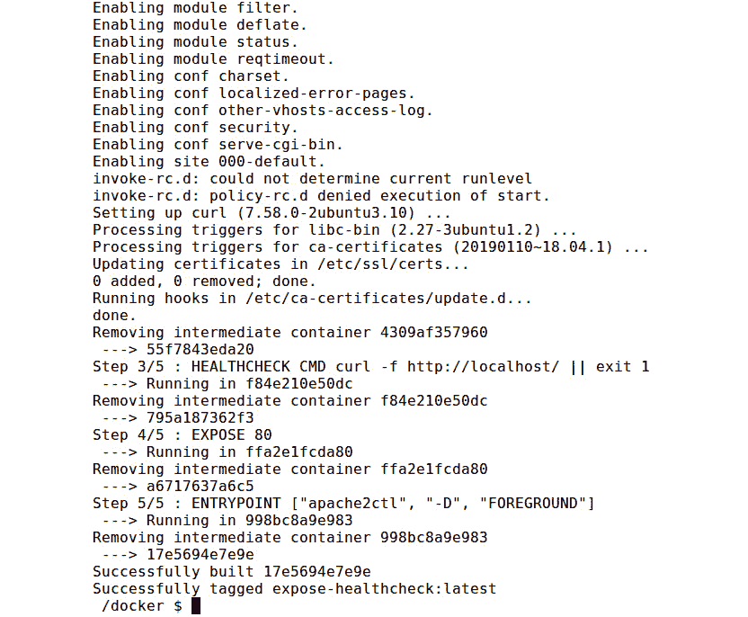

    图 2.14:构建曝光健康检查 Docker 映像

7.  执行 docker 容器运行命令，从上一步构建的 Docker 映像中启动一个新容器。请注意，您正在使用`-p`标志将主机的端口`80`重定向到容器的端口`80`。此外，您还使用了`--name`标志将容器名称指定为`expose-healthcheck-container`，使用`-d`标志以分离模式运行容器(这将在后台运行容器):

    ```
    $ docker container run -p 80:80 --name expose-healthcheck-container -d expose-healthcheck
    ```

8.  List the running containers with the `docker container list` command:

    ```
    $ docker container list
    ```

    在下面的输出中，可以看到`expose-healthcheck-container`的`STATUS`是健康的:

    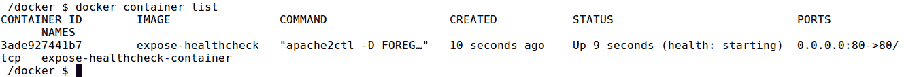

    图 2.15:运行容器列表

9.  Now, you should be able to view the Apache home page. Go to the `http://127.0.0.1` endpoint from your favorite web browser:

    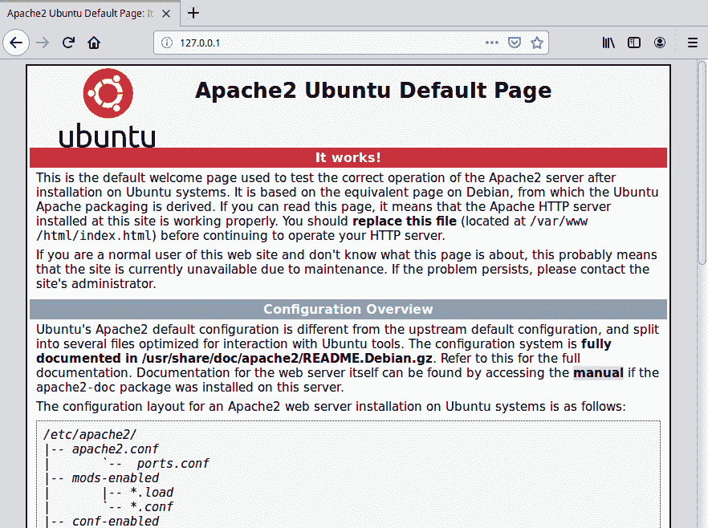

    图 2.16: Apache 主页

10.  现在，清理容器。首先，使用`docker container stop`命令停止 Docker 容器:

    ```
    $ docker container stop expose-healthcheck-container
    ```

11.  最后，用`docker container rm`命令

    ```
    $ docker container rm expose-healthcheck-container
    ```

    移除 Docker 容器

在本练习中，您使用`EXPOSE`指令将 Apache 网络服务器公开为 Docker 容器，并使用`HEALTHCHECK`指令定义健康检查以验证 Docker 容器的健康状态。

在下一节中，我们将了解`ONBUILD`指令。

## 英国建筑指令

`ONBUILD`指令在`Dockerfile`中用于创建可重用的 Docker 映像，该映像将用作另一个 Docker 映像的基础。例如，我们可以创建一个 Docker 映像，其中包含运行应用所需的所有先决条件，如依赖关系和配置。然后，我们可以使用这个“先决条件”映像作为父映像来运行应用。

在创建先决映像时，我们可以使用`ONBUILD`指令，该指令将包括仅当该映像用作另一个`Dockerfile`中的父映像时才应执行的指令。`ONBUILD`指令不会在构建包含`ONBUILD`指令的`Dockerfile`时执行，只会在构建子映像时执行。

`ONBUILD`指令采用以下格式:

```
ONBUILD <instruction>
```

例如，假设我们在自定义基础映像的`Dockerfile`中有以下`ONBUILD`指令:

```
ONBUILD ENTRYPOINT ["echo","Running ONBUILD directive"]
```

如果我们从自定义基础映像创建 Docker 容器，则不会打印`"Running ONBUILD directive"`值。但是，如果我们使用自定义基础映像作为新的子 Docker 映像的基础，则会打印`"Running ONBUILD directive"`值。

我们可以使用父映像的`docker image inspect`命令来列出为该映像列出的 OnBuild 触发器:

```
$ docker image inspect <parent-image>
```

该命令将返回类似如下的输出:

```
...
"OnBuild": [
    "CMD [\"echo\",\"Running ONBUILD directive\"]"
]
...
```

在下一个练习中，我们将使用`ONBUILD`指令定义一个 Docker 映像来部署 HTML 文件。

## 练习 2.08:在 Dockerfile 中使用 ONBUILD 指令

您的经理要求您创建一个 Docker 映像，该映像能够运行软件开发团队提供的任何 HTML 文件。在本练习中，您将使用 Apache 网络服务器构建一个父映像，并使用`ONBUILD`指令复制 HTML 文件。软件开发团队可以使用这个 Docker 映像作为父映像来部署和测试他们创建的任何 HTML 文件:

1.  创建一个名为`onbuild-parent` :

    ```
    mkdir onbuild-parent
    ```

    的新目录
2.  导航至新创建的`onbuild-parent`目录:

    ```
    cd onbuild-parent
    ```

3.  在`onbuild-parent`目录下，创建一个名为`Dockerfile` :

    ```
    touch Dockerfile
    ```

    的文件
4.  现在，使用您最喜欢的文本编辑器打开【T0:

    ```
    vim Dockerfile
    ```

5.  Add the following content to the `Dockerfile`, save it, and exit from the `Dockerfile`:

    ```
    # ONBUILD example
    FROM ubuntu
    RUN apt-get update && apt-get install apache2 -y 
    ONBUILD COPY *.html /var/www/html
    EXPOSE 80
    ENTRYPOINT ["apache2ctl", "-D", "FOREGROUND"]
    ```

    这个`Dockerfile`首先将 ubuntu 映像定义为父映像。然后执行`apt-get update`命令更新包列表，执行`apt-get install apache2 -y`命令安装 Apache 网络服务器。`ONBUILD`指令用于提供将所有 HTML 文件复制到`/var/www/html`目录的触发器。`EXPOSE`指令用于暴露容器的端口`80`，使用`apache2ctl`命令`ENTRYPOINT`启动 Apache web 服务器。

6.  Now, build the Docker image:

    ```
    $ docker image build -t onbuild-parent .
    ```

    输出应如下所示:

    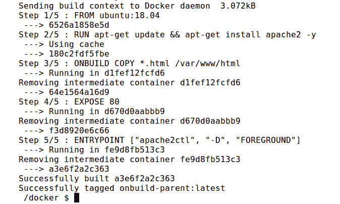

    图 2.17:构建基于构建的父 Docker 映像

7.  Execute the `docker container run` command to start a new container from the Docker image built in the previous step:

    ```
    $ docker container run -p 80:80 --name onbuild-parent-container -d onbuild-parent
    ```

    在前面的命令中，您已经在分离模式下启动了 Docker 容器，同时暴露了容器的端口`80`。

8.  Now, you should be able to view the Apache home page. Go to the `http://127.0.0.1` endpoint from your favorite web browser. Note that the default Apache home page is visible:

    

    图 2.18: Apache 主页

9.  现在，清理容器。使用`docker container stop`命令

    ```
    $ docker container stop onbuild-parent-container
    ```

    停止 Docker 容器
10.  使用`docker container rm`命令

    ```
    $ docker container rm onbuild-parent-container
    ```

    移除 Docker 容器
11.  现在，使用`onbuild-parent-container`作为父映像创建另一个 Docker 映像，以部署自定义 HTML 主页。首先，将目录改回上一个目录:

    ```
    cd ..
    ```

12.  为本练习创建一个名为`onbuild-child`的新目录:

    ```
    mkdir onbuild-child
    ```

13.  导航至新创建的`onbuild-child`目录:

    ```
    cd onbuild-child
    ```

14.  在`onbuild-child`目录下，创建一个名为`index.html`的文件。该文件将在构建期间通过`ONBUILD`命令复制到 Docker 映像中:

    ```
    touch index.html 
    ```

15.  现在，使用您最喜欢的文本编辑器打开`index.html`文件:

    ```
    vim index.html 
    ```

16.  Add the following content to the `index.html` file, save it, and exit from the `index.html` file:

    ```
    <html>
      <body>
        <h1>Learning Docker ONBUILD directive</h1>
      </body>
    </html>
    ```

    这是一个简单的 HTML 文件，将输出`Learning Docker ONBUILD`指令作为页面的标题。

17.  在`onbuild-child`目录下，创建一个名为`Dockerfile` :

    ```
    touch Dockerfile
    ```

    的文件
18.  现在，使用您最喜欢的文本编辑器打开【T0:

    ```
    vim Dockerfile
    ```

19.  Add the following content to the `Dockerfile`, save it, and exit from the `Dockerfile`:

    ```
    # ONBUILD example
    FROM onbuild-parent
    ```

    这个`Dockerfile`只有一个指令。这将使用`FROM`指令来使用您之前创建的`onbuild-parent` Docker 映像作为父映像。

20.  Now, build the Docker image:

    ```
    $ docker image build -t onbuild-child .
    ```

    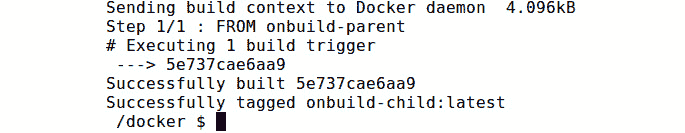

    图 2.19:构建子代 Docker 映像

21.  Execute the `docker container run` command to start a new container from the Docker image that you built in the previous step:

    ```
    $ docker container run -p 80:80 --name onbuild-child-container -d onbuild-child
    ```

    在此命令中，您已经从`onbuild-child` Docker 映像启动了 Docker 容器，同时暴露了容器的端口`80`。

22.  You should be able to view the Apache home page. Go to the `http://127.0.0.1` endpoint from your favorite web browser:

    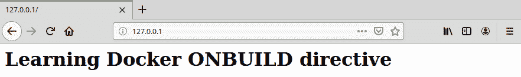

    图 2.20:Apache 网络服务器的定制主页

23.  现在，清理容器。首先，使用`docker container stop`命令停止 Docker 容器:

    ```
    $ docker container stop onbuild-child-container
    ```

24.  最后，用`docker container rm`命令

    ```
    $ docker container rm onbuild-child-container
    ```

    移除 Docker 容器

在本练习中，我们观察了如何使用`ONBUILD`指令创建可重用的 Docker 映像，该映像能够运行提供给它的任何 HTML 文件。我们用 Apache 网络服务器创建了名为`onbuild-parent`的可重用 Docker 映像，并暴露了端口`80`。这个`Dockerfile`包含`ONBUILD`指令，在 Docker 映像的上下文中复制 HTML 文件。然后，我们创建了第二个名为`onbuild-child`的 Docker 映像，使用`onbuild-parent`作为基础映像，它提供了一个简单的 HTML 文件来部署到 Apache 网络服务器。

现在，让我们通过在下面的活动中使用 Apache web 服务器对给定的 PHP 应用进行分类来测试我们在本章中获得的知识。

## 活动 2.01:在 Docker 容器上运行一个 PHP 应用

假设您想要部署一个 PHP 欢迎页面，该页面将使用以下逻辑基于日期和时间迎接访问者。您的任务是使用安装在 Ubuntu 基础映像上的 Apache web 服务器来记录这里给出的 PHP 应用:

```
<?php
$hourOfDay = date('H');
if($hourOfDay < 12) {
    $message = "Good Morning";
} elseif($hourOfDay > 11 && $hourOfDay < 18) {
    $message = "Good Afternoon";
} elseif($hourOfDay > 17){
    $message = "Good Evening";
}
echo $message;
?>
```

这是一个简单的 PHP 文件，它将基于以下逻辑向用户致意:


图 2.21:PHP 应用的逻辑

执行以下步骤完成本活动:

1.  创建一个文件夹来存储活动文件。
2.  用之前提供的代码创建一个`welcome.php`文件。
3.  创建一个`Dockerfile`并用 PHP 和 Apache2 在 Ubuntu 基础映像上设置应用。
4.  构建并运行 Docker 映像。
5.  Once completed, stop and remove the Docker container.

    注意

    此活动的解决方案可以通过[这个链接](16.html#_idTextAnchor321)找到。

# 总结

在本章中，我们讨论了如何使用`Dockerfile`来创建我们自己的自定义 Docker 映像。首先，我们讨论了什么是`Dockerfile`和`Dockerfile`的语法。然后我们讨论了一些常见的 Docker 指令，包括`FROM`、`LABEL`、`RUN`、`CMD`和`ENTRYPOINT`指令。然后，我们用所学的通用指令创建了我们的第一个`Dockerfile`。

在下一节中，我们将重点放在构建 Docker 映像上。我们深入讨论了关于 Docker 映像的多个领域，包括 Docker 映像的分层文件系统、Docker 构建中的上下文以及 Docker 构建过程中缓存的使用。然后，我们讨论了更高级的`Dockerfile`指令，包括`ENV`、`ARG`、`WORKDIR`、`COPY`、`ADD`、`USER`、`VOLUME`、`EXPOSE`、`HEALTHCHECK`和`ONBUILD`指令。

在下一章中，我们将讨论什么是 Docker 注册表，查看私有和公共 Docker 注册表，并了解如何将 Docker 映像发布到 Docker 注册表。