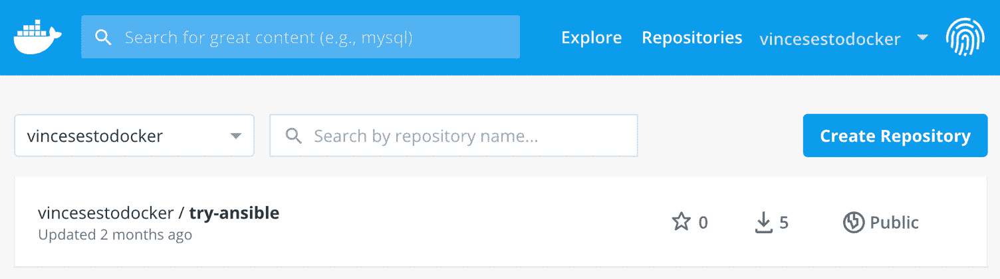
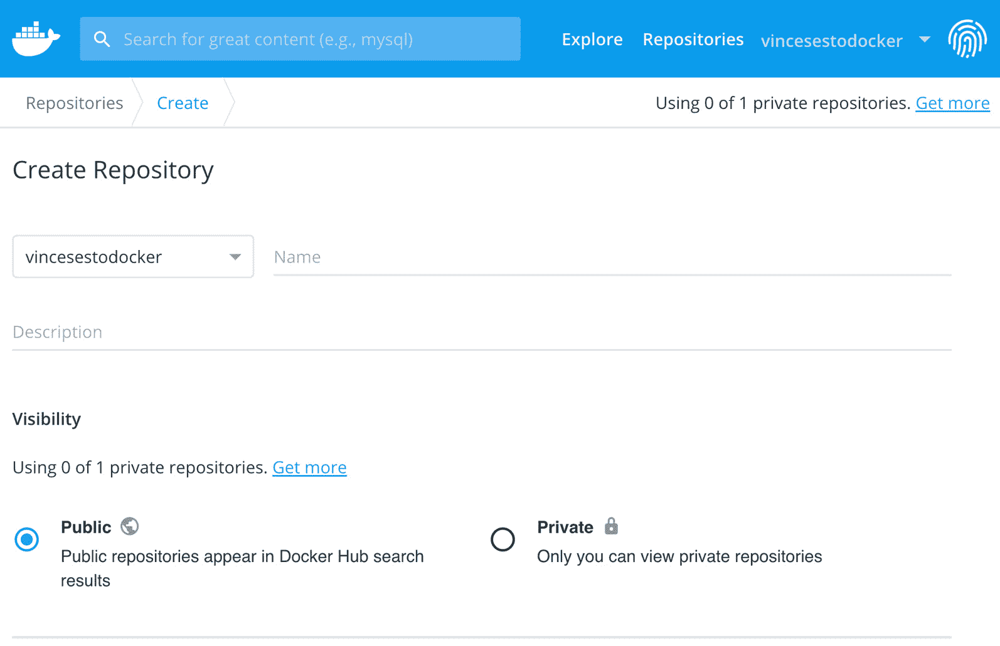
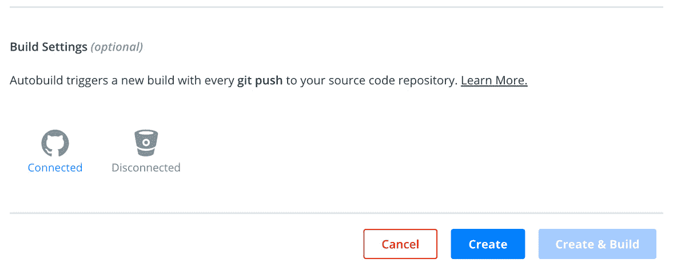
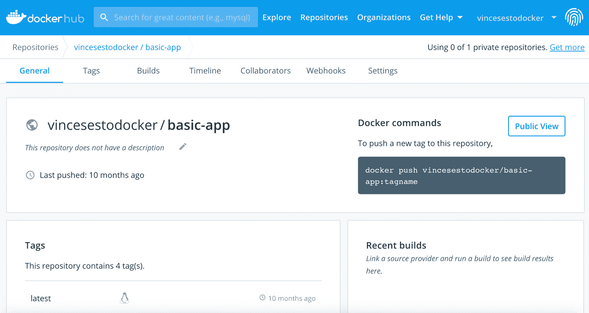
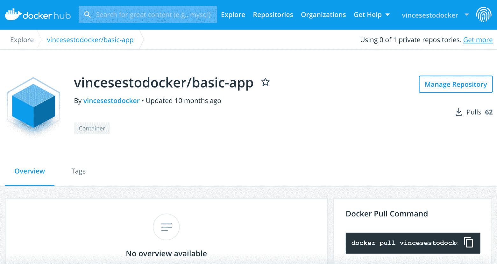
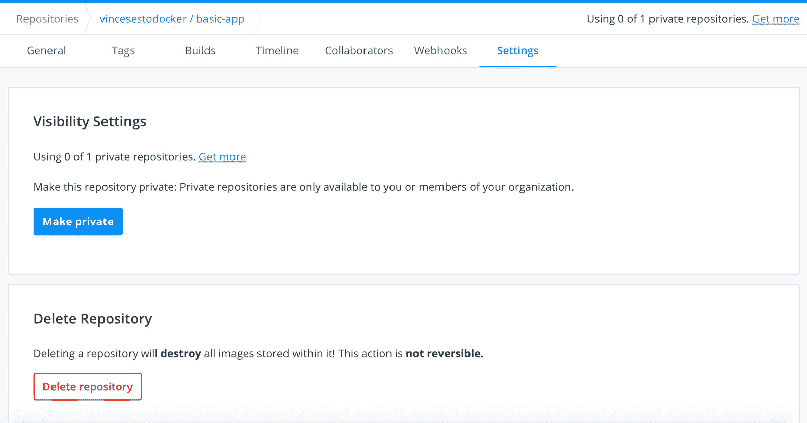

# 三、管理您的 Docker 映像

概观

在本章中，我们将研究 Docker 层，并分析缓存如何帮助加快映像构建。我们还将深入研究 Docker 映像，并建立 Docker 注册表来提高映像的可重用性。

在本章结束时，您将能够演示 Docker 如何使用图层来构建映像，以及如何通过缓存来加快映像构建。您将使用映像标签，并为 Docker 映像设置标签策略。本章将使您能够在项目中使用 Docker Hub，并区分公共和私有注册中心。它还将帮助您在处理项目时建立自己的 Docker 注册表。

# 简介

我们前面的章节已经用 Docker 映像做了很多工作。正如您所看到的，我们已经能够拍摄现有的映像，并在 Docker Hub 中提供给公众，然后能够运行它们，或者在为我们的目的构建它们之后重用它们。映像本身帮助我们简化流程，减少我们需要做的工作。

在本章中，我们将更深入地了解映像以及如何在您的系统上使用它们。我们将学习如何更好地组织和标记映像，了解映像的不同层是如何工作的，并建立公共和私有的注册表，以进一步重用我们创建的映像。

Docker 映像也非常适合应用开发。映像本身是应用的一个独立版本，包括运行所需的一切。这使开发人员能够在他们的本地机器上构建一个映像，并将其部署在开发或测试环境中，以确保它能与应用的其他部分很好地协同工作。如果一切顺利，他们可以将相同的映像作为发行版推送到生产环境中，供用户使用。我们在使用映像时也需要保持一致，尤其是当我们开始在更大的开发团队中工作时。

本章还将帮助您设置策略，使您的服务具有一致的标记，以帮助限制问题，并确保您可以在出现问题时进行跟踪或回滚。了解如何分发映像以供消费和协作也是我们将在本章中进一步讨论的内容。因此，不再拖延，让我们从这一章开始，了解 Docker 中有哪些层和缓存。

# Docker层和缓存

注册表是存储和分发 Docker 映像的一种方式。当您从注册表中提取 Docker 映像时，您可能已经注意到该映像是以碎片的形式提取的，而不是作为单个映像。当您在系统上构建映像时，也会发生同样的事情。

这是因为 Docker 映像由层组成。当你使用`Dockerfile`创建一个新的映像时，它会在你已经创建的现有映像上创建更多的层。您在`Dockerfile`中指定的每个命令将创建一个新层，每个层包含在执行命令之前和之后发生的所有文件系统更改。当您从`Dockerfile`中运行映像作为容器时，您正在现有的只读图层组之上创建可读和可写图层。这个可写层被称为**容器层**。

正如您将在以下练习中看到的，当您从`Dockerfile`构建容器时，呈现的输出显示了在`Dockerfile`中运行的每个命令。它还显示了通过运行每个命令创建的层，这些层由随机生成的标识表示。一旦映像完成构建，您就可以使用`docker history`命令查看构建过程中创建的图层，包括映像名称或 ID。

注意

设置构建环境时，当您在开发过程中继续前进时，请记住您拥有的层越多，您的映像就越大。因此，无论是构建时间还是开发和生产环境中使用的磁盘空间量，这些额外的存储和空间都非常昂贵。

从`Dockerfile`构建映像时，使用`RUN`、`ADD`和`COPY`命令创建图层。`Dockerfile`中的所有其他命令创建中间层。这些中间层大小为 0b；因此，它们不会增加 Docker 映像的大小。

构建 Docker 映像时，我们可以使用`docker history`命令和映像名称或 ID 来查看用于创建映像的图层。输出将提供用于生成图层的命令以及图层大小的详细信息:

```
docker history <image_name|image_id>
```

`docker image inspect`命令有助于提供更多关于映像图层位置的详细信息:

```
docker image inspect <image_id>
```

在本章的稍后部分，当我们考虑创建我们的基础映像时，我们将使用`docker image`命令，该命令与我们正在创建的映像的 TAR 文件版本结合使用。如果我们能够访问正在运行的容器或虚拟机，我们将能够获取正在运行的系统的副本，并将其放入 TAR 归档中。档案的输出然后通过管道输出到`docker import`命令，如下所示:

```
cat <image_tar_file_name> | docker import - <new_image_name>
```

下一个练习将让您亲身体验我们到目前为止所学的内容，以及如何使用 Docker 映像图层。

注意

请使用`touch`命令创建文件，使用`vim`命令使用 vim 编辑器处理文件。

## 练习 3.01:使用 Docker 映像图层

在本练习中，您将使用一些基本的`Dockerfiles`来查看 Docker 如何使用图层来构建映像。你将从创建一个`Dockerfile`和建立一个新的形象开始。然后，您将重建映像，以了解使用缓存的优势，以及使用缓存如何减少构建时间:

1.  用你喜欢的文本编辑器创建一个名为`Dockerfile`的新文件，并添加以下细节:

    ```
    FROM alpine
    RUN apk update
    RUN apk add wget
    ```

2.  Save the `Dockerfile` and then, from the command line, make sure you are in the same directory as the `Dockerfile` you have created. Use the `docker build` command to create the new image using the `–t` option to name it `basic-app`:

    ```
    docker build -t basic-app .
    ```

    如果映像构建成功，您应该会看到类似以下的输出。我们用粗体突出显示了每个构建步骤。每个步骤都被构建为一个中间层，如果成功完成，它将被转移到只读层:

    ```
    Sending build context to Docker daemon 4.096kB
    Step 1/3 : FROM alpine
    latest: Pulling from library/alpine
    9d48c3bd43c5: Pull complete 
    Digest: sha256:72c42ed48c3a2db31b7dafe17d275b634664a
            708d901ec9fd57b1529280f01fb
    Status: Downloaded newer image for alpine:latest
      ---> 961769676411
    Step 2/3 : RUN apk update
      ---> Running in 4bf85f0c3676
    fetch http://dl-cdn.alpinelinux.org/alpine/v3.10/main/
      x86_64/APKINDEX.tar.gz
    fetch http://dl-cdn.alpinelinux.org/alpine/v3.10/community/
      x86_64/APKINDEX.tar.gz
    v3.10.2-64-g631934be3a [http://dl-cdn.alpinelinux.org/alpine
      /v3.10/main]
    v3.10.2-65-ge877e766a2 [http://dl-cdn.alpinelinux.org/alpine
      /v3.10/community]
    OK: 10336 distinct packages available
    Removing intermediate container 4bf85f0c3676
      ---> bcecd2429ac0
    Step 3/3 : RUN apk add wget
      ---> Running in ce2a61d90f77
    (1/1) Installing wget (1.20.3-r0)
    Executing busybox-1.30.1-r2.trigger
    OK: 6 MiB in 15 packages
    Removing intermediate container ce2a61d90f77
      ---> a6d7e99283d9
    Successfully built 0e86ae52098d
    Successfully tagged basic-app:latest
    ```

3.  Use the `docker history` command along with the image name of `basic-app` to see the different layers of the image:

    ```
    docker history basic-app
    ```

    历史记录为您提供了创建细节，包括每个层的大小:

    ```
    IMAGE         CREATED            CREATED BY 
                          SIZE
    a6d7e99283d9  About a minute ago /bin/sh -c apk add wget
                          476kB
    bcecd2429ac0  About a minute ago /bin/sh -c apk update
                          1.4MB
    961769676411  5 weeks ago        /bin/sh -c #(nop)
    CMD ["/bin/sh"]       0B
    <missing>     5 weeks ago        /bin/sh -c #(nop) 
    ADD file:fe6407fb…    5.6MB
    ```

    注意

    `docker history`命令将原始映像中用作`Dockerfile` `FROM`命令一部分的图层显示为`<missing>`。它在我们的输出中显示为`missing`，因为它是在不同的系统上创建的，然后被拉进您的系统。

4.  Run the build again without making any changes:

    ```
    docker build -t basic-app .
    ```

    这将向您展示构建是使用存储在 Docker 映像缓存中的图层完成的，从而加快我们的构建。虽然这只是一个小映像，但大得多的映像会显示出显著的增加:

    ```
    Sending build context to Docker daemon  4.096kB
    Step 1/3 : FROM alpine
      ---> 961769676411
    Step 2/3 : RUN apk update
     ---> Using cache
      ---> bcecd2429ac0
    Step 3/3 : RUN apk add wget
     ---> Using cache
      ---> a6d7e99283d9
    Successfully built a6d7e99283d9
    Successfully tagged basic-app:latest
    ```

5.  假设您在创建映像时忘记安装`curl`包。从*第 1 步*

    ```
    FROM alpine
    RUN apk update
    RUN apk add wget curl
    ```

    开始，在`Dockerfile`中添加以下行
6.  Build the image again, and you'll now see the image created with a mix of cached layers and new layers that need to be created:

    ```
    docker build -t basic-app .
    ```

    输出的第三步突出显示了我们正在构建的`Dockerfile`中所做的更改:

    ```
    Sending build context to Docker daemon 4.096kB
    Step 1/3 : FROM alpine
      ---> 961769676411
    Step 2/3 : RUN apk update
      ---> Using cache
      ---> cb8098d0c33d
    Step 3/3 : RUN apk add wget curl
      ---> Running in b041735ff408
    (1/5) Installing ca-certificates (20190108-r0)
    (2/5) Installing nghttp2-libs (1.39.2-r0)
    (3/5) Installing libcurl (7.66.0-r0)
    (4/5) Installing curl (7.66.0-r0)
    (5/5) Installing wget (1.20.3-r0)
    Executing busybox-1.30.1-r2.trigger
    Executing ca-certificates-20190108-r0.trigger
    OK: 8 MiB in 19 packages
    Removing intermediate container b041735ff408
      ---> c7918f4f95b9
    Successfully built c7918f4f95b9
    Successfully tagged basic-app:latest
    ```

7.  Run the `docker images` command again:

    ```
    docker images
    ```

    现在，您将注意到名为`<none>`并标记为`<none>`的映像，以显示我们现在已经创建了一个悬空映像:

    ```
    REPOSITORY   TAG      IMAGE ID        CREATED           SIZE
    basic-app    latest   c7918f4f95b9    25 seconds ago    8.8MB
    <none>       <none>   0e86ae52098d    2 minutes ago     7.48MB
    Alpine       latest   961769676411    5 weeks ago       5.58MB
    ```

    注意

    悬空映像，在我们的映像列表中用`<none>`表示，是当一个图层与我们系统中的任何映像都没有关系时引起的。这些晃来晃去的映像不再有任何用途，并且会消耗系统上的磁盘空间。我们的示例悬空映像只有 7.48 MB，这很小，但随着时间的推移，这可能会增加。

8.  Run the `docker image inspect` command using the image ID to see the location of where the dangling images are located on our system:

    ```
    docker image inspect 0e86ae52098d
    ```

    以下输出已从实际输出缩减为仅显示映像的目录:

    ```
    ... 
      "Data": {
        "LowerDir": "/var/lib/docker/overlay2/
          41230f31bb6e89b6c3d619cafc309ff3d4ca169f9576fb003cd60fd4ff
          4c2f1f/diff:/var/lib/docker/overlay2/
          b8b90262d0a039db8d63c003d96347efcfcf57117081730b17585e163f
          04518a/diff",
        "MergedDir": "/var/lib/docker/overlay2/
          c7ea9cb56c5bf515a1b329ca9fcb2614f4b7f1caff30624e9f6a219049
          32f585/
          merged",
        "UpperDir": "/var/lib/docker/overlay2/
          c7ea9cb56c5bf515a1b329ca9fcb2614f4b7f1caff30624e9f6a21904
          932f585/diff",
        "WorkDir": "/var/lib/docker/overlay2/
          c7ea9cb56c5bf515a1b329ca9fcb2614f4b7f1caff30624e9f6a21904
          932f585/work"
      },
    ...
    ```

    我们所有的映像都位于与悬空映像相同的位置。由于它们共享同一个目录，任何悬挂的映像都会浪费我们系统的空间。

9.  Run the `du` command from the command line to see the total disk space being used by our images:

    ```
    du -sh /var/lib/docker/overlay2/
    ```

    该命令将返回映像使用的总磁盘空间

    ```
    11M    /var/lib/docker/overlay2/
    ```

    注意

    如果您正在使用 Docker Desktop，可能在 Mac 上，您会注意到，当 Docker 在您系统上的虚拟映像上运行时，您将无法看到映像，尽管`docker image inspect`命令将显示与我们上面相同的位置。

10.  Run the `docker images` command again using the `-a` option:

    ```
    docker images -a
    ```

    它还将显示构建映像时使用的中间层:

    ```
    REPOSITORY   TAG      IMAGE ID      CREATED          SIZE
    basic-app    latest   c7918f4f95b9  25 seconds ago   8.8MB
    <none>       <none>   0e86ae52098d  2 minutes ago    7.48MB
    <none>       <none>   112a4b041305  11 minutes ago   7MB
    Alpine       latest   961769676411  5 weeks ago      5.58MB
    ```

11.  Run the `docker image prune` command to remove all the dangling images. You could remove all the dangling images one at a time using the `docker rmi` command using the image ID, but the `docker image prune` command is an easier way to do that:

    ```
    docker image prune
    ```

    您应该得到如下输出:

    ```
    WARNING! This will remove all dangling images.
    Are you sure you want to continue? [y/N] y
    Deleted Images:
    deleted: sha256:0dae3460f751d16f41954e0672b0c41295d46ee99d71
             d63e7c0c8521bd9e6493
    deleted: sha256:d74fa92b37b74820ccccea601de61d45ccb3770255b9
             c7dd22edf16caabafc1c
    Total reclaimed space: 476.4kB
    ```

12.  Run the `docker images` command again:

    ```
    docker images
    ```

    您将看到我们的映像列表中不再有悬空映像:

    ```
    REPOSITORY   TAG      IMAGE ID        CREATED           SIZE
    basic-app    latest   c7918f4f95b9    25 seconds ago    8.8MB
    Alpine       latest   961769676411    5 weeks ago       5.58MB
    ```

13.  Run the `du` command again over the image's directory:

    ```
    du -sh /var/lib/docker/overlay2/
    ```

    您还应该观察到尺寸的小幅减小:

    ```
    10M    /var/lib/docker/overlay2/
    ```

本练习只显示了较小的映像大小，但这绝对是在运行生产和开发环境时需要记住的。本章的这一部分已经为您提供了 Docker 如何使用层和缓存作为其构建过程的一部分的基础。

在我们的下一个练习中，我们将进一步研究我们的图层和缓存，看看如何使用它们来加快映像构建过程。

## 练习 3.02:提高构建速度和减少层数

到目前为止，您一直在使用较小的版本。然而，随着您的应用在大小和功能上的增加，您将开始考虑您正在创建的 Docker 映像的大小和层数以及您创建它们的速度。本练习的目标是加快构建时间并减小映像的大小，以及在构建 Docker 映像时使用`--cache-from`选项:

1.  Create a new `Dockerfile` to demonstrate the change you are going to make, but first, clear up all the images on your system. Run the `docker rmi` command with the `-f` option to force any removals needed, and the command in brackets will provide a list of all image IDs on your system. Use the `-a` option to show all running and stopped containers and the `-q` option to only show the container image hash value and nothing else:

    ```
    docker rmi -f $(docker images -a -q)
    ```

    该命令应该返回如下输出:

    ```
    Untagged: hello-world:latest
    ...
    deleted: sha256:d74fa92b37b74820ccccea601de61d45ccb3770255
             b9c7dd22edf16caabafc1c
    ```

    可以观察到`hello-world: latest`映像未被标记，ID 为`sha256:d74fa92b37b74820ccccea601 de61d45ccb3770255b9c7dd22edf16caabafc1c`的映像被移除。

    注意

    请注意，我们可以使用`rmi`和`prune`命令删除映像。这里，我们使用了`rmi`命令，因为`prune`直到最近才一直可用。

2.  Add the following code to your `Dockerfile` (which you created in *Exercise 3.01*). It will simulate a simple web server, as well as print the output of our `Dockerfile` during the build process:

    ```
    1 FROM alpine
    2 
    3 RUN apk update
    4 RUN apk add wget curl
    5
    6 RUN wget -O test.txt https://github.com/PacktWorkshops/   The-Docker-Workshop/blob/master/Chapter03/Exercise3.02/100MB.bin
    7
    8 CMD mkdir /var/www/
    9 CMD mkdir /var/www/html/
    10
    11 WORKDIR /var/www/html/
    12
    13 COPY Dockerfile.tar.gz /tmp/
    14 RUN tar -zxvf /tmp/Dockerfile.tar.gz -C /var/www/html/
    15 RUN rm /tmp/Dockerfile.tar.gz
    16
    17 RUN cat Dockerfile
    ```

    你会注意到`Dockerfile`的*第 6 行*正在做一个相当卑微的任务(下载一个 100 MB 的文件，名为`100MB.bin`，这通常不会在`Dockerfile`中执行。我们已经将它添加到中，以表示构建任务或可能在构建过程中添加的类似内容，例如，从文件下载内容或构建软件。

3.  使用`docker pull`命令下载你的基本映像，这样你就可以从我们做的每个测试的相同映像开始:

    ```
    docker pull alpine
    ```

4.  按照我们在`Dockerfile` :

    ```
    tar zcvf Dockerfile.tar.gz Dockerfile
    ```

    的*第 13 行*中的指示，创建一个要添加到我们的映像中的 TAR 文件
5.  Build a new image using the same name as `basic-app.` You will use the `time` command at the start of the code to allow us to gauge the time it takes to build our image:

    ```
    time docker build -t basic-app .
    ```

    输出将返回构建映像所需的时间:

    ```
    ...
    real 4m36.810s
    user 0m0.354s
    sys 0m0.286s
    ```

6.  Run the `docker history` command over the new `basic-app` image:

    ```
    docker history basic-app
    ```

    与之前的练习相比，我们的`Dockerfile`中有一些额外的命令。因此，在我们的新映像中看到 12 层应该不足为奇:

    ```
    IMAGE         CREATED      CREATED BY                           SIZE
    5b2e3b253899 2 minutes ago /bin/sh -c cat Dockerfile            0B
    c4895671a177 2 minutes ago /bin/sh -c rm /tmp/Dockerfile.tar.gz 0B
    aaf18a11ba25 2 minutes ago /bin/sh -c tar -zxvf /tmp/Dockfil…   283B
    507161de132c 2 minutes ago /bin/sh -c #(nop) COPY file:e39f2a0… 283B
    856689ad2bb6 2 minutes ago /bin/sh -c #(nop) WORKDIR /var/…     0B
    206675d145d4 2 minutes ago /bin/sh -c #(nop)  CMD ["/bin/sh"…   0B
    c947946a36b2 2 minutes ago /bin/sh -c #(nop)  CMD ["/bin/sh"…   0B
    32b0abdaa0a9 2 minutes ago /bin/sh -c curl https://github.com…  105MB
    e261358addb2 2 minutes ago /bin/sh -c apk add wget curl         1.8MB
    b6f77a768f90 2 minutes ago /bin/sh -c apk update                1.4MB
    961769676411 6 weeks ago   /bin/sh -c #(nop)  CMD ["/bin/sh"]   0B
    <missing>    6 weeks ago   /bin/sh -c #(nop) ADD file:fe3dc…    5.6MB
    ```

    我们可以看到`Dockerfile`中的`RUN`、`COPY`和`ADD`命令正在创建与正在运行的命令或正在添加的文件相关的特定大小的图层，而`Dockerfile`中的所有其他命令的大小都是 0 B

7.  Reduce the number of layers in the image by combining the `RUN` commands in *lines 3 and 4* and combining the `CMD` commands in *lines 8 and 9* of the `Dockerfile` created in *step 1* of this exercise. With these changes, our `Dockerfile` should now look like the following:

    ```
    1 FROM alpine
    2 
    3 RUN apk update && apk add wget curl
    4 
    5 RUN wget -O test.txt https://github.com/PacktWorkshops/    The-Docker-Workshop/blob/master/Chapter03/Exercise3.02/100MB.bin
    6 
    7 CMD mkdir -p /var/www/html/
    8 
    9 WORKDIR /var/www/html/
    10 
    11 COPY Dockerfile.tar.gz /tmp/
    12 RUN tar -zxvf /tmp/Dockerfile.tar.gz -C /var/www/html/
    13 RUN rm /tmp/Dockerfile.tar.gz
    14 
    15 RUN cat Dockerfile
    ```

    再次运行`docker build`会将我们新映像的层数从 12 层减少到 9 层，因为即使有相同数量的命令正在运行，它们也会在*第 3 行*和*第 7 行*中链接在一起。

8.  我们的`Dockerfile`的*第 11 行*、*第 12 行*、*第 13 行*正在使用`COPY`和`RUN`命令对我们的存档文件`copy`和`unzip`进行操作，然后删除原来解压后的文件。用`ADD`命令替换这些行，而不需要运行解压和删除`.tar`文件的行:

    ```
    1 FROM alpine
    2 
    3 RUN apk update && apk add wget curl
    4
    5 RUN wget -O test.txt https://github.com/PacktWorkshops/    The-Docker-Workshop/blob/master/Chapter03/Exercise3.02/100MB.bin
    6 
    7 CMD mkdir -p /var/www/html/
    8 
    9 WORKDIR /var/www/html/
    10 
    11 ADD Dockerfile.tar.gz /var/www/html/
    12 RUN cat Dockerfile
    ```

9.  再次构建映像，将新映像的层数从 9 层减少到 8 层。如果您一直在观看构建运行，您可能会注意到构建运行的很多时间是我们的`Dockerfile`的*第 3 行*和*第 5 行*的一部分，在这里我们运行`apk update`，然后安装`wget`和`curl`，然后从网站抓取内容。这样做一两次不成问题，但是如果我们创建我们的基础形象，然后`Dockerfile`可以运行，你将能够从你的`Dockerfile`完全删除这些线。
10.  移动到一个新的目录，创建一个新的`Dockerfile`，它将只拉基础映像并运行`apk`命令，如下所列:

    ```
    1 FROM alpine
    2
    3 RUN apk update && apk add wget curl
    4
    5 RUN wget -O test.txt https://github.com/PacktWorkshops/    The-Docker-Workshop/blob/master/Chapter03/Exercise3.02/100MB.bin
    ```

11.  根据前面的`Dockerfile`构建新的基础映像，并将其命名为`basic-base` :

    ```
    docker build -t basic-base .
    ```

12.  从原来的`Dockerfile`中移除*线 3* ，因为不再需要它。进入项目目录，将`FROM`命令中正在使用的映像更新为`basic-base`，并删除*第 3 行*中的`apk`命令。我们的`Dockerfile`现在应该看起来像下面的代码:

    ```
    1 FROM basic-base
    2
    3 CMD mkdir -p /var/www/html/
    4
    5 WORKDIR /var/www/html/
    6
    7 ADD Dockerfile.tar.gz /var/www/html/
    8 RUN cat Dockerfile
    ```

13.  Run the build again for our new `Dockerfile`. Using the `time` command again with our build, we now see the build complete in just over 1 second:

    ```
    time docker build -t basic-app .
    ```

    如果您一直在关注构建，您会注意到与我们之前的构建相比，它运行得更快:

    ```
    ...
    real 0m1.810s
    user 0m0.117s
    sys  0m0.070s
    ```

    注意

    您将观察到映像的图层将保持不变，因为我们正在执行`apk`命令的系统上构建基础映像。这是一个很好的结果，即使我们没有减少层数，仍然可以加快构建速度。

14.  There is a different way we can use the `basic-base` image we used earlier. Use the `docker build` command with the `–cache-from` option to specify the cache layers that will be used when the image is built. Set out the `FROM` command to still use the `alpine` image and use the `–cache-from` option that follows to make sure the layers used to build `basic-base` are being used for our current image:

    ```
    docker build --cache-from basic-base -t basic-app .
    ```

    在完成本练习之前，我们还有一些任务。在下面的步骤中，我们将查看提交对映像的更改，以了解它如何影响我们的图层。这不是我们经常使用的东西，但有时我们需要将生产数据复制到开发或测试环境中，一种方法是使用带有`commit`命令的 Docker 映像，这将对我们运行的容器的顶部可写层进行更改。

15.  在交互 shell 模式下运行`basic-app`创建一些生产数据。为此，使用`-it`选项运行以下`docker run`命令，以交互模式运行，并使用`sh`外壳访问运行容器:

    ```
    docker run -it basic-app sh
    /var/www/html #
    ```

16.  使用 vi 文本编辑器创建一个名为`prod_test_data.txt` :

    ```
    vi prod_test_data.txt
    ```

    的新文本文件
17.  添加下面一行文本作为一些测试数据。文本中的数据并不重要；这只是一个示例，说明我们可以将这些更改复制到另一个映像中:
18.  This is a sample production piece of data. Exit out of the running container and then check the container ID using the `docker ps` command with the `-a` option:

    ```
    docker ps -a
    ```

    您将获得如下输出:

    ```
    CONTAINER ID    IMAGE        COMMAND    CREATED
    ede3d51bba9e    basic-app    "sh"       4 minutes ago
    ```

19.  Run the `docker commit` command with the container ID to create a new image that will include all those changes. Make sure to add the name of the new image. In this example, use `basic-app-test`:

    ```
    docker commit ede3d51bba9e basic-app-test
    ```

    您将获得如下输出:

    ```
    sha256:0717c29d29f877a7dafd6cb0555ff6131179b457
           e8b8c25d9d13c2a08aa1e3f4
    ```

20.  Run the `docker history` command on the newly created image:

    ```
    docker history basic-app-test
    ```

    现在，这应该向我们显示了一个额外的层，我们在其中添加了示例生产数据，在我们的输出中显示为 72B 的大小:

    ```
    IMAGE        CREATED       CREATED BY                         SIZE
    0717c29d29f8 2 minutes ago sh                                 72B
    302e01f9ba6a 2 minutes ago /bin/sh -c cat Dockerfile          0B
    10b405ceda34 2 minutes ago /bin/sh -c #(nop) ADD file:e39f…   283B
    397f533f4019 2 minutes ago /bin/sh -c #(nop) WORKDIR /var/…   0B
    c8782986b276 2 minutes ago /bin/sh -c #(nop)  CMD ["/bin/sh"… 0B
    6dee05f36f95 2 minutes ago /bin/sh -c apk update && apk ad    3.2MB
    961769676411 6 weeks ago   /bin/sh -c #(nop)  CMD ["/bin/sh"] 0B
    <missing>    6 weeks ago   /bin/sh -c #(nop) ADD file:fe3dc…  5.6MB
    ```

21.  Now, run the newly created `basic-app-test` image and `cat`, the new file we added:

    ```
    docker run basic-app-test cat prod_test_data.txt
    ```

    这将向我们显示我们添加的输出，显示我们可以在需要时重用现有映像:

    ```
    This is a sample production piece of data
    ```

    注意

    截至撰写本文时，`docker build`命令还允许使用`–squash`选项创建新的实验特征。该选项试图在构建期间将所有图层合并为一个图层。我们还没有讨论这个特性，因为它还处于实验阶段。

本练习演示了构建缓存和映像层如何改善构建时间。到目前为止，我们已经使用从 Docker Hub 中提取的映像开始了所有的构建，但是如果您希望进一步控制事情，也可以选择从您自己创建的映像开始。下一节将帮助您创建您的基本 Docker 映像。

# 创建基本Docker映像

创建您的基本 Docker 映像实际上很简单。正如我们之前使用`docker commit`命令从运行的容器中创建映像一样，我们也可以从最初运行应用的系统或服务器中创建映像。我们需要记住，创建基础映像仍然需要保持小而轻。这不仅仅是将运行在现有服务器上的现有应用转移到 Docker 的问题。

我们可以使用我们专门开发的系统，但是如果您使用的是生产服务器，映像实际上可能会非常大。如果您有一台小型虚拟机，并且您认为它非常适合基本映像，您可以使用以下步骤来创建基本映像。类似于`docker commit`命令，这可以用于任何你可以访问的系统。

## 练习 3.03:创建您的基本 Docker 映像

以下练习将使用我们当前运行的`basic-app`映像，并展示创建基础映像有多容易。这些相同的步骤也将用于更大、更复杂的环境:

1.  执行`docker run`命令运行容器，同时登录:

    ```
    docker run -it basic-app sh
    ```

2.  在运行的容器上运行`tar`命令，创建系统的备份。要限制新映像中的信息，请排除`.proc`、`.tmp`、`.mnt`、`.dev`和`.sys`目录，并在`basebackup.tar.gz`文件下创建所有内容:

    ```
    tar -czf basebackup.tar.gz --exclude=backup.tar.gz --exclude=proc --exclude=tmp --exclude=mnt --exclude=dev --exclude=sys /
    ```

3.  To ensure that you have data in your `basebackup.tar.gz` file, run the `du` command to make sure it is of substantial size:

    ```
    du -sh basebackup.tar.gz 
    ```

    输出返回`basebackup.tar.gz`文件的大小:

    ```
    4.8M	basebackup.tar.gz
    ```

4.  Run the `docker ps` command to find the container ID that is currently holding your new backup file, the `.tar` file:

    ```
    docker ps
    ```

    该命令将返回映像的容器标识:

    ```
    CONTAINER ID        IMAGE        COMMAND      CREATED
    6da7a8c1371a        basic-app    "sh"         About a minute ago
    ```

5.  使用我们正在运行的容器的容器标识以及您想要复制的位置和文件，使用`docker cp`命令将`.tar`文件复制到您的开发系统上。以下命令将使用您的容器 ID 执行此操作，并将其移动到您的`/tmp`目录中:

    ```
    docker cp 6da7a8c1371a:/var/www/html/basebackup.tar.gz /tmp/
    ```

6.  使用`docker import`命令创建新映像。只需将`basebackup.tar.gz`文件的输出导入`docker import`命令，在此过程中命名新映像。在我们的例子中，称之为`mynew-base` :

    ```
    cat /tmp/basebackup.tar.gz | docker import - mynew-base
    ```

7.  Use the `docker images` command with the name of your new image to verify that it has been created in the previous step:

    ```
    docker images mynew-base
    ```

    您应该得到如下输出:

    ```
    REPOSITORY    TAG     IMAGE ID      CREATED         SIZE
    mynew-base    latest  487e14fca064  11 seconds ago  8.79MB
    ```

8.  Run the `docker history` command:

    ```
    docker history mynew-base
    ```

    您将看到我们的新映像只有一层:

    ```
    IMAGE         CREATED         CREATED BY   SIZE   COMMENT
    487e14fca064  37 seconds ago               .79MB  Imported from –
    ```

9.  To test your new image, run the `docker run` command on the new image, and list the files in your `/var/www/html/` directory:

    ```
    docker run mynew-base ls -l /var/www/html/
    ```

    该命令应该返回类似的输出:

    ```
    total 4
    -rw-r--r--    1 501      dialout      283 Oct  3 04:07 Dockerfile
    ```

    可以看到映像已经创建成功，`/var/www/html/`目录下有 24 个文件。

本练习已经向您展示了如何从运行的系统或环境创建基础映像，但是如果您想要创建一个小的基础映像，那么下一部分将向您展示如何使用 **scratch** 映像。

## 划痕映像

暂存映像是 Docker 创建的映像，专门用于构建最小映像。如果您有一个用 Java、C++等编写并编译的二进制应用，可以在没有任何支持应用的情况下自行运行，那么 scratch 将帮助您使用您可以创建的最小映像之一运行该映像。

当我们在我们的`Dockerfile`中使用`FROM scratch`命令时，我们指定我们将使用 Docker 的保留最小映像，它被命名为`scratch`来构建我们的新容器映像。

## 练习 3.04:使用抓图

在本练习中，您将创建一个小的 C 应用在映像上运行。要完成这个练习，你不需要真正了解 C 语言。该应用将安装在您的基本映像上，以确保映像尽可能小。您创建的应用将向您展示如何创建最少的可用基础映像之一:

1.  Pull the scratch image using the `docker pull` command:

    ```
    docker pull scratch
    ```

    您会注意到您将无法提取映像，并将收到一条错误消息:

    ```
    Using default tag: latest
    Error response from daemon: 'scratch' is a reserved name
    ```

2.  创建一个 C 程序，您将构建到我们的`Dockerfile`中使用的映像中。创建名为`test.c` :

    ```
    touch test.c
    ```

    的程序文件
3.  打开文件，加入下面的代码，在控制台上简单的从 1 数到 10:

    ```
    #include <stdio.h>
    int main()
    {
        int i;
        for (i=1; i<=10; i++)
        {
            printf("%d\n", i);
        }
        return 0;
    }
    ```

4.  Build the image from the command line by running the following command to build the C program:

    ```
    g++ -o test -static test.c
    ```

    注意

    如果您想在映像中构建它之前测试它，您可以通过在命令行上运行`./test`来完成。

5.  创建`Dockerfile`。`Dockerfile`将非常少，但需要从`FROM scratch`开始。文件的其余部分会将 C 程序添加到您的映像中，然后在*第 4 行* :

    ```
    1 FROM scratch
    2
    3 ADD test /
    4 CMD ["/test"]
    ```

    中运行它
6.  建立新形象。在这种情况下，使用以下命令调用映像【T0:

    ```
    docker build -t scratchtest .
    ```

7.  Run the image from the command line:

    ```
    docker run scratchtest
    ```

    您将看到在本练习前面创建和编译的测试 C 文件的输出:

    ```
    1
    2
    3
    4
    5
    6
    7
    8
    9
    10
    ```

8.  Run the `docker images` command for your new image:

    ```
    docker images scratchtest
    ```

    这将向您展示一些令人印象深刻的结果，因为您的映像大小仅为`913 kB`:

    ```
    REPOSITORY   TAG     IMAGE ID         CREATED          SIZE
    scratch      latest  221adbe23c26     20 minutes ago   913kB
    ```

9.  View the layers of the image using the `docker history` command:

    ```
    docker history scratchtest
    ```

    您将看到一个类似于下面的输出，它只有两层，从零开始的原始层和我们`ADD`测试 C 程序的层:

    ```
    IMAGE        CREATED        CREATED BY                        SIZE
    221adbe23c26 23 minutes ago /bin/sh -c #(nop)  CMD ["/test"]  0B
    09b61a3a1043 23 minutes ago /bin/sh -c #(nop) ADD file:80933… 913kB
    ```

我们在本练习中创建的草稿映像在一定程度上有助于创建一个既实用又最小的映像，并且还表明，如果您稍微考虑一下您想要实现的目标，就可以很容易地加快构建速度并缩小映像的大小。

我们现在将从构建映像的工作中休息一下，仔细看看如何命名和标记我们的 Docker 映像。

# Docker映像命名和标记

我们已经谈到了标签，但是随着我们与 Docker 映像的合作越来越密切，现在可能是更深入地研究映像标签的好时机。简单来说，标签是 Docker 映像上的标签，应该为映像的用户提供一些关于他们正在使用的映像或映像版本的有用信息。

到目前为止，我们一直像单独开发人员一样处理我们的映像，但是当我们开始与更大的开发团队合作时，需要更仔细地考虑我们将如何命名和标记我们的映像。这一章的下一部分将添加到您之前的工作中，并允许您开始为您的项目和工作制定命名和标记策略。

命名和标记 Docker 映像有两种主要方法。您可以使用`docker tag`命令，或者当您从`Dockerfile`构建映像时，您可以使用`-t`选项。要使用`docker tag`命令，请指定要用作基础的源存储库名称以及要创建的目标名称和标签:

```
docker tag <source_repository_name>:<tag> <target_repository_name>:tag
```

当您使用`docker build`命令命名您的映像时，使用的`Dockerfile`将创建您的源，然后使用`-t`选项命名和标记您的映像，如下所示:

```
docker build -t <target_repository_name>:tag Dockerfile
```

存储库名称有时可以以主机名作为前缀，但这是可选的，将用于让 Docker 知道存储库的位置。我们将在本章稍后创建自己的 Docker 注册表时演示这一点。如果要将映像推送到 Docker Hub，还需要在存储库名称前加上 Docker Hub 用户名，如下所示:

```
docker build -t <dockerhub_user>/<target_repository_name>:tag Dockerfile
```

仅在本地映像注册表中支持在映像名称中使用两个以上的前缀，并且通常不使用。下一个练习将指导您完成标记 Docker 映像的过程。

## 练习 3.05:标记Docker映像

在下面的练习中，您将使用不同的映像，使用轻量级`busybox`映像来演示标记过程，并开始在项目中实现标记。BusyBox 用于将许多常见 UNIX 实用程序的小版本组合成一个小的可执行文件:

1.  运行`docker rmi`命令，清除系统中当前存在的映像，这样就不会与周围的大量映像混淆:

    ```
    docker rmi -f $(docker images -a -q)
    ```

2.  在命令行上，运行`docker pull`命令下载最新的`busybox`容器:

    ```
    docker pull busybox
    ```

3.  Run the `docker images` command:

    ```
    docker images
    ```

    这将为我们提供开始组合一些标记命令所需的信息:

    ```
    REPOSITORY    TAG       IMAGE ID        CREATED      SIZE
    Busybox       latest    19485c79a9bb    2 weeks ago  1.22MB
    ```

4.  使用`tag`命令命名并标记映像。您可以使用映像标识或存储库名称来标记映像。首先使用映像标识，但请注意，在您的系统上，您将有一个不同的映像标识。命名仓库`new_busybox`并包含标签`ver_1` :

    ```
    docker tag 19485c79a9bb new_busybox:ver_1
    ```

5.  Use the repository name and image tag. Create a new repository using your name and tag with a new version of `ver_1.1` as follows:

    ```
    docker tag new_busybox:ver_1 vince/busybox:ver_1.1
    ```

    注意

    我们在这个例子中使用了作者的名字(`vince`)。

6.  Run the `docker images` command:

    ```
    docker images
    ```

    您应该会看到与下面类似的输出。当然，您的映像标识会有所不同，但是存储库名称和标签应该相似:

    ```
    REPOSITORY     TAG      ID             CREATED        SIZE
    Busybox        latest   19485c79a9bb   2 weeks ago    1.22MB
    new_busybox    ver_1    19485c79a9bb   2 weeks ago    1.22MB
    vince/busybox  ver_1.1  19485c79a9bb   2 weeks ago    1.22MB
    ```

7.  使用`docker build`命令的`Dockerfile`和`-t`选项来命名和标记映像，创建一个基本映像。在本章中，您已经这样做了几次，因此从命令行运行以下命令，使用您之前命名的`new_busybox`映像创建一个基本的`Dockerfile`。也包括映像名称的标签，因为 Docker 将尝试使用`latest`标签，并且，由于这不存在，它将失败:

    ```
    echo "FROM new_busybox:ver_1" > Dockerfile
    ```

8.  运行`docker build`命令创建映像，同时命名和标记映像:

    ```
    docker build -t built_image:ver_1.1.1 .
    ```

9.  Run the `docker images` command:

    ```
    docker images
    ```

    现在，您的系统上应该有四个可用的映像。所有容器都具有相同的容器标识，但存储库名称和标记版本不同:

    ```
    REPOSITORY     TAG        ID            CREATED      SIZE
    built_image    ver_1.1.1  19485c79a9bb  2 weeks ago  1.22MB
    Busybox        latest     19485c79a9bb  2 weeks ago  1.22MB
    new_busybox    ver_1      19485c79a9bb  2 weeks ago  1.22MB
    vince/busybox  ver_1.1    19485c79a9bb  2 weeks ago  1.22MB
    ```

用与您的组织或团队相关的正确版本标记映像不会花费太多时间，尤其是稍加练习。本章的这一部分向您展示了如何标记您的映像，以便它们不再用`latest`的默认标记进行标记。在下一节中，您将看到使用`latest`标签并希望它能够正常工作实际上会给您带来一些额外的问题。

# 在 Docker 中使用最新的标签

由于我们一直在使用我们的标签，我们已经几次提到不要使用`latest`标签，它是由 Docker 作为默认标签提供的。正如您将很快看到的，使用`latest`标签可能会导致很多问题，尤其是在将映像部署到生产环境中的情况下。

我们首先需要意识到的是`latest`只是一个标签，就像我们在前面的例子中使用`ver_1`一样。这肯定也不意味着我们代码的最新版本。这仅仅意味着我们的映像的最新构建，它不包括标签。

使用`latest`还会在大型团队中引起很多问题，一天多次部署到环境中。这也意味着你将没有历史，这使得回滚糟糕的更改变得困难。因此，请记住，每次您构建或拉取映像时，如果您没有指定标签，Docker 将使用`latest`标签，并且不会做任何事情来确保映像是最新版本。在下一个练习中，我们将检查使用`latest`标签时会导致哪些问题。

## 练习 3.06:使用最新版本时的问题

您可能还不熟悉使用 Docker 和标签，因此您可能还没有遇到过使用`latest`标签的问题。本练习将为您提供一些清晰的想法，说明使用`latest`标签会给您的开发过程带来什么问题，并为您提供为什么应该避免它的原因。在前面的练习中，您使用`new_busybox:ver_1`映像创建了一个简单的`Dockerfile`。在本练习中，您将进一步扩展该文件:

1.  打开`Dockerfile`将文件修改为现在的样子，如下文件。这是一个简单的脚本，它将用简单的代码创建`version.sh`脚本，以输出我们服务的最新版本。新文件将被称为`Dockerfile_ver1`。

    ```
    1 FROM new_busybox:ver_1
    2
    3 RUN echo "#!/bin/sh\n" > /version.sh
    4 RUN echo "echo \"This is Version 1 of our service\""   >> /version.sh
    5
    6 ENTRYPOINT ["sh", "/version.sh"]
    ```

2.  Build the image and name it with your name and show the image is just a test:

    ```
    docker build -t vince/test .
    ```

    注意

    我们这里用了`vince`作为名字，但是你可以用任何想要的名字。

3.  Run the image using the `docker run` command:

    ```
    docker run vince/test
    ```

    您现在应该看到`versions.sh`脚本的输出:

    ```
    This is Version 1 of our service
    ```

4.  使用`docker tag`命令将此映像标记为`version1` :

    ```
    docker tag vince/test vince/test:version1
    ```

5.  打开`Dockerfile`，对*4 号线*进行如下变更:

    ```
    1 FROM new_busybox:ver_1
    2
    3 RUN echo "#!/bin/sh\n" > /version.sh
    4 RUN echo "echo \"This is Version 2 of our service\""   >> /version.sh
    5
    6 ENTRYPOINT ["sh", "/version.sh"]
    ```

6.  构建您的修正版`Dockerfile`并用`version2` :

    ```
    docker build -t vince/test:version2 .
    ```

    标记
7.  Run the amended image using the `docker run` command:

    ```
    docker run vince/test
    ```

    您还应该看到最新的代码更改:

    ```
    This is Version 1 of our service
    ```

    这不是我们要找的版本，是吗？不使用正确的标签，Docker 将运行用`latest`标记的映像的最新版本。该映像是在*步骤 3* 中创建的。

8.  Now, run both images with the `latest` and `version2` tags:

    ```
    docker run vince/test:latest
    This is Version 1 of our service
    ```

    我们现在可以看到输出的差异:

    ```
    docker run vince/test:version2
    This is Version 2 of our service
    ```

    正如您可能已经想到的，您需要指定`version2`标签来运行代码的修改版本。您可能已经预见到了这一点，但是请记住，如果有多个开发人员将映像推送到一个共享注册表中，这将使跟踪变得更加困难。如果您的团队使用编排并使用`latest`版本，您可能会在整个生产环境中运行混合版本的服务。

这些练习给了你如何使用标签的例子，并向你展示了如果你决定只使用`latest`标签会有什么后果。下一节将介绍标记策略以及如何实现自动化流程。

# Docker映像标记策略

随着开发团队规模的扩大和他们所从事的项目复杂性的增加，一个标准化的标记策略对您的团队来说变得更加重要。如果您的团队没有得到正确的标记，正如我们在前面的部分中所展示的，这可能会导致很多混乱，实际上还会导致更多的问题。尽早决定标记策略是一个好习惯，以确保您不会遇到任何这些问题。

在本章的这一节中，我们将介绍您可以在团队中使用的一些不同的标记策略，并提供一些如何实现这些策略的示例。在设置您的标记策略时，很少有任何正确或错误的答案，但是有必要尽早做出决定，并确保团队中的每个人都同意。

**语义版本化**是一个版本化系统，也可以作为您的标记策略的一部分。如果你不熟悉语义版本化，它是一个可信的版本系统，使用`major_version.minor_version.patch`格式的三分量编号。例如，如果您将应用的语义版本视为 2.1.0，它会将版本 2 显示为主要版本，将版本 1 显示为次要版本，将版本 0 显示为没有修补程序。语义版本控制很容易自动化，尤其是在自动化构建环境中。另一个选择是使用一个哈希值，就像你的代码的`git commit`哈希值一样。这意味着您可以将标签匹配回您的存储库，这样任何人都可以具体地看到自代码实现以来所做的代码更改。您还可以使用日期值，这也可以很容易地自动化。

这里的共同主题是，我们的标记策略应该是自动化的，以确保它被使用、理解和遵守。在下面的练习中，我们将使用哈希值作为标记策略的一部分，然后我们将创建一个脚本来构建我们的 Docker 映像，并将语义版本添加到我们的标记中。

## 练习 3.07:映像标记自动化

在本练习中，您将看到自动标记映像，以限制标记 Docker 映像所需的个人干预量。本练习再次使用`basic-base`映像:

1.  通过创建以下`Dockerfile` :

    ```
    1 FROM alpine
    2
    3 RUN apk update && apk add wget curl
    ```

    再次创建`basic-base`映像
2.  根据前面的`Dockerfile`构建新的基础映像，并将其命名为`basic-base` :

    ```
    docker build -t basic-base .
    ```

3.  创建`basic-base`映像后，设置名为`Dockerfile_ver1`的`Dockerfile`再次构建`basic-app`。在这种情况下，返回到这里列出的先前的`Dockerfile`:

    ```
    1 FROM basic-base
    2
    3 CMD mkdir -p /var/www/html/
    4
    5 WORKDIR /var/www/html/
    6
    7 ADD Dockerfile.tar.gz /var/www/html/
    8 RUN cat Dockerfile
    ```

4.  If you've been using Git to track and commit the changes in your code, you can tag your images with the commit hash from Git using the `git log` command. So, build your new image, as you normally would, with the `docker build` command, but in this instance, add the tag to provide the short commit hash from `git`:

    ```
    docker build -t basic-app:$(git log -1 --format=%h) .
    ...
    Successfully tagged basic-app:503a2eb
    ```

    注意

    如果您是使用 Git 的新手，它是一个源代码控制应用，允许您跟踪您的更改，并与其他用户在不同的编码项目上进行协作。如果您以前从未使用过 Git，以下命令将初始化您的存储库，将`Dockerfile`添加到存储库中，并提交这些更改，因此我们有一个 Git 日志:

    `git init; git add Dockerfile; git commit –m "initial commit"`

5.  在构建映像时，使用`Dockerfile`添加参数。打开您一直用于您的`basic-app`的`Dockerfile`并添加以下两行以将变量设置为未知，然后使用`git-commit`构建参数将`LABEL`设置为构建时提供的值。您的`Dockerfile`现在应该如下所示:

    ```
    1 FROM basic-base
    2
    3 ARG GIT_COMMIT=unknown
    4 LABEL git-commit=$GIT_COMMIT
    5
    6 CMD mkdir -p /var/www/html/
    7
    8 WORKDIR /var/www/html/
    9
    10 ADD Dockerfile.tar.gz /var/www/html/
    11 RUN cat Dockerfile
    ```

6.  使用带有`GIT_COMMIT`参数的`--build-arg`选项再次构建映像，该参数现在等于您的`git commit`哈希值:

    ```
    docker build -t basic-app --build-arg GIT_COMMIT=$(git log -1 --format=%h) .
    ```

7.  Run the `docker inspect` command searching for the `"git-commit"` label:

    ```
    docker inspect -f '{{index .ContainerConfig.Labels "git-commit"}}' basic-app
    ```

    您可以看到在构建时添加的 Git 哈希标签:

    ```
    503a2eb
    ```

    这开始朝着你需要的方向发展，但是如果你的团队已经决定这是你开发的最佳选择，你需要使用语义版本控制呢？本练习的其余部分将设置一个构建脚本来构建标签并将标签设置为语义版本号。

8.  在你的`Dockerfile`旁边，创建一个简单命名为`VERSION`的版本文件。为这个版本的`basic-app`设置新版本为`1.0.0`:

    ```
    echo "1.0.0" > VERSION
    ```

9.  对`Dockerfile`进行更改，删除之前添加的`GIT_COMMIT`细节，并将`VERSION`文件添加为构建的一部分。将它添加到映像本身意味着，如果用户需要验证映像版本号:

    ```
    1 FROM basic-base
    2
    3 CMD mkdir -p /var/www/html/
    4
    5 WORKDIR /var/www/html/
    6
    7 ADD VERSION /var/www/html/
    8 ADD Dockerfile.tar.gz /var/www/html/
    9 RUN cat Dockerfile
    ```

    ，他们可以随时参考`VERSION`文件
10.  创建一个构建脚本来构建和标记您的映像。调用此`build.sh`，它将驻留在与您的`Dockerfile`和`VERSION`文件相同的目录中:

    ```
    touch build.sh
    ```

11.  在`build.sh`增加以下细节。*第 3 行*将是您的 Docker Hub 用户名，*第 4 行*是您正在构建的映像或服务的名称(在以下示例中为`basic-app`)。然后，脚本从你的`VERSION`文件中抓取版本号，并把你所有的变量放在一起，用一个与你的新语义版本相关的漂亮名字和标签来构建你的映像:

    ```
    1 set -ex
    2
    3 USER=<your_user_name>
    4 SERVICENAME=basic-app
    5
    6 version=`cat VERSION`
    7 echo "version: $version"
    8
    9 docker build -t $USER/$SERVICENAME:$version .
    ```

12.  确保使用命令行上的`chmod`命令将构建脚本设置为作为可执行脚本运行:

    ```
    chmod +x build.sh 
    ```

13.  Run the build script from the command line. `set -xe` in *line 1* of the script will make sure all commands are output to the console and ensure that if any of the commands cause an error, the script will stop. Run the build script now, as follows:

    ```
    ./build.sh 
    ```

    这里只显示构建脚本的输出，其余的构建过程照常进行:

    ```
    ++ USERNAME=vincesestodocker
    ++ IMAGE=basic-app
    +++ cat VERSION
    ++ version=1.0.0
    ++ echo 'version: 1.0.0'
    version: 1.0.0
    ++ docker build -t vincesestodocker/basic-app:1.0.0 .
    ```

14.  View the image using the `docker images` command:

    ```
    docker images vincesestodocker/basic-app
    ```

    它应该反映作为构建脚本的一部分创建的名称和标签:

    ```
    REPOSITORY                   TAG    IMAGE ID
      CREATED            SIZE
    vincesestodocker/basic-app   1.0.0  94d0d337a28c
      29 minutes ago     8.8MB
    ```

这个练习在自动化我们的标记过程方面有很大的帮助，它允许`build`脚本被添加到源代码控制中，并作为构建管道的一部分轻松运行。这只是一个开始，您将在本章末尾的活动中看到，我们将进一步扩展这个构建脚本。目前，我们已经完成了关于映像标记和命名的这一部分，它与下一部分非常吻合，下一部分涵盖了存储和发布 Docker 映像。

# 存储和发布您的 Docker 映像

自 Docker 的早期历史以来，它的主要吸引力之一一直是一个中心网站，用户可以在这里下载映像，根据自己的目的重用和改进这些映像，并重新发布它们以授予其他用户访问权限。Docker Hub 已经发展壮大，尽管它存在一些安全问题，但当人们需要为他们的项目提供新的映像或资源时，它通常仍然是人们首先关注的地方。

作为一个公共存储库，Docker Hub 仍然是人们首先去研究和使用映像的地方之一，这些映像是精简或改进他们的新开发项目所需要的。对于公司和开发者来说，这也是一个重要的地方来存放他们的开源映像，供公众使用。但是，Docker Hub 并不是您存储和分发 Docker 映像的唯一解决方案。

对于开发团队来说，Docker Hub 上的公共存储库虽然可访问且高度可用，但可能不是最佳选择。目前，您的团队可能希望将生产映像存储在基于云的注册表解决方案中，例如亚马逊弹性容器注册表、谷歌容器注册表，或者，正如您将在本章后面看到的，另一种选择是设置本地注册表。

在本章的这一部分，我们将从了解如何在机器之间移动映像开始，然后进一步了解如何使用 Docker Hub。我们将看到如何开始将我们的映像作为公开存储的映像移动到 Docker Hub。然后，我们将在您的开发系统上建立一个本地托管的 Docker 注册表。

`docker save`命令将用于从命令行保存映像。这里，我们使用`-o`选项来指定我们要将映像保存到的输出文件和目录:

```
docker save -o <output_file_and_Directory> <image_repo_name/image_name:tag>
```

然后，当我们在本章前面创建新的基础映像时，我们将能够使用类似于`import`命令的`load`命令，指定我们之前创建的文件:

```
docker load -i <output_file_and_Directory>
```

请记住，并非 Docker Hub 上的所有映像都应该以相同的方式处理，因为它混合了 Docker Inc .创建的官方映像和 Docker 用户创建的社区映像。官方图片仍然是开源图片和解决方案，供您添加到项目中。社区图片通常由希望你利用他们技术的公司或个人提供。

注意

采购映像时要小心，即使是从 Docker Hub 采购。尽量限制从信誉不佳且未经大量用户审查或下载的来源提取映像，因为它们可能会带来潜在的安全风险。

## 练习 3.08:手动传输Docker映像

有时，无论网络上的防火墙或其他安全措施是否有问题，您都可能需要将映像直接从一个系统复制到另一个系统。幸运的是，Docker 有一种方法可以实现这一点，在本练习中，您将在不使用注册表的情况下将映像从一个系统移动到另一个系统:

1.  Run the `docker save` command with the `-o` option to save the image you created in the last part of this chapter. The command needs the user to specify both the filename and the directory. In the following example, it is `/tmp/basic-app.tar`. Also specify the user, image name, and tag of the image:

    ```
    docker save -o /tmp/basic-app.tar vincesestodocker/basic-app:1.0.0
    ```

    现在您应该在`/tmp`目录中看到打包的映像。当`save`命令创建映像的 TAR 文件时，您使用`.tar`作为文件名的扩展名。您实际上可以使用任何名称作为文件的扩展名。

2.  使用`du`命令验证`basic-app.tar`文件中是否有数据:

    ```
    du -sh /tmp/basic-app.tar 
    8.9M    /tmp/basic-app.tar
    ```

3.  现在，您可以根据需要移动映像，无论是通过`rsync`、`scp`还是`cp`。由于它是一个 TAR 文件，如果您需要在传输过程中节省一些空间，也可以将该文件压缩为 ZIP 文件。在本例中，您只需从当前系统中删除该映像。使用您刚刚保存的映像的标识运行`docker rmi`命令:

    ```
    docker rmi -f 94d0d337a28c
    ```

4.  Load the new image back as a Docker image using the `docker load` command with the `-i` option, pointing to where the packaged image is located. In this case, it is the `/tmp` directory:

    ```
    docker load -i /tmp/basic-app.tar 
    ```

    您应该得到如下输出:

    ```
    Loaded image: vincesestodocker/basic-app:1.0.0
    ```

5.  Use the `docker image` command to bring up the image you have just loaded into your local environment:

    ```
    docker images vincesestodocker/basic-app
    ```

    您应该得到如下输出:

    ```
    REPOSITORY                    TAG      IMAGE ID
      CREATED             SIZE
    vincesestodocker/basic-app    1.0.0    2056b6e48b1a
      29 minutes ago      8.8MB
    ```

这只是一个简单的练习，但它有希望向您展示，如果您无法连接到注册表，您仍然可以传输您的 Docker 映像。接下来的练习更侧重于存储、发布和分发 Docker 映像的常用方法。

## 在 Docker 集线器中存储和删除 Docker 映像

尽管您可以在不支付任何费用的情况下使用 Docker Hub，但您需要知道，您的帐户上只能免费获得一个私有存储库。如果你想要更多，你需要在 Docker 上为每月计划付费。如果 Docker Hub 是您的团队选择使用的解决方案，您将很少只需要一个私有存储库。如果你决定给你一个免费账户，那么你将获得无限数量的免费存储库。

## 练习 3.09:在 Docker 集线器中存储 Docker 映像并删除存储库

在本练习中，您将为您一直在处理的`basic-app`创建一个新的存储库，并将映像存储在 Docker Hub 中。在 Docker Hub 中推送映像后，您还将了解如何删除存储库:

注意

以下练习需要您在 Docker Hub 上拥有自己的帐户。我们将只使用免费存储库，因此您不需要参加每月付费计划，但是如果您还没有在 Docker Hub 上注册免费帐户，请前往[https://hub.docker.com/signup](https://hub.docker.com/signup)。

1.  Log in to your Docker Hub account and, under the `Repositories` section, you'll have the option `Create Repository` as a blue button on the right of the screen. Click this button so that you can set up a repository for the `basic-app` you have been working on:

    

    图 3.1:在 Docker Hub 中创建存储库

2.  When creating a new repository, you'll be presented with a page like the one that follows. Fill in the `Name` of the repository, which is usually the name of the image or service you are storing (in this case, `basic-app`). You also have the option to set the repository as `Public` or `Private`, and in this instance, select `Public`:

    

    图 3.2:Docker Hub 的存储库创建屏幕

3.  Toward the bottom on the screen, there are also options to build your images. Click the `Create` button at the bottom of the screen:

    

    图 3.3:Docker Hub 的存储库创建屏幕

4.  一旦创建了新的存储库，它将提供关于如何开始将映像推送到新存储库的详细信息。用`<account_name>/<image_name>:tag`标记您的映像，让 Docker 知道它将把映像推送到哪里，以及 Docker 将把它推送到哪个存储库:

    ```
    docker tag basic-app vincesestodocker/basic-app:ver1
    ```

5.  Now, Docker on your system knows where to push the image. Push the image using the `docker push <account_name>/<image_name>:tag` command:

    ```
    docker push vincesestodocker/basic-app:ver1
    denied: requested access to the resource is denied
    ```

    您需要确保从命令行和 web 界面登录到 Docker Hub。

6.  使用`docker login`命令，输入您登录创建新存储库时使用的相同凭据:

    ```
    docker login
    Login with your Docker ID to push and pull images from Docker Hub. If you don't have a Docker ID, head over to https://hub.docker.com to create one.
    Username: vincesestodocker
    Password: 
    Login Succeeded
    ```

7.  现在，将您的映像推送到您的新存储库中，就像您在本练习的第 5 步中所做的那样，之前失败了。它应该会给你一个成功的结果:

    ```
    docker push basic-app vincesestodocker/basic-app:ver1
    ```

8.  Move back to the Docker Hub web interface and you should now see the image version you have pushed, sitting in your newly created repository:

    

    图 3.4:您新创建的带有映像的 Docker Hub 存储库

    您现在有了一个公共存储库，任何想要将您的映像拉下来并重用它的人都可以使用。如果有人需要使用您的映像，他们只需使用映像的全名，包括带有`docker pull`命令或`Dockerfile`中的`FROM`命令的标签。

9.  You'll notice in the preceding image that, on the right-hand side of the screen, there is the `Public View` button. This gives you an option to see specifically what the public will see when they search for your image. Click the button and you should see a similar screen to the following:

    

    图 3.5:Docker Hub 存储库的公共视图

    这正是公众对您的存储库的看法。现在由您来确保您的概述是最新的，并确保您的映像得到支持，以确保任何想要使用您的映像的人都没有问题。

10.  Lastly, for this exercise, clean up the repository you've just created. If you are not still in the web interface of your repository, move back onto the Docker Hub web page and click the `Settings` tab at the top of the screen:

    

    图 3.6:Docker中心仓库的设置屏幕

11.  在这里，您可以选择将存储库设为私有，但是在本练习中，您将删除存储库。点击`Delete Repository`选项，确认现在要删除。

如本练习所示，Docker Hub 为您提供了一种分发映像的简单方法，以允许其他用户协作或利用您已经完成的工作。公共存储库并不总是企业的最佳选择，但是正如 GitHub 允许开发人员分发他们的代码并与其他开发人员协作一样，Docker Hub 也可以为您的 Docker Images 做同样的事情。

# Docker登记处

Docker 注册表是托管您的映像的服务。大多数情况下，注册表是私有的，只对能够访问它们的团队可用。有很多很好的选项，其中一个选项是由 Docker 提供和维护的注册表映像。

您希望运行自己的 Docker 注册表有几个不同的原因。这可能是由于安全问题，或者你不希望你的最新作品公开。它甚至可以是让您的注册表在您正在使用的系统上运行的简单便利。在本章的这一部分，我们将在您的工作环境中设置一个注册表，并开始在注册表中存储您的映像。

注意

Docker 为我们简化了事情，因为他们在 Docker Hub 上有一个注册表映像，可以下载并用于您的项目。有关我们将使用的映像的更多信息，您可以在以下位置找到它:

[https://hub . docker . com/_/registry](https://hub.docker.com/_/registry)。

## 练习 3.10:创建本地Docker登记处

在本练习中，您将为映像设置一个 Docker 注册表，并在系统上运行它们。您不会为您的团队或外部世界设置可用的注册表。您将建立一个很好的域，在您的系统上使用，反映您正在做的工作。这将帮助您决定是否向您的团队或其他用户提供此注册表:

1.  To set up your domain, add a domain for your local registry to your system hosts file. On a Windows system, you will need to access the hosts file at `C:\Windows\System32\drivers\etc\hosts`, while on a Linux or Max, it will be `/etc/hosts`. Open the `hosts` file and add the following line to the file:

    ```
    127.0.0.1       dev.docker.local
    ```

    这将允许您使用`dev.docker.local`域，而不是使用 localhost 作为您的本地注册表。

2.  从 Docker Hub 中下拉最新的`registry`映像:

    ```
    docker pull registry
    ```

3.  Use the following command to run the registry container. Provide the ports you can access the registry with; in this case, use port `5000`. You also need to use the `--restart=always` option, which will make sure the container restarts if Docker or your system needs to restart:

    ```
    docker run -d -p 5000:5000 --restart=always --name registry registry
    ```

    注意

    在接下来的章节中，您将学习如何通过从主机系统挂载一个目录来扩展 Docker 容器的文件容量，该目录将作为正在运行的容器的一部分运行。为此，您将使用`-v`或`--volume`选项作为您的`docker run`命令的一部分，提供文件和容器上的挂载点。例如，您可以运行前面的命令在主机系统上挂载目录，如下所示:

    `docker run -d -p 5000:5000 --restart=always --volume <directory_name>:/var/lib/registry:rw --name registry`

4.  Run the `docker ps` command to show the `registry` container running on your system, which is ready to accept and store new images:

    ```
    docker ps
    ```

    该命令将返回如下输出:

    ```
    CONTAINER ID  IMAGE     COMMAND                 CREATED
    41664c379bec  registry  "/entrypoint.sh /etc…"  58 seconds ago
    ```

5.  Run the `docker tag` command to tag your existing images with the registry hostname and port `dev.docker.local:5000`.

    ```
    docker tag vincesestodocker/basic-app:ver1 dev.docker.local:5000/basic-app:ver1
    ```

    这将确保您的`basic-app`映像将被自动推送到本地注册表:

    ```
    docker push dev.docker.local:5000/basic-app:ver1
    ```

6.  使用`docker image remove`命令

    ```
    docker image remove dev.docker.local:5000/basic-app:ver1
    ```

    从当前正在使用的系统中删除原始映像
7.  现在，通过将注册表主机名和端口`dev.docker.local:5000`作为`pull`命令的一部分:

    ```
    docker pull dev.docker.local:5000/basic-app:ver1
    ```

    从本地注册表中下拉该映像

这就把我们带到了这一节的结尾，我们已经创建了我们的注册表来存储我们本地系统上的 Docker 映像。注册表本身很简单，并没有得到真正的支持，但是它确实对帮助您理解注册表如何工作以及它如何与您的团队一起工作有很大帮助。如果您正在寻找一个更健壮和受支持的映像，Docker 还提供 Docker 可信注册表，这是 Docker 提供的商业产品。

是时候测试一下到目前为止学到的知识了。在下一个活动中，我们将修改`PostgreSQL`容器映像的构建脚本，以使用 Git 提交哈希，而不是语义版本控制。

## Activi ty 3.01:使用 Git 哈希版本控制构建脚本

在本章的前面，您创建了一个构建脚本，该脚本自动执行正在构建的映像的标记和版本控制过程。在本活动中，您将进一步使用全景徒步旅行应用，并负责为`PostgreSQL`容器映像设置构建脚本。您可以使用之前创建的构建脚本，但是需要修改脚本，不再使用语义版本控制，而是使用当前的 Git 提交哈希。此外，确保您的构建脚本将构建的映像推送到 Docker 注册表中。

完成所需的步骤如下:

1.  确保为您的`PostgreSQL`容器映像创建了一个运行中的`Dockerfile`。
2.  Create your build script, which performs the following actions:

    a)为 Docker 注册表、正在构建的服务名和 Git 哈希版本设置变量

    b)将 Git 哈希版本打印到屏幕上

    c)构建您的 PostgreSQL Docker 映像

    d)将您的 Docker 映像推送至您的注册表

3.  Ensure that the build script runs and completes successfully.

    预期产出:

    ```
    ./BuildScript.sh 
    ++ REGISTRY=dev.docker.local:5000
    ++ SERVICENAME=basic-app
    +++ git log -1 --format=%h
    ++ GIT_VERSION=49d3a10
    ++ echo 'version: 49d3a10 '
    version: 49d3a10 
    ++ docker build -t dev.docker.local:5000/basic-app:49d3a10 .
    Sending build context to Docker daemon  3.072kB
    Step 1/1 : FROM postgres
     ---> 873ed24f782e
    Successfully built 873ed24f782e
    Successfully tagged dev.docker.local:5000/basic-app:49d3a10
    ++ docker push dev.docker.local:5000/basic-app:49d3a10
    The push refers to repository [dev.docker.local:5000/basic-app]
    ```

    注意

    此活动的解决方案可以通过[这个链接](16.html#_idTextAnchor323)找到。

在下一个活动中，您将通过更改`docker run`命令来配置本地 Docker 注册表存储，将其存储在主目录中的一个目录中。

## Activi ty 3.02:配置您的本地 Docker 注册表存储

在本章中，您设置了注册表，并开始使用基本选项来运行它。注册表本身在主机文件系统上存储映像。在本练习中，您希望更改`docker run`命令，将其存储在主目录中的一个目录中。您将创建一个名为`test_registry`的目录，并运行 Docker 命令将映像存储在主目录中的这个`test_registry`目录中。

完成所需的步骤如下:

1.  在主目录中创建一个目录来挂载本地注册表。
2.  运行本地注册表。这次将新创建的卷作为注册表的一部分进行装载。
3.  Test your changes by pushing a new image to the local registry.

    暗示

    运行注册表容器时，使用`-v`或`–volume`选项。

**预期输出:**

列出本地目录中的所有文件时，您将能够看到推送的映像:

```
ls  ~/test_registry/registry/docker/registry/v2/repositories/
basic-app
```

注意

此活动的解决方案可以通过[这个链接](16.html#_idTextAnchor324)找到。

# 总结

本章演示了 Docker 如何允许用户使用映像将他们的应用打包在一起，以及如何在不同的工作环境中移动工作环境。您已经看到了 Docker 如何使用层和缓存来提高构建速度，并确保您也可以使用这些层来保留资源或磁盘空间。

我们还花了一些时间创建了一个只有一层映像的基础映像。我们探讨了您可以采用的标记和标记实践，以解决与部署和发布映像相关的问题。我们还研究了发布图片并与其他用户和开发者分享的不同方式。我们才刚刚开始，还有很长的路要走。

在下一章中，我们将进一步学习多级`Dockerfiles`的工作原理。我们还将找到更多方法来优化 Docker 映像，以便在发布到生产环境中时获得更好的性能。